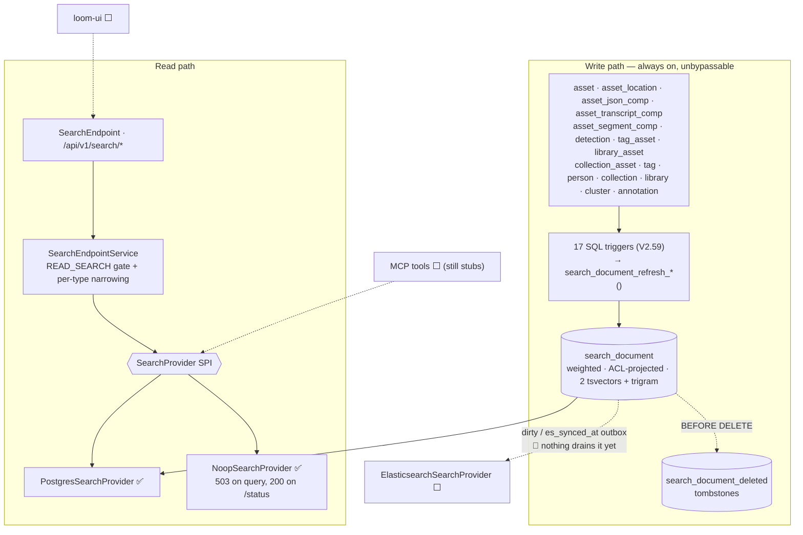

# Search — Technical Specification

> **Audience: AI coding agents.** Lexical (text) search across Loom entities: what is built, how it
> works, and what is deliberately not built yet.
>
> **Scope split.** Vectors / embeddings / hybrid ranking → [SEMANTIC_SEARCH.md](SEMANTIC_SEARCH.md).
> Remaining build order and task IDs → [SEARCH_PLAN.md](SEARCH_PLAN.md). Perceptual fingerprint
> k-NN (a *different* index, on Lucene) → [LUCENE_PLAN.md](LUCENE_PLAN.md). Table/column reference →
> [../../loom/DOMAIN.md](../../loom/DOMAIN.md).

## 0. Status — read this first

🟢 **Lexical search is implemented, wired and green.** The Postgres provider, the `search_document`
index, its triggers, the REST routes, the options, the client methods and 49 tests all exist in the
tree. This is **not** a green-field feature; do not write it again.

🔴 **The stale premise to unlearn:** older revisions of this document opened with "there was no search
feature of any kind". That was true before `V2.57`–`V2.59` landed and is false now.

| Layer | State | Where |
|---|---|---|
| SPI + value types | ✅ built | `loom-shared/api` → `io.metaloom.loom.api.search` |
| `search_document` + `search_document_deleted`, 12 SQL functions, 17 triggers, backfill | ✅ built | `V2.58`, `V2.59` |
| Postgres provider (FTS + `pg_trgm`, ranking, facets, highlights, suggest) | ✅ built | `PostgresSearchProvider` (426 lines) |
| REST: `GET /api/v1/search/{results,assets,suggestions,status}` | ✅ built | `SearchEndpoint`, `SearchEndpointService` |
| Dagger binding, boot-safe fallback | ✅ built | `SearchModule` in `LoomCoreComponent` |
| `LOOM_SEARCH_*` options (10 vars) | ✅ built | `SearchOptions` |
| Client methods + endpoint tests | ✅ built | `SearchMethods`, `LoomHttpClientImpl`, 49 tests |
| **loom-ui** | 🔴 nothing — no `src/api/search.ts`, no search view, no search bar | — |
| **MCP `search_assets` / `search_transcript`** | 🔴 still stubs, still bypass the SPI | `loom/services/mcp` |
| **GraphQL `search` field** | 🔴 absent | `loom.graphqls` |
| **Elasticsearch provider** | 🔴 `loom/services/elasticsearch` has **no `src/`** — `pom.xml` + README only | — |
| **Qdrant** | 🔴 `loom/services/qdrant` has **no `src/`** | — |
| **Semantic / vector** | 🔴 nothing | [SEMANTIC_SEARCH.md](SEMANTIC_SEARCH.md) |
| Demo data, website docs | 🔴 absent | — |

⚠️ **`loom/services/lucene` is NOT a stub and must not be deleted.** It holds
`LuceneSimilarityIndex` + `NoopSimilarityIndex` + a test, and serves the perceptual **fingerprint**
k-NN index ([LUCENE_PLAN.md](LUCENE_PLAN.md)). Lucene is rejected for *lexical* search only (§3).

---

## 1. Architecture



The load-bearing idea: **`search_document` is simultaneously the Postgres index, the pre-assembled
Elasticsearch document, and the outbox that would feed it.** Phase 2 therefore changes a binding, not
a pipeline. The outbox columns are already maintained — they are simply not consumed (§5.3).

---

## 2. The SPI

**`loom-shared/api`, package `io.metaloom.loom.api.search`** — the module that already owns
cross-cutting contracts (`LoomFilterKey`, `SortKey`), so no `loom/db/jooq` → `loom/services/*` edge is
created.

```java
public interface SearchProvider {                 // read side, exactly one bound at runtime
    String name();                                //   "postgres" | "none"
    boolean isAvailable();
    Set<SearchCapability> capabilities();
    SearchResult search(SearchRequest request);
    List<SearchSuggestion> suggest(String prefix, Set<SearchEntityType> types, int limit);
    SearchProviderInfo info();                    //   backs GET /search/status
}

public interface SearchIndexer {                  // write side; Postgres binds NoopSearchIndexer
    void ensureSchema(); void index(SearchDocument doc); void indexBulk(List<SearchDocument> docs);
    void delete(SearchEntityType type, UUID entityUuid); void deleteByAsset(UUID assetUuid);
    IndexStatus status();
}
```

| Enum | Values | Note |
|---|---|---|
| `SearchCapability` | `LEXICAL PHRASE FUZZY HIGHLIGHT FACETS EXACT_TOTAL DEEP_PAGING SEMANTIC HYBRID SUGGEST` | Postgres advertises all **except** `DEEP_PAGING`, `SEMANTIC`, `HYBRID` |
| `SearchEntityType` | `ASSET TRANSCRIPT TAG ANNOTATION PERSON COLLECTION LIBRARY DETECTION SEGMENT CLUSTER` | wire form = lowercase `id()` = `search_document.entity_type` |
| `SearchMode` | `LEXICAL SEMANTIC HYBRID` | non-`LEXICAL` ⇒ 400 `SEARCH_UNSUPPORTED` |
| `SearchSortMode` | `RELEVANCE NEWEST OLDEST NAME SIZE` | built into `ORDER BY` from the enum, never from input |

🔴 **`DETECTION` and `SEGMENT` are enum values with no documents.** `search_document_rebuild()` loops
only asset / tag / person / collection / library / cluster / annotation. Detection labels and segment
titles are folded into the owning asset's `keywords`, so they are *searchable* but never surface as
hits of their own.

`SearchCapability` is what lets the REST layer degrade honestly: Postgres does not advertise
`DEEP_PAGING`, so an offset past `LOOM_SEARCH_MAX_OFFSET` returns 400 naming the provider and the cap
instead of timing out.

### 2.1 Provider selection (`SearchModule`)

`loom/core/.../dagger/SearchModule.java`, registered in `LoomCoreComponent` (line 53).

🔴 **Search must never fail server boot.** `!enabled` → `NoopSearchProvider("Search is disabled…")`;
`provider=postgres` → `PostgresSearchProvider`; `provider=elasticsearch` → `NoopSearchProvider` with
"not implemented yet" (degrade honestly, never silently substitute); any construction exception →
logged + `NoopSearchProvider`. `NoopSearchProvider.search()` throws
`LoomRestException(503, SEARCH_UNAVAILABLE, reason)` while `GET /search/status` still answers **200**
with `available:false`, so a UI can hide its search box rather than render a broken one.

---

## 3. Why Postgres (settled — do not relitigate)

| | **Postgres** ✅ chosen | Lucene ❌ rejected | Elasticsearch ⬜ phase 2 |
|---|---|---|---|
| New service to operate | none | none | 🔴 yes |
| Works in compose / Helm / Testcontainers / CI today | ✅ | ✅ | needs adding everywhere |
| Consistency with the data | ✅ same transaction | ❌ separate local index | ❌ eventual |
| Horizontal scale-out | ❌ shares the DB | 🔴 **per-replica local state** | ✅ |
| Deep paging | ❌ `OFFSET` degrades | limited | ✅ `search_after` |
| Faceting / highlighting | `GROUP BY` / `ts_headline` (expensive) | manual / ✅ | ✅ native |

🔴 **Lucene's rejection is scoped to lexical search.** A lexical index is a queryable system of record
spanning many entities; making it per-replica local state means two pods answer the same query
differently. The **fingerprint** index in [LUCENE_PLAN.md](LUCENE_PLAN.md) is one float vector per
asset derived entirely from `asset_fingerprint_comp` and rebuildable with one REST call, so the same
argument does not apply. Both statements are simultaneously true; §0 records the consequence.

**Why a real table maintained by triggers**, rather than a `UNION ALL` / `VIEW` (both sequentially
scan every OCR and Tika payload, because `asset_json_comp.data` has only a `jsonb_path_ops` index) or
a `MATERIALIZED VIEW` (refresh is all-or-nothing, unusable for a live catalog).

**Why triggers rather than DAO hooks**, in an otherwise DAO-centric codebase: `AbstractJooqDao.storeBatch`
uses `ctx().batchInsert(records)` which bypasses per-element hooks, and `DemoDatabaseInitializer` plus
Flyway backfills bypass the DAO layer entirely. **Triggers are the only layer that cannot be bypassed.**
The cost — silent drift on a trigger bug — is mitigated by every trigger and `search_document_rebuild()`
calling the *same* `search_document_refresh_*()` functions, plus a rebuild-equals-incremental test (§8).

---

## 4. `search_document` — as built

Full DDL: `loom/db/flyway/src/main/resources/db/migration/V2.58__add_search_document.sql` (524 lines,
heavily commented). Column reference: [../../loom/DOMAIN.md](../../loom/DOMAIN.md). Summary only here.

- PK `(entity_type, entity_uuid)`; `asset_uuid` FK → `asset` **`ON DELETE CASCADE`**.
- Weighted text: `title` (A) · `subtitle` (B) · `body` (C) · `keywords` (D), plus `body_truncated`.
- Three **generated, stored** columns — never written by Java, excluded from jOOQ codegen:
  - `text_search` = weighted `to_tsvector('simple', …)` — exact tokens: filenames, ids, codes, non-English words survive.
  - `text_search_en` = weighted `to_tsvector('english', …)` — stemming, so indexed "running" matches a search for "run".
  - `trgm_text` = `left(title || ' ' || subtitle, 2048)` — bounded trigram source for typo tolerance and typeahead.
- Facet/scalar columns: `lang`, `mime_type`, `size`, `time_from`, `sort_date` (= `asset.first_seen`).
- Array columns: `library_uuids`, `space_uuids`, `collection_uuids`, `tag_names` (GIN-indexed).
- Bookkeeping: `index_version`, `synced_at`, `dirty`, `es_synced_at`, `error`.
- 12 indexes: 2 GIN tsvector, 1 GIN trigram, 4 GIN array, btree on `asset_uuid`/`entity_type`/`mime_type`/`sort_date DESC`, partial `(synced_at) WHERE dirty`.

`search_document_deleted (entity_type, entity_uuid, deleted_at)` records deletes that the `asset_uuid`
cascade would otherwise erase before an external indexer could observe them.

⚠️ **Both tsvector configs are queried and the higher rank wins.** A *data-dependent* config
(`to_tsvector(lang::regconfig, body)`) is **not** immutable and therefore cannot be a generated column;
true multilingual support requires a trigger-maintained `tsvector`. `LOOM_SEARCH_TS_CONFIG` plus a
`lang → regconfig` map is the documented upgrade path.

### 4.1 What feeds an `asset` document

| Field | Source | Weight |
|---|---|---|
| `title` | `asset.filename` | A |
| `subtitle` | every `asset_location.path`, deduped, newline-joined | B |
| `body` | `search_extract_json_text()` over all `asset_json_comp` rows **+** all `asset_transcript_comp.transcript_text` | C |
| `keywords` | `mime_type`, `initial_origin`, **tokenized** origin/filename/paths, distinct `detection.label`, `asset_segment_comp.title`, `tag.name`/`tag.collection` | D |
| `tag_names[]` / `library_uuids[]` / `space_uuids[]` / `collection_uuids[]` | `tag_asset` · `library_asset` · `library_asset`→`project_library` · `collection_asset` | — |

**Transcripts get a second document** (`entity_type='transcript'`, `time_from`, `lang`+`model` as
subtitle) so a hit can deep-link to a timestamp; the text is *also* in the asset's `body` so a
transcript match surfaces the asset in a normal search.

`search_extract_json_text(schema_type, data)` is whitelist-driven:

| `schema_type` | producer | extraction |
|---|---|---|
| `ocr` | `OCRNode` | `data->>'text'` |
| `tika` | `TikaNode` | `data->>'content'` |
| `metadata` | `MetadataNode` | title, description, publisher, coverage, rights, the `creator`/`contributor`/`subject` arrays, the rights holder and credit, and the IPTC place (V2.65) |
| `caption` | `CaptioningNode` | `data->>'caption'` |
| `video-caption` | `CaptioningNode` | `caption` + `$.scenes[*].caption` |
| `face-description` | `FacedescriptionNode` | `$.faces[*].description` |
| `llm` | `LLMNode` | `coalesce(text, answer, summary, description, search_jsonb_all_text(data))` |
| `vlm` | `VlmNode` | `coalesce(text, search_jsonb_all_text(data))` |
| anything else (incl. `quality`) | — | skipped, never guessed at |

The `metadata` branch indexes the **authored** half of the envelope only. Camera settings, GPS
coordinates and the raw key/value block are deliberately excluded: they are numbers and vendor tokens
that would dilute the tsvector without ever being typed into a search box.

🔴 `search_jsonb_all_text()` (recursive string-leaf walker, leaves > 2 chars) is applied **only** to
`llm`/`vlm`, whose payloads are prompt-shaped. Applying it universally would index model names, UUIDs
and enum values as searchable text and wreck ranking.

🔴 **Body cap.** A `tsvector` is limited to 1 MB / 16383 lexeme positions, so `search_body_cap()`
truncates at 512 KB and sets `body_truncated`. ⚠️ **The cap is hardcoded in SQL** —
`LOOM_SEARCH_BODY_MAX_BYTES` mirrors it for the Java side but does **not** drive the trigger; changing
one without the other silently desynchronises them.

### 4.2 Triggers (`V2.59`)

- `search_tg_refresh_by_asset_uuid()` — one generic function on `asset_location`, `asset_json_comp`,
  `asset_transcript_comp`, `asset_segment_comp`, `detection`, `tag_asset`, `library_asset`,
  `collection_asset`. Reads `asset_uuid` via `to_jsonb(OLD/NEW)`, refreshes old and new.
- `search_tg_refresh_asset()` on `asset` (INSERT/UPDATE only — DELETE is the FK cascade).
- `search_tg_refresh_entity('<type>')` on `tag`, `person`, `collection`, `library`, `cluster`, `annotation`.
- `search_tg_tag_fanout()` — a tag rename refreshes every asset carrying it (bounded fan-out).
- `search_tg_tombstone()` / `search_tg_untombstone()` maintain `search_document_deleted`.
- The migration ends with `SELECT search_document_rebuild();` as the backfill.

🔴 **No trigger builds a document itself.** That is the entire drift defence — the incremental path
and `search_document_rebuild()` share one implementation, which the rebuild-equals-incremental test
asserts (§8).

### 4.3 What is populated but unread

| Thing | Written by | Read by |
|---|---|---|
| `library_uuids` / `space_uuids` / `collection_uuids` | triggers ✅ | **partly** — the provider filters on them for explicit `?library=`/`?space=`/`?collection=`, but the *ACL* path (`SearchRequest.allowedLibraryUuids/allowedSpaceUuids`) is never populated, so row-level narrowing is dead code awaiting §7.2 |
| `dirty`, `es_synced_at`, `search_document_deleted` | triggers ✅ | 🔴 **nothing in Java.** They are an outbox for an external index that does not exist yet; the Postgres provider queries the table directly and reports `dirtyCount = 0` by construction |
| `asset_doc_comp.doc_plain_text` + its GIN tsvector | 🔴 **nobody** — no Cortex node calls `createDocComp`; OCR writes `asset_json_comp schema_type='ocr'`, Tika `='tika'` | 🔴 nothing, and search deliberately does **not** read it (`V2.58` records why). If nodes ever graduate to writing it, the change is one branch in `search_document_refresh_asset` |

---

## 5. REST surface

| Path | Method | State | Notes |
|---|---|---|---|
| `/api/v1/search/results` | GET | ✅ | Cross-entity ranked search, facets, highlights |
| `/api/v1/search/assets` | GET | ✅ | Same response shape, forced `types={ASSET}`; ⚠️ it returns `SearchResultResponse`, **not** `AssetResponse` objects |
| `/api/v1/search/suggestions` | GET | ✅ | Typeahead: `trgm_text ILIKE 'q%' OR trgm_text % q`, ordered by `similarity()`; errors are swallowed and return `[]` |
| `/api/v1/search/status` | GET | ✅ | Singleton status resource (`HealthEndpoint` sets the precedent); still 200 when unavailable |
| `/api/v1/search/results` | POST | ⬜ | Body-encoded long queries |
| `/api/v1/search/facets` | GET | ⬜ | Facets already exist as `?facets=` on `/results` (`mime_type`, `entity_type`, `lang`) |
| `/api/v1/search/reindexes` | POST | ⬜ | Admin rebuild; `NoopSearchIndexer.rebuild()` exists but is not exposed over REST |

`search` is a **namespace with no handler mounted on it** — every route below it is plural, as
[../../guidelines/CODING.md](../../guidelines/CODING.md) requires. `addSearchRoute(...)` sits next to
`addListRoute` in `AbstractEndpoint` (line 62).

**Parameters** — `SearchQueryParameterKey` (`loom-shared/rest-model`), deliberately **separate** from
`QueryParameterKey`: `q, types, mode, limit, offset, cursor, sort, highlight, mime, library, space,
collection, tag, from, to, lang, profile, facets`. Bound by `SearchParameters` in `loom/services/rest`
— ⚠️ same package name (`io.metaloom.loom.rest.parameter`), different module, matching where
`AbstractQueryParameters` lives.

**Paging.** Keyset seek is dropped for `/search/*`: relevance ordering cannot be expressed as
`seek(Field<UUID>)`. `LIMIT/OFFSET` with `offset` capped at `LOOM_SEARCH_MAX_OFFSET`. `totalHits` comes
from `count(*) OVER ()` in the same query — exact, `totalExact=true`. `nextCursor` is in the envelope
but is always `null` under Postgres; **clients must prefer `nextCursor` when present and fall back to
`offset`**, so an ES swap needs no API change.

**Query parsing.** 🔴 `websearch_to_tsquery` only — the sole variant that parses `"quoted phrase"`,
`or`, `-negation` *without throwing on malformed input*. `to_tsquery` raises a syntax error on a stray
`&`; `plainto_tsquery` cannot express phrases. This one choice eliminates a whole class of 500s.

**Ranking.** `greatest(ts_rank_cd(text_search, …, 32), ts_rank_cd(text_search_en, …, 32)) +
trigramWeight * similarity(trgm_text, q)`. The `32` flag is `rank/(rank+1)`, bounding the score into
`[0,1)` so it is commensurable with `similarity()`; without it the blend is meaningless.

**Highlighting.** 🔴 `ts_headline` re-parses the original text, is O(document size) and cannot use an
index — so `enrich()` runs it **per returned hit only**, in a second pass, never inside the ranking
query. It also derives `matchedIn` (`title`/`subtitle`/`body`/`keywords`/`fuzzy`). Failures are logged
and swallowed: losing a snippet must not lose the results.

---

## 6. Permissions

Model: [../permissions/PERMISSIONS.md](../permissions/PERMISSIONS.md). Search-specific decisions only.

**Gate:** `Permission.READ_SEARCH` (added by `V2.57`, present in the `Permission` enum). **Narrowing:**
requested types are filtered against existing read permissions —

| type | requires | | type | requires |
|---|---|---|---|---|
| `ASSET`, `TRANSCRIPT`, `SEGMENT` | `READ_ASSET` | | `COLLECTION` | `READ_COLLECTION` |
| `TAG` | `READ_TAG` | | `LIBRARY` | `READ_LIBRARY` |
| `ANNOTATION` | `READ_ANNOTATION` | | `DETECTION` | `READ_DETECTION` |
| `PERSON` | `READ_PERSON` | | `CLUSTER` | `READ_CLUSTER` |

Dropped types are named in `_metainfo.warnings`; an empty surviving set is **403**, not an empty
result — silently returning fewer types is indistinguishable from an empty index. `/search/assets`
additionally requires `READ_ASSET` outright.

Narrowing needs a **non-throwing** check, which `checkPerm` (throw-only) cannot give: `LoomRoutingContext.permissions()`
returns `Future<Predicate<Permission>>`, request-scoped. ✅ built.

### 6.1 Row-level ACL — still absent, by design

🔴 Nothing in Loom is row-level permission aware: `AbstractCRUDEndpointService.list()` does one global
`checkPerm(READ_X)` then `dao().loadPage(...)` with no user context, and the `resource` column on
`role_permission`/`user_permission`/`token_permission` is written as `"all"` and never read. A global
gate therefore puts search at exact parity with the rest of the API. `SearchRequest.userUuid` is
populated from day 1 and the array columns exist, so switching on row-level ACL is a
`WHERE library_uuids && :allowed` clause — **no reshaping, no reindex**.

The reindex triggers row-level ACL *will* need: `library_asset` / `collection_asset` change ⇒ that
asset's document family (already triggered ✅); `project_library` change ⇒ 🔴 every asset in that
library, which needs a batched job, not a trigger (⬜); group/role/space **membership** change ⇒
**none**, it is a query-time set. That last row is why the fan-out is bounded.

---

## 7. Configuration

🔴 **These ten variables are all that exist.** `io.metaloom.loom.api.options.SearchOptions`, wired into
`LoomOptions` (field, getter, setter, `overrideWithEnv()`, `errors.nested("search", search)`). Any
`LOOM_SEARCH_ES_*`, `LOOM_SEARCH_SEMANTIC_*`, `LOOM_SEARCH_RRF_K` or `LOOM_SEARCH_SWEEP_INTERVAL_MS`
you find referenced elsewhere is **speculative and unimplemented**.

| Env var | Default | Meaning |
|---|---|---|
| `LOOM_SEARCH_ENABLED` | `true` | Master switch; `false` ⇒ `NoopSearchProvider`, queries 503 |
| `LOOM_SEARCH_PROVIDER` | `postgres` | `postgres` \| `elasticsearch` (⇒ noop) \| `none`; anything else fails validation |
| `LOOM_SEARCH_DEFAULT_LIMIT` | `25` | Must be ≥ 1 and ≤ max limit |
| `LOOM_SEARCH_MAX_LIMIT` | `100` | Caps both `/results` and `/suggestions` |
| `LOOM_SEARCH_MAX_OFFSET` | `1000` | Deep-paging guard; exceeding ⇒ 400 `SEARCH_UNSUPPORTED` |
| `LOOM_SEARCH_HIGHLIGHT_ENABLED` | `true` | `ts_headline` is expensive (§5) |
| `LOOM_SEARCH_TRIGRAM_THRESHOLD` | `0.3` | `pg_trgm.similarity_threshold`; must be in `[0,1]` |
| `LOOM_SEARCH_TRIGRAM_WEIGHT` | `0.35` | Contribution of `similarity()` to the blended score |
| `LOOM_SEARCH_BODY_MAX_BYTES` | `524288` | ⚠️ Java-side mirror only — the trigger cap is hardcoded in `search_body_cap()` |
| `LOOM_SEARCH_TS_CONFIG` | `english` | regconfig for the stemmed query side |

---

## 8. Test Setup

🔴 **`./setup-pool.sh` after every new Flyway migration** (runs `io.metaloom.loom.test.PoolSetupRunner`
in `loom/fixture`). Skip it and every DAO and endpoint test fails against the old schema, confusingly.

🔴 **jOOQ codegen exclusion is `.*\.text_search.*|.*\.trgm_text`** (`loom/db/jooq/pom.xml:250`) and must
stay that way. `JooqSearchDocument` currently carries 22 fields and **zero** of the three generated
columns — jOOQ has no `tsvector` binding, and a generated column that reaches an `INSERT` fails.

**Querying the excluded columns** — address them by name in plain SQL, exactly as
`AssetComponentDaoImpl` already does. The provider builds every predicate as a bind parameter; the only
interpolated SQL comes from enums it owns (`orderBy`, facet column whitelist, threshold).

### 8.1 What exists — 49 tests, all green

| Class | Path | Tests | Covers |
|---|---|---|---|
| `SearchDocumentSourceTest` | `loom/db/jooq/src/test/java/io/metaloom/loom/db/jooq/search/` | 15 | one method per source: filename, `initial_origin`, transcript, transcript-gets-its-own-hit, ocr, tika, caption, video-caption scene captions, llm answer, face-description, ingested `metadata` (title, description, the keyword and creator **arrays**), `metadata` camera settings **not** indexed, `quality` **not** indexed, tag by name, asset by its tag name |
| `SearchQueryBehaviourTest` | same | 15 | stemming, phrase, negation, typo tolerance, title outranks body, malformed queries do not error, blank/oversized rejected, offset cap, `SEMANTIC` mode rejected not downgraded, type filter, `totalHits` counts all matches, stable paging, highlighting, suggest |
| `SearchDocumentLifecycleTest` | same | 5 | insert/update/delete lifecycle, **delete-cascade** (only the deleted asset's documents), **rebuild-equals-incremental**, oversized body truncated but still indexed |
| `SearchEndpointTest` | `loom/core/src/test/java/io/metaloom/loom/core/endpoint/test/` | 16 | extends `AbstractEndpointTest` (not the CRUD base); finds an asset, `/assets` restricts, suggestions, status, paging, highlighting, missing `READ_SEARCH` ⇒ 403, **type narrowing**, `/assets` needs `READ_ASSET`, only-`READ_SEARCH` ⇒ 403, missing/oversized `q` ⇒ 400, offset cap, unsupported mode, unknown type, malformed queries |

⚠️ Grant test permissions via **role → group → user**, never a direct `user_permission` row — its PK is
`user_uuid`, so a user can hold exactly one.
⚠️ The test-DB pool provisions in increments of 10 (max 60); a class with 33 methods outruns it. That
is why the DB-side tests are split into three classes of ≤ 15.

### 8.2 Test gaps

- ⬜ `SearchDocumentCodegenTest` (assert `JooqSearchDocument` never regains the generated columns) — **does not exist**.
- ⬜ No coverage for `annotation`, `person`, `collection`, `library`, `cluster` document sources, nor for `detection.label` / `asset_segment_comp.title` folding into `keywords`.
- ⬜ No demo data in `DemoDatabaseInitializer`, no loom-ui vitest/Playwright tests (there is no UI).

---

## 9. Key Classes Reference

| Class | Package / module | State |
|---|---|---|
| `SearchProvider`, `SearchIndexer`, `SearchCapability`, `SearchMode`, `SearchSortMode`, `SearchEntityType` | `io.metaloom.loom.api.search` (`loom-shared/api`) | ✅ |
| `SearchRequest`, `SearchResult`, `SearchHit`, `SearchSuggestion`, `SearchDocument`, `SearchProviderInfo`, `FacetBucket` | same | ✅ |
| `SearchOptions` | `io.metaloom.loom.api.options` (`loom-shared/api`) | ✅ 10 env vars |
| `PostgresSearchProvider` | `io.metaloom.loom.db.jooq.search` (`loom/db/jooq`) | ✅ 426 lines |
| `NoopSearchProvider` / `NoopSearchIndexer` | same | ✅ (`rebuild()` calls `search_document_rebuild()`) |
| `SearchModule` | `io.metaloom.loom.core.dagger` (`loom/core`) | ✅ in `LoomCoreComponent:53` |
| `SearchEndpoint` | `io.metaloom.loom.rest.endpoint.impl` (`loom/services/rest`) | ✅ 4 GET routes |
| `SearchEndpointService` | `io.metaloom.loom.rest.service.impl` (`loom/services/rest`) | ✅ gate + narrowing |
| `SearchQueryParameterKey` | `io.metaloom.loom.rest.parameter` (`loom-shared/rest-model`) | ✅ 18 keys |
| `SearchParameters` | `io.metaloom.loom.rest.parameter` (**`loom/services/rest`**) | ✅ ⚠️ same package, other module |
| `SearchResultResponse`, `SearchHitResponse`, `SearchMetaInfo`, `SearchSuggestion(List)Response`, `SearchStatusResponse`, `SearchFacetResponse`, `SearchExamples` | `io.metaloom.loom.rest.model.search` (`loom-shared/rest-model`) | ✅ |
| `SearchMethods` | `io.metaloom.loom.client.common.method` | ✅ in `ClientMethods:36`, impl `LoomHttpClientImpl:1537+` |
| `JooqSearchDocument(Record)`, `JooqSearchDocumentDeleted(Record)` | `loom/db/jooq/src/jooq/java/...tables` | ✅ generated |
| `ElasticsearchSearchProvider`, `ElasticsearchIndexSyncService` | `loom/services/elasticsearch` | ⬜ module has **no `src/`** |
| `LuceneSimilarityIndex`, `NoopSimilarityIndex` | `io.metaloom.loom.similarity(.lucene)` (`loom/services/lucene`) | ✅ but **fingerprint k-NN, not search** — [LUCENE_PLAN.md](LUCENE_PLAN.md) |

## 10. Conventions and Gotchas

| Area | Gotcha |
|---|---|
| **Status of this feature** | 🔴 Search **is built**. Before "implementing search", read §0 and `git log -- loom/db/flyway/.../V2.5[789]*`. |
| **`loom/services/lucene`** | 🔴 Do **not** delete it. It is the fingerprint k-NN index, not a lexical-search stub (§0, §3). |
| **jOOQ codegen** | 🔴 `<excludes>` must stay `.*\.text_search.*\|.*\.trgm_text`. Narrower and `tsvector` fields regenerate as `Object` and can reach an `INSERT`. |
| **Codegen environment** | 🔴 `generate.sh` re-runs every migration in a `postgres:latest` Testcontainer. `pg_trgm` ships with that image; `pgvector` does **not** ([SEMANTIC_SEARCH.md](SEMANTIC_SEARCH.md)). |
| **Test pool** | 🔴 `./setup-pool.sh` after every migration. Also: pool provisions in tens (max 60) — keep test classes ≤ ~15 methods. |
| **Duplicate `LoomRestErrorCode`** | 🔴 Two classes, same package `io.metaloom.loom.api.error`, in `loom-shared/api` **and** `loom/common`. `loom/db/jooq` resolves the `loom/common` copy. Add any new code to **both** (`SEARCH_UNAVAILABLE`/`SEARCH_UNSUPPORTED` are in both). |
| **jOOQ plain SQL and `%`** | 🔴 `%` is not special in jOOQ plain SQL — `%%` reaches Postgres literally and fails. Use one `%` and cast: `trgm_text % ?::text`. |
| **`SET LOCAL` needs a transaction** | 🔴 `pg_trgm.similarity_threshold` is a session GUC; `SET LOCAL` outside a transaction is discarded. `runSearch()` wraps both in one `transactionResult`, which also pins the connection and leaves the pool unmutated. |
| **Bind order is textual** | ⚠️ With `ctx.fetch(sql, binds)` binds are positional in the order `?` appears **in the SQL string** — the score expression in the SELECT list precedes every WHERE bind. |
| **Query parsing** | 🔴 `websearch_to_tsquery` only. `to_tsquery` 500s on a stray `&`. |
| **`ts_headline`** | 🔴 O(document size), unindexable. Only ever for the returned page. |
| **Body cap** | 🔴 512 KB, and it is **hardcoded in `search_body_cap()`** — `LOOM_SEARCH_BODY_MAX_BYTES` does not drive the trigger (§7). |
| **Path tokenization** | 🔴 Postgres classifies `/archive/expedition7/clip.mp4` as one `file` token, so no segment is searchable alone. `search_tokenize_path()` translates `/\_-.` to spaces into `keywords`; the raw path stays in `subtitle` for exact match. |
| **Enum migration** | 🔴 `ALTER TYPE loom_permission ADD VALUE` cannot be *used* in the migration that adds it (Flyway wraps each in one transaction). `V2.57` is standalone for exactly this reason. |
| **Filter operators** | 🔴 The external lhs-filter `Operation` enum has only `EQUALS/NOT_EQUALS/AFTER/BEFORE/RANGE/GREATER/LESSER` — no `LIKE`/`CONTAINS`. `?filter=` can never carry the query term; that is why `q` is first-class. |
| **Keyset vs. relevance** | ⚠️ `seek(Field<UUID>)` cannot express a relevance ordering. `/search/*` uses capped offset; CRUD list routes keep keyset. |
| **`?sort=`** | ⚠️ Pre-existing bug: `AbstractJooqDao.getField(SortKey)` casts any column to `Field<UUID>`, so `?sort=name` emits `WHERE name > '<uuid>'::uuid`. Already broken for every non-UUID column; out of scope, but it blocks "sort list results by name". |
| **`asset_doc_comp`** | ⚠️ FTS index, zero rows, no producer. Deliberately not a search source (§4.3). |
| **`QueryParameterKey`** | ⚠️ Never add `q` there — `addListRoute` iterates its values and would document `q` on ~40 routes that ignore it. Use `SearchQueryParameterKey`. |
| **MCP has no auth** | ⚠️ The MCP server bypasses REST auth and calls DAOs directly; `descriptor().permissions()` is advisory. Per-type narrowing cannot apply there when the tools are finally moved onto the SPI. |
| **Constructor changes** | ⚠️ Clean-rebuild `loom/core` after endpoint constructor changes, before `setup-pool.sh`, or Dagger factories throw `NoSuchMethodError`. |

## 11. Where do I find …?

| Need | Look here |
|---|---|
| Remaining build order, task IDs, build-order rules | [SEARCH_PLAN.md](SEARCH_PLAN.md) |
| Vector / embedding / hybrid search | [SEMANTIC_SEARCH.md](SEMANTIC_SEARCH.md) |
| Fingerprint similarity (the *other* index, on Lucene) | [LUCENE_PLAN.md](LUCENE_PLAN.md) |
| `search_document` column reference, schema-wide open items | [../../loom/DOMAIN.md](../../loom/DOMAIN.md) |
| Full DDL, extraction + refresh functions | `loom/db/flyway/src/main/resources/db/migration/V2.58__add_search_document.sql` |
| Triggers + backfill | `…/V2.59__add_search_triggers.sql` |
| `READ_SEARCH` permission | `…/V2.57__add_search_permission.sql`, `loom/db/api/.../perm/Permission.java:219` |
| The query builder, ranking, highlighting, facets | `loom/db/jooq/src/main/java/io/metaloom/loom/db/jooq/search/PostgresSearchProvider.java` |
| Routes and the permission gate | `loom/services/rest/.../endpoint/impl/SearchEndpoint.java`, `.../service/impl/SearchEndpointService.java` |
| Provider binding / boot-safety | `loom/core/src/main/java/io/metaloom/loom/core/dagger/SearchModule.java` |
| Env vars | `loom-shared/api/.../options/SearchOptions.java` |
| Client methods | `loom-client/common/.../method/SearchMethods.java`, `loom-client/rest/.../LoomHttpClientImpl.java:1537+` |
| Tests | `loom/db/jooq/src/test/java/io/metaloom/loom/db/jooq/search/`, `loom/core/src/test/java/.../SearchEndpointTest.java` |
| Highest migration | `V2.63__library_storage_pool.sql` — verify before claiming a version |
| Permission model / REST conventions | [../permissions/PERMISSIONS.md](../permissions/PERMISSIONS.md), [../../loom/RESTAPI.md](../../loom/RESTAPI.md), [../../guidelines/CODING.md](../../guidelines/CODING.md) |
| Node → text mapping | [../pipeline-nodes/NODES.md](../pipeline-nodes/NODES.md) |

## 12. Progress Assessment

**Phase 0 — prerequisites** ✅
- [x] `Page.totalCount` + `AbstractJooqDao` count + `ModelBuilder` fix (3-arg `Page` ctor, `TOTAL_COUNT_UNKNOWN`, `ctx.fetchCount(query)` so `fetchStreamInto` keeps working)
- [x] Regression sweep of the ~20 list endpoints; `ListResponseModelAssert.hasSize()`/`hasTotalCount()` split
- [x] `LoomRoutingContext.permissions()` — request-scoped `Future<Predicate<Permission>>`
- [x] `SEARCH_UNAVAILABLE` / `SEARCH_UNSUPPORTED` added to **both** copies of `LoomRestErrorCode`
- [ ] Orphaned `loom-ui/src/{Dashboard,User,Content}` trees still present (unreachable from `AppShell`); untouched because no UI work landed

**Phase 1 — Postgres lexical search** — backend ✅ complete, consumers ⬜
- [x] `io.metaloom.loom.api.search` SPI + value types
- [x] `SearchOptions` (10 env vars) + `LoomOptions` wiring + validation
- [x] `V2.57` `READ_SEARCH` · `V2.58` `pg_trgm` + tables + 12 functions · `V2.59` 17 triggers + backfill
- [x] jOOQ `<excludes>` widened, codegen regenerated, `JooqSearchDocument` clean
- [x] `PostgresSearchProvider`, `NoopSearchProvider`, `NoopSearchIndexer` (+ `rebuild()`)
- [x] `SearchEndpoint` (4 GET routes) + `SearchEndpointService` + `SearchModule` + `addSearchRoute`
- [x] `SearchQueryParameterKey`, `SearchParameters`, `rest.model.search.*`, `SearchExamples`
- [x] `SearchMethods` + `LoomHttpClientImpl` + `ClientMethods` registration
- [x] 49 tests green, incl. delete-cascade, rebuild-equals-incremental, type-narrowing permission case
- [ ] `SearchDocumentCodegenTest` — never written (§8.2)
- [ ] Source coverage for annotation / person / collection / library / cluster documents (§8.2)
- [ ] `/search/suggestions` ranks by trigram similarity only — no dedicated prefix index
- [ ] `/search/assets` returns `SearchResultResponse`, not `AssetResponse` — a UI grid cannot render it unchanged
- [ ] `DETECTION` and `SEGMENT` documents are not emitted; the labels/titles live in the owning asset's `keywords`
- [ ] Demo data (`DemoDatabaseInitializer`) not seeded with search fixtures
- [ ] Customer-facing docs under `website/content/english/docs/` not written
- [ ] MCP `SearchAssetsTool` (ignores `query`/`mimeType`, calls `loadPage(null, limit, null, null, null)`) and `SearchTranscriptTool` (hardcoded string) still stubs
- [ ] GraphQL `search` field not added
- [ ] loom-ui: no `api/search.ts`, no search bar, no search view
- [ ] `asset_doc_comp` remains deliberately unread (§4.3)

**Phase 2 — Elasticsearch / OpenSearch** — not started
- [x] The outbox already exists and is maintained: `dirty` / `synced_at` / `es_synced_at` + `search_document_deleted`
- [ ] Nothing consumes it — `loom/services/elasticsearch` has **no `src/`**; `LOOM_SEARCH_PROVIDER=elasticsearch` binds `NoopSearchProvider`
- [ ] No `LOOM_SEARCH_ES_*` options exist yet
- [ ] Everything else — see [SEARCH_PLAN.md](SEARCH_PLAN.md) Phase 2, gated on the P2-1 spike
- [ ] ⚠️ Correction to older plans: **do not delete `loom/services/lucene`** — it now serves fingerprint k-NN

**Phase 3 — semantic / hybrid** — not started, see [SEMANTIC_SEARCH.md](SEMANTIC_SEARCH.md). `loom/services/qdrant` has no `src/`.

**Row-level ACL** — not started
- [x] `library_uuids` / `space_uuids` / `collection_uuids` populated and GIN-indexed; `SearchRequest.userUuid` carried
- [ ] `allowedLibraryUuids` / `allowedSpaceUuids` never populated — the narrowing clause in `appendFilters` is dead code
- [ ] `project_library` fan-out needs a batched reindex job (not a trigger)

**Known gaps search exposes but does not own**
- [ ] `?sort=` broken for non-UUID columns (§10)
- [ ] `asset_doc_comp` has an FTS index and no producer
- [ ] MCP bypasses REST authorization entirely
- [ ] `user_permission` allows only one direct grant per user
- [ ] Two `LoomRestErrorCode` classes share a package
- [ ] `tag_asset.asset_uuid` has no `ON DELETE CASCADE`, so a tagged asset cannot be deleted — shapes the delete-cascade test

---

_Git HEAD revision: `499f71f7`_
_Last updated: 2026-08-01 (rewritten against the shipped implementation; the "no search exists" premise was stale)_
