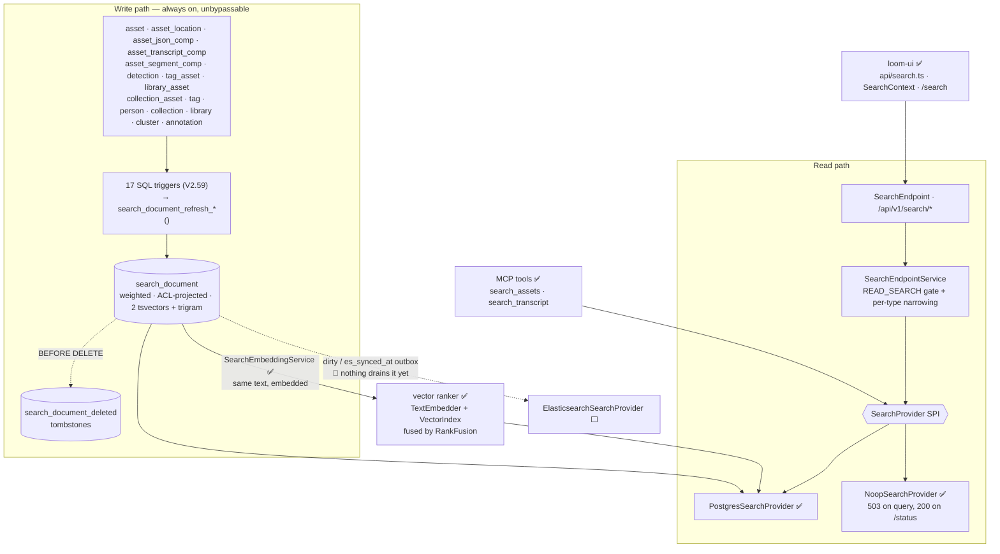

# Search — Technical Specification

> **Audience: AI coding agents.** Lexical (text) search across Loom entities: what is built, how it
> works, and what is deliberately not built yet.
>
> **Scope split.** Vectors / embeddings / hybrid ranking → [SEMANTIC_SEARCH.md](SEMANTIC_SEARCH.md).
> Remaining work items and task IDs → [../../tasks/SEARCH_TASKS.md](../../tasks/SEARCH_TASKS.md).
> Elasticsearch (Phase 2) — the deferral decision and its tasks → [../../tasks/SEARCH_ELASTICSEARCH.md](../../tasks/SEARCH_ELASTICSEARCH.md).
> Administering the indices (`/search-indices`, reindex jobs) → [SEARCH_INDEX_ADMIN.md](SEARCH_INDEX_ADMIN.md).
> Perceptual fingerprint k-NN (a *different* index, on Lucene) → [SEARCH_LUCENE.md](../../loom/SEARCH_LUCENE.md).
> Table/column reference → [../../loom/DOMAIN.md](../../loom/DOMAIN.md).

## 0. Status — read this first

🟢 **Lexical search is implemented, wired and green.** The Postgres provider, the `search_document`
index, its triggers, the REST routes, the options, the client methods, the whole loom-ui consumer and
84 tests (55 DB-side, 16 endpoint, 13 fusion) all exist in the tree. This is **not** a green-field
feature; do not write it again.

🔴 **The stale premise to unlearn:** older revisions of this document opened with "there was no search
feature of any kind". That was true before `V2.57`–`V2.59` landed and is false now.

| Layer | State | Where |
|---|---|---|
| SPI + value types | ✅ built | `loom-shared/api` → `io.metaloom.loom.api.search` |
| `search_document` + `search_document_deleted`, 12 SQL functions, 17 triggers, backfill | ✅ built | `V2.58`, `V2.59` |
| Postgres provider (FTS + `pg_trgm`, ranking, facets, highlights, suggest, **RRF fusion**) | ✅ built | `PostgresSearchProvider` |
| REST: `GET /api/v1/search/{results,assets,suggestions,status}` | ✅ built | `SearchEndpoint`, `SearchEndpointService` |
| Dagger binding, boot-safe fallback | ✅ built | `SearchModule` in `LoomCoreComponent` |
| `LOOM_SEARCH_*` options (10 lexical + 15 semantic) | ✅ built | `SearchOptions` |
| Client methods + endpoint tests | ✅ built | `SearchMethods`, `LoomHttpClientImpl`, 99 tests |
| Index administration (`/search-indices`, reindex jobs) | ✅ built | `SearchIndexEndpoint` — [SEARCH_INDEX_ADMIN.md](SEARCH_INDEX_ADMIN.md) |
| **loom-ui** | ✅ built — client, `/search` view, global sidebar field, capability gating | `src/api/search.ts`, `features/search/`, `SearchContext` |
| **MCP `search_assets` / `search_transcript`** | ✅ built — both query the SPI; no per-type narrowing (§2.2) | `loom/services/mcp`, [../../loom/MCP.md](../../loom/MCP.md) §5.1 |
| **GraphQL `search` field** | ✅ built — one `Query.search` field on the SPI, **with** per-type narrowing (§2.2) | `loom.graphqls`, `SearchWiring` |
| **Elasticsearch provider** | 🔴 `loom/services/elasticsearch` has **no `src/`** — `pom.xml` + README only. **Assessed 2026-08-16 and deliberately deferred** | [../../tasks/SEARCH_ELASTICSEARCH.md](../../tasks/SEARCH_ELASTICSEARCH.md) §0 |
| **Qdrant** | 🔴 `loom/services/qdrant` has **no `src/`** | — |
| **Semantic / hybrid (text)** | ✅ built, **off by default** — `LOOM_SEARCH_SEMANTIC_ENABLED`. RRF over the lexical ranker plus embeddings of the same documents | [SEMANTIC_SEARCH.md](SEMANTIC_SEARCH.md) |
| **Semantic (text→image, CLIP)** | 🔴 nothing | [SEMANTIC_SEARCH.md](SEMANTIC_SEARCH.md) §4 |
| Website docs | ✅ built | `website/content/english/docs/ui/index.adoc` — "Search" section |
| Demo fixtures | ✅ built | `DemoDatabaseInitializer` — the shared magic string is **`quarterly`**, which is what `e2e/search-backend.spec.ts` queries. `aurora` survives only as the OpenAPI example in `SearchExamples`. The rest of the demo corpus is indexed regardless, because triggers cannot be bypassed (§4) |

⚠️ **`loom/services/lucene` is NOT a stub and must not be deleted.** It holds
`LuceneSimilarityIndex` + `NoopSimilarityIndex` + a test, and serves the perceptual **fingerprint**
k-NN index ([SEARCH_LUCENE.md](../../loom/SEARCH_LUCENE.md)). Lucene is rejected for *lexical* search only (§3).

---

## 1. Architecture



The load-bearing idea: **`search_document` is simultaneously the Postgres index, the pre-assembled
Elasticsearch document, and the outbox that would feed it.** Phase 2 therefore changes a binding, not
a pipeline. The outbox columns are already maintained — they are simply not consumed (§5.3).

It turned out to be one thing more: **the semantic corpus.** The vectors behind `SearchMode.SEMANTIC`
are embeddings of this same assembled text, so the two rankers share one source and one freshness
signal — a late-arriving transcript refreshes both through the same trigger. That path is designed in
[SEMANTIC_SEARCH.md](SEMANTIC_SEARCH.md); everything in *this* document describes the lexical ranker, which is unchanged
by it and remains the default and the only mode a stock deployment serves.

---

## 2. The SPI

**`loom-shared/api`, package `io.metaloom.loom.api.search`** — the module that already owns
cross-cutting contracts (`LoomFilterKey`, `SortKey`), so no `loom/db/jooq` → `loom/services/*` edge is
created.

```java
public interface SearchProvider {                 // read side, exactly one bound at runtime
    String name();                                //   "postgres" | "none"
    boolean isAvailable();
    Set<SearchCapability> capabilities();
    SearchResult search(SearchRequest request);
    List<SearchSuggestion> suggest(String prefix, Set<SearchEntityType> types, int limit);
    SearchProviderInfo info();                    //   backs GET /search/status
}

public interface SearchIndexer {                  // write side; Postgres binds NoopSearchIndexer
    void ensureSchema(); void index(SearchDocument doc); void indexBulk(List<SearchDocument> docs);
    void delete(SearchEntityType type, UUID entityUuid); void deleteByAsset(UUID assetUuid);
    IndexStatus status();
}
```

| Enum | Values | Note |
|---|---|---|
| `SearchCapability` | `LEXICAL PHRASE FUZZY HIGHLIGHT FACETS EXACT_TOTAL DEEP_PAGING SEMANTIC HYBRID SUGGEST` | Postgres never advertises `DEEP_PAGING`. It advertises `SEMANTIC` and `HYBRID` **only** when semantic search is enabled and both an embedding host and a vector index answer — see below |
| `SearchEntityType` | `ASSET TRANSCRIPT TAG ANNOTATION PERSON COLLECTION REMIX LIBRARY DETECTION SEGMENT CLUSTER` | wire form = lowercase `id()` = `search_document.entity_type`. `REMIX` added by V2.103 |
| `SearchMode` | `LEXICAL SEMANTIC HYBRID` | non-`LEXICAL` ⇒ 400 `SEARCH_UNSUPPORTED` **unless the matching capability is advertised** ([SEMANTIC_SEARCH.md](SEMANTIC_SEARCH.md)) |
| `SearchSortMode` | `RELEVANCE NEWEST OLDEST NAME SIZE` | built into `ORDER BY` from the enum, never from input |

🔴 **`DETECTION` and `SEGMENT` are enum values with no documents.** `search_document_rebuild()` loops
only asset / tag / person / collection / library / cluster / annotation. Detection labels and segment
titles are folded into the owning asset's `keywords`, so they are *searchable* but never surface as
hits of their own.

`SearchCapability` is what lets the REST layer degrade honestly: Postgres does not advertise
`DEEP_PAGING`, so an offset past `LOOM_SEARCH_MAX_OFFSET` returns 400 naming the provider and the cap
instead of timing out.

🔴 **`capabilities()` is computed per call, not a constant.** The lexical set is fixed, but `SEMANTIC`
and `HYBRID` depend on two things outside the provider — an embedding host that answers and an open
vector index — and either can fail at runtime. Recomputing is what makes `/search/status` tell the
truth after the embedding host goes down: the capability disappears, the UI's mode toggle disappears
with it, and the mode starts answering 400 again instead of failing. A cached set would leave the UI
offering a mode that no longer works. The method must never throw for the same reason `isAvailable()`
must not — the status route calls it precisely when something is broken.

### 2.1 Provider selection (`SearchModule`)

`loom/core/.../dagger/SearchModule.java`, registered in `LoomCoreComponent` (line 53).

🔴 **Search must never fail server boot.** `!enabled` → `NoopSearchProvider("Search is disabled…")`;
`provider=postgres` → `PostgresSearchProvider`; `provider=elasticsearch` → `NoopSearchProvider` with
"not implemented yet" (degrade honestly, never silently substitute); any construction exception →
logged + `NoopSearchProvider`. `NoopSearchProvider.search()` throws
`LoomRestException(503, SEARCH_UNAVAILABLE, reason)` while `GET /search/status` still answers **200**
with `available:false`, so a UI can hide its search box rather than render a broken one.

The same module binds the `TextEmbedder` behind semantic search, on the same terms: disabled or
unreachable → `NoopTextEmbedder`, logged, never a boot failure. Availability is probed **once here**,
with a real embedding call rather than a health check — a reachable server with no embedding model
loaded answers `/health` perfectly well and then fails every actual request. The provider re-checks per
call, so a host that dies later still retracts the capability.

### 2.2 Who consumes the SPI

One provider, four callers. Anything that searches must go through `SearchProvider` — a second query
path is a second ranking, and the two drift.

| Caller | Entry point | Auth | Notes |
|---|---|---|---|
| REST / loom-ui | `SearchEndpoint` → `SearchEndpointService` | `READ_SEARCH` gate **+ per-type narrowing** (§6) | Every query parameter of §5 |
| MCP `search_assets` | `SearchAssetsTool` | `READ_ASSET` on the *call* only | `types=[ASSET]`; params `query` (required), `mimeType` (prefix), `library`, `tag`, `limit`, `offset` |
| MCP `search_transcript` | `SearchTranscriptTool` | `READ_ASSET` on the *call* only | `types=[TRANSCRIPT]`, `highlight=true`; returns snippet + `assetUuid` + `timeFromMs`, so a hit deep-links to the moment it was said |
| GraphQL `Query.search` | `SearchWiring` (`loom/services/graphql`) | `READ_SEARCH` gate **+ per-type narrowing** (§6) | `q`, `types`, `mode`, `limit`, `offset` only — no filters, facets, sort or cursor. See [../../loom/GRAPHQL.md](../../loom/GRAPHQL.md) §3.5 |

🔴 **The MCP tools cannot narrow their results.** `MCPTool.execute(JsonObject)` receives arguments and
no caller, so the per-type filtering `SearchEndpointService` applies is structurally unavailable there;
`descriptor().permissions()` gates *whether the tool runs*, never *what it returns*. That is the
existing MCP model — every tool calls DAOs directly — but it means an MCP caller reads whatever the
index holds. Written down in [../rbac/RBAC.md](../rbac/RBAC.md) §4 and
[../../loom/MCP.md](../../loom/MCP.md) §5.1 rather than left to be discovered.

✅ **GraphQL narrows, MCP cannot, for one reason:** the transport hands the fetchers a
`GraphQLPermissionChecker` — a *non-throwing* `hasPermission(Permission)` — in the execution context,
which is exactly the shape narrowing needs and exactly what `MCPTool.execute` lacks. The map itself is
shared rather than copied: `SearchTypePermissions` (`loom-db-api`, package
`io.metaloom.loom.db.model.perm`) is read by both `SearchEndpointService` and `SearchWiring`, so a new
`SearchEntityType` cannot end up gated on one surface and ungated on the other.

⚠️ **Degrading is the caller's job, and it differs per caller.** `NoopSearchProvider.search()` throws
503, so REST returns it and the UI hides its search box; the MCP tools check `isAvailable()` first and
answer with the reason from `info()` in words — a model shown an empty result set would report
"nothing found" with confidence; GraphQL turns the exception into a GraphQL error carrying the
provider's reason and a `status` extension, never an empty `hits` list. Any future caller has to make
the same choice explicitly.

⚠️ **Highlights are not sanitised** (§5). loom-ui parses them into text segments; the MCP tools strip
the `<b>` markers before the snippet reaches a chat answer; the GraphQL `SearchHit.highlights` field
carries the warning in its SDL description and hands the fragments through unchanged. A new caller
must do one or the other.

⚠️ **`LoomRestException` is a split package class.** `loom-common` ships a second
`io.metaloom.loom.api.error.LoomRestException` alongside the one in `loom-shared/api`, and the two
disagree: the shared copy exposes `errorCode()`, the `loom-common` copy `getErrorCode()`, and the
latter also has a two-argument constructor the former lacks. Which one the JVM loads depends on
classpath order — inside `loom/core` it is the `loom-common` copy, so calling `errorCode()` on a caught
`LoomRestException` compiles against one and dies with `NoSuchMethodError` against the other at
runtime. Only `httpCode()` and `getMessage()` are safe on a caught instance until the duplicate is
removed.

---

## 3. Why Postgres (settled — do not relitigate)

| | **Postgres** ✅ chosen | Lucene ❌ rejected | Elasticsearch ⬜ phase 2 |
|---|---|---|---|
| New service to operate | none | none | 🔴 yes |
| Works in compose / Helm / Testcontainers / CI today | ✅ | ✅ | needs adding everywhere |
| Consistency with the data | ✅ same transaction | ❌ separate local index | ❌ eventual |
| Horizontal scale-out | ❌ shares the DB | 🔴 **per-replica local state** | ✅ |
| Deep paging | ❌ `OFFSET` degrades | limited | ✅ `search_after` |
| Faceting / highlighting | `GROUP BY` / `ts_headline` (expensive) | manual / ✅ | ✅ native |

🔴 **Lucene's rejection is scoped to lexical search.** A lexical index is a queryable system of record
spanning many entities; making it per-replica local state means two pods answer the same query
differently. The **fingerprint** index in [SEARCH_LUCENE.md](../../loom/SEARCH_LUCENE.md) is one float vector per
asset derived entirely from `asset_fingerprint_comp` and rebuildable with one REST call, so the same
argument does not apply. Both statements are simultaneously true; §0 records the consequence.

**Why a real table maintained by triggers**, rather than a `UNION ALL` / `VIEW` (both sequentially
scan every OCR and Tika payload, because `asset_json_comp.data` has only a `jsonb_path_ops` index) or
a `MATERIALIZED VIEW` (refresh is all-or-nothing, unusable for a live catalog).

**Why triggers rather than DAO hooks**, in an otherwise DAO-centric codebase: `AbstractJooqDao.storeBatch`
uses `ctx().batchInsert(records)` which bypasses per-element hooks, and `DemoDatabaseInitializer` plus
Flyway backfills bypass the DAO layer entirely. **Triggers are the only layer that cannot be bypassed.**
The cost — silent drift on a trigger bug — is mitigated by every trigger and `search_document_rebuild()`
calling the *same* `search_document_refresh_*()` functions, plus a rebuild-equals-incremental test (§8).

---

## 4. `search_document` — as built

Full DDL: `loom/db/flyway/src/main/resources/db/migration/V2.58__add_search_document.sql` (524 lines,
heavily commented). Column reference: [../../loom/DOMAIN.md](../../loom/DOMAIN.md). Summary only here.

- PK `(entity_type, entity_uuid)`; `asset_uuid` FK → `asset` **`ON DELETE CASCADE`**.
- Weighted text: `title` (A) · `subtitle` (B) · `body` (C) · `keywords` (D), plus `body_truncated`.
- Three **generated, stored** columns — never written by Java, excluded from jOOQ codegen:
  - `text_search` = weighted `to_tsvector('simple', …)` — exact tokens: filenames, ids, codes, non-English words survive.
  - `text_search_en` = weighted `to_tsvector('english', …)` — stemming, so indexed "running" matches a search for "run".
  - `trgm_text` = `left(title || ' ' || subtitle, 2048)` — bounded trigram source for typo tolerance and typeahead.
- Facet/scalar columns: `lang`, `mime_type`, `size`, `time_from`, `sort_date` (= `asset.first_seen`).
- Array columns: `library_uuids`, `space_uuids`, `collection_uuids`, `tag_names` (GIN-indexed).
- Bookkeeping: `index_version`, `synced_at`, `dirty`, `es_synced_at`, `error`.
- 12 indexes: 2 GIN tsvector, 1 GIN trigram, 4 GIN array, btree on `asset_uuid`/`entity_type`/`mime_type`/`sort_date DESC`, partial `(synced_at) WHERE dirty`.

`search_document_deleted (entity_type, entity_uuid, deleted_at)` records deletes that the `asset_uuid`
cascade would otherwise erase before an external indexer could observe them.

⚠️ **Both tsvector configs are queried and the higher rank wins.** A *data-dependent* config
(`to_tsvector(lang::regconfig, body)`) is **not** immutable and therefore cannot be a generated column;
true multilingual support requires a trigger-maintained `tsvector`. `LOOM_SEARCH_TS_CONFIG` plus a
`lang → regconfig` map is the documented upgrade path.

### 4.1 What feeds an `asset` document

| Field | Source | Weight |
|---|---|---|
| `title` | `asset.filename` | A |
| `subtitle` | every `asset_location.path`, deduped, newline-joined | B |
| `body` | `search_extract_json_text()` over all `asset_json_comp` rows **+** all `asset_transcript_comp.transcript_text` | C |
| `keywords` | `mime_type`, `initial_origin`, **tokenized** origin/filename/paths, distinct `detection.label`, `asset_segment_comp.title`, `tag.name`/`tag.collection` | D |
| `tag_names[]` / `library_uuids[]` / `space_uuids[]` / `collection_uuids[]` | `tag_asset` · `library_asset` · `library_asset`→`project_library` · `collection_asset` | — |

**Transcripts get a second document** (`entity_type='transcript'`, `time_from`, `lang`+`model` as
subtitle) so a hit can deep-link to a timestamp; the text is *also* in the asset's `body` so a
transcript match surfaces the asset in a normal search.

`search_extract_json_text(schema_type, data)` is whitelist-driven:

| `schema_type` | producer | extraction |
|---|---|---|
| `ocr` | `OCRNode` | `data->>'text'` |
| `tika` | `TikaNode` | `data->>'content'` |
| `metadata` | `MetadataNode` | title, description, publisher, coverage, rights, the `creator`/`contributor`/`subject` arrays, the rights holder and credit, and the IPTC place (V2.65) |
| `caption` | `CaptioningNode` | `data->>'caption'` |
| `video-caption` | `CaptioningNode` | `caption` + `$.scenes[*].caption` |
| `face-description` | `FacedescriptionNode` | `$.faces[*].description` |
| `llm` | `LLMNode` | `coalesce(text, answer, summary, description, search_jsonb_all_text(data))` |
| `vlm` | `VlmNode` | `coalesce(text, search_jsonb_all_text(data))` |
| anything else (incl. `quality`) | — | skipped, never guessed at |

The `metadata` branch indexes the **authored** half of the envelope only. Camera settings, GPS
coordinates and the raw key/value block are deliberately excluded: they are numbers and vendor tokens
that would dilute the tsvector without ever being typed into a search box.

🔴 `search_jsonb_all_text()` (recursive string-leaf walker, leaves > 2 chars) is applied **only** to
`llm`/`vlm`, whose payloads are prompt-shaped. Applying it universally would index model names, UUIDs
and enum values as searchable text and wreck ranking.

🔴 **Body cap.** A `tsvector` is limited to 1 MB / 16383 lexeme positions, so `search_body_cap()`
truncates at 512 KB and sets `body_truncated`. ⚠️ **The cap is hardcoded in SQL** —
`LOOM_SEARCH_BODY_MAX_BYTES` mirrors it for the Java side but does **not** drive the trigger; changing
one without the other silently desynchronises them.

### 4.1b What feeds a `remix` document (`V2.103`)

| Field | Source | Weight |
|---|---|---|
| `title` | `remix.name` | A |
| `subtitle` | `remix.description` | B |
| `keywords` | the `asset.filename` of every member, space-joined | D |

The member filenames are the reason remixes are indexed at all rather than merely listed. People
look for a group by naming a file in it, not by a group name they may never have chosen
deliberately. Weight D keeps a filename match below a name match, so a remix *called* "Coastal
drone" outranks one that merely *contains* `coastal-drone.mp4`.

Three edits change the document, so three triggers reach it: the remix row, its membership, and the
filename of any member (see §4.2).

### 4.2 Triggers (`V2.59`, extended by `V2.103`)

- `search_tg_refresh_by_asset_uuid()` — one generic function on `asset_location`, `asset_json_comp`,
  `asset_transcript_comp`, `asset_segment_comp`, `detection`, `tag_asset`, `library_asset`,
  `collection_asset`. Reads `asset_uuid` via `to_jsonb(OLD/NEW)`, refreshes old and new.
- `search_tg_refresh_asset()` on `asset` (INSERT/UPDATE only — DELETE is the FK cascade).
- `search_tg_refresh_entity('<type>')` on `tag`, `person`, `collection`, `library`, `cluster`,
  `annotation`, `remix` (V2.103 replaced the function wholesale to add the last branch).
- `search_tg_tag_fanout()` — a tag rename refreshes every asset carrying it (bounded fan-out).
- `search_tg_refresh_remix_member()` on `remix_member` — keyed on `remix_uuid`, not `asset_uuid`:
  the document being rebuilt belongs to the remix (V2.103).
- `search_tg_remix_asset_fanout()` — an asset rename refreshes every remix holding it. Same shape and
  reasoning as the tag fan-out; without it a rename leaves the remix findable under a filename that
  no longer exists (V2.103).
- `search_tg_tombstone()` / `search_tg_untombstone()` maintain `search_document_deleted`.
- The migration ends with `SELECT search_document_rebuild();` as the backfill.

🔴 **No trigger builds a document itself.** That is the entire drift defence — the incremental path
and `search_document_rebuild()` share one implementation, which the rebuild-equals-incremental test
asserts (§8).

ℹ️ **Per-entity refresh, not per-source patching.** Each trigger only *identifies* the affected entity;
one refresh function then recomputes that entity's whole document family. This is what makes
rebuild-equals-incremental hold by construction rather than by care. Measured cost: **~0.13 ms per
asset insert** (200 inserts, 31.7 ms with triggers vs. 4.8 ms without). Any new document type must
preserve this shape.

### 4.3 What is populated but unread

| Thing | Written by | Read by |
|---|---|---|
| `library_uuids` / `space_uuids` / `collection_uuids` | triggers ✅ | **partly** — the provider filters on them for explicit `?library=`/`?space=`/`?collection=`, but the *ACL* path (`SearchRequest.allowedLibraryUuids/allowedSpaceUuids`) is never populated, so row-level narrowing is dead code awaiting §7.2 |
| `dirty`, `es_synced_at`, `search_document_deleted` | triggers ✅ | 🔴 **nothing in Java.** They are an outbox for an external index that does not exist yet; the Postgres provider queries the table directly and reports `dirtyCount = 0` by construction. The admin screen therefore reports the lexical index's backlog as 0 rather than reading this — see [SEARCH_INDEX_ADMIN.md](SEARCH_INDEX_ADMIN.md) |
| `asset_doc_comp.doc_plain_text` + its GIN tsvector | 🔴 **nobody** — no Cortex node calls `createDocComp`; OCR writes `asset_json_comp schema_type='ocr'`, Tika `='tika'` | 🔴 nothing, and search deliberately does **not** read it (`V2.58` records why). If nodes ever graduate to writing it, the change is one branch in `search_document_refresh_asset` |

---

## 5. REST surface

The REST routes are the **full** surface; the GraphQL `Query.search` field ([../../loom/GRAPHQL.md](../../loom/GRAPHQL.md) §3.5)
is a deliberately smaller one (`q`, `types`, `mode`, `limit`, `offset` — no filters, facets, sort or
cursor) and everything below about parsing, ranking, paging and highlighting applies to it unchanged,
because it calls the same provider.

| Path | Method | State | Notes |
|---|---|---|---|
| `/api/v1/search/results` | GET | ✅ | Cross-entity ranked search, facets, highlights |
| `/api/v1/search/assets` | GET | ✅ | Same response shape, forced `types={ASSET}`; ⚠️ it returns `SearchResultResponse`, **not** `AssetResponse` objects |
| `/api/v1/search/suggestions` | GET | ✅ | Typeahead: `trgm_text ILIKE 'q%' OR trgm_text % q`, ordered by `similarity()`; errors are swallowed and return `[]` |
| `/api/v1/search/status` | GET | ✅ | Singleton status resource (`HealthEndpoint` sets the precedent); still 200 when unavailable |
| `/api/v1/search/results` | POST | ⬜ | Body-encoded long queries |
| `/api/v1/search/facets` | GET | ⬜ | Facets already exist as `?facets=` on `/results` (`mime_type`, `entity_type`, `lang`) |
| ~~`/api/v1/search/reindexes`~~ | POST | ⏭️ | **Superseded.** A rebuild is now `POST /api/v1/search-indices/lexical/jobs {"action":"REINDEX"}` — one admin surface over every index rather than one route per backend. `SearchIndexer.rebuild()` is on the SPI and exposed. See [SEARCH_INDEX_ADMIN.md](SEARCH_INDEX_ADMIN.md) |

`search` is a **namespace with no handler mounted on it** — every route below it is plural, as
[../../guidelines/CODING.md](../../guidelines/CODING.md) requires. `addSearchRoute(...)` sits next to
`addListRoute` in `AbstractEndpoint` (line 62).

**Parameters** — `SearchQueryParameterKey` (`loom-shared/rest-model`), deliberately **separate** from
`QueryParameterKey`: `q, types, mode, limit, offset, cursor, sort, highlight, mime, library, space,
collection, tag, from, to, lang, profile, facets`. Bound by `SearchParameters` in `loom/services/rest`
— ⚠️ same package name (`io.metaloom.loom.rest.parameter`), different module, matching where
`AbstractQueryParameters` lives.

**Paging.** Keyset seek is dropped for `/search/*`: relevance ordering cannot be expressed as
`seek(Field<UUID>)`. `LIMIT/OFFSET` with `offset` capped at `LOOM_SEARCH_MAX_OFFSET`. `totalHits` comes
from `count(*) OVER ()` in the same query — exact, `totalExact=true`. `nextCursor` is in the envelope
but is always `null` under Postgres; **clients must prefer `nextCursor` when present and fall back to
`offset`**, so an ES swap needs no API change.

**Query parsing.** 🔴 `websearch_to_tsquery` only — the sole variant that parses `"quoted phrase"`,
`or`, `-negation` *without throwing on malformed input*. `to_tsquery` raises a syntax error on a stray
`&`; `plainto_tsquery` cannot express phrases. This one choice eliminates a whole class of 500s.

**Ranking.** `greatest(ts_rank_cd(text_search, …, 32), ts_rank_cd(text_search_en, …, 32)) +
trigramWeight * similarity(trgm_text, q)`. The `32` flag is `rank/(rank+1)`, bounding the score into
`[0,1)` so it is commensurable with `similarity()`; without it the blend is meaningless.

**Highlighting.** 🔴 `ts_headline` re-parses the original text, is O(document size) and cannot use an
index — so `enrich()` runs it **per returned hit only**, in a second pass, never inside the ranking
query. It also derives `matchedIn` (`title`/`subtitle`/`body`/`keywords`/`fuzzy`). Failures are logged
and swallowed: losing a snippet must not lose the results.

⚠️ **`highlights[]` is not sanitised HTML and must never be injected as markup.** `ts_headline`
wraps matches in the default `<b>`/`</b>` and returns the source document **otherwise verbatim** —
Postgres does no HTML escaping. `search_document.body` is trigger-populated from filenames, tag
names, annotation bodies and transcripts, all user-supplied, so an asset named
`.jpg` would execute for every user with `READ_SEARCH`. `loom-ui` parses the
fragments into text segments (`features/search/highlight.ts`) and renders matches as `<mark>`; any
other client must do the same.

### 5.1 Client-side contract notes

Learned while wiring `loom-ui`; each one is a 400 or a crash if ignored.

| Rule | Why |
|---|---|
| Never send a repeated scalar key | `SearchParameters.raw()` answers 400 "Parameter x was found multiple times". Use one comma-separated value for `types`/`tag`/`facets` |
| A blank `q` needs a filter | 400 "A search term (q) is required, unless at least one filter narrows the search." A termless request is a **browse**: the filters become the whole predicate, the score column is a constant and `RELEVANCE` degrades to `NEWEST`. `types` deliberately does **not** count as narrowing — `SearchEndpointService.narrowTypes` populates it on every REST call, so counting it would page the entire corpus. `SEMANTIC`/`HYBRID` still need a term; there is nothing to embed. `hasNarrowing` mirrors `appendFilters` field for field and the two must be changed together |
| Branch on HTTP status, not on a code | `ServerFailureHandler` **discards** `LoomRestErrorCode`; the body is only `{"message": …}` |
| `_metainfo.perPage` echoes the *requested* limit | It is not the effective page size. Page by the local step and read `data.length` |
| Treat `suggestions.data` as optional | `AbstractListResponse.data` is created lazily, so zero suggestions means the key is **absent**, not `[]` |
| Clamp `offset` to `LOOM_SEARCH_MAX_OFFSET` before sending | Past the cap is a 400, not an empty page |
| Gate the UI on `available`, not on `provider != "none"` | `PostgresSearchProvider.info()` can report `available:false` while still naming itself |
| `/search/status` can 403 | It is gated on `READ_SEARCH`. Treat a failure as "no search box", never as an app error |
| `detection` and `segment` are accepted but never hit | No documents are built for them; offering them as filters offers a guaranteed-empty result. Fixed by [SEARCH_TASKS.md](../../tasks/SEARCH_TASKS.md) Task 2 — re-check before relying on this |
| Facets are computed against the **filtered** query | Selecting an `entity_type` facet collapses that facet, so a client needs a visible way to undo it |
| `Instant` fields serialize as **numeric epoch seconds** | `sortDate`, `lastSyncedAt` — not ISO strings |

---

## 6. Permissions

Model: [../permissions/PERMISSIONS.md](../permissions/PERMISSIONS.md). Search-specific decisions only.

**Gate:** `Permission.READ_SEARCH` (added by `V2.57`, present in the `Permission` enum). **Narrowing:**
requested types are filtered against existing read permissions —

| type | requires | | type | requires |
|---|---|---|---|---|
| `ASSET`, `TRANSCRIPT`, `SEGMENT` | `READ_ASSET` | | `COLLECTION` | `READ_COLLECTION` |
| `TAG` | `READ_TAG` | | `LIBRARY` | `READ_LIBRARY` |
| `ANNOTATION` | `READ_ANNOTATION` | | `DETECTION` | `READ_DETECTION` |
| `PERSON` | `READ_PERSON` | | `CLUSTER` | `READ_CLUSTER` |

Dropped types are named in `_metainfo.warnings`; an empty surviving set is **403**, not an empty
result — silently returning fewer types is indistinguishable from an empty index. `/search/assets`
additionally requires `READ_ASSET` outright.

Narrowing needs a **non-throwing** check, which `checkPerm` (throw-only) cannot give: `LoomRoutingContext.permissions()`
returns `Future<Predicate<Permission>>`, request-scoped. ✅ built. GraphQL gets the same shape from
`GraphQLPermissionChecker` (`AbstractDomainWiring.requireChecker`) and applies the identical narrowing;
the table above is code, not prose — `SearchTypePermissions` in `loom-db-api` — so the two surfaces
cannot disagree.

### 6.1 Row-level ACL — still absent, by design

🔴 Nothing in Loom is row-level permission aware: `AbstractCRUDEndpointService.list()` does one global
`checkPerm(READ_X)` then `dao().loadPage(...)` with no user context, and the `resource` column on
`role_permission`/`user_permission`/`token_permission` is written as `"all"` and never read. A global
gate therefore puts search at exact parity with the rest of the API. `SearchRequest.userUuid` is
populated from day 1 and the array columns exist, so switching on row-level ACL is a
`WHERE library_uuids && :allowed` clause — **no reshaping, no reindex**.

The reindex triggers row-level ACL *will* need: `library_asset` / `collection_asset` change ⇒ that
asset's document family (already triggered ✅); `project_library` change ⇒ 🔴 every asset in that
library, which needs a batched job, not a trigger (⬜); group/role/space **membership** change ⇒
**none**, it is a query-time set. That last row is why the fan-out is bounded.

---

## 7. Configuration

**These ten govern the lexical ranker.** `io.metaloom.loom.api.options.SearchOptions`, wired into
`LoomOptions` (field, getter, setter, `overrideWithEnv()`, `errors.nested("search", search)`).

⚠️ `SearchOptions` carries **fifteen more** — `LOOM_SEARCH_SEMANTIC_ENABLED`, `LOOM_SEARCH_EMBED_*`,
`LOOM_SEARCH_VECTOR_*`, `LOOM_SEARCH_RRF_*` — which govern semantic and hybrid ranking and are
documented in [SEMANTIC_SEARCH.md](SEMANTIC_SEARCH.md) §9 rather than duplicated here. They change nothing about the
lexical path. Anything `LOOM_SEARCH_ES_*` or `LOOM_SEARCH_SWEEP_INTERVAL_MS` you find referenced
elsewhere is still **speculative and unimplemented**.

| Env var | Default | Meaning |
|---|---|---|
| `LOOM_SEARCH_ENABLED` | `true` | Master switch; `false` ⇒ `NoopSearchProvider`, queries 503 |
| `LOOM_SEARCH_PROVIDER` | `postgres` | `postgres` \| `elasticsearch` (⇒ noop) \| `none`; anything else fails validation |
| `LOOM_SEARCH_DEFAULT_LIMIT` | `25` | Must be ≥ 1 and ≤ max limit |
| `LOOM_SEARCH_MAX_LIMIT` | `100` | Caps both `/results` and `/suggestions` |
| `LOOM_SEARCH_MAX_OFFSET` | `1000` | Deep-paging guard; exceeding ⇒ 400 `SEARCH_UNSUPPORTED` |
| `LOOM_SEARCH_HIGHLIGHT_ENABLED` | `true` | `ts_headline` is expensive (§5) |
| `LOOM_SEARCH_TRIGRAM_THRESHOLD` | `0.3` | `pg_trgm.similarity_threshold`; must be in `[0,1]` |
| `LOOM_SEARCH_TRIGRAM_WEIGHT` | `0.35` | Contribution of `similarity()` to the blended score |
| `LOOM_SEARCH_BODY_MAX_BYTES` | `524288` | ⚠️ Java-side mirror only — the trigger cap is hardcoded in `search_body_cap()` |
| `LOOM_SEARCH_TS_CONFIG` | `english` | regconfig for the stemmed **query** side only. 🔴 **Do not change it.** The index side (`text_search_en`) is a generated column hardcoded to `english`, so any other value stems the query and the index differently and retrieves *less* than the default — [../../tasks/SEARCH_TASKS.md](../../tasks/SEARCH_TASKS.md) Task 25 |

---

## 8. Test Setup

🔴 **`./setup-pool.sh` after every new Flyway migration** (runs `io.metaloom.loom.test.PoolSetupRunner`
in `loom/fixture`). Skip it and every DAO and endpoint test fails against the old schema, confusingly.

🔴 **jOOQ codegen exclusion is `.*\.text_search.*|.*\.trgm_text`** (`loom/db/jooq/pom.xml:250`) and must
stay that way. `JooqSearchDocument` currently carries 22 fields and **zero** of the three generated
columns — jOOQ has no `tsvector` binding, and a generated column that reaches an `INSERT` fails.

**Querying the excluded columns** — address them by name in plain SQL, exactly as
`AssetComponentDaoImpl` already does. The provider builds every predicate as a bind parameter; the only
interpolated SQL comes from enums it owns (`orderBy`, facet column whitelist, threshold).

```bash
./setup-pool.sh                              # after every Flyway migration (§10)
loom/db/jooq/generate.sh                     # after any codegen-exclusion change (§10)
mvn -o -pl loom-shared/api test -Dtest='RankFusionTest,LoomOptionsValidationTest'
mvn -o -pl loom/db/jooq    test -Dtest='Search*'      # 55
mvn -o -pl loom/core       test -Dtest=SearchEndpointTest   # 19
mvn -o -pl loom/core       test -Dtest=SearchGraphQLTest    # 11 (GraphQL field, live server)
mvn -o -pl loom/services/mcp test -Dtest=SearchToolTest     # 15 (MCP tools, mocked provider)
mvn -o -pl loom/services/graphql test                       # 13, 5 of them search (mocked provider)
```

ℹ️ The semantic work added **no migration**, so neither `setup-pool.sh` nor `generate.sh` is needed to
run or extend it.

⚠️ Add `-Dmaven.javadoc.skip=true` for a full `install` — the `javadoc` goal fails on pre-existing
doclint errors in `PipelineRunEngine`, `ProcessorEndpoint`, `WebSocketAuthenticator` and `MCPService`.
Unrelated to search, but it will stop your build.

### 8.1 What exists — 118 tests, all green

| Class | Path | Tests | Covers |
|---|---|---|---|
| `SearchDocumentSourceTest` | `loom/db/jooq/src/test/java/io/metaloom/loom/db/jooq/search/` | 15 | one method per source: filename, `initial_origin`, transcript, transcript-gets-its-own-hit, ocr, tika, caption, video-caption scene captions, llm answer, face-description, ingested `metadata` (title, description, the keyword and creator **arrays**), `metadata` camera settings **not** indexed, `quality` **not** indexed, tag by name, asset by its tag name |
| `SearchQueryBehaviourTest` | same | 15 | stemming, phrase, negation, typo tolerance, title outranks body, malformed queries do not error, blank/oversized rejected, offset cap, `SEMANTIC` mode rejected not downgraded, type filter, `totalHits` counts all matches, stable paging, highlighting, suggest |
| `SearchDocumentLifecycleTest` | same | 5 | insert/update/delete lifecycle, **delete-cascade** (only the deleted asset's documents), **rebuild-equals-incremental**, oversized body truncated but still indexed |
| `SearchSemanticQueryTest` | same | 20 | the fused path — `SEMANTIC`/`HYBRID` dispatch, capability gating, RRF ordering, embedding-host failure retracting the capability. Uses `FakeTextEmbedder` + `InMemoryVectorIndex` in the same package ([SEMANTIC_SEARCH.md](SEMANTIC_SEARCH.md) §10) |
| `RankFusionTest` | `loom-shared/api/src/test/…/search/` | 13 | RRF arithmetic in isolation, no DB |
| `SearchToolTest` | `loom/services/mcp/src/test/java/io/metaloom/loom/mcp/tool/impl/` | 15 | the two MCP tools against a mocked `SearchProvider`: every declared filter reaches the `SearchRequest`, `video/*` normalised to a prefix, zero hits read as zero hits, a transcript hit carries snippet + `assetUuid` + `timeFromMs` with the `<b>` markers stripped, an unavailable provider is named rather than answered as empty, a provider rejection comes back as text |
| `SearchEndpointTest` | `loom/core/src/test/java/io/metaloom/loom/core/endpoint/test/` | 19 | extends `AbstractEndpointTest` (not the CRUD base); finds an asset, `/assets` restricts, suggestions, status, paging, highlighting, missing `READ_SEARCH` ⇒ 403, **type narrowing**, remix hits + remix narrowing + `types=remix`, `/assets` needs `READ_ASSET`, only-`READ_SEARCH` ⇒ 403, missing/oversized `q` ⇒ 400, offset cap, unsupported mode, unknown type, malformed queries |
| `SearchGraphQLTest` | `loom/core/src/test/java/io/metaloom/loom/core/endpoint/graphql/` | 11 | extends `AbstractGraphQLTest`, so `GraphQLSecurityTestcases` forces both permission cases; finds a seeded asset, highlights only when selected, `types:` argument restricts, **type narrowing + warnings**, only-`READ_SEARCH` ⇒ `FORBIDDEN`, blank/oversized `q` and `mode: SEMANTIC` ⇒ `BAD_USER_INPUT` with the provider's reason, unknown enum member rejected by schema validation |
| `LoomGraphQLProviderTest` | `loom/services/graphql/src/test/java/io/metaloom/loom/graphql/` | 5 of 13 | the search wiring against a **mocked** `SearchProvider`, which is the only way to assert the things a live provider hides: hit field mapping, `highlight` following the selection set, the narrowed `SearchRequest` that actually reaches the SPI, and a 503 surfacing as an error rather than zero hits |

**loom-ui:** 25 client + 32 helper vitest cases; Playwright `search-mocked` (27),
`asset-search-mocked` (9), `library-search-mocked` (11), `list-search-mocked` (7),
`search-indices-mocked`, and `search-backend` (14) against a live server. ⚠️ Run Playwright and vitest through `./node_modules/.bin/…` — `npx` hangs here.

⚠️ Grant test permissions via **role → group → user**, never a direct `user_permission` row — its PK is
`user_uuid`, so a user can hold exactly one.
⚠️ The test-DB pool provisions in increments of 10 (max 60); a class with 33 methods outruns it. That
is why the DB-side tests are split into three classes of ≤ 15.

### 8.2 Test gaps

- ⬜ `SearchDocumentCodegenTest` (assert `JooqSearchDocument` never regains the generated columns) — **does not exist**. [SEARCH_TASKS.md](../../tasks/SEARCH_TASKS.md) Task 5.
- ⬜ No coverage for `annotation`, `person`, `collection`, `library`, `cluster` document sources, nor for `detection.label` / `asset_segment_comp.title` folding into `keywords`. Task 6.
- ⬜ Semantic retrieval quality is unmeasured — every semantic test uses a deterministic fake embedder, which proves the plumbing and nothing about recall. Task 24.

---

## 9. Key Classes Reference

| Class | Package / module | State |
|---|---|---|
| `SearchProvider`, `SearchIndexer`, `SearchCapability`, `SearchMode`, `SearchSortMode`, `SearchEntityType` | `io.metaloom.loom.api.search` (`loom-shared/api`) | ✅ |
| `SearchRequest`, `SearchResult`, `SearchHit`, `SearchSuggestion`, `SearchDocument`, `SearchProviderInfo`, `FacetBucket` | same | ✅ |
| `SearchOptions` | `io.metaloom.loom.api.options` (`loom-shared/api`) | ✅ 10 lexical + 15 semantic env vars |
| `PostgresSearchProvider` | `io.metaloom.loom.db.jooq.search` (`loom/db/jooq`) | ✅ lexical path plus `fusedSearch` for `SEMANTIC`/`HYBRID` |
| `TextEmbedder` / `NoopTextEmbedder` / `RankFusion` | `io.metaloom.loom.api.search` (`loom-shared/api`) | ✅ the semantic seam — [SEMANTIC_SEARCH.md](SEMANTIC_SEARCH.md) |
| `OpenAiTextEmbedder` | `io.metaloom.loom.core.search` (`loom/core`) | ✅ |
| `SearchEmbeddingService` | `io.metaloom.loom.db.jooq.search` (`loom/db/jooq`) | ✅ embeds the same corpus |
| `SearchEmbeddingDrainer` | `io.metaloom.loom.rest.search` (`loom/services/rest`) | ✅ periodic pass |
| `NoopSearchProvider` / `NoopSearchIndexer` | same | ✅ (`rebuild()` calls `search_document_rebuild()`) |
| `SearchModule` | `io.metaloom.loom.core.dagger` (`loom/core`) | ✅ in `LoomCoreComponent:53` |
| `SearchEndpoint` | `io.metaloom.loom.rest.endpoint.impl` (`loom/services/rest`) | ✅ 4 GET routes |
| `SearchEndpointService` | `io.metaloom.loom.rest.service.impl` (`loom/services/rest`) | ✅ gate + narrowing |
| `SearchTypePermissions` | `io.metaloom.loom.db.model.perm` (`loom/db/api`) | ✅ the one `SearchEntityType → READ_*` map, read by REST **and** GraphQL |
| `SearchWiring` | `io.metaloom.loom.graphql` (`loom/services/graphql`) | ✅ `Query.search`, gate + narrowing, provider errors as GraphQL errors |
| `SearchQueryParameterKey` | `io.metaloom.loom.rest.parameter` (`loom-shared/rest-model`) | ✅ 18 keys |
| `SearchParameters` | `io.metaloom.loom.rest.parameter` (**`loom/services/rest`**) | ✅ ⚠️ same package, other module |
| `SearchResultResponse`, `SearchHitResponse`, `SearchMetaInfo`, `SearchSuggestion(List)Response`, `SearchStatusResponse`, `SearchFacetResponse`, `SearchExamples` | `io.metaloom.loom.rest.model.search` (`loom-shared/rest-model`) | ✅ |
| `SearchMethods` | `io.metaloom.loom.client.common.method` | ✅ in `ClientMethods:36`, impl `LoomHttpClientImpl:1537+` |
| `JooqSearchDocument(Record)`, `JooqSearchDocumentDeleted(Record)` | `loom/db/jooq/src/jooq/java/...tables` | ✅ generated |
| `ElasticsearchSearchProvider`, `ElasticsearchIndexSyncService` | `loom/services/elasticsearch` | ⬜ module has **no `src/`** |
| `LuceneSimilarityIndex`, `NoopSimilarityIndex` | `io.metaloom.loom.similarity(.lucene)` (`loom/services/lucene`) | ✅ but **fingerprint k-NN, not search** — [SEARCH_LUCENE.md](../../loom/SEARCH_LUCENE.md) |

## 10. Conventions and Gotchas

| Area | Gotcha |
|---|---|
| **Status of this feature** | 🔴 Search **is built**. Before "implementing search", read §0 and `git log -- loom/db/flyway/.../V2.5[789]*`. |
| **`loom/services/lucene`** | 🔴 Do **not** delete it. It is the fingerprint k-NN index, not a lexical-search stub (§0, §3). |
| **jOOQ codegen** | 🔴 `<excludes>` must stay `.*\.text_search.*\|.*\.trgm_text`. Narrower and `tsvector` fields regenerate as `Object` and can reach an `INSERT`. |
| **Codegen environment** | 🔴 `generate.sh` re-runs every migration in a `postgres:latest` Testcontainer. `pg_trgm` ships with that image; `pgvector` does **not** ([SEMANTIC_SEARCH.md](SEMANTIC_SEARCH.md)). |
| **Test pool** | 🔴 `./setup-pool.sh` after every migration. Also: pool provisions in tens (max 60) — keep test classes ≤ ~15 methods. |
| **Duplicate `LoomRestErrorCode`** | 🔴 Two classes, same package `io.metaloom.loom.api.error`, in `loom-shared/api` **and** `loom/common`. `loom/db/jooq` resolves the `loom/common` copy. Add any new code to **both** (`SEARCH_UNAVAILABLE`/`SEARCH_UNSUPPORTED` are in both). |
| **jOOQ plain SQL and `%`** | 🔴 `%` is not special in jOOQ plain SQL — `%%` reaches Postgres literally and fails. Use one `%` and cast: `trgm_text % ?::text`. |
| **`SET LOCAL` needs a transaction** | 🔴 `pg_trgm.similarity_threshold` is a session GUC; `SET LOCAL` outside a transaction is discarded. `runSearch()` wraps both in one `transactionResult`, which also pins the connection and leaves the pool unmutated. |
| **Bind order is textual** | ⚠️ With `ctx.fetch(sql, binds)` binds are positional in the order `?` appears **in the SQL string** — the score expression in the SELECT list precedes every WHERE bind. |
| **Query parsing** | 🔴 `websearch_to_tsquery` only. `to_tsquery` 500s on a stray `&`. |
| **`LOOM_SEARCH_TS_CONFIG` desynchronises** | 🔴 The option binds only the **query** side (`SCORE_EXPRESSION`, `appendMatch()` pass `?::regconfig`); `text_search_en` is a *generated* column fixed at `english` because a data-dependent config is not `IMMUTABLE` (§4). Setting it to `german` stems a German query against an English-stemmed index — strictly worse than the default. Non-English stemming needs the trigger-maintained tsvector in [../../tasks/SEARCH_TASKS.md](../../tasks/SEARCH_TASKS.md) **Task 25**, not this env var. |
| **"We need Elasticsearch for this"** | ⚠️ Usually not. Semantic/hybrid already runs on Postgres, multilingual stemming is Task 25 and the body cap is Task 2 — all Postgres-side. Only deep paging and facet/highlight cost at scale are genuinely Elasticsearch-only. The assessment and its revisit trigger are in [../../tasks/SEARCH_ELASTICSEARCH.md](../../tasks/SEARCH_ELASTICSEARCH.md) §0 and §3; do not relitigate it without a measurement. |
| **`ts_headline`** | 🔴 O(document size), unindexable. Only ever for the returned page. |
| **Body cap** | 🔴 512 KB, and it is **hardcoded in `search_body_cap()`** — `LOOM_SEARCH_BODY_MAX_BYTES` does not drive the trigger (§7). |
| **Path tokenization** | 🔴 Postgres classifies `/archive/expedition7/clip.mp4` as one `file` token, so no segment is searchable alone. `search_tokenize_path()` translates `/\_-.` to spaces into `keywords`; the raw path stays in `subtitle` for exact match. |
| **Enum migration** | 🔴 `ALTER TYPE loom_permission ADD VALUE` cannot be *used* in the migration that adds it (Flyway wraps each in one transaction). Other DDL alongside is fine; a `role_permission` insert referencing the new value is not. `V2.57` is standalone for exactly this reason. |
| **Claiming a migration version** | ⚠️ Check the highest existing migration **sorting numerically** (`ls … \| sort -t. -k2 -n \| tail`) — a lexical sort puts `V2.9` after `V2.99`. Search took `V2.57`–`V2.59` and `V2.65`; unrelated work has since reached `V2.99`. Another branch may be taking the next one. |
| **`pg_trgm` is not a *trusted* extension** | ⚠️ `CREATE EXTENSION pg_trgm` needs superuser or `rds_superuser`. Every environment here qualifies, so it has never bitten — but on managed Postgres the failure is at migration time, and the remedy is "ask your DBA to pre-create the extension". Say so in the operator docs before anyone deploys there. |
| **Filter operators** | 🔴 The external lhs-filter `Operation` enum has only `EQUALS/NOT_EQUALS/AFTER/BEFORE/RANGE/GREATER/LESSER` — no `LIKE`/`CONTAINS`. `?filter=` can never carry the query term; that is why `q` is first-class. |
| **Keyset vs. relevance** | ⚠️ `seek(Field<UUID>)` cannot express a relevance ordering. `/search/*` uses capped offset; CRUD list routes keep keyset. |
| **`?sort=`** | ⚠️ Pre-existing bug: `AbstractJooqDao.getField(SortKey)` casts any column to `Field<UUID>`, so `?sort=name` emits `WHERE name > '<uuid>'::uuid`. Already broken for every non-UUID column; out of scope, but it blocks "sort list results by name". |
| **`asset_doc_comp`** | ⚠️ FTS index, zero rows, no producer. Deliberately not a search source (§4.3). |
| **`QueryParameterKey`** | ⚠️ Never add `q` there — `addListRoute` iterates its values and would document `q` on ~40 routes that ignore it. Use `SearchQueryParameterKey`. |
| **MCP has no auth** | ⚠️ The MCP tools now call the SPI directly, with no caller identity to narrow by — `descriptor().permissions()` gates the call, not the answer. The narrowing in §6 is a REST-layer control only (§2.2). |
| **Constructor changes** | ⚠️ Clean-rebuild `loom/core` after endpoint constructor changes, before `setup-pool.sh`, or Dagger factories throw `NoSuchMethodError`. `PostgresSearchProvider` and `SearchEndpointService` both gained arguments for the semantic path — that rebuild is not optional. |
| **Capabilities are dynamic** | 🔴 `capabilities()` is recomputed per call because `SEMANTIC`/`HYBRID` depend on an embedding host and a vector index that can fail at runtime (§2). Do not cache it into a constant; the UI renders its mode toggle from it. |
| **Two search paths, one provider** | ⚠️ `search()` dispatches on `SearchRequest.mode`. The lexical path keeps exact totals, SQL sorting and corpus-wide facets; the fused path has none of those ([SEMANTIC_SEARCH.md](SEMANTIC_SEARCH.md) §5.2). A change to matching or filtering must be made in the shared `appendMatch`/`appendFilters`/`SCORE_EXPRESSION` helpers, or the two drift into ranking differently. |
| **The pooled test DB is not empty** | 🔴 It carries fixtures of its own, so search tests must assert relative to their own assets — `hitsAsset(result, mine)` is false, never "the result set is empty". |

## 11. Where do I find …?

| Need | Look here |
|---|---|
| Remaining work items and task IDs | [../../tasks/SEARCH_TASKS.md](../../tasks/SEARCH_TASKS.md) |
| Whether to add Elasticsearch at all, and the tasks if you do | [../../tasks/SEARCH_ELASTICSEARCH.md](../../tasks/SEARCH_ELASTICSEARCH.md) — read §0 before proposing the work |
| Why a non-English corpus is only matched unstemmed | [../../tasks/SEARCH_TASKS.md](../../tasks/SEARCH_TASKS.md) Task 25 — `text_search_en` is generated and hardcoded to `english`, while `LOOM_SEARCH_TS_CONFIG` binds the query side only |
| Vector / embedding / hybrid search | [SEMANTIC_SEARCH.md](SEMANTIC_SEARCH.md) |
| Administering the indices — reindex, delta sync, drop, backlog | [SEARCH_INDEX_ADMIN.md](SEARCH_INDEX_ADMIN.md) |
| Fingerprint similarity (the *other* index, on Lucene) | [SEARCH_LUCENE.md](../../loom/SEARCH_LUCENE.md) |
| `search_document` column reference, schema-wide open items | [../../loom/DOMAIN.md](../../loom/DOMAIN.md) |
| Full DDL, extraction + refresh functions | `loom/db/flyway/src/main/resources/db/migration/V2.58__add_search_document.sql` |
| Triggers + backfill | `…/V2.59__add_search_triggers.sql` |
| `READ_SEARCH` permission | `…/V2.57__add_search_permission.sql`, `loom/db/api/.../perm/Permission.java:219` |
| The query builder, ranking, highlighting, facets | `loom/db/jooq/src/main/java/io/metaloom/loom/db/jooq/search/PostgresSearchProvider.java` |
| Routes and the permission gate | `loom/services/rest/.../endpoint/impl/SearchEndpoint.java`, `.../service/impl/SearchEndpointService.java` |
| Provider binding / boot-safety | `loom/core/src/main/java/io/metaloom/loom/core/dagger/SearchModule.java` |
| Env vars | `loom-shared/api/.../options/SearchOptions.java` |
| Client methods | `loom-client/common/.../method/SearchMethods.java`, `loom-client/rest/.../LoomHttpClientImpl.java:1537+` |
| Tests | `loom/db/jooq/src/test/java/io/metaloom/loom/db/jooq/search/`, `loom/core/src/test/java/.../SearchEndpointTest.java` |
| Semantic/hybrid ranking, the embedder and its host | [SEMANTIC_SEARCH.md](SEMANTIC_SEARCH.md) §5, §9; `sidecars/llamacpp-embeddings/README.md` |
| The semantic/hybrid query path | `PostgresSearchProvider.fusedSearch`; `RankFusion` in `loom-shared/api` |
| How documents become vectors | `loom/db/jooq/…/search/SearchEmbeddingService.java`; `loom/services/rest/…/search/SearchEmbeddingDrainer.java` |
| The loom-ui search code | `loom-ui/src/api/search.ts`, `src/features/search/`, `src/context/SearchContext.tsx`, `src/layout/GlobalSearchField.tsx`; the two in-page consumers are `features/assets/AssetBrowser.tsx` and `features/library/LibraryView.tsx` |
| The MCP search tools | `loom/services/mcp/.../tool/impl/Search{Assets,Transcript}Tool.java` + `SearchToolSupport`; contract in [../../loom/MCP.md](../../loom/MCP.md) §5.1 |
| What users are told about search | `website/content/english/docs/ui/index.adoc` |
| Highest migration | `V2.99__add_share_feedback.sql` at the time of writing — **always re-check**, sorted numerically, before claiming a version |
| Permission model / REST conventions | [../permissions/PERMISSIONS.md](../permissions/PERMISSIONS.md), [../../loom/RESTAPI.md](../../loom/RESTAPI.md), [../../guidelines/CODING.md](../../guidelines/CODING.md) |
| Node → text mapping | [../pipeline-nodes/NODES.md](../nodes/NODES.md) |

## 12. Progress Assessment

Every unchecked box below has a numbered work item in
[../../tasks/SEARCH_TASKS.md](../../tasks/SEARCH_TASKS.md); the task number is named inline.

**Phase 0 — prerequisites** ✅
- [x] `Page.totalCount` + `AbstractJooqDao` count + `ModelBuilder` fix (3-arg `Page` ctor, `TOTAL_COUNT_UNKNOWN`, `ctx.fetchCount(query)` so `fetchStreamInto` keeps working)
- [x] Regression sweep of the ~20 list endpoints; `ListResponseModelAssert.hasSize()`/`hasTotalCount()` split
- [x] `LoomRoutingContext.permissions()` — request-scoped `Future<Predicate<Permission>>`
- [x] `SEARCH_UNAVAILABLE` / `SEARCH_UNSUPPORTED` added to **both** copies of `LoomRestErrorCode`
- [ ] Orphaned `loom-ui/src/{Dashboard,User,Content}` trees still present (unreachable from `AppShell`); the search UI landed alongside them rather than replacing them — **Task 9**

**Phase 1 — Postgres lexical search** — backend ✅ complete, `loom-ui` ✅ wired, MCP ✅ wired, GraphQL ✅ wired
- [x] `io.metaloom.loom.api.search` SPI + value types
- [x] `SearchOptions` (10 env vars) + `LoomOptions` wiring + validation
- [x] `V2.57` `READ_SEARCH` · `V2.58` `pg_trgm` + tables + 12 functions · `V2.59` 17 triggers + backfill
- [x] jOOQ `<excludes>` widened, codegen regenerated, `JooqSearchDocument` clean
- [x] `PostgresSearchProvider`, `NoopSearchProvider`, `NoopSearchIndexer` (+ `rebuild()`)
- [x] `SearchEndpoint` (4 GET routes) + `SearchEndpointService` + `SearchModule` + `addSearchRoute`
- [x] `SearchQueryParameterKey`, `SearchParameters`, `rest.model.search.*`, `SearchExamples`
- [x] `SearchMethods` + `LoomHttpClientImpl` + `ClientMethods` registration
- [x] 99 tests green, incl. delete-cascade, rebuild-equals-incremental, type-narrowing permission case, the two MCP tools
- [ ] `SearchDocumentCodegenTest` — never written (§8.2) — **Task 5**
- [ ] Source coverage for annotation / person / collection / library / cluster documents (§8.2) — **Task 6**
      (`remix` is covered, by `RemixSearchTest`: sources, all three staleness paths, and rebuild-equals-incremental)
- [ ] `/search/suggestions` ranks by trigram similarity only — no dedicated prefix index
- [ ] `/search/assets` returns `SearchResultResponse`, not `AssetResponse` — a UI grid cannot render it unchanged. Settled deliberately (one hit model, no subclassing); recorded here because it surprises every new client author
- [ ] `DETECTION` and `SEGMENT` documents are not emitted; the labels/titles live in the owning asset's `keywords`, so the two types are accepted by the API but can never produce a hit — **Task 2**
- [x] Demo fixtures in `DemoDatabaseInitializer`; `search-backend.spec.ts` asserts against them (magic string: `quarterly`)
- [x] Customer-facing docs — the "Search" section of `website/content/english/docs/ui/index.adoc`
- [x] Spec sync into [../rbac/RBAC.md](../rbac/RBAC.md), [../permissions/PERMISSIONS.md](../permissions/PERMISSIONS.md) and [../../loom/RESTAPI.md](../../loom/RESTAPI.md)
- [x] MCP `SearchAssetsTool` and `SearchTranscriptTool` on the SPI (Task 1): real terms, filters and paging, transcript snippets with `timeFromMs`, honest degradation when search is unavailable; 15 tests in `SearchToolTest`. Result-level narrowing remains impossible there (§2.2)
- [x] GraphQL `Query.search` on the SPI (Task 7): `SearchWiring` + `SearchResult`/`SearchHit` types + `SearchEntityType`/`SearchMode` enums in the SDL, `READ_SEARCH` gate **plus** the same per-type narrowing REST applies (shared `SearchTypePermissions`), provider 503/400 as GraphQL errors, highlights driven by the selection set. No filters, facets, sort or cursor — deliberately a smaller surface than REST
- [ ] The ~20 existing GraphQL list fields still take no filter arguments; `search` is a separate surface, not a retrofit of those
- [x] loom-ui: `api/search.ts` (typed `SearchApiError`), `SearchContext` (fail-closed capability gate), global sidebar field with trigram typeahead, `/search` view with type filters, facet chips, highlights, pager and honest degradation
- [x] loom-ui tests: 25 client + 32 helper vitest cases; Playwright `search-mocked` (27), `asset-search-mocked` (9), `library-search-mocked` (11), `list-search-mocked` (7), `search-backend` (14)
- [x] `LibraryView.tsx` routes to `/search/assets?library=<uuid>` (Task 4). Every asset surface is now server-backed; the panel keeps the term in `?q=`, pages the hits by `data.length` up to the offset cap, and degrades to filtering the loaded page — saying so — when search is unavailable
- [ ] A transcript hit deep-links to its asset but not to its timecode — `AssetDetail` has no seek parameter; the offset is shown as a badge only — **Task 8**
- [ ] `asset_doc_comp` remains deliberately unread (§4.3)

**Phase 2 — Elasticsearch / OpenSearch** — 🔴 **assessed 2026-08-16 and deferred**, tracked in
[../../tasks/SEARCH_ELASTICSEARCH.md](../../tasks/SEARCH_ELASTICSEARCH.md) (Tasks 11-15, 23)
- [x] The outbox already exists and is maintained: `dirty` / `synced_at` / `es_synced_at` + `search_document_deleted`. **Keep it** — it is why Phase 2 stays a binding change
- [x] Decision recorded: Postgres covers today's cases. The three things Elasticsearch would be reached for are either already shipped on Postgres (semantic/hybrid), not being cashed (`replicaCount: 1`), or made *worse* by the move (row-level ACL becomes eventually consistent). The revisit trigger is written down rather than left to instinct — [SEARCH_ELASTICSEARCH.md](../../tasks/SEARCH_ELASTICSEARCH.md) §0, §3
- [ ] Nothing consumes the outbox — `loom/services/elasticsearch` has **no `src/`**; `LOOM_SEARCH_PROVIDER=elasticsearch` binds `NoopSearchProvider`
- [ ] No `LOOM_SEARCH_ES_*` options exist yet
- [ ] 🔴 Gated on the client spike — the module's `io.metaloom.elasticsearch:elasticsearch-client` `1.2.0-SNAPSHOT` dependency is unverified against bulk / `search_after` / aliases / templates / `knn`. **Task 11 blocks Tasks 12–15 and 23** (it never gated Tasks 16 or 17, which have no Elasticsearch content)
- [ ] ⚠️ Correction to older plans: **do not delete `loom/services/lucene`** — it now serves fingerprint k-NN
- [ ] The two genuinely Elasticsearch-only gaps, for when the decision is revisited: deep paging past `LOOM_SEARCH_MAX_OFFSET`, and facet/highlight cost at corpus scale. Multilingual stemming (Task 25) and the 512 KB body cap (Task 2) look like Elasticsearch arguments and are not — both are fixable on Postgres

**Phase 3 — Semantic / hybrid** — text ✅ shipped (off by default), image ⬜
- [x] `TextEmbedder` SPI + `OpenAiTextEmbedder` (llama.cpp `--embeddings`) + `NoopTextEmbedder`
- [x] `RankFusion` (RRF, k=60) and `SearchMode.{SEMANTIC,HYBRID}` served by `PostgresSearchProvider`
- [x] `SearchEmbeddingService` + `SearchEmbeddingDrainer` — embeds the same `search_document` corpus
- [x] Capabilities computed per call, so an embedding host that dies retracts the UI's mode toggle
- [x] 15 new `LOOM_SEARCH_*` vars, validated; `sidecars/llamacpp-embeddings` resolves the P3-1 spike
- [x] 46 new tests (13 fusion, 20 provider, 13 options)
- [x] No migration, no pgvector, no new cortex node — [SEMANTIC_SEARCH.md](SEMANTIC_SEARCH.md) §0.4 explains why
- [ ] Text→image (CLIP): `cortex/nodes/embedding` does not exist and is **the only thing missing** — the ranker, the fusion and the UI mode toggle would consume its output unchanged. [SEMANTIC_SEARCH.md](SEMANTIC_SEARCH.md) §4 — **Task 20**
- [ ] `vector_config` profiles — fusion weights are still env vars, so `?profile=` reaches nothing — **Task 21**
- [ ] `SearchRequest.clusterUuid` exists and nothing sets it; no face-similarity query route — **Task 22**
- [ ] No real-model verification: retrieval quality is unmeasured, every test uses a deterministic fake — **Task 24**
- [ ] No demo vectors, so a demo container shows no mode toggle — **Task 24**
- [ ] `loom/services/qdrant` still has no `src/`, and is now unlikely to be needed

**Row-level ACL** — not started
- [x] `library_uuids` / `space_uuids` / `collection_uuids` populated and GIN-indexed; `SearchRequest.userUuid` carried
- [ ] `allowedLibraryUuids` / `allowedSpaceUuids` never populated — the narrowing clause in `appendFilters` is dead code that reads like an enforced control — **Task 3**
- [ ] `project_library` fan-out needs a batched reindex job (not a trigger)

**Known gaps search exposes but does not own**
- [ ] `?sort=` broken for non-UUID columns (§10)
- [ ] `asset_doc_comp` has an FTS index and no producer
- [ ] MCP bypasses REST authorization entirely — the tools authorize the call, not the answer (§2.2)
- [ ] `user_permission` allows only one direct grant per user
- [ ] Two `LoomRestErrorCode` classes share a package
- [ ] `tag_asset.asset_uuid` has no `ON DELETE CASCADE`, so a tagged asset cannot be deleted — shapes the delete-cascade test

---
_Git HEAD revision: `5354b65d`_
_Last updated: 2026-08-16 (GraphQL `Query.search` shipped — Task 7. §0, §2.2, §5, §6, §8, §9 and §12
Phase 1 updated: a fourth SPI caller that **does** narrow per type, because `GraphQLPermissionChecker`
is the non-throwing check narrowing needs; the map moved into `SearchTypePermissions` (`loom-db-api`)
so REST and GraphQL cannot drift. Two things found while wiring it and recorded in §2.2: highlights are
driven by the GraphQL selection set rather than an argument, and `LoomRestException` is a split package
class whose two copies disagree on the accessor name. Test count 99 → 118, and `SearchEndpointTest` is
19 rather than 16 since the remix cases landed. Earlier the same day: Elasticsearch assessed and deferred — §0, §7, §10, §11 and §12 Phase 2 now
point at the new [../../tasks/SEARCH_ELASTICSEARCH.md](../../tasks/SEARCH_ELASTICSEARCH.md), which holds
the decision and Tasks 11-15 + 23. Two gotchas added to §10: `LOOM_SEARCH_TS_CONFIG` binds the query side
only and must not be changed (the index column is generated and fixed at `english`), and most
"we need Elasticsearch" cases are Postgres-side tasks. §7 corrected accordingly.)
Earlier: 2026-08-16 (Task 1: the two MCP search tools moved onto the SPI. New §2.2 records who
consumes `SearchProvider`, what each caller may narrow, and how each one degrades; §0, §8.1, §10 and
§12 corrected accordingly; the authorization limitation mirrored into RBAC.md §4 and MCP.md §5.1.
Test count 84 → 99.) Earlier: 2026-08-11 (`spec/concept/SEARCH_PLAN.md` retired — its shipped work folded into §0/§8/§12,
its build-order rules into §4.2/§8/§10, and its outstanding work into
[../../tasks/SEARCH_TASKS.md](../../tasks/SEARCH_TASKS.md) as 24 numbered tasks now cited from §12.
Corrected against the tree: test count 49 → 84 (`SearchSemanticQueryTest` and `RankFusionTest` were
missing from §8.1), demo fixtures are present rather than absent, the P1-24 spec sync into RBAC /
PERMISSIONS / RESTAPI is done, and the highest migration is `V2.99`, not `V2.84`. Earlier: 2026-08-09
(text semantic + hybrid search shipped: TextEmbedder, RankFusion, SearchEmbeddingService, dynamic
capabilities. Design and departures in SEMANTIC_SEARCH.md §0.4))_
