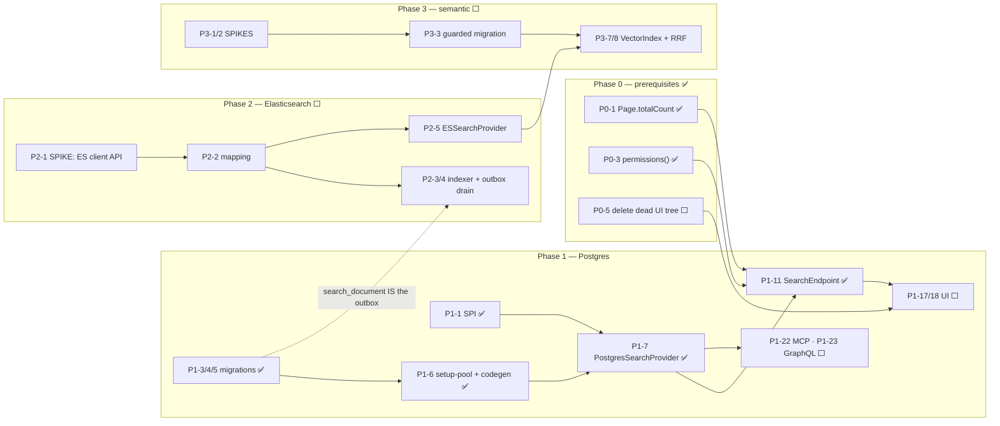

# Search — Build Plan

> Status: **Phase 0 and the Phase 1 backend are implemented and green** (49 tests). The Phase 1
> consumer work — loom-ui, MCP, GraphQL, demo data, website docs — is **not** done. Phases 2 and 3 are
> not started.
>
> Design contract and rationale live in [SEARCH.md](SEARCH.md); read it first. Phase 3 is detailed in
> [SEMANTIC_SEARCH.md](SEMANTIC_SEARCH.md).
>
> **Audience: AI coding agents.** This file is the execution order. Every task carries a status; the
> dependency column is real — running P1-7 before P1-6 produces code that does not compile.

**Status legend:** ✅ done · 🔨 partial (see note) · ⬜ not started · ⏭️ deliberately skipped

## Strategy in one paragraph

Ship **Postgres full-text search** behind a provider SPI, then swap in **Elasticsearch/OpenSearch**
behind the same SPI without touching the endpoint, the models or the UI. The hinge is the
`search_document` table ([SEARCH.md](SEARCH.md) §5): it is the Postgres index, the pre-assembled
Elasticsearch document, *and* the outbox that feeds it. Lucene is rejected and its stub module is to be
deleted ([SEARCH.md](SEARCH.md) §2).

---

## Phase dependency map



Note the dashed edge: Phase 1's `search_document` table is what Phase 2's indexer drains, which is why
Phase 2 adds a provider rather than rebuilding the pipeline. The outbox columns
(`dirty`/`synced_at`/`es_synced_at`) and the `search_document_deleted` tombstone table are **already
built and maintained**, so Phase 2 starts from a populated feed.

## 🔴 Build-order rules — read before touching anything

This section **is** this document's Conventions & Gotchas; the design-level ones live in
[SEARCH.md](SEARCH.md) §12. Rules 7–9 were learned the hard way while building Phase 1.

| # | Rule |
|---|---|
| 1 | **`./setup-pool.sh` after every new Flyway migration.** It runs `io.metaloom.loom.test.PoolSetupRunner` in `loom/fixture` and rebuilds the testdatabase-provider template DBs. Skip it and every DAO and endpoint test fails against the *old* schema. |
| 2 | **The jOOQ codegen exclusion must cover every generated column.** It is now `.*\.text_search.*\|.*\.trgm_text` (`loom/db/jooq/pom.xml`). The original `.*\.text_search` would have caught `search_document.text_search` but not `text_search_en` or `trgm_text`, emitting `Object`-typed generated columns that can reach an `INSERT`. Widen it *before* running `generate.sh`. |
| 3 | **`generate.sh` re-runs every migration from scratch in a `postgres:latest` Testcontainer.** Any migration that is not runnable on a stock image breaks codegen for everyone. `pg_trgm` ships with the official image; `pgvector` does **not** — see [SEMANTIC_SEARCH.md](SEMANTIC_SEARCH.md). |
| 4 | **A newly added `loom_permission` enum value cannot be USED in the migration that adds it.** Flyway wraps each migration in one transaction. Other DDL alongside it is fine — `V2.37` and `V2.52` both add enum values and create tables — but a migration adding `READ_SEARCH` *and* inserting a `role_permission` row that uses it **will fail**. `V2.57` is standalone so any later seed grant has a committed value to reference. |
| 5 | **Clean-rebuild `loom/core` after endpoint constructor changes**, before `setup-pool.sh` or tests, or you get a confusing `NoSuchMethodError` from Dagger-generated factories. |
| 6 | **Highest existing migration is now `V2.59__add_search_triggers.sql`.** Verify before claiming a version; another branch may have taken it. |
| 7 | 🔴 **`LoomRestErrorCode` exists twice**, in the same package `io.metaloom.loom.api.error`, in `loom-shared/api` and `loom/common` (the latter has the extra `BAD_FILTER_KEY`/`CONFLICT`). `loom/db/jooq` resolves the `loom/common` copy. Add any new constant to **both**, or you get a "cannot find symbol" whose cause is invisible from the import statement. |
| 8 | 🔴 **jOOQ plain SQL does not escape `%`.** Writing `%%` reaches Postgres literally (*operator does not exist: text %% ...*). Use a single `%` and cast the bind: `trgm_text % ?::text`. Binds are positional in the order the `?` appear **in the SQL text**, so a placeholder in the SELECT list precedes every one in the WHERE clause. |
| 9 | 🔴 **`SET LOCAL` is discarded outside a transaction.** `pg_trgm.similarity_threshold` is a session GUC the `%` operator reads, so the SET and the query must share one `ctx.transactionResult(...)` — which also guarantees the same pooled connection and leaves nothing mutated behind. |
| 10 | ⚠️ **The test-DB pool provisions in increments of 10 (max 60).** A single test class with 33 methods outruns it and fails with *"Got error from server {Unknown error}"* — which looks like a logic bug and is not. Keep test classes at ~15 methods; the largest pre-existing class is 13. |

---

## Phase 0 — Prerequisites (no search code)

Each is an independent change that fixes something already broken.

| ID | Status | Task | Depends on |
|---|---|---|---|
| **P0-1** | ✅ | `Page` gained `Page(long perPage, long totalCount, List<T> list)` and `TOTAL_COUNT_UNKNOWN`; the 2-arg constructor is deprecated. `ModelBuilder` now reports the real total, and `PagingInfo.totalCount`'s description is corrected.<br>⚠️ **Built differently from the sketch:** the count uses `ctx.fetchCount(query)` (which *wraps* the select) rather than adding `count(*) OVER ()` to the projection. Extending the projection risked breaking `fetchStreamInto` across ~20 DAOs that build their select differently. Cost: one extra round trip per list call. | — |
| **P0-2** | ✅ | Regression sweep of all list endpoints. 10 `testReadPage` tests had encoded the *old, buggy* meaning because `ListResponseModelAssert.hasSize()` asserted page size **and** total in one call — which only ever passed while the two were equal. Split into `hasSize()` / `hasTotalCount()`; `AnnotationEndpointTest` and `UserEndpointTest` now assert the real total so the fix cannot silently regress. | P0-1 |
| **P0-3** | ✅ | `LoomRoutingContext.permissions()` — resolves authorizations once, returns a synchronous non-throwing check.<br>⚠️ **Returns `Future<Predicate<Permission>>`, not `ResourcePermissionSet`.** A predicate is what the narrowing actually needs and it reuses the existing `PermissionBasedAuthorization` path, so no second permission-loading mechanism was introduced. | — |
| **P0-4** | ✅ | `LoomRestErrorCode.SEARCH_UNAVAILABLE` **and** `SEARCH_UNSUPPORTED` (503 vs 400), added to **both** copies of the split-package enum (rule 7). | — |
| **P0-5** | ⬜ | Delete the orphaned `loom-ui/src/Dashboard/`, `src/User/`, `src/Content/` trees. **Verify reachability from `main.tsx` for each file first** — `AppShell.tsx` is the only live route table, and the two `MainSearchBar` copies live in this dead tree ([SEARCH.md](SEARCH.md) §1.4). Not done: no UI work landed. | — |

---

## Phase 1 — Postgres lexical search

### 1a. Contract and configuration

| ID | Status | Task | Depends on |
|---|---|---|---|
| **P1-1** | ✅ | `io.metaloom.loom.api.search` in `loom-shared/api`: `SearchProvider`, `SearchIndexer`, `SearchCapability`, `SearchRequest`, `SearchResult`, `SearchHit`, `SearchSuggestion`, `SearchDocument`, `SearchEntityType`, `SearchMode`, `SearchSortMode`, `FacetBucket`, `SearchProviderInfo`, `IndexStatus`. Shapes in [SEARCH.md](SEARCH.md) §4. | — |
| **P1-2** | 🔨 | `io.metaloom.loom.api.options.SearchOptions` + registration in `LoomOptions` (field, getter, setter, `overrideWithEnv()`, `errors.nested("search", search)`), with `validate()` covering provider name, limits, threshold and ts config.<br>⬜ `LoomOptionsValidationTest` was **not** extended. | — |

### 1b. Database

| ID | Status | Task | Depends on |
|---|---|---|---|
| **P1-3** | ✅ | `V2.57__add_search_permission.sql` — the enum value alone. `Permission.READ_SEARCH` added with the `// doc: … ui: … test: …` comment.<br>ℹ️ **No bootstrap grant was needed:** `DatabaseInitializer` already grants the admin role every `Permission.values()`, so adding the constant is sufficient. Do not "fix" this. | — |
| **P1-4** | ✅ | `V2.58__add_search_document.sql` — `pg_trgm`; the `search_document` table and its 12 indexes; `search_document_deleted`; `search_extract_json_text`, `search_jsonb_all_text`, `search_tokenize_path`, `search_body_cap`, the per-entity refresh functions and `search_document_rebuild()`.<br>🔴 **`search_tokenize_path()` was added during implementation and is not optional.** Postgres classifies `/archive/expedition7/clip.mp4` as a *single* `file` token, so no path segment is searchable on its own — searching a folder name returns nothing. It splits on `/\_-.` into weight-D keywords while the raw path stays in `subtitle` for exact match.<br>⚠️ `pg_trgm` is not a *trusted* extension and needs superuser or `rds_superuser`. Every environment here qualifies (`V1__db_setup.sql:6` already does an unconditional `CREATE EXTENSION "uuid-ossp"`); document the managed-Postgres failure mode and the "ask your DBA to pre-create it" remedy. | P1-3 |
| **P1-5** | ✅ | `V2.59__add_search_triggers.sql` — triggers on `asset`, `asset_location`, `asset_json_comp`, `asset_transcript_comp`, `asset_segment_comp`, `detection`, `tag`/`tag_asset`, `annotation`, `person`, `collection`/`collection_asset`, `library`/`library_asset`; tombstone triggers on `search_document`; a tag-rename fan-out; and `SELECT search_document_rebuild()` as the backfill.<br>🔴 **Built differently from the sketch, deliberately.** The plan called for per-source triggers each patching part of a document. Instead each trigger just identifies the affected entity and calls a **per-entity refresh function** that recomputes that entity's whole document family — and `search_document_rebuild()` calls the *same* functions. That makes rebuild-equals-incremental true *by construction* rather than by discipline, which is the property the whole trigger approach lives or dies on. Cost: more write amplification, measured at **~0.13 ms per asset insert** (200 inserts: 31.7 ms with triggers vs 4.8 ms without).<br>🔴 Body is truncated to 512 KB with `body_truncated` set ([SEARCH.md](SEARCH.md) §6). | P1-4 |
| **P1-6** | 🔨 | Exclusion widened (rule 2), `generate.sh` re-run, `JooqSearchDocument` verified to contain none of `TEXT_SEARCH`/`TEXT_SEARCH_EN`/`TRGM_TEXT`, `./setup-pool.sh` re-run.<br>⬜ **`SearchDocumentCodegenTest` was not written** — the check was done by inspection, so nothing stops a future regen from silently reintroducing the columns. Worth adding; it is four lines of reflection. | P1-5 |

### 1c. Provider

| ID | Status | Task | Depends on |
|---|---|---|---|
| **P1-7** | ✅ | `io.metaloom.loom.db.jooq.search.{PostgresSearchProvider, NoopSearchProvider, NoopSearchIndexer}`. `websearch_to_tsquery` only; `ts_rank_cd(…, 32)` + trigram blend; highlighting and `matchedIn` in a **separate** query over the returned page only. `NoopSearchIndexer.rebuild()` exposes `search_document_rebuild()` as the repair path. | P1-1, P1-6 |
| **P1-8** | ✅ | **33 tests, split across three classes** (rule 10): `SearchDocumentSourceTest` (13 — one per text source), `SearchQueryBehaviourTest` (15 — grammar, stemming, typo, ranking, paging, validation, mode rejection), `SearchDocumentLifecycleTest` (5 — delete cascade, **rebuild-equals-incremental**, truncation, update refresh, capabilities).<br>⚠️ Named per concern rather than one `PostgresSearchProviderTest`: 33 methods in one class exhausts the test-DB pool. | P1-7 |
| **P1-12** | ✅ | `loom/core/.../dagger/SearchModule.java` binds `SearchProvider`/`SearchIndexer` from `SearchOptions` and falls back to `NoopSearchProvider` on any construction failure — **search never fails server boot**. Registered in `LoomCoreComponent`. Also provides `SearchOptions` from `LoomOptions`. | P1-7 |

### 1d. REST

| ID | Status | Task | Depends on |
|---|---|---|---|
| **P1-9** | 🔨 | `SearchQueryParameterKey` in `loom-shared/rest-model` (deliberately separate from `QueryParameterKey`, [SEARCH.md](SEARCH.md) §7.3); `SearchParameters` in `loom/services/rest` with `toRequest()`; `AbstractEndpoint.addSearchRoute(...)` documenting the search parameters.<br>⚠️ **Two deviations.** `SearchParameters` does **not** extend `AbstractQueryParameters` — that base class's `mapParameter` is typed against `QueryParameterKey`, and its default-value fallback is what caused a `ClassCastException` (Integer default returned from a String accessor) during implementation. And no `LoomRoutingContext.searchParams()` accessor was added; the service calls `SearchParameters.create(lrc)` directly. Adding the accessor for symmetry with `pagingParams()` is a reasonable follow-up. | P1-1 |
| **P1-10** | ✅ | `io.metaloom.loom.rest.model.search.*` — `SearchResultResponse`, `SearchHitResponse`, `SearchMetaInfo`, `SearchFacetResponse`, `SearchSuggestionResponse`/`…ListResponse`, `SearchStatusResponse` — plus `SearchExamples`, registered in the `Examples` interface. | P1-1 |
| **P1-11** | ✅ | `SearchEndpoint` + `SearchEndpointService`; `/search/{results,assets,suggestions,status}`; registered in `EndpointModule`. Global `READ_SEARCH` gate plus per-type narrowing, withheld types reported in `_metainfo.warnings`, capped offset, 403 when nothing survives narrowing. | P1-7, P1-9, P1-10, P0-3 |
| **P1-13** | ✅ | `SearchMethods` + `LoomHttpClientImpl` implementation + `ClientMethods` registration.<br>⚠️ Query parameters go through `request.addQueryParameter(...)`, **never** appended to the path — the request builder encodes the path, so a baked-in `?` arrives as `%3F` and the route 404s. | P1-10 |
| **P1-14** | ✅ | `SearchEndpointTest` (16 tests) extending `AbstractEndpointTest`, including `testSearchNarrowsByTypePermission()`, `testSearchAssetsRequiresReadAsset()` and `testSearchWithOnlyReadSearchReturnsForbidden()`. Permissions granted via **role → group → user**. | P1-11, P1-13 |
| **P1-15** | ✅ | `/search/suggestions` — trigram typeahead over `trgm_text`, prefix `ILIKE` OR similarity, returning empty rather than erroring when the provider cannot suggest. | P1-7, P1-11 |

### 1e. UI — none of this is done

| ID | Status | Task | Depends on |
|---|---|---|---|
| **P1-16** | ⬜ | `loom-ui/src/api/search.ts` (`search`, `searchAssets`, `suggest`, `searchStatus` + types), following `src/api/tags.ts`'s `API_BASE_URL` / `authHeaders` / `handleResponse<T>` shape. Plus `src/api/search.test.ts`. | P1-10 |
| **P1-17** | ⬜ | `src/features/search/useSearch.ts` (250 ms debounce, `AbortController` cancellation, `q.length >= 2` gate); `src/features/search/SearchView.tsx` (grouped by entity type, transcript hits deep-linking to `/assets/:id?t=<ms>`, empty/error/provider-unavailable states); `src/layout/GlobalSearchBar.tsx`; a `/search` route in `AppShell.tsx`; Cmd/Ctrl-K overlay.<br>⚠️ The live shell has no top bar — this is a shell-layout change.<br>ℹ️ `GET /search/status` returns 200 with `available:false` precisely so the bar can be hidden rather than rendered broken. | P1-16, P0-5 |
| **P1-18** | ⬜ | `AssetBrowser.tsx` → `searchAssets` with **server-side paging**. Also fixes a real scaling bug: `listAssets(token)` takes no parameters and loads the entire catalog. | P1-16, P0-1 |
| **P1-19** | ⬜ | `LibraryView.tsx` → server-side, scoped by library. | P1-18 |
| **P1-20** | ⬜ | Playwright `e2e/search-mocked.spec.ts` and `e2e/search-backend.spec.ts`. | P1-17, P1-21 |

### 1f. Other consumers and closeout — none of this is done

| ID | Status | Task | Depends on |
|---|---|---|---|
| **P1-21** | ⬜ | `DemoDatabaseInitializer` search fixtures: a transcript with distinctive text, an `ocr` comp, a `tika` comp, searchable tag names, one annotation title. Pick **one** magic string (e.g. `"aurora"`) shared by the website docs page and the backend e2e test. Required by CODING.md. | P1-5 |
| **P1-22** | ⬜ | Un-stub the MCP tools on top of the SPI. `SearchAssetsTool`: inject `SearchProvider`, replace `loadPage(null, limit, null, null, null)` with a real `SearchRequest`, add `library`/`tag`/`offset` params. `SearchTranscriptTool`: `types=[TRANSCRIPT]`, `highlight=true`, return snippet + `assetUuid` + `timeFromMs`; ⚠️ its description still cites `asset_doc_comp.doc_plain_text`, a dead table — rewrite it. Neither needs new registration.<br>⚠️ `MCPTool.execute(JsonObject)` carries no user context, so per-type narrowing cannot apply there. Acceptable (it matches today's global-gate model) but record it as a gap in [../rbac/RBAC.md](../rbac/RBAC.md). | P1-7 |
| **P1-23** | ⬜ | GraphQL: **one** new top-level `search(q, types, mode, limit, offset)` field plus `SearchResult`/`SearchHit` types and the two enums. Do **not** add filter args to the ~20 existing list fields. Guard with `READ_SEARCH` via `GraphQLPermissionChecker`; test through `AbstractGraphQLEndpointTest`. | P1-7 |
| **P1-24** | ⬜ | Customer-facing docs page under `website/content/english/docs/` (🔴 per CODING.md: no spec-file references, no internal class names, SVG not ASCII art). Spec sync: [../rbac/RBAC.md](../rbac/RBAC.md), [../permissions/PERMISSIONS.md](../permissions/PERMISSIONS.md), [../../loom/RESTAPI.md](../../loom/RESTAPI.md), [../../loom/MCP.md](../../loom/MCP.md), [../db/DATABASE_TASKS.md](../db/DATABASE_TASKS.md). | P1-14 |
| **P1-25** | ⬜ | Delete `loom/services/lucene` from `loom/services/pom.xml` and remove the directory ([SEARCH.md](SEARCH.md) §2). | — |
| **P1-26** | ⬜ | *(new)* Emit `DETECTION` and `SEGMENT` documents. Their text currently folds into the owning asset's `keywords`, so it is searchable but does not surface as a hit of its own. The enum values and the permission mapping already exist; this is one more refresh function plus its triggers. | P1-5 |

**Phase 1 backend exit criteria — met.** `GET /api/v1/search/results?q=…` finds an asset by filename,
path segment, transcript word, OCR text, caption, per-scene video caption, LLM answer, face description
and tag name; results are ranked, paged, highlighted and permission-gated; `GET /search/status` reports
`provider: postgres`.

**Phase 1 full exit criteria — not met.** A user cannot yet type in a global bar (P1-16…P1-20), the MCP
tools are still stubs (P1-22), and there is no customer-facing documentation (P1-24).

---

## Phase 2 — Elasticsearch / OpenSearch — ⬜ not started

Starts from a populated outbox: `search_document.dirty`/`synced_at`/`es_synced_at` and
`search_document_deleted` are already built, maintained by triggers and covered by tests.

| ID | Status | Task | Depends on |
|---|---|---|---|
| **P2-1** | ⬜ | 🔴 **Spike first.** `loom/services/elasticsearch/pom.xml` depends on the internal `io.metaloom.elasticsearch:elasticsearch-client` (`1.2.0-SNAPSHOT`), whose API is unverified. Confirm bulk indexing, `search_after`, aliases, index templates and (for Phase 3) `knn`. Fallbacks in preference order: official `co.elastic.clients:elasticsearch-java`, or plain HTTP via the Vert.x `WebClient` (dependency-free, covers OpenSearch identically). **Do not write ES code before this resolves.** | — |
| **P2-2** | ⬜ | `loom-search-mapping.json` + `LoomSearchMapping` + `ensureSchema()`. One index per entity type behind a single read alias. Fields mirror `search_document` 1:1, plus `title` sub-fields, `body` with `index_options: offsets` (the proper fix for the `ts_headline` cost), the three ACL `keyword` arrays **from the first mapping**, and a declared-but-unpopulated `dense_vector` so Phase 3 needs no reindex. | P2-1 |
| **P2-3** | ⬜ | `ElasticsearchSearchIndexer` — bulk, retry with backoff, per-document `error` capture, dead-letter after N attempts. | P2-2 |
| **P2-4** | ⬜ | `ElasticsearchIndexSyncService` (Vert.x periodic verticle). `SELECT … WHERE dirty ORDER BY synced_at LIMIT :bulk FOR UPDATE SKIP LOCKED` — 🔴 `SKIP LOCKED` is what makes it safe on every replica with no coordination. Also drains `search_document_deleted`; 🔴 tombstones are required because the asset cascade removes rows before an indexer can observe the delete. Prune after 7 days.<br>**Backfill is not a separate code path** — `search_document_rebuild()` marks everything dirty and the normal drain handles it, so backfill is exercised by the steady-state tests. | P2-3, P1-5 |
| **P2-5** | ⬜ | `ElasticsearchSearchProvider` — query, highlight, facets, `search_after` populating `nextCursor`. Advertises `DEEP_PAGING`, `FACETS`, `HIGHLIGHT`. | P2-2 |
| **P2-6** | ⬜ | `ElasticsearchHealthCheck`; add a `search` component to `HealthEndpoint`/`HealthCheckResponse`. ⚠️ `HealthEndpoint` is registered **without** `secure(...)` — do not leak the ES URL through it. | P2-5 |
| **P2-7** | ⬜ | `POST /api/v1/search/reindexes`. ⚠️ Open question: which permission guards it (open item 3). | P2-4 |
| **P2-8** | ⬜ | Testcontainers ES tests + a **provider-parity test**: the same fixture corpus in both backends returns the same *top-5 set* for a fixed query list. Use `refresh=wait_for`.<br>⚠️ `org.testcontainers:elasticsearch` is managed at **1.17.6 — old**; verify it can pull a current image (open item 2). Keep classes ≤15 methods (rule 10). | P2-5, P1-8 |
| **P2-9** | ⬜ | Ops: an `elasticsearch` service behind a **compose profile** (so the default dev loop stays fast); a `search:` block in `helm/loom/values.yaml`; optional bundled single-node ES StatefulSet following the chart's "official images, no third-party subcharts, works offline" policy. | P2-6 |
| **P2-10** | ⬜ | `POST /api/v1/search/results` — body-encoded for long queries and many filters. | P1-11 |
| **P2-11** | ⬜ | `?q=` substring narrowing on list routes (`ILIKE`/trigram in the DAO `WHERE`, **keyset paging untouched**, no ranking) + DAO tests. A different feature from `/search/*` — [SEARCH.md](SEARCH.md) §7.2. | P0-1 |
| **P2-12** | ⬜ | Migrate the remaining UI views to `?q=`. 🔴 **Criterion, so nobody churns views for free:** migrate a view when its list can plausibly exceed 500 rows. Migrate `TagsView` (keep the client-side tree grouping — a render concern), `CollectionsView`, `AssetPoolsView`, the six `AdminArea` boxes, the detection views. **Do not migrate** `CortexView` or `PipelineEditor`. | P2-11 |
| **P2-13** | ⬜ | `/search/facets` + facet UI. The provider already computes facets for `mime_type`/`entity_type`/`lang`; this is the dedicated route and the UI. | P2-5 |

---

## Phase 3 — Semantic / hybrid — ⬜ not started

Detailed in [SEMANTIC_SEARCH.md](SEMANTIC_SEARCH.md). Summary of the order:

| ID | Status | Task | Depends on |
|---|---|---|---|
| **P3-1** | ⬜ | Spike: embedding model + inference host (ONNX in-process vs. a `sidecars/` service); fix the dimension | — |
| **P3-2** | ⬜ | Spike: pgvector availability — image change vs. a `pg_available_extensions` guard; confirm `generate.sh` and `setup-pool.sh` survive | — |
| **P3-3** | ⬜ | Guarded migration: `CREATE EXTENSION vector`, `embedding_vec_<dim>` + HNSW, `embedding` exporter columns + the missing `array_length` CHECK | P3-1, P3-2 |
| **P3-4** | ⬜ | `VectorConfigDao` + `GET /api/v1/vector-configs` + seed the `default` profile | P3-3 |
| **P3-5** | ⬜ | `cortex/nodes/embedding` — `EmbeddingNode` (CLIP/SigLIP whole-image) | P3-1 |
| **P3-6** | ⬜ | `embedding_vec` sync job (mirrors P2-4) | P3-3, P3-5 |
| **P3-7** | ⬜ | `VectorIndex` SPI + `PgVectorIndex`; `SearchMode.SEMANTIC` (the mode already exists and is correctly *rejected* by the Postgres provider) | P3-6 |
| **P3-8** | ⬜ | RRF fusion; `SearchMode.HYBRID` | P3-7 |
| **P3-9** | ⬜ | ES-side `dense_vector` population + native `rrf`/`knn` | P3-8, P2-5 |
| **P3-10** | ⬜ | `FacedetectNode` persists its existing InspireFace vectors; `cluster` documents already exist | P3-3 |
| **P3-11** | ⬜ | UI: mode toggle, "more like this", cluster filter | P3-8 |

---

## Test Setup

Full setup in [SEARCH.md](SEARCH.md) §10 and the per-source test list in §10.2;
[SEMANTIC_SEARCH.md](SEMANTIC_SEARCH.md) §10 covers Phase 3.

**Key Classes Reference** — not duplicated here. Every class named in the task tables is listed in
[SEARCH.md](SEARCH.md) §11 (lexical) and [SEMANTIC_SEARCH.md](SEMANTIC_SEARCH.md) §11 (vector).

The commands that gate a green build, in order:

```bash
./setup-pool.sh                              # after every Flyway migration (rule 1)
loom/db/jooq/generate.sh                     # after the exclusion widening (rules 2 and 3)
mvn -o -pl loom/db/jooq test -Dtest='Search*'
mvn -o -pl loom/core  test -Dtest=SearchEndpointTest
```

⚠️ Add `-Dmaven.javadoc.skip=true` for a full `install`. The `javadoc` goal currently fails on
pre-existing doclint errors in `PipelineRunEngine`, `ProcessorEndpoint`, `WebSocketAuthenticator` and
`MCPService` — unrelated to search, but it will stop your build.

⚠️ `AssetEndpointTest` intermittently reports 2–3 errors when the whole `loom/core` suite runs, and
passes in isolation. The cause is test-DB pool provisioning (rule 10), not a regression.

## Definition of done (per [../../guidelines/CODING.md](../../guidelines/CODING.md))

| Requirement | Status | Where |
|---|---|---|
| Plural REST paths | ✅ | `search` is a namespace with no handler; all leaves plural (P1-11) |
| Endpoint test | ✅ | `SearchEndpointTest`, 16 tests (P1-14) |
| Fine-grained permission test cases | ✅ | `testSearchRequiresPermission`, `testSearchNarrowsByTypePermission`, `testSearchAssetsRequiresReadAsset`, `testSearchWithOnlyReadSearchReturnsForbidden` (P1-14) |
| DAO implementation covered by tests | ✅ | 33 tests across the three `Search*Test` classes (P1-8) |
| **Delete-cascade test** | ✅ | `testDeleteCascadeRemovesOnlyTheDeletedAssetsDocuments` (P1-8) |
| Customer-facing website docs | ⬜ | P1-24 |
| Meaningful demo data | ⬜ | P1-21 |
| Spec kept in sync | 🔨 | [SEARCH.md](SEARCH.md) and this file updated; RBAC / PERMISSIONS / RESTAPI / MCP still pending (P1-24) |

## Open items

| # | Status | Question | Blocks |
|---|---|---|---|
| 1 | ⬜ | Does `io.metaloom.elasticsearch:elasticsearch-client` 1.2.0-SNAPSHOT support bulk / `search_after` / aliases / templates / `knn`? | P2-1 (gates all of Phase 2) |
| 2 | ⬜ | Can `org.testcontainers:elasticsearch` 1.17.6 pull a current ES image without conflicting with the version resolved elsewhere? | P2-8 |
| 3 | ⬜ | Which permission guards `/search/reindexes`? Check the existing maintenance routes before adding `MANAGE_SEARCH`. | P2-7 |
| 4 | ✅ | ~~`SearchAssetHitResponse extends AssetResponse` vs. a side-car score map~~ — **resolved by not subclassing**. `/search/assets` returns the same `SearchResultResponse` shape as `/search/results`, filtered to assets, so there is one hit model rather than two. A UI wanting full asset fields fetches by uuid. | — |
| 5 | ⬜ | Does pgvector allow a `PARTITION BY LIST (dimensions)` child to narrow `vector` → `vector(768)`? The design routes around this deliberately — do **not** promote the partitioning sketch to fact. | P3-3 |

## Where do I find …?

| Need | Look here |
|---|---|
| Why any of this is shaped the way it is | [SEARCH.md](SEARCH.md) |
| What is actually built | [SEARCH.md](SEARCH.md) §14, and the Status column above |
| The `search_document` DDL | [SEARCH.md](SEARCH.md) §5.2, and `V2.58__add_search_document.sql` |
| The jsonb text-extraction whitelist | [SEARCH.md](SEARCH.md) §6, and `search_extract_json_text()` |
| Why a rebuild equals the incremental index | P1-5 above; `search_document_rebuild()` and the per-entity refresh functions |
| Vector / hybrid design | [SEMANTIC_SEARCH.md](SEMANTIC_SEARCH.md) |
| Definition of done for code | [../../guidelines/CODING.md](../../guidelines/CODING.md) |
| Definition of done for a spec change | [../../SPEC_RULES.md](../../SPEC_RULES.md) |

## Progress Assessment

- [x] **Phase 0** — P0-1…P0-4 done; **P0-5 not done** (no UI work landed)
- [x] **Phase 1 backend** — P1-1, P1-3…P1-15 done; **P1-2 and P1-6 partial** (missing
      `LoomOptionsValidationTest` extension and `SearchDocumentCodegenTest`); **P1-9 partial**
      (no `LoomRoutingContext.searchParams()` accessor)
- [ ] **Phase 1 consumers** — P1-16…P1-21 (loom-ui, demo data), P1-22 (MCP), P1-23 (GraphQL),
      P1-24 (website docs + spec sync), P1-25 (delete the Lucene stub), P1-26 (detection/segment docs)
- [ ] **Phase 2** — not started; gated on the P2-1 spike. The outbox it drains already exists
- [ ] **Phase 3** — not started; see [SEMANTIC_SEARCH.md](SEMANTIC_SEARCH.md)
- [x] Open item 4 resolved; items 1, 2, 3, 5 still open and all belong to Phase 2/3

### What was learned while building Phase 1

Recorded because it changed the design, and the next contributor will otherwise rediscover it:

| Finding | Consequence |
|---|---|
| Postgres tokenizes a whole path as a single `file` token | `search_tokenize_path()` added; without it folder names are unsearchable — the first thing a user tries |
| Per-entity refresh beats per-source patching | Rebuild-equals-incremental becomes true by construction, not by discipline |
| Two `LoomRestErrorCode` classes share one package | New codes must go in both copies (rule 7) |
| jOOQ plain SQL does not escape `%` | `%%` reaches Postgres literally; use `%` and cast the bind (rule 8) |
| `SET LOCAL` is discarded outside a transaction | The trigram threshold and the query must share one `transactionResult` (rule 9) |
| `AbstractQueryParameters` defaults are typed | Returning an Integer default from a String accessor is a `ClassCastException` at the first request that omits the parameter |
| The client encodes the whole path | Query strings must go through `addQueryParameter`, never appended to the path |
| `hasSize()` asserted page size *and* total | Split into `hasSize()` / `hasTotalCount()`; 10 tests had encoded the old bug |
| The test-DB pool provisions in increments of 10 | A 33-method class outruns it — split into 13/15/5 (rule 10) |
| Trigger cost measured | ~0.13 ms per asset insert (200 inserts: 31.7 ms with vs 4.8 ms without). Acceptable |
| `tag_asset.asset_uuid` has no `ON DELETE CASCADE` | An asset cannot be deleted while tagged; shapes the delete-cascade test |

---

_Git HEAD: `65e6c4649c639303932384942d4c68d8e9e8360d` (branch `master`)_
_Last updated: 2026-07-27 (Phase 0 + Phase 1 backend implemented; task table carries per-task status)_
