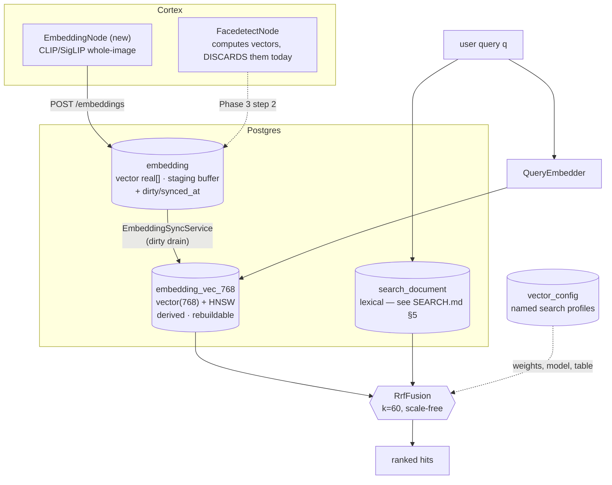

# Semantic & Vector Search — Technical Specification

> **Audience: AI coding agents.** Embedding-based similarity search and hybrid lexical+vector
> ranking. Lexical search — the `search_document` table, the `SearchProvider` SPI, the REST surface —
> is specified in [SEARCH.md](SEARCH.md); read it first, because this document extends that design
> rather than standing alone. Build order in [SEARCH_PLAN.md](SEARCH_PLAN.md) Phase 3.
>
> **Status: nothing here is implemented, and there is no data to search.** This document resolves the
> open decision recorded in the schema itself and specifies the path to a working hybrid search.

---

## 1. Current state

### 1.1 The open decision, in the database's own words

`V2.43__rework_detection_embedding.sql:124` carries this column comment, mirrored into
`JooqEmbedding.java`:

> *"Embedding vector as a plain PostgreSQL array. **OPEN DECISION**: similarity search is either
> pgvector in Postgres or an external index fed via `vector_config`. Until that is decided this column
> is a staging buffer with no ANN index — see spec/features/DB_SCHEMA_FEEDBACK.md section 4.2."*

[../DB_SCHEMA_FEEDBACK.md](../DB_SCHEMA_FEEDBACK.md) §4.2 and its recommendation #13 ask for the same
thing. **§3 of this document resolves it.**

### 1.2 What exists

| Thing | Status |
|---|---|
| `embedding` table | Exists (`V2.43`). Columns: `asset_uuid`, `detection_uuid`, `node_kind`, `type`, `model`, `dimensions int`, **`vector real[]`**, `frame_number`, `subject_index`, `time_from`/`time_to`, `confidence`, `meta`. `UNIQUE (asset_uuid, node_kind, type, frame_number, subject_index)`. Indexes on `asset_uuid` and `detection_uuid` **only**. |
| Rows in it | 🔴 **Zero.** No node writes an embedding. |
| `EmbeddingDao` | `createEmbedding`, `upsertEmbedding` + inherited CRUD. **No similarity or nearest-neighbour method.** |
| `EmbeddingEndpoint` / `EmbeddingMethods` | Plain CRUD, unused by any node. |
| `vector_config(name, weights jsonb)` | Table only (`V2.6`). **No DAO, no endpoint, no reader.** |
| `cluster` / `embedding_cluster` | Plain CRUD. Clustering happens externally; Loom only persists membership. |
| `loom/services/qdrant` | Empty module — `pom.xml` with **zero dependencies**, no `src/`. |
| pgvector / ANN / kNN / cosine anywhere in Java | Absent. |

🔴 **Face embeddings are computed and thrown away.** `FacedetectNode` runs InspireFace;
`VideoFace.getEmbedding()` returns the `float[]` and `VideoFaceScanner` gates on `hasEmbedding()` — but
`FacedetectNode.persist(...)` builds only bounding-box `DetectionCreateRequest`s. The vector never
reaches Loom. `FaceStorage.java` is entirely commented out. There is a DBSCAN clustering experiment in
`VideoFaceScannerTest` with no production path.

### 1.3 Known schema defects (from [../DB_SCHEMA_FEEDBACK.md](../DB_SCHEMA_FEEDBACK.md) §4.2)

- No ANN index ⇒ any similarity query is a full scan.
- **No dimension constraint** — a 512-d InspireFace vector and a 128-d dlib vector can coexist in one
  column, distinguishable only by the free-text `type`. `dimensions` is stored but not enforced.
- **No exporter contract** — no `synced_at`, `index_version` or `dirty` column, so nothing can
  incrementally feed an index.

All three are fixed in §4.

---

### 1.4 Target architecture



🔴 Everything inside the Postgres box below `embedding` is gated on pgvector being available — see
§3.2 for why that is not a given, and §3.3 for the guard.

## 2. What "semantic search" has to mean here

Two different capabilities get conflated. Keep them separate:

| | **Text → media** | **Media → media** |
|---|---|---|
| Query | the user's `q` string | an existing asset, region or face crop |
| Requires | a **joint text–image** model (CLIP/SigLIP class) | any embedding model |
| UI | the existing search box | "more like this" / person clustering |
| Composes with lexical search | ✅ yes — hybrid ranking | ❌ no — different query type |

🔴 **Only text→media makes hybrid search meaningful**, because hybrid ranking requires both rankers to
consume the *same* query. A face embedding cannot consume `q` at all. This is why §5 recommends the
whole-image node first and face second, even though the face vectors already exist in memory.

---

## 3. Decision: pgvector, not Qdrant

### 3.1 Rationale

1. **There are zero embeddings in the system today** (§1.2). Standing up and operating a separate
   vector database for a feature with no data is premature. Postgres is already deployed, backed up
   and monitored everywhere.
2. **Hybrid ranking is a join problem.** Fusing vector hits with lexical hits *and* mime/library/tag
   filters is one SQL statement against `search_document ⋈ embedding_vec`. With Qdrant it is two round
   trips, payload duplication into Qdrant, and a **third** consistency surface layered on top of the
   Elasticsearch one from [SEARCH.md](SEARCH.md) §3.
3. **Deletion propagation is free.** `embedding` already has `ON DELETE CASCADE` from both `asset` and
   `detection`. Qdrant would need its own tombstone pipeline — a second copy of the machinery
   [SEARCH_PLAN.md](SEARCH_PLAN.md) P2-4 already builds once.
4. **ACL filtering is free.** `library_uuids && :allowed` in SQL, versus a Qdrant payload filter that
   must be kept in sync with `library_asset` membership ([SEARCH.md](SEARCH.md) §8.3).

### 3.2 🔴 The cost, stated plainly

**pgvector is not in the stock `postgres` image.** Every one of these pins a plain image:

| Location | Image |
|---|---|
| `start-postgres.sh:6` | `postgres:16.3-bullseye` |
| `test-database/docker-compose.yaml:5` | `postgres:16.3-bullseye` |
| `test-database/podman-compose.yml:6` | `postgres:16.3-bullseye` |
| `loom/db/jooq/pom.xml:109` | 🔴 `postgres:latest` — **jOOQ codegen** |
| `helm/loom/values.yaml` | `postgres:17-alpine` |
| testdatabase-provider template DB | inherits the above |

An unconditional `CREATE EXTENSION vector` therefore breaks `loom/db/jooq/generate.sh`, breaks
`./setup-pool.sh`, breaks every developer's local Postgres, and breaks the Helm bundled database. That
is the single hardest constraint in this document — **it means nobody can build**, not just that
semantic search is unavailable.

### 3.3 🔴 Mitigation — the migration must be self-disabling

```sql
DO $$
BEGIN
  IF EXISTS (SELECT 1 FROM pg_available_extensions WHERE name = 'vector') THEN
    CREATE EXTENSION IF NOT EXISTS vector;
    CREATE TABLE "embedding_vec_768" ( ... );
    CREATE INDEX ON "embedding_vec_768" USING hnsw ("vec" vector_cosine_ops);
  ELSE
    RAISE NOTICE 'pgvector unavailable - semantic search will be disabled';
  END IF;
END $$;
```

Paired with a boot-time check that flips `SearchOptions.semanticEnabled` to `false` with a warning when
`embedding_vec_768` is absent, and a `SearchCapability` set that then omits `SEMANTIC`/`HYBRID` so
`/search/status` reports the truth.

**The alternative** — switching every image to `pgvector/pgvector:pg17` — is cleaner but is an
infrastructure decision affecting local dev, CI and Helm simultaneously. The guard is what lets Phase 3
land without blocking on it. `SEARCH_PLAN.md` P3-2 is the spike that picks one.

### 3.4 When to revisit Qdrant

State the trigger, so the decision is reviewable rather than permanent. Move to an external vector
store when **any** of these holds:

- more than ~20M vectors (pgvector HNSW is comfortable to roughly 10M on commodity hardware),
- p95 ANN latency above 200 ms at the target recall,
- a requirement for per-tenant collection isolation.

A `VectorIndex` SPI — sibling of `SearchProvider`, same shape, same binding mechanism — makes that a
module swap rather than a rewrite.

⚠️ `io.metaloom.qdrant:qdrant-java-http-client` appears in the local `.m2`, and a
`qdrant-java-client` checkout exists in the workspace, but it is referenced by **no** pom in this repo
and most of those artifacts are `.lastUpdated` markers rather than resolvable jars. Treat availability
as unverified.

---

## 4. Schema changes

New migration (version = whatever follows the lexical ones; `V2.60+`), **entirely inside the
`pg_available_extensions` guard** from §3.3.

### 4.1 Keep `vector real[]` as the staging column

🔴 **Do not convert `embedding.vector`.** It stays the canonical staging buffer, exactly as its comment
says, so that a later provider swap never loses data. `embedding_vec_*` is a **derived, rebuildable
index** — droppable and regenerable from `embedding` at any time. Update the column comment to record
that the open decision is now closed and point here.

### 4.2 Fix the three defects

```sql
-- Enforce what `dimensions` already claims (§1.3)
ALTER TABLE "embedding" ADD CONSTRAINT "embedding_dimensions_check"
  CHECK (array_length("vector", 1) = "dimensions");

-- Exporter contract, mirroring search_document (SEARCH.md §5.2)
ALTER TABLE "embedding" ADD COLUMN "synced_at"     timestamp WITHOUT TIME ZONE NOT NULL DEFAULT now();
ALTER TABLE "embedding" ADD COLUMN "index_version" int     NOT NULL DEFAULT 1;
ALTER TABLE "embedding" ADD COLUMN "dirty"         boolean NOT NULL DEFAULT true;
ALTER TABLE "embedding" ADD COLUMN "normalized"    boolean NOT NULL DEFAULT false;

-- Required by any exporter, pgvector or Qdrant
CREATE INDEX "idx_embedding_type_model" ON "embedding" ("type", "model");
CREATE INDEX "idx_embedding_dirty"      ON "embedding" ("synced_at") WHERE "dirty";
```

⚠️ The `CHECK` will fail on pre-existing bad rows — there are none today (§1.2), which makes now the
cheapest possible moment to add it.

### 4.3 The ANN table

```sql
CREATE TABLE "embedding_vec_768" (
    "embedding_uuid" uuid PRIMARY KEY REFERENCES "embedding" ("uuid") ON DELETE CASCADE,
    "asset_uuid"     uuid NOT NULL REFERENCES "asset" ("uuid") ON DELETE CASCADE,
    "type"           varchar NOT NULL,
    "vec"            vector(768) NOT NULL
);
CREATE INDEX ON "embedding_vec_768" USING hnsw ("vec" vector_cosine_ops);
CREATE INDEX ON "embedding_vec_768" ("asset_uuid");
```

**Dimension handling — one table per (family, dimension), created on demand.**

🔴 pgvector permits an unconstrained `vector` column but **cannot index one**; HNSW and IVFFlat both
require a fixed dimension. So a single table cannot hold a 768-d SigLIP vector and a 512-d InspireFace
vector and be indexed.

⚠️ Declarative `PARTITION BY LIST (dimensions)` with per-partition column narrowing is the elegant
answer, but **it is not confirmed that pgvector allows a partition child to narrow `vector` →
`vector(768)` below the parent's type.** This is [SEARCH_PLAN.md](SEARCH_PLAN.md) open item 5 — do not
promote it to fact. The design deliberately routes around it: ship exactly **one** table for the one
model that exists, and add a second table plus a `vector_config` row naming it when a second model
arrives. Honest, shippable, and it defers the partitioning question until there is a reason to answer
it.

**Cosine vs. inner product:** normalize vectors at write time and record it in `normalized`. With
normalized vectors, cosine distance and inner product rank identically, so the choice of operator class
stops mattering — and `normalized` makes the assumption auditable rather than implicit.

---

## 5. Which node writes embeddings first

**Recommendation: a new `EmbeddingNode` producing CLIP/SigLIP-class whole-image (and sampled-frame)
embeddings. Not face.** The reasoning is §2: only a joint text–image model makes the user's `q`
embeddable, so it is the only option that produces a demo-able text→media search and the only one that
can participate in hybrid ranking.

| Order | Node | `type` | `detection_uuid` | Purpose |
|---|---|---|---|---|
| 1 | new `cortex/nodes/embedding` — `EmbeddingNode` | `clip` | NULL | text→media search, hybrid, "more like this" |
| 2 | `FacedetectNode` (persist what it already computes) | `inspireface` | set | person clustering — **not** text search |
| 3 | transcript-chunk text embeddings | `text` | NULL | semantic transcript retrieval, RAG for the agent |

**Node 1** follows the `cortex/nodes/captioning/` module layout: `EmbeddingNode extends
AbstractMediaNode<EmbeddingNodeOptions>`, `name() = "embedding"`, an HTTP client to the inference host,
`node_kind='embedding'`, `subject_index=0`, `frame_number` = the sampled frame for video. Persist via
`client().createEmbedding(...)` **and** record an `asset_node_result` ledger row — the two-step pattern
`WhisperNode` establishes and [../pipeline-nodes/NODES.md](../pipeline-nodes/NODES.md) §2 documents.

⚠️ **The inference host needs a spike** ([SEARCH_PLAN.md](SEARCH_PLAN.md) P3-1): ONNX Runtime in-process
versus a Python sidecar under `sidecars/` (the `sidecars/tts` FastAPI service is the precedent, and
`CaptioningNode → SmolVLMClient → FastAPI` is the node-side precedent). The choice fixes the dimension,
which fixes the table name in §4.3.

🔴 **Chunk collision for node 3.** `embedding`'s unique key is
`(asset_uuid, node_kind, type, frame_number, subject_index)` — there is **no chunk discriminator**. Two
transcript chunks from the same asset would collide and the second would silently overwrite the first.
Encode the chunk index in `subject_index` and document it at the call site, or change the constraint.

---

## 6. Hybrid ranking — Reciprocal Rank Fusion

```
score(d) = Σ_r  w_r / (k + rank_r(d))          k = 60
```

🔴 **Not a linear blend of scores.** `ts_rank_cd` is unnormalized and corpus-dependent; cosine
similarity is bounded 0..1. They are not comparable, and any weighting that works today drifts silently
as the catalog grows. RRF is scale-free, needs zero calibration, degrades gracefully when one ranker
returns nothing, and is what Elasticsearch 8.9+ and OpenSearch implement natively — so the Phase 2
provider gets it for free.

Initial weights: lexical 1.0, vector 1.0, trigram 0.5. Take the top 200 from each ranker before fusing.

Postgres implementation — two CTEs and a full outer join:

```sql
WITH lex AS (
  SELECT entity_type, entity_uuid,
         ROW_NUMBER() OVER (ORDER BY <rank expression> DESC) AS r
  FROM search_document
  WHERE <match condition>                        -- SEARCH.md §10.1
  LIMIT 200
), vec AS (
  SELECT e.asset_uuid AS entity_uuid, 'asset'::varchar AS entity_type,
         ROW_NUMBER() OVER (ORDER BY v.vec <=> :qvec) AS r
  FROM embedding_vec_768 v JOIN embedding e ON e.uuid = v.embedding_uuid
  WHERE v.type = :embeddingType
  ORDER BY v.vec <=> :qvec
  LIMIT 200
)
SELECT COALESCE(lex.entity_type, vec.entity_type) AS entity_type,
       COALESCE(lex.entity_uuid, vec.entity_uuid) AS entity_uuid,
       COALESCE(:wLex / (:k + lex.r), 0) + COALESCE(:wVec / (:k + vec.r), 0) AS score
FROM lex FULL OUTER JOIN vec USING (entity_type, entity_uuid)
ORDER BY score DESC
LIMIT :limit OFFSET :offset;
```

Facet, ACL and mime filters apply to both CTEs — which is exactly the "one SQL statement" advantage
from §3.1.

`SearchMode` on `SearchRequest` selects the path: `LEXICAL` (Phase 1, the default), `SEMANTIC`
(vector only), `HYBRID` (fused). Providers that lack the capability reject the mode with a 400 naming
the provider rather than silently degrading to lexical — silent degradation makes relevance bugs
undiagnosable.

---

## 7. `vector_config` — the search-profile registry

`vector_config(name unique, weights jsonb)` currently has no DAO and no purpose. Repurpose it as the
**named search-profile registry**, which is what the `V2.43` comment gestures at ("an external index
fed via `vector_config`"):

```json
{
  "lexical": 1.0, "vector": 1.0, "trigram": 0.5, "rrf_k": 60,
  "embedding_type": "clip",
  "model": "siglip-base-patch16-224",
  "dimensions": 768,
  "table": "embedding_vec_768"
}
```

`SearchRequest.profile` names a row. Consequences worth having: hybrid weights become **data rather
than env vars**, a model upgrade is a row insert plus a backfill instead of a deploy, and A/B'ing two
rankings needs no code.

Work: `VectorConfigDao` + `DaoCollection.vectorConfigDao()`, a `default` profile seeded by the
migration, and read-only `GET /api/v1/vector-configs` (plural, per
[../../guidelines/CODING.md](../../guidelines/CODING.md)). Writes can stay migration-only initially.

## 8. `cluster` and `embedding_cluster`

Clusters are the **output** of similarity, not an input to search. Three integration points, in value
order:

1. A `cluster` gets a `search_document` row (`entity_type='cluster'`, `title` = its label), so
   searching "Alice" finds the face cluster. **This needs no vectors at all** and can ship in Phase 1.
2. `SearchRequest.clusterUuid` filters results to assets containing a member embedding.
3. The clustering job consumes `embedding_vec` ANN neighbours instead of an O(n²) scan — a follow-up,
   not part of search.

---

## 9. Configuration

Extends the `LOOM_SEARCH_*` table in [SEARCH.md](SEARCH.md) §9.

| Env var | Default | Meaning |
|---|---|---|
| `LOOM_SEARCH_SEMANTIC_ENABLED` | `false` | Master switch. 🔴 Force-disabled at boot when pgvector is absent (§3.3) |
| `LOOM_SEARCH_VECTOR_PROVIDER` | `pgvector` | `pgvector` \| `qdrant` \| `none` |
| `LOOM_SEARCH_VECTOR_TABLE` | `embedding_vec_768` | Overridden per profile by `vector_config` |
| `LOOM_SEARCH_VECTOR_TYPE` | `clip` | Which `embedding.type` participates in text→media search |
| `LOOM_SEARCH_VECTOR_TOPK` | `200` | Candidates pulled from the ANN index before fusion |
| `LOOM_SEARCH_RRF_K` | `60` | Fusion constant |
| `LOOM_SEARCH_RRF_WEIGHT_LEXICAL` | `1.0` | |
| `LOOM_SEARCH_RRF_WEIGHT_VECTOR` | `1.0` | |
| `LOOM_SEARCH_HNSW_EF_SEARCH` | `100` | Recall/latency trade-off (`SET LOCAL hnsw.ef_search`) |
| `LOOM_SEARCH_EMBED_SYNC_INTERVAL_MS` | `5000` | `embedding` → `embedding_vec` drain |
| `LOOM_SEARCH_EMBED_URL` | `""` | Query-embedding inference host |

---

## 10. Test Setup

🔴 **`./setup-pool.sh` after the migration**, and 🔴 **verify `loom/db/jooq/generate.sh` still
succeeds** — it re-runs every migration in a `postgres:latest` Testcontainer (§3.2), so the guard from
§3.3 is what keeps codegen working. Add this as an explicit test step, not an assumption.

- **`PgVectorIndexTest`** (`loom/db/jooq/src/test/java/.../search/`):
  - 🔴 **the guard itself** — assert the migration applies cleanly on a Postgres image **without**
    pgvector and leaves `embedding_vec_768` absent, and that the boot check then reports
    `semanticEnabled=false`. This is the test that protects everyone's build.
  - dimension `CHECK` rejects a vector whose length disagrees with `dimensions`
  - kNN returns the nearest neighbour for a known planted vector
  - `ON DELETE CASCADE`: deleting an `embedding` removes its `embedding_vec` row; deleting an asset
    removes both — **and nothing else** (CODING.md's cascade rule)
  - `dirty` drain marks rows synced; a rebuild from `embedding` reproduces `embedding_vec` exactly
- **`HybridRankingTest`** — a fixture where the lexical ranker and the vector ranker disagree; assert
  the RRF order matches a hand-computed expectation. Assert `k` and the weights actually change the
  order (a fusion that ignores its parameters is a common silent bug).
- **Mode rejection** — `SearchMode.HYBRID` against a provider lacking the capability ⇒ 400 naming the
  provider, never a silent fall back to lexical.
- **`EmbeddingNode` tests**, per the node conventions in
  [../pipeline-nodes/NODES.md](../pipeline-nodes/NODES.md): unit test with a mocked client;
  a persistence test asserting both the `embedding` row **and** the `asset_node_result` ledger row; an
  options `validate()` test; and a per-node E2E in `integration-test` extending
  `AbstractNodeIntegrationTest` with the model client **mocked** — no GPU in CI.
- **Demo data** — the demo initializer cannot ship real embeddings (no model in CI). Seed a handful of
  small deterministic synthetic vectors with a documented `type`, so the UI has something to show and
  the e2e test has something to assert.

## 11. Key Classes Reference

Nothing below exists yet.

| Class | Package / module | Purpose |
|---|---|---|
| `VectorIndex` | `io.metaloom.loom.api.search` (`loom-shared/api`) | ANN SPI — sibling of `SearchProvider` |
| `PgVectorIndex` | `io.metaloom.loom.db.jooq.search` | pgvector implementation |
| `EmbeddingSyncService` | `io.metaloom.loom.db.jooq.search` | `embedding` → `embedding_vec` drain |
| `RrfFusion` | `io.metaloom.loom.api.search` | Rank fusion, shared by both providers |
| `VectorConfigDao` | `io.metaloom.loom.db.model.vector` | Search-profile registry (§7) |
| `QueryEmbedder` | `io.metaloom.loom.db.jooq.search` | Embeds the user's `q` for text→media |
| `EmbeddingNode` / `EmbeddingNodeOptions` / `EmbeddingClient` | `io.metaloom.cortex.node.embedding` | New Cortex node (§5) |
| `SearchMode` | `io.metaloom.loom.api.search` | `LEXICAL` \| `SEMANTIC` \| `HYBRID` |

## 12. Conventions and Gotchas

| Area | Gotcha |
|---|---|
| **pgvector availability** | 🔴 Not in the stock image. An unguarded `CREATE EXTENSION vector` breaks `generate.sh`, `setup-pool.sh`, local Postgres and the Helm DB — i.e. **nobody can build** (§3.2, §3.3). |
| **ANN needs a fixed dimension** | 🔴 HNSW/IVFFlat cannot index an unconstrained `vector`. One table per (family, dimension) (§4.3). |
| **Partitioning by dimension** | ⚠️ Unverified that a partition child can narrow `vector` → `vector(768)`. Do not build on it (§4.3). |
| **Staging column** | 🔴 Never convert `embedding.vector real[]`. `embedding_vec_*` is derived and rebuildable (§4.1). |
| **Chunk collision** | 🔴 `embedding`'s unique key has no chunk discriminator — transcript chunk 2 overwrites chunk 1 unless encoded in `subject_index` (§5). |
| **Score fusion** | 🔴 Never linearly blend `ts_rank_cd` with cosine — incomparable scales. Use RRF (§6). |
| **Silent degradation** | 🔴 A provider lacking `SEMANTIC` must **reject** the mode, not quietly return lexical results. Silent fallback makes relevance bugs undiagnosable. |
| **Face vs. text** | ⚠️ Face embeddings cannot consume a text query, so they cannot drive hybrid search. Whole-image first (§2, §5). |
| **Normalization** | ⚠️ Normalize at write time and record it in `normalized`; then cosine and inner product rank identically (§4.3). |
| **Qdrant client** | ⚠️ Present in `.m2` but referenced by no pom, and mostly `.lastUpdated` markers. Availability unverified (§3.4). |

## 13. Where do I find …?

| Need | Look here |
|---|---|
| Lexical search design (SPI, REST, `search_document`) | [SEARCH.md](SEARCH.md) |
| Task order and dependencies | [SEARCH_PLAN.md](SEARCH_PLAN.md) Phase 3 |
| The original open decision | `V2.43__rework_detection_embedding.sql:124`; [../DB_SCHEMA_FEEDBACK.md](../DB_SCHEMA_FEEDBACK.md) §4.2 |
| `embedding` / `cluster` / `vector_config` DDL | `loom/db/flyway/src/main/resources/db/migration/V2.43…`, `V2.12…`, `V2.6…` |
| Face vectors that are currently discarded | `cortex/nodes/facedetect/core/.../video/VideoFace.java`, `VideoFaceScanner.java` |
| Node result persistence pattern | [../pipeline-nodes/NODES.md](../pipeline-nodes/NODES.md) §2; `WhisperNode` |
| Sidecar precedent for a Python model server | `sidecars/tts/`; `cortex/nodes/captioning/` (`SmolVLMClient`) |
| Postgres image pins to change or guard | `start-postgres.sh`, `test-database/*.y*ml`, `loom/db/jooq/pom.xml:109`, `helm/loom/values.yaml` |

## 14. Progress Assessment

Nothing is implemented, and there is no embedding data to search.

**Decisions closed by this document**
- [x] pgvector chosen over an external vector store, with a stated revisit trigger (§3)
- [x] RRF (k=60) chosen over linear score blending (§6)
- [x] Whole-image CLIP/SigLIP embeddings before face embeddings (§2, §5)
- [x] `vector_config` repurposed as the search-profile registry (§7)
- [ ] The `V2.43` column comment still says "OPEN DECISION" — update it in the same change as the migration

**Spikes that gate everything else**
- [ ] P3-1 — embedding model + inference host (ONNX in-process vs. `sidecars/`); fixes the dimension
- [ ] P3-2 — pgvector availability: change the images, or ship the `pg_available_extensions` guard

**Implementation**
- [ ] Guarded migration: `embedding_vec_768` + HNSW; `array_length` CHECK; `synced_at`/`dirty`/`index_version`/`normalized`; `(type, model)` and partial-dirty indexes (§4)
- [ ] Boot check that force-disables semantic search when the table is absent (§3.3)
- [ ] `VectorConfigDao` + `GET /api/v1/vector-configs` + seeded `default` profile (§7)
- [ ] `cortex/nodes/embedding` — `EmbeddingNode` + client + options + Dagger wiring + `NodeCollectionModule` registration (§5)
- [ ] `EmbeddingSyncService` — `embedding` → `embedding_vec` drain (§4.2)
- [ ] `VectorIndex` SPI + `PgVectorIndex`; `QueryEmbedder`; `SearchMode.SEMANTIC` (§6)
- [ ] `RrfFusion` + `SearchMode.HYBRID` (§6)
- [ ] Elasticsearch `dense_vector` population + native `rrf`/`knn` (the field is declared in the Phase 2 mapping, so no reindex is needed)
- [ ] `FacedetectNode` persists its existing InspireFace vectors; `cluster` gets `search_document` rows (§8)
- [ ] UI: mode toggle, "more like this", cluster filter
- [ ] Tests per §10 — **including the guard test that protects the build**
- [ ] Website docs + spec sync ([../../guidelines/CODING.md](../../guidelines/CODING.md))

**Known gaps this document does not close**
- [ ] `embedding`'s unique key has no chunk discriminator (§5)
- [ ] Whether pgvector supports per-partition dimension narrowing (§4.3)
- [ ] Nothing has ever written an embedding, so all latency and recall figures here are estimates

---

_Git HEAD: `65e6c4649c639303932384942d4c68d8e9e8360d` (branch `master`)_
_Last updated: 2026-07-27_
