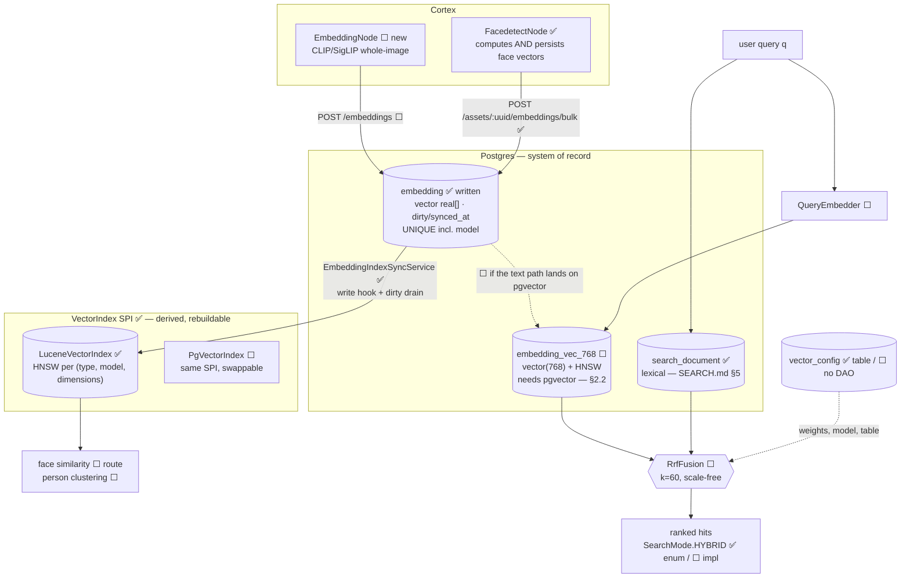

# Semantic & Vector Search — Technical Specification

> **Audience: AI coding agents.** Embedding-based similarity search and hybrid lexical+vector ranking.
>
> **Scope split — do not duplicate:**
> - Lexical search (`search_document`, `SearchProvider` SPI, REST surface, options) → [SEARCH.md](SEARCH.md). **Read it first; it is built.**
> - Remaining build order and task IDs → [SEARCH_PLAN.md](../../concept/SEARCH_PLAN.md) Phase 3.
> - Perceptual **fingerprint** k-NN (a different corpus, on Lucene, **built**) → [LUCENE_PLAN.md](../../concept/LUCENE_PLAN.md).
> - Table/column reference → [../../loom/DOMAIN.md](../../loom/DOMAIN.md).
>
> **Source of truth is the code.** Where a claim here disagrees with the tree, the code wins — fix
> this file in the same change ([../../guidelines/CODING.md](../../guidelines/CODING.md)).

## 0. Status — read this first

🟡 **Text→media semantic search is not built. Face vectors, and the index that serves them, now are.**

`FacedetectNode` writes an embedding per face, `VectorIndex` + `LuceneVectorIndex` answer nearest-neighbour
queries over them, and `embedding` is the system of record with the index as a derived cache. What is still
missing is everything §5 and §6 describe: a whole-image/text model, `QueryEmbedder`, RRF fusion, and the
`SearchMode.SEMANTIC` wiring. A face vector cannot consume the user's `q`, so none of that is unblocked by
the above — see §1.1.

🟡 **But the seams for it are built and tested.** The previous revision of this file opened with
*"nothing here is implemented"*. That is now too broad and misleads an agent into re-designing API
surface that already ships. The lexical Phase 1 landed the vector-mode contract along with it:

| Seam | State | Where |
|---|---|---|
| `SearchMode.{LEXICAL, SEMANTIC, HYBRID}` | ✅ built | `loom-shared/api/…/api/search/SearchMode.java` |
| `SearchCapability.{SEMANTIC, HYBRID}` | ✅ built | `…/api/search/SearchCapability.java` |
| `SearchRequest.mode` / `.profile` (names a `vector_config` row) / `.clusterUuid` | ✅ built, reserved | `SearchRequest.java:29,41,65` |
| `?profile=` query parameter | ✅ built | `SearchQueryParameterKey.PROFILE` |
| **Honest rejection** — `mode=SEMANTIC` ⇒ **400** naming the provider, never a silent lexical fallback | ✅ built **and tested** | `SearchQueryBehaviourTest:183`, `SearchEndpointTest:253`; `/search/status` omits the capability (`SearchEndpointTest:140`) |
| `cluster` rows carry a `search_document` row (searching "Alice" finds the cluster) | ✅ built | `V2.59__add_search_triggers.sql:150`; `SearchEntityType.CLUSTER` |

So §6's mode dispatch and §8 item 1 of the previous revision are **done**. What is missing is the
vector ranker behind the enum value.

### 0.1 What is genuinely absent

| Thing | State |
|---|---|
| `embedding` rows | ✅ Written by `FacedetectNode` (`type='face'`). `EmbeddingDao` gained `findDirty`/`streamAll`/`markSynced`; k-NN lives on `VectorIndex`, not the DAO |
| `VectorIndex` SPI + `LuceneVectorIndex` + `NoopVectorIndex` | ✅ built | `loom-shared/api/…/api/search/VectorIndex.java`, `loom/services/lucene/…/vector/` |
| `POST /assets/:uuid/embeddings/bulk` | ✅ built | `EmbeddingEndpointService.bulkCreateAssetEmbeddings` |
| `/vector-index/{rebuild,sync,status}` | ✅ built | `VectorIndexEndpoint` |
| pgvector / `CREATE EXTENSION vector` / HNSW / IVFFlat / cosine operator anywhere | 🔴 Absent. The only `hnsw` in the tree is Lucene's, in `LuceneSimilarityIndex` ([LUCENE_PLAN.md](../../concept/LUCENE_PLAN.md)) |
| `embedding.vector real[]` (`V2.43`) | ✅ The **system of record**. ANN lives outside Postgres behind `VectorIndex`; `V2.75` added `dirty`/`synced_at`/`index_version`/`normalized`, the dimensions CHECK, and `model` in the unique key |
| `vector_config(name, weights jsonb)` (`V2.6`) | 🟡 Table + jOOQ record only. **No DAO, no endpoint, no reader** |
| `loom/services/qdrant` | 🔴 `pom.xml` + Eclipse metadata, **no `src/`** |
| GraphQL `search` field | 🔴 Absent from `loom/services/graphql/src/main/resources/loom.graphqls` |
| loom-ui | 🔴 No `src/api/search.ts`, no search view — lexical *or* semantic |

✅ **Face embeddings are computed and persisted.** This paragraph used to read *"computed and thrown
away"*, and understated it: they were never computed at all. The node called only `detectFaces(image)`,
which sets no embedding, and video4j's `detectEmbeddings`/`extractEmbeddings` had zero callers, so
`getEmbedding()` returned `null` in the running pipeline. The `VideoFaceScanner:86` `hasEmbedding()` gate
described here had already been deleted — see the comment at `VideoFaceScanner:99-111` explaining that it
silently discarded every face.

Now: `InspireFacedetector.detectFaces(img, withEmbeddings)` (video4j) produces the vectors in the same pass
as the boxes, the video path embeds the selected faces from their crops, and `FacedetectNode.persist(...)`
writes detections and then embeddings, linking each vector to the `detection_uuid` the first call returned.
Controlled by `LOOM_CORTEX_FACEDETECTION_EMBEDDINGS_ENABLED` / `..._EMBEDDING_MODEL`.

⚠️ `FaceStorage.java` is still 85 commented-out lines of a per-asset Avro store. It is dead and superseded;
delete it.

✅ `EmbeddingType` no longer types the embedding path. It was a **closed three-value enum**
(`DLIB_FACE_RESNET_v1`, `VIDEO4J_FINGERPRINT_V1/_V2`) on `Embedding`, `EmbeddingDao` and all four
rest-models, even though the column is `varchar` — so every new model meant a code change and a redeploy,
which is incompatible with the model changing at all. `type` is now a `String` end to end. The enum
survives only as the vocabulary of the legacy `AssetCreateRequest.addEmbedding` fingerprint path, mapped via
`name()`. A `clip` type needs no enum value.

### 0.2 The open decision — closed for face similarity (`V2.75`)

`embedding.vector` stays a plain `real[]` and stays authoritative; the ANN structure lives **outside
Postgres** behind the `VectorIndex` SPI, with Lucene HNSW as the first backend. That avoids §2.2 entirely:
no `CREATE EXTENSION`, no image change, nothing that can break `generate.sh` or `setup-pool.sh`. §2's
pgvector decision still stands for **text→media hybrid ranking**, which is a different question — a face
vector cannot participate in RRF because it cannot consume `q` (§1.1). Both can be true at once; if the
text path later lands on pgvector, `PgVectorIndex` is a second implementation of the same SPI.

The original wording, now superseded:

### 0.2.1 The original open decision

`V2.43__rework_detection_embedding.sql:124` (mirrored into `JooqEmbedding.java`):

> *"Embedding vector as a plain PostgreSQL array. **OPEN DECISION**: similarity search is either
> pgvector in Postgres or an external index fed via `vector_config`. Until that is decided this column
> is a staging buffer with no ANN index."*

[../DB_SCHEMA_FEEDBACK.md](../DB_SCHEMA_FEEDBACK.md) §4.2 asks the same. **§2 resolves it.** The
comment itself must be rewritten in the same change as the migration.

### 0.3 Known schema defects (from [../DB_SCHEMA_FEEDBACK.md](../DB_SCHEMA_FEEDBACK.md) §4.2)

- No ANN index ⇒ any similarity query is a full scan.
- **No dimension constraint** — a 512-d InspireFace vector and a 128-d dlib vector can coexist in one
  column, distinguishable only by the free-text `type`. `dimensions` is stored, not enforced.
- **No exporter contract** — no `synced_at`, `index_version` or `dirty`, so nothing can incrementally
  feed an index.

All three are fixed **and shipped** in `V2.75`, plus a fourth the list did not mention: the unique key
`(asset_uuid, node_kind, type, frame_number, subject_index)` had **no model discriminator**, so re-running a
node under a new model upserted over the old model's row. A model upgrade was therefore destructive and
irreversible — there was no moment at which both vector sets existed to be compared. `model` is now part of
that key.

---

## 1. Target architecture



🔴 Everything below `embedding` in the Postgres box is gated on pgvector being available — see §2.2
for why that is not a given, and §2.3 for the guard.

## 1.1 Two capabilities that get conflated — keep them separate

| | **Text → media** | **Media → media** |
|---|---|---|
| Query | the user's `q` string | an existing asset, region or face crop |
| Requires | a **joint text–image** model (CLIP/SigLIP class) | any embedding model |
| UI | the (still unbuilt) search box | "more like this" / person clustering |
| Composes with lexical search | ✅ yes — hybrid ranking | ❌ no — different query type |

🔴 **Only text→media makes hybrid search meaningful**, because RRF requires both rankers to consume the
*same* query. A face embedding cannot consume `q` at all. That is why §4 recommends the whole-image
node **first** and face second, even though the face vectors already exist in memory.

---

## 2. Decision: pgvector, not Qdrant — for **text→media** only

> 🔴 **Scope.** Everything in this section argues from hybrid ranking: fusing vector hits with lexical hits
> in one SQL statement (§2.1.2), against `search_document`. That argument only applies to a ranker that can
> consume the user's `q`. **Face similarity does not, and is served by Lucene** via `VectorIndex` /
> `LuceneVectorIndex` — the same reasoning that keeps `LuceneSimilarityIndex` off pgvector (§2.2). The two
> decisions do not conflict; a later `PgVectorIndex` is one more implementation of the same SPI.

> ⚠️ **A second vector workload already ships.** Perceptual **fingerprint** similarity (near-duplicate
> video detection) is served by a Lucene HNSW index — `LuceneSimilarityIndex` in
> `loom/services/lucene`, **built and verified** ([LUCENE_PLAN.md](../../concept/LUCENE_PLAN.md)). Different corpus
> (one 256-dim fingerprint per asset), different question ("same recording?" vs "about this?"). It
> deliberately avoids pgvector because it must not depend on a Postgres extension — see §2.2. Its
> `SimilarityIndex` SPI mirrors the `VectorIndex` SPI in §8, so the two can be unified later if that
> ever pays off. **Do not delete `loom/services/lucene`; it is not a stub.**

### 2.1 Rationale

1. **Zero embeddings exist today** (§0.1). Operating a separate vector database for a feature with no
   data is premature. Postgres is already deployed, backed up and monitored everywhere.
2. **Hybrid ranking is a join problem.** Fusing vector hits with lexical hits *and* mime/library/tag
   filters is one SQL statement against `search_document ⋈ embedding_vec`. Qdrant makes it two round
   trips, payload duplication, and a **third** consistency surface on top of the Elasticsearch one
   ([SEARCH.md](SEARCH.md) §3).
3. **Deletion propagation is free.** `embedding` already cascades from `asset` and `detection`.
4. **ACL filtering is free.** `library_uuids && :allowed` in SQL versus a Qdrant payload filter that
   must track `library_asset` membership ([SEARCH.md](SEARCH.md) §8.3).

### 2.2 🔴 The cost, stated plainly

**pgvector is not in the stock `postgres` image.** Every one of these pins a plain image:

| Location | Image |
|---|---|
| `start-postgres.sh:6` | `postgres:16.3-bullseye` |
| `test-database/docker-compose.yaml:5` | `postgres:16.3-bullseye` |
| `test-database/podman-compose.yml:6` | `postgres:16.3-bullseye` |
| `loom/db/jooq/pom.xml:109` | 🔴 `postgres:latest` — **jOOQ codegen Testcontainer** |
| `helm/loom/values.yaml` | `postgres:17-alpine` |
| testdatabase-provider template DB | inherits the above |

An unconditional `CREATE EXTENSION vector` breaks `loom/db/jooq/generate.sh`, breaks
`./setup-pool.sh`, breaks every developer's local Postgres and breaks the Helm bundled database. That
is the hardest constraint in this document — **it means nobody can build**, not merely that semantic
search is unavailable.

### 2.3 🔴 Mitigation — the migration must be self-disabling

```sql
DO $$
BEGIN
  IF EXISTS (SELECT 1 FROM pg_available_extensions WHERE name = 'vector') THEN
    CREATE EXTENSION IF NOT EXISTS vector;
    CREATE TABLE "embedding_vec_768" ( ... );
    CREATE INDEX ON "embedding_vec_768" USING hnsw ("vec" vector_cosine_ops);
  ELSE
    RAISE NOTICE 'pgvector unavailable - semantic search will be disabled';
  END IF;
END $$;
```

Paired with a boot-time check that flips `semanticEnabled` to `false` with a warning when
`embedding_vec_768` is absent, and omits `SEMANTIC`/`HYBRID` from `SearchCapability` so
`/search/status` reports the truth. **The rejection path this feeds already exists** (§0) — the boot
check only has to keep the capability set honest.

**The alternative** — switching every image to `pgvector/pgvector:pg17` — is cleaner but is an
infrastructure decision spanning local dev, CI and Helm. The guard is what lets Phase 3 land without
blocking on it. [SEARCH_PLAN.md](../../concept/SEARCH_PLAN.md) P3-2 is the spike that picks one.

### 2.4 When to revisit Qdrant

Move to an external vector store when **any** of these holds:

- more than ~20M vectors (pgvector HNSW is comfortable to roughly 10M on commodity hardware),
- p95 ANN latency above 200 ms at the target recall,
- a requirement for per-tenant collection isolation.

A `VectorIndex` SPI — sibling of `SearchProvider`, same shape, same Dagger binding — makes that a
module swap rather than a rewrite. ⚠️ `io.metaloom.qdrant:qdrant-java-http-client` exists in the local
`.m2` but is referenced by **no** pom here, and most entries are `.lastUpdated` markers. Treat
availability as unverified.

---

## 3. Schema changes

🔴 **New migration is `V2.64` or later.** `V2.60`–`V2.63` landed after the search work
(`pipeline_node_task_element_seq`, `dedup_group`, `dedup` permission, `library_storage_pool`); the
previous revision of this file said `V2.60+` and is stale. Check `ls
loom/db/flyway/src/main/resources/db/migration/ | sort -V | tail -1` before choosing a number. The
whole migration sits **inside the `pg_available_extensions` guard** from §2.3.

### 3.1 Keep `vector real[]` as the staging column

🔴 **Do not convert `embedding.vector`.** It stays the canonical staging buffer so a later provider
swap never loses data. `embedding_vec_*` is a **derived, rebuildable index** — droppable and
regenerable from `embedding` at any time. Rewrite the `V2.43` column comment (§0.2) in the same change.

### 3.2 Fix the three defects

```sql
-- Enforce what `dimensions` already claims (§0.3)
ALTER TABLE "embedding" ADD CONSTRAINT "embedding_dimensions_check"
  CHECK (array_length("vector", 1) = "dimensions");

-- Exporter contract, mirroring search_document (SEARCH.md §5.2)
ALTER TABLE "embedding" ADD COLUMN "synced_at"     timestamp WITHOUT TIME ZONE NOT NULL DEFAULT now();
ALTER TABLE "embedding" ADD COLUMN "index_version" int     NOT NULL DEFAULT 1;
ALTER TABLE "embedding" ADD COLUMN "dirty"         boolean NOT NULL DEFAULT true;
ALTER TABLE "embedding" ADD COLUMN "normalized"    boolean NOT NULL DEFAULT false;

CREATE INDEX "idx_embedding_type_model" ON "embedding" ("type", "model");
CREATE INDEX "idx_embedding_dirty"      ON "embedding" ("synced_at") WHERE "dirty";
```

⚠️ The `CHECK` would fail on pre-existing bad rows — there are none (§0.1), which makes now the
cheapest possible moment to add it.

### 3.3 The ANN table

```sql
CREATE TABLE "embedding_vec_768" (
    "embedding_uuid" uuid PRIMARY KEY REFERENCES "embedding" ("uuid") ON DELETE CASCADE,
    "asset_uuid"     uuid NOT NULL REFERENCES "asset" ("uuid") ON DELETE CASCADE,
    "type"           varchar NOT NULL,
    "vec"            vector(768) NOT NULL
);
CREATE INDEX ON "embedding_vec_768" USING hnsw ("vec" vector_cosine_ops);
CREATE INDEX ON "embedding_vec_768" ("asset_uuid");
```

**One table per (family, dimension), created on demand.** 🔴 pgvector permits an unconstrained
`vector` column but **cannot index one** — HNSW and IVFFlat both require a fixed dimension, so a single
table cannot hold a 768-d SigLIP and a 512-d InspireFace vector and be indexed.

⚠️ Declarative `PARTITION BY LIST (dimensions)` with per-partition column narrowing is the elegant
answer, but it is **not confirmed** that pgvector allows a partition child to narrow `vector` →
`vector(768)`. Do not promote it to fact. Ship exactly **one** table for the one model that exists;
add a second table plus a `vector_config` row naming it when a second model arrives.

**Cosine vs. inner product:** normalize at write time and record it in `normalized`. With normalized
vectors the two rank identically, so the operator class stops mattering — and `normalized` makes the
assumption auditable rather than implicit.

Regenerate jOOQ afterwards: `loom/db/jooq/generate.sh`, then `./setup-pool.sh`.

---

## 4. Which node writes embeddings first

**Recommendation: a new `EmbeddingNode` producing CLIP/SigLIP-class whole-image (and sampled-frame)
embeddings. Not face.** Reason in §1.1: only a joint text–image model makes the user's `q` embeddable.

| Order | Node | `type` | `detection_uuid` | Purpose |
|---|---|---|---|---|
| 1 | new `cortex/nodes/embedding` — `EmbeddingNode` | `clip` | NULL | text→media search, hybrid, "more like this" |
| 2 | ✅ **done** — `FacedetectNode` computes and persists | `face` | set | person clustering — **not** text search |
| 3 | transcript-chunk text embeddings | `text` | NULL | semantic transcript retrieval, RAG for the agent |

**Node 1** follows the `cortex/nodes/captioning/` module layout: `EmbeddingNode extends
AbstractMediaNode<EmbeddingNodeOptions>`, `name() = "embedding"`, an HTTP client to the inference host,
`node_kind='embedding'`, `subject_index=0`, `frame_number` = the sampled frame for video. It needs a
`NodeDescriptor` + `*DescriptorProvider` with real ports and a `NodePortConformanceTest` entry
([../pipeline/NODE_DATA_TYPES.md](../pipeline/NODE_DATA_TYPES.md)). Persist via
`client().createEmbedding(...)` **and** an `asset_node_result` ledger row — the two-step pattern
`WhisperNode` establishes ([../pipeline-nodes/NODES.md](../nodes/NODES.md) §2).

⚠️ **The inference host needs a spike** ([SEARCH_PLAN.md](../../concept/SEARCH_PLAN.md) P3-1): ONNX Runtime
in-process versus a Python sidecar under `sidecars/` (precedent: `sidecars/tts` FastAPI service;
node-side precedent: `CaptioningNode → SmolVLMClient → FastAPI`). The choice fixes the dimension, which
fixes the table name in §3.3.

🔴 **Chunk collision for node 3.** `embedding`'s unique key is
`(asset_uuid, node_kind, type, frame_number, subject_index)` — **no chunk discriminator**. Two
transcript chunks from the same asset collide and the second silently overwrites the first. Encode the
chunk index in `subject_index` and document it at the call site, or change the constraint.

---

## 5. Hybrid ranking — Reciprocal Rank Fusion

```
score(d) = Σ_r  w_r / (k + rank_r(d))          k = 60
```

🔴 **Not a linear blend of scores.** `ts_rank_cd` is unnormalized and corpus-dependent; cosine
similarity is bounded 0..1. They are not comparable, and any weighting that works today drifts as the
catalog grows. RRF is scale-free, needs zero calibration, degrades gracefully when one ranker returns
nothing, and is what Elasticsearch 8.9+/OpenSearch implement natively — so a Phase 2 provider gets it
for free.

Initial weights: lexical 1.0, vector 1.0, trigram 0.5. Take the top 200 from each ranker before fusing.

```sql
WITH lex AS (
  SELECT entity_type, entity_uuid,
         ROW_NUMBER() OVER (ORDER BY <rank expression> DESC) AS r
  FROM search_document
  WHERE <match condition>                        -- SEARCH.md §10.1
  LIMIT 200
), vec AS (
  SELECT e.asset_uuid AS entity_uuid, 'asset'::varchar AS entity_type,
         ROW_NUMBER() OVER (ORDER BY v.vec <=> :qvec) AS r
  FROM embedding_vec_768 v JOIN embedding e ON e.uuid = v.embedding_uuid
  WHERE v.type = :embeddingType
  ORDER BY v.vec <=> :qvec
  LIMIT 200
)
SELECT COALESCE(lex.entity_type, vec.entity_type) AS entity_type,
       COALESCE(lex.entity_uuid, vec.entity_uuid) AS entity_uuid,
       COALESCE(:wLex / (:k + lex.r), 0) + COALESCE(:wVec / (:k + vec.r), 0) AS score
FROM lex FULL OUTER JOIN vec USING (entity_type, entity_uuid)
ORDER BY score DESC
LIMIT :limit OFFSET :offset;
```

Facet, ACL and mime filters apply to **both** CTEs — the "one SQL statement" advantage from §2.1.
`SearchRequest.mode` already selects the path and already rejects unsupported modes (§0); implementing
this means **adding a capability, not adding an enum**.

---

## 6. `vector_config` — the search-profile registry

`vector_config(name unique, weights jsonb)` (`V2.6`) has a jOOQ record and nothing else.
`SearchRequest.profile` and the `?profile=` query parameter already point at it (§0). Give it meaning:

```json
{
  "lexical": 1.0, "vector": 1.0, "trigram": 0.5, "rrf_k": 60,
  "embedding_type": "clip",
  "model": "siglip-base-patch16-224",
  "dimensions": 768,
  "table": "embedding_vec_768"
}
```

Consequences worth having: hybrid weights become **data rather than env vars**, a model upgrade is a
row insert plus a backfill instead of a deploy, and A/B'ing two rankings needs no code.

Work: `VectorConfigDao` + `DaoCollection.vectorConfigDao()`, a `default` profile seeded by the
migration, and read-only `GET /api/v1/vector-configs` (plural, per
[../../guidelines/CODING.md](../../guidelines/CODING.md)). Writes can stay migration-only initially.

## 7. `cluster` and `embedding_cluster`

Clusters are the **output** of similarity, not an input to search.

1. ✅ **Done** — `cluster` already gets a `search_document` row (`V2.59:150`), so searching a cluster
   label finds it. No vectors were needed.
2. ⬜ `SearchRequest.clusterUuid` (field exists) filters results to assets containing a member
   embedding — needs the provider side.
3. ⬜ The clustering job consumes `embedding_vec` ANN neighbours instead of an O(n²) scan — a
   follow-up, not part of search.

---

## 8. Key Classes Reference

**Existing** (do not recreate):

| Class | Package / module | Relevance |
|---|---|---|
| `SearchMode` / `SearchCapability` | `io.metaloom.loom.api.search` (`loom-shared/api`) | `SEMANTIC`/`HYBRID` values already defined; rejection path already tested |
| `SearchRequest` | same | `mode`, `profile`, `clusterUuid` fields already reserved |
| `SearchProvider` / `PostgresSearchProvider` | `…/api/search`, `io.metaloom.loom.db.jooq.search` | The SPI a vector-capable provider extends |
| `SearchOptions` | `io.metaloom.loom.api.options` | Where the `LOOM_SEARCH_*` vars in §9 land |
| `EmbeddingDao` / `Embedding` | `io.metaloom.loom.db.model.embedding` | CRUD + `upsertEmbedding`; **no kNN method** |
| `SimilarityIndex` / `LuceneSimilarityIndex` | `io.metaloom.loom.similarity[.lucene]` | The *fingerprint* index — the shape `VectorIndex` should mirror ([LUCENE_PLAN.md](../../concept/LUCENE_PLAN.md)) |
| `VideoFace` / `VideoFaceScanner` | `io.metaloom.cortex.node.facedetect.video` | Where the face vectors are produced (`scan(video, n, withEmbeddings)`) |
| `VectorIndex` / `VectorSpace` / `VectorRecord` / `VectorQuery` / `VectorHit` | `io.metaloom.loom.api.search` | ✅ built — the ANN SPI. Every operation is scoped by `(type, model, dimensions)` |
| `LuceneVectorIndex` / `NoopVectorIndex` | `io.metaloom.loom.vector[.lucene]` | ✅ built — HNSW backend and its honest-rejection fallback |
| `EmbeddingIndexSyncService` / `EmbeddingIndexDrainer` | `io.metaloom.loom.rest.vector` | ✅ built — write hook, dirty drain, rebuild |
| `VectorIndexOptions` | `io.metaloom.loom.api.options` | ✅ built — the `LOOM_VECTOR_INDEX_*` vars |

**To be created** (nothing below exists):

| Class | Package / module | Purpose |
|---|---|---|
| `PgVectorIndex` | `io.metaloom.loom.db.jooq.search` | pgvector implementation **of the existing `VectorIndex` SPI**, if the text path needs it |
| `RrfFusion` | `io.metaloom.loom.api.search` | Rank fusion, shared by both providers |
| `QueryEmbedder` | `io.metaloom.loom.db.jooq.search` | Embeds the user's `q` for text→media |
| `VectorConfigDao` | `io.metaloom.loom.db.model.vector` | Search-profile registry (§6) |
| `EmbeddingNode` / `EmbeddingNodeOptions` / `EmbeddingClient` | `io.metaloom.cortex.node.embedding` | New Cortex node (§4) |

## 9. Configuration

**Shipped:** the 10 `LOOM_SEARCH_*` vars on `SearchOptions` — see [SEARCH.md](SEARCH.md) §9 — plus the six
`LOOM_VECTOR_INDEX_*` vars on `VectorIndexOptions`, which govern the face vector index:

| Env var | Default | Meaning |
|---|---|---|
| `LOOM_VECTOR_INDEX_PROVIDER` | `none` | `none` \| `lucene`. An unknown value is **rejected at boot**, never silently ignored |
| `LOOM_VECTOR_INDEX_PATH` | `vector-index` | On-disk index directory, separate from the fingerprint index |
| `LOOM_VECTOR_INDEX_TOPK` | `10` | Default neighbours per query |
| `LOOM_VECTOR_INDEX_SCORE_THRESHOLD` | `0.35` | Similarity floor |
| `LOOM_VECTOR_INDEX_SYNC_INTERVAL_MS` | `5000` | Dirty-row drain interval; `0` disables the background drain |
| `LOOM_VECTOR_INDEX_SYNC_BATCH_SIZE` | `500` | Rows per drain pass |

Node side: `LOOM_CORTEX_FACEDETECTION_EMBEDDINGS_ENABLED` (default `true`) and
`LOOM_CORTEX_FACEDETECTION_EMBEDDING_MODEL` (default `inspireface-r18`).

**None of the following exist yet**; they extend `SearchOptions`.

| Env var | Default | Meaning |
|---|---|---|
| `LOOM_SEARCH_SEMANTIC_ENABLED` | `false` | Master switch. 🔴 Force-disabled at boot when pgvector is absent (§2.3) |
| `LOOM_SEARCH_VECTOR_PROVIDER` | `pgvector` | `pgvector` \| `qdrant` \| `none` |
| `LOOM_SEARCH_VECTOR_TABLE` | `embedding_vec_768` | Overridden per profile by `vector_config` |
| `LOOM_SEARCH_VECTOR_TYPE` | `clip` | Which `embedding.type` participates in text→media search |
| `LOOM_SEARCH_VECTOR_TOPK` | `200` | Candidates pulled from the ANN index before fusion |
| `LOOM_SEARCH_RRF_K` | `60` | Fusion constant |
| `LOOM_SEARCH_RRF_WEIGHT_LEXICAL` | `1.0` | |
| `LOOM_SEARCH_RRF_WEIGHT_VECTOR` | `1.0` | |
| `LOOM_SEARCH_HNSW_EF_SEARCH` | `100` | Recall/latency trade-off (`SET LOCAL hnsw.ef_search`) |
| `LOOM_SEARCH_EMBED_SYNC_INTERVAL_MS` | `5000` | `embedding` → `embedding_vec` drain interval |
| `LOOM_SEARCH_EMBED_URL` | `""` | Query-embedding inference host |

⚠️ Every new var needs a `@EnvironmentVariable` annotation and a `validate()` branch, matching the ten
that already exist, or `LoomConfigGenerator` output and the website config docs go stale.

## 10. Test Setup

🔴 **After the migration: `loom/db/jooq/generate.sh`, then `./setup-pool.sh`.** Codegen re-runs every
migration in a `postgres:latest` Testcontainer (§2.2), so the §2.3 guard is what keeps codegen working.
Make that an explicit test step, not an assumption.

- **`PgVectorIndexTest`** (`loom/db/jooq/src/test/java/.../search/`):
  - 🔴 **the guard itself** — the migration applies cleanly on a Postgres image **without** pgvector,
    leaves `embedding_vec_768` absent, and the boot check then reports `semanticEnabled=false`. This is
    the test that protects everyone's build.
  - dimension `CHECK` rejects a vector whose length disagrees with `dimensions`
  - kNN returns the nearest neighbour for a planted vector
  - `ON DELETE CASCADE`: deleting an `embedding` removes its `embedding_vec` row; deleting an asset
    removes both — **and nothing else** (CODING.md's cascade rule)
  - `dirty` drain marks rows synced; a rebuild from `embedding` reproduces `embedding_vec` exactly
- **`HybridRankingTest`** — a fixture where the lexical and vector rankers disagree; assert the RRF
  order matches a hand-computed expectation, and that `k` and the weights actually change the order (a
  fusion that ignores its parameters is a common silent bug).
- ✅ **Mode rejection is already covered** (`SearchQueryBehaviourTest`, `SearchEndpointTest`). Extend
  those two rather than writing a third: once the capability is advertised, the assertions invert.
- **`EmbeddingNode` tests** per [../pipeline-nodes/NODES.md](../nodes/NODES.md): unit test with
  a mocked client; a persistence test asserting both the `embedding` row **and** the
  `asset_node_result` ledger row; an options `validate()` test; a `NodePortConformanceTest` entry; and a
  per-node E2E in `integration-test` extending `AbstractNodeIntegrationTest` with the model client
  **mocked** — no GPU in CI.
- **Demo data** — CI has no model, so seed a handful of small deterministic synthetic vectors with a
  documented `type` in `DemoDatabaseInitializer`, so the UI has something to show and the e2e test
  something to assert.

## 11. Conventions and Gotchas

| Area | Gotcha |
|---|---|
| **Status drift** | ⚠️ "Nothing is implemented" is now wrong at the API layer — `SearchMode`, `SearchCapability`, `SearchRequest.{mode,profile,clusterUuid}` and the 400-rejection path ship (§0). Extend them; do not redesign them |
| **pgvector availability** | 🔴 Not in the stock image. An unguarded `CREATE EXTENSION vector` breaks `generate.sh`, `setup-pool.sh`, local Postgres and the Helm DB — **nobody can build** (§2.2, §2.3) |
| **Migration numbering** | ⚠️ `V2.60`–`V2.63` are taken. Read the directory; never copy a version number out of a spec file |
| **ANN needs a fixed dimension** | 🔴 HNSW/IVFFlat cannot index an unconstrained `vector`. One table per (family, dimension) (§3.3) |
| **Partitioning by dimension** | ⚠️ Unverified that a partition child can narrow `vector` → `vector(768)`. Do not build on it |
| **Staging column** | 🔴 Never convert `embedding.vector real[]`. `embedding_vec_*` is derived and rebuildable (§3.1) |
| **Chunk collision** | 🔴 `embedding`'s unique key has no chunk discriminator — transcript chunk 2 overwrites chunk 1 unless encoded in `subject_index` (§4) |
| **Score fusion** | 🔴 Never linearly blend `ts_rank_cd` with cosine — incomparable scales. Use RRF (§5) |
| **Silent degradation** | 🔴 A provider lacking `SEMANTIC` must **reject** the mode. Already enforced; keep it that way |
| **Face vs. text** | ⚠️ Face embeddings cannot consume a text query, so they cannot drive hybrid search. Whole-image first (§1.1, §4) |
| **`EmbeddingType`** | ✅ Gone from the embedding path — `type` is a `String` everywhere. The enum remains only as the legacy `AssetCreateRequest.addEmbedding` fingerprint vocabulary. A new embedding kind needs no code change |
| **Model changes** | 🔴 `model` is part of both the SQL unique key and the `VectorSpace`. Change `LOOM_CORTEX_FACEDETECTION_EMBEDDING_MODEL` whenever the model pack changes, or two incompatible vector populations merge under one name |
| **Detection ↔ embedding order** | 🔴 The node pairs vectors to detection uuids **by position** in the bulk response, and refuses to write if the counts disagree. Do not "fix" that guard by zipping the shorter list |
| **`detectEmbeddings(VideoFrame)`** | 🔴 Runs detection **unfiltered**, so its ordinals do not match `detectFaces`. Never zip the two — use `detectFaces(img, true)` |
| **Two Lucene indexes** | ⚠️ `LuceneSimilarityIndex` (fingerprints, one vector per asset) and `LuceneVectorIndex` (embeddings, many per asset) are separate directories and separate writers. Do not merge them |
| **Lucene module** | ⚠️ `loom/services/lucene` is **built** (fingerprint k-NN), not a stub. `loom/services/qdrant` and `loom/services/elasticsearch` are the empty ones |
| **Normalization** | ⚠️ Normalize at write time and record it in `normalized`; then cosine and inner product rank identically |

## 12. Where do I find …?

| Need | Look here |
|---|---|
| Lexical search design (SPI, REST, `search_document`) — **built** | [SEARCH.md](SEARCH.md) |
| Task order, IDs and dependencies | [SEARCH_PLAN.md](../../concept/SEARCH_PLAN.md) Phase 3 |
| Fingerprint k-NN (the other vector index) — **built** | [LUCENE_PLAN.md](../../concept/LUCENE_PLAN.md) |
| Table/column reference for `embedding`, `cluster`, `vector_config` | [../../loom/DOMAIN.md](../../loom/DOMAIN.md) |
| The original open decision | `V2.43__rework_detection_embedding.sql:124`; [../DB_SCHEMA_FEEDBACK.md](../DB_SCHEMA_FEEDBACK.md) §4.2 |
| DDL | `loom/db/flyway/src/main/resources/db/migration/{V2.43,V2.12,V2.6}…` |
| The mode/capability seams | `loom-shared/api/src/main/java/io/metaloom/loom/api/search/{SearchMode,SearchCapability,SearchRequest}.java` |
| Face vectors that are currently discarded | `cortex/nodes/facedetect/core/.../video/{VideoFace,VideoFaceScanner}.java` |
| Node result persistence pattern | [../pipeline-nodes/NODES.md](../nodes/NODES.md) §2; `WhisperNode` |
| Port/descriptor obligations for a new node | [../pipeline/NODE_DATA_TYPES.md](../pipeline/NODE_DATA_TYPES.md) |
| Sidecar precedent for a Python model server | `sidecars/tts/`; `cortex/nodes/captioning/` (`SmolVLMClient`) |
| Postgres image pins to change or guard | `start-postgres.sh`, `test-database/*.y*ml`, `loom/db/jooq/pom.xml:109`, `helm/loom/values.yaml` |

## 13. Progress Assessment

**Already built — do not re-plan** (§0)

- [x] `SearchMode.{SEMANTIC,HYBRID}` and `SearchCapability.{SEMANTIC,HYBRID}`
- [x] `SearchRequest.{mode, profile, clusterUuid}` and the `?profile=` query parameter
- [x] Honest 400 rejection of an unsupported mode + `/search/status` capability reporting, with tests
- [x] `cluster` rows indexed into `search_document` (`V2.59`) — searchable with no vectors at all
- [x] Fingerprint k-NN on Lucene ([LUCENE_PLAN.md](../../concept/LUCENE_PLAN.md)) — a separate, working vector path

**Decisions closed by this document**

- [x] pgvector over an external vector store, with a stated revisit trigger (§2)
- [x] RRF (k=60) over linear score blending (§5)
- [x] Whole-image CLIP/SigLIP embeddings before face embeddings (§1.1, §4)
- [x] `vector_config` repurposed as the search-profile registry (§6)
- [ ] The `V2.43` column comment still says "OPEN DECISION" — rewrite it with the migration

**Spikes that gate everything else**

- [ ] P3-1 — embedding model + inference host (ONNX in-process vs. `sidecars/`); fixes the dimension
- [ ] P3-2 — pgvector availability: change the images, or ship the `pg_available_extensions` guard

**Implementation**

- [ ] Guarded migration (`V2.64+`): `embedding_vec_768` + HNSW; `array_length` CHECK;
      `synced_at`/`dirty`/`index_version`/`normalized`; `(type, model)` and partial-dirty indexes (§3)
- [ ] Boot check that force-disables semantic search when the table is absent (§2.3)
- [ ] `VectorConfigDao` + `GET /api/v1/vector-configs` + seeded `default` profile (§6)
- [ ] `cortex/nodes/embedding` — node, client, options, descriptor provider, Dagger wiring,
      `NodeCollectionModule` registration (§4)
- [ ] `EmbeddingSyncService` — `embedding` → `embedding_vec` drain (§3.2)
- [ ] `VectorIndex` SPI + `PgVectorIndex`; `QueryEmbedder`; wire `SearchMode.SEMANTIC` (§5)
- [ ] `RrfFusion` + `SearchMode.HYBRID`; advertise the capabilities (§5)
- [ ] `SearchRequest.clusterUuid` honoured by the provider (§7 item 2)
- [ ] Elasticsearch `dense_vector` population + native `rrf`/`knn` (the field is declared in the Phase 2
      mapping, so no reindex is needed)
- [x] `FacedetectNode` computes and persists InspireFace vectors (§4 order 2)
- [x] `VectorIndex` SPI + `LuceneVectorIndex` + `NoopVectorIndex`, bound by `VectorIndexModule`
- [x] `EmbeddingIndexSyncService` write hook + `EmbeddingIndexDrainer` dirty drain
- [x] `POST /assets/:uuid/embeddings/bulk`; `/vector-index/{rebuild,sync,status}`
- [x] `V2.75` — exporter columns, dimensions CHECK, `model` in the unique key
- [x] `EmbeddingType` removed from the embedding path; `type` is free text
- [ ] Face similarity **query** route (`/assets/:uuid/similar-faces`) and person clustering off `embedding_cluster` — the SPI is shaped for it, nothing calls it yet
- [ ] UI: there is **no search UI at all yet** — the mode toggle, "more like this" and cluster filter
      come after [SEARCH_PLAN.md](../../concept/SEARCH_PLAN.md)'s loom-ui work, not before it
- [ ] Tests per §10 — **including the guard test that protects the build**
- [ ] Website docs + spec sync ([../../guidelines/CODING.md](../../guidelines/CODING.md))

**Known gaps this document does not close**

- [ ] `embedding`'s unique key has no chunk discriminator (§4)
- [ ] Whether pgvector supports per-partition dimension narrowing (§3.3)
- [ ] Nothing has ever written an embedding, so all latency and recall figures here are estimates

---
_Git HEAD revision: `742dae2d`_
_Last updated: 2026-08-06 (reference sweep — no content changes)_