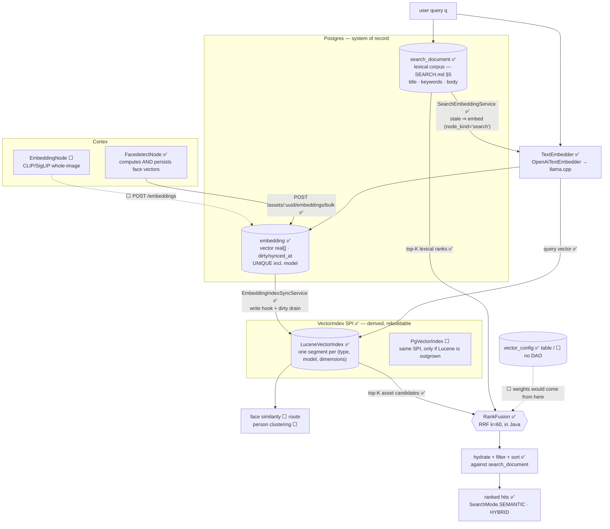

# Semantic & Vector Search — Technical Specification

> **Audience: AI coding agents.** Embedding-based similarity search and hybrid lexical+vector ranking.
>
> **Scope split — do not duplicate:**
> - Lexical search (`search_document`, `SearchProvider` SPI, REST surface, options) → [SEARCH.md](SEARCH.md). **Read it first; it is built.**
> - Remaining build order and task IDs → [SEARCH_PLAN.md](../../concept/SEARCH_PLAN.md) Phase 3.
> - Perceptual **fingerprint** k-NN (a different corpus, on Lucene, **built**) → [LUCENE_PLAN.md](../../concept/LUCENE_PLAN.md).
> - Table/column reference → [../../loom/DOMAIN.md](../../loom/DOMAIN.md).
>
> **Source of truth is the code.** Where a claim here disagrees with the tree, the code wins — fix
> this file in the same change ([../../guidelines/CODING.md](../../guidelines/CODING.md)).

## 0. Status — read this first

✅ **Text→text semantic search is built and green.** `SearchMode.SEMANTIC` and `SearchMode.HYBRID` are
served by `PostgresSearchProvider`, over embeddings of the documents `search_document` already assembles.
Off by default (`LOOM_SEARCH_SEMANTIC_ENABLED=false`); switched on, the provider advertises the two
capabilities and the loom-ui mode toggle appears on its own.

🟡 **Text→*image* semantic search is still not built** — that is the CLIP/SigLIP path in §4, and it is a
different thing: it finds a photo of a red bicycle that carries no text at all. What ships today reaches
an asset through the text Loom holds about it (transcript, OCR, caption, tags, filename), which is a large
fraction of the value at a fraction of the cost, and it lands the ranking machinery — `TextEmbedder`, RRF
fusion, capability gating — that the CLIP path will reuse unchanged. Its remaining work is a vector
producer, not a ranker.

**What was built, and where it departs from the plan below.** Read §0.4 before §2–§6: this section's
design predates the decision to reuse the `VectorIndex` SPI, and three of its choices were overtaken.

The contract the lexical phase reserved is now filled in rather than merely declared:

| Seam | State | Where |
|---|---|---|
| `SearchMode.{LEXICAL, SEMANTIC, HYBRID}` | ✅ built | `loom-shared/api/…/api/search/SearchMode.java` |
| `SearchCapability.{SEMANTIC, HYBRID}` | ✅ **advertised** when an embedder and an index are both live, recomputed per call so a host that dies retracts it | `PostgresSearchProvider.capabilities()` |
| `SearchRequest.mode` | ✅ **served** | `PostgresSearchProvider.fusedSearch` |
| `SearchRequest.profile` / `?profile=` / `.clusterUuid` | 🟡 still built-and-reserved — nothing reads them (§6, §7) | `SearchRequest.java` |
| **Honest rejection** — an unsupported mode ⇒ **400**, never a silent lexical fallback | ✅ still true, and the message now names *which* of the three causes applies | `SearchSemanticQueryTest`, `SearchEndpointTest:253` |
| **Honest outage** — an embedding host that fails mid-query ⇒ **503**, never an empty result | ✅ built + tested | `SearchSemanticQueryTest` |
| `cluster` rows carry a `search_document` row (searching "Alice" finds the cluster) | ✅ built | `V2.59__add_search_triggers.sql:150`; `SearchEntityType.CLUSTER` |

### 0.1 Component inventory

| Thing | State |
|---|---|
| `embedding` rows | ✅ Written by `FacedetectNode` (`type='face'`) **and by `SearchEmbeddingService` (`node_kind='search'`, `type='text'`)**. `EmbeddingDao` gained `findDirty`/`streamAll`/`markSynced`; k-NN lives on `VectorIndex`, not the DAO |
| `VectorIndex` SPI + `LuceneVectorIndex` + `NoopVectorIndex` | ✅ built | `loom-shared/api/…/api/search/VectorIndex.java`, `loom/services/lucene/…/vector/` |
| `POST /assets/:uuid/embeddings/bulk` | ✅ built | `EmbeddingEndpointService.bulkCreateAssetEmbeddings` |
| `/vector-index/{rebuild,sync,status}` | ✅ built, **superseded** | `VectorIndexEndpoint`. Kept as a deprecated delegate; the operator surface is now `/api/v1/search-indices`, which is per-space rather than per-backend and reports size, model and backlog — [SEARCH_INDEX_ADMIN.md](SEARCH_INDEX_ADMIN.md) |
| pgvector / `CREATE EXTENSION vector` / HNSW / IVFFlat / cosine operator anywhere | 🔴 Absent, and **no longer needed for the text path** (§0.4). The only `hnsw` in the tree is Lucene's ([LUCENE_PLAN.md](../../concept/LUCENE_PLAN.md)) |
| `embedding.vector real[]` (`V2.43`) | ✅ The **system of record**. ANN lives outside Postgres behind `VectorIndex`; `V2.75` added `dirty`/`synced_at`/`index_version`/`normalized`, the dimensions CHECK, and `model` in the unique key |
| `vector_config(name, weights jsonb)` (`V2.6`) | 🟡 Table + jOOQ record only. **No DAO, no endpoint, no reader** — fusion weights are `LOOM_SEARCH_RRF_*` env vars today, so §6 is still owed and `?profile=` still reaches nothing |
| `TextEmbedder` SPI + `OpenAiTextEmbedder` + `NoopTextEmbedder` | ✅ built | `loom-shared/api/…/api/search/TextEmbedder.java`, `loom/core/…/core/search/` |
| `RankFusion` (RRF) | ✅ built + 13 unit tests | `loom-shared/api/…/api/search/RankFusion.java` |
| `SearchMode.{SEMANTIC,HYBRID}` served rather than rejected | ✅ built + 20 tests | `PostgresSearchProvider.fusedSearch`, `SearchSemanticQueryTest` |
| Document → embedding pass | ✅ built | `SearchEmbeddingService` + `SearchEmbeddingDrainer` |
| Embedding inference host | ✅ `sidecars/llamacpp-embeddings` — the llama.cpp image again, with `--embeddings`. **Resolves the P3-1 spike**: no ONNX-in-process, no new Python sidecar |
| CLIP/SigLIP **image** embeddings | 🔴 Absent. This is what §4 still describes and the only reason text→image search does not work |
| `loom/services/qdrant` | 🔴 `pom.xml` + Eclipse metadata, **no `src/`** |
| GraphQL `search` field | 🔴 Absent from `loom/services/graphql/src/main/resources/loom.graphqls` |
| loom-ui — lexical | ✅ built. `src/api/search.ts`, `SearchContext`, `/search` view, sidebar field with typeahead |
| loom-ui — semantic | ✅ **Nothing was owed.** `SearchView.tsx` already renders a LEXICAL/SEMANTIC/HYBRID toggle *gated on the capability*, so it is invisible under the Postgres provider and lights up on its own the moment `/search/status` advertises `SEMANTIC`. Asserted both ways: `search-mocked.spec.ts:404,414` |

✅ **Face embeddings are computed and persisted.** This paragraph used to read *"computed and thrown
away"*, and understated it: they were never computed at all. The node called only `detectFaces(image)`,
which sets no embedding, and video4j's `detectEmbeddings`/`extractEmbeddings` had zero callers, so
`getEmbedding()` returned `null` in the running pipeline. The `VideoFaceScanner:86` `hasEmbedding()` gate
described here had already been deleted — see the comment at `VideoFaceScanner:99-111` explaining that it
silently discarded every face.

Now: `InspireFacedetector.detectFaces(img, withEmbeddings)` (video4j) produces the vectors in the same pass
as the boxes, the video path embeds the selected faces from their crops, and `FacedetectNode.persist(...)`
writes detections and then embeddings, linking each vector to the `detection_uuid` the first call returned.
Controlled by `LOOM_CORTEX_FACEDETECTION_EMBEDDINGS_ENABLED` / `..._EMBEDDING_MODEL`.

⚠️ `FaceStorage.java` is still 85 commented-out lines of a per-asset Avro store. It is dead and superseded;
delete it.

✅ `EmbeddingType` no longer types the embedding path. It was a **closed three-value enum**
(`DLIB_FACE_RESNET_v1`, `VIDEO4J_FINGERPRINT_V1/_V2`) on `Embedding`, `EmbeddingDao` and all four
rest-models, even though the column is `varchar` — so every new model meant a code change and a redeploy,
which is incompatible with the model changing at all. `type` is now a `String` end to end. The enum
survives only as the vocabulary of the legacy `AssetCreateRequest.addEmbedding` fingerprint path, mapped via
`name()`. A `clip` type needs no enum value.

### 0.2 The open decision — closed for face similarity (`V2.75`)

`embedding.vector` stays a plain `real[]` and stays authoritative; the ANN structure lives **outside
Postgres** behind the `VectorIndex` SPI, with Lucene HNSW as the first backend. That avoids §2.2 entirely:
no `CREATE EXTENSION`, no image change, nothing that can break `generate.sh` or `setup-pool.sh`. §2's
pgvector decision still stands for **text→media hybrid ranking**, which is a different question — a face
vector cannot participate in RRF because it cannot consume `q` (§1.1). Both can be true at once; if the
text path later lands on pgvector, `PgVectorIndex` is a second implementation of the same SPI.

The original wording, now superseded:

### 0.2.1 The original open decision

`V2.43__rework_detection_embedding.sql:124` (mirrored into `JooqEmbedding.java`):

> *"Embedding vector as a plain PostgreSQL array. **OPEN DECISION**: similarity search is either
> pgvector in Postgres or an external index fed via `vector_config`. Until that is decided this column
> is a staging buffer with no ANN index."*

[../db/DB_SCHEMA_FEEDBACK.md](../db/DB_SCHEMA_FEEDBACK.md) §4.2 asks the same. **§2 resolves it.** The
comment itself must be rewritten in the same change as the migration.

### 0.3 Known schema defects (from [../db/DB_SCHEMA_FEEDBACK.md](../db/DB_SCHEMA_FEEDBACK.md) §4.2)

- No ANN index ⇒ any similarity query is a full scan.
- **No dimension constraint** — a 512-d InspireFace vector and a 128-d dlib vector can coexist in one
  column, distinguishable only by the free-text `type`. `dimensions` is stored, not enforced.
- **No exporter contract** — no `synced_at`, `index_version` or `dirty`, so nothing can incrementally
  feed an index.

All three are fixed **and shipped** in `V2.75`, plus a fourth the list did not mention: the unique key
`(asset_uuid, node_kind, type, frame_number, subject_index)` had **no model discriminator**, so re-running a
node under a new model upserted over the old model's row. A model upgrade was therefore destructive and
irreversible — there was no moment at which both vector sets existed to be compared. `model` is now part of
that key.

---

### 0.4 🔴 Three places the code deliberately departs from §2–§6

Written down because each was a considered decision, not an oversight, and re-"fixing" any of them
would be a regression.

| §  | The plan said | What shipped, and why |
|---|---|---|
| §2, §3.3 | pgvector, `embedding_vec_768` + HNSW, a guarded migration | **No pgvector, no migration, no new table.** The vectors go in `embedding` (`node_kind='search'`, `type='text'`) and are served through the `VectorIndex` SPI that face similarity already uses. §0.2 closed pgvector-vs-external for faces; the same argument turned out to hold here, and it removes the entire §2.2 cost — nothing can break `generate.sh`, `setup-pool.sh` or a stock Postgres image. `PgVectorIndex` stays a legitimate second implementation if the corpus ever outgrows Lucene |
| §5 | RRF as one SQL statement with a `FULL OUTER JOIN` | **Fusion in Java** (`RankFusion`), because the two rankers no longer live in the same database. Costs one extra round trip; both sides are capped at `LOOM_SEARCH_VECTOR_TOPK`, so the fused set is bounded. The arithmetic is unchanged — still `Σ w/(k+rank)`, still `k=60` |
| §4 | `EmbeddingNode` producing CLIP whole-image vectors **first** | **Text embeddings of `search_document` first.** No new cortex node, no GPU sidecar, no reprocessing pass: the corpus is text Loom has already extracted, and its freshness signal is the one the triggers already maintain. §4's order stands for the *image* path, which is still owed |

Two consequences worth stating plainly:

- **Semantic hits are always assets.** `embedding.asset_uuid` is `NOT NULL` and a tag, collection or
  library document has no asset, so those are not embedded. Lexical search still finds them by name —
  which is the argument for `HYBRID` being the interesting mode rather than `SEMANTIC` alone.
- **The score floor is not a cosine.** `LOOM_SEARCH_VECTOR_MIN_SCORE` is on the index backend's scale.
  Lucene's `KnnFloatVectorField` defaults to Euclidean, scored `1/(1+d²)`: for unit vectors that is 1.0
  identical, **0.33 unrelated**, 0.2 opposite. An operator setting `0.5` expecting "50% similar" gets
  "better than unrelated". Default is `0` (no floor).

---

## 1. Target architecture

**As built.** The text path is solid lines; the image path (§4) is the one dashed producer.



Three things this diagram is making a point of:

- **`search_document` is both rankers' corpus.** The lexical index and the embedded text are the same
  assembled document, so a transcript arriving late refreshes both through one trigger.
- **One `TextEmbedder` serves the corpus and the query.** That is what makes their distance mean
  anything; see the SPI's javadoc.
- **No box is gated on pgvector.** The §2.2 cost this document was written around does not apply to what
  shipped — see §0.4.

## 1.1 Two capabilities that get conflated — keep them separate

| | **Text → text** ✅ built | **Text → image** ⬜ | **Media → media** ⬜ route |
|---|---|---|---|
| Query | the user's `q` string | the user's `q` string | an existing asset, region or face crop |
| Reaches | what has been *written or said* about an asset | what an asset *depicts* | visually similar media |
| Requires | any text embedding model | a **joint text–image** model (CLIP/SigLIP class) | any embedding model |
| Composes with lexical search | ✅ yes — hybrid ranking | ✅ yes | ❌ no — different query type |

🔴 **Only a ranker that can consume `q` makes hybrid search meaningful**, because RRF requires both
rankers to answer the *same* query. A face embedding cannot consume `q` at all, which is why face vectors
existing did not unblock any of this.

The first two columns are one capability with two corpora, and that is the insight the build turned on:
the ranker, the fusion, the capability gating and the UI do not care which produced the vector. Shipping
the text corpus first bought all of that for the price of no new node, and left the image path needing
only a producer. What it cannot do is find an untranscribed, untagged photo by what is in it — for that,
§4.

---

## 2. Decision: pgvector, not Qdrant — for **text→media** only

> 🔴🔴 **SUPERSEDED — this section is history, not the plan.** The text path shipped **without pgvector**:
> the vectors live in `embedding` and are served through the `VectorIndex` SPI, exactly as face vectors
> are. §0.4 records why. Read §2 to understand *why pgvector was ever preferred* and what would have to
> change to revisit it — not as a description of the system.
>
> What survived intact is §2.1.1 (one system of record) and §2.4 (when to revisit an external store).
> What did not is §2.1.2's central argument, "one SQL statement" — and it is worth being precise about
> the trade, because it was the strongest argument here: fusion now costs an extra round trip and cannot
> push filters into the vector side, so a heavily filtered query loses recall against its `topK` budget
> (§5). In exchange, **nothing in the search path can break `generate.sh`, `setup-pool.sh`, a stock
> Postgres image or a managed database that will not install an extension** — the entire §2.2 cost, which
> is paid by every developer and every deployment, whether or not they use semantic search.
>
> §2.3's self-disabling migration is moot: there is no migration.

> 🔴 **Original scope note.** Everything in this section argues from hybrid ranking: fusing vector hits
> with lexical hits in one SQL statement (§2.1.2), against `search_document`. That argument only applies
> to a ranker that can consume the user's `q`. **Face similarity does not, and is served by Lucene** via
> `VectorIndex` / `LuceneVectorIndex` — the same reasoning that keeps `LuceneSimilarityIndex` off
> pgvector (§2.2). The two decisions do not conflict; a later `PgVectorIndex` is one more implementation
> of the same SPI.

> ⚠️ **A second vector workload already ships.** Perceptual **fingerprint** similarity (near-duplicate
> video detection) is served by a Lucene HNSW index — `LuceneSimilarityIndex` in
> `loom/services/lucene`, **built and verified** ([LUCENE_PLAN.md](../../concept/LUCENE_PLAN.md)). Different corpus
> (one 256-dim fingerprint per asset), different question ("same recording?" vs "about this?"). It
> deliberately avoids pgvector because it must not depend on a Postgres extension — see §2.2. Its
> `SimilarityIndex` SPI mirrors the `VectorIndex` SPI in §8, so the two can be unified later if that
> ever pays off. **Do not delete `loom/services/lucene`; it is not a stub.**

### 2.1 Rationale

1. **Zero embeddings exist today** (§0.1). Operating a separate vector database for a feature with no
   data is premature. Postgres is already deployed, backed up and monitored everywhere.
2. **Hybrid ranking is a join problem.** Fusing vector hits with lexical hits *and* mime/library/tag
   filters is one SQL statement against `search_document ⋈ embedding_vec`. Qdrant makes it two round
   trips, payload duplication, and a **third** consistency surface on top of the Elasticsearch one
   ([SEARCH.md](SEARCH.md) §3).
3. **Deletion propagation is free.** `embedding` already cascades from `asset` and `detection`.
4. **ACL filtering is free.** `library_uuids && :allowed` in SQL versus a Qdrant payload filter that
   must track `library_asset` membership ([SEARCH.md](SEARCH.md) §8.3).

### 2.2 🔴 The cost, stated plainly

**pgvector is not in the stock `postgres` image.** Every one of these pins a plain image:

| Location | Image |
|---|---|
| `start-postgres.sh:6` | `postgres:16.3-bullseye` |
| `test-database/docker-compose.yaml:5` | `postgres:16.3-bullseye` |
| `test-database/podman-compose.yml:6` | `postgres:16.3-bullseye` |
| `loom/db/jooq/pom.xml:109` | 🔴 `postgres:latest` — **jOOQ codegen Testcontainer** |
| `helm/loom/values.yaml` | `postgres:17-alpine` |
| testdatabase-provider template DB | inherits the above |

An unconditional `CREATE EXTENSION vector` breaks `loom/db/jooq/generate.sh`, breaks
`./setup-pool.sh`, breaks every developer's local Postgres and breaks the Helm bundled database. That
is the hardest constraint in this document — **it means nobody can build**, not merely that semantic
search is unavailable.

### 2.3 🔴 Mitigation — the migration must be self-disabling

```sql
DO $$
BEGIN
  IF EXISTS (SELECT 1 FROM pg_available_extensions WHERE name = 'vector') THEN
    CREATE EXTENSION IF NOT EXISTS vector;
    CREATE TABLE "embedding_vec_768" ( ... );
    CREATE INDEX ON "embedding_vec_768" USING hnsw ("vec" vector_cosine_ops);
  ELSE
    RAISE NOTICE 'pgvector unavailable - semantic search will be disabled';
  END IF;
END $$;
```

Paired with a boot-time check that flips `semanticEnabled` to `false` with a warning when
`embedding_vec_768` is absent, and omits `SEMANTIC`/`HYBRID` from `SearchCapability` so
`/search/status` reports the truth. **The rejection path this feeds already exists** (§0) — the boot
check only has to keep the capability set honest.

**The alternative** — switching every image to `pgvector/pgvector:pg17` — is cleaner but is an
infrastructure decision spanning local dev, CI and Helm. The guard is what lets Phase 3 land without
blocking on it. [SEARCH_PLAN.md](../../concept/SEARCH_PLAN.md) P3-2 is the spike that picks one.

### 2.4 When to revisit Qdrant

Move to an external vector store when **any** of these holds:

- more than ~20M vectors (pgvector HNSW is comfortable to roughly 10M on commodity hardware),
- p95 ANN latency above 200 ms at the target recall,
- a requirement for per-tenant collection isolation.

A `VectorIndex` SPI — sibling of `SearchProvider`, same shape, same Dagger binding — makes that a
module swap rather than a rewrite. ⚠️ `io.metaloom.qdrant:qdrant-java-http-client` exists in the local
`.m2` but is referenced by **no** pom here, and most entries are `.lastUpdated` markers. Treat
availability as unverified.

---

## 3. Schema changes

> ✅ **The text path needed none.** §3.2's three defects were fixed by `V2.75`, and §3.3's ANN table was
> never created — the vectors go in `embedding` and the index lives outside Postgres (§0.4). **Adding a
> migration for semantic search today would be a regression**, not a completion.
>
> The one schema note that still binds: `embedding.asset_uuid` is `NOT NULL`, which is why semantic hits
> are always assets and why tag, collection and library documents are not embedded.

🔴 **If a migration is ever needed here** (the §3.3 table, for a `PgVectorIndex`): check
`ls loom/db/flyway/src/main/resources/db/migration/ | sort -V | tail -1` before choosing a number —
sorted **numerically**, not lexically — and put the whole thing inside the `pg_available_extensions`
guard from §2.3, or `generate.sh` breaks for everyone.

### 3.1 Keep `vector real[]` as the staging column

🔴 **Do not convert `embedding.vector`.** It stays the canonical staging buffer so a later provider
swap never loses data. `embedding_vec_*` is a **derived, rebuildable index** — droppable and
regenerable from `embedding` at any time. Rewrite the `V2.43` column comment (§0.2) in the same change.

### 3.2 Fix the three defects

```sql
-- Enforce what `dimensions` already claims (§0.3)
ALTER TABLE "embedding" ADD CONSTRAINT "embedding_dimensions_check"
  CHECK (array_length("vector", 1) = "dimensions");

-- Exporter contract, mirroring search_document (SEARCH.md §5.2)
ALTER TABLE "embedding" ADD COLUMN "synced_at"     timestamp WITHOUT TIME ZONE NOT NULL DEFAULT now();
ALTER TABLE "embedding" ADD COLUMN "index_version" int     NOT NULL DEFAULT 1;
ALTER TABLE "embedding" ADD COLUMN "dirty"         boolean NOT NULL DEFAULT true;
ALTER TABLE "embedding" ADD COLUMN "normalized"    boolean NOT NULL DEFAULT false;

CREATE INDEX "idx_embedding_type_model" ON "embedding" ("type", "model");
CREATE INDEX "idx_embedding_dirty"      ON "embedding" ("synced_at") WHERE "dirty";
```

⚠️ The `CHECK` would fail on pre-existing bad rows — there are none (§0.1), which makes now the
cheapest possible moment to add it.

### 3.3 The ANN table — ⬜ not created, and not wanted

> Kept as the reference design for a future `PgVectorIndex` only. Nothing in the tree creates this table,
> and the shipped path does not need it (§0.4).

```sql
CREATE TABLE "embedding_vec_768" (
    "embedding_uuid" uuid PRIMARY KEY REFERENCES "embedding" ("uuid") ON DELETE CASCADE,
    "asset_uuid"     uuid NOT NULL REFERENCES "asset" ("uuid") ON DELETE CASCADE,
    "type"           varchar NOT NULL,
    "vec"            vector(768) NOT NULL
);
CREATE INDEX ON "embedding_vec_768" USING hnsw ("vec" vector_cosine_ops);
CREATE INDEX ON "embedding_vec_768" ("asset_uuid");
```

**One table per (family, dimension), created on demand.** 🔴 pgvector permits an unconstrained
`vector` column but **cannot index one** — HNSW and IVFFlat both require a fixed dimension, so a single
table cannot hold a 768-d SigLIP and a 512-d InspireFace vector and be indexed.

⚠️ Declarative `PARTITION BY LIST (dimensions)` with per-partition column narrowing is the elegant
answer, but it is **not confirmed** that pgvector allows a partition child to narrow `vector` →
`vector(768)`. Do not promote it to fact. Ship exactly **one** table for the one model that exists;
add a second table plus a `vector_config` row naming it when a second model arrives.

**Cosine vs. inner product:** normalize at write time and record it in `normalized`. With normalized
vectors the two rank identically, so the operator class stops mattering — and `normalized` makes the
assumption auditable rather than implicit.

Regenerate jOOQ afterwards: `loom/db/jooq/generate.sh`, then `./setup-pool.sh`.

---

## 4. Which node writes embeddings first

**What actually happened: the order in this table was inverted, and the first producer is not a node
at all.** The recommendation below still stands for the *image* path; it no longer describes what to
build next-but-one, it describes the one remaining gap.

| Order | Producer | `type` | `node_kind` | State | Purpose |
|---|---|---|---|---|---|
| 1 | `SearchEmbeddingService` — embeds `search_document` text | `text` | `search` | ✅ **built** | text→text semantic + hybrid search |
| 2 | `FacedetectNode` computes and persists | `face` | `facedetect` | ✅ built | person clustering — **not** text search |
| 3 | `cortex/nodes/embedding` — `EmbeddingNode` | `clip` | `embedding` | ⬜ **the remaining gap** | text→**image** search: reaching a photo by what it depicts |

**Why order 1 came first, against the recommendation.** It needs no model download, no GPU, no new
module, no reprocessing pass and no `NodeDescriptor` — the text is already extracted and its freshness
is already tracked. It is not a substitute for CLIP (it cannot see pixels), but it lands `TextEmbedder`,
`RankFusion`, the capability gating and the UI wiring, all of which order 3 then inherits. An
`EmbeddingNode` writing `type='clip'` vectors becomes searchable by pointing
`LOOM_SEARCH_VECTOR_TYPE` at it — the ranker needs no change.

🔴 **A note for whoever builds order 3.** `LOOM_SEARCH_VECTOR_TYPE` names **one** type, so `clip` and
`text` are alternatives, not a union, until the provider learns to query several spaces and fuse them.
That is a third `WeightedRanking` in `RankFusion.rrf(...)` and nothing more — the fusion already accepts
an arbitrary number of rankers.

**Node 1** follows the `cortex/nodes/captioning/` module layout: `EmbeddingNode extends
AbstractMediaNode<EmbeddingNodeOptions>`, `name() = "embedding"`, an HTTP client to the inference host,
`node_kind='embedding'`, `subject_index=0`, `frame_number` = the sampled frame for video. It needs a
`NodeDescriptor` + `*DescriptorProvider` with real ports and a `NodePortConformanceTest` entry
([../pipeline/NODE_DATA_TYPES.md](../pipeline/NODE_DATA_TYPES.md)). Persist via
`client().createEmbedding(...)` **and** an `asset_node_result` ledger row — the two-step pattern
`WhisperNode` establishes ([../pipeline-nodes/NODES.md](../nodes/NODES.md) §2).

✅ **The inference-host spike (P3-1) is closed, and by neither option it offered.** Not ONNX in-process,
not a new Python sidecar: `sidecars/llamacpp` already runs the official llama.cpp server image, and
started with `--embeddings` and a GGUF embedding model it serves OpenAI-compatible `/v1/embeddings`.
`sidecars/llamacpp-embeddings` is a wrapper around that script. An image node will need its own host
(llama.cpp does not serve CLIP image embeddings), but it inherits the `TextEmbedder`-shaped seam and the
protocol choice.

🔴 **Chunk collision for node 3.** `embedding`'s unique key is
`(asset_uuid, node_kind, type, frame_number, subject_index)` — **no chunk discriminator**. Two
transcript chunks from the same asset collide and the second silently overwrites the first. Encode the
chunk index in `subject_index` and document it at the call site, or change the constraint.

---

## 5. Hybrid ranking — Reciprocal Rank Fusion — ✅ built

```
score(d) = Σ_r  w_r / (k + rank_r(d))          k = 60
```

🔴 **Not a linear blend of scores.** `ts_rank_cd` is unnormalized and corpus-dependent; the vector
index's score is on its own bounded scale. They are not comparable, and any weighting that works today
drifts as the catalog grows. RRF reads only *positions*, so it needs zero calibration, cannot be skewed
by one ranker's score distribution, degrades gracefully when a ranker returns nothing, and is what
Elasticsearch 8.9+/OpenSearch implement natively — so a Phase 2 provider gets it for free.

Implemented as `RankFusion.rrf(k, rankings)` in `loom-shared/api` — a pure function over
`List<WeightedRanking<T>>`, generic in the key type, with 13 unit tests. It is in the API module rather
than beside the provider precisely so the Elasticsearch provider can reuse it or defer to native `rrf`
without either choice affecting the other.

### 5.1 The shipped pipeline

`PostgresSearchProvider.fusedSearch(request)`:

1. **Embed** the query with `TextEmbedder`. A failure here is a **503**, never an empty result — the
   capability said this would work, so its failure is an outage, not "no matches".
2. **Vector ranking** — `VectorIndex.query(...)` for `topK` neighbours, mapped to
   `(entity_type='asset', asset_uuid)`. Duplicates are left in deliberately: `RankFusion` collapses an
   asset's repeated appearances to its *best* rank, which is what you want if an asset ever carries
   several vectors.
3. **Lexical ranking** (HYBRID only) — the same match clause and `SCORE_EXPRESSION` the lexical path
   uses, `LIMIT topK`, reduced to positions. `SEMANTIC` passes weight 0 rather than building the list.
4. **Fuse** → one ordered candidate list.
5. **Hydrate** the candidates from `search_document` in one query, applying every request filter.
6. **Sort** (`reorder`) if the caller asked for anything but relevance, then page in memory.
7. **Highlight** only the hits a lexical clause matched; **facet** over the candidate rows.

### 5.2 Consequences of fusing outside SQL

Each of these is a real behavioural difference from the CTE sketch below, and each is asserted by
`SearchSemanticQueryTest`:

| | Behaviour | Why |
|---|---|---|
| **Totals** | `totalExact = false`, count describes the candidate pool | Neither ranker is exhaustive; an exact total would be a number the ranking cannot honour |
| **Filters** | Applied at hydration, *after* fusion | The vector index knows nothing about mime types or tags, so the only place both rankers' candidates meet one predicate is `search_document`. 🔴 **A heavily filtered query therefore loses recall against its `topK` budget** — raise `LOOM_SEARCH_VECTOR_TOPK` if that bites |
| **Facets** | Counted over the candidates, plus a `_metainfo` warning | A corpus-wide count would disagree with a capped ranking and invite the user to filter to something with no hits in it |
| **Sorting** | Applied in memory over the candidates | Fusion produces its own order, so the UI's sort control would otherwise be a visible widget that does nothing. Note it sorts the best matches, not the catalog: "newest" means newest *of the top `topK`* |
| **`matchedIn`** | `semantic` for a hit no lexical clause matched | `ts_headline` has nothing to highlight for such a hit, and the lexical `CASE` would mislabel it `fuzzy` |

### 5.3 The original single-statement design (not built)

Retained for a future `PgVectorIndex`, where it would again be the better shape. Initial weights:
lexical 1.0, vector 1.0. Top 200 from each ranker before fusing.

```sql
WITH lex AS (
  SELECT entity_type, entity_uuid,
         ROW_NUMBER() OVER (ORDER BY <rank expression> DESC) AS r
  FROM search_document
  WHERE <match condition>                        -- SEARCH.md §10.1
  LIMIT 200
), vec AS (
  SELECT e.asset_uuid AS entity_uuid, 'asset'::varchar AS entity_type,
         ROW_NUMBER() OVER (ORDER BY v.vec <=> :qvec) AS r
  FROM embedding_vec_768 v JOIN embedding e ON e.uuid = v.embedding_uuid
  WHERE v.type = :embeddingType
  ORDER BY v.vec <=> :qvec
  LIMIT 200
)
SELECT COALESCE(lex.entity_type, vec.entity_type) AS entity_type,
       COALESCE(lex.entity_uuid, vec.entity_uuid) AS entity_uuid,
       COALESCE(:wLex / (:k + lex.r), 0) + COALESCE(:wVec / (:k + vec.r), 0) AS score
FROM lex FULL OUTER JOIN vec USING (entity_type, entity_uuid)
ORDER BY score DESC
LIMIT :limit OFFSET :offset;
```

Its advantage is exactly the row that costs the shipped version recall: filters push into **both** CTEs,
and the totals are exact. That was the strongest argument for pgvector, and it lost to not requiring an
extension (§0.4, §2).

---

## 6. `vector_config` — the search-profile registry — ⬜ still owed

`vector_config(name unique, weights jsonb)` (`V2.6`) has a jOOQ record and nothing else.
`SearchRequest.profile` and the `?profile=` query parameter still point at nothing: the shipped fusion
reads `LOOM_SEARCH_RRF_K`, `LOOM_SEARCH_RRF_WEIGHT_LEXICAL`, `LOOM_SEARCH_RRF_WEIGHT_VECTOR`,
`LOOM_SEARCH_VECTOR_TYPE` and `LOOM_SEARCH_EMBED_MODEL` from `SearchOptions`, so **tuning the ranking is
a redeploy**. That is the gap this section closes. Give it meaning:

```json
{
  "lexical": 1.0, "vector": 1.0, "rrf_k": 60,
  "embedding_type": "text",
  "model": "nomic-embed-text-v1.5",
  "dimensions": 768,
  "min_score": 0.0,
  "top_k": 200
}
```

⚠️ `"table"` is gone from this sketch: there is no per-profile table any more. The triple that selects a
vector space is `(embedding_type, model, dimensions)` — `VectorSpace` — and a profile naming a space the
index has never seen must fail loudly rather than fall back to the default, or a typo silently returns
another model's neighbours.

Consequences worth having: hybrid weights become **data rather than env vars**, a model upgrade is a
row insert plus a backfill instead of a deploy, and A/B'ing two rankings needs no code.

Work: `VectorConfigDao` + `DaoCollection.vectorConfigDao()`, a `default` profile seeded by a migration
whose values match the `SearchOptions` defaults, and read-only `GET /api/v1/vector-configs` (plural, per
[../../guidelines/CODING.md](../../guidelines/CODING.md)). Writes can stay migration-only initially.

⚠️ Adding a DAO fans out into `DaoCollection`'s constructor, which breaks `setup-pool.sh` with a
`NoSuchMethodError` until `loom/core` is clean-rebuilt. Expect that step rather than debugging it.

## 7. `cluster` and `embedding_cluster`

Clusters are the **output** of similarity, not an input to search.

1. ✅ **Done** — `cluster` already gets a `search_document` row (`V2.59:150`), so searching a cluster
   label finds it. No vectors were needed.
2. ⬜ `SearchRequest.clusterUuid` (field exists) filters results to assets containing a member
   embedding — needs the provider side.
3. ⬜ The clustering job consumes `embedding_vec` ANN neighbours instead of an O(n²) scan — a
   follow-up, not part of search.

---

## 8. Key Classes Reference

**Existing** (do not recreate):

| Class | Package / module | Relevance |
|---|---|---|
| `SearchMode` / `SearchCapability` | `io.metaloom.loom.api.search` (`loom-shared/api`) | `SEMANTIC`/`HYBRID` values already defined; rejection path already tested |
| `SearchRequest` | same | `mode`, `profile`, `clusterUuid` fields already reserved |
| `SearchProvider` / `PostgresSearchProvider` | `…/api/search`, `io.metaloom.loom.db.jooq.search` | The SPI a vector-capable provider extends |
| `SearchOptions` | `io.metaloom.loom.api.options` | Where the `LOOM_SEARCH_*` vars in §9 land |
| `EmbeddingDao` / `Embedding` | `io.metaloom.loom.db.model.embedding` | CRUD + `upsertEmbedding`; **no kNN method** — the text path writes through it unchanged |
| `SimilarityIndex` / `LuceneSimilarityIndex` | `io.metaloom.loom.similarity[.lucene]` | The *fingerprint* index — the shape `VectorIndex` should mirror ([LUCENE_PLAN.md](../../concept/LUCENE_PLAN.md)) |
| `VideoFace` / `VideoFaceScanner` | `io.metaloom.cortex.node.facedetect.video` | Where the face vectors are produced (`scan(video, n, withEmbeddings)`) |
| `VectorIndex` / `VectorSpace` / `VectorRecord` / `VectorQuery` / `VectorHit` | `io.metaloom.loom.api.search` | ✅ built — the ANN SPI. Every operation is scoped by `(type, model, dimensions)` |
| `LuceneVectorIndex` / `NoopVectorIndex` | `io.metaloom.loom.vector[.lucene]` | ✅ built — HNSW backend and its honest-rejection fallback |
| `EmbeddingIndexSyncService` / `EmbeddingIndexDrainer` | `io.metaloom.loom.rest.vector` | ✅ built — write hook, dirty drain, rebuild |
| `VectorIndexOptions` | `io.metaloom.loom.api.options` | ✅ built — the `LOOM_VECTOR_INDEX_*` vars |

**Built by the text path** (do not recreate):

| Class | Package / module | Purpose |
|---|---|---|
| `TextEmbedder` | `io.metaloom.loom.api.search` (`loom-shared/api`) | The SPI. Embeds both the corpus and the query, which is what makes their distance mean anything |
| `OpenAiTextEmbedder` | `io.metaloom.loom.core.search` | HTTP against `POST /v1/embeddings`. Unit-normalizes; rejects a wrong-length reply |
| `NoopTextEmbedder` | `io.metaloom.loom.api.search` | Bound when semantic is off or the host is unreachable. Throws rather than returning a zero vector |
| `RankFusion` | `io.metaloom.loom.api.search` | RRF. Replaces the planned `RrfFusion`; pure function, 13 unit tests |
| `SearchEmbeddingService` | `io.metaloom.loom.db.jooq.search` | Stale-document detection and the embedding write. Replaces the planned `QueryEmbedder`, which folded into `TextEmbedder` |
| `SearchEmbeddingDrainer` | `io.metaloom.loom.rest.search` | The periodic pass, mirroring `EmbeddingIndexDrainer` |
| `FakeTextEmbedder` / `InMemoryVectorIndex` | `io.metaloom.loom.db.jooq.search` (test) | Deterministic doubles. `InMemoryVectorIndex` scores with **Lucene's** formula on purpose — see its javadoc |

**Still to be created:**

| Class | Package / module | Purpose |
|---|---|---|
| `EmbeddingNode` / `EmbeddingNodeOptions` / `EmbeddingClient` | `io.metaloom.cortex.node.embedding` | The CLIP/SigLIP image path (§4) — the one thing between here and text→image search |
| `VectorConfigDao` | `io.metaloom.loom.db.model.vector` | Search-profile registry (§6); would make the fusion weights data rather than env vars |
| `PgVectorIndex` | `io.metaloom.loom.db.jooq.search` | pgvector implementation **of the existing `VectorIndex` SPI**, only if Lucene is outgrown |

## 9. Configuration

**Shipped:** the 10 `LOOM_SEARCH_*` vars on `SearchOptions` — see [SEARCH.md](SEARCH.md) §9 — plus the six
`LOOM_VECTOR_INDEX_*` vars on `VectorIndexOptions`, which govern the face vector index:

| Env var | Default | Meaning |
|---|---|---|
| `LOOM_VECTOR_INDEX_PROVIDER` | `none` | `none` \| `lucene`. An unknown value is **rejected at boot**, never silently ignored |
| `LOOM_VECTOR_INDEX_PATH` | `vector-index` | On-disk index directory, separate from the fingerprint index |
| `LOOM_VECTOR_INDEX_TOPK` | `10` | Default neighbours per query |
| `LOOM_VECTOR_INDEX_SCORE_THRESHOLD` | `0.35` | Similarity floor |
| `LOOM_VECTOR_INDEX_SYNC_INTERVAL_MS` | `5000` | Dirty-row drain interval; `0` disables the background drain |
| `LOOM_VECTOR_INDEX_SYNC_BATCH_SIZE` | `500` | Rows per drain pass |

Node side: `LOOM_CORTEX_FACEDETECTION_EMBEDDINGS_ENABLED` (default `true`) and
`LOOM_CORTEX_FACEDETECTION_EMBEDDING_MODEL` (default `inspireface-r18`).

**Shipped on `SearchOptions`** — thirteen more, all `@EnvironmentVariable`-annotated and validated:

| Env var | Default | Meaning |
|---|---|---|
| `LOOM_SEARCH_SEMANTIC_ENABLED` | `false` | Master switch. When on, a missing `EMBED_URL` or `EMBED_MODEL` is a **boot-time validation error**, not a runtime surprise |
| `LOOM_SEARCH_EMBED_URL` | `""` | OpenAI-compatible embeddings host. Accepts `…/v1` or `…/v1/embeddings` |
| `LOOM_SEARCH_EMBED_MODEL` | `""` | Model name sent to the host, **and** the discriminator stored on every vector |
| `LOOM_SEARCH_EMBED_API_KEY` | `""` | Bearer token; empty for a local llama.cpp |
| `LOOM_SEARCH_EMBED_DIMENSIONS` | `768` | 🔴 Must match the model. A reply of another length is rejected, never stored |
| `LOOM_SEARCH_EMBED_TIMEOUT_MS` | `10000` | Request timeout |
| `LOOM_SEARCH_EMBED_BATCH_SIZE` | `16` | Documents per request while indexing |
| `LOOM_SEARCH_EMBED_MAX_CHARS` | `8000` | Document text cap. A transcript exceeds any context window, and the host drops the overflow silently rather than reporting it |
| `LOOM_SEARCH_EMBED_SYNC_INTERVAL_MS` | `15000` | Re-embed pass interval; `0` leaves only manual rebuilds |
| `LOOM_SEARCH_VECTOR_TYPE` | `text` | Which `embedding.type` participates. **Not `clip`** — see §0.4 |
| `LOOM_SEARCH_VECTOR_TOPK` | `200` | Candidates from each ranker before fusion |
| `LOOM_SEARCH_VECTOR_MIN_SCORE` | `0.0` | 🔴 Backend's scale, **not a cosine and not a percentage** — see §0.4 |
| `LOOM_SEARCH_RRF_K` | `60` | Fusion constant |
| `LOOM_SEARCH_RRF_WEIGHT_LEXICAL` | `1.0` | Both zero is rejected: it would rank everything equally rather than return nothing |
| `LOOM_SEARCH_RRF_WEIGHT_VECTOR` | `1.0` | |

**Never built, and no longer needed:** `LOOM_SEARCH_VECTOR_PROVIDER`, `LOOM_SEARCH_VECTOR_TABLE` and
`LOOM_SEARCH_HNSW_EF_SEARCH` were pgvector's. The vector backend is chosen by
`LOOM_VECTOR_INDEX_PROVIDER`, which already existed for face vectors.

⚠️ `LOOM_VECTOR_INDEX_PROVIDER=lucene` is **required** for semantic search: with no index bound the
capability is not advertised, however well the embedding host is configured.

⚠️ Every new var needs a `@EnvironmentVariable` annotation and a `validate()` branch, matching the ten
that already exist, or `LoomConfigGenerator` output and the website config docs go stale.

## 10. Test Setup

✅ **No migration, so no `generate.sh` and no `./setup-pool.sh` step** — the text path added no schema.
That was the single biggest cost this document budgeted for, and it is not being paid.

```bash
mvn -o -pl loom-shared/api test -Dtest='RankFusionTest,LoomOptionsValidationTest'   # 51
mvn -o -pl loom/db/jooq   test -Dtest='Search*'                                     # 74
mvn -o -pl loom/core      test -Dtest=SearchEndpointTest                            # 16
```

### 10.1 What exists

- **`RankFusionTest`** (13, `loom-shared/api`) — pure, no database. Agreement beating a single top rank;
  weights deciding a disagreement; an empty ranker contributing nothing; a duplicate not consuming a
  rank; stable tie-breaks (a document must not appear on two pages); `k` damping rank 1; `k <= 0`
  rejected. 🔴 The "weights change the order" case is the one worth keeping honest — a fusion that
  ignores its parameters is a common silent bug, and the obvious version of that test passes for the
  wrong reason (agreement dominates unless both rankers return the *same* documents in opposite orders).
- **`SearchSemanticQueryTest`** (20, `loom/db/jooq`) — the whole chain against a real database: capability
  gating in all three of its failure modes, honest rejection and honest outage, semantic retrieval,
  **retrieval through a word the document does not contain** (the case that proves it is not lexical),
  hybrid agreement ranking first, filters excluding vector candidates, sorting, paging, and the
  incremental behaviour of the embedding pass including a model upgrade writing beside the old vectors.
- **`LoomOptionsValidationTest`** (13 search cases) — including that a disabled semantic block skips its
  own validation, and that two zero fusion weights are rejected.
- **Existing suites, unchanged in intent**: `SearchQueryBehaviourTest`, `SearchDocumentSourceTest`,
  `SearchDocumentLifecycleTest`, `SearchEndpointTest`. `SearchEndpointTest` still asserts that
  `mode=SEMANTIC` is a 400 and that `/search/status` omits the capability — **correct, because semantic
  is off by default**; those assertions invert only for a deployment that enables it.

### 10.2 The two test doubles, and why they are shaped that way

Both live in `loom/db/jooq/src/test/.../search/`:

- **`FakeTextEmbedder`** — topics on orthogonal axes, with **aliases**. The aliases are the point: a
  document reachable through a word it does not contain is the only thing that distinguishes semantic
  from lexical retrieval, and without them every semantic hit would also be a lexical hit.
- **`InMemoryVectorIndex`** — exact brute force, because an approximate index may legitimately omit a
  true neighbour and a ranking test asserted against one fails occasionally for a reason that is not a
  bug. 🔴 It scores with **Lucene's** Euclidean formula, not cosine, so `LOOM_SEARCH_VECTOR_MIN_SCORE`
  means the same thing in tests as in production.

### 10.3 Still owed

- **Real-model verification.** Everything above uses a deterministic fake, which is right for the code
  under test and tells you nothing about whether retrieval is *good*. A manual pass against
  `sidecars/llamacpp-embeddings` is the missing evidence — no recall figure in this document is measured.
- 🔴 **The pooled test database is not empty.** It carries fixtures of its own, so assertions must be
  relative to the test's own assets: `hitsAsset(result, mine)` is false, never "the result set is empty",
  and backlog counts are `>= 1` plus "0 after a full pass".
- **Demo data** — no synthetic vectors are seeded, so a demo container shows no mode toggle. Since the
  embedding pass needs only a reachable host, the cheaper fix may be documenting the sidecar in the demo
  instructions rather than planting vectors.
- **`EmbeddingNode` tests** per [../pipeline-nodes/NODES.md](../nodes/NODES.md), when §4 order 3 is built:
  a unit test with a mocked client; a persistence test asserting both the `embedding` row **and** the
  `asset_node_result` ledger row; an options `validate()` test; a `NodePortConformanceTest` entry; and a
  per-node E2E extending `AbstractNodeIntegrationTest` with the model client **mocked** — no GPU in CI.
- **`PgVectorIndexTest`** — only if a `PgVectorIndex` is ever built. Its most important case would be the
  §2.3 guard itself: the migration applying cleanly on an image *without* pgvector.

## 11. Conventions and Gotchas

| Area | Gotcha |
|---|---|
| **Status drift** | 🔴 **`SEMANTIC` and `HYBRID` are served, not rejected** — but only when enabled *and* an embedder *and* an index are live. Both older claims ("nothing is implemented", "the ranker is not built") are wrong; so is "semantic search works" without those three conditions |
| **§2–§6 are partly history** | 🔴 The text path took none of the pgvector route. Read §0.4 before treating any of §2, §3.3 or §5.3 as the plan — "completing" them would be a regression |
| **The score floor is not a cosine** | 🔴 `LOOM_SEARCH_VECTOR_MIN_SCORE` is on the index backend's scale. Lucene Euclidean: 1.0 identical, **0.33 unrelated**, 0.2 opposite. `0.5` does not mean "50% similar" |
| **Semantic hits are assets only** | ⚠️ `embedding.asset_uuid` is `NOT NULL`, so tags, collections and libraries are never embedded. They remain lexically findable — which is why `HYBRID` is the mode to recommend |
| **One vector type at a time** | ⚠️ `LOOM_SEARCH_VECTOR_TYPE` names a single type, so `clip` and `text` are alternatives, not a union, until the provider queries several spaces and fuses them (a third `WeightedRanking`, nothing more) |
| **Filters cost recall** | ⚠️ They are applied after fusion, so a narrow filter can empty a `topK` candidate pool. Raise `LOOM_SEARCH_VECTOR_TOPK` rather than assuming the ranking is broken (§5.2) |
| **Two drains, not one** | ⚠️ A new asset is embedded by `SearchEmbeddingDrainer`, then indexed by `EmbeddingIndexDrainer`. It becomes semantically findable after **both** intervals — lexically, immediately |
| **Staleness is derived, not queued** | ✅ `search_document.synced_at` vs `embedding.edited`. Nothing to lose, nothing to replay; but it depends on the upsert refreshing `edited`, so do not add `edited` to the upsert's excluded columns |
| **pgvector availability** | 🔴 Not in the stock image. An unguarded `CREATE EXTENSION vector` breaks `generate.sh`, `setup-pool.sh`, local Postgres and the Helm DB — **nobody can build** (§2.2, §2.3). This is why the text path avoids it |
| **Migration numbering** | ⚠️ `V2.60`–`V2.75` are taken. Read the directory, sorted **numerically**; never copy a version number out of a spec file |
| **ANN needs a fixed dimension** | 🔴 HNSW/IVFFlat cannot index an unconstrained `vector`. One table per (family, dimension) (§3.3). Lucene has the same constraint, handled by a dimension-suffixed field |
| **Partitioning by dimension** | ⚠️ Unverified that a partition child can narrow `vector` → `vector(768)`. Do not build on it |
| **Staging column** | 🔴 Never convert `embedding.vector real[]`. Every index is derived and rebuildable (§3.1) |
| **Chunk collision** | 🔴 `embedding`'s unique key has no chunk discriminator — transcript chunk 2 overwrites chunk 1 unless encoded in `subject_index` (§4) |
| **Score fusion** | 🔴 Never linearly blend `ts_rank_cd` with cosine — incomparable scales. Use RRF (§5) |
| **Silent degradation** | 🔴 A provider lacking `SEMANTIC` must **reject** the mode. Already enforced; keep it that way |
| **Face vs. text** | ⚠️ Face embeddings cannot consume a text query, so they cannot drive hybrid search. They live in the same table, separated by `type` — which is exactly what keeps them out of the text ranker's `VectorSpace` (§1.1, §4) |
| **`EmbeddingType`** | ✅ Gone from the embedding path — `type` is a `String` everywhere. The enum remains only as the legacy `AssetCreateRequest.addEmbedding` fingerprint vocabulary. A new embedding kind needs no code change |
| **Model changes** | 🔴 `model` is part of both the SQL unique key and the `VectorSpace`. Change `LOOM_CORTEX_FACEDETECTION_EMBEDDING_MODEL` / `LOOM_SEARCH_EMBED_MODEL` whenever the model changes, or two incompatible vector populations merge under one name. Done properly it is safe and reversible: the new vectors land beside the old and re-embedding happens on its own |
| **Dimensions must match the model** | 🔴 `LOOM_SEARCH_EMBED_DIMENSIONS` is not a hint. A reply of another length is rejected rather than stored — a wrong value would mix incomparable vectors into one index segment, which no re-query recovers from |
| **Detection ↔ embedding order** | 🔴 The node pairs vectors to detection uuids **by position** in the bulk response, and refuses to write if the counts disagree. Do not "fix" that guard by zipping the shorter list |
| **`detectEmbeddings(VideoFrame)`** | 🔴 Runs detection **unfiltered**, so its ordinals do not match `detectFaces`. Never zip the two — use `detectFaces(img, true)` |
| **Two Lucene indexes** | ⚠️ `LuceneSimilarityIndex` (fingerprints, one vector per asset) and `LuceneVectorIndex` (embeddings, many per asset) are separate directories and separate writers. Do not merge them |
| **Lucene module** | ⚠️ `loom/services/lucene` is **built** (fingerprint k-NN), not a stub. `loom/services/qdrant` and `loom/services/elasticsearch` are the empty ones |
| **Normalization** | ⚠️ Normalize at write time and record it in `normalized`; then cosine and inner product rank identically |

## 12. Where do I find …?

| Need | Look here |
|---|---|
| Lexical search design (SPI, REST, `search_document`) — **built** | [SEARCH.md](SEARCH.md) |
| Task order, IDs and dependencies | [SEARCH_PLAN.md](../../concept/SEARCH_PLAN.md) Phase 3 |
| Fingerprint k-NN (the other vector index) — **built** | [LUCENE_PLAN.md](../../concept/LUCENE_PLAN.md) |
| Table/column reference for `embedding`, `cluster`, `vector_config` | [../../loom/DOMAIN.md](../../loom/DOMAIN.md) |
| The original open decision | `V2.43__rework_detection_embedding.sql:124`; [../db/DB_SCHEMA_FEEDBACK.md](../db/DB_SCHEMA_FEEDBACK.md) §4.2 |
| DDL | `loom/db/flyway/src/main/resources/db/migration/{V2.43,V2.12,V2.6}…` |
| The mode/capability seams | `loom-shared/api/src/main/java/io/metaloom/loom/api/search/{SearchMode,SearchCapability,SearchRequest}.java` |
| Face vector production | `cortex/nodes/facedetect/core/.../video/{VideoFace,VideoFaceScanner}.java` |
| The fusion arithmetic and its tests | `loom-shared/api/.../api/search/RankFusion.java`; `RankFusionTest` |
| The semantic/hybrid query path | `PostgresSearchProvider.fusedSearch` / `vectorRanking` / `lexicalRanking` / `hydrate` / `reorder` |
| How documents get embedded | `loom/db/jooq/.../search/SearchEmbeddingService.java`; `loom/services/rest/.../search/SearchEmbeddingDrainer.java` |
| The embedding host, and how to run it | `sidecars/llamacpp-embeddings/README.md` |
| Which embedder is bound, and the boot probe | `loom/core/.../dagger/SearchModule.java#textEmbedder` |
| What a user is told about all this | `website/content/english/docs/ui/index.adoc` — "Searching by Meaning" |
| Node result persistence pattern | [../pipeline-nodes/NODES.md](../nodes/NODES.md) §2; `WhisperNode` |
| Port/descriptor obligations for a new node | [../pipeline/NODE_DATA_TYPES.md](../pipeline/NODE_DATA_TYPES.md) |
| Sidecar precedent for a Python model server | `sidecars/tts/`; `cortex/nodes/captioning/` (`SmolVLMClient`) |
| Sidecar precedent for an OpenAI-compatible host | `sidecars/llamacpp/` (chat), `sidecars/llamacpp-embeddings/` (embeddings) |
| Postgres image pins to change or guard | `start-postgres.sh`, `test-database/*.y*ml`, `loom/db/jooq/pom.xml:109`, `helm/loom/values.yaml` |

## 13. Progress Assessment

**Already built — do not re-plan** (§0)

- [x] `SearchMode.{SEMANTIC,HYBRID}` and `SearchCapability.{SEMANTIC,HYBRID}`
- [x] `SearchRequest.{mode, profile, clusterUuid}` and the `?profile=` query parameter
- [x] Honest 400 rejection of an unsupported mode + `/search/status` capability reporting, with tests
- [x] `cluster` rows indexed into `search_document` (`V2.59`) — searchable with no vectors at all
- [x] Fingerprint k-NN on Lucene ([LUCENE_PLAN.md](../../concept/LUCENE_PLAN.md)) — a separate, working vector path

**Decisions closed by this document**

- [x] pgvector over an external vector store, with a stated revisit trigger (§2)
- [x] RRF (k=60) over linear score blending (§5)
- [x] Whole-image CLIP/SigLIP embeddings before face embeddings (§1.1, §4)
- [x] `vector_config` repurposed as the search-profile registry (§6)
- [ ] The `V2.43` column comment still says "OPEN DECISION" — rewrite it with the migration

**Spikes that gated everything else**

- [x] P3-1 — embedding model + inference host. **Resolved by neither option in the spike:** the llama.cpp
      server image already in `sidecars/` serves `/v1/embeddings` with `--embeddings`, so the host is a
      second container of an image the repo already ships (`sidecars/llamacpp-embeddings`)
- [x] P3-2 — pgvector availability. **Moot for the text path** — it does not use pgvector (§0.4). Still
      open if the image path later wants one

**Implementation**

- [x] ~~Guarded migration (`V2.64+`): `embedding_vec_768` + HNSW~~ — **not needed** (§0.4). The text path
      added no migration at all; `V2.75` had already given `embedding` everything it needs
- [x] ~~Boot check that force-disables semantic search when the table is absent (§2.3)~~ — superseded by
      capability gating on the embedder and the index, which covers more failure modes and needs no table
- [ ] `VectorConfigDao` + `GET /api/v1/vector-configs` + seeded `default` profile (§6) — **still owed.**
      Weights are env vars, so A/B'ing two rankings is a redeploy
- [ ] `cortex/nodes/embedding` — the CLIP/SigLIP **image** path (§4). The only thing between here and
      text→image search
- [x] Text embedder + query embedding: `TextEmbedder`, `OpenAiTextEmbedder`, `NoopTextEmbedder`
- [x] Document → embedding pass: `SearchEmbeddingService` (stale detection off `search_document.synced_at`
      vs `embedding.edited`) + `SearchEmbeddingDrainer`; indexed by the existing `EmbeddingIndexDrainer`
- [x] `RankFusion` (RRF) + `SearchMode.{SEMANTIC,HYBRID}`; capabilities advertised dynamically (§5)
- [ ] `SearchRequest.clusterUuid` honoured by the provider (§7 item 2)
- [ ] Elasticsearch `dense_vector` population + native `rrf`/`knn` (the field is declared in the Phase 2
      mapping, so no reindex is needed)
- [x] `FacedetectNode` computes and persists InspireFace vectors (§4 order 2)
- [x] `VectorIndex` SPI + `LuceneVectorIndex` + `NoopVectorIndex`, bound by `VectorIndexModule`
- [x] `EmbeddingIndexSyncService` write hook + `EmbeddingIndexDrainer` dirty drain
- [x] `POST /assets/:uuid/embeddings/bulk`; `/vector-index/{rebuild,sync,status}`
- [x] Operator surface over the vector spaces — `/api/v1/search-indices`: per-space size, model,
      backlog and orphan count, with reindex / delta sync / drop as tracked background jobs, and
      `VectorIndex.drop(space)` so reindexing one space no longer wipes its neighbours
      ([SEARCH_INDEX_ADMIN.md](SEARCH_INDEX_ADMIN.md))
- [x] `V2.75` — exporter columns, dimensions CHECK, `model` in the unique key
- [x] `EmbeddingType` removed from the embedding path; `type` is free text
- [ ] Face similarity **query** route (`/assets/:uuid/similar-faces`) and person clustering off `embedding_cluster` — the SPI is shaped for it, nothing calls it yet
- [x] UI mode toggle — [SEARCH_PLAN.md](../../concept/SEARCH_PLAN.md)'s loom-ui work landed, and
      `SearchView.tsx` renders LEXICAL/SEMANTIC/HYBRID chips *gated on `/search/status` capabilities*.
      No UI change is owed by this document: the toggle appears when the ranker advertises itself
- [ ] UI: "more like this" and the cluster filter — still owed, and both need a query route first
- [x] Tests: `RankFusionTest` (13), `SearchSemanticQueryTest` (19), `LoomOptionsValidationTest` semantic
      cases (13). No migration guard test is owed — there is no migration
- [ ] Website docs + spec sync ([../../guidelines/CODING.md](../../guidelines/CODING.md))

**Known gaps this document does not close**

- [ ] `embedding`'s unique key has no chunk discriminator (§4)
- [ ] Whether pgvector supports per-partition dimension narrowing (§3.3)
- [ ] Latency and recall figures here remain estimates: they were written for pgvector, and the shipped
      path is Lucene plus a network call to the embedding host

---
_Git HEAD revision: `27894151`_
_Last updated: 2026-08-09 (text→text semantic and hybrid search implemented: `TextEmbedder`,
`RankFusion`, `SearchEmbeddingService`, capability gating, `sidecars/llamacpp-embeddings`. §0.4 records
the three deliberate departures from the pgvector design in §2–§6, which is retained as the plan for the
still-unbuilt image path. Same day: the vector spaces gained an operator surface and a per-space drop —
[SEARCH_INDEX_ADMIN.md](SEARCH_INDEX_ADMIN.md))_
