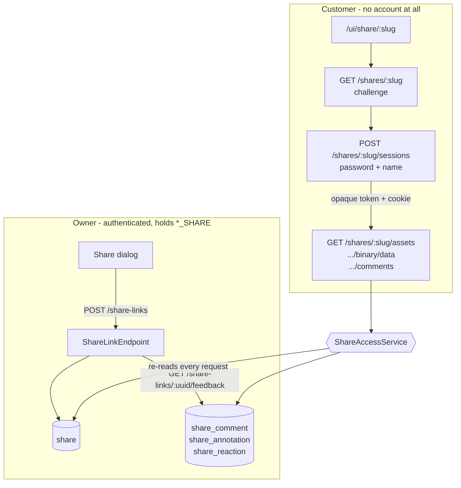

# Share System — Technical Specification

> The customer-facing area: a capability URL that lets somebody with no Loom account view an asset
> or a collection, and say something back about it.
>
> REST conventions and the endpoint inventory live in [../../loom/RESTAPI.md](../../loom/RESTAPI.md);
> the schema conventions this feature follows are in [../../loom/PERSISTENCE.md](../../loom/PERSISTENCE.md);
> the UI shell it mounts beside is [../../loom/ui/LOOM_UI.md](../../loom/ui/LOOM_UI.md);
> the permission model is [../permissions/PERMISSIONS.md](../permissions/PERMISSIONS.md).
> This file owns everything share-specific and does not repeat those.

---

## 0. Status

🟢 Built, both phases.

| Piece | Where |
|-------|-------|
| Schema | `V2.96__share_permissions.sql`, `V2.97__add_share.sql`, `V2.98__grant_share_permissions.sql`, `V2.99__add_share_feedback.sql` |
| Model + DAO | `loom/db/api/.../model/share/`, `loom/db/jooq/.../dao/share/` |
| Permissions | `CREATE/READ/UPDATE/DELETE_SHARE` in `Permission.java` |
| REST (owner) | `ShareLinkEndpoint` + `ShareLinkEndpointService` — `/api/v1/share-links` |
| REST (customer) | `PublicShareEndpoint` + `PublicShareEndpointService` — `/api/v1/shares/:slug` |
| Authorization | `ShareAccessService`, `ShareSessionTokens`, `ShareThrottle` |
| Models | `loom-shared/rest-model/.../model/share/` |
| Clients | `ShareMethods` (Java), `loom_client/methods/share.py` (Python), `api/shareLinks.ts` + `api/shares.ts` (UI) |
| UI | `loom-ui/src/features/share/` + the route in `main.tsx` |
| Notification | `NotificationType.SHARE_FEEDBACK`, `NotificationDispatcher#shareFeedbackLeft` |
| Tests | 27 DAO, 43 endpoint, 25 vitest, 16 Playwright |

---

## 1. The problem this solves

Before this, the only way to show somebody material was to give them an account. Every route except
`/login`, `/auth/oauth2`, `/health` and the spec routes is behind `secure()`; the UI's `AuthGate`
answers every URL with the login form when there is no token; and asset previews authenticate with
the `__Host-loom_token` cookie. "Send the client these five clips for sign-off" was not expressible,
so in practice the material left the system entirely — exported to a file transfer service, reviewed
there, and the feedback came back as an email nobody could attach to the asset.

Recorded as gap **N20** in [../../chat/CHAT_USER_REQUESTS.md](../../chat/CHAT_USER_REQUESTS.md).

---

## 2. The model



### 2.1 The row is the authority

There is no session table and no share-side user. Everything a visitor may do is decided by
re-reading the `share` row on **every** request: does it still exist, has it expired, does the
addressed asset belong to it, is `allow_download` set. The token proves only that the password was
satisfied once.

The consequence that matters: revoking a link takes effect on the next request, not when the last
issued token happens to lapse.

### 2.2 One link is one visitor

`share.visitor_name` is a column, not a `share_visitor` table. Everyone holding a given URL is the
same identity, so:

- two people sharing one link appear under one name, and
- either may edit or delete the other's feedback.

That is a deliberate simplification with a real cost. The product answer is **one link per
reviewer**, which the share dialog says in as many words. The alternative — a session table with one
row per browser — buys per-person attribution at the price of a table, a cleanup job and a second
identity model, and nothing in the feedback surface needs to tell two people behind one link apart
badly enough to pay for it.

`author_name` is nevertheless denormalised onto every feedback row: what somebody was called when
they wrote something is a historical fact, and reading it back through a join would let a later edit
of the share rewrite the past.

### 2.3 The slug

128 bits of `SecureRandom`, base64url-encoded to 22 characters. Not the uuid — a uuid in a URL
invites trying it against `/api/v1/assets/<same uuid>`, and v4 uuids are built to be unique rather
than unguessable.

> ⚠️ The alphabet matters as much as the entropy. `UIService` serves the SPA for any `/ui/*` path
> whose last segment has no file extension and falls through to the static handler otherwise, so a
> slug containing a dot would 404 instead of opening. base64url is `[A-Za-z0-9_-]` and has none.

### 2.4 Why the target CASCADEs but the owner does not

| FK | Behaviour | Why |
|----|-----------|-----|
| `asset_uuid`, `collection_uuid` | `ON DELETE CASCADE` | A link to material that no longer exists can only render an error; leaving the row keeps a dead URL answering 200 with an empty page |
| `creator_uuid`, `editor_uuid` | `ON DELETE SET NULL` | **Requirement**: deleting a user must not delete their shares. A link handed to a client outlives the editor who made it |

`creator_uuid` is therefore nullable, against the grain of every other audit column in the schema.
`ShareModelValidator#validate(ShareResponse)` deliberately does **not** call
`validateCreatorEditorResponse` for the same reason — that helper requires a creator, and using it
would make every response for an orphaned share a 500 the first time somebody deleted an account.

---

## 3. Guest authentication

### 3.1 Why the session token is not a JWT

`LoomJWTAuthHandlerImpl` authenticates *any* token that verifies against the Loom signing key; it
does not inspect the claims. A share token issued from that key would therefore satisfy `secure()` on
**every route in the API**, and the only thing between a share visitor and the rest of the
installation would be that each endpoint remembers to call `requirePerm`. That is a large blast
radius resting on a convention.

`ShareSessionTokens` issues an opaque string instead:

```
base64url(slug + "|" + expiryEpochSeconds) + "." + base64url(HMAC-SHA256(key, payload))
```

verified by exactly one class and meaningless to the JWT handler. The key is derived from the
installation's keystore password (`HMAC-SHA256(keystorePassword, "loom-share-session-v1")`) rather
than generated at boot, so a restart does not throw every reviewer back to the password box
mid-review — and it is a separate derivation from the JWT key, so recovering one says nothing about
the other.

The slug is checked as well as the signature. Without that, a valid token for any share would open
every share: the signature alone only proves this server issued *something*.

### 3.2 Two channels, on purpose

| Channel | Carries | For |
|---------|---------|-----|
| `X-Loom-Share-Session` header | the token | every `fetch` the viewer makes |
| `loom_share_session` cookie | the same token | `<video src>` and ``, which cannot set a header |

The cookie is `HttpOnly`, `SameSite=Lax`, `Path=/api/v1/shares`, and deliberately **not**
`__Host-`-prefixed. That prefix requires `Secure`, and the demo container and dev server both run
plain HTTP — a share viewer that only worked behind TLS would be untestable in exactly the setups
people try it in first. `SameSite=Lax` rather than `Strict` because a share URL is arrived at by
clicking a link in an email, and a Strict cookie is not sent on that first cross-site navigation.

### 3.3 Throttling

`ShareThrottle`: 10 failed password attempts per slug in 15 minutes, then 429. Checked **before** the
bcrypt comparison, so a locked slug stops paying for the work as well as refusing the answer.

Keyed on the slug rather than the client address: reviewers behind one corporate NAT would otherwise
lock each other out, and an attacker with a handful of addresses would sidestep it. In-memory and
per-process, so a multi-node installation multiplies the allowance by the node count — a real
weakening, documented rather than hidden, because a shared counter needs a store this service does
not otherwise require.

---

## 4. Permissions

| Permission | Gates |
|------------|-------|
| `CREATE_SHARE` | `POST /share-links` |
| `READ_SHARE` | `GET /share-links`, `/share-links/:uuid`, `/:uuid/feedback`, and the two sub-resource listings |
| `UPDATE_SHARE` | `POST /share-links/:uuid` |
| `DELETE_SHARE` | `DELETE /share-links/:uuid` |

Creating additionally requires **`READ_ASSET` or `READ_COLLECTION` on the target**, resolved from the
request body. Publishing material to the open internet must not be a way around not being allowed to
look at it; without this, `CREATE_SHARE` would be a bypass for every read restriction in the
installation. `ShareLinkEndpointTest#testCreateRequiresReadOnTheTarget` pins it from both sides.

There is deliberately **no `VIEW_SHARE`**. The visitor holds no permission at all and is never
resolved to a user; a constant no code path could check would advertise an enforcement point that is
not there.

---

## 5. Server-side rejection, not UI courtesy

`PublicShareEndpointService` cannot call `checkPerm` — the routes are not behind `secure()`, so there
is no user to check. **Every method in that class begins with a call into `ShareAccessService`**, and
that is the whole of the authorization story.

The three checks, in order:

1. **The link exists and has not lapsed** — re-read from the database, not trusted from the token.
2. **The session token is ours, for this slug, and unexpired.**
3. **The addressed asset belongs to the link.** This is the one that matters most: the asset uuid
   arrives in the path and nothing else in the request constrains it, so without a membership check
   one slug would be a read capability over every asset in the installation.

Collection membership is resolved **live**, so removing an asset from a collection closes it off
through every link to that collection.

### 5.1 What answers what

| Situation | Status | Why not something else |
|-----------|--------|------------------------|
| Unknown, revoked or expired slug | **404** | A distinct status for "this used to exist" turns the endpoint into an oracle for which slugs were ever real |
| Asset outside the share | **404** | 403 would confirm the asset exists, making the link a probe for uuids the visitor was never shown |
| Missing or lapsed session | **401** | The viewer puts the gate back rather than showing an error nobody can act on |
| Wrong password | **401** | |
| Too many wrong passwords | **429** | |
| Capability the link does not grant | **403** | The visitor *is* allowed to know the link exists — they are looking at it. Hiding this would leave the UI unable to explain why its own button did nothing |

### 5.2 The narrow projection

`SharedAssetResponse` is built field by field and must **never** be replaced by `AssetResponse`.
Reuse would be less code and the wrong shape: every field a future change adds to the internal model
would be published to every share link in the world the day it was added, silently, with no test
failing. A narrow projection makes the opposite mistake the loud one — a missing field is a visible
gap, not an invisible leak.

With `show_metadata` off, everything below the mime type is withheld. Title and description come from
the `metadata` JSON component's `dc.title`/`dc.description` only; the same component also holds camera
settings, GPS coordinates and the rights holder, none of which a client reviewing a cut asked for.

---

## 6. UI

### 6.1 The one structural change

The share route is declared in **`loom-ui/src/main.tsx`, above `AuthGate`** — the only route that is
not in `AppShell`:

```tsx
<Routes>
  <Route path="/share/:slug" element={<SharePage />} />
  <Route path="*" element={<AuthGate />} />
</Routes>
```

Authentication in this app is a conditional render, not a route guard: `AuthGate` answers every URL
with `LoginPage` when there is no token, and `AppShell` — which declares every other route — is
mounted only once there is one. A share route inside `AppShell` would be unreachable by exactly the
people it exists for, and `AppShell`'s catch-all redirect would swallow it besides.

It stays inside `ThemedApp`, because `tokens` is read at render time and a component mounted outside
`ThemeModeProvider` paints with stale values.

No `UIService` change was needed: the existing extensionless SPA fallback already serves
`/ui/share/<slug>`.

### 6.2 Components

| File | Role |
|------|------|
| `SharePage.tsx` | Public shell. Fetches the challenge, renders the gate until a session exists, then the viewer |
| `ShareGate.tsx` | Name + password on one card. A wrong password shows inline and never navigates away |
| `ShareSessionContext.tsx` | The session, in `sessionStorage` keyed per slug |
| `ShareViewer.tsx` | Tile grid, single-asset view, download, and the feedback column |
| `ShareMedia.tsx` | **The first real media player in the application** |
| `ShareFeedbackPanel.tsx` | Comments, reactions, marked moments, and the control that arms region drawing |
| `ShareRegionOverlay.tsx` | Drag-to-draw boxes over the media, and the boxes already drawn. `pointerEvents: none` unless armed — a permanently live layer over a `<video controls>` swallows every click on the player's own controls |
| `ShareDialog.tsx` | The owner's creation popup |
| `shareExpiry.ts` | Pure helpers — expiry maths, password generation, timecode/size formatting, comment threading |

`sessionStorage` rather than `localStorage`, keyed per slug: one browser may hold sessions for
several links at once, and a review link often arrives on a shared machine — a credential that
survives closing the tab is one the next person inherits.

### 6.3 The player

There was no player to copy. `AssetDetail`'s `videoRef` is unattached and its "playback" is a
`setInterval` that advances a number; `grep -rn "<video" src/` returned nothing before this change.

`ShareMedia` uses a plain `<video controls>`: the browser's own controls are better than anything
hand-rolled, they are keyboard accessible, and seeking works because the share binary route inherits
`Range`/206 handling from `AssetBinaryEndpointService`.

### 6.4 Reuse: the binary streamer

`AssetBinaryEndpointService.downloadByAssetUuid` wrapped its whole body in `checkPerm`. The body was
extracted to `streamPrimaryBinary(lrc, assetUuid, asAttachment)`, which the share service calls after
its own authorization. Range handling, the `sendFile` zero-copy path and object-store streaming are
worth exactly one implementation — a second copy is how the two would drift until seeking worked on
one route and not the other.

`asAttachment` is new: the internal route always downloads, the share viewer needs `inline` to play
in place and switches to `attachment` only when the visitor presses Download on a link that allows it.

---

## 7. Phase 2: guest feedback

### 7.1 Why not `comment`, `reaction` and `annotation`

Three reasons, in order of how blocking they are:

1. **Structural.** All three declare `creator_uuid uuid NOT NULL REFERENCES "user"`. A share visitor
   has no user row and must not be given one — auto-provisioning an account for anybody who opens a
   link would put unnamed, unauthenticated rows into the table that RBAC, `/me`, group membership and
   the notification fan-out all treat as people.
2. **Semantic.** An outside party's opinion is a different kind of statement from a colleague's note
   and must stay visibly separate — above all before it reaches the chat agent, which treats comment
   text as trustworthy input today.
3. **The reaction key.** `reaction` is `UNIQUE (creator_uuid, type, <subject>_uuid)`, and V2.78 exists
   because two features sharing that index silently overwrote each other's rows
   ([../../workflows/WORKFLOWS.md](../../workflows/WORKFLOWS.md) defect X8). Adding a fourth
   polymorphic subject FK keyed on a `creator_uuid` that would have to be null is the same mistake
   with more rows.

### 7.2 Geometry

`share_annotation` stores **normalised 0..1** coordinates and **seconds as a float**, where the
internal `annotation` table stores pixels and whole seconds.

The viewer is full-bleed and responsive, so a pixel box drawn on a 1400px laptop means nothing on a
phone. And at 25fps an integer second is 25 frames of ambiguity — exactly the precision a reviewer
marking a cut point is trying to communicate.

A database CHECK requires each kind to carry the geometry it names, and `ShareModelValidator` states
the same rule in Java so the failure is a 400 naming the field rather than a 500 naming a constraint.

`ShareRegionOverlay` converts pointer positions to fractions of the rendered media box and nowhere
else does that conversion. A drawn box becomes `SPATIOTEMPORAL` whenever the media has a playhead
and `SPATIAL` otherwise: "this logo" is almost never a note about the whole clip, it is a note about
the logo at the moment it is wrong. A zero-extent box from a stray click is discarded client-side
rather than sent and refused.

### 7.3 Notification

One `SHARE_FEEDBACK` per piece of feedback, to the link's creator. The only trigger whose actor is
not a Loom user, so `actorUuid` is null and nothing is suppressed; the visitor's chosen name goes in
the title instead. A share whose creator was deleted notifies nobody, which is the normal end state
of a link that outlived its author.

> ⚠️ V2.99 rewrites `notification_type_check` in full. The replacement must carry every value added
> since V2.70, not only the ones that file listed — `NODE_RUN_COMPLETED` arrived in V2.83. **Read the
> current constraint before adding the next value**; do not copy the block from the migration that
> first created it.

---

## 8. Conventions and gotchas

| Pitfall | Detail |
|---------|--------|
| Two base paths, on purpose | `secure()` is applied by path wildcard. Owner routes are `/share-links` and guest routes are `/shares`, so neither can drift into the other's auth by accident |
| Register endpoints twice | `EndpointModule` **and** `LoomOpenAPI`. Only the first means the routes vanish from `openapi.json` and the Python parity test fails |
| `PUBLIC_PATHS` | `/api/v1/shares` is the fifth entry. `/api/v1/share-links` must **not** be added — it is fully secured |
| Guest list responses | Built with `setData`, not repeated `add()`. `add()` creates the list lazily, so an empty listing would answer with no `data` array and every caller would special-case it |
| Slug alphabet | base64url only. A dot routes `/ui/share/<slug>` to the static handler |
| The share dialog creates on open | Not on save. The point of the dialog is the URL; a "create" button would mean pressing something before you can copy what you came for |
| Auth is in-memory (UI tests) | A Playwright spec must deep-link **then** sign in. `page.goto` after signing in throws the token away |
| MUI select testids | `inputProps` lands on the hidden native input, which is never clickable. Use `SelectProps.SelectDisplayProps` |
| Feedback identity | Any holder of a link may edit or delete anything written through it. This follows from §2.2 and is not a defect |

---

## 9. Environment variables

The feature adds none. Two existing settings govern it:

| Variable | Read by | Default | Effect here |
|----------|---------|---------|-------------|
| `LOOM_AUTH_KEYSTORE_PASSWORD` | `AuthenticationOptions` | required | Derives the share session signing key. Changing it invalidates every outstanding share session; the links themselves keep working |
| `VITE_API_BASE_URL` | `loom-ui/src/api/config.ts` | `http://localhost:8092/api/v1` | Must be same-origin (`/api/v1`) for the share session cookie to reach `<video src>` |

Two constants worth knowing, both in code rather than configuration because neither has ever needed
to differ per installation: `ShareSessionTokens.SESSION_TTL_SECONDS` (12 hours) and
`ShareThrottle.MAX_FAILURES` / `WINDOW` (10 per 15 minutes).

---

## 10. Key Classes Reference

| Class | Package / module | Purpose |
|-------|------------------|---------|
| `Share` / `ShareDao` | `io.metaloom.loom.db.model.share` (`loom/db/api`) | The link. `isExpired()`, `isPasswordProtected()`, `getTargetUuid()` |
| `ShareFeedbackDao` | same | One facade over the three guest tables. **Not** a `CRUDDao` — see its javadoc |
| `ShareDaoImpl` / `ShareFeedbackDaoImpl` | `io.metaloom.loom.db.jooq.dao.share` | jOOQ. `recordVisit` is one statement with `COALESCE`, which is what makes "first visit names the link" hold concurrently |
| `ShareAccessService` | `io.metaloom.loom.rest.service.impl` | **The authorization boundary.** Every guest route starts here |
| `ShareSessionTokens` | same | Opaque HMAC session tokens, slug generation, password generation |
| `ShareThrottle` | same | Per-slug failed-password limiter |
| `ShareLinkEndpointService` | same | Owner CRUD; assembles the absolute share URL from the request host |
| `PublicShareEndpointService` | same | Everything a visitor can do. No `checkPerm` anywhere, by construction |
| `ShareModelBuilder` | `io.metaloom.loom.rest.builder` | DAO → response, including the narrow `SharedAssetResponse` projection |
| `ShareModelValidator` | `io.metaloom.loom.rest.validation` | Geometry and vocabulary checks; deliberately skips `validateCreatorEditorResponse` |
| `AssetBinaryEndpointService#streamPrimaryBinary` | `io.metaloom.loom.rest.service.impl` | Shared byte streaming with `Range` support. **Authorization is the caller's job** |

---

## 11. Test setup

```bash
./setup-pool.sh                      # after any Flyway change

mvn test -pl loom/db/jooq  -Dtest='ShareDaoTest,ShareCascadeTest,ShareFeedbackDaoTest'
mvn test -pl loom/core     -Dtest='ShareLinkEndpointTest,PublicShareEndpointTest,PublicShareFeedbackEndpointTest'
mvn test -pl loom/services/rest -Dtest=LoomOpenAPITest

cd clients/python && ./test.sh

cd loom-ui
./node_modules/.bin/vitest run                       # never npx - it hangs
./node_modules/.bin/playwright test e2e/share-mocked.spec.ts e2e/share-dialog-mocked.spec.ts
```

| Test | What it pins |
|------|--------------|
| `ShareCascadeTest` | Deleting a user leaves the link working with a null owner; deleting the target removes the link; revoking a link removes only its own feedback |
| `ShareFeedbackDaoTest` | Every loader is scoped by share — one link cannot resolve another's rows by uuid |
| `PublicShareEndpointTest` | The only endpoint test that never signs in. Password, expiry, session binding, forged tokens, and **an asset outside the share** |
| `PublicShareFeedbackEndpointTest` | Capabilities off by default; author taken from the row not the request; one link cannot touch another's feedback |
| `e2e/share-mocked.spec.ts` | The only Playwright spec that never signs in. If the route moves back under `AuthGate`, all sixteen fail. Also pins that the region overlay is click-through until armed, that a stray click draws nothing, and the feedback panel's own writes: a mark posted at the playhead, a reply carrying its parent uuid, and a delete that issues the DELETE and drops the row |
| `e2e/share-dialog-mocked.spec.ts` | The owner's side. A **failed create leaves the dialog open** rather than closing on a link that was never minted; Done closes without revoking; the download and feedback checkboxes travel in the update body, and one feedback box sends all three server flags |
| `shareExpiry.test.ts` | Expiry maths, password shape, timecode/size formatting, comment threading including orphan promotion |

> The mocked share spec serves a **real** one-second MP4 from `e2e/fixtures/tiny.mp4`. Invalid bytes
> would make every media assertion pass for the wrong reason: the player errors, the component swaps
> in its placeholder, and a test looking for "something rendered" would never notice.

> **Fixed in passing:** `LoomCoreTestExtension` deleted and regenerated the module-wide
> `target/test-config/keystore.jceks` before **every test method** (the code carried a
> `// TODO use tempfile to avoid collisions`). `KeyStoreHelper.gen()` creates the file and then
> fills it, so one method regenerating while another read left a zero-byte keystore behind - which
> surfaced as `Tag number over 30 is not supported` from the JWT provider, or as a 401 on a request
> that had just logged in successfully. It was intermittent, it hit whichever class happened to be
> running (`SkillEndpointTest` as readily as the share classes), and it grew with the number of test
> methods. The extension now reuses a usable keystore and only deletes an empty one. Nothing depends
> on a per-method keystore: the password is a constant.

---

## 12. Demo

`DemoDatabaseInitializer#seedDemoShares` creates two links with fixed slugs, so the documentation and
the screenshot script can name the same URL:

| Slug | What | Password |
|------|------|----------|
| `demoOpenCollection001` | The *Demo Videos* collection, open, downloadable, feedback on | none |
| `demoLockedAssetLink01` | One video, no downloading | `amber-lantern-42` |

The collection link already carries feedback from "Maria from Acme" — a comment with a reply, a
spatiotemporal mark and an approval. Seeding it matters more than it looks: an empty feedback panel
and a broken one render identically.

**Both links now open on real footage.** The *Demo Videos* collection holds three clips seeded from
`demo-content/videos/`, with bytes in the content-addressed store and an `asset_video_comp` row
each, so the viewer's player plays and its timecodes are the file's own. Before that the shared
assets were rows without binaries: every share screen answered 404 on
`/shares/:slug/assets/:uuid/binary/data` and the player fell straight through to its "no preview"
card — a demo of the feature that could not demonstrate it. `capture-share-screenshots.mjs` serves
the same three files, so the pictures on the website and the container a reader downloads show one
thing.

**Durations cross the wire in milliseconds.** `asset_video_comp.media_duration` is a millisecond
column and `ShareModelBuilder` passes it through; `api/shares.ts` divides on the way in, because the
timecode on a tile, a marked moment and `HTMLMediaElement.currentTime` all count in seconds. A
fixture that serves seconds mocks an API that does not exist.

---

## 13. Progress Assessment

### Built

- [x] `share` table with target CHECK pair, capability toggles, visitor name and view counters
- [x] `ON DELETE SET NULL` owner FKs — deleting a user keeps the link working
- [x] `share_comment` / `share_annotation` / `share_reaction` with normalised geometry and CHECKs
- [x] Four `*_SHARE` permissions, with the admin-role grant migration for the upgrade path
- [x] `ShareDao` + `ShareFeedbackDao`, registered through `DaoCollection` → `DaoProvider` → bind module
- [x] Owner CRUD at `/share-links`, plus `/assets/:uuid/share-links` and `/collections/:uuid/share-links`
- [x] Unauthenticated customer area at `/shares/:slug`
- [x] Opaque HMAC session tokens, header + cookie, per-slug throttling
- [x] Live collection-membership enforcement on every guest route
- [x] Narrow `SharedAssetResponse` projection with a `showMetadata` gate
- [x] `Range`-capable byte streaming reused from the asset binary service
- [x] Guest comments, replies, reactions, timecode marks and **drawn regions** (`ShareRegionOverlay`)
- [x] `SHARE_FEEDBACK` notification to the link owner
- [x] Java, Python and TypeScript clients; OpenAPI regenerated and staged
- [x] Customer viewer with the application's first real media player
- [x] Share dialog with copy-to-clipboard, expiry, password and capability toggles
- [x] Demo data and a test fixture
- [x] 27 DAO, 43 endpoint, 25 vitest and 16 Playwright tests

### Open

- [ ] No owner-side Feedback tab on `AssetDetail`. `GET /share-links/:uuid/feedback` exists and is
      tested; nothing in the internal UI renders it yet
- [ ] No share management screen — links are created from the asset and collection surfaces and can
      only be listed through the API
- [ ] `ShareThrottle` is per-process, so a multi-node install multiplies the allowance (§3.3)
- [ ] No backend Playwright spec for the share area; only mocked specs exist
- [ ] Guest feedback is never surfaced to the chat agent, deliberately. If that changes it must be
      marked untrusted first — see [../../chat/AGENTIC_CHAT_PLAN.md](../../chat/AGENTIC_CHAT_PLAN.md)

---

## 14. Where do I find …?

| Concept | Path |
|---------|------|
| Share table | `loom/db/flyway/src/main/resources/db/migration/V2.97__add_share.sql` |
| Guest feedback tables | `.../V2.99__add_share_feedback.sql` |
| Model + DAO interfaces | `loom/db/api/src/main/java/io/metaloom/loom/db/model/share/` |
| jOOQ implementations | `loom/db/jooq/src/main/java/io/metaloom/loom/db/jooq/dao/share/` |
| **The authorization boundary** | `loom/services/rest/.../service/impl/ShareAccessService.java` |
| Session tokens | `.../service/impl/ShareSessionTokens.java` |
| Owner routes | `.../endpoint/impl/ShareLinkEndpoint.java` |
| Customer routes | `.../endpoint/impl/PublicShareEndpoint.java` |
| REST models | `loom-shared/rest-model/src/main/java/io/metaloom/loom/rest/model/share/` |
| Public route declaration | `loom-ui/src/main.tsx` |
| Customer UI | `loom-ui/src/features/share/` |
| UI API clients | `loom-ui/src/api/shareLinks.ts`, `loom-ui/src/api/shares.ts` |
| Demo links | `loom/core/.../boot/DemoDatabaseInitializer.java` (`seedDemoShares`) |
| Customer documentation | `website/content/english/docs/loom/sharing/index.adoc` |
| Screenshot capture | `loom-ui/scripts/capture-share-screenshots.mjs` |

---

_Git HEAD revision: `8c153347`_
_Last updated: 2026-08-11 (initial specification — share links and the customer-facing area, both phases)_
