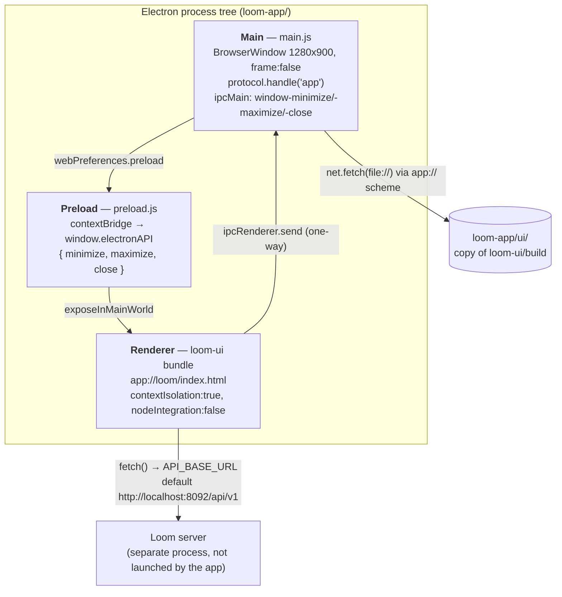

# MetaLoom // Loom App Specification

> `loom-app/` — an **Electron Forge desktop shell** wrapping the already-built Loom UI in a native
> window. ~90 lines of `main.js`, 6 lines of `preload.js`, no Maven integration, no tests.
>
> The UI itself (routes, providers, API client, screens, theming, its own tests) is specified in
> [../loom/ui/LOOM_UI.md](../loom/ui/LOOM_UI.md). **Do not duplicate it here.**

---

## 1. Scope and Status

| In scope | Out of scope |
|----------|--------------|
| Electron main process, window, `app://` protocol handler | UI routes/screens → [../loom/ui/LOOM_UI.md](../loom/ui/LOOM_UI.md) |
| `preload.js` `contextBridge` surface and IPC channels | REST semantics → [../loom/RESTAPI.md](../loom/RESTAPI.md) |
| Forge packaging targets, dev workflow, `run.sh` | Loom server startup → [../METALOOM.md](../METALOOM.md) |
| Electron security posture observed in the code | Vite build config → [../loom/ui/LOOM_UI.md](../loom/ui/LOOM_UI.md) |

### 1.1 Maintenance status — **experiment, not a maintained deliverable**

All grepped, not assumed:

| Signal | Finding |
|--------|---------|
| Maven reactor | **Absent.** `pom.xml` modules: `bom, loom-test-env, loom-shared, loom-client, cortex, loom, cli, examples, integration-test, e2e-test, website`. No `loom-app`. |
| CI | **No CI exists.** Repo has `.github/copilot-instructions.md` and **no `.github/workflows/` at all**. |
| Root scripts | `build.sh, e2e.sh, it.sh, setup-pool.sh, start-*.sh, ui.sh` — **none reference `loom-app`**. `ui.sh` runs the Vite dev server, not the app. |
| Git history | **3 commits ever**: `47e74fa3` (2026-04-01 monorepo import), `9adb7907`, `23cf0dcd` ("Hide decoration") — both 2026-04-05. Untouched since. |
| Tracked files | 9: `.gitignore, README.md, forge.config.js, index.html, main.js, package-lock.json, package.json, preload.js, run.sh`. `ui/`, `out/`, `node_modules/` gitignored. |
| Website docs | [getting-started/index.adoc](../../website/content/english/docs/getting-started/index.adoc) §`#loom-app` advertises a **system tray icon, native file drag-and-drop and connection profiles**, linking to `github.com/metaloom/loom-app/releases`. **None of the three exist** (no `Tray`, no drag-drop handler, no profile storage — verified by grep). That page is currently false. |

Prior spec coverage is one-liners only: [../METALOOM.md](../METALOOM.md) L34/L42/L100/L136 and
[../CONTEXT.md](../CONTEXT.md) L70. This file is the first real coverage.

---

## 2. Architecture



1. **The app never loads a remote URL.** Exactly one `loadURL`: `win.loadURL('app://loom/index.html')`.
   No dev-server mode, no `localhost:3000`, no connect dialog. Zero `loadFile` calls.
2. **The Loom server address is not configurable by the app.** It is baked into the bundle at
   *loom-ui build time* from `VITE_API_BASE_URL` (`loom-ui/src/api/config.ts`, default
   `http://localhost:8092/api/v1`). Changing servers means rebuilding `loom-ui` + `copy-ui`.
3. The app does **not** start Loom, Postgres or Cortex — those must already run.

---

## 3. Main Process (`main.js`)

| Concern | Value in code |
|---------|---------------|
| Window | `1280 x 900`, `backgroundColor: '#0d0e11'`, `icon: ui/img/logo_picto.png` (only exists after `copy-ui`) |
| `frame` | `false` — **no OS title bar / window buttons** |
| `autoHideMenuBar` | `true` |
| Application menu | **None.** `Menu` never imported; no `setApplicationMenu`, no accelerators. |
| Tray | **None.** `Tray` never imported. |
| `contextIsolation` / `nodeIntegration` | `true` / `false` ✅ |
| `sandbox`, `webSecurity` | not set → Electron defaults (sandboxed renderer, `webSecurity: true`) ✅ |
| `setWindowOpenHandler`, `will-navigate` | **absent** — §6 |
| Lifecycle | `window-all-closed` → `app.quit()` except `darwin`; `activate` → recreate if none |
| Single-instance lock | absent |
| `electron-squirrel-startup` | the only runtime dependency, but **never `require`d** — §6 |

### 3.1 The `app://` protocol

Privileged registration before ready:
`{ scheme:'app', privileges:{ standard:true, secure:true, supportFetchAPI:true, corsEnabled:true } }`.

```js
protocol.handle('app', (request) => {
    const url = new URL(request.url)
    let filePath = path.join(UI_DIR, decodeURIComponent(url.pathname))
    if (!path.extname(filePath)) filePath = path.join(UI_DIR, 'index.html')   // SPA fallback
    return net.fetch(pathToFileURL(filePath).href)
})
```

`UI_DIR = path.join(__dirname, 'ui')`. The host (`loom`) is ignored; only `pathname` is used.
SPA fallback keys on "has no file extension", **not** on a 404 — a missing `.js`/`.css` fails outright.

---

## 4. Preload Contract (`preload.js`) — complete surface

Three methods. Nothing else: no `ipcRenderer.invoke`, no `ipcMain.handle`, no listener channels,
no `webUtils`, no filesystem access.

| `window.electronAPI` | IPC channel | Direction | Main-process effect |
|----------------------|-------------|-----------|---------------------|
| `minimize()` | `window-minimize` | renderer → main, one-way (`send`) | `win?.minimize()` |
| `maximize()` | `window-maximize` | renderer → main, one-way (`send`) | toggle `maximize()` / `unmaximize()` |
| `close()` | `window-close` | renderer → main, one-way (`send`) | `win?.close()` |

**Critical gap — the API is dead code.** `rg "electronAPI|isElectron|window-minimize" loom-ui/src`
returns **zero hits**; the UI has no window-chrome component and no Electron detection. Combined
with `frame: false`, the packaged app has **no title bar and no in-app way to minimize, maximize or
close the window** (OS shortcuts / window manager only). Direct consequence of `23cf0dcd`
"Hide decoration" landing without the matching UI work. The fix belongs in `loom-ui/` (custom title
bar guarded by `typeof window.electronAPI !== 'undefined'`) and must be recorded in
[../loom/ui/LOOM_UI.md](../loom/ui/LOOM_UI.md).

---

## 5. `loom-app/ui/` — what it actually is

**Verified: a plain copied build output. Not a symlink, not a source tree, not the `loom-ui` module.**
`.gitignore` lists `/ui` (untracked per `git ls-files`); `package.json` defines
`"copy-ui": "rm -rf ui && cp -r ../loom-ui/build ui"`; `loom-ui/vite.config.ts` sets
`build.outDir: "build"`. On-disk content is `index.html`, `manifest.json`, `assets/index-*.{js,css}`,
`img/logo_picto.png` — compiled bundles only.

Every npm script re-runs `copy-ui` first, so `ui/` is regenerated on every `start`/`package`/`make`.
Never edit it; edit `loom-ui/` and rebuild.

### 5.1 ⚠️ `copy-ui` is currently broken by the UI's base path

`loom-ui/vite.config.ts` sets `base: "/ui/"` (the Loom server serves the SPA under `/ui/`), so a
fresh build emits **absolute** asset URLs: `<script src="/ui/assets/index-CRqej1rO.js">`. Under
`app://loom/index.html` that resolves to `app://loom/ui/assets/…`, which the handler maps to
`loom-app/ui/ui/assets/…` — nonexistent, with no SPA fallback (it has an extension). The bundle
will not load.

The `ui/` copy on disk is **stale** — it predates the `base` change and still uses relative paths
(`./assets/index-B0q852pR.js` vs. the current build's `index-CRqej1rO.js`), which is why it still
works locally. Anyone running `npm start` today gets a blank window. `loom-ui/src/main.tsx` also
derives `ROUTER_BASENAME` from `import.meta.env.BASE_URL`, so a `/ui/`-based bundle expects to be
mounted at `/ui/…` while the app loads it at `/index.html`.

**Fix options** (none implemented): serve `ui/` under `app://loom/ui/` and load
`app://loom/ui/index.html`; strip a leading `/ui/` in the protocol handler; or build the Electron
target with `base: "./"` + `HashRouter`.

---

## 6. Running, Building, Packaging

**Dev:** `cd loom-app && ./run.sh` — `run.sh` exports the two `LIBVA_*` vars (§7) then runs
`npm start` (= `copy-ui && electron-forge start`). `loom-ui` is **not** rebuilt by `start`; use
`npm run build-ui` for that. A Loom server must already listen on `http://localhost:8092`.

**Package:** `npm run package` → unpacked app in `out/`; `npm run make` → distributables in
`out/make/`. `forge.config.js`: `packagerConfig { asar: true, extraResource: [] }`, `rebuildConfig {}`,
plugin `@electron-forge/plugin-auto-unpack-natives` (no native deps actually present).
**No code signing, notarization, publisher or auto-update config.**

| Maker | Platforms | Output |
|-------|-----------|--------|
| `maker-squirrel` | Windows | Squirrel installer |
| `maker-zip` | `['darwin','linux']` | zip |
| `maker-deb` / `maker-rpm` | Linux | `.deb` / `.rpm` |

**Versions** — `electron` `^41.1.1` (devDependency, locked **41.1.1**); all `@electron-forge/*`
(cli, maker-deb, maker-rpm, maker-squirrel, maker-zip, plugin-auto-unpack-natives) `^7.11.1`,
locked **7.11.1**; `electron-squirrel-startup` `^1.0.1` is the only runtime dependency.

---

## 7. Environment Variables and CLI Flags

**`main.js` and `preload.js` read no environment variables and no CLI arguments.**
`rg "process\.env|commandLine|argv" main.js preload.js` matches only `process.platform`. No
`appendSwitch`, no `--server` flag, no config file, no `electron-store`.

| Variable | Read by | Default | Effect |
|----------|---------|---------|--------|
| `LIBVA_DRIVERS_PATH` | Chromium/libva, exported by `run.sh` | `/usr/lib/x86_64-linux-gnu` via `run.sh`; unset otherwise | VA-API driver search path for GPU video decode |
| `LIBVA_DRIVER_NAME` | Chromium/libva, exported by `run.sh` | `nvidia` via `run.sh`; unset otherwise | VA-API driver — hardcoded to NVIDIA, wrong on AMD/Intel hosts |
| `VITE_API_BASE_URL` | **`loom-ui` at build time**, not the app | `http://localhost:8092/api/v1` | Loom REST base URL baked into the bundle |
| `VITE_PROXY_TARGET` | `loom-ui` Vite **dev server** only | unset | irrelevant to the packaged app |

---

## 8. Test Setup

**There are no tests.** `package.json` declares no `test` script and no test framework
(no vitest/jest/playwright/spectron). No `test/` directory, no fixture, no CI job that could run one.

If added, the natural shapes are: **Playwright Electron** (`_electron.launch({ args: ['.'] })`) —
assert the window opens and the bundle actually boots (this would have caught §5.1 immediately);
and a **Node unit test** of the path-resolution logic extracted out of `main.js` (SPA fallback +
traversal containment). UI-level testing stays in `loom-ui/` — see
[../loom/ui/LOOM_UI.md](../loom/ui/LOOM_UI.md).

---

## 9. Conventions and Gotchas

**Electron security, as observed in the code**

- ✅ Sound: `contextIsolation: true`, `nodeIntegration: false`, default `webSecurity`, and a minimal
  one-way preload with no argument pass-through.
- ⚠️ **No navigation guard.** No `setWindowOpenHandler`, no `will-navigate`/`will-attach-webview`.
  A `target="_blank"` link or scripted `window.open` opens an uncontrolled Electron window instead of
  the system browser. Add `setWindowOpenHandler(({url}) => { shell.openExternal(url); return {action:'deny'} })`.
- ⚠️ **Protocol handler does no containment check.** `path.join(UI_DIR, decodeURIComponent(url.pathname))`
  goes straight to `net.fetch` with no `normalize` + `startsWith(UI_DIR)` assertion. `standard: true`
  makes Chromium collapse `..` before the handler runs, but the explicit `decodeURIComponent`
  re-introduces percent-encoded traversal (`%2e%2e%2f`) *after* normalization. Not proven exploitable
  (renderer loads only local first-party content) but the wrong shape; harden it.
- ⚠️ **No CSP on the page that loads.** `loom-app/index.html` has `default-src 'self'; script-src 'self'`
  — but that file is never loaded. `ui/index.html` (the page actually loaded) has no CSP `<meta>` and
  pulls a stylesheet from `https://fonts.googleapis.com`, so the app makes a remote request every
  launch and falls back to system fonts offline. Set CSP via `onHeadersReceived` or inline the font.
- ⚠️ **`secure: true` on `app://` + plain-HTTP API.** The renderer is a secure context while
  `API_BASE_URL` defaults to `http://localhost:8092`. Chromium exempts `localhost` from mixed-content
  blocking so the default works, but pointing `VITE_API_BASE_URL` at a **remote plaintext host will be
  blocked**. Use HTTPS off-localhost.

**Other traps**

- `loom-app/index.html` is the **unmodified Electron "Hello World!" template** and is dead — the app
  loads `app://loom/index.html` from `ui/`. Editing it changes nothing; deletion candidate.
- `electron-squirrel-startup` is installed but never required. The standard
  `if (require('electron-squirrel-startup')) app.quit()` guard is missing → Windows Squirrel
  install/update/uninstall hooks will spawn stray windows.
- `win` is a single module-level variable nulled on `close`. No multi-window support.
- `createWindow()` runs *before* the `ipcMain.on` registrations in the same `whenReady` callback.
  Benign today (renderer IPC only fires on interaction) but register handlers first if that changes.
- No preload type declarations exist, so `loom-ui` code touching `window.electronAPI` needs its own
  `declare global` block.

---

## 10. Progress Assessment

- [x] Electron main process with a single `BrowserWindow`
- [x] Custom `app://` protocol serving the built UI from `ui/` with SPA fallback
- [x] `contextIsolation: true` / `nodeIntegration: false`
- [x] `preload.js` exposing `window.electronAPI` window controls over IPC
- [x] Forge packaging: squirrel / zip / deb / rpm makers, `asar: true`
- [x] Dev launcher `run.sh` with VA-API env vars
- [ ] **UI consumes `window.electronAPI`** — zero references in `loom-ui/src`; with `frame: false`
      the window cannot be minimized/maximized/closed from the app (§4)
- [ ] **`copy-ui` compatible with `base: "/ui/"`** — a fresh `loom-ui` build will not load (§5.1)
- [ ] Configurable Loom server address (baked in at UI build time; no profiles/settings UI)
- [ ] `setWindowOpenHandler` / `will-navigate` guard (§9)
- [ ] Path-containment check in the `app://` handler (§9)
- [ ] CSP on the loaded page; inline the Google Fonts stylesheet for offline use (§9)
- [ ] `electron-squirrel-startup` guard in `main.js` (§9)
- [ ] Application menu / accelerators; single-instance lock
- [ ] Delete or repurpose the unused `loom-app/index.html` template
- [ ] Any test at all (§8)
- [ ] Code signing / notarization / auto-update / publisher config in `forge.config.js`
- [ ] Features the website already promises — tray, native drag-and-drop, connection profiles (§1.1)
      — either build them or correct
      [getting-started/index.adoc](../../website/content/english/docs/getting-started/index.adoc)
- [ ] Cross-platform `run.sh` (VA-API driver hardcoded to `nvidia`)
- [ ] CI build for the app (repo has no `.github/workflows/` at all)

---

## 11. Key Files Reference

| File | Path | Purpose |
|------|------|---------|
| `main.js` | `loom-app/main.js` | Main process: window, `app://` handler, `ipcMain` window controls, lifecycle |
| `preload.js` | `loom-app/preload.js` | The only renderer bridge — `window.electronAPI = {minimize, maximize, close}` |
| `package.json` | `loom-app/package.json` | Electron 41 / Forge 7.11 deps; `copy-ui`, `build-ui`, `start`, `package`, `make` |
| `forge.config.js` | `loom-app/forge.config.js` | `asar: true`; squirrel/zip/deb/rpm makers; auto-unpack-natives plugin |
| `run.sh` | `loom-app/run.sh` | Dev launcher — exports `LIBVA_*`, runs `npm start` |
| `index.html` | `loom-app/index.html` | **Unused** Electron "Hello World" template (never loaded) |
| `README.md` / `.gitignore` | `loom-app/` | Two-line description / ignores `/out`, `/node_modules`, `/ui` |
| `ui/` | `loom-app/ui/` | **Generated** — `cp -r ../loom-ui/build ui`; untracked, never edit |
| UI source | `loom-ui/` | The actual front end → [../loom/ui/LOOM_UI.md](../loom/ui/LOOM_UI.md) |
| Vite base config | `loom-ui/vite.config.ts` | `base: "/ui/"`, `build.outDir: "build"` — cause of §5.1 |
| API base URL | `loom-ui/src/api/config.ts` | `VITE_API_BASE_URL ?? "http://localhost:8092/api/v1"` |
| Router basename | `loom-ui/src/main.tsx` | `ROUTER_BASENAME` from `import.meta.env.BASE_URL` |

---

## 12. Where do I find …?

| I want to … | Look at |
|-------------|---------|
| change window size, background, frame or icon | `loom-app/main.js` → `createWindow()` |
| add an IPC channel | `loom-app/preload.js` (`contextBridge`) **and** `loom-app/main.js` (`ipcMain.on/handle`) |
| change which page the app loads | `loom-app/main.js` → `win.loadURL('app://loom/index.html')` |
| change how local files are resolved | `loom-app/main.js` → `protocol.handle('app', …)` |
| point the app at a different Loom server | rebuild `loom-ui` with `VITE_API_BASE_URL`, then `npm run build-ui` — no runtime setting exists |
| add/remove a package format | `loom-app/forge.config.js` → `makers` |
| bump Electron | `loom-app/package.json` → `devDependencies.electron` |
| understand a UI screen or route | [../loom/ui/LOOM_UI.md](../loom/ui/LOOM_UI.md) + its `TASK_UI_*.md` siblings |
| find the REST contract the renderer calls | [../loom/RESTAPI.md](../loom/RESTAPI.md) |
| see where the app sits in the module map | [../METALOOM.md](../METALOOM.md), [../CONTEXT.md](../CONTEXT.md) §1 |
| fix the customer-facing claims about the app | [getting-started/index.adoc](../../website/content/english/docs/getting-started/index.adoc), rules in [../website/WEBSITE.md](../website/WEBSITE.md) |
| know the definition of done for a change here | [../guidelines/CODING.md](../guidelines/CODING.md), [../SPEC_RULES.md](../SPEC_RULES.md) |

---

_Last updated: 2026-08-02 — git HEAD `d930e222`_
