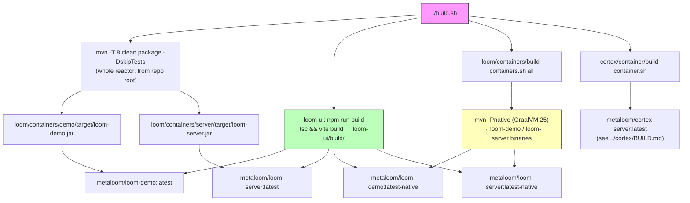

# Loom Build Specification

> **Audience: AI coding agents.** How the repository is compiled, how the UI is bundled, and how
> the Loom container images are produced. Verified against the code on the revision in the footer —
> **the code wins**; fix this file in the same change.
>
> **Scope split — do not duplicate these here:**
>
> | Topic | Spec |
> |---|---|
> | Cortex reactor, `cortex/container/build-container.sh`, CUDA/OpenCV/InspireFace deps | [../cortex/BUILD.md](../cortex/BUILD.md) |
> | Runtime config, option classes, full env-var catalogue | [CONFIGURATION.md](CONFIGURATION.md) |
> | Module responsibilities, Dagger wiring | [LOOM.md](LOOM.md) |
> | Startup/shutdown, ports, entry points | [SERVER.md](SERVER.md) |
> | Flyway migrations and schema | [PERSISTENCE.md](PERSISTENCE.md) |
> | UI source structure and routing | [ui/LOOM_UI.md](ui/LOOM_UI.md) |
> | Website build | [../website/WEBSITE.md](../website/WEBSITE.md) |

---

## 1. Progress Assessment

- [x] Reactor layout verified against `pom.xml` and `loom/pom.xml`
- [x] `build.sh` pipeline documented (Maven → UI → Loom containers → Cortex container)
- [x] `build-containers.sh` argument grammar and image names verified
- [x] Containerfile contents (JVM + native, demo + server) verified
- [x] UI build integration (`vite` `outDir: build` → `/loom/ui`) verified
- [x] `loom/db/jooq/generate.sh` and `setup-pool.sh` documented
- [x] Every documented command checked to exist
- [x] Cortex container detail delegated to [../cortex/BUILD.md](../cortex/BUILD.md)
- [x] Native-image build args and rationale documented
- [x] Diagram, Key Artifacts table, Conventions & Gotchas, cheat sheet, test setup
- [ ] `build.sh` does not build the `cli/` native binary (`cli/build-native.sh` is manual)
- [ ] `build.sh` has no `--skip-native` / target selection; it always builds all four Loom images
- [ ] `e2e.sh` implicitly requires GraalVM (see gotcha 3)
- [ ] Stale `mainClass` in the container `maven-jar-plugin` config (see gotcha 8)
- [ ] No CI pipeline definition is checked in

---

## 2. Pipeline Overview



`build.sh` runs the four stages **sequentially and unconditionally** (`set -o errexit`), each
wrapped in `time`. It is the only script that ties them together; there are no flags.

---

## 3. Reactor Layout

**Root `pom.xml`** (`io.metaloom:metaloom-parent:1.0.0-SNAPSHOT`) modules, in order:

`bom` · `loom-test-env` · `loom-shared` · `loom-client` · `cortex` · `loom` · `cli` · `examples` ·
`integration-test` · `e2e-test` · `website`

**`loom/pom.xml`** modules, in order:

`common` · `pipeline` · `db` · `services` · `agent` · `core` · `fixture` · `containers` · `doc`

Per-module purpose lives in [LOOM.md §2](LOOM.md) — not repeated here.

**Version properties** (root `pom.xml` unless noted):

| Property | Value | Where |
|---|---|---|
| `vertx.version` | `5.0.11` | root |
| `netty.version` | `4.2.12.Final` | root |
| `jackson.version` | `2.18.2` | root |
| `protobuf.version` | `4.29.3` | root |
| `avro.version` | `1.12.0` | root |
| `loom-test-env.version` | `0.0.1-SNAPSHOT` | root |
| `dagger.version` | `2.57.2` | `bom/pom.xml` |
| `jacoco.version` | `0.8.4` | `loom/pom.xml` |

All modules import `io.metaloom:bom` for external dependency versions; `dependencyManagement` in
the poms lists only internal modules.

---

## 4. Build Commands

Every command below exists in the checkout.

| Command | Location | What it does |
|---|---|---|
| `./build.sh` | repo root | Full pipeline: Maven → UI → Loom containers → Cortex container |
| `mvn -T 8 clean package -DskipTests` | repo root | Whole reactor, no tests |
| `mvn -pl loom/containers/server -am package` | repo root | One container module + its dependencies |
| `./setup-pool.sh` | repo root | `mvn exec:java -pl loom/fixture -Dexec.mainClass=io.metaloom.loom.test.PoolSetupRunner` — provisions the pooled test databases |
| `./it.sh` | repo root | `PoolSetupRunner`, then `mvn verify -pl integration-test` |
| `./e2e.sh` | repo root | Package demo → build demo images → `start-postgres.sh` + `start-demo.sh` → `mvn test -Dloom.external=true` in `e2e-test/` (removes the containers on exit) |
| `./ui.sh` | repo root | `cd loom-ui && npm run dev` |
| `./start-postgres.sh`, `./start-demo.sh`, `./start-server.sh`, `./start-minio.sh`, `./start-cortex.sh` | repo root | Run the built images locally on the `dev` docker network |
| `./generate.sh` | `loom/db/jooq` | Wipes `src/jooq/java/`, starts a PostgreSQL testcontainer, runs Flyway, runs jOOQ codegen |
| `./migrate.sh` | `loom/db/jooq` | Flyway migration helper |
| `./build-containers.sh [jvm\|native\|both] [demo\|server\|all]` | `loom/containers` | Loom container images |
| `./build-container.sh` | `cortex/container` | Cortex image — see [../cortex/BUILD.md](../cortex/BUILD.md) |
| `./build-native.sh [build\|metadata\|agent\|smoke\|install]` | `cli` | GraalVM native binary for the `metaloom` CLI (**not** part of `build.sh`) |

### UI scripts (`loom-ui/package.json`)

| Script | Command |
|---|---|
| `npm run build` | `tsc && vite build` → `loom-ui/build/` (`vite.config.ts` sets `outDir: "build"`) |
| `npm run dev` | `vite` |
| `npm run preview` | `vite preview` |
| `npm run test` | `vitest run` |
| `npm run test:watch` | `vitest` |
| `npm run test:e2e` / `test:e2e:ui` | `playwright test` / `--ui` |

Key versions: React 18.3, MUI 5.16, Vite 6.4, TypeScript 5.5, react-router-dom 6.26, reactflow
11.11, recharts 2.12, i18next 26, Playwright 1.59, Vitest 3.2. UI test conventions are in
[ui/LOOM_UI.md](ui/LOOM_UI.md).

### Native (GraalVM) builds

```bash
JAVA_HOME=/opt/jvm/graalvm-25 mvn -Pnative -DskipTests -pl loom/containers/server -am package
JAVA_HOME=/opt/jvm/graalvm-25 mvn -Pnative -DskipTests -pl loom/containers/demo   -am package
```

`build-containers.sh` invokes exactly these for the `native` variant.

---

## 5. Container Build (`loom/containers/build-containers.sh`)

### Argument grammar

`./build-containers.sh [variant] [target]` — variant ∈ `jvm | native | both | all` (default
**`both`**), target ∈ `demo | server | all` (default `all`).

| Invocation | Result |
|---|---|
| `./build-containers.sh` | jvm + native, demo + server — **four images** |
| `./build-containers.sh all` | identical to no args (what `build.sh` uses) |
| `./build-containers.sh jvm` | `loom-demo:$TAG`, `loom-server:$TAG` |
| `./build-containers.sh jvm server` | `loom-server:$TAG` only |
| `./build-containers.sh native demo` | `loom-demo:$TAG-native` only |
| `./build-containers.sh demo` | variant falls back to `both` → **jvm *and* native** demo images |

### Script environment

| Variable | Default | Purpose |
|---|---|---|
| `TAG` | `latest` | Image tag; native images get `-native` appended automatically |
| `GRAALVM_HOME` | `/opt/jvm/graalvm-25` | Must contain an executable `bin/native-image` |

### Preconditions enforced by the script

1. `loom-ui/build/` must exist → otherwise *"Run 'npm run build' in loom-ui first."*
2. The relevant `target/loom-{demo,server}.jar` must exist → otherwise *"Run 'mvn package' first."*
3. For native: `$GRAALVM_HOME/bin/native-image` must be executable.

The docker build context is always the **repository root**, so the Containerfiles reference
`./loom/containers/<module>/target/...` and `./loom-ui/build`.

### Image contents

| | JVM demo & server | Native demo & server |
|---|---|---|
| Base | `eclipse-temurin:25-jre-alpine` | `debian:stable-slim` (+ `ca-certificates`, `libstdc++6`, `zlib1g`) |
| Payload | `loom.jar` (shaded) at `/loom/loom.jar` | `loom` binary at `/loom/loom` |
| UI | `loom-ui/build` → `/loom/ui` | same |
| User | `loom`, UID 1000, group 0, `WORKDIR /loom` | same |
| Volumes | `/uploads`, `/plugins`, `/keystore`, `/config` (symlinked from `/loom/config`) | same |
| `CMD` | `java -Djna.tmpdir=/tmp/.jna -Duser.dir=/loom [-Dlogback.configurationFile=logback.default.xml] -jar loom.jar` | `/loom/loom` |

Baked-in `ENV` (defaults only — override at run time, see [CONFIGURATION.md](CONFIGURATION.md)):

| Variable | demo | server | Note |
|---|---|---|---|
| `LOOM_AUTH_KEYSTORE_PATH` | `/keystore/keystore.jks` | same | |
| `LOOM_BINARY_DIR` | `/uploads` | same | |
| `LOOM_TEMP_DIR` | `/tmp` | same | |
| `HOME` | `/loom` | same | |
| `JAVA_TOOL_OPTIONS` | `-Xms512m -Xmx512m` | same | JVM images only |
| `LOOM_AGENT_MEMORY_ENABLED` | `true` | — | demo only; without it the Memory screen has no endpoints |
| `LOOM_DB_HOST` / `PORT` / `NAME` / `USER` / `PASSWORD` | — | `postgres` / `5432` / `loom` / `loom` / `loom` | server only; the demo image expects them at run time |
| `EXPOSE` | 8092, 8091 | 8092, 8091, 8989 | demo does not expose the monitoring port |

The demo `CMD` additionally passes `-Dlogback.configurationFile=logback.default.xml`: the jar ships
`logback.default.xml`, but logback only auto-loads `logback.xml`, so without the flag it falls back
to `BasicConfigurator` at DEBUG and logs every jOOQ statement.

### Cortex image

`cortex/container/build-container.sh` produces `metaloom/cortex-server:$TAG` and needs a locally
built **OpenCV 5.1** tree (`OPENCV_LIB_DIR`, default `<repo>/../opencv/build/lib`) staged into the
build context. Full detail — CUDA repo, JDK download, InspireFace model, image env — is in
[../cortex/BUILD.md](../cortex/BUILD.md).

---

## 6. Native Image Configuration

`loom/containers/{demo,server}/pom.xml`, profile `native`, `native-maven-plugin`:

| Build arg | Reason |
|---|---|
| `--no-fallback` | Fail the build instead of silently emitting a JVM-fallback image |
| `-H:+UnlockExperimentalVMOptions`, `-H:+ReportExceptionStackTraces` | Diagnostics |
| `--enable-url-protocols=http,https` | HTTP(S) is not on by default in a native image |
| `--initialize-at-build-time=org.slf4j,ch.qos.logback,org.jooq,com.fasterxml.jackson,org.yaml.snakeyaml,org.apache.commons.logging` | Pre-initialise logging/JSON/YAML/jOOQ for faster startup |
| `--initialize-at-build-time=kotlin` | The OpenAI SDK (chat agent) is Kotlin and pulls in `jackson-module-kotlin`; jOOQ's static `Convert.ConvertAll` `ObjectMapper` registers it, so Kotlin objects land in the build-time image heap. Without this: *"object … found in the image heap [but] marked for initialization at image run time"* |
| `--initialize-at-run-time=io.netty` | Netty allocates direct `ByteBuffer`s during class init |
| `-H:ConfigurationFileDirectories=.../META-INF/native-image/io.metaloom.loom/loom-{demo,server}` | reflect-/jni-/proxy-config |
| `-J-Xmx6g` | native-image compiler heap |

`mainClass` for both the shaded jar and the native image is the module's `*Runner`
(`io.metaloom.loom.container.{demo,server}.Loom{Demo,Server}Runner`); `finalName` is
`loom-demo` / `loom-server`.

---

## 7. Test Setup

```bash
./setup-pool.sh            # REQUIRED before any DB-backed test, and after every Flyway change
mvn test                   # unit tests
mvn test -pl loom/core
mvn test -Dtest=MyTest -pl loom/core
./it.sh                    # pool setup + mvn verify -pl integration-test
./e2e.sh                   # containerised end-to-end run
cd loom-ui && npm run test && npm run test:e2e
```

The `testdatabase-provider` container must be running for anything that touches the database.

Surefire/JaCoCo properties (`loom/pom.xml`):

| Property | Default | Purpose |
|---|---|---|
| `skip.unit.tests` | `false` | Bound to the surefire `<skip>` |
| `skip.cluster.tests` | `false` | Cluster test toggle |
| `surefire.forkcount` | `1` | Fork count |
| `surefire.jvm.postfix` | *(empty)* | Extra JVM args appended to the forked JVM |
| `surefire.groups` / `surefire.excludedGroups` | *(empty)* | JUnit tag filters |
| `jacoco.skip` | `true` | Coverage off by default |
| `jacoco.skip.merge` | `true` | Skip the `merge-all-jacoco` execution |

---

## 8. Key Artifacts Reference

| Artifact / class | Package or path | Purpose |
|---|---|---|
| `LoomServerRunner` | `io.metaloom.loom.container.server` | `mainClass` of `loom-server.jar` and of the native server binary |
| `LoomDemoRunner` | `io.metaloom.loom.container.demo` | `mainClass` of `loom-demo.jar` and of the native demo binary |
| `MetaLoomCLIMain` | `io.metaloom.cli` | `mainClass` of `metaloom-cli` (top-level `cli/` module, picocli) |
| `PoolSetupRunner` | `io.metaloom.loom.test` (`loom/fixture`) | Entry point invoked by `setup-pool.sh` and `it.sh` |
| `LoomJooqStrategy` | `loom/db/jooq-gen` | Prefixes generated table classes with `Jooq` |
| `loom-demo.jar` / `loom-server.jar` | `loom/containers/*/target/` | Shaded uber-jars (`ManifestResourceTransformer` + `ServicesResourceTransformer`) |
| `loom-demo` / `loom-server` | `loom/containers/*/target/` | GraalVM native binaries (no extension) |
| `loom-ui/build/` | repo | Vite output, copied to `/loom/ui` in every image |

---

## 9. Conventions and Gotchas

1. **UI first.** Container builds abort if `loom-ui/build/` is missing. `build.sh` orders this
   correctly; a manual `./build-containers.sh` after a `git clean` will not.
2. **`build-containers.sh` with no variant means BOTH.** The default is `both`, not `jvm` — an
   unqualified run needs GraalVM.
3. **`e2e.sh` needs GraalVM.** It calls `./build-containers.sh demo`, which parses `demo` as the
   *target* and leaves the variant at `both`, so it also builds the native demo image.
4. **Native binaries are reused, not rebuilt.** `maven_native_build()` returns early when the
   binary already exists. After changing Java code, delete
   `loom/containers/*/target/loom-{demo,server}` or the image will ship stale code.
5. **Native images are Debian, not Alpine.** The binaries are glibc-linked; Alpine (musl) would not
   run them.
6. **Docker build context is the repo root**, not the container module directory.
7. **`setup-pool.sh` after every Flyway change**, and install `loom/db/flyway` first — otherwise the
   pool is provisioned from a stale jar and silently skips the new migration.
8. **Stale `mainClass` in `maven-jar-plugin`.** Both container poms declare
   `io.metaloom.loom.server.cli.Loom`, a class that no longer exists. It is harmless only because
   `maven-shade-plugin`'s `ManifestResourceTransformer` overwrites the manifest with the correct
   `*Runner`. Fix it when touching those poms.
9. **jOOQ codegen is not part of `build.sh`.** Run `loom/db/jooq/generate.sh` manually after a
   Flyway change; it deletes `src/jooq/java/` first and pins its own plugin versions.
10. **`cli/build-native.sh` is not wired into `build.sh`** — the `metaloom` CLI native binary is a
    manual step.
11. **All containers run as UID 1000** (`loom` / `cortex`) with group 0; mounted volumes must be
    group-writable.
12. **Naming.** Modules `loom-<name>` / `loom-container-<variant>`; jars `loom-demo.jar` /
    `loom-server.jar`; images `metaloom/loom-{demo,server}:{TAG,TAG-native}` and
    `metaloom/cortex-server:TAG`.

---

## 10. Troubleshooting

| Symptom | Cause | Fix |
|---|---|---|
| `ERROR: .../loom-ui/build not found` | UI not built | `cd loom-ui && npm run build` |
| `ERROR: .../loom-server.jar not found` | Reactor not packaged | `mvn -T 8 clean package -DskipTests` |
| `ERROR: native-image not found at ...` | No GraalVM | Install GraalVM 25, set `GRAALVM_HOME` |
| Image runs old code after a rebuild | Stale native binary reused (gotcha 4) | Delete `loom/containers/*/target/loom-{demo,server}` |
| `object … found in the image heap` | Kotlin/Jackson init class | Keep `--initialize-at-build-time=kotlin` |
| `Pool not found {loom-dev}` in tests | Test pool not provisioned | `./setup-pool.sh` |
| New migration missing from test DBs | `loom/db/flyway` not installed before `setup-pool.sh` | Install that module, re-run |
| `ERROR: OpenCV libraries not found at ...` | Cortex build without an OpenCV 5.1 tree | Set `OPENCV_LIB_DIR`; see [../cortex/BUILD.md](../cortex/BUILD.md) |

### Verify build output

```bash
ls -la loom/containers/{demo,server}/target/loom-{demo,server}.jar
ls -la loom/containers/{demo,server}/target/loom-{demo,server}
ls -la loom-ui/build/
docker images 'metaloom/*'
```

---

## 11. Where Do I Find...?

| Concept | Path |
|---|---|
| Full build pipeline | `build.sh` |
| Reactor root / Loom aggregator | `pom.xml` · `loom/pom.xml` |
| Dependency versions (BOM) | `bom/pom.xml` |
| Loom container build script | `loom/containers/build-containers.sh` |
| Demo / server container modules | `loom/containers/{demo,server}/pom.xml` |
| Containerfiles | `loom/containers/{demo,server}/Containerfile[.native]` |
| Native-image metadata | `loom/containers/{demo,server}/src/main/resources/META-INF/native-image/io.metaloom.loom/loom-{demo,server}/` |
| UI build config | `loom-ui/package.json` · `loom-ui/vite.config.ts` · `loom-ui/tsconfig.json` |
| jOOQ codegen / migrate | `loom/db/jooq/generate.sh` · `loom/db/jooq/migrate.sh` |
| Flyway migrations | `loom/db/flyway/src/main/resources/db/migration/` |
| Test pool provisioning | `setup-pool.sh` · `loom/fixture` (`PoolSetupRunner`) |
| Integration / E2E drivers | `it.sh` · `e2e.sh` · `integration-test/` · `e2e-test/` |
| Local run helpers | `start-postgres.sh` · `start-demo.sh` · `start-server.sh` · `start-minio.sh` · `start-cortex.sh` · `ui.sh` |
| CLI native build | `cli/build-native.sh` |
| Cortex container build | `cortex/container/build-container.sh` · `cortex/container/Containerfile` |

---

## 12. Related Specifications

[LOOM.md](LOOM.md) · [SERVER.md](SERVER.md) · [CONFIGURATION.md](CONFIGURATION.md) ·
[PERSISTENCE.md](PERSISTENCE.md) · [ui/LOOM_UI.md](ui/LOOM_UI.md) ·
[../cortex/BUILD.md](../cortex/BUILD.md) · [../cortex/CORTEX.md](../cortex/CORTEX.md) ·
[../METALOOM.md](../METALOOM.md) · [../website/WEBSITE.md](../website/WEBSITE.md)

---

_Git HEAD revision: `2e5981cb`_
_Last updated: 2026-08-01 (verified every command and image against the scripts; fixed the reactor module lists, the build-containers argument grammar and the Cortex/OpenCV claims.)_
