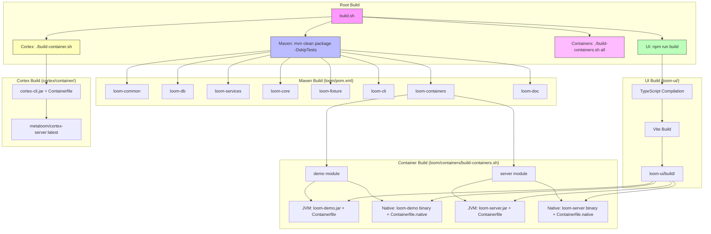

# Loom Build System Specification

## Overview

This document describes the build system for the **Loom** module of the MetaLoom project. The build system is a multi-stage pipeline that produces:

1. **JVM artifacts** - Shaded JAR files for demo and server containers
2. **Native artifacts** - GraalVM/SubstrateVM native binaries for demo and server
3. **Container images** - Docker/Podman images for JVM and native variants
4. **UI assets** - React/Vite frontend build output
5. **Cortex container** - Separate container for the Cortex AI service

---

## Progress Assessment

- [x] Document Maven multi-module structure
- [x] Document JVM build process (shaded JARs)
- [x] Document Native build process (GraalVM native-image)
- [x] Document Container image build process
- [x] Document UI build process (Vite/React)
- [x] Document Cortex container build
- [x] Document environment variables and configuration
- [x] Document test setup and execution
- [x] Create architecture diagrams
- [x] Create key classes reference table
- [x] Document conventions and gotchas
- [x] Create "Where do I find...?" cheat sheet

---

## Architecture Diagram



---

## Build Pipeline Stages

### Stage 1: Maven Build (Root Level)

**Entry Point:** `build.sh` → `mvn -T 8 clean package -DskipTests`

**Location:** `/home/defaultuser/workspaces/metaloom/metaloom/`

**Parent POM:** `pom.xml` (metaloom-parent)
- Manages versions via `dependencyManagement`
- Defines modules: `bom`, `loom-test-env`, `loom-shared`, `loom-client`, `cortex`, `loom`, `examples`, `integration-test`, `e2e-test`, `website`

**Loom POM:** `loom/pom.xml`
- Parent: `io.metaloom:metaloom-parent:1.0.0-SNAPSHOT`
- Modules: `common`, `db`, `services`, `core`, `fixture`, `cli`, `containers`, `doc`
- Imports BOM: `io.metaloom:bom:${project.version}`

**Key Properties:**
| Property | Value | Description |
|----------|-------|-------------|
| `vertx.version` | `5.0.11` | Vert.x framework version |
| `netty.version` | `4.2.12.Final` | Netty version |
| `jackson.version` | `2.18.2` | Jackson version |
| `dagger.version` | `2.57.2` | Dagger DI version |
| `jacoco.version` | `0.8.4` | JaCoCo coverage version |
| `loom.cortex.version` | `1.0.0-SNAPSHOT` | Cortex module version |

### Stage 2: UI Build

**Entry Point:** `build.sh` → `cd loom-ui && npm run build`

**Location:** `/home/defaultuser/workspaces/metaloom/metaloom/loom-ui/`

**Build Command:** `tsc && vite build`

**Output:** `loom-ui/build/` (copied into container images)

**Key Dependencies:**
- React 18.3.1
- MUI (Material UI) 5.16.0
- Vite 6.4.2
- TypeScript 5.5.0
- React Router 6.26.0
- React Flow 11.11.0
- Recharts 2.12.0

### Stage 3: Container Build

**Entry Point:** `build.sh` → `cd loom/containers && ./build-containers.sh all`

**Script:** `loom/containers/build-containers.sh`

**Variants:**
| Variant | Base Image | Output |
|---------|------------|--------|
| `jvm` | `eclipse-temurin:25-jre-alpine` | `metaloom/loom-demo:latest`, `metaloom/loom-server:latest` |
| `native` | `debian:stable-slim` | `metaloom/loom-demo:latest-native`, `metaloom/loom-server:latest-native` |
| `both` | Both | All four images |

**Targets:** `demo`, `server`, `all`

**Environment Variables:**
| Variable | Default | Description |
|----------|---------|-------------|
| `TAG` | `latest` | Image tag suffix |
| `GRAALVM_HOME` | `/opt/jvm/graalvm-25` | GraalVM installation path |

### Stage 4: Cortex Container Build

**Entry Point:** `build.sh` → `cd cortex/container && ./build-container.sh`

**Script:** `cortex/container/build-container.sh`

**Prerequisites:** `mvn -f ../../pom.xml clean package -DskipTests -pl cortex/container,cortex/cli -am`

**Output:** `metaloom/cortex-server:latest`

**Base Image:** `debian:trixie-slim`

**Special Features:**
- CUDA 13.2 runtime (NVIDIA)
- OpenCV 4.10 JNI libraries
- Eclipse Temurin JDK 25 (downloaded at build time)
- InspireFace model (downloaded at build time)

---

## Key Classes Reference

| Class | Package | Purpose | Module |
|-------|---------|---------|--------|
| `LoomDemoRunner` | `io.metaloom.loom.container.demo` | Main class for demo container (JVM) | `loom-container-demo` |
| `LoomServerRunner` | `io.metaloom.loom.container.server` | Main class for server container (JVM) | `loom-container-server` |
| `Loom` | `io.metaloom.loom.server.cli` | CLI entry point (shared) | `loom-core` |
| `LoomDemoRunner` (native) | `io.metaloom.loom.container.demo` | Main class for native demo | `loom-container-demo` (native profile) |
| `LoomServerRunner` (native) | `io.metaloom.loom.container.server` | Main class for native server | `loom-container-server` (native profile) |

---

## Environment Variables Reference

### Container Runtime Environment Variables

#### Demo Container (JVM & Native)
| Variable | Default | Description |
|----------|---------|-------------|
| `LOOM_AUTH_KEYSTORE_PATH` | `/keystore/keystore.jks` | Path to auth keystore |
| `LOOM_BINARY_DIR` | `/uploads` | Directory for binary uploads |
| `LOOM_TEMP_DIR` | `/tmp` | Temporary directory |
| `HOME` | `/loom` | Home directory for loom user |
| `JAVA_TOOL_OPTIONS` | `-Xms512m -Xmx512m` | JVM memory settings (JVM only) |

#### Server Container (JVM & Native)
| Variable | Default | Description |
|----------|---------|-------------|
| `LOOM_AUTH_KEYSTORE_PATH` | `/keystore/keystore.jks` | Path to auth keystore |
| `LOOM_BINARY_DIR` | `/uploads` | Directory for binary uploads |
| `LOOM_TEMP_DIR` | `/tmp` | Temporary directory |
| `LOOM_DB_HOST` | `postgres` | PostgreSQL host |
| `LOOM_DB_PORT` | `5432` | PostgreSQL port |
| `LOOM_DB_NAME` | `loom` | Database name |
| `LOOM_DB_USER` | `loom` | Database user |
| `LOOM_DB_PASSWORD` | `loom` | Database password |
| `HOME` | `/loom` | Home directory for loom user |
| `JAVA_TOOL_OPTIONS` | `-Xms512m -Xmx512m` | JVM memory settings (JVM only) |

#### Cortex Container
| Variable | Default | Description |
|----------|---------|-------------|
| `LOOM_HOST` | `loom` | Loom server host |
| `LOOM_PORT` | `8092` | Loom server port |
| `CORTEX_MONITORING_PORT` | `8093` | Cortex monitoring port |
| `HOME` | `/cortex` | Home directory for cortex user |
| `JAVA_TOOL_OPTIONS` | `-Xms256m -Xmx512m` | JVM memory settings |
| `JAVA_HOME` | `/opt/java25` | JDK installation path |
| `PATH` | `/usr/local/cuda-13.2/bin:...` | Includes CUDA bin path |

---

## Build Commands Reference

### Full Build (All Artifacts)
```bash
# From metaloom root
./build.sh
```

### Maven Only
```bash
# From metaloom root
mvn -T 8 clean package -DskipTests

# With tests
mvn -T 8 clean package

# Specific module
mvn -pl loom/containers/demo -am package
mvn -pl loom/containers/server -am package
```

### Native Build (Maven Profile)
```bash
# Demo native
JAVA_HOME=/opt/jvm/graalvm-25 mvn -Pnative -DskipTests -pl loom/containers/demo -am package

# Server native
JAVA_HOME=/opt/jvm/graalvm-25 mvn -Pnative -DskipTests -pl loom/containers/server -am package
```

### UI Build
```bash
cd loom-ui
npm run build        # Production build (tsc + vite build)
npm run dev          # Development server
npm run preview      # Preview production build
npm run test:e2e     # Playwright E2E tests
```

### Container Build
```bash
cd loom/containers

# All variants, all targets
./build-containers.sh all
./build-containers.sh both all

# JVM only
./build-containers.sh jvm
./build-containers.sh jvm demo
./build-containers.sh jvm server

# Native only
./build-containers.sh native
./build-containers.sh native demo
./build-containers.sh native server

# Custom tag
TAG=v1.0.0 ./build-containers.sh all
GRAALVM_HOME=/custom/graalvm ./build-containers.sh native
```

### Cortex Container Build
```bash
cd cortex/container
./build-container.sh

# Custom tag
TAG=v1.0.0 ./build-container.sh
```

---

## Test Setup

### Unit Tests (Maven)
```bash
# Run all tests
mvn test

# Run tests for specific module
mvn test -pl loom/core

# Skip tests
mvn package -DskipTests

# Run specific test class
mvn test -Dtest=MyTestClass -pl loom/core
```

**Test Configuration (loom/pom.xml):**
| Property | Default | Description |
|----------|---------|-------------|
| `surefire.forkcount` | `1` | Fork count for Surefire |
| `skip.unit.tests` | `false` | Skip unit tests |
| `skip.cluster.tests` | `false` | Skip cluster tests |
| `surefire.excludedGroups` | `` | Excluded test groups |
| `surefire.groups` | `` | Included test groups |
| `jacoco.skip` | `true` | Skip JaCoCo coverage |

### Integration Tests
```bash
# Run integration tests
./it.sh

# Run e2e tests
./e2e.sh
```

### UI Tests
```bash
cd loom-ui
npm run test:e2e       # Headless Playwright
npm run test:e2e:ui    # Playwright with UI
```

---

## Conventions and Gotchas

### ⚠️ Critical Gotchas

1. **UI Build Required First**: Container builds fail if `loom-ui/build/` doesn't exist. Always run `npm run build` in `loom-ui` before building containers.

2. **Native Build Requires GraalVM**: The `native` Maven profile requires `JAVA_HOME` pointing to a GraalVM installation with `native-image` installed. Default: `/opt/jvm/graalvm-25`.

3. **Native Images Use Debian, Not Alpine**: Native binaries are glibc-linked, so `Containerfile.native` uses `debian:stable-slim` instead of Alpine.

4. **Maven Shade Plugin**: Both demo and server modules use `maven-shade-plugin` to create uber-jars with `ServicesResourceTransformer` for SPI support.

5. **Dagger Annotation Processing**: The `loom-common` module configures `dagger-compiler` as an annotation processor path.

6. **BOM Import**: All modules import `io.metaloom:bom` for dependency version management.

7. **Cortex Build Prerequisites**: Cortex container build requires Maven build of `cortex/container` and `cortex/cli` modules first.

8. **Volume Mounts**: Containers define volumes for `/uploads`, `/plugins`, `/keystore`, `/config` - these must be mounted at runtime.

9. **Non-Root User**: All containers run as UID 1000 (user `loom` or `cortex`) for security.

10. **JVM Memory Settings**: Default `-Xms512m -Xmx512m` for loom containers, `-Xms256m -Xmx512m` for cortex.

### 📝 Conventions

- **Module Naming**: `loom-<module>` for core modules, `loom-container-<variant>` for container modules
- **Final JAR Names**: `loom-demo.jar`, `loom-server.jar` (configured via `finalName` in pom.xml)
- **Native Binary Names**: `loom-demo`, `loom-server` (no extension)
- **Image Tags**: `latest` for JVM, `latest-native` for native
- **Base Images**: Eclipse Temurin 25 JRE Alpine (JVM), Debian Stable Slim (Native), Debian Trixie Slim (Cortex)

---

## Where Do I Find...?

| Concept | File Path |
|---------|-----------|
| Root build script | `build.sh` |
| Maven parent POM | `pom.xml` |
| Loom module POM | `loom/pom.xml` |
| Loom common module | `loom/common/pom.xml` |
| Loom core module | `loom/core/pom.xml` |
| Loom containers parent | `loom/containers/pom.xml` |
| Demo container module | `loom/containers/demo/pom.xml` |
| Server container module | `loom/containers/server/pom.xml` |
| Demo JVM Containerfile | `loom/containers/demo/Containerfile` |
| Demo Native Containerfile | `loom/containers/demo/Containerfile.native` |
| Server JVM Containerfile | `loom/containers/server/Containerfile` |
| Server Native Containerfile | `loom/containers/server/Containerfile.native` |
| Container build script | `loom/containers/build-containers.sh` |
| UI package.json | `loom-ui/package.json` |
| UI Vite config | `loom-ui/vite.config.ts` |
| UI TypeScript config | `loom-ui/tsconfig.json` |
| Cortex container build | `cortex/container/build-container.sh` |
| Cortex Containerfile | `cortex/container/Containerfile` |
| Integration test script | `it.sh` |
| E2E test script | `e2e.sh` |
| Native image config (demo) | `loom/containers/demo/src/main/resources/META-INF/native-image/io.metaloom.loom/loom-demo/` |
| Native image config (server) | `loom/containers/server/src/main/resources/META-INF/native-image/io.metaloom.loom/loom-server/` |

---

## Cross-References

- [Cortex Architecture](../cortex/ARCHITECTURE.md) - Cortex service architecture
- [Loom REST API](../loom/RESTAPI.md) - REST API specification
- [Loom Database](../loom/DATABASE.md) - Database schema and jOOQ setup
- [Loom Services](../loom/SERVICES.md) - Service layer documentation
- [Common Module](../loom/COMMON.md) - Shared utilities and Dagger setup
- [Website Build](../website/BUILD.md) - Website build process

---

## Native Image Configuration Details

### Demo Native Image Config
**Location:** `loom/containers/demo/src/main/resources/META-INF/native-image/io.metaloom.loom/loom-demo/`

**Key Build Args:**
```xml
<buildArg>--no-fallback</buildArg>
<buildArg>-H:+UnlockExperimentalVMOptions</buildArg>
<buildArg>-H:+ReportExceptionStackTraces</buildArg>
<buildArg>--enable-url-protocols=http,https</buildArg>
<buildArg>--initialize-at-build-time=org.slf4j,ch.qos.logback,org.jooq,com.fasterxml.jackson,org.yaml.snakeyaml,org.apache.commons.logging</buildArg>
<buildArg>--initialize-at-run-time=io.netty</buildArg>
<buildArg>-H:ConfigurationFileDirectories=${project.basedir}/src/main/resources/META-INF/native-image/io.metaloom.loom/loom-demo</buildArg>
<buildArg>-J-Xmx6g</buildArg>
```

### Server Native Image Config
**Location:** `loom/containers/server/src/main/resources/META-INF/native-image/io.metaloom.loom/loom-server/`

**Key Build Args:** (Same as demo, with server-specific config directory)

### Why These Settings?

| Setting | Reason |
|---------|--------|
| `--no-fallback` | Fail fast if native compilation fails |
| `--initialize-at-run-time=io.netty` | Netty creates direct ByteBuffers during class init; defer to runtime |
| `--initialize-at-build-time=...` | Pre-initialize logging, JSON, YAML, jooq at build time for faster startup |
| `-J-Xmx6g` | Give native-image compiler 6GB heap for large project |
| `ConfigurationFileDirectories` | Load reflect-config, jni-config, proxy-config from resources |

---

## Container Image Details

### JVM Variant (Demo & Server)
```dockerfile
FROM eclipse-temurin:25-jre-alpine
# Creates user loom (UID 1000)
# Sets up directories: /uploads, /plugins, /keystore, /config, /loom/data
# Adds loom-demo.jar or loom-server.jar as /loom/loom.jar
# Adds loom-ui/build as /loom/ui
# Runs as user loom
CMD ["java", "-Djna.tmpdir=/tmp/.jna", "-Duser.dir=/loom", "-jar", "loom.jar"]
```

### Native Variant (Demo & Server)
```dockerfile
FROM debian:stable-slim
# Installs: ca-certificates, libstdc++6, zlib1g
# Creates user loom (UID 1000)
# Same directory structure
# Adds native binary (loom-demo or loom-server) as /loom/loom
# Adds loom-ui/build as /loom/ui
# Runs as user loom
CMD ["/loom/loom"]
```

### Cortex Variant
```dockerfile
FROM debian:trixie-slim
# Installs CUDA 13.2 runtime (cudart, cublas)
# Installs OpenCV 4.10 JNI libraries
# Downloads Eclipse Temurin JDK 25
# Downloads InspireFace model
# Creates user cortex (UID 1000)
# Adds cortex-cli.jar
# Runs with --enable-native-access=ALL-UNNAMED
CMD ["/opt/java25/bin/java", "-Djna.tmpdir=/tmp/.jna", "-Duser.dir=/cortex", "--enable-native-access=ALL-UNNAMED", "-jar", "cortex-cli.jar", "server", "start"]
```

---

## Troubleshooting

### Common Build Failures

| Error | Cause | Solution |
|-------|-------|----------|
| `loom-ui/build not found` | UI not built | Run `cd loom-ui && npm run build` |
| `native-image not found` | GraalVM not installed or wrong JAVA_HOME | Install GraalVM 25, set `JAVA_HOME=/opt/jvm/graalvm-25` |
| `jar not found` | Maven package not run | Run `mvn -T 8 clean package -DskipTests` |
| `docker build fails` | Docker daemon not running | Start Docker/Podman daemon |
| `CUDA packages not found` | Network issues in Cortex build | Check internet connectivity, NVIDIA repo availability |

### Verifying Build Output

```bash
# Check JVM jars
ls -la loom/containers/demo/target/loom-demo.jar
ls -la loom/containers/server/target/loom-server.jar

# Check native binaries
ls -la loom/containers/demo/target/loom-demo
ls -la loom/containers/server/target/loom-server

# Check UI build
ls -la loom-ui/build/

# Check container images
docker images metaloom/loom-demo
docker images metaloom/loom-server
docker images metaloom/cortex-server
```

---

## Version History

| Version | Date | Changes |
|---------|------|---------|
| 1.0.0 | 2026-07-14 | Initial specification |

---

*This specification follows the [SPEC_RULES.md](../SPEC_RULES.md) guidelines for AI Coding Agent usability.*