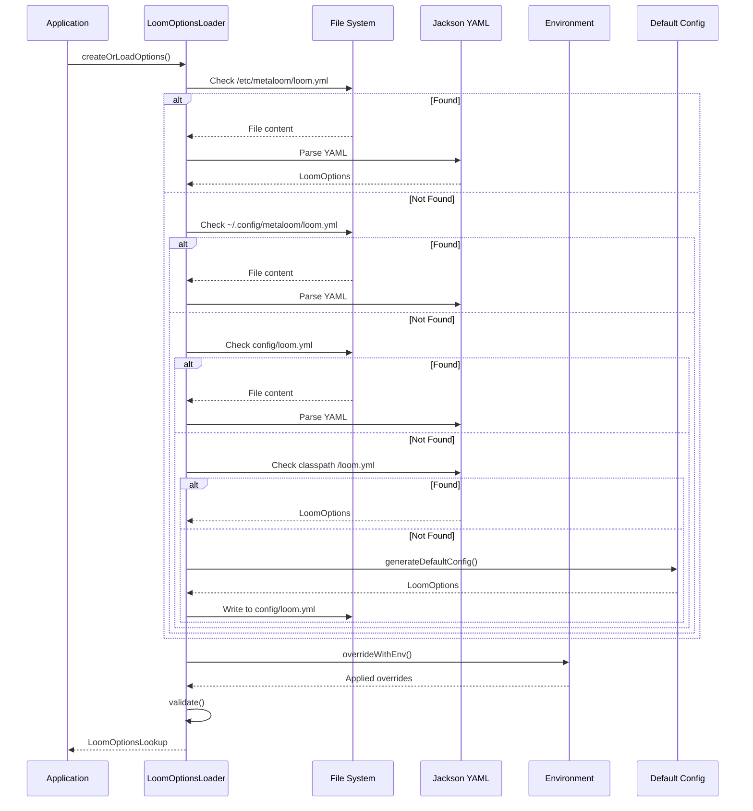

# Loom Configuration Specification

## Overview

The Loom configuration system provides a hierarchical, type-safe configuration mechanism with support for YAML files, environment variable overrides, and sensible defaults. The system is built around the `Option` interface and uses Jackson for YAML deserialization.

### Configuration Architecture

```mermaid
graph TB
    subgraph "Configuration Loading"
        Loader[LoomOptionsLoader]
        YAML[Jackson YAML Mapper]
        Env[Environment Variables]
        Defaults[Default Values]
    end
    
    subgraph "Configuration Objects"
        LoomOpts[LoomOptions]
        DBOpts[DatabaseOptions]
        ServerOpts[ServerOptions]
        AuthOpts[AuthenticationOptions]
        OAuth2Opts[OAuth2Options]
    end
    
    subgraph "Annotation Processing"
        EnvAnnotation[@EnvironmentVariable]
        OptionUtils[OptionUtils]
        Reflection[Reflection-based Override]
    end
    
    Loader --> YAML
    Loader --> Env
    Loader --> Defaults
    
    LoomOpts --> DBOpts
    LoomOpts --> ServerOpts
    LoomOpts --> AuthOpts
    AuthOpts --> OAuth2Opts
    
    EnvAnnotation --> OptionUtils
    OptionUtils --> Reflection
    Reflection --> LoomOpts
    Reflection --> DBOpts
    Reflection --> ServerOpts
    Reflection --> AuthOpts
    Reflection --> OAuth2Opts
    
    style LoomOpts fill:#e1f5fe
    style DBOpts fill:#fff3e0
    style ServerOpts fill:#f3e5f5
    style AuthOpts fill:#e8f5e9
    style OAuth2Opts fill:#fce4ec
```

---

## Configuration File Locations

The configuration is loaded from the following locations in priority order (first match wins):

| Priority | Path | Description | Constant |
|----------|------|-------------|----------|
| 1 | `/etc/metaloom/loom.yml` | System-wide configuration | `LoomEnv.LOCAL_ETC_PATH` |
| 2 | `~/.config/metaloom/loom.yml` | User-specific configuration | `LoomEnv.HOME_CONFIG_PATH` |
| 3 | `config/loom.yml` | Local project configuration | `LoomEnv.LOCAL_CONFIG_PATH` |
| 4 | Classpath `/loom.yml` | Bundled default configuration | `Loom.class.getResourceAsStream()` |
| 5 | Generated default | Auto-generated if none found | `generateDefaultConfig()` |

### LoomEnv Constants

```java
// Package: io.metaloom.loom.api.LoomEnv
public static final String LOOM_CONF_FILENAME = "loom.yml";
public static final Path LOCAL_ETC_PATH = Path.of("/etc", "metaloom", LOOM_CONF_FILENAME);
public static final Path HOME_CONFIG_PATH = Path.of(System.getProperty("user.home"), ".config", "metaloom", LOOM_CONF_FILENAME);
public static final Path LOCAL_CONFIG_PATH = Path.of("config", LOOM_CONF_FILENAME);
```

---

## Configuration Structure (loom.yml)

### Complete Example

```yaml
database:
  host: "127.0.0.1"
  port: 5432
  username: "postgres"
  password: "finger"
  databaseName: "loom"
  minPoolSize: 5
  acquireIncrement: 5
  maxPoolSize: 20

server:
  grpcPort: 8091
  bindAddress: "0.0.0.0"
  restPort: 8092
  monitoringPort: 8989
  mcpPort: 4041

auth:
  keystorePassword: "8qA9uBbdaEFp"
  initialPassword: null
  tokenExpirationTime: 3600
  oauth2:
    enabled: false
    clientId: ""
    clientSecret: ""
    authUrl: ""
    tokenUrl: ""
    userInfoUrl: ""
    callbackUrl: ""
    logoutUrl: ""
    scope: "openid profile email"
```

### Configuration Object Hierarchy

```
LoomOptions (root)
├── DatabaseOptions
├── ServerOptions
└── AuthenticationOptions
    └── OAuth2Options
```

---

## Option Classes Reference

### LoomOptions (Root)

**Package:** `io.metaloom.loom.api.options.LoomOptions`

| Property | Type | Description |
|----------|------|-------------|
| `database` | `DatabaseOptions` | Database connection and pool configuration |
| `server` | `ServerOptions` | Server ports and bind address |
| `auth` | `AuthenticationOptions` | Authentication and security settings |
| `storage` | `StorageOptions` | Where binaries land when a library has no pool, plus the upload size and free-space guards |
| `s3` | `S3Options` | Credentials and endpoint/region defaults for every S3-backed `asset_pool` |

> `storage` and `s3` are documented in full — including how a library selects its backend — in
> [../features/rest/REST_BINARY_HANDLING.md](../features/rest/REST_BINARY_HANDLING.md) §5 and §11.
> Note that `StorageOptions` accepts **both** `LOOM_STORAGE_UPLOAD_DIR` (canonical) and
> `LOOM_BINARY_DIR` (alias kept for the Helm chart's historic name); the canonical one wins.

### DatabaseOptions

**Package:** `io.metaloom.loom.api.options.DatabaseOptions`

| Property | Default | Environment Variable | Type | Description |
|----------|---------|---------------------|------|-------------|
| `host` | `127.0.0.1` | `LOOM_DB_HOST` | String | Database host |
| `port` | `5432` | `LOOM_DB_PORT` | int | Database port |
| `username` | `postgres` | `LOOM_DB_USERNAME` | String | Database username |
| `password` | `finger` | `LOOM_DB_PASSWORD` | String | Database password (sensitive) |
| `databaseName` | `loom` | `LOOM_DB_NAME` | String | Database name |
| `minPoolSize` | `5` | `LOOM_DB_MIN_POOL_SIZE` | int | Minimum connection pool size |
| `acquireIncrement` | `5` | — | int | Pool acquire increment |
| `maxPoolSize` | `20` | `LOOM_DB_MAX_POOL_SIZE` | int | Maximum connection pool size |
| `jdbcUrl` | computed | — | String | **Derived**: `jdbc:postgresql://host:port/databaseName` |

### ServerOptions

**Package:** `io.metaloom.loom.api.options.ServerOptions`

| Property | Default | Environment Variable | Type | Description |
|----------|---------|---------------------|------|-------------|
| `grpcPort` | `8091` | `LOOM_SERVER_GRPC_PORT` | int | gRPC server port |
| `bindAddress` | `0.0.0.0` | `LOOM_SERVER_GRPC_BIND_ADDRESS` | String | Bind address for all servers |
| `restPort` | `8092` | `LOOM_SERVER_REST_PORT` | int | REST/HTTP server port |
| `monitoringPort` | `8989` | `LOOM_SERVER_MON_PORT` | int | Monitoring server port (reserved) |
| `mcpPort` | `4041` | `LOOM_SERVER_MCP_PORT` | int | MCP server port |

### AuthenticationOptions

**Package:** `io.metaloom.loom.api.options.AuthenticationOptions`

| Property | Default | Environment Variable | Type | Description |
|----------|---------|---------------------|------|-------------|
| `keystorePassword` | `null` | — | String | Keystore password (set via `generateDefaultConfig()`) |
| `initialPassword` | `null` | `LOOM_INITIAL_PASSWORD` | String | Initial admin password |
| `tokenExpirationTime` | `3600` | `LOOM_TOKEN_EXPIRATION_TIME` | int | JWT token expiration (seconds) |
| `oauth2` | `OAuth2Options` | — | Object | OAuth2 configuration |
| `mcpAuthEnabled` | `false` | `LOOM_MCP_AUTH_ENABLED` | boolean | Enable authentication on MCP endpoints |
| `mcpAuthStrictMode` | `false` | `LOOM_MCP_AUTH_STRICT_MODE` | boolean | Require auth on all MCP endpoints (no lenient mode) |
| `mcpAuthAllowedOrigins` | `*` | `LOOM_MCP_AUTH_ALLOWED_ORIGINS` | String | Comma-separated allowed origins for the MCP SSE endpoint |

**Constants:**
- `DEFAULT_KEYSTORE_FILENAME = "keystore.jceks"`
- `TOKEN_COOKIE_KEY = "__Host-loom_token"`
- `DEFAULT_TOKEN_EXPIRATION_TIME = 3600`

### OAuth2Options

**Package:** `io.metaloom.loom.api.options.OAuth2Options`

| Property | Default | Environment Variable | Type | Description |
|----------|---------|---------------------|------|-------------|
| `enabled` | `false` | `LOOM_OAUTH2_ENABLED` | boolean | Enable OAuth2 |
| `clientId` | `""` | `LOOM_OAUTH2_CLIENT_ID` | String | OAuth2 client ID |
| `clientSecret` | `""` | `LOOM_OAUTH2_CLIENT_SECRET` | String | OAuth2 client secret (sensitive) |
| `authUrl` | `""` | `LOOM_OAUTH2_AUTH_URL` | String | Authorization endpoint URL |
| `tokenUrl` | `""` | `LOOM_OAUTH2_TOKEN_URL` | String | Token endpoint URL |
| `userInfoUrl` | `""` | `LOOM_OAUTH2_USERINFO_URL` | String | Userinfo endpoint URL |
| `callbackUrl` | `""` | `LOOM_OAUTH2_CALLBACK_URL` | String | Callback URL |
| `logoutUrl` | `""` | `LOOM_OAUTH2_LOGOUT_URL` | String | Logout endpoint URL |
| `scope` | `openid profile email` | `LOOM_OAUTH2_SCOPE` | String | OAuth2 scopes |

---

## Environment Variable Override System

### How It Works

The configuration system uses a two-phase approach:

1. **YAML Deserialization** — Jackson maps YAML to POJOs
2. **Environment Override** — `overrideWithEnv()` recursively applies environment variables

### Override Mechanism

```java
// In Option interface (default method)
default void overrideWithEnv() {
    Class<?> cls = getClass();
    while (cls != null && cls != Object.class) {
        // Check annotated methods
        for (Method method : cls.getDeclaredMethods()) {
            if (method.getParameterCount() == 1 && method.isAnnotationPresent(EnvironmentVariable.class)) {
                OptionUtils.overrideWithEnvViaMethod(method, this);
            }
        }
        // Check annotated fields
        for (Field field : cls.getDeclaredFields()) {
            if (field.isAnnotationPresent(EnvironmentVariable.class)) {
                OptionUtils.overrideWitEnvViaFieldSet(field, this);
            }
            // Recursively process nested Option objects
            if (Option.class.isAssignableFrom(field.getType())) {
                field.setAccessible(true);
                Option subOption = (Option) field.get(this);
                if (subOption != null) {
                    subOption.overrideWithEnv();
                }
            }
        }
        cls = cls.getSuperclass();
    }
}
```

### @EnvironmentVariable Annotation

```java
@Target({ ElementType.ANNOTATION_TYPE, ElementType.FIELD, ElementType.METHOD })
@Retention(RetentionPolicy.RUNTIME)
public @interface EnvironmentVariable {
    String description();
    String name();
    boolean isSensitive() default false;
}
```

### OptionUtils Helper Methods

| Method | Purpose |
|--------|---------|
| `applyEnv(name, setter)` | String env var with direct setter |
| `applyEnvSensitive(name, setter)` | Sensitive string (masked in logs) |
| `applyEnvInt(name, setter)` | Integer env var |
| `applyEnvBoolean(name, setter)` | Boolean env var |
| `convertValue(clazz, value)` | Type conversion (String, boolean, int, long, float, double, JsonObject, Enum, List, Set) |

### Sensitive Value Handling

Fields annotated with `isSensitive() = true` have their values masked in logs:

```java
@EnvironmentVariable(name = "LOOM_OAUTH2_CLIENT_SECRET", description = "...", isSensitive = true)
private String clientSecret;
```

Log output: `Setting env {LOOM_OAUTH2_CLIENT_SECRET=********}`

---

## Configuration Loading Flow



---

## Configuration Validation

After the YAML has been parsed and environment overrides have been applied, `LoomOptions.validate()` checks the whole option tree. Validation is **fail-fast at startup** — an invalid configuration prevents the server from booting rather than surfacing as an obscure runtime failure later.

### Collecting Errors

Every `Option` may implement `validate(OptionErrors errors)`. All implementations report into a **shared collector** so that the full set of problems is reported at once:

```java
@Override
public void validate(OptionErrors errors) {
    errors.host("host", host)
        .port("port", port)
        .notBlank("username", username)
        .min("minPoolSize", minPoolSize, 1);
}
```

`LoomOptions.validate()` walks the tree and then throws a single `ConfigurationValidationException` carrying every error:

```
Configuration validation failed with 4 error(s):
  - database.host: must not be empty [env: LOOM_DB_HOST]
  - database.port: must be a port between 1 and 65535 but was 0 [env: LOOM_DB_PORT]
  - server.restPort: must not use the same port as grpcPort (8091) [env: LOOM_SERVER_REST_PORT]
  - auth.oauth2.authUrl: must be an absolute URL including scheme and host but was '/authorize' [env: LOOM_OAUTH2_AUTH_URL]
```

Each error is prefixed with the dotted YAML path and — when the field carries an `@EnvironmentVariable` annotation — suffixed with the environment variable that can override it. Values of blank/secret fields are never echoed into the message.

### OptionErrors API

| Method | Purpose |
|--------|---------|
| `nested(name, option)` | Validate a sub option under a nested path; reports an error when the sub option is `null` |
| `add(field, message)` | Record a free-form error |
| `notBlank(field, value)` | Value must be non-null and non-blank (value is never echoed) |
| `port(field, value)` | Value must be in range 1–65535 |
| `min(field, value, min)` | Value must be `>= min` |
| `host(field, value)` | Value must be a syntactically valid hostname or IP literal (no DNS resolution) |
| `url(field, value)` | Value must be an absolute `http`/`https` URL |
| `isEmpty()` / `errors()` | Inspect the collected errors |
| `throwOnError()` | Throw `ConfigurationValidationException` when any error was collected |

### Required vs Optional Settings

| Setting | Required | Rule |
|---------|----------|------|
| `database.host` | ✅ | Valid hostname or IP literal |
| `database.port` | ✅ | 1–65535 |
| `database.username` | ✅ | Non-blank |
| `database.password` | ✅ | Non-blank |
| `database.databaseName` | ✅ | Non-blank |
| `database.minPoolSize` | ✅ | `>= 1` |
| `database.maxPoolSize` | ✅ | `>= 1` and `>= minPoolSize` |
| `database.acquireIncrement` | ✅ | `>= 1` |
| `server.bindAddress` | ✅ | Valid hostname or IP literal |
| `server.grpcPort` | ✅ | 1–65535, distinct from the other server ports |
| `server.restPort` | ✅ | 1–65535, distinct from the other server ports |
| `server.monitoringPort` | ✅ | 1–65535, distinct from the other server ports |
| `server.mcpPort` | ✅ | 1–65535, distinct from the other server ports |
| `auth.keystorePassword` | ✅ | Non-blank (auto-generated by `generateDefaultConfig()`) |
| `auth.tokenExpirationTime` | ✅ | `>= 1` |
| `auth.initialPassword` | ⬜ | Not validated |
| `auth.mcpAuthAllowedOrigins` | ⚠️ | Non-blank **only when** `auth.mcpAuthEnabled` is `true` |
| `auth.oauth2.*` | ⚠️ | Validated **only when** `auth.oauth2.enabled` is `true` (see below) |

When `auth.oauth2.enabled` is `false` the whole OAuth2 block is skipped, so a partially filled placeholder block is not an error. When enabled:

| Setting | Required | Rule |
|---------|----------|------|
| `clientId` | ✅ | Non-blank |
| `clientSecret` | ✅ | Non-blank |
| `scope` | ✅ | Non-blank |
| `authUrl` | ✅ | Absolute `http`/`https` URL |
| `tokenUrl` | ✅ | Absolute `http`/`https` URL |
| `userInfoUrl` | ✅ | Absolute `http`/`https` URL |
| `callbackUrl` | ✅ | Absolute `http`/`https` URL |
| `logoutUrl` | ⬜ | Optional, but must be a valid URL when set |

### Validating Without Starting the Server

`LoomServerRunner` accepts a `--validate-config` flag which loads the configuration through the normal lookup order, validates it, and exits without booting any service:

```bash
loom-server --validate-config
```

| Exit code | Meaning |
|-----------|---------|
| `0` | Configuration is valid — the source folder is printed to stdout |
| `1` | Configuration is invalid — every error is printed to stderr |

Because it runs the ordinary loading path, environment variable overrides are applied, making it usable as a deployment pre-flight check:

```bash
LOOM_DB_PASSWORD="$DB_PASS" loom-server --validate-config || exit 1
```

On a normal boot, a `ConfigurationValidationException` is reported as a plain error list (no stacktrace) and the process exits with code `11`.

---

## Default Configuration Generation

When no configuration file is found, a default is generated and saved to `config/loom.yml`:

```java
public static LoomOptions generateDefaultConfig() {
    LoomOptions options = new LoomOptions();
    options.getAuth().setKeystorePassword(StringUtils.randomHumanString(12));
    // options.setNodeName(LoomNameProvider.getInstance().getRandomName());
    return options;
}
```

**Generated defaults:**
- Database: localhost:5432, postgres/finger, database "loom", pool 5-20
- Server: gRPC 8091, REST 8092, bind 0.0.0.0, monitoring 8989
- Auth: Random 12-char keystore password, token expiration 3600s, OAuth2 disabled

---

## Key Classes Reference

| Class | Package | Purpose |
|-------|---------|---------|
| `LoomOptions` | `io.metaloom.loom.api.options` | Root configuration object |
| `DatabaseOptions` | `io.metaloom.loom.api.options` | Database configuration |
| `ServerOptions` | `io.metaloom.loom.api.options` | Server ports and bind address |
| `AuthenticationOptions` | `io.metaloom.loom.api.options` | Authentication settings |
| `OAuth2Options` | `io.metaloom.loom.api.options` | OAuth2 configuration |
| `LoomOptionsLoader` | `io.metaloom.loom.common.options` | Configuration loading logic |
| `LoomOptionsLookup` | `io.metaloom.loom.api.options` | Config + source location container |
| `Option` | `io.metaloom.loom.api.options` | Marker interface with `overrideWithEnv()` and `validate(OptionErrors)` |
| `OptionErrors` | `io.metaloom.loom.api.options` | Validation error collector with path scoping and check helpers |
| `ConfigurationValidationException` | `io.metaloom.loom.api.error` | Thrown on startup with the full list of validation errors |
| `OptionUtils` | `io.metaloom.loom.api.options` | Environment override utilities |
| `EnvironmentVariable` | `io.metaloom.loom.api.options` | Annotation for env var mapping |
| `LoomEnv` | `io.metaloom.loom.api` | Config file path constants |

---

## Conventions and Gotchas

| Issue | Description | Impact |
|-------|-------------|--------|
| **No acquireIncrement env var** | `acquireIncrement` field lacks `@EnvironmentVariable` annotation | Cannot override via `LOOM_DB_ACQUIRE_INCREMENT` |
| **keystorePassword not in env** | No env var for keystore password, only set via `generateDefaultConfig()` | Must use generated config or manually edit YAML |
| **initialPassword not in overrideWithEnv** | `initialPassword` field has annotation but not in `overrideWithEnv()` method | Env var `LOOM_INITIAL_PASSWORD` ignored (uses reflection path) |
| **OAuth2 clientSecret sensitive** | Marked `isSensitive=true` but uses `applyEnvSensitive` only in `overrideWithEnv()` | Reflection path doesn't mask sensitive values in logs |
| **Config file permissions** | Default config written with random password - file may be world-readable | Security risk if config directory not secured |
| **No command-line args support** | `applyCommandLineArgs` commented out in `LoomOptionsLoader`; only `--validate-config` is handled in `LoomServerRunner` | Cannot override individual settings via CLI arguments |
| **Validation only runs via the loader** | `validate()` is invoked from `LoomOptionsLoader.createOrLoadOptions()` | Tests and services constructing `new LoomOptions()` directly are not validated |
| **`new LoomOptions()` is not valid** | `auth.keystorePassword` defaults to `null` and is only set by `generateDefaultConfig()` | A hand-built `LoomOptions` fails validation until a keystore password is set |
| **Host validation is syntax-only** | `OptionErrors.host()` does not resolve DNS | An unresolvable but well-formed hostname still passes validation |
| **Nested Option recursion** | Reflection-based recursion may miss private fields in subclasses | Sub-options must be accessible via reflection |

---

## Where Do I Find...?

| Concept | File Path |
|---------|-----------|
| Root configuration | `loom-shared/api/src/main/java/io/metaloom/loom/api/options/LoomOptions.java` |
| Database configuration | `loom-shared/api/src/main/java/io/metaloom/loom/api/options/DatabaseOptions.java` |
| Server configuration | `loom-shared/api/src/main/java/io/metaloom/loom/api/options/ServerOptions.java` |
| Authentication configuration | `loom-shared/api/src/main/java/io/metaloom/loom/api/options/AuthenticationOptions.java` |
| OAuth2 configuration | `loom-shared/api/src/main/java/io/metaloom/loom/api/options/OAuth2Options.java |
| Configuration loader | `loom/common/src/main/java/io/metaloom/loom/common/options/LoomOptionsLoader.java` |
| Option interface | `loom-shared/api/src/main/java/io/metaloom/loom/api/options/Option.java` |
| Validation error collector | `loom-shared/api/src/main/java/io/metaloom/loom/api/options/OptionErrors.java` |
| Validation exception | `loom-shared/api/src/main/java/io/metaloom/loom/api/error/ConfigurationValidationException.java` |
| Validation tests | `loom-shared/api/src/test/java/io/metaloom/loom/api/options/LoomOptionsValidationTest.java` |
| `--validate-config` flag | `loom/containers/server/src/main/java/io/metaloom/loom/container/server/LoomServerRunner.java` |
| Option utilities | `loom-shared/api/src/main/java/io/metaloom/loom/api/options/OptionUtils.java` |
| Environment variable annotation | `loom-shared/api/src/main/java/io/metaloom/loom/api/options/EnvironmentVariable.java` |
| Config file paths | `loom-shared/api/src/main/java/io/metaloom/loom/api/LoomEnv.java` |
| Example configuration | `e2e-test/config/loom.yml` |
| Config lookup record | `loom-shared/api/src/main/java/io/metaloom/loom/api/options/LoomOptionsLookup.java` |

---

## Test Setup

### Unit Testing Configuration Loading

```java
// Test loading from specific path
LoomOptionsLookup lookup = LoomOptionsLoader.loadLoomOptions();
// Or test with custom environment
System.setProperty("LOOM_DB_HOST", "test-host");
System.setProperty("LOOM_SERVER_REST_PORT", "9090");
LoomOptionsLookup lookup = LoomOptionsLoader.createOrLoadOptions();
assertEquals("test-host", lookup.options().getDatabase().getHost());
assertEquals(9090, lookup.options().getServer().getRestPort());
```

### Testing Environment Override

```java
// Test sensitive value masking
System.setProperty("LOOM_OAUTH2_CLIENT_SECRET", "secret123");
LoomOptions options = new LoomOptions();
options.getAuth().getOauth2().overrideWithEnv();
// Verify log shows: Setting env {LOOM_OAUTH2_CLIENT_SECRET=********}
```

### Integration Test Configuration

```yaml
# config/loom.yml for integration tests
database:
  host: "localhost"
  port: 5432
  username: "postgres"
  password: "postgres"
  databaseName: "loom_test"
  minPoolSize: 2
  maxPoolSize: 10

server:
  grpcPort: 8091
  bindAddress: "0.0.0.0"
  restPort: 8092
  monitoringPort: 8989
  mcpPort: 4041

auth:
  keystorePassword: "testpassword123"
  tokenExpirationTime: 3600
  oauth2:
    enabled: false
```

---

## Progress Assessment

- [x] Document configuration file locations and priority order
- [x] Document complete loom.yml structure with all sections
- [x] Document all Option classes with properties, defaults, and env vars
- [x] Document environment variable override mechanism
- [x] Document @EnvironmentVariable annotation and OptionUtils
- [x] Include architecture diagram (Mermaid)
- [x] Include configuration loading flow diagram (Mermaid)
- [x] Include Key Classes Reference table
- [x] Include environment variable tables with defaults
- [x] Include Conventions and Gotchas section
- [x] Include Where do I find...? cheat sheet
- [x] Include Test Setup section
- [x] Cross-reference related specs
- [x] Document validation implementation
- [x] Document required vs optional settings
- [x] Document the `--validate-config` CLI flag
- [ ] Document remaining command-line argument support (`applyCommandLineArgs` still commented out)
- [ ] Document config file permission/security considerations
- [ ] Document acquireIncrement env var missing

---

## Related Specifications

- [SERVER.md](SERVER.md) — Server ports and service configuration
- [DATABASE.md](DATABASE.md) — Database connection and migration
- [AUTH.md](AUTH.md) — Authentication and OAuth2 implementation
- [DEPLOYMENT.md](DEPLOYMENT.md) — Deployment configuration