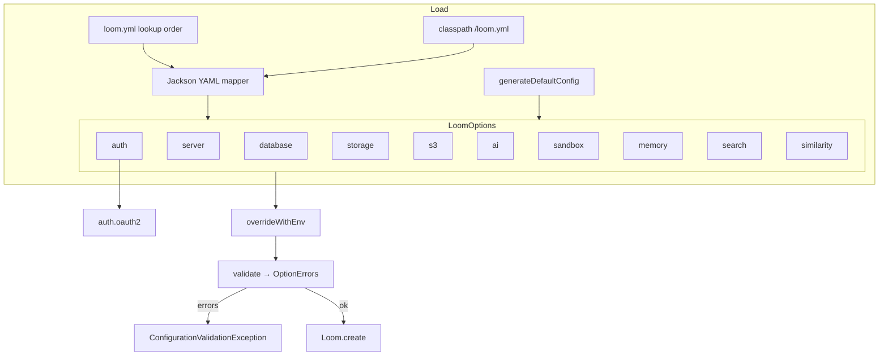

# Loom Configuration Specification

Covers the **Loom server** configuration system: `loom.yml`, the `Option` tree in
`loom-shared/api`, environment overrides and startup validation.

**Not covered here** (separate subsystems, do not duplicate):

| Subsystem | Spec |
|-----------|------|
| Cortex worker config (`cortex.yml`, `CORTEX_*`, CLI flags, per-node options) | [../cortex/CONFIGURATION.md](../cortex/CONFIGURATION.md) |
| Helm chart values → env wiring | [../features/helm/HELM_LOOM.md](../features/helm/HELM_LOOM.md) |
| Binary storage backends, pools, S3 semantics | [../features/rest/REST_BINARY_HANDLING.md](../features/rest/REST_BINARY_HANDLING.md) §5, §11 |
| Search behaviour behind `search.*` | [../features/search/SEARCH.md](../features/search/SEARCH.md) |
| Similarity index behind `similarity.*` | [SEARCH_LUCENE.md](SEARCH_LUCENE.md) |
| Chat agent / memory bank behaviour behind `ai.*`, `memory.*` | [../features/chat/CHAT_MEMORY_PLAN.md](../features/chat/CHAT_MEMORY_PLAN.md) |
| MCP auth behaviour behind `auth.mcpAuth*` | [MCP.md](MCP.md) |

---

## 1. Overview

Configuration is a plain POJO tree rooted at `LoomOptions`, deserialized from YAML with Jackson,
then overridden from the environment, then validated.



There are **three** layers only — YAML file → environment variables → code defaults.
CLI argument overrides do **not** exist (`applyCommandLineArgs` is commented out in
`LoomOptionsLoader`); the only recognised flag is `--validate-config`.

---

## 2. Configuration file lookup

`LoomOptionsLoader.loadLoomOptions()` — **first match wins, no merging** between locations:

| # | Path | Constant | `baseConfigFolder` |
|---|------|----------|--------------------|
| 1 | `/etc/metaloom/loom.yml` | `LoomEnv.LOCAL_ETC_PATH` | `/etc/metaloom` |
| 2 | `~/.config/metaloom/loom.yml` | `LoomEnv.HOME_CONFIG_PATH` | `~/.config/metaloom` |
| 3 | `config/loom.yml` (cwd-relative) | `LoomEnv.LOCAL_CONFIG_PATH` | `<cwd>/config` |
| 4 | classpath `/loom.yml` | `Loom.class.getResourceAsStream` | **`null`** |
| 5 | `generateDefaultConfig()`, written to `config/loom.yml` | — | `<cwd>/config` |

`LoomEnv` holds only these constants; there is **no env var that relocates the config file**
(see §5.3). `LoomOptionsLookup(baseConfigFolder, options)` is the injected carrier — the JWT
keystore is resolved as `baseConfigFolder/keystore.jceks` (`AuthenticationOptions.DEFAULT_KEYSTORE_FILENAME`).
⚠️ Row 4 makes `baseConfigFolder` **null**, so `AuthModule.jwtAuthProvider` falls back to `<cwd>/config`
— the same folder row 5 would have written a generated config to. Until 2026-08-15 it dereferenced the
null instead and a classpath-only deployment died at boot with an NPE.

Mapper settings: `FAIL_ON_UNKNOWN_PROPERTIES=false` (unknown keys silently ignored),
`Include.ALWAYS` on serialization.

---

## 3. `loom.yml` structure

Top-level keys map 1:1 to the fields of `LoomOptions`. Every section is optional; a missing
section keeps the code defaults of its `*Options` class.

```yaml
database:   { host, port, username, password, databaseName, minPoolSize, acquireIncrement, maxPoolSize }
server:     { grpcPort, bindAddress, restPort, monitoringPort, mcpPort }
auth:       { keystorePassword, initialPassword, tokenExpirationTime,
              mcpAuthEnabled, mcpAuthStrictMode, mcpAuthAllowedOrigins,
              oauth2: { enabled, clientId, clientSecret, authUrl, tokenUrl,
                        userInfoUrl, callbackUrl, logoutUrl, scope } }
storage:    { uploadDirectory, maxUploadSize, minFreeSpace }
s3:         { endpoint, region, accessKey, secretKey, pathStyleAccess }
ai:         { enabled, url, modelId, contextWindow, maxTurns,
              toolTimeoutMs, thinkEnabled, streaming, titleGeneration }
sandbox:    { enabled, backend, image, namespace, idleTtlSeconds, maxSessionSeconds,
              execTimeoutSeconds, maxConcurrent, readyTimeoutSeconds,
              cpuRequest, cpuLimit, memRequest, memLimit, workspaceSize }
memory:     { enabled, mountEnabled, mountPath, maxEntryBytes, maxEntriesPerScope,
              maxScopeBytes, maxDepth, maxWritesPerRun, promptMaxEntries,
              promptMaxChars, sharedScopesEnabled, sharedWriteEnabled }
search:     { enabled, provider, defaultLimit, maxLimit, maxOffset, highlightEnabled,
              trigramThreshold, trigramWeight, bodyMaxBytes, tsConfig }
similarity: { enabled, indexPath, algorithm, scoreThreshold, topK }
```

`database.jdbcUrl` is **derived** (`@JsonIgnore`): `jdbc:postgresql://host:port/databaseName`.

Reference files: `e2e-test/config/loom.yml`, `loom/containers/server/config/loom.yml`.
⚠️ The latter contains `auth.keystorePath`, which **no option class declares** — it is silently
dropped by the lenient mapper.

---

## 4. Environment variables — complete table

Every variable below is genuinely read by the Loom server process at HEAD. `Options` names the
class that reads it; the YAML path is the class's section plus the field.

### 4.1 `database` — `DatabaseOptions`

| Variable | Default | Options | Purpose |
|----------|---------|---------|---------|
| `LOOM_DB_HOST` | `127.0.0.1` | `DatabaseOptions` | PostgreSQL host |
| `LOOM_DB_PORT` | `5432` | `DatabaseOptions` | PostgreSQL port |
| `LOOM_DB_USERNAME` | `postgres` | `DatabaseOptions` | PostgreSQL user |
| `LOOM_DB_PASSWORD` | `finger` | `DatabaseOptions` | PostgreSQL password (**not** marked sensitive — value is logged) |
| `LOOM_DB_NAME` | `loom` | `DatabaseOptions` | Database name |
| `LOOM_DB_MIN_POOL_SIZE` | `5` | `DatabaseOptions` | Minimum pool size |
| `LOOM_DB_MAX_POOL_SIZE` | `20` | `DatabaseOptions` | Maximum pool size |
| — | `5` | `DatabaseOptions` | `acquireIncrement` — **YAML only, no env var** |

### 4.2 `server` — `ServerOptions`

| Variable | Default | Options | Purpose |
|----------|---------|---------|---------|
| `LOOM_SERVER_GRPC_PORT` | `8091` | `ServerOptions` | gRPC port |
| `LOOM_SERVER_GRPC_BIND_ADDRESS` | `0.0.0.0` | `ServerOptions` | Bind address for **all** listeners despite the name |
| `LOOM_SERVER_REST_PORT` | `8092` | `ServerOptions` | REST + WebSocket port |
| `LOOM_SERVER_MON_PORT` | `8989` | `ServerOptions` | Monitoring/health/metrics port |
| `LOOM_SERVER_MCP_PORT` | `4041` | `ServerOptions` | MCP server port |

### 4.3 `auth` — `AuthenticationOptions`

| Variable | Default | Options | Purpose |
|----------|---------|---------|---------|
| `LOOM_INITIAL_PASSWORD` | `null` | `AuthenticationOptions` | Bootstrap admin password |
| `LOOM_TOKEN_EXPIRATION_TIME` | `3600` | `AuthenticationOptions` | JWT lifetime in seconds |
| `LOOM_MCP_AUTH_ENABLED` | `false` | `AuthenticationOptions` | Auth on MCP SSE/message/WebSocket endpoints |
| `LOOM_MCP_AUTH_STRICT_MODE` | `false` | `AuthenticationOptions` | Require auth on all MCP endpoints (no lenient mode) |
| `LOOM_MCP_AUTH_ALLOWED_ORIGINS` | `*` | `AuthenticationOptions` | CORS origins for the MCP SSE endpoint |
| — | `null` | `AuthenticationOptions` | `keystorePassword` — **YAML only**, generated by `generateDefaultConfig()` |

Constants: `DEFAULT_KEYSTORE_FILENAME = "keystore.jceks"`, `TOKEN_COOKIE_KEY = "__Host-loom_token"`,
`DEFAULT_TOKEN_EXPIRATION_TIME = 3600`.

### 4.4 `auth.oauth2` — `OAuth2Options`

| Variable | Default | Options | Purpose |
|----------|---------|---------|---------|
| `LOOM_OAUTH2_ENABLED` | `false` | `OAuth2Options` | Master switch; gates all validation below |
| `LOOM_OAUTH2_CLIENT_ID` | `null` | `OAuth2Options` | Client ID |
| `LOOM_OAUTH2_CLIENT_SECRET` | `null` | `OAuth2Options` | Client secret (**sensitive**, masked) |
| `LOOM_OAUTH2_AUTH_URL` | `null` | `OAuth2Options` | Authorization endpoint |
| `LOOM_OAUTH2_TOKEN_URL` | `null` | `OAuth2Options` | Token endpoint |
| `LOOM_OAUTH2_USERINFO_URL` | `null` | `OAuth2Options` | Userinfo endpoint |
| `LOOM_OAUTH2_CALLBACK_URL` | `null` | `OAuth2Options` | Callback URL |
| `LOOM_OAUTH2_LOGOUT_URL` | `null` | `OAuth2Options` | End-session endpoint (optional) |
| `LOOM_OAUTH2_SCOPE` | `openid profile email` | `OAuth2Options` | Requested scopes |

### 4.5 `storage` — `StorageOptions`

| Variable | Default | Options | Purpose |
|----------|---------|---------|---------|
| `LOOM_STORAGE_UPLOAD_DIR` | `data/storage` | `StorageOptions` | Default binary destination for libraries without an `asset_pool` |
| `LOOM_BINARY_DIR` | — | `StorageOptions` | **Alias** for the above; applied first so `LOOM_STORAGE_UPLOAD_DIR` wins when both are set |
| `LOOM_STORAGE_MAX_UPLOAD_SIZE` | `-1` (no cap) | `StorageOptions` | Largest accepted upload in bytes |
| `LOOM_STORAGE_MIN_FREE_SPACE` | `1073741824` (1 GiB) | `StorageOptions` | Refuse uploads below this free-byte floor; `0` disables. Not applied to S3 pools |

### 4.6 `s3` — `S3Options`

| Variable | Default | Options | Purpose |
|----------|---------|---------|---------|
| `LOOM_S3_ENDPOINT` | `null` | `S3Options` | Endpoint used when a pool names none (MinIO/Ceph) |
| `LOOM_S3_REGION` | `us-east-1` | `S3Options` | Region used when a pool names none |
| `LOOM_S3_ACCESS_KEY` | `null` | `S3Options` | Access key (**sensitive**). Unset ⇒ AWS default credential chain |
| `LOOM_S3_SECRET_KEY` | `null` | `S3Options` | Secret key (**sensitive**) |
| `LOOM_S3_PATH_STYLE` | unset ⇒ on iff an endpoint is set | `S3Options` | Force path-style bucket addressing |

Credentials live on the process only — never in `asset_pool` rows, REST responses or backups.
Names mirror Cortex's `CORTEX_S3_*` (`S3ClientOptions`).

### 4.7 `ai` — `AiOptions` (chat agent)

| Variable | Default | Options | Purpose |
|----------|---------|---------|---------|
| `LOOM_AI_ENABLED` | `true` | `AiOptions` | Enable the chat agent |
| `LOOM_AI_URL` | `http://127.0.0.1:8080/v1` | `AiOptions` | Base URL of the OpenAI-compatible server |
| `LOOM_AI_MODEL_ID` | `openai/gpt-oss-20b` | `AiOptions` | Model id |
| `LOOM_AI_CONTEXT_WINDOW` | `16384` | `AiOptions` | Context window |
| `LOOM_AI_MAX_TURNS` | `8` | `AiOptions` | Agentic loop turns per user message |
| `LOOM_AI_TOOL_TIMEOUT_MS` | `30000` | `AiOptions` | Per-tool-invocation timeout |
| `LOOM_AI_THINK_ENABLED` | `true` | `AiOptions` | Reasoning/think mode |
| `LOOM_AI_STREAMING` | `false` | `AiOptions` | True token streaming (else turn-granular) |
| `LOOM_AI_TITLE_GENERATION` | `true` | `AiOptions` | Automatic chat title generation |

### 4.8 `sandbox` — `SandboxOptions` (per-session coding sandbox)

| Variable | Default | Options | Purpose |
|----------|---------|---------|---------|
| `LOOM_AGENT_SANDBOX_ENABLED` | `false` | `SandboxOptions` | Enable `run_shell`/`write_file`/`read_file`/`list_files` |
| `LOOM_AGENT_SANDBOX_BACKEND` | `podman` | `SandboxOptions` | `podman` or `kubernetes` |
| `LOOM_AGENT_SANDBOX_IMAGE` | `metaloom/loom-session-runner:latest` | `SandboxOptions` | Session Runner image |
| `LOOM_AGENT_SANDBOX_NAMESPACE` | `""` | `SandboxOptions` | K8s/OpenShift namespace (falls back to the SA namespace) |
| `LOOM_AGENT_SANDBOX_IDLE_TTL_S` | `900` | `SandboxOptions` | Idle reap timeout |
| `LOOM_AGENT_SANDBOX_MAX_SESSION_S` | `3600` | `SandboxOptions` | Hard session time-box |
| `LOOM_AGENT_SANDBOX_EXEC_TIMEOUT_S` | `120` | `SandboxOptions` | Per-exec wall-clock timeout |
| `LOOM_AGENT_SANDBOX_MAX_CONCURRENT` | `10` | `SandboxOptions` | Per-deployment concurrent runner cap |
| `LOOM_AGENT_SANDBOX_READY_TIMEOUT_S` | `60` | `SandboxOptions` | Provision readiness wait |
| `LOOM_AGENT_SANDBOX_CPU_REQUEST` | `100m` | `SandboxOptions` | CPU request |
| `LOOM_AGENT_SANDBOX_CPU_LIMIT` | `1` | `SandboxOptions` | CPU limit |
| `LOOM_AGENT_SANDBOX_MEM_REQUEST` | `128Mi` | `SandboxOptions` | Memory request |
| `LOOM_AGENT_SANDBOX_MEM_LIMIT` | `512Mi` | `SandboxOptions` | Memory limit |
| `LOOM_AGENT_SANDBOX_WORKSPACE_SIZE` | `512Mi` | `SandboxOptions` | Ephemeral `/workspace` size |

The Kubernetes backend additionally reads the standard `KUBERNETES_SERVICE_HOST` (`kubernetes.default.svc`)
and `KUBERNETES_SERVICE_PORT` (`443`) directly in `KubernetesBackend` — they are not option fields.

### 4.9 `memory` — `MemoryOptions` (agent memory bank)

| Variable | Default | Options | Purpose |
|----------|---------|---------|---------|
| `LOOM_AGENT_MEMORY_ENABLED` | `false` | `MemoryOptions` | Enable memory tools + system-prompt block |
| `LOOM_AGENT_MEMORY_MOUNT_ENABLED` | `true` | `MemoryOptions` | Materialize memory read-only into the Session Runner |
| `LOOM_AGENT_MEMORY_MOUNT_PATH` | `/memory` | `MemoryOptions` | Mount path inside the runner (must be absolute) |
| `LOOM_AGENT_MEMORY_MAX_ENTRY_BYTES` | `262144` | `MemoryOptions` | Max single entry body |
| `LOOM_AGENT_MEMORY_MAX_ENTRIES_PER_SCOPE` | `500` | `MemoryOptions` | Max entries per scope |
| `LOOM_AGENT_MEMORY_MAX_SCOPE_BYTES` | `16777216` | `MemoryOptions` | Max total body bytes per scope |
| `LOOM_AGENT_MEMORY_MAX_DEPTH` | `4` | `MemoryOptions` | Max path segments of a memory id |
| `LOOM_AGENT_MEMORY_MAX_WRITES_PER_RUN` | `20` | `MemoryOptions` | Write/delete budget per agent run |
| `LOOM_AGENT_MEMORY_PROMPT_MAX_ENTRIES` | `50` | `MemoryOptions` | Index entries injected into the system prompt |
| `LOOM_AGENT_MEMORY_PROMPT_MAX_CHARS` | `4096` | `MemoryOptions` | Size of the injected prompt block |
| `LOOM_AGENT_MEMORY_SHARED_SCOPES_ENABLED` | `true` | `MemoryOptions` | Allow group/space scopes at all |
| `LOOM_AGENT_MEMORY_SHARED_WRITE_ENABLED` | `true` | `MemoryOptions` | Allow the agent to write shared scopes |

### 4.10 `search` — `SearchOptions`

| Variable | Default | Options | Purpose |
|----------|---------|---------|---------|
| `LOOM_SEARCH_ENABLED` | `true` | `SearchOptions` | Master switch; off ⇒ search routes answer 503 |
| `LOOM_SEARCH_PROVIDER` | `postgres` | `SearchOptions` | `postgres` \| `elasticsearch` \| `none` |
| `LOOM_SEARCH_DEFAULT_LIMIT` | `25` | `SearchOptions` | Default page size |
| `LOOM_SEARCH_MAX_LIMIT` | `100` | `SearchOptions` | Max requestable page size |
| `LOOM_SEARCH_MAX_OFFSET` | `1000` | `SearchOptions` | Deep-paging guard (beyond ⇒ 400) |
| `LOOM_SEARCH_HIGHLIGHT_ENABLED` | `true` | `SearchOptions` | Allow `ts_headline` snippets |
| `LOOM_SEARCH_TRIGRAM_THRESHOLD` | `0.3` | `SearchOptions` | `pg_trgm` similarity floor |
| `LOOM_SEARCH_TRIGRAM_WEIGHT` | `0.35` | `SearchOptions` | Trigram term weight in the blended score |
| `LOOM_SEARCH_BODY_MAX_BYTES` | `524288` | `SearchOptions` | Cap on indexed body text (tsvector limit is 1 MB) |
| `LOOM_SEARCH_TS_CONFIG` | `english` | `SearchOptions` | Postgres text-search configuration |

### 4.11 `similarity` — `SimilarityOptions`

| Variable | Default | Options | Purpose |
|----------|---------|---------|---------|
| `LOOM_SIMILARITY_ENABLED` | `false` | `SimilarityOptions` | Master switch for the fingerprint k-NN index |
| `LOOM_SIMILARITY_INDEX_PATH` | `similarity-index` | `SimilarityOptions` | On-disk Lucene index directory |
| `LOOM_SIMILARITY_ALGORITHM` | `metaloom-multisector-v1` | `SimilarityOptions` | Which `asset_fingerprint_comp.algorithm` participates |
| `LOOM_SIMILARITY_SCORE_THRESHOLD` | `0.10` | `SimilarityOptions` | Default k-NN score floor (per-request overridable) |
| `LOOM_SIMILARITY_TOPK` | `10` | `SimilarityOptions` | Default neighbours per query (per-request overridable) |

### 4.12 `vectorIndex` — `VectorIndexOptions`

The embedding (face) vector index. **Distinct from `similarity`**: that one holds one perceptual fingerprint
per asset and answers "same recording?", this one holds one vector per detected face and answers "same
subject?". Separate directories, separate writers - do not point them at the same path.

| Variable | Default | Options | Purpose |
|----------|---------|---------|---------|
| `LOOM_VECTOR_INDEX_PROVIDER` | `none` | `VectorIndexOptions` | `none` \| `lucene`. An unknown value fails `validate()` at boot rather than degrading silently |
| `LOOM_VECTOR_INDEX_PATH` | `vector-index` | `VectorIndexOptions` | On-disk Lucene index directory |
| `LOOM_VECTOR_INDEX_TOPK` | `10` | `VectorIndexOptions` | Default neighbours per query |
| `LOOM_VECTOR_INDEX_SCORE_THRESHOLD` | `0.35` | `VectorIndexOptions` | Default similarity floor |
| `LOOM_VECTOR_INDEX_SYNC_INTERVAL_MS` | `5000` | `VectorIndexOptions` | Dirty-row drain interval; `0` disables the background drain |
| `LOOM_VECTOR_INDEX_SYNC_BATCH_SIZE` | `500` | `VectorIndexOptions` | Rows per drain pass |

⚠️ The index is a derived cache of `embedding.vector`. Turning a provider on after rows already exist needs a
`POST /api/v1/vector-index/rebuild` (or `/sync`) — the rows written while it was off are still `dirty`, so
nothing is lost, but nothing is indexed until one of the two runs.

### 4.13 Read outside the option tree

| Variable | Default | Read by | Purpose |
|----------|---------|---------|---------|
| `LOOM_WS_STRICT_AUTH` | `false` | `WebSocketAuthenticator` | Require a `?token=` on every WebSocket handshake. JVM property `loom.ws.strictAuth` wins over it. **Not** an option field and not validated |
| `LOOM_PROCESSOR_EXPIRY_ENABLED` | `true` | `ProcessorPresenceReaper` | Sweep for Cortex workers that stopped heartbeating. JVM property `loom.processor.expiryEnabled` wins over it. **Not** an option field and not validated |
| `LOOM_PROCESSOR_HEARTBEAT_INTERVAL_MS` | `10000` | `ProcessorPresenceReaper` | Expected heartbeat cadence, and the sweep interval. Property `loom.processor.heartbeatIntervalMs`. A non-positive or unparseable value falls back to the default |
| `LOOM_PROCESSOR_MISSED_HEARTBEATS` | `6` | `ProcessorPresenceReaper` | Beats a worker may miss before eviction; tolerance is the product of the two (60 s). Property `loom.processor.missedHeartbeats` |
| `LOOM_NAME` | random "adjective Noun" | `LoomNameProvider` | Instance name used in log patterns. JVM property `loom.name` wins over it |
| `LOOM_UI_DIR` | `../loom-ui` | `E2ETest` (test only) | Location of the built UI for the e2e suite |

### 4.14 Documented elsewhere but **never read** by Loom

| Variable | Where it appears | Reality |
|----------|------------------|---------|
| `LOOM_CONF_FILENAME` | `helm/loom/templates/deployment.yaml`, `helm/loom/values.yaml`, [../CONTEXT.md](../CONTEXT.md) §4.4 | `LoomEnv.LOOM_CONF_FILENAME` is a **compile-time constant** (`"loom.yml"`). Nothing calls `getenv` for it. Mount the file at one of the §2 paths instead |
| `LOOM_AUTH_KEYSTORE_PATH` | `helm/loom/templates/deployment.yaml` | No option field. The keystore is always `baseConfigFolder/keystore.jceks`, falling back to `<cwd>/config` when `baseConfigFolder` is null (§2 row 4) |
| `LOOM_HOST`, `LOOM_PORT`, `LOOM_TOKEN` | Helm chart, `CortexContainer` | Read by **Cortex/CLI**, not by the Loom server — see [../cortex/CONFIGURATION.md](../cortex/CONFIGURATION.md) |

### 4.15 Read in code but undocumented outside this file

`LOOM_WS_STRICT_AUTH`, the `LOOM_PROCESSOR_*` family, `LOOM_BINARY_DIR` (as an alias), the whole `LOOM_SEARCH_*` and
`LOOM_SIMILARITY_*` families, and most of `LOOM_AGENT_SANDBOX_*` / `LOOM_AGENT_MEMORY_*` are not
surfaced by the Helm chart at all — set them through `.Values.extraEnv` /
`.Values.ai.extraEnv` / `.Values.sandbox.extraEnv`.

---

## 5. Override mechanism

### 5.1 Two code paths, same annotation

`Option.overrideWithEnv()` has a **reflection default** that walks declared methods and fields for
`@EnvironmentVariable` and recurses into any field whose type is an `Option`. Classes that override
it use the reflection-free `OptionUtils.applyEnv*` helpers instead (native-image safe).

| Uses explicit `applyEnv*` | Uses the reflection default |
|---------------------------|-----------------------------|
| `LoomOptions` (delegates), `DatabaseOptions`, `ServerOptions`, `AuthenticationOptions`, `OAuth2Options`, `StorageOptions`, `S3Options`, `AiOptions` | `SandboxOptions`, `MemoryOptions`, `SearchOptions`, `SimilarityOptions` |

Both paths honour `isSensitive` and log `Setting env {NAME=value}` / `********`.

```java
@Target({ ANNOTATION_TYPE, FIELD, METHOD })
@Retention(RUNTIME)
public @interface EnvironmentVariable {
    String description();
    String name();
    boolean isSensitive() default false;
}
```

### 5.2 `OptionUtils`

| Member | Purpose |
|--------|---------|
| `envLookup` | `static Function<String,String>` defaulting to `System::getenv`; **package-private, reassigned by tests** |
| `applyEnv` / `applyEnvSensitive` | String setter, plain vs masked logging |
| `applyEnvInt` / `applyEnvLong` / `applyEnvBoolean` | Typed setters |
| `overrideWithEnvViaMethod` / `overrideWitEnvViaFieldSet` | Reflection paths (note the typo in the second name) |
| `envVarNameFor(cls, field)` | Resolves the env name for a field so validation errors can print `[env: …]` |
| `convertValue` | `String`, `boolean`, `int`, `long`, `float`, `double`, `JsonObject`, enum, `List`, `Set` (comma-split). The literal string `null` converts to `null` |

Only fields annotated `isSensitive = true` are masked: `LOOM_OAUTH2_CLIENT_SECRET`,
`LOOM_S3_ACCESS_KEY`, `LOOM_S3_SECRET_KEY`. `LOOM_DB_PASSWORD` and `LOOM_INITIAL_PASSWORD` are
**not** masked and appear in the startup log.

### 5.3 Precedence

`env > YAML > code default`. There is no per-key merging across config files and no CLI override
layer. `createOrLoadOptions()` is the only path that applies overrides and validation:

```java
LoomOptionsLookup lookup = loadLoomOptions();   // 1. first file/classpath/generated wins
lookup.options().overrideWithEnv();             // 2. env wins over YAML
lookup.options().validate();                    // 3. fail fast
```

---

## 6. Validation

`LoomOptions.validate()` builds a root `OptionErrors`, walks every `nested(...)` sub option and
throws one `ConfigurationValidationException` listing **all** problems:

```
Configuration validation failed with 4 error(s):
  - database.host: must not be empty [env: LOOM_DB_HOST]
  - database.port: must be a port between 1 and 65535 but was 0 [env: LOOM_DB_PORT]
  - server.restPort: must not use the same port as grpcPort (8091) [env: LOOM_SERVER_REST_PORT]
  - auth.oauth2.authUrl: must be an absolute URL including scheme and host but was '/authorize' [env: LOOM_OAUTH2_AUTH_URL]
```

Values of blank/secret fields are never echoed.

### 6.1 `OptionErrors` API

| Method | Rule |
|--------|------|
| `nested(name, option)` | Scope path to `name`; a `null` sub option is itself an error |
| `add(field, message)` | Free-form error, auto-suffixed with `[env: …]` when the field is annotated |
| `notBlank(field, value)` | Non-null, non-blank; value never echoed |
| `port(field, value)` | 1–65535 |
| `min(field, value, min)` | `int` only — there is no `long`/`double` variant |
| `host(field, value)` | Matches `^[A-Za-z0-9._:\[\]-]+$` — **syntax only, no DNS resolution** |
| `url(field, value)` | Absolute URI with a host and an `http`/`https` scheme |
| `isEmpty()` / `errors()` / `throwOnError()` | Inspect / raise |

### 6.2 What is actually enforced

| Section | Gate | Rules |
|---------|------|-------|
| `database` | always | `host` valid; `port` 1–65535; `username`/`password`/`databaseName` non-blank; `minPoolSize`, `maxPoolSize`, `acquireIncrement` ≥ 1; `maxPoolSize ≥ minPoolSize` |
| `server` | always | `bindAddress` valid; all four ports 1–65535 **and pairwise distinct** |
| `auth` | always | `keystorePassword` non-blank; `tokenExpirationTime` ≥ 1. `initialPassword` unvalidated |
| `auth` | `mcpAuthEnabled` | `mcpAuthAllowedOrigins` non-blank |
| `auth.oauth2` | `enabled` | `clientId`, `clientSecret`, `scope` non-blank; `authUrl`, `tokenUrl`, `userInfoUrl`, `callbackUrl` absolute http(s); `logoutUrl` optional but validated when set. **Whole block skipped when disabled** |
| `storage` | always | `uploadDirectory` non-blank; `maxUploadSize` positive or exactly `-1`; `minFreeSpace` ≥ 0 |
| `s3` | always | `accessKey` and `secretKey` must be set **together** (or neither). Endpoint/region unvalidated |
| `ai` | **always — even when `enabled: false`** | `url`, `modelId` non-blank; no numeric bounds on turns/window/timeout |
| `sandbox` | — | `validate()` is an intentional **no-op**; backends report their own errors at provision time |
| `memory` | `enabled` | `maxEntryBytes`, `maxEntriesPerScope`, `maxDepth`, `promptMaxEntries`, `promptMaxChars` ≥ 1; `maxScopeBytes` > 0; `mountPath` absolute when `mountEnabled` |
| `search` | `enabled` | `provider` ∈ {postgres, elasticsearch, none} (case-insensitive); `defaultLimit`/`maxLimit` ≥ 1, `maxOffset` ≥ 0, `bodyMaxBytes` ≥ 1024; `defaultLimit ≤ maxLimit`; `trigramThreshold` ∈ [0,1]; `trigramWeight` ≥ 0; `tsConfig` non-blank |
| `similarity` | `enabled` | `indexPath`, `algorithm` non-blank; `scoreThreshold` ≥ 0; `topK` ≥ 1 |

### 6.3 `--validate-config`

`LoomServerRunner` runs the ordinary loading path and exits without booting anything:

```bash
LOOM_DB_PASSWORD="$DB_PASS" loom-server --validate-config || exit 1
```

| Exit code | Meaning |
|-----------|---------|
| `0` | Valid — the source folder (or "loaded from classpath") is printed to stdout |
| `1` | Invalid, or the configuration could not be loaded at all |
| `11` | Normal boot aborted: `ConfigurationValidationException` (error list, no stacktrace) or any other bootstrap failure |

---

## 7. Default configuration generation

```java
public static LoomOptions generateDefaultConfig() {
    LoomOptions options = new LoomOptions();
    options.getAuth().setKeystorePassword(StringUtils.randomHumanString(12));
    return options;
}
```

Written to `config/loom.yml` with **default file permissions** — it contains a freshly generated
keystore password, so the config directory must be secured by the operator.
`defaultLoomConfig()` (used when a stream is null) does **not** set a keystore password and
therefore yields an invalid tree.

---

## 8. Key Classes Reference

| Class | Package | Purpose |
|-------|---------|---------|
| `LoomOptions` | `io.metaloom.loom.api.options` | Root; owns the ten sections, `validate()` entry point |
| `DatabaseOptions` | `io.metaloom.loom.api.options` | PostgreSQL connection + pool, derived `jdbcUrl` |
| `ServerOptions` | `io.metaloom.loom.api.options` | Four ports + shared bind address, distinctness check |
| `AuthenticationOptions` | `io.metaloom.loom.api.options` | Keystore password, JWT lifetime, MCP auth |
| `OAuth2Options` | `io.metaloom.loom.api.options` | OAuth2/OIDC endpoints, gated validation |
| `StorageOptions` | `io.metaloom.loom.api.options` | Default binary directory, upload/free-space guards |
| `S3Options` | `io.metaloom.loom.api.options` | Process-level S3 credentials & endpoint defaults |
| `AiOptions` | `io.metaloom.loom.api.options` | Chat agent provider, model, loop limits |
| `SandboxOptions` | `io.metaloom.loom.api.options` | Session Runner backend, image, quotas, timeouts |
| `MemoryOptions` | `io.metaloom.loom.api.options` | Agent memory bank limits and mount |
| `SearchOptions` | `io.metaloom.loom.api.options` | Search provider and paging/scoring knobs |
| `SimilarityOptions` | `io.metaloom.loom.api.options` | Fingerprint k-NN index switches |
| `Option` | `io.metaloom.loom.api.options` | Interface with default `overrideWithEnv()` + `validate(OptionErrors)` |
| `OptionUtils` | `io.metaloom.loom.api.options` | `envLookup`, `applyEnv*`, `convertValue`, `envVarNameFor` |
| `OptionErrors` | `io.metaloom.loom.api.options` | Path-scoped error collector and check helpers |
| `EnvironmentVariable` | `io.metaloom.loom.api.options` | Field/method annotation (`name`, `description`, `isSensitive`) |
| `LoomOptionsLookup` | `io.metaloom.loom.api.options` | `record(File baseConfigFolder, LoomOptions options)` |
| `ConfigurationValidationException` | `io.metaloom.loom.api.error` | Carries the full error list |
| `LoomEnv` | `io.metaloom.loom.api` | Config filename + the three lookup paths |
| `LoomOptionsLoader` | `io.metaloom.loom.common.options` | Lookup order, YAML mapper, default generation |
| `LoomServerRunner` | `io.metaloom.loom.container.server` | `main`, `--validate-config`, exit codes |
| `LoomNameProvider` | `io.metaloom.loom.log` | `LOOM_NAME` / `loom.name` instance naming |
| `WebSocketAuthenticator` | `io.metaloom.loom.rest.service.impl` | `LOOM_WS_STRICT_AUTH` / `loom.ws.strictAuth` |
| `ProcessorPresenceReaper` | `io.metaloom.loom.rest.service.impl` | `LOOM_PROCESSOR_EXPIRY_ENABLED` / `_HEARTBEAT_INTERVAL_MS` / `_MISSED_HEARTBEATS` |

---

## 9. Conventions and Gotchas

| Issue | Impact |
|-------|--------|
| **`LOOM_CONF_FILENAME` and `LOOM_AUTH_KEYSTORE_PATH` are never read** | Mounting a config file only works at the §2 paths; the keystore is always `baseConfigFolder/keystore.jceks` |
| **`baseConfigFolder` is `null` for classpath configs** | `AuthModule.jwtAuthProvider` calls `basePath.toPath()` → NPE. A `/loom.yml` bundled on the classpath boots only if nothing needs the keystore |
| **`ai.*` is validated even when `ai.enabled=false`** | Blanking `LOOM_AI_URL` to "disable" the agent fails startup; set `LOOM_AI_ENABLED=false` and leave the rest at defaults |
| **`acquireIncrement` has no env var** | Only settable in YAML, yet validated (`≥ 1`) — an env-only deployment can never change it |
| **`keystorePassword` has no env var** | `new LoomOptions()` is invalid until `generateDefaultConfig()` or YAML sets it. Tests must set it explicitly |
| **`LOOM_DB_PASSWORD` / `LOOM_INITIAL_PASSWORD` are not `isSensitive`** | Their values are written verbatim into the startup log |
| **All four server ports must be distinct** | Sharing REST and monitoring ports is rejected at startup, not at bind time |
| **`host()` is syntax-only** | A well-formed but unresolvable hostname passes validation and fails at connect time |
| **Unknown YAML keys are dropped silently** | `FAIL_ON_UNKNOWN_PROPERTIES=false`; a typo (`auth.keystorePath` in `loom/containers/server/config/loom.yml`) never surfaces |
| **`applyEnvBoolean` uses `Boolean.parseBoolean`** | Anything other than `true` (case-insensitive) is `false` — `1`/`yes`/`on` silently disable a feature |
| **Env value `"null"` becomes `null`** | Harmless on `String` fields; on a primitive field the reflection path throws `IllegalArgumentException` at startup |
| **First config file wins — no merge** | A stray `/etc/metaloom/loom.yml` masks the project-local `config/loom.yml` entirely |
| **`validate()` runs only from `createOrLoadOptions()`** | Services and tests that build `LoomOptions` by hand are never validated |
| **No CLI override layer** | `applyCommandLineArgs` is commented out; `--validate-config` is the only recognised argument |
| **`LOOM_WS_STRICT_AUTH` is not an option field** | It bypasses YAML, validation and the `--validate-config` pre-flight entirely |
| **`OptionUtils.envLookup` is package-private** | Only tests inside `io.metaloom.loom.api.options` can stub the environment |

---

## 10. Where Do I Find...?

| Concept | File Path |
|---------|-----------|
| Root option tree | `loom-shared/api/src/main/java/io/metaloom/loom/api/options/LoomOptions.java` |
| Any section's fields/defaults/env names | `loom-shared/api/src/main/java/io/metaloom/loom/api/options/<Section>Options.java` |
| `Option` interface + reflection override | `.../api/options/Option.java` |
| Env helpers, `convertValue`, `envLookup` | `.../api/options/OptionUtils.java` |
| Validation collector and check helpers | `.../api/options/OptionErrors.java` |
| Validation exception | `loom-shared/api/src/main/java/io/metaloom/loom/api/error/ConfigurationValidationException.java` |
| Config file paths / filename constant | `loom-shared/api/src/main/java/io/metaloom/loom/api/LoomEnv.java` |
| Lookup order, YAML mapper, default generation | `loom/common/src/main/java/io/metaloom/loom/common/options/LoomOptionsLoader.java` |
| `--validate-config`, exit codes | `loom/containers/server/src/main/java/io/metaloom/loom/container/server/LoomServerRunner.java` |
| Keystore resolution from `baseConfigFolder` | `loom/services/auth/auth-jwt/src/main/java/io/metaloom/loom/auth/jwt/AuthModule.java` |
| `LOOM_WS_STRICT_AUTH` handling | `loom/services/rest/src/main/java/io/metaloom/loom/rest/service/impl/WebSocketAuthenticator.java` |
| `LOOM_PROCESSOR_*` handling | `loom/services/rest/src/main/java/io/metaloom/loom/rest/service/impl/ProcessorPresenceReaper.java` |
| `LOOM_NAME` handling | `loom/common/src/main/java/io/metaloom/loom/log/LoomNameProvider.java` |
| Kubernetes sandbox env (`KUBERNETES_SERVICE_*`) | `loom/agent/sandbox/src/main/java/io/metaloom/loom/agent/sandbox/backend/KubernetesBackend.java` |
| Example configs | `e2e-test/config/loom.yml`, `loom/containers/server/config/loom.yml` |
| Helm env wiring | `helm/loom/templates/deployment.yaml`, `helm/loom/values.yaml` |
| Validation tests | `loom-shared/api/src/test/java/io/metaloom/loom/api/options/LoomOptionsValidationTest.java` |
| Env override tests + fixtures | `.../api/options/EnvironmentOverrideTest.java`, `TestOptions.java`, `TestMethodSetOption.java`, `ValueEntry.java` |
| Per-section option tests | `.../api/options/DatabaseOptionsTest.java`, `ServerOptionsTest.java` |

---

## 11. Test Setup

All configuration tests live in `loom-shared/api` and need **no database and no pool**
(`./setup-pool.sh` is irrelevant here).

### 11.1 Stubbing the environment

`System.getenv` cannot be mutated, so `OptionUtils.envLookup` is reassigned. The test class must
be in package `io.metaloom.loom.api.options` to reach it:

```java
@BeforeAll
static void setEnv() {
    Map<String, String> env = Map.of("LOOM_DB_HOST", "test-host", "LOOM_SERVER_REST_PORT", "9090");
    OptionUtils.envLookup = env::get;   // package-private static field
}

@Test
void testOverride() {
    LoomOptions options = new LoomOptions();
    options.overrideWithEnv();
    assertEquals("test-host", options.getDatabase().getHost());
    assertEquals(9090, options.getServer().getRestPort());
}
```

`EnvironmentOverrideTest` uses `TestOptions` (annotated fields) and `TestMethodSetOption`
(annotated setters) to cover both override paths and every type `convertValue` supports.
Restore `OptionUtils.envLookup = System::getenv` if other tests in the same JVM read the
environment.

### 11.2 Validation tests

`LoomOptionsValidationTest` builds a **valid baseline** — a plain `new LoomOptions()` is not valid:

```java
private LoomOptions validOptions() {
    LoomOptions options = new LoomOptions();
    options.getAuth().setKeystorePassword("8qA9uBbdaEFp");   // no env var for this
    return options;
}
```

`assertSingleError(options, "auth.oauth2.clientId")` asserts exactly one error at a dotted path.
When adding a new `*Options` class, add: a happy path, one failing rule per check, the
enabled/disabled gate, and an assertion that secrets are not echoed
(`testValidationNeverLeaksSecretValues`).

### 11.3 Adding a new option section — checklist

1. New `XOptions implements Option` in `io.metaloom.loom.api.options`, one `@EnvironmentVariable`
   per settable field.
2. Field + getter/setter on `LoomOptions`, plus a line in **both** `overrideWithEnv()` and
   `validate()` (`errors.nested("x", x)`).
3. Prefer the reflection default for `overrideWithEnv()` unless native-image safety is needed.
4. Extend §4 of this file **and** the Helm chart if operators must reach it.
5. Add validation tests per §11.2.

---

## 12. Progress Assessment

- [x] Config file lookup order and `baseConfigFolder` semantics
- [x] Complete `loom.yml` structure — all ten sections
- [x] Exhaustive env-var table (variable → default → Options class → purpose)
- [x] Flag documented-but-never-read variables (§4.14) and code-read-but-undocumented ones (§4.13, §4.15)
- [x] Both override paths (reflection vs `applyEnv*`) and which class uses which
- [x] Sensitive-value masking, and which secrets are *not* masked
- [x] Precedence: env > YAML > default; no CLI layer
- [x] What validation actually enforces, per section, including the enabled/disabled gates
- [x] `--validate-config` and exit codes 0 / 1 / 11
- [x] Architecture diagram, Key Classes Reference, Conventions and Gotchas, "Where do I find…?"
- [x] Test setup: `envLookup` stubbing, validation baseline, new-section checklist
- [x] Fix `LOOM_DB_USER` → `LOOM_DB_USERNAME` in `helm/loom/templates/deployment.yaml` and both
      `loom/containers/server/Containerfile{,.native}` (2026-08-02)
- [ ] Drop or implement `LOOM_CONF_FILENAME` and `LOOM_AUTH_KEYSTORE_PATH` (chart sets both; nothing reads them)
- [ ] Guard `AuthModule` against a `null` `baseConfigFolder` (classpath-loaded config NPEs)
- [ ] Move `ai.*` validation behind `ai.enabled`
- [ ] Mark `LOOM_DB_PASSWORD` / `LOOM_INITIAL_PASSWORD` as `isSensitive`
- [ ] Add `LOOM_DB_ACQUIRE_INCREMENT` and an env var for `auth.keystorePassword`
- [ ] Promote `LOOM_WS_STRICT_AUTH` into `AuthenticationOptions` so it is validated
- [ ] Restrict permissions on the generated `config/loom.yml` (contains the keystore password)
- [ ] Restore command-line argument support (`applyCommandLineArgs`) or delete the dead code

---

## 13. Related Specifications

- [../CONTEXT.md](../CONTEXT.md) — spec index; §4.4 carries an abridged env-var list that is
  authoritative only insofar as it agrees with §4 here
- [SERVER.md](SERVER.md) — what each configured port serves
- [PERSISTENCE.md](PERSISTENCE.md) — how `database.*` is consumed (pool, jOOQ, Flyway)
- [MCP.md](MCP.md) — behaviour behind `auth.mcpAuth*` and `server.mcpPort`
- [WEBSOCKET.md](WEBSOCKET.md) — behaviour behind `LOOM_WS_STRICT_AUTH`
- [../features/helm/HELM_LOOM.md](../features/helm/HELM_LOOM.md) — chart values → env mapping
- [../features/rest/REST_BINARY_HANDLING.md](../features/rest/REST_BINARY_HANDLING.md) — `storage.*` and `s3.*` in context
- [../features/search/SEARCH.md](../features/search/SEARCH.md), [SEARCH_LUCENE.md](SEARCH_LUCENE.md) — `search.*`, `similarity.*`
- [../features/chat/CHAT_MEMORY_PLAN.md](../features/chat/CHAT_MEMORY_PLAN.md) — `ai.*`, `memory.*`, `sandbox.*`
- [../cortex/CONFIGURATION.md](../cortex/CONFIGURATION.md) — the separate Cortex configuration system
- [../guidelines/CODING.md](../guidelines/CODING.md) — definition of done for a code change

---
_Git HEAD revision: `742dae2d`_
_Last updated: 2026-08-06 (reference sweep — no content changes)_