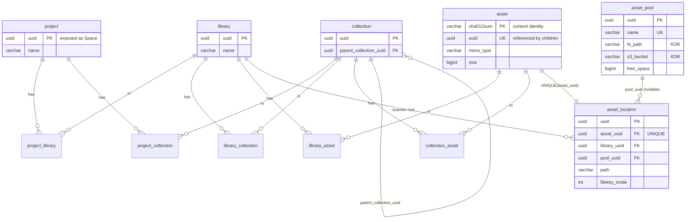
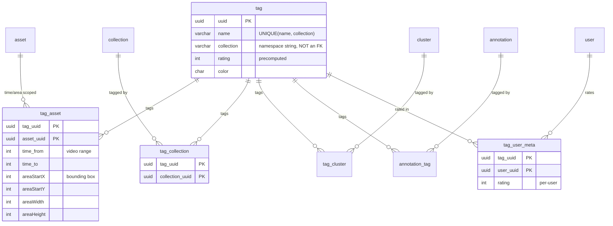
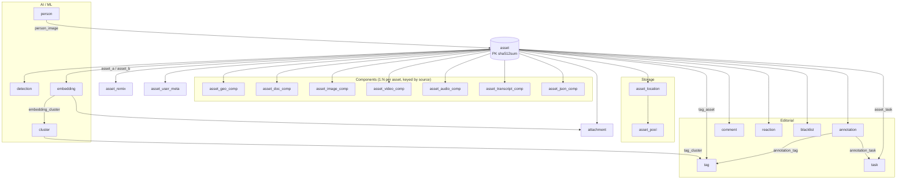
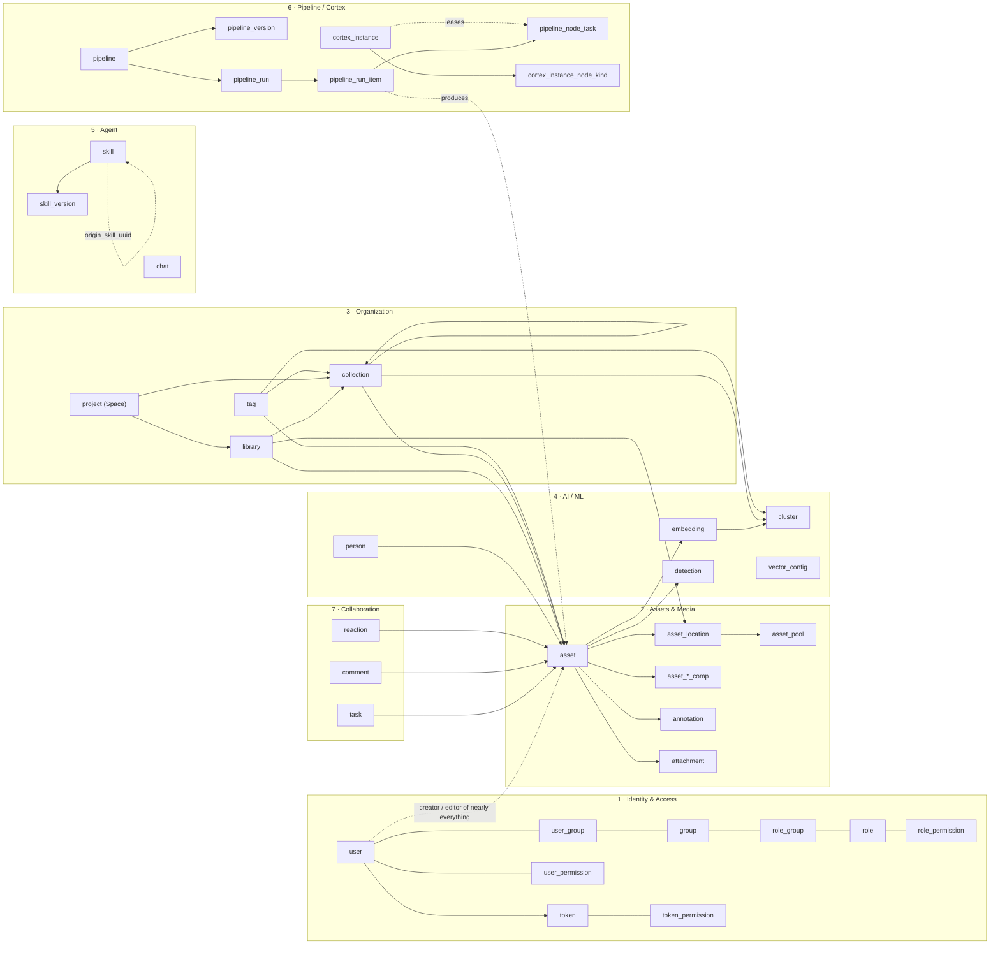

# Metaloom Domain Model

A compact overview of the domain entities of Metaloom (Loom), derived from the Flyway
migrations (`loom/db/flyway/.../db/migration`, current through **V2.37**) and the REST
endpoints (`loom/.../rest`). The authoritative column-level model lives in
[dbdiagram.yaml](../../loom/design/DB/dbdiagram.yaml).

Every core entity carries a `uuid` primary key and an audit trail (`created`,
`creator_uuid`, `edited`, `editor_uuid`); most carry a free-form `meta` JSONB blob.
These common columns are omitted from the table below.

## Domain Groups

| # | Domain group | Entities |
|---|--------------|----------|
| 1 | Identity & Access (RBAC) | User, Group, Role, Permission, Token |
| 2 | Assets & Media | Asset, Asset Location, Asset Pool, Asset Component, Asset Remix, Asset User Meta, Attachment, Blacklist, Annotation |
| 3 | Organization | Space, Library, Collection, Tag |
| 4 | AI / ML | Embedding, Cluster, Detection, Person, Vector Config |
| 5 | Agent | Chat, Skill, Skill Version |
| 6 | Pipeline / Processing (Cortex) | Pipeline, Pipeline Version, Pipeline Run, Run Item, Node Task, Cortex Instance |
| 7 | Collaboration / Social | Task, Comment, Reaction |
| 8 | System | Loom |

## Entities

### 1. Identity & Access (RBAC)

| Entity | Table(s) | Description | Key relations |
|--------|----------|-------------|---------------|
| **User** | `user` | Account (login, SSO, password hash, enabled/deleted flags). Creator/editor of nearly everything. | ↔ `user_group`, `user_permission` |
| **Group** | `group` | Collection of users; carries roles. | `user_group`, `role_group` |
| **Role** | `role`, `role_permission` | Named bundle of permissions on resources. | `role_group` → Group |
| **Permission** | `loom_permission` (enum) | CRUD-style grants per resource type (`CREATE_ASSET`, `READ_ROLE`, `MANAGE_CORTEX_INSTANCE`, …). Bound to role/user/token. | `role_permission`, `user_permission`, `token_permission` |
| **Token** | `token`, `token_permission` | API key with its own permission set (scoped machine access). | → User (creator) |

### 2. Assets & Media

| Entity | Table(s) | Description | Key relations |
|--------|----------|-------------|---------------|
| **Asset** | `asset` | Content-addressed media (PK `sha512sum`): mime, size, filename, hashes, origin. The central media entity. | ← Location, Component, Embedding, Detection, Annotation |
| **Asset Location** | `asset_location` | Physical placement of an asset's binary (path, filekey, pool, lock, state, license). One binary per asset. | → Asset, Library, Asset Pool |
| **Asset Pool** | `asset_pool` | Storage backend for binaries — filesystem dir *or* S3 bucket (free/used space tracked). | ← Asset Location |
| **Asset Component** | `asset_geo_comp`, `asset_doc_comp`, `asset_image_comp`, `asset_video_comp`, `asset_audio_comp`, `asset_transcript_comp`, `asset_json_comp` | Per-modality extracted metadata, multiple per asset, tagged by `source`. Transcript + generic JSON produced by Cortex nodes. | → Asset |
| **Asset Remix** | `asset_remix` | Derivation/relation link between two assets. | Asset ↔ Asset |
| **Asset User Meta** | `asset_user_meta` | Per-user metadata overlay on an asset (PK `asset_uuid`+`user_uuid`). | Asset ↔ User |
| **Attachment** | `attachment`, `attachment_binary` | Auxiliary binaries — asset thumbnails, embedding attachments. | → Asset / Embedding |
| **Blacklist** | `blacklist` | Blocked assets (copyright, virus scan), with review count. | → Asset |
| **Annotation** | `annotation`, `annotation_asset`, `annotation_tag`, `annotation_task` | Time-/area-scoped markers on an asset: FEEDBACK, TAG, CHAPTER. | → Asset, Tag, Task |

### 3. Organization

| Entity | Table(s) | Description | Key relations |
|--------|----------|-------------|---------------|
| **Space** | `project`, `project_library`, `project_collection` | Outermost workspace grouping libraries + collections (DB table `project`, exposed as *Space*; permissions `SPACE_*` since V2.22). | ↔ Library, Collection |
| **Library** | `library`, `library_asset`, `library_collection` | Container of assets and collections; the scanner root that asset locations belong to. | ↔ Asset, Collection; ← Asset Location |
| **Collection** | `collection`, `collection_asset`, `collection_cluster`, `tag_collection` | Hierarchical folder grouping assets & clusters. | self-parent; ↔ Asset, Cluster, Tag |
| **Tag** | `tag`, `tag_user_meta`, `tag_asset`, `tag_cluster`, `tag_collection` | Named label. Uniqueness is `(name, collection)` where `collection` is a **plain varchar namespace column**, not an FK. Not user-specific; per-user rating in `tag_user_meta`. Placement on an asset may be time-/area-scoped (`tag_asset`). | ↔ Asset, Cluster, Collection, Annotation |
| **Tag User Meta** | `tag_user_meta` | Per-user rating/meta for a tag (PK `tag_uuid`+`user_uuid`). | Tag ↔ User |

> **Naming pitfall:** `tag.collection` (varchar namespace, e.g. `people`, `places`) and the
> `tag_collection` join table (Tag ↔ `collection` entity) are two unrelated concepts that
> happen to share a word. See [Tags](#tags-two-different-collections).

### 4. AI / ML

| Entity | Table(s) | Description | Key relations |
|--------|----------|-------------|---------------|
| **Embedding** | `embedding`, `embedding_cluster` | Vector extracted from an asset (with time/area scope + type, e.g. `dlib_facemark`). | → Asset; ↔ Cluster |
| **Cluster** | `cluster`, `embedding_cluster`, `tag_cluster` | Group of embeddings by similarity (e.g. a person, a visual-fingerprint group). | ← Embedding; ↔ Tag, Collection |
| **Detection** | `detection` | Object/face bounding box within an asset frame (type, bbox, confidence). | → Asset |
| **Person** | `person`, `person_image` | Named identity with a gallery of images and a primary image. | → Asset (images) |
| **Vector Config** | `vector_config` | Named weight definition for building custom vector indices. | — |

### 5. Agent

| Entity | Table(s) | Description | Key relations |
|--------|----------|-------------|---------------|
| **Chat** | `chat` | LLM chat session with JSON message history (role/content/metadata, may reference assets). | → User |
| **Skill** | `skill` | User-owned agent skill (V2.36). Unique per `(creator_uuid, name)`; `enabled`/`published` flags. A published skill can be installed by others — the copy keeps `origin_skill_uuid`. Body text lives on the versions. | → active Skill Version; self-ref `origin_skill_uuid` |
| **Skill Version** | `skill_version` | Immutable snapshot of a skill body (`description`, `content`) keyed `(skill_uuid, version_number)` (V2.37). Permissions `READ_SKILL_VERSION`, `RESTORE_SKILL_VERSION`. | → Skill |

### 6. Pipeline / Processing (Cortex)

| Entity | Table(s) | Description | Key relations |
|--------|----------|-------------|---------------|
| **Pipeline** | `pipeline` | Pipeline identity + pointer to the current version. Name/description/`definition`/enabled/priority/dry-run moved to `pipeline_version` in V2.30. | → latest Pipeline Version |
| **Pipeline Version** | `pipeline_version` | Immutable versioned snapshot of a pipeline definition (graph JSONB, enabled, priority, dry-run), keyed `(pipeline_uuid, version_number)`. | → Pipeline |
| **Pipeline Run** | `pipeline_run` | One execution of a pipeline: status + success/failure/skipped counts. | → Pipeline |
| **Run Item** | `pipeline_run_item` | One media item discovered by a run's source node (path, hash, state). | → Run |
| **Node Task** | `pipeline_node_task` | One node executed against one item — leased, retried, dead-lettered. | → Run Item, Run |
| **Cortex Instance** | `cortex_instance`, `cortex_instance_node_kind` | Registered processor/worker (node_id, host, priority, state) with node-kind whitelist/blacklist. | — |

### 7. Collaboration / Social

| Entity | Table(s) | Description | Key relations |
|--------|----------|-------------|---------------|
| **Task** | `task`, `asset_task`, `annotation_task` | Workflow item (title, status PENDING/REJECTED/ACCEPTED/REVIEW, priority, due date). | ↔ Asset, Annotation |
| **Comment** | `comment` | Threaded comment on a task, asset, or annotation. | self-parent; → Task/Asset/Annotation |
| **Reaction** | `reaction` | Social reaction/rating (e.g. thumbsup) on asset, task, comment, annotation. | → Asset/Task/Comment/Annotation |

### 8. System

| Entity | Table(s) | Description | Key relations |
|--------|----------|-------------|---------------|
| **Loom** | `loom` | Singleton system row: DB revision + last-used timestamp. | — |

## Relations

### Content organization: Space → Library → Collection → Asset → Location → Pool

This is the spine of the model. Note the two independent axes:

* **Organizational containment** (Space / Library / Collection) — many-to-many at every
  level, so an asset can be reachable through several paths.
* **Physical storage** (Asset Location → Asset Pool) — where the bytes actually live.

**Reading the cardinalities**

| Relation | Cardinality | Enforced by |
|----------|-------------|-------------|
| Space ↔ Library | M:N | `project_library` (PK both cols) |
| Space ↔ Collection | M:N | `project_collection` |
| Library ↔ Collection | M:N | `library_collection` |
| Library ↔ Asset | M:N | `library_asset` |
| Collection ↔ Asset | M:N | `collection_asset` |
| Collection → Collection | 1:N tree | `parent_collection_uuid` self-FK |
| Asset → Asset Location | **1:1** | `UNIQUE(asset_uuid)` on `asset_location` |
| Library → Asset Location | 1:N | `library_uuid NOT NULL`, ON DELETE CASCADE |
| Asset Pool → Asset Location | 1:N | `pool_uuid` (nullable — legacy rows have none) |

An `asset_pool` is either a filesystem pool (`fs_path`) **or** an S3 pool
(`s3_bucket`/`s3_region`/`s3_endpoint`) — a CHECK constraint enforces exactly one.
`asset.s3_bucket_name` / `asset.s3_object_path` are the legacy inline pointer that
`asset_location` + `asset_pool` replaced.

### Tags: two different "collections"

`tag.collection` is a **varchar namespace** that participates in the uniqueness index
`(name, collection)` — it is *not* a foreign key to the `collection` table. Separately,
the `tag_collection` join table links a Tag to a real Collection entity.

### Asset neighbourhood

Everything derived from or attached to an asset. All child tables reference
`asset.uuid` (the unique surrogate), not the `sha512sum` primary key.

### Whole model at a glance

*(Dotted edges are logical/soft relations, not foreign keys.)*
