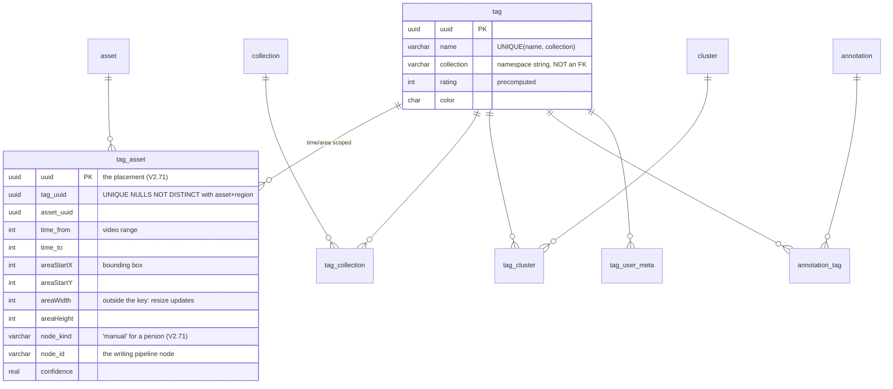
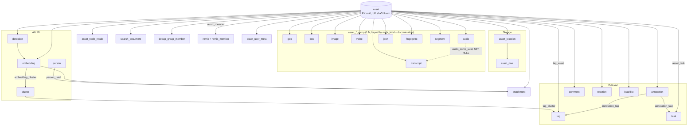
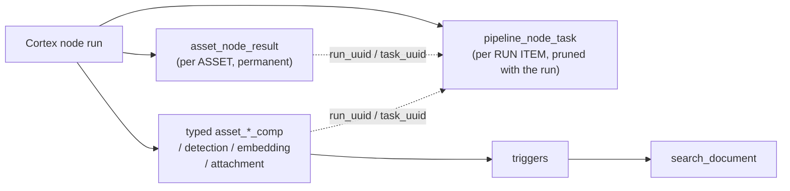

# Metaloom Domain Model

A compact overview of the domain entities of Metaloom (Loom), derived from the Flyway
migrations in `loom/db/flyway/src/main/resources/db/migration/` (current through
**V2.63**) and the REST endpoints (`loom/.../rest`).

* DAO layer, jOOQ codegen, migration workflow and test infrastructure → [PERSISTENCE.md](PERSISTENCE.md)
  (this file deliberately does **not** repeat DAO detail).
* Open persistence gaps → [PERSISTENCE_TASKS.md](../tasks/PERSISTENCE_TASKS.md)
* REST surface and permission names → [RESTAPI.md](RESTAPI.md)
* Column-level design sketch → [dbdiagram.yaml](../../loom/design/DB/dbdiagram.yaml) (design aid; the
  migrations are authoritative)

Every core entity carries a `uuid` primary key and an audit trail (`created`,
`creator_uuid`, `edited`, `editor_uuid`); most carry a free-form `meta` JSONB blob. These
common columns are omitted below. On machine-written tables (`asset_*_comp`,
`asset_node_result`, `detection`, `embedding`, `attachment`, `cortex_instance`,
`dedup_group`) `creator_uuid`/`editor_uuid` are **nullable** — a Cortex worker is not a user
(V2.33, V2.38–V2.47).

## Progress Assessment

- [x] Identity & access (user/group/role/token/permission) — V1–V2.1
- [x] Content organization (space, library, collection, tag) — V2.2, V2.7, V2.9, V2.11
- [x] Asset, asset location, asset pool (fs XOR S3), library→pool routing — V2.8, V2.10, V2.20, V2.63
- [x] Typed asset components on the shared component contract — V2.38–V2.42
- [x] Detection ↔ embedding pairing with a single geometry convention — V2.43
- [x] Face embeddings produced, persisted and indexed; `model` in the embedding identity — V2.75
- [x] Per-asset processing ledger (`asset_node_result`) — V2.45
- [x] Asset identity settled on `asset.uuid` as PK — V2.46
- [x] Pipeline versioning, runs, run items, node tasks, per-element fan-out — V2.19, V2.29–V2.32, V2.60
- [x] Agent: chat, chat session, skills + versions, memory bank, memory denylist — V2.28, V2.36–V2.37, V2.52–V2.54
- [x] Trigger-maintained search index — V2.57–V2.59
- [x] Dedup review model — V2.61–V2.62
- [x] Webhooks removed (`webhook` table + `loom_events` enum dropped) — V2.55
- [x] `embedding.vector` ANN — **closed, and for text search too**: the column is the system of record
      and the index lives outside Postgres behind `VectorIndex` (Lucene HNSW today), so no Postgres
      extension is involved anywhere. Text→text semantic search shipped on that same SPI rather than on
      pgvector, so **no `CREATE EXTENSION vector` is planned** (`spec/features/search/SEMANTIC_SEARCH.md`
      §0.4; §2 is retained as superseded rationale)
- [ ] `asset_doc_comp` has no producer — OCR/Tika still write `asset_json_comp`; the table is the
      documented graduation path and is deliberately not read by search (V2.58)
- [ ] Row-level ACL: `search_document.library_uuids` / `space_uuids` / `collection_uuids` are written
      but read by nothing
- [ ] `vector_config`, `asset_user_meta`, `tag_user_meta`, `annotation_asset` have no
      DAO and no code references — schema-only (`asset_remix` was the fifth until `V2.100` replaced
      it with `remix`/`remix_member`, which have the full stack)
- [ ] `search_document_deleted` tombstones and the `dirty` / `es_synced_at` outbox columns are unused
      by the Postgres search provider (reserved for an external index)

## Domain Groups

| # | Domain group | Entities |
|---|--------------|----------|
| 1 | Identity & Access (RBAC) | User, Group, Role, Permission, Token |
| 2 | Assets & Media | Asset, Asset Location, Asset Pool, Remix, Asset User Meta, Attachment, Blacklist, Annotation |
| 3 | Organization | Space, Library, Collection, Tag |
| 4 | Asset Components & Node Results | 9 `asset_*_comp` tables, Asset Node Result |
| 5 | AI / ML | Embedding, Cluster, Detection, Person, Vector Config |
| 6 | Agent | Chat, Chat Session, Skill, Skill Version, Memory Entry, Memory Deny Rule |
| 7 | Pipeline / Processing (Cortex) | Pipeline, Pipeline Version, Pipeline Run, Run Item, Node Task, Cortex Instance |
| 8 | Collaboration / Social | Task, Comment, Reaction, Notification, Share, Share Comment, Share Annotation, Share Reaction |
| 9 | Search | Search Document, Search Document Deleted |
| 10 | Deduplication | Dedup Group, Dedup Group Member |
| 11 | System | Loom |

## Entities

### 1. Identity & Access (RBAC)

| Entity | Table(s) | Purpose | Key relations | Since |
|--------|----------|---------|---------------|-------|
| **User** | `user` | Account (login, SSO, password hash, enabled/deleted flags). Creator/editor of nearly everything. | ↔ `user_group`, `user_permission` | V2.1 |
| **Group** | `group`, `user_group`, `role_group` | Collection of users; carries roles. | ↔ User, ↔ Role | V2.1 |
| **Role** | `role`, `role_permission` | Named bundle of permissions. | ↔ Group via `role_group` | V2.1 |
| **Permission** | `loom_permission` (PG enum) | CRUD-style grants per resource type (`CREATE_ASSET`, `READ_ROLE`, `MANAGE_CORTEX_INSTANCE`, `READ_SEARCH`, `*_DEDUP`, `*_MEMORY`, `*_CHAT_SESSION`, …). Bound to role/user/token. | `role_permission`, `user_permission`, `token_permission` | V2.1, extended by V2.21–V2.62 |
| **Token** | `token`, `token_permission` | API key with its own permission set (scoped machine access). | → User (creator) | V2.1 |

> `user_permission` has PK `(user_uuid)` — **one direct grant row per user**. Tests grant
> permissions through group + role, not directly.

### 2. Assets & Media

| Entity | Table(s) | Purpose | Key relations | Since |
|--------|----------|---------|---------------|-------|
| **Asset** | `asset` | The **bytes**: `uuid` PK, `sha512sum` UNIQUE NOT NULL (content identity), `sha256sum`, `md5sum`, `chunk_hash`, `zero_chunk_count`, `is_complete`, `size`, `mime_type`, `filename`, `initial_origin`, `first_seen`. Everything derived by *interpretation* lives in a component table. | ← Location, Component, Detection, Embedding, Annotation, Attachment | V2.8; PK moved to `uuid` and `is_complete` added in V2.46 |
| **Asset Location** | `asset_location` | Physical placement of the binary: `path` (fs path *within the pool*, or an S3 object key), `filekey_inode`, lock, state, license. **0..n per asset**, natural key `(library_uuid, path)`. Exposed over REST as "binary". | → Asset, Library, Asset Pool | V2.10; `pool_uuid` V2.20; key fixed V2.48; `(pool_uuid, path)` index V2.63 |
| **Asset Pool** | `asset_pool` | Storage backend — filesystem dir **XOR** S3 bucket (CHECK constraint), free/used space tracked. | ← Asset Location, ← Library, ← Attachment Binary, ← Chat Session | V2.20, V2.24 |
| **Remix** | `remix`, `remix_member` | A named group of assets that are versions of one another — an original plus the cuts, re-encodes and edits made from it. Members carry a role (`SOURCE`/`DERIVED`, at most one SOURCE, enforced by a partial unique index); `remix.source_asset_uuid` is a denormalised pointer the DAO keeps in step. Deleting an asset removes its membership and nulls the pointer rather than taking the group with it. Full DAO/REST/client/UI/MCP stack — see [../features/remix/REMIX.md](../features/remix/REMIX.md). | Asset ↔ Remix | V2.100, replacing the never-written `asset_remix` from V2.8 |
| **Asset User Meta** | `asset_user_meta` | Per-user metadata overlay (PK `asset_uuid`+`user_uuid`). **No DAO.** Deleting the asset removes the notes on it (V2.73); the user is untouched. | Asset ↔ User | V2.8, V2.73 |
| **Attachment** | `attachment`, `attachment_binary` | Derived/auxiliary binaries. `attachment_type` ∈ ASSET_THUMBNAIL, EMBEDDING_ATTACHMENT, CONTACT_SHEET, POSTER_FRAME, WAVEFORM, PROXY, EXTRACTED_AUDIO. Carries node provenance (`node_kind`/`node_id`/`producer_version`/`variant`/`run_uuid`/`task_uuid`); idempotency is a **partial** unique index `(asset_uuid, type, node_kind, variant) WHERE asset_uuid IS NOT NULL AND node_kind IS NOT NULL`. `attachment_binary` is content-addressed by `sha512sum` and points at a pool. | → Asset (CASCADE), → Embedding (CASCADE), → Asset Pool | V2.13; provenance V2.44; `pool_uuid` V2.63 |
| **Blacklist** | `blacklist` | Blocked assets (copyright, virus scan) with review count and a `name` label. Identity is `(asset_uuid, creator_uuid)`. | → Asset | V2.14; `name` V2.50 |
| **Annotation** | `annotation`, `annotation_asset`, `annotation_tag`, `annotation_task` | Time-/area-scoped markers on an asset: FEEDBACK, TAG, CHAPTER (`annotation_type`). `annotation.thumbnail` is superseded by a POSTER_FRAME attachment. `annotation_asset` has no DAO/code references. | → Asset, Tag, Task | V2.16; comment/reaction CASCADE V2.48 |

### 3. Organization

| Entity | Table(s) | Purpose | Key relations | Since |
|--------|----------|---------|---------------|-------|
| **Space** | `project`, `project_library`, `project_collection` | Outermost workspace grouping libraries + collections. DB table is `project`, exposed as *Space*; permissions renamed to `SPACE_*` in V2.22. Also scopes SPACE-level agent memory via `chat.space_uuid`. | ↔ Library, Collection | V2.11 |
| **Library** | `library`, `library_asset`, `library_collection` | Container of assets and collections; the scanner root that asset locations belong to. `pool_uuid` decides where uploaded bytes go (NULL = the legacy `LOOM_STORAGE_UPLOAD_DIR`). Deleting an asset removes it from its libraries (V2.74); the library survives. The other direction still blocks on purpose — a library cannot be deleted out from under the assets in it. `library_asset` gained its first DAO writer with the membership routes (`LibraryDao.linkAsset`), used by `POST /libraries/:uuid/assets` and the `assign` node. | ↔ Asset (CASCADE V2.74), Collection; ← Asset Location; → Asset Pool (RESTRICT) | V2.9; `pool_uuid` V2.63; asset cascade V2.74 |
| **Collection** | `collection`, `collection_asset`, `collection_cluster`, `tag_collection` | Hierarchical folder grouping assets & clusters. Membership is not content and cascades **both** ways: deleting an asset takes it out of its collections (V2.73) and deleting a collection removes its membership rows (V2.80), each leaving the other side intact. Written by `POST /collections/:uuid/assets` and the `assign` node. | self-parent; ↔ Asset (CASCADE V2.73 / V2.80), Cluster, Tag | V2.7, V2.73, V2.80 |
| **Tag** | `tag`, `tag_asset`, `tag_cluster`, `tag_collection`, `tag_user_meta` | Named label with `rating` and `color`. Uniqueness is `(name, collection)` where `collection` is a **plain varchar namespace**, not an FK. Assignments cascade both ways (V2.72): deleting an asset or a tag removes the assignment and nothing else. A tag may be placed on one asset **several times** since V2.71 — once per face, once per timecode — and each placement has its own uuid and records its writer (`node_kind` = `manual` for a person, `node_id`, `producer_version`, `confidence`). | ↔ Asset, Cluster, Collection, Annotation | V2.2, V2.71, V2.72 |
| **Tag User Meta** | `tag_user_meta` | Per-user rating for a tag (PK `tag_uuid`+`user_uuid`). **No DAO.** | Tag ↔ User | V2.2 |

> **Naming pitfall:** `tag.collection` (varchar namespace, e.g. `people`, `places`) and the
> `tag_collection` join table (Tag ↔ `collection` entity) are unrelated concepts sharing a
> word. See [Tags: two different "collections"](#tags-two-different-collections).

### 4. Asset Components & Node Results

All nine component tables share one contract (V2.38): `uuid`/`asset_uuid` +
`node_kind`/`node_id`/`producer_version` (provenance) + `run_uuid`/`task_uuid` (execution) +
`confidence` + `meta` + nullable audit, with `UNIQUE (asset_uuid, node_kind, <discriminators>)`
so a retry **replaces** instead of appending. `producer_version` is deliberately *not* in the key —
`WHERE node_kind = ? AND producer_version <> ?` is the invalidation sweep. `run_uuid`/`task_uuid`
are ON DELETE SET NULL; `asset_uuid` is ON DELETE CASCADE.

| Entity | Table | Discriminators (unique key tail) | Notable columns | Since |
|--------|-------|----------------------------------|-----------------|-------|
| **Geo** | `asset_geo_comp` | `method`, `time_from` | `geo_lon/lat/alias`, `accuracy_m`. Written by the `metadata` node, one row per position reading, with `method` naming the *source* (`exif`/`xmp`/`sidecar`). A drone video would yield a whole GPS track — the key is shaped for it, though no extractor emits more than one sample yet. | V2.18 → rewritten V2.38 |
| **Document** | `asset_doc_comp` | `page_number` | `doc_plain_text`, `doc_word_count`, `text_lang`, generated `text_search` tsvector (GIN). **Currently no producer** — see Progress. | V2.18 → V2.38 |
| **Image** | `asset_image_comp` | `stream_index` | `media_width/height`, `image_dominant_color`, `image_encoding`, `orientation`, `bit_depth`, `blurriness`. Never gated on asset mime type (an MP3 with cover art owns one). | V2.18 → V2.38 |
| **Video** | `asset_video_comp` | `stream_index` | `media_duration` (ms), `video_bitrate/encoding`, `fps`, `frame_count`, `rotation`, `blurriness` | V2.18 → V2.38 |
| **Audio** | `asset_audio_comp` | `stream_index` | `lang`, `track_title`, `is_default`, `audio_bpm/sampling_rate/channels/bitrate/encoding`, `media_duration` | V2.18 → V2.38 |
| **Transcript** | `asset_transcript_comp` | `stream_index`, `lang` | `transcript_text`, `transcript_json` (word-level timings, consumed by the UI panel), `model`, `duration`, `word_count`, generated `text_search`; `audio_comp_uuid` → `asset_audio_comp` **ON DELETE SET NULL** | V2.18 → rewritten V2.39 |
| **JSON** | `asset_json_comp` | `schema_type`, `variant` | `data` jsonb NOT NULL (GIN `jsonb_path_ops`). The generic sink for `ocr`, `tika`, `metadata`, `caption`, `video-caption`, `face-description`, `llm`, `vlm`. Graduates to a typed table once a query must filter inside `data`. | V2.23 → rewritten V2.40 |
| **Fingerprint** | `asset_fingerprint_comp` | `algorithm`, `sector_index` | `fingerprint`, `time_from`/`time_to`; index on `(algorithm, fingerprint)` makes dedup an index scan | V2.41 |
| **Segment** | `asset_segment_comp` | `segment_type`, `seq` | `time_from`/`time_to`, `title`, `score`; `segment_type` CHECK ∈ SCENE, SILENCE, SHOT, CHAPTER | V2.42 |

| Entity | Table | Purpose | Key relations | Since |
|--------|-------|---------|---------------|-------|
| **Asset Node Result** | `asset_node_result` | Per-**asset** processing ledger: has node X at version V processed asset A, and what happened — regardless of which table the payload landed in. `state` CHECK ∈ SUCCESS/SKIPPED/FAILED, `origin` CHECK ∈ COMPUTED/LOCAL/REMOTE, plus `reason`, `started`/`finished`/`duration_ms` and an advisory `result_ref` jsonb. UNIQUE `(asset_uuid, node_kind, node_id)`. | → Asset (CASCADE), → Run/Task (SET NULL) | V2.45 |

> **`asset_node_result` ≠ `pipeline_node_task`.** The task is per **run item**, is execution state,
> and is pruned with the run (key `(item_uuid, node_id, element_seq)`). The node result is per
> **asset**, is catalog state, and outlives every run. `run_uuid`/`task_uuid` are the join.
> `result_ref` is an advisory pointer, **not** a foreign key — never build integrity on it.

### 5. AI / ML

| Entity | Table(s) | Purpose | Key relations | Since |
|--------|----------|---------|---------------|-------|
| **Detection** | `detection` | Object/face instance in a frame: `type`, indexed `label`, `frame_number`, `detection_index`, `time_from`, `bbox_x/y/width/height` **normalized 0–1** (the single geometry convention), `confidence`. UNIQUE `(asset_uuid, node_kind, frame_number, detection_index)`. Carries a human verdict: `status review_status` (default `PENDING`), `reviewed_at`, `reviewer_uuid`, `corrected_label` — `reviewer_uuid` is deliberately **not** `editor_uuid`, which the producing node touches on every re-run, and `corrected_label` sits beside `label` rather than replacing it, so what the model said survives as training signal. An upsert preserves all four unless `producer_version` changed, in which case they reset to `PENDING`. | → Asset (CASCADE); → User (reviewer, no cascade); ← Embedding, ← Attachment (face crop) | V2.27 → rewritten V2.43; review state V2.81 |
| **Embedding** | `embedding`, `embedding_cluster` | Vector extracted from an asset: `type` (free-text, e.g. `face`, `clip`), `model` (NOT NULL, e.g. `inspireface-r18`), `dimensions`, `vector real[]`, `frame_number`, `subject_index`, `time_from`/`time_to`, plus the index-export columns `dirty`/`synced_at`/`index_version`/`normalized`. Geometry is **not** duplicated here — it lives on the linked detection. UNIQUE `(asset_uuid, node_kind, type, **model**, frame_number, subject_index)` — `model` is in the key so a model upgrade **adds** rows beside the old ones instead of overwriting them. CHECK `array_length(vector,1) = dimensions`. This table is the **system of record**; ANN search is a derived, rebuildable index behind the `VectorIndex` SPI. Written by `FacedetectNode` (`type='face'`) and by `SearchEmbeddingService` (`node_kind='search'`, `type='text'`, one row per asset), which embeds the asset's `search_document` text so semantic search has a corpus. ⚠️ `asset_uuid` is NOT NULL, so only asset-owned documents can be embedded — semantic hits are always assets. | → Asset, → Detection (both CASCADE); ↔ Cluster | V2.12 → rewritten V2.43; `embedding_cluster` cascade V2.51; index contract + `model` in key V2.75 |
| **Cluster** | `cluster`, `embedding_cluster`, `tag_cluster`, `collection_cluster` | Group of embeddings by similarity: `name` (UNIQUE), `type` (e.g. `person`). | ← Embedding; ↔ Tag, Collection | V2.12 |
| **Person** | `person`, `attachment` (`type='PERSON_IMAGE'`) | Named identity (`firstname`, `lastname`, `alias`) with pictures of their own, one of them the avatar (`avatar_attachment_uuid`, `SET NULL`). The pictures reference **no asset** — they are uploaded to the person or copied there from a face crop — so they outlive the material somebody was found in. Replaces the `person_image` gallery and `primary_image_uuid`, which pointed at an asset and both died with it. | → Attachment (CASCADE from person) | V2.26 → V2.89-V2.91 |
| **Vector Config** | `vector_config` | Named weight definition for building custom vector indices. **No DAO, no code references** — hybrid-ranking weights live in `LOOM_SEARCH_RRF_*` env vars instead, so `?profile=` still reaches nothing (`SEMANTIC_SEARCH.md` §6). | — | V2.6 |

### 6. Agent

| Entity | Table(s) | Purpose | Key relations | Since |
|--------|----------|---------|---------------|-------|
| **Chat** | `chat` | LLM chat with a `messages` JSONB array (role/content/metadata, may reference assets) and `space_uuid` scoping SPACE-level memory. | → User, → Space (SET NULL) | V2.28; `space_uuid` V2.53 |
| **Chat Session** | `chat_session`, `chat_session_skill`, `chat_session_context_ref` | Durable, publishable record behind one chat: AI-generated `name`/`description`, `tags text[]`, `published`, plus a `/session` filesystem snapshot stored in an asset pool (`pool_uuid`, `blob_path`, `fs_size`, `fs_sha256`). `chat_session_skill` pins skill versions for reproducibility; `chat_session_context_ref` composes context from other published sessions with per-part toggles (chat history / skills / filesystem). | → Chat (SET NULL, so a published session survives), → Asset Pool, → Skill | V2.52 |
| **Skill** | `skill` | User-owned agent skill. UNIQUE `(creator_uuid, name)`; `enabled`/`published`. A published skill can be installed by others — the copy keeps `origin_skill_uuid`. Body text moved to the versions in V2.37. | → active Skill Version (SET NULL); self-ref `origin_skill_uuid` | V2.36 |
| **Skill Version** | `skill_version` | Immutable snapshot of a skill body (`description`, `content`), keyed `(skill_uuid, version_number)`. | → Skill | V2.37; delete behaviour V2.49 |
| **Memory Entry** | `memory_entry` | Agent memory bank: scoped markdown notes addressed by a path-like `memory_id`. `scope` ∈ USER/GROUP/SPACE (`memory_scope` enum) with `scope_uuid` **intentionally FK-less** (it spans `user`/`group`/`project`). Denormalized `size` (single-SUM quotas), `sha256` (skip unchanged files on container sync), `version`, `session_name`. UNIQUE `(scope, scope_uuid, memory_id)`. | → User, → Chat (SET NULL) | V2.53 |
| **Memory Deny Rule** | `memory_deny_rule` | Instance-wide, admin-curated Java regexes matched against every `put_memory` body and title; a hit rejects the write with this row's `message`. UNIQUE `name`, `enabled` flag. | — | V2.54 |

### 7. Pipeline / Processing (Cortex)

| Entity | Table(s) | Purpose | Key relations | Since |
|--------|----------|---------|---------------|-------|
| **Pipeline** | `pipeline` | Pipeline identity + `latest_version_uuid` pointer. Name/description/`definition`/enabled/priority/dry-run moved to `pipeline_version` in V2.30. | → Pipeline Version (**SET NULL**) | V2.19; V2.30; V2.49 |
| **Pipeline Version** | `pipeline_version` | Immutable snapshot of a pipeline definition (graph JSONB, enabled, priority, dry-run), keyed `(pipeline_uuid, version_number)`. | → Pipeline (CASCADE) | V2.30 |
| **Pipeline Run** | `pipeline_run` | One execution: `status` ∈ PENDING, RUNNING, **PAUSED**, SUCCESS, FAILED, PARTIAL, CANCELLED + success/failure/skipped counts. VARCHAR with no CHECK — the vocabulary is `PipelineRunStatus`, enforced by a jOOQ converter on the way in and out. | → Pipeline | V2.29; PAUSED V2.56 |
| **Run Item** | `pipeline_run_item` | One media item discovered by a run's source node (media path + nullable sha512 = the pre-hash identity, `state` ∈ PENDING, RUNNING, SUCCESS, FAILED, SKIPPED = `RunItemState`). Indexed on path (V2.32). | → Run | V2.30 |
| **Node Task** | `pipeline_node_task` | One node execution — leased, retried, dead-lettered. `state` ∈ PENDING, RUNNING, COMPLETED, FAILED, SKIPPED, DEAD_LETTER = `NodeTaskState`. Idempotency key `(item_uuid, node_id, element_seq)`; `outputs` is keyed by output port id, each value a PortPayload with content type, cardinality and origin-tagged elements. | → Run Item (CASCADE), → Run | V2.30; `element_seq` V2.60 |
| **Cortex Instance** | `cortex_instance`, `cortex_instance_node_kind` | Registered processor/worker keyed by a stable `node_id` (host, priority, state) with a node-kind whitelist/blacklist. Audit columns nullable — it is a machine. | — | V2.33 |

> Fan-out stays **inside** one run item: the item is the origin, which is what lets a later node
> gather branches back together per source asset with no lineage columns (V2.60). See
> [../cortex/CORTEX.md](../cortex/CORTEX.md) for the node/port model.

### 8. Collaboration / Social

| Entity | Table(s) | Purpose | Key relations | Since |
|--------|----------|---------|---------------|-------|
| **Task** | `task`, `asset_task`, `annotation_task`, `task_assignee` | Workflow item: title, `task_status` ∈ PENDING/REJECTED/ACCEPTED/REVIEW, `task_priority` ∈ LOW/MEDIUM/HIGH/CRITICAL, due date. `task_assignee` says who is **responsible**: one row per target, exactly one of `user_uuid`/`group_uuid` set (CHECK). No PK — nullable targets force two *partial* unique indexes, so jOOQ emits a `TableRecord` and the table is driven from `TaskDaoImpl` like `asset_task`. Group membership is resolved on **read**, so joining a team inherits its work. A task may be about **several assets**; deleting one of them drops that reference and leaves the task and its other assets in place (V2.73). | ↔ Asset (CASCADE V2.73), Annotation; → User/Group (CASCADE) | V2.3; priority enum V2.34; cascade V2.35; assignees V2.69; asset cascade V2.73 |
| **Comment** | `comment` | Threaded comment on a task, asset or annotation. A comment about an asset dies with the asset (V2.74), taking its reply subtree and the reactions on it (V2.35); comments on tasks and annotations are unaffected. | self-parent (CASCADE V2.35); → Task/Asset (CASCADE V2.74)/Annotation (CASCADE V2.48) | V2.17, V2.74 |
| **Reaction** | `reaction` | Social reaction/rating (e.g. thumbsup) on asset, task, comment or annotation. A reaction to an asset dies with it (V2.74); reactions on tasks, comments and annotations are unaffected. | → Asset (CASCADE V2.74)/Task/Comment (CASCADE V2.35)/Annotation | V2.17, V2.74 |
| **Notification** | `notification` | One durable inbox entry for **one** user. `recipient_uuid` is always a concrete user: a group notification is **fanned out to one row per member at dispatch time**, deliberately the opposite choice to `task_assignee`, because "you were told" is a historical fact while ownership is a live one. `type` is a varchar + CHECK (∈ TASK_ASSIGNED, TASK_UNASSIGNED, TASK_STATUS_CHANGED, TASK_COMMENT, COMMENT_REPLY, PIPELINE_RUN_FAILED) rather than an enum — V2.55 shows what removing an enum value costs. `creator_uuid` is the **actor**, not the recipient, and is nullable for machine-generated events. Subject FKs CASCADE (a bell row that deep-links to a 404 is worse than none); actor and group SET NULL. | → User (recipient CASCADE, actor SET NULL), Task/Comment/PipelineRun/Asset (CASCADE), Group (SET NULL) | V2.70 |
| **Share** | `share` | A capability URL over one asset or one collection, openable **without a Loom account**. Carries the bcrypt password hash, an expiry, five per-link capability toggles, and the name the first visitor gave. The row is the authority: expiry, password and capabilities are re-read on every request rather than baked into the token the visitor carries, so revoking a link takes effect immediately. `slug` is 128 random bits in base64url - never the uuid, and never containing a dot (`UIService` would route it to the static handler). **The owner FKs are `ON DELETE SET NULL`**: deleting a user must not delete their shares. | → Asset/Collection (CASCADE), User (creator/editor **SET NULL**) | V2.97 |
| **Share Comment** | `share_comment` | A comment left through a share link. One level of replies, optionally anchored to a Share Annotation. No `creator_uuid` at all - the author is a name a visitor typed, denormalised onto the row as a historical fact. | → Share/Asset/self-parent/ShareAnnotation (all CASCADE) | V2.99 |
| **Share Annotation** | `share_annotation` | A mark a visitor drew: a timecode, a region, or both. Coordinates are **normalised 0..1** and times are **seconds as a float**, where `annotation` stores pixels and whole seconds - a responsive full-bleed viewer has no fixed pixel frame, and an integer second is 25 frames of ambiguity. A CHECK requires each kind to carry the geometry it names. | → Share/Asset (CASCADE) | V2.99 |
| **Share Reaction** | `share_reaction` | A visitor's verdict on an asset, guest comment or guest mark. Its own vocabulary (APPROVE/REJECT/...), not `ReactionType`. Uniqueness is `(share_uuid, type, subject)` via three partial indexes - the share stands in for the creator, because identity here is the link. | → Share/Asset/ShareComment/ShareAnnotation (CASCADE) | V2.99 |

> The four share entities are deliberately **not** reusing `comment`, `reaction` and `annotation`.
> All three of those declare `creator_uuid uuid NOT NULL REFERENCES "user"`, and a share visitor has
> no user row and must not be given one. Full argument: [../features/share/SHARE_SYSTEM.md](../features/share/SHARE_SYSTEM.md) §7.1.

### 9. Search

| Entity | Table(s) | Purpose | Key relations | Since |
|--------|----------|---------|---------------|-------|
| **Search Document** | `search_document` | Materialized, weighted, ACL-projected index. PK `(entity_type, entity_uuid)` for `asset`, `transcript`, `annotation`, `tag`, `person`, `collection`, `library`, `cluster`. Weighted fields `title` (A) / `subtitle` (B) / `body` (C) / `keywords` (D) feed two generated tsvectors (`text_search` simple, `text_search_en` english) plus a bounded `trgm_text` for typeahead. Maintained **only by triggers** (V2.59). Also the **semantic corpus**: its `title`/`keywords`/`body` are what `SearchEmbeddingService` embeds, and `synced_at` versus `embedding.edited` is the staleness signal that triggers re-embedding. | → Asset (CASCADE — one delete removes the asset and every derived transcript/annotation document) | V2.58 |
| **Search Document Deleted** | `search_document_deleted` | Delete tombstones for an external indexer. Unused by the Postgres provider. | — | V2.58 |

Support routines live in the same migrations: `search_extract_json_text` (whitelist over
`asset_json_comp.schema_type`), `search_jsonb_all_text`, `search_tokenize_path`, `search_body_cap()`
(512 KB, mirrors `LOOM_SEARCH_BODY_MAX_BYTES`), the per-entity `search_document_refresh_*` functions
and `search_document_rebuild()`. Triggers and the rebuild call the **same** refresh functions, which
is why a rebuild is byte-identical to incremental maintenance.

### 10. Deduplication

| Entity | Table(s) | Purpose | Key relations | Since |
|--------|----------|---------|---------------|-------|
| **Dedup Group** | `dedup_group` | One candidate duplicate set awaiting human review: `algorithm`, `dedup_status` ∈ PENDING/CONFIRMED/REJECTED, `score`, denormalized `keep_asset_uuid` (**SET NULL**). The apply node acts only on CONFIRMED. | → Asset | V2.61 |
| **Dedup Group Member** | `dedup_group_member` | Membership with `role` CHECK ∈ KEEP/DUP, per-member `score`, and discovery-time `size`/`zero_chunk_count` snapshots. UNIQUE `(group_uuid, asset_uuid)`. | → Dedup Group, → Asset (both CASCADE) | V2.61 |

### 11. System

| Entity | Table | Purpose | Since |
|--------|-------|---------|-------|
| **Loom** | `loom` | Singleton system row: DB revision + `last_used_timestamp`. | V2.5 |

**Removed:** `webhook` and the `loom_events` enum were dropped in **V2.55** together with the four
`*_WEBHOOK` permission values (the `loom_permission` enum was rebuilt to remove them).

## Relations

### Core entity ER diagram

```mermaid
erDiagram
    project   ||--o{ project_library    : "M:N via join"
    project   ||--o{ project_collection : "M:N via join"
    library   ||--o{ project_library    : ""
    library   ||--o{ library_asset      : "M:N"
    library   ||--o{ library_collection : "M:N"
    library   }o--o| asset_pool         : "pool_uuid, RESTRICT"
    collection||--o{ collection_asset   : "M:N"
    collection||--o{ collection         : "parent_collection_uuid"

    asset     ||--o{ asset_location     : "0..n, UNIQUE(library_uuid, path)"
    asset     ||--o{ library_asset      : ""
    asset     ||--o{ collection_asset   : ""
    asset_pool||--o{ asset_location     : "pool_uuid, nullable"
    library   ||--o{ asset_location     : "scanner root, CASCADE"

    asset     ||--o{ asset_json_comp       : "component"
    asset     ||--o{ asset_transcript_comp : "component"
    asset     ||--o{ asset_segment_comp    : "component"
    asset     ||--o{ asset_fingerprint_comp: "component"
    asset     ||--o{ asset_node_result     : "processing ledger"
    asset     ||--o{ detection             : "CASCADE"
    detection ||--o{ embedding             : "detection_uuid, CASCADE"
    asset     ||--o{ embedding             : "CASCADE"
    embedding ||--o{ embedding_cluster     : "M:N"
    cluster   ||--o{ embedding_cluster     : "CASCADE"
    asset     ||--o{ attachment            : "derived binaries"
    asset     ||--o| search_document       : "asset_uuid, CASCADE"

    pipeline        ||--o{ pipeline_version   : "CASCADE"
    pipeline        ||--o{ pipeline_run       : ""
    pipeline_run    ||--o{ pipeline_run_item  : ""
    pipeline_run_item ||--o{ pipeline_node_task : "UNIQUE(item,node,element_seq)"
    pipeline_run    ||--o{ asset_node_result : "run_uuid, SET NULL"

    asset {
        uuid uuid PK "V2.46: the real PK"
        varchar sha512sum UK "content identity, NOT NULL"
        varchar mime_type
        bigint size
        boolean is_complete "ConsistencyNode verdict"
    }
    asset_location {
        uuid uuid PK
        uuid asset_uuid FK
        uuid library_uuid FK "UNIQUE with path"
        uuid pool_uuid FK "nullable"
        varchar path "path within the pool OR object key"
    }
    asset_pool {
        uuid uuid PK
        varchar name UK
        varchar fs_path "XOR"
        varchar s3_bucket "XOR"
        bigint free_space
    }
    asset_node_result {
        uuid uuid PK
        uuid asset_uuid FK
        varchar node_kind "UNIQUE with node_id"
        varchar node_id
        varchar producer_version "invalidation query"
        varchar state "SUCCESS|SKIPPED|FAILED"
    }
    detection {
        uuid uuid PK
        varchar type
        varchar label "indexed - what the model said"
        int frame_number
        real bbox_x "normalized 0-1"
        review_status status "PENDING|CONFIRMED|REJECTED"
        uuid reviewer_uuid FK "nullable - not editor_uuid"
        varchar corrected_label "nullable - what the reviewer said"
    }
    embedding {
        uuid uuid PK
        uuid detection_uuid FK "nullable"
        varchar type
        int dimensions
        real vector "real[] - no ANN index yet"
    }
```

### Content organization: Space → Library → Collection → Asset → Location → Pool

Two independent axes: **organizational containment** (Space / Library / Collection —
many-to-many at every level, so an asset is reachable through several paths) and
**physical storage** (Asset Location → Asset Pool — where the bytes actually live).

| Relation | Cardinality | Enforced by |
|----------|-------------|-------------|
| Space ↔ Library | M:N | `project_library` (PK both cols) |
| Space ↔ Collection | M:N | `project_collection` |
| Library ↔ Collection | M:N | `library_collection` |
| Library ↔ Asset | M:N | `library_asset` |
| Collection ↔ Asset | M:N | `collection_asset` (PK both cols; cascades from either side since V2.80) |
| Collection → Collection | 1:N tree | `parent_collection_uuid` self-FK |
| Asset → Asset Location | **1:N** | `UNIQUE(library_uuid, path)` on `asset_location` |
| Library → Asset Location | 1:N | `library_uuid NOT NULL`, ON DELETE CASCADE |
| Asset Pool → Asset Location | 1:N | `pool_uuid` (nullable — NULL = the local upload directory) |
| Asset Pool → Library | 1:N | `library.pool_uuid` (V2.63, nullable, ON DELETE RESTRICT) |

⚠️ `V2.20` briefly made Asset → Asset Location **1:1** (`UNIQUE(asset_uuid)`); `V2.48` dropped that
deliberately — the same content legitimately lives at several paths and in several libraries, which
is why the table is separate from `asset` at all. Code that needs "the" binary of an asset wants
`AssetBinaryDao.loadPrimaryByAssetUuid` (oldest, uuid tie-broken), not a `fetchOne`.

An `asset_pool` is either a filesystem pool (`fs_path`) **or** an S3 pool
(`s3_bucket`/`s3_region`/`s3_endpoint`) — a CHECK constraint enforces exactly one. Since `V2.63` a
**library points at a pool**, which is how an upload knows whether its bytes go to disk or to a
bucket; see [../features/rest/REST_BINARY_HANDLING.md](../features/rest/REST_BINARY_HANDLING.md) §5.
The legacy inline pointer `asset.s3_bucket_name` / `asset.s3_object_path` was **dropped in V2.46**.

### Tags: two different "collections"

`tag.collection` is a **varchar namespace** that participates in the uniqueness index
`(name, collection)` — it is *not* a foreign key to the `collection` table. Separately,
the `tag_collection` join table links a Tag to a real Collection entity.

### Asset neighbourhood

Everything derived from or attached to an asset. All child tables reference `asset.uuid`
(which since V2.46 is also the primary key — nothing references `sha512sum`).

### The result model in one picture

A node writes **both**: a typed payload row (upsert on the component unique key) *and* a
ledger row in `asset_node_result`. "The node ran and produced nothing" is expressed by a
`SKIPPED` ledger row, never by a NULL payload. `WhisperNode` is the reference implementation.

## Conventions and Gotchas

* **Asset identity.** `asset.uuid` is the PK (V2.46); `sha512sum` is a NOT NULL unique natural key.
  An asset row cannot exist before hashing has run — pre-hash identity lives on
  `pipeline_run_item` (media path + nullable sha512), and upstream node outputs wait in
  `pipeline_node_task.outputs`.
* **Placement rule.** Intrinsic properties of the *bytes* (hashes, size, `zero_chunk_count`,
  `is_complete`) live on `asset`. Anything derived by *interpretation* lives in a component table
  keyed by its producing node. V2.18 already stripped the media/geo/doc columns off `asset`.
* **Nullable audit columns** on machine-written tables. Do not invent a synthetic user for
  Cortex writes; `creator_uuid IS NULL` means "written by a worker".
* **Idempotency is the component unique key**, not `producer_version`. A re-run replaces the row
  in place and rewrites the version.
* **`asset_segment_comp` is the one non-upsert write path**: a re-run writes `seq` 0..N-1 and must
  DELETE rows with `seq >= N` for that `(asset_uuid, node_kind, segment_type)`.
* **Generated columns are never written**: `asset_doc_comp.text_search`,
  `asset_transcript_comp.text_search`, `search_document.text_search`/`text_search_en`/`trgm_text`.
* **`search_document` is trigger-maintained only.** DAO write hooks were rejected because
  `AbstractJooqDao.storeBatch` uses `batchInsert` (bypasses hooks) and demo/Flyway backfills bypass
  the DAO layer entirely. Never hand-write documents; call `search_document_rebuild()`.
* **`ALTER TYPE ... ADD VALUE` cannot be used in the same migration** (Flyway wraps each migration
  in one transaction). New permission values need their own migration before any grant that uses
  them — the reason V2.57/V2.62 add enum values and nothing else.
* **`memory_entry.scope_uuid` has no FK by design** — it points at `user`, `group` or `project`
  depending on `scope`.
* **Version pointers use ON DELETE SET NULL** (`pipeline.latest_version_uuid`,
  `skill.active_version_uuid`) to break the FK cycle with their version tables (V2.49).
* **`project` is `Space`** in the API and permissions (`SPACE_*` since V2.22).
* After **any** migration change, re-run `./setup-pool.sh` (see the repo `CLAUDE.md`) and regenerate
  jOOQ (`loom/db/jooq/generate.sh`) — details in [PERSISTENCE.md](PERSISTENCE.md).

## Where do I find ...?

| Concept | Path |
|---------|------|
| Schema of record (all DDL) | `loom/db/flyway/src/main/resources/db/migration/*.sql` |
| Generated jOOQ tables/records | `loom/db/jooq/` (regen: `loom/db/jooq/generate.sh`) |
| DAO interfaces & jOOQ impls | `loom/db/**/dao/` — see [PERSISTENCE.md](PERSISTENCE.md) |
| Component read/write helper | `AssetComponentDao` |
| "The" binary of an asset | `AssetBinaryDao.loadPrimaryByAssetUuid` |
| Processing ledger | `AssetNodeResultDao`, table `asset_node_result` (V2.45) |
| Search index maintenance | V2.58/V2.59 SQL functions + `PostgresSearchProvider` |
| Permission enum values | `V2.1__add_acl.sql` + every `ALTER TYPE loom_permission` since |
| REST paths & permissions per entity | [RESTAPI.md](RESTAPI.md) |
| Binary upload / pool routing | [../features/rest/REST_BINARY_HANDLING.md](../features/rest/REST_BINARY_HANDLING.md) |
| Node/port model, node results | [../cortex/CORTEX.md](../cortex/CORTEX.md) |
| Dedup review workflow | [NODE_DEDUP.md](../features/nodes/dedup/NODE_DEDUP.md) |
| Open schema questions | `spec/features/DB_SCHEMA_FEEDBACK.md`, [PERSISTENCE_TASKS.md](../tasks/PERSISTENCE_TASKS.md) |
| Test DB pool setup | `./setup-pool.sh` (`io.metaloom.loom.test.PoolSetupRunner`) |
| Spec index / routing | [../CONTEXT.md](../CONTEXT.md) |
_Git HEAD revision: `716953c0`_
_Last updated: 2026-08-07 (the three pipeline status/state columns are typed by an enum parsed at
the jOOQ converter boundary; V2.77 normalises the `FAILURE` rows `pipeline_run_item.state` used to
collect. Earlier: reference sweep — no content changes)_