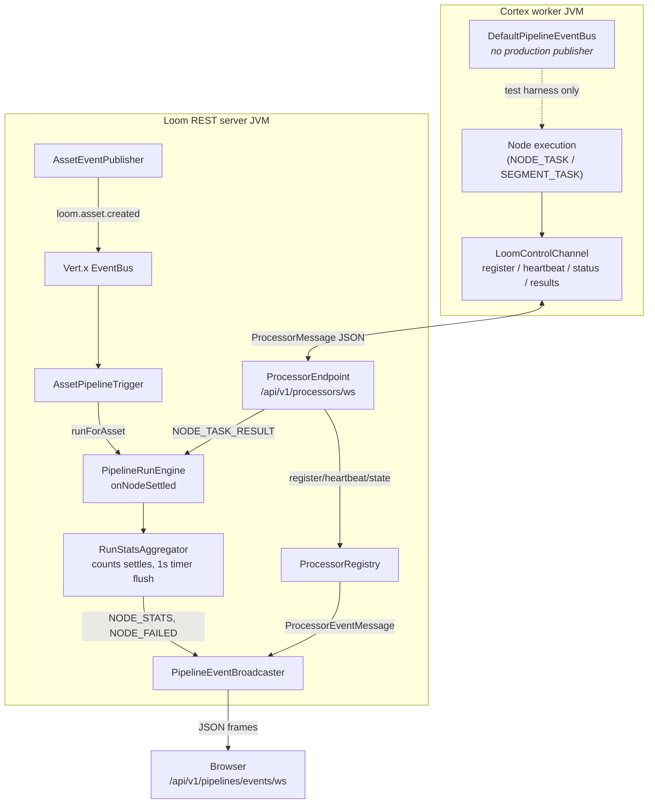

# Loom Eventbus System

> Spec for the event/messaging fabric in MetaLoom: which bus carries what, who emits, who consumes.
> Transport details of the sockets live in [WEBSOCKET.md](WEBSOCKET.md); the run engine that produces
> the events lives in [../features/pipeline/PIPELINE.md](../features/pipeline/PIPELINE.md); MCP tool
> semantics live in [MCP.md](MCP.md). This file does not repeat them.

---

## 1. Three buses, one page

| Bus | Scope | Transport | Carries today |
|---|---|---|---|
| **Vert.x EventBus** | Loom JVM, in-process (never clustered) | `vertx.eventBus()` | MCP tool dispatch (`mcp.tool.<name>`, request/reply) **and** asset lifecycle (`loom.asset.created`, publish/subscribe) |
| **UI events WebSocket** | Loom REST server → browsers | raw `ServerWebSocket` via `PipelineEventBroadcaster` (no SockJS bridge) | `PipelineEventMessage` + `ProcessorEventMessage`, multiplexed on one socket |
| **Cortex `PipelineEventBus`** | One Cortex JVM, in-process | plain Java pub/sub | **Nothing in production.** Vestigial — see §4 |

> **The single most important correction to make when reading older docs:** pipeline events are no
> longer produced by Cortex and relayed to Loom. Under **Variant C** Loom owns the pipeline graph, so
> Loom emits every run event itself from `RunStatsAggregator`. A `PIPELINE_EVENT` frame arriving from
> a worker is **accepted and dropped**.

The **`loom/services/eventbus/` module is an empty placeholder** — `pom.xml` with zero dependencies,
a README, no `src/`. It is listed in `loom/services/pom.xml` and builds an empty jar. Nothing depends
on it. Its README still points at a non-existent `spec/cortex/EVENTBUS.md`.

---

## 2. Architecture

---

## 3. Event inventory

### 3.1 Pipeline events (UI events socket)

`PipelineEventType` declares eight constants, but **only two are emitted at runtime**. The rest are
model-level vocabulary retained for the wire format and for the Cortex-side enum alignment.

| Event | Emitted by | Consumed by | Transport |
|---|---|---|---|
| `NODE_STATS` | `RunStatsAggregator.flush()` — one frame per node, on a 1 s `vertx.setPeriodic` timer, only when `dirty` | `pipelineEvents.ts` → `PipelineArea.tsx` | `PipelineEventBroadcaster` → UI WS |
| `NODE_FAILED` | `RunStatsAggregator.emitFailure()` — released immediately, one per failed item | same | same |
| `PIPELINE_STARTED` / `PIPELINE_COMPLETED` / `NODE_STARTED` / `NODE_COMPLETED` / `NODE_SKIPPED` / `NODE_BUFFERED` | **nobody** (no production emitter) | UI can render them if they ever appear | — |

`PipelineEventMessage` fields: `type`, `pipelineName`, `pipelineRunUuid`, `nodeId`, `mediaPath`,
`timestamp`, `durationMs`, `message`, `activeCount`, `pendingCount`, `processedCount`, `failedCount`,
`skippedCount`. It carries **no** `channel` field — that absence is how the UI tells it apart from a
processor frame.

### 3.2 Processor lifecycle events (same socket)

| Event | Emitted by | Consumed by | Transport |
|---|---|---|---|
| `REGISTERED`, `STATE_CHANGED`, `STATUS_UPDATED`, `HEARTBEAT`, `DISCONNECTED` | `ProcessorRegistry.broadcast()` | UI Cortex view | `PipelineEventBroadcaster.broadcastProcessorEvent()` → UI WS |

`ProcessorEventMessage` always sets `channel = "PROCESSOR"`. These frames **bypass the `?pipeline=`
and `?run=` filters** on purpose — processor state is fleet-wide, not run-scoped.

### 3.3 Vert.x EventBus addresses

| Address | Emitted by | Consumed by | Pattern |
|---|---|---|---|
| `loom.asset.created` | `AssetEventPublisher.publishCreated()`, called from `AssetUploadEndpointService` | `AssetPipelineTrigger` (registered once from `BootstrapInitializer`) | publish/subscribe; payload `{assetUuid, mimeType}`; handler hops to `executeBlocking` |
| `mcp.tool.<name>` | `MCPToolRegistry.dispatch()` | per-tool consumer registered in `MCPToolRegistry.register()` | request/reply — see [MCP.md](MCP.md) |
| `mcp.registry` | — | — | constant `MCPConstants.EVENTBUS_TOOL_REGISTRY` is **declared but never used** |

### 3.4 Processor control messages

`ProcessorMessage{type, body}` on `/api/v1/processors/ws`. Full protocol in
[WEBSOCKET.md](WEBSOCKET.md) §3. Only the event-relevant member matters here: **`PIPELINE_EVENT`**,
worker → Loom, is validated for a body and then discarded. `ProcessorEndpoint` logs one warning per
sending `nodeId` (tracked in `warnedPipelineEventSenders`) and stays silent afterwards, so a legacy
worker emitting one frame per item cannot flood the log or be answered with an error per item.

---

## 4. Cortex `PipelineEventBus` — vestigial

`PipelineEventBus` (two channels: `NodeCompletionEvent` and `PipelineTrackingEvent`) and
`DefaultPipelineEventBus` still exist and are still provided as a Dagger singleton by
`CortexBindModule.providePipelineEventBus()`. But:

- **There is no production caller of `publish()` or `publishTracking()`.** The publisher was
  `ReactivePipelineExecutor`, which **no longer exists** — the class and `PipelineExecutorTest` were
  removed with Variant C.
- **`LoomControlChannel` no longer subscribes to it.** It has no reference to `PipelineEventBus` and
  no `forwardPipelineTrackingEvent`. It handles `REGISTER`, `HEARTBEAT`, `STATUS_UPDATE`,
  `STATE_CHANGE`, task execution (via `PipelineTaskHandler`) and reconnect backoff — nothing else.
- **Its only live user is the test harness** `AbstractNodeChainTest`, which builds a
  `DefaultPipelineEventBus`, subscribes both channels, and synthesises events while walking a node
  chain so node tests can assert on them.

Implementation notes that still hold: `ConcurrentHashMap` + `CopyOnWriteArrayList`; dispatch is
**synchronous on the publishing thread**; listener exceptions are caught and logged, never propagated;
subscription handles are UUID strings in a `handleCleanup` map for O(1) unsubscribe.

`PipelineTrackingEvent` has drifted ahead of what anything reads: its `Type` enum now includes
`NODE_STATS`, and it carries `pipelineRunUuid` plus a `RunCounters` record (`mediaCount`,
`successCount`, `failureCount`, `skippedCount`) populated only on `PIPELINE_COMPLETED`.

---

## 5. `PipelineEventBroadcaster`

`@Singleton`, `ConcurrentHashMap<ServerWebSocket, Subscriber>`.

- **Filters** — `?pipeline=<name>` and `?run=<uuid>`, extracted by `PipelineEventEndpoint` and ANDed
  in `Subscriber.matches()`. Blank is treated as absent. Both bypassed for processor events.
- **Lazy encode** — `Json.encode()` runs at most once per broadcast, and only after a subscriber
  matches, so a broadcast with no listeners costs nothing.
- **Pruning** — closed sockets are removed during broadcast, not only on `closeHandler`.
- **Backpressure** — `Subscriber.send()` checks `ws.writeQueueFull()`; if full it increments
  `droppedCount`, logs every 100th drop, and returns false. Otherwise `ws.writeTextMessage(json)`.
- **Metrics** — gauge `loom_pipeline_event_subscribers`; counters via
  `LoomMetrics.recordPipelineEventBroadcast()` / `recordPipelineEventDropped()`. A no-arg constructor
  wires `NoopLoomMetrics` for tests.

Tunables are compile-time constants, not configuration:

| Setting | Where | Default | Notes |
|---|---|---|---|
| Stats flush interval | `PipelineEndpointService.STATS_INTERVAL_MS` | `1000` ms | timer cancelled on run completion, with one final `flush()` |
| Subscriber queue capacity | `PipelineEventBroadcaster.DEFAULT_QUEUE_CAPACITY` | `1024` | **passed to `Subscriber` and then ignored** — see gotchas |

There are **no environment variables** governing this subsystem.

---

## 6. Tests

| Area | Test |
|---|---|
| Fan-out, `?run=` filter, closed-socket pruning, full-write-queue drop | `loom/services/rest/src/test/java/io/metaloom/loom/rest/service/PipelineEventBroadcasterTest.java` |
| Aggregation: successes counted not broadcast, one snapshot per node, skips counted separately, failures immediate + named, idle run silent, flush resumes, per-node counters, live active/pending, failing supplier and broken subscriber tolerated | `loom/services/rest/src/test/java/io/metaloom/loom/rest/service/RunStatsAggregatorTest.java` |
| `channel: "PROCESSOR"`, filter bypass, registry without broadcaster | `loom/services/rest/src/test/java/io/metaloom/loom/rest/service/ProcessorEventBroadcastTest.java` |
| UI socket connect; `PIPELINE_EVENT` from a worker is **dropped** (three cases); errors without REGISTER / without body | `loom/core/src/test/java/io/metaloom/loom/core/endpoint/test/PipelineEventEndpointTest.java` |
| Processor socket lifecycle | `loom/core/src/test/java/io/metaloom/loom/core/endpoint/test/ProcessorEndpointTest.java` |
| Vert.x EventBus request/reply for tools | `loom/services/mcp/src/test/java/io/metaloom/loom/mcp/tool/MCPToolIdentityTest.java` |
| Cortex bus (harness) | `cortex/pipeline-core/src/test/java/io/metaloom/cortex/pipeline/test/AbstractNodeChainTest.java` + ~18 `*NodePipelineTest` subclasses |

**Setup:** endpoint tests need the pooled test DB — run `./setup-pool.sh` first (see project
`CLAUDE.md`). Broadcaster/aggregator tests are plain JUnit with mocked `ServerWebSocket` and need no
database.

**Gaps:** no test for `loom.asset.created` → `AssetPipelineTrigger` end to end; no test for
`LoomControlChannel` reconnect backoff; no test asserting `mcp.registry` is dead.

---

## 7. Conventions and Gotchas

- **Do not add a per-item pipeline event.** Aggregation exists because a 100 000-item run over a
  10-node graph settles a million nodes. Counters go through `RunStatsAggregator`; only individually
  actionable things (failures) are released immediately.
- **`PIPELINE_EVENT` is a trap.** It is still in `ProcessorMessageType` and still accepted, but the
  frame is discarded. Emitting it from a new worker silently does nothing.
- **The "bounded queue" in `PipelineEventBroadcaster` does not exist.** `Subscriber`'s constructor
  takes `queueCapacity` and never stores it; there is no queue and no field. Backpressure is purely
  `ws.writeQueueFull()`, and the event dropped is the **new** one, not the "oldest" the Javadoc
  claims. Fix the Javadoc or implement the queue — do not trust the comment.
- **Two frame shapes on one socket.** Discriminate on `channel`: present and `"PROCESSOR"` → processor
  event; absent → pipeline event. Never discriminate on `type`, the enums are disjoint today but
  nothing enforces that.
- **The UI WS route uses `order(-1000)`** so the upgrade beats the wildcard `/api/v1/pipelines*` auth
  route. Auth happens **after** upgrade via `?token=`; failure closes with **4401**.
- **Vert.x EventBus is in-process only.** No `ClusterManager` on the classpath, no
  `Vertx.clusteredVertx()`. Cortex workers cannot reach it — that is why the processor socket exists.
- **`AssetPipelineTrigger.handle()` is blocking** (DAO calls) and must stay inside `executeBlocking`.
- **Cortex bus dispatch is synchronous.** A slow subscriber stalls the publishing thread. Only the
  test harness publishes today, so this is latent rather than live.
- **`loom/services/eventbus` is empty.** Do not add code there expecting wiring; nothing depends on it.

---

## 8. Key Classes Reference

| Class | Package / module | Purpose |
|---|---|---|
| `PipelineEventBroadcaster` | `io.metaloom.loom.rest.service.impl` (loom/services/rest) | UI socket registry + fan-out, filters, backpressure, metrics |
| `RunStatsAggregator` | `io.metaloom.loom.rest.service.impl` | **The only production emitter of pipeline events**; `NodeSettleListener` |
| `PipelineEventEndpoint` | `io.metaloom.loom.rest.endpoint.impl` | `GET /api/v1/pipelines/events/ws`, token auth, `?pipeline=`/`?run=` |
| `ProcessorEndpoint` | `io.metaloom.loom.rest.endpoint.impl` | `GET /api/v1/processors/ws`; drops `PIPELINE_EVENT` |
| `ProcessorRegistry` | `io.metaloom.loom.rest.service.impl` | Tracks workers; emits `ProcessorEventMessage` |
| `AssetEventPublisher` | `io.metaloom.loom.rest.service.impl` | Publishes `loom.asset.created` on the Vert.x EventBus |
| `AssetPipelineTrigger` | `io.metaloom.loom.rest.service.impl` | Consumes it; auto-runs a matching pipeline |
| `PipelineEndpointService` | `io.metaloom.loom.rest.service.impl` | Builds the engine, wires the aggregator + 1 s flush timer |
| `WebSocketAuthenticator` | `io.metaloom.loom.rest.service.impl` | Post-upgrade `?token=` validation, 4401 close |
| `MCPToolRegistry` | `io.metaloom.loom.mcp.tool` (loom/services/mcp) | Registers/dispatches tools on `mcp.tool.<name>` |
| `MCPConstants` | `io.metaloom.loom.mcp` | `EVENTBUS_TOOL_PREFIX`, unused `EVENTBUS_TOOL_REGISTRY` |
| `VertxModule` | `io.metaloom.loom.common.dagger` (loom/common) | Provides `EventBus` + rx `EventBus` singletons |
| `PipelineEventMessage` / `PipelineEventType` | `io.metaloom.loom.rest.model.pipeline.event` (loom-shared/rest-model) | UI pipeline frame; no `channel` field |
| `ProcessorEventMessage` / `ProcessorEventType` | `io.metaloom.loom.rest.model.processor.event` | UI processor frame; `channel="PROCESSOR"` |
| `ProcessorMessage` / `ProcessorMessageType` | `io.metaloom.loom.rest.model.processor.message` | Worker control envelope |
| `PipelineEventBus` / `PipelineTrackingEvent` / `NodeCompletionEvent` | `io.metaloom.cortex.pipeline.api.event` (cortex/pipeline-api) | Vestigial in-process Cortex bus |
| `DefaultPipelineEventBus` | `io.metaloom.cortex.pipeline.common.event` (cortex/pipeline-common) | Its implementation |
| `CortexBindModule` | `io.metaloom.cortex.cli.dagger` (cortex/core) | Still provides the bus singleton |
| `LoomControlChannel` | `io.metaloom.cortex.impl.loom` (cortex/core) | Worker↔Loom socket; **no** pipeline-event forwarding |
| `AbstractNodeChainTest` | `io.metaloom.cortex.pipeline.test` (cortex/pipeline-core, test) | Only live user of the Cortex bus |

---

## 9. Where do I find ...?

| I want to ... | Look at |
|---|---|
| See what a UI client actually receives | `loom-ui/src/api/pipelineEvents.ts` (channel routing, reconnect, `?token=`) |
| See events rendered | `loom-ui/src/Pipeline/PipelineArea.tsx` |
| Change what gets pushed to the UI | `RunStatsAggregator` — not Cortex |
| Change the flush cadence | `PipelineEndpointService.STATS_INTERVAL_MS` |
| Add a filter to the UI stream | `PipelineEventEndpoint.extractQueryParam` + `PipelineEventBroadcaster.Subscriber.matches` |
| Add a Vert.x EventBus address | `AssetEventPublisher` is the smallest working example |
| Add an MCP tool | [MCP.md](MCP.md); `MCPToolRegistry` |
| Understand the worker protocol | [WEBSOCKET.md](WEBSOCKET.md) |
| Understand run/task orchestration | [../features/pipeline/PIPELINE.md](../features/pipeline/PIPELINE.md) |
| Understand REST run triggering | [RESTAPI.md](RESTAPI.md) |

---

## 10. Progress Assessment

**Working**

- [x] Loom-side event emission via `RunStatsAggregator` (aggregated `NODE_STATS`, immediate `NODE_FAILED`)
- [x] UI socket fan-out with `?pipeline=` / `?run=` filters, lazy JSON encode, closed-socket pruning
- [x] Processor lifecycle events multiplexed on the same socket via `channel`
- [x] Backpressure drop + `loom_pipeline_event_*` metrics
- [x] Vert.x EventBus for MCP tool dispatch and `loom.asset.created` auto-trigger
- [x] `PIPELINE_EVENT` from workers dropped with once-per-node warning
- [x] Unit coverage for broadcaster, aggregator, processor-event channel; endpoint coverage for both sockets

**Open**

- [ ] **EB-1** Fix `PipelineEventBroadcaster`'s Javadoc/`Subscriber` mismatch: either implement the
      bounded queue or delete `queueCapacity` and correct the "oldest event is dropped" wording.
- [ ] **EB-2** Decide the fate of the Cortex `PipelineEventBus`. It has no production publisher. Either
      delete `PipelineEventBus`/`DefaultPipelineEventBus`/`PipelineTrackingEvent`/`NodeCompletionEvent`
      and rework `AbstractNodeChainTest`, or document it explicitly as a test-only fixture and move it
      to a test scope.
- [ ] **EB-3** Remove or use the unemitted `PipelineEventType` constants (`PIPELINE_STARTED`,
      `PIPELINE_COMPLETED`, `NODE_STARTED`, `NODE_COMPLETED`, `NODE_SKIPPED`, `NODE_BUFFERED`). The UI
      maps them but nothing sends them.
- [ ] **EB-4** Remove the unused `MCPConstants.EVENTBUS_TOOL_REGISTRY` address, or implement registry
      notifications on it.
- [ ] **EB-5** Delete `loom/services/eventbus` or give it a purpose. As-is it builds an empty jar and
      its README points at a spec path that does not exist.
- [ ] **EB-6** Add an integration test for `AssetUploadEndpointService` → `loom.asset.created` →
      `AssetPipelineTrigger` → run dispatch.
- [ ] **EB-7** Add a test for `LoomControlChannel` reconnect with exponential backoff.
- [ ] **EB-8** Document both WebSocket endpoints and their frame schemas in the OpenAPI output.
- [ ] **EB-9** Retire `ProcessorMessageType.PIPELINE_EVENT` once no deployed worker emits it.
- [ ] **EB-10** Revisit clustering only if Loom becomes multi-instance — a clustered Vert.x EventBus
      would need a `ClusterManager` and would still not reach Cortex workers. See [../CLUSTERING.md](../concept/CLUSTERING.md).

---
_Git HEAD revision: `742dae2d`_
_Last updated: 2026-08-06 (reference sweep — no content changes)_