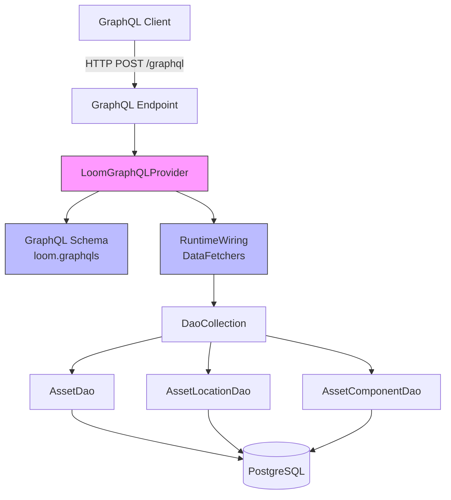

# MetaLoom // Loom GraphQL API Specification

> This document is a living specification for the Loom GraphQL API. It is intended
> to be consumed by AI agents and developers who need to understand, extend, or
> integrate with the GraphQL API. The progress checklist at the end tracks areas
> that still need improvement.

---

## 1. Overview

The GraphQL service (`loom-service-graphql`) provides a GraphQL API layer for the
Loom backend. It exposes the asset data model (assets, locations, components)
via a GraphQL schema, enabling flexible queries for clients that need more
granular data fetching than the REST API provides.

### 1.1 Current Status

- **Module:** `loom/services/graphql`
- **Artifact:** `io.metaloom.loom.service:loom-service-graphql`
- **GraphQL Java Version:** 25.0
- **Schema Loading:** SDL file at `src/main/resources/loom.graphqls`
- **Integration:** Built but **not yet registered** in `EndpointModule` (see [LOOM.md](LOOM.md#2-module-layout))
- **Authentication:** JWT / OAuth2 required on the endpoint plus field-level permission checks (see [§5.4](#54-authentication--authorization))

### 1.2 Relationship to Other APIs

| API | Purpose | Status |
|-----|---------|--------|
| [REST](RESTAPI.md) | Primary external API, full CRUD, OpenAPI | Production |
| [WebSocket](WEBSOCKET.md) | Real-time pipeline events, processor communication | Production |
| [MCP](MCP.md) | AI agent tool integration | Active development |
| **GraphQL** | Flexible asset queries, nested data fetching | **Implemented, not wired** |
| [gRPC](GRPC.md) | High-performance internal communication | Planned |

---

## 2. Architecture

### 2.1 Component Diagram



### 2.2 Data Flow

```
1. Client sends GraphQL query (HTTP POST to /graphql)
2. Vert.x routes to GraphQL endpoint handler
3. LoomGraphQLProvider.graphQL() returns pre-built GraphQL engine
4. Engine parses, validates, and executes query
5. DataFetchers invoke DAO methods via DaoCollection
6. Results assembled and returned as JSON
```

### 2.3 Key Classes Reference

| Class | Package | Purpose |
|-------|---------|---------|
| `LoomGraphQLProvider` | `io.metaloom.loom.graphql` | Builds and provides the GraphQL execution engine; loads SDL schema, wires DataFetchers to DAOs |
| `LoomGraphQLProviderTest` | `io.metaloom.loom.graphql` | Unit tests for GraphQL queries using mocked DAOs |

---

## 3. Schema Definition

### 3.1 SDL Schema (`loom.graphqls`)

The schema is defined in Schema Definition Language (SDL) at:
`src/main/resources/loom.graphqls`

```graphql
type Query {
    """Load an asset by UUID"""
    asset(uuid: ID!): Asset

    """List all assets"""
    assets: [Asset!]!
}

type Asset {
    uuid: ID!
    filename: String
    mimeType: String
    size: Long
    sha512: String
    sha256: String
    md5: String
    initialOrigin: String
    imageComponents: [ImageComponent!]!
    videoComponents: [VideoComponent!]!
    audioComponents: [AudioComponent!]!
    locations: [AssetLocation!]!
}

type AssetLocation {
    uuid: ID!
    path: String
    assetUuid: ID
    libraryUuid: ID
    mimeType: String
}

type ImageComponent {
    uuid: ID!
    source: String
    dominantColor: String
    width: Int
    height: Int
}

type VideoComponent {
    uuid: ID!
    source: String
}

type AudioComponent {
    uuid: ID!
    source: String
}

"""Long scalar for large numeric values (e.g. file sizes)"""
scalar Long
```

### 3.2 Type Details

#### Query Root
| Field | Arguments | Returns | Description |
|-------|-----------|---------|-------------|
| `asset` | `uuid: ID!` | `Asset` | Load a single asset by UUID |
| `assets` | (none) | `[Asset!]!` | List all assets |

#### Asset
| Field | Type | Description |
|-------|------|-------------|
| `uuid` | `ID!` | Unique identifier |
| `filename` | `String` | Original filename |
| `mimeType` | `String` | MIME type (e.g., `image/jpeg`) |
| `size` | `Long` | File size in bytes (uses custom `Long` scalar) |
| `sha512` | `String` | SHA-512 hash (hex) |
| `sha256` | `String` | SHA-256 hash (hex) |
| `md5` | `String` | MD5 hash (hex) |
| `initialOrigin` | `String` | Origin/source of the asset |
| `imageComponents` | `[ImageComponent!]!` | Image-specific metadata |
| `videoComponents` | `[VideoComponent!]!` | Video-specific metadata |
| `audioComponents` | `[AudioComponent!]!` | Audio-specific metadata |
| `locations` | `[AssetLocation!]!` | Filesystem locations where asset exists |

#### AssetLocation
| Field | Type | Description |
|-------|------|-------------|
| `uuid` | `ID!` | Unique identifier |
| `path` | `String` | Filesystem path |
| `assetUuid` | `ID` | Referenced asset UUID |
| `libraryUuid` | `ID` | Library UUID |
| `mimeType` | `String` | MIME type at this location |

#### ImageComponent
| Field | Type | Description |
|-------|------|-------------|
| `uuid` | `ID!` | Unique identifier |
| `source` | `String` | Source identifier |
| `dominantColor` | `String` | Dominant color (hex) |
| `width` | `Int` | Image width in pixels |
| `height` | `Int` | Image height in pixels |

#### VideoComponent
| Field | Type | Description |
|-------|------|-------------|
| `uuid` | `ID!` | Unique identifier |
| `source` | `String` | Source identifier |

#### AudioComponent
| Field | Type | Description |
|-------|------|-------------|
| `uuid` | `ID!` | Unique identifier |
| `source` | `String` | Source identifier |

### 3.3 Custom Scalars

| Scalar | Implementation | Use Case |
|--------|----------------|----------|
| `Long` | `LoomGraphQLProvider.LONG_SCALAR` | File sizes exceeding 32-bit integer range |

The `Long` scalar handles serialization, parsing values, and parsing literals for 64-bit integers.

---

## 4. Data Fetchers & Resolvers

### 4.1 Query-Level Fetchers

| Fetcher | Source | DAO Method |
|---------|--------|------------|
| `asset` | `Query.asset` | `AssetDao.load(UUID)` |
| `assets` | `Query.assets` | `AssetDao.findAll()` |

### 4.2 Asset Field Resolvers

| Field | Fetcher Logic | DAO Method |
|-------|---------------|------------|
| `locations` | Filter by `assetUuid` | `AssetLocationDao.findAll()` + stream filter |
| `imageComponents` | Load by asset UUID | `AssetComponentDao.loadImageComps(UUID)` |
| `videoComponents` | Load by asset UUID | `AssetComponentDao.loadVideoComps(UUID)` |
| `audioComponents` | Load by asset UUID | `AssetComponentDao.loadAudioComps(UUID)` |
| `sha512` | Convert to string | `Asset.getSHA512().toString()` |
| `sha256` | Convert to string | `Asset.getSHA256().toString()` |
| `md5` | Convert to string | `Asset.getMD5().toString()` |

### 4.3 ImageComponent Field Resolvers

| Field | Fetcher Logic |
|-------|---------------|
| `dominantColor` | `AssetImageComp.getImageDominantColor()` |
| `width` | `AssetImageComp.getMediaWidth()` |
| `height` | `AssetImageComp.getMediaHeight()` |

---

## 5. Integration & Wiring

### 5.1 Dagger Integration

The `LoomGraphQLProvider` is a `@Singleton` Dagger component that receives
`DaoCollection` via `@Inject` constructor injection. It is defined in the
service module but **not yet wired** into the HTTP endpoint routing.

### 5.2 Missing: HTTP Endpoint Registration

To expose the GraphQL API, the following needs to be implemented:

1. **GraphQL Endpoint Handler** - Vert.x `Handler<RoutingContext>` that:
   - Accepts `POST /graphql` with JSON body `{ "query": "...", "variables": {...} }`
   - Calls `provider.graphQL().execute(ExecutionInput.newExecutionInput().query(query).variables(variables).build())`
   - Returns JSON response with `data` and `errors` fields

2. **Route Registration** - In `EndpointModule` or `RESTService`:
   ```java
   router.post("/graphql").handler(graphQLHandler);
   ```

3. **Authentication** - Apply `LoomAuthenticationHandler` (same as REST):
   ```java
   router.post("/graphql").handler(authHandler).handler(graphQLHandler);
   ```

4. **CORS** - Configure for GraphQL endpoint (same as REST)

### 5.4 Authentication & Authorization

The GraphQL endpoint reuses the REST authentication and authorization stack — no
GraphQL-specific auth infrastructure is introduced.

**Endpoint authentication (JWT / OAuth2).** `GraphQLEndpoint.register()` calls
`secure(basePath())`, which attaches the same `LoomAuthenticationHandler`
(`LoomJWTAuthHandlerImpl`) used by every secured REST route. Requests without a
valid bearer token (HttpOnly cookie or `Authorization` header) are rejected with
HTTP `401` before the query is ever parsed. OAuth2 tokens are validated through
the same handler as the REST API.

**Field-level authorization (permissions).** Before executing a query the
endpoint resolves the caller's authorizations once via
`LoomRoutingContext.permissionChecker()` (which loads permissions through
`LoomAuthorizationProvider`) and passes the resulting synchronous
`GraphQLPermissionChecker` into the GraphQL execution context under
`GraphQLPermissionChecker.CONTEXT_KEY`. Each data fetcher calls
`requirePermission(env, <Permission>)`, mirroring `requirePerm(...)` on the REST
side:

| Field | Required permission |
|-------|---------------------|
| `Query.asset`, `Query.assets` | `READ_ASSET` |
| `Asset.imageComponents` / `videoComponents` / `audioComponents` | `READ_ASSET` |
| `Asset.locations` | `READ_ASSET_LOCATION` |

**Error semantics.** A denied field throws a `GraphqlErrorException` surfaced in
`ExecutionResult.getErrors()` with a `code` extension:

- Missing/absent permission checker → `{ "code": "UNAUTHENTICATED" }`
- Authenticated but lacking the permission →
  `{ "code": "FORBIDDEN", "permission": "READ_ASSET" }`

Because list fields such as `locations` are declared non-null (`[AssetLocation!]!`),
a denial null-propagates up to the nearest nullable parent (the `asset`), per the
GraphQL spec, while the error still pinpoints the denied field.

The `loom-service-graphql` module stays free of any auth dependency: it only
references the `Permission` enum from `loom-db-api` and the transport-supplied
`GraphQLPermissionChecker` callback.

### 5.3 Missing: GraphiQL / Playground

For development, a GraphiQL endpoint should be added:
- `GET /graphql` → serves GraphiQL HTML (when `Accept: text/html`)
- Or separate `/graphiql` endpoint

---

## 6. Example Queries

### 6.1 Fetch Asset with All Components

```graphql
query GetAsset($uuid: ID!) {
  asset(uuid: $uuid) {
    uuid
    filename
    mimeType
    size
    sha512
    sha256
    md5
    initialOrigin
    imageComponents {
      uuid
      source
      dominantColor
      width
      height
    }
    videoComponents {
      uuid
      source
    }
    audioComponents {
      uuid
      source
    }
    locations {
      uuid
      path
      assetUuid
      libraryUuid
      mimeType
    }
  }
}
```

### 6.2 List All Assets (Minimal)

```graphql
query ListAssets {
  assets {
    uuid
    filename
    mimeType
    size
  }
}
```

### 6.3 Fetch Asset with Only Image Components

```graphql
query GetAssetImages($uuid: ID!) {
  asset(uuid: $uuid) {
    uuid
    filename
    imageComponents {
      uuid
      dominantColor
      width
      height
    }
  }
}
```

---

## 7. Test Setup

### 7.1 Unit Tests

The `LoomGraphQLProviderTest` uses Mockito to mock the `DaoCollection` and
individual DAOs. Tests execute real GraphQL queries against the provider.

**Test Dependencies:**
- `graphql-java` 25.0 (test scope via main)
- `mockito-core` 4.11.0
- `junit-jupiter` (via parent)

**Running Tests:**
```bash
cd loom/services/graphql
mvn test
```

### 7.2 Test Coverage

| Test | Coverage |
|------|----------|
| `testQueryAssetByUuid` | Single asset query with basic fields |
| `testQueryAssetNotFound` | Non-existent asset returns null |
| *Missing* | Nested component queries |
| *Missing* | List all assets query |
| *Missing* | Error handling (malformed queries) |
| *Missing* | Variable coercion (Long scalar) |

### 7.3 Integration Test Setup (Future)

When HTTP endpoint is implemented:
1. Start test database (Testcontainers PostgreSQL)
2. Run Flyway migrations
3. Insert test assets via DAO
4. Deploy Vert.x server with GraphQL endpoint
5. Execute HTTP POST requests against `/graphql`
6. Validate JSON responses

---

## 8. Environment Variables & Configuration

Currently, the GraphQL service has **no dedicated configuration**. It inherits
database configuration from `DaoCollection` / `LoomOptions`.

| Variable | Source | Default | Description |
|----------|--------|---------|-------------|
| `LOOM_DATABASE_URL` | `DatabaseOptions` | - | PostgreSQL JDBC URL |
| `LOOM_DATABASE_USER` | `DatabaseOptions` | - | Database username |
| `LOOM_DATABASE_PASSWORD` | `DatabaseOptions` | - | Database password |

**Future GraphQL-specific config:**
| Variable | Default | Description |
|----------|---------|-------------|
| `LOOM_GRAPHQL_ENABLED` | `false` | Enable GraphQL endpoint |
| `LOOM_GRAPHQL_PATH` | `/graphql` | HTTP path for GraphQL endpoint |
| `LOOM_GRAPHQL_PLAYGROUND` | `false` | Enable GraphiQL at GET /graphql |
| `LOOM_GRAPHQL_MAX_QUERY_DEPTH` | `15` | Max query depth for DoS protection |
| `LOOM_GRAPHQL_MAX_QUERY_COMPLEXITY` | `1000` | Max query complexity score |

---

## 9. Conventions and Gotchas

### 9.1 Schema-First Approach

- Schema is defined in SDL (`loom.graphqls`), not programmatically
- Changes to schema require updating the SDL file AND corresponding DataFetchers
- The `Long` scalar must be registered in `RuntimeWiring` (done in `buildWiring()`)

### 9.2 DAO Access Pattern

- All DataFetchers receive `DaoCollection` via constructor injection
- Fetchers use reactive streams (`Stream<T>`) from DAOs, collected to `List`
- **Warning:** `findAll()` returns infinite stream; always `.collect(Collectors.toList())`

### 9.3 N+1 Problem

**Current implementation has N+1 issues:**
- `asset` query → 1 DAO call
- `asset.locations` → 1 DAO call (`findAll()` + filter in memory)
- `asset.imageComponents` → 1 DAO call per asset
- `asset.videoComponents` → 1 DAO call per asset
- `asset.audioComponents` → 1 DAO call per asset

**For `assets` list query:** Each asset triggers 4 additional DAO calls.
**Fix:** Use DataLoader pattern or batch loading in future.

### 9.4 Error Handling

- GraphQL Java returns errors in `ExecutionResult.getErrors()`
- DAO exceptions bubble up as GraphQL errors
- Authorization failures carry a `code` extension (`UNAUTHENTICATED` / `FORBIDDEN`); other errors have no custom extensions yet (see [§5.4](#54-authentication--authorization))

### 9.5 UUID Handling

- GraphQL `ID` type maps to Java `UUID`
- Arguments parsed as `String`, converted via `UUID.fromString()`
- No validation for malformed UUIDs (throws `IllegalArgumentException`)

---

## 10. Where Do I Find...?

| Concept | File Path |
|---------|-----------|
| GraphQL Provider (main class) | `loom/services/graphql/src/main/java/io/metaloom/loom/graphql/LoomGraphQLProvider.java` |
| SDL Schema | `loom/services/graphql/src/main/resources/loom.graphqls` |
| Unit Tests | `loom/services/graphql/src/test/java/io/metaloom/loom/graphql/LoomGraphQLProviderTest.java` |
| Maven Config | `loom/services/graphql/pom.xml` |
| Parent Services POM | `loom/services/pom.xml` |
| Loom Module Layout | [LOOM.md](LOOM.md#2-module-layout) |
| REST API (for comparison) | [RESTAPI.md](RESTAPI.md) |
| Database/DAO Layer | [PERSISTENCE.md](PERSISTENCE.md) |
| Asset Model | `loom/db/api/src/main/java/io/metaloom/loom/db/model/asset/` |

---

## 11. Cross-References

- [LOOM.md](LOOM.md) - Overall Loom architecture, module layout
- [RESTAPI.md](RESTAPI.md) - REST API specification (authentication, CORS, routing patterns to reuse)
- [PERSISTENCE.md](PERSISTENCE.md) - Database layer, DAO interfaces used by GraphQL
- [CONFIGURATION.md](CONFIGURATION.md) - Configuration system (for future GraphQL config)
- [SERVER.md](SERVER.md) - Server startup (where endpoint registration would happen)

---

## 12. Progress Assessment

### 12.1 Completed ✅

- [x] GraphQL schema defined in SDL (`loom.graphqls`)
- [x] `LoomGraphQLProvider` builds executable schema
- [x] Custom `Long` scalar for 64-bit integers
- [x] Query root: `asset(uuid)`, `assets`
- [x] Asset type with all fields (including hash fields)
- [x] Nested types: `AssetLocation`, `ImageComponent`, `VideoComponent`, `AudioComponent`
- [x] DataFetchers wired to `DaoCollection` (AssetDao, AssetLocationDao, AssetComponentDao)
- [x] Unit tests with mocked DAOs
- [x] Maven module builds successfully

### 12.2 In Progress 🚧

- [x] HTTP endpoint handler (Vert.x route for `POST /graphql`)
- [x] GraphQL endpoint registration in `EndpointModule` / `RESTService`
- [x] GraphQL request/response models (`GraphQLRequest`, `GraphQLResponse`)
- [x] Client method interface (`GraphQLMethods`) and implementation in `LoomHttpClient`
- [x] Abstract test base class (`AbstractGraphQLEndpointTest`) and test interface (`GraphQLEndpointTestcases`)
- [x] Integration test class (`GraphQLEndpointTest`) with tests for:
  - Basic assets query
  - Query with variables
  - Nested components query
  - Asset not found
  - Invalid query error handling
- [x] Authentication integration (JWT/OAuth2 like REST) + field-level permission checks
- [ ] CORS configuration for GraphQL endpoint
- [ ] GraphiQL / Playground for development

### 12.3 Planned / TODO 📋

- [ ] DataLoader / batch loading to fix N+1 problem
- [ ] Query depth/complexity limiting (DoS protection)
- [ ] Custom error extensions with error codes
- [ ] Input validation for UUID arguments
- [ ] Integration tests with Testcontainers
- [ ] Schema introspection endpoint
- [ ] Subscriptions (WebSocket) for real-time updates
- [ ] Apollo Federation / schema stitching (if microservices)
- [ ] Metrics / tracing (OpenTelemetry)
- [ ] Persisted queries / query allowlist (production hardening)
- [ ] Rate limiting per client
- [ ] GraphQL schema documentation generation (markdown/HTML)

---

## 13. Migration Notes (from REST)

When migrating REST clients to GraphQL:

| REST Endpoint | GraphQL Equivalent |
|---------------|-------------------|
| `GET /api/v1/assets/:uuid` | `query { asset(uuid: "...") { ... } }` |
| `GET /api/v1/assets` | `query { assets { ... } }` |
| `GET /api/v1/assets/:uuid/locations` | `query { asset(uuid: "...") { locations { ... } } }` |
| `GET /api/v1/assets/:uuid/components` | `query { asset(uuid: "...") { imageComponents { ... } videoComponents { ... } audioComponents { ... } } }` |

GraphQL advantages:
- Single request for nested data (no waterfall requests)
- Client specifies exact fields needed (no over-fetching)
- Strongly typed schema with introspection

GraphQL considerations:
- No built-in caching (REST has HTTP caching)
- N+1 queries need DataLoader
- More complex authorization (field-level vs endpoint-level)