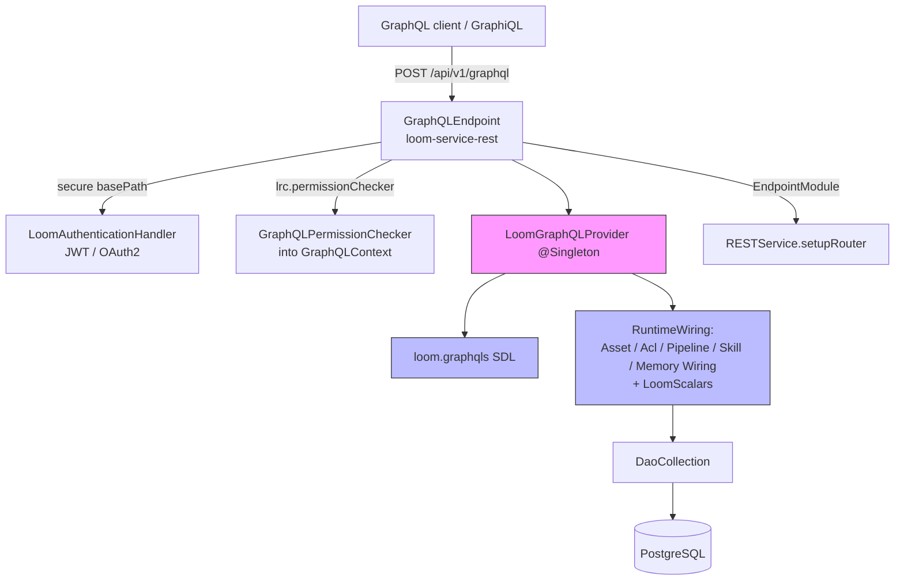

# MetaLoom // Loom GraphQL API Specification

> Living specification for the Loom GraphQL API, written for AI agents and developers who need to
> understand, extend or integrate with it. [§12](#12-progress-assessment) tracks the open work.

> ✅ **Status verified at `2e5981cb`: the GraphQL service IS wired and reachable.**
> `GraphQLEndpoint` is a constructor parameter of `EndpointModule.endpoints(...)` and is contained in
> the returned `@RESTEndpoints Set<RESTEndpoint>`; `RESTService.setupRouter()` calls `register()` on
> every element of that set. Live route: **`POST /api/v1/graphql`** (secured), plus the bundled
> GraphiQL IDE at **`GET /graphiql`** (unsecured shell, registered by `UIService.start()`).
> An earlier note in [../CONTEXT.md](../CONTEXT.md) §7 claiming "implemented but not registered" is
> **stale** — it was true before the endpoint was added and should be dropped from that file.

---

## 1. Overview

`loom-service-graphql` provides a **read-only** GraphQL layer over the core data model: assets and
their components/locations, the access-control graph (users, groups, roles), pipelines
(versions/runs), skills (versions) and the agent memory bank.

The schema declares **no mutations** — every write still goes through the REST API. Each GraphQL
field is guarded by the *same* permission as its REST counterpart ([§5.3](#53-authentication--authorization)).

### 1.1 Facts

| Property | Value |
|----------|-------|
| Module / artifact | `loom/services/graphql` — `io.metaloom.loom.service:loom-service-graphql` |
| Dependencies | `graphql-java` 25.0, `loom-db-api`, `mockito-core` 4.11.0 (test). **No auth/vertx dependency.** |
| Schema loading | SDL at `src/main/resources/loom.graphqls`, parsed from the classpath as `/loom.graphqls` |
| Endpoint | `POST /api/v1/graphql` — `GraphQLEndpoint` in `loom-service-rest` |
| Registration | `EndpointModule.endpoints(...)` → `@RESTEndpoints Set<RESTEndpoint>` → `RESTService.setupRouter()` |
| IDE | `GET /graphiql` (302 → `/graphiql/`), static resources from `loom/services/rest/src/main/resources/graphiql/` |
| Auth | JWT/OAuth2 via `secure(basePath())` + per-field permission checks |
| CORS | Covered by the **global** `CorsHandler` installed in `RESTService.setupRouter()` before endpoint registration (wildcard origin, `allowCredentials(true)`) — no GraphQL-specific config |
| OpenAPI | `LoomOpenAPI` instantiates `new GraphQLEndpoint(deps, null)` so the route appears in the generated API docs |

### 1.2 Relationship to Other APIs

| API | Purpose | Status |
|-----|---------|--------|
| [REST](RESTAPI.md) | Primary external API, full CRUD, OpenAPI | Production |
| [WebSocket](WEBSOCKET.md) | Real-time pipeline events, processor communication | Production |
| [MCP](MCP.md) | AI agent tool integration | Active development |
| **GraphQL** | Flexible read queries + nested fetching across assets, ACL, pipelines, skills, memory | **Live, read-only** |
| [gRPC](GRPC.md) | High-performance internal communication | Planned |

---

## 2. Architecture

### 2.1 Component Diagram



### 2.2 Request Flow

```
1. POST /api/v1/graphql  { query, variables?, operationName? }
2. Vert.x auth handler validates the bearer token (cookie or Authorization header) → 401 if absent
3. GraphQLEndpoint.handleGraphQL: lrc.permissionChecker() resolves the caller's authorizations once
4. executeGraphQL: ExecutionInput + graphQLContext{ loom.permissionChecker -> checker }
5. LoomGraphQLProvider.graphQL().execute(...) — pre-built engine, no per-request schema work
6. Each data fetcher calls requirePermission(env, …) and then a DAO method
7. ExecutionResult.toSpecification() is sent back as JSON (data + errors), HTTP 200
```

### 2.3 Key Classes Reference

| Class | Package / module | Purpose |
|-------|------------------|---------|
| `LoomGraphQLProvider` | `io.metaloom.loom.graphql` (graphql) | `@Singleton`; loads the SDL, registers scalars, merges the five domain wirings, eagerly builds one `GraphQL` engine in the constructor |
| `AbstractDomainWiring` | `io.metaloom.loom.graphql` (graphql) | Base for domain wirings; `requirePermission()`, `uuidArg()` (`BAD_USER_INPUT` on malformed UUID), `orEmpty()` |
| `AssetWiring` | `io.metaloom.loom.graphql` (graphql) | Fetchers for `Asset`, `AssetLocation`, `Image/Video/AudioComponent` |
| `AclWiring` | `io.metaloom.loom.graphql` (graphql) | Fetchers for `User`, `Group`, `Role` and their relations |
| `PipelineWiring` | `io.metaloom.loom.graphql` (graphql) | Fetchers for `Pipeline`, `PipelineVersion`, `PipelineRun` |
| `SkillWiring` | `io.metaloom.loom.graphql` (graphql) | Fetchers for `Skill`, `SkillVersion` |
| `MemoryWiring` | `io.metaloom.loom.graphql` (graphql) | Fetchers for `MemoryEntry`, `MemoryScopeStats`, `MemoryDenyRule`; `scopeArg()` |
| `LoomScalars` | `io.metaloom.loom.graphql` (graphql) | Custom scalars `Long`, `DateTime`, `Json` |
| `GraphQLPermissionChecker` | `io.metaloom.loom.graphql` (graphql) | `@FunctionalInterface` callback + `CONTEXT_KEY = "loom.permissionChecker"`; keeps the module auth-free |
| `GraphQLEndpoint` | `io.metaloom.loom.rest.endpoint.impl` (rest) | HTTP transport: `secure()`, body parsing, execution, JSON response |
| `EndpointModule` | `io.metaloom.loom.rest.dagger` (rest) | Dagger multibinding that **includes** `graphQLEndpoint` |
| `LoomRoutingContext#permissionChecker()` | `io.metaloom.loom.rest` (rest) | Returns `Future<GraphQLPermissionChecker>` backed by `PermissionBasedAuthorization` matching |
| `GraphQLRequest` / `GraphQLResponse` | `io.metaloom.loom.rest.model.graphql` (rest-model) | Wire models; response carries `JsonObject data` + `JsonArray errors` |
| `GraphQLMethods` | `io.metaloom.loom.client.common.method` (loom-client) | `executeGraphQL(GraphQLRequest)` on `LoomHttpClient` |

### 2.4 Wiring Layout

One `AbstractDomainWiring` subclass per bounded area registers its own `Query` fields plus the field
resolvers of the types it owns. `RuntimeWiring.Builder` merges repeated `type("Query")`
registrations, so every domain extends the same query root. **Adding a field means touching exactly
two places: the SDL and the wiring of the owning domain.**

---

## 3. Schema

The SDL (414 lines) at `loom/services/graphql/src/main/resources/loom.graphqls` is the **source of
truth**. A byte-identical copy is staged for the offline docs explorer at
`website/static/docs/examples/schema.graphql` — **keep the two in sync** (see [../website/WEBSITE.md](../website/WEBSITE.md)).

Every list field is non-null (`[T!]!`) and returns an empty list rather than `null`; single-object
lookups return `null` when the element does not exist.

### 3.1 Query Root

| Domain | Fields | Permission |
|--------|--------|------------|
| Asset | `asset(uuid)`, `assetBySha512(sha512)`, `assets` | `READ_ASSET` |
| Asset | `assetLocation(uuid)`, `assetLocations(assetUuid?)` | `READ_ASSET_LOCATION` |
| ACL | `user(uuid)`, `userByUsername(username)`, `users` | `READ_USER` |
| ACL | `group(uuid)`, `groupByName(name)`, `groups` | `READ_GROUP` |
| ACL | `role(uuid)`, `roleByName(name)`, `roles` | `READ_ROLE` |
| Pipeline | `pipeline(uuid)`, `pipelines` | `READ_PIPELINE` |
| Pipeline | `pipelineVersion(uuid)`, `pipelineVersions(pipelineUuid)`, `pipelineVersionByNumber(pipelineUuid, versionNumber)` | `READ_PIPELINE_VERSION` |
| Pipeline | `pipelineRun(uuid)`, `pipelineRuns(pipelineUuid?, status?)`, `latestPipelineRun(pipelineUuid)` | `READ_PIPELINE_RUN` |
| Skill | `skill(uuid)`, `skills` | `READ_SKILL` |
| Skill | `skillVersion(uuid)`, `skillVersions(skillUuid)`, `skillVersionByNumber(skillUuid, versionNumber)`, `latestSkillVersion(skillUuid)` | `READ_SKILL_VERSION` |
| Memory | `memoryEntry(uuid)`, `memoryEntryByPath(scope, scopeUuid, memoryId)`, `memoryEntries(scope, scopeUuid, prefix?, limit=50)`, `memoryStats(scope, scopeUuid)` | `READ_MEMORY` |
| Memory | `memoryDenyRule(uuid)`, `memoryDenyRuleByName(name)`, `memoryDenyRules(enabledOnly=false)` | `READ_MEMORY_DENY_RULE` |

`memoryStats` is the only non-null query result (`MemoryScopeStats!`). `MemoryScope` is an enum
(`USER`, `GROUP`, `SPACE`).

### 3.2 Relation Fields

Relations resolve lazily through a second fetcher that re-checks **its own** permission, which may
differ from the parent's:

| Type | Relation fields (permission if different from the parent) |
|------|------------------------------------------------------------|
| `Asset` | `imageComponents`, `videoComponents`, `audioComponents` (`READ_ASSET`); `locations` (`READ_ASSET_LOCATION`) |
| `AssetLocation` | `asset` (`READ_ASSET`) |
| `User` | `groups` (`READ_GROUP`) |
| `Group` | `users` (`READ_USER`), `roles` (`READ_ROLE`) |
| `Pipeline` | `latestVersion`, `versions` (`READ_PIPELINE_VERSION`), `runs` (`READ_PIPELINE_RUN`) |
| `PipelineVersion` / `PipelineRun` | `pipeline` (`READ_PIPELINE`) |
| `Skill` | `activeVersion`, `latestVersion`, `versions` (`READ_SKILL_VERSION`) |
| `SkillVersion` | `skill` (`READ_SKILL`) |

### 3.3 Field Mappings & Safeguards

- **`User.passwordHash` is deliberately absent** — there is no field that could leak it, not even
  for an administrator (asserted by `UserGraphQLTest.testPasswordHashIsNotExposed`).
- **`User.sso`** is backed by an explicit fetcher calling `isSSO()` — the property fetcher cannot
  derive that getter from the field name.
- **`Asset.sha512/sha256/md5`** have explicit fetchers that `toString()` the hash value objects
  (null-safe); the property fetcher would emit the object.
- **Component `source`** keeps its name but is backed by `AssetComponent.getNodeKind()` (the DB
  column was split into `node_kind` / `producer_version`). `ImageComponent.dominantColor/width/height`
  map to `getImageDominantColor()` / `getMediaWidth()` / `getMediaHeight()`.
- **`MemoryEntry.scope`** is serialized via an explicit fetcher (`scope.name()`).
- **`MemoryEntry.body`** is `null` on entries returned by an index query, which does not project it.
- **`Skill.activeVersionNumber`** is a transient projection populated when the skill is loaded
  together with its active version.

### 3.4 Custom Scalars

| Scalar | Constant | Notes |
|--------|----------|-------|
| `Long` | `LoomScalars.LONG` | 64-bit values (file sizes, byte counts) beyond `Int`; literals must be `IntValue` |
| `DateTime` | `LoomScalars.DATE_TIME` | `Instant` as ISO-8601 UTC (`2024-05-01T12:00:00Z`); literals must be `StringValue` |
| `Json` | `LoomScalars.JSON` | Arbitrary JSON (`meta`, `PipelineVersion.definition`); unwraps Vert.x `JsonObject`/`JsonArray`. **`parseLiteral` always throws** — pass JSON through a query variable |

Scalars are registered in `LoomGraphQLProvider.buildWiring()`; a scalar declared in the SDL but not
registered fails schema generation at construction time (i.e. at Dagger boot).

---

## 4. Data Fetchers

Every `Query` fetcher calls `requirePermission(env, …)` **first**, then parses arguments, then hits a
DAO. Because the permission check precedes DAO access, permission tests need no seeded data.

| Field | DAO call |
|-------|----------|
| `asset` / `assetBySha512` / `assets` | `AssetDao.load(UUID)` / `loadBySHA512(SHA512)` / `findAll()` |
| `assetLocations` | `AssetBinaryDao.loadAllByAssetUuid(UUID)` when `assetUuid` given, else `findAll()` |
| `Asset.locations` | `AssetBinaryDao.loadAllByAssetUuid(asset.getUuid())` (indexed lookup, no in-memory filter) |
| `Asset.{image,video,audio}Components` | `AssetComponentDao.load{Image,Video,Audio}Comps(UUID)` |
| `user` / `userByUsername` / `users` | `UserDao.load` / `loadByUsername` / `findAll` |
| `group*` / `role*` | `GroupDao` / `RoleDao` `load` / `loadByName` / `findAll` |
| `User.groups` / `Group.users` / `Group.roles` | `GroupDao.loadGroupsForUser` / `loadUsersForGroup` / `loadRoles(group)` |
| `pipelineVersions` / `pipelineVersionByNumber` | `PipelineVersionDao.loadByPipeline(UUID)` / `loadByPipelineAndVersion(UUID, int)` |
| `pipelineRuns` | `PipelineRunDao.loadByPipeline(UUID)`, `loadByStatus(String)`, or `findAll()`; when both args are given the pipeline runs are filtered by status in memory |
| `latestPipelineRun` | `PipelineRunDao.loadLatestByPipeline(UUID)` |
| `Pipeline.latestVersion` / `Skill.activeVersion` | `…Dao.load(<parent>.getLatestVersionUuid()/getActiveVersionUuid())`, `null` when unset |
| `skillVersions` / `skillVersionByNumber` / `latestSkillVersion` | `SkillVersionDao.loadBySkill` / `loadBySkillAndVersion` / `loadLatestBySkill` |
| `memoryEntry*` | `MemoryEntryDao.load` / `loadByPath(scope, uuid, memoryId)` / `listByScope(scope, uuid, prefix, limit)` |
| `memoryStats` | `MemoryEntryDao.stats(scope, uuid)`, falling back to `MemoryScopeStats.EMPTY` |
| `memoryDenyRules` | `MemoryDenyRuleDao.loadEnabled()` when `enabledOnly`, else `findAll()` |

---

## 5. Integration

### 5.1 Dagger

`LoomGraphQLProvider` is a `@Singleton` with an `@Inject` constructor taking `DaoCollection`; it
builds the engine eagerly. `GraphQLEndpoint` `@Inject`s `EndpointDependencies` + the provider and is
bound into the endpoint set by `EndpointModule`. Changing the endpoint constructor requires a clean
rebuild of `loom/core` (Dagger-generated factories) — see [LOOM.md](LOOM.md).

### 5.2 HTTP Endpoint

`GraphQLEndpoint` (`name() = "graphql"`, `basePath() = API_V1_PATH + "/graphql"`):

- `register()` calls `secure(basePath())`, then `addRoute(basePath(), POST, …)`.
- Body: `{ "query": "...", "variables": {...}?, "operationName": "..."? }`; `variables` is read as a
  `JsonObject` and passed as a `Map`.
- Response: `ExecutionResult.toSpecification()` encoded as JSON with **HTTP 200**, even when the
  `errors` array is populated (GraphQL error semantics, not HTTP status codes). Only transport-level
  failures (unparseable body, permission resolution failure) go through `lrc.error(...)`.

### 5.3 Authentication & Authorization

No GraphQL-specific auth infrastructure exists — the REST stack is reused.

**Endpoint authentication.** `secure(basePath())` attaches the same `LoomAuthenticationHandler`
(`LoomJWTAuthHandlerImpl`) as every secured REST route; requests without a valid bearer token
(HttpOnly cookie or `Authorization` header) get HTTP `401` before the query is parsed. OAuth2 tokens
validate through the same handler. See [RESTAPI.md](RESTAPI.md).

**Field-level authorization.** `LoomRoutingContext.permissionChecker()` resolves the caller's
authorizations once (via `LoomAuthorizationProvider`) and returns a synchronous
`GraphQLPermissionChecker` (a lambda over `PermissionBasedAuthorization.create(perm.name()).match(user)`),
placed into the `GraphQLContext` under `GraphQLPermissionChecker.CONTEXT_KEY`. Permissions per field
are listed in [§3.1](#31-query-root) / [§3.2](#32-relation-fields).

**Error semantics** — `GraphqlErrorException` with a `code` extension:

| Situation | Extensions |
|-----------|-----------|
| No checker in the context (unauthenticated) | `{ "code": "UNAUTHENTICATED" }` |
| Authenticated but missing the permission | `{ "code": "FORBIDDEN", "permission": "READ_ASSET" }` |
| Malformed UUID argument | `{ "code": "BAD_USER_INPUT", "argument": "uuid" }` |
| Unparseable `scope` argument | `{ "code": "BAD_USER_INPUT", "argument": "scope" }` |

Because list fields are non-null (`[AssetLocation!]!`), a denial null-propagates up to the nearest
nullable parent per the GraphQL spec, while the error still pinpoints the denied field.

### 5.4 GraphiQL

- **Server (live).** `UIService.start()` registers `GET /graphiql` → 302 `/graphiql/` and serves
  `StaticHandler.create("graphiql")` from `loom/services/rest/src/main/resources/graphiql/`
  (`index.html`, `graphiql.min.js/.css`, bundled React). The route is **intentionally unsecured** —
  the shell is a static page; it POSTs to the secured endpoint with `credentials: 'include'`, so
  introspection and execution only work for a session logged in at `/ui/`.
- **Website (static/offline).** The customer docs page `docs/loom/graphql-api/` embeds the same
  bundle and builds the schema in-browser from the staged SDL, so docs/autocomplete/validation work
  with no backend. Live execution is off unless a `data-graphql-url` attribute is set.
  See [../website/WEBSITE.md](../website/WEBSITE.md).

---

## 6. Example Queries

```graphql
# Asset with all components and locations
query GetAsset($uuid: ID!) {
  asset(uuid: $uuid) {
    uuid filename mimeType size sha512 sha256 md5 initialOrigin
    imageComponents { uuid source dominantColor width height }
    videoComponents { uuid source }
    audioComponents { uuid source }
    locations { uuid path assetUuid libraryUuid mimeType }
  }
}

# ACL graph — note groups needs READ_GROUP, roles needs READ_ROLE
query GetUser($uuid: ID!) {
  user(uuid: $uuid) {
    uuid username email enabled sso
    groups { uuid name roles { uuid name } }
  }
}

# Pipeline with its latest version and runs
query GetPipeline($uuid: ID!) {
  pipeline(uuid: $uuid) {
    uuid
    latestVersion { versionNumber name enabled definition }
    runs { uuid status successCount failureCount started durationMs }
  }
}

# Skill and memory
query GetSkill($uuid: ID!) {
  skill(uuid: $uuid) {
    uuid name activeVersionNumber
    activeVersion { versionNumber content }
    versions { versionNumber description }
  }
}

query ListMemory($scope: MemoryScope!, $scopeUuid: ID!) {
  memoryEntries(scope: $scope, scopeUuid: $scopeUuid, prefix: "projects/") {
    memoryId title size version
  }
  memoryStats(scope: $scope, scopeUuid: $scopeUuid) { count bytes }
}
```

---

## 7. Test Setup

### 7.1 Unit Tests (mocked DAOs)

`LoomGraphQLProviderTest` (`loom/services/graphql/src/test/java/...`, 8 tests) mocks `DaoCollection`
with Mockito and executes real queries against the provider: asset by uuid, not-found → `null`,
nested components, locations, list query, unauthenticated denial, missing-permission denial, and
field-level permission null-propagation.

```bash
mvn -pl loom/services/graphql test
```

### 7.2 Integration Tests (live server + pooled DB)

Under `loom/core/src/test/java/io/metaloom/loom/core/endpoint/graphql/`, one class per domain
element, all extending `AbstractGraphQLTest extends AbstractEndpointTest implements GraphQLSecurityTestcases`:

| Class | Tests | Coverage |
|-------|-------|----------|
| `AbstractGraphQLTest` | — | `query(...)`/`data(...)` helpers, `assertNoErrors`/`assertHasErrors`/`assertErrorCode`/`assertForbidden`/`assertRetrievalForbidden`, `object()`/`list()` tree navigation. `daos()`, `adminUuid()` and `loginPermissionlessClient()` are **inherited from `AbstractEndpointTest`** |
| `GraphQLSecurityTestcases` | 2 (abstract) | Compiler-enforced contract, see below |
| `AssetGraphQLTest` | 9 | by uuid / sha512, list, locations (+ back ref), `assetLocations(assetUuid)`, not-found, malformed uuid → `BAD_USER_INPUT` |
| `UserGraphQLTest` | 9 | by uuid / username, list, `groups`, not-found, `passwordHash` absent, `READ_USER` guard |
| `GroupGraphQLTest` | 6 | by uuid / name, list, `users` + `roles` |
| `RoleGraphQLTest` | 8 | by uuid / name, list, not-found, `READ_ROLE` → `FORBIDDEN`, unauthenticated → `401` |
| `PipelineGraphQLTest` | 9 | `latestVersion`, list, versions, version by number, runs, runs by status, `latestPipelineRun` |
| `SkillGraphQLTest` | 8 | `activeVersion`/`latestVersion`, versions, version by number, `latestSkillVersion`, list |
| `MemoryGraphQLTest` | 8 | entry by uuid / path, `memoryEntries` + prefix, `memoryStats`, deny rules (`enabledOnly`), invalid scope |

`GraphQLEndpointTest` (`…/endpoint/test/`, extends `AbstractGraphQLEndpointTest`, implements
`GraphQLEndpointTestcases`, 4 tests) covers raw endpoint mechanics: basic query, variables, nested
components, not-found, invalid query.

**Enforced security contract.** `AbstractGraphQLTest` implements `GraphQLSecurityTestcases` but
leaves both `@Test` methods abstract, so the compiler forces every domain test to supply
`testIndividualRetrievalRequiresPermission()` and `testListRetrievalRequiresPermission()`. Each logs
in via `loginPermissionlessClient()` (a freshly provisioned user with **no** permissions) and asserts
every retrieval query of the domain is rejected with `FORBIDDEN` naming the exact read permission.
A random UUID argument suffices — the check runs before DAO access.

The fixture provisions assets and the ACL graph (`admin` with every permission, `joedoe` with only
`READ_USER`, plus `test-group`/`test-role`); pipeline, skill and memory tests seed via `daos()`.

```bash
./setup-pool.sh                              # required once, and after any Flyway change
mvn -pl loom/core -Dtest='*GraphQLTest' test
```

See [LOOM.md](LOOM.md) and [../guidelines/CODING.md](../guidelines/CODING.md) for the pool setup and
the test obligations that come with a code change.

---

## 8. Configuration

The GraphQL service has **no dedicated configuration** and reads no environment variables of its
own. It inherits the database configuration used by `DaoCollection` / `LoomOptions` — see
[CONFIGURATION.md](CONFIGURATION.md) and [PERSISTENCE.md](PERSISTENCE.md) for
`LOOM_DATABASE_URL` / `LOOM_DATABASE_USER` / `LOOM_DATABASE_PASSWORD`.

The only tunable is a **hard-coded** constant: `MemoryWiring.MAX_LIMIT = 500` clamps the
`memoryEntries(limit:)` argument (default `50`).

Config keys such as `LOOM_GRAPHQL_ENABLED`, `LOOM_GRAPHQL_PATH`, `LOOM_GRAPHQL_PLAYGROUND`,
`LOOM_GRAPHQL_MAX_QUERY_DEPTH` or `LOOM_GRAPHQL_MAX_QUERY_COMPLEXITY` **do not exist** — the endpoint
is always registered at the fixed path and there is no depth/complexity limiting yet
([§12.3](#123-planned--todo-)).

---

## 9. Conventions and Gotchas

- **Two-file change rule.** A schema change means editing the SDL *and* the owning
  `AbstractDomainWiring` subclass. Also mirror the SDL to
  `website/static/docs/examples/schema.graphql` (currently byte-identical — verify with `diff`).
- **Unregistered scalar = boot failure.** `LoomGraphQLProvider` builds the schema in its
  constructor, so a scalar declared in the SDL but missing from `buildWiring()` fails at Dagger
  injection time, not at query time.
- **`Json` literals are rejected.** `LoomScalars.JSON.parseLiteral` always throws
  `CoercingParseLiteralException` — pass JSON through a query variable.
- **`findAll()` returns a lazy/unbounded `Stream`** — always
  `.collect(Collectors.toList())`. There is no pagination on the list queries.
- **N+1 remains.** Every relation on a list element fires its own DAO call
  (`assets { locations imageComponents }` = one call per asset per relation). `Asset.locations` uses
  the indexed `loadAllByAssetUuid(UUID)`, but the per-element fan-out is unchanged. Fix = DataLoader.
- **Non-null lists amplify denials.** A `FORBIDDEN` on `[T!]!` null-propagates to the nearest
  nullable parent, so a partially unauthorized query can return `data: { asset: null }`.
- **HTTP 200 on GraphQL errors.** Clients must inspect the `errors` array, not the status code.
  `GraphQLResponse` exposes `JsonObject data` / `JsonArray errors`.
- **Never add a `passwordHash` field.** Its absence is a deliberate security property and is
  asserted by a test.
- **Explicit fetchers beat property fetchers** for `isSSO()`, hash value objects, and enum-valued
  fields (`MemoryEntry.scope`); adding such a field without a fetcher silently yields `null`.
- **`uuidArg()` returns `null` for an absent optional argument** — check for `null` before using it
  (see `assetLocations` / `pipelineRuns`).
- **The graphql module must stay auth-free.** It depends only on `loom-db-api` (for `Permission`)
  and the transport-supplied `GraphQLPermissionChecker`. Do not add a dependency on the auth or
  vertx-web layers.
- **Endpoint constructor changes need a clean rebuild** of `loom/core` (Dagger factories), or
  `setup-pool.sh` and the tests fail with `NoSuchMethodError`.

---

## 10. Where Do I Find...?

| Concept | Path |
|---------|------|
| GraphQL engine provider | `loom/services/graphql/src/main/java/io/metaloom/loom/graphql/LoomGraphQLProvider.java` |
| Domain wirings | `loom/services/graphql/src/main/java/io/metaloom/loom/graphql/{Asset,Acl,Pipeline,Skill,Memory}Wiring.java` |
| Wiring base (permission/arg helpers) | `…/io/metaloom/loom/graphql/AbstractDomainWiring.java` |
| Permission checker interface | `…/io/metaloom/loom/graphql/GraphQLPermissionChecker.java` |
| Custom scalars | `…/io/metaloom/loom/graphql/LoomScalars.java` |
| SDL schema | `loom/services/graphql/src/main/resources/loom.graphqls` |
| HTTP endpoint | `loom/services/rest/src/main/java/io/metaloom/loom/rest/endpoint/impl/GraphQLEndpoint.java` |
| Dagger endpoint registration | `loom/services/rest/src/main/java/io/metaloom/loom/rest/dagger/EndpointModule.java` |
| Router setup / CORS | `loom/services/rest/src/main/java/io/metaloom/loom/rest/RESTService.java` (`setupRouter()`) |
| Permission checker construction | `loom/services/rest/src/main/java/io/metaloom/loom/rest/LoomRoutingContext.java` |
| GraphiQL route + assets | `loom/services/rest/src/main/java/io/metaloom/loom/rest/UIService.java`, `loom/services/rest/src/main/resources/graphiql/` |
| Wire models | `loom-shared/rest-model/src/main/java/io/metaloom/loom/rest/model/graphql/` |
| Client method | `loom-client/common/src/main/java/io/metaloom/loom/client/common/method/GraphQLMethods.java` |
| Provider unit tests | `loom/services/graphql/src/test/java/io/metaloom/loom/graphql/LoomGraphQLProviderTest.java` |
| Per-domain integration tests | `loom/core/src/test/java/io/metaloom/loom/core/endpoint/graphql/` |
| Endpoint mechanics test | `loom/core/src/test/java/io/metaloom/loom/core/endpoint/test/GraphQLEndpointTest.java` |
| Staged docs SDL + docs page | `website/static/docs/examples/schema.graphql`, `website/content/english/docs/loom/graphql-api/index.adoc` |
| Maven module | `loom/services/graphql/pom.xml` (declared in `loom/services/pom.xml`) |

---

## 11. Cross-References

- [LOOM.md](LOOM.md) — Loom architecture and module layout
- [RESTAPI.md](RESTAPI.md) — REST API, authentication, CORS, routing patterns reused here
- [PERSISTENCE.md](PERSISTENCE.md) — DAO layer consumed by the wirings
- [CONFIGURATION.md](CONFIGURATION.md) — configuration system
- [SERVER.md](SERVER.md) — server startup and service registration
- [../website/WEBSITE.md](../website/WEBSITE.md) — customer docs page and staged SDL
- [../guidelines/CODING.md](../guidelines/CODING.md) — definition of done for a code change

---

## 12. Progress Assessment

### 12.1 Completed ✅

- [x] SDL schema (`loom.graphqls`) + `LoomGraphQLProvider` building an executable schema
- [x] Five domain wirings merged into one `RuntimeWiring`
- [x] Custom scalars `Long`, `DateTime`, `Json`
- [x] Query root over assets (+ locations/components), ACL, pipelines (+ versions/runs), skills
      (+ versions), memory (entries, stats, deny rules) — retrieval only
- [x] Relation and back-reference resolvers across all domains
- [x] Field-level permission checks; `BAD_USER_INPUT` on malformed UUID / scope
- [x] **HTTP endpoint `POST /api/v1/graphql` registered** via `EndpointModule` → `RESTService`
- [x] JWT/OAuth2 authentication on the endpoint (`secure(basePath())`)
- [x] Wire models (`GraphQLRequest`/`GraphQLResponse`) and client method (`executeGraphQL`)
- [x] CORS — covered by the global `CorsHandler` in `RESTService.setupRouter()`
- [x] GraphiQL IDE: live at `GET /graphiql`, static explorer on the website
- [x] Unit tests with mocked DAOs (8) + per-domain integration tests (57 across 7 classes)
- [x] Compiler-enforced permission-check contract (`GraphQLSecurityTestcases`)
- [x] Endpoint listed in the generated OpenAPI docs (`LoomOpenAPI`)

### 12.2 In Progress 🚧

- [ ] Nothing currently in flight — the read-only API is feature complete for its declared scope

### 12.3 Planned / TODO 📋

- [ ] Mutations (writes still go through REST)
- [ ] Pagination for list queries (currently unbounded `findAll()`)
- [ ] DataLoader / batch loading to fix the N+1 fan-out
- [ ] Query depth / complexity limiting (DoS protection)
- [ ] Subscriptions (WebSocket) for real-time updates
- [ ] Metrics / tracing (OpenTelemetry)
- [ ] Persisted queries / allowlist and per-client rate limiting (production hardening)
- [ ] Generated schema documentation (markdown/HTML)
- [ ] Automated check that the SDL and `website/static/docs/examples/schema.graphql` stay in sync

---

## 13. Migration Notes (REST → GraphQL)

| REST | GraphQL |
|------|---------|
| `GET /api/v1/assets/:uuid` (+ `/locations`, `/components`) | `asset(uuid:) { locations { … } imageComponents { … } … }` |
| `GET /api/v1/assets` | `assets { … }` |
| `GET /api/v1/users/:uuid` | `user(uuid:) { groups { roles { … } } }` |
| `GET /api/v1/groups`, `/roles` | `groups { … } roles { … }` |
| `GET /api/v1/pipelines/:uuid` (+ versions, runs) | `pipeline(uuid:) { latestVersion { … } versions { … } runs { … } }` |
| `GET /api/v1/skills/:uuid` (+ versions) | `skill(uuid:) { activeVersion { … } versions { … } }` |
| `GET /api/v1/memory/...` | `memoryEntries(scope: USER, scopeUuid:) { … }` |
| **Any write** | **No equivalent — use REST** |

Trade-offs: one round trip for nested data and no over-fetching, at the cost of no HTTP caching,
N+1 without DataLoader, and field-level rather than endpoint-level authorization.

---

_Git HEAD revision: `2e5981cb`_
_Last updated: 2026-08-09 (`AssetLocationDao` was deleted; the location fetchers now call
`AssetBinaryDao.loadAllByAssetUuid`. The `AssetLocation` GraphQL type name is unchanged. Earlier: Verified against the code: the GraphQL service is registered and reachable at `POST /api/v1/graphql`; corrected the CORS, DAO-mapping, config and test claims.)_
