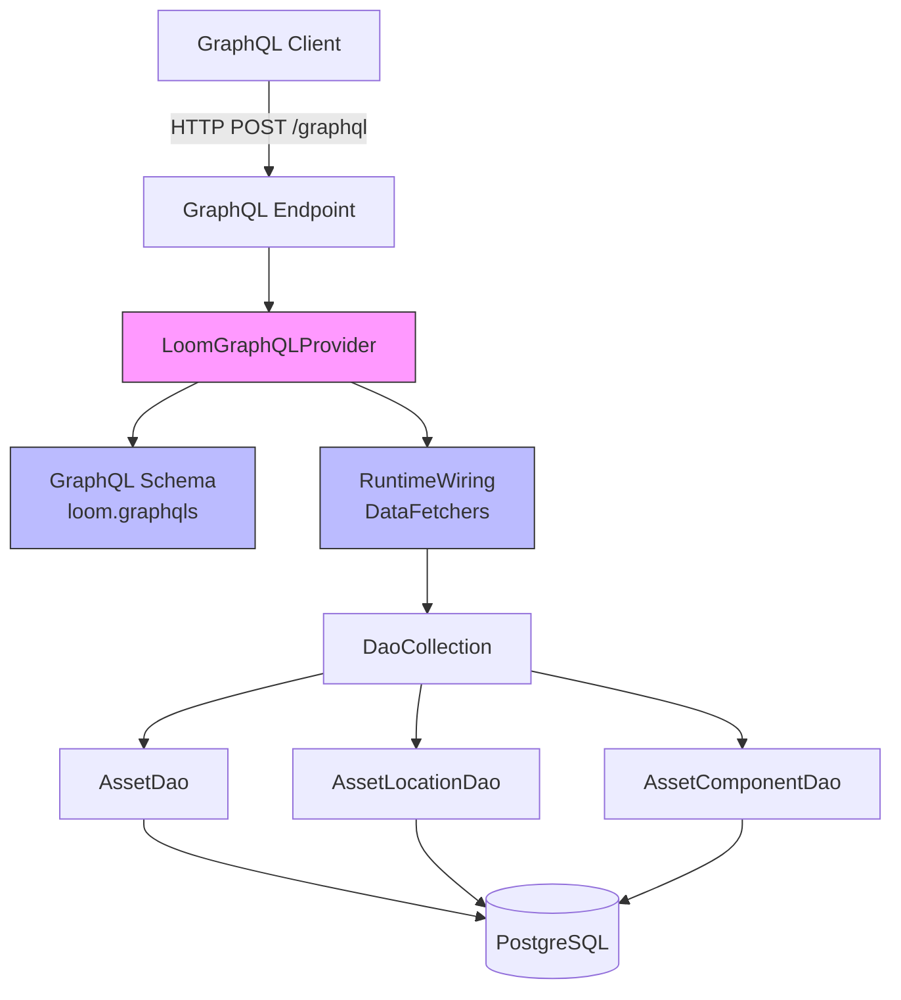

# MetaLoom // Loom GraphQL API Specification

> This document is a living specification for the Loom GraphQL API. It is intended
> to be consumed by AI agents and developers who need to understand, extend, or
> integrate with the GraphQL API. The progress checklist at the end tracks areas
> that still need improvement.

---

## 1. Overview

The GraphQL service (`loom-service-graphql`) provides a GraphQL API layer for the
Loom backend. It exposes a read-only view of the core data model — assets and
their components, the access-control graph (users, groups, roles), pipelines and
their versions/runs, skills and their versions, and the agent memory bank — via a
GraphQL schema, enabling flexible queries for clients that need more granular data
fetching than the REST API provides.

**Read-only.** The schema currently declares no mutations; every write still goes
through the REST API. Each GraphQL field is guarded by the *same* permission as its
REST counterpart (see [§5.4](#54-authentication--authorization)).

### 1.1 Current Status

- **Module:** `loom/services/graphql`
- **Artifact:** `io.metaloom.loom.service:loom-service-graphql`
- **GraphQL Java Version:** 25.0
- **Schema Loading:** SDL file at `src/main/resources/loom.graphqls`
- **Integration:** Registered in `EndpointModule`; live at `POST /api/v1/graphql`, plus a GraphiQL IDE at `GET /graphiql` (see [§5.3](#53-graphiql--playground))
- **Authentication:** JWT / OAuth2 required on the endpoint plus field-level permission checks (see [§5.4](#54-authentication--authorization))

### 1.2 Relationship to Other APIs

| API | Purpose | Status |
|-----|---------|--------|
| [REST](RESTAPI.md) | Primary external API, full CRUD, OpenAPI | Production |
| [WebSocket](WEBSOCKET.md) | Real-time pipeline events, processor communication | Production |
| [MCP](MCP.md) | AI agent tool integration | Active development |
| **GraphQL** | Flexible read queries across assets, ACL, pipelines, skills & memory; nested data fetching | **Live at `POST /api/v1/graphql` (+ GraphiQL at `/graphiql`)** |
| [gRPC](GRPC.md) | High-performance internal communication | Planned |

---

## 2. Architecture

### 2.1 Component Diagram



### 2.2 Data Flow

```
1. Client sends GraphQL query (HTTP POST to /graphql)
2. Vert.x routes to GraphQL endpoint handler
3. LoomGraphQLProvider.graphQL() returns pre-built GraphQL engine
4. Engine parses, validates, and executes query
5. DataFetchers invoke DAO methods via DaoCollection
6. Results assembled and returned as JSON
```

### 2.3 Key Classes Reference

| Class | Package | Purpose |
|-------|---------|---------|
| `LoomGraphQLProvider` | `io.metaloom.loom.graphql` | Builds and provides the GraphQL execution engine; loads the SDL schema, registers the custom scalars, and merges the per-domain wirings into one `RuntimeWiring` |
| `AbstractDomainWiring` | `io.metaloom.loom.graphql` | Base for the per-domain wiring contributions; provides `requirePermission()`, `uuidArg()` (with `BAD_USER_INPUT` on malformed UUIDs) and `orEmpty()` helpers |
| `AssetWiring` | `io.metaloom.loom.graphql` | Data fetchers for `Asset`, `AssetLocation` and the typed components |
| `AclWiring` | `io.metaloom.loom.graphql` | Data fetchers for `User`, `Group`, `Role` and their relations |
| `PipelineWiring` | `io.metaloom.loom.graphql` | Data fetchers for `Pipeline`, `PipelineVersion`, `PipelineRun` |
| `SkillWiring` | `io.metaloom.loom.graphql` | Data fetchers for `Skill`, `SkillVersion` |
| `MemoryWiring` | `io.metaloom.loom.graphql` | Data fetchers for `MemoryEntry`, `MemoryScopeStats`, `MemoryDenyRule` |
| `LoomScalars` | `io.metaloom.loom.graphql` | The custom scalars: `Long`, `DateTime` (ISO-8601 `Instant`), `Json` (Vert.x `JsonObject`) |
| `LoomGraphQLProviderTest` | `io.metaloom.loom.graphql` | Unit tests for GraphQL queries using mocked DAOs |

### 2.4 Wiring Layout

The schema is split by bounded domain: one `AbstractDomainWiring` subclass per area
registers the data fetchers for its own `Query` fields plus the field resolvers of the
types it owns. `LoomGraphQLProvider` instantiates them from a single `DaoCollection`
and merges them into one `RuntimeWiring` — `RuntimeWiring.Builder` merges repeated
`type("Query")` registrations, so every domain can extend the query root. Adding a
field therefore means touching two places: the SDL and the wiring of the owning
domain.

---

## 3. Schema Definition

### 3.1 SDL Schema (`loom.graphqls`)

The schema is defined in Schema Definition Language (SDL) at
`src/main/resources/loom.graphqls` (mirrored, for the offline docs explorer, at
`website/static/docs/examples/schema.graphql`). The full SDL is the source of
truth; the tables below summarize the query root and the exposed types.

### 3.2 Query Root

Every list field is non-null (`[T!]!`) and returns an empty list rather than
`null`. Single-object lookups return `null` when the element does not exist.

#### Asset
| Field | Arguments | Returns | Permission |
|-------|-----------|---------|------------|
| `asset` | `uuid: ID!` | `Asset` | `READ_ASSET` |
| `assetBySha512` | `sha512: String!` | `Asset` | `READ_ASSET` |
| `assets` | (none) | `[Asset!]!` | `READ_ASSET` |
| `assetLocation` | `uuid: ID!` | `AssetLocation` | `READ_ASSET_LOCATION` |
| `assetLocations` | `assetUuid: ID` | `[AssetLocation!]!` | `READ_ASSET_LOCATION` |

#### User / Group / Role
| Field | Arguments | Returns | Permission |
|-------|-----------|---------|------------|
| `user` | `uuid: ID!` | `User` | `READ_USER` |
| `userByUsername` | `username: String!` | `User` | `READ_USER` |
| `users` | (none) | `[User!]!` | `READ_USER` |
| `group` | `uuid: ID!` | `Group` | `READ_GROUP` |
| `groupByName` | `name: String!` | `Group` | `READ_GROUP` |
| `groups` | (none) | `[Group!]!` | `READ_GROUP` |
| `role` | `uuid: ID!` | `Role` | `READ_ROLE` |
| `roleByName` | `name: String!` | `Role` | `READ_ROLE` |
| `roles` | (none) | `[Role!]!` | `READ_ROLE` |

#### Pipeline
| Field | Arguments | Returns | Permission |
|-------|-----------|---------|------------|
| `pipeline` | `uuid: ID!` | `Pipeline` | `READ_PIPELINE` |
| `pipelines` | (none) | `[Pipeline!]!` | `READ_PIPELINE` |
| `pipelineVersion` | `uuid: ID!` | `PipelineVersion` | `READ_PIPELINE_VERSION` |
| `pipelineVersions` | `pipelineUuid: ID!` | `[PipelineVersion!]!` | `READ_PIPELINE_VERSION` |
| `pipelineVersionByNumber` | `pipelineUuid: ID!, versionNumber: Int!` | `PipelineVersion` | `READ_PIPELINE_VERSION` |
| `pipelineRun` | `uuid: ID!` | `PipelineRun` | `READ_PIPELINE_RUN` |
| `pipelineRuns` | `pipelineUuid: ID, status: String` | `[PipelineRun!]!` | `READ_PIPELINE_RUN` |
| `latestPipelineRun` | `pipelineUuid: ID!` | `PipelineRun` | `READ_PIPELINE_RUN` |

#### Skill
| Field | Arguments | Returns | Permission |
|-------|-----------|---------|------------|
| `skill` | `uuid: ID!` | `Skill` | `READ_SKILL` |
| `skills` | (none) | `[Skill!]!` | `READ_SKILL` |
| `skillVersion` | `uuid: ID!` | `SkillVersion` | `READ_SKILL_VERSION` |
| `skillVersions` | `skillUuid: ID!` | `[SkillVersion!]!` | `READ_SKILL_VERSION` |
| `skillVersionByNumber` | `skillUuid: ID!, versionNumber: Int!` | `SkillVersion` | `READ_SKILL_VERSION` |
| `latestSkillVersion` | `skillUuid: ID!` | `SkillVersion` | `READ_SKILL_VERSION` |

#### Memory
| Field | Arguments | Returns | Permission |
|-------|-----------|---------|------------|
| `memoryEntry` | `uuid: ID!` | `MemoryEntry` | `READ_MEMORY` |
| `memoryEntryByPath` | `scope: MemoryScope!, scopeUuid: ID!, memoryId: String!` | `MemoryEntry` | `READ_MEMORY` |
| `memoryEntries` | `scope: MemoryScope!, scopeUuid: ID!, prefix: String, limit: Int = 50` | `[MemoryEntry!]!` | `READ_MEMORY` |
| `memoryStats` | `scope: MemoryScope!, scopeUuid: ID!` | `MemoryScopeStats!` | `READ_MEMORY` |
| `memoryDenyRule` | `uuid: ID!` | `MemoryDenyRule` | `READ_MEMORY_DENY_RULE` |
| `memoryDenyRuleByName` | `name: String!` | `MemoryDenyRule` | `READ_MEMORY_DENY_RULE` |
| `memoryDenyRules` | `enabledOnly: Boolean = false` | `[MemoryDenyRule!]!` | `READ_MEMORY_DENY_RULE` |

### 3.3 Object Types & Relations

Beyond scalar fields, several types expose **relation fields** that resolve lazily
through a second data fetcher (each carries its own permission check):

| Type | Relation fields |
|------|-----------------|
| `Asset` | `imageComponents`, `videoComponents`, `audioComponents`, `locations` |
| `AssetLocation` | `asset` (back reference) |
| `User` | `groups` (needs `READ_GROUP`) |
| `Group` | `users` (needs `READ_USER`), `roles` (needs `READ_ROLE`) |
| `Pipeline` | `latestVersion`, `versions`, `runs` |
| `PipelineVersion` | `pipeline` (back reference) |
| `PipelineRun` | `pipeline` (back reference) |
| `Skill` | `activeVersion`, `latestVersion`, `versions` |
| `SkillVersion` | `skill` (back reference) |

Notable field mappings and safeguards:

- **`User.passwordHash` is deliberately absent** from the schema — there is no field
  that could leak it, not even for an administrator. `User.sso` is backed by the
  `isSSO()` getter (the property fetcher cannot derive it from the field name).
- **Component `source`** keeps its name but is backed by the component's producing
  `nodeKind` (the DB column was split into `node_kind` / `producer_version`).
- **`Skill.activeVersionNumber`** is a transient projection populated when the skill
  is loaded together with its active version.
- **`MemoryEntry.body`** is `null` on entries returned by an index query, which does
  not project the body.

### 3.4 Custom Scalars

| Scalar | Implementation | Use Case |
|--------|----------------|----------|
| `Long` | `LoomScalars.LONG` | 64-bit integers (file sizes, byte counts) beyond the 32-bit `Int` range |
| `DateTime` | `LoomScalars.DATE_TIME` | `Instant` timestamps, serialized as ISO-8601 in UTC (e.g. `2024-05-01T12:00:00Z`) |
| `Json` | `LoomScalars.JSON` | Arbitrary JSON (`meta` on most elements, `definition` on a pipeline version); unwraps Vert.x `JsonObject`/`JsonArray` |

The scalars are registered in `LoomGraphQLProvider.buildWiring()`; every scalar
declared in the SDL must be registered or schema generation fails. `Json` literals
are rejected — pass JSON through a query variable instead.

---

## 4. Data Fetchers & Resolvers

Data fetchers live in the per-domain `AbstractDomainWiring` subclasses
([§2.4](#24-wiring-layout)). Each `Query` fetcher calls `requirePermission(env, …)`
first, parses its arguments (UUIDs via `uuidArg()`, which raises `BAD_USER_INPUT` on
a malformed value), then delegates to a DAO method.

### 4.1 Representative Query Fetchers

| Fetcher | DAO Method |
|---------|------------|
| `asset` | `AssetDao.load(UUID)` |
| `assetBySha512` | `AssetDao.loadBySHA512(SHA512)` |
| `assetLocations(assetUuid)` | `AssetLocationDao.findForAsset(UUID)` (or `findAll()` when no arg) |
| `users` / `groups` / `roles` | `UserDao/GroupDao/RoleDao.findAll()` |
| `pipelineVersions` | `PipelineVersionDao.loadByPipeline(UUID)` |
| `pipelineRuns(status)` | `PipelineRunDao.loadByStatus(String)` / `loadByPipeline(UUID)` |
| `skillVersionByNumber` | `SkillVersionDao.loadBySkillAndVersion(UUID, int)` |
| `memoryEntries` | `MemoryEntryDao.listByScope(scope, uuid, prefix, limit)` |
| `memoryDenyRules(enabledOnly)` | `MemoryDenyRuleDao.loadEnabled()` / `findAll()` |

### 4.2 Relation Resolvers

Relation fields (e.g. `Asset.locations`, `Group.users`, `Pipeline.latestVersion`,
`Skill.activeVersion`) each re-check their own permission and resolve through the
owning DAO. Back references (`AssetLocation.asset`, `PipelineVersion.pipeline`,
`SkillVersion.skill`) load the parent by its foreign-key UUID, returning `null` when
unset. `Asset.locations` now uses the indexed `AssetLocationDao.findForAsset(UUID)`
lookup rather than the previous `findAll()` + in-memory filter.

### 4.3 Component Field Resolvers

| Field | Fetcher Logic |
|-------|---------------|
| `ImageComponent.source` / `VideoComponent.source` / `AudioComponent.source` | `AssetComponent.getNodeKind()` |
| `ImageComponent.dominantColor` | `AssetImageComp.getImageDominantColor()` |
| `ImageComponent.width` | `AssetImageComp.getMediaWidth()` |
| `ImageComponent.height` | `AssetImageComp.getMediaHeight()` |

---

## 5. Integration & Wiring

### 5.1 Dagger Integration

The `LoomGraphQLProvider` is a `@Singleton` that receives `DaoCollection` via
`@Inject` constructor injection and eagerly builds the `GraphQL` engine (schema +
merged wiring) at construction. It is consumed by `GraphQLEndpoint`, which registers
the HTTP route.

### 5.2 HTTP Endpoint Registration

`GraphQLEndpoint` (in `loom-service-rest`) exposes the API at **`POST /api/v1/graphql`**:

- Accepts a JSON body `{ "query": "...", "variables": {...}, "operationName": "..." }`.
- Calls `secure(basePath())` in `register()` to attach the shared JWT/OAuth2 auth handler.
- Resolves the caller's permissions once via `LoomRoutingContext.permissionChecker()`,
  then passes a synchronous `GraphQLPermissionChecker` into the execution context.
- Returns `ExecutionResult.toSpecification()` as JSON (`data` + `errors`).

CORS for the GraphQL route is still outstanding (see [§12.2](#122-in-progress-)).

### 5.4 Authentication & Authorization

The GraphQL endpoint reuses the REST authentication and authorization stack — no
GraphQL-specific auth infrastructure is introduced.

**Endpoint authentication (JWT / OAuth2).** `GraphQLEndpoint.register()` calls
`secure(basePath())`, which attaches the same `LoomAuthenticationHandler`
(`LoomJWTAuthHandlerImpl`) used by every secured REST route. Requests without a
valid bearer token (HttpOnly cookie or `Authorization` header) are rejected with
HTTP `401` before the query is ever parsed. OAuth2 tokens are validated through
the same handler as the REST API.

**Field-level authorization (permissions).** Before executing a query the
endpoint resolves the caller's authorizations once via
`LoomRoutingContext.permissionChecker()` (which loads permissions through
`LoomAuthorizationProvider`) and passes the resulting synchronous
`GraphQLPermissionChecker` into the GraphQL execution context under
`GraphQLPermissionChecker.CONTEXT_KEY`. Each data fetcher calls
`requirePermission(env, <Permission>)`, mirroring `requirePerm(...)` on the REST
side:

The permission required by each query field is listed in the [§3.2](#32-query-root)
tables. Relation fields re-check their own permission, which may differ from the
parent's — e.g. `User.groups` needs `READ_GROUP` even though `Query.user` only needs
`READ_USER`, and `Asset.locations` needs `READ_ASSET_LOCATION`. The full permission
domains covered are: `READ_ASSET`, `READ_ASSET_LOCATION`, `READ_USER`, `READ_GROUP`,
`READ_ROLE`, `READ_PIPELINE`, `READ_PIPELINE_VERSION`, `READ_PIPELINE_RUN`,
`READ_SKILL`, `READ_SKILL_VERSION`, `READ_MEMORY`, `READ_MEMORY_DENY_RULE`.

**Error semantics.** A denied field throws a `GraphqlErrorException` surfaced in
`ExecutionResult.getErrors()` with a `code` extension:

- Missing/absent permission checker → `{ "code": "UNAUTHENTICATED" }`
- Authenticated but lacking the permission →
  `{ "code": "FORBIDDEN", "permission": "READ_ASSET" }`
- A malformed UUID or unparseable scope argument →
  `{ "code": "BAD_USER_INPUT", "argument": "uuid" }`

Because list fields such as `locations` are declared non-null (`[AssetLocation!]!`),
a denial null-propagates up to the nearest nullable parent (the `asset`), per the
GraphQL spec, while the error still pinpoints the denied field.

The `loom-service-graphql` module stays free of any auth dependency: it only
references the `Permission` enum from `loom-db-api` and the transport-supplied
`GraphQLPermissionChecker` callback.

### 5.3 GraphiQL / Playground

A GraphiQL explorer is now provided in two places:

- **Loom server (live).** The server bundles a GraphiQL IDE and serves it as static resources at
  **`GET /graphiql`** (redirects to `/graphiql/`), registered without authentication in
  `UIService.start()` (classpath resources under `loom/services/rest/src/main/resources/graphiql/`).
  The IDE shell is public; it POSTs queries to the secured `POST /api/v1/graphql` with
  `credentials: 'include'`, so introspection and execution succeed only for a caller whose session
  cookie (set by logging in at `/ui/`) carries a valid token.
- **Website (static / offline).** The customer docs site embeds the same GraphiQL bundle on the
  *GraphQL API* page (`docs/loom/graphql-api/`). It builds the schema in-browser from the staged SDL
  (`website/static/docs/examples/schema.graphql`) so the docs explorer, autocomplete and validation
  work with no backend; live query execution is disabled by default (a `data-graphql-url` attribute
  can point it at a running endpoint). See `spec/website/WEBSITE.md`.

---

## 6. Example Queries

### 6.1 Fetch Asset with All Components

```graphql
query GetAsset($uuid: ID!) {
  asset(uuid: $uuid) {
    uuid
    filename
    mimeType
    size
    sha512
    sha256
    md5
    initialOrigin
    imageComponents {
      uuid
      source
      dominantColor
      width
      height
    }
    videoComponents {
      uuid
      source
    }
    audioComponents {
      uuid
      source
    }
    locations {
      uuid
      path
      assetUuid
      libraryUuid
      mimeType
    }
  }
}
```

### 6.2 List All Assets (Minimal)

```graphql
query ListAssets {
  assets {
    uuid
    filename
    mimeType
    size
  }
}
```

### 6.3 Fetch Asset with Only Image Components

```graphql
query GetAssetImages($uuid: ID!) {
  asset(uuid: $uuid) {
    uuid
    filename
    imageComponents {
      uuid
      dominantColor
      width
      height
    }
  }
}
```

### 6.4 User with Groups and Roles

```graphql
query GetUser($uuid: ID!) {
  user(uuid: $uuid) {
    uuid
    username
    email
    enabled
    groups {
      uuid
      name
      roles { uuid name }
    }
  }
}
```

### 6.5 Pipeline with Latest Version and Runs

```graphql
query GetPipeline($uuid: ID!) {
  pipeline(uuid: $uuid) {
    uuid
    latestVersion {
      versionNumber
      name
      enabled
      definition
    }
    runs {
      uuid
      status
      successCount
      failureCount
      started
    }
  }
}
```

### 6.6 Skill with Active and All Versions

```graphql
query GetSkill($uuid: ID!) {
  skill(uuid: $uuid) {
    uuid
    name
    activeVersionNumber
    activeVersion { versionNumber content }
    versions { versionNumber description }
  }
}
```

### 6.7 Memory Entries in a Scope

```graphql
query ListMemory($scope: MemoryScope!, $scopeUuid: ID!) {
  memoryEntries(scope: $scope, scopeUuid: $scopeUuid, prefix: "projects/") {
    memoryId
    title
    size
    version
  }
  memoryStats(scope: $scope, scopeUuid: $scopeUuid) {
    count
    bytes
  }
}
```

---

## 7. Test Setup

### 7.1 Unit Tests

The `LoomGraphQLProviderTest` uses Mockito to mock the `DaoCollection` and
individual DAOs. Tests execute real GraphQL queries against the provider.

**Test Dependencies:**
- `graphql-java` 25.0 (test scope via main)
- `mockito-core` 4.11.0
- `junit-jupiter` (via parent)

**Running Tests:**
```bash
cd loom/services/graphql
mvn test
```

### 7.2 Integration Tests (per domain element)

End-to-end tests run against a live server plus a real (pooled) database in
`loom-core`, under `io.metaloom.loom.core.endpoint.graphql`. There is **one test
class per domain element**, all extending a shared base:

| Class | Coverage |
|-------|----------|
| `AbstractGraphQLTest` | Base class: query execution helpers (`query`, `data`), response assertions (`assertNoErrors`, `assertHasErrors`, `assertErrorCode`, `assertForbidden`), `loginPermissionlessClient()` / `assertRetrievalForbidden(...)` for the security contract, data-tree navigation (`object`, `list`) and a `daos()` accessor for seeding fixtures. Implements `GraphQLSecurityTestcases` |
| `GraphQLSecurityTestcases` | Interface contract enforcing that every domain test provides `testIndividualRetrievalRequiresPermission()` and `testListRetrievalRequiresPermission()` — see below |
| `AssetGraphQLTest` | Asset by uuid / sha512, list, locations (+ back reference), `assetLocations(assetUuid)`, not-found → null, malformed uuid → `BAD_USER_INPUT` |
| `UserGraphQLTest` | User by uuid / username, list, `groups` relation, not-found, `passwordHash` is not in the schema, `READ_GROUP` field guard |
| `GroupGraphQLTest` | Group by uuid / name, list, `users` + `roles` relations |
| `RoleGraphQLTest` | Role by uuid / name, list, not-found, `READ_ROLE` `FORBIDDEN`, unauthenticated → `401` |
| `PipelineGraphQLTest` | Pipeline with `latestVersion`, list, versions (+ back reference), version by number, runs, runs by status, `latestPipelineRun` |
| `SkillGraphQLTest` | Skill by uuid, `activeVersion` / `latestVersion`, versions, version by number, `latestSkillVersion`, list |
| `MemoryGraphQLTest` | Memory entry by uuid / path, `memoryEntries` + prefix, `memoryStats`, deny rules (`enabledOnly`), invalid scope |

The fixture already provisions assets and the ACL graph (admin + joedoe, the
`test-group`/`test-role`); pipeline, skill and memory tests seed their own data
through `daos()`. The `admin` user carries every permission; `joedoe` carries only
`READ_USER` and is used to exercise the field-level authorization guards.

**Enforced security contract.** `AbstractGraphQLTest implements
GraphQLSecurityTestcases` but leaves its two `@Test` methods abstract, so the
compiler forces **every** domain test class to provide
`testIndividualRetrievalRequiresPermission()` and
`testListRetrievalRequiresPermission()`. A new domain test class cannot be added
without asserting that its individual *and* list retrieval queries are permission-
guarded. Each such test logs in via `loginPermissionlessClient()` — a freshly
provisioned user holding **no** permissions — and asserts every retrieval query of
its domain is rejected with a `FORBIDDEN` error naming the exact read permission
(`assertRetrievalForbidden(client, Permission.READ_*, query)`). Because
`requirePermission(...)` runs before any DAO access, these tests need no seeded data
— a random UUID argument suffices.

The pre-existing `GraphQLEndpointTest` still covers the raw endpoint mechanics
(variables, nested components, invalid-query errors).

**Running the integration tests** (requires the test DB pool — run `./setup-pool.sh`
first):
```bash
mvn -pl loom/core -Dtest='*GraphQLTest' test
```

### 7.3 Unit Test Coverage

`LoomGraphQLProviderTest` (mocked DAOs) covers: single asset query, not-found →
null, nested components, list query, malformed query, unauthenticated and
without-permission denials, and field-level permission null-propagation.

---

## 8. Environment Variables & Configuration

Currently, the GraphQL service has **no dedicated configuration**. It inherits
database configuration from `DaoCollection` / `LoomOptions`.

| Variable | Source | Default | Description |
|----------|--------|---------|-------------|
| `LOOM_DATABASE_URL` | `DatabaseOptions` | - | PostgreSQL JDBC URL |
| `LOOM_DATABASE_USER` | `DatabaseOptions` | - | Database username |
| `LOOM_DATABASE_PASSWORD` | `DatabaseOptions` | - | Database password |

**Future GraphQL-specific config:**
| Variable | Default | Description |
|----------|---------|-------------|
| `LOOM_GRAPHQL_ENABLED` | `false` | Enable GraphQL endpoint |
| `LOOM_GRAPHQL_PATH` | `/graphql` | HTTP path for GraphQL endpoint |
| `LOOM_GRAPHQL_PLAYGROUND` | `false` | Enable GraphiQL at GET /graphql |
| `LOOM_GRAPHQL_MAX_QUERY_DEPTH` | `15` | Max query depth for DoS protection |
| `LOOM_GRAPHQL_MAX_QUERY_COMPLEXITY` | `1000` | Max query complexity score |

---

## 9. Conventions and Gotchas

### 9.1 Schema-First Approach

- Schema is defined in SDL (`loom.graphqls`), not programmatically
- Changes to schema require updating the SDL file AND the DataFetchers in the owning
  `AbstractDomainWiring` subclass
- Every custom scalar (`Long`, `DateTime`, `Json`) must be registered in
  `RuntimeWiring` (done in `LoomGraphQLProvider.buildWiring()`); a declared-but-
  unregistered scalar fails schema generation at boot

### 9.2 DAO Access Pattern

- All DataFetchers receive `DaoCollection` via constructor injection
- Fetchers use reactive streams (`Stream<T>`) from DAOs, collected to `List`
- **Warning:** `findAll()` returns infinite stream; always `.collect(Collectors.toList())`

### 9.3 N+1 Problem

**Current implementation has N+1 issues.** Each relation field on a list element
fires its own DAO call — e.g. an `assets { locations imageComponents … }` query
issues one call per asset per selected relation, a `pipelines { versions runs }`
query one `loadByPipeline` per pipeline per relation, and so on. `Asset.locations`
now uses the indexed `AssetLocationDao.findForAsset(UUID)` (no more `findAll()` +
in-memory filter), but the per-element fan-out remains.

**Fix:** Use the DataLoader pattern / batch loading in future.

### 9.4 Error Handling

- GraphQL Java returns errors in `ExecutionResult.getErrors()`
- DAO exceptions bubble up as GraphQL errors
- Authorization failures carry a `code` extension (`UNAUTHENTICATED` / `FORBIDDEN`); bad arguments (malformed UUID / unknown scope) carry `BAD_USER_INPUT`; other errors have no custom extensions yet (see [§5.4](#54-authentication--authorization))

### 9.5 UUID Handling

- GraphQL `ID` type maps to Java `UUID`
- Arguments are parsed via `AbstractDomainWiring.uuidArg()`, which converts with
  `UUID.fromString()` and raises a `BAD_USER_INPUT` GraphQL error on a malformed
  value (rather than leaking a raw `IllegalArgumentException`)

---

## 10. Where Do I Find...?

| Concept | File Path |
|---------|-----------|
| GraphQL Provider (main class) | `loom/services/graphql/src/main/java/io/metaloom/loom/graphql/LoomGraphQLProvider.java` |
| Domain wirings | `loom/services/graphql/src/main/java/io/metaloom/loom/graphql/{Asset,Acl,Pipeline,Skill,Memory}Wiring.java` |
| Wiring base + arg/permission helpers | `loom/services/graphql/src/main/java/io/metaloom/loom/graphql/AbstractDomainWiring.java` |
| Custom scalars | `loom/services/graphql/src/main/java/io/metaloom/loom/graphql/LoomScalars.java` |
| SDL Schema | `loom/services/graphql/src/main/resources/loom.graphqls` |
| HTTP endpoint | `loom/services/rest/src/main/java/io/metaloom/loom/rest/endpoint/impl/GraphQLEndpoint.java` |
| Provider unit tests | `loom/services/graphql/src/test/java/io/metaloom/loom/graphql/LoomGraphQLProviderTest.java` |
| Per-domain integration tests | `loom/core/src/test/java/io/metaloom/loom/core/endpoint/graphql/` |
| Staged docs SDL (website) | `website/static/docs/examples/schema.graphql` |
| Maven Config | `loom/services/graphql/pom.xml` |
| Loom Module Layout | [LOOM.md](LOOM.md#2-module-layout) |
| REST API (for comparison) | [RESTAPI.md](RESTAPI.md) |
| Database/DAO Layer | [PERSISTENCE.md](PERSISTENCE.md) |
| Asset Model | `loom/db/api/src/main/java/io/metaloom/loom/db/model/asset/` |

---

## 11. Cross-References

- [LOOM.md](LOOM.md) - Overall Loom architecture, module layout
- [RESTAPI.md](RESTAPI.md) - REST API specification (authentication, CORS, routing patterns to reuse)
- [PERSISTENCE.md](PERSISTENCE.md) - Database layer, DAO interfaces used by GraphQL
- [CONFIGURATION.md](CONFIGURATION.md) - Configuration system (for future GraphQL config)
- [SERVER.md](SERVER.md) - Server startup (where endpoint registration would happen)

---

## 12. Progress Assessment

### 12.1 Completed ✅

- [x] GraphQL schema defined in SDL (`loom.graphqls`)
- [x] `LoomGraphQLProvider` builds executable schema from per-domain wirings
- [x] Custom scalars: `Long`, `DateTime`, `Json`
- [x] Query root covers **assets** (+ locations), **users / groups / roles**,
      **pipelines** (+ versions / runs), **skills** (+ versions), **memory** (entries,
      stats, deny rules) — retrieval only
- [x] Relation / back-reference resolvers across all domains (e.g. `User.groups`,
      `Pipeline.latestVersion`, `Skill.activeVersion`, `AssetLocation.asset`)
- [x] Field-level permission checks per domain (each relation re-checks its own permission)
- [x] `BAD_USER_INPUT` on malformed UUID / scope arguments
- [x] Nested types: `AssetLocation`, `ImageComponent`, `VideoComponent`, `AudioComponent`
- [x] DataFetchers wired to `DaoCollection` (all read DAOs)
- [x] Unit tests with mocked DAOs
- [x] Per-domain integration tests (`AbstractGraphQLTest` + one class per element)
- [x] Compiler-enforced permission-check contract (`GraphQLSecurityTestcases`): every
      domain test proves its individual + list retrieval queries return `FORBIDDEN`
      without the read permission
- [x] Maven module builds successfully

### 12.2 In Progress 🚧

- [x] HTTP endpoint handler (Vert.x route for `POST /graphql`)
- [x] GraphQL endpoint registration in `EndpointModule` / `RESTService`
- [x] GraphQL request/response models (`GraphQLRequest`, `GraphQLResponse`)
- [x] Client method interface (`GraphQLMethods`) and implementation in `LoomHttpClient`
- [x] Abstract test base class (`AbstractGraphQLEndpointTest`) and test interface (`GraphQLEndpointTestcases`)
- [x] Integration test class (`GraphQLEndpointTest`) with tests for:
  - Basic assets query
  - Query with variables
  - Nested components query
  - Asset not found
  - Invalid query error handling
- [x] Authentication integration (JWT/OAuth2 like REST) + field-level permission checks
- [ ] CORS configuration for GraphQL endpoint
- [x] GraphiQL / Playground for development (live at `GET /graphiql` on the server; static explorer on the website — see [§5.3](#53-graphiql--playground))

### 12.3 Planned / TODO 📋

- [ ] Mutations (writes still go through the REST API)
- [ ] Pagination for the list queries (currently unbounded `findAll()`)
- [ ] DataLoader / batch loading to fix N+1 problem
- [ ] Query depth/complexity limiting (DoS protection)
- [ ] Subscriptions (WebSocket) for real-time updates
- [ ] Apollo Federation / schema stitching (if microservices)
- [ ] Metrics / tracing (OpenTelemetry)
- [ ] Persisted queries / query allowlist (production hardening)
- [ ] Rate limiting per client
- [ ] GraphQL schema documentation generation (markdown/HTML)

---

## 13. Migration Notes (from REST)

When migrating REST clients to GraphQL:

| REST Endpoint | GraphQL Equivalent |
|---------------|-------------------|
| `GET /api/v1/assets/:uuid` | `query { asset(uuid: "...") { ... } }` |
| `GET /api/v1/assets` | `query { assets { ... } }` |
| `GET /api/v1/assets/:uuid/locations` | `query { asset(uuid: "...") { locations { ... } } }` |
| `GET /api/v1/assets/:uuid/components` | `query { asset(uuid: "...") { imageComponents { ... } videoComponents { ... } audioComponents { ... } } }` |
| `GET /api/v1/users/:uuid` | `query { user(uuid: "...") { ... groups { roles { ... } } } }` |
| `GET /api/v1/groups`, `GET /api/v1/roles` | `query { groups { ... } roles { ... } }` |
| `GET /api/v1/pipelines/:uuid` (+ versions, runs) | `query { pipeline(uuid: "...") { latestVersion { ... } versions { ... } runs { ... } } }` |
| `GET /api/v1/skills/:uuid` (+ versions) | `query { skill(uuid: "...") { activeVersion { ... } versions { ... } } }` |
| `GET /api/v1/memory/...` | `query { memoryEntries(scope: USER, scopeUuid: "...") { ... } }` |

> Writes have **no** GraphQL equivalent yet — the schema is read-only, so mutations
> (create/update/delete) still use the REST endpoints.

GraphQL advantages:
- Single request for nested data (no waterfall requests)
- Client specifies exact fields needed (no over-fetching)
- Strongly typed schema with introspection

GraphQL considerations:
- No built-in caching (REST has HTTP caching)
- N+1 queries need DataLoader
- More complex authorization (field-level vs endpoint-level)