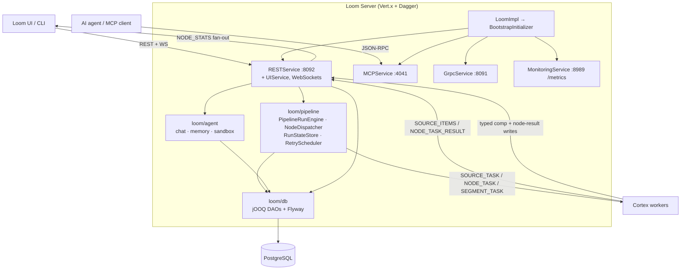

# MetaLoom // Loom Backend Service

**Entry point for the `loom/` component.** This file owns the *cross-cutting* view:
architecture, module layout, Dagger wiring, the startup order, and the Loom↔Cortex
split. Everything else is delegated — do not duplicate it here.

| Topic | Spec |
|---|---|
| Server startup, ports, health, CORS, Vert.x `HttpServer` | [SERVER.md](SERVER.md) |
| `LoomOptions`, YAML loading, env overrides, validation | [CONFIGURATION.md](CONFIGURATION.md) |
| REST endpoints, auth flows, CRUD patterns, OpenAPI | [RESTAPI.md](RESTAPI.md) |
| Domain entities derived from the migrations | [DOMAIN.md](DOMAIN.md) |
| jOOQ DAOs, Flyway migrations, DAO test infrastructure | [PERSISTENCE.md](PERSISTENCE.md) · [PERSISTENCE_TASKS.md](../tasks/PERSISTENCE_TASKS.md) |
| Processor WS + pipeline-events WS protocols | [WEBSOCKET.md](WEBSOCKET.md) |
| Event bus systems and WS fan-out | [EVENTBUS.md](EVENTBUS.md) |
| MCP server (JSON-RPC over HTTP+SSE/WS) | [MCP.md](MCP.md) |
| gRPC / GraphQL surfaces | [GRPC.md](GRPC.md) · [GRAPHQL.md](GRAPHQL.md) |
| Build pipeline | [BUILD.md](BUILD.md) |
| Chat agent, memory, coding sandbox | [ui/CHAT.md](ui/CHAT.md) · [../features/chat/CHAT_MEMORY_PLAN.md](../features/chat/CHAT_MEMORY_PLAN.md) |
| Pipeline execution engine + Loom↔Cortex protocol | [../features/pipeline/PIPELINE.md](../features/pipeline/PIPELINE.md) |
| Permissions / RBAC | [../features/permissions/PERMISSIONS.md](../features/permissions/PERMISSIONS.md) · [../features/rbac/RBAC.md](../features/rbac/RBAC.md) |
| Search & similarity | [../features/search/SEARCH.md](../features/search/SEARCH.md) · [SEARCH_LUCENE.md](SEARCH_LUCENE.md) |
| UI | [ui/LOOM_UI.md](ui/LOOM_UI.md) · [ui/PIPELINE_EDITOR.md](ui/PIPELINE_EDITOR.md) |

---

## 1. What Loom Is

Loom is the **backend service** of MetaLoom (a DAM system). It owns the only database
and every stateful decision. Cortex owns none.

| Concern | Loom | Cortex |
|---|---|---|
| PostgreSQL database | ✅ sole owner | ❌ no DB access |
| Pipeline graph, run state, retries, dispatch | ✅ `loom/pipeline` (`PipelineRunEngine`) | ❌ executes single tasks only |
| Media processing (hash, thumbnail, ASR, detection …) | ❌ | ✅ worker nodes |
| REST / gRPC / GraphQL / MCP / WebSocket surfaces | ✅ | ❌ (client only) |
| AuthN/AuthZ, users, groups, roles, permissions | ✅ | ❌ |
| AI chat agent, memory bank, coding sandbox | ✅ `loom/agent` | ❌ |

> 🔴 **Variant C.** Loom parses the pipeline definition into a `PipelineGraph` and
> dispatches one `NODE_TASK` (or `SEGMENT_TASK`) per item per node. Cortex is a dumb
> executor. Older text describing Cortex as owning `PipelineManager` +
> `ReactivePipelineExecutor` describes the *legacy* in-worker path that still exists in
> `cortex/pipeline-core` but is no longer how a Loom-triggered run works — see
> [PIPELINE.md §12](../features/pipeline/PIPELINE.md).

### 1.1 Architecture



---

## 2. Module Layout

### 2.1 `loom/` (Maven modules, in `loom/pom.xml` order)

| Module | Purpose |
|---|---|
| `common` | Shared utilities, Vert.x setup, Dagger `VertxModule`/`LoomModule`, `LoomOptionsLoader` |
| `pipeline` | **Loom-side pipeline engine** — `engine/` (`PipelineRunEngine`, `NodeDispatcher`, `RunStateStore`, `RetryScheduler`, `NodeKindCircuitBreaker`, `AssetSink`, `ItemState`, `RunSummary`) and `graph/` (`PipelineGraphParser`, `PipelineGraph`, `PipelineSegmenter`, `AffinityValidator`, `PortGraphAnalyzer`) |
| `db/api` | DAO + model interfaces, `Element`/`CRUDDao`/`DaoCollection` |
| `db/api-test` | Contract test infra (`CRUDDaoTestcases`, `DatabaseTest`) |
| `db/jooq` | jOOQ DAO implementations + `generate.sh` |
| `db/jooq-gen` | Codegen strategy (`LoomJooqStrategy`, prefixes generated types with `Jooq`) |
| `db/flyway` | SQL migrations (`V1__`, `V2.*__`) |
| `db/memory` | In-memory DAO impl for fast tests (⚠️ no pipeline DAOs) |
| `services/api` | Service-layer interfaces (currently just `AuthenticationService`) |
| `services/rest` | REST endpoints, both WebSockets, `RESTService`, `UIService`, `AssetPipelineTrigger`, `RunStatsAggregator` |
| `services/auth` | `auth-common`, `auth-jwt` (real); `auth-keycloak`, `auth-auth0`, `auth-okta` (empty) |
| `services/grpc` | `GrpcService` (started by bootstrap) |
| `services/graphql` | GraphQL service; `GraphQLEndpoint` **is** registered at `/api/v1/graphql` |
| `services/mcp` | MCP server |
| `services/monitoring` | `MonitoringService` + `MicrometerLoomMetrics`, Prometheus `/metrics` |
| `services/image`, `services/video` | Image/video processing helpers |
| `services/fs`, `services/s3` | `BinaryStorage` SPI — filesystem and S3 implementations |
| `services/tika` | Apache Tika metadata extraction |
| `services/plugins` | Plugin system |
| `services/logger` | Logging helper |
| `services/elasticsearch`, `services/lucene`, `services/qdrant`, `services/eventbus` | ⚠️ **`pom.xml` only, no `src/`** |
| `agent/chat` | Agentic loop, `AgentService`, SSE chat streaming, skills |
| `agent/memory` | Scoped markdown memory bank + memory tools |
| `agent/sandbox` | Coding sandbox orchestrator (podman/kubernetes) + `SandboxReaper` |
| `core` | `LoomImpl`, `BootstrapInitializer`, `DatabaseInitializer`, `DemoDatabaseInitializer`, `LoomCoreComponent` |
| `fixture` | `PoolSetupRunner`, test fixtures |
| `containers` | `server/` and `demo/` container definitions |
| `doc` | AsciiDoc source + OpenAPI generator |

**Not Maven modules** (directories only): `agent/session-runner` (Python `runnerd.py` +
`Containerfile` for the per-chat Session Runner image), `agent/deploy` (k8s pod template
+ RBAC notes), `design/` (dbdiagram artefacts), `helm/` (README stub — the real charts
are the top-level `helm/loom` and `helm/cortex`), `io/` (⚠️ stray misplaced sources).

> ⚠️ `loom/cli` **does not exist**. The CLI is the top-level `cli/` module —
> [../features/cli/CLI_PLAN.md](../features/cli/CLI_PLAN.md).

### 2.2 Shared modules (outside `loom/`)

| Module | Purpose |
|---|---|
| `loom-shared/api` | `Loom`, `LoomEnv`, and all `*Options` classes |
| `loom-shared/node-model` | Node/result model shared by Loom and Cortex |
| `loom-shared/pipeline-model` | `NodeTask`, `NodeTaskResult(Batch)`, `SegmentTask(Result)`, `PortPayload`, `Origin` |
| `loom-shared/rest-model` | REST DTOs incl. `ProcessorMessageType`, `PipelineEventType` |
| `loom-shared/rest-model-test` | AssertJ assertions for the REST model |
| `loom-shared/proto` | Protobuf/gRPC definitions |
| `loom-client/common` | `ClientMethods`, `PipelineMethods` |
| `loom-client/rest` | `LoomHttpClient` |
| `loom-client/report` | Client-side reporting helpers |
| `loom-client/grpc` | ⚠️ commented out in `loom-client/pom.xml` |
| `loom-test-env` | DB pool leasing, JUnit 5 extensions |

---

## 3. Server Lifecycle

`LoomImpl.run(block)` → `DaggerLoomCoreComponent.builder().configuration(lookup).build()`
→ `boot().init(true)`. Full detail in [SERVER.md](SERVER.md); the authoritative order is
`BootstrapInitializer`:

| # | Step | Failure behaviour |
|---|---|---|
| 1 | `flyway.migrate()` (only when `init(true)`) | fatal |
| 2 | `DatabaseInitializer.init()` — admin user, `admins` group, `admin-role`, permissions | fatal |
| 3 | `DemoDatabaseInitializer.init()` | **non-fatal**, logs a warning |
| 4 | `restService.start()` | fatal |
| 5 | `uiService.start()` | fatal |
| 6 | `assetPipelineTrigger.register()` | fatal |
| 7 | `httpServer.listen()` | fatal |
| 8 | `mcpService.start()` | fatal |
| 9 | `monitoringService.start()` | fatal |
| 10 | `grpcService.start()` | fatal |
| 11 | `sandboxReaper.start()` | **non-fatal**, logs a warning |

`deinit()` reverses it: `sandboxReaper → monitoring → mcp → rest → grpc`, then **closes
`httpServer` explicitly** — stopping the services only unregisters handlers, so without
that close a test suite's second boot fails with `Address already in use`.

⚠️ `authService.init()` is commented out in `init()`.

---

## 4. Dagger DI

`LoomCoreComponent` (`io.metaloom.loom.core.dagger`, `@Singleton`) is built with a single
`@BindsInstance LoomOptionsLookup`. It exposes `daos()`, `boot()`, `agentService()`,
`authService()`, `grpcService()`.

| Module | Provides |
|---|---|
| `VertxModule` | Vert.x instance, RxJava-3 `EventBus` |
| `LoomModule` | `LoomOptions` + `DatabaseOptions` from the lookup |
| `AuthModule` (auth-jwt) / `AuthBindModule` (core) | JWT provider; binds `AuthenticationServiceImpl`, `LoomJWTAuthHandlerImpl` |
| `FlywayModule` | `Flyway` |
| `JooqModule`, `JooqLoomDaoBindModule`, `DBBindModule` | DSL context, jOOQ DAO bindings, `DaoCollection` |
| `EndpointModule` | `Set<RESTEndpoint>` (`@ElementsIntoSet`) |
| `RESTModule`, `RESTBindModule` | Router, `HttpServer`, REST service bindings |
| `MCPModule`, `MCPToolModule` | `"mcpRouter"`, `Set<MCPTool>` |
| `MonitoringModule` | Micrometer registry, `MonitoringService` |
| `MemoryModule`, `MemoryToolModule`, `SandboxModule`, `ChatEndpointModule` | Agent subsystem |
| `RoutingContextModule` | Declares the `RestComponent` subcomponent |
| `SearchModule` | Binds `SearchProvider`/`SearchIndexer` from `LOOM_SEARCH_PROVIDER` |
| `SimilarityModule` | Binds `SimilarityIndex` (Lucene k-NN) |

Per-request scope: `restComponentProvider.get().context(rc).build()` creates a
`RestComponent` for each routing context.

> 🔴 `SearchModule` and `SimilarityModule` **must never fail boot**. If the configured
> provider cannot be constructed they log and bind `NoopSearchProvider` /
> `NoopSimilarityIndex`; the feature routes answer 503 with a named reason while every
> other route keeps working.

---

## 5. Configuration (summary)

`LoomOptionsLoader.createOrLoadOptions()` — YAML file → env overrides
(`@EnvironmentVariable` + `overrideWithEnv()`) → code defaults. `LoomOptions` sections:
`database`, `server`, `auth`, `storage`, `s3`, `ai`, `sandbox`, `memory`, `search`,
`similarity`. **Full tables in [CONFIGURATION.md](CONFIGURATION.md).**

Core server/database variables only:

| Variable | Description | Default |
|---|---|---|
| `LOOM_DB_HOST` / `LOOM_DB_PORT` | Database host / port | `127.0.0.1` / `5432` |
| `LOOM_DB_USERNAME` / `LOOM_DB_PASSWORD` | Credentials | `postgres` / `finger` |
| `LOOM_DB_NAME` | Database name | `loom` |
| `LOOM_DB_MIN_POOL_SIZE` / `LOOM_DB_MAX_POOL_SIZE` | Connection pool bounds | `5` / `20` |
| `LOOM_SERVER_REST_PORT` | REST + UI + WebSockets | `8092` |
| `LOOM_SERVER_GRPC_PORT` | gRPC | `8091` |
| `LOOM_SERVER_MON_PORT` | Monitoring / Prometheus `/metrics` | `8989` |
| `LOOM_SERVER_MCP_PORT` | MCP | `4041` |
| `LOOM_SERVER_GRPC_BIND_ADDRESS` | Bind address for **all** servers | `0.0.0.0` |
| `LOOM_INITIAL_PASSWORD` | Initial admin password | (none) |
| `LOOM_TOKEN_EXPIRATION_TIME` | JWT expiry (seconds) | `3600` |
| `LOOM_WS_STRICT_AUTH` | Reject untokenised WebSocket upgrades | `false` |
| `LOOM_MCP_AUTH_ENABLED` / `LOOM_MCP_AUTH_STRICT_MODE` | MCP authentication | see [MCP.md](MCP.md) |
| `LOOM_SEARCH_ENABLED` / `LOOM_SEARCH_PROVIDER` | Search backend | see [SEARCH.md](../features/search/SEARCH.md) |
| `LOOM_SIMILARITY_ENABLED` | Fingerprint k-NN index | see [SEARCH_LUCENE.md](SEARCH_LUCENE.md) |
| `LOOM_AI_*`, `LOOM_AGENT_SANDBOX_*`, `LOOM_AGENT_MEMORY_*` | Chat agent, sandbox, memory | see [ui/CHAT.md](ui/CHAT.md) |
| `LOOM_STORAGE_*`, `LOOM_S3_*` | Binary storage | see [../features/rest/REST_BINARY_HANDLING.md](../features/rest/REST_BINARY_HANDLING.md) |

⚠️ `ServerOptions.validate()` rejects two servers sharing a port — a real failure mode
since all four bind the same address.

---

## 6. Auth (summary)

Only **JWT** is implemented in a dedicated module (`services/auth/auth-jwt`);
`auth-keycloak`, `auth-auth0` and `auth-okta` are empty shells and the OAuth2 BFF flow
(PKCE, callback, logout) lives in `OAuth2Endpoint` in `services/rest` and is driven by
`LOOM_OAUTH2_*`. Login sets an `HttpOnly; Secure; SameSite=STRICT` cookie
`__Host-loom_token`; WebSockets pass `?token=<jwt>`.

Authorization: `lrc.requirePerm(Permission…)` over Vert.x `PermissionBasedAuthorization`.
Users → groups → roles → permissions; **there is no direct user→role binding**, and the
`resource` column is stored but not enforced. Details:
[RESTAPI.md](RESTAPI.md), [../features/permissions/PERMISSIONS.md](../features/permissions/PERMISSIONS.md).

---

## 7. REST Surface Index

All endpoints are `@ElementsIntoSet`-collected in
`io.metaloom.loom.rest.dagger.EndpointModule` and mounted under `/api/v1`. Contracts,
permissions and DTOs live in [RESTAPI.md](RESTAPI.md); this is only a locator.

| Area | Base paths |
|---|---|
| Identity | `/users` `/roles` `/groups` `/persons` `/me` `/login` `/tokens` `/auth/oauth2` |
| Organisation | `/spaces` `/libraries` `/collections` `/tags` `/tasks` |
| Assets | `/assets` `/assets/:assetUuid/components` `/binaries` `/pools` `/attachments` |
| Collaboration | `/comments` `/annotations` `/reactions` `/blacklists` |
| AI / ML | `/chats` `/skills` `/clusters` `/embeddings` `/dedup-groups` `/similarity-index` `/search` |
| Pipeline | `/pipelines` `/pipelines/events` (WS) `/pipeline/node-descriptors` `/processors` (+ `/processors/ws`) |
| Platform | `/health` `/graphql` (+ root REST info endpoint) |

Prometheus metrics are **not** on the REST port — they are served by
`MonitoringService` at `GET /metrics` on `LOOM_SERVER_MON_PORT`.

---

## 8. Loom ↔ Cortex

Cortex workers connect to `GET /api/v1/processors/ws?token=<jwt>` (validated
post-upgrade by `WebSocketAuthenticator`) and exchange `ProcessorMessage { type, body }`
envelopes typed by `ProcessorMessageType`:

| Direction | Messages |
|---|---|
| Cortex → Loom | `REGISTER`, `HEARTBEAT` (10 s), `STATUS_UPDATE` (20 s), `STATE_CHANGE`, `SOURCE_ITEMS`, `SOURCE_COMPLETE`, `NODE_TASK_RESULT`, `NODE_TASK_RESULT_BATCH`, `SEGMENT_TASK_RESULT`, `TASK_RETURNED`, `PIPELINE_RUN_COMPLETED`, `PIPELINE_EVENT` |
| Loom → Cortex | `REGISTERED`, `HEARTBEAT_ACK`, `SOURCE_TASK`, `SOURCE_ITEMS_ACK`, `NODE_TASK`, `SEGMENT_TASK`, `ERROR` |

> ⚠️ `PIPELINE_EVENT` is **accepted and silently dropped**. Under Variant C the UI feed is
> produced by `RunStatsAggregator`, which counts per node and pushes `NODE_STATS` on a
> timer (failures released immediately). The type is retained only so an older worker's
> frames are recognised rather than answered with a per-item error.

Result data reaches the database by the node **calling the REST API from inside its own
`compute()`** — writing its typed asset component plus an `asset_node_result` ledger row.
There is no sink node; the old batching `loom` node was removed.
`LoomBulkSyncCollector` still exists in `cortex/pipeline-api` and is used by the legacy
in-worker path, not by a Loom-dispatched run.

Protocol, run flow, retries, segmentation and the known defects (e.g. the
`dependencies[]` vs `edges[]` mismatch, stub node kinds) are specified in
[PIPELINE.md §12](../features/pipeline/PIPELINE.md); node inventory in
[../features/pipeline-nodes/NODES.md](../features/nodes/NODES.md).

---

## 9. Test Setup

```bash
./setup-pool.sh        # mvn exec:java -pl loom/fixture -Dexec.mainClass=io.metaloom.loom.test.PoolSetupRunner
cd loom && mvn clean install -DskipTests
mvn verify             # integration tests, requires the test DB
```

🔴 Re-run `./setup-pool.sh` **after every Flyway change**, and install `loom/db/flyway`
first — otherwise the pooled databases are provisioned from a stale jar and the new
migration is silently skipped.

| Layer | Base class / extension | Location |
|---|---|---|
| DAO contract | `CRUDDaoTestcases`, `DatabaseTest` | `loom/db/api-test` |
| Endpoint / in-process boot | `AbstractEndpointTest`, `LoomCoreTestExtension` | `loom/core/src/test` |
| Integration (real container) | `AbstractIntegrationTest`, `LoomExtensionHelper` | `integration-test/` |
| Browser E2E | `E2ETest` | `e2e-test/` |
| Pool provisioning | `PoolSetupRunner`, `LoomProviderExtension` | `loom/fixture`, `loom-test-env` |

Pipeline-node test patterns are in
[PIPELINE.md §14](../features/pipeline/PIPELINE.md); DAO/migration testing in
[PERSISTENCE.md](PERSISTENCE.md); the definition of done for any code change is
[../guidelines/CODING.md](../guidelines/CODING.md).

---

## 10. Key Classes Reference

| Class | Package | Purpose |
|---|---|---|
| `LoomImpl` | `io.metaloom.loom.core` | Entry point; builds the Dagger component, blocks on a latch |
| `LoomCoreComponent` | `io.metaloom.loom.core.dagger` | Root `@Singleton` component |
| `BootstrapInitializer` | `io.metaloom.loom.core.boot` | Startup/shutdown order (§3) |
| `DatabaseInitializer` | `io.metaloom.loom.core.boot` | Admin user, `admins` group, `admin-role`, permissions |
| `DemoDatabaseInitializer` | `io.metaloom.loom.core.boot` | Demo data — **extend it when adding a feature** |
| `DemoMediaLibrary` | `io.metaloom.loom.core.boot` | Reads `demo-content/` for the initializer; absent directory ⇒ painted images |
| `SearchModule` / `SimilarityModule` | `io.metaloom.loom.core.dagger` | Fail-soft capability binding |
| `LoomOptionsLoader` | `io.metaloom.loom.common.options` | YAML + env option loading |
| `LoomOptions`, `ServerOptions` | `io.metaloom.loom.api.options` | Config root and port/bind settings |
| `RESTService` / `UIService` | `io.metaloom.loom.rest` | Router + endpoint registration; static UI |
| `EndpointModule` | `io.metaloom.loom.rest.dagger` | The `Set<RESTEndpoint>` — add new endpoints here |
| `RestComponent` | `io.metaloom.loom.rest.dagger` | Per-request DI subcomponent |
| `AssetPipelineTrigger` | `io.metaloom.loom.rest.service.impl` | Auto-dispatches a run on asset creation |
| `RunStatsAggregator` | `io.metaloom.loom.rest.service.impl` | Per-node counters → `NODE_STATS` UI events |
| `WebSocketAuthenticator` | `io.metaloom.loom.rest.service.impl` | Post-upgrade token validation |
| `PipelineRunEngine` | `io.metaloom.loom.pipeline.engine` | Owns run state; walks the graph, dispatches tasks |
| `NodeDispatcher`, `RetryScheduler`, `RunStateStore` | `io.metaloom.loom.pipeline.engine` | Dispatch, retry, persisted run state |
| `PipelineGraphParser`, `PipelineSegmenter` | `io.metaloom.loom.pipeline.graph` | Definition → executable graph; affinity segmentation |
| `MCPService` | `io.metaloom.loom.mcp` | MCP server |
| `MonitoringService` | `io.metaloom.loom.monitoring` | Prometheus `/metrics` on the monitoring port |
| `GrpcService` | `io.metaloom.loom.server.grpc` | gRPC server |
| `AuthenticationService`, `LoomAuthenticationHandler` | `io.metaloom.loom.auth` | Auth SPI (JWT impls in `…auth.jwt`) |
| `AgentService` | `io.metaloom.loom.agent.chat` | Chat agentic loop |
| `SandboxReaper` | `io.metaloom.loom.agent.sandbox` | Reaps idle Session Runners |
| `BinaryStorage` | `io.metaloom.loom.storage` | Binary storage SPI (`fs` + `s3` impls) |
| `ProcessorMessageType` | `io.metaloom.loom.rest.model.processor.message` | Processor WS message vocabulary |

---

## 11. Conventions and Gotchas

- **REST paths are plural** (`/users`, `/assets`). Sub-resources hang off the parent
  (`/assets/:assetUuid/components`).
- **Adding an endpoint means editing `EndpointModule`** — a `RESTEndpoint` that is not in
  that `Set` is never routed, with no error anywhere.
- **Constructor changes on an endpoint require a clean rebuild of `loom/core`**, or
  `setup-pool.sh` and the tests fail with `NoSuchMethodError` from stale Dagger factories.
- **Don't redeclare `@RegisterExtension LoomCoreTestExtension`** in a subclass of
  `AbstractEndpointTest`; configure the inherited `loom` field instead.
- **`loom/db/memory` has no pipeline DAOs** — pipeline tests need the real database.
- **A 20+ method test class exhausts the provider pool**; the last methods erroring in
  `ProviderExtension.beforeEach` while passing in isolation is capacity, not a regression.
- **`user_permission` allows one direct grant per user** — grant test permissions via
  group + role.
- **jOOQ regeneration is not automatic**: after a Flyway change run
  `loom/db/jooq/generate.sh`; converters are configured as `forcedTypes` in that pom.
- **Four servers, one bind address.** REST/UI/WebSockets share `8092`; gRPC, monitoring
  and MCP each have their own port and `ServerOptions.validate()` rejects collisions.
- **Empty modules are real modules.** `elasticsearch`, `lucene`, `qdrant`, `eventbus`,
  `auth-keycloak`, `auth-auth0`, `auth-okta` build to empty jars — finding the module
  is not evidence the feature exists.
- **`loom/io/` is misplaced source** (`io/metaloom/loom/test/...` at the wrong depth),
  not a module. Don't extend it.
- **Capabilities must not break boot.** Follow the `SearchModule` pattern: log, bind a
  Noop, answer 503 on the feature's own routes.

---

## 12. Where do I find …?

| Concept | Path |
|---|---|
| Startup order | `loom/core/src/main/java/io/metaloom/loom/core/boot/BootstrapInitializer.java` |
| Dagger graph root | `loom/core/src/main/java/io/metaloom/loom/core/dagger/LoomCoreComponent.java` |
| Endpoint registration | `loom/services/rest/src/main/java/io/metaloom/loom/rest/dagger/EndpointModule.java` |
| Endpoint implementations | `loom/services/rest/src/main/java/io/metaloom/loom/rest/endpoint/impl/` |
| Router, CORS, body handler | `loom/services/rest/src/main/java/io/metaloom/loom/rest/RESTService.java` |
| Options + env annotations | `loom-shared/api/src/main/java/io/metaloom/loom/api/options/` |
| Option loading | `loom/common/src/main/java/io/metaloom/loom/common/options/LoomOptionsLoader.java` |
| Pipeline engine / graph | `loom/pipeline/src/main/java/io/metaloom/loom/pipeline/{engine,graph}/` |
| Processor WS protocol enum | `loom-shared/rest-model/…/rest/model/processor/message/ProcessorMessageType.java` |
| Task/result wire model | `loom-shared/pipeline-model/src/main/java/io/metaloom/loom/pipeline/model/` |
| DAO interfaces / jOOQ impls | `loom/db/api/` · `loom/db/jooq/` |
| Flyway migrations | `loom/db/flyway/src/main/resources/db/migration/` |
| Demo data | `loom/core/src/main/java/io/metaloom/loom/core/boot/DemoDatabaseInitializer.java` |
| Demo media | `demo-content/` (container: `/demo-content`, `LOOM_DEMO_CONTENT_DIR`) |
| Agent chat / memory / sandbox | `loom/agent/{chat,memory,sandbox}/src/main/java/io/metaloom/loom/agent/` |
| Session Runner image | `loom/agent/session-runner/{runnerd.py,Containerfile}` |
| Binary storage | `loom/services/fs/…/storage/` · `loom/services/s3/…/storage/s3/` |
| Container builds | `loom/containers/{server,demo}/` |
| Helm charts | top-level `helm/loom`, `helm/cortex` (**not** `loom/helm`) |
| CLI | top-level `cli/` |

---

## 13. Progress Assessment

### 13.1 Architecture and modules
- [x] `LoomImpl` + `BootstrapInitializer` lifecycle with explicit `httpServer.close()`
- [x] Dagger DI (`LoomCoreComponent`) with a per-request `RestComponent` subcomponent
- [x] REST + UI + WebSockets on one Vert.x server; gRPC, MCP and monitoring on their own
- [x] GraphQL endpoint registered at `/api/v1/graphql`
- [x] `GET /api/v1/health` and Prometheus `/metrics` on the monitoring port
- [x] Loom-side pipeline engine (`loom/pipeline`) — Variant C
- [x] AI agent subsystem split into `agent/{chat,memory,sandbox}`
- [x] Fail-soft capability binding for search and similarity
- [ ] Readiness probe distinct from `/health` liveness
- [ ] `services/{elasticsearch,lucene,qdrant,eventbus}` are empty placeholders
- [ ] `auth-keycloak` / `auth-auth0` / `auth-okta` are empty; OAuth2 lives in `services/rest`
- [ ] `loom/io/` stray sources should be moved or deleted
- [ ] `loom-client/grpc` is commented out of the reactor

### 13.2 Configuration
- [x] `LoomOptions` with 10 sections and `@EnvironmentVariable` overrides
- [x] MCP port configurable (`LOOM_SERVER_MCP_PORT`)
- [x] `validate()` collects errors incl. duplicate-port detection
- [ ] No dynamic reload (restart required)

### 13.3 Authentication
- [x] JWT cookie session, API tokens, per-endpoint permission checks
- [x] WebSocket auth via `?token=`; strict mode behind `LOOM_WS_STRICT_AUTH`
- [x] MCP authentication behind `LOOM_MCP_AUTH_ENABLED`
- [ ] No rate limiting or account lockout on login
- [ ] No token refresh or revocation endpoint

### 13.4 Entity management
- [x] CRUD for all primary entities + sub-resource pattern
- [x] Bulk asset operations, SHA-512 lookup, asset components + node-result ledger
- [x] Pipeline CRUD, run dispatch, processor registry with durable `cortex_instance` rows
- [ ] Soft delete only on `UserDao`
- [ ] No audit log, no bulk delete, no entity export/import

### 13.5 Loom↔Cortex
- [x] Processor WS with registration, heartbeat, source/node/segment tasks, `TASK_RETURNED`
- [x] `RunStatsAggregator` → `NODE_STATS` fan-out instead of per-item event relay
- [x] Retry scheduling and node-kind circuit breaking in the engine
- [ ] No heartbeat-timeout / idle detection on processor connections
- [ ] Processor selection capability is hardcoded to `CPU`
- [ ] Only a minority of node kinds are registered in Cortex's `RegistryNodeFactory`;
      the rest resolve to a silently-succeeding stub (see [PIPELINE.md §12.4](../features/pipeline/PIPELINE.md))

### 13.6 Testing
- [x] Pooled test DB + `PoolSetupRunner`, DAO contract tests, in-process boot extension
- [x] Per-node integration tests and distributed/affinity pipeline ITs in `integration-test/`
- [x] Browser E2E in `e2e-test/`
- [ ] No OAuth2 flow tests
- [ ] No rate-limiting tests

### 13.7 Documentation coverage
- [x] `SERVER.md`, `CONFIGURATION.md`, `GRAPHQL.md`, `GRPC.md` are written (no longer stubs)
- [ ] No spec for `services/image` and `services/video`
- [ ] No spec for `services/plugins`
- [ ] No spec for `services/tika`
- [ ] No spec for `loom/containers`
- [ ] No spec for `services/logger`

---
_Git HEAD revision: `742dae2d`_
_Last updated: 2026-08-06 (reference sweep — no content changes)_