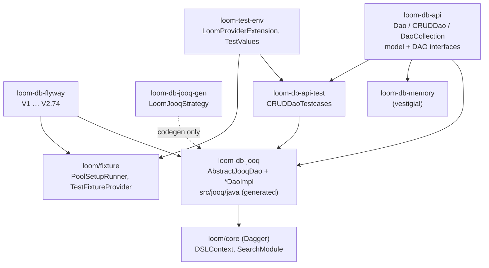

# Loom Persistence Layer

How Loom talks to PostgreSQL: the DAO contracts, the jOOQ implementation, the Flyway migration
chain and the test setup. **What** the entities mean is in [DOMAIN.md](DOMAIN.md); **open gaps and
their work items** are in [PERSISTENCE_TASKS.md](../tasks/PERSISTENCE_TASKS.md) and
[../features/db/DATABASE_TASKS.md](../features/db/DATABASE_TASKS.md). This file does not repeat
either.

Related: [../guidelines/CODING.md](../guidelines/CODING.md) (definition of done: DAO test +
delete-cascade test per entity) · [RESTAPI.md](RESTAPI.md) · [CONFIGURATION.md](CONFIGURATION.md) ·
[../features/permissions/PERMISSIONS.md](../features/permissions/PERMISSIONS.md) ·
[../features/search/SEARCH.md](../features/search/SEARCH.md)

## Modules

| Module (`loom/db/…`) | Artifact | Contains |
|---|---|---|
| `api` | `loom-db-api` | `Element`/`CUDElement`/`MetaElement`, `Dao`, `CRUDDao`, `Page`, model + DAO interfaces, `dagger/DaoCollection`, `DaoCollectionImpl`, `DaoProvider` |
| `api-test` | `loom-db-api-test` | `CRUDDaoTestcases`, `DatabaseTest`, `FixtureElementProvider` (3 classes, in `src/main`) |
| `flyway` | `loom-db-flyway` | `db/migration/*.sql` + `FlywayHelper`, `FlywayLocalRunner`, `dagger/FlywayModule` |
| `jooq` | `loom-db-jooq` | `AbstractJooqDao`, `*DaoImpl`, `*Impl` POJOs (49), converters, `filter/LoomFilterKey`, `search/PostgresSearchProvider`, generated sources in `src/jooq/java` |
| `jooq-gen` | `loom-db-jooq-gen` | `LoomJooqStrategy` — prepends `Jooq` to every generated class name |
| `memory` | `loom-db-memory` | `AbstractMemDao` + only `MemUsersDaoImpl` / `MemTokenDaoImpl`. **Vestigial** — see Gotchas |



## Element hierarchy

```
Element<T extends Element<T>>      getUuid/setUuid, self()
  MetaElement<T>                   JsonObject meta
  CUDElement<T> (+MetaElement)     creatorUuid, editorUuid, created, edited
    AbstractElement                jOOQ base, no fields
    AbstractEditableElement        holds uuid + meta + audit fields (jOOQ maps by column name)
```

## DAO contracts

`CRUDDao<T extends Element<T>> extends Dao` — `delete(UUID)`, `delete(T)` (default),
`update(T)`, `load(UUID)`, `store(T)`, `storeBatch(List<T>)` (default loops `store`),
`loadPage(fromId, pageSize, filters, sortBy, sortDirection)`, `findAll()`.
`Dao` adds `getTypeName()`, `clear()`, `count()`.

**Not every DAO is a `CRUDDao`** — these break the pattern and therefore cannot use
`CRUDDaoTestcases`:

| DAO | Extends | Why |
|---|---|---|
| `AssetComponentDao` | `Dao` | One facade over 9 comp tables; per-modality `create/load/store/delete<X>Comp` methods |
| `DedupGroupDao` | `Dao` | Group + member rows with role semantics |
| `LoomDao` | `Dao` | Singleton row (`load`/`createLoom`/`update`) |
| `PermissionDao` | *(nothing)* | Grant/read only; no revoke API, no element type |

### `AbstractJooqDao<T>`

Implements `CRUDDao<T>` + `JooqDao`. Abstract: `getTable()`, `getPojoClass()` (plus `getTypeName()`
from `Dao`). Useful members:

| Member | Purpose |
|---|---|
| `ctx()` | injected `DSLContext` |
| `getIdField()` / `getUuidField()` | the table's `uuid` field |
| `pkSelect(pk)` | condition on the PK |
| `upsert(element, keyFields…)` | `INSERT … ON CONFLICT (keyFields) DO UPDATE`, **excludes `uuid`, `created`, `creator_uuid` and the key columns from the UPDATE set** so first-write provenance survives. This is the idempotent path used by all node-written component tables |
| `storeBatch()` | overridden to `batchInsert` + read back generated UUIDs |
| `applyFilter(query, filter)` | default handles the UUID filter; override per entity |
| `setCreatorEditor(element, userUuid)` | audit columns |
| `deleteCrossTableEntry(aField, a, bField, b)` | join-table row removal |
| `findByUUID(id)` | load without the DAO's own load-time filters |

### Concrete DAO pattern

1. `<Entity>` + `<Entity>Dao` interfaces in `loom-db-api` under `model/<entity>/`.
2. `<Entity>Impl extends AbstractEditableElement<Entity> implements Entity` in `loom-db-jooq` under
   `dao/<entity>/` — jOOQ maps columns to fields by name.
3. `<Entity>DaoImpl extends AbstractJooqDao<Entity>` — `@Singleton`, `@Inject` ctor taking
   `DSLContext`, implements `getTable()`/`getPojoClass()`/`getTypeName()`, entity queries, and
   overrides `applyFilter()` / `load()` where needed.
4. Register in `DaoCollection` → `DaoCollectionImpl` (`Lazy<>` field + ctor param + accessor) →
   `DaoProvider` default delegate.

`PipelineDaoImpl` / `PipelineDaoTest` are the canonical reference pair.

### jOOQ code generation

Run **`loom/db/jooq/generate.sh`** (the plugin goals of the `generate` profile: Testcontainers
Postgres → Flyway migrate from `../flyway/…/db/migration` → `jooq-codegen:generate`). Generated
package `io.metaloom.loom.db.jooq`, output `src/jooq/java` (added as a source root by
`build-helper`), `<daos>false</daos>`, schema `public`.

Codegen writes into `target/jooq-codegen` first — the script overrides the pom's
`jooq.output.dir` — and only replaces `src/jooq/java` once it has succeeded. A failing migration
or codegen step therefore leaves the checked-in sources untouched instead of deleting them.
⚠️ New converter classes referenced from `<forcedTypes>` must be **compiled** (`mvn compile -pl
loom/db/jooq`) before running it, or the plugin cannot load them.

Codegen configuration that matters (all in `loom/db/jooq/pom.xml`):

| Setting | Value | Why |
|---|---|---|
| `strategy` | `LoomJooqStrategy` | `JooqUser`, `JooqAsset`, … |
| `excludes` + `includeExcludeColumns=true` | `.*\.text_search.*\|.*\.trgm_text` | `GENERATED ALWAYS AS … STORED` tsvector/trigram columns must never appear in an INSERT/UPDATE, and jOOQ has no tsvector binding. `includeExcludeColumns` is **required** — excludes apply to tables, not columns, by default |
| `forcedType` → `JsonObjectConverter` | `.*\.meta.*\|.*\.outputs\|.*\.definition\|.*\.result_ref` | Vert.x `JsonObject` ⇄ `JSONB` |
| `forcedType` → `JsonArrayConverter` | `chat\.messages` | the chat transcript is a JSON **array**, not an object |
| `forcedType` → `PipelineRunStatusConverter` / `NodeTaskStateConverter` / `RunItemStateConverter` | `pipeline_run\.status`, `pipeline_node_task\.state`, `pipeline_run_item\.state` | The columns stay `VARCHAR` — a Postgres enum needs a migration per value — so the vocabulary is enforced in Java. The converter is the **only** boundary a bad string can be caught at, and it rejects one naming the column and the value rather than passing it to the UI |

Excluded columns are addressed by name at runtime via `DSL.field(...)` (see `PostgresSearchProvider`
and `AssetComponentDaoImpl`).

### Filters

`LoomFilterKey` currently defines exactly two keys: `USER_USERNAME` (`StringFilterKey "username"`)
and `FILE_SIZE` (`SizeFilterKey "size"`). Add new keys there and handle them in the DAO's
`applyFilter()` override, falling back to `super.applyFilter()`.

## Flyway migrations

`loom/db/flyway/src/main/resources/db/migration/` — PostgreSQL only, `validateMigrationNaming=true`.
There is **no `V2.4`**; the chain is `V1`, `V2.1`–`V2.3`, `V2.5`–`V2.74`.

| Migration | Change |
|---|---|
| `V1__db_setup` | `loom` schema, `uuid-ossp` extension |
| `V2.1__add_acl` | user, token, role, group, `*_permission` + `loom_permission` enum |
| `V2.2__add_tag` | tag, tag_user_meta |
| `V2.3__add_workflow` | task + `task_status` enum |
| `V2.5__add_loom` | singleton `loom` row + `loom_events` enum |
| `V2.6__add_vector_config` | vector_config |
| `V2.7__add_collection` | collection, tag_collection, collection_cluster |
| `V2.8__add_asset` | asset + asset_remix, collection_asset, tag_asset, asset_user_meta, asset_task |
| `V2.9__add_library` | library, library_asset, library_collection |
| `V2.10__add_asset_location` | asset_location |
| `V2.11__add_project` | project (+library/collection joins) — exposed as *Space* |
| `V2.12__add_embedding` | embedding, cluster, tag_cluster, embedding_cluster |
| `V2.13__add_attachment` | attachment, attachment_binary |
| `V2.14__add_blacklist` | blacklist |
| `V2.15__add_webhook` | webhook — **dropped again by V2.55** |
| `V2.16__add_annotation` | annotation + task/asset/tag joins |
| `V2.17__add_social` | comment, reaction |
| `V2.18__add_asset_components` | geo/doc/image/video/audio/transcript comps |
| `V2.19__add_pipeline` | pipeline + pipeline permissions |
| `V2.20__add_asset_pool` | asset_pool (fs_path XOR s3_bucket, CHECK) + `asset_location.pool_uuid` |
| `V2.21__add_pool_binary_permissions` | binary/pool permissions |
| `V2.22__rename_project_permissions_to_space` | `*_PROJECT` → `*_SPACE` |
| `V2.23__add_asset_json_comp` | generic JSON component sink |
| `V2.24__add_asset_pool_free_space` | free_space / used_space |
| `V2.25__add_blacklist_and_person_permissions` | permissions |
| `V2.26__add_person` | person, person_image |
| `V2.27__add_detection` | detection + permissions |
| `V2.28__add_chat` | chat + permissions |
| `V2.29__add_pipeline_run` | pipeline_run + `*_PIPELINE_RUN` |
| `V2.30__add_pipeline_version` | pipeline_version; name/definition/enabled/priority/dry_run move off `pipeline` |
| `V2.31__add_pipeline_execution_state` | pipeline_run_item, pipeline_node_task (leases, retries, idempotency) |
| `V2.32__add_pipeline_run_item_path_index` | index on `pipeline_run_item.media_path` |
| `V2.33__add_cortex_instance` | cortex_instance + cortex_instance_node_kind + `MANAGE/READ_CORTEX_INSTANCE` |
| `V2.34__add_task_priority` | `task.priority` + `task_priority` enum |
| `V2.35__add_task_delete_cascade` | cascade comment/reaction → task, comment |
| `V2.36__add_skill` | skill + `*_SKILL` |
| `V2.37__add_skill_version` | skill_version; description/content move off `skill` |
| `V2.38__rework_asset_components` | geo/doc/image/video/audio onto the shared component contract (provenance, per-table idempotency key, nullable audit) |
| `V2.39__rework_asset_transcript_comp` | per-track FK, `lang` in the key, generated `tsvector` FTS column |
| `V2.40__rework_asset_json_comp` | `schema_type NOT NULL`, `variant`, GIN on `data` |
| `V2.41__add_asset_fingerprint_comp` | multi-sector perceptual fingerprint |
| `V2.42__add_asset_segment_comp` | time-ranged segments (scenes/silence/shots/chapters) |
| `V2.43__rework_detection_embedding` | provenance + idempotency keys, `embedding.detection_uuid`, one geometry convention, cascade on `detection.asset_uuid` |
| `V2.44__attachment_provenance` | attachment becomes the derived-binary sink (node provenance, `variant`, cascade) |
| `V2.45__add_asset_node_result` | `asset_node_result` per-asset processing ledger |
| `V2.46__asset_identity` | `asset.uuid` → PK, `sha512sum NOT NULL UNIQUE`, `is_complete`, legacy inline S3 columns dropped |
| `V2.47__machine_written_audit_columns` | nullable `creator_uuid`/`editor_uuid` on `attachment` |
| `V2.48__fix_asset_location_key_and_annotation_cascade` | real key `(library_uuid, path)`; reaction/comment → annotation cascade |
| `V2.49__version_pointer_delete_behaviour` | `pipeline.latest_version_uuid` / `skill.active_version_uuid` → `ON DELETE SET NULL` |
| `V2.50__add_blacklist_name` | `blacklist.name` |
| `V2.51__add_embedding_cluster_delete_cascade` | `embedding_cluster.cluster_uuid` → `ON DELETE CASCADE` (a cluster with members could not be deleted at all) |
| `V2.52__add_chat_session` | chat_session + chat_session_skill + chat_session_context_ref |
| `V2.53__add_agent_memory` | memory_entry + `chat.space_uuid` |
| `V2.54__add_memory_deny_rule` | memory_deny_rule (instance-wide denylist) |
| `V2.55__remove_webhook` | drops `webhook`, `loom_events`, rebuilds `loom_permission` without `*_WEBHOOK` |
| `V2.56__pipeline_run_paused_status` | documents `PAUSED` in `pipeline_run.status` (comment only, no CHECK) |
| `V2.77__normalize_pipeline_run_item_state` | rewrites `pipeline_run_item.state = 'FAILURE'` to `'FAILED'`. The engine's `ItemOutcome.FAILURE` was written through `name()`, so a failed item matched neither the terminal-state query nor any filter. Data only; the vocabulary is now enforced by `RunItemStateConverter` |
| `V2.57__add_search_permission` | `READ_SEARCH` enum value only |
| `V2.58__add_search_document` | `search_document` + `search_document_deleted` + per-entity refresh functions |
| `V2.59__add_search_triggers` | triggers wiring source tables → refresh functions + initial backfill |
| `V2.60__pipeline_node_task_element_seq` | `element_seq`; idempotency key becomes `(item_uuid, node_id, element_seq)` for port fan-out |
| `V2.61__add_dedup_group` | dedup_group + dedup_group_member + `dedup_status` enum |
| `V2.62__add_dedup_permission` | `READ/CREATE/UPDATE/DELETE_DEDUP` enum values only |
| `V2.63__library_storage_pool` | `library.pool_uuid` → asset_pool, `ON DELETE RESTRICT`, NULL = legacy local upload dir |
| `V2.69__add_task_assignee` | `task_assignee` — who is responsible for a task. One row per target, exactly one of `user_uuid`/`group_uuid` (CHECK `num_nonnulls = 1`). **No PK**: a PK cannot hold nullable columns, so uniqueness is two *partial* unique indexes, which is also what makes assign idempotent. Group membership is resolved on read, not snapshotted |
| `V2.74__asset_social_cascade` | `comment`, `reaction` and `library_asset` get `ON DELETE CASCADE` on their asset FK. Comments and reactions about an asset die with it - replies and comment reactions follow through the V2.35 cascades - and the asset leaves its libraries. Comments/reactions on tasks and annotations, and the library itself, are untouched. `library_asset.library_uuid` stays a plain reference so a library cannot be deleted out from under its assets |
| `V2.75__embedding_index_contract` | Makes `embedding` a system of record an external ANN index can be derived from: `dirty`/`synced_at`/`index_version` (the exporter contract, mirroring `search_document`), `normalized`, a `array_length(vector,1) = dimensions` CHECK, and **`model` added to the unique key**. Without the last one, re-running a node under a new embedding model upserted over the old model's row, making a model upgrade destructive and irreversible. Also rewrites the V2.43 `vector` column comment: ANN lives outside Postgres behind `VectorIndex`, so no `CREATE EXTENSION` is involved and nothing here can break `generate.sh` or `setup-pool.sh` |
| `V2.73__asset_link_cascade` | `collection_asset`, `asset_task` and `asset_user_meta` get `ON DELETE CASCADE` on their asset FK. Deleting an asset takes it out of its collections and tasks and removes its per-user notes; the collection, the task (which may reference several assets) and the user all survive. Together with V2.72 this makes `DELETE_ASSET` work for every link a library writes - `comment` and `reaction` still block, deliberately |
| `V2.72__tag_asset_cascade` | Both `tag_asset` foreign keys become `ON DELETE CASCADE`. Deleting an asset drops its tag assignments, deleting a tag drops them everywhere, and neither touches the object on the other side. Until then a tagged asset could not be deleted at all - the FK violation surfaced as a 500 |
| `V2.71__tag_asset_placements` | `tag_asset` gains a surrogate `uuid` PK, `UNIQUE NULLS NOT DISTINCT (tag_uuid, asset_uuid, time_from, time_to, areaStartX, areaStartY)` and provenance (`node_kind` default `manual`, `node_id`, `producer_version`, `confidence`, `created`, `creator_uuid`). One tag may now sit on one asset several times - once per face, once per timecode - and every placement says who put it there. 🔴 Needs **PostgreSQL 15+** for `NULLS NOT DISTINCT`; without it an asset-level tag would re-attach on every write, since NULL region columns never conflict under the default semantics |
| `V2.70__add_notification` | `notification` — the per-user inbox, plus `READ/UPDATE/DELETE_NOTIFICATION` enum values (no CREATE — dispatch is server-side). `type` is varchar + CHECK, not an enum. Fan-out is one row per recipient at dispatch time. Partial index on unread + one index per subject FK |

### Migration patterns

- UUID PK: `"uuid" uuid DEFAULT uuid_generate_v4()`, `PRIMARY KEY ("uuid")`.
- Audit: `created`, `creator_uuid`, `edited`, `editor_uuid` with FK → `"user"`. **Machine-written
  tables keep them nullable** (V2.38–V2.43, V2.47) — a Cortex node has no user.
- `meta jsonb` for user-defined properties.
- Node-written tables carry provenance (`node_kind`, `producer_version`, run/task refs) plus a
  `UNIQUE` natural key so `upsert()` is idempotent.
- Join tables are `X_Y` (`tag_asset`, `user_group`, `role_group`, `collection_asset`).
- **Index the referencing side of every FK you add.** Postgres indexes only the referenced side, so
  without it each parent delete seq-scans the child table hunting cascade victims. `notification`
  (V2.70) carries one index per subject FK for exactly this reason.
- **Prefer varchar + CHECK over a Postgres enum for a value list that will churn.** V2.55 had to
  rename `loom_permission`, rebuild it from `pg_enum` and re-type three columns inside a `DO` block
  just to remove four values. `node_descriptor.status` (V2.66) and `notification.type` (V2.70) both
  chose CHECK.
- Permissions: `ALTER TYPE "loom_permission" ADD VALUE IF NOT EXISTS 'CREATE_X'`.
- `COMMENT ON TABLE`/`COLUMN` is expected — several migrations are comment-only.

### Adding an entity

1. `V2.XX__add_<entity>.sql` (table + audit + meta + FKs + permission enum values + comments).
2. Model + DAO interface in `loom-db-api`, POJO + `*DaoImpl` in `loom-db-jooq`.
3. Wire `DaoCollection` → `DaoCollectionImpl` → `DaoProvider`.
4. `loom/db/jooq/generate.sh`.
5. `./setup-pool.sh` (mandatory after **any** migration change).
6. `<Entity>DaoTest` (`CRUDDaoTestcases`) **and** a delete-cascade test — both are required by
   [../guidelines/CODING.md](../guidelines/CODING.md).

## Test infrastructure

### The pooled database — read this first

`JooqTestContext` does **not** start a Testcontainer. It calls `LoomProviderExtension.create()`,
which connects to the external *testdatabase-provider* (`localhost:7543`, Postgres on
`localhost:15432`, user/pass `sa`) and leases a database from pool **`loom-dev`**.
Testcontainers is used **only** by the jOOQ `generate` profile.

So before running any DAO test — and again after every Flyway change:

```bash
./setup-pool.sh    # mvn exec:java -pl loom/fixture -Dexec.mainClass=io.metaloom.loom.test.PoolSetupRunner
```

`PoolSetupRunner` drops/recreates the `loom_dev` template DB → runs Flyway → seeds fixtures via
`TestFixtureProvider` (Dagger `LoomCoreComponent`) → recreates the `loom-dev` pool.

### Class stack

| Class | Module | Role |
|---|---|---|
| `AbstractJooqTest` | jooq `src/test` | base class; `@RegisterExtension static JooqTestContext`, exposes `daos()` + `transaction()` |
| `JooqTestContext` | jooq `src/test` | `beforeEach`: leases a DB, builds `DaggerTestComponent`. `afterEach` is **commented out** — nothing is released |
| `LoomProviderExtension` | `loom-test-env` | pool client (`POOL_ID = "loom-dev"`) |
| `TestEnvHelper` | `loom-test-env` | provider config; `/opt/metaloom/loom-testdata` is the local media fixture root |
| `TestValues` | `loom-test-env` (`io.metaloom.loom.test.data`) | fixture UUIDs (`USER_UUID`, `ADMIN_UUID`, `PROJECT_UUID`, `LIBRARY_UUID`, `ASSET_UUID`) and constants |
| `FixtureElementProvider` | api-test | `dummyUser()`, `adminUser()`, `space()`, `library()`, `asset()` |
| `DatabaseTest` | api-test | `createUser`, `createLibrary`, `createAsset(User)`, `createAsset(filename, User)` |
| `CRUDDaoTestcases<DAO,T>` | api-test | the shared contract, below |

### `CRUDDaoTestcases`

Implement `getDao()`, `createElement(User,int)`, `assertCreate(T)`, `updateElement(T)`,
`assertUpdate(T)` and inherit five `@Test`s: `testCreate` (count+1, reload, `assertCreate`),
`testDelete` (`load` → null), `testUpdate`, `testLoad` (uuid assigned), `testLoadPage` (stores
**1024** elements, pages with size 30, asserts the total).

## DAO ↔ table ↔ test matrix

"CRUD" = implements `CRUDDaoTestcases` (5 inherited tests); `+n` = extra `@Test`s.
Entity semantics: [DOMAIN.md](DOMAIN.md).

| Entity | DAO | Table(s) | CRUD test | Delete-cascade test |
|---|---|---|---|---|
| User | `UserDao` | `user` (soft-delete `deleted`) | `UserDaoTest` CRUD +1 | `AclCascadeTest` |
| Group | `GroupDao` | `group`, `user_group`, `role_group` | `GroupDaoTest` CRUD | `AclCascadeTest` |
| Role | `RoleDao` | `role`, `role_permission` | `RoleDaoTest` CRUD +9 (`loadByName` hit/miss, `role_permission` replace semantics) | `AclCascadeTest` |
| Permission | `PermissionDao` | `user/role/token_permission` | `PermissionDaoTest` (5 tests, grant + group inheritance + isolation) | `AclCascadeTest` |
| Token | `TokenDao` | `token` | `TokenDaoTest` CRUD | — |
| Asset | `AssetDao` | `asset` | `AssetDaoTest` CRUD +5 (meta) | `AssetCascadeTest` |
| AssetLocation | `AssetLocationDao` | `asset_location` | `AssetLocationDaoTest` CRUD +1 | `AssetCascadeTest` |
| AssetBinary | `AssetBinaryDao` | **`asset_location`** (REST "binary" view; `getTypeName()` = "Asset Locations") | — | — |
| AssetComponent | `AssetComponentDao` | 9 `asset_*_comp` tables | `AssetComponentKeyTest` (8), `AssetTranscriptCompDaoTest` (5), `AssetFingerprintSegmentCompDaoTest` (8), `AssetJsonCompDaoTest` (13) | `AssetCascadeTest` |
| AssetNodeResult | `AssetNodeResultDao` | `asset_node_result` | `AssetNodeResultDaoTest` (8) | `AssetCascadeTest` |
| AssetPool | `AssetPoolDao` | `asset_pool` | `AssetPoolDaoTest` CRUD +2 (fs/S3 shapes, `library.pool_uuid` RESTRICT) | own |
| Attachment | `AttachmentDao` | `attachment`, `attachment_binary` | `AttachmentDaoTest` CRUD | `AssetCascadeTest` |
| Library | `LibraryDao` | `library`(+joins, `pool_uuid`) | `LibraryDaoTest` CRUD | — |
| Collection | `CollectionDao` | `collection`(+joins) | `CollectionDaoTest` CRUD +1 | own |
| Space | `SpaceDao` | `project`(+joins) | ⚠️ `SpaceDaoTest` is an **empty class** | — |
| Tag | `TagDao` | `tag`(+joins) | `TagDaoTest` CRUD +9 (natural-key resolve, placement upsert, `bulkTagAsset` incl. a rollback probe); `TagPlacementDaoTest` (8: multi-placement, provenance, first-author-wins); `TagUserRatingDaoTest` (3) | own |
| Embedding | `EmbeddingDao` | `embedding`, `embedding_cluster` | `EmbeddingDaoTest` CRUD +4 (two models side by side, same-model upsert, dirty/markSynced, derived dimensions) | `ClusterDaoTest`, `AssetCascadeTest` |
| Cluster | `ClusterDao` | `cluster`(+joins) | `ClusterDaoTest` CRUD +1 | own |
| Detection | `DetectionDao` | `detection` | — | `AssetCascadeTest` (asset side only) |
| Person | `PersonDao` | `person`, `person_image` | `PersonDaoTest` CRUD +2 | own |
| Blacklist | `BlacklistDao` | `blacklist` | `BlacklistDaoTest` CRUD | — |
| Annotation | `AnnotationDao` | `annotation`(+joins) | ⚠️ `AnnotationDaoTest` (2) — no CRUD contract | own |
| Comment | `CommentDao` | `comment` | `CommentDaoTest` CRUD +1 | `TaskDaoTest` |
| Reaction | `ReactionDao` | `reaction` | `ReactionDaoTest` CRUD | `AnnotationDaoTest` |
| Task | `TaskDao` | `task`, `asset_task`, `annotation_task` | `TaskDaoTest` CRUD +4 | own |
| Pipeline | `PipelineDao` | `pipeline` | `PipelineDaoTest` CRUD +5 | own |
| PipelineVersion | `PipelineVersionDao` | `pipeline_version` | `PipelineVersionDaoTest` CRUD | `PipelineDaoTest` |
| PipelineRun | `PipelineRunDao` | `pipeline_run` | `PipelineRunDaoTest` CRUD +2 | `PipelineDaoTest` |
| PipelineRunItem | `PipelineRunItemDao` | `pipeline_run_item` | `PipelineRunItemDaoTest` CRUD +6 | own |
| PipelineNodeTask | `PipelineNodeTaskDao` | `pipeline_node_task` | `PipelineNodeTaskDaoTest` CRUD +10 | own |
| CortexInstance | `CortexInstanceDao` | `cortex_instance`(+node_kind) | `CortexInstanceDaoTest` CRUD +4 | own |
| Chat | `ChatDao` | `chat` | — | — |
| ChatSession | `ChatSessionDao` | `chat_session`(+skill, +context_ref) | `ChatSessionDaoTest` CRUD +6 | own |
| Skill | `SkillDao` | `skill` | `SkillDaoTest` CRUD +6 | `SkillVersionDaoTest` |
| SkillVersion | `SkillVersionDao` | `skill_version` | `SkillVersionDaoTest` CRUD +4 | own |
| MemoryEntry | `MemoryEntryDao` | `memory_entry` | `MemoryEntryDaoTest` CRUD +9 | — |
| MemoryDenyRule | `MemoryDenyRuleDao` | `memory_deny_rule` | `MemoryDenyRuleDaoTest` CRUD +6 | — |
| DedupGroup | `DedupGroupDao` | `dedup_group`, `dedup_group_member` | `DedupGroupDaoTest` (6) | own |
| Loom | `LoomDao` | `loom` | `LoomDaoTest` (1) | — |
| VectorConfig | **none** | `vector_config` | — | — |
| SearchDocument | **none** (DB triggers + `PostgresSearchProvider`) | `search_document`, `search_document_deleted` | `SearchDocumentLifecycleTest`, `SearchDocumentSourceTest`, `SearchQueryBehaviourTest` | via `asset_uuid` cascade |

`DaoCollection` exposes 39 accessors; `PipelineFixtures` is a shared builder, not a test.

## Environment variables

| Variable | Default | Purpose |
|---|---|---|
| `LOOM_DB_HOST` | `127.0.0.1` | Postgres host |
| `LOOM_DB_PORT` | `5432` | Postgres port |
| `LOOM_DB_USERNAME` | `postgres` | user |
| `LOOM_DB_PASSWORD` | `finger` | password |
| `LOOM_DB_NAME` | `loom` | database name |
| `LOOM_DB_MIN_POOL_SIZE` | `5` | c3p0 min pool |
| `LOOM_DB_MAX_POOL_SIZE` | `20` | c3p0 max pool |

Declared on `io.metaloom.loom.api.options.DatabaseOptions` (`loom-shared/api`) via
`@EnvironmentVariable` and applied in `applyEnvironmentVariables()`. `acquireIncrement` is
config-file only. Test-side connection settings are **hard-coded** in `TestEnvHelper.prepareProvider()`
(provider `localhost:7543`, Postgres `localhost:15432`, `sa`/`sa`) — no env override exists.

## Conventions and gotchas

- **`./setup-pool.sh` is not optional.** DAO tests lease from the `loom-dev` pool; without it they
  fail with "Pool not found {loom-dev}", and after a migration change a stale pool silently tests
  the old schema. Install `loom/db/flyway` first if a brand-new migration file is not picked up.
- 🔴 **"Found more than one migration with version X" means a stale shaded jar, not a duplicate file.**
  `loom-container-server` and `loom-container-demo` bundle `db/migration/*.sql`, and an `install`
  without `clean` re-shades the previous fat jar — so a migration that was renamed or deleted in the
  source tree survives inside the jar and collides with its replacement. Every DB-booting test in
  `integration-test` then fails at server start. Fix: `mvn -o -pl loom/containers/server,loom/containers/demo clean install`
  (and `loom/db/flyway` too if the file is brand new). `find`ing the version in the source tree proves
  nothing; `unzip -l` the jars.
- **`JooqTestContext.afterEach` is commented out** — leased databases are never released, so a test
  class with ~20+ methods can exhaust the pool. The trailing failures in `ProviderExtension.beforeEach`
  are a capacity artefact, not a regression; the class passes in isolation.
- **`loom-db-memory` is vestigial.** It only has `MemUsersDaoImpl` and `MemTokenDaoImpl`, has no
  `DaoCollection` implementation (so no pipeline/asset/component/agent DAOs), and no module depends
  on it — it appears only in `loom/pom.xml` `dependencyManagement`. Do not describe it as the
  fast-test path; every DAO test uses real Postgres.
- 🔴 **Inside `ctx().transaction(...)`, only `cfg.dsl()` is in the transaction.** `ctx()` returns the
  DAO's own `DSLContext`, which takes its own connection from the pool, so a helper method called
  inside the lambda commits separately and cannot see the transaction's uncommitted rows. A DAO method
  that needs a transaction has to route every statement through the `DSLContext` it is handed —
  `TagDaoImpl.bulkTagAsset` and its private `resolveOrCreate`/`attach` pair are the reference; the
  read-back inside `resolveOrCreate` is spelled out rather than delegating to `load()` for exactly
  this reason. `RoleDaoImpl.setPermissions` is the simpler, single-method form.
- **Not every DAO extends `CRUDDao`** (table above) — `CRUDDaoTestcases` cannot be applied to those.
- **`AssetBinaryDao` maps to `asset_location`, not `attachment_binary`** — "binary" is the REST name
  for a location.
- **`asset` is keyed by `uuid` since V2.46**; `sha512sum` is `NOT NULL UNIQUE`, not the PK.
- **Node writes go through `upsert()`, not `store()`** — the natural-key `UNIQUE` constraint plus the
  excluded audit columns are what makes a re-run idempotent without losing first-write provenance.
- **`storeBatch()` bypasses per-element hooks** (`ctx().batchInsert`) — that is precisely why the
  search index is maintained by DB triggers (V2.58/V2.59) rather than DAO callbacks.
- **`chat.messages` uses `JsonArrayConverter`**, everything else JSONB (`meta`, `definition`,
  `outputs`, `result_ref`) uses `JsonObjectConverter`.
- **A status/state column typed by an enum is typed by a `forcedType`, not by the POJO setter.**
  jOOQ's default record mapper would coerce an unknown string to `null` and say nothing; the
  converter throws. The three pipeline columns are the pattern to copy.
- **Generated tsvector/trigram columns are excluded from codegen** — reach them with `DSL.field()`.
- **A `loom_permission` value added by `ALTER TYPE … ADD VALUE` cannot be used in the same
  migration** (Flyway wraps each in one transaction). Seed grants belong in a later migration —
  see V2.57 and V2.62.
- **Everything said about an asset dies with it; the things it was linked to do not.** After V2.72
  (`tag_asset`), V2.73 (`collection_asset`, `asset_task`, `asset_user_meta`) and V2.74 (`comment`,
  `reaction`, `library_asset`), the only foreign keys to `asset` that are not `CASCADE` are two
  intentional `SET NULL`s — `dedup_group.keep_asset_uuid` and `person.primary_image_uuid`. The tag,
  collection, task, library and user all survive, as does social content anchored to a task rather
  than an asset. `AssetCascadeTest` asserts both halves over a shared two-asset fixture; the second
  asset is what stops "it survived" from being true of a delete that did nothing.
- **jOOQ codegen output is committed** under `loom/db/jooq/src/jooq/java` — regenerate and commit it
  with the migration, or downstream modules fail to compile.
- **`reaction.type` is a varchar the REST layer treats as an enum.** The create path stores
  `ReactionType.name()` and `ReactionModelBuilder.toResponse` reads it back with `valueOf`, so any
  other string in that column makes every REST read of the row a **500**. Java writers (fixtures,
  DAO tests, demo data) must pass `ReactionType.X.name()`. The fixture stored the asset's *mime
  type* there until it was fixed; `ReactionEndpointTest` now reads every fixture reaction to keep it
  that way.
- **Changing `TestFixtureProvider` needs `./setup-pool.sh`** — like a migration change. The fixture
  rows are baked into the pooled databases, so an edit is invisible until the pool is rebuilt.

## Where do I find …?

| Concept | Path |
|---|---|
| DAO + model interfaces | `loom/db/api/src/main/java/io/metaloom/loom/db/model/<entity>/` |
| CRUD contract | `loom/db/api/src/main/java/io/metaloom/loom/db/CRUDDao.java`, `Dao.java` |
| DAO registry / DI | `loom/db/api/src/main/java/io/metaloom/loom/db/dagger/{DaoCollection,DaoCollectionImpl,DaoProvider}.java` |
| jOOQ base class | `loom/db/jooq/src/main/java/io/metaloom/loom/db/jooq/AbstractJooqDao.java` |
| DAO implementations + POJOs | `loom/db/jooq/src/main/java/io/metaloom/loom/db/jooq/dao/<entity>/` |
| JSONB converters | `loom/db/jooq/src/main/java/io/metaloom/loom/db/jooq/converter/` |
| Filter keys | `loom/db/jooq/src/main/java/io/metaloom/loom/db/jooq/filter/LoomFilterKey.java` |
| Search provider (no DAO) | `loom/db/jooq/src/main/java/io/metaloom/loom/db/jooq/search/`, iface in `loom-shared/api/.../api/search/SearchProvider.java` |
| Generated tables | `loom/db/jooq/src/jooq/java/io/metaloom/loom/db/jooq/tables/` |
| Codegen strategy / config | `loom/db/jooq-gen/.../LoomJooqStrategy.java`, `loom/db/jooq/pom.xml` (`generate` profile), `loom/db/jooq/generate.sh` |
| Migrations | `loom/db/flyway/src/main/resources/db/migration/` |
| Flyway helpers | `loom/db/flyway/src/main/java/io/metaloom/loom/db/flyway/` |
| DAO tests | `loom/db/jooq/src/test/java/io/metaloom/loom/db/jooq/dao/` (+ `.../perm/`, `.../search/`) |
| Shared test contract | `loom/db/api-test/src/main/java/io/metaloom/loom/db/` |
| Pool setup | `setup-pool.sh`, `loom/fixture/src/main/java/io/metaloom/loom/test/PoolSetupRunner.java` |
| Provider/env config | `loom-test-env/src/main/java/io/metaloom/loom/test/{TestEnvHelper,LoomProviderExtension}.java` |
| DB options | `loom-shared/api/src/main/java/io/metaloom/loom/api/options/DatabaseOptions.java` |

## Key Classes Reference

| Class | Package | Purpose |
|---|---|---|
| `CRUDDao<T>` / `Dao` | `io.metaloom.loom.db` | DAO contracts |
| `Element` / `CUDElement` / `MetaElement` | `io.metaloom.loom.db` | model interfaces |
| `AbstractElement` / `AbstractEditableElement` | `io.metaloom.loom.db.jooq` | POJO bases |
| `AbstractJooqDao<T>` | `io.metaloom.loom.db.jooq` | jOOQ CRUD + `upsert()` + paging |
| `DaoCollection` / `DaoCollectionImpl` / `DaoProvider` | `io.metaloom.loom.db.dagger` | DAO registry (Dagger `Lazy<>`) |
| `JsonObjectConverter` / `JsonArrayConverter` | `io.metaloom.loom.db.jooq.converter` | JSONB ⇄ Vert.x |
| `PipelineVocabularyConverter` + its three subclasses | `io.metaloom.loom.db.jooq.converter` | `VARCHAR` ⇄ `PipelineRunStatus` / `NodeTaskState` / `RunItemState`, rejecting anything else |
| `LoomFilterKey` | `io.metaloom.loom.db.jooq.filter` | `USER_USERNAME`, `FILE_SIZE` |
| `PostgresSearchProvider` / `NoopSearchProvider` | `io.metaloom.loom.db.jooq.search` | `search_document` query layer |
| `LoomJooqStrategy` | `io.metaloom.loom.db.jooq.codegen` | `Jooq` class-name prefix |
| `FlywayHelper` / `FlywayModule` | `io.metaloom.loom.db.flyway` | migration runner + DI |
| `AbstractMemDao` | `io.metaloom.loom.db.mem` | in-memory `CRUDDao` (vestigial) |
| `CRUDDaoTestcases` / `DatabaseTest` / `FixtureElementProvider` | `io.metaloom.loom.db` | shared test contract |
| `AbstractJooqTest` / `JooqTestContext` | `io.metaloom.loom.db.jooq` | DAO test base + pooled DB lease |
| `LoomProviderExtension` / `TestEnvHelper` / `TestValues` | `io.metaloom.loom.test(.data)` | pool client, provider config, fixture UUIDs |
| `PoolSetupRunner` / `TestFixtureProvider` | `io.metaloom.loom.test(.fixture)` | template DB + fixture seeding |
| `DatabaseOptions` | `io.metaloom.loom.api.options` | `LOOM_DB_*` settings |

## Progress Assessment

Schema current through **`V2.74`**. Work items live in
[PERSISTENCE_TASKS.md](../tasks/PERSISTENCE_TASKS.md) / [../features/db/DATABASE_TASKS.md](../features/db/DATABASE_TASKS.md).

- [x] jOOQ DAO layer, generated tables committed, Dagger registry (39 DAOs)
- [x] Flyway chain `V1`–`V2.74`, migration naming validated
- [x] Asset-component rework (V2.38–V2.42) with provenance + idempotent `upsert()` and full tests
- [x] Detection/embedding/attachment provenance rework (V2.43–V2.44) — schema side
- [x] `asset_node_result` processing ledger + test
- [x] Pipeline execution state (run / run item / node task incl. `element_seq` fan-out) + tests
- [x] Agent persistence: skill, skill version, chat session, memory entry, memory deny rule + tests
- [x] Dedup review model (V2.61) + `DedupGroupDaoTest`
- [x] Trigger-maintained `search_document` (V2.58/V2.59) + three search tests
- [x] `LoomDao` singleton + `LoomDaoTest`
- [x] `PermissionDaoTest` grown from a non-nullity smoke test to grant/inheritance/isolation coverage
- [x] Asset and ACL delete-cascade suites (`AssetCascadeTest`, `AclCascadeTest`)
- [x] `RoleDaoTest` — `role_permission` binding plus CRUD and both `loadByName` branches
- [ ] `SpaceDaoTest` — **empty class, zero tests**
- [x] `AssetPoolDaoTest` — CRUD over both pool shapes plus the `library.pool_uuid` RESTRICT from V2.63
- [ ] `DetectionDaoTest` — no DAO-level coverage
- [x] `ChatDaoTest` — CRUD plus a deep-equality `messages` round-trip and the V2.52 `chat_session.chat_uuid` SET NULL detach
- [ ] `AssetBinaryDaoTest` — no coverage
- [ ] `AnnotationDaoTest` does not implement `CRUDDaoTestcases`
- [ ] Delete-cascade tests missing for Library, Space, Token, Blacklist, Attachment, Detection, MemoryEntry, MemoryDenyRule; for AssetPool only the `library.pool_uuid` RESTRICT is covered — `asset_location.pool_uuid` and `attachment_binary.pool_uuid` are not
- [ ] `vector_config` (V2.6) has a generated table but no DAO
- [ ] `asset_remix` (V2.8) has a generated table but no DAO operations
- [ ] `JooqTestContext.afterEach` is disabled — leased test databases are never released
- [ ] `loom-db-memory` is unused; either wire it up or delete the module

_Git HEAD revision: `716953c0`_
_Last updated: 2026-08-07 (the three pipeline status/state columns are typed via `forcedTypes` converters that reject an unknown value naming the column; `generate.sh` now stages codegen in `target/` and is no longer destructive; V2.77 normalises `pipeline_run_item.state`. Earlier: added `ChatDaoTest`: CRUD over `ChatDao` plus a deep-equality round-trip of the
`chat.messages` transcript through `JsonArrayConverter`, the empty-transcript default, and the V2.52
`chat_session.chat_uuid` ON DELETE SET NULL detach with an untouched second chat/session pair as the
cascade control. Earlier: fixed the fixture's reaction types - they stored a mime type in a column the REST layer reads with ReactionType.valueOf, so every read of a fixture reaction was a 500; ReactionEndpointTest now guards it. V2.74 finished the asset-delete cascades - comments, reactions and library membership - leaving only two intentional SET NULLs; V2.73 cascaded `collection_asset`, `asset_task` and `asset_user_meta` from the asset, so an asset that is filed or referenced can be deleted at last; V2.72 made the `tag_asset` links cascade both ways; V2.71 gave `tag_asset` a surrogate PK, a `NULLS NOT DISTINCT` placement key and provenance columns — one tag may now sit on an asset several times and every placement names its writer. Also added the transaction gotcha — inside `ctx().transaction(...)` only `cfg.dsl()` is in the transaction — and `TagDao.bulkTagAsset` as its reference. Earlier: migrations to V2.63, pooled test DBs, DAO/test matrix rebuilt from the actual classes.)_
