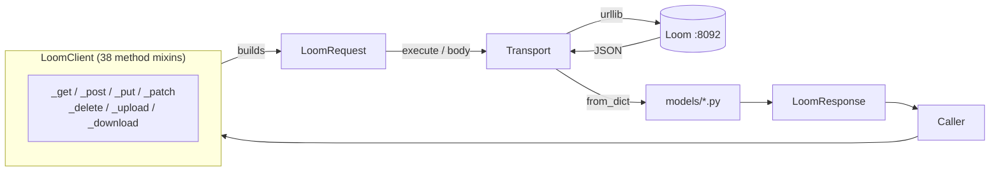

# Python REST Client

Audience: AI coding agents. The stdlib-only Python binding for the Loom REST API —
its layout, the rules its serialisation encodes, how it is kept in step with the Java
client, and what to run before calling a change done.

## Scope

| Concern | Lives in |
|---|---|
| Wire conventions, auth, endpoint inventory, OpenAPI generation | [RESTAPI.md](RESTAPI.md) |
| The Java REST client (`loom-client/rest`) | [RESTAPI.md](RESTAPI.md) §6.1 |
| The Java gRPC client (disabled) | [RESTAPI.md](RESTAPI.md) §6.2 |
| **The Python client (`clients/python`)** | **this file** |
| Definition of done for any code change | [../guidelines/CODING.md](../guidelines/CODING.md) |

This file owns only the Python client. It does not restate wire conventions — when the
two disagree, RESTAPI.md is right about the protocol and this file is right about the
binding.

## 1. Why it is written the way it is

The client is generated from **the Java client and the Java model classes**, not from
the published API description. That is forced: `loom/doc/src/main/generated/openapi.json`
has 137 paths and exactly **one** `components.schemas` entry — request and response
bodies are documented by example only, so there is nothing there to derive a typed model
from ([RESTAPI.md](RESTAPI.md) §12.5 records the same gap).

Design decisions, and what each one costs:

| Decision | Reason |
|---|---|
| Synchronous, `urllib` only | No runtime dependencies, so the client drops into a processing node or a slim container unchanged. Cost: multipart is hand-rolled and there is one timeout, not three. |
| 39 mixin classes mirroring the Java `*Methods` interfaces | A rename lands in one file on each side, and the parity test compares the two trees mechanically. Cost: 246 methods on one object. |
| Deferred request objects | Query parameters attach after the verb and path are fixed, so paging vocabulary lives in one place instead of on 226 signatures. |
| Dataclasses generated by `tools/generate_models.py` | 824 fields transcribed by hand would carry silent casing errors. |
| `to_dict()` omits `None` | Matches the server's `Include.NON_NULL` mapper and the Java client. Cost: `replace_*` inherits the Java PUT limitation (§6). |

## 2. Architecture



Nothing is sent until `execute()` or `body()` is called, which is what makes the route
table introspectable — `tests/test_parity.py` builds every request without a server.

## 3. Layout

```
clients/python/
├── loom_client/
│   ├── client.py        LoomClient: inherits the 38 mixins, owns the _get/_post/... helpers
│   ├── transport.py     Transport: URL assembly, headers, timeouts, status -> exception
│   ├── request.py       LoomRequest: deferred call, query parameters, iter()
│   ├── response.py      LoomResponse, BinaryResponse, case-insensitive Headers
│   ├── errors.py        LoomError hierarchy
│   ├── multipart.py     hand-rolled multipart/form-data
│   ├── filters.py       LHS filter builders (eq, ne, gte, lte, after, before, range_)
│   ├── params.py        limit/from/filter/sort/dir keys, SortKey, SortDirection
│   ├── assets.py        AssetId: uuid | sha512 dual identity
│   ├── methods/         39 modules, one per Java *Methods interface
│   └── models/          base.py hand-written; the other 50 modules generated
├── tools/               generate_models.py, extract_fixtures.py  (not a build step)
├── tests/               unit + parity + model round-trip; it/ gated on LOOM_IT
└── examples/            quickstart.py, upload_and_download.py
```

`clients/` is outside the Maven reactor, like `sidecars/`, `loom-ui/` and `helm/`.

## 4. Key Classes Reference

| Class / module | Path (under `clients/python/`) | Purpose |
|---|---|---|
| `LoomClient` | `loom_client/client.py` | The client. Inherits all 38 method mixins. |
| `Transport` | `loom_client/transport.py` | Sends requests, maps status codes to exceptions. |
| `LoomRequest` | `loom_client/request.py` | A prepared call. Mirrors Java `LoomClientRequest<T>`. |
| `LoomResponse` | `loom_client/response.py` | Body + status + headers. Mirrors `LoomClientResponse<T>`. |
| `BinaryResponse` | `loom_client/response.py` | Streaming download; must be closed. |
| `AssetId` | `loom_client/assets.py` | UUID-or-SHA-512 asset identity. Mirrors `io.metaloom.loom.api.asset.AssetId`. |
| `Model` | `loom_client/models/base.py` | Base of every wire model; `to_dict`/`from_dict`, name mapping, `extra`. |
| `LoomError` … | `loom_client/errors.py` | Exception hierarchy, one class per status the API uses. |
| `ALL_METHOD_GROUPS` | `loom_client/methods/__init__.py` | The 39 mixins, mirroring Java `ClientMethods`. |
| `generate_models.py` | `tools/` | Regenerates `models/` from `loom-shared/rest-model`. |
| `extract_fixtures.py` | `tools/` | Pulls example bodies out of `openapi.json` into test fixtures. |

## 5. Environment Variables

Read by `LoomClient.from_env()` and by the integration tests.

| Variable | Default | Purpose |
|---|---|---|
| `LOOM_HOST` | `localhost` | Server hostname |
| `LOOM_PORT` | `8092` | Server port. **Not 6333** — see §6 |
| `LOOM_SCHEME` | `http` | `http` or `https` |
| `LOOM_PATH_PREFIX` | *(empty)* | Extra segments before `/api/v1`, for a reverse proxy |
| `LOOM_TIMEOUT` | `10.0` | Request timeout in seconds |
| `LOOM_TOKEN` | *(none)* | Pre-issued API token; skips login |
| `LOOM_USER` | *(none)* | Used by `from_env()` when no token is set |
| `LOOM_PASSWORD` | *(none)* | As above |
| `LOOM_IT` | *(unset)* | `1` enables the integration tests |

## 6. Conventions and Gotchas

**Leading slashes are load-bearing.** 20 of the Java impl's call sites pass `"/tags"`,
the rest pass `"tags"`. OkHttp absorbs the difference; a plain string join emits
`/api/v1//tags` and 404s. `LoomRequest` strips them. Both forms are tested.

**The empty path is the API root.** `rest_info()` targets `/api/v1` with **no** trailing
slash. Adding it as a segment breaks routing.

**The default port is 8092, not 6333.** `start-demo.sh`, `start-server.sh`,
`helm/loom/values.yaml` and `LoomOpenAPI.DEFAULT_BASE_URL` all agree on 8092. `6333`
survives only in `LoomHttpClientImpl.Builder` and in `cli/`. Those are Java-side bugs;
the Python client defaults to 8092.

**Asset sub-resources are UUID-only.** The server registers exactly five
`/assets/sha512/:sha512` routes, all on the asset itself. Nothing nested under it —
tags, tasks, detections, reactions — has a hash form. The Java client's `SHA512`
overloads of `tagAsset`, `assignTaskToAsset` and friends build paths that cannot
succeed. `LoomClient._asset_sub()` rejects a hash with an explanation instead; 16
methods use it.

**`replace_*` needs a complete body.** `ReplaceValidator` requires every replaceable
property to be present and answers 400 naming those that are not. Since `to_dict()`
omits `None` — matching the server's own mapper — a partly-filled model cannot satisfy
one. Load, modify, send back. `to_dict(include_none=True)` is the escape hatch.

**Timestamps arrive in two encodings.** `LoomJson.mapper` registers `JavaTimeModule`
without disabling `WRITE_DATES_AS_TIMESTAMPS`, so fields carrying `@JsonFormat` are ISO
strings and the rest are epoch-second numbers. Client-reachable cases:
`SearchHitResponse.sortDate`, `SearchStatusResponse.lastSyncedAt`. Models keep the raw
value; `parse_instant()` accepts both. `format_instant()` truncates to whole seconds,
because the server's parse pattern rejects a fraction.

**Annotations resolve through a registry, via `localns`.** Generated modules import each
other only under `TYPE_CHECKING` to avoid cycles, so `_hints()` supplies
`MODEL_REGISTRY`. It must be passed as `localns`: as `globalns` it replaces the module
namespace of every class in the MRO, and the bases declared in `base.py` stop resolving
— which silently disables all nested-model and enum conversion.
`test_every_model_resolves_its_annotations` guards this.

**The `__Host-loom_token` cookie is ignored**, as in the Java client. No
`HTTPCookieProcessor` is installed, so a stale cookie cannot authenticate a request the
caller believes is anonymous.

**Redirects are surfaced, not followed.** The stdlib handler turns POST into GET on 302,
silently converting a write into a read.

**Uploads buffer in memory.** `BodyHandler.setBodyLimit(-1)` means the server sets no
cap; `multipart.MAX_UPLOAD_BYTES` (64 MiB) raises a clear error rather than exhausting
memory. Streaming upload is not implemented.

**Two Java bugs deliberately not inherited**: the hardcoded multipart boundary
`"--------Geg2Oob"` (corrupts any upload containing that byte string) and the
unimplemented filename escaping at `LoomHttpClientImpl:1299`.

**`list_*_reaction` is singular** for assets, tasks and comments. That is the Java
naming, kept for parity rather than silently corrected.

## 7. Test Setup

No setup is needed for the unit tests — the client has no dependencies:

```bash
cd clients/python
./test.sh                      # 122 tests, 14 skipped without a server
./lint.sh                      # ruff check + format check
```

`./setup.sh` creates a `.venv` and installs `ruff`; it needs `python3-venv`.

**`./setup-pool.sh` is NOT required.** That leases pooled databases for the Java suite
and has nothing to do with this client.

Unit tests run against a real `http.server` stub (`tests/stubserver.py`), not a patched
`urlopen`: URL joining, query encoding, multipart byte layout, `Content-Length` on empty
POSTs and header casing only fail over a socket.

### Integration tests

```bash
./start-postgres.sh && ./start-demo.sh      # from the repository root -> :8092
cd clients/python && LOOM_IT=1 ./test.sh
```

Do **not** copy the Java `LoomContainer`: it pulls `metaloom/loom:v1.0.0` on port 6333,
an image `build-containers.sh` does not produce, on a port the server does not listen
on.

### Keeping in step with the server

```bash
python3 tools/generate_models.py           # after loom-shared/rest-model changes
python3 tools/generate_models.py --check   # or just detect staleness
python3 tools/extract_fixtures.py          # after regenerating openapi.json
```

`tools/coverage.txt` lists every Java field and the Python attribute it became; review
its diff. An unmappable type is reported as `UNMAPPED` and fails the run.

## 8. Where do I find …?

| I want to … | Go to |
|---|---|
| Add a client method | `loom_client/methods/<group>.py`, mirroring the Java `*Methods` interface |
| Change how a request is sent | `loom_client/transport.py` |
| Change paging or filtering | `loom_client/request.py`, `loom_client/params.py`, `loom_client/filters.py` |
| Change serialisation rules | `loom_client/models/base.py` |
| Add or fix a model field | `tools/generate_models.py`, then regenerate — do not edit `models/*.py` |
| Understand a wire convention | [RESTAPI.md](RESTAPI.md) §2 |
| See which routes the client misses | `tests/test_parity.py`, third check (prints them) |
| Find the verb/path for a Java method | `loom-client/rest/.../impl/LoomHttpClientImpl.java` |
| Check upload/download behaviour | `loom_client/multipart.py`, `loom_client/response.py` |
| Read customer-facing docs | `website/content/english/docs/loom/python-client/` |

## 9. Parity

`tests/test_parity.py` is the safety net, with three independent checks:

1. **Java → Python.** All 226 declared Java methods (205 abstract + 21 `default`) have a
   counterpart. A hard count assertion means a new Java method fails the build here.
2. **Python → Java.** No orphan methods.
3. **Client → server.** Every path the client builds exists in `openapi.json`. This is an
   *independent* oracle — it would have caught the historical
   `listCommentsForAnnotation` bug that [RESTAPI.md](RESTAPI.md) §12.4 records.

Check 3 carries `KNOWN_UNLISTED_PATHS`, split by cause:

* **Stale description** — `DedupGroupEndpoint`, `SearchEndpoint` and
  `SimilarityIndexEndpoint` are registered on the real router but are **missing from
  `LoomOpenAPI.generate()`**, so their routes never reach `openapi.json`. The client is
  right; the description is incomplete. This is a server-side bug worth fixing.
* **Dead route** — `/locations*` has no endpoint in the server at all.
  `AssetLocationMethods` exists in both clients and cannot work.

Java-client gaps inherited by design ([RESTAPI.md](RESTAPI.md) §12.4): processors and
processor restrictions, node descriptors and content types, OAuth2, embedding
attachments, chat SSE, chat sessions, session files, memory and memory deny rules, both
WebSocket endpoints, and asset comments.

## 10. Progress Assessment

- [x] Transport: URL assembly, verbs, headers, timeouts, redirect handling
- [x] Error hierarchy, one class per status the API uses
- [x] Deferred requests with limit / from / filter / sort / dir
- [x] Seek paging via `iter()`
- [x] Multipart upload and streaming download
- [x] Asset dual identity (UUID and SHA-512)
- [x] 224 model dataclasses + 15 enums generated from Java (824 fields)
- [x] All 38 method groups, 226 methods
- [x] 73 unit tests against a stub HTTP server (transport, errors, multipart, requests)
- [x] 26 model tests: 142 of 147 example response bodies round-trip
- [x] 9 parity checks against the Java tree and the server route table
- [x] 14 integration tests against a live demo server
- [x] Packaging (`pyproject.toml`), `setup.sh` / `test.sh` / `lint.sh`
- [x] Customer-facing documentation
- [ ] Published to PyPI
- [ ] Streaming (non-buffered) upload for files above 64 MiB
- [ ] Async variant
- [ ] WebSocket support — the Java client has none either
- [ ] Coverage of the §9 inherited gaps

---

_Git HEAD revision: 9a418194_
_Last updated: 2026-08-03_
