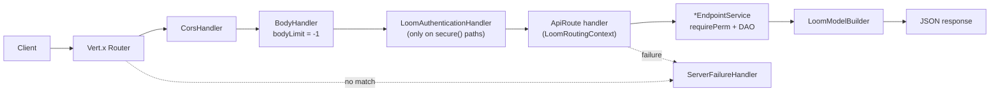

# MetaLoom // Loom REST API Specification

> **Audience: AI coding agents.** The HTTP surface of the Loom server: conventions, authentication,
> the complete endpoint inventory, the client, and OpenAPI generation.
>
> **Not here — cross-referenced instead:**
> | Topic | Spec |
> |-------|------|
> | Permission taxonomy, RBAC model, enforcement gaps | [../features/permissions/PERMISSIONS.md](../features/permissions/PERMISSIONS.md) |
> | Binary byte routes, storage backends, `Range` support | [../features/rest/REST_BINARY_HANDLING.md](../features/rest/REST_BINARY_HANDLING.md) |
> | WebSocket protocols, message vocabulary, WS auth | [WEBSOCKET.md](WEBSOCKET.md) |
> | GraphQL schema | [GRAPHQL.md](GRAPHQL.md) |
> | MCP server (separate port 4041) | [MCP.md](MCP.md) |
> | Pipeline execution semantics | [../features/pipeline/PIPELINE.md](../features/pipeline/PIPELINE.md) |
> | Search backends and query syntax | [../features/search/SEARCH.md](../features/search/SEARCH.md) |
> | Chat SSE event vocabulary | [ui/CHAT.md](ui/CHAT.md) §4.2 |
> | Published spec on the website | [../website/WEBSITE.md](../website/WEBSITE.md) |

---

## 1. Request Flow



Per request a fresh Dagger `RestComponent` scope is built
(`restComponentProvider.get().context(rc).build()`).

---

## 2. Conventions

### 2.1 Versioning and paths

- Everything is mounted under `/api/v1` (`RESTConstants.API_V1_PATH`). There is no v2.
- **Method-carrying paths are plural** (`/users`, `/chat-sessions`, `/dedup-groups`), per
  [../guidelines/CODING.md](../guidelines/CODING.md). Two structural exceptions that are *not*
  collections: `/api/v1/pipeline/node-descriptors` + `/api/v1/pipeline/content-types` (a `pipeline`
  namespace segment), and `/assets/:uuid/binary` (a one-to-one sub-resource; `/binaries` is the
  collection of all of them).

### 2.2 HTTP methods

| Method | Usage |
|--------|-------|
| `GET` | List (collection) or load (single) |
| `POST` | Create **and** update — `POST /resource/:uuid` is the update mechanism on **every** endpoint |
| `PATCH` | Partial update — `/users/:uuid`, `/groups/:uuid`, `/assets/:uuid`, `/assets/sha512/:sha512`, `/dedup-groups/:uuid` |
| `PUT` | Full replace — `/users/:uuid`, `/groups/:uuid`, `/assets/:uuid`, `/assets/sha512/:sha512`. Also used non-CRUD on `/processors/:uuid/restrictions`, `/chat-sessions/:uuid/context`, `/memory/entry` (upsert) |
| `DELETE` | Delete |
| `OPTIONS` | CORS preflight (`CorsHandler`) |

`POST /resource/:uuid` is retained for backward compatibility and is the only update verb on the
remaining endpoints; rolling PUT/PATCH out further is open work (§7.3).

**PATCH** is semantically identical to `POST /resource/:uuid` — only present fields change, same
service call.

**PUT** uses the same service call behind a completeness check (`ReplaceValidator`, wired via
`AbstractEndpoint.replaceHandler(Class, Handler)` → `LoomRoutingContext.requireFullBody(Class)`):

- The body must carry **every** replaceable JSON property of the request model; missing ones are
  rejected **400** with a `GenericMessageResponse` naming them. PUT does *not* null out absent
  fields — it refuses the request instead.
- A field **present but `null`** counts as present (explicit clear). Only **absent** fields fail.
- Required properties are derived from Jackson introspection (so `@JsonProperty` renames and
  accessor-less fields such as `AssetUpdateRequest.dominantColor` are handled). `@ReplaceOptional`
  opts a property out — `AssetUpdateRequest` uses it for the kind-specific blocks (`image`, `video`,
  `audio`, `document`, `geo`, `timeline`, `s3`, `consistency`, `fingerprint`).
- The check runs against the **raw** `JsonObject`, not the parsed model.
- **Java client caveat:** `LoomJson.mapper` uses `Include.NON_NULL`, so the Java client drops null
  fields on the wire — it can never send an explicit `null` via PUT. Raw HTTP clients can.

### 2.3 Content types, IDs, responses

| Aspect | Value |
|--------|-------|
| Bodies | `application/json` (`HTTPConstants.APPLICATION_JSON`) |
| OpenAPI YAML | `text/vnd.yaml` (`HTTPConstants.TEXT_YAML`); `/openapi.json` is JSON |
| Uploads | `multipart/form-data`, file part named `file` |
| IDs | `:uuid` path param; assets additionally `/assets/sha512/:sha512` (client type `AssetId`) |
| Pipeline versions | `:version` is an **integer**, not a UUID |

| Code | Meaning |
|------|---------|
| 200 | OK — load, update, list |
| 201 | Created |
| 202 | Accepted — pipeline run dispatched |
| 204 | No Content — delete |
| 206 | Partial Content — `Range` byte download |
| 400 | Validation error, bad path/query params, incomplete PUT body |
| 401 | Login failed / unauthenticated |
| 403 | `MISSING_PERM` |
| 404 | Not found |
| 409 | Conflict — run already active, pause/resume state clash, memory entry exists, forgetting an online worker |
| 500 | Internal error |
| 503 | No processor accepts the source node kind |
| 4401 | WebSocket close code — unauthorized |

Errors use `GenericMessageResponse` (`message` only — the `LoomRestErrorCode` is **not** in the body).

### 2.4 List query parameters

Registered by `addListRoute` (keys in `QueryParameterKey`):

| Parameter | Key | Type | Default | Description |
|-----------|-----|------|---------|-------------|
| Limit | `limit` | Integer | 25 | Page size |
| From | `from` | UUID | null | Seek to the element with this UUID |
| Filter | `filter` | String | null | LHS filter, e.g. `name[eq]=joedoe` |
| Sort | `sort` | String | null | Sort field |
| Direction | `dir` | Enum | ASC | `ASCENDING` / `DESCENDING` |

`addSearchRoute` registers a **disjoint** parameter set for `/search/*` (query + paging) — it is not
the list parameter set.

### 2.5 Router configuration (`RESTService.setupRouter()`)

- `CorsHandler.create()` — all origins (`.*`), methods GET/POST/PUT/DELETE/PATCH/OPTIONS, headers
  `Content-Type`/`Authorization`/`Accept`, `allowCredentials(true)`.
- `BodyHandler.create().setBodyLimit(-1)` — **no body size limit** (intentional for large uploads).
- `ServerFailureHandler` — `ValidationException` → 400, `LoomRestException` → its own code,
  everything else → 500. The 404 handler returns JSON with the normalized path.

---

## 3. Authentication

| Mechanism | Detail |
|-----------|--------|
| JWT bearer | `Authorization: Bearer <token>` |
| JWT cookie | `__Host-loom_token` (`AuthenticationOptions.TOKEN_COOKIE_KEY`), `HttpOnly`, `Secure`, `SameSite=STRICT`; expiry from `AuthenticationOptions.getTokenExpirationTime()` |
| Handler | `LoomAuthenticationHandler`, applied per path by `AbstractEndpoint.secure(path)` — usually `secure(basePath() + "*")` |
| WebSocket | `?token=<jwt>` validated **after** upgrade by `WebSocketAuthenticator`; close code `4401`. `LOOM_WS_STRICT_AUTH=true` requires a token on every connection |
| Permissions | `lrc.requirePerm(Permission...)` → Vert.x `PermissionBasedAuthorization`; 403 `MISSING_PERM`. Permissions are global per type — the stored `resource` value is not enforced. See [../features/permissions/PERMISSIONS.md](../features/permissions/PERMISSIONS.md) |

**Login** — `POST /api/v1/login`, body `AuthLoginRequest{username,password}` → `AuthLoginResponse{token}`;
also sets the cookie. Failure: 401 `GenericMessageResponse`.

**API tokens** — `/api/v1/tokens` CRUD (`CREATE_TOKEN`, `READ_TOKEN`, `UPDATE_TOKEN`, `DELETE_TOKEN`).
Token values are generated with `StringUtils.randomHumanString(8)`.

**OAuth2 BFF + PKCE** (`OAuth2Endpoint`, base `/api/v1/auth/oauth2`, per
draft-ietf-oauth-browser-based-apps-21):

| Route | Behaviour |
|-------|-----------|
| `GET /login` | Starts the flow, redirects to the IdP authorization endpoint |
| `GET /callback` | Validates `state`, exchanges the code, resolves/auto-provisions the SSO user, sets the Loom JWT cookie |
| `GET /logout` | Clears the session cookie (does **not** revoke IdP tokens) |

PKCE uses an S256 challenge; verifier and state live in `__Host-`-prefixed `HttpOnly` cookies with a
10-minute expiry. State matching provides CSRF protection.

---

## 4. Endpoint Inventory

All paths are relative to `/api/v1`. "Class" is under
`loom/services/rest/.../rest/endpoint/impl/` unless marked `agent/`.

### 4.1 Unsecured (no `secure()` call)

| Path | Methods | Class | Notes |
|------|---------|-------|-------|
| `/login` | POST | `LoginEndpoint` | Pre-auth by design |
| `/auth/oauth2/{login,callback,logout}` | GET | `OAuth2Endpoint` | Pre-auth by design |
| `/health` | GET | `HealthEndpoint` | `HealthCheckResponse{status,version,timestamp,database}`; `DEGRADED` when the DB probe fails |
| `/` (`/api/v1`) | GET | `RESTInfoEndpoint` | `RESTInfoResponse` — server version, applied DB revision, last-used timestamp (read off the event loop) |
| `/openapi`, `/openapi.yaml` | GET | `RESTInfoEndpoint` | OpenAPI YAML |
| `/openapi.json` | GET | `RESTInfoEndpoint` | Same document as JSON |
| `/pipeline/node-descriptors` | GET | `NodeDescriptorEndpoint` | All node descriptors + content types (combined UI response) |
| `/pipeline/node-descriptors/:kind` | GET | `NodeDescriptorEndpoint` | One descriptor |
| `/pipeline/content-types` | GET | `NodeDescriptorEndpoint` | Content type catalog |
| `/processors/ws` | WS | `ProcessorEndpoint` | Post-upgrade token auth |
| `/pipelines/events/ws` | WS | `PipelineEventEndpoint` | Post-upgrade token auth, `order(-1000)` |
| `/shares/:slug` and everything under it | GET, POST, DELETE | `PublicShareEndpoint` | **The customer-facing share area.** Unauthenticated by design - the caller has no account. Authorized entirely by `ShareAccessService` against the `share` row, using the opaque session token from `POST /shares/:slug/sessions`. See [../features/share/SHARE_SYSTEM.md](../features/share/SHARE_SYSTEM.md) |

### 4.2 Standard CRUD endpoints

Pattern: `POST /x` create · `GET /x` list · `GET /x/:uuid` load · `POST /x/:uuid` update ·
`DELETE /x/:uuid` delete.

| Path | Class | Deviations / extras |
|------|-------|---------------------|
| `/users` | `UserEndpoint` | + `PATCH`, `PUT` on `/:uuid` |
| `/roles` | `RoleEndpoint` | Create/update carry `permissions` — absent = leave unchanged, `[]` = revoke all, non-empty = replace. See [../features/permissions/PERMISSIONS.md](../features/permissions/PERMISSIONS.md) §4.4 |
| `/groups` | `GroupEndpoint` | + `PATCH`, `PUT` on `/:uuid`; list uses `addRoute`, **not** `addListRoute` (no query-param docs) |
| `/persons` | `PersonEndpoint` | — |
| `/spaces` | `SpaceEndpoint` | — |
| `/libraries` | `LibraryEndpoint` | — |
| `/collections` | `CollectionEndpoint` | + `/:uuid/assets` membership (POST, PUT, GET, DELETE); + `/:uuid/share-links` (GET) |
| `/share-links` | `ShareLinkEndpoint` | Owner-side share links. + `/:uuid/feedback` (GET) - what the customer said. Separate base path from the unsecured `/shares` on purpose: `secure()` is applied by path wildcard, so one base path for both halves would either secure the customer routes or force this endpoint to enumerate its own. Also reachable as `/assets/:uuid/share-links` and `/collections/:uuid/share-links` |
| `/blacklists` | `BlacklistEndpoint` | — |
| `/clusters` | `ClusterEndpoint` | — |
| `/chats` | `ChatEndpoint` | — |
| `/pools` | `AssetPoolEndpoint` | Storage pools |
| `/binaries` | `AssetBinaryEndpoint` | Standalone binary metadata CRUD |
| `/tokens` | `TokenEndpoint` | API tokens (§3) |
| `/tags` | `TagEndpoint` | + `/:uuid/rating` — POST, GET, DELETE (per-user tag rating) |
| `/tasks` | `TaskEndpoint` | + `/:taskUuid/reactions` (POST, GET) and `/:taskUuid/reactions/:reactionUuid` (GET, POST, DELETE); + `/:taskUuid/comments` (POST, GET); + **assignees**: `/:taskUuid/assignees` (GET, POST — additive, body `{userUuids[], groupUuids[]}`) and `DELETE /:taskUuid/assignees/users/:userUuid` \| `/groups/:groupUuid`. Split DELETE sub-paths because a collection DELETE cannot name *which* assignee and a DELETE body is unevenly supported. Reuses `READ_TASK`/`UPDATE_TASK` — there is no `ASSIGN_TASK` verb |
| `/comments` | `CommentEndpoint` | + `/:commentUuid/reactions` (POST, GET) and `/:commentUuid/reactions/:reactionUuid` (GET, POST, DELETE) |
| `/annotations` | `AnnotationEndpoint` | + reactions like above under `/:annotationUuid/reactions`; + `/:annotationUuid/comments` (POST, GET); + `/:annotationUuid/tasks` (GET) and `/:annotationUuid/tasks/:taskUuid` (POST assign, DELETE unassign) |
| `/embeddings` | `EmbeddingEndpoint` | + `/:embeddingUuid/attachments` (POST, GET) — simplified `addRoute`, no examples |
| `/memory-deny-rules` | `agent/` `MemoryDenyRuleEndpoint` | Admin CRUD for the memory denylist; own `*_MEMORY_DENY_RULE` permissions |

### 4.3 Non-CRUD and partial endpoints

| Path | Methods | Class | Notes |
|------|---------|-------|-------|
| `/me` | GET | `MeEndpoint` | The authenticated user, as `UserResponse` |
| `/notifications` | GET (list), POST/DELETE `/:uuid`, POST `/read-all`, DELETE (clear) | `NotificationEndpoint` | The caller's own inbox. **No create route** — notifications are dispatched server-side by `NotificationDispatcher`. `?unread=true` narrows the list; `unreadCount` on the response is the caller's whole-inbox total, not the page's. `POST /:uuid` marks read/unread; `POST /read-all` is a **literal prefix registered before the `/:uuid` wildcard**. Recipient-scoped exactly as `/skills` is owner-scoped: a foreign entry answers **404, not 403** |
| `/graphql` | POST | `GraphQLEndpoint` | `{query, operationName?, variables?}`; secured via `secure(basePath())` |
| `/reactions` | GET (list), GET/DELETE `/:uuid` | `ReactionEndpoint` | Plus asset-scoped `/reactions/assets/:assetUuid` (POST, GET) — a different shape from the `/assets/:uuid/reactions` sub-resource |
| `/attachments` | POST (multipart), GET list, GET/POST/DELETE `/:uuid` | `AttachmentEndpoint` | Form fields: `assetUuid`, `embeddingUuid`, `type`, `poolUuid` |
| `/attachments/:uuid/data` | GET | `AttachmentEndpoint` | Raw bytes (`addDownloadRoute`) |
| `/skills` | POST, GET list, GET/POST/DELETE `/:uuid` | `SkillEndpoint` | Owner-scoped — a user only ever sees their own. Extras: `/library` (GET, published skills of all users), `/:uuid/install` (POST, copy a published skill with `originSkillUuid` provenance), `/:uuid/versions` (GET), `/:uuid/versions/:version` (GET), `/:uuid/versions/:version/restore` (POST) |
| `/dedup-groups` | POST, GET, GET/PATCH/DELETE `/:uuid` | `DedupGroupEndpoint` | POST **upserts** the pending group for the same keep-asset + algorithm. `PATCH` confirms/rejects; only a CONFIRMED group is acted on by the apply node. No PUT |
| `/metrics` | GET | `MetricsEndpoint` | `MetricsResponse` — an instantaneous read of the `loom_*` meter catalog, gated by `READ_METRIC`. **Not** the Prometheus surface: that is `/metrics` on the *monitoring* port (8989), unauthenticated. Same registry, same series names, `?prefix=` filter; a prefix outside `loom_` is a 400. No history — see [../features/ops/METRICS.md](../features/ops/METRICS.md) §3.2 |
| `/db-integrity` | GET | `DbIntegrityEndpoint` | `DbIntegrityReportResponse` - runs the database integrity checks and reports the findings, gated by `READ_DB_INTEGRITY`. Singular because it is one report about one database, not a collection. `?check=` `?category=` `?severity=` `?limit=`; an unknown code or category is a **400**, never an empty report. No POST: the sweep writes nothing, so there is no job to start. See [../features/db/DB_INTEGRITY.md](../features/db/DB_INTEGRITY.md) |
| `/db-integrity/checks` | GET | `DbIntegrityEndpoint` | `DbIntegrityCheckListResponse` - the check catalogue with nothing run, so a caller can build a filter or label a passing check without paying for a sweep. Plural: this one is a collection. Each entry carries both a stable `code` and a human-readable `name`; branch on the code, display the name |
| `/storage` | GET | `StorageEndpoint` | `StorageReportResponse` - what is stored per kind of content and how much room is left, gated by `READ_STORAGE`. Singular for the same reason as `/db-integrity`: one report about one deployment. Two byte figures per category and they mean different things - `logicalBytes` sums every element, `distinctBytes` counts each stored object once because storage is content-addressed. 🔴 Per-category `distinctBytes` does **not** sum to the response's own `distinctBytes`: one object can belong to two categories. No POST: the report reclaims nothing |
| `/storage/backends` | GET | `StorageEndpoint` | `StorageBackendListResponse` - capacity only, no aggregate SQL, so this is the one a dashboard can poll. `freeBytes`/`totalBytes` are **null** for an object store and its `watermark` is `UNKNOWN`, never `OK`. Plural: this one is a collection. `READ_STORAGE` |
| `/users/:uuid/avatar` · `/me/avatar` | GET, POST, DELETE | `UserEndpoint`, `MeEndpoint` | The account picture. POST is `multipart/form-data` and **replaces** rather than appending - a partial unique index (V2.93) makes "at most one" a schema fact. The `/me` form requires no permission beyond being signed in, because `UPDATE_USER` is the permission to edit anybody's account and no ordinary user holds it |
| `/users/:uuid/avatar/data` · `/me/avatar/data` | GET | `UserEndpoint`, `MeEndpoint` | The picture bytes, with ETag and `Cache-Control: private`. The URL a response advertises is always the `/users` form even when read through `/me`: it is rendered in other people's browsers |
| `/similarity-index/rebuild` | POST | `SimilarityIndexEndpoint` | Rebuilds the fingerprint similarity index from stored components. **Deprecated** in favour of `/search-indices` — kept because both clients carry it |
| `/vector-index/{rebuild,sync,status}` | POST, POST, GET | `VectorIndexEndpoint` | Whole-backend rebuild/drain/status of the embedding vector index. **Deprecated** in favour of `/search-indices`, which is per vector space |
| `/search-indices` | GET | `SearchIndexEndpoint` | Every index (lexical, each embedding vector space, fingerprints) with its state, producing model, record vs. indexed counts and backlog, plus a `backends[]` array carrying size on disk — size is per backend because one Lucene directory interleaves the vector spaces. 200 even when every index is disabled. `READ_SEARCH_INDEX` |
| `/search-indices/:id` | GET | `SearchIndexEndpoint` | One index. `:id` is a slug the server resolves by lookup (`lexical`, `fingerprint`, `vector-face-inspireface-r18-512`) — never construct or parse it. `READ_SEARCH_INDEX` |
| `/search-indices/:id/jobs` | GET, POST | `SearchIndexEndpoint` | POST `{action: REINDEX\|DELTA_SYNC\|DROP}` answers **202** with a job to poll; an action outside the index's `supportedActions` is a 400, and a job against an unavailable index a 503 naming the reason. `READ_SEARCH_INDEX` / `MANAGE_SEARCH_INDEX` |
| `/search-indices/:id/jobs/:jobUuid` | GET, DELETE | `SearchIndexEndpoint` | Progress, or a cooperative cancel. `total` is null for the lexical rebuild — one SQL call with no intermediate progress. `READ_SEARCH_INDEX` / `MANAGE_SEARCH_INDEX` |
| `/search/results` | GET | `SearchEndpoint` | Across assets, transcripts, tags, annotations, persons, collections, libraries, clusters |
| `/search/assets` | GET | `SearchEndpoint` | Assets only |
| `/search/suggestions` | GET | `SearchEndpoint` | Typeahead |
| `/search/status` | GET | `SearchEndpoint` | Singleton status resource — answers 200 even when search is unavailable |
| `/processors` | GET | `ProcessorEndpoint` | Live registrations merged with persisted-but-offline instances |
| `/processors/:uuid` | GET, DELETE | `ProcessorEndpoint` | DELETE forgets a persisted instance; 409 while the worker is online. Requires `MANAGE_CORTEX_INSTANCE` |
| `/processors/:uuid/restrictions` | PUT | `ProcessorEndpoint` | Node-kind whitelist/blacklist; `MANAGE_CORTEX_INSTANCE` |
| `/memory` | GET | `agent/` `MemoryEndpoint` | Notes of a scope; nested ids travel as `?id=` |
| `/memory/scopes` | GET | `agent/` `MemoryEndpoint` | The caller's scopes with usage and quota |
| `/memory/entry` | GET, POST, PUT, DELETE | `agent/` `MemoryEndpoint` | `?scope=&ref=&id=`; POST creates (409 on conflict), PUT upserts |
| `/chats/:uuid/stream` | POST, DELETE | `agent/` `ChatStreamEndpoint` | POST runs the chat agent for a new user message and streams it as SSE (body `{message, skillUuids[], think?}`; 409 when a run is already active). DELETE cancels the active run (204). Event vocabulary: [ui/CHAT.md](ui/CHAT.md) §4.2 |
| `/chat-sessions` | POST, GET, GET/POST/DELETE `/:uuid` | `agent/` `ChatSessionEndpoint` | Publishable snapshots of a chat's working state. `?scope=mine\|published` on list. Extras: `/:uuid/publish` (POST), `/:uuid/unpublish` (POST), `/:uuid/context` (GET, PUT) |
| `/sessions/:uuid/{files,download,preview}` | GET | `agent/` `SessionFsEndpoint` | Read-only view of a chat's coding sandbox workspace |

### 4.4 Assets

`AssetEndpoint` is the largest surface. Root list uses `addRoute` (not `addListRoute`).

| Path | Methods | Notes |
|------|---------|-------|
| `/assets` | POST, GET | Create, list |
| `/assets/:uuid` | GET, POST, PATCH, PUT, DELETE | PUT is `ReplaceValidator`-backed |
| `/assets/sha512/:sha512` | GET, POST, PATCH, PUT, DELETE | Same operations keyed by hash |
| `/assets/bulk/create` | POST | Literal prefix — registered before the `:uuid` wildcard |
| `/assets/bulk/update` | POST | ″ |
| `/assets/upload` | POST | Multipart, creates an asset from raw bytes |
| `/assets/:uuid/tags` · `/tags/:tagUuid` | POST, **PUT** · DELETE | Tag / untag. PUT applies a whole set in one transaction — see below. DELETE removes **every** placement of the tag |
| `/assets/:uuid/tag-placements/:placementUuid` | DELETE | Remove **one** placement, keeping the tag's others. `UNTAG_ASSET`; 404 when the placement belongs to another asset |
| `/assets/:uuid/tasks` · `/tasks/:taskUuid` | GET · POST, DELETE | Assign / unassign existing tasks |
| `/assets/:uuid/reactions` · `/reactions/:reactionUuid` | POST, GET · GET, POST, DELETE | |
| `/assets/:uuid/comments` | POST, GET | |
| `/assets/:uuid/detections` · `/detections/bulk` · `/detections/:detectionUuid` · `/detections/:detectionUuid/crop` | POST, GET · POST · GET, POST, DELETE · GET | `?type=`/`?status=` filter the list; the crop is served from local storage (biometric data) |
| `/assets/:uuid/detections/:detectionUuid/confirm` · `/reject` · `/assets/:uuid/detections/review-bulk` | POST · POST · POST | Human review verdict, `UPDATE_DETECTION`. Bulk answers `{total, created, failed}`. ⚠️ `review-bulk` must be registered **before** `/detections/:detectionUuid` — same shape, and Vert.x matches in registration order |
| `/detections` | GET | 🟢 Cross-asset review queue: `?status=PENDING&type=objectdetection`. The response field is `reviewStatus`, not `status` — the latter is the creator/editor audit block |
| `/assets/:uuid/transcripts` · `/transcripts/:transcriptUuid` | POST, GET · GET, POST, DELETE | |
| `/assets/:uuid/node-results` · `/node-results/:nodeResultUuid` | POST, GET · GET, DELETE | Cortex node result ledger |
| `/node-runs` · `/node-runs/probes` · `/node-runs/:uuid` · `/node-runs/:uuid/cancel` | POST, GET · POST · GET · POST | 🟢 Ad-hoc ("pipelineless") node execution: run a node on chosen assets without a stored pipeline. `/probes` runs one node against one asset and answers with the result; `POST /node-runs` takes an inline definition and answers **202** with a job handle. All require `EXECUTE_MCP_NODE`, all are scoped to the caller (a foreign run is **404, not 403**), and `/probes` is a **literal prefix registered before the `/:uuid` wildcard**. Owned by [../chat/AGENTIC_NODE_EXECUTION.md](../chat/AGENTIC_NODE_EXECUTION.md) |
| `/assets/:uuid/json-comps` · `/json-comps/:compUuid` | POST, GET · GET, DELETE | |
| `/assets/:uuid/fingerprints` · `/fingerprints/:compUuid` | POST, GET · GET, DELETE | |
| `/assets/:uuid/segments` · `/segments/:compUuid` | POST, GET · GET, DELETE | |
| `/assets/:uuid/similar-assets` | GET | Fingerprint similarity lookup |
| `/assets/:uuid/dedup-groups` | GET | Duplicate groups containing this asset |
| `/assets/:assetUuid/components` · `/components/:compUuid` | GET, POST · GET, POST, DELETE | `AssetComponentEndpoint` (separate class). **POST upserts** on the component's identity `(asset, node_kind, <discriminators>)`, so a Cortex node re-run replaces its own row. The discriminators travel on the request: `method`/`timeFrom` (geo), `streamIndex` (image/video/audio/transcript), `pageNumber` (doc), `json.variant`, alongside the shared `nodeId`/`producerVersion`/`confidence`/`meta` |
| `/assets/:uuid/binary` | POST, GET, DELETE | The **primary** binary's metadata — an asset holds one binary per library it was imported into; GET returns the oldest |
| `/assets/:uuid/binaries` | GET | Every binary, one per library |
| `/assets/:uuid/binary/data` | POST, GET | **Raw bytes.** Upload is multipart (`libraryUuid` form field required when the asset has zero or >1 binaries, else 400). GET supports single-range `Range: bytes=` → 206 + `Content-Range` |

Byte routes, storage backends and the on-disk/S3 layout:
[../features/rest/REST_BINARY_HANDLING.md](../features/rest/REST_BINARY_HANDLING.md).

**`PUT /assets/:uuid/tags` — the bulk tagging route.** Tagging one tag per request does not survive a
library: five tags over a hundred thousand assets is half a million `POST`s, half a million
transactions and half a million rebuilds of the same search document. The `PUT` carries the set:

```json
{ "collection": "quality",
  "tags": [ {"name": "blurry"}, {"name": "amber", "collection": "colors"} ],
  "withdraw": [ "<tag-uuid>" ] }
```

- Entries are **upserted** on the tag's natural key, so an existing name is attached rather than
  duplicated, and re-sending the same set changes nothing. `collection` is the default for entries
  that do not name one.
- The whole request is **one transaction** (`TagDao.bulkTagAsset`), so an asset is never left half
  tagged. The `search_document` trigger is still row-level, so the refresh count is unchanged — what
  the route removes is the round trips and the transactions, not the trigger.
- 🔴 **`withdraw` names uuids and removes exactly those**, never "everything not in `tags`". The
  desired-set reading remains unavailable: `tag_asset` now records *who* wrote a placement (`V2.71`),
  but not which of a writer's earlier answers it stands behind, so "delete the rest" would still
  discard tags the caller never meant to touch.
- **Provenance travels with the request.** `nodeKind`, `nodeId` and `producerVersion` may be set on
  the request (defaults for every entry) or per entry; `confidence` is per entry. A caller that says
  nothing is recorded as `manual`, i.e. a person. Since `V2.71` those land on the placement row and
  come back on `TagReference` — `placementUuid`, `nodeKind`, `nodeId`, `confidence`, `attached`,
  `attachedBy` — which is how a client tells machine tags from curated ones.
- 🔴 **A writer that names itself withdraws only its own placements.** With one tag able to sit on an
  asset several times, `withdraw` scoped by tag alone would take a person's placement of the same
  name along with the node's. A request carrying `nodeId` deletes only rows with that `node_id`; a
  person's request (no `nodeId`) removes them all, which is what an untag means from a human.
- Permissions depend on the request: `TAG_ASSET`, plus `UNTAG_ASSET` when `withdraw` is non-empty
  (`checkPerms`, the all-or-nothing variant). A caller holding only the first is refused the whole
  call rather than served the attachments and denied the removals.

### 4.5 Pipelines

`PipelineEndpoint` secures each path explicitly (no `*` wildcard) because of the literal-prefix
routes.

| Path | Methods | Notes |
|------|---------|-------|
| `/pipelines` | POST, GET | Create, paged list |
| `/pipelines/:uuid` | GET, POST, DELETE | Delete removes all versions |
| `/pipelines/runs/stats` | GET | Aggregated daily run stats across **all** pipelines. Literal prefix — registered before `:uuid` |
| `/pipelines/:uuid/run` | POST | Trigger execution |
| `/pipelines/:uuid/runs` | GET | Paged run history |
| `/pipelines/:uuid/runs/:runUuid` | GET | One run |
| `/pipelines/:uuid/runs/:runUuid/items` | GET | Paged items of a run |
| `/pipelines/:uuid/runs/:runUuid/items/:itemUuid/tasks` | GET | Node executions of one item, **with the `outputs` each node emitted** (keyed by output port id). Unpaged: bounded by the graph, and every caller wants the whole set |
| `/pipelines/:uuid/runs/:runUuid/items/:itemUuid/tasks/:taskUuid/previews/:portId` | GET | Bytes of one debugging preview. `image/jpeg` with an ETag; `304` on a conditional re-fetch; `404` when the run did not request previews or the preview was capped |
| `/pipelines/:uuid/runs/:runUuid/cancel` | POST | Terminal, cannot be undone |
| `/pipelines/:uuid/runs/:runUuid/pause` | POST | `RUNNING` → `PAUSED` |
| `/pipelines/:uuid/runs/:runUuid/resume` | POST | `PAUSED` → `RUNNING` |
| `/pipelines/:uuid/runs/:runUuid/breakpoints` | GET | What the run is armed to halt at (`nodeIds`) and what it is currently holding (`held[{nodeId,itemUuid,elementSeq}]`). `READ_PIPELINE_RUN` |
| `/pipelines/:uuid/runs/:runUuid/breakpoints` | PUT | Replace the armed set. Whole-set, not a delta; `[]` disarms and releases. 400 names an unknown node id |
| `/pipelines/:uuid/runs/:runUuid/breakpoints/:nodeId/continue` | POST | Release everything that node is holding. The breakpoint **stays armed** |
| `/pipelines/:uuid/runs/:runUuid/steps` | POST | Release exactly one held execution. 409 when nothing is held |
| `/pipelines/:uuid/runs/:runUuid/nodes/:nodeId/reexecutions` | POST | Run a held node again over the same input, optionally with different settings. `{itemUuid, elementSeq, options?}` → `{generation, nodeId, options}` |
| `/pipelines/:uuid/versions` | GET | Paged history |
| `/pipelines/:uuid/versions/:version` | GET | One historic version (`:version` is an int) |
| `/pipelines/:uuid/versions/:version/restore` | POST | Copies into a **new** latest version, returns 201 |

**Run.** `POST /:uuid/run` selects a processor, creates a `pipeline_run` row, builds a
`PipelineRunEngine`, and dispatches a `SOURCE_TASK`; the engine then drives `NODE_TASK`s. Returns
`PipelineRunResponse{runUuid, dispatched, processorNodeId}` — 202 on success, 400 if the definition
cannot run as drawn, 503 if no processor accepts the source node's kind.

`PipelineRunRequest` narrows what the source enumerates. Precedence, most specific first:
`mediaUuids` > `pathGlobs` > `path`. `path` is a single root enabling the source node's
differential index-backed scan; `pathGlobs` forces a full re-walk. Merge logic lives in
`SourceOptionsResolver` — see [../features/pipeline/PIPELINE.md](../features/pipeline/PIPELINE.md) §12.

**Run control.** All three require `UPDATE_PIPELINE_RUN` and answer `GenericMessageResponse`.
`PAUSED` is **non-terminal**: a paused run keeps its counters, holds its engine, and can be resumed
or cancelled. Pausing stops node dispatch *and* withholds the source acknowledgement, so the scan
itself halts. 409 on: pausing a terminal or already-paused run; resuming a run that is not paused;
resuming a run with no live engine on the server (which would create a run nothing advances).

**Breakpoints.** A breakpoint holds a node's *completed* executions back from its dependents: the
node runs, its result is persisted and readable through the `/tasks` route above, and only the
downstream dispatch is blocked. Everything but the GET requires `UPDATE_PIPELINE_RUN`.

All four need a **live engine** and answer 409 without one, mirroring `resume` — a breakpoint that
nothing will ever honour is worse than a refusal. The single exception is the GET, which reports an
empty set instead: a run lost to a restart genuinely arms nothing and holds nothing.

⚠️ Breakpoints are **run state, never definition state**. They are set on a run that is already
going (or passed as `breakpoints[]` on `PipelineRunRequest` so a run can start armed), and are never
written back into the stored pipeline — debugging a run must not change the pipeline everyone else
runs. `PipelineRunBreakpointEndpointTest` asserts that arming one creates no new pipeline version.

**Re-execution.** `POST …/nodes/:nodeId/reexecutions` runs a node held at a breakpoint again over the
same input — the engine rebuilds its inputs from the upstream results the item still holds. A
re-execution is a *new attempt at* the node, hence a plural collection path and POST.

`options` is **merged over** the pipeline's own settings and applies to the rest of this run, so
sending one key changes one setting; omit it to re-run unchanged, or send `{}` to drop the override
and go back to the definition. Each attempt is recorded under its own `generation` and returned in
the response, so two attempts can be compared rather than one overwriting the other.

Refusals, in the order they are checked: 404 for an unknown run, 409 without a live engine, 400 for
an unknown node id or a missing `itemUuid`, 400 for an option that does not typecheck against the
node's declared `NodeParameter`s (this route is the **only** per-option validation in the API —
everywhere else options arrive from an editor form generated from those same declarations), and 409
when the execution is not held. Only a held execution may be re-run: the hold is what guarantees
nothing downstream has consumed the result being discarded.

⚠️ Like breakpoints, the settings are **run state**. Keeping one is a separate, deliberate act
through `POST /pipelines/:uuid`, which is what creates a new version;
`PipelineNodeReExecuteEndpointTest` asserts a re-execution creates none.

**Flattened version model.** Persistence keeps `pipeline` and `pipeline_version` as two tables with
`pipeline.latest_version_uuid` pointing at the current revision; every mutation appends a row rather
than editing in place. The REST API deliberately does **not** mirror that split — one
`PipelineResponse` merges both halves so a client never needs a second request:

| Field | Meaning |
|-------|---------|
| `uuid` | The **pipeline** UUID — stable across all versions |
| `versionUuid` | The `pipeline_version` this payload was rendered from |
| `versionNumber` | Sequential version number (1, 2, 3, …) |
| `name`, `description`, `definition`, `enabled`, `priority`, `dryRun` | Version-scoped fields, served inline |
| `meta` | Custom metadata |
| `status` | Creator/editor info (for version entries: the version's author) |

List and load render from the latest version; the list resolves all versions in one batched query,
so entries carry their definition without an N+1 lookup.

### 4.6 WebSockets

| Path | Direction | Purpose |
|------|-----------|---------|
| `/processors/ws` | Bidirectional | Cortex processor nodes. Processor→loom: `REGISTER`, `HEARTBEAT`, `STATUS_UPDATE`, `STATE_CHANGE`, `SOURCE_ITEMS`, `SOURCE_COMPLETE`, `NODE_TASK_RESULT`, `PIPELINE_RUN_COMPLETED`, `PIPELINE_EVENT`. Loom→processor: `REGISTERED`, `HEARTBEAT_ACK`, `SOURCE_TASK`, `SOURCE_ITEMS_ACK`, `NODE_TASK`, `SEGMENT_TASK`, `ERROR` |
| `/pipelines/events/ws` | Read-only | Live `PipelineEventMessage` stream for UI clients; optional `?pipeline=<name>` filter |

Both authenticate via `?token=<jwt>` **after** the upgrade. Full protocol: [WEBSOCKET.md](WEBSOCKET.md).

### 4.7 Outside `/api/v1`

The MCP server runs on its **own** HTTP server (port `4041`, REST is `6333`) with paths `/mcp/sse`,
`/mcp/message`, `/mcp/ws`. It shares the DAOs but **not** the REST auth/permission layer.
See [MCP.md](MCP.md).

---

## 5. OpenAPI Generation

- Served by `RESTInfoEndpoint` at `/api/v1/openapi{,.yaml,.json}`. The advertised server URL is
  derived from the request (honouring `X-Forwarded-Proto`/`X-Forwarded-Host`) so a spec viewer talks
  back to the server the document came from; fallback is `LoomOpenAPI.DEFAULT_BASE_URL`
  (`http://localhost:8092`), which is also added as a "Local demo container" server entry.
- `LoomOpenAPI` generates the document **without a database**: it builds a throw-away `ApiRouter`,
  registers every rest-module endpoint on it (constructed with null services — `register()` never
  dereferences one) and runs the external `io.metaloom.vertx.openapi.OpenAPIGenerator` over it.
  Endpoints living outside the rest module (chat stream, chat sessions, session files, memory,
  memory deny rules — all under `loom/agent/*`, which depends on rest) arrive through an
  extra-endpoint factory; `loom/doc` supplies it.
- The raw generator output is only a route dump, so `LoomOpenAPI#polish` post-processes it:
  Vert.x `:uuid` → `{uuid}` templates with declared path parameters (UUID format, SHA-512 pattern,
  integer versions); tags derived from the first segment below `/api/v1` (described from
  `TAG_DESCRIPTIONS`), summaries and `operationId`s; `bearerAuth` (JWT) and `cookieAuth`
  (`__Host-loom_token`) schemes declared and applied globally with `login`, the OAuth2 routes,
  `health` and the spec routes opting out via an empty `security` list; standard 400/401/403/404/500
  responses filled against a `GenericMessageResponse` schema unless already documented; route
  examples inlined as real JSON instead of encoded strings; paths sorted for stable output.
- `AbstractEndpoint#addRoute` sets the description **on the route** — setting it on the router
  instead leaves every operation undocumented.
- `LoomOpenAPITest` guards generation, coverage and each polish step.
- `loom/doc`'s `OpenAPIGenerator` writes `openapi.json` + `openapi.yaml` into
  `loom/doc/src/main/generated/`; both are staged into the website
  ([../website/WEBSITE.md](../website/WEBSITE.md)) for download and an embedded API explorer.

---

## 6. REST Clients

### 6.1 Java HTTP client (`loom-client/rest`)

`LoomHttpClientImpl extends AbstractLoomOkHttpClient`, OkHttp-based.

| Aspect | Value |
|--------|-------|
| Builder | `LoomHttpClient.builder().setHostname(…).setPort(…).setPathPrefix(…).build()` |
| Defaults | port `6333`, scheme `http`, path prefix `/api/v1` (`LoomHttpClient.API_V1_PATH`) |
| Timeouts | connect / read / write, 10s each, configurable |
| Auth | `client.setToken(token)` → `Authorization: Bearer <token>` |
| Execution | `.sync()` and `.async()` (RxJava `Single`) |
| Responses | `LoomClientResponse<T>`; binaries as `LoomBinaryResponse`; uploads as multipart |

`ClientMethods` (in `loom-client/common`) composes: `UserMethods`, `AssetMethods`,
`AssetLocationMethods`, `AssetBinaryMethods`, `AssetComponentMethods`, `AssetPoolMethods`,
`AttachmentMethods`, `BlacklistMethods`, `ChatMethods`, `SkillMethods`, `ClusterMethods`,
`DetectionMethods`, `GroupMethods`, `RoleMethods`, `CollectionMethods`, `AnnotationMethods`,
`TaskMethods`, `TagMethods`, `AuthenticationMethods`, `ReactionMethods`, `TokenMethods`,
`LibraryMethods`, `PersonMethods`, `PipelineMethods`, `SpaceMethods`, `CommentMethods`,
`EmbeddingMethods`, `TranscriptMethods`, `NodeResultMethods`, `JsonCompMethods`,
`FingerprintCompMethods`, `SegmentCompMethods`, `SearchMethods`, `SimilarityMethods`,
`DedupGroupMethods`, `GraphQLMethods`, `HealthMethods`, `InfoMethods`.

```java
try (LoomClient client = LoomHttpClient.builder().setHostname("localhost").setPort(6333).build()) {
    AuthLoginResponse login = client.login("admin", "password").sync().body();
    client.setToken(login.getToken());

    UserCreateRequest request = new UserCreateRequest();
    request.setUsername("johndoe");
    UserResponse created = client.createUser(request).sync().body();
    UserListResponse list = client.listUsers().sync().body();
}
```

### 6.2 Java gRPC client (`loom-client/grpc`)

Currently commented out in the parent pom. `LoomGRPCClientImpl`, JWT via `ClientJWTInterceptor`,
implements `AssetMethods` only. See [GRPC.md](GRPC.md).

---

## 7. Architecture

### 7.1 Endpoint pattern

Every endpoint extends `AbstractEndpoint implements RESTEndpoint`, declares `basePath()`
(prefixed with `API_V1_PATH`) and `name()`, and wires routes in `register()`:

| Helper | Purpose |
|--------|---------|
| `addRoute(path, method, description, [requestExample, responseExample,] handler)` | Generic route |
| `addListRoute(...)` | Adds the list query parameters to the OpenAPI operation |
| `addSearchRoute(...)` | Adds the disjoint search parameter set |
| `addUploadRoute(path, description, responseExample, handler)` | POST, sets `consumes: multipart/form-data` |
| `addDownloadRoute(path, description, handler)` | GET, sets the byte `produces` |
| `secure(path)` | Applies `LoomAuthenticationHandler` to a path (or `path + "*"`) |
| `replaceHandler(Class, handler)` | Wraps an update handler with the PUT completeness check |

### 7.2 Dependency injection

Dagger. `RESTModule` provides `ApiRouter`, `LoomModelValidator`, `NodeDescriptorRegistry` and other
singletons; `RESTBindModule` binds `LoomModelBuilder`; `EndpointModule` collects every
`RESTEndpoint` into a `@RESTEndpoints` set; `EndpointDependencies` bundles Vertx, router, auth
handler and the per-request component provider.

### 7.3 Services, models, errors

- `AbstractEndpointService` — `checkPerm()`, `setEditor()`, `update()` (conditional field update).
- `AbstractCRUDEndpointService` — `create/load/update/delete/list` with permission checks and DAO
  delegation. Each entity has a `*EndpointService` extending it.
- `LoomModelBuilder` converts DAO entities to response models; `ModelExamples` supplies the OpenAPI
  request/response examples.
- `LoomModelValidator` validates request models → `ValidationException` → 400.
- `LoomRestException` carries an HTTP code, a `LoomRestErrorCode`
  (`MISSING_PERM`, `BAD_QUERY_PARAMS`, `BAD_PATH_PARAMS`, `NOT_FOUND`, `BAD_REQUEST`,
  `UPLOAD_DATA_MISSING`, `INTERNAL_ERROR`) and a message.

---

## 8. Test Setup

Endpoint tests live in `loom/core/src/test/java/io/metaloom/loom/core/endpoint/test/` and extend
`AbstractEndpointTest` (or `AbstractCRUDEndpointTest`, which mixes in `CRUDEndpointTestcases` and,
for PUT endpoints, `ReplaceEndpointTestcases`).

```bash
./setup-pool.sh                       # required before any test run, and after every Flyway change
mvn test -pl loom/core -Dtest=UserEndpointTest
```

Per [../guidelines/CODING.md](../guidelines/CODING.md), a REST implementation is done only when it
has a `*EndpointTest` **and** permission test cases asserting fine-grained permission handling.

- Do **not** redeclare `@RegisterExtension LoomCoreTestExtension` in an `AbstractEndpointTest`
  subclass — configure the inherited `loom` field instead.
- A test class with 20+ methods used to fail in its last few methods with *"Error while initializing
  database"* — the cause was **not** test-DB pool capacity but a leaked JDBC connection pool
  (`BootstrapInitializer.deinit()` never closed the `DataSource`, so each method left 5 connections
  open until PostgreSQL refused with *"too many clients already"*). Fixed; see
  [SERVER.md](SERVER.md) §shutdown. If this signature returns, look at connection counts, not the
  provider pool.
- Rebuild `loom/core` cleanly after changing an endpoint constructor, or Dagger's generated factories
  go stale and tests fail with `NoSuchMethodError`.

---

## 9. Conventions and Gotchas

- **Literal prefixes before wildcards.** `/assets/bulk/*`, `/assets/sha512/*`,
  `/pipelines/runs/stats` and `/skills/library` must be registered **before** the corresponding
  `/:uuid` route or Vert.x will match the wildcard first. `PipelineEndpoint` and `MemoryEndpoint`
  therefore also call `secure()` per explicit path rather than with a `*` wildcard.
- **`addRoute` description goes on the route.** Setting it on the router leaves the OpenAPI
  operation undocumented.
- **`POST /x/:uuid` is an update, not a create.** Every endpoint has it; only users, groups and
  assets additionally accept PATCH/PUT.
- **PUT never nulls absent fields** — it rejects the request (400). And the Java client cannot send
  an explicit `null` at all (`Include.NON_NULL`).
- **`/assets/:uuid/binary` is singular on purpose** — a one-to-one sub-resource. The collection is
  `/assets/:uuid/binaries`. Ditto `/assets/:uuid/binary/data` for the bytes.
- **`/shares` is unauthenticated, `/share-links` is not.** They are two endpoints on two base paths
  for exactly that reason. Adding a route to `PublicShareEndpoint` without a `ShareAccessService`
  call at the top of its handler publishes whatever it reads to the open internet.
- **Two reaction shapes coexist:** `/assets/:uuid/reactions` (sub-resource, like tasks and comments)
  and `/reactions/assets/:assetUuid` (`ReactionEndpoint`). New code should prefer the former.
- **`ProcessorEndpoint` `:uuid` is a node id, not always a UUID.** Lookup falls back from the
  registry key to a derived UUID to a persisted-but-offline record.
- **Pipeline `:version` is an integer** (`lrc.pathParamInt("version")`), unlike every other path param.
- **`GroupEndpoint` and `AssetEndpoint` list routes use `addRoute`**, so their OpenAPI operations
  carry no list query parameters even though the service honours them.
- **WebSocket routes bypass `secure()`** — they must, because the upgrade precedes the handler chain.
  Authentication happens post-upgrade in `WebSocketAuthenticator`.
- **The MCP server has no auth at all** and hits the DAOs directly.
- The generated OpenAPI document must stay reproducible — `LoomOpenAPITest` fails on unpolished or
  unsorted output.

---

## 10. Key Classes Reference

| Class | Package / module | Purpose |
|-------|------------------|---------|
| `RESTService` | `io.metaloom.loom.rest` (`loom/services/rest`) | Builds the router: CORS, body handler, failure handler, endpoint registration |
| `AbstractEndpoint` | `io.metaloom.loom.rest` | `addRoute`/`addListRoute`/`addSearchRoute`/`addUploadRoute`/`addDownloadRoute`/`secure`/`replaceHandler` |
| `RESTEndpoint` | `io.metaloom.loom.rest.endpoint` | Endpoint contract (`name`, `basePath`, `register`) |
| `LoomRoutingContext` | `io.metaloom.loom.rest` | Per-request facade: `pathParamUUID`, `pathParamAssetId`, `requestBody`, `requirePerm`, `send`, `requireFullBody` |
| `ServerFailureHandler` | `io.metaloom.loom.rest` | Maps exceptions to HTTP responses |
| `LoomRestException` / `LoomRestErrorCode` | `io.metaloom.loom.api.error` (`loom/common`) | Coded HTTP errors |
| `EndpointModule` | `io.metaloom.loom.rest.dagger` | Dagger multibinding of every `RESTEndpoint` |
| `RESTModule` / `RESTBindModule` / `EndpointDependencies` | `io.metaloom.loom.rest.dagger` | Router, validator, per-request component provider |
| `AbstractCRUDEndpointService` | `io.metaloom.loom.rest.service` | Standard create/load/update/delete/list |
| `WebSocketAuthenticator` | `io.metaloom.loom.rest.service.impl` | Post-upgrade `?token=` validation, close code 4401 |
| `LoomModelBuilder` | `io.metaloom.loom.rest.builder` | DAO entity → response model |
| `ModelExamples` + per-entity `*Examples` | `io.metaloom.loom.rest.model[.*]` (`loom-shared/rest-model`) | OpenAPI request/response examples |
| `ReplaceValidator` | `io.metaloom.loom.rest.validation` (`loom-shared/rest-model`) | PUT completeness check, `@ReplaceOptional` |
| `LoomOpenAPI` | `io.metaloom.loom.rest.openapi` | Offline spec generation + `polish` |
| `OpenAPIGenerator` | `io.metaloom.loom.doc.impl` (`loom/doc`) | Writes `openapi.{json,yaml}` for the website |
| `LoomAuthenticationHandler` | `io.metaloom.loom.auth` (`loom/services/auth/auth-common`) | JWT bearer/cookie authentication |
| `AuthenticationOptions` | `io.metaloom.loom.api.options` (`loom-shared/api`) | `TOKEN_COOKIE_KEY = "__Host-loom_token"`, expiry |
| `QueryParameterKey` | `io.metaloom.loom.rest.parameter` (`loom-shared/rest-model`) | `limit`, `from`, `filter`, `sort`, `dir` |
| `LoomHttpClientImpl` / `ClientMethods` | `loom-client/rest`, `loom-client/common` | Java HTTP client and its method composite |

---

## 11. Where do I find …?

| I want to … | Look at |
|-------------|---------|
| Add an endpoint | `loom/services/rest/src/main/java/io/metaloom/loom/rest/endpoint/impl/` + register it in `EndpointModule` |
| Add an agent-side endpoint | `loom/agent/{chat,memory}/src/main/java/.../rest/` + the extra-endpoint factory in `loom/doc` |
| Change route helpers / auth wiring | `loom/services/rest/src/main/java/io/metaloom/loom/rest/AbstractEndpoint.java` |
| Change CORS / body limit / failure handling | `.../rest/RESTService.java`, `.../rest/ServerFailureHandler.java` |
| Add a request/response example | `ModelExamples` in `loom/services/rest/.../rest/model/` |
| Change PUT completeness rules | `loom-shared/rest-model/.../rest/validation/ReplaceValidator.java` |
| Change the generated OpenAPI document | `loom/services/rest/.../rest/openapi/LoomOpenAPI.java` (+ `LoomOpenAPITest`) |
| Regenerate the static spec files | `loom/doc/.../doc/impl/OpenAPIGenerator.java` → `loom/doc/src/main/generated/` |
| Write an endpoint test | `loom/core/src/test/java/io/metaloom/loom/core/endpoint/test/` |
| Add a client method | `loom-client/common/.../*Methods.java` + `loom-client/rest/.../LoomHttpClientImpl.java` |
| Understand a permission constant | [../features/permissions/PERMISSIONS.md](../features/permissions/PERMISSIONS.md) |
| Understand binary storage | [../features/rest/REST_BINARY_HANDLING.md](../features/rest/REST_BINARY_HANDLING.md) |

---

## 12. Progress Assessment

### 12.1 Core API completeness

- [x] Standard CRUD across all primary resources
- [x] Asset SHA-512 lookup, bulk create/update, upload
- [x] Asset sub-resources: tags, tasks, reactions, comments, detections, transcripts, node-results,
      json-comps, fingerprints, segments, components, binary/binaries/binary-data
- [x] Reactions on tasks, comments, annotations and assets
- [x] Pipeline run with `SOURCE_TASK` dispatch + engine-driven `NODE_TASK`s
- [x] Pipeline run control: `pause`, `resume`, `cancel`, `runs/:runUuid/items`, `runs/stats`
- [x] Per-node execution state and outputs: `runs/:runUuid/items/:itemUuid/tasks`
- [x] Debugging preview bytes for produced media: `…/tasks/:taskUuid/previews/:portId`
- [x] Pipeline versions with flattened `PipelineResponse` and version restore
- [x] Skill library, install and versioning; owner-scoped skill CRUD
- [x] Chat SSE streaming endpoint (`/chats/:uuid/stream`) with cancel
- [x] Chat sessions with publish/unpublish/context, sandbox file browsing (`/sessions/:uuid/*`)
- [x] Agent memory (`/memory`, `/memory/scopes`, `/memory/entry`) and `/memory-deny-rules`
- [x] Search endpoints (`results`, `assets`, `suggestions`, `status`)
- [x] Dedup review groups and similarity index rebuild
- [x] Processor listing, single load, forget, and node-kind restrictions
- [x] Node descriptor and content type catalogs
- [x] Token management, OAuth2 BFF+PKCE, JWT cookie auth
- [x] GraphQL endpoint, OpenAPI spec endpoint, health endpoint
- [x] `GET /api/v1` returns real info (version, DB revision, last-used timestamp)

### 12.2 Authentication and security

- [x] JWT auth via `Authorization` header and `__Host-loom_token` HttpOnly/Secure/SameSite=STRICT cookie
- [x] OAuth2 BFF with S256 PKCE and state-based CSRF protection
- [x] WebSocket auth via `?token=`, close code 4401
- [x] Permission-based authorization per endpoint; API tokens for programmatic access
- [ ] Strict WebSocket auth is opt-in (`LOOM_WS_STRICT_AUTH`); default accepts a missing token
- [ ] No rate limiting and no account lockout on `/login`
- [ ] OAuth2 callback does not validate the PKCE verifier against the stored cookie on all error paths
- [ ] OAuth2 logout only clears the cookie — no IdP token revocation
- [ ] `NodeDescriptorEndpoint` (descriptors + content types) is unsecured
- [ ] MCP server (port 4041) has no authentication and bypasses the permission layer ([MCP.md](MCP.md))
- [ ] MCP port is hardcoded, not configurable via `LoomOptions`
- [ ] Body size limit is unlimited (`setBodyLimit(-1)`) and CORS allows all origins (`.*`)

### 12.3 API design consistency

- [x] Consistent CRUD shape, error model, path params and list parameters
- [x] PUT/PATCH on User, Group and Asset backed by `ReplaceValidator`
- [ ] PUT/PATCH not rolled out to the remaining CRUD endpoints
- [ ] `GroupEndpoint` and `AssetEndpoint` list routes use `addRoute` instead of `addListRoute`
- [ ] `EmbeddingEndpoint` attachment routes use the bare `addRoute` (no examples, no list parameters)
- [ ] `ReactionEndpoint` exposes `/reactions/assets/:assetUuid` alongside the `/assets/:uuid/reactions`
      sub-resource — two shapes for the same thing
- [ ] `DedupGroupEndpoint` supports PATCH but not PUT, unlike the other PATCH-capable endpoints
- [ ] `ProcessorEndpoint` and `NodeDescriptorEndpoint` hand-write JSON strings for some responses
      instead of using response models
- [ ] Pipeline `:version` being an integer path param is unique across the API

### 12.4 Client completeness

- [x] Covers CRUD, SHA-512 lookups, bulk asset ops, all asset sub-resources, multipart upload,
      binary download, sync + async, configurable timeouts
- [x] Pipeline run, run control (pause/resume/cancel) and versions; `restInfo()`, `me()`,
      `Builder.setPathPrefix` (added with the `cli/` module)
- [x] Search, similarity, dedup group, GraphQL, health and info method interfaces
- [x] `listCommentsForAnnotation` — was requesting `annotation/:uuid/comments` (singular, and a path
      the server never registered). Fixed 2026-08-02: the client now calls
      `annotations/:uuid/comments`, `AnnotationEndpoint` registers `GET` + `POST` for it, and
      `createAnnotationComment` was added to `CommentMethods`
- [ ] No methods for processor listing/loading or processor restrictions
- [ ] No methods for node descriptors / content types
- [ ] No methods for OAuth2 login/callback/logout
- [ ] No methods for embedding attachments
- [ ] No methods for chat SSE streaming, chat sessions, session files, memory or memory deny rules
- [ ] No methods for either WebSocket endpoint ([WEBSOCKET.md](WEBSOCKET.md))
- [ ] `AssetLocationMethods` exist but no asset-location endpoint is registered
- [ ] gRPC client implements `AssetMethods` only and is disabled in the parent pom

### 12.5 Documentation and OpenAPI

- [x] Offline generation via `LoomOpenAPI`, covering rest-module **and** agent-module endpoints
- [x] Route descriptions carried into the spec; examples inlined as real JSON
- [x] Path templating with declared parameters, tags, summaries, `operationId`s
- [x] `bearerAuth`/`cookieAuth` schemes with pre-auth routes opting out
- [x] Standard 400/401/403/404/500 responses per operation
- [x] Served spec advertises the URL it was fetched from
- [x] Spec published on the website (YAML/JSON download + embedded explorer)
- [ ] No schema definitions for request/response models (examples only) — generated clients get
      untyped bodies
- [ ] Endpoint-specific query parameters are undeclared: `?scope=`/`?ref=`/`?id=` on `/memory/entry`,
      `?scope=` on `/chat-sessions`, `?pipeline=` on the events WebSocket, dedup `?status=`
- [ ] WebSocket endpoints are absent from the spec ([WEBSOCKET.md](WEBSOCKET.md))
- [ ] Sub-resource routes registered with the bare `addRoute` carry a description but no example
- [ ] The staged website copy of the spec is refreshed by a manual `cp`; nothing fails when it goes stale

### 12.6 Error handling

- [x] `ServerFailureHandler`, `LoomRestException` with codes, JSON 404 handler, 400 on validation
- [ ] `LoomRestErrorCode` is not included in the response body — only `message`
- [ ] `GenericMessageResponse` is the only error model (no field-level detail, no error code)
- [ ] No `Location` header or HATEOAS links on create
- [ ] Some handlers emit hand-written JSON error strings (`ProcessorEndpoint` 404/409)

### 12.7 Testing

- [x] `*EndpointTest` coverage for users, roles, groups, assets (+ binary, binary data, components,
      tasks, tags, detections, transcripts, node results, json comps, similar assets), pools,
      annotations (+ tasks), tasks, tags, persons, spaces, libraries, clusters, chats, chat stream,
      skills, embeddings, attachments, dedup groups, search, processors, node descriptors,
      pipeline runs (cancel, pause, stats, items, completion), pipeline events, login, GraphQL,
      REST info, memory, memory deny rules
- [x] `LoomOpenAPITest` guards spec generation and every polish step
- [x] `ReplaceValidatorTest` guards the PUT completeness rules
- [x] HTTP client test infrastructure (`AbstractContainerTest`, `AbstractHTTPClientTest`,
      `LoomHttpClientAssert`) plus a usage-example test
- [ ] **No `*EndpointTest`:** blacklists, collections, comments, reactions, tokens, `/me`,
      similarity-index, pipeline CRUD/versions (only run-scoped tests exist), chat-sessions,
      session files
- [ ] No OAuth2 flow tests
- [ ] Health has only `HealthEndpointIntegrationTest`, no endpoint test
- [ ] No WebSocket protocol tests ([WEBSOCKET.md](WEBSOCKET.md))
- [ ] No rate limiting tests

### 12.8 Infrastructure and missing features

- [x] Dagger DI with per-request scope; configurable client timeouts; CORS configured
- [ ] No rate limiting, request logging or compression middleware
- [ ] No readiness probe and no metrics endpoint on the Loom REST server (Cortex has its own
      `/metrics` scrape endpoint on a separate server)
- [ ] No pagination metadata in list responses (no total count, no next/prev links)
- [ ] No ETag / conditional requests, no request-ID correlation, no audit logging
- [ ] No API deprecation headers
- [ ] MCP tools are read-only (search, get, list, stats) — no create/update/delete

---

_Git HEAD revision: `566a2cf3`_
_Last updated: 2026-08-09 (`GET /api/v1/db-integrity` and `/db-integrity/checks` - the database integrity report and its catalogue, gated by `READ_DB_INTEGRITY`; singular base path because it is one report, and no POST because the sweep writes nothing. Earlier the same day: `GET /api/v1/metrics` — the JSON read of the `loom_*` meter catalog on the app port, gated by `READ_METRIC`; §4.3. Earlier: 2026-08-05 (tag placements: `V2.71` lets one tag sit on an asset several times, so `TagReference` now carries `placementUuid` and the provenance of the placement, and `DELETE /assets/:uuid/tag-placements/:placementUuid` removes one of them. Earlier the same day: `PUT /assets/:uuid/tags`, the bulk tagging route: one transaction, withdrawal by uuid, and the first route whose required permission set depends on the request. Earlier: pipeline node re-execution route, with the first per-option validation in the API. Earlier: the run-item `/tasks` and preview routes, and the four breakpoint/stepping routes. Earlier: annotation comment sub-resource; role `permissions` persisted and returned)_
