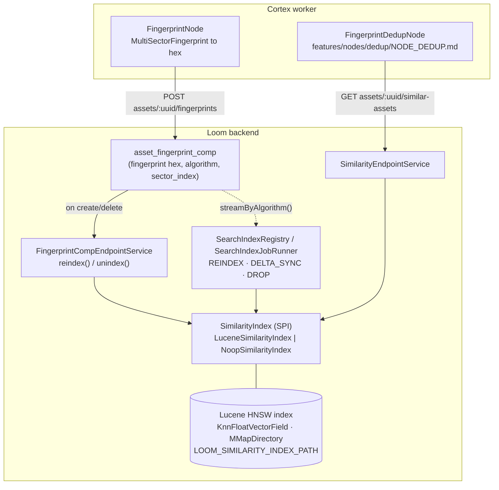

# Fingerprint Similarity Index (Lucene) — Technical Specification

> **Audience: AI coding agents.** The **perceptual video-fingerprint similarity index** owned by the
> Loom backend: a Lucene HNSW k-NN index over the 256-dim float vectors behind
> `MultiSectorFingerprint`, exposed as the `SimilarityIndex` SPI, a REST "similar assets" query and a
> row on the index-administration surface. It is what the deduplication nodes query.
>
> **Status: built and shipped**, off by default (`LOOM_SIMILARITY_ENABLED=false`).
> Open work items live in [../tasks/SEARCH_LUCENE_TASKS.md](../tasks/SEARCH_LUCENE_TASKS.md) and are
> not repeated here.

## 0. Scope boundary — read this first

This is **not** lexical search and **not** embedding search. Four vector/text subsystems exist and
are deliberately separate:

| Subsystem | Query | Backend | Spec |
|---|---|---|---|
| Lexical search | text `q` to documents | Postgres `tsvector` (`search_document`) | [../features/search/SEARCH.md](../features/search/SEARCH.md) |
| Semantic / hybrid search | text `q` to assets, RRF-fused | `TextEmbedder` + `VectorIndex` | [../features/search/SEMANTIC_SEARCH.md](../features/search/SEMANTIC_SEARCH.md) |
| Embedding k-NN (`VectorIndex`) | a face/text embedding to embeddings | `LuceneVectorIndex`, same module | [../features/search/SEMANTIC_SEARCH.md](../features/search/SEMANTIC_SEARCH.md) |
| **Fingerprint similarity (this doc)** | a video fingerprint to near-duplicate videos | `LuceneSimilarityIndex` | this file |

**Two Lucene indices live in `loom/services/lucene`, and they must never share a directory.**
`LuceneVectorIndex` (`io.metaloom.loom.vector.lucene`) serves embedding k-NN — many vectors per
asset, keyed by `embedding_uuid`, scoped by `(type, model, dimensions)`. `LuceneSimilarityIndex`
(`io.metaloom.loom.similarity.lucene`) serves fingerprints — one vector per asset, keyed by
`asset_uuid`, filtered by `algorithm`. Separate directories, separate `IndexWriter`s: pointing
`LOOM_VECTOR_INDEX_PATH` at `LOOM_SIMILARITY_INDEX_PATH` puts two incompatible vector populations in
one index.

**Operating the index** — size, backlog, reindex, drop, orphan sweep, the two admin permissions and
the `/admin/indices` screen — is specified in
[../features/search/SEARCH_INDEX_ADMIN.md](../features/search/SEARCH_INDEX_ADMIN.md). This file
specifies the index itself.

---

## 1. Why Lucene here

[SEARCH.md](../features/search/SEARCH.md) rejects Lucene by name for lexical search, and
[SEMANTIC_SEARCH.md](../features/search/SEMANTIC_SEARCH.md) reasons about a database-side vector
store. This subsystem adopts Lucene anyway, **for this workload only**. Understand the reasoning
before touching the module:

1. **The lexical rejection does not apply.** Its objection is that an embedded full-text index
   becomes per-replica local state that must be identical across replicas *and* is a
   system-of-record. A fingerprint k-NN index is neither: it is a bounded, derived, rebuildable
   cache of one float vector per asset, reconstructable in full from `asset_fingerprint_comp`.
   Losing it costs a rebuild, never data.
2. **No database extension.** pgvector is not in the stock Postgres image, so an unguarded
   `CREATE EXTENSION vector` would break the build for everyone. Lucene is pure JVM.
3. **The corpus is small and uniform:** 256 dimensions, one vector per asset.
4. **The format is not ours.** The codec is video4j's, byte-compatible with `xdb-clean`.
5. **The SPI keeps the door open.** `SimilarityIndex` mirrors the `VectorIndex` SPI, so a later
   external vector service — or a unification of the two vector workloads — is a module swap.

---

## 2. Architecture



**System-of-record vs. index.** `asset_fingerprint_comp` is the system-of-record; the Lucene index is
a derived cache. Every write path updates the comp table first and the index second, best-effort: a
failed index write is logged and never fails the comp write.

**Query path.** stored hex to `MultiSectorFingerprint.of(hex).vector()` (inside the implementation) to
a `KnnFloatVectorQuery` pre-filtered by an `algorithm` `TermQuery` to `List<SimilarityHit>` to a
response with the query asset excluded. The endpoint asks the index for `limit + 1` neighbours
precisely because the asset always matches itself and is then dropped.

---

## 3. The `SimilarityIndex` SPI

`io.metaloom.loom.api.search` in `loom-shared/api`, alongside `SearchProvider` and `VectorIndex`:

```java
// write path
void index(UUID assetUuid, String sha512, String algorithm, float[] vector);
void index(UUID assetUuid, String sha512, String algorithm, String fingerprintHex);
void remove(UUID assetUuid);
void commit();

// query path
List<SimilarityHit> query(String algorithm, float[] vector,        int limit, float scoreThreshold);
List<SimilarityHit> query(String algorithm, String fingerprintHex, int limit, float scoreThreshold);

// administration (SEARCH_INDEX_ADMIN.md)
void rebuild(Stream<IndexedFingerprint> all);   // replaces the whole index
void rebuildFromHex(Stream<HexFingerprint> all);
void drop(String algorithm);                    // one algorithm only, others survive
IndexStatus status();                           // documents, deleted, bytes on disk
IndexStatus status(String algorithm);           // document count only
Stream<UUID> streamIndexedAssetUuids();         // input to the orphan sweep; caller closes
boolean isAvailable();
String providerName();                          // "lucene" | "none"

public record SimilarityHit(UUID assetUuid, String sha512, float score) {}
public record IndexedFingerprint(UUID assetUuid, String sha512, String algorithm, float[] vector) {}
public record HexFingerprint(UUID assetUuid, String sha512, String algorithm, String fingerprintHex) {}
```

**The hex overloads are the ones Loom actually calls.** `asset_fingerprint_comp` stores the
fingerprint as hex and decoding it needs the video4j codec; keeping that knowledge inside the
implementation is what keeps video4j out of `loom/services/rest`. Malformed hex is logged and
skipped, never fatal.

**`drop(algorithm)` is the counterpart to `VectorIndex.drop(space)`.** `rebuild(...)` clears the whole
index, so retiring one fingerprint algorithm has to go through `drop`. A `null` algorithm means
"everything", because documents written without an algorithm carry no `ALGORITHM_FIELD` and a term
query would miss them.

### 3.1 `LuceneSimilarityIndex`

Facts worth knowing before editing
`loom/services/lucene/src/main/java/io/metaloom/loom/similarity/lucene/LuceneSimilarityIndex.java`:

- Fields: `KnnFloatVectorField("fingerprint")`, `StringField("asset_uuid")` (also the update/delete
  `Term` and the source of the orphan-sweep term enumeration), `StringField("algorithm")` (filter),
  `StoredField("sha512sum")`.
- Codec: an anonymous `Lucene103Codec` whose k-NN format is video4j's
  `HighDimensionKnnVectorsFormat` wrapping `Lucene99HnswVectorsFormat(200, 100)`, sized by
  `MultiSectorFingerprint.FINGERPRINT_VECTOR_SIZE`. This matches `xdb-clean`'s on-disk format.
- It writes its **own** documents rather than calling video4j's `HashFingerprintIndexer.indexMedia`,
  which stores only `sha512sum` and offers no `asset_uuid` key, no `algorithm` filter and no delete.
- Concurrency: a `ReentrantLock` serializes `index` / `remove` / `rebuild` / `drop`; reads go through
  a `SearcherManager` opened on the writer for near-real-time visibility.
- A commit point is forced at open so the `SearcherManager` can read a fresh index.
- It implements `AutoCloseable`; `close()` releases searcher manager, writer and directory, is
  idempotent, and flips `available` to `false` **before** closing anything so late writes no-op — see
  §4.3. `LuceneVectorIndex` has the identical shape and is closed by the same hook.

`NoopSimilarityIndex` is bound whenever similarity is disabled or the directory is unusable: writes
are no-ops, `query` returns empty, `status()` reports unhealthy with the reason, `isAvailable()` is
`false` and `providerName()` is `"none"`. That `false` is what makes the endpoint reject rather than
lie.

---

## 4. Lifecycle

| Trigger | Behaviour |
|---|---|
| **Boot** | `SimilarityModule` creates the directory, checks writability, opens the index. Any failure binds `NoopSimilarityIndex`, logs, and **boot continues**. No automatic rebuild — see §4.1. |
| **Fingerprint comp created/updated** | `FingerprintCompEndpointService.reindex(comp)` loads the owning asset for its `sha512sum`, then calls `index(...)` + `commit()`, best-effort, after the DB write. Sector 0 only. A failed hash lookup skips the index write, never the comp write. |
| **Fingerprint comp / asset deleted** | `unindex(assetUuid)` calls `remove(...)` + `commit()`. `asset_fingerprint_comp` already cascades on asset delete. |
| **Admin reindex** | `SearchIndexJobRunner.reindexFingerprints` drops the algorithm, streams `AssetComponentDao.streamHexFingerprintsByAlgorithm` (the comp joined to the asset's hash) and re-indexes, reporting progress on the job. |
| **Admin delta sync** | `sweepFingerprintOrphans` enumerates indexed asset uuids in batches of `SWEEP_BATCH`, keeps those `filterExistingFingerprintAssets` confirms, removes the rest. It can only **remove**: there is no dirty flag recording that a fingerprint was never indexed, so anything missing is restored by a reindex. |
| **Legacy rebuild route** | `POST /api/v1/similarity-index/rebuild` streams `streamHexFingerprintsByAlgorithm(algorithm)` into `rebuildFromHex(...)` inline in the request. Superseded by the job routes; kept because both clients carry it. |
| **Demo database** | `DemoDatabaseInitializer.seedFingerprintComps` writes three `asset_fingerprint_comp` rows — a near-duplicate pair (`city-traffic.mp4` and its 720p re-encode, one bit apart) plus one unrelated video. The meeting clip's cut deliberately gets none: a cut of the source really is a near-duplicate of it, and seeding it as "unrelated" would put a claim in the index the fingerprint node would never make. Comps only, **regardless of `LOOM_SIMILARITY_ENABLED`**: the table is the system-of-record, so an operator who switches similarity on gets a corpus by running `REINDEX`. See §4.2. |
| **Shutdown** | `BootstrapInitializer.deinit()` commits and closes the index after the HTTP server has stopped, releasing `write.lock`. See §4.3. |

**Rebuildability is the whole safety story.** If a hook is ever missed — a crash between the DB commit
and the index write — a reindex restores correctness. Never treat the index as authoritative.

### 4.1 Closed design decisions

- **No boot-time auto-rebuild.** The write hook plus the explicit reindex job cover the same ground
  without scanning the fingerprint table on every start.
- **No Flyway migration, no Postgres extension.** The index is derived from `asset_fingerprint_comp`
  (`V2.41`). `./setup-pool.sh` and `loom/db/jooq/generate.sh` are unaffected by work in this area.
- **No dedicated permission.** The routes reuse `READ_ASSET` / `UPDATE_ASSET`; the admin surface uses
  `READ_SEARCH_INDEX` / `MANAGE_SEARCH_INDEX` (`V2.85`, `V2.86`).
- **One process per index directory**, never a shared volume — see §7.

### 4.2 The demo fixture, and the arithmetic behind it

`DemoDatabaseInitializer` seeds the fingerprints the demo container needs for this feature to be
anything other than an empty list. The distances are chosen, not arbitrary, and the reason is worth
knowing before writing any other fixture:

A fingerprint decodes to **256 components that are each 0 or 1**, and a `KnnFloatVectorField` scores
Euclidean neighbours as `1 / (1 + d²)`. Over 0/1 components `d²` *is* the Hamming distance, so

> **score = 1 / (1 + differing bits)**

One differing bit scores `0.5` — the highest any pair of *distinct* fingerprints can reach — and the
`0.10` floor is crossed at nine differing bits. Anything meaningfully further apart than a re-encode
is invisible to a query, which is what makes this a near-duplicate index rather than a similarity
one. The seeded pair therefore differs in a single bit and the unrelated videos sit at least 64 bits
away; the `dedup_group` the same two assets carry records `0.5` for exactly this reason, so the
review queue and the index agree.

`DemoDatabaseInitializer.demoFingerprintHex(...)` owns the hex layout (2 bytes version, 1 pad, 2
bytes vector size, 1 pad, 32 bytes of bit data) and `SimilarAssetsEndpointTest` calls it rather than
repeating it: the codec is video4j's, nothing validates the value on the way into the comp table, and
hex the codec rejects is logged and skipped — a drifted copy of the layout surfaces as an index that
is quietly empty.

### 4.3 Shutdown

`BootstrapInitializer.deinit()` closes both Lucene indices, **after** the HTTP server has been closed
and the drainers stopped, and **before** the JDBC pool is released:

```java
closeIndex(similarityIndex, similarityIndex::commit, "fingerprint similarity index");
closeIndex(vectorIndex,     vectorIndex::commit,     "vector index");
```

Three decisions are load-bearing:

- **`instanceof AutoCloseable` is the seam, not a `close()` on the SPI.** `NoopSimilarityIndex` holds
  no resources and an external vector backend would not either, so only the embedded Lucene
  implementations need this. `LuceneSimilarityIndex` and `LuceneVectorIndex` both implement
  `AutoCloseable`; the Noops simply do not match and are skipped.
- **Commit, then close — in two separate `try` blocks.** `IndexWriter.close()` flushes on the way out
  anyway, but a flush that fails *inside* `close()` discards the segments without a distinguishable
  error. The commit gets its own block because a failed commit must still be followed by the close,
  or the `write.lock` this step exists to release stays on disk. Both failures are logged and
  swallowed — neither may stop the rest of the shutdown sequence.
- **Ordering.** The HTTP server is already closed, so no new request can reach the index, and
  `EmbeddingIndexDrainer` / `SearchEmbeddingDrainer` were stopped at the top of `deinit()`.

`close()` on both implementations is **idempotent and guarded on `available`**: a second call does
nothing, and every entry point re-reads `available` *inside* the write lock (reads capture the
`SearcherManager` first) so a request still in flight when the index closes degrades to a no-op or an
empty result rather than an `AlreadyClosedException` on the way out. Calling `close()` twice is not
hypothetical — the test extension and `LoomImpl` both route through `deinit()`.

What this buys: an `IndexWriter` holds an **exclusive `write.lock`** on its directory. JVM exit
releases it, so in production the cost of skipping this was bounded; in a test suite, where one JVM
boots and tears down many servers over the same directory, the next boot would find the lock held and
silently bind `NoopSimilarityIndex` — a 503 instead of a result, blamed on whichever test ran next.
See [../concept/CLUSTERING.md](../concept/CLUSTERING.md) §3.

---

## 5. REST surface

| Method and path | Permission | Notes |
|---|---|---|
| `GET /api/v1/assets/:uuid/similar-assets?algorithm=&limit=&threshold=` | `READ_ASSET` | Score-desc list, query asset excluded. Empty 200 when the asset has no fingerprint. `limit` must be a positive integer, `threshold` a float — otherwise 400 `BAD_QUERY_PARAMS`. |
| `POST /api/v1/similarity-index/rebuild?algorithm=` | `UPDATE_ASSET` | 204 No Content. **Deprecated** in favour of the `/search-indices` job routes; runs the whole rebuild inside the HTTP request. |
| `GET /api/v1/search-indices` and its job routes | `READ_SEARCH_INDEX` / `MANAGE_SEARCH_INDEX` | The `fingerprint` index row, its status and the `REINDEX` / `DELTA_SYNC` / `DROP` actions — [../features/search/SEARCH_INDEX_ADMIN.md](../features/search/SEARCH_INDEX_ADMIN.md) |

The two similarity routes answer **503 `SEARCH_UNAVAILABLE`** when disabled or unopenable, with a
message distinguishing "`LOOM_SIMILARITY_ENABLED=false`" from "the index could not be opened".

Java client (`SimilarityMethods`, aggregated into `ClientMethods`):

```java
LoomClientRequest<SimilarAssetListResponse> listSimilarAssets(UUID assetUuid, String algorithm, Integer limit, Float threshold);
LoomClientRequest<NoResponse> rebuildSimilarityIndex();
```

Python client: `clients/python/loom_client/methods/similarity.py` —
`list_similar_assets(...)`, `rebuild_similarity_index()`. Parity with the Java client is guarded by
`clients/python/tests/test_parity.py`; see [PYTHON_CLIENT.md](PYTHON_CLIENT.md).

`SimilarAssetResponse` carries `assetUuid`, `sha512` and `score`. **`sha512` is the matched asset's
content hash**, which is what a dedup consumer identifies a duplicate by. `asset_fingerprint_comp`
does not carry it, so every write path reaches for `asset` instead: the two rebuild paths through
`AssetComponentDao.streamHexFingerprintsByAlgorithm(algorithm)` (which joins it in), the incremental
write hook through `AssetDao.load(assetUuid)`. It is `null` only for documents written before that
join existed — a reindex repairs those.

---

## 6. Configuration

| Env var | Default | Meaning |
|---|---|---|
| `LOOM_SIMILARITY_ENABLED` | `false` | Master switch. Also forced off (logged) when the index dir is unwritable or the index cannot open. |
| `LOOM_SIMILARITY_INDEX_PATH` | `similarity-index` | On-disk Lucene directory (`MMapDirectory`), relative to the process CWD unless absolute. One directory per process. |
| `LOOM_SIMILARITY_ALGORITHM` | `metaloom-multisector-v1` | Which `asset_fingerprint_comp.algorithm` participates; per-request overridable. |
| `LOOM_SIMILARITY_SCORE_THRESHOLD` | `0.10` | k-NN score floor (matches video4j `QueryResultFactory.DEFAULT_SCORE_THRESHOLD`); per-request overridable. |
| `LOOM_SIMILARITY_TOPK` | `10` | Default neighbours per query; per-request overridable. |

`SimilarityOptions.validate()` only enforces these when `enabled`, so a disabled index never blocks
boot on a bad path. Full config context: [CONFIGURATION.md](CONFIGURATION.md) §4.11. The Helm chart
templates none of these values yet — Task 2 in
[../tasks/SEARCH_LUCENE_TASKS.md](../tasks/SEARCH_LUCENE_TASKS.md).

---

## 7. Conventions and Gotchas

| Area | Gotcha |
|---|---|
| **Not lexical or embedding search** | Keep this subsystem separate from [SEARCH.md](../features/search/SEARCH.md) and [SEMANTIC_SEARCH.md](../features/search/SEMANTIC_SEARCH.md). Same word "similarity", different index, different data, different spec. |
| **Two Lucene indices, one module** | `LuceneSimilarityIndex` and `LuceneVectorIndex` share a Maven module and nothing else. Never point their paths at the same directory. |
| **Derived index** | The Lucene index is a rebuildable cache of `asset_fingerprint_comp`, never a system-of-record. Any drift is fixed by a reindex. |
| **One process per index directory** | `IndexWriter` holds an exclusive `write.lock`, so two Loom instances must never share `LOOM_SIMILARITY_INDEX_PATH` — the second silently gets `NoopSimilarityIndex` and its similarity routes answer 503. This is also why `SimilarAssetsEndpointTest` needs a per-test index directory. Full picture: [../concept/CLUSTERING.md](../concept/CLUSTERING.md) §3. |
| **Closed means no-op, never an exception** | `close()` is idempotent and every entry point re-checks `available` inside the write lock, so a request racing the shutdown gets an empty list rather than an `AlreadyClosedException`. Any new method on `LuceneSimilarityIndex` / `LuceneVectorIndex` owes the same guard — the outer `if (!available)` alone is not enough, because a caller can be parked on the write lock while `close()` runs. §4.3 |
| **No silent degradation** | A disabled index makes the routes answer **503**, never an empty list — "no duplicates" and "index off" must not look alike to a dedup node. |
| **`sha512` comes from `asset`, not the comp** | The component table has no content hash, so every write path joins or loads it (§5). A path that passes `null` there silently degrades the hit for the dedup consumer — the compiler cannot catch it, so the endpoint and DAO tests do. |
| **Sector 0 only, and there is nothing else to index** | The write hook indexes `sector_index == 0` and the query loads sector 0, matching what `FingerprintNode` writes — it hardcodes `setSectorIndex(0)` and is the only writer, so **no row with `sector_index > 0` has ever existed**. Do not read `MultiSectorFingerprint` as a producer of them: its "sectors" are seek points stacked into one vector, not timeline windows, and a whole-asset vector cannot match an excerpt. Clip matching needs a windowed producer first — [../tasks/NODE_FINGERPRINT_TASKS.md](../tasks/NODE_FINGERPRINT_TASKS.md) Tasks 3-4 — and only then the indexing half in [../tasks/SEARCH_LUCENE_TASKS.md](../tasks/SEARCH_LUCENE_TASKS.md) Task 5. |
| **Lucene version** | There is **no local Lucene pin** and there must not be one: Lucene arrives transitively from video4j's `fingerprint-indexer` (`Lucene103Codec`). A local pin breaks the codec match with `xdb-clean`. |
| **Hex, not `float[]`, at the boundary** | REST and the hooks use the hex overloads so the video4j codec stays inside `loom/services/lucene`. |
| **`limit + 1`** | The endpoint over-fetches by one because the query asset always matches itself. Change the k-NN limit and you change the self-exclusion arithmetic. |
| **Best-effort hooks** | `reindex` / `unindex` swallow failures by design, so silent drift is possible — the reindex job is the recovery path, not an optional extra. |
| **Score semantics** | Lucene k-NN vector similarity, not a probability. `0.10` comes from video4j and `xdb-clean`; tune per corpus. The components are 0/1, so the score is `1 / (1 + differing bits)` — see §4.2 before hand-writing any fingerprint fixture. |
| **Delta sync only removes** | The fingerprint index has no freshness column, so `DELTA_SYNC` sweeps orphans and nothing else. Missing entries need `REINDEX`. |

---

## 8. Key Classes Reference

| Class | Package / module | Purpose |
|---|---|---|
| `SimilarityIndex` | `io.metaloom.loom.api.search` (`loom-shared/api`) | SPI — sibling of `SearchProvider` and `VectorIndex` |
| `SimilarityHit` / `IndexedFingerprint` / `HexFingerprint` | `io.metaloom.loom.api.search` | query result / rebuild inputs |
| `LuceneSimilarityIndex` | `io.metaloom.loom.similarity.lucene` (`loom/services/lucene`) | Lucene HNSW implementation on video4j's codec |
| `NoopSimilarityIndex` | `io.metaloom.loom.similarity` (`loom/services/lucene`) | disabled fallback |
| `SimilarityModule` | `io.metaloom.loom.core.dagger` (`loom/core`) | Dagger binding + boot guard |
| `BootstrapInitializer` | `io.metaloom.loom.core.boot` (`loom/core`) | `deinit()` commits and closes both Lucene indices (§4.3) |
| `SimilarityOptions` | `io.metaloom.loom.api.options` (`loom-shared/api`) | the five `LOOM_SIMILARITY_*` settings |
| `SimilarityEndpointService` | `io.metaloom.loom.rest.service.impl` (`loom/services/rest`) | both similarity routes' logic |
| `SimilarityIndexEndpoint` | `io.metaloom.loom.rest.endpoint.impl` | `/similarity-index/rebuild` |
| `AssetEndpoint` | `io.metaloom.loom.rest.endpoint.impl` | hosts `/assets/:uuid/similar-assets` |
| `FingerprintCompEndpointService` | `io.metaloom.loom.rest.service.impl` | the write/delete index hooks |
| `SearchIndexRegistry` / `SearchIndexJobRunner` | `io.metaloom.loom.rest.search` | the `fingerprint` index row and its jobs |
| `SimilarAssetResponse` / `SimilarAssetListResponse` | `io.metaloom.loom.rest.model.similarity` (`loom-shared/rest-model`) | REST DTOs |
| `SimilarityMethods` | `io.metaloom.loom.client.common.method` (`loom-client/common`) | Java client interface |
| `AssetComponentDao.{streamHexFingerprintsByAlgorithm,countByAlgorithm,filterExistingFingerprintAssets}` | `io.metaloom.loom.db.model.asset` | rebuild and sweep source queries. `streamHexFingerprintsByAlgorithm` is the projection that joins the asset hash and the only one the rebuilds use; the older `findByAlgorithm` / `streamByAlgorithm` remain on the DAO with no caller left |
| `FingerprintDedupNode` / `FingerprintDedupApplyNode` | `io.metaloom.cortex.node.dedup` (`cortex/nodes/dedup`) | the consumer of this index |
| `MultiSectorFingerprint` / `HighDimensionKnnVectorsFormat` | video4j (`fingerprint`, `fingerprint-indexer`) | reused vector format and codec |

---

## 9. Test Setup

Existing coverage — extend these rather than starting new classes:

- **`LuceneSimilarityIndexTest`** (`loom/services/lucene/src/test/java/io/metaloom/loom/similarity/lucene/`)
  — 13 tests over a per-test temp directory: near-neighbour and threshold behaviour, remove, upsert,
  algorithm filtering, both rebuild paths, hex indexing and malformed hex, `drop` leaving other
  algorithms intact, per-algorithm counts and backend bytes, asset-uuid enumeration for the
  orphan sweep, and the two shutdown tests —
  `shouldBeSafeToCloseTwiceAndIgnoreLateWrites` (a double close plus every entry point exercised
  afterwards) and `shouldReopenTheSameDirectoryAfterClose` (a second index opens the same directory
  and still sees the committed document — the `write.lock` regression of §4.3).
- **`SimilarAssetsEndpointTest`** (`loom/core/src/test/java/io/metaloom/loom/core/endpoint/test/`)
  — 9 tests driving the whole path through the client: fingerprint write makes assets findable,
  empty list without a fingerprint, delete removes from the index, rebuild restores from the
  component table, bad `limit` rejected, permissions enforced, score reported, and the matched
  asset's `sha512sum` reported after each of the three write paths (hook, legacy rebuild, and the
  admin `REINDEX` job, which is polled to completion). It configures a
  **per-test index directory** through the inherited `loom` extension — each test boots its own
  server and would otherwise collide on `write.lock`.
- **`SearchIndexEndpointTest`** (`loom/core/.../endpoint/test/`) — covers the `fingerprint` row and
  its jobs on the admin surface.
- **`DemoFingerprintSeedTest`** (`loom/core/src/test/java/io/metaloom/loom/core/boot/`) — 3 tests over
  the demo fixture: the four seeded comps carry the default algorithm, node kind `fingerprint` and
  sector 0; the pair differs in exactly one byte of bit data under an identical header; and a rebuild
  followed by a query returns the partner at `0.5` with its `sha512sum`, excluding the query asset and
  both unrelated videos. It calls `seedFingerprintComps` directly — `DemoDatabaseInitializer.init()`
  only populates an *empty* asset table and the pooled database is pre-populated, so a boot-time run
  would skip every seed step.
- **`AssetFingerprintSegmentCompDaoTest`** (`loom/db/jooq/src/test/java/io/metaloom/loom/db/jooq/dao/`)
  — owns the DAO side, including `streamHexFingerprintsByAlgorithm` joining the asset hash. The
  pooled database is pre-populated, so it scopes its query by an algorithm only it writes.

Commands:

```bash
./setup-pool.sh                                                   # required before any loom/core test
mvn test -pl loom/services/lucene -Dtest=LuceneSimilarityIndexTest
mvn test -pl loom/db/jooq -Dtest=AssetFingerprintSegmentCompDaoTest
mvn test -pl loom/core -Dtest=SimilarAssetsEndpointTest,DemoFingerprintSeedTest
```

A change here also owes what [../guidelines/CODING.md](../guidelines/CODING.md) requires: endpoint
plus permission tests for any new route, an update to this file, and customer-facing docs under
`website/content/english/docs/` when operator-visible behaviour changes.

---

## 10. Where do I find ...?

| Need | Look here |
|---|---|
| The SPI and its records | `loom-shared/api/src/main/java/io/metaloom/loom/api/search/` |
| The Lucene implementation | `loom/services/lucene/src/main/java/io/metaloom/loom/similarity/lucene/LuceneSimilarityIndex.java` |
| Which implementation gets bound, and the boot guard | `loom/core/src/main/java/io/metaloom/loom/core/dagger/SimilarityModule.java` |
| The write/delete hooks | `loom/services/rest/.../service/impl/FingerprintCompEndpointService.java` (`reindex` / `unindex`) |
| Route registration | `.../endpoint/impl/AssetEndpoint.java`; `.../endpoint/impl/SimilarityIndexEndpoint.java` |
| Admin jobs over this index | `loom/services/rest/.../rest/search/SearchIndexJobRunner.java` (`runFingerprint`) |
| Env vars in context | [CONFIGURATION.md](CONFIGURATION.md) §4.11 |
| Route inventory in context | [RESTAPI.md](RESTAPI.md) |
| The fingerprint vector format and engine (reused) | video4j `.../fingerprint/v2/MultiSectorFingerprint.java`, `.../fingerprint/index/` |
| Where fingerprints are stored | `loom/db/flyway/.../V2.41__add_asset_fingerprint_comp.sql`; `loom/db/jooq/.../AssetComponentDaoImpl.java` |
| How a node writes a fingerprint | `cortex/nodes/fingerprint/core/.../FingerprintNode.java` |
| Open work on the **producer** (how the hash is computed and persisted) | [../tasks/NODE_FINGERPRINT_TASKS.md](../tasks/NODE_FINGERPRINT_TASKS.md) |
| The demo fixture and the hex layout | `loom/core/.../boot/DemoDatabaseInitializer.java` (`seedFingerprintComps`, `demoFingerprintHex`) |
| The consumer of this index | [../features/nodes/dedup/NODE_DEDUP.md](../features/nodes/dedup/NODE_DEDUP.md), [../workflows/WORKFLOW_DEDUP.md](../workflows/WORKFLOW_DEDUP.md) |
| Operating the index (status, jobs, UI) | [../features/search/SEARCH_INDEX_ADMIN.md](../features/search/SEARCH_INDEX_ADMIN.md) |
| Entity model for `asset_fingerprint_comp` | [DOMAIN.md](DOMAIN.md) |
| Multi-instance / `write.lock` consequences | [../concept/CLUSTERING.md](../concept/CLUSTERING.md) §3 |
| Where the index is closed on shutdown | `loom/core/.../boot/BootstrapInitializer.java` (`deinit`, `closeIndex`) — §4.3 |
| Open work | [../tasks/SEARCH_LUCENE_TASKS.md](../tasks/SEARCH_LUCENE_TASKS.md) |

---

## 11. Progress Assessment

**Design decisions closed**
- [x] Lucene (reusing video4j's codec) for the fingerprint index, behind a `SimilarityIndex` SPI (§1, §3)
- [x] The index is a derived, rebuildable cache of `asset_fingerprint_comp`; no migration, no Postgres extension (§2, §4.1)
- [x] Hex overloads on the SPI so video4j stays out of `loom/services/rest` (§3)
- [x] Disabled or broken means 503, never an empty list (§5)
- [x] No boot-time auto rebuild; no similarity-specific permission (§4.1)
- [x] One index directory per process (§7)

**Built**
- [x] `SimilarityIndex` SPI plus `SimilarityHit` / `IndexedFingerprint` / `HexFingerprint`
- [x] `LuceneSimilarityIndex` — own documents (`asset_uuid` key, `algorithm` filter, delete), `ReentrantLock` for mutations, `SearcherManager` for reads
- [x] `NoopSimilarityIndex` bound when disabled or unopenable; `SimilarityModule` degrades instead of failing boot
- [x] `SimilarityOptions` on `LoomOptions`, env wiring and `validate()`
- [x] Comp write/delete hooks in `FingerprintCompEndpointService` (sector 0, best-effort)
- [x] The matched asset's `sha512sum` on every hit — joined in by `streamHexFingerprintsByAlgorithm` on the rebuild paths, loaded per write on the hook
- [x] `GET /assets/:uuid/similar-assets` and `POST /similarity-index/rebuild`
- [x] Java and Python clients plus the REST DTOs
- [x] Administration: `drop`, `status`, `status(algorithm)`, `streamIndexedAssetUuids`, `providerName`, wired into the `fingerprint` index row, its `REINDEX` / `DELTA_SYNC` / `DROP` jobs and `/admin/indices`
- [x] Consumer: `FingerprintDedupNode` queries `similar-assets` and reports review groups
- [x] Demo data: four seeded `asset_fingerprint_comp` rows including a near-duplicate pair, aligned with the seeded dedup proposal over the same two assets (§4.2)
- [x] Customer-facing docs: `website/content/english/docs/loom/search-indices/` and `.../docs/nodes/{fingerprint,dedup}/`
- [x] Shutdown: `BootstrapInitializer.deinit()` commits and closes both Lucene indices; `close()` is idempotent and late calls no-op (§4.3)
- [x] 25 tests (`LuceneSimilarityIndexTest` 13, `SimilarAssetsEndpointTest` 9, `DemoFingerprintSeedTest` 3), plus the fingerprint row in `SearchIndexEndpointTest` and the DAO projection in `AssetFingerprintSegmentCompDaoTest`

**Open** — full task text in [../tasks/SEARCH_LUCENE_TASKS.md](../tasks/SEARCH_LUCENE_TASKS.md)
- [x] Task 1: `sha512` is `null` on every hit — done 2026-08-12, the asset hash is joined into all three write paths
- [ ] Task 2: the Helm chart templates no `LOOM_SIMILARITY_*` value
- [x] Task 3: demo data seeds no fingerprints — done 2026-08-12, four comps including a near-duplicate pair (§4.2)
- [x] Task 4: `close()` is never called on shutdown — done 2026-08-12, wired into `BootstrapInitializer.deinit()` for both Lucene indices (§4.3)
- [ ] Task 5: only sector 0 is indexed — blocked on the producer, see [../tasks/NODE_FINGERPRINT_TASKS.md](../tasks/NODE_FINGERPRINT_TASKS.md)
- [ ] Task 6: no UI surface for similar assets

---
_Git HEAD revision: `0b8fe39a`_
_Last updated: 2026-08-12 (Task 4: both Lucene indices are committed and closed on server shutdown,
§4.3. Earlier: §7 gotcha corrected — `MultiSectorFingerprint` does not produce per-window rows and
nothing else does either; producer work now tracked in tasks/NODE_FINGERPRINT_TASKS.md)_
