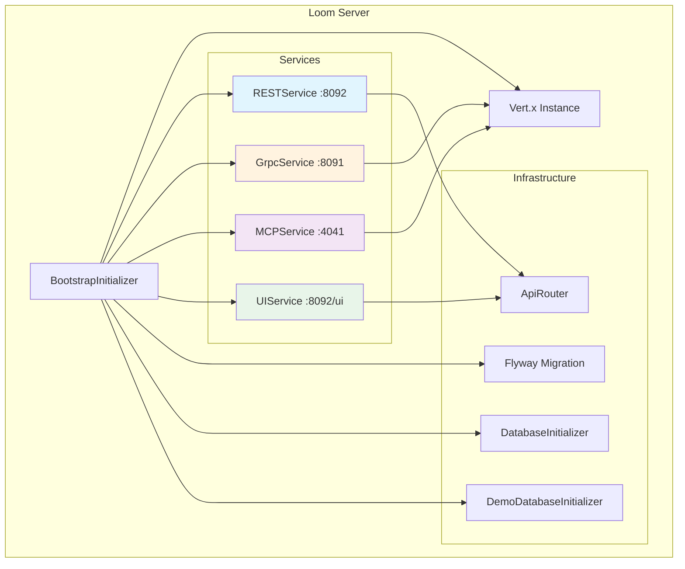
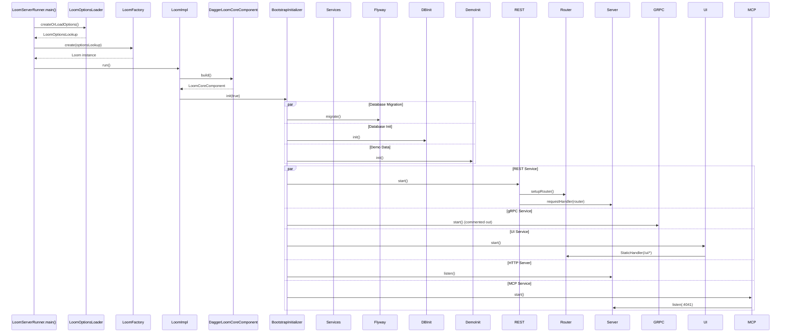

# Loom Server Specification

## Overview

The Loom Server is the core HTTP/gRPC/MCP server component of the MetaLoom platform. It provides REST APIs, gRPC services, Model Context Protocol (MCP) endpoints, and a static UI file server. The server is built on **Vert.x** (reactive, non-blocking) and uses **Dagger** for dependency injection.

### Server Architecture



---

## Server Configuration

### Configuration File Locations

The server loads configuration from the following locations in priority order:

| Priority | Path | Description |
|----------|------|-------------|
| 1 | `/etc/metaloom/loom.yml` | System-wide configuration |
| 2 | `~/.config/metaloom/loom.yml` | User-specific configuration |
| 3 | `config/loom.yml` | Local project configuration |
| 4 | Classpath `/loom.yml` | Bundled default configuration |
| 5 | Generated default | Auto-generated if none found |

### Configuration Structure (loom.yml)

```yaml
database:
  host: "127.0.0.1"
  port: 5432
  username: "postgres"
  password: "finger"
  databaseName: "loom"
  minPoolSize: 5
  acquireIncrement: 5
  maxPoolSize: 20

server:
  grpcPort: 8091
  bindAddress: "0.0.0.0"
  restPort: 8092
  monitoringPort: 8989

auth:
  keystorePassword: "8qA9uBbdaEFp"
```

### ServerOptions Class Reference

**Package:** `io.metaloom.loom.api.options.ServerOptions`

| Property | Default | Environment Variable | Description |
|----------|---------|---------------------|-------------|
| `grpcPort` | 8091 | `LOOM_SERVER_GRPC_PORT` | gRPC server port |
| `bindAddress` | 0.0.0.0 | `LOOM_SERVER_GRPC_BIND_ADDRESS` | Bind address for all servers |
| `restPort` | 8092 | `LOOM_SERVER_REST_PORT` | REST/HTTP server port |
| `monitoringPort` | 8989 | `LOOM_SERVER_MON_PORT` | Monitoring server port (reserved) |

### Environment Variable Override

All server options support environment variable override via the `@EnvironmentVariable` annotation. The `overrideWithEnv()` method is called during configuration loading:

```java
@Override
public void overrideWithEnv() {
    OptionUtils.applyEnvInt("LOOM_SERVER_GRPC_PORT", this::setGrpcPort);
    OptionUtils.applyEnv("LOOM_SERVER_GRPC_BIND_ADDRESS", this::setBindAddress);
    OptionUtils.applyEnvInt("LOOM_SERVER_REST_PORT", this::setRestPort);
    OptionUtils.applyEnvInt("LOOM_SERVER_MON_PORT", this::setMonitoringPort);
}
```

---

## Server Connection / Port Handling

### Port Assignment Summary

| Service | Default Port | Config Property | Env Variable | Protocol |
|---------|-------------|-----------------|--------------|----------|
| gRPC | 8091 | `server.grpcPort` | `LOOM_SERVER_GRPC_PORT` | gRPC over HTTP/2 |
| REST API | 8092 | `server.restPort` | `LOOM_SERVER_REST_PORT` | HTTP/1.1 + WebSocket |
| MCP | 4041 | (hardcoded) | — | HTTP + SSE / WebSocket |
| Monitoring | 8989 | `server.monitoringPort` | `LOOM_SERVER_MON_PORT` | Reserved (not implemented) |
| UI Static | 8092 | (shares REST) | — | HTTP/1.1 |

### Server Startup Sequence



### Vert.x HttpServer Creation

The HTTP server is created in `VertxModule.java` and shared between REST and UI services:

```java
@Provides
@Singleton
public HttpServer httpServer(Vertx vertx, LoomOptions options) {
    HttpServerOptions httpOptions = new HttpServerOptions()
        .setHost(options.getServer().getBindAddress())
        .setPort(options.getServer().getRestPort());
    return vertx.createHttpServer(httpOptions);
}
```

**Key Points:**
- Single `HttpServer` instance shared by REST and UI services
- REST routes registered via `ApiRouter` (Vert.x Web Router)
- UI static files served from `/loom/ui` classpath resource
- Server starts listening in `BootstrapInitializer.init()` via `httpServer.listen()`

### gRPC Server (GrpcService)

The gRPC service creates its own `HttpServer` with JWT authentication:

```java
server = vertx().createHttpServer(new HttpServerOptions().setPort(0)
    .setHost("localhost")).requestHandler(jwtServer);
```

**Note:** Currently hardcoded to `port=0` (OS-assigned) and `host=localhost` — does not use `ServerOptions` configuration. This is a known issue (see Conventions and Gotchas).

### MCP Server (MCPService)

The MCP service creates a separate `HttpServer` on port 4041:

```java
HttpServerOptions httpOptions = new HttpServerOptions()
    .setHost(host)
    .setPort(port);  // DEFAULT_MCP_PORT = 4041
```

**Transports:**
1. **HTTP + SSE** (Streamable HTTP per MCP 2025-03-26)
   - `GET /mcp/sse` — Opens SSE stream
   - `POST /mcp/message?sessionId=...` — JSON-RPC requests
2. **WebSocket** — `GET /mcp/ws` — Bidirectional JSON-RPC frames

---

## Monitoring Server

### Current Status

**The monitoring server is NOT implemented.** The `monitoringPort` (default 8989) is defined in `ServerOptions` and configurable via `LOOM_SERVER_MON_PORT`, but no service currently binds to this port.

### Monitoring References in Codebase

| Location | Purpose |
|----------|---------|
| `ServerOptions.java` | Defines `DEFAULT_MONITORING_PORT = 8989` and getter/setter |
| `LoomControlChannel.java` (cortex) | Returns `hostname:monitoringPort` for cluster health reporting |
| `loom.yml` | Includes `monitoringPort: 8989` in example config |

### Health Status (Cortex Integration)

The Cortex module provides a `healthStatus()` method that returns a `JsonObject` with:
- Disk metrics (free/total space)
- Memory usage
- Thread counts
- Periodic health logging every 30 seconds

This is used by the Cortex control plane, not the Loom server directly.

---

## Key Classes Reference

| Class | Package | Purpose |
|-------|---------|---------|
| `BootstrapInitializer` | `io.metaloom.loom.core.boot` | Orchestrates server startup: migration, DB init, service startup |
| `LoomImpl` | `io.metaloom.loom.core` | Main Loom implementation, manages lifecycle |
| `LoomServerRunner` | `io.metaloom.loom.container.server` | Entry point for containerized server |
| `LoomOptions` | `io.metaloom.loom.api.options` | Root configuration object |
| `ServerOptions` | `io.metaloom.loom.api.options` | Server-specific configuration (ports, bind address) |
| `LoomOptionsLoader` | `io.metaloom.loom.common.options` | Loads configuration from YAML files |
| `VertxModule` | `io.metaloom.loom.common.dagger` | Provides Vert.x, HttpServer, EventBus, FileSystem |
| `LoomModule` | `io.metaloom.loom.common.dagger` | Provides LoomOptions, DatabaseOptions |
| `RESTService` | `io.metaloom.loom.rest` | REST API server (CORS, body handling, endpoint registration) |
| `UIService` | `io.metaloom.loom.rest` | Static file server for `/ui/*` from classpath |
| `MCPService` | `io.metaloom.loom.mcp` | Model Context Protocol server (SSE + WebSocket) |
| `GrpcService` | `io.metaloom.loom.server.grpc` | gRPC server with JWT authentication |
| `ApiRouter` | `io.metaloom.vertx.router` | Vert.x Web Router wrapper for REST endpoints |
| `RESTEndpoint` | `io.metaloom.loom.rest.endpoint` | Interface for REST endpoint registration |
| `ServerFailureHandler` | `io.metaloom.loom.rest` | Global error handler for REST routes |
| `LoomControlChannel` | `io.metaloom.cortex.impl.loom` | Cortex integration, health reporting |

---

## REST API Conventions

### Base Path

All REST endpoints are prefixed with `/api/v1` (defined in `RESTConstants.API_V1_PATH`).

### Endpoint Registration

Endpoints implement `RESTEndpoint` interface and are injected as a `Set<RESTEndpoint>` via Dagger multibinding:

```java
@Module
public class EndpointModule {
    @Provides
    @RESTEndpoints
    static Set<RESTEndpoint> endpoints(AssetEndpoint asset, UserEndpoint user, ...) {
        return Set.of(asset, user, ...);
    }
}
```

### Route Registration Pattern

```java
@Override
public void register() {
    log.info("Registering assets endpoint");
    secure(basePath() + "*");  // Apply authentication
    
    addRoute(basePath(), POST, "Create asset", requestExample, responseExample, lrc -> service.create(lrc));
    addRoute(basePath(), GET, "List assets", null, listExample, lrc -> service.list(lrc));
}
```

### CORS Configuration

```java
router.getDelegate().route().handler(CorsHandler.create()
    .addOriginWithRegex(".*")
    .allowedMethod(HttpMethod.GET, POST, PUT, DELETE, PATCH, OPTIONS)
    .allowedHeader("Content-Type", "Authorization", "Accept")
    .allowCredentials(true));
```

### Body Handling

```java
router.getDelegate().route().handler(BodyHandler.create().setBodyLimit(-1));  // No limit
```

### Error Handling

- `404` — Path not found (custom handler in `setupRouter()`)
- `400` — Validation errors (`ValidationException`)
- `500` — Internal server errors (catch-all via `ServerFailureHandler`)

---

## Conventions and Gotchas

| Issue | Description | Impact |
|-------|-------------|--------|
| **gRPC Port Hardcoded** | `GrpcService` uses `port=0` and `host=localhost` instead of `ServerOptions` | gRPC port not configurable via config/env |
| **gRPC Service Disabled** | `GrpcService` is commented out in `BootstrapInitializer` constructor | gRPC not started by default |
| **Monitoring Port Unused** | `monitoringPort` defined but no service binds to it | Reserved for future use |
| **MCP Port Hardcoded** | `MCPService.DEFAULT_MCP_PORT = 4041` not in `ServerOptions` | MCP port not configurable via config/env |
| **Single HttpServer** | REST and UI share one `HttpServer` instance | Cannot independently configure REST vs UI ports |
| **No Health Endpoint** | No `/health` or `/actuator` endpoint in REST API | External monitoring requires custom implementation |
| **Auth Service Disabled** | `authService.init()` commented out in `BootstrapInitializer` | Authentication not initialized on startup |

---

## Where Do I Find...?

| Concept | File Path |
|---------|-----------|
| Server entry point (container) | `loom/containers/server/src/main/java/io/metaloom/loom/container/server/LoomServerRunner.java` |
| Server entry point (CLI) | `loom/cli/src/main/java/io/metaloom/loom/cli/LoomCLI.java` |
| Bootstrap/startup logic | `loom/core/src/main/java/io/metaloom/loom/core/boot/BootstrapInitializer.java` |
| Main Loom implementation | `loom/core/src/main/java/io/metaloom/loom/core/LoomImpl.java` |
| Configuration loading | `loom/common/src/main/java/io/metaloom/loom/common/options/LoomOptionsLoader.java` |
| Server options (ports, bind) | `loom-shared/api/src/main/java/io/metaloom/loom/api/options/ServerOptions.java` |
| Vert.x / HttpServer DI | `loom/common/src/main/java/io/metaloom/loom/common/dagger/VertxModule.java` |
| REST service | `loom/services/rest/src/main/java/io/metaloom/loom/rest/RESTService.java` |
| UI service | `loom/services/rest/src/main/java/io/metaloom/loom/rest/UIService.java` |
| MCP service | `loom/services/mcp/src/main/java/io/metaloom/loom/mcp/MCPService.java` |
| gRPC service | `loom/services/grpc/src/main/java/io/metaloom/loom/server/grpc/GrpcService.java` |
| REST endpoint interface | `loom/services/rest/src/main/java/io/metaloom/loom/rest/endpoint/RESTEndpoint.java` |
| Example config | `e2e-test/config/loom.yml` |
| Config file locations | `loom-shared/api/src/main/java/io/metaloom/loom/api/LoomEnv.java` |

---

## Test Setup

### Running the Server Locally

```bash
# From metaloom root
./mvnw -pl loom/containers/server -am exec:java -Dexec.mainClass=io.metaloom.loom.container.server.LoomServerRunner
```

### Configuration for Testing

Create `config/loom.yml` in the module or project root:

```yaml
database:
  host: "localhost"
  port: 5432
  username: "postgres"
  password: "postgres"
  databaseName: "loom_test"
  minPoolSize: 2
  maxPoolSize: 10

server:
  grpcPort: 8091
  bindAddress: "0.0.0.0"
  restPort: 8092
  monitoringPort: 8989

auth:
  keystorePassword: "testpassword123"
```

### Integration Test Base

```java
// loom/integration-test/src/test/java/io/metaloom/loom/test/integration/AbstractIntegrationTest.java
@BeforeAll
static void setup() {
    LoomOptionsLookup options = LoomOptionsLoader.createOrLoadOptions();
    loom = Loom.create(options);
    loom.run(false);  // Non-blocking
}
```

### Verifying Server Startup

```bash
# Check REST API
curl http://localhost:8092/api/v1/assets

# Check UI
curl http://localhost:8092/ui/

# Check MCP SSE
curl -N http://localhost:4041/mcp/sse

# Check gRPC (if enabled)
grpcurl -plaintext localhost:8091 list
```

---

## Progress Assessment

- [x] Document server configuration (ServerOptions, environment variables, config file locations)
- [x] Document server connection/port handling (REST, gRPC, MCP, UI ports)
- [x] Document monitoring server status (not implemented, port reserved)
- [x] Include architecture diagram (Mermaid)
- [x] Include Key Classes Reference table
- [x] Include environment variable tables with defaults
- [x] Include Conventions and Gotchas section
- [x] Include Where do I find...? cheat sheet
- [x] Include Test Setup section
- [x] Cross-reference related specs (RESTAPI.md, etc.)
- [ ] Document gRPC service configuration fix (port/bind from ServerOptions)
- [ ] Document MCP port configuration (move to ServerOptions)
- [ ] Document monitoring server implementation plan
- [ ] Document health/actuator endpoint addition
- [ ] Document authentication service initialization

---

## Related Specifications

- [RESTAPI.md](RESTAPI.md) — REST endpoint specifications
- [MCP.md](MCP.md) — Model Context Protocol implementation
- [GRPC.md](GRPC.md) — gRPC service specifications
- [DATABASE.md](DATABASE.md) — Database configuration and migration
- [AUTH.md](AUTH.md) — Authentication and authorization