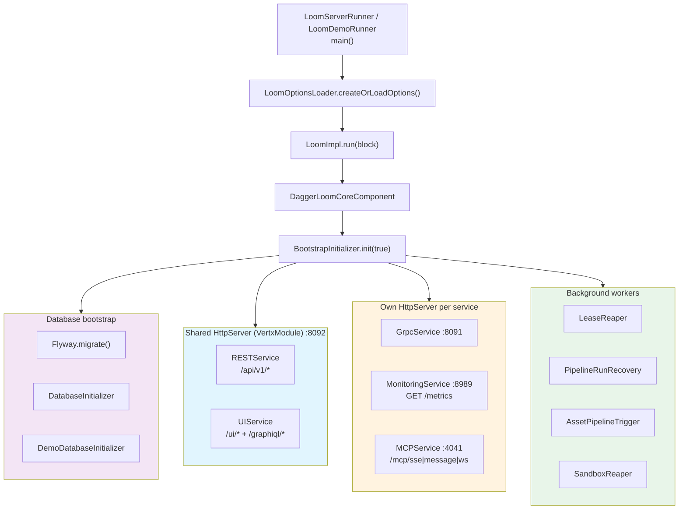

# Loom Server — Startup, Listeners & Lifecycle

> **Audience: AI coding agents.** What happens between `main()` and a listening socket, which
> processes bind which port, and what happens on shutdown. Verified against the code on the
> revision in the footer — **the code wins**; fix this file in the same change.
>
> **Scope split — do not duplicate these here:**
>
> | Topic | Spec |
> |---|---|
> | Config loading, option classes, env-var override machinery, validation | [CONFIGURATION.md](CONFIGURATION.md) |
> | Module layout, Dagger wiring, Loom↔Cortex relationship | [LOOM.md](LOOM.md) |
> | Compiling, containers, native images | [BUILD.md](BUILD.md) |
> | REST endpoints, auth flows, clients | [RESTAPI.md](RESTAPI.md) |
> | `/api/v1/health`, `/metrics`, meter catalog | [../features/ops/MONITORING.md](../features/ops/MONITORING.md), [../features/ops/METRICS.md](../features/ops/METRICS.md) |
> | MCP transports / tools | [MCP.md](MCP.md) · gRPC services: [GRPC.md](GRPC.md) |
> | SPA routing & history fallback | [ui/LOOM_UI.md](ui/LOOM_UI.md) |
> | Flyway migrations | [PERSISTENCE.md](PERSISTENCE.md) |

---

## 1. TL;DR

- **No Vert.x verticles.** There is no `AbstractVerticle` and no `deployVerticle()` anywhere in
  `loom/`. Services are plain `@Singleton` Dagger beans that each own (or share) an `HttpServer`.
- **Four listeners**, all bound to `server.bindAddress`: REST/UI **8092**, gRPC **8091**,
  monitoring **8989**, MCP **4041**. All four are configurable; `ServerOptions.validate()` rejects
  duplicates.
- **One shared `HttpServer`** (provided by `VertxModule`) carries REST + UI + GraphiQL. gRPC, MCP
  and monitoring each create their own.
- **`BootstrapInitializer.init(migrate)`** is the whole startup sequence; **`deinit()`** is the whole
  shutdown sequence, and it *does* close the shared HTTP server.
- **There is no JVM shutdown hook.** `LoomImpl.shutdown()` must be called explicitly — a `SIGTERM`
  kills the process without running `deinit()`. (Cortex *does* install one; Loom does not.)

---

## 2. Architecture



---

## 3. Listeners and Ports

`ServerOptions` (`io.metaloom.loom.api.options`) owns every port. Defaults, config keys and env
vars:

| Listener | Default | Config key | Env var | Owner | Server instance |
|---|---|---|---|---|---|
| REST + UI + GraphiQL | 8092 | `server.restPort` | `LOOM_SERVER_REST_PORT` | `RESTService` / `UIService` | **shared**, from `VertxModule.httpServer()` |
| gRPC | 8091 | `server.grpcPort` | `LOOM_SERVER_GRPC_PORT` | `GrpcService` | own |
| Monitoring (`GET /metrics`) | 8989 | `server.monitoringPort` | `LOOM_SERVER_MON_PORT` | `MonitoringService` | own |
| MCP (SSE + WS) | 4041 | `server.mcpPort` | `LOOM_SERVER_MCP_PORT` | `MCPService` | own |
| Bind address (all four) | `0.0.0.0` | `server.bindAddress` | `LOOM_SERVER_GRPC_BIND_ADDRESS` | — | — |

**Validation** (`ServerOptions.validate()`): each port must be a legal port, `bindAddress` a legal
host, and **all four ports must be distinct** — a collision is reported at config-load time rather
than as a late bind failure.

**Test mode:** `MCPService.start()` and `MonitoringService.start()` both check
`restPort == 0` and, if so, bind port `0` themselves. Setting `restPort: 0` therefore gives an
OS-assigned port for REST, MCP *and* monitoring in one move. gRPC does **not** do this — it always
uses `grpcPort` verbatim.

Routes served on the shared 8092 listener:

| Path | Handler | Secured |
|---|---|---|
| `/api/v1/*` | `RESTService` (endpoints call `secure()` themselves) | mostly yes |
| `/api/v1/health` | `HealthEndpoint` | **no** — see [../features/ops/MONITORING.md](../features/ops/MONITORING.md) |
| `/` , `/ui` | 302 → `/ui/` | no |
| `/ui/*` | SPA fallback → `index.html` for extension-less paths, else `StaticHandler` on `/loom/ui` | no |
| `/graphiql`, `/graphiql/*` | 302 → `/graphiql/`, then classpath `StaticHandler("graphiql")` | no (posts to the secured `/api/v1/graphql`) |

---

## 4. Startup Sequence

`LoomImpl.run(block)` → builds `DaggerLoomCoreComponent` → `boot().init(true)`. If `block` is
`true` the caller then parks on a `CountDownLatch` in `dontExit()`.

`BootstrapInitializer.init(boolean migrate)` runs strictly in this order:

| # | Step | Failure behaviour |
|---|---|---|
| 1 | `flyway.migrate()` — only when `migrate == true` | fatal |
| 2 | `DatabaseInitializer.init()` — admin user, `admins` group, `admin-role` with **all** `Permission` values | fatal |
| 3 | `DemoDatabaseInitializer.init()` — demo content | **non-fatal**, warns and continues |
| 4 | ~~`authService.init()`~~ | commented out |
| 5 | `RESTService.start()` — `setupRouter()`, then `LeaseReaper.start()` and `PipelineRunRecovery.recoverAll()` | fatal |
| 6 | `UIService.start()` — registers `/ui/*` and `/graphiql/*` on the same router | fatal |
| 7 | `AssetPipelineTrigger.register()` | fatal |
| 8 | `httpServer.listen()` — **blocking** `.get()`; this is when 8092 goes live | fatal |
| 9 | `MCPService.start()` | fatal |
| 10 | `MonitoringService.start()` | fatal |
| 11 | `GrpcService.start()` — **blocking** `.get()` | fatal |
| 12 | `SandboxReaper.start()` | **non-fatal**, warns and continues |

`setupRouter()` (step 5), in order: `CorsHandler` (`.*` origin regex, GET/POST/PUT/DELETE/PATCH/
OPTIONS, headers `Content-Type`/`Authorization`/`Accept`, credentials allowed) → `BodyHandler` with
`setBodyLimit(-1)` (**no upload limit**) → `endpoint.register()` for every injected `RESTEndpoint`
→ 404 error handler → `ServerFailureHandler` as the route failure handler.

`DatabaseInitializer` prints the initial admin password to **stdout** when it creates the admin
user: a random 8-char string, or a note that `LOOM_INITIAL_PASSWORD` was used.

---

## 5. Shutdown Sequence

`LoomImpl.shutdown()` → `boot().deinit()` → counts the latch down so `dontExit()` returns.
`shutdown()` is idempotent (guarded by a `shutdown` flag).

`BootstrapInitializer.deinit()` drains, in order:

1. `sandboxReaper.stop()`
2. `monitoringService.stop()` — closes its `HttpServer`, blocking
3. `mcpService.stop()` — closes its `HttpServer` and SSE sessions
4. `restService.stop()` — `server.close()` (fire-and-forget)
5. `grpcService.stop()`
6. `httpServer.close()` — **blocking `.get()`**
7. `dataSource.close()` — the c3p0 pool, via an `instanceof AutoCloseable` check

Step 6 exists because stopping the services unregisters handlers but leaves the socket bound; a
test suite that starts, stops and restarts Loom in one JVM would otherwise fail with *"Address
already in use"*.

Step 7 exists for the same reason, one layer down. The `ComboPooledDataSource` is a `@Singleton` of
the Dagger component, and discarding a component does nothing to the connections it opened — they
stay open against PostgreSQL. In production that leaks once, at shutdown, and the exiting process
cleans up after it. In a test suite it is fatal: every test method builds a fresh component, so the
leak is `minPoolSize` (default 5) connections **per method** and cumulative, and around the twentieth
boot in one JVM PostgreSQL answers *"FATAL: sorry, too many clients already"* — attributed to
whichever test happened to be running. `c3p0`'s `PooledDataSource` extends `AutoCloseable`, so
`loom/core` closes it without depending on c3p0.

**Not drained:** the Vert.x instance itself (`vertx.close()` is never called), `LeaseReaper` and
`AssetPipelineTrigger`.

**No shutdown hook.** `Runtime.addShutdownHook` appears only in `cortex/core/.../CortexImpl.java`
and `examples/cortex-custom`. `LoomServerRunner`/`LoomDemoRunner` never register one, so a
container `SIGTERM` terminates the JVM without `deinit()` ever running.

`LoomImpl.shutdownAndTerminate(int)` is *not* a graceful path — it calls `Runtime.exit(code)`
directly and skips `deinit()`. Both runners use it as their "startup failed" exit (code `10`).

---

## 6. Entry Points

| Entry point | Module | Notes |
|---|---|---|
| `LoomServerRunner.main()` | `loom/containers/server` | Supports `--validate-config`: loads + validates config, prints the source folder, exits `0`/`1` without booting anything. Exit `10` = startup failure, `11` = invalid config or fatal bootstrap error. |
| `LoomDemoRunner.main()` | `loom/containers/demo` | Minimal: load options → `Loom.create()` → `run()`. No config-validation flag. |
| `Loom.create(lookup)` | `loom-shared/api` | Programmatic entry used by tests; `run(false)` boots non-blocking. |

---

## 7. Key Classes Reference

| Class | Package | Purpose |
|---|---|---|
| `LoomImpl` | `io.metaloom.loom.core` | Lifecycle: builds the Dagger component, `run()`/`shutdown()`/`dontExit()`, `actualRestPort()` |
| `BootstrapInitializer` | `io.metaloom.loom.core.boot` | The entire startup (`init`) and shutdown (`deinit`) sequence |
| `DatabaseInitializer` | `io.metaloom.loom.core.boot` | Admin user, `admins` group, `admin-role` + all permissions, initial password |
| `DemoDatabaseInitializer` | `io.metaloom.loom.core.boot` | Demo content seeding (non-fatal) |
| `LoomCoreComponent` | `io.metaloom.loom.core.dagger` | Dagger root component; `boot()` returns the `BootstrapInitializer` |
| `VertxModule` | `io.metaloom.loom.common.dagger` | `PrometheusMeterRegistry`, `Vertx` (Micrometer-instrumented), rx variants, `FileSystem`, `EventBus`, the **shared** `HttpServer` |
| `RESTService` | `io.metaloom.loom.rest` | Router setup, endpoint registration, `LeaseReaper`, `PipelineRunRecovery` |
| `UIService` | `io.metaloom.loom.rest` | `/`→`/ui/` redirect, SPA history fallback, static `/loom/ui`, GraphiQL |
| `MonitoringService` | `io.metaloom.loom.monitoring` | Own `HttpServer` serving `GET /metrics` (`PrometheusScrapingHandler`) |
| `MCPService` | `io.metaloom.loom.mcp` | Own `HttpServer`; SSE + WebSocket JSON-RPC, EventBus tool dispatch |
| `GrpcService` | `io.metaloom.loom.server.grpc` | Own `HttpServer`; registers asset, health and reflection gRPC services |
| `AbstractService` | `io.metaloom.loom.common.service` | Base holding `Vertx` + `LoomOptions` for the four services |
| `ServerOptions` | `io.metaloom.loom.api.options` | All four ports, bind address, distinct-port validation |
| `ServerFailureHandler` | `io.metaloom.loom.rest` | Global REST failure handler |
| `AssetPipelineTrigger` | `io.metaloom.loom.rest.service.impl` | Registered at boot; kicks pipelines on asset events |
| `LeaseReaper` / `PipelineRunRecovery` | `io.metaloom.loom.rest.service.impl` | Reclaim dead worker task leases / resume runs interrupted by a restart |
| `SandboxReaper` | `io.metaloom.loom.agent.sandbox` | Reaps stale coding-agent sandboxes |
| `LoomServerRunner` | `io.metaloom.loom.container.server` | Container entry point, `--validate-config` |
| `LoomDemoRunner` | `io.metaloom.loom.container.demo` | Demo container entry point |

---

## 8. Conventions and Gotchas

| Issue | Detail | Impact |
|---|---|---|
| **No shutdown hook** | Loom never calls `Runtime.addShutdownHook`; only Cortex does | `SIGTERM`/`docker stop` skips `deinit()` — sockets, sandboxes and SSE sessions are not drained |
| **`vertx.close()` never called** | `deinit()` closes servers but not the Vert.x instance or the DB pool | Repeated start/stop in one JVM leaks event-loop threads |
| **Startup is blocking** | Steps 8 and 11 call `.toCompletableFuture().get()` | `run(false)` still blocks until REST *and* gRPC are bound |
| **Shared HTTP server** | REST, UI and GraphiQL share one `HttpServer` from `VertxModule` | UI cannot be given its own port; `restService.stop()` alone leaves the socket bound |
| **Auth service not initialised** | `authService.init()` is commented out in `init()` | Any bootstrap the auth provider needs must happen lazily |
| **`restPort: 0` is magic** | MCP and monitoring read `restPort == 0` to decide their own port-0 mode | Setting only `mcpPort: 0` does *not* have the same effect; gRPC ignores the convention entirely |
| **Unlimited body size** | `BodyHandler.setBodyLimit(-1)` | No server-side upload cap — deliberate for binary ingest |
| **CORS is wide open** | `addOriginWithRegex(".*")` with `allowCredentials(true)` | Fine for dev; must be tightened before a public deployment |
| **Demo seeding is non-fatal** | Step 3 only warns | A broken `DemoDatabaseInitializer` shows up as a warning line, not a failed boot |
| **UI path is absolute** | `UIService.UI_FS_PATH = /loom/ui`, hardcoded, `FileSystemAccess.ROOT` | Outside a container the SPA 404s unless `/loom/ui` exists; tests use `registerUiRoutes(router, dir)` instead |

---

## 9. Where Do I Find...?

| Concept | Path |
|---|---|
| Startup/shutdown sequence | `loom/core/src/main/java/io/metaloom/loom/core/boot/BootstrapInitializer.java` |
| Lifecycle / latch / `actualRestPort()` | `loom/core/src/main/java/io/metaloom/loom/core/LoomImpl.java` |
| Admin user + role seeding | `loom/core/src/main/java/io/metaloom/loom/core/boot/DatabaseInitializer.java` |
| Demo data seeding | `loom/core/src/main/java/io/metaloom/loom/core/boot/DemoDatabaseInitializer.java` |
| Shared `HttpServer` + Vert.x + meter registry | `loom/common/src/main/java/io/metaloom/loom/common/dagger/VertxModule.java` |
| Ports and port validation | `loom-shared/api/src/main/java/io/metaloom/loom/api/options/ServerOptions.java` |
| REST router setup | `loom/services/rest/src/main/java/io/metaloom/loom/rest/RESTService.java` |
| SPA routes / GraphiQL | `loom/services/rest/src/main/java/io/metaloom/loom/rest/UIService.java` |
| `/metrics` server | `loom/services/monitoring/src/main/java/io/metaloom/loom/monitoring/MonitoringService.java` |
| MCP server | `loom/services/mcp/src/main/java/io/metaloom/loom/mcp/MCPService.java` |
| gRPC server | `loom/services/grpc/src/main/java/io/metaloom/loom/server/grpc/GrpcService.java` |
| Health endpoint | `loom/services/rest/src/main/java/io/metaloom/loom/rest/endpoint/impl/HealthEndpoint.java` |
| Server container entry point | `loom/containers/server/src/main/java/io/metaloom/loom/container/server/LoomServerRunner.java` |
| Demo container entry point | `loom/containers/demo/src/main/java/io/metaloom/loom/container/demo/LoomDemoRunner.java` |
| Config file search order | `loom-shared/api/src/main/java/io/metaloom/loom/api/LoomEnv.java` (see [CONFIGURATION.md](CONFIGURATION.md)) |
| Example config | `e2e-test/config/loom.yml` |

---

## 10. Test Setup

Pooled test databases are required first — see [BUILD.md](BUILD.md) and the repo `CLAUDE.md`:

```bash
./setup-pool.sh
```

Boot Loom in-process (non-blocking) and read back the OS-assigned port:

```java
LoomOptionsLookup options = LoomOptionsLoader.createOrLoadOptions();
Loom loom = Loom.create(options);
loom.run(false);                       // returns once REST + gRPC are bound
int port = ((LoomImpl) loom).actualRestPort();
// ...
loom.shutdown();                       // runs deinit(); nothing else does
```

Set `server.restPort: 0` so REST, MCP and monitoring all take OS-assigned ports; give `grpcPort` an
explicit free port, since it does not honour the port-0 convention.

Run the server from the command line:

```bash
./mvnw -pl loom/containers/server -am exec:java \
  -Dexec.mainClass=io.metaloom.loom.container.server.LoomServerRunner

# Validate configuration only (exit 0 = valid)
java -jar loom/containers/server/target/loom-server.jar --validate-config
```

Smoke-test each listener:

```bash
curl http://localhost:8092/api/v1/health     # REST (unauthenticated)
curl http://localhost:8092/ui/               # SPA
curl http://localhost:8989/metrics           # Prometheus scrape
curl -N http://localhost:4041/mcp/sse        # MCP SSE
grpcurl -plaintext localhost:8091 list       # gRPC reflection
```

Existing coverage: `HealthEndpointIntegrationTest` (integration-test module),
`MonitoringServiceTest` (`loom/services/monitoring`), and `UIService.registerUiRoutes` route tests.

---

## 11. Progress Assessment

- [x] Startup sequence documented against `BootstrapInitializer.init()`
- [x] Shutdown sequence documented against `BootstrapInitializer.deinit()`
- [x] All four listeners (REST 8092, gRPC 8091, monitoring 8989, MCP 4041) documented with owners
- [x] gRPC bound from `ServerOptions` (port + bind address) — previously hardcoded, now fixed
- [x] MCP port moved into `ServerOptions` (`LOOM_SERVER_MCP_PORT`)
- [x] Monitoring server implemented (`/metrics`, Micrometer + Prometheus)
- [x] Recorded that no Vert.x verticles are used
- [x] Architecture diagram, Key Classes table, Conventions & Gotchas, cheat sheet, test setup
- [x] Config duplication moved out to [CONFIGURATION.md](CONFIGURATION.md); health/metrics to [../features/ops/MONITORING.md](../features/ops/MONITORING.md)
- [ ] **Install a JVM shutdown hook** in `LoomServerRunner`/`LoomDemoRunner` so `SIGTERM` runs `deinit()`
- [ ] Close `Vertx` and the database pool in `deinit()`
- [ ] Initialise the authentication service at boot (step 4 is still commented out)
- [ ] Make CORS origins configurable instead of `.*`
- [ ] Give gRPC the same `restPort == 0` test-mode convention as MCP/monitoring
- [ ] Add a readiness endpoint distinct from `/api/v1/health` (Cortex already has `/api/ready`)

---

## 12. Related Specifications

[LOOM.md](LOOM.md) · [CONFIGURATION.md](CONFIGURATION.md) · [BUILD.md](BUILD.md) ·
[RESTAPI.md](RESTAPI.md) · [MCP.md](MCP.md) · [GRPC.md](GRPC.md) · [GRAPHQL.md](GRAPHQL.md) ·
[PERSISTENCE.md](PERSISTENCE.md) · [EVENTBUS.md](EVENTBUS.md) · [ui/LOOM_UI.md](ui/LOOM_UI.md) ·
[../features/ops/MONITORING.md](../features/ops/MONITORING.md) ·
[../features/ops/METRICS.md](../features/ops/METRICS.md)

---

_Git HEAD revision: `2e5981cb`_
_Last updated: 2026-08-01 (rewritten against the real boot sequence: gRPC and monitoring now start, MCP port is configurable, and there is still no shutdown hook.)_
