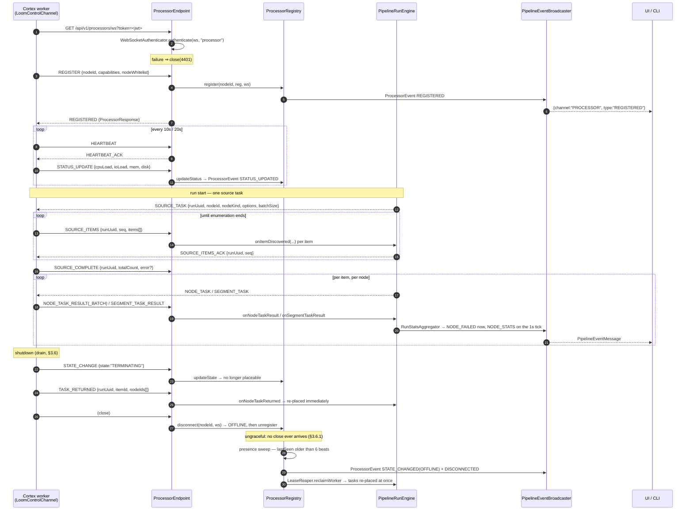

# MetaLoom // Loom WebSocket API Specification

> The WebSocket channels exposed by the Loom server: the **processor control
> channel** that carries work to Cortex workers, and the **UI events socket**
> that streams pipeline and processor lifecycle frames to browsers and the CLI.
>
> Scope boundaries: the run engine's own semantics live in
> [../features/pipeline/PIPELINE.md](../features/pipeline/PIPELINE.md), the
> worker-side execution model in
> [../cortex/METALOOM_ARCHITECTURE.md](../cortex/METALOOM_ARCHITECTURE.md), the
> in-JVM event bus in [EVENTBUS.md](EVENTBUS.md), and the MCP socket in
> [MCP.md](MCP.md). This file specifies only the wire protocol.
>
> **The agent chat stream is Server-Sent Events, not a WebSocket**
> (`SseAgentEventSink`, `text/event-stream`). Do not document it here.

---

## 1. Overview

| Endpoint | Path | Peers | Direction | Spec |
|---|---|---|---|---|
| Processor control channel | `/api/v1/processors/ws` | Cortex worker JVMs | Bidirectional | this file, §3 |
| UI events socket | `/api/v1/pipelines/events/ws` | Browsers, CLI | Server → client only | this file, §4 |
| MCP socket | `/mcp/ws` | MCP clients | Bidirectional (JSON-RPC) | [MCP.md](MCP.md) |

All three upgrade over plain HTTP and authenticate **after** the upgrade via a
`?token=<jwt>` query parameter (§2) — browsers cannot attach an
`Authorization` header to a handshake. All three share one
`WebSocketAuthenticator`; the MCP server obtains it through `MCPModule`.

### 1.1 Why the two Loom endpoints are not merged

- **Processor socket** is a *worker control channel*: long-lived backend JVMs,
  bidirectional, trusted enough to be handed work. Auth context: "a worker
  joining the fleet".
- **UI events socket** is a *read-only broadcast*: the client never sends an
  application frame. To keep a browser at exactly **one** socket regardless of
  how many views are open, it is **multiplexed** — pipeline frames and processor
  lifecycle frames share it, discriminated by a `channel` field (§4.1).

Merging them would blur two auth roles onto one route and widen the trust
surface while saving no connections. `authenticate(ws, name)` takes a
per-endpoint label (`"processor"` / `"pipeline-events"` / `"mcp"`) so the roles
stay distinguishable in logs and future policy.

---

## 2. Authentication

`WebSocketAuthenticator.authenticate(ws, endpoint)` parses `?token=` off
`ServerWebSocket.query()`, URL-decodes it, and validates it with
`LoomAuthenticationHandler.authenticateToken(token)` — the same JWT provider the
REST auth handler uses.

| Situation | Lenient (default) | Strict |
|---|---|---|
| No token | accepted, `WARN` logged | closed `4401 "missing token"` |
| Invalid token | closed `4401 "invalid token"` | closed `4401 "invalid token"` |
| Valid token | accepted, `User` resolved | accepted, `User` resolved |

- Strict is resolved once in the constructor by `resolveStrict()`: JVM property
  `loom.ws.strictAuth` first, then env `LOOM_WS_STRICT_AUTH`, else `false`.
- Every rejection calls `metrics.recordAuthFailure("ws")`.
- `4401` is `WebSocketAuthenticator.UNAUTHORIZED_CLOSE_CODE`. `4409` is a
  separate, endpoint-level code meaning duplicate `nodeId` (§3.3).
- ⚠️ The token is checked **once, at handshake**. A socket that stays open past
  its token's expiry is never re-checked (§7 gaps).

### 2.1 Environment / property reference

| Setting | Default | Side | Effect |
|---|---|---|---|
| `LOOM_WS_STRICT_AUTH` / `-Dloom.ws.strictAuth` | `false` | Loom | Require a token on every WS handshake |
| `LOOM_PROCESSOR_EXPIRY_ENABLED` / `-Dloom.processor.expiryEnabled` | `true` | Loom | Sweep for workers that stopped heartbeating (§3.6.1). Set `false` locally so a worker paused on a breakpoint is not evicted |
| `LOOM_PROCESSOR_HEARTBEAT_INTERVAL_MS` / `-Dloom.processor.heartbeatIntervalMs` | `10000` | Loom | How often a worker is expected to be heard from; also the sweep interval |
| `LOOM_PROCESSOR_MISSED_HEARTBEATS` / `-Dloom.processor.missedHeartbeats` | `6` | Loom | Beats that may be missed before eviction. Tolerance = interval × this = **60 s** |
| `LOOM_TOKEN` / `--loom-token` | none | Cortex | JWT the worker appends as `?token=` |
| `LOOM_HOST` | none | Cortex | Loom host; unset ⇒ control channel disabled |
| `LOOM_PORT` / `--port` | none | Cortex | Loom port; `<= 0` ⇒ control channel disabled |
| `CORTEX_NODE_ID` | none | Cortex | Registration identity; missing ⇒ `CortexMain` exits 2, blank ⇒ `start()` throws |
| `CORTEX_DRAIN_TIMEOUT_MS` | `30000` | Cortex | Grace period before outstanding tasks are handed back |

---

## 3. Processor control channel (`/api/v1/processors/ws`)

### 3.1 Envelope

Every frame both ways is a `ProcessorMessage`:

```json
{ "type": "REGISTER", "body": { } }
```

`type` is a `ProcessorMessageType`; `body` is a `JsonObject` whose shape depends
on the type, and is absent for `HEARTBEAT` / `HEARTBEAT_ACK`.

### 3.2 Message vocabulary

**Worker → Loom**

| Type | Body model | Handler | Notes |
|---|---|---|---|
| `REGISTER` | `ProcessorRegistration` | `handleRegister` | Must carry a non-blank `nodeId` |
| `HEARTBEAT` | — | `handleHeartbeat` | Answered with `HEARTBEAT_ACK` |
| `STATUS_UPDATE` | `SystemStatusInfo` | `handleStatusUpdate` | Feeds placement's load score (§3.7) |
| `STATE_CHANGE` | `{ "state": "TERMINATING" }` | `handleStateChange` | Value is a `ProcessorState` name |
| `SOURCE_ITEMS` | `SourceItemsMessage` | `handleSourceItems` | Acked; the ack is the run's only source-side backpressure |
| `SOURCE_COMPLETE` | `SourceCompleteMessage` | `handleSourceComplete` | A run cannot settle without it |
| `NODE_TASK_RESULT` | `NodeTaskResultMessage` | `handleNodeTaskResult` | Wraps `{ runUuid, itemId, result }` |
| `NODE_TASK_RESULT_BATCH` | `NodeTaskResultBatch` | `handleNodeTaskResultBatch` | Transport saving only; entries assimilated individually |
| `SEGMENT_TASK_RESULT` | `SegmentTaskResult` | `handleSegmentTaskResult` | One result per node, never one segment verdict |
| `TASK_RETURNED` | `TaskReturnedMessage` | `handleTaskReturned` | Immediate re-placement (§3.6) |
| `PIPELINE_RUN_COMPLETED` | free-form JSON | `handlePipelineRunCompleted` | **Cortex no longer sends this.** Retained so an older worker can still close a run |
| `PIPELINE_EVENT` | `PipelineEventMessage` | `handlePipelineEvent` | **Accepted and dropped** — Loom owns run events (§4.6) |

**Loom → worker**

| Type | Body model | Sent by |
|---|---|---|
| `REGISTERED` | `ProcessorResponse` | `ProcessorEndpoint.handleRegister` |
| `HEARTBEAT_ACK` | — | `ProcessorEndpoint.handleHeartbeat` |
| `SOURCE_TASK` | `SourceTaskMessage` | `PipelineEndpointService` at run start |
| `SOURCE_ITEMS_ACK` | `SourceItemsAckMessage` | `handleSourceItems`, gated on `engine.whenCapacityAvailable` |
| `NODE_TASK` | `NodeTask` | `WebSocketNodeDispatcher.dispatch(NodeTask)` |
| `SEGMENT_TASK` | `SegmentTask` | `WebSocketNodeDispatcher.dispatch(SegmentTask)` |
| `ERROR` | `{ "message": "…" }` | `ProcessorEndpoint.sendError` |

`ProcessorMessageType` groups `SEGMENT_TASK_RESULT` and
`NODE_TASK_RESULT_BATCH` under its "FROM loom TO processor" comment banner. That
banner is wrong — both travel worker → Loom. The table above is authoritative.

### 3.3 Registration

`ProcessorRegistration`:

| Field | Type | Required | Notes |
|---|---|---|---|
| `nodeId` | String | Yes | Unique **and stable across restarts**; leases and attribution key on it |
| `name` | String | No | Cortex sends `"cortex"` |
| `priority` | int | No | Higher wins; Cortex sends `100` |
| `host` | String | No | `<hostname>:<monitoringPort>` |
| `capabilities` | Set\<`ProcessorCapability`\> | No | `IO`, `CPU`, `GPU`; Cortex announces `CPU` + `IO` |
| `nodeWhitelist` | Set\<String\> | No | Node kinds this worker will run; **null/empty means "anything"** |
| `nodeBlacklist` | Set\<String\> | No | Refused kinds, applied even when the whitelist would admit them |

- The whitelist defaults to `NodeFactory.registeredTypes()` so a worker cannot
  advertise work it has no implementation for.
- A blank `nodeId` is answered with `ERROR` and no registration.
- A `nodeId` already held by a **live** socket is answered with `ERROR` and
  `close(4409, "Duplicate nodeId")`. A stale entry whose socket has already
  closed is *not* live, so an ordinary reconnect takes over cleanly
  (`ProcessorRegistry.isLive`).
- Restrictions can afterwards be overridden by an operator via
  `PUT /api/v1/processors/:uuid/restrictions` (§3.8), which takes effect on the
  next placement decision without a reconnect.

### 3.4 Lifecycle



### 3.5 Wire models

`SystemStatusInfo` (`STATUS_UPDATE`, every 20 s):

| Field | Type | Notes |
|---|---|---|
| `cpuLoad` | Double | 0–100; null when unknown |
| `ioLoad` | Double | Busiest disk's utilisation, 0–100; null on the first sample and on non-Linux |
| `memoryUsed` / `memoryTotal` | Long | JVM heap: `total-free` and `max` |
| `diskUsed` / `diskTotal` | Long | `FileStore` of the worker's working directory |
| `gpuLoad` | Double | **Never populated** — `collectSystemStatus()` does not set it |

`SourceTaskMessage`: `runUuid`, `nodeId`, `nodeKind`,
`options` (`pathGlobs`, `path`, `assetUuid`, …), `batchSize` (default `250`).
`SourceItemsMessage`: `runUuid`, `seq`, `items[]` of `MediaRef`.
`SourceCompleteMessage`: `runUuid`, `totalCount`, `error`.

`MediaRef` is `{ path, sha512, size, mediaType }`. `path` is an **absolute path
or a URI** (`s3://…`) — a plain String precisely because `Paths.get` mangles a
URI. `mediaType` is best-effort (`image`/`video`/`audio`/`document`/`unknown`).

`NodeTask`:

| Field | Type | Notes |
|---|---|---|
| `taskUuid` | UUID | Required |
| `runUuid` | UUID | Null for an untracked execution |
| `itemId` | String | Also the origin id of every element the task produces |
| `nodeId` / `nodeKind` | String | Graph node and the kind the worker resolves |
| `elementSeq` | int | Which element of a fanned-out sequence; `0` when the node runs once per item |
| `media` | `MediaRef` | |
| `options` | Map\<String, Object\> | From the pipeline definition |
| `inputs` | Map\<String, `PortPayload`\> | **Keyed by the receiving node's own input port ids**, not by upstream node id |
| `demandedOutputs` | Set\<String\> | Output ports something is wired to; a hint, not a restriction |
| `resultBatchSize` | int | How many results the worker may accumulate before sending; `1` ⇒ send each |
| `capturePreviews` | boolean | Ask the worker to attach small renderings of what each output port carried. **False on every ordinary run** — set only for a run started with `debug`. Absent from an older Loom, which reads as false |

`PortPayload` is `{ contentType, cardinality, elements[] }` — the typed
replacement for the old untyped `Map<String,Object>`. For the port lattice and
fan-out rules see [../features/pipeline/PIPELINE.md](../features/pipeline/PIPELINE.md)
and [../cortex/METALOOM_ARCHITECTURE.md](../cortex/METALOOM_ARCHITECTURE.md).

`NodeTaskResult`: `taskUuid`, `nodeId`, `elementSeq`, `state` (`NodeState`:
`PENDING`, `RUNNING`, `COMPLETED`, `FAILED`, `SKIPPED`), `durationMs`,
`message`, `outputs` (Map\<String, `PortPayload`\> keyed by **output** port id).
Outputs are **kept on `SKIPPED` and `FAILED`** results — discarding them threw
away the diagnostics that explain the non-completion.

`previews` (Map\<String, `NodePreview`\>, keyed by **output** port id) rides alongside
`outputs` when the task asked for it. `NodePreview` is
`{mimeType, width, height, data}`, `{markdown}` or `{skippedReason}`, plus an optional
`frame` — bytes as base64,
capped at 96 KiB with the longest edge at 512 px, and **dropped rather than truncated**
past the cap. A port can carry both bytes and Markdown: the image comes from
`NodePreviews`, the Markdown from the node's own `ctx.preview(port, …)`, and neither
displaces the other. It exists because an `artifact/image` port carries a worker-local *path*, which
Loom cannot resolve into anything anyone can look at. Generating one is never allowed
to fail the task that produced the real output.

**`frame` is what keeps a video overlay honest.** A detector samples every *n*th frame and emits one
element per detection *per frame*, while the port-level preview can only be one picture. Without a
frame stamped on that picture, anything drawing the elements over it has no way to tell which of
them were measured against it and draws all of them — four sampled frames of two people arrive as
ten boxes piled on two faces, which reads as a broken detector rather than as a time series.
`facedetect` stamps the frame it seeked to; per-element crops carry their own detection's frame.
It is **nullable, never zero**: an image preview is not frame 0 of anything, and a consumer has to be
able to tell "no frame applies" from "the first one". `markdown` and `frame` are both independent of
the bytes, so both are copied outside the has-data branch when a preview is stored and again when it
is rendered into the REST response.

`SegmentTask` carries `taskUuid`, `runUuid`, `itemId`, `segmentId`, `affinity`,
`media`, `nodes[]` (`SegmentNode`) and `inputs` — only what comes from *outside*
the segment; intra-segment dependencies never cross the network, which is the
whole saving. `SegmentTaskResult` answers with `results[]` (one per node, skips
reported explicitly) plus an optional segment-level `error`.

### 3.6 Graceful shutdown (drain)

A worker that simply exits leaves its tasks `RUNNING` until the lease lapses —
and the lease is deliberately generous, because its other job is to tolerate a
merely *slow* worker. A drain closes that gap (`LoomControlChannel.drain`):

1. **Announce** `STATE_CHANGE {state:"TERMINATING"}`. `isPlaceable()` admits
   `ONLINE` and nothing else, so no further work is offered from here.
2. **Refuse.** A dispatch already on the wire still arrives;
   `PipelineTaskHandler.beginDrain()` makes the worker answer it with
   `TASK_RETURNED` instead of starting it.
3. **Finish.** Running tasks get `CORTEX_DRAIN_TIMEOUT_MS` (default 30 000, matching
   Kubernetes' termination grace period).
4. **Return.** Whatever is still running at the deadline is named in a
   `TASK_RETURNED`. It keeps running locally — a node cannot be interrupted —
   but Loom is free to place it elsewhere at once.
5. **Flush.** `awaitFlush(5000)` writes one more frame and waits for it; frames
   on a WebSocket are ordered, so that waits for all of them. Only then does
   `stop()` close the socket — a queued frame is lost on close.

`TaskReturnedMessage`: `runUuid`, `itemId`, `taskUuid`, `nodeIds[]` (one for a
node task, every member for a segment), `elementSeq`, `reason`.

**A return is not a failure.** `PipelineRunEngine#onNodeTaskReturned` releases
the in-flight slot and refunds the attempt, because nodes are not retryable by
default and charging a return would dead-letter every in-flight item on a
routine deployment. The refund is capped at three per execution — returning
costs the worker nothing, so an unbounded refund would let a misbehaving worker
circulate an item around the fleet forever. Past the cap a return is accounted
exactly like a lapsed lease. A late result for a returned task is still
assimilated; the re-dispatched copy is recognised as a duplicate.

**Gap.** A `SOURCE_TASK` has no reclaim path — a source already enumerating is
abandoned at the deadline and the run waits for a `SOURCE_COMPLETE` that never
comes. Fabricating one would mark a truncated scan as whole. See "Reclaim work
from a vanished worker" in
[../tasks/METALOOM_ARCHITECTURE_TASK.md](../tasks/METALOOM_ARCHITECTURE_TASK.md).

#### 3.6.1 Ungraceful departure — the presence sweep

A drain is what a worker does when it gets the chance. A worker that is killed,
partitioned or frozen gets no chance, and — this is the part that used to have no
answer — **its socket does not necessarily close.** A half-open TCP connection
never fires the close handler, so `disconnect(nodeId, ws)` never runs.

`ProcessorPresenceReaper` is the timer that closes that hole. It runs on the
`LeaseReaper` pattern (own daemon thread, `scheduleWithFixedDelay`, exceptions
swallowed so one bad sweep cannot cancel the schedule), started from
`RESTService.start()` alongside the lease reaper:

1. **Detect.** Every heartbeat interval (default 10 s), `ProcessorRegistry.expireStale`
   compares each worker's `lastSeen` against `now - interval × missedBeats`
   (default 6 ⇒ **60 s of silence**). `lastSeen` is stamped by `REGISTER`,
   `HEARTBEAT`, `STATUS_UPDATE` and `STATE_CHANGE`, so any traffic at all keeps a
   worker alive.
2. **Evict.** A silent worker goes through the *same* path a socket close uses —
   `updateState(OFFLINE)` then unregister — so the `STATE_CHANGED` and
   `DISCONNECTED` frames and the `presenceChanged()` bookkeeping fire exactly once
   per departure, from one place.
3. **Reclaim.** The evicted worker's in-flight tasks are handed straight back via
   `LeaseReaper.reclaimWorker(nodeId, limit)`, which reads
   `PipelineNodeTaskDao.loadLeasedBy` — the worker-keyed counterpart of
   `loadExpiredLeases`. Waiting out each lease individually is the wrong answer
   once the worker is *known* to be gone, and the lease is deliberately generous
   because its other job is tolerating a merely slow worker. A reclaim failure
   never cancels the eviction; those leases simply lapse into the ordinary sweep.
4. **Bound.** At most `DEFAULT_SWEEP_LIMIT` (100) workers per sweep, so a
   fleet-wide network blip cannot evict — and reclaim the work of — the entire
   fleet inside one tick. A truncated sweep says so in the log.

**A reconnect must survive a sweep of its old entry.** This is the same trap
`disconnect` avoids by comparing sockets, in the form a sweep needs: a worker that
came back under the same id holds a *different* `ConnectedProcessor`, so eviction
is scoped by object identity and the removal itself is conditional
(`ConcurrentHashMap.remove(key, value)`). A worker that re-registers mid-eviction
keeps its fresh registration and no `DISCONNECTED` is emitted for it.

**Eviction is not punishment.** A worker that comes back simply re-registers and
is placeable again; its persisted `cortex_instance` row (and any admin-managed
restriction) is untouched, and `GET /api/v1/processors` still lists it as an
offline instance. The cost of evicting a worker that was only briefly unreachable
is duplicated work, which is why the tolerance is six missed beats rather than one.
`LOOM_PROCESSOR_EXPIRY_ENABLED=false` switches the sweep off for local development,
where a worker paused on a breakpoint stops heartbeating for as long as you look at it.

### 3.7 Placement

`ProcessorRegistry.selectProcessorForKinds(capability, kinds)` filters, then
orders:

1. **Filter** — `isPlaceable` (state is `ONLINE`, and nothing else: `PAUSED`,
   `STARTING` and `TERMINATING` are all excluded; a worker evicted for silence is
   no longer in the map at all, §3.6.1), has the required capability
   (`PipelineEndpointService` currently asks for `CPU`), and `accepts()` **every**
   requested node kind.
2. **Order** — `priority` descending first: an operator's explicit placement
   decision is never overruled by live load. Then `loadScore` ascending. Then
   `nodeId`, so repeated dispatches of the same work land deterministically
   rather than by map iteration order.
3. `loadScore` = `max(cpuLoad, ioLoad)` from the last `STATUS_UPDATE` — the
   *busiest* resource, since a worker pinned on either cannot take more.
   A status older than `STATUS_MAX_AGE` (60 s), or one carrying neither figure,
   scores `UNKNOWN_LOAD` (50) so silence neither attracts nor repels work.
4. No processor for the required kinds ⇒ `POST /run` returns **503** and no
   `pipeline_run` row is created. There is no ack watchdog.

### 3.8 REST routes on the same endpoint

| Method | Path | Purpose | Permission |
|---|---|---|---|
| GET | `/api/v1/processors` | List live processors merged with persisted-but-offline instances | authenticated |
| GET | `/api/v1/processors/:uuid` | Load one, by nodeId or derived UUID, falling back to the persisted row | authenticated |
| PUT | `/api/v1/processors/:uuid/restrictions` | Set `nodeWhitelist` / `nodeBlacklist` | `MANAGE_CORTEX_INSTANCE` |
| DELETE | `/api/v1/processors/:uuid` | Forget a persisted instance; **409 while it is online** | `MANAGE_CORTEX_INSTANCE` |

`ProcessorListResponse` holds `ProcessorResponse` items:
`uuid`, `name`, `host`, `priority`, `state`, `capabilities`, `systemStatus`,
`lastSeen`, and the restriction sets.

### 3.9 Error handling

- Undecodable JSON, or a missing `type` ⇒ `ERROR`.
- Any typed frame other than `REGISTER` arriving before registration ⇒
  `ERROR "Not registered. Send REGISTER first."`
- A missing `body` on a type that requires one ⇒ `ERROR`.
- A frame naming an unknown or already-finished `runUuid` is **logged at debug
  and ignored**, not answered with `ERROR` — a late message for a settled run is
  normal and a worker must not be disconnected for it (`resolveEngine`).
- One malformed entry in a `NODE_TASK_RESULT_BATCH`, or one node of a
  `TASK_RETURNED` that fails to re-place, is logged and skipped; its siblings
  are still processed.

---

## 4. UI events socket (`/api/v1/pipelines/events/ws`)

### 4.1 Multiplexing

Read-only from the client. Two frame kinds share the socket, discriminated by an
optional top-level `channel`:

| `channel` | Model | Produced by |
|---|---|---|
| *(absent)* | `PipelineEventMessage` | `RunStatsAggregator` → `PipelineEventBroadcaster.broadcast()` |
| `"PROCESSOR"` | `ProcessorEventMessage` | `ProcessorRegistry` → `broadcastProcessorEvent()` |
| `"NOTIFICATION"` | `NotificationEventMessage` | `NotificationDispatcher` → `broadcastNotification(recipientUuid, …)` |

Pipeline frames keep their original shape (no `channel`), so older clients are
unaffected. Processor frames are **not** pipeline-scoped: the `?pipeline=` and
`?run=` filters are deliberately bypassed for them, so a filtered subscriber
still sees fleet-wide processor updates.

⚠️ **`NOTIFICATION` is the one addressed channel on this socket.** Every other
channel is a fan-out to all subscribers; a notification frame goes to the
recipient's sockets and nowhere else. `PipelineEventBroadcaster.Subscriber`
therefore carries the `userUuid` resolved at handshake time
(`PipelineEventEndpoint.resolveUserUuid`), and `broadcastNotification` **fails
closed twice**: a null recipient reaches nobody, and a subscriber whose socket
resolved no user never matches any recipient. The second rule matters because
lenient auth is the **default** (§2) — a tokenless socket is accepted and has a
null user, so without it every user's inbox would stream to any anonymous
connection. Do not "harmonise" `broadcastNotification` with the two fleet-wide
methods beside it.

`LoomUser.getUuid()` throws on a token with no `uuid` claim; `resolveUserUuid`
catches it and treats the socket as user-less. Unguarded, that throw escapes the
`onSuccess` handler and leaves a live socket with no `closeHandler` registered.

### 4.2 Filtering

| Parameter | Matches | Used by |
|---|---|---|
| `?pipeline=<name>` | `PipelineEventMessage.pipelineName` | the UI, watching one pipeline |
| `?run=<uuid>` | `PipelineEventMessage.pipelineRunUuid` | the CLI (`PipelineEventStream`), following one run |

- Extracted in `PipelineEventEndpoint.extractQueryParam`, applied in
  `PipelineEventBroadcaster.Subscriber.matches`. **ANDed**; neither ⇒ everything.
- `?run=` exists because a pipeline-name filter still delivers every concurrent
  run of that pipeline. The CLI also filters client-side, so it works against a
  server predating the parameter.
- ⚠️ **No history.** The stream delivers only what happens after the socket
  opens. A client wanting a run's opening frames must connect *before* posting
  `/run` — which is what `metaloom pipeline run --follow` does.

### 4.3 `PipelineEventMessage`

`type`, `pipelineName`, `pipelineRunUuid`, `nodeId`, `mediaPath`, `timestamp`
(epoch millis), `durationMs`, `message`, and the aggregate counters
`activeCount`, `pendingCount`, `processedCount`, `failedCount`, `skippedCount`,
plus `itemUuid` and `elementSeq` on the breakpoint frames.

`PipelineEventType`: `PIPELINE_STARTED`, `PIPELINE_COMPLETED`, `RUN_PAUSED`,
`RUN_RESUMED`, `NODE_STARTED`, `NODE_COMPLETED`, `NODE_FAILED`, `NODE_SKIPPED`,
`NODE_BUFFERED`, `NODE_BREAKPOINT_HELD`, `NODE_BREAKPOINT_RELEASED`, `NODE_STATS`.

**Run-level frames come from `PipelineEndpointService`, not `RunStatsAggregator`**
(§4.6). The aggregator only ever sees *node settles*, so it cannot know that a run
started, was paused, or was cancelled. The four run-level types carry no counters —
a client wanting numbers reads the next `NODE_STATS` tick or refetches the run.

| Type | Emitted from | Why it cannot come from anywhere else |
|---|---|---|
| `PIPELINE_STARTED` | `dispatchRun`, right after `engine.start()` | Loom owns the graph; a worker holds none |
| `PIPELINE_COMPLETED` | `engine.onCompletion`, **plus** `cancelRun` and the undispatchable-run path | `engine.cancel()` sets `runComplete` without invoking the completion callbacks, and an unreachable processor unregisters the engine before it ever completes. Without those two extra emissions a cancelled run would be the one terminal outcome the socket never reports |
| `RUN_PAUSED` | `pauseRun`, **after** the engine gate is applied | A pause is an operator decision, never something the run discovers about itself |
| `RUN_RESUMED` | `resumeRun`, after `engine.unpause()` | as above |
| `NODE_BREAKPOINT_HELD` | the engine's `BreakpointListener`, from the settle path | Only the engine knows an execution finished and was withheld; nothing else in the system can observe the moment |
| `NODE_BREAKPOINT_RELEASED` | the same listener, from `releaseNode` / `stepOne` / disarming | Without it a node released from another tab stays ringed forever |

**The two breakpoint frames are the third exception to aggregation**, after `NODE_FAILED`
and the run-level types. A hold happens because a person asked for it, is individually
actionable, and is worthless a second late — folding it into the 1 s `NODE_STATS` tick
would leave a stopped node looking busy for up to a second. They carry `itemUuid` and
`elementSeq` on top of `nodeId`, because a node downstream of a fan-out is held once per
element and the debug view has to open the right result.

Ordering is load-bearing on both suspension frames: the frame goes out only once the
gate is really applied, so a client acting on it can never observe a run that calls
itself paused while dispatch is still running. A **refused** pause or resume (409)
broadcasts nothing.

### 4.4 `ProcessorEventMessage` (`channel: "PROCESSOR"`)

`channel` (always `"PROCESSOR"`), `type`, `nodeId`, `processor`
(`ProcessorResponse` snapshot), `lastSeen`.

`ProcessorEventType`: `REGISTERED`, `STATE_CHANGED`, `STATUS_UPDATED` (each with
a full snapshot), `HEARTBEAT` (nodeId + lastSeen only), `DISCONNECTED` (nodeId
only). A disconnect produces `STATE_CHANGED`→`OFFLINE` then `DISCONNECTED`, so
the UI can show the card as "offline (persisted)" rather than dropping it.

### 4.5 `NotificationEventMessage` (`channel: "NOTIFICATION"`)

`channel` (always `"NOTIFICATION"`), `type` (a `NotificationType`), `notification`
(a full `NotificationResponse`, so the UI inserts without a refetch) and
`unreadCount` (the recipient's authoritative total, because the badge counts the
whole inbox rather than the page).

The **recipient uuid is deliberately not on the wire.** It is routing metadata
the server already used to select this socket; putting it in the frame invites a
client to trust it, and it tells the recipient nothing they do not know.

The UI still refetches `GET /notifications` when the popover opens, so the stream
is an optimisation and never the only path — which is what keeps a tokenless
socket from silently presenting an empty inbox.

### 4.6 Loom is the only producer of pipeline events

A worker holds no pipeline graph — it answers `NODE_TASK`, `SEGMENT_TASK` and
`SOURCE_TASK` — so it has nothing to say at pipeline-event granularity.
`RunStatsAggregator` is the single source **of node-level frames**; run-level
lifecycle comes from `PipelineEndpointService` (§4.3):

- **Successes and skips** are counted per node and flushed as `NODE_STATS` on a
  timer (`PipelineEndpointService.STATS_INTERVAL_MS` = **1000 ms**, plus a final
  flush at run end). A 100 000-item run over a 10-node graph settles a million
  nodes; one frame per settle is millions of renders to move a bar by a percent.
- **Failures** go out immediately as `NODE_FAILED` — rare, individually
  actionable, and a bare count would leave the UI able to say "300 failed"
  without naming a file.

`ProcessorEndpoint` therefore **drops** an inbound `PIPELINE_EVENT`. The
envelope checks still apply (unregistered sender or missing body ⇒ `ERROR`), and
the first drop per processor is logged so an outdated worker stays visible.
Cortex no longer sends them: the tracking-bus subscription in
`LoomControlChannel` was removed, and nothing outside the node-chain tests
publishes to that bus. `PIPELINE_RUN_COMPLETED` came from the same bus and went
with it; runs are closed by the engine's `onCompletion` callback in
`PipelineEndpointService`, and Loom still handles the message only so an older
worker can close a run.

### 4.7 Backpressure — what it actually does

⚠️ Frequently mis-stated. There is **no per-subscriber queue**. Each broadcast:

1. Skips subscribers whose filters do not match (pipeline frames only).
2. Prunes any subscriber whose socket `isClosed()` — removal is lazy, done
   during broadcast rather than by a sweeper.
3. Encodes the JSON **once, lazily**, only after the first matching live
   subscriber is found.
4. Calls `Subscriber.send`, which checks `ws.writeQueueFull()`. If the Vert.x
   write queue is full the **new** event is dropped (not the oldest) and
   `droppedCount` is incremented; a `WARN` is logged when
   `droppedCount % 100 == 1`, and `metrics.recordPipelineEventDropped()` fires.

`PipelineEventBroadcaster.DEFAULT_QUEUE_CAPACITY` (1024) is threaded into the
`Subscriber` constructor and **never used** — dead code. Do not document it as a
capacity. `subscribers.size()` is exported as the gauge
`loom_pipeline_event_subscribers`.

### 4.8 Route ordering

Only `PipelineEventEndpoint` needs it, because `/api/v1/pipelines*` has a
wildcard auth route that would otherwise swallow the upgrade:

```java
apiRouter().getDelegate().get(basePath() + "/ws").order(-1000).handler(...)
```

`ProcessorEndpoint` registers its `/ws` route **without** an order — there is no
competing wildcard under `/api/v1/processors`. Do not "fix" this by symmetry;
`secure()` is called on the sibling paths afterwards and the plain route already
wins.

---

## 5. Reconnect and backoff

The two clients use **different** strategies. Other spec files have disagreed on
this; the code below is authoritative.

| | Cortex worker | UI client |
|---|---|---|
| Source | `LoomControlChannel.scheduleReconnect()` | `loom-ui/src/api/pipelineEvents.ts` `computeReconnectDelay()` |
| Shape | **Linear** — `min(2000 × attempt, 30000)` ms | **Exponential** — `min(maxDelayMs, baseDelayMs × 2^attempt)` ms |
| Defaults | base 2000 ms, cap 30 000 ms | base 1000 ms, cap 30 000 ms |
| Jitter | **None** | `× (0.5 + random())` ⇒ delay lands in `[0.5×, 1.5×)` |
| Attempt cap | **Unbounded** | `maxAttempts` = 10, then it gives up and logs |
| Reset | `reconnectAttempts.set(0)` on `REGISTERED` | on `onopen`, and when the token changes |
| On 4401 | retries anyway | **does not reconnect** |
| Re-identify | resends `REGISTER` on every `onConnected` | re-subscribes; no application handshake |

Worker timers, all `vertx.setPeriodic`: heartbeat 10 s, status 20 s, health log
30 s. Only one reconnect timer is ever armed (`reconnectTimerId != -1` guard).
Gauges: `cortex_loom_connected`, `cortex_loom_registered`,
`cortex_loom_reconnect_attempts`.

---

## 6. Test setup

| Area | Test | Location |
|---|---|---|
| Registration, duplicate `nodeId`, heartbeat, pre-register guard, status, state, invalid frames, restrictions, persisted-offline listing, forget | `ProcessorEndpointTest` (14) | `loom/core/src/test/java/io/metaloom/loom/core/endpoint/test/` |
| Connect, `PIPELINE_EVENT` drop paths, envelope errors | `PipelineEventEndpointTest` (6) | same |
| Pause/resume guards **and** the `RUN_PAUSED` / `PIPELINE_COMPLETED` broadcasts (incl. "a refused pause broadcasts nothing") | `PipelineRunPauseEndpointTest` (15) | same |
| Breakpoint routes and guards, plus the hold/release **announcement** (listener arguments, not delivered frames — see below) | `PipelineRunBreakpointEndpointTest` (20) | same |
| Fan-out, `?run=` filter, closed-subscriber pruning, full-write-queue drop | `PipelineEventBroadcasterTest` (4) | `loom/services/rest/src/test/java/io/metaloom/loom/rest/service/` |
| Run completion over the socket | `PipelineRunCompletionEndpointTest` | `loom/core/src/test/.../endpoint/test/` |
| UI socket, mocked | `cortex-mocked.spec.ts`, `pipeline-events-mocked.spec.ts` | `loom-ui/e2e/` |

Run the pooled-DB setup before the Java suites — see
[../../.claude/CLAUDE.md](../../.claude/CLAUDE.md) (`./setup-pool.sh`).
`PipelineEventBroadcaster` has a no-arg constructor that installs
`NoopLoomMetrics`, so it can be unit-tested without a metrics backend.

> ⚠️ **A broadcast published from test code never reaches a subscriber of the running server.**
> `loom.internal().pipelineEventBroadcaster()` returns a *different instance* from the one the live
> REST server registered the socket on, so its `subscribers` map is empty and `broadcast()` returns
> having sent nothing — silently, with no dropped-event counter to show for it. A test that connects
> a socket and then broadcasts by hand fails on delivery while the behaviour under test is perfectly
> correct, and **passes when run alone**, which is the worst shape a test can have.
>
> This is why `PipelineRunPauseEndpointTest` *can* assert real frames — its broadcasts originate
> **inside** the server, on the REST route — and why `PipelineRunBreakpointEndpointTest` asserts the
> `BreakpointListener`'s arguments instead. **Frame delivery for `NODE_BREAKPOINT_*` is therefore
> only covered from the browser side**, by `loom-ui/e2e/pipeline-breakpoints-mocked.spec.ts`. Closing
> that gap in Java needs a run dispatched through `POST /run` so `attachBreakpointBroadcast` wires
> the engine up, and that needs a registered worker.

---

## 7. Progress Assessment

### 7.1 Protocol and transport

- [x] Bidirectional processor channel with the `ProcessorMessage` envelope
- [x] Read-only, multiplexed UI events socket (`channel` discriminator)
- [x] Registration with capabilities, priority and node-kind restrictions
- [x] Heartbeat / `HEARTBEAT_ACK`; system status reporting
- [x] `SOURCE_TASK` → acked `SOURCE_ITEMS` → `SOURCE_COMPLETE`
- [x] `NODE_TASK` / `SEGMENT_TASK` dispatch and their result frames, incl. batching
- [x] Typed `PortPayload` inputs/outputs keyed by port id
- [x] Graceful drain: `TERMINATING`, `TASK_RETURNED`, attempt refund, flush before close
- [x] Duplicate-`nodeId` rejection with close code `4409`
- [x] Socket-scoped `disconnect(nodeId, ws)` so a superseded close cannot evict a reconnect
- [x] Server-side heartbeat timeout (§3.6.1): a silent worker is evicted and its leases reclaimed at once
- [ ] `gpuLoad` is on the wire but never populated by the worker
- [ ] A `SOURCE_TASK` in progress is abandoned by a drain; the run waits for a `SOURCE_COMPLETE` that never arrives
- [ ] No max message size, no binary frames, no protocol version negotiation
- [ ] `ProcessorMessageType` files `SEGMENT_TASK_RESULT` / `NODE_TASK_RESULT_BATCH` under the wrong direction banner

### 7.2 Authentication and security

- [x] `?token=<jwt>` validated by a shared `WebSocketAuthenticator` (processor, events, MCP)
- [x] Strict mode via `LOOM_WS_STRICT_AUTH` / `-Dloom.ws.strictAuth`; close code `4401`
- [x] Auth failures counted (`recordAuthFailure("ws")`); tokens never logged
- [x] `nodeId` uniqueness enforced at REGISTER
- [ ] Strict mode is opt-in — the default still accepts a tokenless connection
- [ ] Token expiry is never re-checked on an open socket; no refresh / re-auth
- [ ] No origin validation on the upgrade
- [ ] No rate limiting on connection attempts or on message frequency
- [ ] No per-message authorization after the handshake
- [ ] A lenient-mode tokenless socket silently receives **no** notifications — correct, but invisible: nothing tells the client its stream is inert

### 7.3 Broadcasting

- [x] Run-level lifecycle frames actually emitted: `PIPELINE_STARTED` / `PIPELINE_COMPLETED` / `RUN_PAUSED` / `RUN_RESUMED`
- [x] Breakpoint frames emitted immediately rather than aggregated: `NODE_BREAKPOINT_HELD` / `NODE_BREAKPOINT_RELEASED`
- [x] Pipeline-name and run-uuid filters, ANDed
- [x] Lazy JSON encoding; lazy pruning of closed sockets
- [x] Write-queue-full drop with counter, throttled log and metric
- [x] Processor lifecycle events multiplexed onto the same socket
- [ ] No Java-side coverage that `NODE_BREAKPOINT_HELD` / `_RELEASED` are actually *delivered* over
      the socket — only that the listener is called with the right arguments (see the warning in § 6);
      needs a run dispatched through `POST /run`, and therefore a registered worker
- [ ] `DEFAULT_QUEUE_CAPACITY` is dead code — remove it or implement a real queue
- [ ] Newest-frame-dropped means a burst loses the *latest* state, which is the one that matters
- [ ] No history/replay: a client connecting after a run starts misses its opening events
- [ ] No dead-letter or client-visible signal for dropped events

### 7.4 Reconnect

- [x] Worker reconnects and re-registers automatically; attempts reset on `REGISTERED`
- [x] UI backs off exponentially with jitter and stops on `4401`
- [ ] Worker backoff is **linear and unjittered** — a fleet restarting together reconnects in lock-step
- [ ] Worker retries forever, including after a `4401` that will never succeed
- [x] Work in flight when a worker is evicted for silence is reclaimed at once (§3.6.1)
- [ ] Work in flight at the moment of an unplanned socket **close** still waits out its lease —
      `disconnect()` does not yet drive `reclaimWorker` (Task 2(a))

### 7.5 Documentation and tooling

- [x] Javadoc on `ProcessorEndpoint`, `PipelineEventEndpoint`, `WebSocketAuthenticator`, `PipelineEventBroadcaster`, `ProcessorMessage(Type)`
- [x] Endpoint, broadcaster and UI-socket tests exist (§6)
- [ ] No authentication tests (valid / invalid / missing token, strict mode)
- [ ] No reconnection-scenario test on the Java side
- [ ] WebSocket endpoints and their message models are absent from the OpenAPI spec
- [ ] `LoomHttpClient` has no WebSocket helpers; there is no reusable client for either socket
- [ ] Processor list route supports neither pagination nor filtering by state/capability
- [ ] No route to force-disconnect a processor or to push it a message

---

## 8. Conventions and Gotchas

1. **The chat stream is SSE, not a WebSocket.** `SseAgentEventSink` /
   `text/event-stream`. Anything describing "the chat WebSocket" is wrong.
2. **Backpressure drops the newest frame, not the oldest**, and there is no
   1024-entry queue (§4.7). `DEFAULT_QUEUE_CAPACITY` is dead.
3. **Worker backoff is linear; UI backoff is exponential** (§5). Neither is a
   typo, and specs that claim otherwise are stale.
4. **`NodeTask.inputs` is keyed by the receiving node's port ids**, never by the
   upstream node id — renaming a node in the editor must not break downstream
   lookups. The old `upstreamOutputs` name is gone.
5. **Outputs survive `SKIPPED` and `FAILED`.** Do not reintroduce the clearing.
5a. **A preview is never truncated to fit and never fails a task.** Half a JPEG is not a
    smaller JPEG, and a node that did its real work correctly must not be reported as
    failed because a thumbnail could not be encoded.
6. **An empty `nodeWhitelist` means "accepts anything."** A worker that fails to
   determine its kinds registers unrestricted rather than dropping out.
7. **A message for an unknown run is ignored, not an error.** Answering with
   `ERROR` would punish a worker for the normal race of a run finishing first.
8. **`SOURCE_ITEMS_ACK` is the only source-side throttle.** Withholding it stops
   the scan itself; capping dispatch alone still lets item state pile up.
9. **Only `ONLINE` is placeable.** `TERMINATING`, `PAUSED` and `STARTING` are
   all excluded — see `isPlaceable`.
10. **`4401` is auth, `4409` is duplicate `nodeId`.** Different layers; do not
    merge them.
11. **Close the socket only after flushing.** A queued frame is lost on close,
    which is exactly the hand-back the drain exists to deliver.
11a. **A cancel and an undispatchable run must broadcast `PIPELINE_COMPLETED`
    explicitly.** Neither path runs the engine's completion callbacks —
    `engine.cancel()` sets `runComplete` directly, and an unreachable processor
    unregisters the engine first — so both emit the closing frame themselves. Drop
    either and a run silently never closes for every connected client.
12. **`order(-1000)` is needed on the pipelines socket only**, because of the
    `/api/v1/pipelines*` wildcard auth route.

---

## 9. Key Classes Reference

| Class | Package / module | Purpose |
|---|---|---|
| `ProcessorEndpoint` | `io.metaloom.loom.rest.endpoint.impl` (loom/services/rest) | Worker socket + processor REST routes |
| `PipelineEventEndpoint` | `io.metaloom.loom.rest.endpoint.impl` | UI events socket, filter extraction, `order(-1000)` |
| `WebSocketAuthenticator` | `io.metaloom.loom.rest.service.impl` | `?token=` validation, strict mode, `4401` |
| `PipelineEventBroadcaster` | `io.metaloom.loom.rest.service.impl` | Subscriber set, filters, write-queue drop |
| `ProcessorRegistry` | `io.metaloom.loom.rest.service.impl` | Connected workers, placement, `send`, processor events, `expireStale` |
| `ProcessorPresenceReaper` | `io.metaloom.loom.rest.service.impl` | Timed presence sweep; evicts a silent worker and reclaims its work (§3.6.1) |
| `WebSocketNodeDispatcher` | `io.metaloom.loom.rest.service.impl` | Turns a `NodeTask`/`SegmentTask` into a dispatched frame |
| `RunStatsAggregator` | `io.metaloom.loom.rest.service.impl` | Counts settles, emits `NODE_STATS` / `NODE_FAILED` |
| `PipelineRunRegistry` / `PipelineRunTracker` | `io.metaloom.loom.rest.service.impl` | Live engines by run uuid; terminal status and counters |
| `PipelineEndpointService` | `io.metaloom.loom.rest.service.impl` | Run start, `SOURCE_TASK`, stats timer, 503 on no worker |
| `ProcessorMessage` / `ProcessorMessageType` | `io.metaloom.loom.rest.model.processor.message` (loom-shared/rest-model) | Envelope and vocabulary |
| `ProcessorRegistration`, `Source*Message`, `TaskReturnedMessage`, `NodeTaskResultMessage` | same package | Control-plane bodies |
| `NodeTask`, `NodeTaskResult`, `SegmentTask`, `SegmentTaskResult`, `NodeTaskResultBatch`, `PortPayload`, `MediaRef`, `NodeState` | `io.metaloom.loom.pipeline.model` (loom-shared/pipeline-model) | Work-plane wire model |
| `PipelineEventMessage` / `PipelineEventType` | `io.metaloom.loom.rest.model.pipeline.event` | UI pipeline frames |
| `ProcessorEventMessage` / `ProcessorEventType` | `io.metaloom.loom.rest.model.processor.event` | UI processor frames (`channel:"PROCESSOR"`) |
| `LoomControlChannel` | `io.metaloom.cortex.impl.loom` (cortex/core) | Worker side: connect, register, heartbeat, drain, reconnect |
| `PipelineTaskHandler` | `io.metaloom.cortex.impl.loom` | Executes tasks off the socket thread; emits result frames |
| `PipelineEventStream` | `io.metaloom.cli.client` (cli) | CLI consumer of the events socket |

---

## 10. Where do I find …?

| Concept | Path |
|---|---|
| Worker socket handlers | `loom/services/rest/src/main/java/io/metaloom/loom/rest/endpoint/impl/ProcessorEndpoint.java` |
| UI socket route and filters | `loom/services/rest/src/main/java/io/metaloom/loom/rest/endpoint/impl/PipelineEventEndpoint.java` |
| Token check and strict mode | `loom/services/rest/src/main/java/io/metaloom/loom/rest/service/impl/WebSocketAuthenticator.java` |
| Broadcast, filtering, drop rule | `loom/services/rest/src/main/java/io/metaloom/loom/rest/service/impl/PipelineEventBroadcaster.java` |
| Placement, load score, `isPlaceable` | `loom/services/rest/src/main/java/io/metaloom/loom/rest/service/impl/ProcessorRegistry.java` |
| Heartbeat expiry, its tolerance and off switch | `loom/services/rest/src/main/java/io/metaloom/loom/rest/service/impl/ProcessorPresenceReaper.java` |
| Reclaiming a departed worker's leases | `loom/services/rest/src/main/java/io/metaloom/loom/rest/service/impl/LeaseReaper.java` (`reclaimWorker`) |
| `NODE_STATS` cadence (`STATS_INTERVAL_MS`) | `loom/services/rest/src/main/java/io/metaloom/loom/rest/service/impl/PipelineEndpointService.java` |
| Message vocabulary | `loom-shared/rest-model/src/main/java/io/metaloom/loom/rest/model/processor/message/` |
| Work-plane wire model | `loom-shared/pipeline-model/src/main/java/io/metaloom/loom/pipeline/model/` |
| Worker connect / drain / reconnect | `cortex/core/src/main/java/io/metaloom/cortex/impl/loom/LoomControlChannel.java` |
| Worker task execution and result frames | `cortex/core/src/main/java/io/metaloom/cortex/impl/loom/PipelineTaskHandler.java` |
| UI reconnect policy and channel routing | `loom-ui/src/api/pipelineEvents.ts` |
| CLI run-follow client | `cli/src/main/java/io/metaloom/cli/client/PipelineEventStream.java` |
| MCP socket (`/mcp/ws`) | `loom/services/mcp/src/main/java/io/metaloom/loom/mcp/MCPService.java`, [MCP.md](MCP.md) |
| Run engine semantics | [../features/pipeline/PIPELINE.md](../features/pipeline/PIPELINE.md) |
| Worker architecture, typed ports | [../cortex/METALOOM_ARCHITECTURE.md](../cortex/METALOOM_ARCHITECTURE.md) |
| In-JVM event bus (not this socket) | [EVENTBUS.md](EVENTBUS.md) |
| REST conventions and auth | [RESTAPI.md](RESTAPI.md) |

---
_Git HEAD revision: `742dae2d`_
_Last updated: 2026-08-06 (link/cross-reference sweep: de-duplicated §4.6, fixed the
task-file link label — no content changes)_