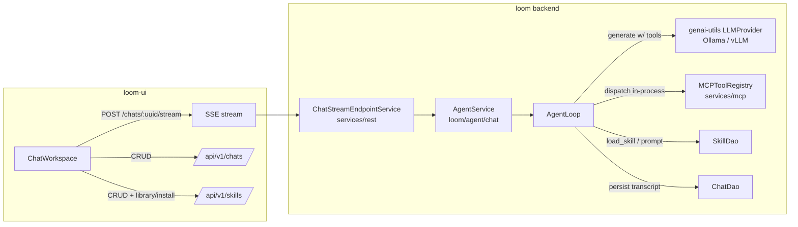

# MetaLoom // Chat (Loom Agent) Specification

> This document specifies the **Chat / Loom Agent** feature: an OpenAI-style chat in the
> Loom UI backed by a **server-side agentic loop** in the Loom backend. The agent lets
> users converse with the Loom domain ([DOMAIN.md](../DOMAIN.md)) — find assets, list
> open tasks, surface new comments, summarize media transcripts, run semantic content
> searches — and renders the domain entities it touches as dedicated chips/tiles
> ("Kacheln") inside the conversation.
>
> The agentic loop design is inspired by the **pi agent harness**
> (`workspaces/metaloom/pi`, pi-mono / `@earendil-works`): its turn loop, its streaming
> event protocol (distinct text/thinking/tool-call deltas), its "errors become tool
> results" rule, and its progressive-disclosure **skills** model.
>
> Status legend used throughout: ✅ implemented · 🟡 partial · ⬜ planned.
>
> Related documents:
> - [LOOM_UI.md](LOOM_UI.md) — general UI spec (§3.1 lists the chat route).
> - [RESTAPI.md](../RESTAPI.md) — REST endpoint inventory (`/api/v1/chats` CRUD).
> - [MCP.md](../MCP.md) — the MCP tool surface reused by the agent loop.
> - [TASK_UI_CHAT.md](TASK_UI_CHAT.md) — UI implementation tasks.
> - [CHAT_TASKS.md](../../features/chat/CHAT_TASKS.md) — backend implementation tasks.

---

## 1. Overview & Goals

The chat is the landing page of the Loom UI (route `/`). Goals:

1. **Conversational access to the domain** — "find beach videos", "what tasks are open
   for me?", "any new comments on asset X?", "summarize the transcript of this clip",
   "find assets showing a sunset" (semantic search via embeddings/transcripts).
2. **Agentic, not canned** — the backend runs a tool-calling loop against an LLM
   (via `genai-utils`), invoking the existing MCP tools in-process with the caller's
   permissions, until the model produces a final answer.
3. **Live streaming UX** — assistant text streams token-by-token; **reasoning
   ("thinking") chunks stream into a section that is hidden by default**; tool
   invocations appear as live action rows; entity references appear as chips as soon as
   a tool returns them.
4. **Markdown answers** — assistant messages are rendered as sanitized GitHub-flavored
   markdown.
5. **Skills** — user-owned, SKILL.md-style instruction packages that can be activated /
   deactivated per chat and shared between users via a publish + install library.

## 2. Current State (what exists today)

| Area | Status | Where |
|------|--------|-------|
| Chat session CRUD (backend) | ✅ | `chat` table (migration [V2.28__add_chat.sql](../../../loom/db/flyway/src/main/resources/db/migration/V2.28__add_chat.sql)): `uuid`, `title`, `messages jsonb`, `meta jsonb`, audit columns. [ChatDao](../../../loom/db/api/src/main/java/io/metaloom/loom/db/model/chat/ChatDao.java), [ChatDaoImpl](../../../loom/db/jooq/src/main/java/io/metaloom/loom/db/jooq/dao/chat/ChatDaoImpl.java), [ChatEndpoint](../../../loom/services/rest/src/main/java/io/metaloom/loom/rest/endpoint/impl/ChatEndpoint.java) (`/api/v1/chats` CRUD), [ChatMethods](../../../loom-client/common/src/main/java/io/metaloom/loom/client/common/method/ChatMethods.java), `ChatEndpointTest`. Permissions `CREATE/READ/UPDATE/DELETE_CHAT`. |
| Chat UI shell | ✅ | [ChatWorkspace.tsx](../../../loom-ui/src/features/chat/ChatWorkspace.tsx) — sessions rail, resizable chat column, right workspace panel (overview / embedded asset browser / asset detail card). Session persistence is real (via [api/chat.ts](../../../loom-ui/src/api/chat.ts)). |
| New-session greeting | ✅ | [ChatGreeting](../../../loom-ui/src/features/chat/ChatGreeting.tsx) — prominent "Hello \<username\>" + one-line capability hint, rendered while the transcript is empty (see §5.1). |
| Entity chips | ✅ | `RefChip` in ChatWorkspace.tsx — chips for `asset · collection · task · pipeline · annotation` with navigation / inline asset preview. |
| Agent action rows | ✅ | `ActionRow` in ChatWorkspace.tsx — pending/running/done/error status rows (currently fed by mock data only). |
| Assistant replies | ✅ | The UI streams from the live agent: [ChatWorkspace](../../../loom-ui/src/features/chat/ChatWorkspace.tsx) consumes `POST /chats/:uuid/stream` via [api/agent.ts](../../../loom-ui/src/api/agent.ts) (fetch + ReadableStream, incremental SSE parser). `mockChatService` has been removed. State machine: sending → streaming(reasoning \| answering \| tool) → done/error/aborted; Stop button aborts (fetch abort + `DELETE …/stream`); 409 → busy toast + input restored. |
| Markdown rendering | ✅ | [MarkdownContent](../../../loom-ui/src/features/chat/MarkdownContent.tsx) (react-markdown + remark-gfm, raw HTML stays escaped — no rehype-raw); replaces the old `dangerouslySetInnerHTML` regex. |
| Reasoning section | ✅ | [ReasoningSection](../../../loom-ui/src/features/chat/ReasoningSection.tsx): live "thinking… (Ns)" indicator while `reasoning_delta` streams, content hidden by default behind a Show/Hide toggle (`chat-reasoning-*` testids). |
| Streaming endpoint (backend) | ✅ | `POST/DELETE /api/v1/chats/:uuid/stream` ([ChatStreamEndpoint](../../../loom/agent/chat/src/main/java/io/metaloom/loom/agent/chat/rest/ChatStreamEndpoint.java), SSE via [SseAgentEventSink](../../../loom/agent/chat/src/main/java/io/metaloom/loom/agent/chat/rest/SseAgentEventSink.java)); busy-guard (409), abort on disconnect, `ChatStreamEndpointTest`. |
| Agentic loop | ✅ | [loom/agent/chat](../../../loom/agent/chat): [AgentLoop](../../../loom/agent/chat/src/main/java/io/metaloom/loom/agent/chat/loop/AgentLoop.java) + [AgentService](../../../loom/agent/chat/src/main/java/io/metaloom/loom/agent/chat/AgentService.java) — transcript replay, in-process MCP tool dispatch, error-as-tool-result, turn limit, abort, persistence, auto-title. Config via `AiOptions` (`LOOM_AI_*`). |
| LLM access | ✅ | `genai-utils` compile-scope in `loom/agent/chat`. `generateStreamWithTools` (streamed text/reasoning/tool calls) implemented for Ollama; vLLM falls back to the blocking path. True token streaming is opt-in via `LOOM_AI_STREAMING=true` ([StreamingTurnStreamer](../../../loom/agent/chat/src/main/java/io/metaloom/loom/agent/chat/loop/StreamingTurnStreamer.java)); default is turn-granular ([BlockingTurnStreamer](../../../loom/agent/chat/src/main/java/io/metaloom/loom/agent/chat/loop/BlockingTurnStreamer.java)). |
| MCP tools | ✅ | [MCPToolRegistry](../../../loom/services/mcp/src/main/java/io/metaloom/loom/mcp/tool/MCPToolRegistry.java): `search_assets`, `get_asset`, `search_transcript`, `list_collections`, `asset_statistics` — permission-checked, dispatchable in-process via the Vert.x EventBus. Reference envelopes (§6) attached via [MCPToolResults](../../../loom/services/mcp/src/main/java/io/metaloom/loom/mcp/tool/MCPToolResults.java). |
| Skills (backend) | ✅ | Migration `V2.36__add_skill.sql`, [SkillDao](../../../loom/db/api/src/main/java/io/metaloom/loom/db/model/skill/SkillDao.java), owner-scoped [SkillEndpoint](../../../loom/services/rest/src/main/java/io/metaloom/loom/rest/endpoint/impl/SkillEndpoint.java) (`/api/v1/skills` + `/library` + `/:uuid/install`), `SkillMethods` client, progressive disclosure + `load_skill` tool in the loop ([SkillPromptBuilder](../../../loom/agent/chat/src/main/java/io/metaloom/loom/agent/chat/skill/SkillPromptBuilder.java)). |
| Skills (UI) | ✅ | [api/skills.ts](../../../loom-ui/src/api/skills.ts); [SkillsPanel](../../../loom-ui/src/features/chat/SkillsPanel.tsx) in the chat header (per-session toggles, persisted to `chat.meta.activeSkillUuids`, sent with every stream request); [SkillManagementView](../../../loom-ui/src/features/skills/SkillManagementView.tsx) at `/skills` (CRUD, markdown editor, enabled/publish switches, Library tab + install with origin badge / update hint). |
| Chat E2E tests | ✅ | Mocked: `chat-mocked.spec.ts` (scripted SSE fixture — markdown, hidden reasoning, tool rows, chips, persistence round-trip, 409 toast, stop button) and `skills-mocked.spec.ts` (CRUD/publish/library/install, chat toggles → stream body). Backend variants (CRUD only, no live-LLM assertions): `chat-backend.spec.ts`, `skills-backend.spec.ts`. Backend JUnit: `SkillDaoTest`, `SkillEndpointTest`, `MCPToolReferencesTest`, `AgentLoopTest`, `ChatStreamEndpointTest`. |

## 3. Architecture (planned)



- **`loom/agent/chat`** (new Maven module, package `io.metaloom.loom.agent.chat`): hosts the
  agentic loop. Promotes `genai-utils` to a compile dependency **in this module only**.
  - `AgentService` — entry point; enforces one active run per chat (`409 AGENT_BUSY`),
    supports abort.
  - `AgentLoop` — the turn loop (see §3.1), pure logic, testable with a fake provider.
  - `TurnStreamer` — abstraction over one LLM turn. `BlockingTurnStreamer` wraps the
    existing `generateWithTools` (turn-granular streaming); `StreamingTurnStreamer`
    arrives once `genai-utils` gains `generateStreamWithTools` (true token/reasoning
    deltas — see Risks §8).
  - `AgentEvent` / `AgentEventSink` — event protocol objects; the SSE writer implements
    the sink, tests collect to a list.
  - `ReferenceExtractor`, `SkillPromptBuilder`, agent-local `load_skill` tool.
  - `AiOptions` (in `loom-shared/api` options): provider type, URL, model id, context
    window, `maxTurns` (default 8), tool/turn timeouts, think mode, title generation.

### 3.1 The agentic loop

Modeled on pi's inner loop (`pi/packages/agent/src/agent-loop.ts`) and the proven
`MCPServerToolCallTest` prototype:

```
run(chatUuid, userMessage, activeSkillUuids, vertxUser, sink):
  emit agent_start
  history = [ system(SkillPromptBuilder.build(activeSkills)) ]
          + replay(chat.messages)                 // persisted transcript → LLM messages
          + user(userMessage)
  tools = MCP tool descriptors + load_skill
  for turn in 1..maxTurns:
    emit turn_start
    stream one LLM turn                            // relays reasoning_delta / text_delta
    if aborted → persist partial, emit agent_end{aborted}, return
    if tool calls:
      for each call:
        emit tool_start
        result = MCPToolRegistry.dispatch(name, args, user)  // permission-checked
                 (failure → error tool RESULT — the loop continues; pi rule)
        emit tool_end { references extracted from result }
        history += toolResult(...)
      emit turn_end; continue
    else:
      emit message_end { final assistant message }; emit turn_end; break
  persist user + assistant message into chat.messages; update chat.meta
  emit agent_end{completed}
```

Threading: LLM calls and jOOQ access are blocking → the loop runs on worker threads
(`executeBlocking`); SSE writes hop back onto the response context. Abort is triggered by
client disconnect (`response.closeHandler`) or `DELETE /chats/:uuid/stream`.

Error taxonomy (pi-inspired):

| Failure | Handling |
|---|---|
| Tool execution fails / times out | Becomes an **error tool result**; loop continues so the model can react. |
| LLM/provider failure | Terminal `error {code: LLM_ERROR, terminal: true}` then `agent_end{error}`; the user message is still persisted. |
| Turn limit reached | Non-fatal `error {code: TURN_LIMIT, terminal: false}`; a final message is synthesized from partial state. |
| Concurrent run on same chat | `409` with `error {code: AGENT_BUSY}`. |

## 4. Streaming Endpoint & Event Protocol

### 4.1 Endpoint

**`POST /api/v1/chats/:uuid/stream`** — send a user message, receive the agent run as
Server-Sent Events. Registered in `ChatEndpoint`, handled by a new
`ChatStreamEndpointService`; SSE write pattern copied from
[MCPService](../../../loom/services/mcp/src/main/java/io/metaloom/loom/mcp/MCPService.java)
(`text/event-stream`, `Cache-Control: no-cache`, `X-Accel-Buffering: no`, chunked).

```json
{ "message": "Find all beach videos and open a review task",
  "skillUuids": ["<uuid>", "..."],
  "think": true }
```

**`DELETE /api/v1/chats/:uuid/stream`** — explicit cancel of the active run (204).

Why POST + SSE (not `EventSource`, not WebSocket): `EventSource` can neither POST a body
nor set the `Authorization` header the UI uses; the client therefore reads the response
via `fetch` + `ReadableStream`. WebSocket (precedent:
`PipelineEventEndpoint`) remains the documented alternative should bidirectional
mid-run steering ever be needed; v1 models steering as abort + resend.

### 4.2 Event vocabulary

SSE frames are `event: <type>` + single-line JSON `data:`. Unlike pi (which re-emits the
full accumulated partial message on every delta) Loom streams **deltas plus one final
authoritative snapshot** (`message_end`) — the UI shows deltas live but persists nothing
itself.

| event | data payload | notes |
|---|---|---|
| `agent_start` | `{"chatUuid":"…","model":"…","maxTurns":8}` | first event |
| `turn_start` | `{"turn":1}` | |
| `reasoning_delta` | `{"turn":1,"text":"…"}` | **distinct type → UI hides it by default** |
| `text_delta` | `{"turn":1,"text":"…"}` | answer markdown, incremental |
| `tool_start` | `{"turn":1,"toolCallId":"c1","name":"search_assets","args":{…}}` | renders as ActionRow (running) |
| `tool_end` | `{"turn":1,"toolCallId":"c1","name":"…","isError":false,"summary":"…","references":[{"type":"asset","uuid":"…","label":"beach.mp4"}]}` | chips appear live |
| `turn_end` | `{"turn":1}` | |
| `message_end` | `{"message": <persisted assistant message, §4.3>}` | UI swaps accumulated deltas for this |
| `title` | `{"title":"…"}` | optional auto-title after first exchange |
| `error` | `{"code":"LLM_ERROR"\|"TURN_LIMIT"\|"AGENT_BUSY"\|"TOOL_TIMEOUT","message":"…","terminal":bool}` | |
| `agent_end` | `{"chatUuid":"…","status":"completed"\|"aborted"\|"error"}` | always last |

### 4.3 Persisted message schema

`chat.messages` (jsonb array) elements:

```json
{
  "id": "3f1c…",
  "role": "user" | "assistant",
  "content": "markdown text",
  "reasoning": "…",
  "toolCalls": [
    {"id":"c1","name":"search_assets","args":{"query":"beach"},
     "resultSummary":"3 assets found","isError":false,"durationMs":412}
  ],
  "references": [ {"type":"asset","uuid":"…","label":"beach.mp4"} ],
  "skillUuids": ["…"],
  "createdAt": "2026-07-22T10:15:03Z"
}
```

- `reasoning`, `toolCalls`, `references` — assistant messages only; `skillUuids` records
  the active skill set on user messages.
- Full raw tool results are **not** persisted (only a ≤2 KB `resultSummary`) to bound
  row growth. On the next run the transcript replay reconstructs
  `assistantWithToolCalls`/`toolResult` messages from `toolCalls[]`, using
  `resultSummary` as the tool result text — an accepted context-fidelity trade-off
  (see Risks §8).
- `chat.meta` stores `{"activeSkillUuids":[…],"model":"…"}` so reloading a session
  restores skill toggles.

## 5. Streaming UX (UI)

### 5.1 New-session greeting

Before the first message exists, `ChatWorkspace` renders `ChatGreeting` instead of a
blank transcript: the agent avatar, a large gradient **"Hello \<username\>"** and a
one-line summary of what the agent can do. The name comes from
`AuthContext.username`; without one, the greeting falls back to a neutral salutation
(`chat.greeting.helloAnonymous`).

The condition is `messages.length === 0 && !streaming && !sending`, so the greeting
also returns when the user clicks **New chat** (`newChat()` clears `messages`) — it
tracks the *empty transcript*, not the creation of a server-side session (which is
still lazy, on the first `sendMessage`). Testids: `chat-greeting`,
`chat-greeting-title`; covered by `e2e/empty-states-mocked.spec.ts`.

### 5.2 Streaming

- **Markdown**: assistant `content` renders through `react-markdown` + `remark-gfm`
  inside a `MarkdownContent` component (tables, lists, code blocks; links open in a new
  tab). Raw HTML in model output stays escaped (no `rehype-raw`) — that is the
  sanitization story; the current `dangerouslySetInnerHTML` block is removed.
- **State machine** per in-flight message:
  `idle → sending → streaming(phase: reasoning | answering | tool) → done | error | aborted`.
- **Reasoning section** (`ReasoningSection`): while `reasoning_delta` events arrive the
  message shows an animated *"thinking…"* indicator row (with elapsed time); the chunk
  text is **collapsed/hidden by default** and only visible after the user expands it.
  After completion a subtle "Show reasoning" toggle remains iff `reasoning` is non-empty.
- **Tool activity**: `tool_start`/`tool_end` map onto the existing `ActionRow`
  (running → done/error, with `summary`). References from `tool_end` render as `RefChip`s
  immediately, before the final answer exists.
- **Stop button** during streaming → aborts the fetch (AbortController) → server abort.
- **Persistence**: the server persists the transcript; the client keeps `updateChat`
  only for title renames and `meta.activeSkillUuids`.

## 6. Domain-Entity Chips (references)

Convention: MCP tool results carry an optional structured `references` array next to the
standard MCP `content` (external MCP clients simply ignore the extra field):

```json
{ "content":[{"type":"text","text":"…"}],
  "references":[{"type":"asset","uuid":"…","label":"beach.mp4"}] }
```

- `type ∈ asset | collection | task | comment | pipeline | annotation`; `label` is the
  filename / title / name.
- The five MCP tools ([tool/impl](../../../loom/services/mcp/src/main/java/io/metaloom/loom/mcp/tool/impl/))
  are extended to populate it via a shared helper.
- `ReferenceExtractor` in the agent loop reads `references` when present, with a
  tool-name → type fallback heuristic for legacy tools; dedupes by `(type, uuid)`, caps
  at 20 per message.
- The UI maps `uuid` → the existing `ChatReference.id` consumed by `RefChip`, which
  already navigates per type (asset → detail/inline preview, task → board, …).

## 7. Skills

### 7.1 Concept

A **skill** is a user-owned, SKILL.md-style markdown instruction package (following the
pi / Agent Skills model — `pi/packages/coding-agent/docs/skills.md`), stored in the
database instead of on disk:

| Field | Meaning |
|---|---|
| `name` | short machine-friendly name, unique per owner |
| `description` | ≤1024 chars — this is what the model sees up front |
| `content` | full markdown instructions (the SKILL.md body) |
| `enabled` | owner-level default on/off |
| `published` | visible in the shared library (§7.4) |
| `origin_skill_uuid` | provenance when installed from the library |

**Skills are user-specific**: every user owns their own set (`creator_uuid`), and all
list/read/update/delete operations are owner-scoped in the endpoint service. (Loom
permissions are global per entity type — `READ_SKILL` gates the feature, not individual
skills; per-object scoping lives in the service layer, see
[PERMISSIONS.md](../../features/permissions/PERMISSIONS.md).)

### 7.2 Per-chat activation

The active skill set is per chat session, stored in `chat.meta.activeSkillUuids` (no
join table). The client sends the current `skillUuids` with **every** stream request, so
toggling a skill mid-conversation takes effect on the next message. Deleted skills are
silently dropped at load time.

### 7.3 Injection — progressive disclosure

Following pi exactly: the system prompt receives only **name + description** of the
active skills:

```
<available_skills>
- transcript-summarizer: Summarize video transcripts into bullet lists …
- review-task-opener: Open review tasks for flagged assets …
</available_skills>
Use the load_skill tool to read a skill's full instructions before applying it.
```

The full `content` is fetched on demand by the model via an **agent-local `load_skill
{name}` tool** (Loom's equivalent of pi reading `SKILL.md` with its `read` tool). This
keeps unbounded skill bodies out of the context window. Escape hatch: a skill may set
`meta.injectFull = true` to have its body injected directly (useful for small local
models that ignore progressive disclosure — Risk R7).

### 7.4 Sharing between users — publish + copy-on-install

Chosen design (alternatives considered: group-based live sharing, global use-in-place
library):

1. The owner sets `published = true` → the skill appears in the shared **library**
   (`GET /api/v1/skills/library`, requires only the global `READ_SKILL`).
2. Another user **installs** it (`POST /api/v1/skills/:uuid/install`) → the row is
   **copied** into their own skill set with `origin_skill_uuid` provenance (name
   collisions get a suffix).
3. Because execution always uses the caller's own copy, a published skill edited or
   deleted by its author can never silently change another user's agent behavior —
   copies are stable and auditable. `ON DELETE SET NULL` on the origin FK keeps installed
   copies intact.
4. Provenance enables an *"update available"* hint (origin `edited` newer than the
   copy's) with an explicit re-install/pull action.

Future extension (compatible, not in scope): a `skill_group` join table to scope library
visibility to RBAC groups; it layers on top of `published` without schema conflict.

### 7.5 Skill REST surface & UI

- Backend: `skill` table (migration `V2.36__add_skill.sql`), permissions
  `CREATE/READ/UPDATE/DELETE_SKILL`, `SkillDao` (+ jOOQ impl, dagger wiring), REST models,
  `SkillEndpoint` (`/api/v1/skills` CRUD + `/library` + `/:uuid/install`),
  `SkillMethods` client — see [CHAT_TASKS.md](../../features/chat/CHAT_TASKS.md).
- UI: `src/api/skills.ts`; a **SkillsPanel** in the chat (checkbox toggles of the user's
  enabled skills → active set for the session); a **SkillManagementView** at `/skills`
  (table, markdown editor, publish toggle, Library tab with install) — see
  [TASK_UI_CHAT.md](TASK_UI_CHAT.md).

## 8. Risks / Open Questions

| # | Risk | Mitigation |
|---|---|---|
| R1 | `genai-utils` has **no streaming + tools combination** today (`generateWithTools` is blocking; `generateStream` has no tools and never flags thinking chunks). | Extend genai-utils with `generateStreamWithTools → Flowable<StreamEvent>` (langchain4j exposes `onPartialThinking` + streamed tool calls; verify pinned version). The `TurnStreamer` abstraction ships the feature turn-granular first. |
| R2 | Reverse proxies may buffer SSE. | `X-Accel-Buffering: no`, chunked responses; document `proxy_buffering off` for nginx deployments. |
| R3 | Blocking LLM/jOOQ calls on the Vert.x event loop. | Loop runs via `executeBlocking`; SSE writes hop back via `runOnContext`; blocked-thread checker asserted in the endpoint test. |
| R4 | Transcript replay uses ≤2 KB tool-result summaries → context fidelity loss on follow-up questions. | Documented trade-off; revisit with a normalized `chat_message` table if it hurts. |
| R5 | Whole `chat.messages` jsonb rewritten per exchange. | Fine at chat scale; flagged for future normalization. |
| R6 | Ollama provider hardcodes `numCtx(16384)` / 60 s timeout. | Move to `AiOptions` when touched (backend task B5). |
| R7 | Small local models may ignore `load_skill` progressive disclosure. | Require action-complete descriptions for trivial skills; `meta.injectFull` escape hatch. |
