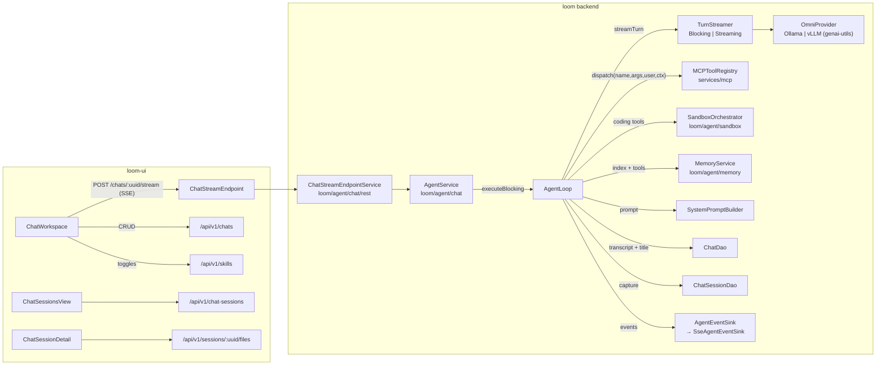
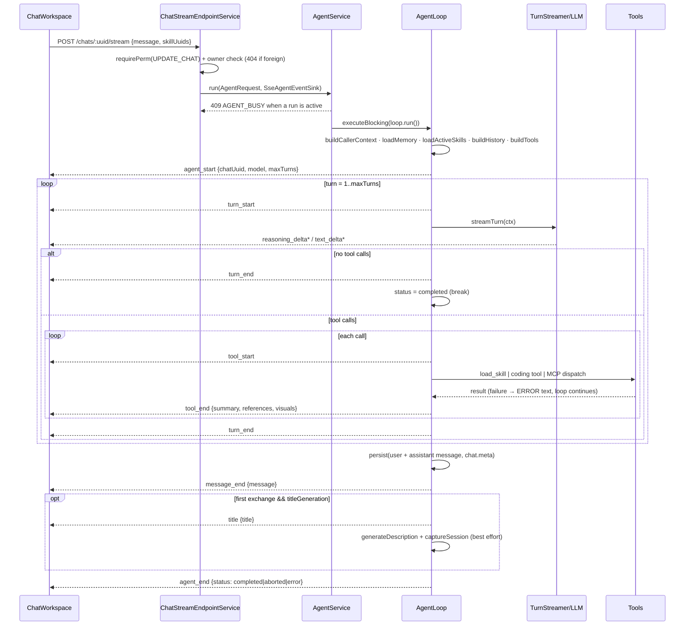

# MetaLoom // Chat (Loom Agent) Specification

> This document specifies the **Chat / Loom Agent**: an OpenAI-style chat in the Loom UI
> backed by a **server-side agentic loop** in the `loom/agent/chat` Maven module
> (package `io.metaloom.loom.agent.chat`). The agent converses with the Loom domain
> ([DOMAIN.md](../DOMAIN.md)) — find assets, list tasks, surface comments, summarize
> transcripts, run semantic searches — and renders the domain entities it touches as
> chips/tiles inside the conversation.
>
> **Scope note.** This file owns the *agentic loop, the streaming protocol and the chat
> UI contract*. Adjacent subsystems have their own specs and are only cross-referenced
> here — do not duplicate them:
>
> | Subsystem | Spec |
> |---|---|
> | Agent memory bank (`get/put/list/delete_memory`, scopes, denylist, materialization) | [CHAT_MEMORY_PLAN.md](../../features/chat/CHAT_MEMORY_PLAN.md) |
> | Chat sessions (capture, publish, context composition, session filesystem) | [CHAT_SESSIONS_CONCEPT.md](../../features/chat/CHAT_SESSIONS_CONCEPT.md) |
> | Chat UI implementation tasks / coverage matrix | [TASK_UI_CHAT.md](TASK_UI_CHAT.md) |
> | Backend implementation tasks | [CHAT_TASKS.md](../../features/chat/CHAT_TASKS.md) |
> | MCP tool surface & `visuals` envelope | [MCP.md](../MCP.md) |
> | REST endpoint inventory | [RESTAPI.md](../RESTAPI.md) |
> | General UI shell / routes | [LOOM_UI.md](LOOM_UI.md) |
> | Permission model | [PERMISSIONS.md](../../features/permissions/PERMISSIONS.md) |
>
> The loop design follows the **pi agent harness** (pi-mono / `@earendil-works`): its turn
> loop, its distinct text/thinking/tool-call stream events, its "errors become tool
> results" rule, and its progressive-disclosure **skills** model.
>
> ⚠️ **Historical note:** the loop used to live in `loom/services/ai`
> (`io.metaloom.loom.ai`). That module is gone — any such reference elsewhere is stale.

---

## 1. Progress Assessment

- [x] Chat session CRUD (`/api/v1/chats`, `chat` table, `ChatDao`, permissions)
- [x] Agentic loop (`AgentLoop`) — transcript replay, tool dispatch, turn limit, abort, persistence
- [x] `AgentService` — one active run per chat, `executeBlocking`, `abort()`
- [x] SSE streaming endpoint `POST|DELETE /api/v1/chats/:uuid/stream`
- [x] Turn-granular streaming (`BlockingTurnStreamer`) **and** true token/reasoning streaming (`StreamingTurnStreamer`, `LOOM_AI_STREAMING=true`)
- [x] MCP tool inventory dispatched in-process, permission-checked, with server-resolved `MCPCallerContext`
- [x] Skills: table + versions, owner-scoped REST, progressive disclosure, `load_skill` tool, per-chat activation
- [x] References (chips) and `visuals` (inline pipeline graph) envelopes
- [x] Auto title generation + auto session capture after the first exchange
- [x] Agent memory bank wired into the system prompt and the tool set (see [CHAT_MEMORY_PLAN.md](../../features/chat/CHAT_MEMORY_PLAN.md))
- [x] Sandbox coding tools (`run_shell`, `read_file`, `write_file`, `list_files`) gated by `LOOM_AGENT_SANDBOX_ENABLED`
- [x] Chat sessions REST (`/api/v1/chat-sessions`) + session filesystem (`/api/v1/sessions/:uuid/files|download|preview`)
- [x] UI: streaming transcript, markdown, hidden reasoning, action rows, chips, skills panel, greeting, split workspace
- [x] UI views: `SkillManagementView`, `ChatSessionsView` / `ChatSessionDetail`, `MemoryView`
- [x] Tests: `AgentLoopTest`, `StreamingTurnStreamerTest`, `ReferenceExtractorTest`, `VisualExtractorTest`, `SkillPromptBuilderTest`, `ChatStreamEndpointTest`, mocked + backend Playwright specs
- [ ] **`ChatStreamRequest.think` is parsed but never forwarded** — `AgentRequest` has no `think` field, so the loop always uses `LOOM_AI_THINK_ENABLED` (§4.1)
- [ ] No endpoint tests for `ChatSessionEndpoint` / `SessionFsEndpoint`
- [ ] No live-LLM integration test (backend Playwright specs assert CRUD only)
- [ ] vLLM has no true-streaming path — `LOOM_AI_STREAMING=true` degrades to the blocking streamer behaviour there

## 2. Architecture



Module layout — `loom/agent/` holds four modules; **only `chat` is specified here**:

| Module | Contents |
|---|---|
| `loom/agent/chat` | the loop, the event protocol, `ChatStreamEndpoint`, `ChatSessionEndpoint`, `SessionFsEndpoint`, prompt/skill/ref builders. Promotes `genai-utils` to compile scope. |
| `loom/agent/memory` | memory bank — see [CHAT_MEMORY_PLAN.md](../../features/chat/CHAT_MEMORY_PLAN.md) |
| `loom/agent/sandbox` | Session Runner orchestration + `CodingTools` |
| `loom/agent/session-runner`, `loom/agent/deploy` | the container image and its deployment |

`/api/v1/chats` CRUD deliberately stays in `loom/services/rest` (`ChatEndpoint`); only the
stream and session routes live in the agent module.

### 2.1 The agentic loop



**Threading.** LLM calls and jOOQ access are blocking, so the loop runs on a Vert.x worker
thread via `executeBlocking(..., false)` (unordered). `SseAgentEventSink` holds the request
`Context` and hops SSE writes back onto it. Abort is triggered by
`response.closeHandler` (client disconnect) or `DELETE /chats/:uuid/stream`; `AgentLoop.abort()`
sets an `AtomicBoolean` that is checked between turns and between tool calls.

**Error taxonomy (pi-inspired).**

| Failure | Handling |
|---|---|
| Tool execution fails / times out (`LOOM_AI_TOOL_TIMEOUT_MS`) | Becomes an **error tool result** (`"ERROR: …"`); the loop continues so the model can react. |
| Coding tool with non-zero shell exit | **Not** an error — exit code is appended to the result text so the model can react. |
| LLM/provider failure | `error {code: LLM_ERROR, terminal: true}` → `agent_end{status:"error"}`. Only the **user** message is persisted, plus `chat.meta.lastError`; no `message_end` is emitted. |
| Turn limit reached | Non-fatal `error {code: TURN_LIMIT, terminal: false}`, then the run finishes as **`completed`** with whatever text accumulated. |
| Memory write budget exceeded | Error tool result telling the model to stop writing (never aborts the run). |
| Chat not found | `error {code: NOT_FOUND, terminal: true}` → `agent_end{status:"error"}`. |
| Concurrent run on same chat | HTTP `409` before the stream opens. |

## 3. Tool inventory

The model is offered, in this order (`AgentLoop.buildTools()`):

| Group | Tools | Source |
|---|---|---|
| Domain (MCP) | `search_assets`, `get_asset`, `search_transcript`, `list_collections`, `asset_statistics`, `list_pipelines`, `get_pipeline` | `loom/services/mcp/.../tool/impl` via `MCPToolModule` |
| Memory (MCP) | `get_memory`, `put_memory`, `list_memory`, `delete_memory` | `loom/agent/memory/.../tool` via `MemoryToolModule` — details in [CHAT_MEMORY_PLAN.md](../../features/chat/CHAT_MEMORY_PLAN.md) |
| Coding | `run_shell`, `read_file`, `write_file`, `list_files` | `CodingTools` — advertised **only** when `LOOM_AGENT_SANDBOX_ENABLED=true`; executed in a per-chat Session Runner via `SandboxOrchestrator.dispatchCodingTool(chatUuid, …)`, *not* through the MCP registry |
| Agent-local | `load_skill` | added only when the run has active skills |

**Caller identity is server-resolved.** `AgentLoop.buildCallerContext()` builds an
`MCPCallerContext(userUuid, userName, groupUuids, spaceUuid, chatUuid)` from the request
user, `GroupDao.loadGroupsForUser` and the chat's space — never from tool arguments
(`MCPToolRegistry.CALLER_ENVELOPE_KEY` strips any `__loom` key a model tries to smuggle in).
Identity-requiring tools are not bound to the EventBus at all and are reachable only via
`dispatch(name, args, user, ctx)`. Group-resolution failure degrades to "no groups".

## 4. Streaming endpoint & event protocol

### 4.1 Endpoint

`ChatStreamEndpoint` (`loom/agent/chat/rest`) registers both routes; the SSE write pattern
mirrors `MCPService` (`text/event-stream`, `Cache-Control: no-cache`,
`X-Accel-Buffering: no`, chunked).

**`POST /api/v1/chats/:uuid/stream`** — requires `UPDATE_CHAT` *and* chat ownership
(a foreign chat is indistinguishable from a missing one → `404`).

```json
{ "message": "Find all beach videos and open a review task",
  "skillUuids": ["<uuid>"],
  "think": true }
```

> ⚠️ `think` is deserialized into `ChatStreamRequest` but **never reaches the loop** —
> `AgentRequest` carries only `(chatUuid, userUuid, user, message, skillUuids)` and
> `AgentLoop` reads `AiOptions.isThinkEnabled()`. Either wire it through or drop the field.

**`DELETE /api/v1/chats/:uuid/stream`** — idempotent cancel, `204` (also `UPDATE_CHAT` + ownership).

Why POST + SSE and not `EventSource`/WebSocket: `EventSource` can neither POST a body nor
set the `Authorization` header, so the client reads the response with `fetch` +
`ReadableStream` and an incremental parser (`createSseParser` in `api/agent.ts`). WebSocket
(precedent: `PipelineEventEndpoint`) stays the documented alternative if mid-run steering is
ever needed; v1 models steering as abort + resend.

### 4.2 Event vocabulary

Frames are `event: <type>` + single-line JSON `data:` (`AgentEventType`). Unlike pi (which
re-emits the full accumulated message per delta) Loom streams **deltas plus one final
authoritative snapshot** (`message_end`); the client persists nothing itself.

| event | data payload | notes |
|---|---|---|
| `agent_start` | `{"chatUuid","model","maxTurns"}` | always first |
| `turn_start` / `turn_end` | `{"turn":1}` | |
| `reasoning_delta` | `{"turn","text"}` | distinct type → UI hides it by default |
| `text_delta` | `{"turn","text"}` | answer markdown, incremental |
| `tool_start` | `{"turn","toolCallId","name","args"}` | renders as an ActionRow (running) |
| `tool_end` | `{"turn","toolCallId","name","isError","summary","references":[…],"visuals":[…]}` | chips and inline visuals appear live |
| `message_end` | `{"message": <persisted assistant message, §4.3>}` | omitted on terminal error |
| `title` | `{"title":"…"}` | first exchange only, when `LOOM_AI_TITLE_GENERATION` |
| `error` | `{"code":"LLM_ERROR"\|"TURN_LIMIT"\|"NOT_FOUND","message","terminal":bool}` | `AGENT_BUSY` is an HTTP 409, not an SSE frame |
| `agent_end` | `{"chatUuid","status":"completed"\|"aborted"\|"error"}` | always last |

### 4.3 Persisted message schema

`chat.messages` (jsonb array) elements:

```json
{ "id":"3f1c…", "role":"user"|"assistant", "content":"markdown text",
  "reasoning":"…",
  "toolCalls":[{"id":"c1","name":"search_assets","args":{"query":"beach"},
                "resultSummary":"3 assets found","isError":false,"durationMs":412}],
  "references":[{"type":"asset","uuid":"…","label":"beach.mp4"}],
  "visuals":[{"type":"pipeline-graph","uuid":"…","label":"…","payload":{}}],
  "skillUuids":["…"],
  "createdAt":"2026-07-22T10:15:03Z" }
```

- `reasoning` / `toolCalls` / `references` / `visuals` — assistant messages only;
  `skillUuids` records the active skill set on **user** messages.
- Raw tool results are **not** persisted — only a `resultSummary` truncated to
  `AgentLoop.RESULT_SUMMARY_MAX_LENGTH` (2048 chars). `buildHistory` reconstructs
  `assistantWithToolCalls` + `toolResult` pairs from `toolCalls[]` using that summary — an
  accepted context-fidelity trade-off (§8 R4).
- `visuals` are persisted but **never replayed** into the LLM history.
- `chat.meta` = `{"activeSkillUuids":[…], "model":"…", "lastError":"…"?}`; `lastError` is set
  on a terminal error and removed on the next successful run.

## 5. UI contract

`ChatWorkspace.tsx` is the whole chat surface: sessions rail, resizable chat column
(persisted percentage, collapsible workspace panel — [LOOM_UI.md §3.7](LOOM_UI.md)), right
panel with overview / embedded `AssetBrowser` / asset detail card.

| Concern | Component / file | Notes |
|---|---|---|
| Empty transcript | `ChatGreeting.tsx` | condition `messages.length === 0 && !streaming && !sending`; tracks the *empty transcript*, not session creation (server session stays lazy until the first `sendMessage`). Falls back to `chat.greeting.helloAnonymous`. Testids `chat-greeting`, `chat-greeting-title`. |
| Markdown | `MarkdownContent.tsx` | react-markdown + remark-gfm; **no `rehype-raw`** — raw HTML stays escaped. That is the entire sanitization story. |
| Reasoning | `ReasoningSection.tsx` | live "thinking… (Ns)" indicator; content collapsed by default; testids `chat-reasoning-*`. |
| Tool activity | `ActionRow` in `ChatWorkspace.tsx` | fed by `tool_start` / `tool_end`. |
| Chips | `RefChip` in `ChatWorkspace.tsx` | `asset · collection · task · comment · pipeline · annotation`; navigates per type. |
| Inline visuals | `PipelineGraphCard.tsx` + `pipelineGraphLayout.ts` | §6.1. |
| Skills | `SkillsPanel.tsx` | per-session toggles → `chat.meta.activeSkillUuids`, sent with **every** stream request. |
| Stream client | `api/agent.ts` | `streamChatMessage`, `cancelChatStream`, `createSseParser`, `AgentBusyError`. |
| Session CRUD | `api/chat.ts` | title renames and `meta` only — the server owns the transcript. |
| Chat sessions | `api/chatSessions.ts`, `features/chatSessions/` | `ChatSessionsView`, `ChatSessionDetail` (incl. `listSessionFiles` / `sessionFileDownloadUrl`). |
| Skills / memory views | `features/skills/SkillManagementView.tsx`, `features/memory/MemoryView.tsx` | `/skills` (CRUD, versions, publish, library+install) and the memory browser. |

State machine per in-flight message:
`idle → sending → streaming(reasoning | answering | tool) → done | error | aborted`.
The Stop button aborts the `fetch` (AbortController) **and** calls `cancelChatStream`;
a `409` surfaces as a busy toast with the input restored.

## 6. References (chips) and inline visuals

MCP tool results carry optional structured envelopes next to the standard MCP `content`
(external MCP clients ignore the extra fields — see [MCP.md §5.0.1](../MCP.md)):

```json
{ "content":[{"type":"text","text":"…"}],
  "references":[{"type":"asset","uuid":"…","label":"beach.mp4"}],
  "visuals":[{"type":"pipeline-graph","uuid":"…","label":"…","payload":{"nodes":[],"edges":[]}}] }
```

- `ReferenceExtractor` dedupes by `(type, uuid)` and caps at `MAX_REFERENCES` (20) per message.
- `VisualExtractor` dedupes likewise, caps at `MAX_VISUALS` (4) and `MAX_VISUAL_BYTES`
  (32 KB) per visual, on top of the producing tool's own node/edge caps.

### 6.1 `pipeline-graph`

The only visual type today, produced by `get_pipeline`. Flow (same path references take, so a
visual costs no extra round trip):
`tool result.visuals → VisualExtractor → tool_end → persisted message.visuals → PipelineGraphCard`.

Rules:

- **The model never sees a visual.** It reads the tool result's text only, so `get_pipeline`
  also renders the graph as text. A dropped visual costs a diagram, never an answer — which
  is why the extractor may discard silently.
- **Layout is the client's job.** The payload carries no coordinates (stored `x`/`y` belong to
  the full-screen editor canvas). `pipelineGraphLayout.ts` re-derives a left-to-right layered
  layout from the edges (column = 1 + deepest predecessor; parallel branches stack and are
  centred) and stays drawable for a cyclic definition, which the parser rejects on save but
  which may still sit in an older row.
- **Rendering:** name header, version chip, `disabled` chip, *Open* action into `/pipelines`;
  nodes coloured by `category` with the editor palette; bezier edges with `PASS`/`REJECT`
  labels; horizontal scroll rather than shrinking labels; `truncated` payloads say so; an
  empty graph renders nothing. Testids `chat-pipeline-graph`, `-node`, `-edges`, `-open`.

Adding a second visual type = produce the envelope in a tool, add the payload type in
`types/index.ts`, render it in the message bubble's visuals block. No protocol change.

## 7. Skills

A **skill** is a user-owned, SKILL.md-style markdown instruction package stored in the
database: `name` (unique per owner), `description` (≤1024 chars — what the model sees up
front), `content`, `enabled`, `published`, `origin_skill_uuid`, `meta`, plus a version
history (`skill_version`, `activeVersionNumber`).

- **Owner-scoped.** Loom permissions are global per entity type (`READ_SKILL` gates the
  feature); per-object scoping lives in the endpoint service. `AgentLoop.loadActiveSkills()`
  additionally filters to `creatorUuid == caller` **and** `enabled` — a foreign or disabled
  skill can never influence a run, and deleted uuids are dropped silently.
- **Per-chat activation.** `chat.meta.activeSkillUuids`, no join table. The client sends
  `skillUuids` with every stream request, so a mid-conversation toggle applies to the next
  message.
- **Progressive disclosure** (`SkillPromptBuilder`): the system prompt gets only
  `- name: description` inside `<available_skills>` plus an instruction to call `load_skill`.
  The full body is fetched on demand by the agent-local `load_skill {name}` tool, keeping
  unbounded bodies out of the context window. Escape hatch: `meta.injectFull = true` inlines
  the content in a `<skill name="…">` block — for small models that ignore the pattern (R7).
- **Sharing = publish + copy-on-install.** `published=true` exposes the skill in
  `GET /api/v1/skills/library`; `POST /api/v1/skills/:uuid/install` **copies** the row with
  `origin_skill_uuid` provenance (name collisions get a suffix). Execution always uses the
  caller's own copy, so an edited or deleted original can never silently change another
  user's agent behaviour; `ON DELETE SET NULL` keeps copies intact and provenance drives the
  *"update available"* hint.
- Backend surface: `SkillEndpoint` (`loom/services/rest`) `/api/v1/skills` CRUD + `/library`
  + `/:uuid/install` + version routes; permissions `CREATE/READ/UPDATE/DELETE_SKILL`.

`SystemPromptBuilder` composes the final system prompt as
`SkillPromptBuilder.build(activeSkills)` + `MemoryPromptBuilder.build(...)` (appended only
when the memory bank is enabled). Both halves follow the same progressive-disclosure rule —
skills expose name+description, memory exposes a header-only index.

## 8. Adjacent surfaces owned by other specs

Listed here only so an agent knows they exist and where they live.

| Surface | Routes | Spec |
|---|---|---|
| Chat sessions | `GET|POST /api/v1/chat-sessions`, `GET|POST|DELETE /:uuid`, `POST /:uuid/publish|unpublish`, `GET|PUT /:uuid/context` — permissions `CREATE/READ/UPDATE/DELETE_CHAT_SESSION` | [CHAT_SESSIONS_CONCEPT.md](../../features/chat/CHAT_SESSIONS_CONCEPT.md) |
| Session filesystem | `GET /api/v1/sessions/:uuid/files|download|preview` (keyed by **chat** uuid, `READ_CHAT`, preview served under `CSP: sandbox`) | [CHAT_SESSIONS_CONCEPT.md §6](../../features/chat/CHAT_SESSIONS_CONCEPT.md) |
| Memory bank | `/api/v1/memory*`, `/api/v1/memory-deny-rules*` | [CHAT_MEMORY_PLAN.md](../../features/chat/CHAT_MEMORY_PLAN.md) |
| Session Runner / sandbox | no public REST; `LOOM_AGENT_SANDBOX_*` | [CHAT_MEMORY_PLAN.md §4](../../features/chat/CHAT_MEMORY_PLAN.md) |

`AgentLoop` touches two of them directly: after the first completed exchange it generates a
title **and** a one-sentence description, then captures the chat as a `chat_session` with the
active skill **versions** pinned (`ChatSessionSkillPin`). This is idempotent and entirely
best-effort — every failure is logged and swallowed.

## 9. Configuration

`AiOptions` — `loom-shared/api/src/main/java/io/metaloom/loom/api/options/AiOptions.java`,
reachable as `LoomOptions.getAi()`.

| Env var | Default | Meaning |
|---|---|---|
| `LOOM_AI_ENABLED` | `true` | Enable the chat agent |
| `LOOM_AI_PROVIDER_TYPE` | `OLLAMA` | `OLLAMA` or `VLLM` (uppercased into `LLMProviderType`) |
| `LOOM_AI_URL` | `http://127.0.0.1:11434` | LLM provider base url |
| `LOOM_AI_MODEL_ID` | `gpt-oss:20b` | Model id |
| `LOOM_AI_CONTEXT_WINDOW` | `16384` | Context window handed to the provider |
| `LOOM_AI_MAX_TURNS` | `8` | Max agentic turns per user message |
| `LOOM_AI_TOOL_TIMEOUT_MS` | `30000` | Timeout for a single MCP tool dispatch |
| `LOOM_AI_THINK_ENABLED` | `true` | Enable reasoning/think mode (`ctx.enableThink()`) |
| `LOOM_AI_STREAMING` | `false` | `true` → `StreamingTurnStreamer` (true token/reasoning deltas); `false` → `BlockingTurnStreamer` (turn-granular) |
| `LOOM_AI_TITLE_GENERATION` | `true` | Auto title + description + session capture after the first exchange |

`validate()` requires `providerType`, `url` and `modelId` to be non-blank.
Related but owned elsewhere: `LOOM_AGENT_SANDBOX_*` (`SandboxOptions` — gates the coding
tools) and the memory options (`MemoryOptions`, incl. `maxWritesPerRun` and
`promptMaxEntries`).

## 10. Test setup

| Level | Tests |
|---|---|
| Loop (no DB, no LLM) | `AgentLoopTest`, `StreamingTurnStreamerTest`, `ReferenceExtractorTest`, `VisualExtractorTest`, `SkillPromptBuilderTest` — all in `loom/agent/chat/src/test` |
| Endpoint (pooled DB) | `ChatEndpointTest`, `ChatStreamEndpointTest`, `SkillEndpointTest`, `MemoryEndpointTest`, `MemoryDenyRuleEndpointTest` in `loom/core/src/test` |
| DAO | `ChatSessionDaoTest`, `SkillDaoTest`, `SkillVersionDaoTest`, `MemoryEntryDaoTest`, `MemoryDenyRuleDaoTest` in `loom/db/jooq/src/test` |
| MCP | `MCPToolReferencesTest`, `PipelineToolTest` in `loom/services/mcp` |
| UI unit | `api/agent.test.ts`, `api/chatMessageMapper.test.ts`, `api/skills.test.ts`, `features/chat/pipelineGraphLayout.test.ts` |
| E2E mocked | `chat-mocked.spec.ts`, `chat-split-mocked.spec.ts`, `chat-pipeline-graph-mocked.spec.ts`, `chat-sessions-mocked.spec.ts`, `skills-mocked.spec.ts`, `skills-version-mocked.spec.ts`, `empty-states-mocked.spec.ts` |
| E2E backend | `chat-backend.spec.ts`, `skills-backend.spec.ts` — CRUD only, no live-LLM assertions |

**Writing a loop test:** call `AgentService.setTurnStreamerFactory(...)` with a scripted
`TurnStreamer` — that is the seam the whole suite uses to run the loop without an LLM.
Remember `./setup-pool.sh` before any DB-backed test (and after every Flyway change).

## 11. Conventions & Gotchas

- **The loop lives in `loom/agent/chat`.** `loom/services/ai` / `io.metaloom.loom.ai` no
  longer exist; treat any such reference as stale.
- **`/chats` CRUD is *not* in the agent module** — it stays in `loom/services/rest`
  (`ChatEndpoint`). Only `/chats/:uuid/stream`, `/chat-sessions` and `/sessions` moved.
- **Ownership beats permissions.** Stream and session-fs routes check `UPDATE_CHAT`/`READ_CHAT`
  *and* `chat.creatorUuid == caller`; a foreign chat returns `404`, never `403`.
- **Never trust tool arguments for identity.** Build an `MCPCallerContext` server-side;
  arguments may only filter within what it resolves to.
- **Errors become tool results.** Only LLM/provider failures are terminal. Resist the urge to
  abort a run because a tool threw.
- **`TURN_LIMIT` ends as `completed`,** not `error` — the emitted `error` frame is
  `terminal:false` and `message_end` still arrives.
- **Terminal error ⇒ only the user message is persisted** (plus `meta.lastError`), so a retry
  starts from a consistent transcript.
- **Everything blocking runs on a worker thread.** `AgentLoop.run()` must never be invoked
  from the event loop; SSE writes hop back via the captured `Context`.
- **Streaming is opt-in and provider-dependent.** vLLM has no true streaming path — the
  `TurnStreamer` seam is what keeps the feature shippable on both.
- **Coding tools bypass the MCP registry** entirely (`SandboxOrchestrator.dispatchCodingTool`)
  and are only advertised when the sandbox is enabled.
- **Reasoning text is persisted.** `chat.messages[].reasoning` stores the raw thinking stream;
  the UI hides it, it is not redacted.
- **`chat.messages` is rewritten wholesale per exchange** (jsonb). Fine at chat scale, flagged
  for normalization (R5).

## 12. Where do I find …?

| Concept | Path |
|---|---|
| Agent entry point / busy guard / abort | `loom/agent/chat/src/main/java/io/metaloom/loom/agent/chat/AgentService.java` |
| The turn loop | `.../agent/chat/loop/AgentLoop.java` |
| Turn abstraction | `.../agent/chat/loop/TurnStreamer.java`, `BlockingTurnStreamer`, `StreamingTurnStreamer`, `TurnListener`, `TurnResult` |
| Event protocol | `.../agent/chat/event/AgentEvent*.java`, sink impl `.../rest/SseAgentEventSink.java` |
| Stream routes | `.../agent/chat/rest/ChatStreamEndpoint.java` (+ `…Service`) |
| Chat session routes | `.../agent/chat/rest/ChatSessionEndpoint.java` (+ `…Service`) |
| Session filesystem routes | `.../agent/chat/rest/SessionFsEndpoint.java` (+ `…Service`) |
| System prompt assembly | `.../agent/chat/prompt/SystemPromptBuilder.java`, `.../skill/SkillPromptBuilder.java` |
| Chips / visuals extraction | `.../agent/chat/ref/ReferenceExtractor.java`, `VisualExtractor.java` |
| Dagger wiring of the endpoints | `.../agent/chat/dagger/ChatEndpointModule.java` |
| MCP tools + registry | `loom/services/mcp/src/main/java/io/metaloom/loom/mcp/tool/` |
| Coding tools | `loom/agent/sandbox/src/main/java/io/metaloom/loom/agent/sandbox/tool/CodingTools.java` |
| Memory tools | `loom/agent/memory/src/main/java/io/metaloom/loom/agent/memory/tool/` |
| Config | `loom-shared/api/src/main/java/io/metaloom/loom/api/options/AiOptions.java` |
| Chat CRUD endpoint | `loom/services/rest/src/main/java/io/metaloom/loom/rest/endpoint/impl/ChatEndpoint.java` |
| Skill CRUD endpoint | `loom/services/rest/src/main/java/io/metaloom/loom/rest/endpoint/impl/SkillEndpoint.java` |
| Migrations | `loom/db/flyway/src/main/resources/db/migration/`: `V2.28__add_chat`, `V2.36__add_skill`, `V2.37__add_skill_version`, `V2.52__add_chat_session`, `V2.53__add_agent_memory`, `V2.54__add_memory_deny_rule` |
| Chat UI | `loom-ui/src/features/chat/` |
| Stream client | `loom-ui/src/api/agent.ts` |
| Chat session client / views | `loom-ui/src/api/chatSessions.ts`, `loom-ui/src/features/chatSessions/` |
| Skills / memory views | `loom-ui/src/features/skills/`, `loom-ui/src/features/memory/` |

## 13. Risks / Open Questions

| # | Risk | Mitigation |
|---|---|---|
| R1 | `think` from the request body is silently ignored (§4.1). | Add `think` to `AgentRequest` and let it override `AiOptions.isThinkEnabled()`, or remove the field from `ChatStreamRequest`. |
| R2 | Reverse proxies may buffer SSE. | `X-Accel-Buffering: no` + chunked responses; document `proxy_buffering off` for nginx. |
| R3 | vLLM has no true streaming path; `LOOM_AI_STREAMING=true` silently behaves turn-granular there. | `TurnStreamer` seam already isolates it; extend `genai-utils` when vLLM streaming lands. |
| R4 | Transcript replay uses ≤2 KB tool-result summaries → context fidelity loss on follow-ups. | Documented trade-off; revisit with a normalized `chat_message` table if it hurts. |
| R5 | Whole `chat.messages` jsonb is rewritten per exchange. | Fine at chat scale; flagged for future normalization. |
| R6 | `ChatSessionEndpoint` / `SessionFsEndpoint` have no endpoint tests — the session-fs routes serve files out of a container. | Add endpoint + permission tests per [CODING.md](../../guidelines/CODING.md). |
| R7 | Small local models may ignore `load_skill` progressive disclosure. | Require action-complete descriptions; `meta.injectFull` escape hatch. |
| R8 | Persisted `reasoning` is neither redacted nor size-capped. | Consider a cap analogous to `RESULT_SUMMARY_MAX_LENGTH`. |

_Git HEAD revision: `2e5981cb`_
_Last updated: 2026-08-01 (rewrote against `loom/agent/chat` — removed stale `loom/services/ai` claims, added memory/sandbox/session surfaces, verified env vars and tool inventory)_
