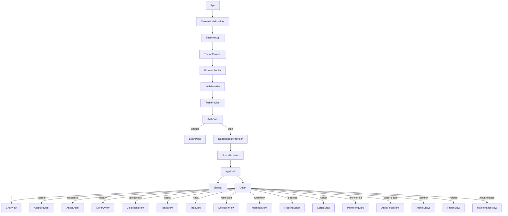

# MetaLoom // Loom UI Specification

> This document is a living specification for the Loom UI (React + TypeScript + Vite). It is intended to be consumed by AI agents and developers who need to understand, extend, or integrate with the UI. The progress checklist at the end tracks areas that still need improvement.

---

## 1. General Principles

### 1.1 Technology Stack

| Layer | Technology | Version | Purpose |
|-------|------------|---------|---------|
| Framework | React | 18.3.1 | Component-based UI |
| Language | TypeScript | 5.5.0 | Type-safe development |
| Build Tool | Vite | 6.4.2 | Fast dev server & bundler |
| UI Library | MUI (Material UI) | 5.16.0 | Component library & theming |
| Routing | React Router | 6.26.0 | Client-side routing |
| State | React Context + Hooks | — | Global state management |
| Graph Visualization | React Flow | 11.11.0 | Pipeline editor canvas |
| Internationalization | i18next + react-i18next | 26.0.4 / 17.0.2 | Multi-language support |
| Testing | Playwright | 1.59.1 | E2E testing |
| Charts | Recharts | 2.12.0 | Monitoring dashboards |

### 1.2 Project Structure

```
loom-ui/
├── src/
│   ├── api/                    # REST API client modules (one per endpoint)
│   ├── components/             # Shared UI components (Title.tsx)
│   ├── context/                # React Context providers (Auth, Space, NodeRegistry, Theme, Toast, Layout)
│   ├── features/               # Feature modules (one per major UI area)
│   │   ├── admin/              # Admin panel (spaces, users, groups, roles, API keys, blacklist)
│   │   ├── assetDetail/        # Asset detail view with media, timeline, annotations, comments, reactions, tasks, faces
│   │   ├── assetPools/         # Asset pool management
│   │   ├── assets/             # Asset browser (grid/list, filters, search)
│   │   ├── auth/               # Login page
│   │   ├── chat/               # Loom Agent chat interface
│   │   ├── collections/        # Collection management
│   │   ├── cortex/             # Cortex worker monitoring
│   │   ├── detection/          # Detection management (faces, objects, LLM)
│   │   ├── faceDetection/      # Face clusters & person database
│   │   ├── library/            # Library views
│   │   ├── maintenance/        # System health overview
│   │   ├── monitoring/         # Metrics & statistics dashboard
│   │   ├── pipeline/           # Pipeline editor (React Flow canvas, node palette, validation, run history)
│   │   ├── profile/            # User profile settings
│   │   ├── tags/               # Tag management
│   │   ├── tasks/              # Task board
│   │   └── workflow/           # Keyboard-driven bulk review workflows
│   ├── i18n/                   # Internationalization (i18n.ts + locales/en.json, de.json)
│   ├── layout/                 # App shell (AppShell.tsx, Sidebar.tsx)
│   ├── mock/                   # Mock data & services for development
│   ├── theme/                  # MUI theme configuration (tokens, buildTheme)
│   ├── types/                  # Shared TypeScript types (domain + nodeDescriptors)
│   ├── main.tsx                # App entry point
│   └── react-app-env.d.ts      # Vite type declarations
├── e2e/                        # Playwright E2E tests
├── public/                     # Static assets
├── index.html                  # HTML entry point
├── package.json
├── tsconfig.json
├── vite.config.ts
└── playwright.config.ts
```

### 1.3 Cross-References

| Spec File | Coverage |
|-----------|----------|
| [RESTAPI.md](../RESTAPI.md) | REST API endpoints, authentication, data models |
| [WEBSOCKET.md](../WEBSOCKET.md) | WebSocket protocols for pipeline events & processor communication |
| [MCP.md](../MCP.md) | Model Context Protocol server (separate port 4041) |
| [PIPELINE_EDITOR.md](PIPELINE_EDITOR.md) | Detailed pipeline visualization & editing (this file references it) |

---

## 2. E2E Test Setup

### 2.1 Playwright Configuration

**File:** `playwright.config.ts`

```typescript
import { defineConfig } from "@playwright/test";

const vitePort = Number(process.env.VITE_PORT ?? 3000);

export default defineConfig({
  testDir: "./e2e",
  timeout: 30_000,
  retries: 0,
  use: {
    baseURL: `http://localhost:${vitePort}`,
    headless: true,
  },
  webServer: {
    command: `npx vite --port ${vitePort}`,
    url: `http://localhost:${vitePort}`,
    reuseExistingServer: !process.env.CI,
    timeout: 30_000,
  },
  projects: [
    { name: "chromium", use: { browserName: "chromium" } },
  ],
});
```

### 2.2 Required Environment Variables

| Variable | Description | Default | Required |
|----------|-------------|---------|----------|
| `VITE_API_BASE_URL` | Base path for REST API | `/api/v1` | Yes (for backend tests) |
| `VITE_PROXY_TARGET` | Backend server URL for Vite proxy | `http://localhost:8092` | Yes (for backend tests) |
| `VITE_PORT` | Vite dev server port | `3000` | No |

### 2.3 Test Categories

| Test File | Type | Backend Required | Description |
|-----------|------|------------------|-------------|
| `login.spec.ts` | UI Smoke | No (mocked) | Login form rendering, error handling, navigation |
| `login-backend.spec.ts` | Integration | Yes | Real login against backend |
| `pipeline-backend.spec.ts` | Integration | Yes | Pipeline editor with real node descriptors |
| `pipeline-loading.spec.ts` | Integration | Yes | Pipeline loading & canvas rendering |
| `pipeline-versions.spec.ts` | Integration | Yes | Version badge, history dropdown, restore round-trip |
| `pipeline-versions-mocked.spec.ts` | UI Smoke | No (mocked) | Version badge/history/restore mechanics in isolation |
| `assets-backend.spec.ts` | Integration | Yes | Asset browser with real data |
| `collections-backend.spec.ts` | Integration | Yes | Collection CRUD |
| `detections-backend.spec.ts` | Integration | Yes | Face/object detection views |
| `groups-backend.spec.ts` | Integration | Yes | Group management |
| `library-backend.spec.ts` | Integration | Yes | Library views |
| `persons-backend.spec.ts` | Integration | Yes | Person database |
| `pools-backend.spec.ts` | Integration | Yes | Asset pool management |
| `roles-backend.spec.ts` | Integration | Yes | Role/permission management |
| `spaces-backend.spec.ts` | Integration | Yes | Space management |
| `tags-backend.spec.ts` | Integration | Yes | Tag management |
| `tasks-backend.spec.ts` | Integration | Yes | Task board |
| `users-backend.spec.ts` | Integration | Yes | User management |

### 2.4 Running Tests

```bash
# Start backend (required for backend tests)
# Ensure Loom server is running on VITE_PROXY_TARGET with demo data

# Run all E2E tests
npm run test:e2e

# Run with UI mode
npm run test:e2e:ui

# Run specific test file
npx playwright test e2e/pipeline-backend.spec.ts

# Run with custom API base URL
VITE_API_BASE_URL=/api/v1 VITE_PROXY_TARGET=http://localhost:8092 npm run test:e2e
```

### 2.5 Test Prerequisites

1. **Loom Server Running** — With `DemoDatabaseInitializer` populated
2. **Default Credentials** — `admin` / `finger`
3. **Node Descriptors Registered** — `NodeDescriptorEndpoint` must be active
4. **Vite Dev Server** — Started by Playwright webServer config (or manually)

---

## 3. Features Covered by the UI

### 3.1 Feature Inventory

| Feature Area | Route | Component | Description | Backend Endpoints |
|--------------|-------|-----------|-------------|-------------------|
| **Authentication** | `/` | `LoginPage` | JWT login form, error handling | `POST /api/v1/login` |
| **Asset Browser** | `/assets` | `AssetBrowser` | Grid/list view, search, filters (status, type, library), card size toggle | `GET /api/v1/assets` |
| **Asset Detail** | `/assets/:id` | `AssetDetail` | Media player (video/image), timeline with markers, annotations, comments, reactions, tasks, transcripts, face detection, tags, metadata | `GET /api/v1/assets/:uuid`, `GET /api/v1/assets/:uuid/annotations`, `GET /api/v1/assets/:uuid/reactions`, `GET /api/v1/assets/:uuid/comments`, `GET /api/v1/assets/:uuid/transcripts`, `GET /api/v1/assets/:uuid/detections` |
| **Library** | `/library` | `LibraryView` | Library selector, asset grid per library | `GET /api/v1/libraries`, `GET /api/v1/libraries/:uuid/assets` |
| **Collections** | `/collections` | `CollectionsView` | CRUD collections, asset assignment, color coding | `GET/POST/DELETE /api/v1/collections` |
| **Tasks** | `/tasks` | `TasksView` | Kanban-style board, priority/status, assignee, due dates, drawer detail | `GET/POST/DELETE /api/v1/tasks` |
| **Tags** | `/tags` | `TagsView` | Tag management grouped by collection, drag-to-move | `GET/POST/DELETE /api/v1/tags` |
| **Detection** | `/detection` | `DetectionView` | Tabs: Faces, Objects, LLM prompts | `GET /api/v1/detections` |
| **Face Detection** | `/detection/faces` | `FaceDetectionView` | Cluster management, person assignment, face gallery | `GET /api/v1/clusters`, `GET /api/v1/persons` |
| **Chat (Loom Agent)** | `/` | `ChatView` | Conversational AI assistant with asset/task/pipeline references | `POST /api/v1/graphql` (not yet registered) |
| **Pipeline Editor** | `/pipelines` | `PipelineEditor` | React Flow canvas, node palette, validation, run history, JSON view | `GET/POST /api/v1/pipelines`, `POST /api/v1/pipelines/:uuid/run`, `GET /api/v1/pipeline/node-descriptors` |
| **Cortex Workers** | `/cortex` | `CortexView` | Worker status, CPU/GPU/IO metrics, pause/resume/terminate, node-restriction (whitelist/blacklist) editing, forget offline worker | `GET /api/v1/processors` (live + persisted-offline merged), `GET/PUT /api/v1/processors/:nodeId/restrictions`, `DELETE /api/v1/processors/:nodeId`, `WS /api/v1/processors/ws` |
| **Monitoring** | `/monitoring` | `MonitoringView` | 14-day rolling metrics: ingestion, pipeline runs, latency, storage, tasks, agent usage | `GET /api/v1/metrics` (not implemented) |
| **Asset Pools** | `/asset-pools` | `AssetPoolsView` | Pool CRUD, asset assignment, replication | `GET/POST/DELETE /api/v1/pools` |
| **Admin: Spaces** | `/admin/spaces` | `SpacesView` | Space CRUD | `GET/POST/DELETE /api/v1/spaces` |
| **Admin: Users** | `/admin/users` | `UsersView` | User CRUD, roles, status | `GET/POST/DELETE /api/v1/users` |
| **Admin: Groups** | `/admin/groups` | `GroupsView` | Group CRUD, member management | `GET/POST/DELETE /api/v1/groups` |
| **Admin: Roles** | `/admin/permissions` | `RolesView` | Role CRUD, permission matrix | `GET/POST/DELETE /api/v1/roles` |
| **Admin: API Keys** | `/admin/api-keys` | `ApiKeysView` | Token generation, listing, deletion | `GET/POST/DELETE /api/v1/tokens` |
| **Admin: Blacklist** | `/admin/blacklist` | `BlacklistView` | IP/domain/fingerprint/user blacklist entries | `GET/POST/DELETE /api/v1/blacklists` |
| **Profile** | `/profile` | `ProfileView` | Name, email, username, role, language, theme | `GET/PUT /api/v1/users/:uuid` |
| **Maintenance** | `/maintenance` | `MaintenanceView` | System health: DB, S3, memory, workers | `GET /api/v1/health` (not implemented) |
| **Workflow** | `/workflow` | `WorkflowView` | Fullscreen keyboard-driven review modes | — |

### 3.2 Navigation Structure

```
Sidebar (collapsible)
├── User Navigation
│   ├── Chat (/)                    → ChatView
│   ├── Library (/library)          → LibraryView
│   ├── Assets (/assets)            → AssetBrowser
│   ├── Collections (/collections)  → CollectionsView
│   ├── Tasks (/tasks)              → TasksView
│   ├── Detection (/detection)      → DetectionView
│   ├── Tags (/tags)                → TagsView
│   └── Workflow (/workflow)        → WorkflowView
└── Admin Navigation (divider)
    ├── Asset Pools (/asset-pools)  → AssetPoolsView
    ├── Pipelines (/pipelines)      → PipelineEditor
    ├── Cortex (/cortex)            → CortexView
    ├── Monitoring (/monitoring)    → MonitoringView
    ├── Spaces (/admin/spaces)      → SpacesView
    ├── Users (/admin/users)        → UsersView
    ├── Groups (/admin/groups)      → GroupsView
    ├── Permissions (/admin/permissions) → RolesView
    ├── API Keys (/admin/api-keys)  → ApiKeysView
    └── Blacklist (/admin/blacklist) → BlacklistView
```

---

## 4. Authentication Handling

### 4.1 Architecture

```
┌─────────────────────────────────────────────────────────────┐
│                        AuthProvider                         │
│  ┌─────────────┐  ┌─────────────┐  ┌─────────────────────┐  │
│  │ isAuth:bool │  │ username    │  │ token:string        │  │
│  └─────────────┘  └─────────────┘  └─────────────────────┘  │
│         │               │                    │               │
│         ▼               ▼                    ▼               │
│  ┌─────────────────────────────────────────────────────┐   │
│  │ login(username, password) → calls api/auth.ts       │   │
│  │ logout() → clears all state                         │   │
│  └─────────────────────────────────────────────────────┘   │
└─────────────────────────────────────────────────────────────┘
```

### 4.2 AuthContext API

**File:** `src/context/AuthContext.tsx`

```typescript
interface AuthContextValue {
  isAuthenticated: boolean;
  username: string | null;
  token: string | null;
  login: (username: string, password: string) => Promise<boolean>;
  logout: () => void;
}
```

### 4.3 Login Flow

1. User submits credentials on `LoginPage` (`/`)
2. `AuthProvider.login()` calls `api/auth.ts → login()` → `POST /api/v1/login`
3. On success: JWT token stored in context, `isAuthenticated = true`
4. `AuthGate` in `main.tsx` switches from `LoginPage` to `AppShell` (wrapped in providers)
5. Token included in all API calls via `authHeaders(token)` helper

### 4.4 Token Management

| Aspect | Implementation |
|--------|----------------|
| Storage | In-memory React state (not localStorage) |
| Header | `Authorization: Bearer <token>` on all API requests |
| Expiry | Handled by backend (401 → UI redirects to login) |
| Refresh | Not implemented (session-based) |
| Logout | Clears context state, redirects to `/` |

### 4.5 Protected Routes

All routes under `AppShell` require authentication. The `AuthGate` component in `main.tsx` enforces this:

```tsx
function AuthGate() {
  const { isAuthenticated } = useAuth();
  if (!isAuthenticated) return <LoginPage />;
  return (
    <NodeRegistryProvider>
      <SpaceProvider>
        <AppShell />
      </SpaceProvider>
    </NodeRegistryProvider>
  );
}
```

### 4.6 OAuth2 / SSO

**Not implemented in UI.** The backend supports OAuth2 BFF pattern (`/api/v1/auth/oauth2/*`) but the UI only implements username/password login. See [RESTAPI.md](../RESTAPI.md#23-oauth2-bff-pattern) for backend details.

---

## 5. State Handling

### 5.1 Global State Architecture

```
┌────────────────────────────────────────────────────────────────┐
│                      React Context Providers                   │
├──────────────────┬──────────────────┬──────────────────────────┤
│  AuthContext     │  SpaceContext    │  NodeRegistryContext     │
│  - isAuth        │  - spaces[]      │  - descriptors[]         │
│  - username      │  - activeSpace   │  - contentTypes[]        │
│  - token         │  - setActiveSpace│  - loading/error         │
│  - login/logout  │                  │  - getDescriptor()       │
├──────────────────┼──────────────────┼──────────────────────────┤
│  ThemeContext    │  ToastContext    │  LayoutContext           │
│  - mode          │  - toasts[]      │  - sidebarCollapsed      │
│  - toggleTheme   │  - show/hide     │  - setSidebarCollapsed   │
└──────────────────┴──────────────────┴──────────────────────────┘
```

### 5.2 Context Details

| Context | File | Purpose | Consumers |
|---------|------|---------|-----------|
| `AuthContext` | `src/context/AuthContext.tsx` | JWT auth state & login | All API calls, AuthGate, LoginPage, Sidebar |
| `SpaceContext` | `src/context/SpaceContext.tsx` | Active space selection | AssetBrowser, LibraryView, CollectionsView, Sidebar |
| `NodeRegistryContext` | `src/context/NodeRegistryContext.tsx` | Pipeline node descriptors & content types | PipelineEditor, PipelineCanvas, CommandPalette |
| `ThemeContext` | `src/context/ThemeContext.tsx` | Dark/light mode toggle | ThemeProvider, ProfileView |
| `ToastContext` | `src/context/ToastContext.tsx` | Global notifications | PipelineEditor (save/run), AssetDetail (actions) |
| `LayoutContext` | `src/context/LayoutContext.tsx` | Sidebar collapse state | AppShell, Sidebar |

### 5.3 Feature-Local State

Each feature manages its own state via `useState`/`useReducer`:

| Feature | Key State |
|---------|-----------|
| `AssetBrowser` | `assets[]`, `filtered[]`, `loading`, `query`, `viewMode`, `cardSize`, `statusFilter`, `typeFilter` |
| `AssetDetail` | `asset`, `comments[]`, `annotations[]`, `reactions[]`, `tasks[]`, `transcriptSections[]`, `detectedFaces[]`, `faceClusters[]`, `persons[]`, `tab`, `currentTime`, `playing`, `leftPct` (draggable split) |
| `PipelineEditor` | `pipelines[]`, `selected`, `selectedNodeId`, `addedNodes[]`, `nodeDisplayNames{}`, `canvasTab`, `graphJson`, `validationErrors[]`, `pipelineRuns[]`, `dirty`, `saving`, `running`, `logOpen`, `logHeight`, `nodeDetailOpen`, `showHelp`, `showCommandPalette` |
| `CollectionsView` | `collections[]`, `selectedCollection`, `assets[]`, `viewMode`, `query` |
| `TasksView` | `tasks[]`, `filter`, `sort`, `selectedTask` |
| `CortexView` | `workers[]`, `loading`, `query`, `statusFilter`, `capFilter` |

### 5.4 Data Flow Patterns

#### Pattern 1: Server-First (Most Features)
```
useEffect([token, id]) → API call → setState(data) → render
```

#### Pattern 2: Optimistic Updates (Pipeline Editor)
```
User action → update local state immediately → setDirty(true) → 
  Save button → API call → on success: setDirty(false)
```

#### Pattern 3: WebSocket Live Updates (Cortex, Pipeline Events)
```
WS connection → onMessage → update local state → re-render
```

### 5.5 State Persistence

| State | Persisted? | Mechanism |
|-------|------------|-----------|
| Theme mode | Yes | `localStorage` via `ThemeContext` |
| Sidebar collapse | Yes | `localStorage` via `LayoutContext` |
| Language | Yes | `localStorage` via `i18n` |
| Auth token | No | In-memory only (security) |
| Pipeline draft | No | In-memory (`dirty` flag warns on navigate) |
| Asset detail scroll | No | Reset on navigate |

---

## 6. Pipeline Visualization & Editing

> **Note:** This section provides an overview. For exhaustive detail, see [PIPELINE_EDITOR.md](PIPELINE_EDITOR.md).

### 6.1 Architecture Overview

```
┌─────────────────────────────────────────────────────────────────────────────┐
│                            PipelineEditor (Main Component)                  │
├─────────────────────────────────────────────────────────────────────────────┤
│                                                                             │
│  ┌──────────────┐  ┌──────────────────────────┐  ┌──────────────┐          │
│  │ Pipeline List│  │      PipelineCanvas      │  │  Inspector   │          │
│  │  (220px)     │  │   (React Flow Canvas)    │  │  (240px)     │          │
│  │              │  │                          │  │              │          │
│  │ - Select     │  │  ┌──────────────────┐   │  │ - Pipeline   │          │
│  │ - Status     │  │  │ PipelineNode     │   │  │   metadata   │          │
│  │ - Priority   │  │  │ (custom node)    │   │  │ - Run history│          │
│  │ - Dry run    │  │  │                  │   │  │              │          │
│  └──────────────┘  │  │ - Handles        │   │  └──────────────┘          │
│                    │  │ - Connectors     │   │                            │
│                    │  │ - Edge labels    │   │  ┌──────────────┐          │
│                    │  │ - Validation     │   │  │ NodeDetail   │          │
│                    │  │ - Auto-arrange   │   │  │ Sidebar      │          │
│                    │  │ - Command palette│   │  │ (280px,      │          │
│                    │  └──────────────────┘   │  │  collapsible)│          │
│                    │                         │  └──────────────┘          │
│                    │  ┌──────────────────┐   │                            │
│                    │  │ Add Node Bar     │   │                            │
│                    │  │ (search + popper)│   │                            │
│                    │  └──────────────────┘   │                            │
│                    │  ┌──────────────────┐   │                            │
│                    │  │ Log Panel        │   │                            │
│                    │  │ (draggable,      │   │                            │
│                    │  │  run history)    │   │                            │
│                    │  └──────────────────┘   │                            │
│                    └──────────────────────────┘                            │
│                                                                             │
└─────────────────────────────────────────────────────────────────────────────┘
```

### 6.2 React Flow Canvas (`PipelineCanvas`)

**File:** `src/features/pipeline/PipelineEditor.tsx` (lines ~800-1300)

#### Node Rendering (`PipelineNodeComponent`)

- **Categories:** SOURCE, FILTER, ANALYSIS, TRANSFORM, OUTPUT — each with distinct color/icon
- **Handles:** Input (left) / Output (right) — typed by data type (media, data, hash, text, control)
- **Visual States:** Selected (colored border), Active (pulsing green dot), Hover (delete button)
- **Data:** `label`, `description`, `category`, `nodeIcon`, `inputs[]`, `outputs[]`, `onDelete`, `isActive`, `displayName`, dynamic parameters

#### Edge Rendering

- **Types:** PASS (green), REJECT (red dashed), ANY (gray) — configurable via edge context menu
- **Validation:** Connection only allowed between matching data types
- **Reconnect:** Drag existing edge to new target; drop in empty space → delete edge

#### Interactions

| Action | Handler | Effect |
|--------|---------|--------|
| Click node | `onNodeClick` | Select node, open NodeDetailSidebar |
| Click pane | `onPaneClick` | Deselect |
| Drag handle → handle | `onConnect` | Create edge (validated by `isValidConnection`) |
| Drag edge | `onReconnectStart/End` | Reconnect or delete edge |
| Right-click edge | `onEdgeClick` | Open PASS/REJECT/ANY context menu |
| DEL key | `keydown` handler | Delete selected node (with confirmation) |
| N key | `keydown` handler | Open command palette |
| A key | `keydown` handler | Auto-arrange (topological layout) |

#### Auto-Arrange Algorithm

Topological sort (Kahn's algorithm) → assign columns → position nodes in DAG layout → `fitView()`

### 6.3 Node Palette & Command Palette

**Add Node Bar** (above log panel): Search input + Popper menu with filtered descriptors

**Command Palette** (N key): Full-screen searchable modal with keyboard navigation (↑/↓/Enter/Escape)

Both use `descriptors` from `NodeRegistryContext`, filtered by:
- Name
- Kind
- Category (SOURCE, FILTER, ANALYSIS, TRANSFORM, OUTPUT)

### 6.4 Node Detail Sidebar

**File:** `src/features/pipeline/PipelineEditor.tsx` (lines ~400-800)

Three tabs:
1. **Config** — Display name (editable, max 15 chars), description, dynamic parameter editors from `NodeDescriptor.parameters` (enum dropdown, boolean switch, string list, number/text input)
2. **Log** — Simulated processing log with timestamps/levels
3. **JSON** — Full node state as formatted JSON

Parameter changes → `handleParameterChange` → updates `selected.definition.nodes` → `setDirty(true)`

### 6.5 Pipeline Inspector (Right Panel)

Shows:
- Pipeline name, description
- Enabled/disabled, priority, dry-run chips
- Latest run status (success/failed/running/idle)
- Scrollable run history (`RunHistory` component)

### 6.6 Persistence & API Integration

#### Loading Pipelines
```typescript
useEffect(() => {
  listPipelines(token).then(resp => {
    const ps = resp.data.map(mapToPipeline);
    setPipelines(ps);
    setSelected(ps[0]);
  });
}, [token]);
```

#### Loading Run History
```typescript
useEffect(() => {
  listPipelineRuns(token, selected.id).then(setPipelineRuns);
}, [token, selected?.id]);
```

#### Save Pipeline
```typescript
const handleSave = async () => {
  // 1. Validate (cycle detection, duplicate IDs, unknown types)
  const errors = validatePipeline(nodes, edges, descriptors);
  if (errors.length) return notify("error", errors[0].message);

  // 2. Build definition from graphJson or selected.definition
  const req: PipelineUpdateRequest = { name, description, definition, enabled, priority, dryRun };

  // 3. POST /api/v1/pipelines/:uuid
  await updatePipeline(token, selected.id, req);
  setDirty(false);
};
```

#### Run Pipeline
```typescript
const handleRun = async () => {
  const resp = await runPipeline(token, selected.id, { dryRun: selected.dryRun });
  notify(resp.dispatched ? "success" : "info", resp.message);
};
```

### 6.7 Pipeline Versioning

Every pipeline is stored as a `pipeline` row pointing at a `latest_version_uuid`;
the name/description/definition/enabled/priority/dryRun fields live on
`pipeline_version` rows. The REST layer flattens the two back together, so a
`PipelineResponse` carries **both** `uuid` (the pipeline) and
`versionUuid` + `versionNumber` (the version it was rendered from). There is no
`version` field — see [RESTAPI.md](../RESTAPI.md#35-pipeline-versions-and-the-flattened-pipeline-model).

#### Endpoints used by the UI

| Endpoint | UI usage |
|----------|----------|
| `GET /api/v1/pipelines/:uuid/versions` | Populate the version history dropdown (paged, cursor-based) |
| `GET /api/v1/pipelines/:uuid/versions/:n` | Available via `loadPipelineVersion` (not yet used by the editor) |
| `POST /api/v1/pipelines/:uuid/versions/:n/restore` | Restore a version — responds **201** |

API client: `src/api/pipelines.ts` → `listPipelineVersions`, `loadPipelineVersion`,
`restorePipelineVersion`. `listPipelineVersions` degrades to `[]` when the
endpoint is absent, mirroring `listPipelineRuns`.

#### UI surfaces

1. **Version badge** (`PipelineVersionBadge`) — a compact monospace `v<n>` chip
   absolutely positioned at the top-left of the node editor
   (`data-testid="pipeline-version-badge"`). Deliberately minimal so it does not
   obstruct the canvas.
2. **Version history dropdown** — clicking the badge opens a `Popover`
   (`data-testid="pipeline-version-list"`) listing every version newest-first,
   each row showing the version number, creation timestamp and author. The
   current version is highlighted and tagged `current`; all others expose a
   restore icon button.
3. **Inspector chip** — the right-hand `PipelineInspector` header repeats the
   current version as a chip (`data-testid="pipeline-inspector-version"`) so the
   version is visible even when the canvas is scrolled or the JSON tab is open.

#### Restore semantics (important)

Restore is **copy-forward, not a rewind**: the server copies the requested
version's contents into a *brand-new* version and repoints the pipeline at it.
Restoring v1 while v4 is current yields **v5**, and nothing is deleted. The UI
states this in the confirmation dialog and reports it as "Restored v1 as v5".

#### Restore flow

```
Badge click → loadVersions() → GET /versions
Restore icon → setRestoreConfirm(n) → confirmation dialog
  (warns if the editor is dirty — restoring discards local edits)
Confirm → POST /versions/:n/restore → 201 PipelineResponse
  → toPipeline(resp) → setSelected + patch pipelines[]
  → clear addedNodes / nodeDisplayNames / graphJson / selection / validation
  → setDirty(false)
  → setCanvasReloadKey(k => k + 1)   ← forces the canvas to rebuild
```

`PipelineCanvas` normally resets its React Flow graph only when `pipeline.id`
changes. Because a restore keeps the same pipeline id, the canvas takes a
`reloadKey` prop and its reset effect depends on `[pipeline?.id, reloadKey]`.
Bumping `canvasReloadKey` is what makes the restored definition appear in the
node editor automatically.

A successful **save** also mints a new version: `handleSave` adopts the
`versionUuid` / `versionNumber` from the update response so the badge and
history stay in sync — but it deliberately does *not* bump `reloadKey`, since
the canvas already shows exactly what was saved.

### 6.8 Validation

**File:** `src/features/pipeline/PipelineEditor.tsx` (lines ~1300-1450)

| Check | Algorithm | Error Type |
|-------|-----------|------------|
| Duplicate IDs | Set tracking | `duplicateId` |
| ID Format | Regex `^[a-z0-9]([a-z0-9-]{0,62}[a-z0-9])?$` | `invalidId` |
| Unknown Types | Check against `descriptors` | `unknownType` |
| Cycles | Kahn's topological sort | `cycle` |

Validation runs on:
- Save (blocking)
- Graph change (clears stale errors)

### 6.9 JSON View (Canvas Tab)

Two panels:
1. **Loaded Definition** — Server-persisted pipeline definition (read-only, syntax highlighted)
2. **Current Canvas State** — Live React Flow graph (editable via canvas, syntax highlighted)
3. **Validity Indicator** — Green/red dot based on `graphJson` presence
4. **Validation Errors** — Listed below if any

### 6.10 Event Handling Summary

| Event Source | Handler | State Mutation |
|--------------|---------|----------------|
| Node click | `handleNodeSelect` | `selectedNodeId`, `nodeDetailOpen` |
| Node add (palette) | `handleAddNode` | `addedNodes[]`, `selected.definition.nodes[]` |
| Node delete | `handleDeleteNodeConfirm` | `selected.definition.nodes/edges`, `addedNodes[]`, `removalTrigger` |
| Parameter change | `handleParameterChange` | `selected.definition.nodes[].data[key]` |
| Edge type change | `handleEdgeTypeChange` | `selected.definition.edges[].edgeType` |
| Node drag | React Flow `onNodesChange` | `nodes[].position` (local only) |
| Auto-arrange | `setAutoArrangeTrigger` | Triggers layout effect → `setNodes` with new positions |
| Save | `handleSave` | `POST /pipelines/:uuid` → `setDirty(false)` |
| Run | `handleRun` | `POST /pipelines/:uuid/run` → notification |

### 6.11 CRUD Handling

| Operation | UI Action | API Call | Optimistic? |
|-----------|-----------|----------|-------------|
| **Create** | Not in editor (use API directly) | `POST /pipelines` | N/A |
| **Read (List)** | Mount `PipelineEditor` | `GET /pipelines` | No |
| **Read (Single)** | Select in list | `GET /pipelines/:uuid` (via list) | No |
| **Update** | Edit canvas → Save | `POST /pipelines/:uuid` | Yes (local first) |
| **Delete** | Not in editor (use API directly) | `DELETE /pipelines/:uuid` | N/A |
| **Run** | Run button | `POST /pipelines/:uuid/run` | No |

> **Note:** Pipeline creation/deletion not implemented in UI — only editing existing pipelines.

### 6.12 Pipeline Version Diff

Restore is copy-forward and irreversible-by-omission (see §6.7), so before
reinstating an old version an author needs to see *what* it would reintroduce.
The version diff renders a side-by-side comparison between any previous version
and the current one.

#### Endpoints used by the UI

| Endpoint | UI usage |
|----------|----------|
| `GET /api/v1/pipelines/:uuid/versions/:n` | Fetch both sides via `loadPipelineVersion` — the base version and the current version |

#### UI surfaces

1. **Compare action** — every non-current row of the version-history `Popover`
   exposes a compare icon button (`CompareArrowsOutlined`,
   `data-testid="pipeline-version-compare-<n>"`) beside the restore button.
   Clicking it closes the popover and opens the diff of `v<n>` against current.
2. **Diff dialog** (`PipelineVersionDiff`, `src/features/pipeline/PipelineVersionDiff.tsx`)
   — a full-width MUI `Dialog` (`data-testid="pipeline-version-diff"`) showing
   two aligned monospace JSON columns: base `v<n>` on the left, current on the
   right. Added lines are green, removed lines red, changed lines amber. Each
   non-identical row carries `data-testid="pipeline-version-diff-changed"`;
   identical rows carry `pipeline-version-diff-same`. Loading, error
   (`pipeline-version-diff-error`) and "no differences"
   (`pipeline-version-diff-empty`) states are handled. Closed via
   `pipeline-version-diff-close`.

#### Diff engine

`src/features/pipeline/pipelineDiff.ts` is a pure module (no React):
`normalizeDefinition` recursively sorts object keys and orders `nodes` / `edges`
by `id` before pretty-printing, so reordering alone never registers as a change;
`diffLines` runs a longest-common-subsequence line alignment, folding adjacent
remove+add pairs into single `changed` rows; `hasChanges` backs the empty state.
The raw server `definition` is diffed directly — it is already free of the
cosmetic React-Flow keys that `getGraphJson` strips from local canvas state.

#### Diff flow

```
Compare icon (v<n>) → setDiffTarget(n) → <PipelineVersionDiff open>
  → Promise.all(loadPipelineVersion(base), loadPipelineVersion(current))
  → normalizeDefinition(each) → diffLines(base, current)
  → render side-by-side columns (green add / red remove / amber change)
Close → setDiffTarget(null)
```

---

## 7. Key Classes Reference

| Class/Component | File | Purpose |
|-----------------|------|---------|
| `PipelineEditor` | `src/features/pipeline/PipelineEditor.tsx` | Main pipeline editor orchestration |
| `PipelineCanvas` | `src/features/pipeline/PipelineEditor.tsx` | React Flow canvas wrapper |
| `PipelineNodeComponent` | `src/features/pipeline/PipelineEditor.tsx` | Custom node renderer |
| `PipelineInspector` | `src/features/pipeline/PipelineEditor.tsx` | Right stats panel |
| `NodeDetailSidebar` | `src/features/pipeline/PipelineEditor.tsx` | Collapsible node config panel |
| `RunHistory` | `src/features/pipeline/PipelineEditor.tsx` | Run history list |
| `PipelineVersionBadge` | `src/features/pipeline/PipelineEditor.tsx` | `v<n>` canvas badge + version history dropdown + restore + compare |
| `PipelineVersionDiff` | `src/features/pipeline/PipelineVersionDiff.tsx` | Side-by-side JSON diff dialog between a previous version and current |
| `normalizeDefinition` / `diffLines` | `src/features/pipeline/pipelineDiff.ts` | Pure version-diff engine (stable JSON + LCS line diff) |
| `toPipeline` | `src/features/pipeline/PipelineEditor.tsx` | Maps `PipelineResponse` (incl. version fields) to the local `Pipeline` type |
| `CommandPaletteContent` | `src/features/pipeline/PipelineEditor.tsx` | N-key node search modal |
| `AssetBrowser` | `src/features/assets/AssetBrowser.tsx` | Asset grid/list with filters |
| `AssetDetail` | `src/features/assetDetail/AssetDetail.tsx` | Asset detail with media, timeline, sidebar |
| `VideoTimeline` | `src/features/assetDetail/VideoTimeline.tsx` | Timeline with draggable markers |
| `ZoomableImage` | `src/features/assetDetail/ZoomableImage.tsx` | Pan/zoom image viewer |
| `AssetCard` / `AssetRow` | `src/features/assets/AssetBrowser.tsx` | Asset display components |
| `AuthProvider` / `useAuth` | `src/context/AuthContext.tsx` | Authentication state |
| `SpaceProvider` / `useSpace` | `src/context/SpaceContext.tsx` | Active space state |
| `NodeRegistryProvider` / `useNodeRegistry` | `src/context/NodeRegistryContext.tsx` | Node descriptors & content types |
| `ThemeModeProvider` / `useThemeMode` | `src/context/ThemeContext.tsx` | Dark/light theme |
| `ToastProvider` / `useToast` | `src/context/ToastContext.tsx` | Global notifications |
| `AppShell` | `src/layout/AppShell.tsx` | Main layout (sidebar + outlet) |
| `Sidebar` | `src/layout/Sidebar.tsx` | Collapsible navigation |
| `LoginPage` | `src/features/auth/LoginPage.tsx` | Login form |
| `listPipelines` / `updatePipeline` / `runPipeline` | `src/api/pipelines.ts` | Pipeline API client |
| `listPipelineVersions` / `loadPipelineVersion` / `restorePipelineVersion` | `src/api/pipelines.ts` | Pipeline version API client |
| `listAssets` / `loadAsset` | `src/api/assets.ts` | Asset API client |
| `fetchNodeDescriptors` | `src/api/nodeDescriptors.ts` | Node descriptor API client |
| `validatePipeline` | `src/features/pipeline/PipelineEditor.tsx` | Pipeline validation logic |
| `toRFNodes` / `toRFEdges` | `src/features/pipeline/PipelineEditor.tsx` | React Flow format converters |

---

## 8. Architecture Diagrams

### 8.1 Component Hierarchy



### 8.2 Pipeline Editor Data Flow

```mermaid
graph LR
    subgraph "PipelineEditor"
        PE[PipelineEditor State]
        PL[Pipeline List]
        PC[PipelineCanvas]
        PI[PipelineInspector]
        NDS[NodeDetailSidebar]
        LP[Log Panel]
        AB[Add Node Bar]
        CP[Command Palette]
    end

    subgraph "Contexts"
        NR[NodeRegistryContext]
        AC[AuthContext]
        SC[SpaceContext]
    end

    subgraph "API"
        PIPES[/api/v1/pipelines]
        DESC[/api/v1/pipeline/node-descriptors]
        RUNS[/api/v1/pipelines/:uuid/runs]
        RUN[/api/v1/pipelines/:uuid/run]
    end

    NR -->|descriptors| PE
    AC -->|token| PE
    PE -->|listPipelines| PIPES
    PE -->|fetchNodeDescriptors| DESC
    PE -->|listPipelineRuns| RUNS
    PE -->|updatePipeline| PIPES
    PE -->|runPipeline| RUN

    PE -->|pipelines[]| PL
    PE -->|selected| PC
    PE -->|selected| PI
    PE -->|selectedNodeId| NDS
    PE -->|pipelineRuns[]| LP
    PE -->|descriptors| AB
    PE -->|descriptors| CP

    PC -->|onNodeSelect| PE
    PC -->|onGraphChange| PE
    PC -->|onDeleteNode| PE
    PC -->|onEdgeTypeChange| PE

    NDS -->|onDisplayNameChange| PE
    NDS -->|onParameterChange| PE

    AB -->|handleAddNode| PE
    CP -->|handleAddNode| PE
```

### 8.3 Asset Detail Data Flow

```mermaid
graph LR
    AD[AssetDetail] -->|apiLoadAsset| ASSETS[/api/v1/assets/:uuid]
    AD -->|listAssetReactions| REACT[/api/v1/assets/:uuid/reactions]
    AD -->|listComments| COMM[/api/v1/comments]
    AD -->|listAssetTranscripts| TRANS[/api/v1/assets/:uuid/transcripts]
    AD -->|listAssetDetections| DET[/api/v1/assets/:uuid/detections]
    AD -->|listClusters| CLUST[/api/v1/clusters]
    AD -->|listPersons| PERS[/api/v1/persons]

    ASSETS -->|asset + collections + annotations| AD
    REACT -->|reactions[]| AD
    COMM -->|comments[]| AD
    TRANS -->|transcriptSections[]| AD
    DET -->|detectedFaces[]| AD
    CLUST -->|faceClusters[]| AD
    PERS -->|persons[]| AD

    AD -->|tab state| Tabs[Overview/Comments/Annotations/Reactions/Tasks/Faces]
    AD -->|currentTime| VT[VideoTimeline]
    AD -->|markers| VT
    VT -->|onSeek| AD
    VT -->|onMarkerDrag| AD
```

---

## 9. Environment Variables

### 9.1 Vite Environment Variables (`.env`, `.env.development`)

| Variable | Description | Default | Example |
|----------|-------------|---------|---------|
| `VITE_API_BASE_URL` | REST API base path | `/api/v1` | `/api/v1` |
| `VITE_PROXY_TARGET` | Backend target for Vite proxy | `http://localhost:8092` | `http://localhost:8092` |
| `VITE_WS_URL` | WebSocket base URL | `ws://localhost:8092` | `ws://localhost:8092` |
| `VITE_MCP_URL` | MCP server URL | `http://localhost:4041` | `http://localhost:4041` |

### 9.2 Vite Proxy Configuration (`vite.config.ts`)

```typescript
export default defineConfig({
  server: {
    proxy: {
      '/api': {
        target: process.env.VITE_PROXY_TARGET || 'http://localhost:8092',
        changeOrigin: true,
        rewrite: (path) => path.replace(/^\/api/, ''),
      },
      '/mcp': {
        target: process.env.VITE_MCP_URL || 'http://localhost:4041',
        changeOrigin: true,
        ws: true,
      },
    },
  },
});
```

### 9.3 Runtime Configuration

The UI reads `VITE_API_BASE_URL` at build time via `import.meta.env.VITE_API_BASE_URL` in `src/api/config.ts`:

```typescript
export const API_BASE_URL = import.meta.env.VITE_API_BASE_URL ?? "/api/v1";
```

---

## 10. Conventions and Gotchas

### 10.1 Code Conventions

| Convention | Rule |
|------------|------|
| **Component naming** | PascalCase, feature-prefixed (e.g., `AssetCard`, `PipelineNodeComponent`) |
| **Hook naming** | `use` prefix, descriptive (e.g., `useAuth`, `useNodeRegistry`) |
| **Context naming** | `XxxContext` + `XxxProvider` + `useXxx` |
| **API modules** | One file per endpoint group (`pipelines.ts`, `assets.ts`, `auth.ts`) |
| **Types** | Domain types in `src/types/index.ts`, API-specific in respective API files |
| **i18n keys** | Namespaced: `feature.section.key` (e.g., `pipeline.editor.title`) |
| **Tokens** | Use `tokens` from `src/theme` for all colors, spacing, radii |
| **SX props** | Prefer `sx` over `styled()` for one-off styles |
| **State** | Colocate state nearest to usage; lift only when shared |

### 10.2 Common Pitfalls

| Pitfall | Description | Solution |
|---------|-------------|----------|
| **Stale closures in callbacks** | `useCallback` deps missing `selected` | Include all referenced state in deps; use functional updates |
| **React Flow node identity** | Nodes recreated on every render | Use `useNodesState`/`useEdgesState`; only reset on `pipeline.id` change |
| **Validation timing** | Validation runs before graphJson populated | Clear errors on `handleGraphChange`; validate on save |
| **Token expiry** | 401 not handled globally | Add interceptor in `api/config.ts` or handle per-call |
| **WebSocket auth** | WS endpoints need `?token=` query param | See [WEBSOCKET.md](../WEBSOCKET.md) |
| **Mock vs Real API** | Some features use mock data (`src/mock/`) | Check `useEffect` — real API calls use `token` guard |
| **Sidebar collapse persistence** | localStorage key mismatch | Use `LayoutContext` consistently |
| **i18n missing keys** | Fallback to key name | Add keys to `en.json` and `de.json` |
| **Pipeline dirty flag** | Navigating away loses unsaved changes | Warn via `Prompt` or persist to localStorage (not implemented) |

### 10.3 Performance Considerations

| Area | Concern | Mitigation |
|------|---------|------------|
| **React Flow** | Large graphs (>100 nodes) | Virtualization not implemented; use auto-arrange |
| **Asset grid** | Many assets | Skeleton loading, lazy images, pagination not implemented |
| **Timeline markers** | Many annotations/comments | Filter by viewport (not implemented) |
| **Re-renders** | Context changes trigger all consumers | Split contexts by domain (already done) |

---

## 11. Where Do I Find...? (Cheat Sheet)

| Concept | File Path |
|---------|-----------|
| **App entry point** | `src/main.tsx` |
| **Routing setup** | `src/main.tsx` (BrowserRouter + AuthGate) |
| **Main layout** | `src/layout/AppShell.tsx` |
| **Sidebar navigation** | `src/layout/Sidebar.tsx` |
| **Login page** | `src/features/auth/LoginPage.tsx` |
| **Asset browser** | `src/features/assets/AssetBrowser.tsx` |
| **Asset detail** | `src/features/assetDetail/AssetDetail.tsx` |
| **Pipeline editor (main)** | `src/features/pipeline/PipelineEditor.tsx` |
| **Pipeline canvas** | `src/features/pipeline/PipelineEditor.tsx` (search `PipelineCanvas`) |
| **Node component** | `src/features/pipeline/PipelineEditor.tsx` (search `PipelineNodeComponent`) |
| **Node detail sidebar** | `src/features/pipeline/PipelineEditor.tsx` (search `NodeDetailSidebar`) |
| **Command palette** | `src/features/pipeline/PipelineEditor.tsx` (search `CommandPaletteContent`) |
| **Validation logic** | `src/features/pipeline/PipelineEditor.tsx` (search `validatePipeline`) |
| **API config** | `src/api/config.ts` |
| **Pipeline API** | `src/api/pipelines.ts` |
| **Asset API** | `src/api/assets.ts` |
| **Auth API** | `src/api/auth.ts` |
| **Node descriptors API** | `src/api/nodeDescriptors.ts` |
| **Auth context** | `src/context/AuthContext.tsx` |
| **Space context** | `src/context/SpaceContext.tsx` |
| **Node registry context** | `src/context/NodeRegistryContext.tsx` |
| **Theme context** | `src/context/ThemeContext.tsx` |
| **Toast context** | `src/context/ToastContext.tsx` |
| **Layout context** | `src/context/LayoutContext.tsx` |
| **Theme tokens** | `src/theme/tokens.ts` |
| **Theme builder** | `src/theme/index.ts` |
| **Domain types** | `src/types/index.ts` |
| **Node descriptor types** | `src/types/nodeDescriptors.ts` |
| **i18n setup** | `src/i18n/i18n.ts` |
| **English translations** | `src/i18n/locales/en.json` |
| **German translations** | `src/i18n/locales/de.json` |
| **Mock data** | `src/mock/data.ts` |
| **Mock services** | `src/mock/services.ts` |
| **E2E tests** | `e2e/*.spec.ts` |
| **Playwright config** | `playwright.config.ts` |
| **Vite config** | `vite.config.ts` |
| **Package.json** | `package.json` |

---

## 12. Progress Assessment

### 12.1 Core UI Completeness

- [x] Authentication (JWT login, protected routes, logout)
- [x] Responsive layout (collapsible sidebar, app shell)
- [x] Internationalization (en/de, i18next, namespaced keys)
- [x] Theming (dark/light, MUI tokens, CSS variables)
- [x] Toast notifications (global, auto-dismiss)
- [x] Asset browser (grid/list, search, filters, card sizes)
- [x] Asset detail (media player, timeline, annotations, comments, reactions, tasks, transcripts, faces)
- [x] Library view (library selector, asset grid)
- [x] Collections (CRUD, asset assignment, color coding)
- [x] Tasks (Kanban board, priority/status, drawer detail)
- [x] Tags (grouped by collection, drag-to-move)
- [x] Detection (faces, objects, LLM prompts tabs)
- [x] Face detection (clusters, person assignment, gallery)
- [x] Chat / Loom Agent (conversational UI, references, suggested follow-ups)
- [x] Pipeline editor (React Flow canvas, node palette, validation, run history, JSON view)
- [x] Cortex workers (status, metrics, pause/resume/terminate)
- [x] Monitoring dashboard (14-day metrics, charts via Recharts)
- [x] Asset pools (CRUD, asset assignment)
- [x] Admin: Spaces, Users, Groups, Roles, API Keys, Blacklist
- [x] Profile (name, email, username, role, language, theme)
- [x] Maintenance view (system health)
- [x] Workflow (fullscreen keyboard-driven review)
- [x] E2E test suite (Playwright, 17 test files)
- [x] Mock data/services for offline development

### 12.2 Authentication & Security

- [x] JWT login with HttpOnly cookie (backend sets cookie)
- [x] Token in Authorization header for all API calls
- [x] Protected routes via AuthGate
- [x] Logout clears context
- [ ] OAuth2 / SSO login flow (backend supports, UI not implemented)
- [ ] Token refresh / silent re-auth
- [ ] Session expiry warning
- [ ] Rate limiting on login (backend concern)

### 12.3 Pipeline Editor Completeness

- [x] React Flow canvas with custom nodes
- [x] Node palette (search + category filter)
- [x] Command palette (N key, keyboard navigation)
- [x] Node handles with data-type validation
- [x] Edge types (PASS/REJECT/ANY) with context menu
- [x] Auto-arrange (topological DAG layout)
- [x] Node detail sidebar (config/log/JSON tabs)
- [x] Dynamic parameter editors from descriptors
- [x] Pipeline inspector (metadata + run history)
- [x] Run history panel (live from API)
- [x] JSON view (loaded vs current, syntax highlighting)
- [x] Validation (duplicate IDs, cycles, unknown types, ID format)
- [x] Save (POST /pipelines/:uuid) with validation
- [x] Run (POST /pipelines/:uuid/run) with dry-run support
- [x] Draggable log panel with run history
- [x] Keyboard shortcuts (H/N/A/Del) with help overlay
- [x] Delete node confirmation dialog
- [ ] Pipeline creation UI (only editing existing)
- [ ] Pipeline deletion UI
- [ ] Pipeline duplication/clone
- [x] Pipeline versioning (version badge, history dropdown, restore)
- [x] Pipeline version diff (side-by-side JSON, compare with current)
- [ ] Collaborative editing (multi-user)
- [ ] Minimap node color by category
- [ ] Edge label editing (inline)
- [ ] Node grouping/containers
- [ ] Undo/redo stack

### 12.4 Asset Detail Completeness

- [x] Video player (thumbnail overlay, play/pause, seek)
- [x] Image viewer (pan/zoom via ZoomableImage)
- [x] Timeline with markers (comments, annotations, reactions)
- [x] Draggable marker handles (update timestamps)
- [x] Annotations (time ranges, regions, colors)
- [x] Comments (threaded, timestamps, highlight sync)
- [x] Reactions (chips, types, ratings)
- [x] Tasks (linked, drawer detail)
- [x] Transcripts (sections, words, confidence, seek sync)
- [x] Face detection (clusters, person assignment)
- [x] Tags (editable, autocomplete)
- [x] Metadata panel (size, mime, dimensions, duration, owner, custom)
- [x] Draggable left/right split (media vs sidebar)
- [ ] Real video playback (currently simulated)
- [ ] Annotation creation UI (draw regions on video/image)
- [ ] Comment creation UI (reply, thread)
- [ ] Reaction creation UI
- [ ] Task creation from asset detail
- [ ] Transcript editing
- [ ] Face cluster merge/split UI
- [ ] Keyboard shortcuts for timeline navigation

### 12.5 API Integration Completeness

| Endpoint Group | UI Coverage | Missing |
|----------------|-------------|---------|
| `/auth/login` | ✅ Full | OAuth2, logout revocation |
| `/assets` | ✅ List, load, detail | Create, update, delete, bulk |
| `/assets/:uuid/*` | ✅ Annotations, reactions, comments, transcripts, detections, binary | Tags CRUD, components |
| `/collections` | ✅ CRUD | Asset drag-drop to collection |
| `/tasks` | ✅ CRUD, board view | Bulk operations, filters |
| `/tags` | ✅ CRUD, grouped | Bulk tag/untag |
| `/pipelines` | ✅ List, load, update, run, versions, restore | Create, delete, clone |
| `/pipeline/node-descriptors` | ✅ Load for palette | Real-time updates |
| `/processors` | ✅ List, WS connection | Detailed worker management |
| `/clusters` | ✅ List | Cluster management UI |
| `/persons` | ✅ List, assignment | Person detail/edit |
| `/spaces` | ✅ Admin CRUD | Space switching in UI |
| `/users` | ✅ Admin CRUD | Self-service profile |
| `/groups` | ✅ Admin CRUD | Member management UI |
| `/roles` | ✅ Admin CRUD, permission matrix | Permission testing |
| `/tokens` | ✅ Admin CRUD | Token scopes UI |
| `/blacklists` | ✅ Admin CRUD | Entry types UI |
| `/graphql` | ❌ Not used | Chat uses mock |
| `/metrics` | ❌ Not implemented | Monitoring uses mock |
| `/health` | ❌ Not implemented | Maintenance uses mock |

### 12.6 Testing Coverage

- [x] Login page (UI + backend)
- [x] Pipeline editor (backend: descriptors, add nodes, connectors, categories)
- [x] Pipeline loading
- [x] Pipeline versioning (backend + mocked)
- [x] Assets (backend)
- [x] Collections (backend)
- [x] Detections (backend)
- [x] Groups (backend)
- [x] Library (backend)
- [x] Persons (backend)
- [x] Pools (backend)
- [x] Roles (backend)
- [x] Spaces (backend)
- [x] Tags (backend)
- [x] Tasks (backend)
- [x] Users (backend)
- [ ] Unit tests (Jest/Vitest) — none
- [ ] Component tests (React Testing Library) — none
- [ ] Visual regression tests — none
- [ ] Accessibility tests — none
- [ ] Performance tests — none

### 12.7 Infrastructure & Configuration

- [x] Vite dev server with proxy
- [x] TypeScript strict mode
- [x] ESLint + Prettier (implied)
- [x] Playwright E2E with webServer
- [x] Environment variable configuration
- [x] Docker Containerfile (in parent `copilot/`)
- [ ] CI/CD pipeline
- [ ] Storybook for component documentation
- [ ] Bundle analysis
- [ ] PWA support
- [ ] Error boundary (React Error Boundary not used)

### 12.8 Missing or Incomplete Features

- [ ] **Pipeline Creation UI** — Only editing existing pipelines
- [ ] **OAuth2/SSO Login** — Backend ready, UI missing
- [ ] **GraphQL Integration** — Chat uses mock; endpoint not registered in backend
- [ ] **Metrics/Health Endpoints** — Monitoring/Maintenance use mock data
- [ ] **Real Video Playback** — Asset detail simulates progress
- [ ] **Annotation Creation** — No drawing tools for regions/time ranges
- [ ] **Comment/Reaction Creation** — Read-only in asset detail
- [ ] **Task Creation from Asset** — Only in Tasks view
- [ ] **Transcript Editing** — Read-only
- [ ] **Face Cluster Management** — Merge/split/rename UI missing
- [x] **Pipeline Version Diff** — Side-by-side JSON diff between a previous version and current (see §6.12)
- [ ] **Collaborative Editing** — No real-time multi-user
- [ ] **Undo/Redo** — Not implemented anywhere
- [ ] **Bulk Operations** — Assets, tags, tasks, pipelines
- [ ] **Keyboard Shortcuts** — Only in pipeline editor
- [ ] **Accessibility (a11y)** — Not audited
- [ ] **Error Boundaries** — No graceful error UI
- [ ] **Offline Support** — No service worker
- [ ] **Virtualized Lists** — Large datasets may lag
- [x] **WebSocket Reconnection** — the shared UI events socket
      (`src/api/pipelineEvents.ts`) auto-reconnects with exponential backoff
      (1s→30s cap, reset on open, suppressed on close code `4401`)
- [x] **Pipeline Event WS** — the pipeline editor
      (`src/features/pipeline/PipelineEditor.tsx`) subscribes via
      `subscribePipelineEvents`, driving live node activity (`isActive` pulse),
      per-node last-result tint (`NODE_COMPLETED`/`NODE_FAILED`), and a live run
      banner + run-history refresh (`PIPELINE_STARTED`/`PIPELINE_COMPLETED`).
      Events are filtered client-side by `pipelineName` (the socket is shared
      with the Cortex view, so no `?pipeline=` URL filter). See
      [WEBSOCKET.md](../WEBSOCKET.md)

---

## 13. UI Features Lacking Loom Server Implementation

| UI Feature | Required Backend Endpoint | Status |
|------------|---------------------------|--------|
| Pipeline creation | `POST /api/v1/pipelines` | ✅ Exists, UI missing |
| Pipeline deletion | `DELETE /api/v1/pipelines/:uuid` | ✅ Exists, UI missing |
| Pipeline cloning | `POST /api/v1/pipelines` with source | ❌ Not in API |
| Pipeline versioning | `GET /api/v1/pipelines/:uuid/versions` | ✅ Exists, UI implemented |
| Pipeline version restore | `POST /api/v1/pipelines/:uuid/versions/:n/restore` | ✅ Exists, UI implemented |
| GraphQL queries | `POST /api/v1/graphql` | ⚠️ Implemented but not registered |
| Metrics dashboard | `GET /api/v1/metrics` | ❌ Not in API |
| Health check | `GET /api/v1/health` | ❌ Not in API |
| OAuth2 login | `GET /api/v1/auth/oauth2/login` | ✅ Exists, UI missing |
| OAuth2 callback | `GET /api/v1/auth/oauth2/callback` | ✅ Exists, UI missing |
| WebSocket pipeline events | `WS /api/v1/pipelines/events/ws` | ✅ Exists, UI not connected |
| WebSocket processor | `WS /api/v1/processors/ws` | ✅ Exists, CortexView connects |
| Processor restrictions | `GET/PUT /api/v1/processors/:nodeId/restrictions` | ✅ Exists, CortexView edits |
| Forget processor | `DELETE /api/v1/processors/:nodeId` | ✅ Exists, CortexView (offline only) |
| Asset bulk create | `POST /api/v1/assets/bulk/create` | ✅ Exists, UI missing |
| Asset bulk update | `POST /api/v1/assets/bulk/update` | ✅ Exists, UI missing |
| Asset tags CRUD | `POST/DELETE /api/v1/assets/:uuid/tags` | ✅ Exists, UI partial |
| Asset components | `GET/POST/DELETE /api/v1/assets/:uuid/components` | ✅ Exists, UI missing |
| Asset pool operations | `GET/POST/DELETE /api/v1/pools` | ✅ Exists, UI partial |
| Transcript editing | `PUT /api/v1/assets/:uuid/transcripts/:uuid` | ❌ Not in API |
| Annotation creation | `POST /api/v1/annotations` | ✅ Exists, UI missing |
| Comment creation | `POST /api/v1/comments` | ✅ Exists, UI missing |
| Reaction creation | `POST /api/v1/reactions` | ✅ Exists, UI missing |
| Face cluster merge/split | `POST /api/v1/clusters/merge` | ❌ Not in API |
| Person management | `POST/PUT /api/v1/persons` | ✅ Exists, UI partial |
| Task bulk operations | `POST /api/v1/tasks/bulk` | ❌ Not in API |
| Collection asset drag-drop | `POST /api/v1/collections/:uuid/assets` | ✅ Exists, UI missing |

---

## 14. UI Features Still Mocked (Need Real Implementation)

| Feature | Current State | Required Work |
|---------|---------------|---------------|
| **Chat / Loom Agent** | Full mock (`src/mock/data.ts` + `services.ts`) | Connect to GraphQL endpoint or REST API |
| **Monitoring Dashboard** | Mock metrics (`src/mock/data.ts`) | Implement `/api/v1/metrics` endpoint |
| **Maintenance View** | Static mock data | Implement `/api/v1/health` endpoint |
| **Video Playback** | Simulated progress bar | Real `<video>` element with HLS/DASH |
| **Transcript Data** | Mock sections in `AssetDetail` | Already loads from API (`listAssetTranscripts`) |
| **Face Detection Data** | Loads from API but clusters/persons mock | `listClusters`/`listPersons` already real |
| **Task Data** | Mock in `TasksView` | Connect to `/api/v1/tasks` |
| **Collection Data** | Mock in `CollectionsView` | Connect to `/api/v1/collections` |
| **Tag Data** | Mock in `TagsView` | Connect to `/api/v1/tags` |
| **Asset Pool Data** | Mock in `AssetPoolsView` | Connect to `/api/v1/pools` |
| **Cortex Worker Data** | Real: live REST + WS updates; per-worker node-restriction (whitelist/blacklist) editing and forget of offline instances | ✅ Real |
| **Pipeline Run History** | Loads from API (`listPipelineRuns`) | ✅ Real |
| **Node Descriptors** | Loads from API (`fetchNodeDescriptors`) | ✅ Real |

---

## 15. Overall UI Implementation Progress

```
████████████████████████████████████████████████████  85%

Core Framework:     ████████████████████████████████  100%
Authentication:     ██████████████████████████████    90%
Asset Management:   ████████████████████████████████  95%
Pipeline Editor:    ███████████████████████████████   93%
Admin Panels:       ████████████████████████████████  95%
Monitoring/Chat:    ████████████████████████          70%
Testing:            ████████████████████████████████  85%
API Integration:    ████████████████████████████      80%
```

### Priority Next Steps

1. **Connect Chat to GraphQL** — Replace mock with real `POST /api/v1/graphql`
2. **Implement Monitoring API** — Add `/api/v1/metrics` endpoint
3. **Add Pipeline Creation/Deletion UI** — Use existing API endpoints
4. **OAuth2 Login Flow** — Implement BFF pattern in UI
5. **Real Video Playback** — Replace simulation with `<video>` + HLS.js
6. **Annotation/Comment/Reaction Creation** — Add create UI in AssetDetail
7. **Pipeline Event WebSocket** — Connect live run updates
8. **Undo/Redo System** — Implement for pipeline editor first
9. **Accessibility Audit** — Fix contrast, keyboard nav, ARIA labels
10. **Error Boundaries** — Add graceful error UI throughout