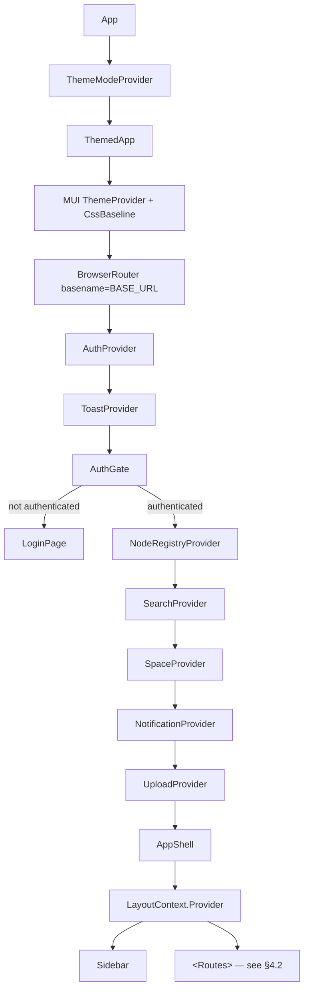

# MetaLoom // Loom UI Specification

> Navigable reference for the Loom UI (`loom-ui/` — React + TypeScript + Vite). It describes the
> **shell**: stack, layout, routing, providers, API client surface, cross-cutting components,
> configuration and test setup. Per-screen behaviour and per-endpoint gap analysis live in the
> sibling files listed in §1.2 — do not duplicate them here.

---

## 1. Scope

### 1.1 What this file covers

| In scope | Out of scope (see §1.2) |
|----------|-------------------------|
| Stack, `src/` layout, build & env config | Pipeline editor internals |
| Route table, provider tree, contexts | Chat / agent protocol, skills, memory |
| `src/api/*` client inventory | Per-endpoint REST↔UI coverage gaps |
| Shared components (`EmptyState`, `AssetThumbnail`, …) | Screen-by-screen feature prose |
| `/ui/` base path, auth handling, test setup | Backend endpoint semantics |

### 1.2 Cross-references

| Spec file | Coverage |
|-----------|----------|
| [PIPELINE_EDITOR.md](PIPELINE_EDITOR.md) | Pipeline editor: React Flow canvas, typed ports, node/edge rendering, validation, CRUD, versions, diff, run history, live events |
| [CHAT.md](CHAT.md) | Chat / Loom Agent: server-side agentic loop, SSE streaming, references, skills, sessions |
| [../../features/share/SHARE_SYSTEM.md](../../features/share/SHARE_SYSTEM.md) | The customer-facing share area (`/share/:slug`) - the only route outside `AppShell`, the only screen with no account behind it, and the home of the application's first real media player |
| [LOOM_UI_UPLOAD.md](LOOM_UI_UPLOAD.md) | Upload screen (`/uploads`): background upload queue, multi-file + drag-and-drop, progress/cancel/retry, library → pool targeting |
| [TASK_UI_AI_ML.md](TASK_UI_AI_ML.md) | Gap matrix — embeddings, clusters, detections, persons, chat |
| [TASK_UI_ASSETS_MEDIA.md](TASK_UI_ASSETS_MEDIA.md) | Gap matrix — assets, locations, pools, components, attachments, annotations |
| [TASK_UI_COLLABORATION.md](TASK_UI_COLLABORATION.md) | Gap matrix — tasks, comments, reactions |
| [TASK_UI_IDENTITY_ACCESS.md](TASK_UI_IDENTITY_ACCESS.md) | Gap matrix — users, groups, roles, permissions, tokens |
| [TASK_UI_ORGANIZATION.md](TASK_UI_ORGANIZATION.md) | Gap matrix — collections, libraries, spaces, tags |
| [TASK_UI_PIPELINE.md](TASK_UI_PIPELINE.md) | Gap matrix — pipelines, versions, runs, run items, cortex instances |
| [TASK_UI_SYSTEM.md](TASK_UI_SYSTEM.md) | Gap matrix — info, health, processors, node descriptors |
| [TASK_UI_CHAT.md](TASK_UI_CHAT.md) | Gap matrix — chat/skills UI tasks (all shipped) |
| [RESTAPI.md](../RESTAPI.md) | REST endpoints, auth, request/response models |
| [WEBSOCKET.md](../WEBSOCKET.md) | `/pipelines/events/ws`, `/processors/ws` frame protocol |
| [MCP.md](../MCP.md) | MCP server (separate port) |

> **Rule:** when a UI feature is missing or partial, record it in the matching `TASK_UI_*.md`,
> not in this file. §11 here only tracks *shell-level* progress.

---

## 2. Stack

Versions are the `package.json` ranges (`^`), so patch/minor drift is expected.

| Layer | Package | Version |
|-------|---------|---------|
| Framework | `react` / `react-dom` | ^18.3.1 |
| Language | `typescript` | ^5.5.0 |
| Build | `vite` + `@vitejs/plugin-react` + `vite-plugin-svgr` | ^6.4.2 |
| UI | `@mui/material` / `@mui/system` / `@mui/icons-material` | ^5.16.0 |
| UI (lab) | `@mui/lab` | ^5.0.0-alpha.170 |
| Styling engine | `@emotion/react` / `@emotion/styled` | ^11.13.0 |
| Routing | `react-router-dom` | ^6.26.0 |
| Graph canvas | `reactflow` | ^11.11.0 |
| Charts | `recharts` | ^2.12.0 |
| Markdown (chat) | `react-markdown` + `remark-gfm` | ^10.1.0 / ^4.0.1 |
| i18n | `i18next` + `react-i18next` | ^26.0.4 / ^17.0.2 |
| Unit tests | `vitest` | ^3.2.7 |
| E2E tests | `@playwright/test` | ^1.59.1 |

State is **React Context + hooks only** — no Redux/Zustand/React Query. Server data is fetched
with `fetch` in `useEffect` and held in feature-local `useState`.

Scripts: `dev`, `build` (`tsc && vite build`), `preview`, `test` / `test:watch` (vitest),
`test:e2e` / `test:e2e:ui` (Playwright).

---

## 3. Project structure

```
loom-ui/
├── src/
│   ├── api/          # 47 REST/WS client modules + co-located *.test.ts (§5)
│   ├── components/   # Shared: Title, EmptyState, ListPaging, MediaPlaceholder, AssetThumbnail, StatusChip, HelpHint
│   ├── context/      # Auth, Space, NodeRegistry, Search, Theme, Toast, Notification, Layout (§6)
│   ├── features/     # One directory per UI area (§4.2)
│   ├── help/         # topics.ts — documentation coachmark registry + helpUrl (§7.10)
│   ├── hooks/        # usePagedList + the pure pagedList helpers it is built from (§11.3)
│   ├── i18n/         # i18n.ts + locales/{en,de}.json
│   ├── layout/       # AppShell.tsx (routes + shell), Sidebar.tsx (nav)
│   ├── mock/         # data.ts / services.ts — only two live consumers left (§7.5)
│   ├── theme/        # index.ts — dark+light token sets, `tokens`, `buildTheme`
│   ├── types/        # index.ts (domain), nodeDescriptors.ts (pipeline ports)
│   ├── img/
│   └── main.tsx      # Entry: provider tree + AuthGate
├── e2e/              # 100 Playwright specs (§8.2)
├── public/ · index.html
├── vite.config.ts · vitest.config.ts · playwright.config.ts · tsconfig.json
└── package.json
```

> **Dead code:** `src/Admin/`, `src/Asset/`, `src/Content/`, `src/Dashboard/`, `src/Pipeline/`,
> `src/User/`, `src/Welcome/` and `src/Theme.tsx` are the pre-`features/` generation and are
> **not reachable from `main.tsx`**. Nothing imports them. Do not extend them; when touching
> a screen, work under `src/features/`. `src/Login/` and the legacy entry point `src/index.js`
> were part of this set and have been **deleted** — `Login.tsx` logged the submitted password to
> the console. The rest goes with [TASK_UI_PIPELINE.md](TASK_UI_PIPELINE.md) Task 5.

> **There is no `src/theme/tokens.ts`.** Both token sets and `buildTheme`/`setActiveTokens`
> live in `src/theme/index.ts`; consumers do `import { tokens } from "../../theme"`.

---

## 4. Shell, routing and navigation

### 4.1 Provider tree and routing



`main.tsx` holds the provider tree and `AuthGate`; **all `<Route>` declarations live in
`src/layout/AppShell.tsx`** (admin sub-routes in `src/features/admin/AdminArea.tsx`) — with exactly
one exception.

> **`/share/:slug` is declared in `main.tsx`, above `AuthGate`.** It has to be: authentication here
> is a conditional render rather than a route guard, so `AuthGate` answers every URL with
> `LoginPage` when there is no token and `AppShell` is only mounted once there is one. A share route
> inside `AppShell` would be unreachable by the customers it exists for, and `AppShell`'s catch-all
> redirect would swallow it besides. It stays inside `ThemedApp`, because `tokens` is read at render
> time. See [../../features/share/SHARE_SYSTEM.md](../../features/share/SHARE_SYSTEM.md) §6.1.

### 4.2 Registered routes

| Route | Element | File |
|-------|---------|------|
| `/` | `ChatWorkspace` | `features/chat/ChatWorkspace.tsx` |
| `/chat/sessions` | `ChatSessionsView` | `features/chatSessions/ChatSessionsView.tsx` |
| `/chat/sessions/:id` | `ChatSessionDetail` | `features/chatSessions/ChatSessionDetail.tsx` |
| `/skills` | `SkillManagementView` | `features/skills/SkillManagementView.tsx` |
| `/memory` | `MemoryView` | `features/memory/MemoryView.tsx` |
| `/search` | `SearchView` | `features/search/SearchView.tsx` |
| `/library` | `LibraryView` | `features/library/LibraryView.tsx` |
| `/assets` | `AssetBrowser` | `features/assets/AssetBrowser.tsx` |
| `/assets/:id` | `AssetDetail` | `features/assetDetail/AssetDetail.tsx` |
| `/uploads` | `UploadView` | `features/uploads/UploadView.tsx` |
| `/collections` | `CollectionsView` | `features/collections/CollectionsView.tsx` |
| `/tasks` | `TasksView` | `features/tasks/TasksView.tsx` |
| `/detection` | `DetectionManagement` | `features/detection/DetectionManagement.tsx` |
| `/faces` | `<Navigate to="/detection" replace />` | `layout/AppShell.tsx` |
| `/persons/:id` | `PersonDetail` | `features/persons/PersonDetail.tsx` — a person's own pictures, upload and avatar |
| `/tags` | `TagsView` | `features/tags/TagsView.tsx` |
| `/workflow` | `WorkflowView` | `features/workflow/WorkflowView.tsx` — six review modes; specs in [../../workflows/WORKFLOWS.md](../../workflows/WORKFLOWS.md) |
| `/asset-pools` | `AssetPoolsView` | `features/assetPools/AssetPoolsView.tsx` |
| `/pipelines` | `PipelineEditor` | `features/pipeline/PipelineEditor.tsx` |
| `/cortex` | `CortexView` | `features/cortex/CortexView.tsx` |
| `/monitoring` | `MonitoringArea` | `features/monitoring/MonitoringArea.tsx` |
| `/admin/*` | `AdminArea` | `features/admin/AdminArea.tsx` |
| `/profile` | `ProfileView` | `features/profile/ProfileView.tsx` |
| `/maintenance` | `MaintenanceView` | `features/maintenance/MaintenanceView.tsx` |
| `*` | `<Navigate to="/" replace />` | `layout/AppShell.tsx` |
| `/share/:slug` | `SharePage` | `features/share/SharePage.tsx` — **declared in `main.tsx`, not here**. Unauthenticated: no sidebar, no shell, no account |

`AdminArea` nests: `spaces`, `users`, `groups`, `permissions`, `api-keys`, `blacklist`,
`memory-denylist`, `indices`. The first seven are defined **inside the single
`AdminArea.tsx` file** (~1.6k lines); `indices` is **not** — it is
`features/admin/SearchIndicesAdmin.tsx`, and `AdminArea` carries only its `ADMIN_TABS` entry and
its `<Route>`. New admin screens should follow that shape rather than growing the shared file.

`FaceDetectionManagement`, `ClustersPanel`, `PersonsPanel` and `ReactionsPanel` have **no
route of their own** — they are mounted as panels from `DetectionManagement` / asset detail. The one
exception is `PersonDetail` at `/persons/:id`, reached from the name on a person card: a person's
pictures belong to the person rather than being a view onto the material they were found in, so they
need an address that outlives a panel, and one that can be linked to.
`DetectionManagement` is a three-tab shell (Faces / Objects / LLM, `role="tab"`); the Faces tab is
`FaceDetectionManagement`, which switches between `ClustersPanel` and `PersonsPanel` with the two
chips in `facedetection-switcher`. An E2E spec therefore reaches either panel via `/detection` plus
that switcher, never via a URL — see `e2e/face-panels-mocked.spec.ts`.

### 4.3 Sidebar

`src/layout/Sidebar.tsx` — three labelled sections grouped by *what you steer* (the agent,
the media, the installation), with one nested collapsible sub-group:

```
AI          Chat (/) · Chat Sessions (/chat/sessions) · Skills (/skills) · Memory (/memory)
CONTENT     Library · Assets · Collections · Tasks · Detection · Tags · Workflow
MANAGEMENT  Asset Pools · Pipelines · Cortex · Monitoring · Spaces (/admin/spaces) ·
            Memory Denylist (/admin/memory-denylist)
            └── ACL ▾   Users · Groups · Permissions · API Keys · Blacklist
```

`/admin/indices` (search index operation), `/admin/db-integrity` (the database integrity report)
and `/admin/storage` (storage usage and free space)
have **no sidebar entry of their own** — like `permissions`, `api-keys` and the rest, they are
reached through the `AdminArea` tab bar after entering via Spaces. An E2E spec deep-links instead of
clicking, which is why `search-indices-mocked.spec.ts` and `db-integrity-mocked.spec.ts` call
`page.goto("/ui/admin/…")` and then sign in.

`/profile` is reached from the avatar menu in the sidebar header (which also holds Logout);
`/maintenance` has **no nav entry at all** and is URL-only.

Because that menu is the *only* way into `/profile`, it carries testids of its own —
`sidebar-avatar-button` (the trigger), `sidebar-avatar-menu`, `sidebar-avatar-profile` and
`sidebar-avatar-logout` — and `e2e/profile-mocked.spec.ts` enters through it in every case,
so a regression that orphans the screen fails the profile suite rather than passing silently.

| Aspect | Rule |
|--------|------|
| Sub-group initial state | Closed, unless one of its routes is active — a deep link never lands on a page whose entry is hidden |
| Toggling | Local `openGroups` record keyed by group id; an explicit toggle wins over the auto-open |
| Collapsed rail (56px) | Sub-group header is dropped; its items render flat — an icon rail has no second level |
| Test ids | `sidebar-group-<key>` (e.g. `sidebar-group-acl`), `sidebar-item-<path>` |
| i18n | `sidebar.divider.{ai,content,management}`, `sidebar.group.acl`, `sidebar.nav.*`, `sidebar.admin.*` |
| Navigating | Through `useLayout().requestNavigation`, never `navigate` directly — the sidebar is the main way out of every screen, so it is where unsaved work is defended (§7.9) |

> **Gotcha:** E2E specs targeting an ACL screen must click `getByTestId("sidebar-group-acl")`
> first — `getByRole("button", { name: "Users" })` alone does not resolve. `users-backend`,
> `groups-backend`, `roles-backend`, `tokens-backend` and `scripts/capture-ui-screenshots.mjs`
> all do this.

#### Global search field

`src/layout/GlobalSearchField.tsx`, mounted between the header `<Divider/>` and the navigation
box — its **own row**, not part of the header strip. The header is a 220px flex row already
carrying brand, notifications and the avatar, and the nav box below it scrolls, which would
carry the field out of view.

| Aspect | Rule |
|--------|------|
| Availability | Renders `null` when `SearchContext.available` is false. The sidebar itself has no gate |
| Collapsed rail (56px) | No input — a `SearchOutlined` icon button that navigates to `/search` |
| Debounce | 250 ms, inline `useRef` timer (there is still no debounce hook in the codebase); minimum 2 characters, since a 1-char trigram prefix matches the whole index |
| Out-of-order responses | A `requestSeq` ref discards a reply superseded by a newer prefix |
| Dropdown | MUI `Popper` + `ClickAwayListener` — the sidebar root is `overflow: hidden`, so an inline dropdown is clipped at 220px |
| Selecting a suggestion | Searches for its `text`, not its entity, so Enter and click mean the same thing |
| Test ids | `global-search-input` (on the `<input>` via `inputProps`, not the `TextField` root), `global-search-suggestions`, `global-search-suggestion-<i>`, `global-search-button` |

> **Gotcha:** this field is mounted on **every** route, so its placeholder must stay distinct from
> the in-page filter boxes. Several specs locate those with `getByPlaceholder(/search/i)`, which
> would otherwise become strict-mode ambiguous. Prefer `getByTestId` in new specs.

---

## 5. API client layer (`src/api/`)

Every module is plain `fetch` + `authHeaders(token)`, exporting typed functions and the
response interfaces. The **one exception** is `uploadAssetWithProgress` in `assets.ts`, which uses
`XMLHttpRequest` because `fetch` reports no upload progress — see
[LOOM_UI_UPLOAD.md](LOOM_UI_UPLOAD.md) §2.1. `API_BASE_URL` comes from `src/api/config.ts`:

```ts
export const API_BASE_URL =
  import.meta.env.VITE_API_BASE_URL?.replace(/\/+$/, "") ?? "http://localhost:8092/api/v1";
```

> **Gotcha:** the fallback is an **absolute** `http://localhost:8092/api/v1`, *not* `/api/v1`.
> Same-origin behaviour (which cookie-authenticated `` previews depend on — §7.2)
> only happens when `VITE_API_BASE_URL=/api/v1` is set at build time. The container build
> sets it; a bare `npm run build` does not.

| Module | Base paths |
|--------|-----------|
| `auth.ts` | `/login`, `/me` (+ `decodeJwt`) |
| `paging.ts` | No route of its own — `PagingParams`/`PagingInfo` and the `?limit=&from=` serializer every collection client uses (§11.3) |
| `info.ts` · `health.ts` | `/` (version, dbRevision) · `/health` |
| `assets.ts` | `/assets`, `/assets/:uuid`, `/assets/upload`, `/assets/bulk/{create,update}`, `/assets/:uuid/binary/data` (`assetBinaryUrl`) |
| `binaries.ts` | `/assets/:uuid/binary`, `/assets/:uuid/binary/data` |
| `libraries.ts` · `collections.ts` · `spaces.ts` | `/libraries` · `/collections` · `/spaces` |
| `shareLinks.ts` | `/share-links`, `/:uuid/feedback`, `/assets/:uuid/share-links`, `/collections/:uuid/share-links` — the owner side, ordinary bearer auth |
| `shares.ts` | `/shares/:slug[/sessions\|/assets\|/comments\|/annotations\|/reactions]` — **the one client that never sends a bearer token.** Carries the share session in `X-Loom-Share-Session` plus `credentials: "include"` so the `loom_share_session` cookie reaches `<video src>`, which cannot set a header. Typed error `ShareApiError` (`status`), because 401/403/404 mean three different things to the viewer |
| `search.ts` | `/search/{results,assets,suggestions,status}` — one of two clients with a typed error (`SearchApiError`, carries `status`) |
| `dbIntegrity.ts` | `/db-integrity[/checks]` — the database integrity report and its catalogue. Pure helpers `failuresAtLeast`, `severityCounts`, `checkStatus`, `passedCount`, `notRunCount`, `groupByCategory` and `integrityQuery` are unit-tested in `dbIntegrity.test.ts`. `checkStatus` is the one to reach for: a check that *could not run* returns `NOT_RUN`, never `PASSED`, which is the distinction this screen must not lose |
| `storage.ts` | `/storage[/backends]` — the storage report. Carries `StorageApiError` (`status`) so a 403 is distinguishable from a failed refresh, plus the pure helpers `dedupeSavings`, `savingsPercent`, `usedFraction`, `watermarkTone`, `sortBackends`, `sortCategories` (unit-tested in `storage.test.ts`). `usedFraction` returns **null**, not 0, for a backend that reports no capacity — 0 renders as an empty bar, which reads as "plenty of room" for a bucket whose capacity is not a thing that exists |
| `format.ts` | `formatBytes` (binary units) and `formatBytesOrUnknown`, shared by the search-index and storage screens so the same volume does not read differently depending on which tab you opened. Deliberately **not** the only `formatBytes` in the tree: the upload and asset screens use decimal units because that is what a file manager shows a user about their own file |
| `searchIndices.ts` | `/search-indices[/:id[/jobs[/:jobUuid]]]` — the admin surface over the lexical, vector and fingerprint indices. Carries `SearchIndexApiError` (`status`) so a 403 is distinguishable from a failed poll, plus the pure helpers `formatBytes`, `jobProgress`, `indexTone`, `indexStateLabel` (unit-tested in `searchIndices.test.ts`) |
| `tags.ts` | `/tags`, `/tags/:uuid/rating`, `/assets/:uuid/tags[/:tagUuid]` |
| `tasks.ts` | `/tasks`, `/assets/:uuid/tasks[/:taskUuid]`, `/tasks/:uuid/assignees[/users/:uuid\|/groups/:uuid]` |
| `notifications.ts` | `/notifications[?unread=true]`, `/notifications/:uuid`, `/notifications/read-all` |
| `comments.ts` | `/comments`, `/assets/:uuid/comments`, `/tasks/:uuid/comments` |
| `reactions.ts` | `/{assets,comments,annotations,tasks}/:uuid/reactions[/:reactionUuid]` |
| `annotations.ts` | `/annotations[/:uuid]` |
| `transcripts.ts` | `/assets/:uuid/transcripts[/:transcriptUuid]` |
| `detections.ts` | `/assets/:uuid/detections[/:uuid|/bulk]` |
| `dedup.ts` | `/dedup-groups[/:uuid]`, `/assets/:uuid/dedup-groups` — ⚠️ the **only** module using `method: "PATCH"`; the backend route genuinely is PATCH |
| `clusters.ts` · `persons.ts` | `/clusters` · `/persons` |
| `pools.ts` | `/pools` |
| `pipelines.ts` | `/pipelines`, `/:uuid/run`, `/:uuid/runs[/:runUuid[/items|/cancel]]`, `/:uuid/versions[/:n[/restore]]`, `/pipelines/runs/stats` |
| `nodeDescriptors.ts` | `/pipeline/node-descriptors[/:kind]`, `/pipeline/content-types` |
| `pipelineEvents.ts` | **WebSocket** `…/pipelines/events/ws?token=` (§7.4) |
| `processors.ts` | `/processors[/:nodeId[/restrictions]]` |
| `chat.ts` · `agent.ts` | `/chats[/:uuid]` · `/chats/:uuid/stream` (SSE) |
| `chatSessions.ts` | `/chat-sessions[/:uuid[/context|/<action>]]`, `/sessions/:uuid/{files,download}` |
| `skills.ts` | `/skills`, `/skills/library`, `/:uuid/{install,versions[/:n[/restore]]}` |
| `memory.ts` · `memoryDenylist.ts` | `/memory`, `/memory/entry`, `/memory/scopes` · `/memory-deny-rules` |
| `users.ts` · `groups.ts` · `roles.ts` · `tokens.ts` · `blacklist.ts` | `/users` · `/groups` · `/roles` · `/tokens` · `/blacklists` |

> **`/memory/entry` — POST and PUT are not interchangeable.** The note id is a nested path and
> travels as the `id` **query parameter** (`entryQuery`), so both verbs hit the same route. POST
> *creates* and answers **409** on a taken id; PUT upserts. `MemoryView` picks by whether the id
> being written is the one the editor was opened on: a new note and a **rename** both claim an id
> the user was never shown, so both go over POST and surface the 409 inline
> (`memory-editor-error`) with the draft intact. Using PUT there overwrites a stranger's note
> silently — it did, until `memory-mocked.spec.ts` pinned the verbs.

---

## 6. State and contexts

| Context | File | Value | Persisted |
|---------|------|-------|-----------|
| `AuthContext` | `context/AuthContext.tsx` | `isAuthenticated`, `username`, `userUuid`, `token`, `login`, `logout` | **No** — in-memory only |
| `SpaceContext` | `context/SpaceContext.tsx` | `spaces[]`, `activeSpace`, `setActiveSpace` | No |
| `NodeRegistryContext` | `context/NodeRegistryContext.tsx` | `descriptors[]`, `contentTypes[]`, `loading`, `error`, lookup helpers | No |
| `SearchContext` | `context/SearchContext.tsx` | `available`, `provider`, `capabilities`, `reason`, `loading`, `has(cap)`, `markUnavailable`, `refresh` — one `/search/status` call per login. **Fails closed**: any failure (403, network) means `available:false` | No |
| `ThemeContext` | `context/ThemeContext.tsx` | `mode` (`dark`\|`light`), `toggleMode`, `setMode` | `localStorage` key `loom-ui-theme` |
| `ToastContext` | `context/ToastContext.tsx` | transient toasts (in-memory, no history) | No |
| `NotificationContext` | `context/NotificationContext.tsx` | `items`, `unreadCount`, `loading`, `refresh`, `markRead`, `markAllRead`, `dismiss`, `clear` — the durable inbox, seeded from `/notifications` and appended from the `NOTIFICATION` socket channel | **No** — server-backed |
| `LayoutContext` | `context/LayoutContext.tsx` | `sidebarCollapsed`, `setSidebarCollapsed`, `setNavGuard`, `requestNavigation` — the last two are the unsaved-work route guard (§7.9) | **No** — plain `useState` in `AppShell` |
| `UploadContext` | `features/uploads/UploadContext.tsx` | `UploadSummary` — items, counts, weighted `percent`, `isActive` | **No** — mirrors the module-level queue; see [LOOM_UI_UPLOAD.md](LOOM_UI_UPLOAD.md) |

Other persisted state: `loom-ui-language` (`i18n/i18n.ts`), `loom.chat.splitPct` /
`loom.chat.panelOpen` (§7.3), workflow ratings (`features/workflow/ratingPersistence.ts`).

Everything else is feature-local `useState`, loaded by `useEffect([token, …]) → fetch → setState`.

---

## 7. Cross-cutting behaviour

### 7.1 Authentication

```
LoginPage → AuthProvider.login() → POST /login
  → setToken(jwt); setUserUuid(decodeJwt(jwt).uuid)   ← immediate, no round-trip
  → GET /me → setUserUuid(me.uuid)                    ← authoritative; failure is non-fatal
  → AuthGate swaps LoginPage for the provider stack + AppShell
```

| Aspect | Implementation |
|--------|----------------|
| Storage | In-memory React state — a reload always returns to the login form |
| Header | `Authorization: Bearer <token>` on every REST call |
| Cookie | The backend *also* sets an HttpOnly `__Host-loom_token` cookie; this is what authenticates `` binary requests (§7.2) |
| `userUuid` | Used to gate authored-content actions (edit/delete own comment, reaction) |
| WebSocket | `?token=` query parameter (headers are not settable on `WebSocket`) |
| 401 handling | Per-call only; there is no global interceptor |
| Refresh | Not implemented |
| OAuth2 / SSO | Backend has a BFF flow ([RESTAPI.md](../RESTAPI.md)); **UI has none** |

### 7.2 Asset previews

`components/AssetThumbnail.tsx` + `components/MediaPlaceholder.tsx`, URL from
`api/assets.ts → assetBinaryUrl(uuid)`.

There is still no thumbnail service and no derived-image endpoint. A preview *is* the stored binary
(`GET /assets/:uuid/binary/data`), which only resolves for assets with an `asset_location` row.

| Concern | Rule |
|---------|------|
| Images | An `` at the binary URL. |
| Video | A **muted `<video preload="metadata" src="…#t=1">`** at the same URL, non-interactive and `pointerEvents: none` — it is a tile, not a player. The browser decodes one frame a second in; the range support on the binary route serves it without shipping the file, and the `#t=` offset avoids the black leader frame that is often frame 0. This is the poster mechanism, and it is entirely client-side: the server still generates nothing. |
| Audio, PDF, unknown | `MediaPlaceholder`. Nothing in a browser renders them. |
| Auth | ``/`<video>` cannot carry `Authorization`, so both rely on the HttpOnly cookie. This requires same-origin — a cross-origin `VITE_API_BASE_URL` silently yields 401s and placeholder icons everywhere. |
| Failure | `onError` swaps in `MediaPlaceholder`. A missing preview is the normal case, not an error to surface. |

The share viewer's grid follows the same rule against `sharedBinaryUrl` (`ShareTile`), so the
customer-facing tiles and the internal ones agree.

### 7.2.1 The asset detail player

`features/assetDetail/AssetDetail.tsx` renders a real `<video controls preload="metadata">` at
`assetBinaryUrl(asset.id)` for a video asset, and `VideoTimeline` is driven off it: `onTimeUpdate`
feeds `currentTime`, `onLoadedMetadata` supplies the duration, and every seek in the screen — the
timeline bar, a marker, a transcript line, a detection — goes through one `seekTo` that sets
`video.currentTime`. The element's own duration wins over the component's, so the bar cannot end
before the last frame.

It replaced a `MediaPlaceholder` with a fake play button over a `setInterval` that advanced a
counter by 0.25 s. That is worth recording because it looked like a player in every screenshot: the
timeline moved, the timecode counted up, and nothing was ever decoded.

**Durations are milliseconds on the wire.** `asset_video_comp.media_duration` is a millisecond
column and the REST layer passes it through unchanged, while `formatDuration`, `VideoTimeline` and
`HTMLMediaElement.currentTime` all count in seconds. `assetMapping.durationSeconds` converts at the
boundary, in `toAsset`, `hitToCard` and `apiToAsset`; `api/shares.ts` does the same for the customer
projection. Read raw, a 28 second clip renders as "7:51:07".

### 7.3 Serving under `/ui/` (base path)

Three pieces must agree on the prefix; when they drift, deep links and reloads break in ways
that look like unrelated bugs.

| Piece | File | Setting |
|-------|------|---------|
| Bundle URLs | `loom-ui/vite.config.ts` | `base: "/ui/"` |
| Router matching | `loom-ui/src/main.tsx` | `basename={import.meta.env.BASE_URL.replace(/\/+$/, "")}` |
| Server routes | `loom/services/rest/.../UIService.java` | `registerUiRoutes(router, "/loom/ui")` |

Server routes, in registration order: `/` → 302 `/ui/`; `/ui` (**regex**) → 302 `/ui/`;
`/ui/*` fallback — a last segment with no extension is a client route → `index.html` with
`Cache-Control: no-cache`, otherwise `next()`; `/ui/*` static handler over `/loom/ui`.

> **Gotcha:** the `/ui` redirect uses `routeWithRegex`, not `route`. A plain Vert.x path route
> also matches the trailing-slash form, so `route("/ui")` makes `/ui/` redirect to itself
> forever. `UIServiceRoutingTest` pins this.

> **Gotcha:** the extension test keeps the fallback honest. A missing hashed bundle must still
> 404 — returning `index.html` for `/ui/assets/index-gone.js` hands the browser HTML to parse
> as JavaScript, failing far from the cause.

The Vite dev server reproduces all of it, so `npm run dev` and the packaged build behave the
same. E2E specs may keep `page.goto("/")`; a deep-linking spec must spell out the prefix
(`page.goto("/ui/maintenance")`).

### 7.4 Live events (single shared WebSocket)

`src/api/pipelineEvents.ts` owns **one module-level socket** for the whole app, derived from
`API_BASE_URL` (`http`→`ws`) as `…/pipelines/events/ws?token=`. Frames are routed by their
`channel` field: `PROCESSOR` → `subscribeProcessorEvents` (CortexView), `NODE_REGISTRY` →
`subscribeNodeRegistryEvents`, `NOTIFICATION` → `subscribeNotificationEvents`
(`NotificationContext`), everything else → `subscribePipelineEvents` (PipelineEditor,
MonitoringArea).

> **Gotcha:** `NOTIFICATION` is the only *addressed* channel — the server sends a frame
> only to the recipient's sockets, and a socket that authenticated **without a token gets
> nothing at all**, silently. Lenient auth is the server default, so always pass the same
> `useAuth().token` the other subscribers pass (a different token also churns the shared
> socket). `NotificationPopover` refetches `GET /notifications` on open for exactly this
> reason: the stream is an optimisation, never the only path.

Reconnect is exponential backoff (1s → 30s cap, reset on open, capped attempt count) and is
**suppressed on close code `4401`** (server-side unauthorized). Connection state is broadcast
to listeners (`connecting`/`connected`/`disconnected`/`failed`).

> **Gotcha:** because the socket is shared, there is no `?pipeline=` server-side filter —
> the pipeline editor filters incoming events **client-side by `pipelineName`**.

Protocol details: [WEBSOCKET.md](../WEBSOCKET.md).

### 7.5 Shared `EmptyState`

`src/components/EmptyState.tsx` — large haloed icon (54px, 34px `compact`) + headline +
description + optional CTA. Props: `icon`, `title`, `description`, `actionLabel`, `actionIcon`,
`onAction`, `testId` (CTA gets `<testId>-action`), `compact`.

Live in: `AssetBrowser`, `LibraryView` (two states), `CollectionsView`, `TagsView`, `TasksView`,
`SkillManagementView` (two tabs), `AssetPoolsView`.

**Rule:** the empty state is bound to *the collection being empty*, never to a filtered or
searched result — otherwise a page that already has data would offer "create the first X".
Filtered-to-nothing keeps the small inline hint (`assets.empty.noMatch`,
`collections.empty.noSearch`, …).

> **Gotcha:** `SkillManagementView` and `TasksView` do **not** render their `<Table>` when the
> collection is empty. E2E specs must wait on `skills-view` / `tasks-empty-state`, not on
> table headers.

i18n keys: `<feature>.empty.*` (assets, collections) or `<feature>.emptyState.*` (library, tags,
tasks, skills, assetPools, memory, chatSessions) — the second form where an `empty` key already
meant something else. In `tasks`, `skills` and `memory` the `empty` key is a **string**, so a
nested `empty.noSearch` would collide with it in i18next; those use `emptyState.noSearch`.

### 7.5.1 Search field

**Every list view carries one, and it must have a testid.** `TextField size="small"` with a
`SearchOutlined` `startAdornment`, a `useState` term and the testid `<feature>-search` —
[CollectionsView.tsx](../../../loom-ui/src/features/collections/CollectionsView.tsx) is the
reference.

The testid is part of the rule, not decoration. `LLMDetectionManagement`, `ApiKeysAdmin` and
`MemoryDenylistAdmin` all shipped a working search box with no testid, which made them
unreachable from a spec — the field existed, and nothing could prove it filtered.

**29 search fields**, all of them exercised by a spec that types into them
(`search-coverage-mocked.spec.ts`):

| Kind | Where |
|------|-------|
| Server-backed | `AssetBrowser` (a term goes to `searchAssets()` debounced 250 ms; the type filter travels as `?mime=`) and the `/search` screen itself |
| Local over the loaded rows | `LibraryView`, `CollectionsView`, `TagsView`, `AssetPoolsView`, `TasksView`, `SkillManagementView` (one term per tab), `MemoryView`, `ChatSessionsView`, `CortexView`, all three detection screens, and every admin table — spaces, users, groups, roles, blacklist, API keys, memory denylist, **db integrity, search indices, storage** |
| Queue filter | `UploadView` — a folder drop queues hundreds of rows and the one you want is the one that failed |
| Rail filter | `ChatWorkspace` — the session rail on `/`, which grows without bound and was scroll-only |
| Node pickers | `PipelineEditor` — the add-node bar and the `N` command palette, both filtering the descriptor registry |
| Find-in-place | `TranscriptPanel` — see below |

A term that matches nothing shows the inline hint, never the `EmptyState` — see the rule above.
Where a view shows both, the testid distinguishes them (`memory-empty` vs `memory-no-match`).

**Find-in-transcript is the one search that is not a list filter.** It marks the matching words and
dims the sections that have none, rather than removing them: the timeline bar above the sections
has to stay proportional to the whole recording, and the boundary arrows on each block move a
section relative to the one beside it — with misses removed they would be adjusting a pair that is
no longer adjacent. `data-matched` on each section and `transcript-match` on each hit word are what
a spec asserts on.

**Views that deliberately have none.** `WorkflowView` is a stepper — you work through a review
queue one item at a time, so there is no list to narrow. `MonitoringArea` renders charts,
`MaintenanceView` a set of operator actions, and `ProfileView` a single form. `PersonDetail` and
`ChatSessionDetail` are detail screens for one entity. Adding a box to any of these would be
box-ticking.

### 7.5.2 Sorting and filtering a list

`ListSortControl` and `ListFilterSelect` in [ListControls.tsx](../../../loom-ui/src/components/ListControls.tsx)
are the shared controls. Both are **server-side**, and that is the whole point of them:

> A listing route serves a page at a time. A comparator or a predicate applied to `page.items`
> answers a question about the loaded page, not about the collection — the same defect `ListPaging`
> exists to keep out of the row counts.

So the state feeds `PagingParams` (`sort`, `dir`, `filters`), and the `useMemo` that builds the
loader **must list it in the dependency array**. That makes `usePagedList` drop its rows and its
cursor and start again, which is required rather than incidental: a keyset cursor points into one
particular ordering.

| | Control | Sends |
|---|---|---|
| Sort column | `<feature>-sort` (`name` / `created` / `edited`) | `?sort=` |
| Direction | `<feature>-sort-direction` | `?dir=` |
| Creator | `<feature>-filter-creator`, options from `useCreatorOptions` | `filter=creator[eq]=<uuid>` |
| Collection (assets) | `assets-filter-collection` | `filter=collection[eq]=<uuid>` |
| Status / priority (tasks) | `tasks-filter-status`, `tasks-filter-priority` | `filter=status[eq]=`, `priority[eq]=` |
| Enabled (users, skills) | `<feature>-filter-enabled` | `filter=enabled[eq]=true` |

The default is `created ASC` (`DEFAULT_SORT`) — under UUIDv7 that is also insertion order, so a new
element appears at the end of the list rather than somewhere in the middle.

Wired on: **assets, collections, tags, library, asset pools, tasks, skills, chat sessions**, and the
**spaces / users / groups / roles / blacklist** admin tables. `?sort=name` is mapped per type
server-side, so the control offers the same three options everywhere without knowing what it is
looking at — an asset's name is its `filename`, a task's its `title`, a user's their `username`.

Three deliberate asymmetries:

- `AssetBrowser`'s **type** filter stays local. `/assets` has no mime parameter to delegate it to,
  which is why it is the one control that goes wrong on a partly loaded catalog.
- Sort and the creator filter **hide** while an asset search term is active. `/search/assets` ranks
  by relevance and takes no creator, so leaving them on screen would show controls that quietly
  stop applying. The collection filter stays — that route does take `?collection=`.
- On `SkillManagementView` the creator filter belongs to the **library** tab alone; every skill on
  "mine" has the same creator.

Filter pickers render only when they have options (`creators.length > 0`), so a user without
`READ_USER` sees no creator control rather than an empty one.

#### The browser-sorted exception

`CortexView` and `MemoryView` are **not** Loom collections — the first is the live worker registry
pushed over the events socket, the second has its own scoped API — so there is no query parameter to
send and no page to be wrong about. They use `sortLocally()` from the same module, which is a pure
comparator covered by `listControls.test.ts`.

Do not reach for it anywhere a list route backs the screen. The whole point of the split is that
"sorted" means the collection on one side of it and the loaded page on the other.

The two detection screens got a second **filter** rather than a sort, because their rows carry no
timestamps: object detection filters by confidence band, face detection by whether a cluster has a
person attached. `LLMDetectionManagement` still renders `MOCK_RESULTS` and was left alone — wiring
controls to fixture data would be theatre.

### 7.6 Chat workspace split

`ChatWorkspace` is three columns: sessions rail (fixed 220px), chat column, workspace panel.
The last two share a flex container (`splitRef`) with a drag divider, so the split percentage
is measured against that container and the rail never skews it. Chat itself: [CHAT.md](CHAT.md).

| Aspect | Rule |
|--------|------|
| Unit | Percent — `chatPct`, `SPLIT_DEFAULT_PCT = 80`, range `SPLIT_MIN_PCT = 20` … `SPLIT_MAX_PCT = 95` |
| Drag | Tracks the pointer against `splitRef.getBoundingClientRect()` (not an accumulated delta), so the divider stays under the cursor once clamped |
| Reset / collapse | Double-click resets to 80%; `panelOpen=false` hides divider + panel, chat spans 100% |
| Persistence | `localStorage` — `loom.chat.splitPct`, `loom.chat.panelOpen` |
| Test ids | `chat-column`, `chat-split-divider`, `chat-workspace-panel`, `chat-panel-toggle`, `chat-panel-collapse` |
| Mobile | Below `md` the rail, divider and panel are `display: none`; chat is 100% |

> **Gotcha:** a fixed pixel `maxWidth` on the chat column silently overrides the percentage —
> that was the old "the divider barely moves on a wide screen" bug. Do not reintroduce one.

### 7.7 No mock data remains

`src/mock/` is gone. Every screen reads a real endpoint; there is no fixture module left to import,
and no sample-data badge left to render (`SampleDataBadge` and its i18n key went with it).

The two screens that used to carry one:

| Screen | Now reads |
|--------|-----------|
| `features/monitoring/MonitoringArea.tsx` | `/pipelines/runs/stats` + live `subscribePipelineEvents` **and** `GET /metrics`, polled every 5s ([../../features/ops/METRICS.md](../../features/ops/METRICS.md) §3.2) |
| `features/workflow/WorkflowView.tsx` | Assets, detections, dedup groups, `/assets/:uuid/clusters` + `/clusters/:uuid/members`, `/persons`, and the asset's `vlm` `json-comps` |

**The monitoring panels changed shape, not just their source.** Meters carry no history — Loom has
no time-series store — so the six 14-day charts could not be pointed at `/metrics`: there is no
meter behind asset ingestion, storage growth, task backlog, chat usage or annotation counts, and
keeping the old shapes fed from the catalog would have been the same fiction with better provenance.
The screen now shows what the instance actually measures:

| Panel | Series |
|-------|--------|
| 7 KPI tiles | `loom_pipeline_runs_active`, `loom_node_tasks_inflight` (against `…_ceiling`), the `loom_node_task_latency_seconds` mean of completed tasks, `loom_processors_by_state{online}` against `loom_processors_connected`, `loom_node_tasks_dispatch_failed_total`, `loom_node_tasks_deadlettered_total`, `loom_node_circuit_breaker_state` — plus the unchanged 7-day run KPI |
| Pipeline runs (14d) | `/pipelines/runs/stats` — the one genuinely historical chart, because runs are rows with dates |
| Node results by kind · latency by kind · workers by state | Instantaneous, split by the series' own label |
| Live throughput · live in-flight vs ceiling | Counter deltas across polls, five-minute window |

Two rules the panels enforce, both in `metricsPanels.ts` and unit-tested there:

- **A rate needs two samples.** The live charts say "collecting" until the second poll rather than
  plotting a cumulative total as if it were a rate. A counter that went *down* is a restart, and
  reads 0 — not a negative spike.
- **Absent is not zero.** A gauge with no reading renders `—`; a chart with no series renders why
  ("No node results recorded yet"), because a blank plot and a plot of zeroes look identical.

> **Not built:** daily ingestion, storage growth, task backlog, chat usage and annotation counts are
> all derivable from the database the way `/pipelines/runs/stats` already is — day-bucketed queries
> over `asset`, `asset_location`, `task`, `chat_message`, `annotation`. That is a **roll-up**
> endpoint, not a metrics one, and it does not exist. Do not reintroduce those panels from
> `/metrics`: the meters they would need were never registered.

### 7.8 Demo data dependency

`DemoDatabaseInitializer` (`loom/core/.../boot/`) is the only reason a fresh demo container has
anything to show. Beyond assets/tags/collections/pipelines/users it must seed: image binaries
(synthesised at runtime with `java.awt`, no text — the Alpine JRE has no fontconfig — plus a
matching `asset_location` row and real sha512/size, otherwise every card is a placeholder §7.2);
account pictures and person images (**not** synthesised — shipped as JPEG resources under
`loom/core/src/main/resources/demo/portraits/`, one face per person across their pictures, because a
painted gradient reads as an empty placeholder wherever a face belongs);
skills with **two** versions each (one version hides the whole version UI); chat sessions with
`chat_session_context_ref` / `chat_session_skill` rows and at least two published; agent memory
entries (and `LOOM_AGENT_MEMORY_ENABLED=true`, since the endpoints are not registered otherwise);
tasks attached to assets with priority/status/due dates.

> **Gotcha:** `detection` is unique on `(asset_uuid, node_kind, frame_number, detection_index)`.
> Two detections in one frame must be numbered or the insert aborts the seeding run — and
> because `BootstrapInitializer` swallows the failure, everything *after* the detections
> (transcripts, the VLM component) is silently missing from the demo.

### 7.9 Unsaved-work guards

Some screens hold work that exists only in the browser: an in-flight upload batch, an edited
pipeline canvas. Leaving costs the user that work, and the two ways of leaving need two different
mechanisms — both in `src/hooks/useUnsavedChanges.ts`, one implementation for the whole app.

| Exit | Mechanism | API |
|------|-----------|-----|
| The document unloads — reload, close, an external link | The browser's own confirm; nothing else can intercept it | `useUnsavedChanges(isDirty, message)` |
| The route changes — sidebar click, notification deep link | No browser event fires. `LayoutContext` carries a nav guard that `AppShell` holds in a ref; the guarding screen shows its own dialog and resumes the navigation | `useNavigationGuard(active, onBlocked)` |

`LayoutContext.requestNavigation(proceed)` is the route-change half's entry point, and the rule that
makes it work: **every navigation control outside a screen's own body goes through it instead of
calling `navigate` directly** — today `Sidebar` (nav items and the avatar menu's Profile) and
`NotificationPopover`. One screen guards at a time; `setNavGuard(null)` on unmount, since the screen
leaving *is* the exit. The guard owns the deferred navigation: it runs `proceed` once the user
agrees, and dropping it cancels.

`useBlocker` would be the router's answer to the same problem, but it needs a data router and the
app mounts `<BrowserRouter>` + `<Routes>` (§4.1). Intercepting at the navigation controls was
chosen over migrating to `createBrowserRouter`.

Who guards what today:

| Screen | Dirty when | Unload warning | Route guard |
|--------|-----------|----------------|-------------|
| `PipelineEditor` | `dirty` — any canvas/parameter/edge edit | Yes | Yes — reuses the discard-confirm dialog (`pipeline-switch-confirm`) that the in-editor pipeline switch already showed |
| `UploadProvider` | `summary.isActive` | Yes — reloading drops the `File` handles and the endpoint cannot resume | **No**, deliberately: the queue is module-level and survives every route change, so leaving the screen costs nothing |

### 7.10 Documentation coachmarks

`components/HelpHint.tsx` — the `?` beside a screen heading that opens the part of the customer
documentation the screen is about. It is the inert `HelpOutlineOutlined` tooltip these headers
already carried, made to lead somewhere; `description` is how the explanatory text the header had
survives the change.

**A shipped UI never holds a documentation URL.** A Loom installation outlives the site it links to,
so a hint wired to `/docs/ui/#pipeline-editing` breaks every already-deployed instance the day that
heading is reworded — silently, on the reader's machine, where nothing here would find out. The hint
carries a **stable topic id** and a natural-language fallback query instead, and the site resolves
it:

```
HelpHint topic="pipeline.editing"
  → https://metaloom.io/help/?t=pipeline.editing&q=build+a+pipeline+connect+nodes+typed+ports…
      → the site's curated map (website/data/en/help.json) — instant, exact, link-checked
      → its documentation search index, for an id that map has never heard of
```

| Aspect | Rule |
|--------|------|
| Registry | `src/help/topics.ts` — `HELP_TOPICS` (id → fallback query), `HelpTopic`, `helpUrl()` |
| Ownership split | This side owns id → label + query. **The website owns id → destination**, and neither repeats the other |
| Target | `target="_blank"` + `rel="noopener noreferrer"`. Reading documentation must never cost a canvas, an upload queue or an in-memory session |
| i18n | `help.open` and `help.topic.*`. A topic id is dotted and i18next's separator is `.`, so `detection.faces` needs a **nested** `help.topic.detection.faces` — a flat key of that name is unreachable and renders raw |
| Test ids | `help-hint-<topic>` (dots included) |
| Base URL | `VITE_HELP_BASE_URL`, default `https://metaloom.io/help` (§9.1) |

> **A hint follows what the reader is looking at, not which route they are on.** `WorkflowView`
> picks by review mode through `helpTopicForMode` (rating/tagging → `workflow.rating`,
> deduplication → `workflow.dedup`, the three model-output modes → `detection.results`) and
> `DetectionManagement` picks by tab. One fixed hint per screen would point at the wrong review mode
> five times out of six, which is the failure the feature exists to prevent.

Who carries one today: `ChatWorkspace`, `MemoryView`, `SearchView`, `UploadView`, `PipelineEditor`,
`DetectionManagement`, `WorkflowView`, `AccessControlAdmin`.

**Two gates, one from each end** — and between them a shortcut cannot break without something going
red:

| Gate | Catches |
|------|---------|
| `src/help/topics.test.ts` | a topic the UI sends that the website's map does not have (and the reverse orphan); a fallback query too short, or identifier-shaped, which changes how the site scores it; a missing `en`/`de` label |
| the website's `check-links.mjs` | a destination page or **anchor** that no longer exists — `layouts/help/list.html` renders every map entry as a real `<a href>`, so the site build walks them |

Feature detail, the `/help/` page and why its semantic pass ranks rather than redirects:
[../../website/WEBSITE_SEARCH.md](../../website/WEBSITE_SEARCH.md) § *The `/help/` redirector*.

---

## 8. Test setup

### 8.1 Unit tests — vitest, **node environment**

`vitest.config.ts`: `environment: "node"`, `include: ["src/**/*.{test,spec}.{ts,tsx}"]`,
`exclude: ["e2e/**", "node_modules/**"]`. Run with `npm test`.

> **Convention — there is no jsdom, no React Testing Library, no `@testing-library/*`
> dependency and no setup file.** vitest covers **pure logic only**: API client request
> shaping and response mapping, and extracted feature helpers. Anything that needs a rendered
> component is a *mocked* Playwright spec (§8.2). Do not add RTL/jsdom to test a component —
> extract the logic into a `.ts` module or write a mocked e2e.

52 test files today:

| Area | Files |
|------|-------|
| `src/api/` | `agent`, `annotations`, `binaries`, `chat`, `chatMessageMapper`, `comments`, `dedup`, `paging`, `listPaging`, `pipelineEvents`, `reactions`, `search`, `skills`, `tags`, `tasks`, `transcripts` |
| `src/hooks/` | `pagedList` — the pure half of `usePagedList`, since the hook itself needs a renderer this repo does not have; `useUnsavedChanges` — likewise the listener wiring and guard dispatch, not the hooks around them |
| `src/help/` | `topics` — the coachmark registry, checked against the website's map and both locale files (§7.10). The one test in this tree that reads a file **outside `loom-ui/`**, which it can because the website is the same repository |
| Feature helpers | `assets/assetMapping`, `chat/pipelineGraphLayout`, `library/libraryAssets`, `monitoring/runMetrics`, `pipeline/contentTypes`, `pipeline/portResolvers`, `search/highlight`, `search/searchHits`, `workflow/ratingPersistence`, `workflow/dedupGroups` |
| `src/` (root) | `sourceHygiene` — scans every non-test source through `import.meta.glob(…, { query: "?raw" })` and fails on a `console.*` call whose arguments mention a credential, or on the return of `src/Login/` / `src/index.js` |

> `listPaging.test.ts` is table-driven over all sixteen paged clients rather than sixteen
> near-identical files — the contract (`?limit=&from=` on the wire, `_metainfo` passed through) is
> the same for every one of them.

> `search/highlight.ts` and `search/searchHits.ts` exist as separate modules precisely because of
> the no-jsdom rule: the highlight parser is a security boundary (§5 of
> [../../features/search/SEARCH.md](../../features/search/SEARCH.md)) and had to be unit-testable
> without rendering `SearchHitRow`.

### 8.2 E2E tests — Playwright

`playwright.config.ts`: `testDir: "./e2e"`, 30s timeout, no retries, chromium only,
`baseURL: http://localhost:${VITE_PORT ?? 3000}`, `webServer` runs `npx vite --port …` and
reuses an existing server outside CI. `VITE_*` vars are inherited by the dev server from the
Playwright invocation, so no explicit env block is needed.

103 specs in two flavours, distinguished by filename suffix:

| Suffix | Backend | Nature |
|--------|---------|--------|
| `*-mocked.spec.ts` (68) | **No** | The component/integration test tier. Every `**/api/v1/**` call is intercepted with `page.route(...)` and fulfilled with fixture JSON — typically a broad catch-all plus specific overrides for `/login` and `/me`. |
| `*-backend.spec.ts` (32) | **Yes** | Real Loom server with demo data — the end-to-end tier, driven from `e2e-test/`; see [../../test/E2E_TESTS.md](../../test/E2E_TESTS.md) |
| `login.spec.ts`, `pipeline-loading.spec.ts`, `pipeline-versions.spec.ts` | mixed | Legacy names predating the suffix convention |

> **Gotcha:** `page.route` handlers are matched **most-recently-registered first**, which is why every
> mocked spec registers the catch-all first. It also means a broad pattern registered *later* wins:
> `…/detections/:uuid` would swallow `…/detections/bulk` unless the bulk route is registered after it.

> **Gotcha:** the list clients append `?limit=`, so a matcher anchored on the bare path — either
> `/\/api\/v1\/assets$/` or the glob `"**/api/v1/assets"` — no longer matches and the call falls
> through to the catch-all. Write collection matchers as `/\/api\/v1\/<name>(\?|$)/`.

Typical mocked-spec shape: `mock…(page)` route handlers → `login(page)` (fill
`Username`/`Password` placeholders, click *Sign in*, assert the username field is hidden) →
assertions on `data-testid` locators.

> A search field asserted with `toBeVisible` and never typed into is not covered. A field that
> renders, accepts input and narrows nothing looks identical to a working one in such a spec —
> which is how thirteen of them stayed unverified. `search-coverage-mocked.spec.ts` types a
> matching term, a non-matching one, and then clears, for every field in the product.

> A mock that returns a **fixed** payload cannot test a server-side control. `list-sort-filter-mocked.spec.ts`
> therefore implements `?sort=`/`?dir=`/`?filter=` in the route handler and asserts on the rendered
> order — a spec that only checked the query string would pass equally against a view that sent the
> right parameters and then re-sorted the response locally, which is the bug worth catching.

### 8.3 Running

```bash
npm test                       # vitest (node env, pure logic)
npx playwright test e2e/chat-mocked.spec.ts     # one mocked spec, no backend needed

# Backend specs need a running Loom server with demo data (admin / finger) and
# NodeDescriptorEndpoint active:
VITE_API_BASE_URL=/api/v1 VITE_PROXY_TARGET=http://localhost:8092 npm run test:e2e
```

---

## 9. Configuration

### 9.1 Environment variables

Only variables actually read by the code. `VITE_*` are **build-time** substitutions, not
runtime config.

| Variable | Read by | Default | Purpose |
|----------|---------|---------|---------|
| `VITE_API_BASE_URL` | `src/api/config.ts` | `http://localhost:8092/api/v1` | REST base; also the source of the WS URL (§7.4). Set to `/api/v1` for same-origin builds. |
| `VITE_PROXY_TARGET` | `vite.config.ts` (dev only) | unset → no proxy | Backend for the dev-server `/api` proxy; the path is **not** rewritten |
| `VITE_PORT` | `playwright.config.ts` | `3000` | Dev-server port used by the E2E webServer |
| `VITE_HELP_BASE_URL` | `src/help/topics.ts` | `https://metaloom.io/help` | Where the documentation coachmarks point (§7.10). For an installation with no route to the public internet, a mirror |

> `VITE_WS_URL` and `VITE_MCP_URL` are **not** read anywhere — earlier revisions of this spec
> listed them in error. The WS URL is derived from `VITE_API_BASE_URL`.

### 9.2 Build

`vite.config.ts` sets `base: "/ui/"` (§7.3) and `build.outDir: "build"`. `build/` is what
`loom/containers/*/Containerfile` copies to `/loom/ui` in the image, so `base` must match the
path `UIService` serves from. `npm run build` type-checks first (`tsc && vite build`).

---

## 10. Key components reference

Shell and cross-cutting only — pipeline internals are tabulated in
[PIPELINE_EDITOR.md](PIPELINE_EDITOR.md), chat internals in [CHAT.md](CHAT.md).

| Component / symbol | File | Purpose |
|--------------------|------|---------|
| `App` / `ThemedApp` / `AuthGate` | `src/main.tsx` | Provider tree, router basename, auth gate |
| `AppShell` | `src/layout/AppShell.tsx` | Flex shell + **all route declarations** + `LayoutContext` |
| `Sidebar` | `src/layout/Sidebar.tsx` | AI/Content/Management nav, ACL sub-group, avatar menu, collapse |
| `AuthProvider` / `useAuth` | `src/context/AuthContext.tsx` | JWT, username, `userUuid` |
| `SpaceProvider` / `useSpace` | `src/context/SpaceContext.tsx` | Active space |
| `NodeRegistryProvider` / `useNodeRegistry` | `src/context/NodeRegistryContext.tsx` | Node descriptors + content types |
| `ThemeModeProvider` / `useThemeMode` | `src/context/ThemeContext.tsx` | Dark/light mode |
| `ToastProvider` / `useToast` | `src/context/ToastContext.tsx` | Transient toasts |
| `NotificationProvider` / `useNotifications` | `src/context/NotificationContext.tsx` | Durable per-user inbox (§6) |
| `NotificationPopover` | `src/features/notifications/NotificationPopover.tsx` | Sidebar bell, unread badge, mark-read, dismiss, clear |
| `notificationLink` | `src/features/notifications/notificationLink.ts` | Deep link for a notification, or null when it has no subject |
| `LayoutContext` / `useLayout` | `src/context/LayoutContext.tsx` | Sidebar collapse (not persisted) + the nav guard for unsaved work (§7.9) |
| `useUnsavedChanges` / `useNavigationGuard` / `bindUnloadWarning` / `runGuarded` | `src/hooks/useUnsavedChanges.ts` | `beforeunload` warning and in-app route guard for a screen with unsaved work (§7.9) |
| `tokens` / `buildTheme` / `setActiveTokens` | `src/theme/index.ts` | Design tokens + MUI theme (no `tokens.ts`) |
| `EmptyState` | `src/components/EmptyState.tsx` | Shared feature-page empty state (§7.5) |
| `HelpHint` | `src/components/HelpHint.tsx` | The `?` beside a heading that opens the matching documentation (§7.10). Carries a topic id, never a URL |
| `HELP_TOPICS` / `HelpTopic` / `helpUrl` | `src/help/topics.ts` | The coachmark registry and the `/help/?t=&q=` builder (§7.10) |
| `StatusChip` / `Tone` / `toneStyles` | `src/components/StatusChip.tsx` | green/amber/red/neutral status pill. Extracted from `MaintenanceView` so the two operator screens paint the same states the same colour |
| `ListPaging` | `src/components/ListPaging.tsx` | "Showing X of Y" + load-more button for a paged list (§11.3) |
| `ListSortControl` / `ListFilterSelect` / `DEFAULT_SORT` / `sortLocally` | `src/components/ListControls.tsx` | Server-side sort column, direction and one-of-many filters for a listing view; `sortLocally` is the comparator for the two screens no list route backs (§7.5.2) |
| `useCreatorOptions` | `src/hooks/useCreatorOptions.ts` | The user list shaped for a "created by" filter; fails quietly to `[]` without `READ_USER` (§7.5.2) |
| `AssetThumbnail` / `MediaPlaceholder` | `src/components/` | Cookie-authenticated preview `` with fallback (§7.2) |
| `Title` | `src/components/Title.tsx` | Page heading |
| `usePagedList` / `pageFrom` | `src/hooks/usePagedList.ts` | Loads a collection page by page; `items`, `totalCount`, `hasMore`, `loadMore`, `setItems` (§11.3) |
| `pagingQuery` / `PagingParams` / `PagingInfo` | `src/api/paging.ts` | `?limit=&from=` serialization and the `_metainfo` wire shape |
| `toAsset` / `hitToCard` / `mimeFilterFor` | `src/features/assets/assetMapping.ts` | AssetResponse → card, search hit → card, type filter → `?mime=` |
| `assetBinaryUrl` | `src/api/assets.ts` | URL of an asset's stored bytes, usable as `` |
| `subscribePipelineEvents` / `subscribeProcessorEvents` | `src/api/pipelineEvents.ts` | Shared reconnecting WebSocket (§7.4) |
| `login` / `getMe` / `decodeJwt` | `src/api/auth.ts` | Auth calls + JWT claim decode |
| `API_BASE_URL` | `src/api/config.ts` | REST base (§5) |
| `ProfileView` | `src/features/profile/ProfileView.tsx` | Own user record (name, email), language and theme mode. The uuid comes from `useAuth().userUuid` — the view does not decode the JWT itself. Save `POST`s **only the fields that differ** from the loaded user, so it never clobbers fields the screen does not show; a rejected save keeps the edits, renders `profile-error` and leaves the form editable |
| `AdminArea` | `src/features/admin/AdminArea.tsx` | Seven admin screens in one file, plus the tab and route for the eighth |
| `DbIntegrityAdmin` | `src/features/admin/DbIntegrityAdmin.tsx` | `/admin/db-integrity`. Runs the integrity checks on demand — deliberately **not** polled, unlike the index screen next door: there is no background job to watch and a sweep is real database work. Lists the **whole catalogue** grouped by category — every check by name and code, with a status of Passed, its severity, or "Did not run" — because "what was looked at" is half the answer to "is anything broken". A *Findings only* toggle narrows to the failures; a check that threw is never rendered as a pass |
| `StorageAdmin` | `src/features/admin/StorageAdmin.tsx` | `/admin/storage`. What is stored and how much room is left. Two byte columns per kind of content, because neither alone is the truth — "claimed" overstates what deleting would free on a deduplicated install, "on disk" gives no sense of how much material there is. A backend that reports no capacity renders as *Not measurable* with **no bar at all**; an empty bar would read as plenty of room. Backends sort worst-first with unmeasurable last. Not polled, like the integrity screen next door |
| `SearchIndicesAdmin` | `src/features/admin/SearchIndicesAdmin.tsx` | `/admin/indices`. Groups indices under their storage backend (size is per backend — Lucene segments interleave the vector spaces, so there is no per-index byte figure). Action buttons are driven by each index's `supportedActions`, never hardcoded. Polls at 2 s while a job runs and 15 s otherwise, keeping the last good snapshot on a failed poll |
| `SharePage` / `ShareGate` / `ShareViewer` | `src/features/share/` | The customer-facing area. `ShareMedia.tsx` holds a plain `<video controls>` — **the first real player in this application**; `AssetDetail`'s `videoRef` is unattached and its playback is a `setInterval` simulation. Seeking works because the share binary route inherits `Range`/206 from `AssetBinaryEndpointService` |
| `ShareDialog` | `src/features/share/ShareDialog.tsx` | Creates the link when it **opens**, not on save — the point of the dialog is the URL. First `navigator.clipboard` use in the app; a Playwright spec asserting on it needs `permissions: ["clipboard-read","clipboard-write"]` |
| `AssetDetail` | `src/features/assetDetail/AssetDetail.tsx` | Media, timeline, annotations, comments, reactions, tasks, transcripts, faces, tags |
| `VideoTimeline` / `ZoomableImage` | `src/features/assetDetail/` | Marker timeline · pan/zoom viewer |
| `PipelineEditor` | `src/features/pipeline/PipelineEditor.tsx` | ~3.7k lines — see [PIPELINE_EDITOR.md](PIPELINE_EDITOR.md) |
| `ChatWorkspace` / `ChatGreeting` | `src/features/chat/` | Chat shell + split (§7.6) — see [CHAT.md](CHAT.md) |

---

## 11. Conventions and gotchas

### 11.1 Conventions

| Convention | Rule |
|------------|------|
| New screens | Always under `src/features/<area>/`. The capitalised top-level dirs are dead (§3). |
| Routes | Declared in `AppShell.tsx` (admin sub-routes in `AdminArea.tsx`) — never in `main.tsx` |
| API modules | One file per endpoint group in `src/api/`, exporting typed functions + response interfaces |
| Naming | Components PascalCase; hooks `useXxx`; contexts `XxxContext` + `XxxProvider` + `useXxx` |
| Types | Domain in `src/types/index.ts`, port/descriptor types in `src/types/nodeDescriptors.ts`, request/response types beside their API module |
| Styling | `tokens` from `src/theme` for all colours/spacing/radii; prefer `sx` over `styled()` |
| i18n | Namespaced `feature.section.key`; **every key must exist in both `en.json` and `de.json`** |
| Test ids | `data-testid` on anything an E2E spec touches; kebab-case, feature-prefixed |
| Tests | Pure logic → vitest; anything rendered → mocked Playwright spec (§8.1) |

### 11.2 Gotchas

| Pitfall | Detail / fix |
|---------|--------------|
| `API_BASE_URL` default is absolute | Falls back to `http://localhost:8092/api/v1`; cookie-authenticated previews and same-origin assumptions need `VITE_API_BASE_URL=/api/v1` (§5) |
| `VITE_WS_URL` / `VITE_MCP_URL` don't exist | Setting them has no effect; the WS URL derives from `VITE_API_BASE_URL` |
| No `src/theme/tokens.ts` | Import `tokens` from `src/theme` (`index.ts`) |
| Dead capitalised directories | `src/Admin`, `src/Asset`, … are unreferenced legacy; editing them changes nothing. `src/Login` and `src/index.js` are already gone; drop this row once the rest follows (TASK_UI_PIPELINE.md Task 5) |
| No `console.log` of credentials | `src/sourceHygiene.test.ts` scans every non-test source for a `console.*` call mentioning password/secret/credential/api-key and fails the vitest run. It exists because the deleted `Login.tsx` did exactly that |
| Auth is in-memory | Every reload lands on the login form — on the *same* URL, so signing in resolves to the requested route |
| No global 401 handling | Each call handles its own failure; there is no interceptor |
| Sidebar collapse is not persisted | Plain `useState` in `AppShell` despite `LayoutContext` looking like a store |
| ACL nav is nested | Open `sidebar-group-acl` before asserting on Users/Groups/Permissions/API-Keys/Blacklist |
| Deep-link 404 on reload | Keep `base`, `basename` and the `UIService` fallback in sync (§7.3) |
| Empty views drop their table | `TasksView` / `SkillManagementView` render no `<Table>` when empty (§7.5) |
| One shared WebSocket | Filter pipeline events client-side by `pipelineName`; close code `4401` disables reconnect (§7.4) |
| React Flow node identity | Use `useNodesState`/`useEdgesState`; reset only on `pipeline.id` **or** `reloadKey` change (see [PIPELINE_EDITOR.md](PIPELINE_EDITOR.md)) |
| Navigating away from unsaved work | A screen with work only the browser holds registers a guard via `useUnsavedChanges` / `useNavigationGuard` (§7.9). A *new* navigation control outside a screen body must call `requestNavigation`, not `navigate` — otherwise it discards the pipeline canvas silently, as every exit but the editor's own list once did |
| No error boundaries | A render throw blanks the app; there is no fallback UI |
| Missing i18n key | Renders the raw key — always add to both locale files |
| MUI `select` test ids | `inputProps` lands on the hidden native input, which is never clickable. Use `SelectProps.SelectDisplayProps` (`ShareDialog`'s expiry field) |
| Comment replies are **task-only** | `CommentItem` renders `comment-reply` only when its parent passes `onReply`. `TasksView` does — reply banner (`tasks-comment-reply-banner`), `parentUuid` on the create, one-level threading via `features/tasks/commentThread.ts`. `AssetDetail`'s comments tab does **not**, and its `handlePostComment` never sends a `parentUuid`, so an asset comment thread is flat |
| `*-cancel` is on the **edit** form | `comment-cancel` / `annotation-cancel` abandon an *edit*, not a compose. Neither composer has a cancel button — both are simply always open on their tab, and the drafts they discard live in `CommentItem` / `AnnotationItem` local state, re-seeded from the stored value on each `onStartEdit` |
| Deep-link **then** sign in | A mocked spec that logs in and *then* calls `page.goto` throws the in-memory token away and lands back on the login form |
| There is no `<video>` on asset detail | `AssetDetail` renders a `MediaPlaceholder` and advances `currentTime` on a `setInterval`; the `videoRef` it declares is never attached. A seek is observable through `video-timeline-playhead` and `video-timeline-current-time`, not through a media element. The only real `<video controls>` in the app is `features/share/ShareMedia.tsx` |
| Timeline markers come from **annotations and temporal tags** | Both ride along on `GET /assets/:uuid` and carry `area.from`/`area.to` in **milliseconds**; the timeline works in seconds. `VideoTimeline` declares a `comment` marker type, but `commentResponseToComment` drops the timestamps, so a REST comment can never place one — the gap is in the mapper, not the timeline. A tag with no `area` is not a marker |
| `duration` lives on `videoComponents[0]` | The mime type alone decides an asset *is* a video; a video response with no `videoComponents` gives `duration = 0`, and every marker position divides by it |

### 11.3 Performance

| Area | Concern | Current state |
|------|---------|---------------|
| React Flow | Graphs >100 nodes | No virtualization; auto-arrange only |
| Asset grid | Large libraries | Skeletons + lazy ``; keyset paged 100 at a time, no list virtualization |
| Timeline markers | Many annotations/comments | No viewport filtering |
| Context fan-out | Every consumer re-renders | Mitigated by splitting contexts per domain |

**Keyset paging.** Every collection route caps at 25 rows by default
(`QueryParameterKey.LIMIT`), so a bare `fetch` against one returns a page while looking like a
collection — that was a correctness bug, not a performance one. `src/api/paging.ts` serializes
`?limit=&from=`; `usePagedList` holds the rows, reports `_metainfo.totalCount` as the collection
size and seeks the next page from `_metainfo.lastUuid`; `ListPaging` renders "Showing X of Y" and
a **button** (never scroll-triggered — "there is more" must be stated, not discovered).

`PagingInfo` on the wire is exactly `{ lastUuid, perPage, totalCount }`. `from` is a **seek UUID,
not an offset**. Lists that are pickers rather than browsable screens simply pass
`{ limit: PAGE_SIZE }` and do not page.

---

## 12. Where do I find ...?

| Concept | Path |
|---------|------|
| App entry, provider tree, auth gate | `loom-ui/src/main.tsx` |
| **Route table** | `loom-ui/src/layout/AppShell.tsx` |
| Admin sub-routes (all 7 screens) | `loom-ui/src/features/admin/AdminArea.tsx` |
| Sidebar navigation / ACL sub-group | `loom-ui/src/layout/Sidebar.tsx` |
| `/ui` base path (server side) | `loom/services/rest/.../UIService.java` (`registerUiRoutes`) |
| REST base URL | `loom-ui/src/api/config.ts` |
| Shared WebSocket + reconnect | `loom-ui/src/api/pipelineEvents.ts` |
| Auth calls / JWT decode | `loom-ui/src/api/auth.ts` |
| Design tokens + MUI theme | `loom-ui/src/theme/index.ts` |
| Domain types · port types | `loom-ui/src/types/index.ts` · `types/nodeDescriptors.ts` |
| i18n setup · locales | `loom-ui/src/i18n/i18n.ts` · `i18n/locales/{en,de}.json` |
| Shared empty state | `loom-ui/src/components/EmptyState.tsx` |
| Documentation coachmarks | `loom-ui/src/help/topics.ts` (registry) · `loom-ui/src/components/HelpHint.tsx` (the icon) · `website/data/en/help.json` (destinations) |
| Asset preview `` | `loom-ui/src/components/AssetThumbnail.tsx` |
| Chat split constants | `loom-ui/src/features/chat/ChatWorkspace.tsx` (`SPLIT_DEFAULT_PCT`) |
| New-chat greeting | `loom-ui/src/features/chat/ChatGreeting.tsx` |
| Remaining mock data | `loom-ui/src/mock/data.ts` (consumers: monitoring, workflow) |
| Unit tests (pure logic) | `loom-ui/src/**/*.test.ts` + `vitest.config.ts` |
| E2E specs | `loom-ui/e2e/*.spec.ts` + `playwright.config.ts` |
| Build/base config | `loom-ui/vite.config.ts` |
| Screenshot capture script | `loom-ui/scripts/capture-ui-screenshots.mjs` |

---

## 13. Progress Assessment

Shell-level only. Feature/endpoint gaps belong in the `TASK_UI_*.md` files (§1.2).

### 13.1 Shell

- [x] Provider tree + `AuthGate` (`main.tsx`)
- [x] Route table with catch-all redirect (`AppShell.tsx`)
- [x] Sidebar: three sections, collapsible ACL sub-group, collapsed icon rail, avatar menu
- [x] Dark/light theming with persisted mode
- [x] i18n (en/de, namespaced keys, persisted language)
- [x] Toast notifications
- [x] Durable notification centre: sidebar bell, unread badge, live `NOTIFICATION` channel, deep links
- [x] Shared `EmptyState` across 7 views
- [x] Cookie-authenticated asset previews with placeholder fallback
- [x] `/ui/` base path aligned across Vite, router and `UIService`
- [x] Single shared reconnecting WebSocket (pipeline + processor channels)
- [x] Documentation coachmarks on eight screens, resolved through a topic id rather than a URL, with
      a gate at each end of the contract (§7.10)
- [ ] Global 401 interceptor / session-expiry warning
- [ ] React error boundaries
- [ ] Sidebar collapse persistence
- [ ] Route-level code splitting (`React.lazy`) — everything is in one bundle
- [ ] Accessibility audit (contrast, keyboard nav, ARIA)

### 13.2 Authentication

- [x] Username/password login → JWT in memory + HttpOnly cookie from the server
- [x] `userUuid` resolved from the JWT, confirmed via `/me`
- [x] Bearer header on REST, `?token=` on WebSocket
- [x] Logout clears context
- [ ] OAuth2 / SSO flow (backend BFF exists, no UI)
- [ ] Token refresh / silent re-auth

### 13.3 Data wiring

- [x] 30 API client modules covering assets, media, collaboration, organization, RBAC, pipeline, agent
- [x] Maintenance on real `/health` + `/`
- [x] Monitoring on real `/pipelines/runs/stats` + live events
- [x] Monitoring KPI/chart series on the real `GET /metrics` catalog (`READ_METRIC`, polled 5s) —
      `src/mock/` deleted, no sample-data badge remains (§7.7). The day-axis panels it could not
      back (ingestion, storage, backlog, chat usage, annotations) were removed rather than refilled:
      no meter exists behind them
- [x] Workflow deduplication wired end to end: real `status=PENDING` queue, PATCHed decisions with
      rollback, KEEP reassignment ([../../workflows/WORKFLOW_DEDUP.md](../../workflows/WORKFLOW_DEDUP.md))
- [x] Workflow face clusters, the person vocabulary and the model output all read the server
      (`/assets/:uuid/clusters`, `/clusters/:uuid/members`, `/persons`, `/assets/:uuid/json-comps`
      filtered to `schemaType=vlm`, one card per prompt)
- [ ] Four of the six workflow modes still discard the reviewer's decisions entirely
      ([../../workflows/WORKFLOWS.md](../../workflows/WORKFLOWS.md) §4, tasks W2/W5/W6 in
      [../../tasks/WORKFLOW_TASKS.md](../../tasks/WORKFLOW_TASKS.md))
- [x] Keyset paging for large lists — `?limit=`/`?from=`, server totals, "load more" (§11.3)
- [x] Asset search runs against `/search/assets` rather than filtering the loaded page (§7.5.1)

### 13.4 Testing

- [x] vitest (node env) for API clients and extracted helpers — 42 files
- [x] Playwright mocked specs as the component tier — 52 files
- [x] Playwright backend specs against demo data — 31 files
- [x] Detection review actions covered: bulk staging/save, confirm, redraw, object confirm/reject
      (`e2e/detection-review-mocked.spec.ts`) and the face panels (`e2e/face-panels-mocked.spec.ts`)
- [x] Profile covered: avatar-menu entry point, field population, partial-field save, a
      rejected save and logout (`e2e/profile-mocked.spec.ts`)
- [x] `tsc --noEmit` gate via `npm run build`
- [ ] Visual regression tests
- [ ] Accessibility tests
- [ ] CI wiring for the E2E suite

---

_Git HEAD revision: `10f5df46`_
_Last updated: 2026-08-16 (`src/Login/` and the legacy entry point `src/index.js` deleted —
`Login.tsx` logged the submitted password to the console; §3's dead-code callout and §11.2 updated,
and §8.1 gained `src/sourceHygiene.test.ts`, the guard that keeps a credential out of a `console.*`
call. Earlier: 2026-08-13 (documentation coachmarks — §7.10: `src/help/topics.ts`, `HelpHint`, and
the `?` on eight screens, two of which follow the review mode or tab rather than the route. A hint
carries a stable topic id and a fallback query, never a documentation URL, because a shipped
installation outlives the site it links to; `website/data/en/help.json` owns the destinations and
the site's `check-links.mjs` checks them. 10 vitest cases and 11 Playwright cases. §3, §8.1, §8.2,
§9.1, §10, §12 and §13.1 updated, and the file/spec counts recounted against the tree — several were
stale).
Earlier: 2026-08-11 (the customer-facing share area — `/share/:slug` declared in `main.tsx`
above `AuthGate`, `features/share/`, `api/shares.ts` + `api/shareLinks.ts`, the application's first
real media player, and the first clipboard use; 25 vitest cases and 14 Playwright cases, of which
ten never sign in at all. Earlier: storage admin screen — `/admin/storage`, `api/storage.ts`, `api/format.ts`,
`StorageAdmin.tsx`, 20 vitest cases and 9 Playwright cases; and the profile picture on `/profile`,
whose picker had until now only ever produced a local preview that vanished on reload — 4 more
Playwright cases. Earlier: database integrity admin screen — `/admin/db-integrity`,
`api/dbIntegrity.ts`, `DbIntegrityAdmin.tsx`, 15 vitest cases and 10 Playwright cases. The panel
lists the **whole check catalogue** with a per-check status and a findings filter, not only what
failed — each check carries a human-readable name beside its stable code. The feature is
owned by [../../features/db/DB_INTEGRITY.md](../../features/db/DB_INTEGRITY.md). Earlier the same
day: search index admin screen — `/admin/indices`, `api/searchIndices.ts`,
the extracted `StatusChip`, and the note that a new admin screen gets its own file rather than
growing `AdminArea.tsx`; §3, §5, §8.2 and §10 updated, counts recounted against the tree))_
