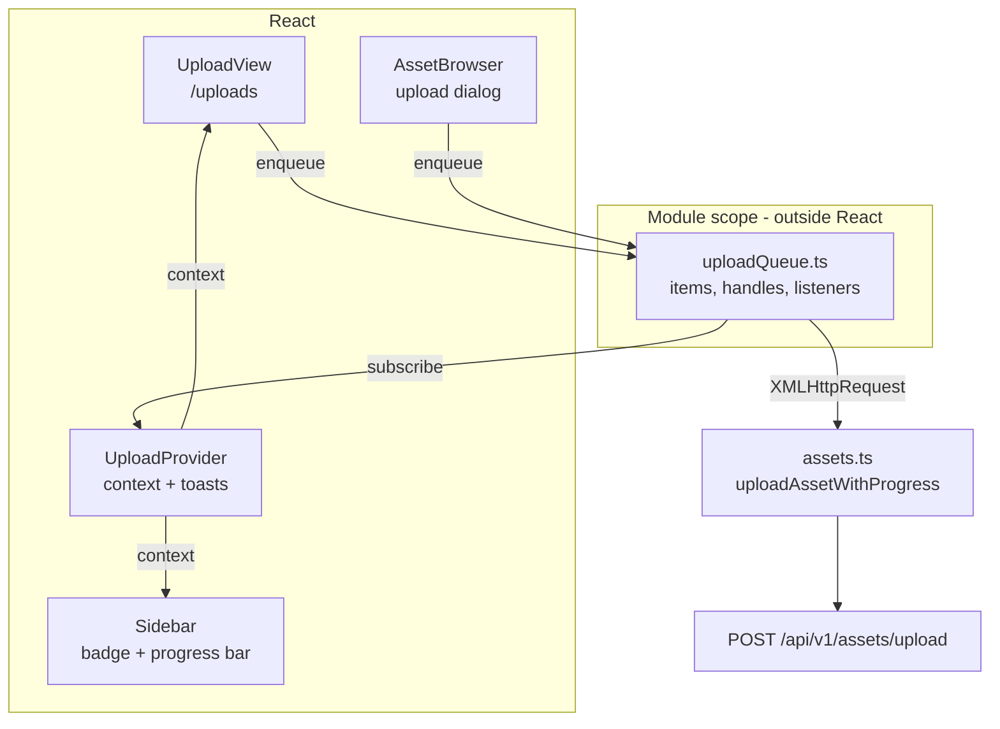

# MetaLoom // Loom UI Upload Specification

> The dedicated upload screen (`/uploads`) and the background upload queue behind it. Covers the
> queue store, the React binding, the target model (library → pool), progress/cancel/retry, toasts
> and the test setup.
>
> This file is **not** the general UI shell — see [LOOM_UI.md](LOOM_UI.md) for stack, routing,
> provider tree and conventions. It is **not** the upload endpoint contract either — see
> [REST_BINARY_HANDLING.md](../../features/rest/REST_BINARY_HANDLING.md) for storage layout, pool
> resolution and the byte-carrying routes. Remaining asset/media UI gaps live in
> [TASK_UI_ASSETS_MEDIA.md](TASK_UI_ASSETS_MEDIA.md).

---

## 1. Progress Assessment

### 1.1 Built

- [x] Dedicated `/uploads` route and screen (`UploadView.tsx`)
- [x] Multi-file selection via file picker (`multiple`) and drag-and-drop
- [x] Per-file progress bars driven by real byte counts (XHR `upload.onprogress`)
- [x] Weighted aggregate progress across the batch
- [x] Per-file cancel, per-file retry, retry-all-failed, cancel-all, clear-finished
- [x] Uploads survive route changes — the queue is a module-level store, not component state
- [x] Sidebar entry with active-count badge and a live progress bar
- [x] Toasts on batch completion, failure and cancellation
- [x] `beforeunload` warning while a batch is in flight
- [x] Library selection (required) with the effective storage pool shown read-only
- [x] Pool override selector, rendered only when `GET /pools` is readable
- [x] Backend: optional `poolUuid` form field on `POST /assets/upload`, guarded by `READ_ASSET_POOL`
- [x] Duplicate detection surfaced (HTTP 200 → "already in Loom" rather than a failure)
- [x] Asset browser upload dialog routed into the same queue (one upload code path)
- [x] vitest coverage for the queue, the formatters and the request shaping
- [x] Mocked Playwright coverage for the screen (11 specs)
- [x] Customer documentation on `website/content/english/docs/ui/` (§ Uploads), with two screenshots
      of three files in flight taken by `loom-ui/scripts/capture-upload-screenshots.mjs` (§8.4)

### 1.2 Not built (deliberate)

- [ ] **Resumable / chunked upload.** The endpoint is single-shot multipart with no resume
      (REST_BINARY_HANDLING.md gap list). A page reload therefore loses an in-flight batch; the UI
      warns rather than pretending otherwise.
- [ ] **Folder upload** (`webkitdirectory`). Drag-and-drop of a directory yields no files today.
- [ ] **Persisted queue across reloads.** Would require re-picking the files anyway — a `File`
      handle cannot be revived from storage.
- [ ] **Per-upload bandwidth limit / pause.** No backpressure control on `XMLHttpRequest`.
- [ ] **Upload from URL** (server-side fetch). No endpoint exists.

### 1.3 Known gaps

- [ ] `MAX_CONCURRENT` is a hard-coded constant (3), not configurable.
- [ ] Progress is byte-of-request, so it reaches 100% when the last byte is *sent*, before the server
      has hashed and stored it. A large file shows a short pause at 100% before turning green.
- [ ] The queue is cleared on logout only because `UploadProvider` unmounts; there is no explicit
      logout hook calling `reset()`.

---

## 2. Architecture



The load-bearing decision: **the queue lives outside the React tree.** Uploads must keep running
while the user navigates, and a component-owned transfer dies with its unmount. `uploadQueue.ts` owns
the item list and the in-flight `XMLHttpRequest` handles; React subscribes. This mirrors
`src/api/pipelineEvents.ts`, which owns its WebSocket the same way.

`UploadProvider` is mounted **above `AppShell`** in `main.tsx`, so every route renders inside it and
no route change can unmount it.

### 2.1 Why XMLHttpRequest

`fetch` exposes no upload-progress event, and request-body streaming is not portable enough to
substitute. `uploadAssetWithProgress` is therefore the **only** XHR in `src/api/` — everything else
stays on `fetch`. The rest of the module (`uploadAsset`) keeps its `fetch` implementation for callers
that do not need progress.

### 2.2 Lifecycle of one item

```
enqueue() → queued ──(slot free)──> uploading ──┬─ 201 ─> done
                                                ├─ 200 ─> duplicate
                                                ├─ err ─> error      ──retry()──> queued
                                                └─abort─> cancelled  ──retry()──> queued
```

`pump()` starts as many queued items as `MAX_CONCURRENT` allows, and re-runs after each settle. When
nothing is left running **and** the batch counters are non-zero, one `BatchOutcome` is emitted and
the counters reset — that is what makes exactly one toast per batch rather than one per file.

---

## 3. The target model: library, not pool

**An upload targets a library. The pool is normally derived from it.**

`library.poolUuid → asset_pool → BinaryStorage`, resolved server-side by `BinaryStorageResolver`. An
asset itself carries no pool; the pool is recorded on the `asset_location` row.

### 3.1 Is a pool a user-facing concept?

**No — it is an operator concept, exposed by permission.** A pool is a storage backend (a filesystem
path or an S3 bucket, with free/used space), not something a content author should have to reason
about. The UI reflects that in three ways:

| Caller | What they see |
|--------|---------------|
| Anyone with `CREATE_ASSET` | A **library** selector, plus a read-only chip naming the pool the library resolves to. No choice to make. |
| Someone who can also read `/pools` (`READ_ASSET_POOL`) | An additional **storage pool** selector, defaulting to *From library*. |
| A caller without `READ_ASSET_POOL` | `GET /pools` answers 403; the selector is simply not rendered. The 403 is an expected answer, not an error to report. |

The screen never hides where bytes go: the effective pool is always displayed, whether derived or
overridden.

### 3.2 Backend support

`POST /api/v1/assets/upload` gained an **optional `poolUuid` form field**:

| Field | Required | Meaning |
|-------|----------|---------|
| `file` | yes | Exactly one file part. Two parts is a 400. |
| `libraryUuid` | yes | Target library. The created binary is recorded against it. |
| `origin` | no | Provenance label, defaults to `upload`. |
| `poolUuid` | no | Storage pool override. Blank/absent means the library decides. |

Naming `poolUuid` **additionally requires `READ_ASSET_POOL`**. The required permission set is
computed *before* the permission check, because it depends on the request body:

```java
UUID explicitPool = optionalUuid(lrc, "poolUuid");
Permission[] required = explicitPool == null
    ? new Permission[] { CREATE_ASSET }
    : new Permission[] { CREATE_ASSET, READ_ASSET_POOL };
checkPerms(lrc, () -> { ... }, required);
```

Behaviours worth knowing:

- An unknown pool uuid is a **404**, not a silent fall-back to local disk.
- A malformed `poolUuid` is a **400** naming the field — a typo must never route bytes elsewhere.
- A **blank** `poolUuid` means "absent", so a form that always emits the field still works.
- The UI never sends `poolUuid=""`; `buildUploadForm` omits the field unless a pool was chosen.

---

## 4. Duplicate content

`POST /assets/upload` answers **201 for new content and 200 when an asset with the same SHA-512
already exists** — the bytes are linked to the existing asset instead of creating a duplicate. That
is a success, not a failure, and the UI says so:

- `uploadAssetWithProgress` resolves `{ asset, created: xhr.status === 201 }`.
- `created: false` becomes the `duplicate` status, rendered blue with "Already in Loom — linked to
  the existing asset".
- The batch toast distinguishes the two counts (`uploads.toast.completedWithDuplicates`).

---

## 5. Key Classes Reference

| Symbol | Location | Purpose |
|--------|----------|---------|
| `uploadQueue.ts` | `loom-ui/src/features/uploads/` | Module-level queue: items, handles, concurrency, batch reporting |
| `enqueue` / `cancel` / `retry` / `clearFinished` / `reset` | `uploadQueue.ts` | Queue mutations |
| `subscribe` / `subscribeBatch` | `uploadQueue.ts` | Per-change and per-batch listeners |
| `summarize` | `uploadQueue.ts` | Derives `UploadSummary` (counts, weighted percent) |
| `setUploadToken` | `uploadQueue.ts` | Pushes the session token in — the queue has no React context |
| `setUploaderForTesting` | `uploadQueue.ts` | Transport seam; production never calls it |
| `UploadProvider` / `useUploads` | `features/uploads/UploadContext.tsx` | React binding, toasts, `beforeunload` guard |
| `UploadView` | `features/uploads/UploadView.tsx` | The `/uploads` screen |
| `formatBytes` / `percentOf` / `progressLabel` | `features/uploads/uploadFormat.ts` | Pure formatters |
| `uploadAssetWithProgress` | `loom-ui/src/api/assets.ts` | XHR upload: progress, abort, 200/201 discrimination |
| `buildUploadForm` | `loom-ui/src/api/assets.ts` | Multipart body shaping, shared by both transports |
| `UploadAbortedError` | `loom-ui/src/api/assets.ts` | Distinguishes a cancel from a real failure |
| `AssetUploadEndpointService` | `io.metaloom.loom.rest.service.impl` | Server side of `POST /assets/upload` |
| `BinaryStorageResolver` | `io.metaloom.loom.rest.service.impl` | `pool → BinaryStorage`; 404 on unknown pool |
| `AbstractEndpointService#checkPerms` | `io.metaloom.loom.rest.service` | Varargs, all-or-nothing permission gate |
| `AssetBinaryMethods#uploadAsset(File, UUID, UUID, String)` | `io.metaloom.loom.client.common.method` | Java client overload carrying a pool |

---

## 6. Data Model

```ts
type UploadStatus = "queued" | "uploading" | "done" | "duplicate" | "error" | "cancelled";

interface UploadItem {
  id: string;               // "upload-<n>", monotonic
  file: File;
  fileName: string;
  size: number;
  libraryUuid: string;      // required
  libraryName?: string;     // display only
  poolUuid?: string;        // override; absent = library decides
  poolName?: string;        // display only
  origin?: string;
  status: UploadStatus;
  loaded: number;           // bytes sent
  assetUuid?: string;
  error?: string;
}

interface UploadSummary {
  items: UploadItem[];
  activeCount: number;      // queued + uploading
  doneCount: number;
  duplicateCount: number;
  errorCount: number;
  percent: number;          // 0..100, weighted by size
  isActive: boolean;
}

interface BatchOutcome { uploaded: number; duplicates: number; failed: number; cancelled: number; }
```

Aggregate progress is **weighted by file size**, and settled items count as fully sent. That keeps
the bar monotonic and stops one large file from being masked by many small ones.

---

## 7. Configuration

There are no new environment variables in the UI. The server-side guards that an upload can hit:

| Variable | Default | Effect on upload |
|----------|---------|------------------|
| `LOOM_STORAGE_MAX_UPLOAD_SIZE` | unset (no limit) | Larger request → **413**; surfaces as the item's error text |
| `LOOM_STORAGE_MIN_FREE_SPACE` | unset | Would drop the volume below the floor → **507** |
| `LOOM_STORAGE_UPLOAD_DIR` | process default | Where bytes land when the library has no pool |
| `LOOM_S3_ACCESS_KEY` / `LOOM_S3_SECRET_KEY` | unset | Credentials for S3-backed pools; never in the REST model |
| `VITE_API_BASE_URL` | `http://localhost:8092/api/v1` | Upload target base; set to `/api/v1` for same-origin builds |

UI-side constant, not configurable: `MAX_CONCURRENT = 3` in `uploadQueue.ts`.

---

## 8. Test Setup

Per [LOOM_UI.md](LOOM_UI.md) §8: **pure logic → vitest, anything rendered → a mocked Playwright
spec.** There is no jsdom and no React Testing Library; do not add them.

### 8.1 vitest

| File | Covers |
|------|--------|
| `src/features/uploads/uploadQueue.test.ts` | Concurrency cap, progress weighting, duplicate vs failure, cancel of running *and* queued items, retry, batch reported exactly once per drain, missing-token failure, `clearFinished` |
| `src/features/uploads/uploadFormat.test.ts` | Byte scaling, percent clamping, labels |
| `src/api/assetUpload.test.ts` | Form shaping (`poolUuid` present/absent/blank), XHR wiring, 200-vs-201, abort semantics |

The queue tests inject a fake transport via `setUploaderForTesting`, so each call can be parked and
resolved on demand — that is what makes concurrency and cancellation observable without a network.
`assetUpload.test.ts` stubs `XMLHttpRequest` because vitest runs in a **node** environment with no
DOM.

```bash
cd loom-ui
./node_modules/.bin/vitest run src/features/uploads src/api/assetUpload.test.ts
```

### 8.2 Playwright (mocked)

`loom-ui/e2e/uploads-mocked.spec.ts` — 11 specs, no backend required. Notable cases:

- multi-file → one multipart request per file
- chosen pool appears as `poolUuid`; the default omits the field entirely
- `GET /pools` → 403 hides the pool selector but leaves uploading available
- **navigate away mid-upload**, assert `sidebar-upload-progress`, release the parked response, return
  and see the item finished — the test that actually proves the queue outlives the unmount
- 200 → `duplicate`, 507 → `error` + retry button, cancel → `cancelled`

```bash
cd loom-ui
./node_modules/.bin/playwright test e2e/uploads-mocked.spec.ts
```

### 8.3 Java endpoint tests

`loom/core/src/test/java/io/metaloom/loom/core/endpoint/test/AssetBinaryDataEndpointTest.java`:

| Test | Asserts |
|------|---------|
| `shouldStoreIntoAnExplicitlyNamedPool` | Bytes land in the named pool's directory, not the default |
| `shouldRejectAnUnknownPool` | 404 |
| `shouldRequirePoolPermissionToNameAPool` | 403 without `READ_ASSET_POOL`; the same upload **without** the override still succeeds |
| `shouldRejectAMalformedPoolUuid` | 400 naming the field |
| `shouldTreatABlankPoolUuidAsAbsent` | 201 |

```bash
./setup-pool.sh                     # once, and after any Flyway change
mvn -o install -pl loom-client/common,loom-client/rest,loom/services/rest -DskipTests
mvn -o test -pl loom/core -Dtest=AssetBinaryDataEndpointTest
```

### 8.4 Documentation screenshots

`loom-ui/scripts/capture-upload-screenshots.mjs` photographs this screen for the customer docs. It is
a *mocked* capture in the same sense as §8.2 — no backend, a Vite dev server, `page.route` over
every REST call — and it produces `uploads.png` and `uploads-sidebar.png` in the `docs/ui/` page
bundle.

```bash
cd loom-ui && node scripts/capture-upload-screenshots.mjs
```

The one thing worth knowing here rather than in the website spec: **`page.route` cannot park an
upload part-way.** A route controls the response; the bar is drawn from `upload.onprogress` on the
request. The script subclasses `XMLHttpRequest` instead, dispatches one real `ProgressEvent` at a
planned fraction and never answers — so `uploadAssetWithProgress`, the queue and `MAX_CONCURRENT`
all run for real, and the picture necessarily has three bars in it. Details and the rest of the
capture rules: [../../website/WEBSITE.md](../../website/WEBSITE.md) § Capturing the upload screen.

---

## 9. Conventions and Gotchas

### 9.1 Conventions

| Convention | Rule |
|------------|------|
| Where uploads run | Always through `uploadQueue.enqueue`. Never call `uploadAssetWithProgress` from a component — the transfer would die on unmount. |
| Token flow | The queue has no React context. `UploadProvider` pushes the token via `setUploadToken`. |
| Pool field | Omit `poolUuid` unless explicitly chosen. Never send `""`. |
| Test ids | `upload-row-<fileName>` carries `data-status`; that attribute is the assertion surface for e2e. |
| i18n | Keys under `uploads.*`, and they must exist in **both** `en.json` and `de.json`. |

### 9.2 Gotchas

- 🔴 **`npx` hangs in the sandbox.** `npx vitest` / `npx playwright` stall on a package lookup. Use
  `./node_modules/.bin/vitest` and `./node_modules/.bin/playwright` directly. (`npx tsc` happens to
  work, but the local binary is the safe habit.)
- 🔴 **Role-name matching is substring-based.** Adding the sidebar entry *Uploads* broke
  `assets-crud-mocked.spec.ts`, which used `getByRole("button", { name: "Upload" }).first()` — the
  nav entry matched first and navigated away. That spec now passes `exact: true`. Any new nav label
  that is a prefix of an existing button label will do this again.
- 🔴 **Stale `.m2` jars.** `loom/core` resolves `loom-client-*` and `loom-services-rest` from the
  local repository, not the reactor. After changing a client interface you must `mvn install` those
  modules or the tests fail with `NoSuchMethodError`.
- 🔴 **`onabort` and `onerror` can both fire.** A cancelled XHR may raise both; the `aborted` flag in
  `uploadAssetWithProgress` keeps the first (correct) rejection so a cancel never reads as a failure.
- 🔴 **Progress can exceed the file size.** The multipart envelope adds headers and boundaries, so
  `event.loaded` can pass `file.size`. `percentOf` clamps to 100.
- 🔴 **`ConcurrentHashMap.computeIfAbsent` does not cache a throw**, which is why a 404 for an
  unknown pool repeats correctly instead of being memoized. `BinaryStorageResolver` otherwise never
  evicts — editing a pool still needs a restart.
- 🔴 **Reload cancels everything.** No resume exists. `UploadProvider` installs a `beforeunload`
  handler only while `isActive`, so the warning does not fire on an idle page.
- 🔴 **The asset grid does not auto-refresh from the server.** `AssetBrowser` reloads when the queue's
  settled count grows; without that, background-uploaded assets would not appear until a manual
  reload.

---

## 10. Where do I find ...?

| Concept | Path |
|---------|------|
| The upload screen | `loom-ui/src/features/uploads/UploadView.tsx` |
| The queue itself | `loom-ui/src/features/uploads/uploadQueue.ts` |
| Toasts / unload guard | `loom-ui/src/features/uploads/UploadContext.tsx` |
| Provider mount point | `loom-ui/src/main.tsx` (above `AppShell`) |
| Route registration | `loom-ui/src/layout/AppShell.tsx` (`/uploads`) |
| Sidebar entry + progress bar | `loom-ui/src/layout/Sidebar.tsx` (`contentNavItems`) |
| XHR transport | `loom-ui/src/api/assets.ts` (`uploadAssetWithProgress`) |
| Multipart shaping | `loom-ui/src/api/assets.ts` (`buildUploadForm`) |
| Library pool fields | `loom-ui/src/api/libraries.ts` (`poolUuid`, `storageType`) |
| Pool list | `loom-ui/src/api/pools.ts` (`listPools`) |
| In-context upload dialog | `loom-ui/src/features/assets/AssetBrowser.tsx` |
| Server upload handler | `loom/services/rest/.../service/impl/AssetUploadEndpointService.java` |
| Route registration (server) | `loom/services/rest/.../endpoint/impl/AssetEndpoint.java` |
| Pool → storage resolution | `loom/services/rest/.../service/impl/BinaryStorageResolver.java` |
| Java client overload | `loom-client/common/.../method/AssetBinaryMethods.java` |
| i18n strings | `loom-ui/src/i18n/locales/{en,de}.json` under `uploads.*` |
| Customer docs | `website/content/english/docs/ui/index.adoc` (§ Uploads) |
| Docs screenshots + how they are taken | `website/content/english/docs/ui/uploads{,-sidebar}.png` · `loom-ui/scripts/capture-upload-screenshots.mjs` |

---

_Git HEAD revision: `742dae2d`_
_Last updated: 2026-08-06 (customer documentation for the screen on `docs/ui/` § Uploads, plus §8.4:
`capture-upload-screenshots.mjs` and why the transport has to be subclassed rather than routed)_

_Previously: `aab85cb3`, 2026-08-02 (new file: dedicated upload screen, background upload queue, optional `poolUuid` on `POST /assets/upload`)_
