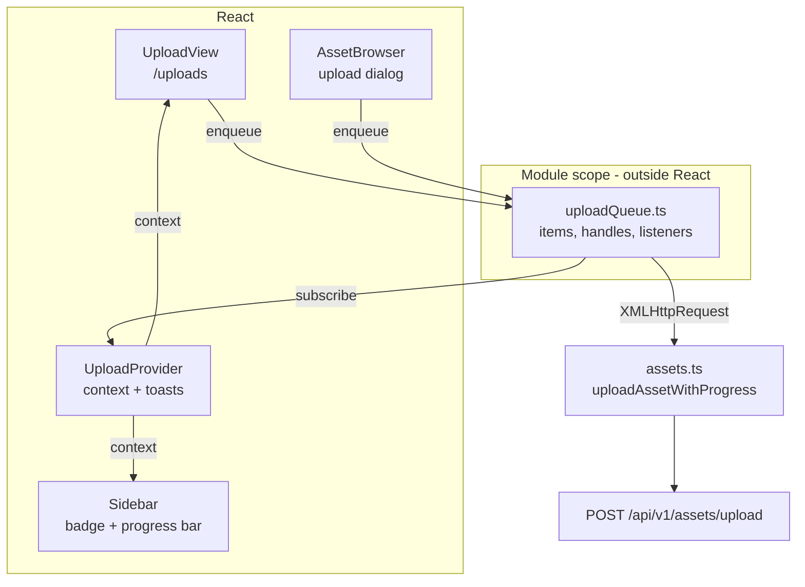

# MetaLoom // Loom UI Upload Specification

> The dedicated upload screen (`/uploads`) and the background upload queue behind it. Covers the
> queue store, the React binding, the target model (library → pool), progress/cancel/retry, toasts
> and the test setup.
>
> This file describes **what exists today**. Open work — everything not built and the one known
> defect — lives in [../../tasks/LOOM_UI_UPLOAD_TASKS.md](../../tasks/LOOM_UI_UPLOAD_TASKS.md) and is
> referenced from here by task number, never restated.
>
> This file is **not** the general UI shell — see [LOOM_UI.md](LOOM_UI.md) for stack, routing,
> provider tree and conventions. It is **not** the upload endpoint contract either — see
> [REST_BINARY_HANDLING.md](../../features/rest/REST_BINARY_HANDLING.md) for storage layout, pool
> resolution and the byte-carrying routes. Remaining asset/media UI gaps live in
> [TASK_UI_ASSETS_MEDIA.md](TASK_UI_ASSETS_MEDIA.md).

---

## 1. Progress Assessment

### 1.1 Implemented

- [x] Dedicated `/uploads` route and screen (`UploadView.tsx`)
- [x] Multi-file selection via file picker (`multiple`) and drag-and-drop
- [x] Per-file progress bars driven by real byte counts (XHR `upload.onprogress`)
- [x] Weighted aggregate progress across the batch
- [x] Per-file cancel, per-file retry, retry-all-failed, cancel-all, clear-finished
- [x] Pause / resume, per file and for the whole queue — file-granular: a waiting file is held
      back, a transfer already in flight always runs to completion (§2.3)
- [x] Client-side filename filter over the queue (`uploads-search`), with an inline no-match hint
      rather than the empty state — the whole queue is in memory, so the filter cannot be wrong about
      a page it has not loaded
- [x] Uploads survive route changes — the queue is a module-level store, not component state
- [x] Concurrency configurable via `VITE_UPLOAD_CONCURRENCY`, defaulting to 3 (§7)
- [x] Sidebar entry with active-count badge and a live progress bar
- [x] Toasts on batch completion, failure and cancellation
- [x] `beforeunload` warning while a batch is in flight (shared `useUnsavedChanges` hook)
- [x] Library selection (required) with the effective storage pool shown read-only
- [x] Pool override selector, rendered only when `GET /pools` is readable
- [x] Backend: optional `poolUuid` form field on `POST /assets/upload`, guarded by `READ_ASSET_POOL`
- [x] Duplicate detection surfaced (HTTP 200 → "already in Loom" rather than a failure)
- [x] Asset browser upload dialog routed into the same queue (one upload code path)
- [x] vitest coverage for the queue, the formatters and the request shaping (§8.1)
- [x] Mocked Playwright coverage for the screen (20 specs), drag-and-drop included (§8.2), plus the
      queue-filter case in `search-coverage-mocked.spec.ts`
- [x] Java endpoint tests for the pool override, including the permission pairing (§8.3)
- [x] Real-backend Playwright coverage: a generated PNG uploaded through the screen, read back by
      SHA-512, and shown as a real thumbnail in the asset grid (§8.4)
- [x] Customer documentation on `website/content/english/docs/ui/` (§ Uploads), with two screenshots
      of three files in flight taken by `loom-ui/scripts/capture-upload-screenshots.mjs` (§8.5)

### 1.2 Not implemented

Each item is a task in [../../tasks/LOOM_UI_UPLOAD_TASKS.md](../../tasks/LOOM_UI_UPLOAD_TASKS.md);
the rationale, the implementation steps and the required tests live there.

- [ ] Logout does not clear the queue, abort in-flight transfers or drop the stored token — `reset()`
      has no production caller (Task 1, the only known **defect** here)
- [ ] No server-side settle phase: a finished send sits at 100% until the response arrives (Task 3)
- [ ] Folder upload — `webkitdirectory` and directory entries (Task 4)
- [ ] Resumable / chunked upload; the endpoint is single-shot multipart (Task 5)
- [ ] Restoring an interrupted batch after a reload (Task 6, blocked by Task 5)
- [ ] Pausing a transfer that is already running, rather than only what is still waiting — needs the
      chunk boundary from Task 5 (Task 7 shipped the queue-level half)
- [ ] Bandwidth ceiling (Task 9, blocked by Task 5)
- [ ] Upload from a URL, i.e. a server-side fetch (Task 8)

---

## 2. Architecture



The load-bearing decision: **the queue lives outside the React tree.** Uploads must keep running
while the user navigates, and a component-owned transfer dies with its unmount. `uploadQueue.ts` owns
the item list and the in-flight `XMLHttpRequest` handles; React subscribes. This mirrors
`src/api/pipelineEvents.ts`, which owns its WebSocket the same way.

`UploadProvider` is mounted **above `AppShell`** in `main.tsx`, so every route renders inside it and
no route change can unmount it.

### 2.1 Why XMLHttpRequest

`fetch` exposes no upload-progress event, and request-body streaming is not portable enough to
substitute. `uploadAssetWithProgress` is therefore the **only** XHR in `src/api/` — everything else
stays on `fetch`. The rest of the module (`uploadAsset`) keeps its `fetch` implementation for callers
that do not need progress.

### 2.2 Lifecycle of one item

```
                 ┌──pause()──> paused ──cancel()──> cancelled
                 │               │
                 │           resume()
                 ▼               │
enqueue() → queued <─────────────┘
              │
     (slot free)
              ▼
          uploading ──┬─ 201 ─> done
                      ├─ 200 ─> duplicate
                      ├─ err ─> error      ──retry()──> queued
                      └─abort─> cancelled  ──retry()──> queued
```

`pump()` starts as many queued items as `MAX_CONCURRENT` allows, and re-runs after each settle. When
nothing is left running **and** the batch counters are non-zero, one `BatchOutcome` is emitted and
the counters reset — that is what makes exactly one toast per batch rather than one per file.
`paused` counts as busy for that check, so holding part of a batch keeps it open instead of raising a
toast now and a second one after the resume.

### 2.3 Pause is file-granular, and only forwards

`pause(id)` moves a **queued** item to `paused`; `pump()` only ever starts `queued` ones, so the
slot goes to the next waiting file instead. `resume` puts it back in line. `pauseAll` / `resumeAll`
do the same for the whole queue.

**A transfer already in flight is never paused.** `XMLHttpRequest.send()` hands the entire body to
the browser, so the only way to stop it is `abort()`, which discards every byte already sent — that
is `cancel`, and dressing it up as "pause" would silently destroy work on exactly the large files
this screen exists for. `pause` on an uploading item is therefore a no-op, and `UploadRow` does not
render the button for one. Pausing takes effect at the **file boundary**: what is running finishes,
what has not started waits.

A bandwidth ceiling has the same root cause and is not implemented — there is no seam inside one
`send()` to delay. Chunked upload (tasks file Task 5) moves the boundary from the file to the chunk
and makes both possible; the public API above does not have to change when it does.

---

## 3. The target model: library, not pool

**An upload targets a library. The pool is normally derived from it.**

`library.poolUuid → asset_pool → BinaryStorage`, resolved server-side by `BinaryStorageResolver`. An
asset itself carries no pool; the pool is recorded on the `asset_location` row.

### 3.1 Is a pool a user-facing concept?

**No — it is an operator concept, exposed by permission.** A pool is a storage backend (a filesystem
path or an S3 bucket, with free/used space), not something a content author should have to reason
about. The UI reflects that in three ways:

| Caller | What they see |
|--------|---------------|
| Anyone with `CREATE_ASSET` | A **library** selector, plus a read-only chip naming the pool the library resolves to. No choice to make. |
| Someone who can also read `/pools` (`READ_ASSET_POOL`) | An additional **storage pool** selector, defaulting to *From library*. |
| A caller without `READ_ASSET_POOL` | `GET /pools` answers 403; the selector is simply not rendered. The 403 is an expected answer, not an error to report. |

The screen never hides where bytes go: the effective pool is always displayed, whether derived or
overridden.

### 3.2 Backend support

`POST /api/v1/assets/upload` gained an **optional `poolUuid` form field**:

| Field | Required | Meaning |
|-------|----------|---------|
| `file` | yes | Exactly one file part. Two parts is a 400. |
| `libraryUuid` | yes | Target library. The created binary is recorded against it. |
| `origin` | no | Provenance label, defaults to `upload`. |
| `poolUuid` | no | Storage pool override. Blank/absent means the library decides. |

Naming `poolUuid` **additionally requires `READ_ASSET_POOL`**. The required permission set is
computed *before* the permission check, because it depends on the request body:

```java
UUID explicitPool = optionalUuid(lrc, "poolUuid");
Permission[] required = explicitPool == null
    ? new Permission[] { CREATE_ASSET }
    : new Permission[] { CREATE_ASSET, READ_ASSET_POOL };
checkPerms(lrc, () -> { ... }, required);
```

Behaviours worth knowing:

- An unknown pool uuid is a **404**, not a silent fall-back to local disk.
- A malformed `poolUuid` is a **400** naming the field — a typo must never route bytes elsewhere.
- A **blank** `poolUuid` means "absent", so a form that always emits the field still works.
- The UI never sends `poolUuid=""`; `buildUploadForm` omits the field unless a pool was chosen.

---

## 4. Duplicate content

`POST /assets/upload` answers **201 for new content and 200 when an asset with the same SHA-512
already exists** — the bytes are linked to the existing asset instead of creating a duplicate. That
is a success, not a failure, and the UI says so:

- `uploadAssetWithProgress` resolves `{ asset, created: xhr.status === 201 }`.
- `created: false` becomes the `duplicate` status, rendered blue with "Already in Loom — linked to
  the existing asset".
- The batch toast distinguishes the two counts (`uploads.toast.completedWithDuplicates`).

---

## 5. Key Classes Reference

| Symbol | Location | Purpose |
|--------|----------|---------|
| `uploadQueue.ts` | `loom-ui/src/features/uploads/` | Module-level queue: items, handles, concurrency, batch reporting |
| `enqueue` / `cancel` / `retry` / `clearFinished` / `reset` | `uploadQueue.ts` | Queue mutations |
| `pause` / `resume` / `pauseAll` / `resumeAll` | `uploadQueue.ts` | Hold waiting items back and release them; no effect on a running transfer (§2.3) |
| `subscribe` / `subscribeBatch` | `uploadQueue.ts` | Per-change and per-batch listeners |
| `summarize` | `uploadQueue.ts` | Derives `UploadSummary` (counts, weighted percent) |
| `clampConcurrency` | `uploadQueue.ts` | Resolves `VITE_UPLOAD_CONCURRENCY` into `MAX_CONCURRENT`; falls back to `DEFAULT_CONCURRENCY` |
| `setUploadToken` | `uploadQueue.ts` | Pushes the session token in — the queue has no React context |
| `setUploaderForTesting` | `uploadQueue.ts` | Transport seam; production never calls it |
| `UploadProvider` / `useUploads` | `features/uploads/UploadContext.tsx` | React binding, toasts, `beforeunload` guard via the shared `useUnsavedChanges` hook |
| `UploadView` | `features/uploads/UploadView.tsx` | The `/uploads` screen |
| `formatBytes` / `percentOf` / `progressLabel` | `features/uploads/uploadFormat.ts` | Pure formatters |
| `uploadAssetWithProgress` | `loom-ui/src/api/assets.ts` | XHR upload: progress, abort, 200/201 discrimination |
| `buildUploadForm` | `loom-ui/src/api/assets.ts` | Multipart body shaping, shared by both transports |
| `UploadAbortedError` | `loom-ui/src/api/assets.ts` | Distinguishes a cancel from a real failure |
| `AssetUploadEndpointService` | `io.metaloom.loom.rest.service.impl` | Server side of `POST /assets/upload` |
| `BinaryStorageResolver` | `io.metaloom.loom.rest.service.impl` | `pool → BinaryStorage`; 404 on unknown pool |
| `AbstractEndpointService#checkPerms` | `io.metaloom.loom.rest.service` | Varargs, all-or-nothing permission gate |
| `AssetBinaryMethods#uploadAsset(File, UUID, UUID, String)` | `io.metaloom.loom.client.common.method` | Java client overload carrying a pool |

---

## 6. Data Model

```ts
type UploadStatus =
  | "queued" | "uploading" | "paused"   // paused: held by the user, never started (§2.3)
  | "done" | "duplicate" | "error" | "cancelled";

interface UploadItem {
  id: string;               // "upload-<n>", monotonic
  file: File;
  fileName: string;
  size: number;
  libraryUuid: string;      // required
  libraryName?: string;     // display only
  poolUuid?: string;        // override; absent = library decides
  poolName?: string;        // display only
  origin?: string;
  status: UploadStatus;
  loaded: number;           // bytes sent
  assetUuid?: string;
  error?: string;
}

interface UploadSummary {
  items: UploadItem[];
  activeCount: number;      // queued + uploading — paused is deliberately NOT active
  doneCount: number;
  duplicateCount: number;
  errorCount: number;
  pausedCount: number;
  percent: number;          // 0..100, weighted by size
  isActive: boolean;
}

interface BatchOutcome { uploaded: number; duplicates: number; failed: number; cancelled: number; }
```

Aggregate progress is **weighted by file size**, and settled items count as fully sent. That keeps
the bar monotonic and stops one large file from being masked by many small ones. A `paused` item is
not settled, so it contributes its `loaded` (normally 0) and holds the percentage down — the bar
reflects the batch the user still has, not the part they let through.

---

## 7. Configuration

One UI variable, plus the server-side guards that an upload can hit:

| Variable | Default | Effect on upload |
|----------|---------|------------------|
| `VITE_UPLOAD_CONCURRENCY` | `3` (range `1`–`8`) | How many transfers run at once |
| `VITE_API_BASE_URL` | `http://localhost:8092/api/v1` | Upload target base; set to `/api/v1` for same-origin builds |
| `LOOM_STORAGE_MAX_UPLOAD_SIZE` | unset (no limit) | Larger request → **413**; surfaces as the item's error text |
| `LOOM_STORAGE_MIN_FREE_SPACE` | unset | Would drop the volume below the floor → **507** |
| `LOOM_STORAGE_UPLOAD_DIR` | process default | Where bytes land when the library has no pool |
| `LOOM_S3_ACCESS_KEY` / `LOOM_S3_SECRET_KEY` | unset | Credentials for S3-backed pools; never in the REST model |

`VITE_*` is a **build-time** substitution, so the concurrency is resolved once at module load:
`const MAX_CONCURRENT = clampConcurrency(import.meta.env.VITE_UPLOAD_CONCURRENCY)`. A value that is
unparseable, `0`, negative or above `8` **falls back to `3`** rather than being clamped to the
nearest bound — a typo behaves as if the setting was never made, and `0` would leave the queue with
nothing ever starting. Three suits a fast link; lower it for a saturated uplink or an S3-backed pool
where each request carries its own latency.

---

## 8. Test Setup

Per [LOOM_UI.md](LOOM_UI.md) §8: **pure logic → vitest, anything rendered → a mocked Playwright
spec.** There is no jsdom and no React Testing Library; do not add them.

### 8.1 vitest

| File | Covers |
|------|--------|
| `src/features/uploads/uploadQueue.test.ts` | Concurrency cap and the `clampConcurrency` resolver, progress weighting, duplicate vs failure, cancel of running *and* queued items, retry, batch reported exactly once per drain, missing-token failure, `clearFinished`, and pause: a held item never starts, a running one is untouched, `resume` re-queues rather than restarts, the batch stays open while anything is paused and closes on resume **or** on cancelling the paused remainder |
| `src/features/uploads/uploadFormat.test.ts` | Byte scaling, percent clamping, labels |
| `src/api/assetUpload.test.ts` | Form shaping (`poolUuid` present/absent/blank), XHR wiring, 200-vs-201, abort semantics |

The queue tests inject a fake transport via `setUploaderForTesting`, so each call can be parked and
resolved on demand — that is what makes concurrency and cancellation observable without a network.
`assetUpload.test.ts` stubs `XMLHttpRequest` because vitest runs in a **node** environment with no
DOM.

```bash
cd loom-ui
./node_modules/.bin/vitest run src/features/uploads src/api/assetUpload.test.ts
```

### 8.2 Playwright (mocked)

`loom-ui/e2e/uploads-mocked.spec.ts` — 20 specs, no backend required. Notable cases:

- multi-file → one multipart request per file
- **drag-and-drop** → the same one-request-per-file contract as the file input, plus the `dragging`
  highlight appearing on `dragover` and clearing on `drop`
- a drop carrying no files (folder upload is unbuilt, §1.2) enqueues nothing, and the screen still
  works afterwards — this case pins the unbuilt state, so it has to change when Task 4 lands
- a custom `origin` travels as the form field; a blank one omits it, so the server's `upload` default
  applies
- `upload-queue-heading` / `upload-totals` track the batch, and the percent is weighted by **size**:
  with three small files in flight and a big one still queued it stays well under half
- `upload-cancel-all` with three in flight → three `cancelled`, zero `error`
- `upload-pause-all` with three in flight and two waiting → the two go `paused`, the three finish,
  no fourth request is made, no toast is raised, and the batch bars switch to their paused testids;
  `upload-resume-all` then drains the rest and raises **one** toast counting all five
- `upload-pause-<fileName>` / `upload-resume-<fileName>` on a single waiting file, asserting that a
  freed slot goes to a queued file and never to the paused one
- `upload-retry-failed` after two failures → exactly two further requests; the success is not re-sent
- chosen pool appears as `poolUuid`; the default omits the field entirely
- `GET /pools` → 403 hides the pool selector but leaves uploading available
- **navigate away mid-upload**, assert `sidebar-upload-progress`, release the parked response, return
  and see the item finished — the test that actually proves the queue outlives the unmount
- 200 → `duplicate`, 507 → `error` + retry button, cancel → `cancelled`

The **queue filter** is not tested here: it lives with the other search surfaces in
`loom-ui/e2e/search-coverage-mocked.spec.ts` ("uploads: the queue filters by filename and says when
nothing matches"), which asserts that a non-matching term shows `uploads-no-match` and **not**
`upload-empty-state` — the queue is not empty, the filter just matched nothing.

```bash
cd loom-ui
./node_modules/.bin/playwright test e2e/uploads-mocked.spec.ts
./node_modules/.bin/playwright test e2e/search-coverage-mocked.spec.ts -g uploads
```

Playwright has no file-drag API, so the drop cases build a `DataTransfer` inside the page with
`page.evaluateHandle` and hand it to `locator.dispatchEvent("dragover" | "drop", { dataTransfer })`.
`setInputFiles` cannot substitute: it drives the `<input type=file>` branch, and `onDrop` reads
`e.dataTransfer.files`, a different code path. The same limitation bounds what the folder case can
claim — a synthetic `DataTransfer` cannot carry a real filesystem directory entry, so the test drops
a `text/uri-list` item instead and pins the observable consequence (`files` is empty → nothing is
enqueued, nothing throws). If folder upload is ever half-built, that is the case that has to change.

### 8.3 Java endpoint tests

`loom/core/src/test/java/io/metaloom/loom/core/endpoint/test/AssetBinaryDataEndpointTest.java`:

| Test | Asserts |
|------|---------|
| `shouldStoreIntoAnExplicitlyNamedPool` | Bytes land in the named pool's directory, not the default |
| `shouldRejectAnUnknownPool` | 404 |
| `shouldRequirePoolPermissionToNameAPool` | 403 without `READ_ASSET_POOL`; the same upload **without** the override still succeeds |
| `shouldRejectAMalformedPoolUuid` | 400 naming the field |
| `shouldTreatABlankPoolUuidAsAbsent` | 201 |

```bash
./setup-pool.sh                     # once, and after any Flyway change
mvn -o install -pl loom-client/common,loom-client/rest,loom/services/rest -DskipTests
mvn -o test -pl loom/core -Dtest=AssetBinaryDataEndpointTest
```

### 8.4 Playwright (real backend)

`loom-ui/e2e/uploads-backend.spec.ts` — 2 specs, **requires a running server with demo data**. This is
the only test that moves real bytes through the screen; everything in §8.2 validates the UI against a
mock written by the same hand as the code.

| Test | Asserts |
|------|---------|
| `a generated image … comes back from the server` | A PNG generated in the test uploads via `upload-file-input`, then `GET /assets/sha512/:hash` returns it with matching `filename`, `size`, `mimeType` and hash; re-downloading `binary/data` hashes back to the same SHA-512; and `AssetBrowser` renders a decoded 48×48 `` rather than a `MediaPlaceholder` (the §7.2 cookie-auth preview path) |
| `uploading the same bytes twice reports a duplicate` | Same payload under a second filename → `duplicate`, one asset, still named after the first upload |

```bash
cd loom-ui
VITE_API_BASE_URL=/api/v1 VITE_PROXY_TARGET=http://localhost:8092 \
  ./node_modules/.bin/playwright test e2e/uploads-backend.spec.ts
```

Two things this spec has to do that a mocked one does not:

- 🔴 **The bytes must be new on every run.** The endpoint is content-addressed, so a checked-in
  fixture would come back `duplicate` the second time the suite runs and the "new upload" test would
  fail for a reason unrelated to the UI. The PNG is therefore generated — a real IHDR/IDAT/IEND
  stream built with `zlib.deflateSync` — from a `Date.now()` seed that colours its pixels.
- 🔴 **It must not target the demo's first library.** *Archive Footage* resolves to an S3 pool the
  demo container holds no credentials for, and the selector defaults to it — an upload there is a
  500 about the environment. The spec picks *Campaign Media* (no pool → server default filesystem
  storage), which also exercises `upload-library-select`.

`VITE_API_BASE_URL=/api/v1` is the documented configuration because previews are cookie-authenticated
(§7.2 of [LOOM_UI.md](LOOM_UI.md)). It is worth knowing that the thumbnail assertion passes locally
*without* it too: `SameSite` is scoped to the site, not the origin, so `localhost:3000` and
`localhost:8092` still exchange the cookie. A genuinely cross-site API host is what breaks it.

### 8.5 Documentation screenshots

`loom-ui/scripts/capture-upload-screenshots.mjs` photographs this screen for the customer docs. It is
a *mocked* capture in the same sense as §8.2 — no backend, a Vite dev server, `page.route` over
every REST call — and it produces `uploads.png` and `uploads-sidebar.png` in the `docs/ui/` page
bundle.

```bash
cd loom-ui && node scripts/capture-upload-screenshots.mjs
```

The one thing worth knowing here rather than in the website spec: **`page.route` cannot park an
upload part-way.** A route controls the response; the bar is drawn from `upload.onprogress` on the
request. The script subclasses `XMLHttpRequest` instead, dispatches one real `ProgressEvent` at a
planned fraction and never answers — so `uploadAssetWithProgress`, the queue and `MAX_CONCURRENT`
all run for real, and the picture necessarily has three bars in it. Details and the rest of the
capture rules: [../../website/WEBSITE.md](../../website/WEBSITE.md) § Capturing the upload screen.

---

## 9. Conventions and Gotchas

### 9.1 Conventions

| Convention | Rule |
|------------|------|
| Where uploads run | Always through `uploadQueue.enqueue`. Never call `uploadAssetWithProgress` from a component — the transfer would die on unmount. |
| Token flow | The queue has no React context. `UploadProvider` pushes the token via `setUploadToken`. |
| Pool field | Omit `poolUuid` unless explicitly chosen. Never send `""`. |
| Test ids | `upload-row-<fileName>` carries `data-status`; that attribute is the assertion surface for e2e. |
| Status classification | A new `UploadStatus` has to be placed in **four** spots: `summarize`'s active filter, `isTerminal`, `pump`'s `stillBusy` check and `UploadView`'s `isSettled`. Missing the `stillBusy` one ends the batch early and fires the toast while work remains. |
| i18n | Keys under `uploads.*`, and they must exist in **both** `en.json` and `de.json`. |

### 9.2 Gotchas

- 🔴 **`npx` hangs in the sandbox.** `npx vitest` / `npx playwright` stall on a package lookup. Use
  `./node_modules/.bin/vitest` and `./node_modules/.bin/playwright` directly. (`npx tsc` happens to
  work, but the local binary is the safe habit.)
- 🔴 **Role-name matching is substring-based.** Adding the sidebar entry *Uploads* broke
  `assets-crud-mocked.spec.ts`, which used `getByRole("button", { name: "Upload" }).first()` — the
  nav entry matched first and navigated away. That spec now passes `exact: true`. Any new nav label
  that is a prefix of an existing button label will do this again.
- 🔴 **Stale `.m2` jars.** `loom/core` resolves `loom-client-*` and `loom-services-rest` from the
  local repository, not the reactor. After changing a client interface you must `mvn install` those
  modules or the tests fail with `NoSuchMethodError`.
- 🔴 **`onabort` and `onerror` can both fire.** A cancelled XHR may raise both; the `aborted` flag in
  `uploadAssetWithProgress` keeps the first (correct) rejection so a cancel never reads as a failure.
- 🔴 **Progress can exceed the file size.** The multipart envelope adds headers and boundaries, so
  `event.loaded` can pass `file.size`. `percentOf` clamps to 100.
- 🔴 **`ConcurrentHashMap.computeIfAbsent` does not cache a throw**, which is why a 404 for an
  unknown pool repeats correctly instead of being memoized. `BinaryStorageResolver` otherwise never
  evicts — editing a pool still needs a restart.
- 🔴 **Reload cancels everything.** No resume exists. `UploadProvider` calls
  `useUnsavedChanges(summary.isActive, …)` ([LOOM_UI.md](LOOM_UI.md) §7.9), so the `beforeunload`
  warning is installed only while a batch runs and does not fire on an idle page. It registers no
  route guard: the queue is module-level and outlives every navigation, so only unloading costs
  anything.
- 🔴 **Progress reaches 100% before the asset exists.** `upload.onprogress` counts bytes *sent*, so a
  large file sits at a full blue bar while the server hashes and stores it. That pause is expected,
  not a hang ([tasks](../../tasks/LOOM_UI_UPLOAD_TASKS.md) Task 3).
- 🔴 **Unmounting `UploadProvider` does not clear the queue.** The store is module-level; an unmount
  only disposes the subscriptions. `reset()` exists but has no production caller, and the `[token]`
  effect never runs with `null` on logout because `AuthGate` swaps in `LoginPage` in the same render
  — so the queue, its in-flight handles and the previous bearer token all survive a session change.
  ([tasks](../../tasks/LOOM_UI_UPLOAD_TASKS.md) Task 1.)
- 🔴 **A paused batch is not "active".** `isActive` counts queued + uploading only, so a fully paused
  queue raises no `beforeunload` warning and shows the neutral bar
  (`sidebar-upload-progress-paused`, `upload-batch-progress-paused`) rather than the primary one. It
  also keeps the sidebar badge at zero — the badge counts work in motion. Reloading still loses the
  held files, so a long pause is not a safe parking spot (§2.3).
- 🔴 **A batch held open never toasts.** `paused` counts as busy in `pump`, so a user who pauses the
  remainder and walks away gets no completion toast for the part that finished; it arrives when the
  paused items are resumed or cancelled. That is the deliberate trade against toasting twice.
- 🔴 **The asset grid does not auto-refresh from the server.** `AssetBrowser` reloads when the queue's
  settled count grows; without that, background-uploaded assets would not appear until a manual
  reload.

---

## 10. Where do I find ...?

| Concept | Path |
|---------|------|
| The upload screen | `loom-ui/src/features/uploads/UploadView.tsx` |
| The queue itself | `loom-ui/src/features/uploads/uploadQueue.ts` |
| Toasts / unload guard | `loom-ui/src/features/uploads/UploadContext.tsx` |
| Provider mount point | `loom-ui/src/main.tsx` (above `AppShell`) |
| Route registration | `loom-ui/src/layout/AppShell.tsx` (`/uploads`) |
| Sidebar entry + progress bar | `loom-ui/src/layout/Sidebar.tsx` (`contentNavItems`) |
| XHR transport | `loom-ui/src/api/assets.ts` (`uploadAssetWithProgress`) |
| Multipart shaping | `loom-ui/src/api/assets.ts` (`buildUploadForm`) |
| Library pool fields | `loom-ui/src/api/libraries.ts` (`poolUuid`, `storageType`) |
| Pool list | `loom-ui/src/api/pools.ts` (`listPools`) |
| In-context upload dialog | `loom-ui/src/features/assets/AssetBrowser.tsx` |
| Server upload handler | `loom/services/rest/.../service/impl/AssetUploadEndpointService.java` |
| Route registration (server) | `loom/services/rest/.../endpoint/impl/AssetEndpoint.java` |
| Pool → storage resolution | `loom/services/rest/.../service/impl/BinaryStorageResolver.java` |
| Java client overload | `loom-client/common/.../method/AssetBinaryMethods.java` |
| Mocked e2e specs | `loom-ui/e2e/uploads-mocked.spec.ts` (§8.2) |
| Queue-filter e2e case | `loom-ui/e2e/search-coverage-mocked.spec.ts` (§8.2) |
| Real-backend e2e spec | `loom-ui/e2e/uploads-backend.spec.ts` (§8.4) |
| Open work / task list | [../../tasks/LOOM_UI_UPLOAD_TASKS.md](../../tasks/LOOM_UI_UPLOAD_TASKS.md) |
| i18n strings | `loom-ui/src/i18n/locales/{en,de}.json` under `uploads.*` |
| Customer docs | `website/content/english/docs/ui/index.adoc` (§ Uploads) |
| Docs screenshots + how they are taken | `website/content/english/docs/ui/uploads{,-sidebar}.png` · `loom-ui/scripts/capture-upload-screenshots.mjs` |

---

_Git HEAD revision: `67000540`_
_Last updated: 2026-08-16 (pause / resume for the queue — new §2.3 on why it is file-granular, the
`paused` status through the lifecycle, data model, key classes, conventions and gotchas; mocked specs
18 → 20 (tasks file Task 7, closed for the queue-level scope; the bandwidth ceiling became Task 9).
Earlier the same day: upload concurrency is now configurable via `VITE_UPLOAD_CONCURRENCY`
(§1.1, §5, §7) — tasks file Task 2, closed. Earlier the same day: this file began tracking current
state only: §1.2 "not built" and §1.3 "known
gaps" moved to [../../tasks/LOOM_UI_UPLOAD_TASKS.md](../../tasks/LOOM_UI_UPLOAD_TASKS.md) as Tasks
1–8. Added the queue filename filter and its coverage in `search-coverage-mocked.spec.ts`. Corrected
the claim that a `UploadProvider` unmount clears the queue — it does not; `reset()` has no production
caller, which is now Task 1)_

_Previously: `fa8183e9`, 2026-08-09 (closed the e2e holes: drag-and-drop and the four unreferenced bulk/queue
testids in §8.2, taking it 11 → 18 specs; new §8.4 `uploads-backend.spec.ts` moving real bytes end to
end; documentation screenshots renumbered to §8.5)_

_Previously: `742dae2d`, 2026-08-06 (customer documentation for the screen on `docs/ui/` § Uploads, plus §8.4: `capture-upload-screenshots.mjs` and why the transport has to be subclassed rather than routed)_

_Previously: `aab85cb3`, 2026-08-02 (new file: dedicated upload screen, background upload queue, optional `poolUuid` on `POST /assets/upload`)_
