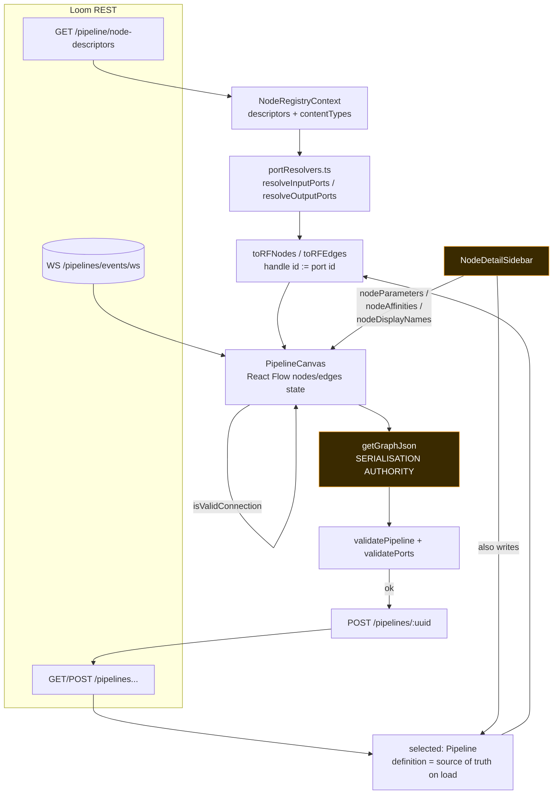

# MetaLoom // Pipeline Editor (loom-ui)

The **product** pipeline editor: the React Flow canvas behind the `/pipelines` route of `loom-ui`,
backed by the Loom REST API. It loads node descriptors from the server, draws a typed-port graph,
validates it client-side, and persists a pipeline **definition JSON** that
`PipelineGraphParser` on the Java side must be able to read verbatim.

### This file is not

| If you are looking for | Read instead |
|---|---|
| The marketing site's standalone editor (no backend, hardcoded node catalogue) | [../../website/WEBSITE_PIPELINE_EDITOR.md](../../website/WEBSITE_PIPELINE_EDITOR.md) |
| The type system itself — content-type vocabulary, `family/subtype`, cardinality, XOR/EXCLUSIVE groups, fan-out/gather | [../../features/pipeline/NODE_DATA_TYPES.md](../../features/pipeline/NODE_DATA_TYPES.md) |
| The engine, the definition schema's server side, node descriptors, Loom↔Cortex protocol | [../../features/pipeline/PIPELINE.md](../../features/pipeline/PIPELINE.md) |
| REST endpoint contracts and payload schemas | [../RESTAPI.md](../RESTAPI.md) |
| Pipeline-event WebSocket frames | [../WEBSOCKET.md](../WEBSOCKET.md) |
| Open UI work items for the pipeline area | [TASK_UI_PIPELINE.md](TASK_UI_PIPELINE.md) |
| The rest of the UI (shell, routing, theme tokens, i18n) | [LOOM_UI.md](LOOM_UI.md) |

**Do not duplicate the port model here.** This file documents only how the editor *renders*,
*validates*, and *serialises* it.

---

## 1. Progress Assessment

- [x] React Flow canvas with custom node renderer, minimap, controls, dotted background
- [x] Node palette sourced from server descriptors (`NodeRegistryContext`), never hardcoded
- [x] Handle ids **are** port ids (`PortSpec.id`) — no invented fallback handles
- [x] Typed connection validation mirroring the server lattice (`isAssignable`)
- [x] Cardinality (ONE/MANY), XOR input groups, EXCLUSIVE output groups enforced on drag and on save
- [x] Dynamic ports for `script` / `llm` / `vlm` via `portResolvers.ts` mirrors
- [x] Edges serialise `sourcePort` / `targetPort`; branch serialises as `branch`
- [x] Per-instance parameters serialise under `options` (`config` accepted as a legacy alias on load)
- [x] Sidebar parameter/affinity/display-name edits mirrored onto the canvas before `getGraphJson()`
- [x] Pipeline CRUD: create, clone, update (new version per save), delete, run, cancel run
- [x] Version history: list, diff (`PipelineVersionDiff.tsx`), restore
- [x] Run history + run-item drill-down drawer
- [x] Live node pulsing / last-result tinting from the pipeline-events WebSocket
- [x] Affinity groups (top-level `affinity` field) editable and rendered as outlined node clusters
- [x] Unsaved-changes guard when switching pipelines in the list
- [ ] Route-level navigation guard (leaving `/pipelines` dirty still loses edits silently)
- [ ] Undo / redo
- [ ] Live validation while editing (validation runs only on save / clone)
- [ ] Node copy/paste and multi-select operations
- [ ] Per-node task state in the run drill-down (no REST endpoint — see [TASK_UI_PIPELINE.md](TASK_UI_PIPELINE.md))
- [ ] Delete the unreachable legacy prototype at `loom-ui/src/Pipeline/` + `loom-ui/src/Dashboard/`

---

## 2. Architecture



The single most important fact: **`getGraphJson()` serialises from the React Flow canvas, not from
`selected.definition`.** Anything edited elsewhere must be pushed onto the canvas first or it is
discarded on save. See §5.

---

## 3. Key Components Reference

All in `loom-ui/src/features/pipeline/PipelineEditor.tsx` unless noted. Line numbers are indicative
(HEAD `2e5981cb`, file is 3739 lines).

| Symbol | Line | Purpose |
|---|---|---|
| `affinityColor` | 65 | Deterministic colour for a non-default affinity group |
| `categoryConfig` / `ICON_MAP` / `resolveNodeIcon` | 75–121 | Category colours + Material icon mapping by descriptor `icon` |
| `NodePorts` / `nodeConnectors` | 137–164 | Resolved `portsIn`/`portsOut`/`portGroupsIn`/`portGroupsOut` for one instance |
| `portName` / `portTooltip` / `portBlockedReason` | 167–203 | Handle labels, tooltips, XOR/EXCLUSIVE "already wired" reasons |
| `PipelineNodeComponent` | 206 | Custom React Flow node: one `<Handle>` per port, id = port id |
| `nodeTypes` | 491 | `{ pipelineNode: PipelineNodeComponent }` — the only registered type |
| `toRFNodes` | 495 | Definition → RF nodes; preserves descriptor `kind` and `affinity` in node data |
| `EDGE_TYPE_STYLE` / `toRFEdges` | 535–563 | Branch styling; restores `sourcePort`/`targetPort` as RF handles |
| `RunHistory` | 566 | Run list (log panel + inspector), cancel control on RUNNING rows |
| `RunDetailDrawer` | 685 | Run-item drill-down |
| `toPipeline` | 823 | `PipelineResponse` → UI `Pipeline` |
| `PipelineVersionBadge` | 850 | Version chip + history dropdown + restore trigger |
| `PipelineInspector` | 1010 | Right panel: metadata chips, latest-run banner, run history |
| `NodeDetailSidebar` | 1083 | Config / Log / JSON tabs; parameter, display-name and affinity editors |
| `PipelineCanvas` | 1432 | React Flow wrapper: connection rules, auto-arrange, `getGraphJson` |
| `isValidConnection` | 1672 | Drag-time port rules (fails **closed**) |
| `getGraphJson` | 1816 | **The definition serialiser** — node `options`, edge `sourcePort`/`targetPort`/`branch` |
| `syntaxHighlightJson` | 2005 | JSON tab colouring |
| `CommandPaletteContent` | 2025 | `N`-key node search modal |
| `validatePorts` | 2166 | Save-time port rules mirror of `PipelineValidationService` |
| `validatePipeline` | 2255 | Graph rules (ids, unknown kind, cycles) + `validatePorts` |
| `PipelineEditor` (default export) | 2313 | Orchestration, state, REST, events, dialogs |
| `contentTypes.ts` | — | Mirror of Java `ContentTypeLattice`: `family`, `isAssignable`, `isProvisional`, `FAMILY_COLORS` |
| `portResolvers.ts` | — | Mirrors of `ScriptPortResolver` / `PromptPortResolver` for `dynamicPorts` kinds |
| `pipelineDiff.ts` / `PipelineVersionDiff.tsx` | — | Node/edge diff between two versions |
| `types/nodeDescriptors.ts` | — | `NodeDescriptor`, `PortSpec`, `PortGroup`, `ContentType`, `NodeParameter` |
| `types/index.ts` | — | `Pipeline`, `PipelineNode`, `PipelineEdge`, `EdgeKind`, `pipelineNodeOptions()` |

---

## 4. The definition JSON the editor emits

`getGraphJson()` (line 1816) is the contract with
[`PipelineGraphParser`](../../../loom/pipeline/src/main/java/io/metaloom/loom/pipeline/graph/PipelineGraphParser.java).

```jsonc
{
  "nodes": [
    {
      "id": "pn1",
      "type": "filesystem-source",      // descriptor kind, taken from node data `kind`
      "label": "File Source",
      "description": "...",
      "position": { "x": 0, "y": 0 },
      "affinity": "gpu",                // omitted when it equals "default"
      "options": { "algorithm": "sha512" }   // omitted when empty
    }
  ],
  "edges": [
    {
      "id": "pe1",
      "source": "pn1", "sourcePort": "media",
      "target": "pn2", "targetPort": "audio",
      "branch": "ANY"                   // ANY | PASS | REJECT
    }
  ]
}
```

Three field names are load-bearing and were all wrong at some point. Do not "simplify" them back:

| Field | Rule | The bug it fixed |
|---|---|---|
| `options` | Per-instance parameters. `PipelineGraphParser.readOptions()` reads `options`, falling back to `config` (legacy alias, `options` wins when both are present). `pipelineNodeOptions()` in `types/index.ts` resolves `options ?? config ?? data` on load. | The editor emitted `config`, which no parser read — every parameter edited in the UI was dropped at the Loom boundary. |
| `sourcePort` / `targetPort` | Required on **every** edge; parser rejects an edge without them. Values are the React Flow handle ids verbatim, which are `PortSpec.id`s. | The editor wrote `sourceHandle`/`targetHandle`, and `toRFEdges` dropped the handles on reload, so ports were lost on the next save. |
| `branch` | Filter routing. `PipelineGraphParser` and `PipelineValidationService` read `branch`. | The editor wrote `edgeType` — every UI-authored PASS/REJECT reached the engine as `ANY`. `edgeType` survives only as the *local variable name* in `handleEdgeTypeChange`. |

`getGraphJson()` builds `options` by taking every key of the React Flow node `data` bag that is not
in `RESERVED` (line 1823):

```
label, description, category, kind, nodeIcon, onDelete, isActive, lastResult, displayName,
affinity, portsIn, portsOut, portGroupsIn, portGroupsOut, wiredInputs, wiredOutputs, contentTypes
```

The port keys are deliberately named `portsIn`/`portsOut` rather than `inputs`/`outputs`: a `script`
node's *options* contain a key literally called `outputs` (its declared output list), which used to
collide with the resolved handle list and get stripped on save.

---

## 5. Sidebar edits must be mirrored onto the canvas

`NodeDetailSidebar` edits `selected.definition`, but `getGraphJson()` reads the canvas. Three
one-way mirror channels close the gap; each is a `Record<nodeId, …>` state in `PipelineEditor`
consumed by a `useEffect` in `PipelineCanvas`:

| Channel | Written by | Applied at | Effect on canvas node data |
|---|---|---|---|
| `nodeDisplayNames` | `handleDisplayNameChange` (2527) | 1596 | sets `data.displayName` |
| `nodeAffinities` | `handleAffinityChange` (2551) | 1612 | sets `data.affinity` (also written top-level on the definition node) |
| `nodeParameters` | `handleParameterChange` (2532) | 1628 | merges the option into `data` **and re-runs `nodeConnectors`**, so a `script`/`llm`/`vlm` node's handles follow its edited configuration live |

`handleParameterChange` also normalises the definition node onto `options` and deletes any legacy
`config`/`data` bag. None of these effects touch node positions.

**Adding a fourth thing that is editable outside the canvas means adding a fourth channel** — or the
edit is silently discarded on save.

---

## 6. Ports on the canvas

The port model itself is specified in
[NODE_DATA_TYPES.md](../../features/pipeline/NODE_DATA_TYPES.md); this is the rendering contract.

- Descriptor fields are **`inputPorts` / `outputPorts`** (plus `inputGroups` / `outputGroups`,
  `dynamicPorts`) — not `inputs`/`outputs`.
- `nodeConnectors(desc, options)` → `{ portsIn, portsOut, portGroupsIn, portGroupsOut }`. A kind
  with **no descriptor gets no ports at all** — inventing a fallback handle would author an edge no
  server-side port could ever match.
- `dynamicPorts` kinds (`script`, `llm`, `vlm`) resolve outputs through `portResolvers.ts`:
  `script` → one port per declared output (`SCRIPT_OUTPUT_TYPES` maps `ScriptValueType` →
  `contentType` + cardinality, so `TEXT_LIST` renders as `text/plain` ×MANY); `llm`/`vlm` → one
  `result_<promptId>` port per configured prompt, falling back to a single `result`.
  The guard is `desc.dynamicPorts !== false`, so pre-flag fixtures still resolve.
- Handle colour = `FAMILY_COLORS[family(contentType)]` (eight families) from `contentTypes.ts`.
  Labels/descriptions come from the served `contentTypes` list — **never hardcoded**.
- `isProvisional(actual, declared)` (producer emits `family/*`, consumer wants a subtype) renders the
  handle hollow: allowed, but only resolvable at runtime.
- MANY ports are suffixed `×N` in the handle caption.
- `portBlockedReason` greys out siblings of a wired XOR/EXCLUSIVE group member, with the reason in
  the tooltip. The canvas pushes `wiredInputs`/`wiredOutputs` (port ids carrying an edge) into node
  data so the renderer can compute this.

---

## 7. Validation

Two layers, both in `PipelineEditor.tsx`. `PipelineValidationService` on the server remains the
authority — these are deliberately thin mirrors, not a fourth independent validator.

### 7.1 Drag time — `isValidConnection` (1672)

Fails **closed**: missing information is a bug now, not a legacy graph. Returns `false` and stores a
reason in `connectionRejectedRef`; `onConnectEnd` surfaces it as a 5-second toast
(`data-testid="pipeline-connection-error"`).

| Rejection | Message shape |
|---|---|
| Self-connection | `A node cannot be connected to itself` |
| No handle | `Connections must start and end on a named port` |
| Unknown port | `<node> has no output/input port "<id>"` |
| Type | `<port> emits <type>, which <node> · <port> cannot accept (<type>)` |
| Duplicate | `These ports are already connected` |
| Cardinality | `<node> · <port> takes a single connection — it is not a MANY input` |
| XOR input | `<node> accepts <a> or <b>, not both` |
| EXCLUSIVE output | `<node> emits <a> or <b>, not both` |

### 7.2 Save time — `validatePipeline` (2255) → `validatePorts` (2166)

Run by `handleSave` and by clone-create, over `{id, type, label, options}` / `{source, target,
sourcePort, targetPort}` projections. First error is toasted; all errors render in the JSON tab.

| `type` | Rule |
|---|---|
| `duplicateId` | Node ids unique |
| `invalidId` | `^[a-z0-9]([a-z0-9-]{0,62}[a-z0-9])?$` |
| `unknownType` | `type` present in the descriptor registry |
| `cycle` | Kahn's algorithm over the edge list |
| `unknownPort` | Edge lacks `sourcePort`/`targetPort`, or the id resolves to no port |
| `typeMismatch` | `isAssignable(source.contentType, target.contentType)` |
| `cardinality` | >1 incoming edge on a non-MANY input |
| `requiredInput` | Ungrouped `required` input unwired (grouped ports delegate `required` to the group) |
| `xor` | >1 member wired, or 0 wired on a `required` XOR group |
| `exclusive` | >1 member of an `EXCLUSIVE` output group wired |

`noSource` / `multipleSource` exist in the `ValidationError` union but are not currently produced.

---

## 8. REST + events surface

Client: `loom-ui/src/api/pipelines.ts`, `loom-ui/src/api/nodeDescriptors.ts`,
`loom-ui/src/api/pipelineEvents.ts`. Base URL `API_BASE_URL` from `loom-ui/src/api/config.ts`.
Bearer token from `useAuth()`; the descriptor endpoints are called **without** auth.

| Operation | Method + path | Editor entry point |
|---|---|---|
| List pipelines | `GET /pipelines` | mount effect |
| Load one | `GET /pipelines/:uuid` | `loadPipeline` (defined, list already carries full data) |
| Create / clone | `POST /pipelines` | `handleCreateConfirm` |
| **Save** | `POST /pipelines/:uuid` | `handleSave` — server mints a new version; response `versionUuid`/`versionNumber` adopted, canvas untouched |
| Delete | `DELETE /pipelines/:uuid` | `handleDeletePipeline` |
| Run | `POST /pipelines/:uuid/run` | `handleRun` (`dispatched:false` → info toast with `message`) |
| Run history | `GET /pipelines/:uuid/runs` | selection effect |
| Run items | `GET /pipelines/:uuid/runs/:runUuid/items` | `openRunDetail` → `RunDetailDrawer` |
| Cancel run | `POST /pipelines/:uuid/runs/:runUuid/cancel` | `handleCancelRun` |
| Single run | `GET /pipelines/:uuid/runs/:runUuid` | `loadPipelineRun` — **defined, never called** |
| Versions | `GET /pipelines/:uuid/versions` · `GET .../versions/:n` · `POST .../versions/:n/restore` | `PipelineVersionBadge`, `PipelineVersionDiff`, `handleRestoreVersion` |
| Descriptors | `GET /pipeline/node-descriptors` (also `/:kind`, `/content-types`) | `NodeRegistryContext`, once at startup |
| Live events | `WS <API_BASE_URL as ws>/pipelines/events/ws` | `subscribePipelineEvents` |

Event frames drive the canvas: `PIPELINE_STARTED`/`PIPELINE_COMPLETED` refresh the run banner and
history; `NODE_STARTED` adds to `activeNodeIds` (pulsing node), `NODE_COMPLETED`/`NODE_FAILED` set
`nodeResults[nodeId]` (green/red side borders), `NODE_SKIPPED` clears activity.

### Environment variables

| Variable | Default | Effect |
|---|---|---|
| `VITE_API_BASE_URL` | `/api/v1` (trailing slashes stripped) | REST base; the WebSocket URL is derived from it by swapping `http`→`ws` |

---

## 9. Interaction reference

| Surface | Behaviour |
|---|---|
| Canvas tabs | `0` Visual, `1` JSON (loaded definition vs. live `graphJson`, with a valid/invalid dot) |
| React Flow props | `fitView`, `fitViewOptions={{padding:0.3}}`, `snapToGrid`, `snapGrid=[15,15]`, `<Background variant={Dots} gap={20}>`, `<Controls>`, `<MiniMap>` |
| Add node | Always-visible search bar (Popper) **and** `N`-key `CommandPaletteContent`; both filter by name/kind/category and seed `paramDefaults` from `NodeParameter.defaultValue` |
| Keyboard | `H` help overlay · `N` palette · `A` auto-arrange · `Delete` delete selected node (confirm dialog) · `Escape` close · `↑/↓/Enter` in palette |
| Auto-arrange | Kahn topological columns, 200×80 node box, 80/40 gaps, then `fitView({padding:0.3})` |
| Edge menu | Click an edge → PASS / REJECT / ANY; updates edge style, `data.branch`, and the definition edge |
| Node detail sidebar | 280px; tabs Config / Log (mock) / JSON. Parameter editors by `ParameterType`: `ENUM`→select, `BOOLEAN`→switch, `INTEGER`/`NUMBER`(+`FLOAT`)→numeric field, `ENUM_SET`(+`STRING_LIST`)→comma-separated, `CODE`/`JSON`→multiline with per-parameter parse-error flag, else text |
| Dirty tracking | Any canvas change, parameter/affinity/edge edit, node add/delete → `dirty`. Switching pipelines while dirty opens a discard-confirm (`pipeline-switch-confirm`). Leaving the route does not. |
| i18n | All user-visible strings under the `pipeline.*` namespace in `loom-ui/src/i18n/locales/{en,de}.json` |

---

## 10. Conventions and Gotchas

- **`getGraphJson()` is the only serialiser.** `selected.definition` is a mirror for the sidebar and
  for cloning; it is *not* what gets saved once the canvas has produced a `graphJson`.
- **Clone reads `selected.definition`, not `graphJson`** — deliberate: the definition preserves the
  descriptor `kind`, and legacy canvas serialisation could rewrite `type` to the category.
- **`kind` is smuggled through node data.** `toRFNodes` copies definition `type` → `data.kind` so
  `getGraphJson` can emit the real kind. Drop it and every saved node type degrades to its category.
- **Options are spread into node data *first*, editor state after** (`toRFNodes` 508, `handleAddNode`
  2586) so a same-named option can never overwrite editor state.
- **Handle id === port id.** Never generate `in_0`/`out_0` style handles again; reordering a node's
  ports would silently re-point existing edges.
- **`grep` treats `PipelineEditor.tsx` as binary** (very long lines) and prints nothing. Use `rg`, or
  `grep -a`.
- **`loom-ui/src/Pipeline/PipelineArea.tsx` and `loom-ui/src/Dashboard/` are dead code** — an older
  prototype. `main.tsx` mounts only `layout/AppShell.tsx`, which routes `/pipelines` to
  `features/pipeline/PipelineEditor.tsx`. Editing the prototype changes nothing at runtime.
- **`contentTypes.ts` doc comment names `GET /api/v1/node-descriptors`**; the actual client path is
  `/pipeline/node-descriptors`.
- The `ParameterType`s `FLOAT` and `STRING_LIST` are deprecated aliases for `NUMBER` / `ENUM_SET`;
  the backend has never emitted them.
- `affinity` is a **top-level** definition-node field and is omitted when it equals `"default"`.
- Restoring a version drops all local editing state and bumps `canvasReloadKey` to force a remount.

---

## 11. Test Setup

No Loom backend is needed for the mocked specs; every REST call is intercepted by Playwright.

```bash
cd loom-ui
yarn vitest run src/features/pipeline           # contentTypes + portResolvers mirrors
yarn playwright test e2e/pipeline-ports-mocked.spec.ts
yarn playwright test e2e/pipeline-crud-mocked.spec.ts
```

| Test | Covers |
|---|---|
| `src/features/pipeline/contentTypes.test.ts` | `isAssignable`/`isProvisional`/family colours, pinned against the Java `ContentTypeLatticeTest` fixture |
| `src/features/pipeline/portResolvers.test.ts` | `script`/`llm`/`vlm` port resolution, pinned against `NodePortResolverTest` |
| `e2e/pipeline-ports-mocked.spec.ts` | Valid port-to-port connect; typed rejection toast; XOR sibling disabling; **save → reload → save round trip preserving ports and `branch`** |
| `e2e/pipeline-crud-mocked.spec.ts` | Create / clone / delete / unsaved-switch guard |
| `e2e/pipeline-run-mocked.spec.ts`, `pipeline-run-cancel-mocked.spec.ts`, `pipeline-run-items-mocked.spec.ts` | Run dispatch, cancel, item drill-down |
| `e2e/pipeline-versions-mocked.spec.ts`, `pipeline-versions.spec.ts`, `pipeline-diff-backend.spec.ts` | Version badge, restore, diff |
| `e2e/pipeline-events-mocked.spec.ts` | Node pulsing / last-result tinting from WS frames |
| `e2e/pipeline-affinity-mocked.spec.ts` | Affinity editing, badge, serialisation |
| `e2e/pipeline-backend.spec.ts`, `pipeline-loading.spec.ts` | Live backend smoke: descriptors load, palette, node add |

Stable selectors: `pipeline-canvas`, `pipeline-node-{id}` (with `data-active` / `data-result` /
`data-affinity`), `pipeline-connection-error`, `pipeline-create-button|dialog|name|confirm`,
`pipeline-clone-button`, `pipeline-delete-button|confirm`, `pipeline-switch-confirm`,
`pipeline-version-badge|empty|restore-confirm`, `pipeline-inspector-version`,
`pipeline-run-banner[-cancel]`, `pipeline-run-detail-drawer|close`, `pipeline-run-item[-error]`,
`pipeline-run-items-loading|empty`, `pipeline-log-status`.

---

## 12. Where do I find …?

| I want to … | File |
|---|---|
| Change what the editor saves | `loom-ui/src/features/pipeline/PipelineEditor.tsx` → `getGraphJson` (1816) |
| Change what the editor loads | same file → `toRFNodes` (495) / `toRFEdges` (541) |
| Change drag-time connection rules | same file → `isValidConnection` (1672) |
| Change save-time validation | same file → `validatePipeline` (2255) / `validatePorts` (2166) |
| Change node visuals or handles | same file → `PipelineNodeComponent` (206), `categoryConfig`, `ICON_MAP` |
| Change the parameter editors | same file → `NodeDetailSidebar` (1083) |
| Change type assignability or family colours | `loom-ui/src/features/pipeline/contentTypes.ts` |
| Change dynamic port resolution | `loom-ui/src/features/pipeline/portResolvers.ts` |
| Change descriptor/port TypeScript types | `loom-ui/src/types/nodeDescriptors.ts` |
| Change the `Pipeline`/`PipelineEdge` shape or option fallback | `loom-ui/src/types/index.ts` (`pipelineNodeOptions`) |
| Change a REST call | `loom-ui/src/api/pipelines.ts`, `loom-ui/src/api/nodeDescriptors.ts` |
| Change event handling | `loom-ui/src/api/pipelineEvents.ts` |
| Change the version diff | `loom-ui/src/features/pipeline/pipelineDiff.ts`, `PipelineVersionDiff.tsx` |
| See how the server parses what we emit | `loom/pipeline/src/main/java/io/metaloom/loom/pipeline/graph/PipelineGraphParser.java` |
| See the server-side port rules | `PipelineValidationService` — see [NODE_DATA_TYPES.md](../../features/pipeline/NODE_DATA_TYPES.md) §13 |
| Add a UI string | `loom-ui/src/i18n/locales/{en,de}.json` → `pipeline.*` |

---

_Git HEAD revision: `2e5981cb`_
_Last updated: 2026-08-01 (Rewrote against the typed-port editor: `options`/`sourcePort`/`targetPort`/`branch` serialisation, sidebar→canvas mirror channels, and cut duplicated port-model prose.)_
