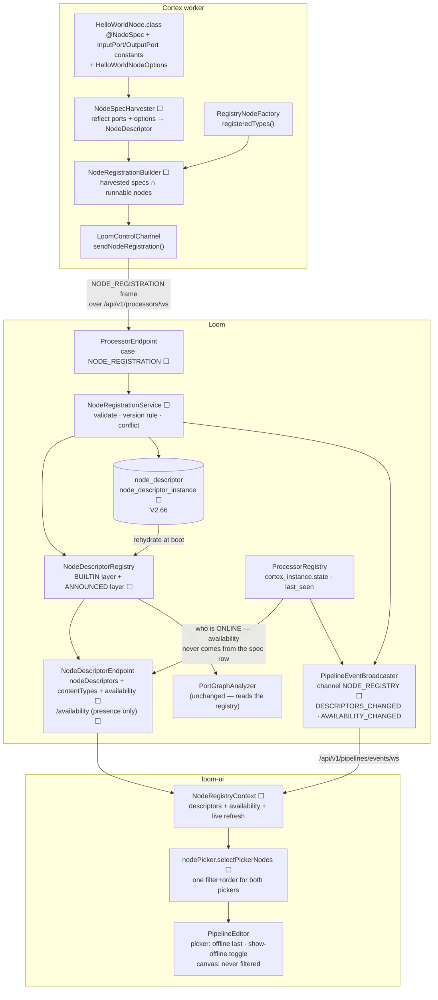
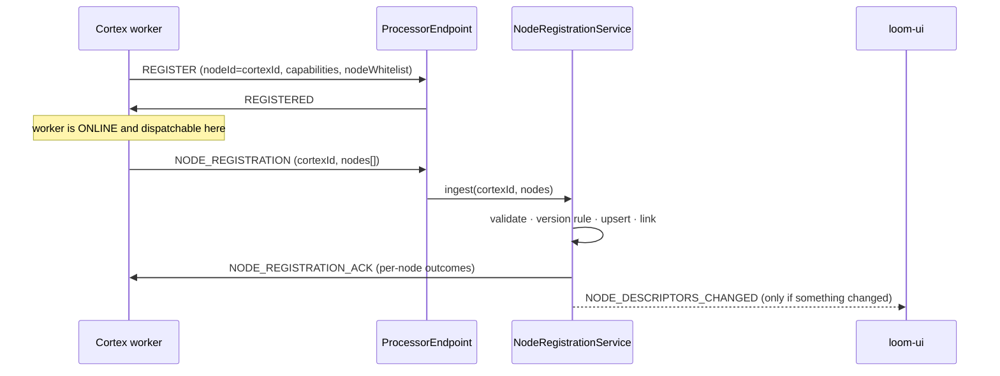

# Node Self-Registration — Cortex Announces Its Node Specs to Loom

> **Audience: AI coding agents.** One question: **how does a node that only exists on a Cortex worker
> become authorable in a Loom pipeline, without rebuilding Loom?**
>
> **Status: 🔵 PLANNED — nothing in this file is built.** Every code reference is either existing code
> being *extended* or a class that does not exist yet; §13 is the build order.
>
> **Scope split — do not duplicate these here:**
>
> | Topic | Spec |
> |---|---|
> | What a `NodeDescriptor` *is*, ports, content types, cardinality | [../features/pipeline/NODE_DATA_TYPES.md](../features/pipeline/NODE_DATA_TYPES.md) |
> | The shipped descriptor contract and its remaining gaps | [../concept/NODE_SCHEMA_CONCEPT.md](../concept/NODE_SCHEMA_CONCEPT.md) |
> | Node lifecycle, the `@StringKey` multibinding, worker whitelist/blacklist | [../features/nodes/NODES.md](../features/nodes/NODES.md) §5, §7 |
> | Engine, dispatch, definition JSON, `unsupportedNodeKinds` | [../features/pipeline/PIPELINE.md](../features/pipeline/PIPELINE.md) |
> | WebSocket framing, auth, reconnect | [../loom/WEBSOCKET.md](../loom/WEBSOCKET.md) |
> | The pipeline editor as built — components, canvas, validation, event surface | [../loom/ui/PIPELINE_EDITOR.md](../loom/ui/PIPELINE_EDITOR.md) |
> | Definition of done for a code change | [../guidelines/CODING.md](../guidelines/CODING.md) |
>
> **Source of truth is the code.** Where this file and the code disagree, the code wins — fix this
> file in the same change ([../guidelines/SPEC_RULES.md](../guidelines/SPEC_RULES.md)).

---

## 1. The problem, in one table

Two registries exist and they meet only by string name:

| | Lives in | Populated from | How it reaches Loom |
|---|---|---|---|
| **Runtime** — *can this node run?* | Cortex | `@IntoMap @StringKey` multibinding → `RegistryNodeFactory` | `registeredTypes()` → `nodeWhitelist` on REGISTER — **names only** |
| **Contract** — *what are its ports and parameters?* | Loom | `ServiceLoader<NodeDescriptorProvider>` at boot ([RESTModule.java:45-46](../../loom/services/rest/src/main/java/io/metaloom/loom/rest/dagger/RESTModule.java#L45-L46)) | it is already there — compiled into the Loom jar |

A node dropped onto a worker's classpath is therefore **runnable but unauthorable**: no palette entry,
and `PipelineGraphParser` rejects it as unknown before `PortGraphAnalyzer` sees the graph. The live
proof is [examples/cortex-custom-node](../../examples/cortex-custom-node): `hello-world` *is*
registered and dispatchable ([PipelineNodeFactoryModule.java:56](../../examples/cortex-custom/src/main/java/io/metaloom/cortex/cli/dagger/PipelineNodeFactoryModule.java#L56)),
and it still cannot be placed in the editor, because its contract lives nowhere Loom can read.

**This plan moves the contract to where the runtime already is.** The worker announces the specs for
the nodes it can execute; Loom adopts, persists and serves them.

Three facts make this cheaper than it looks:

- **`cortex/api` already depends on `loom-node-model`** ([cortex/api/pom.xml:37-39](../../cortex/api/pom.xml#L37-L39)),
  so `NodeDescriptor`, `PortSpec` and `NodeParameter` are already on every worker's classpath.
- **They are already plain Jackson beans** — `NodeDescriptorEndpoint` just `Json.encode`s them. The
  payload in §3 is what `GET /api/v1/pipeline/node-descriptors` returns today, plus `version`, with
  `kind` renamed to `nodeId`.
- **The editor's palette is already data-driven.** `NodeRegistryContext` fetches the whole registry
  over REST and the pickers render whatever comes back — there is no hardcoded node list in
  `loom-ui`. A descriptor that reaches that endpoint is authorable with no UI change. What the UI
  lacks is a *refresh* (it fetches once at mount) and any notion of whether a worker offering the node
  is currently up. That is §7.4, and it is the half a user actually sees.

---

## 2. Architecture



**The load-bearing idea:** spec knowledge is **durable**, worker presence is **live**. A node whose
last worker went offline keeps validating and saving; it simply cannot *run*, which
`unsupportedNodeKinds` already reports as a 503
([PipelineEndpointService.java:319-331](../../loom/services/rest/src/main/java/io/metaloom/loom/rest/service/impl/PipelineEndpointService.java#L319-L331)).
Deleting specs on disconnect would turn a 30-second worker restart into "your saved pipeline no longer
validates".

That split is why the two arrows into `NodeDescriptorEndpoint` come from **different** sources: the
contract from `NodeDescriptorRegistry`, the availability from `ProcessorRegistry`. It is also the whole
of §7.4's UI rule — the picker may reorder or hide by availability, the canvas never may.

---

## 3. The wire payload

A **new** `ProcessorMessageType.NODE_REGISTRATION`, worker → Loom, over the existing authenticated
processor socket.

```json
{
  "type": "NODE_REGISTRATION",
  "body": {
    "cortexId": "cortex-gpu-01",
    "nodes": [
      {
        "nodeId": "acme-nsfw",
        "version": "1.0.0-SNAPSHOT",
        "name": "NSFW Classifier",
        "description": "Classifies an image against the ACME NSFW taxonomy.",
        "icon": "shield",
        "category": "ANALYSIS",
        "inputPorts": [
          {
            "id": "media",
            "label": "Image",
            "contentType": "media/image",
            "cardinality": "ONE",
            "required": true,
            "description": "The image to classify"
          }
        ],
        "outputPorts": [
          {
            "id": "result",
            "label": "Result",
            "contentType": "struct/nsfw",
            "cardinality": "ONE",
            "required": true,
            "description": "Per-class probabilities"
          },
          {
            "id": "flag",
            "label": "Flag",
            "contentType": "scalar/boolean",
            "cardinality": "ONE",
            "required": false,
            "selective": true,
            "description": "True when any class exceeds the threshold"
          }
        ],
        "inputGroups": [],
        "outputGroups": [],
        "dynamicPorts": false,
        "parameters": [
          { "key": "enabled",   "type": "BOOLEAN", "defaultValue": true, "label": "Enabled" },
          { "key": "threshold", "type": "NUMBER",  "defaultValue": 0.8,  "label": "Threshold",
            "min": 0.0, "max": 1.0, "step": 0.05 },
          { "key": "modelPath", "type": "STRING",  "defaultValue": "models/acme-nsfw.onnx",
            "label": "Model Path", "description": "Worker-scoped; ignored in the pipeline JSON" }
        ],
        "defaultConcurrency": 1,
        "defaultMode": "PARALLEL",
        "defaultBlocking": true,
        "events": ["NODE_STATS"]
      }
    ]
  }
}
```

### 3.1 Envelope fields

| Field | Meaning |
|---|---|
| `cortexId` | The stable worker identity — the same value as `ProcessorRegistration.nodeId` (`CORTEX_NODE_ID`), the `UNIQUE` key on `cortex_instance.node_id`. Loom **must** verify it matches the id this socket registered with; a worker may not speak for another worker |
| `nodes` | The **complete** set of nodes this worker offers. There is no delta form: a node absent from a later frame is unlinked from this `cortexId` (§4.4) |

### 3.2 `nodeId` — the naming decision, and the trap it leaves

`nodeId` is the **node type** identifier: `ocr`, `script`, `sentiment`, `whisper`, `tts`. It is what
`NodeDescriptor.kind` is called today, what a definition's `nodes[].type` selects, and what
`RegistryNodeFactory` keys on.

🔴 **`nodeId` is already taken elsewhere — twice, meaning two other things.**

| Where | What `nodeId` means there |
|---|---|
| **This payload**, `NodeDescriptor`, `node_descriptor` | The **node type** — `whisper` |
| [NodeTask](../../loom-shared/pipeline-model/src/main/java/io/metaloom/loom/pipeline/model/NodeTask.java), `asset_node_result.node_id`, `daemon.py`'s `post_node_result` | The **graph-instance** id — `pn5`, or an author-chosen name. What lets two `translate` instances write two rows on one asset ([NODES.md §2](../features/nodes/NODES.md)) |
| `ProcessorRegistration.nodeId`, `ProcessorEventMessage.nodeId`, `Processor.nodeId` (`loom-ui/src/api/processors.ts:27`), `cortex_instance.node_id` | The **worker** id — `cortex-gpu-01`. This is what §3's envelope calls `cortexId` |

Inside this payload there is no instance and no worker, so `nodeId` is unambiguous *here*; across the
codebase it is not. Note the third row especially: `cortex_instance.node_id` and `node_descriptor.node_id`
are the *same column name in two tables meaning different things*, so a join written from memory will
be wrong and will still compile.

Adopted resolution:

- **This payload, `NodeDescriptor` and the new tables use `nodeId` for the type.**
- `NodeDescriptor.kind` is renamed to `nodeId`, with `@JsonAlias("kind")` on the way in and **both**
  fields emitted on the way out for one release, so the checked-in
  `website/static/pipeline-editor/node-descriptors.json`, `loom-ui/src/types/nodeDescriptors.ts` and
  the offline website editor do not all break in the same commit.
- **Follow-on, not this PR:** rename the instance-side field to `nodeInstanceId` (`NodeTask`,
  `asset_node_result.node_id`, the `/node-results` request model). Until that lands, a reader seeing
  `nodeId` must check which side of the wire they are on. Do not leave this undone quietly — it is in
  §13.
- The **worker**-side `nodeId` is left alone. `cortexId` in this payload names it correctly; renaming
  `ProcessorRegistration.nodeId` too would change the REGISTER frame every existing worker sends,
  including third-party ones, for a cosmetic gain.

Everything except `nodeId` and `version` is the existing `NodeDescriptor`, serialized exactly as
`NodeDescriptorEndpoint` already serves it. **Do not invent a second contract shape** — the value of
this design is that the wire, the REST response, the static snapshot and `PortGraphAnalyzer`'s input
are one type ([NODE_SCHEMA_CONCEPT.md §9](../concept/NODE_SCHEMA_CONCEPT.md): *"the contract already
ships; do not invent a second copy"*).

### 3.3 `version`

New on `NodeDescriptor`, and the only added field:

- Set explicitly via `@NodeSpec(version = …)` (§5).
- When unset, `NodeSpecHarvester` falls back to `nodeClass.getPackage().getImplementationVersion()` —
  the jar manifest's `Implementation-Version`, which Maven fills. That is how `1.0.0-SNAPSHOT` appears
  without an author writing it anywhere.
- `null` is legal and means *"an unversioned contract"*; it disables the skew detection in §4.2.

---

## 4. Loom-side semantics

### 4.1 Where it happens in the connection lifecycle



🔴 **Announcement must not gate dispatchability.** `ProcessorRegistry.register(...)` is a cheap
synchronous in-memory operation and stays that way; spec ingestion writes to Postgres. Putting ~115 KB
of JSON and a transaction on the REGISTER path would make a reconnect storm a database problem. The
window where a worker is online but its specs are not yet ingested is harmless: **dispatch reads
`nodeWhitelist`, never the descriptor registry.**

### 4.2 The version rule — which contract is *active*

A node may be offered by many workers, and during a rolling upgrade they will not agree. The active
contract is **the lowest version currently announced by any online worker that offers it.**

| Situation | Behaviour |
|---|---|
| One worker, one version | That contract is active. The common case |
| Two workers, same version, **identical** body | Active, both linked |
| Two workers, same version, **different** body | 🔴 `CONFLICT`. Keep the incumbent, refuse the newcomer's body, record and surface it. *Exception:* a `-SNAPSHOT` version is mutable by Maven convention — overwrite, log at INFO |
| Two workers, `1.0.0` and `1.1.0` | `1.0.0` is active; flagged `versionSkew` listing both |
| Version unparseable or `null` | Cannot be ordered. Keep the incumbent, flag `versionSkew`; never guess |

**Why lowest and not newest.** A graph is validated against the active contract and then dispatched to
*whichever* worker accepts the node. If `1.1.0` added an optional port and the editor let an author
wire it, an item landing on a `1.0.0` worker would silently ignore that input — a green run with the
wrong answer. The lowest announced version is the contract every worker in the fleet can honour, so a
saved graph is safe wherever it lands. The cost is that new ports appear only once the last old worker
is gone, which is visible and explainable; the alternative is invisible and is not.

Comparison is dot-separated numeric segments, any `-qualifier` sorting **below** the same numeric
prefix (`1.0.0-SNAPSHOT` < `1.0.0`). ~30 lines in a `NodeVersions` helper — do **not** add a Maven
artifact-resolution dependency for this.

### 4.3 Built-in nodes always win

Loom's own `ServiceLoader` descriptors are the `BUILTIN` layer and are never overwritten. An announced
spec for a built-in `nodeId` is **ignored for its content**, but its `version` is still recorded
against the instance — that is how an operator sees which cortex build a worker runs. The rejection
must be reported (§4.5), not swallowed: an author who edits `whisper`'s ports in a fork and sees no
effect will otherwise lose an afternoon.

This closes gap C of [NODE_SCHEMA_CONCEPT.md §0.1](../concept/NODE_SCHEMA_CONCEPT.md) — "a descriptor
is not a registration" — **structurally** for announced nodes: the spec exists only because a worker
that can run it said so, so `registered: false` is unrepresentable. It does not fix the two built-in
orphans (`facedescription`, `loom-fetch`); those stay a separate cleanup.

### 4.4 Lifetime — link, unlink, never delete

- Ingest **replaces** the link set for that `cortexId`: nodes in the frame are linked, previously
  linked and now absent are unlinked.
- A worker going offline unlinks nothing. Presence is `cortex_instance.state`.
- A spec with **zero online providers** is served with `available: false`. It still validates, still
  saves, still recovers.
- Rows are never deleted automatically. Deletion is an explicit admin action (§8), because a saved
  pipeline referencing a deleted node stops parsing.

### 4.5 Reporting back

```json
{
  "type": "NODE_REGISTRATION_ACK",
  "body": {
    "cortexId": "cortex-gpu-01",
    "accepted": ["acme-nsfw"],
    "rejected": [
      { "nodeId": "whisper", "reason": "BUILTIN",
        "message": "Built-in descriptor wins; announced copy ignored" },
      { "nodeId": "acme-bad", "reason": "INVALID_PORT_ID",
        "message": "outputPorts[0].id 'Result Set' does not match ^[a-z0-9][a-z0-9_]{0,62}$" }
    ]
  }
}
```

`reason` vocabulary: `BUILTIN`, `CONFLICT`, `INVALID_PORT_ID`, `INVALID_CONTENT_TYPE`,
`INVALID_NODE_ID`, `TOO_LARGE`, `DUPLICATE_NODE_ID`, `ID_MISMATCH`.

### 4.6 Content types are implicit

The payload has no `contentTypes` block, by design. `ContentTypeLattice.isAssignable` parses
`family/subtype` **structurally** and never consults a registry, and `ContentTypeRegistry.isKnown()`
is referenced only from tests — so `struct/nsfw` validates and connects the moment it is announced.

Loom therefore **derives** the vocabulary: for every announced `contentType` absent from
`ContentTypeRegistry.all()`, synthesize a `ContentType` (family = segment before `/`, label =
title-cased subtype, `wildcard` = subtype is `*`) and merge it into `/api/v1/pipeline/content-types`.
The editor already falls back to a default handle colour for an unknown family
([contentTypes.ts:72-86](../../loom-ui/src/features/pipeline/contentTypes.ts#L72-L86)).

The cost is a machine-derived label ("Nsfw"). If that becomes annoying, add an **optional**
`contentTypes` array later — additive, no format bump.

### 4.7 Dynamic ports — the one genuinely unsolved case

A `dynamicPorts: true` node resolves its real ports from its options through a `NodePortResolver`
([NodeDescriptorRegistry.java:88-102](../../loom-shared/node-model/src/main/java/io/metaloom/loom/nodes/spec/NodeDescriptorRegistry.java#L88-L102)).
For a custom node **that resolver class is only on the worker**, so neither Loom nor the TypeScript
mirror in `loom-ui/src/features/pipeline/portResolvers.ts` can run it.

**v1 rule: an announced spec with `dynamicPorts: true` is accepted, but resolves to its static port
lists.** It is authorable; it just does not gain per-option ports. Reject nothing — a node that
degrades to its declared ports is more useful than one that cannot be placed.

The real fix is gap A of [NODE_SCHEMA_CONCEPT.md](../concept/NODE_SCHEMA_CONCEPT.md), which this plan
promotes from "nice to have" to "required for full custom-node support":
`POST /api/v1/pipeline/node-descriptors/:nodeId/resolve-ports`, proxied over the processor socket to a
providing worker and cached by `(nodeId, optionsHash)`. Tracked separately; **do not** bundle it into
the registration PR.

---

## 5. Where the node spec comes from

Announcing a spec presumes the worker *has* one. Today it does not: the contract lives in
`loom-shared/node-model/…/<Kind>DescriptorProvider.java`, physically separated from the node it
describes, and `NodePortConformanceTest` exists solely to police the gap between them.

### 5.1 What is already declared in Java, and what is not

The decisive observation — a node **already** declares its ports as typed constants:

```java
// cortex/nodes/sentiment/core/.../SentimentNode.java:67-71
public static final InputPort<String>  IN_TEXT   = InputPort.one("text", ContentTypeRegistry.TEXT_ANY, String.class);
public static final OutputPort<String> OUT_LABEL = OutputPort.one("label", ContentTypeRegistry.SCALAR_STRING, String.class);
public static final OutputPort<Double> OUT_SCORE = OutputPort.one("score", ContentTypeRegistry.SCALAR_NUMBER, Double.class);
```

```java
// SentimentNodeOptions.java:28-43
public static final String KEY = "sentiment";
private String sentimentHost = "localhost";
private int    sentimentPort = 9110;
private int    maxChars      = 200_000;
```

| Descriptor field | Derivable? | From what |
|---|---|---|
| `inputPorts`/`outputPorts`: `id`, `contentType`, `cardinality`, value type | ✅ **exactly** | the `InputPort`/`OutputPort` constants — the same objects the node executes against |
| `parameters`: `key`, `type`, `defaultValue` | ✅ | fields of a **default-constructed** options instance |
| `parameters[].values` for an enum | ✅ | `Class.getEnumConstants()` |
| `nodeId` | ✅ | `node.name()` / the `@StringKey` binding |
| `label`, `description`, `icon`, `category` | ❌ | prose — must be authored |
| `min`, `max`, `step`, parameter ordering | ❌ | intent, not type |
| `inputGroups`/`outputGroups` (XOR), `required`, `selective` | ⚠️ partly | `PortSpec` carries them, the port constants do not today |

So roughly **80 % is derivable with zero drift potential, and 20 % is irreducibly authored.** Every
option below is really a choice of *where the 20 % lives* and *when the 80 % is computed*.

### 5.2 The options

| | Approach | Verdict |
|---|---|---|
| **a** | **Builder API in the node's own module** — move `SentimentDescriptorProvider` next to `SentimentNode` and keep hand-writing it | 🟡 **Necessary but insufficient.** It fixes *location* (the spec ships with the node, which is what announcement needs) and fixes nothing about *drift* — the ports are still typed twice, so `NodePortConformanceTest` must live forever. Adopt the relocation; reject the hand-writing |
| **b** | **Runtime reflection** over the node class and its options class | ✅ **The core of the recommendation.** Reads real values, including instance-field defaults. Its one hazard is class loading (§5.4) |
| **c** | **`NodeSpecProvider` interface implemented by the node**, read through an instance method | ❌ **As an instance method, actively harmful.** [NODES.md §5.1](../features/nodes/NODES.md) keeps every node behind a Dagger `Provider` precisely so booting a worker does not construct nodes that pull heavy native transitive deps. Calling `node.spec()` to build a registration would instantiate all 34. Acceptable only as a `static` method or on the node's Dagger module — at which point it is (a) with extra ceremony |
| **d** | **Maven plugin doing source inspection** | ❌ **As source parsing, no.** Recovering `InputPort.one("text", TEXT_ANY, String.class)` means evaluating an initializer expression AST with constant folding across `ContentTypeRegistry` — fragile, and it re-implements what the JVM does for free. ✅ **As a build-time host for (b)** — see the growth path |
| **e** | **⭐ Reflective harvest + annotations for the prose** | ✅ **Recommended.** (b) supplies everything typed; annotations on the *same* declarations supply the 20 % that is not. One source of truth, and `NodePortConformanceTest` can be **deleted** rather than maintained |
| **f** | **Declarative resource per node** (`<nodeId>.node.json` in the module's resources) | ❌ This is Concept 1 of [NODE_SCHEMA_CONCEPT.md](../concept/NODE_SCHEMA_CONCEPT.md), already dropped: it trades `javac`-checked content-type constants for a second file that drifts |

### 5.3 The recommendation, concretely

```java
@NodeSpec(nodeId = "sentiment", name = "Sentiment Analysis", icon = "mood", category = ANALYSIS,
    description = "Score the polarity of text produced by an upstream node. German and English.")
public class SentimentNode extends AbstractMediaNode<SentimentNodeOptions> {

    @PortDoc(label = "Text", description = "The prose to score — a transcript, caption or OCR result")
    public static final InputPort<String> IN_TEXT = InputPort.one("text", TEXT_ANY, String.class);
    ...
}

public class SentimentNodeOptions extends AbstractNodeOptions<SentimentNodeOptions> {
    @ParamDoc(label = "Sidecar Port", description = "Port of the /v1/sentiment sidecar", min = 1)
    private int sentimentPort = 9110;
}
```

`NodeSpecHarvester.harvest(Class<? extends FilesystemNode<?, ?>>) → NodeDescriptor` reflects the port
constants and a default-constructed options instance, then overlays the annotations.

**Module placement matters and is easy to get wrong.** `InputPort`/`OutputPort` live in `cortex/api`;
`NodeDescriptor` lives in `loom-shared/node-model`, which `cortex/api` depends on. The dependency must
not invert — so **the annotations and the harvester go in `cortex/api`** (`io.metaloom.cortex.api.node.spec`),
producing node-model types. Loom never runs the harvester; it only consumes its output.

**One source, two consumers:**

```
@NodeSpec-annotated node classes
        │  NodeSpecHarvester
        ├──────────────▶ runtime  → NODE_REGISTRATION → Loom's ANNOUNCED layer
        └──────────────▶ build    → node-descriptors.json → Loom's BUILTIN seed
                                                          + the offline website editor
```

The build-time arm is `NodeDescriptorGenerator`, which already writes that file — it switches from
reading `ServiceLoader<NodeDescriptorProvider>` to reading the harvest. That is what lets a fresh Loom
install validate demo pipelines before any worker has ever connected, without hand-written providers
surviving anywhere.

### 5.4 🔴 The class-loading hazard, and the growth path

Reflecting a class runs its static initializers. `FingerprintNode` has:

```java
static { Video4j.init(); }   // FingerprintNode.java:77
```

So a naive startup harvest loads native libraries for every node on every worker — including nodes
that worker will never run. Three mitigations, in order of preference:

1. **Harvest only what the worker registered.** `NodeRegistrationBuilder` already intersects with
   `registeredTypes()`; a whitelisted worker loads only its own nodes, which it would load anyway on
   the first task.
2. **Move port constants out of the node class** into a `<Name>Ports` holder with no static
   initializer, and harvest that. Cheap, and it makes the constants importable without the node.
3. **Do the harvest at build time** — a `loom-node-spec-maven-plugin` that runs the *same reflective
   harvester* in an `exec`-like goal and writes `META-INF/loom/node-spec/<nodeId>.json` into the jar.
   Startup then reads a resource: no reflection, no static init, no native load. This is option (d)
   done right — reflection inside the plugin, never source parsing.

**Ship 1 first, add 3 when startup cost or native loading is measured as a problem.** Node authors see
no difference: the annotations and the harvester are identical either way, only the invocation site
moves.

### 5.5 The sweep — author the spec for every existing node

34 node ids across 29 modules currently have hand-written providers in `loom-shared/node-model`. Each
must gain `@NodeSpec`/`@PortDoc`/`@ParamDoc` in its own module, and its provider must be deleted.

**This sweep is the acceptance test for §5.3, and it is self-verifying:** the existing hand-written
descriptor is the *golden fixture*. If `NodeSpecHarvester.harvest(WhisperNode.class)` does not equal
`new WhisperDescriptorProvider().getDescriptors().get(0)` field for field, either the annotations are
incomplete or the harvester is wrong. Nothing is judged by eye.

**Run it with subagents, one node module per agent**, after §5.3 lands and after a hand-done pilot
(use `sentiment` — one input, three outputs, six parameters, no groups, no dynamic ports; `md5` is too
simple to shake out the template, and `whisper` has an XOR group that the pilot should not also be
debugging). Per-agent brief:

- Inputs: the module path, its `<Kind>DescriptorProvider`, `NODES.md` §3/§6 rows for that node.
- Work: annotate the node class, its port constants and its options fields; **do not** invent prose —
  copy the existing `label`/`description` verbatim, since they are already customer-facing.
- Done when: the golden-fixture equality test passes, `mvn -pl cortex/nodes/<name>/core test -o` is
  green, and the provider class is deleted.
- Report back: any field the harvester could not reproduce. Those are template gaps, and the *template*
  gets fixed once rather than worked around 34 times.

Batch ~6 concurrent; the modules are independent. Two shared files serialize the sweep and must be
edited once at the end, not per agent: `META-INF/services/…NodeDescriptorProvider` and
`NodeDescriptorServiceLoaderTest`'s two count literals (27 providers / 37 ids — the assertion failing
is the tripwire working, [NODES.md §5.2](../features/nodes/NODES.md)). `NodePortConformanceTest` is
deleted last, once no node has two sources left to compare.

Nodes needing individual attention rather than the batch: `llm`, `vlm`, `script`, `filter` (dynamic
ports — the resolver stays hand-written, §4.7), `hash` (four ids on one options `KEY`), `dedup` (two
`@StringKey`s onto one class), and the sources (`SourceDescriptorProvider` declares four ids).

---

## 6. Persistence

New migration **`V2.66__add_node_descriptor.sql`** (latest existing is `V2.65`; confirm before writing,
and re-run `./setup-pool.sh` afterwards — [CLAUDE.md](../../.claude/CLAUDE.md)).

```sql
CREATE TABLE "node_descriptor" (
  "node_id"       varchar NOT NULL,   -- 'ocr', 'whisper', 'acme-nsfw'
  "version"       varchar,
  "descriptor"    jsonb   NOT NULL,
  "body_hash"     varchar NOT NULL,
  "source"        varchar NOT NULL,   -- 'ANNOUNCED' (BUILTIN is never persisted)
  "status"        varchar NOT NULL,   -- 'ACTIVE' | 'CONFLICTED'
  "first_seen"       timestamp WITHOUT TIME ZONE NOT NULL DEFAULT (now()),
  "last_announced"   timestamp WITHOUT TIME ZONE NOT NULL DEFAULT (now()),
  ...audit columns as in V2.33...
  CONSTRAINT "node_descriptor_pkey" PRIMARY KEY ("node_id"),
  CONSTRAINT "node_descriptor_source_check" CHECK ("source" IN ('ANNOUNCED')),
  CONSTRAINT "node_descriptor_status_check" CHECK ("status" IN ('ACTIVE', 'CONFLICTED'))
);

CREATE TABLE "node_descriptor_instance" (
  "node_id"       varchar NOT NULL,
  "instance_uuid" uuid    NOT NULL,
  "version"       varchar,
  "body_hash"     varchar NOT NULL,
  "last_announced" timestamp WITHOUT TIME ZONE NOT NULL DEFAULT (now()),
  CONSTRAINT "node_descriptor_instance_pkey" PRIMARY KEY ("node_id", "instance_uuid"),
  CONSTRAINT "node_descriptor_instance_fkey"
    FOREIGN KEY ("instance_uuid") REFERENCES "cortex_instance" ("uuid") ON DELETE CASCADE
);

CREATE INDEX "idx_node_descriptor_instance_node_id" ON "node_descriptor_instance" ("node_id");
```

🔴 **The column is `last_announced`, not `last_seen`, and the distinction is the whole reason §7's
availability model works.** A worker announces **once**, right after `REGISTERED`, and then stays
connected for days. `last_announced` therefore stops moving while the worker is perfectly healthy. The
column that keeps moving is `cortex_instance.last_seen`, which the heartbeat updates.

A UI that derives "is this node online?" from the descriptor's own timestamp would grey out every node
in the palette roughly one heartbeat interval after the fleet connected, and the bug would look like a
worker problem. Naming the column `last_seen` — matching `cortex_instance.last_seen` a join away, and
matching the `lastSeen` the UI actually wants — is what would cause someone to write that. So: the
descriptor row records **when the contract last arrived**; liveness is always read from
`cortex_instance` through `node_descriptor_instance`.

- **`node_descriptor_instance` is what makes §4.2 computable** — it holds each worker's own claimed
  version and body hash, so the active contract is a query, not a cached decision that can rot.
- **`BUILTIN` specs are never persisted.** They are recomputed from the classpath at every boot;
  writing them would create a stale copy that outlives a Loom downgrade.
- `descriptor` is the full announced JSON, so rehydrating at boot needs no worker.
- Deliberately *not* modelled: a version-history table. `node_descriptor_instance` says who claims what
  now, and history nothing reads is retention debt
  ([PIPELINE.md §9.2](../features/pipeline/PIPELINE.md)).
- Shape follows [V2.33__add_cortex_instance.sql](../../loom/db/flyway/src/main/resources/db/migration/V2.33__add_cortex_instance.sql),
  including a child table over a JSONB blob so one node id is queryable across all workers.
- Regenerate jOOQ after the migration (`loom/db/jooq/generate.sh`).

---

## 7. REST and UI surface

### 7.1 The list response — contract and availability are separate blocks

`GET /api/v1/pipeline/node-descriptors` keeps its `{nodeDescriptors, contentTypes}` shape and gains a
**third sibling block**:

```json
{
  "nodeDescriptors": [ { "nodeId": "acme-nsfw", "kind": "acme-nsfw", "version": "1.0.0-SNAPSHOT", "…": "…" } ],
  "contentTypes":    [ { "id": "struct/nsfw", "label": "Nsfw", "family": "struct", "wildcard": false } ],
  "availability": {
    "whisper":   { "source": "BUILTIN",   "available": true,  "lastSeen": "2026-08-03T09:14:02Z",
                   "providedBy": ["cortex-gpu-01", "cortex-gpu-02"] },
    "acme-nsfw": { "source": "ANNOUNCED", "available": false, "lastSeen": "2026-07-29T22:41:10Z",
                   "lastAnnounced": "2026-07-29T22:40:58Z", "providedBy": [] }
  }
}
```

**Why a sibling block and not fields on each descriptor.** §12 forbids a second contract shape: the
object the worker announces, the object Loom serves, the object the static snapshot holds and the
object `PortGraphAnalyzer` consumes are *one type*. `available` on `NodeDescriptor` breaks that in
both directions — a worker could announce `available: true` about itself, and every consumer of the
type would carry a field that is meaningless outside one HTTP response. `nodeId` and `version` **are**
contract and do belong on the descriptor. `source`, `available`, `lastSeen`, `providedBy` are runtime
state about the fleet and belong beside it, keyed by `nodeId`.

| Field | Meaning |
|---|---|
| `source` | `BUILTIN` \| `ANNOUNCED` — where the contract came from |
| `available` | **At least one linked `cortex_instance` is in state `ONLINE`.** Not a timestamp comparison |
| `lastSeen` | `max(cortex_instance.last_seen)` over the linked workers — heartbeat-driven, so it keeps moving. For an available node it is "seconds ago"; for an unavailable one it is how long ago the last provider was up |
| `lastAnnounced` | When this contract last arrived over the socket. Diagnostic only — see the §6 warning against confusing the two |
| `providedBy` | Worker ids currently offering it. Answers "why can't I run this?" in one word |

`availability` is **absent** from the checked-in `website/static/pipeline-editor/node-descriptors.json`.
The UI must treat a missing block, and a missing entry within it, as `available: true` — the offline
website editor has no fleet and every node in it is authorable.

🔴 **`providedBy` is gated; the rest is not.** The descriptor endpoints are called **without auth**
today ([PIPELINE_EDITOR.md §8](../loom/ui/PIPELINE_EDITOR.md)) because the editor needs them before any
token is in hand. `available` and `lastSeen` are safe to serve that way. `providedBy` leaks the fleet's
internal host identities, so it is emitted **only** when the request carries a token with
`READ_CORTEX_INSTANCE`, and omitted otherwise. The UI must render a useful message without it.

Implementation note: [NodeDescriptorEndpoint.java:52-53](../../loom/services/rest/src/main/java/io/metaloom/loom/rest/endpoint/impl/NodeDescriptorEndpoint.java#L52-L53)
builds this response by **string-concatenating** `Json.encode` fragments. Adding a third block by
appending another `+ ",\"availability\":"` works and is the smallest diff, but three hand-spliced
blocks is where a missing comma ships. Introduce a real response model instead.

### 7.2 A presence-only endpoint and two distinct events

Presence changes far more often than contracts do — every worker connect, disconnect, restart and
scale event. The full list response is **114,925 bytes** today
(`website/static/pipeline-editor/node-descriptors.json`, 34 kinds). Re-fetching all of it on every
worker state change, in every open browser tab, to learn that one boolean flipped is the obvious thing
to build and the wrong one.

| Addition | Shape |
|---|---|
| `GET /api/v1/pipeline/node-descriptors/availability` | Just the `availability` map above. Small, cheap, same gating rule for `providedBy` |
| `NODE_DESCRIPTORS_CHANGED` (event) | The descriptor **set or contract** changed — a new node id appeared, a spec's `body_hash` changed, one was deleted. The client re-fetches the full list |
| `NODE_AVAILABILITY_CHANGED` (event) | **Presence only.** Carries the changed entries inline: `{ channel: "NODE_REGISTRY", type: "NODE_AVAILABILITY_CHANGED", availability: { "acme-nsfw": { available: true, lastSeen: "…", providedBy: ["cortex-gpu-01"] } } }`. The client patches in place and fetches nothing |

Both ride the **existing** UI socket (`/api/v1/pipelines/events/ws` → `PipelineEventBroadcaster`), which
already multiplexes two channels — pipeline frames carry no `channel`, processor frames carry
`channel: "PROCESSOR"` ([pipelineEvents.ts:31](../../loom-ui/src/api/pipelineEvents.ts#L31)). Registry
frames add a third, `channel: "NODE_REGISTRY"`. No new socket, no new reconnect/backoff logic.

Emit `NODE_DESCRIPTORS_CHANGED` **only when the merged registry actually changed** — a worker
reconnecting and re-announcing an identical spec set is the common case and must be silent, or every
rolling restart storms every open editor with a 115 KB re-fetch.

### 7.3 Admin surface

The cortex-instance page lists each worker's nodes with versions and shows `CONFLICTED` / `versionSkew`
badges. A conflict nobody can see is a conflict nobody will fix. `CortexView` already holds the pieces:
it maps `descriptors` to node ids at
[CortexView.tsx:382](../../loom-ui/src/features/cortex/CortexView.tsx#L382) for the whitelist editor, and
already renders per-worker `lastSeen` as a live relative time.

### 7.4 The loom-ui task — the palette must reflect the fleet

Everything above is inert until the editor uses it. This section is the UI half of the plan, and it is
the half a user actually sees: **a Python worker connects and its node is in the picker within a
second, without a page reload.**

### 7.4.1 What already works, and the one line that stops it

`NodeRegistryContext` already fetches the whole registry from the REST API and already serves it to the
editor — the palette is *already* data-driven, and a node added to `node-descriptors` today needs no UI
change to become authorable. The gap is narrower than it looks:

| Fact | Where | Consequence |
|---|---|---|
| The registry is fetched in a mount `useEffect` and never again | [NodeRegistryContext.tsx:57-59](../../loom-ui/src/context/NodeRegistryContext.tsx#L57-L59) | A worker that connects after the tab opened is invisible until F5. `refresh` exists and **nothing calls it** |
| Lookup is by `kind` | [:62](../../loom-ui/src/context/NodeRegistryContext.tsx#L62), and `d.kind` in the picker and `CortexView` | Follows the §3.2 rename behind the `kind` alias |
| No notion of availability at all | everywhere | Nothing to grey out, sort or hide yet |

So the UI work is **refresh + availability**, not "make the palette dynamic". It already is.

### 7.4.2 The filter predicate is written three times

The add-node search bar and the `N`-key command palette are separate components, and the *same* filter
expression appears in **three** places:

- [PipelineEditor.tsx:2079](../../loom-ui/src/features/pipeline/PipelineEditor.tsx#L2079) — `CommandPaletteContent`'s list
- [PipelineEditor.tsx:3229](../../loom-ui/src/features/pipeline/PipelineEditor.tsx#L3229) — the search bar's **`onKeyDown`**, recomputed inline
- [PipelineEditor.tsx:3280](../../loom-ui/src/features/pipeline/PipelineEditor.tsx#L3280) — the search bar's **rendered list**, recomputed inline again

🔴 The last two are indexed by the same `addNodeIdx`. They agree today only because the expressions are
character-identical. Sort offline nodes to the bottom in the rendered list and forget the `onKeyDown`
copy, and `↑`/`↓` move the highlight down a list ordered one way while `Enter` adds
`filtered[addNodeIdx]` from a list ordered another. The user watches the highlight land on *Whisper*,
presses Enter, and gets *Dedup*. Nothing throws; nothing is logged.

**Extract one selector before touching any ordering** — `selectPickerNodes(descriptors, availability,
{query, showOffline})` in `features/pipeline/nodePicker.ts`, returning the final ordered array. Both
call sites consume it; the `onKeyDown` copy is deleted. This is pure logic with no DOM, so it is a
node-env vitest, not a Playwright spec.

### 7.4.3 Ordering and the toggle

Default ordering in the picker: **available first**, then by category and name as today; unavailable
nodes fall to the bottom, dimmed, with a caption saying why.

- With `providedBy`: *"offline — last provided by cortex-gpu-01, 3d ago"*
- Without it (unauthenticated, §7.1): *"no worker currently offers this node"*

`showOffline` is a toggle in the picker, persisted in `localStorage`, **default on** (offline nodes
visible but sorted last). Off hides them entirely. Default-on matters: a fleet that is entirely down
would otherwise present an empty picker with no explanation, which reads as a broken UI rather than a
stopped fleet. When the toggle hides entries, say so — *"3 offline nodes hidden"* with the toggle
next to it.

🔴 **The toggle governs the picker only. It must never touch the canvas.** A saved pipeline containing
`acme-nsfw` renders that node with its full ports whether or not a worker is up, because
`nodeConnectors` returns `NO_PORTS` for a descriptor it cannot find
([PipelineEditor.tsx:158](../../loom-ui/src/features/pipeline/PipelineEditor.tsx#L158)) — and a node with
no ports drops every edge attached to it. Filtering the canvas by availability would silently redraw a
user's saved graph as disconnected boxes, and saving from that state would persist the damage. This is
also why §4.4 never deletes a descriptor row: durable contract, live availability.

Running an unavailable node is already handled and needs no UI rule —
`PipelineEndpointService.unsupportedNodeKinds` returns **503** with a message, and `handleRun` already
surfaces `dispatched:false` as an info toast.

### 7.4.4 Live updates

`NodeRegistryContext` subscribes to the registry channel (§7.2) alongside its initial fetch:

- `NODE_AVAILABILITY_CHANGED` → merge the entries into `availability` state. No fetch.
- `NODE_DESCRIPTORS_CHANGED` → call the existing `refresh()`.

Debounce the refresh (~500 ms): a fleet restart emits one frame per worker and each would otherwise
trigger its own 115 KB GET.

The context value grows `availability`, `isAvailable(nodeId)` and `getAvailability(nodeId)`. Keep
`descriptors` exactly as it is — every existing consumer (`nodeConnectors`, `validatePorts`, the
sidebar, `PipelineVersionDiff`) reads the contract and must **not** become availability-aware.

### 7.4.5 Icons for third-party nodes

`ICON_MAP` ([PipelineEditor.tsx:86-119](../../loom-ui/src/features/pipeline/PipelineEditor.tsx#L86)) is a
compile-time map of imported MUI components. A custom node announcing `"icon": "shield"` gets no
match — and that is already handled: `resolveNodeIcon` falls back to the category icon, then to
`MemoryOutlined` ([:121](../../loom-ui/src/features/pipeline/PipelineEditor.tsx#L121)).

So a third-party node renders sensibly with **no** UI change, but **cannot ship its own icon** — the
name is only a key into a fixed map. Document that in the custom-node guide (§9): the value must be one
of the known keys, and anything else silently becomes the category default. Do not "fix" this by
accepting a URL or inline SVG from an announcement — that is arbitrary third-party content rendered in
the editor's DOM. If custom icons are wanted later, extend `ICON_MAP` from a vetted icon set.

### 7.4.6 Where each edit lands

| File | Change |
|---|---|
| [types/nodeDescriptors.ts](../../loom-ui/src/types/nodeDescriptors.ts) | `nodeId` on `NodeDescriptor` (`kind` kept `@deprecated` for one release, as `FLOAT`/`STRING_LIST` already are), `version`, new `NodeAvailability`, `availability?` on `NodeDescriptorsResponse` |
| [api/nodeDescriptors.ts](../../loom-ui/src/api/nodeDescriptors.ts) | `fetchNodeAvailability()` |
| [api/pipelineEvents.ts](../../loom-ui/src/api/pipelineEvents.ts) | `channel: "NODE_REGISTRY"` frames + `subscribeNodeRegistryEvents` |
| [context/NodeRegistryContext.tsx](../../loom-ui/src/context/NodeRegistryContext.tsx) | availability state, socket subscription, debounced refresh, `isAvailable` |
| `features/pipeline/nodePicker.ts` ⬜ | The single `selectPickerNodes` selector (§7.4.2) |
| [features/pipeline/PipelineEditor.tsx](../../loom-ui/src/features/pipeline/PipelineEditor.tsx) | Both pickers consume the selector; offline row styling; the toggle |
| [features/cortex/CortexView.tsx](../../loom-ui/src/features/cortex/CortexView.tsx) | `d.kind` → `d.nodeId`; per-worker node list (§7.3) |
| [i18n/locales/en.json](../../loom-ui/src/i18n/locales/en.json) + `de.json` | Toggle label, offline caption, hidden-count string. The editor is fully i18n'd — **both** files, or the German UI shows raw keys |

---

## 8. Security and validation

An announced spec is **untrusted input from whoever holds a processor token**. The socket is
JWT-authenticated ([ProcessorEndpoint.java:108-111](../../loom/services/rest/src/main/java/io/metaloom/loom/rest/endpoint/impl/ProcessorEndpoint.java#L108-L111)),
which is necessary and not sufficient.

| Check | Rule |
|---|---|
| Identity | `cortexId` must equal the id this socket registered with → `ID_MISMATCH` |
| Node id | Non-blank, `^[a-z0-9][a-z0-9-]{0,63}$` → `INVALID_NODE_ID` |
| Shadowing | A `BUILTIN` node id is never overwritten → `BUILTIN` |
| Duplicates | Two entries with the same `nodeId` in one frame → `DUPLICATE_NODE_ID` |
| Port ids | Must match `PortSpec.ID_PATTERN` (`^[a-z0-9][a-z0-9_]{0,62}$`), unique per side → `INVALID_PORT_ID` |
| Content types | `family/subtype`, both segments non-empty → `INVALID_CONTENT_TYPE` |
| Groups | Every `port.group` must name a declared group on the same side |
| Size caps | ≤ 256 nodes per frame, ≤ 64 ports and ≤ 256 parameters per node, ≤ 4 MiB frame → `TOO_LARGE` |
| Permissions | Reading the registry stays ungated (the editor needs it). Deleting a row requires `MANAGE_CORTEX_INSTANCE` |

**Reject per node, not per frame.** One malformed custom node must not cost a worker its other 34
specs.

---

## 9. Examples — every worker implementation must announce

The three modules under [examples/](../../examples) are customer-facing and are the first thing a
custom-node author copies. All three must ship the announcement, or the documented path produces a node
that runs but cannot be authored — the exact defect this plan removes.

| Example | Change |
|---|---|
| [cortex-custom-node](../../examples/cortex-custom-node) | Annotate `HelloWorldNode` with `@NodeSpec(nodeId = "hello-world", …)`, `@PortDoc` on `IN_HASH`/`OUT_FILE_SIZE`/`OUT_WORD_COUNT`, `@ParamDoc` on the options fields. This is the **reference for how a third party declares a spec**, so it must show the annotations, not a hand-built descriptor |
| [cortex-custom](../../examples/cortex-custom) | Nothing structural: `hello-world` is already registered explicitly at [PipelineNodeFactoryModule.java:56](../../examples/cortex-custom/src/main/java/io/metaloom/cortex/cli/dagger/PipelineNodeFactoryModule.java#L56), and the harvest + announcement ride along with the shared `LoomControlChannel`. Verify end to end that it reaches the palette, and say so in the README |
| [cortex-python](../../examples/cortex-python) | Send `NODE_REGISTRATION` after `REGISTERED` (§9.1) |

Also update the [examples/README.md](../../examples/README.md) module table and the
`cortex-custom-node` README: "your node appears in the pipeline editor automatically" is a headline
feature and is currently absent because it was not true.

### 9.1 `examples/cortex-python/daemon.py`

The Python worker has no Java classes to reflect, which is the point: **the wire format is
language-agnostic and the spec is hand-written there.** That makes it the clearest demonstration of the
payload.

- Add a `NODE_SPECS` module-level constant holding the §3 `nodes[]` list for `py-hello`, keyed by the
  ids already in `Config.node_kinds` ([daemon.py:99-107](../../examples/cortex-python/daemon.py#L99-L107)).
- Send it from `_on_connected` **after** the `REGISTERED` reply arrives, not inside `_send_register`
  ([daemon.py:412-424](../../examples/cortex-python/daemon.py#L412-L424)) — mirroring §4.1, and so the
  example teaches the right ordering.
- Handle `NODE_REGISTRATION_ACK` in `_handle_message` and **log every rejection**. A silent ack teaches
  the wrong thing to everyone who copies the file.
- Keep `nodeWhitelist` on REGISTER. It is what dispatch reads; the spec announcement does not replace it.

⚠️ **Do not rename the daemon's REST payload fields.** `post_node_result` sends `nodeKind` and `nodeId`
to `/api/v1/assets/:uuid/node-results` ([daemon.py:290-305](../../examples/cortex-python/daemon.py#L290-L305)),
where `nodeId` already means the *instance* id. That is the existing ledger API and it is out of scope
here — only the new `NODE_REGISTRATION` payload uses `nodeId` for the type. Renaming both in one commit
is how the §3.2 trap gets sprung.

---

## 10. Configuration

| Variable | Default | Meaning |
|---|---|---|
| `CORTEX_NODE_SPEC_ANNOUNCE` | `true` | Worker sends `NODE_REGISTRATION` after `REGISTERED`. Off ⇒ pre-registration behaviour exactly |
| `LOOM_NODE_SPEC_ACCEPT_ANNOUNCED` | `true` | Loom ingests announcements. Off ⇒ frames are acked with everything rejected and only `BUILTIN` specs are served. The kill switch for a locked-down deployment |

Existing variables this interacts with — do not redefine them here, see
[../cortex/CONFIGURATION.md](../cortex/CONFIGURATION.md) and [../features/nodes/NODES.md §7](../features/nodes/NODES.md):

| Variable | Interaction |
|---|---|
| `CORTEX_NODE_ID` | Becomes `cortexId` |
| `CORTEX_NODE_WHITELIST` / `CORTEX_NODE_BLACKLIST` | Narrow what is announced, so the announced set and the runnable set cannot drift |

---

## 11. Test Setup

Some suites need the pooled test DB. Run `./setup-pool.sh` first, and **again after `V2.66`** — a new
migration leaves the pooled databases stale, and `loom/db/flyway` must be installed before the pool is
rebuilt.

The `loom-ui` rows follow that module's split: **pure logic is a node-env vitest, anything rendering a
component is a Playwright spec against a mocked API** — there is no jsdom/RTL setup. Invoke the runners
from `loom-ui/node_modules/.bin/` directly rather than through `npx`.

| Layer | Where | What it proves |
|---|---|---|
| `NodeDescriptorDeserializationTest` | `loom-shared/node-model` | A serialized descriptor round-trips back into `NodeDescriptor`. **Fails today** — §12 |
| `NodeVersionsTest` | `loom-shared/node-model` | `1.0.0-SNAPSHOT` < `1.0.0` < `1.1.0`; unparseable is not ordered |
| `NodeSpecHarvesterTest` | `cortex/api` | Ports, cardinalities, parameter defaults and enum values are recovered; a missing `@NodeSpec` is a clear error, not a null descriptor |
| **`NodeSpecGoldenTest`** | `cortex/nodes/<name>/core` | 🔴 **The sweep's acceptance test**: `harvest(XNode.class)` equals the retired `XDescriptorProvider`'s descriptor, field for field (§5.5) |
| `NodeRegistrationBuilderTest` | `cortex/cli` | Announced set = harvested ∩ `registeredTypes()`; whitelist/blacklist narrow it; the manifest-version fallback fires |
| `NodeRegistrationServiceTest` | `loom/services/rest` | Every §8 rejection; built-in shadowing; lowest-version-wins; SNAPSHOT overwrite vs release conflict; unlink on absence; no delete on disconnect |
| `NodeDescriptorEndpointTest` (extend) | `loom/core` | `nodeId`/`version` on the descriptor; the `availability` block; announced node appears; offline node is `available: false` but **still returned**; `providedBy` present with `READ_CORTEX_INSTANCE` and absent without a token |
| `NodeAvailabilityEndpointTest` | `loom/core` | `/node-descriptors/availability` matches the block in the full response; `lastSeen` tracks `cortex_instance.last_seen`, **not** `last_announced` — connect a worker, advance its heartbeat, leave the spec untouched, assert `lastSeen` moved |
| `nodePicker.test.ts` | `loom-ui` (node-env vitest) | Available-first ordering; `showOffline` hides only offline entries; query filtering unchanged; **a missing `availability` block means everything is available** (the static snapshot case) |
| `pipeline-editor-node-availability.spec.ts` | `loom-ui` (Playwright, mocked API) | Offline node dimmed and last; toggle hides it and shows the hidden count; `↑↓` + `Enter` add the **highlighted** node with offline entries reordered (§7.4.2); a canvas node stays fully wired while its provider is offline |
| `pipeline-editor-node-live.spec.ts` | `loom-ui` (Playwright, mocked socket) | A `NODE_DESCRIPTORS_CHANGED` frame makes a node that was absent at mount appear in the picker **without a reload**; `NODE_AVAILABILITY_CHANGED` flips a node to available with no second GET |
| `ProcessorEndpointTest` (extend) | `loom/core` | A frame whose `cortexId` differs from the socket's is `ID_MISMATCH`; the ack lists per-node outcomes |
| `NodeDescriptorRehydrationTest` | `loom/core` | After a restart with **no worker connected**, an announced node still parses and validates |
| `CustomNodeRegistrationIntegrationTest` | `integration-test` | A `CortexContainer` running the `hello-world` example reaches the palette response end to end |
| Python example | `examples/cortex-python` | Manual: run against a dev Loom, confirm `py-hello` appears in the palette and the ack logs cleanly |

🔴 **The one test that must exist before anything else:** a graph using an announced-only node saves,
validates through `PortGraphAnalyzer` with a real registry, and dispatches. Note the trap in
[NODE_SCHEMA_CONCEPT.md §9](../concept/NODE_SCHEMA_CONCEPT.md) — `new PipelineGraphParser()` passes a
**null** registry and `PortGraphAnalyzer.analyze` then returns immediately, validating nothing. A test
that forgets the registry asserts success against a no-op.

---

## 12. Conventions and Gotchas

| Rule | Why |
|---|---|
| 🔴 **`PortSpec.many` has no setter** | [PortSpec.java:191](../../loom-shared/node-model/src/main/java/io/metaloom/loom/nodes/spec/PortSpec.java#L191) is a derived getter and these types have only ever been *serialized*. The first `readValue` fails on the unknown property. `@JsonIgnore` it (redundant with `cardinality`; neither the UI nor the engine reads it) — do not loosen deserialization globally |
| 🔴 **`nodeId` means the type here and the instance elsewhere** | `NodeTask.nodeId` and `asset_node_result.node_id` are the graph-instance id. §3.2 — and finish the `nodeInstanceId` rename rather than leaving the ambiguity |
| 🔴 **Never delete a spec because a worker disconnected** | Refcount-and-drop turns a rolling restart into "your saved pipeline no longer validates" |
| 🔴 **Built-in always wins, and the rejection must be reported** | A silently ignored override is an afternoon lost |
| 🔴 **The active contract is the *lowest* announced version** | Newest-wins lets an author wire a port older workers ignore: a green run with the wrong answer (§4.2) |
| 🔴 **Reflecting a node class runs its static initializer** | `FingerprintNode` does `Video4j.init()` at :77. Harvest only registered nodes, or move ports to a holder class, or harvest at build time (§5.4) |
| **Never call an instance method to get a spec** | Nodes stay behind a Dagger `Provider` so booting a worker does not construct native-dependent nodes. A spec must come from the class, not an instance (§5.2 option c) |
| **Hash the canonical body, not Jackson's output** | Sort keys, exclude derived fields. Hashing default serialization makes every Loom upgrade look like a contract change on every worker |
| **Announcement never gates dispatch** | Dispatch reads `nodeWhitelist`; the registry is an authoring concern. Keep the DB write off the REGISTER path |
| **Reject per node, never per frame** | One bad custom node must not unregister a worker's other 34 specs |
| **Copy existing labels verbatim during the sweep** | The provider prose is already customer-facing and reviewed. Rewriting it while relocating it makes the golden-fixture test useless as a check |
| **Do not add a second contract type** | The wire payload *is* `NodeDescriptor`. A parallel "registration DTO" with the same fields is the drifting duplicate [NODE_SCHEMA_CONCEPT.md](../concept/NODE_SCHEMA_CONCEPT.md) exists to prevent |
| 🔴 **Availability is a fleet-state query, never a timestamp comparison** | `available` = a linked `cortex_instance` is `ONLINE`. Deriving it from the descriptor's own timestamp greys out the whole palette one heartbeat after a healthy fleet connects — the column is `last_announced` for exactly this reason (§6) |
| 🔴 **The picker's filter predicate exists three times** | [PipelineEditor.tsx:2079, :3229, :3280](../../loom-ui/src/features/pipeline/PipelineEditor.tsx#L2079); two share `addNodeIdx`. Reorder one and `Enter` adds a different node than the one highlighted. Extract `selectPickerNodes` **first** (§7.4.2) |
| 🔴 **Never filter the canvas by availability** | `nodeConnectors` gives a missing descriptor `NO_PORTS`, which drops every attached edge. Hiding an offline node redraws a saved graph as disconnected boxes, and a save persists it. The toggle is picker-only (§7.4.3) |
| **`available` does not belong on `NodeDescriptor`** | The descriptor is the one contract type in both directions; a worker must not be able to announce a claim about its own availability. Serve runtime state in the sibling `availability` block (§7.1) |
| **`providedBy` needs `READ_CORTEX_INSTANCE`** | The descriptor endpoints are unauthenticated so the editor can load before login. Worker ids are fleet topology; `available` and `lastSeen` are not |
| **A custom node cannot ship an icon** | `ICON_MAP` is a compile-time map of imported components; an unknown name falls back to the category icon. Say so in the docs rather than accepting a URL or SVG from an announcement (§7.4.5) |
| **`dynamicPorts` announced ⇒ static ports** | No resolver class Loom-side. Accept and degrade; do not reject (§4.7) |
| **A new content type needs no declaration** | The lattice is structural; `isKnown()` is test-only. But `NodeDescriptorPortsTest` asserts `isKnown` for **built-in** descriptors — scope that assertion to the BUILTIN layer or it starts failing on announced types |

---

## 13. Progress Assessment

**Status: 🟡 the core is built and green; the node sweep and the docs are not finished.** A worker
announces, Loom validates, adopts, persists and serves, and the editor reflects it live. What remains
is bulk (annotating the remaining built-in nodes) and prose.

### What was built differently from the design above, and why

| Design said | Built | Why |
|---|---|---|
| `NodeRegistrationBuilder` in `cortex/cli`, harvesting `registeredTypes()` | `NodeSpecCatalog` + `NodeSpecSource` in `cortex/api` | The Dagger multibinding hands out `Provider<FilesystemNode>`, and that `Provider` is the thing that keeps nodes uninstantiated at boot — asking it for a class would defeat exactly what it exists for, on all 34 nodes. Discovery runs on class literals via `Class.forName(name, false, loader)`, which does not run static initializers, so §5.4's `Video4j.init()` hazard is closed at discovery rather than merely mitigated. `NodeSpecSource` (ServiceLoader) is how a third-party jar joins in |
| `NodeSpecGoldenTest` in each `cortex/nodes/<name>/core` | One `NodeSpecGoldenTest` in `integration-test` | That module already sees both class paths — it is why `NodePortConformanceTest` lives there — so the sweep gets one shared gate instead of 29 near-identical files |
| `node_descriptor` PK `(node_id)` | PK `(uuid)`, `UNIQUE (node_id)`, plus a `meta` column | `CRUDDao`/`AbstractJooqDao` address rows by uuid and `CUDElement` mandates `meta`; a table without them bypasses the whole DAO framework. Mirrors `cortex_instance` exactly |
| `last_seen` on `node_descriptor` | `last_announced` | Unchanged in meaning, renamed so it cannot be mistaken for liveness (§6) |
| `providedBy` gated inside the main descriptor response | `providedBy` served **only** from the secured `/availability` route | 🔴 An unsecured route never runs the auth handler, so it cannot resolve a caller — a permission check inside the main response denies *everyone*, including an administrator holding the permission. A gate that is always shut is not a gate. The main response stays loadable before login and simply never names a worker; the editor enriches from the secured route once it has a token |
| The three common parameters restated per node | Declared once on `AbstractNodeOptions` | All 27 providers worded them identically through a copy-pasted `commonEnabled()` helper, with nothing checking they stayed identical |
| — | `@ParamDoc(min = "1")` takes a **string** | `setMin(1)` and `setMin(0.0)` serialize differently and both are in use; one numeric attribute would have turned every integer bound in every form into a float |

### 🔴 What the sweep found in the existing descriptors

Deriving a contract from the code turns out to be a very effective audit of the hand-written one. Each
of these is a **pre-existing defect**, reproduced faithfully so the sweep stays behaviour-preserving,
and each deserves its own reviewed commit:

| Node | What the descriptor says | What the code says |
|---|---|---|
| `ocr` | No `language` parameter at all | `OCRNodeOptions.language` exists — so **the OCR language cannot be set from a pipeline**. That reads like an oversight, not a deliberate hide |
| `captioning` | Zero node-specific parameters | Twelve real knobs (`videoStrategy`, `frameCount`, `maxScenes`, `maxTokens`, `temperature`, …). The provider looks stale |
| `scene-layout` | No `minCorePixels` | A real threshold, default 16 |
| `metadata` | `excludeKeys` typed `STRING` | It is a `List<String>` — the editor renders a one-line text box for a list |
| `metadata` | `gpsPolicy`, `dateFallback` typed `STRING` with no `values` | Both are Java enums. The descriptions spell the constants out in prose ("KEEP the exact coordinate, ROUND it, or DROP it entirely"), which is the tell that the *type* is wrong, not the prose |
| `translate` | `promptTemplate` advertises no default | The field initialises to `DEFAULT_PROMPT_TEMPLATE`, so the form shows empty and the node uses something else. Preserved via `@ParamDoc(omitDefault = true)` — the annotation exists to make this expressible, not to bless it |
| `llm` | Advertises `openaiUrl` but not `contextWindow` | `translate` advertises both, with identical `openaiUrl` prose. Sweeping `llm` will make `contextWindow` appear — expected, but worth knowing before the diff surprises someone |
| `quality`, `whisper`, `facedetect` | Some parameters have labels but no descriptions | The only ones on those nodes that do; likely unfinished |
| `facedetect` | `videoScaleSize` and `faceClusterMinimum` carry no `min` | `validate()` rejects non-positive values for both, and `videoChopRate` *does* carry `min = 1` for the identical check |
| `s3-sink` | Advertises only `enabled`, omitting `processIncomplete`/`retryFailed` | The only node that does. Plausibly deliberate for a sink; nothing records why |
| `s3-sink` | Duplicates `DEFAULT_KEY_TEMPLATE` as a private constant, commented *"Must match `S3SinkNodeOptions.DEFAULT_KEY_TEMPLATE`"* | Precisely the hand-copied second source of truth this refactor removes. It is now derived from the field, so the constant dies with the provider |
| `watermark` | `scale` allows `min = 0.0`, `opacity` requires `min = 0.01` | Two sibling fractions disagreeing about whether zero is legal |
| `fingerprint-dedup` | Advertises a `dupFolder` parameter | 🔴 The node is injected with `FingerprintDedupDiscoverOptions`, which has no such field — **the knob does nothing**. Meanwhile the five options it *does* read (`algorithm`, `scoreThreshold`, `topK`, `allowPartial`, `abortOnLargerDup`) are advertised nowhere, so a pipeline author cannot set the similarity threshold of a similarity node. Not expressible by any annotation; left unannotated pending a decision from whoever owns dedup |
| `hash-dedup` | Descriptor id is `hash-dedup` | `HashDedupNode.name()` returns `sha512-dedup`, and `name()` is what lands in the node-result ledger — so its ledger rows are keyed by a string the palette never shows |
| `vlm` | Advertises `model`, `responseFormat`, `maxImageDim`, `maxTokens` | 🔴 All four are fields of `VlmNodePrompt`, **not** `VlmNodeOptions`, which is what a vlm node's config binds into — so anything an author types into those four form fields is **silently discarded**. `responseFormat` is also typed `ENUM` with no `values` list, and its advertised default `OLMOCR` disagrees with the real default `TEXT`. Meanwhile `apiKey` and `prompts` are real fields the contract never mentions. Left out of the golden map: reproducing it would mean inventing options fields to match a broken form |
| `llm` | Omits `contextWindow` | `LLMNodeOptions.validate()` enforces `contextWindow >= 1`, so the node has a context window an author cannot reach from the editor |
| `filter` | Omits `processIncomplete` and `retryFailed` | Inherited and settable; the only node besides `s3-sink` to drop them |
| `script` | `outputs`/`params` typed `JSON` with **string** defaults (`"[{\"key\"…}]"`, `"{}"`) | A JSON editor pre-filled with a quoted string. `filter`'s `buckets` — structurally the same thing — uses a real `[]` |
| `filesystem-source` | `pathGlobs` typed `JSON` with `rows = 3` | The structurally identical `emitStates` is `ENUM_SET`. A list of globs in a raw JSON textarea is defensible; the pairing reads like an oversight |
| `dedup` | — | 🔴 **There is no `DedupNode` class.** The catalog's built-in list named one, so it resolved to nothing and neither dedup node was ever discoverable. The module binds `HashDedupNode` (under `hash-dedup` *and* the `sha512-dedup` alias), `FingerprintDedupNode` and `FingerprintDedupApplyNode` |

Everything marked "hidden to match the fixture" (`captioning`'s twelve, `scene-layout`'s
`minCorePixels`, `ocr`'s `language`) is a `@ParamDoc(hidden = true)` **whose only justification is
"today's editor form looks like this"**. Un-hiding them is a product decision, not a refactor.

### Template gaps the sweep closed

Eight things the annotations could not express, all fixed centrally rather than worked around per node
(numbering is not meaningful; they were found in this order):

4. **Enum values leaked past a type override.** `values` was derived from the Java enum even when the
   author declared the parameter `STRING`. Now derived only when the *resolved* type is `ENUM`/`ENUM_SET`.
2. **A collection default leaked into a scalar parameter.** A `List<String>` field declared `STRING`
   emitted `"defaultValue": []`. Aggregate defaults are now kept only for `ENUM_SET`, `JSON` and
   `PORT_LIST` — the carve-out matters, because `filter`'s `buckets` is a `PORT_LIST` with a deliberate
   empty default.
7. **`@ParamDoc(order)` was unusable.** Unordered parameters sort last, so the moment a node ordered
   one of its own fields the three inherited common ones were pushed behind it. They now carry
   explicit orders 10/20/30, pinning the position they already had.
9. **A port constant could not be kept out of the static contract.** `FilterNode` declares
   `OUT_PASSED`/`OUT_OTHER`/`OUT_BUCKET` because it executes against them, but its descriptor's static
   `outputPorts` must be empty — `FilterPortResolver` produces the real ones per configured bucket, and
   `NodeDescriptorPortsTest` enforces that a dynamic node declares no static outputs. New
   `@PortDoc(hidden = true)`.
10. **Vert.x JSON defaults serialized as beans.** `JsonArray` is neither a `Collection` nor a `Map`, so
   an empty `buckets` reached the wire as `{"list":[],"empty":true}` instead of `[]` — and the
   harvester's own javadoc claimed the opposite. `defaultValueOf` now unwraps Vert.x JSON to its
   underlying `List`/`Map` first (reflectively, so `cortex/api` gains no vertx dependency).
11. **A useful default the field cannot hold was inexpressible.** `script`'s body defaults to `null`
   because a node with no script must fail validation, while the form should open with a runnable
   example. New `@ParamDoc(defaultValue = "…")` / `@ParamOverride(defaultValue = "…")`, documented as
   a last resort after `omitDefault`.
8. **`hidden` on a shared base was final.** A subclass cannot re-annotate a superclass field, so
   hiding `timeoutMs` on `AbstractNodeOptions` silently removed it from `tts` and `depthmap`, which
   both advertise it with different defaults, bounds and prose. New `@NodeSpec(parameters =
   @ParamOverride(...))` re-documents an inherited field per node, in both directions. The same hatch
   turned out to cover a second shape: `facedetect` and `facedescription` **share** an options class,
   and only one of them advertises the detection knobs.

### ✅ The three defective contracts — resolved

All three were decided and fixed; every node id in the sweep now has an annotated contract.

| Node | Decision | What changed |
|---|---|---|
| `vlm` | **Match the code** | Dropped `model`, `responseFormat`, `maxImageDim`, `maxTokens` — fields of `VlmNodePrompt`, so a value set against the node bound to nothing. Advertised the real ones: `endpointUrl`, `apiKey`, and `prompts` (JSON), which is now the only way to configure the per-prompt settings the four dead knobs pretended to offer |
| `fingerprint-dedup` | **Match the code** | Dropped `dupFolder` (the discovery node moves nothing and cannot read it). Advertised the five it actually reads: `algorithm`, `scoreThreshold`, `topK`, `allowPartial`, `abortOnLargerDup`. **The similarity threshold of a similarity node is now settable from the editor.** ⚠️ Their labels and descriptions are *new prose*, derived from the fields' own javadoc — the one place in this whole change where wording was written rather than copied. Worth a read |
| `onedrive-source` | **Split the class** | `GDriveSourceNode` and `OneDriveSourceNode`, two thin subclasses of `CloudSourceNode` carrying one `@NodeSpec` each and adding no behaviour. `CloudSourceNode.create` switches on the provider. Chosen over making `@NodeSpec` repeatable, which would have cost `harvest(Class)` its single answer |

Two things the split taught, both recorded in `OneDriveSourceNode`:

- **Seven of the nine shared parameters differ, not six** — `folderId` too, because a Drive folder id
  comes from its URL and a OneDrive one does not.
- **An override replaces the whole parameter**, so `emitStates` had to restate its `values` list; it is
  not inherited from the `@ParamDoc` being overridden.
- And the ordering wart bit exactly as predicted: adding `order` to only the overridden parameters
  pushed the other four to the end of the form. The fix was to remove every `order`, since the shared
  base declares none and declaration order already matched.

### The one-class-two-ids gap — how it was closed here

Two cases hit the same wall for different reasons, and only one is solved:

| Case | Shape | Status |
|---|---|---|
| `hash-dedup` / `sha512-dedup` | A genuine **alias**. One contract, two selector strings; the second exists only so an older pipeline definition still resolves | Annotated as `hash-dedup`. The alias is unannounced, which is harmless — the binding still dispatches |
| `gdrive-source` / `onedrive-source` | **Two different contracts off one class**: different name, icon and description, different prose on seven of nine shared parameters, and `gdrive-source` has an `exportNativeDocs` parameter the other deliberately refuses | ✅ Resolved by splitting into two thin subclasses (above). Making `@NodeSpec` repeatable remains the more general fix if a third case appears |

What would close it, in ascending order of what it buys:

1. `@NodeSpec(aliases = {"sha512-dedup"})` — emits the same body under a second id. Solves dedup, does nothing for cloud-source.
2. **Make `@NodeSpec` `@Repeatable`**, one per node id, each with its own `optionsClass` and its own
   `parameters = @ParamOverride(...)` set. That is what cloud-source needs, and it subsumes (1). The
   cost is that `harvest(Class)` no longer has a single answer — it becomes `harvest(Class, nodeId)`
   plus `harvestAll(Class)`, and `NodeSpecCatalog.discover` must let several ids map to one class (it
   already warns on the inverse).

Note the prose mechanism is *not* missing: the shared base's `@ParamDoc` belongs to one id and the
other overrides it, which is exactly what `@ParamOverride` already does. The missing piece is only
"more than one `@NodeSpec` per class".

### 🔴 A pre-existing failure this work did **not** cause

`DemoPipelineDefinitionTest` fails on `master`, before any of this: the `medium` and `complex` demo
definitions wire `pn2.media → pn3.media`, but `pn2` is a `filter`, and `filter` declares
`outputPorts: []` with `dynamicPorts: true` — so its ports come entirely from `FilterPortResolver`,
which produces `other`, `passed`, `bucket` and one port per configured bucket. It never produces
`media`, and `media` is in the resolver's `RESERVED` set precisely so a bucket cannot claim it.

Verified by checking out `HEAD` into a separate worktree and running the test there unmodified — the
same two failures, same message. Recorded here because it is the kind of thing a large diff gets
blamed for. The demo definitions need fixing (wire `pn2.other`, or give the filter a bucket and wire
that); it is not a node-registration change.

### Known ergonomic wart, deliberately not changed

**`order` is all-or-nothing per class.** An unordered parameter sorts behind every ordered one, so a
node that wants a single field moved must give an explicit `order` to *all* of them —
`WatermarkNodeOptions` (10 fields), `ImageGenNodeOptions` (11) and `VideoGenNodeOptions` (14) each
carry a full ordering to fix one position. A rule where the implicit order is the declaration index
rather than `Integer.MAX_VALUE` would remove most of that.

Left alone on purpose: 22 nodes now pass against their golden fixtures, and changing the ordering rule
re-sorts every one of them. It is a cleanup for after the sweep lands, not during it.

**Near-miss worth knowing.** `FacedetectNodeOptions.faceClusterEPS` is a `float`. Round-tripping it
through Jackson gives `FloatNode`, and `0.05f` widens to `0.05000000074505806` as a double. It compares
equal today only because both sides stay float-shaped through `canonicalJson` — a float default is one
refactor away from a spurious body-hash difference between two workers announcing the same contract.

### Ordered so each step is independently useful.

### Phase 1 — the spec exists next to the node

- [x] `@NodeSpec` / `@PortDoc` / `@ParamDoc` / `@PortGroupDoc` + `NodeSpecHarvester` in `cortex/api`
      (`io.metaloom.cortex.api.node.spec`) — **not** in `loom-shared/node-model`; the dependency runs
      that way (§5.3). Plus `NodeSpecCatalog` / `NodeSpecSource` for discovery
- [x] `NodeSpecHarvesterTest` (13 tests)
- [x] Pilot: `SentimentNode` annotated by hand; `NodeSpecGoldenTest` reproduces
      `SentimentDescriptorProvider` exactly — 3 outputs, 9 parameters, `min: 1` still an integer, the
      three inherited common parameters in order, `timeoutMs` correctly absent
- [x] **Subagent sweep (§5.5)** — **34 node ids done and green**: `sentiment`, `tika`, `ocr`,
      `thumbnail`, `metadata`, `quality`, `dominant-color`, `consistency`, `whisper` (XOR group),
      `captioning`, `scene-detection`, `scene-layout`, `tts`, `depthmap`, `translate`. Golden-fixture
      equality is the gate; each is registered in `NodeSpecGoldenTest.GOLDEN`.
      …plus `facedetect`, `facedescription`, `fingerprint`, `watermark`, `s3-sink`, `imagegen`,
      `videogen`, `md5`, `sha256`, `sha512`, `chunk-hash`, `filesystem-source`, `s3-source`,
      `gdrive-source`, `hash-dedup`, `fingerprint-dedup-apply`.
      …plus `script`, `filter`, `llm`. **Three ids remain blocked, each on a defect rather than on
      effort:** `onedrive-source` (needs a repeatable `@NodeSpec`), `fingerprint-dedup` (descriptor
      wrong in both directions), `vlm` (four advertised parameters have no backing field)
- [ ] Shared-file edits once at the end: delete the `*DescriptorProvider` classes and their
      `META-INF/services` registration, update `NodeDescriptorServiceLoaderTest`'s count literals,
      delete `NodePortConformanceTest`, and switch `NodeDescriptorGenerator` and `RESTModule` to read
      the harvest. **Unblocked** — every node id now has an annotated contract that the golden test
      proves equal to its provider. Deliberately left as its own commit: it deletes ~30 files and flips
      Loom's BUILTIN layer from ServiceLoader to harvest, which wants to be reviewable on its own
- [ ] `NodeDescriptorGenerator` reads the harvest instead of the ServiceLoader; regenerate
      `website/static/pipeline-editor/node-descriptors.json`

### Phase 2 — the contract travels

- [x] Rename `NodeDescriptor.kind` → `nodeId`, both names emitted **and** accepted for one release
      (§3.2); 101 call sites migrated
- [x] Added `version`; `@JsonIgnore` on `PortSpec.isMany()`; `NodeDescriptorDeserializationTest`
      round-trips **every** built-in descriptor, plus `NodeDescriptors.canonicalJson`/`bodyHash`
- [x] `NodeVersions` comparator + test (10 tests)
- [x] `ProcessorMessageType.NODE_REGISTRATION` + `NODE_REGISTRATION_ACK` + `rest-model` bodies
- [x] `NodeSpecCatalog.harvestRunnable()`: harvest ∩ runnable-after-whitelist, manifest-version fallback (verified: `1.0.0-SNAPSHOT` appears with nobody writing it)
- [x] `LoomControlChannel.sendNodeRegistration()` after `REGISTERED`, gated on `CORTEX_NODE_SPEC_ANNOUNCE`; the ack is handled and every rejection logged

### Phase 3 — Loom adopts it (in memory)

- [x] `NodeDescriptorRegistry`: BUILTIN + ANNOUNCED layers, `sourceOf()`, `isBuiltin()`
- [x] `NodeRegistrationService`: §8 validation, §4.2 version rule, §4.4 link/unlink, ack assembly — **24 tests**
- [x] `ProcessorEndpoint` case + `ID_MISMATCH` check
- [x] Derived content types (§4.6) — `struct/nsfw` validates and gets a synthesized label
- [x] **Milestone: a custom node is authorable.**

### Phase 4 — durability

- [x] `V2.66__add_node_descriptor.sql` + jOOQ regen + `./setup-pool.sh` (all run and verified)
- [x] `NodeDescriptorRecord`/`NodeDescriptorRecordDao` + jOOQ impl + delete-cascade tests (12 tests). Named `...Record` so it cannot be confused with the wire type of the same simple name
- [x] `NodeRegistrationService.rehydrate()` called from `RESTService.start()` **before** the router and before recovery
- [x] `NodeDescriptorRehydrationTest` (6 tests): restores with no worker, a built-in wins after the node graduates, a corrupt row is skipped rather than failing the boot

### Phase 5 — the UI tells the truth (§7, §7.4)

**Loom side**

- [x] Real response model `NodeDescriptorsResponse` replacing the hand-spliced JSON string
- [x] `NodeAvailabilityService`: `available` from live `ProcessorState.ONLINE`, `lastSeen` from
      `max(lastSeen)` over providers, `lastAnnounced` separate (§6)
- [x] `providedBy` only from the **secured** `/availability` route, gated on `READ_CORTEX_INSTANCE`;
      the public palette response carries `available`/`lastSeen` and never names a worker
- [x] `GET /pipeline/node-descriptors/availability` (presence only, no 115 KB re-fetch)
- [x] `channel: "NODE_REGISTRY"` + `NodeRegistryEventPublisher`, which diffs before emitting and
      excludes `lastSeen` from the diff so a 10-second heartbeat is not a broadcast storm
- [x] `NodeDescriptorEndpointTest` extended (11 tests) + `NodeRegistrationEndpointTest` (6 tests) —
      the latter is the end-to-end proof over a real socket: REGISTER → NODE_REGISTRATION → ack →
      the node is in the palette with its ports, its synthesized content type, and `available: true`

**loom-ui**

- [x] TS types: `nodeId` (optional — the checked-in snapshot still has only `kind`), `version`, `NodeAvailability`, `availability?`
- [x] 🔴 `selectPickerNodes` extracted to `features/pipeline/nodePicker.ts`, all three inline copies
      deleted **before** any ordering change (§7.4.2); `nodePicker.test.ts` (19 tests)
- [x] `NodeRegistryContext`: availability state, `isAvailable`, registry-channel subscription,
      500 ms debounced `refresh()` — the `refresh` that existed and was never called
- [x] Both pickers: available-first ordering, dimmed offline rows naming the last provider,
      `showOffline` toggle (`localStorage`, default on), hidden-count label. **Picker only**
- [x] `en.json` + `de.json`
- [x] `CortexView`: `d.kind` → `nodeIdOf(d)`
- [ ] Cortex-instance page: per-worker node/version list with `CONFLICTED` / `versionSkew` badges
      (§7.3) — **not built**; `versionSkew` is computed and served, nothing renders it yet
- [x] The two Playwright specs (§11) — 10 tests, incl. the highlight-vs-Enter regression
- [x] **Milestone: a worker connects and its node is in the picker with no reload** — asserted in
      `pipeline-node-live-mocked.spec.ts`

### Phase 6 — examples and docs (§9)

- [x] `cortex-custom-node`: `@NodeSpec`/`@PortDoc`/`@ParamDoc` + `HelloWorldNodeSpecSource` + `META-INF/services` + README section
- [x] `cortex-python`: `NODE_SPECS` constant, sent after `REGISTERED`, ack logged per rejection; the ledger's `nodeId` deliberately untouched
- [x] `examples/README.md` module table + `cortex-python/README.md`
- [ ] `website/content/english/docs/nodes/` — "writing a custom node" page (required by
      [../guidelines/CODING.md](../guidelines/CODING.md)) — **not written**

### Phase 6b — end to end

- [x] `NodeRegistrationEndpointTest` in `loom/core` — chosen over a `CortexContainer`-based
      integration test: it exercises the same path over a real socket against a real Loom, in three
      seconds, with no image build. Covers adoption, the contract outliving its worker, built-in
      shadowing, `ID_MISMATCH`, per-node rejection, and replace-not-merge

### Phase 7 — full parity for custom nodes

- [ ] `POST /pipeline/node-descriptors/:nodeId/resolve-ports`, proxied to a providing worker, cached
      (gap A of [NODE_SCHEMA_CONCEPT.md](../concept/NODE_SCHEMA_CONCEPT.md)) — then delete `portResolvers.ts`
- [ ] Node card markdown on the announcement (gap B) — a third-party card cannot live in
      `loom-shared/node-model`'s jar; serve it at `/node-descriptors/:nodeId/card` for the editor and
      the MCP `PipelineTool`
- [ ] Admin delete of an unused spec row, gated on `MANAGE_CORTEX_INSTANCE`
- [ ] `loom-node-spec-maven-plugin` — build-time harvest into `META-INF/loom/node-spec/`, if startup
      reflection or native static init proves costly (§5.4)

### Follow-on this unlocks

- [ ] **Rename the instance-side `nodeId` → `nodeInstanceId`** (`NodeTask`, `asset_node_result.node_id`,
      the `/node-results` model, `daemon.py`). Closes the §3.2 ambiguity
- [ ] **`producerVersion` in the ledger.** Hand-rolled by three nodes today and absent elsewhere
      ([NODES.md §10](../features/nodes/NODES.md)); the announced `version` is the obvious source
- [ ] Pin a pipeline node to a spec version. The field exists after phase 2; the semantics do not

---

## 14. Key Classes Reference

| Class / file | Package or path | Role |
|---|---|---|
| `NodeDescriptor` | `io.metaloom.loom.nodes.spec` (`loom-shared/node-model`) | The contract. `kind` → `nodeId`, gains `version` |
| `PortSpec` / `PortGroup` / `NodeParameter` | same | Announced verbatim; `isMany()` needs `@JsonIgnore` |
| `NodeDescriptorRegistry` | same | Gains the BUILTIN/ANNOUNCED split and provenance |
| `ContentTypeLattice` / `ContentTypeRegistry` | same | Structural assignability — why an announced content type just works |
| `NodeVersions` ⬜ | same | The `-SNAPSHOT`-aware comparator |
| `NodeDescriptorProvider` | same | The hand-written providers the §5.5 sweep deletes |
| `InputPort` / `OutputPort` | `io.metaloom.cortex.api.node` (`cortex/api`) | The typed constants the harvest reads |
| `@NodeSpec` / `@PortDoc` / `@ParamDoc` ⬜ | `io.metaloom.cortex.api.node.spec` (`cortex/api`) | The authored 20 % |
| `NodeSpecHarvester` ⬜ | same | Reflection → `NodeDescriptor` |
| `AbstractNodeOptions` | `cortex/api` · `…option.node` | Default-constructed to recover parameter defaults |
| `ProcessorRegistration` / `ProcessorMessage` / `ProcessorMessageType` | `io.metaloom.loom.rest.model.processor.message` (`loom-shared/rest-model`) | REGISTER and the envelope the new type joins |
| `NodeRegistration` / `NodeRegistrationAck` ⬜ | same package | The §3 payload bodies |
| `LoomControlChannel` | `io.metaloom.cortex.impl.loom` (`cortex/core`) | `sendRegister()` at :381; the new `sendNodeRegistration()` |
| `RegistryNodeFactory` / `RegistryNodeRegistrar` | `cortex/core`, `cortex/cli` | `registeredTypes()` — what a worker may announce |
| `NodeRegistrationBuilder` ⬜ | `cortex/cli` · `…cli.dagger` | Harvest ∩ factory → the payload |
| `ProcessorEndpoint` | `io.metaloom.loom.rest.endpoint.impl` | The socket and its message switch |
| `ProcessorRegistry` | `io.metaloom.loom.rest.service.impl` | Worker presence and restriction reconcile — the model this plan copies |
| `NodeRegistrationService` ⬜ | same package | Validation, version rule, persistence, broadcast |
| `NodeDescriptorEndpoint` | same package as `ProcessorEndpoint` | Serves the merged registry — gains the `availability` block and the presence-only route (§7) |
| `NodeRegistryContext` | `loom-ui/src/context` | Already fetches the whole registry; gains availability + the live subscription. Its unused `refresh` is the fix for "a new worker needs F5" |
| `nodePicker.ts` ⬜ | `loom-ui/src/features/pipeline` | The one `selectPickerNodes` selector replacing three inline filter copies (§7.4.2) |
| `PipelineEditor.tsx` | same | Both node pickers, `ICON_MAP`, `nodeConnectors` — the file the §7.4 edits land in |
| `pipelineEvents.ts` | `loom-ui/src/api` | The shared UI socket; gains the `NODE_REGISTRY` channel next to `PROCESSOR` |
| `NodeDescriptorGenerator` | `io.metaloom.loom.doc.impl` (`loom/doc`) | Build-time arm of the harvest (§5.3) |
| `PipelineEventBroadcaster` | `io.metaloom.loom.rest.service.impl` | Carries `NODE_DESCRIPTORS_CHANGED` |
| `PortGraphAnalyzer` / `PipelineGraphParser` | `io.metaloom.loom.pipeline.graph` | Consume the registry — **unchanged** by this plan |
| `HelloWorldNode` / `daemon.py` | `examples/cortex-custom-node`, `examples/cortex-python` | The two reference implementations that must announce (§9) |

---

## 15. Where do I find …?

| I want … | Look at |
|---|---|
| The live contract for every node | `GET /api/v1/pipeline/node-descriptors` |
| Where Loom builds its built-in registry | [RESTModule.java:45-46](../../loom/services/rest/src/main/java/io/metaloom/loom/rest/dagger/RESTModule.java#L45-L46) |
| What a worker announces today | `LoomControlChannel.sendRegister()` / `announcedNodeWhitelist()` |
| A node's port constants (the harvest input) | `cortex/nodes/<module>/core/.../<X>Node.java` — e.g. `SentimentNode:67-71` |
| The hand-written specs being replaced | `loom-shared/node-model/.../spec/*DescriptorProvider.java` |
| Where a node becomes runnable | `cortex/cli/.../dagger/RegistryNodeRegistrar.java` |
| The worker-state table this plan mirrors | [V2.33__add_cortex_instance.sql](../../loom/db/flyway/src/main/resources/db/migration/V2.33__add_cortex_instance.sql) |
| Why an offline node still validates | `PipelineEndpointService.unsupportedNodeKinds` (503 at run time) |
| How the palette gets its nodes today | [NodeRegistryContext.tsx](../../loom-ui/src/context/NodeRegistryContext.tsx) — one fetch at mount, never refreshed |
| The two node pickers | `PipelineEditor.tsx` — the search bar (`addNodeOpen`, :3220) and the `N`-key `CommandPaletteContent` (:2066) |
| How the UI already renders worker liveness | [CortexView.tsx](../../loom-ui/src/features/cortex/CortexView.tsx) — REST snapshot + `PROCESSOR` events, relative `lastSeen`; the model §7.4 copies |
| The editor's REST/event surface, as built | [../loom/ui/PIPELINE_EDITOR.md §8](../loom/ui/PIPELINE_EDITOR.md) |
| The port model a spec must respect | [../features/pipeline/NODE_DATA_TYPES.md](../features/pipeline/NODE_DATA_TYPES.md) |
| What already ships of the schema work | [../concept/NODE_SCHEMA_CONCEPT.md](../concept/NODE_SCHEMA_CONCEPT.md) §0 |
| Rules for adding a node | [../guidelines/NEW_NODE.md](../guidelines/NEW_NODE.md) |
| Test-pool setup after a migration | [../../.claude/CLAUDE.md](../../.claude/CLAUDE.md) · `./setup-pool.sh` |

---

_Git HEAD revision: `23746123`_
_Implementation status: the core is built and green — see §13. Remaining: finish the node sweep, the
endpoint tests, the cortex-instance skew badges, and the website page._
_Last updated: 2026-08-03 (new file — Cortex-announced node specs: the `cortexId` + `nodes[]` payload
keyed by `nodeId`, lowest-version-wins as the active contract, durable specs vs live availability,
annotation-plus-reflection spec derivation with a subagent sweep over the 34 existing nodes, and the
example-worker updates. Then §7: the `availability` sibling block with `available`/`lastSeen`/
`providedBy`, a presence-only endpoint and a `NODE_REGISTRY` socket channel, and the loom-ui task —
live palette refresh, available-first ordering, the show-offline toggle, and the single picker
selector that has to be extracted before any of it)_
