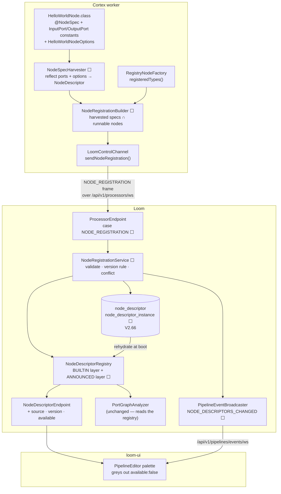
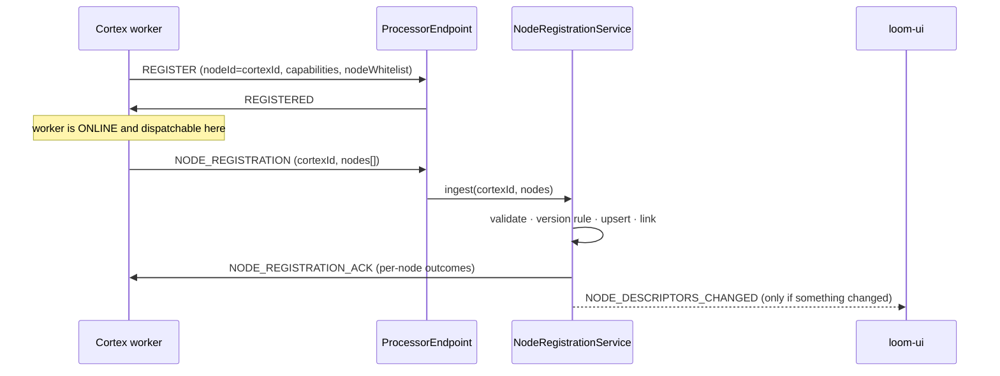

# Node Self-Registration — Cortex Announces Its Node Specs to Loom

> **Audience: AI coding agents.** One question: **how does a node that only exists on a Cortex worker
> become authorable in a Loom pipeline, without rebuilding Loom?**
>
> **Status: 🔵 PLANNED — nothing in this file is built.** Every code reference is either existing code
> being *extended* or a class that does not exist yet; §13 is the build order.
>
> **Scope split — do not duplicate these here:**
>
> | Topic | Spec |
> |---|---|
> | What a `NodeDescriptor` *is*, ports, content types, cardinality | [../features/pipeline/NODE_DATA_TYPES.md](../features/pipeline/NODE_DATA_TYPES.md) |
> | The shipped descriptor contract and its remaining gaps | [../concept/NODE_SCHEMA_CONCEPT.md](../concept/NODE_SCHEMA_CONCEPT.md) |
> | Node lifecycle, the `@StringKey` multibinding, worker whitelist/blacklist | [../features/nodes/NODES.md](../features/nodes/NODES.md) §5, §7 |
> | Engine, dispatch, definition JSON, `unsupportedNodeKinds` | [../features/pipeline/PIPELINE.md](../features/pipeline/PIPELINE.md) |
> | WebSocket framing, auth, reconnect | [../loom/WEBSOCKET.md](../loom/WEBSOCKET.md) |
> | Definition of done for a code change | [../guidelines/CODING.md](../guidelines/CODING.md) |
>
> **Source of truth is the code.** Where this file and the code disagree, the code wins — fix this
> file in the same change ([../guidelines/SPEC_RULES.md](../guidelines/SPEC_RULES.md)).

---

## 1. The problem, in one table

Two registries exist and they meet only by string name:

| | Lives in | Populated from | How it reaches Loom |
|---|---|---|---|
| **Runtime** — *can this node run?* | Cortex | `@IntoMap @StringKey` multibinding → `RegistryNodeFactory` | `registeredTypes()` → `nodeWhitelist` on REGISTER — **names only** |
| **Contract** — *what are its ports and parameters?* | Loom | `ServiceLoader<NodeDescriptorProvider>` at boot ([RESTModule.java:45-46](../../loom/services/rest/src/main/java/io/metaloom/loom/rest/dagger/RESTModule.java#L45-L46)) | it is already there — compiled into the Loom jar |

A node dropped onto a worker's classpath is therefore **runnable but unauthorable**: no palette entry,
and `PipelineGraphParser` rejects it as unknown before `PortGraphAnalyzer` sees the graph. The live
proof is [examples/cortex-custom-node](../../examples/cortex-custom-node): `hello-world` *is*
registered and dispatchable ([PipelineNodeFactoryModule.java:56](../../examples/cortex-custom/src/main/java/io/metaloom/cortex/cli/dagger/PipelineNodeFactoryModule.java#L56)),
and it still cannot be placed in the editor, because its contract lives nowhere Loom can read.

**This plan moves the contract to where the runtime already is.** The worker announces the specs for
the nodes it can execute; Loom adopts, persists and serves them.

Two facts make this cheaper than it looks:

- **`cortex/api` already depends on `loom-node-model`** ([cortex/api/pom.xml:37-39](../../cortex/api/pom.xml#L37-L39)),
  so `NodeDescriptor`, `PortSpec` and `NodeParameter` are already on every worker's classpath.
- **They are already plain Jackson beans** — `NodeDescriptorEndpoint` just `Json.encode`s them. The
  payload in §3 is what `GET /api/v1/pipeline/node-descriptors` returns today, plus `version`, with
  `kind` renamed to `nodeId`.

---

## 2. Architecture



**The load-bearing idea:** spec knowledge is **durable**, worker presence is **live**. A node whose
last worker went offline keeps validating and saving; it simply cannot *run*, which
`unsupportedNodeKinds` already reports as a 503
([PipelineEndpointService.java:319-331](../../loom/services/rest/src/main/java/io/metaloom/loom/rest/service/impl/PipelineEndpointService.java#L319-L331)).
Deleting specs on disconnect would turn a 30-second worker restart into "your saved pipeline no longer
validates".

---

## 3. The wire payload

A **new** `ProcessorMessageType.NODE_REGISTRATION`, worker → Loom, over the existing authenticated
processor socket.

```json
{
  "type": "NODE_REGISTRATION",
  "body": {
    "cortexId": "cortex-gpu-01",
    "nodes": [
      {
        "nodeId": "acme-nsfw",
        "version": "1.0.0-SNAPSHOT",
        "name": "NSFW Classifier",
        "description": "Classifies an image against the ACME NSFW taxonomy.",
        "icon": "shield",
        "category": "ANALYSIS",
        "inputPorts": [
          {
            "id": "media",
            "label": "Image",
            "contentType": "media/image",
            "cardinality": "ONE",
            "required": true,
            "description": "The image to classify"
          }
        ],
        "outputPorts": [
          {
            "id": "result",
            "label": "Result",
            "contentType": "struct/nsfw",
            "cardinality": "ONE",
            "required": true,
            "description": "Per-class probabilities"
          },
          {
            "id": "flag",
            "label": "Flag",
            "contentType": "scalar/boolean",
            "cardinality": "ONE",
            "required": false,
            "selective": true,
            "description": "True when any class exceeds the threshold"
          }
        ],
        "inputGroups": [],
        "outputGroups": [],
        "dynamicPorts": false,
        "parameters": [
          { "key": "enabled",   "type": "BOOLEAN", "defaultValue": true, "label": "Enabled" },
          { "key": "threshold", "type": "NUMBER",  "defaultValue": 0.8,  "label": "Threshold",
            "min": 0.0, "max": 1.0, "step": 0.05 },
          { "key": "modelPath", "type": "STRING",  "defaultValue": "models/acme-nsfw.onnx",
            "label": "Model Path", "description": "Worker-scoped; ignored in the pipeline JSON" }
        ],
        "defaultConcurrency": 1,
        "defaultMode": "PARALLEL",
        "defaultBlocking": true,
        "events": ["NODE_STATS"]
      }
    ]
  }
}
```

### 3.1 Envelope fields

| Field | Meaning |
|---|---|
| `cortexId` | The stable worker identity — the same value as `ProcessorRegistration.nodeId` (`CORTEX_NODE_ID`), the `UNIQUE` key on `cortex_instance.node_id`. Loom **must** verify it matches the id this socket registered with; a worker may not speak for another worker |
| `nodes` | The **complete** set of nodes this worker offers. There is no delta form: a node absent from a later frame is unlinked from this `cortexId` (§4.4) |

### 3.2 `nodeId` — the naming decision, and the trap it leaves

`nodeId` is the **node type** identifier: `ocr`, `script`, `sentiment`, `whisper`, `tts`. It is what
`NodeDescriptor.kind` is called today, what a definition's `nodes[].type` selects, and what
`RegistryNodeFactory` keys on.

🔴 **`nodeId` is already taken elsewhere, meaning something else.** In
[NodeTask](../../loom-shared/pipeline-model/src/main/java/io/metaloom/loom/pipeline/model/NodeTask.java)
and in `asset_node_result`, `nodeId` is the **graph-instance** id (`pn5`, or an author-chosen name) —
the thing that lets two `translate` instances write two rows on one asset
([NODES.md §2](../features/nodes/NODES.md)). Inside this payload there is no instance, so `nodeId` is
unambiguous *here*; across the codebase it is not.

Adopted resolution:

- **This payload, `NodeDescriptor` and the new tables use `nodeId` for the type.**
- `NodeDescriptor.kind` is renamed to `nodeId`, with `@JsonAlias("kind")` on the way in and **both**
  fields emitted on the way out for one release, so the checked-in
  `website/static/pipeline-editor/node-descriptors.json`, `loom-ui/src/types/nodeDescriptors.ts` and
  the offline website editor do not all break in the same commit.
- **Follow-on, not this PR:** rename the instance-side field to `nodeInstanceId` (`NodeTask`,
  `asset_node_result.node_id`, the `/node-results` request model). Until that lands, a reader seeing
  `nodeId` must check which side of the wire they are on. Do not leave this undone quietly — it is in
  §13.

Everything except `nodeId` and `version` is the existing `NodeDescriptor`, serialized exactly as
`NodeDescriptorEndpoint` already serves it. **Do not invent a second contract shape** — the value of
this design is that the wire, the REST response, the static snapshot and `PortGraphAnalyzer`'s input
are one type ([NODE_SCHEMA_CONCEPT.md §9](../concept/NODE_SCHEMA_CONCEPT.md): *"the contract already
ships; do not invent a second copy"*).

### 3.3 `version`

New on `NodeDescriptor`, and the only added field:

- Set explicitly via `@NodeSpec(version = …)` (§5).
- When unset, `NodeSpecHarvester` falls back to `nodeClass.getPackage().getImplementationVersion()` —
  the jar manifest's `Implementation-Version`, which Maven fills. That is how `1.0.0-SNAPSHOT` appears
  without an author writing it anywhere.
- `null` is legal and means *"an unversioned contract"*; it disables the skew detection in §4.2.

---

## 4. Loom-side semantics

### 4.1 Where it happens in the connection lifecycle



🔴 **Announcement must not gate dispatchability.** `ProcessorRegistry.register(...)` is a cheap
synchronous in-memory operation and stays that way; spec ingestion writes to Postgres. Putting ~115 KB
of JSON and a transaction on the REGISTER path would make a reconnect storm a database problem. The
window where a worker is online but its specs are not yet ingested is harmless: **dispatch reads
`nodeWhitelist`, never the descriptor registry.**

### 4.2 The version rule — which contract is *active*

A node may be offered by many workers, and during a rolling upgrade they will not agree. The active
contract is **the lowest version currently announced by any online worker that offers it.**

| Situation | Behaviour |
|---|---|
| One worker, one version | That contract is active. The common case |
| Two workers, same version, **identical** body | Active, both linked |
| Two workers, same version, **different** body | 🔴 `CONFLICT`. Keep the incumbent, refuse the newcomer's body, record and surface it. *Exception:* a `-SNAPSHOT` version is mutable by Maven convention — overwrite, log at INFO |
| Two workers, `1.0.0` and `1.1.0` | `1.0.0` is active; flagged `versionSkew` listing both |
| Version unparseable or `null` | Cannot be ordered. Keep the incumbent, flag `versionSkew`; never guess |

**Why lowest and not newest.** A graph is validated against the active contract and then dispatched to
*whichever* worker accepts the node. If `1.1.0` added an optional port and the editor let an author
wire it, an item landing on a `1.0.0` worker would silently ignore that input — a green run with the
wrong answer. The lowest announced version is the contract every worker in the fleet can honour, so a
saved graph is safe wherever it lands. The cost is that new ports appear only once the last old worker
is gone, which is visible and explainable; the alternative is invisible and is not.

Comparison is dot-separated numeric segments, any `-qualifier` sorting **below** the same numeric
prefix (`1.0.0-SNAPSHOT` < `1.0.0`). ~30 lines in a `NodeVersions` helper — do **not** add a Maven
artifact-resolution dependency for this.

### 4.3 Built-in nodes always win

Loom's own `ServiceLoader` descriptors are the `BUILTIN` layer and are never overwritten. An announced
spec for a built-in `nodeId` is **ignored for its content**, but its `version` is still recorded
against the instance — that is how an operator sees which cortex build a worker runs. The rejection
must be reported (§4.5), not swallowed: an author who edits `whisper`'s ports in a fork and sees no
effect will otherwise lose an afternoon.

This closes gap C of [NODE_SCHEMA_CONCEPT.md §0.1](../concept/NODE_SCHEMA_CONCEPT.md) — "a descriptor
is not a registration" — **structurally** for announced nodes: the spec exists only because a worker
that can run it said so, so `registered: false` is unrepresentable. It does not fix the two built-in
orphans (`facedescription`, `loom-fetch`); those stay a separate cleanup.

### 4.4 Lifetime — link, unlink, never delete

- Ingest **replaces** the link set for that `cortexId`: nodes in the frame are linked, previously
  linked and now absent are unlinked.
- A worker going offline unlinks nothing. Presence is `cortex_instance.state`.
- A spec with **zero online providers** is served with `available: false`. It still validates, still
  saves, still recovers.
- Rows are never deleted automatically. Deletion is an explicit admin action (§8), because a saved
  pipeline referencing a deleted node stops parsing.

### 4.5 Reporting back

```json
{
  "type": "NODE_REGISTRATION_ACK",
  "body": {
    "cortexId": "cortex-gpu-01",
    "accepted": ["acme-nsfw"],
    "rejected": [
      { "nodeId": "whisper", "reason": "BUILTIN",
        "message": "Built-in descriptor wins; announced copy ignored" },
      { "nodeId": "acme-bad", "reason": "INVALID_PORT_ID",
        "message": "outputPorts[0].id 'Result Set' does not match ^[a-z0-9][a-z0-9_]{0,62}$" }
    ]
  }
}
```

`reason` vocabulary: `BUILTIN`, `CONFLICT`, `INVALID_PORT_ID`, `INVALID_CONTENT_TYPE`,
`INVALID_NODE_ID`, `TOO_LARGE`, `DUPLICATE_NODE_ID`, `ID_MISMATCH`.

### 4.6 Content types are implicit

The payload has no `contentTypes` block, by design. `ContentTypeLattice.isAssignable` parses
`family/subtype` **structurally** and never consults a registry, and `ContentTypeRegistry.isKnown()`
is referenced only from tests — so `struct/nsfw` validates and connects the moment it is announced.

Loom therefore **derives** the vocabulary: for every announced `contentType` absent from
`ContentTypeRegistry.all()`, synthesize a `ContentType` (family = segment before `/`, label =
title-cased subtype, `wildcard` = subtype is `*`) and merge it into `/api/v1/pipeline/content-types`.
The editor already falls back to a default handle colour for an unknown family
([contentTypes.ts:72-86](../../loom-ui/src/features/pipeline/contentTypes.ts#L72-L86)).

The cost is a machine-derived label ("Nsfw"). If that becomes annoying, add an **optional**
`contentTypes` array later — additive, no format bump.

### 4.7 Dynamic ports — the one genuinely unsolved case

A `dynamicPorts: true` node resolves its real ports from its options through a `NodePortResolver`
([NodeDescriptorRegistry.java:88-102](../../loom-shared/node-model/src/main/java/io/metaloom/loom/nodes/spec/NodeDescriptorRegistry.java#L88-L102)).
For a custom node **that resolver class is only on the worker**, so neither Loom nor the TypeScript
mirror in `loom-ui/src/features/pipeline/portResolvers.ts` can run it.

**v1 rule: an announced spec with `dynamicPorts: true` is accepted, but resolves to its static port
lists.** It is authorable; it just does not gain per-option ports. Reject nothing — a node that
degrades to its declared ports is more useful than one that cannot be placed.

The real fix is gap A of [NODE_SCHEMA_CONCEPT.md](../concept/NODE_SCHEMA_CONCEPT.md), which this plan
promotes from "nice to have" to "required for full custom-node support":
`POST /api/v1/pipeline/node-descriptors/:nodeId/resolve-ports`, proxied over the processor socket to a
providing worker and cached by `(nodeId, optionsHash)`. Tracked separately; **do not** bundle it into
the registration PR.

---

## 5. Where the node spec comes from

Announcing a spec presumes the worker *has* one. Today it does not: the contract lives in
`loom-shared/node-model/…/<Kind>DescriptorProvider.java`, physically separated from the node it
describes, and `NodePortConformanceTest` exists solely to police the gap between them.

### 5.1 What is already declared in Java, and what is not

The decisive observation — a node **already** declares its ports as typed constants:

```java
// cortex/nodes/sentiment/core/.../SentimentNode.java:67-71
public static final InputPort<String>  IN_TEXT   = InputPort.one("text", ContentTypeRegistry.TEXT_ANY, String.class);
public static final OutputPort<String> OUT_LABEL = OutputPort.one("label", ContentTypeRegistry.SCALAR_STRING, String.class);
public static final OutputPort<Double> OUT_SCORE = OutputPort.one("score", ContentTypeRegistry.SCALAR_NUMBER, Double.class);
```

```java
// SentimentNodeOptions.java:28-43
public static final String KEY = "sentiment";
private String sentimentHost = "localhost";
private int    sentimentPort = 9110;
private int    maxChars      = 200_000;
```

| Descriptor field | Derivable? | From what |
|---|---|---|
| `inputPorts`/`outputPorts`: `id`, `contentType`, `cardinality`, value type | ✅ **exactly** | the `InputPort`/`OutputPort` constants — the same objects the node executes against |
| `parameters`: `key`, `type`, `defaultValue` | ✅ | fields of a **default-constructed** options instance |
| `parameters[].values` for an enum | ✅ | `Class.getEnumConstants()` |
| `nodeId` | ✅ | `node.name()` / the `@StringKey` binding |
| `label`, `description`, `icon`, `category` | ❌ | prose — must be authored |
| `min`, `max`, `step`, parameter ordering | ❌ | intent, not type |
| `inputGroups`/`outputGroups` (XOR), `required`, `selective` | ⚠️ partly | `PortSpec` carries them, the port constants do not today |

So roughly **80 % is derivable with zero drift potential, and 20 % is irreducibly authored.** Every
option below is really a choice of *where the 20 % lives* and *when the 80 % is computed*.

### 5.2 The options

| | Approach | Verdict |
|---|---|---|
| **a** | **Builder API in the node's own module** — move `SentimentDescriptorProvider` next to `SentimentNode` and keep hand-writing it | 🟡 **Necessary but insufficient.** It fixes *location* (the spec ships with the node, which is what announcement needs) and fixes nothing about *drift* — the ports are still typed twice, so `NodePortConformanceTest` must live forever. Adopt the relocation; reject the hand-writing |
| **b** | **Runtime reflection** over the node class and its options class | ✅ **The core of the recommendation.** Reads real values, including instance-field defaults. Its one hazard is class loading (§5.4) |
| **c** | **`NodeSpecProvider` interface implemented by the node**, read through an instance method | ❌ **As an instance method, actively harmful.** [NODES.md §5.1](../features/nodes/NODES.md) keeps every node behind a Dagger `Provider` precisely so booting a worker does not construct nodes that pull heavy native transitive deps. Calling `node.spec()` to build a registration would instantiate all 34. Acceptable only as a `static` method or on the node's Dagger module — at which point it is (a) with extra ceremony |
| **d** | **Maven plugin doing source inspection** | ❌ **As source parsing, no.** Recovering `InputPort.one("text", TEXT_ANY, String.class)` means evaluating an initializer expression AST with constant folding across `ContentTypeRegistry` — fragile, and it re-implements what the JVM does for free. ✅ **As a build-time host for (b)** — see the growth path |
| **e** | **⭐ Reflective harvest + annotations for the prose** | ✅ **Recommended.** (b) supplies everything typed; annotations on the *same* declarations supply the 20 % that is not. One source of truth, and `NodePortConformanceTest` can be **deleted** rather than maintained |
| **f** | **Declarative resource per node** (`<nodeId>.node.json` in the module's resources) | ❌ This is Concept 1 of [NODE_SCHEMA_CONCEPT.md](../concept/NODE_SCHEMA_CONCEPT.md), already dropped: it trades `javac`-checked content-type constants for a second file that drifts |

### 5.3 The recommendation, concretely

```java
@NodeSpec(nodeId = "sentiment", name = "Sentiment Analysis", icon = "mood", category = ANALYSIS,
    description = "Score the polarity of text produced by an upstream node. German and English.")
public class SentimentNode extends AbstractMediaNode<SentimentNodeOptions> {

    @PortDoc(label = "Text", description = "The prose to score — a transcript, caption or OCR result")
    public static final InputPort<String> IN_TEXT = InputPort.one("text", TEXT_ANY, String.class);
    ...
}

public class SentimentNodeOptions extends AbstractNodeOptions<SentimentNodeOptions> {
    @ParamDoc(label = "Sidecar Port", description = "Port of the /v1/sentiment sidecar", min = 1)
    private int sentimentPort = 9110;
}
```

`NodeSpecHarvester.harvest(Class<? extends FilesystemNode<?, ?>>) → NodeDescriptor` reflects the port
constants and a default-constructed options instance, then overlays the annotations.

**Module placement matters and is easy to get wrong.** `InputPort`/`OutputPort` live in `cortex/api`;
`NodeDescriptor` lives in `loom-shared/node-model`, which `cortex/api` depends on. The dependency must
not invert — so **the annotations and the harvester go in `cortex/api`** (`io.metaloom.cortex.api.node.spec`),
producing node-model types. Loom never runs the harvester; it only consumes its output.

**One source, two consumers:**

```
@NodeSpec-annotated node classes
        │  NodeSpecHarvester
        ├──────────────▶ runtime  → NODE_REGISTRATION → Loom's ANNOUNCED layer
        └──────────────▶ build    → node-descriptors.json → Loom's BUILTIN seed
                                                          + the offline website editor
```

The build-time arm is `NodeDescriptorGenerator`, which already writes that file — it switches from
reading `ServiceLoader<NodeDescriptorProvider>` to reading the harvest. That is what lets a fresh Loom
install validate demo pipelines before any worker has ever connected, without hand-written providers
surviving anywhere.

### 5.4 🔴 The class-loading hazard, and the growth path

Reflecting a class runs its static initializers. `FingerprintNode` has:

```java
static { Video4j.init(); }   // FingerprintNode.java:77
```

So a naive startup harvest loads native libraries for every node on every worker — including nodes
that worker will never run. Three mitigations, in order of preference:

1. **Harvest only what the worker registered.** `NodeRegistrationBuilder` already intersects with
   `registeredTypes()`; a whitelisted worker loads only its own nodes, which it would load anyway on
   the first task.
2. **Move port constants out of the node class** into a `<Name>Ports` holder with no static
   initializer, and harvest that. Cheap, and it makes the constants importable without the node.
3. **Do the harvest at build time** — a `loom-node-spec-maven-plugin` that runs the *same reflective
   harvester* in an `exec`-like goal and writes `META-INF/loom/node-spec/<nodeId>.json` into the jar.
   Startup then reads a resource: no reflection, no static init, no native load. This is option (d)
   done right — reflection inside the plugin, never source parsing.

**Ship 1 first, add 3 when startup cost or native loading is measured as a problem.** Node authors see
no difference: the annotations and the harvester are identical either way, only the invocation site
moves.

### 5.5 The sweep — author the spec for every existing node

34 node ids across 29 modules currently have hand-written providers in `loom-shared/node-model`. Each
must gain `@NodeSpec`/`@PortDoc`/`@ParamDoc` in its own module, and its provider must be deleted.

**This sweep is the acceptance test for §5.3, and it is self-verifying:** the existing hand-written
descriptor is the *golden fixture*. If `NodeSpecHarvester.harvest(WhisperNode.class)` does not equal
`new WhisperDescriptorProvider().getDescriptors().get(0)` field for field, either the annotations are
incomplete or the harvester is wrong. Nothing is judged by eye.

**Run it with subagents, one node module per agent**, after §5.3 lands and after a hand-done pilot
(use `sentiment` — one input, three outputs, six parameters, no groups, no dynamic ports; `md5` is too
simple to shake out the template, and `whisper` has an XOR group that the pilot should not also be
debugging). Per-agent brief:

- Inputs: the module path, its `<Kind>DescriptorProvider`, `NODES.md` §3/§6 rows for that node.
- Work: annotate the node class, its port constants and its options fields; **do not** invent prose —
  copy the existing `label`/`description` verbatim, since they are already customer-facing.
- Done when: the golden-fixture equality test passes, `mvn -pl cortex/nodes/<name>/core test -o` is
  green, and the provider class is deleted.
- Report back: any field the harvester could not reproduce. Those are template gaps, and the *template*
  gets fixed once rather than worked around 34 times.

Batch ~6 concurrent; the modules are independent. Two shared files serialize the sweep and must be
edited once at the end, not per agent: `META-INF/services/…NodeDescriptorProvider` and
`NodeDescriptorServiceLoaderTest`'s two count literals (27 providers / 37 ids — the assertion failing
is the tripwire working, [NODES.md §5.2](../features/nodes/NODES.md)). `NodePortConformanceTest` is
deleted last, once no node has two sources left to compare.

Nodes needing individual attention rather than the batch: `llm`, `vlm`, `script`, `filter` (dynamic
ports — the resolver stays hand-written, §4.7), `hash` (four ids on one options `KEY`), `dedup` (two
`@StringKey`s onto one class), and the sources (`SourceDescriptorProvider` declares four ids).

---

## 6. Persistence

New migration **`V2.66__add_node_descriptor.sql`** (latest existing is `V2.65`; confirm before writing,
and re-run `./setup-pool.sh` afterwards — [CLAUDE.md](../../.claude/CLAUDE.md)).

```sql
CREATE TABLE "node_descriptor" (
  "node_id"       varchar NOT NULL,   -- 'ocr', 'whisper', 'acme-nsfw'
  "version"       varchar,
  "descriptor"    jsonb   NOT NULL,
  "body_hash"     varchar NOT NULL,
  "source"        varchar NOT NULL,   -- 'ANNOUNCED' (BUILTIN is never persisted)
  "status"        varchar NOT NULL,   -- 'ACTIVE' | 'CONFLICTED'
  "first_seen"    timestamp WITHOUT TIME ZONE NOT NULL DEFAULT (now()),
  "last_seen"     timestamp WITHOUT TIME ZONE NOT NULL DEFAULT (now()),
  ...audit columns as in V2.33...
  CONSTRAINT "node_descriptor_pkey" PRIMARY KEY ("node_id"),
  CONSTRAINT "node_descriptor_source_check" CHECK ("source" IN ('ANNOUNCED')),
  CONSTRAINT "node_descriptor_status_check" CHECK ("status" IN ('ACTIVE', 'CONFLICTED'))
);

CREATE TABLE "node_descriptor_instance" (
  "node_id"       varchar NOT NULL,
  "instance_uuid" uuid    NOT NULL,
  "version"       varchar,
  "body_hash"     varchar NOT NULL,
  "last_seen"     timestamp WITHOUT TIME ZONE NOT NULL DEFAULT (now()),
  CONSTRAINT "node_descriptor_instance_pkey" PRIMARY KEY ("node_id", "instance_uuid"),
  CONSTRAINT "node_descriptor_instance_fkey"
    FOREIGN KEY ("instance_uuid") REFERENCES "cortex_instance" ("uuid") ON DELETE CASCADE
);
```

- **`node_descriptor_instance` is what makes §4.2 computable** — it holds each worker's own claimed
  version and body hash, so the active contract is a query, not a cached decision that can rot.
- **`BUILTIN` specs are never persisted.** They are recomputed from the classpath at every boot;
  writing them would create a stale copy that outlives a Loom downgrade.
- `descriptor` is the full announced JSON, so rehydrating at boot needs no worker.
- Deliberately *not* modelled: a version-history table. `node_descriptor_instance` says who claims what
  now, and history nothing reads is retention debt
  ([PIPELINE.md §9.2](../features/pipeline/PIPELINE.md)).
- Shape follows [V2.33__add_cortex_instance.sql](../../loom/db/flyway/src/main/resources/db/migration/V2.33__add_cortex_instance.sql),
  including a child table over a JSONB blob so one node id is queryable across all workers.
- Regenerate jOOQ after the migration (`loom/db/jooq/generate.sh`).

---

## 7. REST and UI surface

`GET /api/v1/pipeline/node-descriptors` keeps its `{nodeDescriptors, contentTypes}` shape. Each entry
gains:

| Field | Meaning |
|---|---|
| `nodeId` | The type id. `kind` is emitted alongside it for one release (§3.2) |
| `version` | The active contract's version, `null` for built-ins |
| `source` | `BUILTIN` \| `ANNOUNCED` |
| `available` | At least one online worker currently offers it |
| `providedBy` | `[cortexId]` of online providers — answers "why can't I run this?" |

Additive, so `loom-ui/src/types/nodeDescriptors.ts` and the static snapshot keep parsing. **The palette
must grey out `available: false` rather than hide it** — hiding a node a saved pipeline already uses
makes that pipeline unopenable for no stated reason.

New `NODE_DESCRIPTORS_CHANGED` event on the existing UI socket (`/api/v1/pipelines/events/ws` →
`PipelineEventBroadcaster`), emitted **only when the merged registry actually changed**. Without it the
palette never notices a new worker: it fetches once at mount.

Admin surface (deferred, but design for it): the cortex-instance page lists each worker's nodes with
versions and shows `CONFLICTED` / `versionSkew` badges. A conflict nobody can see is a conflict nobody
will fix.

---

## 8. Security and validation

An announced spec is **untrusted input from whoever holds a processor token**. The socket is
JWT-authenticated ([ProcessorEndpoint.java:108-111](../../loom/services/rest/src/main/java/io/metaloom/loom/rest/endpoint/impl/ProcessorEndpoint.java#L108-L111)),
which is necessary and not sufficient.

| Check | Rule |
|---|---|
| Identity | `cortexId` must equal the id this socket registered with → `ID_MISMATCH` |
| Node id | Non-blank, `^[a-z0-9][a-z0-9-]{0,63}$` → `INVALID_NODE_ID` |
| Shadowing | A `BUILTIN` node id is never overwritten → `BUILTIN` |
| Duplicates | Two entries with the same `nodeId` in one frame → `DUPLICATE_NODE_ID` |
| Port ids | Must match `PortSpec.ID_PATTERN` (`^[a-z0-9][a-z0-9_]{0,62}$`), unique per side → `INVALID_PORT_ID` |
| Content types | `family/subtype`, both segments non-empty → `INVALID_CONTENT_TYPE` |
| Groups | Every `port.group` must name a declared group on the same side |
| Size caps | ≤ 256 nodes per frame, ≤ 64 ports and ≤ 256 parameters per node, ≤ 4 MiB frame → `TOO_LARGE` |
| Permissions | Reading the registry stays ungated (the editor needs it). Deleting a row requires `MANAGE_CORTEX_INSTANCE` |

**Reject per node, not per frame.** One malformed custom node must not cost a worker its other 34
specs.

---

## 9. Examples — every worker implementation must announce

The three modules under [examples/](../../examples) are customer-facing and are the first thing a
custom-node author copies. All three must ship the announcement, or the documented path produces a node
that runs but cannot be authored — the exact defect this plan removes.

| Example | Change |
|---|---|
| [cortex-custom-node](../../examples/cortex-custom-node) | Annotate `HelloWorldNode` with `@NodeSpec(nodeId = "hello-world", …)`, `@PortDoc` on `IN_HASH`/`OUT_FILE_SIZE`/`OUT_WORD_COUNT`, `@ParamDoc` on the options fields. This is the **reference for how a third party declares a spec**, so it must show the annotations, not a hand-built descriptor |
| [cortex-custom](../../examples/cortex-custom) | Nothing structural: `hello-world` is already registered explicitly at [PipelineNodeFactoryModule.java:56](../../examples/cortex-custom/src/main/java/io/metaloom/cortex/cli/dagger/PipelineNodeFactoryModule.java#L56), and the harvest + announcement ride along with the shared `LoomControlChannel`. Verify end to end that it reaches the palette, and say so in the README |
| [cortex-python](../../examples/cortex-python) | Send `NODE_REGISTRATION` after `REGISTERED` (§9.1) |

Also update the [examples/README.md](../../examples/README.md) module table and the
`cortex-custom-node` README: "your node appears in the pipeline editor automatically" is a headline
feature and is currently absent because it was not true.

### 9.1 `examples/cortex-python/daemon.py`

The Python worker has no Java classes to reflect, which is the point: **the wire format is
language-agnostic and the spec is hand-written there.** That makes it the clearest demonstration of the
payload.

- Add a `NODE_SPECS` module-level constant holding the §3 `nodes[]` list for `py-hello`, keyed by the
  ids already in `Config.node_kinds` ([daemon.py:99-107](../../examples/cortex-python/daemon.py#L99-L107)).
- Send it from `_on_connected` **after** the `REGISTERED` reply arrives, not inside `_send_register`
  ([daemon.py:412-424](../../examples/cortex-python/daemon.py#L412-L424)) — mirroring §4.1, and so the
  example teaches the right ordering.
- Handle `NODE_REGISTRATION_ACK` in `_handle_message` and **log every rejection**. A silent ack teaches
  the wrong thing to everyone who copies the file.
- Keep `nodeWhitelist` on REGISTER. It is what dispatch reads; the spec announcement does not replace it.

⚠️ **Do not rename the daemon's REST payload fields.** `post_node_result` sends `nodeKind` and `nodeId`
to `/api/v1/assets/:uuid/node-results` ([daemon.py:290-305](../../examples/cortex-python/daemon.py#L290-L305)),
where `nodeId` already means the *instance* id. That is the existing ledger API and it is out of scope
here — only the new `NODE_REGISTRATION` payload uses `nodeId` for the type. Renaming both in one commit
is how the §3.2 trap gets sprung.

---

## 10. Configuration

| Variable | Default | Meaning |
|---|---|---|
| `CORTEX_NODE_SPEC_ANNOUNCE` | `true` | Worker sends `NODE_REGISTRATION` after `REGISTERED`. Off ⇒ pre-registration behaviour exactly |
| `LOOM_NODE_SPEC_ACCEPT_ANNOUNCED` | `true` | Loom ingests announcements. Off ⇒ frames are acked with everything rejected and only `BUILTIN` specs are served. The kill switch for a locked-down deployment |

Existing variables this interacts with — do not redefine them here, see
[../cortex/CONFIGURATION.md](../cortex/CONFIGURATION.md) and [../features/nodes/NODES.md §7](../features/nodes/NODES.md):

| Variable | Interaction |
|---|---|
| `CORTEX_NODE_ID` | Becomes `cortexId` |
| `CORTEX_NODE_WHITELIST` / `CORTEX_NODE_BLACKLIST` | Narrow what is announced, so the announced set and the runnable set cannot drift |

---

## 11. Test Setup

Some suites need the pooled test DB. Run `./setup-pool.sh` first, and **again after `V2.66`** — a new
migration leaves the pooled databases stale, and `loom/db/flyway` must be installed before the pool is
rebuilt.

| Layer | Where | What it proves |
|---|---|---|
| `NodeDescriptorDeserializationTest` | `loom-shared/node-model` | A serialized descriptor round-trips back into `NodeDescriptor`. **Fails today** — §12 |
| `NodeVersionsTest` | `loom-shared/node-model` | `1.0.0-SNAPSHOT` < `1.0.0` < `1.1.0`; unparseable is not ordered |
| `NodeSpecHarvesterTest` | `cortex/api` | Ports, cardinalities, parameter defaults and enum values are recovered; a missing `@NodeSpec` is a clear error, not a null descriptor |
| **`NodeSpecGoldenTest`** | `cortex/nodes/<name>/core` | 🔴 **The sweep's acceptance test**: `harvest(XNode.class)` equals the retired `XDescriptorProvider`'s descriptor, field for field (§5.5) |
| `NodeRegistrationBuilderTest` | `cortex/cli` | Announced set = harvested ∩ `registeredTypes()`; whitelist/blacklist narrow it; the manifest-version fallback fires |
| `NodeRegistrationServiceTest` | `loom/services/rest` | Every §8 rejection; built-in shadowing; lowest-version-wins; SNAPSHOT overwrite vs release conflict; unlink on absence; no delete on disconnect |
| `NodeDescriptorEndpointTest` (extend) | `loom/core` | `nodeId`/`version`/`source`/`available`/`providedBy` served; announced node appears; offline node is `available: false` but still returned |
| `ProcessorEndpointTest` (extend) | `loom/core` | A frame whose `cortexId` differs from the socket's is `ID_MISMATCH`; the ack lists per-node outcomes |
| `NodeDescriptorRehydrationTest` | `loom/core` | After a restart with **no worker connected**, an announced node still parses and validates |
| `CustomNodeRegistrationIntegrationTest` | `integration-test` | A `CortexContainer` running the `hello-world` example reaches the palette response end to end |
| Python example | `examples/cortex-python` | Manual: run against a dev Loom, confirm `py-hello` appears in the palette and the ack logs cleanly |

🔴 **The one test that must exist before anything else:** a graph using an announced-only node saves,
validates through `PortGraphAnalyzer` with a real registry, and dispatches. Note the trap in
[NODE_SCHEMA_CONCEPT.md §9](../concept/NODE_SCHEMA_CONCEPT.md) — `new PipelineGraphParser()` passes a
**null** registry and `PortGraphAnalyzer.analyze` then returns immediately, validating nothing. A test
that forgets the registry asserts success against a no-op.

---

## 12. Conventions and Gotchas

| Rule | Why |
|---|---|
| 🔴 **`PortSpec.many` has no setter** | [PortSpec.java:191](../../loom-shared/node-model/src/main/java/io/metaloom/loom/nodes/spec/PortSpec.java#L191) is a derived getter and these types have only ever been *serialized*. The first `readValue` fails on the unknown property. `@JsonIgnore` it (redundant with `cardinality`; neither the UI nor the engine reads it) — do not loosen deserialization globally |
| 🔴 **`nodeId` means the type here and the instance elsewhere** | `NodeTask.nodeId` and `asset_node_result.node_id` are the graph-instance id. §3.2 — and finish the `nodeInstanceId` rename rather than leaving the ambiguity |
| 🔴 **Never delete a spec because a worker disconnected** | Refcount-and-drop turns a rolling restart into "your saved pipeline no longer validates" |
| 🔴 **Built-in always wins, and the rejection must be reported** | A silently ignored override is an afternoon lost |
| 🔴 **The active contract is the *lowest* announced version** | Newest-wins lets an author wire a port older workers ignore: a green run with the wrong answer (§4.2) |
| 🔴 **Reflecting a node class runs its static initializer** | `FingerprintNode` does `Video4j.init()` at :77. Harvest only registered nodes, or move ports to a holder class, or harvest at build time (§5.4) |
| **Never call an instance method to get a spec** | Nodes stay behind a Dagger `Provider` so booting a worker does not construct native-dependent nodes. A spec must come from the class, not an instance (§5.2 option c) |
| **Hash the canonical body, not Jackson's output** | Sort keys, exclude derived fields. Hashing default serialization makes every Loom upgrade look like a contract change on every worker |
| **Announcement never gates dispatch** | Dispatch reads `nodeWhitelist`; the registry is an authoring concern. Keep the DB write off the REGISTER path |
| **Reject per node, never per frame** | One bad custom node must not unregister a worker's other 34 specs |
| **Copy existing labels verbatim during the sweep** | The provider prose is already customer-facing and reviewed. Rewriting it while relocating it makes the golden-fixture test useless as a check |
| **Do not add a second contract type** | The wire payload *is* `NodeDescriptor`. A parallel "registration DTO" with the same fields is the drifting duplicate [NODE_SCHEMA_CONCEPT.md](../concept/NODE_SCHEMA_CONCEPT.md) exists to prevent |
| **`dynamicPorts` announced ⇒ static ports** | No resolver class Loom-side. Accept and degrade; do not reject (§4.7) |
| **A new content type needs no declaration** | The lattice is structural; `isKnown()` is test-only. But `NodeDescriptorPortsTest` asserts `isKnown` for **built-in** descriptors — scope that assertion to the BUILTIN layer or it starts failing on announced types |

---

## 13. Progress Assessment

**Nothing below is built.** Ordered so each step is independently useful.

### Phase 1 — the spec exists next to the node

- [ ] `@NodeSpec` / `@PortDoc` / `@ParamDoc` + `NodeSpecHarvester` in `cortex/api`
      (`io.metaloom.cortex.api.node.spec`) — **not** in `loom-shared/node-model`; the dependency runs
      that way (§5.3)
- [ ] `NodeSpecHarvesterTest`
- [ ] Pilot: annotate `SentimentNode` by hand, prove `NodeSpecGoldenTest` against
      `SentimentDescriptorProvider`, review the **template**, only then sweep
- [ ] **Subagent sweep (§5.5)** — one agent per node module, 6 concurrent, golden-fixture equality as
      the gate. Special cases last: `llm`/`vlm`/`script`/`filter`, `hash`, `dedup`, the sources
- [ ] Shared-file edits once at the end: `META-INF/services/…NodeDescriptorProvider`,
      `NodeDescriptorServiceLoaderTest` literals; delete `NodePortConformanceTest`
- [ ] `NodeDescriptorGenerator` reads the harvest instead of the ServiceLoader; regenerate
      `website/static/pipeline-editor/node-descriptors.json`

### Phase 2 — the contract travels

- [ ] Rename `NodeDescriptor.kind` → `nodeId` with `@JsonAlias("kind")` + dual emit (§3.2)
- [ ] Add `version` to `NodeDescriptor`; `@JsonIgnore` on `PortSpec.isMany()`; round-trip test
- [ ] `NodeVersions` comparator + test
- [ ] `ProcessorMessageType.NODE_REGISTRATION` + `NODE_REGISTRATION_ACK` + `rest-model` bodies
- [ ] `NodeRegistrationBuilder` in `cortex/cli`: harvest ∩ `registeredTypes()`, manifest-version fallback
- [ ] `LoomControlChannel.sendNodeRegistration()` after `REGISTERED`, gated on `CORTEX_NODE_SPEC_ANNOUNCE`

### Phase 3 — Loom adopts it (in memory)

- [ ] `NodeDescriptorRegistry`: BUILTIN + ANNOUNCED layers, provenance, `resolveActive(nodeId)`
- [ ] `NodeRegistrationService`: §8 validation, §4.2 version rule, §4.4 link/unlink, ack assembly
- [ ] `ProcessorEndpoint` case + `ID_MISMATCH` check
- [ ] Derived content types (§4.6)
- [ ] **Milestone: a custom node is authorable.** Lost on Loom restart until phase 4

### Phase 4 — durability

- [ ] `V2.66__add_node_descriptor.sql` + jOOQ regen + `./setup-pool.sh`
- [ ] `NodeDescriptor`/`NodeDescriptorInstance` DAO models + jOOQ impls + delete-cascade tests
- [ ] Rehydrate the ANNOUNCED layer at boot, before `PipelineRunRecovery` runs
- [ ] `NodeDescriptorRehydrationTest`

### Phase 5 — the UI tells the truth

- [ ] `nodeId`/`version`/`source`/`available`/`providedBy` on the response + TS types
- [ ] `NODE_DESCRIPTORS_CHANGED` broadcast + palette refresh
- [ ] Palette greys out unavailable nodes and names the missing worker
- [ ] Cortex-instance page: per-worker nodes, versions, `CONFLICTED` / `versionSkew` badges

### Phase 6 — examples and docs (§9)

- [ ] `cortex-custom-node`: `@NodeSpec` on `HelloWorldNode` + README
- [ ] `cortex-python`: `NODE_SPECS` constant, send after `REGISTERED`, log the ack
- [ ] `examples/README.md` module table
- [ ] `website/content/english/docs/nodes/` — "writing a custom node" page (required by
      [../guidelines/CODING.md](../guidelines/CODING.md))

### Phase 7 — full parity for custom nodes

- [ ] `POST /pipeline/node-descriptors/:nodeId/resolve-ports`, proxied to a providing worker, cached
      (gap A of [NODE_SCHEMA_CONCEPT.md](../concept/NODE_SCHEMA_CONCEPT.md)) — then delete `portResolvers.ts`
- [ ] Node card markdown on the announcement (gap B) — a third-party card cannot live in
      `loom-shared/node-model`'s jar; serve it at `/node-descriptors/:nodeId/card` for the editor and
      the MCP `PipelineTool`
- [ ] Admin delete of an unused spec row, gated on `MANAGE_CORTEX_INSTANCE`
- [ ] `loom-node-spec-maven-plugin` — build-time harvest into `META-INF/loom/node-spec/`, if startup
      reflection or native static init proves costly (§5.4)

### Follow-on this unlocks

- [ ] **Rename the instance-side `nodeId` → `nodeInstanceId`** (`NodeTask`, `asset_node_result.node_id`,
      the `/node-results` model, `daemon.py`). Closes the §3.2 ambiguity
- [ ] **`producerVersion` in the ledger.** Hand-rolled by three nodes today and absent elsewhere
      ([NODES.md §10](../features/nodes/NODES.md)); the announced `version` is the obvious source
- [ ] Pin a pipeline node to a spec version. The field exists after phase 2; the semantics do not

---

## 14. Key Classes Reference

| Class / file | Package or path | Role |
|---|---|---|
| `NodeDescriptor` | `io.metaloom.loom.nodes.spec` (`loom-shared/node-model`) | The contract. `kind` → `nodeId`, gains `version` |
| `PortSpec` / `PortGroup` / `NodeParameter` | same | Announced verbatim; `isMany()` needs `@JsonIgnore` |
| `NodeDescriptorRegistry` | same | Gains the BUILTIN/ANNOUNCED split and provenance |
| `ContentTypeLattice` / `ContentTypeRegistry` | same | Structural assignability — why an announced content type just works |
| `NodeVersions` ⬜ | same | The `-SNAPSHOT`-aware comparator |
| `NodeDescriptorProvider` | same | The hand-written providers the §5.5 sweep deletes |
| `InputPort` / `OutputPort` | `io.metaloom.cortex.api.node` (`cortex/api`) | The typed constants the harvest reads |
| `@NodeSpec` / `@PortDoc` / `@ParamDoc` ⬜ | `io.metaloom.cortex.api.node.spec` (`cortex/api`) | The authored 20 % |
| `NodeSpecHarvester` ⬜ | same | Reflection → `NodeDescriptor` |
| `AbstractNodeOptions` | `cortex/api` · `…option.node` | Default-constructed to recover parameter defaults |
| `ProcessorRegistration` / `ProcessorMessage` / `ProcessorMessageType` | `io.metaloom.loom.rest.model.processor.message` (`loom-shared/rest-model`) | REGISTER and the envelope the new type joins |
| `NodeRegistration` / `NodeRegistrationAck` ⬜ | same package | The §3 payload bodies |
| `LoomControlChannel` | `io.metaloom.cortex.impl.loom` (`cortex/core`) | `sendRegister()` at :381; the new `sendNodeRegistration()` |
| `RegistryNodeFactory` / `RegistryNodeRegistrar` | `cortex/core`, `cortex/cli` | `registeredTypes()` — what a worker may announce |
| `NodeRegistrationBuilder` ⬜ | `cortex/cli` · `…cli.dagger` | Harvest ∩ factory → the payload |
| `ProcessorEndpoint` | `io.metaloom.loom.rest.endpoint.impl` | The socket and its message switch |
| `ProcessorRegistry` | `io.metaloom.loom.rest.service.impl` | Worker presence and restriction reconcile — the model this plan copies |
| `NodeRegistrationService` ⬜ | same package | Validation, version rule, persistence, broadcast |
| `NodeDescriptorEndpoint` | same package as `ProcessorEndpoint` | Serves the merged registry |
| `NodeDescriptorGenerator` | `io.metaloom.loom.doc.impl` (`loom/doc`) | Build-time arm of the harvest (§5.3) |
| `PipelineEventBroadcaster` | `io.metaloom.loom.rest.service.impl` | Carries `NODE_DESCRIPTORS_CHANGED` |
| `PortGraphAnalyzer` / `PipelineGraphParser` | `io.metaloom.loom.pipeline.graph` | Consume the registry — **unchanged** by this plan |
| `HelloWorldNode` / `daemon.py` | `examples/cortex-custom-node`, `examples/cortex-python` | The two reference implementations that must announce (§9) |

---

## 15. Where do I find …?

| I want … | Look at |
|---|---|
| The live contract for every node | `GET /api/v1/pipeline/node-descriptors` |
| Where Loom builds its built-in registry | [RESTModule.java:45-46](../../loom/services/rest/src/main/java/io/metaloom/loom/rest/dagger/RESTModule.java#L45-L46) |
| What a worker announces today | `LoomControlChannel.sendRegister()` / `announcedNodeWhitelist()` |
| A node's port constants (the harvest input) | `cortex/nodes/<module>/core/.../<X>Node.java` — e.g. `SentimentNode:67-71` |
| The hand-written specs being replaced | `loom-shared/node-model/.../spec/*DescriptorProvider.java` |
| Where a node becomes runnable | `cortex/cli/.../dagger/RegistryNodeRegistrar.java` |
| The worker-state table this plan mirrors | [V2.33__add_cortex_instance.sql](../../loom/db/flyway/src/main/resources/db/migration/V2.33__add_cortex_instance.sql) |
| Why an offline node still validates | `PipelineEndpointService.unsupportedNodeKinds` (503 at run time) |
| The port model a spec must respect | [../features/pipeline/NODE_DATA_TYPES.md](../features/pipeline/NODE_DATA_TYPES.md) |
| What already ships of the schema work | [../concept/NODE_SCHEMA_CONCEPT.md](../concept/NODE_SCHEMA_CONCEPT.md) §0 |
| Rules for adding a node | [../guidelines/NEW_NODE.md](../guidelines/NEW_NODE.md) |
| Test-pool setup after a migration | [../../.claude/CLAUDE.md](../../.claude/CLAUDE.md) · `./setup-pool.sh` |

---

_Git HEAD revision: `23746123`_
_Last updated: 2026-08-03 (new file — Cortex-announced node specs: the `cortexId` + `nodes[]` payload
keyed by `nodeId`, lowest-version-wins as the active contract, durable specs vs live availability,
annotation-plus-reflection spec derivation with a subagent sweep over the 34 existing nodes, and the
example-worker updates)_
