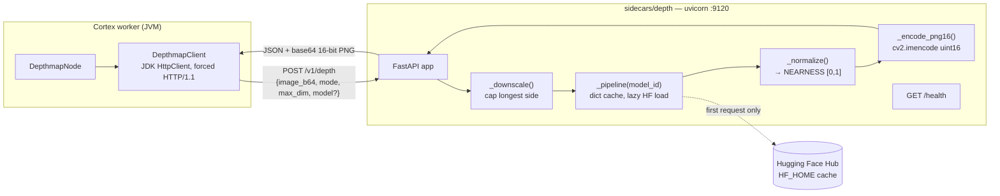

# Depth Sidecar (`sidecars/depth`) — Technical Specification

> **Audience: AI coding agents.** The Python side of the `depthmap` feature: a FastAPI monocular
> depth server on **:9120**. This file covers the **sidecar only** (server, models, HTTP contract,
> env, deployment). The Java node, its ports, persistence, tests and open node-side work are in
> [NODE_DEPTHMAP.md](../features/nodes/depthmap/NODE_DEPTHMAP.md)
> — do not duplicate them here.

**Status: BUILT, never run.** All five files exist and the Java side is fully wired against them.
There is **no `.venv` in `sidecars/depth/`** in this checkout and no `Dockerfile`, so the server has
never been started here and no live inference result has ever been observed (see §7).

---

## 1. Files

`sidecars/depth/` contains exactly five files. There is no `pyproject.toml`, no Dockerfile, no
Python test, no model config file — model ids are string constants in `server.py`.

| File | Lines | Purpose |
|---|---|---|
| `sidecars/depth/server.py` | 261 | The whole server: config, model routing, NEARNESS normalisation, 16-bit PNG encode, `GET /health`, `POST /v1/depth` |
| `sidecars/depth/README.md` | 124 | Operator-facing doc: convention, model/licence table, API, smoke test, env table |
| `sidecars/depth/requirements.txt` | 17 | fastapi/uvicorn/pydantic, transformers+torch, pillow/numpy, `opencv-python-headless` |
| `sidecars/depth/setup.sh` | 24 | Creates `.venv`, installs requirements, prints the licence warning |
| `sidecars/depth/run.sh` | 10 | `exec ./.venv/bin/uvicorn server:app --host $DEPTH_HOST --port $DEPTH_PORT` |

---

## 2. Architecture



The sidecar is stateless apart from the in-process `_pipelines` model cache. It never talks to Loom,
never touches the filesystem (the PNG travels in the response body; the *node* writes it to
`metaPath/depthmap_bin/`), and holds no queue — one HTTP request, one inference.

---

## 3. HTTP contract (as implemented on both sides)

### 3.1 `GET /health` — `server.py:240`

```jsonc
{"status":"ok","device":"cuda","convention":"NEARNESS",
 "models":{"relative":"…","metric":"…"},"maxDim":1024,"loaded":["…"]}
```

`loaded` is `sorted(_pipelines.keys())` — empty until the first inference. **Nothing in Java calls
`/health`** (grep for `health` under `cortex/nodes/depthmap/` returns nothing); it exists for
operators and container probes only.

### 3.2 `POST /v1/depth` — `server.py:252`

Request body (`DepthRequest`, `server.py:226`) vs. what `DepthmapClient.depth()` actually sends:

| Field | Type | Server default | Sent by Java? |
|---|---|---|---|
| `image_b64` | string, required | — | yes — base64 **PNG** from `DepthImages.toBase64Png` (alpha flattened onto white) |
| `mode` | string, optional | `"RELATIVE"` | yes — always, `DepthMode.name()`, `RELATIVE`\|`METRIC` |
| `model` | string, optional | `null` → env default for the mode | only when `options().getModel()` is non-blank |
| `max_dim` | int, optional | `null` → `DEPTH_MAX_DIM` | yes — always, `options().getMaxDim()` |

Response (200):

```jsonc
{"model":"depth-anything/Depth-Anything-V2-Small-hf",
 "convention":"NEARNESS","source":"RELATIVE",
 "width":1024,"height":683,          // the MAP's size after downscaling, not the source image's
 "png_b64":"iVBORw0…",               // 16-bit grayscale PNG, 65535 = NEAREST
 "stats":{"p05":0.11,"p50":0.38,"p95":0.82},
 "metric":{"min_m":1.2,"max_m":14.7}} // present ONLY when source == METRIC
```

Every key except `metric` is unconditional. The node reads `model`, `convention`, `png_b64`,
`width`, `height`, and copies `stats`/`metric` through when present (`DepthmapNode.buildMeta`).
`convention` is hard-validated against `NEARNESS`; any other value throws.

### 3.3 Error codes

| Status | Raised at | Body shape |
|---|---|---|
| `400` | empty/blank `image_b64`; `mode` not `RELATIVE`/`METRIC`; invalid base64; undecodable image | `{"detail":"…"}` |
| `422` | FastAPI/pydantic — `image_b64` missing entirely, or a wrong-typed field | FastAPI validation envelope, **not** `{"detail": "<string>"}` |
| `500` | `cv2.imencode` failure; squeezed depth array is not 2-D | `{"detail":"…"}` |

`DepthmapClient` treats *any* non-2xx identically: it throws
`RuntimeException("Depth request failed (HTTP " + code + "): " + body)`. It does not parse `detail`,
so the 400/422 body-shape difference is invisible to Java. Connection/timeout failures are wrapped as
`RuntimeException("Depth request to <uri> failed", e)` — note the method declares `IOException` but
transport failures arrive **unchecked**. `DepthmapNode.compute` catches `Exception`, so both paths
end as a `FAILED` ledger row.

### 3.4 Mismatches / rough edges found between the two sides

- 🔴 **`mode` decides the normalisation direction, `model` does not.** `_normalize(raw, mode)` inverts
  iff `mode == "METRIC"`. A per-request `model` override is applied *independently* of `mode`
  (`_model_id`), so pointing `nodes.depthmap.model` at a metric checkpoint while leaving
  `mode=RELATIVE` (or the reverse) produces a **silently inverted map** — `convention` still says
  `NEARNESS`, the node still reports `SUCCESS`, and every downstream ordering is backwards.
  `DepthmapNodeOptions.validate()` does not check the pair. Overriding `model` only makes sense
  within the same family as the mode.
- 🔴 **Negative `max_dim` bypasses the server cap.** `effective_dim = min(max_dim or MAX_DIM, MAX_DIM)`
  keeps a negative value, and `_downscale` returns the image unchanged when `max_dim <= 0`. Java
  cannot trigger it (`validate()` rejects `maxDim <= 0`), but any other client can send a
  full-resolution image straight into the model. `max_dim: 0` is harmless — falsy, so it falls back
  to `DEPTH_MAX_DIM`.
- ⚠️ **Double downscale.** The node already downscales to `maxDim` (`DepthImages.downscale`) *and*
  sends `max_dim`, so the server-side resize is normally a no-op. It stops being one when
  `DEPTH_MAX_DIM < nodes.depthmap.maxDim`: the map then comes back smaller than the node asked for.
  That is safe because the node stores the *response's* `width`/`height` as the map dims and the
  source image's separately — a consumer that rescales via `DepthMap.projectFromImage` stays correct.
- ⚠️ **Map dimensions are transformers-version dependent.** `_estimate` prefers
  `result["predicted_depth"]` over `result["depth"]`; whether the pipeline interpolates
  `predicted_depth` back to the input size is a property of the installed `transformers` release
  (`requirements.txt` pins only `>=4.50`). Do not assume the map equals the sent image size — that
  is exactly why both dimension pairs travel in `meta`.
- ⚠️ **A degenerate map still returns 200.** `_normalize` returns a flat `0.5` (PNG value 32767 after
  the `uint16` truncation of `0.5*65535`) when the raw output has no gradient — a blank wall *or* a
  broken model. The node cannot distinguish that from success; only `stats` (p05==p50==p95==0.5)
  reveals it, and nothing in Java inspects `stats` today.

---

## 4. Models

| Mode | Env var | Default checkpoint | Licence |
|---|---|---|---|
| `RELATIVE` (default) | `DEPTH_MODEL` | `depth-anything/Depth-Anything-V2-Small-hf` (~25M ViT-S, CPU-viable) | **Apache-2.0** |
| `METRIC` (opt-in) | `DEPTH_MODEL_METRIC` | `Intel/zoedepth-nyu-kitti` | MIT |

🔴 **Never point `DEPTH_MODEL` at Depth-Anything-V2 Base or Large** — those are CC-BY-NC-4.0.
Small is the only permissive member of that family. The documented permissive upgrade path is
`Intel/dpt-large` (MiDaS 3.0). This warning is duplicated in `README.md` and printed by `setup.sh`.
Both defaults are ungated, so no `HF_TOKEN` is needed. Rationale for rejecting Depth Pro / Marigold
is in `sidecars/depth/README.md`.

---

## 5. Environment variables

Read directly by `server.py` unless noted:

| Var | Default | Read at | Meaning |
|---|---|---|---|
| `DEPTH_MODEL` | `depth-anything/Depth-Anything-V2-Small-hf` | `server.py:73` | Checkpoint for `RELATIVE` |
| `DEPTH_MODEL_METRIC` | `Intel/zoedepth-nyu-kitti` | `server.py:74` | Checkpoint for `METRIC` |
| `DEPTH_MAX_DIM` | `1024` | `server.py:75` | Hard server cap on the longest side; clamps a larger client `max_dim` |
| `DEVICE` | `cuda` if `torch.cuda.is_available()` else `cpu` | `server.py:94` | torch device passed to `hf_pipeline(device=…)` |
| `DEPTH_HOST` | `0.0.0.0` | **`run.sh` only** | uvicorn bind address |
| `DEPTH_PORT` | `9120` | **`run.sh` only** | uvicorn port |
| `PYTHON` | `python3` | **`setup.sh` only** | Interpreter used to create `.venv` |
| `CUDA_VISIBLE_DEVICES` | — | not read by repo code | Consumed by torch |
| `HF_HOME` | — | not read by repo code | Consumed by huggingface_hub for the checkpoint cache |

⚠️ `DEPTH_HOST`/`DEPTH_PORT` are **shell-script variables, not application config**. The
`uvicorn server:app --host 0.0.0.0 --port 9120` invocation in the `server.py` docstring ignores them.
Use `run.sh` if you want them honoured.

Values are captured at **import time** — changing any of them requires a restart. `DEVICE` is also
resolved once, so a GPU that appears later is not picked up.

---

## 6. Deployment

| Mechanism | State |
|---|---|
| Local dev | `./setup.sh` then `./run.sh` — the only supported path today |
| `Dockerfile` | 🔴 **does not exist.** Siblings that do have one: `sidecars/ideogram-sidecar/`, `sidecars/mage-flow-sidecar/`, `sidecars/ltx2-sidecar/` — copy the `nvidia/cuda:*-runtime` pattern and `EXPOSE 9120` |
| docker-compose | 🔴 no entry anywhere (`test-database/docker-compose.yaml` is unrelated) |
| Helm | 🔴 no reference in `helm/` — the only `9120`-looking match in `helm/cortex/values.yaml` is `maxCacheBytes`, a coincidence |

The node reaches the sidecar via `nodes.depthmap.depthHost`/`depthPort` (default `localhost:9120`),
so in production the sidecar must be co-located with the worker — see the deployment section of
[../../sidecars/README.md](../../sidecars/README.md). Port allocation across sidecars: tts `9100`,
sentiment `9110`, **depth `9120`**, imagegen `9200`/`9210`, videogen `9220`.

---

## 7. Test setup

There is **no Python test of any kind** for this sidecar — no pytest, no `TestClient`, no fixture.
All depthmap coverage is Java and stubs `DepthmapClient` by subclassing, so the Python code is
exercised by **nothing** in CI. See §4 of
[NODE_DEPTHMAP.md](../features/nodes/depthmap/NODE_DEPTHMAP.md)
for the 29 unit tests + integration test on the Java side, and `DepthmapTestFixtures` for the canned
response shape those tests assert against — that fixture is the de-facto contract snapshot.

Manual smoke test (the full script is in `sidecars/depth/README.md`):

```bash
cd sidecars/depth && ./setup.sh && ./run.sh    # :9120
curl -s localhost:9120/health                  # expect convention:"NEARNESS"
# POST an image, decode png_b64, open it
```

🔴 **The acceptance check is visual: the foreground must be BRIGHT.** A dark foreground means the
normalisation inverted. Re-run it after any model, `transformers` or `_normalize` change — no
automated test can catch this.

---

## 8. Conventions and Gotchas

| Area | Gotcha |
|---|---|
| **NEARNESS** | 🔴 `[0,1]`, **1 = nearest**, PNG `65535` = nearest. Defined once, in `_normalize` (`server.py:121`). Relative models predict disparity (bigger = nearer) → plain min-max; metric models predict metres (bigger = farther) → min-max **and inverted**, metre range reported in `metric`. Never normalise anywhere else. |
| **16-bit, `cv2` not PIL** | `_encode_png16` uses `cv2.imencode` on a `uint16` array; PIL's `I;16` mode is version-dependent and has silently written 8-bit files. 8 bits would collapse two similarly-distant objects into one bucket. Do not "simplify" `opencv-python-headless` away. |
| **Stats are of the normalised map** | `p05/p50/p95` are percentiles of nearness, not depth. For any non-degenerate map the extremes are 0 and 1 by construction, so stats describe distribution *shape* only. |
| **Model cache is unbounded and unlocked** | `_pipelines` (`server.py:98`) is a plain dict with no eviction and no lock. Two concurrent cold requests load the same checkpoint twice; a client-supplied `model` string can make the process download and pin an arbitrary Hub model in VRAM forever. |
| **No concurrency control** | Both routes are plain `def`, so FastAPI runs them in its threadpool and several inferences can hit one pipeline object simultaneously. There is no semaphore, queue or batching. The node descriptor's concurrency-1 bounds one worker, not several. |
| **No auth, binds `0.0.0.0`** | Combined with the arbitrary-`model` download above, this must not be exposed beyond the pod/host. |
| **Cold start vs. node timeout** | The first request for a mode pays the Hub download + load inside the node's `timeoutMs` (default 120 000 ms). A cold CPU start can exceed it; warm the sidecar before enabling the node. Nothing in Java gates on `/health`. |
| **Alpha is flattened white** | `DepthImages.toBase64Png` composites transparency onto white before sending, so a transparent background reaches the model as a white surface, not as "no data". |
| **PNG on the wire, both directions** | The node sends PNG (JPEG blocking artifacts become spurious depth edges) and the sidecar returns PNG. |
| **JSON envelope, not `image/png`** | Deliberate, unlike the imagegen sidecar: `model`, `convention` and `metric` are not optional for the consumer, and one round trip beats a `/meta` call that can disagree with the pixels. |
| **`source` echoes the request** | The `source` field is the requested `mode`, not a detected model family. It is a label, not a verification. |

---

## 9. Key Files Reference

| Name | Path | Purpose |
|---|---|---|
| `server.py` | `sidecars/depth/server.py` | The whole sidecar |
| `_normalize` | `sidecars/depth/server.py:121` | 🔴 Single source of truth for NEARNESS |
| `_encode_png16` | `sidecars/depth/server.py:147` | uint16 → base64 16-bit PNG via `cv2.imencode` |
| `_downscale` | `sidecars/depth/server.py:158` | Longest-side cap; never upscales |
| `_pipeline` / `_pipelines` | `sidecars/depth/server.py:98,107` | Lazy per-checkpoint `transformers` pipeline cache |
| `DepthRequest` | `sidecars/depth/server.py:226` | Request schema |
| `run.sh` / `setup.sh` | `sidecars/depth/` | Start / provision `.venv` |
| `DepthmapClient` | `cortex/nodes/depthmap/core/src/main/java/io/metaloom/cortex/node/depthmap/DepthmapClient.java` | The only caller; forced HTTP/1.1, non-final for test stubbing |
| `DepthmapNode` | same dir, `DepthmapNode.java` | Validates `convention`, writes the PNG, records the ledger row |
| `DepthmapNodeOptions` | same dir, `DepthmapNodeOptions.java` | `depthHost`/`depthPort`/`mode`/`model`/`maxDim`/`timeoutMs` |
| `DepthImages` | same dir, `DepthImages.java` | ImageIO read/downscale/base64-PNG; no OpenCV |
| `DepthmapTestFixtures` | `cortex/nodes/depthmap/core/src/test/java/io/metaloom/cortex/node/depthmap/DepthmapTestFixtures.java` | Canned response — the contract snapshot |
| `DepthMap` | `cortex/nodes/scene-layout/core/src/main/java/io/metaloom/cortex/node/scenelayout/DepthMap.java` | Downstream reader: `TYPE_USHORT_GRAY` → `[0,1]`, `projectFromImage` |

---

## 10. Where do I find …?

| I want to … | Look at |
|---|---|
| The server itself | `sidecars/depth/server.py` |
| The NEARNESS definition | `sidecars/depth/server.py` → `_normalize` |
| Model ids, licences, rejected alternatives | `sidecars/depth/README.md` §Models; `setup.sh` banner |
| The request/response schema | §3 above; `DepthRequest` + `_estimate` in `server.py` |
| The Java caller | `cortex/nodes/depthmap/core/.../DepthmapClient.java` |
| Node options, ports, persistence, node tests | [NODE_DEPTHMAP.md](../features/nodes/depthmap/NODE_DEPTHMAP.md) |
| The consumer of the produced map | [NODE_SCENE_LAYOUT.md](../features/nodes/scene-layout/NODE_SCENE_LAYOUT.md) |
| Sidecar port allocation + deployment shape | [../../sidecars/README.md](../../sidecars/README.md) |
| A Dockerfile to copy | `sidecars/ideogram-sidecar/Dockerfile`, `sidecars/ltx2-sidecar/Dockerfile` |
| Sibling sidecar contracts | [NODE_SENTIMENT.md](../features/nodes/sentiment/NODE_SENTIMENT.md), [NODE_IMAGEGEN.md](../features/nodes/image-generation/NODE_IMAGEGEN.md) |
| Where node options come from | [../cortex/CONFIGURATION.md](../cortex/CONFIGURATION.md) (`nodes/depthmap`) |
| Customer-facing docs | `website/content/english/docs/nodes/depthmap/index.adoc` |
| Definition of done for a code change | [../guidelines/CODING.md](../guidelines/CODING.md) |

---

## 11. Progress Assessment

### Built
- [x] `server.py` with `GET /health` and `POST /v1/depth`
- [x] NEARNESS normalisation for both families, implemented once (`_normalize`)
- [x] 16-bit grayscale PNG encoding via `cv2.imencode`
- [x] Lazy per-checkpoint model loading; both defaults ungated (no `HF_TOKEN`)
- [x] Server-side `max_dim` cap that clamps an over-eager client
- [x] `RELATIVE`/`METRIC` routing + per-request `model` override
- [x] `metric.min_m`/`max_m` reported for metric mode
- [x] `setup.sh` / `run.sh` / `requirements.txt` / `README.md`
- [x] Java client wired end to end; `convention` hard-validated node-side
- [x] Port row in `sidecars/README.md`

### Open
- [ ] **Never executed in this checkout** — no `.venv` exists, no live inference has been observed
- [ ] Visual foreground-is-bright acceptance check against a real checkpoint
- [ ] `Dockerfile` + compose/Helm wiring (§6)
- [ ] Any Python test at all (a `TestClient` test with a stub pipeline would cover `_normalize`,
      the `max_dim` clamp and the error codes without a GPU)
- [ ] Guard against the `mode` vs. `model` mismatch in §3.4 — either detect the family from the
      checkpoint or reject a `model` override that disagrees with `mode`
- [ ] Fix `effective_dim` so a negative `max_dim` cannot bypass the cap
- [ ] Bound / lock `_pipelines`, and restrict which `model` ids a request may name
- [ ] Serialise or queue inference instead of relying on FastAPI's threadpool
- [ ] Surface the degenerate flat-`0.5` case as something a consumer can act on
- [ ] Model-licence page entry (`website/.../legal/model-licenses/`) — tracked in the node plan

### Deliberately not built
- [ ] ~~Batch endpoint~~ — one image per request; the node has no batching either
- [ ] ~~Raw `image/png` response~~ — the metadata is not optional (§8)
- [ ] ~~Video / per-keyframe depth~~ — refused node-side; storage shape undecided (node plan §5)
- [ ] ~~In-JVM inference (ONNX/DJL)~~ — the sidecar is the house style

---

_Last updated: 2026-08-02 — git HEAD `d930e222`_
_Git HEAD revision: `742dae2d`_
_Last updated: 2026-08-06 (reference sweep — no content changes)_