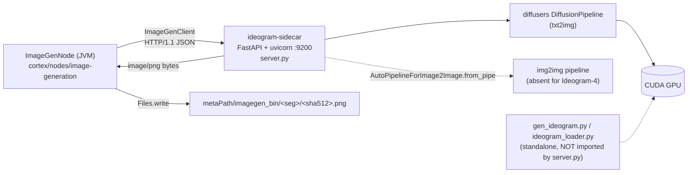

# `ideogram-sidecar` — Image-Generation Model Server

> **Scope.** This file documents the **sidecar process** in `sidecars/ideogram-sidecar/`: its HTTP
> surface, env config, model backends, hardware envelope and bring-up findings.
> The **Java node** that calls it (`imagegen` / `ImageGenNode`) is specified in
> [../features/pipeline-nodes/NODE_IMAGEGEN_PLAN.md](../features/pipeline-nodes/NODE_IMAGEGEN_PLAN.md)
> — node ports, options, persistence and node tests are **not** repeated here.
> Node catalog: [../features/pipeline-nodes/NODES.md](../features/pipeline-nodes/NODES.md).
> [../plans/imagegen-node.md](../plans/imagegen-node.md) is a superseded draft; do not add detail there.
>
> The alternative backend for the same node, `sidecars/mage-flow-sidecar/` (port `9210`, MIT weights),
> has **no spec file** (verified: nothing under `spec/` covers it) — see Progress Assessment.
>
> **Status: built and manually exercised, not automated.** No Python tests exist in the directory,
> and no end-to-end run of `ImageGenNode` against a live sidecar has been recorded.

---

## 1. Architecture



Model choice is entirely env-driven (`IMAGEGEN_MODEL`); the HTTP contract is deliberately
model-agnostic so `mage-flow-sidecar` can serve the same node by changing only the node's `port`.

---

## 2. HTTP contract (as implemented on both sides)

Server: `sidecars/ideogram-sidecar/server.py`. Client: `ImageGenClient.java`.
Both endpoints return **raw `image/png` bytes** (`Response(media_type="image/png")`); the node writes
`response.body()` to disk unchanged — no JSON envelope, no base64 on the response side.

| Method | Path | Called by the node? | Body → Response |
|---|---|---|---|
| GET | `/health` | **No** (`ImageGenClient` has no health call — grep of the module finds no `health`) | — → `{status, model, device, dtype, cpu_offload, remix_mode}` |
| POST | `/generate` | yes, mode `GENERATE` | `GenerateRequest` → `image/png` |
| POST | `/remix` | yes, mode `REMIX` | `RemixRequest` → `image/png` |

**`GenerateRequest`** (pydantic): `prompt: str` (required), `width: int = 1024`, `height: int = 1024`,
`seed: int|None`, `steps: int|None`, `guidance: float|None`.
The node sends `prompt`, `width`, `height`, `steps` always, `seed` only when non-null, **never `guidance`**.

**`RemixRequest`**: `image_b64: str` (required), `prompt: str` (required), `strength: float = 0.6`,
`seed: int|None`, `steps: int|None`, `guidance: float|None`.
The node sends `image_b64` (source `BufferedImage` re-encoded as PNG via `ImageIO`, then base64),
`prompt`, `strength`, `steps`, and `seed` when non-null. `IN_MEDIA` is *not* read — the pixels come
from `ctx.media().file()`.

`/health` keys `dtype` and `cpu_offload` are returned by `server.py` but are **not** listed in
NODE_IMAGEGEN_PLAN.md §3, which shows `{status, model, device, remix_mode}`. Minor doc drift only.

### Status codes

| Code | Emitted where | Node behaviour |
|---|---|---|
| `200` | success | PNG bytes written to `imagegen_bin` |
| `400` | `/remix`, `base64.b64decode` / `PIL.Image.open` failure → `"bad image_b64: …"` | non-2xx → `RuntimeException("Image sidecar returned HTTP 400 …" + body)` → ledger row `FAILED`, `OUT_FLAG="FAILED"` |
| `503` | either endpoint when `_txt2img is None` (`"model still loading"`) | same failure path. **Near-unreachable in practice**: loading happens in the `@app.on_event("startup")` hook, so a failed load kills the process instead (see `server.log`) |
| `422` | FastAPI/pydantic body-validation default (framework behaviour, not written in `server.py`; not exercised anywhere in this repo) | same failure path |

No timeout is configured server-side; the node's `timeoutMs` (default `120_000`) is the only bound —
too small for Ideogram-4 at 50 steps (~377 s measured, §4).

### Contract mismatches worth knowing

- **`guidance` is unreachable from the node.** `ImageGenClient` has no guidance parameter, so
  `IMAGEGEN_GUIDANCE` (default `0.0`) governs *all* node traffic. For Ideogram-4 nf4 the only stable
  value is `1.0` (§6) — that must be set in the sidecar env, it cannot come from node options.
- **`steps` is always sent** (node default `30`), so `IMAGEGEN_STEPS` (default `4`) only ever applies
  to direct `curl` traffic. A turbo model therefore runs ~7× longer than needed unless the node's
  `steps` is set to `4`.
- **`/remix` silently degrades.** When `AutoPipelineForImage2Image.from_pipe` raises
  `ValueError|KeyError|NotImplementedError`, `_img2img` stays `None` and `/remix` runs prompt-only
  text-to-image at the source image's size rounded down to a multiple of 16 — the source pixels are
  discarded, still returning `200`. `/health.remix_mode` (`img2img` vs `txt2img-fallback`) is the only
  signal, and nothing in the JVM reads it.
- **`strength` bump.** In real img2img mode the server raises steps to
  `max(steps, round(1/strength) + 1)` because turbo pipelines need `steps * strength >= 1`.

---

## 3. Model backends

| Backend | `IMAGEGEN_MODEL` | Gated | Weight licence | img2img |
|---|---|---|---|---|
| **SDXL-Turbo** (default) | `stabilityai/sdxl-turbo` | no | Stability community — **non-commercial** | yes (true img2img) |
| Ideogram 4 nf4 | `ideogram-ai/ideogram-4-nf4` (README) / `ideogram-ai/ideogram-4-nf4-diffusers` (`gen_ideogram.py`) | **yes** + `HF_TOKEN` | Ideogram 4 Non-Commercial | **no** → `/remix` falls back |
| any diffusers repo | HF id or local path | — | its own | depends |

`ideogram_card.md` (the upstream model card, vendored) states: Ideogram 4 is **9.3 B** params; the
**nf4** build is CUDA-only with diffusers support; the **fp8** build has *no* diffusers support.
Both weight variants are non-commercial. Neither the card nor the code states an official VRAM
minimum — the README asserts "~24 GB CUDA" for Ideogram-4 and "~8-12 GB" for SDXL-Turbo.

### Measured on a ~11.63 GiB CUDA card (from the committed bring-up logs)

| Run | Config | Result |
|---|---|---|
| `gen_out2.log` / `gen_remix2.log` | Ideogram-4 nf4, bf16, 1024², 50 steps, `guidance_scale=1.0`, conditional transformer resident | **377–378 s, peak VRAM 9.83 GB** (~7.4 s/step) |
| `probe_noswap.log` | same, 28 steps | 214 s, peak 9.83 GB |
| `probe_native2.log` | 48 steps, per-step swap variant | 683 s (~14.1 s/step) — swapping doubles step cost |
| `probe_gw.log` | with CFG / both transformers resident | `torch.OutOfMemoryError` — 832 MiB alloc failed with 10.94 GiB in use |
| `server.log` | `server.py` + `IMAGEGEN_MODEL=ideogram-ai/ideogram-4-nf4`, `IMAGEGEN_CPU_OFFLOAD=1` | **startup failed**: `NotImplementedError: Cannot copy out of meta tensor` |

---

## 4. Environment variables

Read in `server.py` (module level) unless noted. There are **no** `IMAGEGEN_HOST` / `IMAGEGEN_PORT`
variables — unlike `tts`/`sentiment`/`depth`/`mage-flow`/`ltx2`, the bind address comes only from the
uvicorn CLI (`--host` / `--port`).

| Variable | Default | Effect |
|---|---|---|
| `IMAGEGEN_MODEL` | `stabilityai/sdxl-turbo` | HF repo id or local path passed to `DiffusionPipeline.from_pretrained` |
| `IMAGEGEN_DEVICE` | `cuda` if `torch.cuda.is_available()` else `cpu` | torch device |
| `IMAGEGEN_DTYPE` | `float16` on cuda, else `float32` | one of `float16` \| `bfloat16` \| `float32`; an unknown value raises `KeyError` at import |
| `IMAGEGEN_STEPS` | `4` | fallback steps when the request omits `steps` (node always sends it) |
| `IMAGEGEN_GUIDANCE` | `0.0` | `none` / `default` / `""` → omit `guidance_scale` entirely and let the pipeline default apply |
| `IMAGEGEN_CPU_OFFLOAD` | `0` | anything not in `{0, "", false, False}` enables `enable_model_cpu_offload()` (cuda only) — **broken for Ideogram-4**, §6 |
| `CUDA_VISIBLE_DEVICES` | — | GPU pinning (torch, not read by `server.py`) |
| `HF_TOKEN` | — | gated repos; `server.py` does not read it explicitly — it relies on huggingface_hub picking it up. `gen_ideogram.py` reads it via `os.environ.get("HF_TOKEN")` |
| `HF_HOME` | `/root/.cache/huggingface` (Dockerfile only) | model cache location in the image |

`fp16` variant selection is automatic: when dtype is `float16` the loader first tries
`variant="fp16"` and retries without it on any exception.

---

## 5. Running and deploying

There is **no `run.sh` and no `setup.sh`** in this directory (verified by listing) — `sidecars/README.md`
claims every sidecar is self-contained with those scripts; for this one that is wrong. Start it manually:

```bash
cd sidecars/ideogram-sidecar
python -m venv venv && ./venv/bin/pip install -r requirements.txt
CUDA_VISIBLE_DEVICES=1 ./venv/bin/uvicorn server:app --host 0.0.0.0 --port 9200
```

Docker: `Dockerfile` is `nvidia/cuda:12.4.1-runtime-ubuntu22.04` + `pip install -r requirements.txt`,
`EXPOSE 9200`, `CMD uvicorn server:app --host 0.0.0.0 --port 9200`. It **copies only `server.py`** —
`ideogram_loader.py` and `gen_ideogram.py` are not in the image.

Deps (`requirements.txt` / `pyproject.toml`, unpinned, `requires-python >= 3.10`): torch,
`diffusers>=0.30`, transformers, accelerate, safetensors, fastapi, `uvicorn[standard]`, pillow.
`bitsandbytes` is **not** listed although the nf4 path needs it — install it separately.

No Kubernetes/Helm deployment exists: `helm/` contains no reference to this sidecar or port 9200.
The port is fixed by convention only (`9100` tts, `9110` sentiment, `9120` depth, **`9200` ideogram**,
`9210` mage-flow, `9220` ltx2 — see `sidecars/README.md`).

---

## 6. Conventions and Gotchas

- **The nf4 "safety card" is a quantization artifact, not a filter.** Any classifier-free guidance
  (`guidance_scale > 1`) or per-step transformer CPU↔GPU swapping collapses Ideogram-4 nf4 into a grey
  *"Image blocked by safety filter"* image. `gen_ideogram.py`'s docstring records this; the only stable
  configuration is `guidance_scale=1.0`, `guidance_schedule=None`, unconditional branch stubbed to
  zeros. Real Ideogram moderation is an external Hive API call absent from the diffusers path.
- **`server.py` cannot run Ideogram-4 on a 12 GB card today.** Its only memory strategy is
  `enable_model_cpu_offload()`, which `ideogram_loader.py` documents as unusable here (the CpuOffload
  hook attaches to `.forward`, but `Ideogram4Pipeline` calls text-encoder *submodules* directly) and
  which failed at startup with `Cannot copy out of meta tensor` (`server.log`). The working recipes
  live in `ideogram_loader.py` (`load_ideogram`) and `gen_ideogram.py` — **neither is imported by
  `server.py`** (verified by grep). Running Ideogram through the HTTP contract on ≤12 GB requires
  wiring one of them in.
- **bnb-4bit modules must be *loaded* on GPU**, then moved to CPU; loading them to CPU or via
  accelerate `device_map` offload (meta device) fails. `_park()` in `ideogram_loader.py` encodes this.
- **`Ideogram4Pipeline._execution_device` is monkey-patched to CUDA** in both `ideogram_loader.py` and
  `gen_ideogram.py` so latents/conditioning are built on GPU while heavy modules sit on CPU.
- **Text encoder must run on GPU**: it is invoked through submodules, so it is moved around
  `encode_prompt` rather than hooked. Running bnb-4bit on CPU produces broken features → grey card.
- **`register_forward_hook` corrupts bnb-4bit output** — `_wrap_forward_with_swap` wraps `forward`
  directly instead (comment in `ideogram_loader.py`).
- **FastAPI needs HTTP/1.1** — `ImageGenClient` forces `Version.HTTP_1_1`; HTTP/2 is rejected.
- **Directory hygiene**: 12 probe `*.log` files, `install.log`, `download*.log`, `server.log` and the
  vendored `ideogram_card.md` are **git-tracked**; `.gitignore` only excludes `*.png`. `__pycache__/`
  is present on disk and not ignored.
- **Licensing**: both the default (SDXL-Turbo) and the opt-in (Ideogram-4) weights are non-commercial.
  For a commercially deployable `imagegen`, use `sidecars/mage-flow-sidecar` (MIT) instead.

---

## 7. Test setup

There is **no test suite for this sidecar** — no `test_*.py`, no pytest config, no CI hook (verified by
listing the directory). Coverage is manual:

```bash
curl -s localhost:9200/health | jq          # expect status=ok, model, remix_mode

curl -s -X POST localhost:9200/generate -H 'content-type: application/json' \
  -d '{"prompt":"a red panda astronaut, studio lighting","seed":42,"steps":4}' -o out.png

IMG=$(base64 -w0 out.png)
curl -s -X POST localhost:9200/remix -H 'content-type: application/json' \
  -d "{\"image_b64\":\"$IMG\",\"prompt\":\"same panda, cyberpunk neon\",\"strength\":0.6}" -o remix.png

# Ideogram-4 nf4 on a 12 GB card, bypassing server.py:
HF_TOKEN=hf_... python gen_ideogram.py "a poster that reads METALOOM" out.png 50 1024 0
```

The Java side is tested with a **stubbed `ImageGenClient`** (22 unit tests + `ImageGenNodeIntegrationTest`),
so nothing in the JVM test suite requires this process to be running — see
[../features/pipeline-nodes/NODE_IMAGEGEN_PLAN.md](../features/pipeline-nodes/NODE_IMAGEGEN_PLAN.md) §5.

---

## 8. Progress Assessment

- [x] FastAPI server with `/health`, `/generate`, `/remix` returning `image/png` (`server.py`)
- [x] Model-agnostic, env-driven backend selection; SDXL-Turbo default (ungated)
- [x] Graceful `/remix` degradation when the backend has no img2img pipeline
- [x] Dockerfile (CUDA 12.4 runtime), `requirements.txt`, `pyproject.toml`, README
- [x] Ideogram-4 nf4 made to work on a ~12 GB card **outside** the server (`gen_ideogram.py`, verified: 1024², 50 steps, 9.83 GB peak)
- [x] Staged loader with manual deterministic offload documented (`ideogram_loader.py`)
- [x] Java client + node consume the contract (`ImageGenClient`, `ImageGenNode`)
- [ ] **Wire `ideogram_loader.load_ideogram` / the `gen_ideogram.py` recipe into `server.py`** — today
      `IMAGEGEN_MODEL=ideogram-ai/ideogram-4-nf4` + `IMAGEGEN_CPU_OFFLOAD=1` fails at startup
- [ ] **Expose `guidance` through `ImageGenClient`** (or default `IMAGEGEN_GUIDANCE` per model family);
      the node cannot currently request the `guidance_scale=1.0` that nf4 needs
- [ ] **`run.sh` / `setup.sh`** to match the other sidecars and `sidecars/README.md`'s claim
- [ ] **No `/health` readiness probe from the JVM** — the node discovers a dead sidecar only by a failed generate
- [ ] **Repo hygiene**: untrack the probe/bring-up logs, ignore `__pycache__/`
- [ ] **Pin dependencies** (all unpinned) and add `bitsandbytes` for the nf4 path
- [ ] **No automated tests** for the sidecar; **no live GPU end-to-end run** of `ImageGenNode` against it
- [ ] **Commercial-safe default model undecided** (see NODE_IMAGEGEN_PLAN.md §4); `website/.../docs/legal/model-licenses/` is stale
- [ ] `sidecars/mage-flow-sidecar` and `sidecars/ltx2-sidecar` have no spec file; `spec/sidecars/` (this new directory) is not yet listed in [../CONTEXT.md](../CONTEXT.md)

---

## 9. Key Files Reference

| File | Path | Purpose |
|---|---|---|
| `server.py` | `sidecars/ideogram-sidecar/server.py` | The FastAPI app: config from env, pipeline loading, `/health` `/generate` `/remix` |
| `ideogram_loader.py` | `sidecars/ideogram-sidecar/ideogram_loader.py` | `load_ideogram()` — staged load + manual CPU offload for nf4 on 12 GB. **Unused by `server.py`** |
| `gen_ideogram.py` | `sidecars/ideogram-sidecar/gen_ideogram.py` | Standalone CLI proving the stable nf4 recipe (`guidance_scale=1.0`, zero-stub unconditional branch) |
| `ideogram_card.md` | `sidecars/ideogram-sidecar/ideogram_card.md` | Vendored upstream model card: 9.3 B params, nf4/fp8 variants, non-commercial licence |
| `Dockerfile` | `sidecars/ideogram-sidecar/Dockerfile` | CUDA 12.4 runtime image, `EXPOSE 9200`, copies `server.py` only |
| `requirements.txt` / `pyproject.toml` | same dir | Unpinned deps, Python ≥ 3.10 |
| `README.md` | `sidecars/ideogram-sidecar/README.md` | Contract, env table, gated-model steps, licence caveat |
| `server.log`, `probe_*.log`, `gen_*.log` | same dir | Committed bring-up evidence (timings, peak VRAM, OOM, meta-tensor failure) |
| `ImageGenClient` | `cortex/nodes/image-generation/core/src/main/java/io/metaloom/cortex/node/imagegen/ImageGenClient.java` | The only JVM caller: HTTP/1.1 JSON → PNG `byte[]` |
| `ImageGenNode` | same package | Mode dispatch, PNG write, ledger row |
| `ImageGenNodeOptions` | same package | `host`/`port` (`localhost:9200`), `generateEndpoint`, `remixEndpoint`, `steps=30`, `timeoutMs=120000` |
| `sidecars/README.md` | `sidecars/README.md` | Sidecar port map and deployment overview |

---

## 10. Where do I find …?

| I want to … | Look at |
|---|---|
| The HTTP handlers and env parsing | `sidecars/ideogram-sidecar/server.py` |
| Which JSON fields the node actually sends | `ImageGenClient.generate` / `ImageGenClient.remix` |
| How PNG bytes are consumed | `ImageGenNode.compute` → `metaPath/imagegen_bin/<seg>/<sha512>.png` |
| The working Ideogram-4 12 GB recipe | `sidecars/ideogram-sidecar/gen_ideogram.py` + `ideogram_loader.py` docstring |
| Evidence for VRAM / timings / the OOM | `gen_out2.log`, `probe_noswap.log`, `probe_gw.log`, `server.log` |
| Why `enable_model_cpu_offload()` is unusable | `ideogram_loader.py` module docstring, item 2 |
| Node options, ports, persistence, node tests | [../features/pipeline-nodes/NODE_IMAGEGEN_PLAN.md](../features/pipeline-nodes/NODE_IMAGEGEN_PLAN.md) |
| The port/content-type model for `artifact/image` | [../features/pipeline/NODE_DATA_TYPES.md](../features/pipeline/NODE_DATA_TYPES.md) |
| Why the generated bytes never reach Loom | [../features/rest/REST_CORTEX_METADATA_BINARY_HANDLING_PLAN.md](../features/rest/REST_CORTEX_METADATA_BINARY_HANDLING_PLAN.md) |
| The MIT-weights alternative on `9210` | `sidecars/mage-flow-sidecar/` (`server.py`, `mage_loader.py`, `run.sh`, `README.md`) — no spec file yet |
| Customer-facing docs | `website/content/english/docs/nodes/imagegen/index.adoc` |
| Model licence position | `website/content/english/docs/legal/model-licenses/index.adoc` (stale) |
| The sidecar port map | `sidecars/README.md` |

---

_Last updated: 2026-08-02 — git HEAD `d930e222`_
