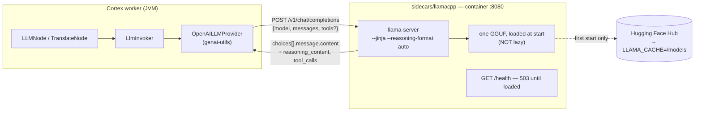

# llama.cpp Sidecar (`sidecars/llamacpp`) — Technical Specification

> **Audience: AI coding agents.** The LLM backend the `llm` (and `translate`, `guard`) node calls: llama.cpp's
> `llama-server` in its official container on **:8080**, speaking the OpenAI chat-completions
> protocol. This file covers the **sidecar only** (scripts, image, HTTP surface, env, deployment).
> The Java nodes, their prompts, ports and persistence live in
> [../features/nodes/NODES.md](../features/nodes/NODES.md) — do not duplicate them here.

**Status: BUILT and verified live.** `run.sh` was executed against docker on this checkout: the
container came up, `/health` went green, `/v1/chat/completions` answered, and a `tools` request
produced a real `tool_calls` array. It is the **first sidecar in this tree with an observed live
result** — the other six are code-verified only. The **podman path is unverified**: podman is not
installed on this machine.

---

## 1. What makes this one different

Every other sidecar under `sidecars/` is our own FastAPI server: a `.venv`, a `requirements.txt`, a
`server.py` we wrote. This one has **none of that**. llama.cpp publishes an official server image, so
the sidecar is three shell scripts wrapping it. Consequences that matter when reasoning about it:

| | The six Python sidecars | `sidecars/llamacpp` |
|---|---|---|
| Our code in the request path | `server.py` | **none** |
| Install step | `setup.sh` → `.venv` | `setup.sh` → image pull (optional) |
| Runtime | `uvicorn --workers 1` on the host | container, docker **or** podman |
| Protocol | a bespoke `POST /v1/<thing>` we defined | OpenAI chat-completions — not ours to change |
| Wire-format drift risk | real (two sides, both ours) | none — upstream owns both ends of the schema |
| Port | 9100–9220 block | **8080**, llama.cpp's own default |

The practical upshot: there is no schema for us to keep in sync, and no Python to test. The failure
modes here are **operational** (image, GPU flags, model download, context size), not protocol.

---

## 2. Files

`sidecars/llamacpp/` contains exactly four files. No Dockerfile — the image is upstream's; no
`requirements.txt`; no Python.

| File | Purpose |
|---|---|
| `sidecars/llamacpp/run.sh` | The sidecar. Detects the runtime, derives GPU flags, starts the container, blocks until `/health` is green |
| `sidecars/llamacpp/stop.sh` | `<runtime> rm -f $LLAMACPP_NAME` |
| `sidecars/llamacpp/setup.sh` | Optional image pre-pull, so the first `run.sh` is not a silent multi-GB download |
| `sidecars/llamacpp/README.md` | Operator-facing doc: env table, model rationale, smoke test |

---

## 3. Architecture



Two differences from the Python sidecars' architecture worth internalising:

* **The model is loaded at container start, not on first request.** `-hf` downloads and loads before
  the server binds, which is why `/health` returns 503 for the first minutes and why `run.sh` has a
  900 s default timeout. The Python sidecars invert this — they bind instantly and stall the *first
  request* instead.
* **One model per container.** There is no model cache dict. Serving a second model means a second
  container on a second port.

---

## 4. HTTP surface

The protocol is upstream's, and the client is `OpenAILLMProvider` from `genai-utils` — neither side
is ours to specify. What matters for this repo:

| Endpoint | Used by | Notes |
|---|---|---|
| `GET /health` | `run.sh` only | `503` while loading, `200 {"status":"ok"}` after. **No node probes it** — same blind spot as the other six |
| `POST /v1/chat/completions` | `LlmInvoker` via `OpenAILLMProvider` | The only call the nodes make |
| `GET /v1/models` | nothing | Reports the single loaded model under its `-hf` reference |

### 4.1 Observed response shape (verified on this checkout)

```jsonc
{"choices":[{"finish_reason":"stop","index":0,
  "message":{"role":"assistant",
             "content":"Hello.",
             "reasoning_content":"Okay, the user asked ...",   // split out by --reasoning-format auto
             "tool_calls":[{"type":"function","id":"…",
                            "function":{"name":"get_weather",
                                        "arguments":"{\"city\": \"Berlin\"}"}}]}}]}
```

`reasoning_content` being a **separate field** is the point of `--reasoning-format auto`. Without it a
thinking model's `<think>` block lands inside `content`, and `LLMNode`'s JSON-mode prompts
(`generateJson`) fail to parse.

### 4.2 🔴 The `model` field is ignored

`LlmInvoker` builds `new LargeLanguageModelImpl(model, endpoint.url(), …)` per call, so each prompt
can name its own model id — that is the documented behaviour of the *options*. **llama.cpp ignores
it.** Verified: a request with `"model":"Qwen/Qwen3-8B"` against a server loaded with
`ggml-org/Qwen3-4B-GGUF:Q4_K_M` is answered by the loaded model with no error and no warning.

So against this sidecar, a per-prompt `model` is **decorative**: it changes the metrics label and
nothing else. Multi-model routing requires one container per model and a distinct `openaiUrl` per
node instance. This is the single most likely source of a "why is my big model not being used"
misdiagnosis, because nothing anywhere reports the substitution.

---

## 5. Configuration

### 5.1 Sidecar env (read by `run.sh`)

All variables are prefixed `LLAMACPP_` — deliberately, against the unprefixed shared `DEVICE` that
`depth`/`sentiment`/`tts` read (see [SIDECARS.md](SIDECARS.md)).

| Variable | Default | Notes |
|---|---|---|
| `LLAMACPP_RUNTIME` | `docker`, else `podman` | First found in `PATH` wins |
| `LLAMACPP_NAME` | `loom-llamacpp` | Container name; also what `stop.sh` removes |
| `LLAMACPP_IMAGE` | `ghcr.io/ggml-org/llama.cpp` | The official repository |
| `LLAMACPP_VERSION` | `server-cuda` | `server` for CPU-only |
| `LLAMACPP_HOST` | `0.0.0.0` | Publish interface. The container always listens on 8080 internally |
| `LLAMACPP_PORT` | `8080` | Host port |
| `LLAMACPP_MODEL` | `ggml-org/Qwen3-4B-GGUF:Q4_K_M` | `-hf` reference |
| `LLAMACPP_CTX_SIZE` | `8192` | `--ctx-size`. See §5.3 |
| `LLAMACPP_GPU` | `all` | `all`, a bare index, or `none` |
| `LLAMACPP_GPU_ARGS` | — | Replaces the derived flags wholesale |
| `LLAMACPP_CACHE` | `/extra/cache` if present, else `$HOME/.cache` | Parent of `llamacpp/` (models) and `huggingface/` |
| `LLAMACPP_STARTUP_TIMEOUT` | `900` | Seconds `run.sh` waits for `/health` |
| `LLAMACPP_EXTRA_ARGS` | — | Appended to the `llama-server` command line |

Unlike `<NAME>_PORT` on the Python sidecars — honoured by `run.sh` but ignored by `server.py` —
`LLAMACPP_PORT` has no second reader to disagree with it. There is no Python here.

### 5.2 GPU flags per runtime

`run.sh` derives them rather than hardcoding one form:

| Runtime | `LLAMACPP_GPU=all` | `LLAMACPP_GPU=0` |
|---|---|---|
| podman | `--device nvidia.com/gpu=all` (CDI) | `--device nvidia.com/gpu=0` |
| docker | `--gpus all` | `--gpus device=0` |

Docker understands CDI from 25.0 on, but **only when a CDI spec is actually installed** — on this
machine `/etc/cdi` and `/var/run/cdi` do not exist while the `nvidia` runtime *is* registered, which
is exactly why `--gpus` is docker's default here and CDI is reachable via `LLAMACPP_GPU_ARGS`. A
script that hardcoded `--device nvidia.com/gpu=…` for docker would fail on this box.

### 5.3 🟡 `contextWindow` and `--ctx-size` are two independent numbers

`AbstractLlmNodeOptions.DEFAULT_CONTEXT_WINDOW` is **2048**; `LLAMACPP_CTX_SIZE` defaults to **8192**.
The node's value is what it *tells the model* it may use; the sidecar's is what the server actually
allocates. Nothing reconciles them:

* node `contextWindow` **>** `--ctx-size` → the server truncates or errors on long prompts.
* node `contextWindow` **<** `--ctx-size` → wasted VRAM, silently.

Raise both together. Nothing validates the pair, and the mismatch only surfaces as a failure on a
long input — short prompts work fine at any combination, which is what makes it easy to ship.

---

## 6. Consumers

| Node | Where the URL comes from | Default | Served by this sidecar? |
|---|---|---|---|
| `llm` | `openaiUrl` (`AbstractLlmNodeOptions`) | `http://127.0.0.1:8080/v1` | ✅ out of the box — the default *is* this sidecar's port |
| `translate` | `openaiUrl` (same base class) | `http://127.0.0.1:8080/v1` | ✅ same |
| `guard` | `openaiUrl` (same base class) | `http://127.0.0.1:8080/v1` | ✅ same, **but the model has to be a guard model** — start with `MODEL=QuantFactory/granite-guardian-3.0-2b-GGUF:Q4_K_M` or a Llama Guard / ShieldGemma GGUF. It calls `/v1/completions` with `logprobs`, not `/v1/chat/completions`, and cannot screen images here (no multimodal guard GGUF exists) |
| `vlm` | `endpointUrl` (`VlmNodeOptions`) | `http://127.0.0.1:8000` | ❌ different port **and** needs a vision model |
| `captioning` | `videoEndpointUrl` + `smolVLMHost`/port | `http://localhost:8000` | ❌ vision, as above |
| `facedescription` | 🔴 **hardcoded** `FacedescriptionNode.URL` | `http://127.0.0.1:8080/v1` | ⚠️ **same port, wrong modality** — see below |

Choosing 8080 means `llm` and `translate` find the sidecar with **zero configuration**. That is why
it sits outside the 9100–9220 block: that block is for servers we wrote and could number freely,
whereas 8080 was already baked into `DEFAULT_OPENAI_URL` from llama.cpp's own default.

### 6.1 🔴 `facedescription` collides with this sidecar on 8080

`FacedescriptionNode.URL` is a `public static final String` set to `http://127.0.0.1:8080/v1` —
**not an option, not overridable**. It expects a *vision* backend there (its javadoc says "llama.cpp
with `--mmproj`"). Running this sidecar with the default text-only model puts a **text** model on
exactly that URL, so `facedescription` will reach a live, healthy server that cannot see the image it
sends. The failure is a bad answer, not a connection error.

Until that URL becomes configurable, a host running both needs either a multimodal GGUF here (a
model with an `mmproj`, which also serves `llm`) or this sidecar moved off 8080 via
`LLAMACPP_PORT` + `nodes.llm.openaiUrl` — which then leaves `facedescription` pointing at nothing.

The other vision nodes could be served by llama.cpp too — it supports multimodal GGUFs with an
`mmproj` file — but that is a second container with a different model, not a flag on this one.
Nothing in the repo does it yet.

---

## 7. Deployment status

| Property | Reality |
|---|---|
| **Container image** | 🟢 Upstream's, versioned by tag. The only sidecar not needing a Dockerfile from us |
| **Runtime portability** | 🟢 docker **and** podman. Only sidecar with a podman path at all |
| **Helm** | 🔴 No chart references it, same as the other six |
| **Compose** | 🔴 None |
| **Start path** | 🟢 `./run.sh`, blocks until healthy — chainable, unlike the fire-and-forget `run.sh` of the others |
| **Tests** | 🔴 No test starts it. `cortex/nodes/llm` tests target `loom-test-env/llamacpp` on **:8899** and *skip* when nothing listens |
| **Auth** | 🔴 None. See §8 |

### 7.1 Relationship to `loom-test-env/llamacpp`

Two containers, same image, on purpose:

| | `sidecars/llamacpp` | `loom-test-env/llamacpp` |
|---|---|---|
| Purpose | The deployable sidecar | Test fixture for `cortex/nodes/llm` |
| Port | 8080 (the node default) | 8899 (deliberately not the default) |
| Container name | `loom-llamacpp` | `loom-test-llamacpp` |
| Runtime | docker or podman | docker only |
| Model | `ggml-org/Qwen3-4B-GGUF:Q4_K_M` | the same |

Same model reference and (by default) the same `/extra/cache` parent, so the two share one download
rather than pulling 2.5 GB twice. They can run side by side; a test run does not evict the sidecar.

---

## 8. 🔴 No authentication

`llama-server` supports `--api-key`, but **the Java side cannot use it**: `LlmEndpoint` is
`record LlmEndpoint(String url, int contextWindow)` — there is no field for a token and no header is
set anywhere in `cortex/llm-common`. Enabling `--api-key` therefore only breaks the node.

This is worse here than on the Python sidecars: those expose a narrow bespoke endpoint, while this
one exposes a general-purpose LLM with tool calling to anyone who can reach the port, and it binds
`0.0.0.0` by default. Set `LLAMACPP_HOST=127.0.0.1` when the worker is on the same host. Fixing it
properly means adding an API-key field to `AbstractLlmNodeOptions` and a header to the provider call.

---

## 9. Gotchas

* **`--jinja` is load-bearing.** Without it llama.cpp ignores the model's chat template and falls back
  to a generic JSON-in-the-prompt tool scheme. Tool calls become unreliable — the symptom is a model
  that *describes* calling a tool in prose instead of emitting `tool_calls`.
* **`--reasoning-format auto` keeps `<think>` out of `content`.** Drop it and `generateJson` starts
  failing to parse on thinking models.
* **First start looks like a hang.** The model downloads *before* the port answers. `run.sh` prints
  progress dots and fails with the last 50 log lines on timeout, rather than leaving you guessing.
* **`Qwen/Qwen3-4B-Instruct-2507-GGUF` returns 401 from `-hf`.** It is not publicly readable; the
  `ggml-org` conversion is. Whatever model you pick, verify `-hf` can fetch it anonymously or mount a
  token.
* **Model weights carry their own licence.** llama.cpp is MIT; the GGUF is not covered by that. The
  default Qwen3 is Apache-2.0. Check the card before changing `LLAMACPP_MODEL` in a commercial
  deployment — the same trap `sidecars/depth` documents for its non-commercial checkpoints.
* **`ltx2-sidecar/.venv/` is committed** (~34k files) — exclude it from every `rg`/`find` over
  `sidecars/`.

---

## 10. Progress Assessment

- [x] Sidecar exists, runs under docker, and is the first in this tree verified live end to end
- [x] Runtime-agnostic scripts (docker **or** podman) with per-runtime GPU flags
- [x] `LLAMACPP_`-prefixed env throughout — no shared/unprefixed variable
- [x] Readiness-blocking `run.sh`, so it can be chained
- [ ] 🔴 No authentication, and the Java side has no way to send a token (§8)
- [ ] 🔴 Not in any Helm chart or compose file — same as the other six
- [ ] 🔴 No test starts it; the `llm` node tests target `loom-test-env/llamacpp` instead
- [ ] 🔴 `FacedescriptionNode.URL` hardcodes this sidecar's port but needs a vision model (§6.1) —
      make it an option
- [ ] 🟡 Per-prompt `model` is silently ignored by llama.cpp (§4.2) — the node should log or validate
- [ ] 🟡 Node `contextWindow` and `--ctx-size` are unreconciled (§5.3)
- [ ] 🟡 podman path is written but unverified — no podman on this machine
- [ ] 🟢 Nothing calls `GET /health` from Java; a readiness probe in the client would turn a cold
      start from "slow first request" into a clear "not ready"
- [ ] 🟢 No vision variant: `vlm`/`captioning`/`facedescription` still need an external endpoint

---

_Git HEAD revision: `827cd2cb`_
_Last updated: 2026-08-04 (new file — first sidecar spec written against an observed live run)_
