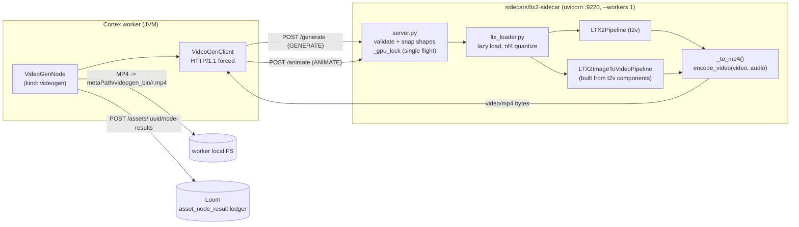

# LTX-2 Video Sidecar (`sidecars/ltx2-sidecar`)

FastAPI model server that turns a prompt (or a start image) into a short **MP4 with a
synchronised audio track**, using Lightricks' **LTX-2** through HuggingFace `diffusers`.
It is the only *video*-generation sidecar in the repo and the model server behind the
Cortex **`videogen`** node.

**Scope of this file:** the Python sidecar — HTTP contract, loading/quantization, env vars,
deployment. The Java node that calls it (ports, options, persistence, pipeline behaviour)
is specified in [NODES.md](../features/nodes/NODES.md) and
[NODE_DATA_TYPES.md](../features/pipeline/NODE_DATA_TYPES.md); node option defaults in
[CONFIGURATION.md](../cortex/CONFIGURATION.md). Do not duplicate those here.

## Progress Assessment

- [x] FastAPI server with `/health`, `/generate`, `/animate`, `/v1/generate` (`server.py`)
- [x] nf4 4-bit loading of **both** heavy components — fits a single 24 GB card (`ltx_loader.py`)
- [x] Text-to-video (`LTX2Pipeline`) and image-to-video (`LTX2ImageToVideoPipeline`, shares components)
- [x] MP4 muxing of video **+ LTX-2's generated audio** via `diffusers.utils.encode_video`
- [x] Shape-constraint validation/snapping (`w/h % 32`, `num_frames = k*8+1`)
- [x] Single-flight GPU lock; lazy one-time load
- [x] `setup.sh` / `run.sh` / `Dockerfile` / pinned `requirements.txt`
- [x] Reference demo clip + driver (`generate_examples.py`, `example-1-loom-constellation.mp4`)
- [x] **Consumed by a real Cortex node** — `videogen` (`cortex/nodes/video-generation`), Dagger-wired
      in `NodeCollectionModule`, descriptor in `VideoGenDescriptorProvider`, website doc page shipped
- [ ] **No `/v1/animate`** — image-to-video has no JSON/provenance twin, only raw MP4
- [ ] **No async job/polling API** — every call blocks for the full generation (minutes)
- [ ] **No Helm/compose deployment** — verified: nothing under `helm/` references any sidecar port.
      Started by hand via `run.sh` or the Dockerfile.
- [ ] **No integration test against a live sidecar** — `integration-test/` has zero videogen/ltx2 hits;
      all node tests mock `VideoGenClient`
- [ ] Generated MP4 is **not ingested into Loom binaries** — stays in the worker's local
      `metaPath/videogen_bin` cache, ledger row only (see [REST_BINARY_HANDLING.md](../features/rest/REST_BINARY_HANDLING.md))
- [ ] Two-stage / upscaler pass (the repo ships spatial & temporal upscalers) not wired
- [ ] Sidecar README "Follow-ups" section is **stale** — it lists the Cortex videogen node as
      out-of-scope/not-built while the same README's intro (correctly) says it exists

## Architecture



## HTTP contract (as implemented in `server.py`)

All request bodies are JSON. Everything is **synchronous** — there is no job id, no polling,
no streaming. `guidance` absent means the checkpoint default; `negative_prompt` absent means
`"worst quality, inconsistent motion, blurry, jittery, distorted"`.

| Method | Path | Body | Response |
|--------|------|------|----------|
| `GET` | `/health` | — | JSON: `status`, `device`, `dtype`, `cpuOffload`, `vaeTiling`, `model`, `quantize`, `defaults{width,height,numFrames,fps,steps,guidance}`, `constraints{sideMultipleOf,minSide,maxSide,numFramesModulo,maxFrames}`, `loaded[]` |
| `POST` | `/generate` | `{prompt, negative_prompt?, width?, height?, num_frames?, fps?, seed?, steps?, guidance?}` | raw **`video/mp4`** bytes |
| `POST` | `/animate` | same **plus required `image_b64`** (base64 of any PIL-readable image; the node sends PNG) | raw **`video/mp4`** bytes |
| `POST` | `/v1/generate` | same body as `/generate` | JSON: `{prompt, video_b64, model, quantize, width, height, numFrames, fps, steps, guidance, seed, hasAudio, elapsedMs}` |

`/health` does **not** load the model — `loaded` is `[]` until the first generate, then
`["text-to-video"]` and/or `["text-to-video","image-to-video"]`.

### Shape constraints (enforced)

| Rule | Constant | Behaviour on violation |
|------|----------|------------------------|
| `width`/`height` multiple of 32 | `SIDE_MULTIPLE=32` | **snapped up** and logged |
| `width`/`height` in `[32, 1280]` | `MIN_SIDE`/`MAX_SIDE` | **HTTP 400** |
| `num_frames = k*8 + 1` | `FRAME_MODULO=8`, `FRAME_REMAINDER=1` | **snapped up** and logged |
| `num_frames <= LTX2_MAX_FRAMES` | default `121` | **HTTP 400** |
| `prompt` non-blank (and `image_b64` non-blank on `/animate`) | — | **HTTP 400** |

### Error codes

| Status | Cause |
|--------|-------|
| `400` | Explicit `HTTPException` — blank prompt, blank `image_b64`, side out of range, `num_frames` over the cap, `image_b64` not valid base64 / not a decodable image. Body: `{"detail": "..."}` |
| `422` | FastAPI/pydantic body validation — e.g. `prompt` field missing entirely, wrong types. Not raised by this code, comes from the framework |
| `500` | Anything else. **There is no try/except around generation**, so a CUDA OOM, a missing checkpoint or a diffusers class mismatch surfaces as an unhandled 500 with the framework's generic body; the real reason is only in the server log |

`VideoGenClient` treats any non-2xx as `RuntimeException("Video sidecar returned HTTP <n> for <path>: <body>")`.

## Environment variables

Read at **module import time** (`server.py` / `ltx_loader.py` top level) — changing one requires
a restart, not just a new request.

| Var | Default | Read in | Meaning |
|-----|---------|---------|---------|
| `LTX2_MODEL` | `Lightricks/LTX-2` | `ltx_loader.py` | Checkpoint repo id |
| `LTX2_QUANTIZE` | `nf4` | `ltx_loader.py` | `nf4` or `none`. nf4 only takes effect when the device starts with `cuda` |
| `LTX2_DEVICE` | `cuda` if `torch.cuda.is_available()` else `cpu` | `ltx_loader.py` | torch device; bnb needs a concrete index, so `cuda` → `cuda:0` internally |
| `LTX2_DTYPE` | `bfloat16` on cuda, else `float32` | `ltx_loader.py` | Compute dtype; only `float16`/`bfloat16`/`float32` are accepted (a `KeyError` otherwise) |
| `LTX2_CPU_OFFLOAD` | `model` | `ltx_loader.py` | `none` \| `model` \| `sequential` |
| `LTX2_VAE_TILING` | `1` | `ltx_loader.py` | Off only for `0`, `""`, `false`, `False` |
| `LTX2_STEPS` | `40` | `server.py` | Default inference steps |
| `LTX2_GUIDANCE` | `4.0` | `server.py` | Default guidance scale |
| `LTX2_MAX_FRAMES` | `121` | `server.py` | Hard cap on `num_frames` |
| `LTX2_HOST` | `0.0.0.0` | `run.sh` | Bind address (also used as the *target* host by `generate_examples.py`, where it defaults to `localhost`) |
| `LTX2_PORT` | `9220` | `run.sh` | Listener port |
| `TORCH_INDEX_URL` | `https://download.pytorch.org/whl/cu128` | `setup.sh` | torch wheel index; set empty to let pip resolve |
| `PYTHON` | `python3` | `setup.sh` | Interpreter used to create the venv |
| `CUDA_VISIBLE_DEVICES` | — | torch | Pin a GPU |

Server-side defaults not exposed as env vars: `width=768`, `height=512`, `num_frames=49`, `fps=24`.

## Model, quantization, VRAM

LTX-2 is **not a 19B model — it is a ~46B system**: a 19B DiT transformer + a **27B Gemma3 text
encoder** (~94 GB bf16 on disk) + video/audio VAEs + a vocoder. The model card's plain
`from_pretrained(torch_dtype=bf16)` path is a **multi-GPU / ≥48 GB** path.

What this sidecar does instead (`_load_quantized_components`): quantize **both** heavy components
to bitsandbytes **nf4**, `device_map`-ed **directly onto the GPU** with `low_cpu_mem_usage=True`
so the 94 GB text encoder never materialises in CPU RAM; park the text encoder back on CPU;
hand both to `LTX2Pipeline.from_pretrained`; then `enable_model_cpu_offload()` + `vae.enable_tiling()`.

| Component | bf16 | nf4 |
|-----------|------|-----|
| Gemma3 text encoder (27B) | ~94 GB | ~8 GB |
| DiT transformer (19B) | ~38 GB | ~10 GB |
| **Verified peak VRAM** | ≥48 GB / multi-GPU | **~11 GB on an RTX 4090 (sm_89)** |

**Two dead ends already ruled out — do not re-try them** (documented in `ltx_loader.py`):

1. The **fp8 single-file** transformers (`ltx-2-19b-*-fp8.safetensors`) **upcast to bf16** in
   diffusers 0.39 — `LTX2VideoTransformer3DModel` is not fp8-quant-aware and drops the `*_scale`
   tensors — so they are the 38 GB bf16 path and OOM a 24 GB card.
2. Quantizing **only** the transformer still OOMs: the pipeline then loads the 94 GB bf16 text
   encoder into CPU RAM and blows the RAM budget.

Whole-video VAE decode OOMs without tiling; keep `LTX2_VAE_TILING=1`.

First call downloads ~130 GB of components and quantizes for a couple of minutes before it
generates. Everything after is warm. Prefetch with
`./.venv/bin/python -c 'from huggingface_hub import snapshot_download as d; d("Lightricks/LTX-2")'`.

Weights are under the **LTX-2 Community License** — not permissive. Review before commercial use.

## Deployment / running

```bash
./setup.sh    # venv; installs torch (cu128) FIRST, then requirements.txt
./run.sh      # exec .venv/bin/uvicorn server:app --host $LTX2_HOST --port $LTX2_PORT --workers 1
./.venv/bin/python generate_examples.py   # drives the running server, writes the demo clip
```

Docker: `nvidia/cuda:12.8.1-runtime-ubuntu24.04` base, `EXPOSE 9220`, same uvicorn CMD. The
checkpoint is deliberately **not baked in** — mount the HF cache:
`docker run --gpus all -p 9220:9220 -v $HOME/.cache/huggingface:/root/.cache/huggingface ltx2-sidecar`.
The image COPYs only `server.py` and `ltx_loader.py` (no `run.sh`, no `generate_examples.py`).

Port allocation across sidecars: tts 9100, sentiment 9110, depth 9120, ideogram 9200,
mage-flow 9210, **ltx2 9220** (see `sidecars/README.md`).

## Test setup

There is **no test for the Python sidecar itself** (no pytest, no test file in the folder). The
end-to-end check is `generate_examples.py`, which drives a *running* server over HTTP and exercises
validation → snapping → MP4 encoding → provenance. It uses the stdlib only, so it runs under a
system python.

Java-side coverage lives with the node and **mocks `VideoGenClient`** — no server needed:

| Test | What it pins |
|------|--------------|
| `VideoGenNodeTest` | prompt-in/video-out, mode routing (`/generate` vs `/animate`), local result cache |
| `VideoGenNodePersistenceTest` | ledger-only contract: one `asset_node_result` row, `nodeKind=videogen`, **no** `result_ref`; FAILED row on error |
| `VideoGenNodePipelineTest` | pipeline adapter, event dispatch, output chaining |
| `VideoGenOptionsValidationTest` | option validation rules |

## Conventions and Gotchas

- **`.venv/` is present on disk** (~34k files, gitignored). Always exclude it from searches —
  `rg -g '!**/.venv/**'`. A naive `rg` in this folder drowns in site-packages.
- **`--workers 1` is load-bearing.** One resident pipeline; `_gpu_lock` serialises generations
  because a single LTX-2 forward can consume the whole card. Concurrent callers **queue**, they do
  not fail — so a second request's wall clock includes the first request's generation. The node's
  default `timeoutMs` is 1,800,000 (30 min) for exactly this reason.
- **`fps` is passed to the pipeline as `frame_rate` and to the muxer as `fps`** — it is a generation
  parameter, not just container metadata.
- **Audio is not optional plumbing.** `_to_mp4` muxes `pipe.vocoder.config.output_sampling_rate`
  audio when the pipeline returns it; `av` (PyAV) + `imageio-ffmpeg` must be installed or
  `encode_video` cannot write video+audio. A missing audio tensor silently yields a silent clip
  (`hasAudio: false` in the JSON response).
- **`encode_video` only writes to a path**, so the server round-trips through a `NamedTemporaryFile`
  and returns bytes. The sidecar never hands out a server-side path.
- **`/v1/generate` exists only for provenance** (model id, quantize mode, resolved seed/steps).
  `VideoGenClient` never calls it and never calls `/health` — the node uses only `/generate` and
  `/animate` and therefore records no sidecar-reported `producerVersion`.
- **`num_frames` snapping can produce an invalid value if `LTX2_MAX_FRAMES` is not itself `k*8+1`.**
  `_frames` snaps up and then clamps with `min(snapped, MAX_FRAMES)`; with e.g. `LTX2_MAX_FRAMES=100`
  a request for 98 yields 100, which violates the model's frame rule. The default 121 (`15*8+1`) is
  safe — keep any override on the `k*8+1` grid.
- **HTTP/2 is rejected by the FastAPI sidecar**; `VideoGenClient` pins `Version.HTTP_1_1`. Keep it.
- **`sidecars/README.md` is stale about LTX-2's quantization**: its Deployment note says
  "fp8 for 24 GB, fp4 + offload for 12 GB", but `ltx_loader.py` documents fp8 as a verified dead end
  and the shipped default is nf4 everywhere. Trust the loader.
- **Env vars are captured at import.** `LTX2_STEPS`/`LTX2_GUIDANCE`/`LTX2_MAX_FRAMES` become module
  constants; exporting them after uvicorn starts does nothing.
- **The node sends every parameter explicitly** (width, height, num_frames, fps, steps, guidance),
  so the sidecar's own defaults only apply to direct HTTP callers. `negative_prompt` is the one
  exception — the node omits it when blank so the sidecar default applies.
- Generated MP4s go to `metaPath/videogen_bin/<hash-segment>/<sha512>.mp4` — worker-local, not Loom
  binaries. Wire an `s3-sink` to keep them (see [NODE_S3SINK.md](../features/nodes/s3-sink/NODE_S3SINK.md)).

## Key Files Reference

| Name | Path | Purpose |
|------|------|---------|
| `server.py` | `sidecars/ltx2-sidecar/server.py` | FastAPI app: routes, validation/snapping, `_gpu_lock`, MP4 muxing |
| `ltx_loader.py` | `sidecars/ltx2-sidecar/ltx_loader.py` | Lazy one-time load, nf4 quantization, offload/VAE-tiling placement, t2v + i2v pipelines |
| `run.sh` | `sidecars/ltx2-sidecar/run.sh` | uvicorn launcher, `--workers 1`, `LTX2_HOST`/`LTX2_PORT` |
| `setup.sh` | `sidecars/ltx2-sidecar/setup.sh` | venv; torch-before-requirements install order |
| `requirements.txt` | `sidecars/ltx2-sidecar/requirements.txt` | Verified dependency set (diffusers ≥0.39 = first with `LTX2Pipeline`) |
| `Dockerfile` | `sidecars/ltx2-sidecar/Dockerfile` | CUDA 12.8 runtime image; checkpoint mounted, not baked |
| `generate_examples.py` | `sidecars/ltx2-sidecar/generate_examples.py` | HTTP-driven demo/E2E; writes the committed reference clip |
| `README.md` | `sidecars/ltx2-sidecar/README.md` | Human-facing sidecar doc (note the stale "Follow-ups" section) |
| `VideoGenNode` | `cortex/nodes/video-generation/core/src/main/java/io/metaloom/cortex/node/videogen/VideoGenNode.java` | The consuming node: ports, local cache, ledger write |
| `VideoGenClient` | `.../videogen/VideoGenClient.java` | HTTP client — the only code that speaks this contract in Java |
| `VideoGenNodeOptions` | `.../videogen/VideoGenNodeOptions.java` | host/port/endpoints/geometry defaults, 30 min timeout |
| `VideoGenMode` | `.../videogen/VideoGenMode.java` | `GENERATE` → `/generate`, `ANIMATE` → `/animate` |
| `VideoGenNodeModule` | `.../videogen/VideoGenNodeModule.java` | Dagger wiring; constructs `VideoGenClient` from options |
| `VideoGenDescriptorProvider` | `loom-shared/node-model/src/main/java/io/metaloom/loom/nodes/spec/VideoGenDescriptorProvider.java` | UI/pipeline-editor descriptor and parameter defaults |

## Where do I find ...?

| I want to ... | Look at |
|---------------|---------|
| The exact request/response JSON | `sidecars/ltx2-sidecar/server.py` (module docstring + route handlers) |
| Why it fits 24 GB / what was ruled out | `sidecars/ltx2-sidecar/ltx_loader.py` module docstring |
| The port table for all sidecars | `sidecars/README.md` |
| The node's options and their defaults | [CONFIGURATION.md](../cortex/CONFIGURATION.md), [NODES.md](../features/nodes/NODES.md) |
| The node's port types / content types | [NODE_DATA_TYPES.md](../features/pipeline/NODE_DATA_TYPES.md) |
| Why the MP4 is not stored in Loom | [REST_BINARY_HANDLING.md](../features/rest/REST_BINARY_HANDLING.md) |
| The metric names emitted per AI call | [METRICS.md](../features/ops/METRICS.md) |
| How to add another sidecar-backed node | [NEW_NODE.md](../guidelines/NEW_NODE.md), [CODING.md](../guidelines/CODING.md) |
| The pattern this sidecar was copied from | `sidecars/mage-flow-sidecar/`, [imagegen-node.md](../plans/imagegen-node.md), [NODE_IMAGEGEN.md](../features/nodes/image-generation/NODE_IMAGEGEN.md) |
| Customer-facing docs for the node | `website/content/english/docs/nodes/videogen/index.adoc` |
| Where the sidecar sits in the repo map | [CONTEXT.md](../CONTEXT.md), [METALOOM.md](../METALOOM.md) |

_Last updated: 2026-08-02 — git HEAD `d930e222`_
_Git HEAD revision: `742dae2d`_
_Last updated: 2026-08-06 (reference sweep — no content changes)_