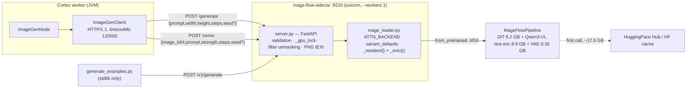

# Mage-Flow Sidecar (`sidecars/mage-flow-sidecar`)

> **Status: built and runnable, wired in by configuration only.** A FastAPI/uvicorn model server for
> Microsoft's **Mage-Flow** 4B image model (NR-MMDiT + Mage-VAE, rectified flow, **MIT** weights).
> It is the second implementation of the model-agnostic image-sidecar contract; the first is
> `sidecars/ideogram-sidecar` (:9200). The Cortex `imagegen` node reaches it by setting `port: 9210`
> — **there is no mage-flow-specific Java code anywhere in the repo** (verified: `rg -i 'mage.?flow'`
> matches only markdown/adoc plus the sidecar's own Python).
>
> This file is the **sidecar spec**. The consuming node is specified in
> [../features/pipeline-nodes/NODE_IMAGEGEN_PLAN.md](../features/pipeline-nodes/NODE_IMAGEGEN_PLAN.md)
> — do not restate node lifecycle, persistence, ports or options here.

---

## 1. Progress Assessment

- [x] `server.py` — FastAPI app: `/health`, `/generate`, `/v1/generate`, `/remix`
- [x] `mage_loader.py` — lazy checkpoint load, single-resident eviction, attention-backend selection,
      per-variant step/cfg defaults
- [x] Content-filter unmasking: a uniformly white result is re-screened and turned into HTTP `422`
- [x] Native-resolution validation (512–2048, snapped to a multiple of 16)
- [x] PNG `tEXt` provenance chunks (`mageflow:model`, `:prompt`, `:seed`, `:steps`, `:cfg`, …)
- [x] `setup.sh` (venv + pinned deps + upstream package at a pinned commit), `run.sh`, `Dockerfile`
- [x] `generate_examples.py` + five checked-in reference PNGs (drives the running HTTP server)
- [x] `README.md` in the sidecar folder — thorough; this spec is a condensation, not a replacement
- [x] Referenced from [`sidecars/README.md`](../../sidecars/README.md),
      [NODE_IMAGEGEN_PLAN.md](../features/pipeline-nodes/NODE_IMAGEGEN_PLAN.md) §3,
      [NODES.md](../features/pipeline-nodes/NODES.md), [CONTEXT.md](../CONTEXT.md) and
      `website/content/english/docs/nodes/imagegen/index.adoc`
- [ ] **No automated test of any kind.** No pytest, no smoke script beyond `generate_examples.py`
      (which needs a ≥24 GB GPU and a 17.5 GB download). The Java side stubs `ImageGenClient`, so
      nothing in CI ever speaks this HTTP contract.
- [ ] **Not deployed anywhere.** `rg 'sidecar' helm/` returns nothing — no chart, no Deployment, no
      docker-compose entry for *any* sidecar. Start it by hand (`./run.sh`) or from the `Dockerfile`.
- [ ] `/v1/generate` is a superset endpoint no Java code calls — `ImageGenClient` only posts
      `/generate` and `/remix`. Nothing consumes `n`, `cfg`, `neg_prompt` or `max_size`.
- [ ] The `422` filter-refusal body is never interpreted: `ImageGenClient.post` turns any non-2xx
      into `RuntimeException("Image sidecar returned HTTP 422 …")`, so a policy block and a crash are
      the same failure to the pipeline.
- [ ] Only ever exercised against a single checkpoint pair (`*-Turbo`); `microsoft/Mage-Flow` and
      `-Base` are supported by `variant_defaults()` but unverified here.

**Honesty note on the audit that triggered this file:** the claim "zero documentation coverage" is
inaccurate. There was no *dedicated spec file* (this is it), but the sidecar was already documented
in `sidecars/mage-flow-sidecar/README.md`, in NODE_IMAGEGEN_PLAN.md §1/§2/§3 (as "Sidecar B"), in
`sidecars/README.md`, in `spec/CONTEXT.md` and on the customer website.

---

## 2. Architecture

Two locks, for two different failure modes:

| Lock | File | Protects against |
|---|---|---|
| `_gpu_lock` | `server.py` | Two concurrent generations each allocating ~18 GB (FastAPI runs sync handlers on a threadpool) |
| `_load_lock` | `mage_loader.py` | Two concurrent checkpoint loads OOMing the card; double-checked so a queued request reuses the load |

`_resident` holds **exactly one** pipeline. `load()` on a different `model_id` calls `_evict()` first
(`gc.collect()` + `torch.cuda.empty_cache()`), because each checkpoint repo ships its own copy of the
8.9 GB text encoder — t2i + edit together is ~35 GB and does not fit a 24 GB card.

---

## 3. HTTP contract (as implemented in `server.py`)

| Method | Path | Request | Success response |
|---|---|---|---|
| GET | `/health` | — | JSON (below) |
| POST | `/generate` | `{prompt, width?, height?, seed?, steps?, cfg?, neg_prompt?, n?}` | `image/png` bytes (`n` ignored — always 1 image) |
| POST | `/v1/generate` | same model, `n` honoured | JSON: `{model, steps, cfg, width, height, seeds[], attn, elapsedMs, prompt, images[] (base64 PNG)}` |
| POST | `/remix` | `{image_b64, prompt, seed?, steps?, cfg?, max_size?, width?, height?, strength?}` | `image/png` bytes |

`/health` returns:
`{status:"ok", device, attnBackend, models:{generate,remix}, defaults:{steps,cfg,width:1024,height:1024},
resolution:{min:512,max:2048,multipleOf:16}, maxBatch, loaded:[…]}`.
`loaded` is `[]` until the first generation — the checkpoint loads lazily.

**Parameter resolution.** `width`/`height` default to `1024`; out of `[512, 2048]` → `400`; not a
multiple of 16 → snapped **up** (capped at 2048) and logged, not rejected. `steps`/`cfg` default to
`mage_loader.variant_defaults(model_id)` unless `MAGEFLOW_STEPS`/`MAGEFLOW_CFG` override them.
`seed` absent (or `null`) becomes `-1` = "model draws one"; for `n>1` with an explicit seed the batch
uses `seed, seed+1, …`, but with `-1` all `n` entries stay `-1`.

**Error codes:**

| Code | Raised when |
|---|---|
| `400` | Empty/blank `prompt`; empty `image_b64`; side out of 512–2048; `n > MAGEFLOW_MAX_BATCH`; `image_b64` not valid base64 or not a decodable image |
| `422` | The result was uniformly white **and** re-screening confirmed a content-filter block. Detail: `{error, categories[], reason, note}` |
| `500` | The result was uniformly white and the re-screening call itself threw — deliberately reported as ambiguous rather than as a policy block |
| `422` (FastAPI) | Pydantic body validation, e.g. missing `prompt`/`image_b64` — indistinguishable by status from a filter block; the body differs |

---

## 4. Environment variables

Read at **import time** in `mage_loader.py` / `server.py` (module-level `os.environ.get`), so a
change requires a restart, not just a new request.

| Variable | Default | Read in | Meaning |
|---|---|---|---|
| `MAGEFLOW_MODEL` | `microsoft/Mage-Flow-Turbo` | `mage_loader.py` | t2i checkpoint (HF repo id or local path) |
| `MAGEFLOW_EDIT_MODEL` | `microsoft/Mage-Flow-Edit-Turbo` | `mage_loader.py` | checkpoint used by `/remix` |
| `MAGEFLOW_ATTN` | `auto` | `mage_loader.py` | `auto` \| `flash2` \| `flash4` \| `sdpa`; `auto` probes `import flash_attn`, else `sdpa` |
| `MAGEFLOW_DEVICE` | `cuda` if `torch.cuda.is_available()` else `cpu` | `mage_loader.py` | torch device |
| `MAGEFLOW_STEPS` | unset → per-variant | `server.py` | override the tuned step count (global, all endpoints) |
| `MAGEFLOW_CFG` | unset → per-variant | `server.py` | override the tuned guidance scale |
| `MAGEFLOW_MAX_BATCH` | `4` | `server.py` | cap on `n` for `/v1/generate` |
| `MAGEFLOW_HOST` | `0.0.0.0` | `run.sh` | bind address (the `Dockerfile` `CMD` hardcodes `0.0.0.0`) |
| `MAGEFLOW_PORT` | `9210` | `run.sh`, `generate_examples.py` | listener port (the `Dockerfile` `CMD` hardcodes `9210`) |
| `VF_HF_ATTN_IMPL` | set to `sdpa` by the loader when the backend is `sdpa` | `mage_loader.load()` | upstream's own hook; must be set **before** the text encoder is constructed |
| `MAGEFLOW_GIT_REF` | `acf55fab9a6c3ef215ec0f52ca49112a99036959` | `setup.sh`, `Dockerfile` ARG | pinned upstream commit of github.com/microsoft/Mage |
| `PYTHON` | `python3` | `setup.sh` | interpreter used to create `.venv` |
| `CUDA_VISIBLE_DEVICES` | — | environment | pin a ≥24 GB GPU |
| `HF_HOME` | `/root/.cache/huggingface` (container only) | `Dockerfile` | HF cache location; mount it, weights are not baked in |

Node side (`ImageGenNodeOptions`, defaults from the Java source): `host=localhost`, `port=9200`
(**set `9210`**), `generateEndpoint=/generate`, `remixEndpoint=/remix`, `width=height=1024`,
`strength=0.6`, `steps=30`, `seed=null`, `timeoutMs=120000`.

---

## 5. Model, variants and hardware

`variant_defaults(model_id)` derives `(steps, cfg)` from the **checkpoint name**, lowercased last path
segment:

| Name contains | steps | cfg | Typical checkpoint |
|---|---|---|---|
| `turbo` | 4 | 1.0 | `microsoft/Mage-Flow-Turbo`, `microsoft/Mage-Flow-Edit-Turbo` |
| `base` or `edit` | 30 | 5.0 | `microsoft/Mage-Flow-Base`, non-turbo edit models |
| anything else | 20 | 5.0 | `microsoft/Mage-Flow` (RL-aligned) |

Hardware, per `README.md` / `run.sh` (measured by the author on an RTX 4090, SDPA, Turbo, 4 steps):
bf16 weights **17.5 GB**, peak **~18–20 GB**, ~16 s to load, ~1.2 s per 1024²-class image.
**A ≥24 GB card is required; a 12 GB card cannot hold the model at all.** `n=3` at 768² ≈ 2.8 s
(one packed forward, not a loop). Weights and model code are **MIT**, which is the entire reason this
sidecar exists next to `ideogram-sidecar` (SDXL-Turbo / Ideogram 4 are non-commercial).

---

## 6. Conventions and Gotchas

1. **A blocked prompt is a white PNG upstream, not an exception.** Mage-Flow's filter is mandatory,
   `FilterVerdict.banner()` returns `""` and `make_refusal_image()` is a blank canvas — and it is
   *fail-closed*, so a classifier OOM looks identical. `server._reject_if_filtered` re-screens **only**
   uniformly-white results (`getextrema()` all `(255,255)`) via `pipe.model.txt_enc.screen_text()` /
   `screen_edit()` and raises `422`. A legitimately white image costs one screening pass and is then
   returned unchanged. Never "fix" a 422 by removing this check.
2. **`steps` from the node defeats the per-variant default.** `ImageGenClient.generate/remix` *always*
   put `steps` in the body (option default **30**). Against Turbo that is ~7× the work for no gain.
   Set `steps: 4` (Turbo), `20` (RL-aligned), `30` (Base). The server deliberately does **not** clamp.
3. **`strength` is accepted and ignored.** Mage-Flow-Edit is instruction-conditioned; the `/remix`
   prompt is an instruction ("replace the background with …"), not a description of the output. The
   field exists on `RemixRequest` purely so existing node requests keep working.
4. **Alternating `/generate` and `/remix` pays a full reload each time** (one resident model, §2).
   For both hot, run two processes on two GPUs with different `MAGEFLOW_PORT`.
5. **The attention backend must be switched on two paths.** `set_attn_backend()` has to run *after*
   `MageFlowPipeline.from_pretrained` (because `MageFlowModel.__init__` sets it from the flash2 config
   default), while the HF text encoder needs `VF_HF_ATTN_IMPL` set *before*. `mage_loader.load()` does
   both, in that order. Reordering them silently reintroduces the flash-attn hard requirement.
6. **flash-attn is intentionally not in `requirements.txt`.** It compiles against the torch wheel's
   CUDA ABI and needs a major-version-matched `nvcc`; `MAGEFLOW_ATTN=auto` falls back to SDPA.
7. **`--workers 1` is load-bearing** in both `run.sh` and the `Dockerfile` `CMD` — a second uvicorn
   worker loads its own 17.5 GB copy.
8. **Pins are upstream's, copied verbatim** (`transformers==5.5.0` because 5.6.0 removed the
   `input_embeds` kwarg of `create_causal_mask` that the patched Qwen3-VL text encoder relies on).
   The `mage-flow` package is installed `--no-deps` from a **pinned git commit** — it is not on PyPI
   and its own metadata pulls gradio and loose torch bounds.
9. **First request downloads ~17.5 GB.** Prefetch with the `snapshot_download` one-liner `setup.sh`
   prints, or the node's 120 s `timeoutMs` will expire long before the model is ready.
10. **`.gitignore` ignores `*.png` except `example-*.png`** — the five reference images are checked in
    on purpose; smoke-test output is not.
11. Env vars are read at import time (§4) and `MAGEFLOW_STEPS`/`MAGEFLOW_CFG` are **global** — they
    apply to the edit checkpoint too, which usually wants different numbers.

---

## 7. Test Setup

There is **no test suite for this sidecar**. What exists:

| What | How to run | Needs |
|---|---|---|
| Health probe | `curl -s localhost:9210/health \| jq` | server up (no GPU work) |
| t2i smoke | `curl -s -X POST localhost:9210/generate -H 'content-type: application/json' -d '{"prompt":"a red panda astronaut","seed":42}' -o out.png` | GPU + checkpoint |
| edit smoke | build the body **in a file** — a base64 image in argv exceeds the shell arg limit ("Argument list too long"); see `README.md` for the two-liner | GPU + edit checkpoint (reload) |
| Reference set | `./run.sh &` then `./.venv/bin/python generate_examples.py` | GPU; writes the five `example-*.png`, fixed seeds, ~7 s hot |
| Java side | `ImageGenNodeTest` / `ImageGenNodePipelineTest` / `ImageGenNodePersistenceTest` / `ImageGenOptionsValidationTest` + `ImageGenNodeIntegrationTest` | **stub the client — never touch this sidecar** |

If you add coverage, the cheapest real win is a FastAPI `TestClient` suite with `mage_loader.load`
monkeypatched to a fake pipeline: it would pin `_side()` snapping, the `400` matrix, the white-image
`422`/`500` split and `variant_defaults()` without a GPU. Follow
[../guidelines/CODING.md](../guidelines/CODING.md) if you do.

---

## 8. Key Files Reference

| Name | Path | Purpose |
|---|---|---|
| `server.py` | `sidecars/mage-flow-sidecar/server.py` | FastAPI app; all four endpoints, validation, `_gpu_lock`, filter unmasking, PNG `tEXt` encoding |
| `mage_loader.py` | `sidecars/mage-flow-sidecar/mage_loader.py` | `load()` / `_evict()` single-resident model, `variant_defaults()`, `resolve_attn_backend()`, `DEVICE` |
| `generate_examples.py` | `sidecars/mage-flow-sidecar/generate_examples.py` | Stdlib-only HTTP driver producing the five reference PNGs via `/v1/generate` |
| `setup.sh` | `sidecars/mage-flow-sidecar/setup.sh` | venv + `requirements.txt` + `mage-flow` from a pinned commit, `--no-deps` |
| `run.sh` | `sidecars/mage-flow-sidecar/run.sh` | `uvicorn server:app --workers 1` on `$MAGEFLOW_HOST:$MAGEFLOW_PORT` |
| `Dockerfile` | `sidecars/mage-flow-sidecar/Dockerfile` | `nvidia/cuda:13.0.1-runtime-ubuntu24.04`; weights **not** baked in, mount the HF cache |
| `requirements.txt` | `sidecars/mage-flow-sidecar/requirements.txt` | Upstream's pinned set (torch 2.13.0, transformers 5.5.0, diffusers 0.38.0, …) |
| `README.md` | `sidecars/mage-flow-sidecar/README.md` | Long-form operator doc — benchmarks, curl recipes, example table |
| `ImageGenClient` | `cortex/nodes/image-generation/core/src/main/java/io/metaloom/cortex/node/imagegen/ImageGenClient.java` | The only consumer: HTTP/1.1 POST to `/generate` and `/remix`, returns PNG `byte[]` |
| `ImageGenNodeOptions` | same package | `host`/`port`/`steps`/`strength`/… — set `port=9210` to select this sidecar |
| `ImageGenNode` | same package | Calls `remix()` in `REMIX` mode, else `generate()`; ledger-only persistence |

---

## 9. Where do I find …?

| I want … | Look at |
|---|---|
| The endpoint implementations | `sidecars/mage-flow-sidecar/server.py` |
| Why a request returned `422` | `server._reject_if_filtered` (and §6.1) |
| Why a side got resized | `server._side` — snaps up to a multiple of 16 |
| Default steps/cfg for a checkpoint | `mage_loader.variant_defaults` |
| Why the model reloads between calls | `mage_loader._evict` / `_resident` (§2) |
| flash-attn vs SDPA selection | `mage_loader.resolve_attn_backend` + §6.5 |
| How to start it | `sidecars/mage-flow-sidecar/run.sh`, or the `Dockerfile` `CMD` |
| Which node calls it, and how | [../features/pipeline-nodes/NODE_IMAGEGEN_PLAN.md](../features/pipeline-nodes/NODE_IMAGEGEN_PLAN.md) §1–§3 |
| The node's options and persistence | [../features/pipeline-nodes/NODES.md](../features/pipeline-nodes/NODES.md) |
| The other image sidecar (SDXL/Ideogram, :9200) | `sidecars/ideogram-sidecar/README.md` |
| The port allocation across all sidecars | [`sidecars/README.md`](../../sidecars/README.md) — tts 9100, sentiment 9110, depth 9120, imagegen 9200/**9210**, videogen 9220 |
| The customer-facing page | `website/content/english/docs/nodes/imagegen/index.adoc` |
| Repo-wide conventions / spec index | [../CONTEXT.md](../CONTEXT.md), [../SPEC_RULES.md](../SPEC_RULES.md) |
| Definition of done for a code change | [../guidelines/CODING.md](../guidelines/CODING.md) |

---

_Last updated: 2026-08-02 — git HEAD `d930e222`_
