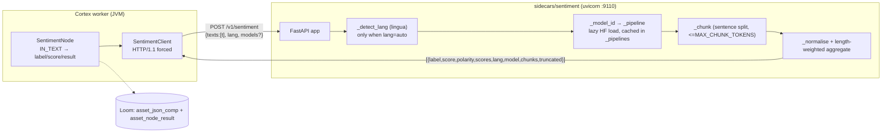

# Sentiment Sidecar (`sidecars/sentiment`)

FastAPI model server behind the Cortex `sentiment` node. Five files, no Python package, no tests.

**Scope of this file:** the Python process — HTTP contract, model routing, chunking, env, deployment.
The **node** (ports, persistence, options, open product work) is
[../features/pipeline-nodes/NODE_SENTIMENT_PLAN.md](../concept/NODE_SENTIMENT_PLAN.md);
do not duplicate it here. Node system reference: [../features/pipeline-nodes/NODES.md](../features/nodes/NODES.md).
Sidecar index and port allocation: [`sidecars/README.md`](../../sidecars/README.md).

---

## 1. Architecture



Everything language-specific lives in Python **by design**: swapping a checkpoint is env config, never
Java. The JVM has no ONNX/DJL/HF runtime (only whisper.cpp via JNA).

---

## 2. HTTP contract (as implemented on both sides)

Base URL `http://{sentimentHost}:{sentimentPort}` — node defaults `localhost:9110`. **No auth, no API
key, no TLS** on either side.

### `POST /v1/sentiment`

Request (`SentimentRequest`, pydantic, `server.py:270`):

```jsonc
{ "texts": ["..."],           // required, List[str]
  "lang":  "auto",            // optional, default "auto"; "" or "auto" ⇒ detect
  "models": { "de": "...", "en": "..." } }  // optional, per-language checkpoint override
```

Response — a **bare JSON array**, one object per input text (not an envelope object):

```jsonc
[{ "label": "NEGATIVE", "score": 0.973, "polarity": -0.969,
   "scores": { "positive": 0.004, "neutral": 0.023, "negative": 0.973 },
   "lang": "de", "model": "oliverguhr/german-sentiment-bert",
   "chunks": 1, "truncated": false }]
```

All floats `round(..., 6)`. `score` is the **winning label's confidence in [0,1]**; `polarity = p(pos) - p(neg)`.

Errors — FastAPI's default `{"detail": "..."}` body:

| Status | Trigger (code) |
|---|---|
| `400` | `texts` empty list — `"texts must not be empty"` (`server.py:296`) |
| `400` | any entry empty/whitespace — `"texts must not contain blank entries"` (`server.py:302`) |
| `400` | text produced zero chunks — `"text is empty"` (`server.py:235`) |
| `422` | pydantic validation (missing `texts`, wrong types) — FastAPI default |
| `500` | any HF/torch failure (model download, OOM) — unhandled, uvicorn default |

`SentimentClient.analyze` treats **any non-2xx** as `RuntimeException("Sentiment request failed (HTTP n): body")`;
it does not parse `detail`. An empty array also raises. Timeouts: 30 s connect, 120 s request.

### `GET /health`

`{"status":"ok","device":"cuda|cpu","models":{"de":...,"en":...,"fallback":...},"loaded":[<model ids>]}`.
**Nothing in Java calls it** (grep: only `sidecars/sentiment/README.md` mentions it) — it is a human/ops probe.

### Contract mismatches found

- **Batching is dead code.** `texts` is a list and the server loops over it, but `SentimentClient`
  always sends exactly one text and reads only `results.getJsonObject(0)`.
- **`truncated` is carried, never acted on.** It reaches `asset_json_comp.data` but no Java code branches
  on it and no warning is surfaced to the pipeline.
- **`models` keys are matched against the *detected* language.** With `lang="auto"` on French text,
  `modelEn` is ignored and `SENTIMENT_MODEL_FALLBACK` is used.

---

## 3. Model routing

| Detected/requested `lang` | Env default | Licence |
|---|---|---|
| `de` | `oliverguhr/german-sentiment-bert` | MIT |
| `en` | `cardiffnlp/twitter-roberta-base-sentiment-latest` | **CC-BY-4.0 — attribution required** |
| anything else | `lxyuan/distilbert-base-multilingual-cased-sentiments-student` | Apache-2.0 |

Per-request `models[lang]` wins over env (`_model_id`, `server.py:107`). All three are ≤135M 3-class
encoders → one shared label schema. Licence rationale and the rejected checkpoints (notably the
CC-BY-NC `tabularisai/multilingual-sentiment-analysis`) are in
[NODE_SENTIMENT_PLAN.md §2](../concept/NODE_SENTIMENT_PLAN.md).

**Label normalisation** (`LABEL_ALIASES`, `server.py:93`) maps `positive/pos/label_2/4-5 stars`,
`neutral/neu/label_1/3 stars`, `negative/neg/label_0/1-2 stars` → `POSITIVE|NEUTRAL|NEGATIVE`.
Unmapped labels are **logged and dropped**, then the remainder is renormalised to sum 1 — a checkpoint
with an unknown vocabulary yields a confident-looking but meaningless result rather than an error.

**Chunking** (`_chunk`, `server.py:160`): split on `(?<=[.!?…])\s+|\n{2,}`, pack sentences up to
`MAX_CHUNK_TOKENS` word-pieces (tokenizer-measured), hard-split oversized sentences on word boundaries.
Aggregation is weighted by `len(chunk)` in **characters**, not tokens.

---

## 4. Environment variables

Read in `server.py` (module-level, at import — **changing them requires a restart**):

| Variable | Default | Meaning |
|---|---|---|
| `SENTIMENT_MODEL_DE` | `oliverguhr/german-sentiment-bert` | German checkpoint |
| `SENTIMENT_MODEL_EN` | `cardiffnlp/twitter-roberta-base-sentiment-latest` | English checkpoint |
| `SENTIMENT_MODEL_FALLBACK` | `lxyuan/distilbert-base-multilingual-cased-sentiments-student` | Every other language |
| `SENTIMENT_LANGS` | `de,en` | Candidate set for `lingua` auto-detection (comma-separated ISO-639-1) |
| `MAX_CHUNK_TOKENS` | `400` | Word-pieces per chunk (headroom under the 512 encoder limit) |
| `MAX_CHUNKS` | `64` | Chunks per text; the tail beyond this is **dropped**, `truncated:true` |
| `DEVICE` | `cuda` if `torch.cuda.is_available()` else `cpu` | torch device; `cuda*` ⇒ pipeline `device=0` |

Read in `run.sh` only (**not** by `server.py`):

| Variable | Default | Meaning |
|---|---|---|
| `SENTIMENT_HOST` | `0.0.0.0` | uvicorn bind address |
| `SENTIMENT_PORT` | `9110` | uvicorn port |
| `PYTHON` | `python3` | interpreter used by `setup.sh` to create `.venv` |

⚠️ [NODE_SENTIMENT_PLAN.md §4](../concept/NODE_SENTIMENT_PLAN.md) lists a `PORT`
env var — **that is wrong**; `PORT` appears nowhere in `server.py` or `run.sh`.

No `HF_TOKEN` and no gated repos. Standard HF vars (`HF_HOME`, `HF_HUB_OFFLINE`, `TRANSFORMERS_CACHE`)
are honoured implicitly by `transformers`, not by this code.

---

## 5. Deployment — there is none yet

Grepped, and **none of the following exist for this sidecar**:

- No `Dockerfile`/`Containerfile` (only `ltx2-sidecar`, `ideogram-sidecar`, `mage-flow-sidecar` have one).
- No entry in any compose file (the only one in the repo is `test-database/docker-compose.yaml`).
- No reference in `helm/cortex/**`, `helm/loom/**` or `cortex/container/Containerfile` — the Cortex
  chart has no sidecar container at all.

The only supported start path is manual: `./setup.sh` (creates `.venv`, installs `requirements.txt`),
then `./run.sh` (`exec ./.venv/bin/uvicorn server:app --host $SENTIMENT_HOST --port $SENTIMENT_PORT`).
Both `cd "$(dirname "$0")"`, so they are location-independent. Weights download lazily on the first
request per language. `sidecars/README.md` describes production as "co-located pod/host" — aspirational,
not implemented.

---

## 6. Key Files Reference

| File | Path | Purpose |
|---|---|---|
| `server.py` | `sidecars/sentiment/server.py` | The whole sidecar: config, routing, chunking, 2 endpoints |
| `requirements.txt` | `sidecars/sentiment/requirements.txt` | fastapi≥0.115, uvicorn≥0.30, pydantic≥2.7, transformers≥4.50, torch≥2.6, lingua-language-detector≥2.0 |
| `setup.sh` | `sidecars/sentiment/setup.sh` | Creates `.venv`, pip installs; prints the licence note |
| `run.sh` | `sidecars/sentiment/run.sh` | uvicorn launcher, `SENTIMENT_HOST`/`SENTIMENT_PORT` |
| `README.md` | `sidecars/sentiment/README.md` | Operator-facing quick start (⚠️ carries stale "one row per text source" claim) |
| `SentimentClient` | `cortex/nodes/sentiment/core/src/main/java/io/metaloom/cortex/node/sentiment/SentimentClient.java` | The only Java caller; `analyze(text, lang, modelOverride)` |
| `SentimentNode` | same dir `/SentimentNode.java` | Wires `IN_TEXT` → client → outputs + `asset_json_comp` |
| `SentimentNodeOptions` | same dir `/SentimentNodeOptions.java` | `sentimentHost=localhost`, `sentimentPort=9110`, `language=auto`, `modelDe/modelEn=null`, `maxChars=200000` |
| `SentimentNodeModule` | same dir `/SentimentNodeModule.java` | Provides the client from the options |
| `SentimentDescriptorProvider` | `loom-shared/node-model/src/main/java/io/metaloom/loom/nodes/spec/SentimentDescriptorProvider.java` | UI descriptor (⚠️ `score` description wrong, §8) |

---

## 7. Test setup

There are **no Python tests** — no `pytest`, no `tests/` dir, nothing in the repo imports `server`
(grep for `import server` matches only the sidecars' own `server.py` files). A
`__pycache__/server.cpython-313.pyc` exists, so the module was imported once under **Python 3.13**
(`requirements.txt` says 3.11+ recommended), but `.venv` does **not** exist — no checkpoint has ever
been loaded in this checkout.

All coverage is Java-side and replaces the client entirely:

25 unit tests under `cortex/nodes/sentiment/core/src/test/java/io/metaloom/cortex/node/sentiment/`
(`SentimentNodeTest` 8 — `mock(SentimentClient.class)`; `SentimentNodePipelineTest` 6;
`SentimentOptionsValidationTest` 8; `SentimentNodePersistenceTest` 3), plus
`integration-test/src/test/java/io/metaloom/loom/test/integration/node/SentimentNodeIntegrationTest.java`
(real Loom + pooled Postgres, still a stub client — ⚠️ stale assertions, §8).

**Nothing exercises the real wire format.** Manual smoke test (also in the README):

```bash
cd sidecars/sentiment && ./setup.sh && ./run.sh
curl -s localhost:9110/health
curl -s localhost:9110/v1/sentiment -H 'Content-Type: application/json' \
  -d '{"texts":["Der Kundenservice war eine Katastrophe."],"lang":"auto"}'
```

Java test conventions: [../guidelines/CODING.md](../guidelines/CODING.md).

---

## 8. Conventions and Gotchas

- **Port 9110.** 9100 = tts, 9120 = depth, 9200/9210 = imagegen, 9220 = videogen. Do not reuse.
- **Force HTTP/1.1 in any new client.** FastAPI rejects the JDK `HttpClient`'s HTTP/2 upgrade.
  `SentimentClient` also builds a **new `HttpClient` per call** — allocation per request, no pooling.
- **Config is import-time.** All `os.environ.get(...)` calls run at module load. Env changes need a restart.
- **`DEVICE`, `MAX_CHUNKS`, `MAX_CHUNK_TOKENS` are unprefixed** and `DEVICE` is shared verbatim with
  `sidecars/tts` and `sidecars/depth` — one `DEVICE=cpu` on a shared host silently retargets all three.
  Note the subtle difference: sentiment uses `os.environ.get("DEVICE") or _default_device()` (empty
  string ⇒ auto-detect), while tts/depth use `os.environ.get("DEVICE", _default_device())` (empty
  string ⇒ empty device).
- **Model loading is lazy and unsynchronised.** `_pipelines` (`server.py:103`) is a plain dict mutated
  from a `def` (sync) endpoint, which FastAPI runs on the anyio threadpool. Two concurrent first
  requests for the same language can both call `hf_pipeline(...)` — double download and double VRAM.
  Suspected bug; no lock exists. Concurrent inference on one shared `pipeline` object is likewise
  unguarded (the node's `defaultConcurrency` is 1, which hides it today).
- **`SENTIMENT_LANGS=""` breaks auto-detection.** `LANGS` becomes `[]`, so `len(LANGS) == 1` is false,
  `LanguageDetectorBuilder.from_languages()` is called with zero languages, and the `LANGS[0]` fallback
  would `IndexError`. Suspected bug — always leave at least one language configured.
- **Unrecognised ISO codes in `SENTIMENT_LANGS` are silently dropped** by the `lingua` filter, and a
  single configured language skips detection entirely (`server.py:141`) — `SENTIMENT_LANGS=de` routes
  English text to the German model.
- **`MAX_CHUNKS` drops the tail of long documents.** With `maxChars=200000` on the node and
  ~400 tokens/chunk, 64 chunks ≈ 25k tokens; longer text is silently cut, flagged only by `truncated`.
- **Aggregation weight is characters, not tokens** — the docstring says "length-weighted"; verify before
  assuming token weighting.
- **`OUT_SCORE` is confidence in [0,1], not polarity.** `SentimentDescriptorProvider` still describes it
  as *"Polarity in [-1, 1]; its sign agrees with the label"* — wrong, and still wrong at this HEAD.
- **`ctx.failure(msg).next()` does not yield `FAILED`.** `NodeContextImpl.next()` (`cortex/api/.../NodeContextImpl.java:192`)
  inspects only `skipReason`; only `abort()` returns `ResultState.FAILED`. On a sidecar error the node
  writes a FAILED **ledger** row but the node result is SUCCESS. Repo-wide, not sentiment-specific.
- **Never adopt CC-BY-NC checkpoints.** If a deployment cannot carry the CC-BY-4.0 attribution for the
  English default, set `SENTIMENT_MODEL_EN` to the Apache-2.0 fallback id.

---

## 9. Where do I find ...?

| Concept | Path |
|---|---|
| The entire sidecar implementation | `sidecars/sentiment/server.py` |
| Env defaults | `server.py:61-83`; host/port in `run.sh` |
| Endpoint handlers | `server.py:283` (`/health`), `server.py:293` (`/v1/sentiment`) |
| Label aliases / chunking / aggregation | `server.py:93` / `:157-203` / `:224-264` |
| Java HTTP client | `cortex/nodes/sentiment/core/src/main/java/io/metaloom/cortex/node/sentiment/SentimentClient.java` |
| Node behaviour, ports, persistence | [../features/pipeline-nodes/NODE_SENTIMENT_PLAN.md](../concept/NODE_SENTIMENT_PLAN.md) |
| Node system reference | [../features/pipeline-nodes/NODES.md](../features/nodes/NODES.md) |
| Typed port / content-type model | [../features/pipeline/NODE_DATA_TYPES.md](../features/pipeline/NODE_DATA_TYPES.md) |
| Sidecar index + port allocation | [`sidecars/README.md`](../../sidecars/README.md) |
| Repo entry point / module map | [../CONTEXT.md](../CONTEXT.md) |
| Definition of done for code | [../guidelines/CODING.md](../guidelines/CODING.md) |
| Customer-facing node page | `website/content/english/docs/nodes/sentiment/index.adoc` |

---

## 10. Progress Assessment

**Sidecar implementation**

- [x] `server.py`, `requirements.txt`, `setup.sh`, `run.sh`, `README.md`
- [x] `POST /v1/sentiment` + `GET /health`
- [x] Language routing `de`/`en`/fallback, `auto` via `lingua`, constrained to `SENTIMENT_LANGS`
- [x] Sentence-boundary chunking with oversized-sentence hard split
- [x] Label normalisation → `POSITIVE|NEUTRAL|NEGATIVE` + signed `polarity`
- [x] Per-request `models` overrides
- [x] Lazy per-model loading with an in-process cache

**Verification — never done**

- [ ] `./setup.sh` run; `.venv` does not exist in this checkout
- [ ] A real checkpoint downloaded and loaded
- [ ] Real word-piece chunks confirmed under the 512 limit
- [ ] `lingua` routing spot-checked on real German/English text
- [ ] Wire format verified end to end against `SentimentClient` (all tests stub the client)
- [ ] Accuracy measured on a labelled corpus (§2 figures are model-card claims)

**Robustness / correctness (open)**

- [ ] Guard `_pipelines` with a lock, or declare the endpoint `async def` + a single worker
- [ ] Handle `SENTIMENT_LANGS=""` (empty `LANGS` → `IndexError` / empty `lingua` builder)
- [ ] Surface `truncated:true` to the pipeline instead of only persisting it
- [ ] Decide whether unmapped labels should 500 rather than silently renormalise
- [ ] Prefix `DEVICE`/`MAX_CHUNKS`/`MAX_CHUNK_TOKENS` to avoid cross-sidecar collisions

**Deployment (not started)**

- [ ] `Dockerfile` for the sidecar
- [ ] docker-compose / Helm entry (`helm/cortex` has no sidecar container)
- [ ] Health probe wired to `GET /health` (nothing calls it today)

**Documentation drift to fix**

- [ ] `sidecars/sentiment/README.md` and the website page claim "one row per wired text source" and show
      a `source` block; the node writes `variant=""` and no `source`
- [ ] `SentimentDescriptorProvider` `score` description says polarity, the node emits confidence
- [ ] `NODE_SENTIMENT_PLAN.md §4` lists a non-existent `PORT` env var
- [ ] `SentimentNodeIntegrationTest:79,83` assert `variant="tika_content"` and a `source` block

---

_Last updated: 2026-08-02 — git HEAD `d930e222`_
_Git HEAD revision: `742dae2d`_
_Last updated: 2026-08-06 (reference sweep — no content changes)_