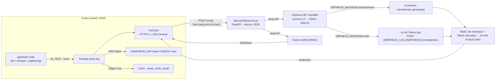

# TTS Sidecar — Technical Specification

Covers **`sidecars/tts/`** only: the FastAPI text-to-speech model server and its HTTP contract.
The Java consumer (`TtsNode`) is covered by [../features/pipeline-nodes/NODES.md](../features/nodes/NODES.md);
node option deserialization by [../cortex/CONFIGURATION.md](../cortex/CONFIGURATION.md).
Sibling sidecar specs with the same shape: [NODE_SENTIMENT.md](../features/nodes/sentiment/NODE_SENTIMENT.md) (§4 sidecar env),
[NODE_DEPTHMAP.md](../features/nodes/depthmap/NODE_DEPTHMAP.md) (§3.2).

## Status

🟢 **Wired end to end.** A real Cortex consumer exists — `io.metaloom.cortex.node.tts.TtsNode`
(kind `tts`, Dagger-bound in `TtsNodeModule`, descriptor in `TtsDescriptorProvider`, unit +
pipeline + persistence + integration tests). This sidecar is **not** standalone/experimental.

Two honest caveats:
- **Nothing deploys it.** `helm/cortex` contains no sidecar container, no port `9100`, no `TTS_*`
  env (verified: `rg -i "sidecar|9100|tts" helm/` → no matches). There is no Dockerfile/Containerfile
  and no compose file for this sidecar — start it by hand with `run.sh`.
- **No test in the repo talks to a live sidecar.** Every TTS test stubs or mocks `TtsClient`
  (`TtsNodeTest`, `TtsNodePipelineTest`, `TtsNodePersistenceTest`, `TtsNodeIntegrationTest`).
  The Python server itself has **zero tests**.

## 1. Architecture



Why the sidecar exists at all: Orpheus is an **LM that emits SNAC audio tokens, not audio**. vLLM can
run the LM, but the 7-token SNAC frame de-interleave + `SNAC.decode()` must happen somewhere. It
happens here, in both backends. The JVM node never loads a model.

## 2. HTTP contract (as implemented in `server.py`)

Base URL `http://{ttsHost}:{ttsPort}`, default `http://localhost:9100`.

### `POST /v1/tts`

Request — `application/json`, pydantic `TTSRequest`:

| Field | Type | Default | Notes |
|---|---|---|---|
| `text` | string | *(required)* | 400 if missing/blank |
| `lang` | string | `"de"` | matched with `.lower().startswith("de"/"en")`, so `de-DE` / `en-US` work |
| `voice` | string | `"Jakob"` | passed verbatim to the engine |
| `format` | string | `"wav"` | **accepted and ignored** — the response is always WAV |

Response — `200`, `Content-Type: audio/wav`, raw bytes.
- German: 24 kHz mono, PCM_16 (`sf.write(..., 24000, format="WAV", subtype="PCM_16")`).
- English: PCM_16 at whatever rate `kokoro.create()` returns (24 kHz for kokoro-v1.0).

Errors — FastAPI `{"detail": "..."}` JSON:

| Code | Raised when |
|---|---|
| `400` | blank `text`; or `lang` is neither `de*` nor `en*` (`unsupported language: X`) |
| `422` | pydantic rejects the body (missing `text` key, wrong types) — FastAPI default |
| `500` | any synthesis exception (`synthesis error: ...`) — includes SNAC layout mismatch and too-few-token frames |
| `502` | `ORPHEUS_BACKEND=vllm` and the upstream `/v1/completions` returned non-200 (body truncated to 500 chars) |
| `503` | `lang=en` and `KOKORO_MODEL` / `KOKORO_VOICES` missing on disk (`run setup.sh`) |

### `GET /health`
`{"status":"ok","orpheus_backend":"<transformers|vllm>","device":"<cuda|cpu>"}`.

### `GET /voices`
Static map — **hardcoded, not derived from the loaded checkpoint**:
`{"de":{"engine":"orpheus","repo":"<ORPHEUS_REPO_DE>","voices":["Jakob","Anton","Julian","Sophie","Marie","thorsten"]},"en":{"engine":"kokoro","voices":["af_heart","am_michael","bf_emma"]}}`.

Neither `/health` nor `/voices` is called by any Java code (verified: no `/health` or `/voices`
reference under `cortex/`, `loom/`, `loom-shared/` for TTS). They are operator-only.

## 3. Environment variables

Read by `server.py` at **import time** — changing one requires a restart.

| Var | Default | Meaning |
|---|---|---|
| `ORPHEUS_BACKEND` | `transformers` | `transformers` = in-process LM; `vllm` = proxy LM, decode SNAC locally. Any other value falls through to `transformers` (no validation). |
| `ORPHEUS_LLM_ENDPOINT` | `http://localhost:8000` | Base URL for the `vllm` backend; `/v1/completions` is appended |
| `ORPHEUS_REPO_DE` | `SebastianBodza/Kartoffel_Orpheus-3B_german_natural-v0.1` | German checkpoint. **HF-gated** — needs an accepted licence + `HF_TOKEN`, or set `Thorsten-Voice/tv-orpheus-v1` (ungated, Apache-2.0, single speaker `thorsten`) |
| `ORPHEUS_REPO_DE_MODEL` | *(value of `ORPHEUS_REPO_DE`)* | `model` field sent to vLLM; set when vLLM announces a different id (e.g. a local path) |
| `SNAC_REPO` | `hubertsiuzdak/snac_24khz` | SNAC decoder repo |
| `KOKORO_MODEL` | `models/kokoro-v1.0.onnx` | Relative to the sidecar dir (`run.sh` cd's there) |
| `KOKORO_VOICES` | `models/voices-v1.0.bin` | Same |
| `DEVICE` | `cuda` if `torch.cuda.is_available()` else `cpu` | torch device for Orpheus + SNAC. Kokoro is ONNX/CPU and ignores it. |

Read by `run.sh` only (bind address, **not** by `server.py`):

| Var | Default | Meaning |
|---|---|---|
| `TTS_HOST` | `0.0.0.0` | uvicorn bind host |
| `TTS_PORT` | `9100` | uvicorn bind port |

Read by `setup.sh`: `PYTHON` (default `python3`) for the venv interpreter.
Implicitly honoured by `transformers` / `huggingface_hub`: `HF_TOKEN`, `HF_HOME` (not referenced in
repo code, but required for the gated Kartoffel repo).

## 4. Node-side options (the other half of the wire)

`TtsNodeOptions` (block `tts` in the Cortex options file) — defaults from code:

| Option | Default | Effect |
|---|---|---|
| `ttsHost` | `localhost` | validated non-blank |
| `ttsPort` | `9100` | validated `> 0` |
| `language` | `de` | sent as `lang`; validated non-blank |
| `voice` | `Jakob` | sent as `voice`; **not validated against the engine** |

Ports: `text` (`TEXT_ANY`, ONE) in → `audio` (`ARTIFACT_AUDIO`, ONE) + `flag` (`SCALAR_STRING`,
`DONE`/`FAILED`) out. `defaultConcurrency = 1` — one sidecar holds one model on one device, so
parallel calls only queue. The descriptor also exposes `timeoutMs` (default `0`), which
`TtsNodeOptions` does **not** have a field for — descriptor/option drift, see Gotchas.

## 5. Deployment and startup

```bash
cd sidecars/tts
./setup.sh                                   # venv + pip -r requirements.txt + curl Kokoro weights
./run.sh                                     # .venv/bin/uvicorn server:app --host 0.0.0.0 --port 9100
ORPHEUS_BACKEND=vllm ORPHEUS_LLM_ENDPOINT=http://localhost:8000 ./run.sh   # production German path
```

`setup.sh` downloads only the two Kokoro files from the `kokoro-onnx` GitHub release
(`model-files-v1.0`). Orpheus + SNAC weights are pulled from the HF Hub lazily **on the first
`lang=de` request**, so the first German call after a cold start blocks on a multi-GB download.
`server.py` also has a `__main__` block (`uvicorn.run(app, host="0.0.0.0", port=9100)`), so
`python server.py` works without `run.sh` — but then `TTS_HOST`/`TTS_PORT` are ignored.

## 6. Test setup

There is no test harness for the Python server. Manual smoke test (from the README):

```bash
curl -s -X POST localhost:9100/v1/tts -H 'Content-Type: application/json' \
  -d '{"text":"Guten Tag, dies ist ein Test.","lang":"de","voice":"Jakob"}' -o de.wav
curl -s -X POST localhost:9100/v1/tts -H 'Content-Type: application/json' \
  -d '{"text":"Hello, this is a test.","lang":"en","voice":"af_heart"}' -o en.wav
```

Verify the WAVs are speech and not silence with `audio-eval/tools/check_outputs.py` — that lives in
the **sibling `audio-eval` repo**, not in this checkout (model comparison notes: `audio-eval/TTS.md`).

Java-side tests, all sidecar-free:

| Test | Path | What it pins |
|---|---|---|
| `TtsNodeTest` | `cortex/nodes/tts/core/src/test/java/io/metaloom/cortex/node/tts/TtsNodeTest.java` | mocked `TtsClient`; WAV lands in `tts_bin`, ports emitted, self-skip on blank text |
| `TtsNodePersistenceTest` | same dir | exactly one `asset_node_result` row, `nodeKind=tts`, **no `result_ref`**; FAILED row on error |
| `TtsNodePipelineTest` | same dir | pipeline adapter, event dispatch, output chaining |
| `TtsOptionsValidationTest` | same dir | defaults `localhost:9100` + validation rules |
| `TtsNodeIntegrationTest` | `integration-test/src/test/java/io/metaloom/loom/test/integration/node/TtsNodeIntegrationTest.java` | stub client returning fixed bytes; ledger row read back over REST |
| `NodePortConformanceTest` | same dir as above | descriptor ports match `TtsNode`'s declared ports |

Running Cortex/Loom tests still needs the pooled test DB — see the repo `CLAUDE.md` (`./setup-pool.sh`).

## 7. Conventions and Gotchas

- **`format` is a lie.** The field is in `TTSRequest` and `TtsClient` always sends `"wav"`, but
  `synthesize()` never reads it. Adding MP3/Opus means changing the server, not the client.
- **HTTP/1.1 is forced** in `TtsClient` (`Version.HTTP_1_1`) because FastAPI rejects the JDK
  client's default HTTP/2 upgrade. Do not remove it. Same trick as `SmolVLMClient`.
- **The two Orpheus backends build different prompts.** `transformers` tokenizes `"{voice}: {text}"`
  and wraps it in raw token ids (`128259 … 128009 128260`); `vllm` sends the literal string
  `<|begin_of_human|>{voice}: {text}<|eot_id|><|end_of_human|>`. A prompt-format change must be made
  in **both** `_orpheus_transformers` and `_orpheus_vllm`.
- **`<custom_token_N>` → SNAC code `N - 10`.** The vLLM path parses tokens out of the completion
  *text*; the `-10` offset is the Orpheus tokenizer's custom-token base. Negative results are
  dropped. If a checkpoint renumbers custom tokens, this silently produces garbage audio, not an error.
- **SNAC frame = 7 codes**, interleaved 1/2/3/3/2/3/3 into 3 codebooks with per-slot offsets of
  `k * 4096`. A trailing partial frame is truncated; **zero** usable frames raises, which surfaces as
  HTTP `500`, not `502`.
- **Models load lazily and are cached in module globals** (`_snac`, `_orpheus_model`, `_kokoro`).
  First request per engine is slow; there is no warmup endpoint and no eviction — a process that
  served both languages holds both models.
- **`voice` is never validated.** An English voice with `lang=de` reaches Orpheus as a speaker name
  and produces something, rather than erroring. `/voices` is a hardcoded hint, not a guard.
- **Two stale doc pointers say the sidecar lives in a `server/` directory next to the node** — the
  javadoc of `TtsNode` and `website/content/english/docs/nodes/tts/index.adoc`. The real location is
  `sidecars/tts/`. Fix these when you touch either file.
- **`timeoutMs` exists in the descriptor but not in `TtsNodeOptions`.** The effective budget is the
  hardcoded `TtsClient` 120 s request / 30 s connect timeout (the vLLM proxy hop also uses 120 s, so
  a slow vLLM can exhaust the client budget first).
- **Ledger-only persistence.** The WAV stays in `metaPath/tts_bin/<segment>/<sha512>.wav`; Loom gets
  an `asset_node_result` row with no `result_ref`, because no byte-ingest endpoint for produced media
  exists — see [../features/rest/REST_CORTEX_METADATA_BINARY_HANDLING_PLAN.md](../concept/REST_CORTEX_METADATA_BINARY_HANDLING_PLAN.md).
  Wiring `audio` into `s3-sink` is the only way to keep the bytes, and the sink must run on the
  **same worker**.
- **`producerVersion` is `"{language}:{voice}"`**, not a model id. Changing `ORPHEUS_REPO_DE` on the
  sidecar does not invalidate anything on the Loom side.
- **Port allocation:** `9100` tts, `9110` sentiment, `9120` depthmap, `9200`/`9210` imagegen,
  `9220` videogen. Do not reuse `9100`.
- **Licensing:** Kartoffel weights are gated and not commercially clean; `Thorsten-Voice/tv-orpheus-v1`
  is Apache-2.0. Kokoro-82M is Apache-2.0. See `website/content/english/docs/legal/model-licenses/`.

## 8. Key Files Reference

| Name | Path | Purpose |
|---|---|---|
| `server.py` | `sidecars/tts/server.py` | The whole sidecar: config, SNAC decode, both Orpheus backends, Kokoro, FastAPI app |
| `run.sh` | `sidecars/tts/run.sh` | uvicorn launcher; `TTS_HOST`/`TTS_PORT` |
| `setup.sh` | `sidecars/tts/setup.sh` | venv + deps + Kokoro weight download |
| `requirements.txt` | `sidecars/tts/requirements.txt` | fastapi/uvicorn/pydantic/httpx/numpy/soundfile + transformers/torch/snac/accelerate + `kokoro-onnx==0.5.0` |
| `README.md` | `sidecars/tts/README.md` | Operator-facing quickstart (duplicates §2–§5 in prose) |
| `TtsClient` | `cortex/nodes/tts/core/src/main/java/io/metaloom/cortex/node/tts/TtsClient.java` | JDK HttpClient POST to `/v1/tts`, returns WAV bytes |
| `TtsNode` | `.../tts/TtsNode.java` | Port wiring, `tts_bin` write, result cache, ledger record |
| `TtsNodeOptions` | `.../tts/TtsNodeOptions.java` | `ttsHost`/`ttsPort`/`language`/`voice` + validation |
| `TtsNodeModule` | `.../tts/TtsNodeModule.java` | Dagger bindings, `@StringKey("tts")`, `TtsClient` provider |
| `TtsDescriptorProvider` | `loom-shared/node-model/src/main/java/io/metaloom/loom/nodes/spec/TtsDescriptorProvider.java` | UI/editor descriptor: ports, parameters, `defaultConcurrency=1` |
| Sidecar index | `sidecars/README.md` | Port table for all sidecars + deployment note |

## 9. Where do I find …?

| I want to … | Look at |
|---|---|
| the HTTP contract | `sidecars/tts/server.py` (§2 here) |
| which port | `sidecars/README.md`, `TtsNodeOptions.ttsPort` = `9100` |
| how the node consumes it | `cortex/nodes/tts/core/.../TtsNode.java`, [../features/pipeline-nodes/NODES.md](../features/nodes/NODES.md) |
| node options schema / defaults | `TtsDescriptorProvider`, [../cortex/CONFIGURATION.md](../cortex/CONFIGURATION.md) |
| port types + cardinality rules | [../features/pipeline/NODE_DATA_TYPES.md](../features/pipeline/NODE_DATA_TYPES.md) |
| where the WAV bytes go | `metaPath/tts_bin/…`; [../features/pipeline-nodes/NODES.md](../features/nodes/NODES.md) §2.1 |
| why nothing is uploaded to Loom | [../features/rest/REST_CORTEX_METADATA_BINARY_HANDLING_PLAN.md](../concept/REST_CORTEX_METADATA_BINARY_HANDLING_PLAN.md) |
| metrics emitted (`recordAiCall`/`recordAiCacheHit` with `"tts"`) | [../features/ops/METRICS.md](../features/ops/METRICS.md) |
| customer-facing docs | `website/content/english/docs/nodes/tts/index.adoc` |
| model licence posture | `website/content/english/docs/legal/model-licenses/index.adoc` |
| another sidecar to copy from | `sidecars/sentiment/`, `sidecars/depth/`; [NODE_SENTIMENT.md](../features/nodes/sentiment/NODE_SENTIMENT.md) |
| how to add a new node + sidecar | [../guidelines/NEW_NODE.md](../guidelines/NEW_NODE.md) |

## 10. Progress Assessment

### Built
- [x] `POST /v1/tts` with `text` / `lang` / `voice` / `format`, returning `audio/wav`
- [x] German path via Orpheus-3B/Kartoffel with SNAC decode to 24 kHz PCM16
- [x] Two selectable Orpheus backends (`transformers` in-process, `vllm` proxy)
- [x] English path via Kokoro-82M ONNX
- [x] `GET /health`, `GET /voices`
- [x] `setup.sh` / `run.sh`, fully self-contained and location-independent
- [x] Java consumer `TtsNode` + `TtsClient` (kind `tts`, Dagger-bound, descriptor published)
- [x] Node unit / pipeline / persistence / integration tests (all with a stubbed client)
- [x] Ledger-only persistence (`asset_node_result`, no `result_ref`) + local `tts_bin` cache
- [x] Customer-facing website doc for the node

### Open
- [ ] **No container image / Helm wiring** — `helm/cortex` has no sidecar container or `TTS_*` env;
      the sidecar must be started manually next to the worker
- [ ] **No tests for `server.py`** — no request/response, SNAC-layout, or error-code coverage
- [ ] **No live-sidecar integration test** (would need an opt-in, tagged test guarded on `/health`)
- [ ] `format` is accepted and ignored — either honour it (mp3/opus) or drop it from the model
- [ ] `/voices` is hardcoded and can disagree with `ORPHEUS_REPO_DE` (e.g. the single-speaker
      Thorsten checkpoint still advertises six German voices)
- [ ] `timeoutMs` in the descriptor has no `TtsNodeOptions` field and no effect
- [ ] No streaming / chunked synthesis — long texts hold one request for up to 120 s
- [ ] No warmup or model-eviction control; first call per engine pays the load + download cost
- [ ] Stale `server/` directory references in `TtsNode`'s javadoc and the website node doc
- [ ] Getting the WAV out of the worker still depends on `s3-sink` co-location; byte-ingest is a plan

### Deliberately not built
- [ ] (n/a) A Java-side model runtime — the whole point of the sidecar is that the node stays a
      pure HTTP client, matching the `CaptioningNode` → SmolVLM pattern

_Last updated: 2026-08-02 — git HEAD `d930e222`_
_Git HEAD revision: `742dae2d`_
_Last updated: 2026-08-06 (reference sweep — no content changes)_