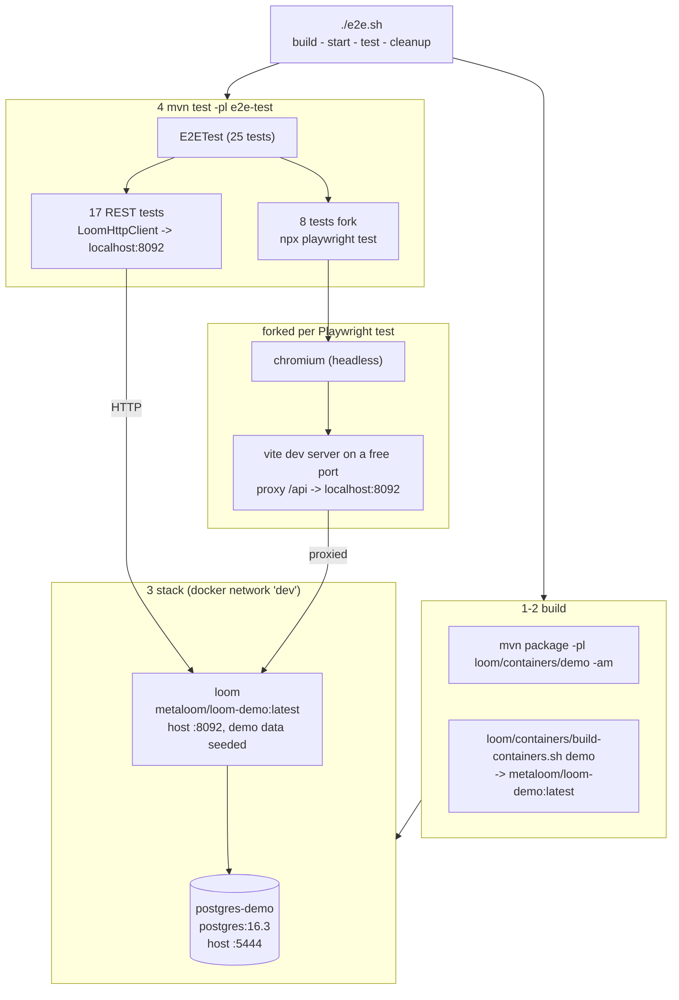

# End-to-End Tests (`e2e-test/` + `loom-ui/e2e/*-backend.spec.ts`)

> **Audience: AI coding agents.** What the end-to-end tier is, how to start the stack it needs, how
> to run it, and the false-greens it is capable of.

An end-to-end test in this repository drives a **packaged, externally started MetaLoom deployment**
through its public surfaces: the REST API over real HTTP, and the real React UI in a real browser.
Nothing is constructed in the test JVM, nothing is stubbed, and the backend is a container image
built from the working tree.

**Scope delineation.** This file covers the e2e tier only.

| Tier | Where | Covered by |
|------|-------|------------|
| End-to-end (packaged container + browser) | `e2e-test/`, `loom-ui/e2e/*-backend.spec.ts` | **this file** |
| Integration (in-JVM Loom, real DB, per-node and per-pipeline) | `integration-test/` | [INTEGRATION_TESTS.md](INTEGRATION_TESTS.md) |
| Helm charts on a real cluster | `helm/test/` | [HELM_TEST.md](HELM_TEST.md) |
| loom-ui unit + **mocked** Playwright specs | `loom-ui/src/**`, `loom-ui/e2e/*-mocked.spec.ts` | [../loom/ui/LOOM_UI.md](../loom/ui/LOOM_UI.md) §8 |
| Endpoint / permission / DAO tests | `loom/core`, `loom/db/**` | [../guidelines/CODING.md](../guidelines/CODING.md) |

The mocked Playwright specs share a directory and a runner with the backend specs but are **not**
end-to-end: they intercept every `/api/v1/**` call. They are the loom-ui component-test tier and are
documented in [../loom/ui/LOOM_UI.md](../loom/ui/LOOM_UI.md) §8.2, not here.

---

## 1. The two halves



**Half one - `e2e-test/`** (`io.metaloom.e2e:loom-e2e-test`). A single JUnit 5 class,
[`E2ETest`](../../e2e-test/src/test/java/io/metaloom/loom/studio/test/E2ETest.java), with 25 tests.
17 of them exercise the REST API directly through `loom-client-rest`; the other 8 fork a Playwright
process against a UI spec. `@BeforeAll` does **not** start anything - it polls
`http://localhost:8092/api/v1` for up to 120 seconds and fails the whole class if nothing answers.
The backend is always externally managed.

**Half two - `loom-ui/e2e/*-backend.spec.ts`** (32 specs). Playwright specs that log in with
`admin` / `finger` and drive the real UI against a real server carrying demo data. They can be run
standalone (see §4) or, for nine of them, through `E2ETest` / `run-e2e.sh`.

---

## 2. Test Setup

### 2.1 Prerequisites

| Requirement | Notes |
|-------------|-------|
| Docker daemon | Reachable by the current user. `e2e.sh` creates the `dev` network if missing. |
| `metaloom/loom-demo:latest` | Built from the working tree by `e2e.sh` step 2. Not on Docker Hub. |
| Maven + JDK 25 | `maven.compiler.release` is 25 in `e2e-test/pom.xml`. |
| `loom-ui/node_modules` | Installed (`npm install` in `loom-ui/`). Only needed for the Playwright half. |
| Playwright browsers | `./node_modules/.bin/playwright install chromium` once. |
| Ports 8092, 5444 free | Both are hard-coded (`REST_PORT` in `E2ETest`, `start-postgres.sh`). The Vite port is not - each Playwright test picks a free one via `findFreePort()`. |

No pooled test database is needed. This tier uses the demo container's own PostgreSQL, not the
`testdatabase-provider` pool that [INTEGRATION_TESTS.md](INTEGRATION_TESTS.md) depends on -
`./setup-pool.sh` is irrelevant here.

### 2.2 Running everything

```bash
./e2e.sh
```

Four steps, in order: package `loom/containers/demo`, build the demo image, start
`postgres-demo` + `loom`, then `mvn test -Dloom.external=true` in `e2e-test`. An `EXIT` trap removes
both containers afterwards, whether the tests passed or not.

### 2.3 Running the halves separately

```bash
# Stack only - leaves it up for iterating
./start-postgres.sh && ./start-demo.sh          # -> http://localhost:8092 (admin / finger)

# Java half against that stack
mvn test -pl e2e-test

# One UI backend spec against that stack
cd loom-ui
VITE_API_BASE_URL=/api/v1 VITE_PROXY_TARGET=http://localhost:8092 \
  ./node_modules/.bin/playwright test e2e/tags-backend.spec.ts --reporter=list

# All backend specs
cd loom-ui
VITE_API_BASE_URL=/api/v1 VITE_PROXY_TARGET=http://localhost:8092 \
  ./node_modules/.bin/playwright test --grep backend --reporter=list

# The one-spec convenience wrapper (login-backend only)
./e2e-test/run-e2e.sh [http://localhost:8092]
```

Rebuild the demo image whenever the UI changes: the container serves `loom-ui/build` from
`/loom/ui`, so a stale image tests a stale front end even though the specs are current.

---

## 3. What `E2ETest` asserts

| Group | Tests | What it covers |
|-------|-------|----------------|
| REST sanity | `testRestLoginDirectly`, `testListAssets`, `testLoadAssetByUuid` | Login returns a token; demo assets exist with `file` info and tags |
| REST CRUD round trips | tags, asset pools, collections, users, groups, roles, reactions, tokens, tasks, comments, blacklist | List (demo data present), create, load by UUID, update where the model has one, delete, confirm gone |
| UI via Playwright | `testTagsViaPlaywright`, plus library, users, groups, roles, pools, collections, pipeline | Forks `npx playwright test e2e/<name>-backend.spec.ts`, streams its output into the test log, fails on a non-zero exit or a 120 s timeout |

The Playwright-forking tests locate the UI through `resolveLoomUiDir()`: `LOOM_UI_DIR`, then
`../loom-ui`, then `${user.dir}/../loom-ui`, accepting the first that has both `package.json` and an
`e2e/` directory.

## 4. The loom-ui backend specs

32 specs, all logging in as `admin` / `finger` against a server with `DemoDatabaseInitializer` data:

`annotations`, `asset-reactions`, `assets`, `attachments`, `blacklist`, `chat`, `clusters`,
`collections`, `comments`, `components`, `cortex`, `detections`, `groups`, `library`, `login`,
`memory`, `persons`, `pipeline`, `pipeline-diff`, `pools`, `region-tags`, `roles`, `search`,
`skills`, `spaces`, `tag-rating`, `tags`, `task-reactions`, `tasks`, `tokens`, `uploads`, `users`.

Nine are wired into a runner - the eight driven by `E2ETest` plus `login` via `run-e2e.sh`. The
remaining 23 run only when someone invokes Playwright by hand, which is the single largest gap in
this tier (§8).

> `cortex-backend.spec.ts` is misnamed: it intercepts its REST calls with `page.route` exactly like
> `cortex-mocked.spec.ts` does, because standing up a live worker for the UI is impractical. Treat it
> as a mocked spec that a `--grep backend` run will pick up anyway.

---

## 5. Configuration

Only variables actually read. `VITE_*` are consumed by Vite / Playwright, not by Loom.

| Variable | Read by | Default | Purpose |
|----------|---------|---------|---------|
| `VITE_API_BASE_URL` | `loom-ui/src/api/config.ts` | `http://localhost:8092/api/v1` | REST base the browser uses. Set to `/api/v1` so calls go through the dev-server proxy. |
| `VITE_PROXY_TARGET` | `loom-ui/vite.config.ts` | unset (no proxy) | Backend the dev server proxies `/api` to. The path is not rewritten. |
| `VITE_PORT` | `loom-ui/playwright.config.ts` | `3000` | Dev-server port. `E2ETest` sets it to a free port per test. |
| `LOOM_UI_DIR` | `E2ETest.resolveLoomUiDir`, `run-e2e.sh` | `../loom-ui` | Where the UI checkout is. The **only** place in the repository that reads this name. |
| `TAG` | `start-demo.sh`, `start-server.sh` | `latest` | Image tag to run; the `native` argument appends `-native`. |
| `LOOM_INITIAL_PASSWORD` | the Loom image | set to `finger` by `start-demo.sh` | Bootstrap admin password every spec logs in with. |
| `LOOM_DB_*` | the Loom image | set by `start-demo.sh` | Host `postgres-demo`, database `loom`, user `postgres`, password `finger`. |

> `-Dloom.external=true`, passed by `e2e.sh`, is **inert**. Nothing reads the property; `E2ETest`
> always assumes an external backend. Do not add a code path keyed on it without deciding what the
> non-external mode would be.

---

## 6. Key Files Reference

| File | Purpose |
|------|---------|
| `e2e.sh` | Repo-root driver: build, image, stack, test, cleanup trap |
| `start-postgres.sh` / `start-demo.sh` | The stack. Network `dev`, containers `postgres-demo` and `loom` |
| `e2e-test/src/test/java/io/metaloom/loom/studio/test/E2ETest.java` | The whole Java half: 25 tests, `waitForRestApi`, `runPlaywrightSpec`, `resolveLoomUiDir`, `findFreePort` |
| `e2e-test/run-e2e.sh` | Runs `login-backend.spec.ts` against a chosen backend URL |
| `e2e-test/pom.xml` | Depends on `loom-client-rest` + JUnit 5. Testcontainers is declared but unused today |
| `e2e-test/config/loom.yml` | **Not loaded by any test.** A reference config, cited as such by [../loom/CONFIGURATION.md](../loom/CONFIGURATION.md) and [../loom/SERVER.md](../loom/SERVER.md) |
| `e2e-test/src/test/resources/loom-e2e.yml` | Unreferenced leftover - no code path reads it |
| `loom-ui/e2e/*-backend.spec.ts` | The browser half |
| `loom-ui/playwright.config.ts` | `testDir: ./e2e`, chromium only, 30 s per test, `webServer` starts Vite and reuses a running one outside CI |
| `loom-ui/scripts/capture-*.mjs` | Not tests: they drive the same demo stack to produce website screenshots - see [../website/WEBSITE.md](../website/WEBSITE.md) |

---

## 7. Conventions and Gotchas

| Gotcha | Detail |
|--------|--------|
| **A missing `loom-ui/` passes** | Each Playwright-forking test logs `loom-ui directory not found. Skipping` and **returns green**. Eight tests can report success having asserted nothing. Prefer `Assumptions.abort` over `return` when touching these. |
| **`npx` stalls in this sandbox** | `npx playwright test` never spawns the binary and hangs with no output. Use `./node_modules/.bin/playwright`. `E2ETest` still shells out to `npx` - a hang there surfaces as the 120 s timeout, not as a missing tool. |
| **`mvn test` at the repo root includes `e2e-test`** | With no backend on 8092, `@BeforeAll` blocks 120 s and then fails the module. Use `-pl` to select modules, or start the stack first. |
| **Port 8092 is hard-coded** | `REST_PORT` is a constant in `E2ETest`. A development server already on 8092 will be tested against instead of the demo container, silently. |
| **Demo data is the fixture** | Specs assert on `DemoDatabaseInitializer` output (for example "8 tags across 2 collections"). Changing demo data changes what the e2e tier asserts; see [../guidelines/CODING.md](../guidelines/CODING.md). |
| **CRUD tests are not isolated** | `E2ETest` creates and deletes against the live demo database with no transaction. A failure mid-test leaves the entity behind, and the next run's list assertions see it. |
| **Playwright role names match as substrings** | A new nav label containing an existing one breaks unrelated specs. Use `{ exact: true }`. |
| **`page.route` order** | Most-recently-registered wins. Relevant to the mocked specs a `--grep backend` run drags along; the rules are in [../loom/ui/LOOM_UI.md](../loom/ui/LOOM_UI.md) §8.2. |
| **The UI ships inside the image** | `vite.config.ts` sets `base: "/ui/"` and the demo image copies `loom-ui/build`. A UI change is invisible to the e2e tier until the image is rebuilt. |
| **No Cortex in this stack** | `e2e.sh` starts Loom and PostgreSQL only. Anything requiring a worker (pipeline execution, node results) is covered by [INTEGRATION_TESTS.md](INTEGRATION_TESTS.md) or [HELM_TEST.md](HELM_TEST.md) instead. |

---

## 8. Where do I find ...?

| I want to ... | Go to |
|---------------|-------|
| Run the whole e2e tier | `./e2e.sh` |
| Start a backend to click around in | `./start-postgres.sh && ./start-demo.sh`, then `./ui.sh` or `http://localhost:8092/ui/` |
| Add a REST-level e2e assertion | `E2ETest` - follow an existing CRUD test; login, create, load, update, delete, confirm gone |
| Add a UI-level e2e assertion | a new `loom-ui/e2e/<feature>-backend.spec.ts`, then wire it into `E2ETest` via `runPlaywrightSpec` |
| Understand the mocked specs | [../loom/ui/LOOM_UI.md](../loom/ui/LOOM_UI.md) §8 |
| Run per-node or pipeline tests | [INTEGRATION_TESTS.md](INTEGRATION_TESTS.md) |
| Test a Helm deployment | [HELM_TEST.md](HELM_TEST.md) |
| Change what demo data exists | `DemoDatabaseInitializer` in `loom/core/.../boot/` |
| Capture website screenshots from the same stack | [../website/WEBSITE.md](../website/WEBSITE.md) |
| Loom configuration reference | [../loom/CONFIGURATION.md](../loom/CONFIGURATION.md) |

---

## 9. Progress Assessment

- [x] Repo-root one-command driver (`e2e.sh`) that builds the image, starts the stack and cleans up
- [x] REST-level coverage of the main CRUD surfaces against a packaged container
- [x] Browser-level coverage driven from the Java suite for eight features
- [x] 32 UI backend specs written against demo data
- [x] Free-port allocation for the Vite dev server, so parallel Playwright runs do not collide
- [ ] The 23 backend specs no runner invokes - wire them into `E2ETest` or replace the per-test fork with a single `--grep backend` run
- [ ] Replace the `return`-on-missing-`loom-ui` skips with `Assumptions.abort` so they cannot report green
- [ ] Stop hard-coding `REST_PORT` - take it from a system property so an occupied 8092 is not silently accepted
- [ ] Isolate the CRUD tests (unique names plus guaranteed cleanup) so a failed run does not poison the next
- [ ] Bring a Cortex worker into the e2e stack so a pipeline run is covered here and not only in `integration-test` and `helm/test`
- [ ] Delete or wire up `e2e-test/src/test/resources/loom-e2e.yml` and the unused Testcontainers dependencies
- [ ] Guard `e2e-test` in a root `mvn test` (profile or assumption) instead of a 120 s wait and a failure
- [ ] Wire into CI once a runner with a Docker daemon and Playwright browsers exists

_Git HEAD revision: `ec82ea43`_
_Last updated: 2026-08-14_
