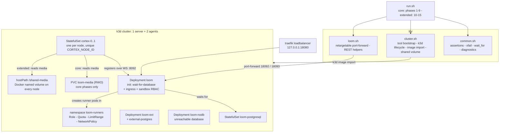

# Helm Chart Test Harness (`helm/test`)

> **Audience: AI coding agents.** How the end-to-end test harness for the Helm charts is built, what
> it asserts, and the constraints it must honor. The operator-facing version is
> [`helm/test/README.md`](../../helm/test/README.md).

The harness stands up a throwaway [k3d](https://k3d.io) cluster, deploys [`helm/loom`](../../helm/loom)
and [`helm/cortex`](../../helm/cortex) as one combined setup, and drives a real pipeline through it:
ingest an asset, run a graph on a Cortex worker, and assert results came back and were persisted.

**Scope delineation.** This file covers the harness. What the charts render and why is
[features/helm/HELM_LOOM.md](../features/helm/HELM_LOOM.md) and
[features/helm/HELM_CORTEX.md](../features/helm/HELM_CORTEX.md); neither is duplicated here. Pipeline
semantics live in [features/pipeline/PIPELINE.md](../features/pipeline/PIPELINE.md), REST contracts in
[loom/RESTAPI.md](../loom/RESTAPI.md).

**What it is not.** It is not a unit-test suite and not a substitute for `integration-test/`
([INTEGRATION_TESTS.md](INTEGRATION_TESTS.md) — per-node and per-pipeline against real components) or
`e2e-test/` ([E2E_TESTS.md](E2E_TESTS.md) — against a running container deployment). It
tests the *charts*: label selectors, volumes, probes, env plumbing, and whether the two releases work
together once deployed. It uses the repository's own images and build scripts, so a green run means
"these charts deploy this code", not "these charts render valid YAML".

## Architecture



## Test Setup

### Prerequisites

| Requirement | Notes |
|-------------|-------|
| Docker daemon | Reachable by the current user. Not bootstrapped -- a daemon cannot be installed from a script. |
| Helm 3 | The tool under test. |
| `curl`, `jq` | REST calls and response parsing. |
| `metaloom/loom-server:latest` | Built from the working tree, not pulled -- neither image exists on Docker Hub. |
| `metaloom/cortex-server:latest` | Same. Additionally needs a local OpenCV 5.1 build (`OPENCV_LIB_DIR`). |

`kubectl` and `k3d` are **not** prerequisites: `ensure_tools` downloads them into `helm/test/.bin/`
on first run. Nothing is installed system-wide and `~/.kube/config` is never touched -- the cluster
kubeconfig lives at `helm/test/.work/kubeconfig`.

### Building the images

```bash
mvn package -DskipTests
(cd loom-ui && npm run build)
(cd loom/containers  && ./build-containers.sh jvm server)
(cd cortex/container && ./build-container.sh)
```

Or pass `--build`, which delegates to those same scripts. The harness deliberately does not
reimplement the build: a divergence between what it builds and what the release builds would make a
green run meaningless.

### Running

```bash
cd helm/test
./run.sh                       # core + extended, cluster destroyed afterwards (about 25 minutes)
./run.sh --core                # core only -- the fast path, about 10 minutes
./run.sh --suite core,extended # pick suites explicitly
./run.sh --keep                # leave the cluster up for inspection
./run.sh --reuse               # reuse an existing cluster (implies --keep)
./run.sh --build               # build the images first
./run.sh --down                # delete the cluster and exit
```

`--reuse` is the flag for iterating: all helm operations are `upgrade --install`, so a second run
against a live cluster is idempotent and skips both cluster creation and the image import.

**Suites.** `core` is phases 1-9: deploy both charts, run a pipeline, survive a restart. `extended` is
phases 10-15 and builds on what core deployed -- it reuses the worker token, the running Loom and the
media fixture -- so `--suite extended` alone is rejected. Default is both.

Exit code is 0 only when every check passed. Known issues (below) do not affect it.

## Phases and what each asserts

| Phase | Asserts |
|-------|---------|
| 0 Preflight | Tools present or bootstrapped; both images exist locally |
| 1 Chart validation | `helm lint` both charts; both render under flag combinations a plain install never reaches -- external DB, ingress, sandbox RBAC, S3, custom worker image, PDB |
| 2 Cluster | k3d cluster up; images imported; both releases pass `--dry-run=server` against a real API server (schema and admission, which `helm lint` cannot check) |
| 3 Media volume | `loom-media` claim created and the fixture copied onto it |
| 4 Deploy Loom | Bundled Postgres and the Deployment roll out; all four PVCs bind; **`svc/loom` has exactly one endpoint** (regression guard for S1) |
| 5 API bootstrap | `/api/v1/health` returns 200; admin login works with the chart's `auth.initialPassword`; an API key can be minted |
| 6 Deploy Cortex | StatefulSet becomes ready -- which *is* the registration assertion, since its readiness probe hits `/api/ready` and that answers 200 only once registered; the worker can read the shared media volume |
| 7 Registration | Loom's `/api/v1/processors` lists the worker as `ONLINE`, with the pod name as node id and the chart's `nodeKinds` as its whitelist |
| 8 Pipeline | Create library, upload fixture, create a `filesystem-source -> sha512 / md5 / metadata` pipeline, run it, reach a terminal state, **assert at least one item was processed**, and that the stored SHA-512 matches the fixture |
| 9 Restart | Loom returns after `rollout restart` against its existing database and volumes; Cortex re-registers |
| 10 Scale-out | Cluster is multi-node; Cortex scales to 2 replicas on the shared volume; both register with **distinct** `CORTEX_NODE_ID`s matching their pod names; every replica can read the media volume; logs the node placement |
| 11 Ingress | `ingress.enabled=true` produces an Ingress whose backend is `loom:8092` with the configured host, and `GET /api/v1/health` **through traefik** returns 200 |
| 12 Sandbox RBAC | The `loom-runners` namespace and all five guardrail objects exist; Loom's service account may create and delete runner pods there, may **not** create pods in the release namespace, and a runner pod created as that service account is admitted and gets its cpu limit defaulted by the LimitRange |
| 13 Upgrade | The release carries several in-place revisions, the latest is `deployed`, a pod-template change rolls out, and the API still answers afterwards |
| 14 External database | A second release against a Postgres the chart does not own: no bundled StatefulSet is created, the `<fullname>-db` secret carries `db-password`, and the instance migrates, seeds and serves |
| 15 No database | With `waitForDatabase` off and an unresolvable host, Loom should exit non-zero so Kubernetes restarts it. It does not -- recorded as an xfail with the observed container state and restart count |

Phase 8's item-count and persistence assertions carry the most weight. A run whose source enumerated
nothing still reports SUCCESS, and Cortex persists results **best-effort** -- a worker that cannot
resolve the asset logs and moves on while still reporting the task successful. A test that only
checked run status would go green on a setup that stored nothing. Both false-green modes were
observed during development; see C1 in [HELM_CORTEX.md](../features/helm/HELM_CORTEX.md).

## Key Files Reference

| File | Purpose |
|------|---------|
| `helm/test/run.sh` | Entry point: argument parsing, the nine phase functions, teardown trap, summary |
| `helm/test/lib/common.sh` | `pass`/`fail`/`check*` accounting, `xfail`, `wait_for`, `dump_diagnostics`, `json_field` |
| `helm/test/lib/cluster.sh` | `ensure_tools`, `require_images`, `build_images`, `cluster_up`/`cluster_down`, `import_images` |
| `helm/test/lib/loom.sh` | `port_forward_start`/`_stop`, `api`/`api_ok`, `loom_login`, `loom_mint_api_key`, `loom_create_library`, `loom_upload_asset`, `loom_create_pipeline`, `loom_await_run` |
| `helm/test/values/loom.yaml` | Loom values: bundled Postgres, `pullPolicy: Never`, tolerant probes, the `loomapp` DB username workaround |
| `helm/test/values/cortex.yaml` | Cortex values: media claim, writable mount, four-kind whitelist |
| `helm/test/values/loom-external-db.yaml` | Second release wired to `external-postgres` with `postgresql.enabled=false` |
| `helm/test/values/loom-nodb.yaml` | Third release with `waitForDatabase` off and an unresolvable host, for phase 15 |
| `helm/test/manifests/media.yaml` | `loom-media` PVC plus the short-lived `media-loader` pod |
| `helm/test/manifests/external-postgres.yaml` | A Postgres the chart does not own, for phase 14 |
| `.github/workflows/helm-chart-test.yml` | CI: builds both images then runs the harness on chart changes, weekly, and on demand |
| `helm/test/fixtures/pipeline.json` | The graph under test: one source fanning out to three analysis nodes |
| `helm/test/fixtures/media/sample.jpg` | 8 KB 320x240 JPEG, generated with ffmpeg; deterministic bytes so the SHA-512 assertion is stable |

## Configuration

Overridable by environment variable; every default is in the header of `run.sh`.

| Variable | Default | Purpose |
|----------|---------|---------|
| `CLUSTER_NAME` | `metaloom-helm-test` | k3d cluster name |
| `NAMESPACE` | `metaloom-test` | Namespace all releases install into |
| `CLUSTER_AGENTS` | `2` | Agent nodes in addition to the server; set to `0` for a single-node cluster |
| `SUITES` | `core,extended` | Phase groups to run; `--core` and `--suite` set this |
| `LOOM_LOCAL_PORT` | `18092` | Local port for the port-forward to `svc/loom` |
| `LOOM_EXT_LOCAL_PORT` | `18093` | Local port for the external-database release |
| `INGRESS_LOCAL_PORT` | `18080` | Host port k3d publishes for the loadbalancer's `:80` |
| `SHARED_MEDIA_VOLUME` | `metaloom-helm-test-media` | Docker named volume mounted at `/shared-media` on every node |
| `LOOM_IMAGE` | `metaloom/loom-server:latest` | Server image to import and deploy |
| `CORTEX_IMAGE` | `metaloom/cortex-server:latest` | Worker image to import and deploy |
| `KUBECONFIG` | `helm/test/.work/kubeconfig` | Set by `run.sh`; never the user's config |

Fixed in `run.sh` rather than parameterised: `LOOM_ADMIN_PASSWORD` (`helm-harness-admin-pw`) must
match `auth.initialPassword` in `values/loom.yaml`. Change both or neither.

## Conventions and Gotchas

**Multi-node, and how the RWX problem was sidestepped.** The cluster is one server plus two agents.
The obstacle was never the node count but storage: local-path PVs are `ReadWriteOnce` *and* pinned to
the node that first bound them, so anything sharing a volume across pods is stuck on one node. Two
different mechanisms handle that, and the split is deliberate:

- **Core phases** keep the `loom-media` PVC. One Cortex replica consumes it, and the scheduler honours
  the PV's node affinity, so this exercises the chart's `media.existingClaim` branch.
- **Phase 10** switches to `media.hostPath: /shared-media`, backed by a **Docker named volume** that
  k3d mounts into every node with `@all`. Same bytes on every node, which is the RWX behaviour
  local-path cannot provide, and it also covers the chart's `media.hostPath` branch.

A named volume rather than a host path because it needs no path on the host at all -- the harness may
itself run in a container whose paths do not match the daemon's. It is populated by piping the fixture
through `docker run -i`, for the same reason. Loom's own `config`/`keystore`/`uploads` claims stay RWO
and are fine: `replicaCount` is 1, and on restart the scheduler places the new pod where the PV lives.

**Traefik stays enabled.** It was previously disabled as dead weight. Phase 11 drives a real request
through it via the loadbalancer port k3d publishes, so it is now the only phase testing the ingress
data path rather than the rendered object.

**`pullPolicy: Never` is deliberate.** Images are side-loaded with `k3d image import`. `IfNotPresent`
would silently fall back to a registry pull and test a published image instead of the working tree.
The one exception is `waitForDatabase.image.pullPolicy: IfNotPresent` -- that init container runs the
stock postgres image, which is a normal third-party pull.

**The media loader exists because a PVC cannot be written directly.** `kubectl cp` only targets a
running pod, so `manifests/media.yaml` ships a `busybox` pod that holds the claim while the fixture is
copied in, then is deleted before Cortex starts -- the claim is RWO and the two cannot hold it at
once. The loader must `chown 1000:0` and leave the file **writable**, not merely readable: the hash
nodes cache their digest as the `loom_sha512` extended attribute, and setting a `user.*` xattr needs
write permission on the file.

**The fixture is both mounted and uploaded.** Loom hands workers a *path*, never bytes, and Cortex
nodes attach results to assets Loom already knows, resolved by SHA-512. The same file therefore has to
be on the media volume (so the worker can read it) and ingested through the API (so there is an asset
to attach to). The final assertion -- stored SHA-512 equals the fixture's -- is what proves the worker
hashed the intended file rather than something else on the volume.

**The asset model is grouped, not flat.** `GET /api/v1/assets/{uuid}` returns the hash under
`.hashes.sha512` and the name and size under `.file`. Asserting on a top-level `.sha512` silently
reads null and fails for the wrong reason.

**`nodeKinds` is restricted for determinism.** The stock worker advertises every built-in kind,
including `whisper`, `vlm` and `facedetect`, which want model weights and a GPU. Whitelisting the four
kinds the test uses keeps a run fast and makes a failure mean "the chart is broken" rather than "the
GPU node could not load its weights".

**`k3d image import` can bounce the serverlb.** It drops the API connection and can move the published
port, surfacing as `Kubernetes cluster unreachable` seconds later. `import_images` re-reads the
kubeconfig and waits on `/readyz` afterwards; do not remove that.

**Assertions never abort a phase implicitly.** `check*` return the failure status, so every call site
is either `|| true` (continue) or `|| return 1` (stop this phase), and `main` invokes each phase with
`|| true`. Failures accumulate into a summary instead of dying at the first one. Use `fatal` only for
harness problems (missing tool, cluster will not start), never for a failed assertion about the charts.

**Diagnostics are dumped before teardown.** The `EXIT` trap calls `dump_diagnostics` while the cluster
still exists; after deletion there is nothing left to explain a failure with.

**`helm` does not remember `--set` between upgrades.** Phases 11, 12 and 13 each upgrade the same Loom
release, so settings accumulate in `LOOM_EXTRA_SET` and every upgrade replays all of them. Adding a
phase that upgrades Loom without going through `_loom_upgrade` silently reverts the ingress and the
sandbox.

**Only one port-forward is live at a time.** `port_forward_start [service] [port]` retargets it and
moves `LOOM_URL` with it, because the external-database phase talks to a second release. A phase that
switches the target must hand it back, which is why phase 14 ends by re-pointing at the main release.

**Phase 15 disables both probes on purpose.** The question it asks is whether the *process* exits by
itself. A liveness probe would restart the pod on its own schedule and answer a different question.

**`kubectl logs deployment/loom` used to resolve to Postgres.** Fixed by S1 in
[HELM_LOOM.md](../features/helm/HELM_LOOM.md), but be aware when reading older notes or logs.

## Known issues reported by the harness

Application-side defects reported as `xfail` -- printed, counted separately, and **not** failing the
run, so that a pre-existing application bug cannot mask a chart regression. If one starts passing the
harness fails and tells you to promote it to a normal check.

| Issue | Detail |
|-------|--------|
| Flyway migrates into a different schema after the first boot | `V1__db_setup.sql:1` creates schema `loom` while the default DB user is also `loom`, and `search_path` is `"$user", public`. First boot targets `public`; every later boot targets `loom`, re-runs all migrations from V1 and dies in `V2.55__remove_webhook.sql`, whose enum rebuild selects from `pg_enum join pg_type` filtered only by `typname` (no schema predicate). Loom never becomes ready again after any restart. Two fixes needed: pin Flyway's schema in `FlywayModule`, and add the schema predicate to V2.55. Worked around by setting the DB username to `loomapp`; set it back to `loom` to reproduce. |
| API keys do not authenticate against REST | `POST /api/v1/tokens` returns an 8-character key. Only `MCPAuthenticationHandler` resolves one (`TokenDao#findByToken`), so keys work on `/mcp/*` and 401 everywhere on REST, in every header form. The docs claim they behave like JWTs. The harness gives Cortex the admin JWT instead. |
| Runs succeed without persisting node-result rows | `AbstractMediaNode#recordNodeResult` is a silent no-op when the asset does not resolve or the node's injected `LoomClient` is null. Not chart-side: the worker registers, its token authenticates, and from inside the Cortex pod `GET /api/v1/assets/sha512/<hash>` returns 200 for that asset. |
| Loom does not exit when its database is unreachable | Asserted by phase 15 and confirmed empirically: with an unresolvable DB host the container stays `running` with restart count 0, forever. `LoomImpl#run` catches every exception from `boot().init(true)`, logs it, and falls through to `dontExit()` (`latch.await()`), so a fatal boot failure yields a live process with no listener and no exit code for Kubernetes to act on. `FlywayModule` also sets no `connectRetries`, so Flyway's default of 0 applies and a database two seconds late is fatal. Both fixes land in the same two files; `FlywayModule` is also where the missing `defaultSchema` belongs. The chart's `waitForDatabase` init container only hides the trigger. |

## Where do I find ...?

| Concept | Location |
|---------|----------|
| Harness entry point | `helm/test/run.sh` |
| Assertion and reporting helpers | `helm/test/lib/common.sh` |
| Cluster and image plumbing | `helm/test/lib/cluster.sh` |
| REST client helpers | `helm/test/lib/loom.sh` |
| Chart values used by the tests | `helm/test/values/{loom,cortex}.yaml` |
| Pipeline graph under test | `helm/test/fixtures/pipeline.json` |
| Downloaded kubectl and k3d | `helm/test/.bin/` (gitignored) |
| CI workflow | `.github/workflows/helm-chart-test.yml` |
| Kubeconfig and port-forward log | `helm/test/.work/` (gitignored) |
| What the charts render | [features/helm/HELM_LOOM.md](../features/helm/HELM_LOOM.md), [features/helm/HELM_CORTEX.md](../features/helm/HELM_CORTEX.md) |
| Chart sources | `helm/loom/`, `helm/cortex/` |
| Image build scripts | `loom/containers/build-containers.sh`, `cortex/container/build-container.sh` |
| Per-node Cortex integration tests | [INTEGRATION_TESTS.md](INTEGRATION_TESTS.md) — `integration-test/` |
| Container-deployment E2E tests | [E2E_TESTS.md](E2E_TESTS.md) — `e2e-test/` |
| Operator-facing harness docs | [`helm/test/README.md`](../../helm/test/README.md) |

## Progress Assessment

- [x] k3d cluster lifecycle with self-bootstrapping `kubectl` and `k3d`
- [x] Isolated kubeconfig; the user's `~/.kube/config` is never touched
- [x] `helm lint` plus render coverage for conditional templates (ingress, sandbox, S3, PDB, external DB, custom image)
- [x] Server-side `--dry-run=server` validation against a real API server
- [x] Combined Loom + Cortex deployment with a shared media volume
- [x] Worker registration asserted from Loom's own view, including the `nodeKinds` whitelist round-trip
- [x] Pipeline execution with item-count and persistence assertions
- [x] Restart-resilience phase for both Loom and worker re-registration
- [x] `xfail` mechanism separating known application bugs from chart regressions
- [x] Failure diagnostics dumped before teardown
- [x] Multi-node coverage -- 1 server + 2 agents; the RWX gap is bridged by a Docker named volume mounted `@all`, and phase 10 confirms workers land on different nodes
- [x] Ingress phase exercising `ingress.enabled` end to end -- a real request through traefik, not a rendered object
- [x] Sandbox RBAC phase actually creating a runner pod in `loom-runners`, plus the negative assertion that the grant does not reach the release namespace, and that the LimitRange defaults the pod's limits
- [x] Phase asserting Loom exits non-zero when its database is absent -- written and enabled; currently an xfail because the process wedges instead (see Known issues)
- [x] External-database path deployed as a second release against a Postgres the chart does not own
- [x] `helm upgrade` path -- in-place upgrades across revisions including a pod-template change. The 0.1.0 to 0.2.0 selector change remains reinstall-only, which is a chart property rather than a gap
- [x] Cortex `replicaCount > 1` with per-replica `CORTEX_NODE_ID` uniqueness asserted from Loom's own view
- [x] Wired into CI as `.github/workflows/helm-chart-test.yml`
- [ ] CI cannot build the Cortex image yet: `build-container.sh` needs an OpenCV 5.1 tree via `OPENCV_LIB_DIR`, which no runner provides. The workflow builds it as a `continue-on-error` step and fails with an explanatory annotation. Publishing a prebuilt OpenCV artifact, or caching that build, unblocks the deploy phases in CI
- [ ] `helm rollback` after a failed upgrade
- [ ] A pipeline whose graph spans both worker replicas, asserting task distribution rather than only registration
- [ ] Cortex `podDisruptionBudget` and `s3.enabled` deployed rather than rendered (S3 needs a MinIO in-cluster)
- [ ] Chart-level `nodeSelector` / `tolerations` / `affinity` honoured -- rendered today, never scheduled against

_Git HEAD revision: `ec82ea43`_
_Last updated: 2026-08-14_
