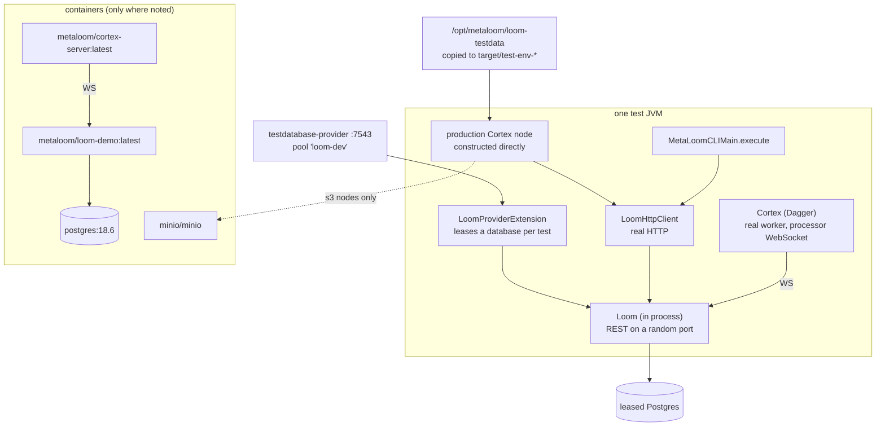

# Integration Tests (`integration-test/`)

> **Audience: AI coding agents.** What the `integration-test` module covers, what it needs before it
> can run, the contract a new test must follow, and the build gotchas that make a green run a lie.

An integration test here wires **real production components** together across a real process or
network boundary: a real Loom server with a real PostgreSQL database, the real REST client over real
HTTP, real Cortex nodes, and - for two of them - real containers. What gets replaced is only the
outermost dependency the machine cannot be assumed to have: a model, a native runtime, or a
third-party cloud API.

**Scope delineation.** This file covers `integration-test/` only.

| Tier | Where | Covered by |
|------|-------|------------|
| Integration (real Loom + real DB + real nodes) | `integration-test/` | **this file** |
| End-to-end (packaged container + browser) | `e2e-test/`, `loom-ui/e2e/*-backend.spec.ts` | [E2E_TESTS.md](E2E_TESTS.md) |
| Helm charts on a real cluster | `helm/test/` | [HELM_TEST.md](HELM_TEST.md) |
| Endpoint / permission / DAO / cascade tests | `loom/core`, `loom/db/**` | [../guidelines/CODING.md](../guidelines/CODING.md) |
| Node unit tests | `cortex/nodes/*/src/test` | [../guidelines/NEW_NODE.md](../guidelines/NEW_NODE.md) |
| loom-ui unit + mocked specs | `loom-ui/` | [../loom/ui/LOOM_UI.md](../loom/ui/LOOM_UI.md) §8 |

What the nodes themselves do, and what the pipeline engine promises, is not repeated here - see
[../features/nodes/NODES.md](../features/nodes/NODES.md) and
[../features/pipeline/PIPELINE.md](../features/pipeline/PIPELINE.md).

---

## 1. Architecture



### 1.1 The five families

| Family | Files | What it proves |
|--------|-------|----------------|
| **Per-node** (`integration/node/`) | 31 `*NodeIntegrationTest` on `AbstractNodeIntegrationTest` | A production node, given a real media file and a real `LoomHttpClient`, writes its typed payload into the right table and it reads back through REST |
| **Pipeline** (`integration/`) | `PipelinePersistence`, `PipelineDistributedExecution`, `PipelineAffinitySegment`, `PipelineContainerExecution` | node -> REST -> database persistence; registration, whitelisting, dispatch and results across real workers; affinity segments dispatched as one unit; and the same topology again in containers |
| **CLI** | `CliIntegrationTest` | The real CLI against a real server in process - argument handling, output formats, exit codes, name-to-UUID resolution |
| **Contract** | `NodeSpecGoldenTest`, `HealthEndpointIntegrationTest`, `MockLLMServerIntegrationTest` | The committed `node-descriptors.json` still matches the annotated node classes; health reports the database; the OpenAI-compatible LLM path works against `MockLLMServer` |
| **Generators** | `NodeDescriptorResourceGenerator`, `Docs*FixtureGenerator`, `DebugScreenshotFixtureGenerator`, `DetectionPlayerFixtureGenerator`, `CliDocSampleRunner` | Not tests. Opt-in producers of committed resources and website fixtures (§6) |

`PipelineDistributedExecution` and `PipelineContainerExecution` are deliberately the same topology
twice. The JVM one is fast and debuggable; the container one is the only thing covering the
Containerfiles, the packaged jars and the `@EnvironmentVariable` configuration path - a JVM test that
builds `LoomOptions` by hand cannot see a broken env binding. Both defects found while writing the
container test were invisible to the JVM test by construction.

---

## 2. Test Setup

### 2.1 Prerequisites

| Requirement | Needed by | Notes |
|-------------|-----------|-------|
| `testdatabase-provider` on `localhost:7543` with pool `loom-dev` | everything extending `AbstractIntegrationTest` | Provisioned by `./setup-pool.sh`. Missing pool fails in `ProviderExtension.beforeEach` with `Pool not found {loom-dev}` - an environment problem, not a code bug |
| `/opt/metaloom/loom-testdata` | every node test (`TestEnvHelper.prepareTestdata`) | Copied to `target/test-env-<name>/` per test class and stripped of xattrs. **Not** in git and not versioned; a missing directory fails the test outright |
| Docker daemon | `PipelineContainerExecutionIntegrationTest`, `S3Source`/`S3Sink` node tests | Testcontainers |
| `metaloom/loom-demo:latest`, `metaloom/cortex-server:latest` | container pipeline test | Built locally by `loom/containers/build-containers.sh` and `cortex/container/build-container.sh`. Override with `-Dloom.image` / `-Dcortex.image` |
| OpenCV / video4j natives on `LD_LIBRARY_PATH` | thumbnail, fingerprint, quality, scene-detection, captioning | `assumeVideo4j()` aborts (skips) rather than failing when the native runtime will not initialize |
| Maven local repository up to date | everything | See §7 - this is where most wasted hours go |

No sidecar, no Ollama, no GPU and no model weights are required for the test suite itself. Model and
sidecar boundaries are stubbed (§4). Only the opt-in generators in §6 want real weights.

### 2.2 Running

```bash
./it.sh                    # setup-pool, then mvn verify -pl integration-test
```

Piecemeal, which is what iterating looks like:

```bash
./setup-pool.sh                                        # once, and after any Flyway change
mvn -o -pl integration-test test -Dtest=TikaNodeIntegrationTest
mvn -o -pl integration-test test -Dtest='*NodeIntegrationTest'
mvn -o -pl integration-test test -Dtest=PipelineContainerExecutionIntegrationTest \
    -Dmetaloom.containerLogs=true                      # see inside the containers
```

`-Dmetaloom.containerLogs=true` is the first thing to turn on when a container test fails: the
containers are gone by the time the assertion is read. It is off by default because Loom logs every
jOOQ statement at DEBUG and drowns the output.

---

## 3. The per-node contract

`AbstractNodeIntegrationTest` (extends `AbstractIntegrationTest`, implements the `VideoData`,
`ImageData`, `AudioData`, `DocData`, `OtherData` mixins) exists so every node test has the same
shape:

1. pre-create the asset in Loom for a real file, **keyed by that file's real SHA-512**;
2. construct the production node with the real `LoomHttpClient`;
3. run `node.process(NodeContext.create(media))`;
4. assert the typed payload reached its component table **by reading it back through REST**.

```java
public class TikaNodeIntegrationTest extends AbstractNodeIntegrationTest {
    @Test
    public void testTikaPersistsJsonComp() throws Exception {
        withLoom(client -> {
            AssetResponse asset = getOrCreateAsset(client, docDOCX(), "application/vnd.openxmlformats-officedocument.wordprocessingml.document");

            TikaNode node = new TikaNode(client, cortexOptions(), new TikaNodeOptions());
            NodeResult result = node.process(NodeContext.create(media(docDOCX())));
            assertThat(result.getState()).isEqualTo(ResultState.SUCCESS);

            JsonCompResponse comp = client.listAssetJsonComps(asset.getUuid()).sync().body().getData().stream()
                .filter(c -> "tika".equals(c.getSchemaType()))
                .findFirst().orElse(null);
            assertThat(comp).as("tika JSON component must be readable via REST").isNotNull();
        });
    }
}
```

| Helper | Use it when |
|--------|-------------|
| `withLoom(body)` | Always. Boots Loom, logs in as admin, runs the body, shuts down in a `finally` |
| `getOrCreateAsset(client, media, mimeType)` | The node needs a **real** media file. The pooled fixture already seeds assets for the corpus, so a plain `createAsset` with a corpus hash is a 500 duplicate-key |
| `createUniqueAsset(client, mimeType, bytes[, suffix])` | Content-agnostic nodes (hash, consistency) that must start from empty columns. Pass the real extension - `FilterHelper.isImage`/`isVideo` decide on the extension alone, so a `.bin` file makes an image-gated node skip regardless of its bytes |
| `createUniqueMediaAsset(client, source, mimeType, salt)` | A real media file **and** empty columns: copies the corpus file and salts the tail so the hash does not collide |
| `media(testMedia)` | Builds the `LoomMedia` with its SHA-512 already set. Without it `AbstractMediaNode.fetchAsset` finds nothing, the node silently runs in offline mode and persists nothing while still returning SUCCESS |
| `assumeVideo4j()` | The node touches OpenCV/video4j. Skips rather than fails when the native runtime is absent |
| `cortexOptions()` | Default `CortexOptions`. Set `metaPath` to a temp directory when the node writes files |

---

## 4. Where the line is drawn

The rule: **stub the model, keep everything below it real.** The detection algorithm, the
transcription quality and the LLM's answer are not what these tests are for; the persistence path,
the REST contract and the schema are.

| Test | What is replaced | What stays real |
|------|------------------|-----------------|
| `FacedetectNodeIntegrationTest` | `InspireFacedetector`, `VideoFaceScanner` (Mockito) | image file, node, client, REST, `detection` table |
| `WhisperNodeIntegrationTest` | `WhisperMediaProcessor` (Mockito) | audio file, node, client, `asset_transcript_comp` |
| `ObjectDetectNodeIntegrationTest` | `ObjectDetector` (Mockito) | everything else |
| `OCRNodeIntegrationTest` | `OCRProvider` (hand-written stub, no Tesseract) | everything else |
| `Depthmap`, `Sam2`, `ImageGen`, `Tts` | the sidecar HTTP client, returning fixed bytes | everything else |
| `LLM`, `Vlm`, `Translate`, `Captioning`, `Facedescription` | the model **backend**, via `genai-utils` `MockLLMServer` - the real `OpenAILLMProvider` still speaks real HTTP to it | everything else |
| `S3Source`, `S3Sink` | nothing - a real MinIO container serves the real S3 client | the whole S3 path |
| `CloudSourceNodeIntegrationTest` | Google Drive itself, via `StubDriveApiServer` (five endpoints, Google's field names and envelopes) | the real Drive client and node |
| `Hash`, `Tika`, `Metadata`, `Consistency`, `Quality`, `Thumbnail`, `Fingerprint`, `DominantColor`, `SceneLayout`, `Script`, `Tag`, `Watermark`, `ImageManipulation`, `Sentiment` | nothing | all of it |

Nodes were made injectable in production specifically so this line could be drawn - `LLMNode` takes
an injected `LLMProvider`, `CaptioningNode` an injected `SmolVLMClient`,
`FacedescriptionNode.processFace` is a public seam. Keep that property when adding a node: a node
whose model client is constructed internally cannot get an integration test.

---

## 5. Configuration

System properties and environment variables actually read by this module.

| Property / variable | Default | Effect |
|---------------------|---------|--------|
| `-Dloom.image` | `metaloom/loom-demo:latest` | Loom image for the container tests |
| `-Dcortex.image` | `metaloom/cortex-server:latest` | Cortex worker image |
| `-Dminio.image` | `minio/minio:RELEASE.2025-04-22T22-12-26Z` | Object-store image |
| `-Dmetaloom.containerLogs=true` | off | Stream container output into the test log |
| `-Dloom.regenerateNodeDescriptors=true` | off | `NodeSpecGoldenTest` rewrites the committed resource instead of asserting |
| `-Dloom.regenerateDocsFixtures=true` | off | `DocsFixtureGenerator` / `DocsLoomFixtureGenerator` write website fixtures |
| `-Dloom.docsFixtureKinds=a,b` | all | Restrict the docs generator to given node kinds |
| `-Dloom.docsFixturesStrict=true` | off | An unavailable requirement fails instead of skipping |
| `-Dloom.regenerateDebugFixtures=true` | off | `DebugScreenshotFixtureGenerator` |
| `-Dloom.regenerateDetectionTrack=true` | off | `DetectionPlayerFixtureGenerator` |
| `-Dloom.docsWhisperModel`, `-Dloom.docsYoloModel`, `-Dloom.docsYoloLabels`, `-Dloom.docsVisionModel`, `-Dloom.docsLlmModel`, `-Dloom.docsGuardModel`, `-Dloom.docsS3Endpoint` | sibling-checkout paths / `ggml-org` model ids / `http://127.0.0.1:9000` | Where the generators find weights and services that are not in the repository |
| `SCENE_IT_VIDEO` (env) | unset | Path to a multi-scene clip; `SceneDetectionNodeIntegrationTest` skips without it |

The pooled database connection itself is not configurable from a test - `TestEnvHelper.prepareProvider`
hard-codes provider `localhost:7543` and Postgres `localhost:15432` (`sa`/`sa`).

---

## 6. Generators (not tests)

Every one of these is gated behind an opt-in property and aborts as a skipped test otherwise. They
live in the test tree because they need the same wiring; they produce committed artifacts.

| Generator | Produces | Command |
|-----------|----------|---------|
| `NodeSpecGoldenTest` | `loom-shared/node-model/src/main/resources/node-descriptors.json` | `mvn -o -pl integration-test test -Dtest=NodeSpecGoldenTest -Dloom.regenerateNodeDescriptors=true` |
| `DocsFixtureGenerator` | 37 recipes -> `loom-ui/scripts/fixtures/nodes/<kind>/` for the website node cards. Runs every node with a **null** client (offline mode), so no database and no server are needed | `mvn -o -pl integration-test test -Dtest=DocsFixtureGenerator -Dloom.regenerateDocsFixtures=true` |
| `DocsLoomFixtureGenerator` | the two kinds that cannot run offline (`hash-dedup`, `assign`) - needs the pool | `./setup-pool.sh` then `mvn -o -pl integration-test test -Dtest=DocsLoomFixtureGenerator -Dloom.regenerateDocsFixtures=true` |
| `DebugScreenshotFixtureGenerator` | `loom-ui/scripts/fixtures/` inputs for the debug-card screenshots | `-Dloom.regenerateDebugFixtures=true` |
| `DetectionPlayerFixtureGenerator` | detection-track fixture for the player screenshots | `-Dloom.regenerateDetectionTrack=true` |
| `CliDocSampleRunner` | CLI documentation samples. `@Disabled`; run explicitly | see its javadoc |

`NodeSpecGoldenTest` is the one that runs unconditionally, and it is load-bearing: the committed
descriptor resource is all that stands between an annotation edit and a wrong node palette. Regenerate
it in the same change as any `@NodeSpec` edit - see [../guidelines/NEW_NODE.md](../guidelines/NEW_NODE.md).

---

## 7. Conventions and Gotchas

| Gotcha | Detail |
|--------|--------|
| **`./setup-pool.sh` is mandatory** | Before the first run, and again after **any** Flyway migration. A stale pool means the schema under test is not the schema in the tree. Compile `loom/fixture` first; after a migration, `mvn -o -pl loom/fixture -am install -DskipTests -Dmaven.javadoc.skip=true` before re-running it |
| **Two uber-jars shadow shared classes** | This module depends on the shaded `loom-container-server` **and** on `metaloom-cli`; both bundle `loom-pipeline-model` and both sort ahead of the real artifact on the test classpath. Adding a method to a shared model class gives `NoSuchMethodError` here until **both** are rebuilt: `mvn -o -pl loom/containers/server,cli -DskipTests install` |
| **A plain install of a Loom module does not re-shade** | `loom/containers/server` must be re-installed for any `loom/**` change to reach this module. A stale shade once produced a phantom auth NPE that vanished on a clean re-shade |
| **`mvn install -pl cortex` builds only the aggregator** | Node submodules are not published by it. Run `cd cortex && mvn install`. A stale node jar runs the **old** node, which returns SUCCESS and writes nothing |
| **Silent offline mode** | `AbstractMediaNode` treats a null client, or a media handle with no SHA-512, as offline: persistence no-ops and the node still returns SUCCESS. Always build media through `media(...)` and always assert by reading back through REST, never on the `NodeResult` alone |
| **`createAsset` needs `file.origin`** | Otherwise 400 "initial origin must be set" |
| **The pooled fixture is pre-populated** | Assets for the corpus media already exist. Assert relative to your own fixtures; absolute counts and emptiness checks fail on the shared pool |
| **File extension decides the media type** | `FilterHelper.isImage`/`isVideo` read the suffix, not the bytes. A `.bin` temp file makes an image-gated node skip |
| **Container tests copy media, not bind-mount it** | `CortexContainer` uses `withCopyFileToContainer` deliberately: a bind mount silently yields an empty directory under rootless Docker or Docker Desktop, and the failure then looks like a pipeline bug. Keep the staged media small |
| **Worker readiness means registered** | `CortexContainer` waits for `Connected to Loom control websocket`, not process start. A worker that booted but never reached Loom would otherwise look healthy and do nothing |
| **Testcontainers is pinned at 1.17.6** | Which is why `MinioContainer`, `LoomContainer` and `CortexContainer` are hand-rolled. Bumping it reaches `e2e-test`, `cortex/core`, `cortex/cli`, `loom-client` and the jOOQ codegen plugin |
| **PostgreSQL 18, not older** | Migration V2.104 sets every uuid default to `uuidv7()`, a PostgreSQL 18 built-in (V2.71 additionally needs 15+ for `UNIQUE NULLS NOT DISTINCT`). V2.104 raises an explicit version error; without that guard an older server fails the migration on boot and the container never reports healthy, which reads as a broken image |
| **Run and task tables have no REST surface** | `MetaLoomTestContext.query(...)` goes to the database directly - that is currently the only way to assert which worker did what |
| **Everything named `*IntegrationTest` is a surefire test** | It matches `**/*Test.java`, so `mvn test` runs these too. There is no failsafe binding and no separate profile |

---

## 8. Key Classes Reference

| Class | Package / path | Purpose |
|-------|----------------|---------|
| `AbstractIntegrationTest` | `io.metaloom.loom.test.integration` | `LoomProviderExtension`, `loomServer()`, `httpClient(server)`, `loginAdmin` |
| `AbstractNodeIntegrationTest` | `…integration.node` | `withLoom`, asset creation helpers, `media(...)`, `assumeVideo4j`, the `*Data` mixins |
| `LoomExtensionHelper` | `…integration` | `DatabaseAllocationResponse` -> `DatabaseOptions` |
| `LoomProviderExtension` / `TestEnvHelper` | `io.metaloom.loom.test` (`loom-test-env`) | Leases a pooled database (`loom-dev`); stages the media corpus |
| `MetaLoomTestContext` | `…test.container` | A whole deployment in containers: Postgres + Loom + N specialised workers on one network, plus `client()`, `adminToken()`, `query()` |
| `LoomContainer` / `CortexContainer` / `MinioContainer` | `…test.container` | The individual images, configured purely through environment variables |
| `StubDriveApiServer` | `…integration.node` | Minimal Google Drive v3 server for the cloud-source node |
| `NodeSpecGoldenTest` | `…integration.node` | Re-harvests every annotated node and diffs against the committed descriptors |
| `DocsFixtureRecipe` / `FixtureEnv` / `DocsFixtureWriter` | `…integration.node.docs` | The recipe model, the corpus handle and the atomic writer behind the website fixtures |

---

## 9. Where do I find ...?

| I want to ... | Go to |
|---------------|-------|
| Run the integration suite | `./it.sh` |
| Provision or refresh the test database pool | `./setup-pool.sh` (and `loom/DEVELOPMENT.md`) |
| Write a test for a new node | `AbstractNodeIntegrationTest` + copy `TikaNodeIntegrationTest`; the definition of done is [../guidelines/NEW_NODE.md](../guidelines/NEW_NODE.md) |
| Prove Loom routes work to the right worker | `PipelineDistributedExecutionIntegrationTest` |
| Prove a segment is not split across workers | `PipelineAffinitySegmentIntegrationTest` |
| Test the Containerfiles and env-var configuration | `PipelineContainerExecutionIntegrationTest` |
| Test CLI behaviour | `CliIntegrationTest` |
| Regenerate `node-descriptors.json` | §6, `NodeSpecGoldenTest` |
| Regenerate the website node-card fixtures | §6, `DocsFixtureGenerator` |
| Drive the whole product through a browser | [E2E_TESTS.md](E2E_TESTS.md) |
| Deploy and test the charts | [HELM_TEST.md](HELM_TEST.md) |
| Understand the execution model these tests exercise | [../cortex/METALOOM_ARCHITECTURE.md](../cortex/METALOOM_ARCHITECTURE.md), [../features/pipeline/PIPELINE.md](../features/pipeline/PIPELINE.md) |

---

## 10. Progress Assessment

- [x] One-command runner (`it.sh`) that provisions the pool and runs the suite
- [x] Per-node coverage: all 31 node integration tests assert persistence through REST, not through the `NodeResult`
- [x] Injectable model/sidecar seams in production so every node kind is testable without weights
- [x] Distributed pipeline proven over the real processor WebSocket with specialised workers
- [x] Affinity segments proven to be dispatched whole
- [x] The same topology re-run in containers, covering the Containerfiles and env-var configuration
- [x] CLI driven in process against a real server
- [x] Golden test keeping the committed node descriptors honest
- [x] Real MinIO for the S3 path; a hand-written Drive v3 server for the cloud path
- [ ] OneDrive / SharePoint have no equivalent of `StubDriveApiServer`
- [ ] Sidecar HTTP contracts are stubbed at the client, so a sidecar API change is invisible here (see [../sidecars/SIDECARS.md](../sidecars/SIDECARS.md) - no sidecar is covered by any test)
- [ ] The container test uses `metaloom/loom-demo:latest`; the `loom-server` image is only exercised by `helm/test`
- [ ] No failsafe binding or profile - integration tests run in every `mvn test` of the module, so a Docker-less machine cannot select only the JVM ones
- [ ] Run/task assertions still go around REST to raw SQL; give the run and task tables a read surface
- [ ] `SceneDetectionNodeIntegrationTest` skips unless `SCENE_IT_VIDEO` points at a clip the corpus does not contain
- [ ] The corpus at `/opt/metaloom/loom-testdata` is unversioned and silent about drift; nothing pins the files a test depends on
- [ ] Wire into CI once a runner with a Docker daemon, the pooled provider and the built images exists

_Git HEAD revision: `ec82ea43`_
_Last updated: 2026-08-14_
