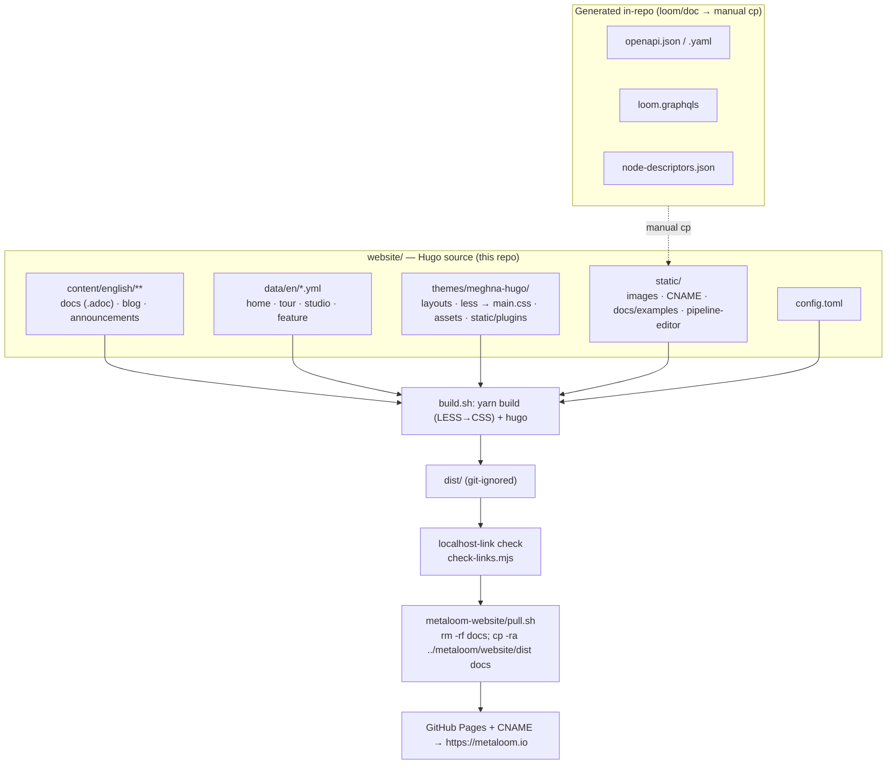

# MetaLoom Customer-Facing Website (Hugo)

The MetaLoom marketing site and **customer-facing product documentation** at
`https://metaloom.io` — a [Hugo](https://gohugo.io/) static site under `website/`. Written for an AI
coding agent that has to add or restructure site content, or fix the build/publish flow.

> **Scope boundary.** This file covers the **site: content inventory, build, checks, publish**.
> It does **not** re-describe the product. Where a `.adoc` page describes Loom/Cortex behaviour, the
> product specs and the code are authoritative — see [Related specs](#related-specs).
> **When the code and a docs page disagree, the code wins — fix the page in the same change**
> ([../guidelines/CODING.md](../guidelines/CODING.md) § Docs).

## Related specs

| Topic | Spec |
|---|---|
| Definition of done for a code change (incl. **the customer-docs rules**) | [../guidelines/CODING.md](../guidelines/CODING.md) |
| Definition of done for a spec change | [../SPEC_RULES.md](../guidelines/SPEC_RULES.md) |
| Spec-tree entry point / routing | [../CONTEXT.md](../CONTEXT.md) |
| The `/pipeline-editor/` page (backend-free editor + simulator) | [WEBSITE_PIPELINE_EDITOR.md](WEBSITE_PIPELINE_EDITOR.md) |
| Typed ports, content types, cardinality (vocabulary the docs must match) | [../features/pipeline/NODE_DATA_TYPES.md](../features/pipeline/NODE_DATA_TYPES.md) |
| Node catalogue / adding a node | [../features/pipeline-nodes/NODES.md](../features/nodes/NODES.md), [../guidelines/NEW_NODE.md](../guidelines/NEW_NODE.md) |
| REST API (source of the staged OpenAPI document) | [../loom/RESTAPI.md](../loom/RESTAPI.md) |
| The product pipeline editor in `loom-ui` | [../loom/ui/PIPELINE_EDITOR.md](../loom/ui/PIPELINE_EDITOR.md) |
| MetaLoom Studio commercial claims | [metaloom-saas/spec/METALOOM_STUDIO_PLAN.md](../../../metaloom-saas/spec/METALOOM_STUDIO_PLAN.md) |

## TL;DR

* Source: `website/` — Hugo, theme `meghna-hugo` (vendored + heavily customised), `publishDir = "dist"`,
  `baseURL = https://metaloom.io`. Single language `en`, `contentDir = content/english`.
* Docs and blog are **AsciiDoc** (`.adoc`) — `asciidoctor` must be on `PATH` and allow-listed in
  `[security.exec]`. The marketing pages are **data-driven** from `data/en/*.yml`.
* Build with `./build.sh` → `dist/`, then three gates: a **localhost-link check**,
  `check-links.mjs` (broken internal links + missing `#anchors`) and `check-node-screenshots.mjs`
  (every node page has its pictures; every shipped node kind has a page). All three fail the build.
* **Hugo extended ≥ 0.158 is required.** The system `hugo` is now **0.162.1+extended** and builds the
  site; it used to be 0.131, which could not (see [Prerequisites](#prerequisites)).
* Publish is manual: the **sibling `metaloom-website` repo** runs `pull.sh` to copy `website/dist`
  → its `docs/`, served by GitHub Pages at `metaloom.io`.
* Seven top-level areas besides `/docs/`: `/tour/`, `/features/`, `/studio/`,
  `/pipeline-editor/`, `/announcements/`, `/blog/`, `/author/`.
  ⚠️ `/tour/` **used to be `/studios/`** — renamed so it could not be confused with `/studio/`; a
  Hugo alias keeps the old URL alive.
* Three **generated artefacts are staged into `static/` by hand** and go stale silently: the OpenAPI
  document, the GraphQL SDL and the node-descriptor snapshot. See
  [Staged generated artefacts](#staged-generated-artefacts).

## Architecture



**Two different things are called `metaloom-website`** — do not confuse them:

| | Path | Role |
|---|---|---|
| Hugo source | `metaloom/website/` (Maven artifactId `metaloom-website`, `packaging=pom`) | Editable source. `build.sh` produces `dist/`. The pom carries **no build logic** — it only registers the module in the reactor. |
| Publish repo | `../metaloom-website/` (sibling checkout, **not** part of this repo) | Holds the *built* site under `docs/` + `CNAME`. Never hand-edit `docs/` — `pull.sh` wipes it. |

## Building

All commands assume `cd website` first.

### Prerequisites

* **Hugo extended, ≥ 0.158.** `config.toml` uses post-0.158 multilingual keys
  (`[Languages.en] locale`/`label`) and templates use `hugo.Data` / `site.Language.Locale`.
  The system binary was 0.131 and could not build the site; it is now **0.162.1+extended**, so
  `./build.sh` runs as-is. Check `hugo version` first — on a machine still carrying an older build,
  fetch an extended ≥ 0.158 release into the scratchpad and call it explicitly.
* **Node + npm/yarn** — the theme has its own `package.json`; `build.sh` prefers `yarn`, falls back
  to `npm`. `yarn install` rewrites `themes/meghna-hugo/yarn.lock`; **restore it** rather than
  committing the churn.
* **`asciidoctor` on `PATH`** — without it `.adoc` pages render empty.

### Commands

| Command | What it does |
|---|---|
| `./build.sh` | theme CSS (`yarn install && yarn build` → `assets/css/main.css`) → `hugo` → `dist/` → the two checks. `set -o errexit -o nounset`, so a missing tool fails the whole script. |
| `./watch.sh` | `./build.sh` then `hugo server -b http://localhost:1313/`. |
| `hugo` | Site build only (theme CSS assumed current). |
| `node check-links.mjs [dist]` | The broken-link check standalone — fast iteration while editing links. |

### The two build-output gates

**1. Localhost links.** `build.sh` greps `dist/**/*.{html,xml}` for
`(href|src|srcset|action|data-src|data-openapi-url|data-graphql-url|data-schema-url)="…(localhost|127.0.0.1|0.0.0.0|[::1])…"`
and exits 1 listing every offender. A published URL pointing at the reader's own machine fails CORS
and triggers the browser's Local Network Access prompt.

Mentioning a local address **in prose is fine** — but Asciidoctor auto-links a bare URL *even inside
backticks*. Suppress it with a leading backslash: `` `\http://localhost:8092/ui/` ``. In a `++++`
block write `<code>…</code>`, not `<a href>`.

**2. `check-links.mjs`** (plain Node, no deps) walks every page in `dist/`, collects
`href|src|srcset|action|poster|data-src|data-*-url`, and resolves each **internal** target against
the build output (pretty URLs: `/docs/`, `/docs`, `/docs.html` all resolve). `#fragment` targets are
checked against the target document's `id=`/`name=` attributes, so a renamed heading is caught.
`metaloom.io`/`www.metaloom.io` count as internal; every other host is skipped — **it never fetches
the network**. Two failure shapes it catches regularly:

1. A relative `link:` missing its `../` — `link:rest-api[…]` on `/docs/loom/graphql-api/` resolves to
   `/docs/loom/graphql-api/rest-api`.
2. A child page Hugo never built, because the parent used `index.adoc` (leaf bundle) instead of
   `_index.adoc` (branch bundle). See [Conventions and Gotchas](#conventions-and-gotchas).

## Folder structure

```
website/
├── config.toml            # baseURL, theme, menu, plugins, params, security
├── build.sh · watch.sh    # build (+2 gates) · build + preview server
├── check-links.mjs        # internal-link + anchor checker
├── pom.xml                # Maven module registration only
├── content/english/       # contentDir — see the page inventory below
├── content-off/           # parked, NOT built: java-ffm-graph-storage-poc/
├── data/en/*.yml          # LIVE: home · tour · studio · feature. The other 11 are dead Meghna copy
├── i18n/en.yaml           # UI strings (menu labels, footer headings, "Read more")
├── static/                # verbatim → dist/: images/ · CNAME · .nojekyll
│   ├── docs/examples/     #   openapi.{json,yaml} · schema.graphql   (staged, generated)
│   ├── pipeline-editor/   #   node-descriptors.json                  (staged, generated)
│   └── images/og-*.jpg    #   1200×630 social cards
├── themes/meghna-hugo/    # the only theme
│   ├── layouts/           #   index · alias · 404 · _default · docs · announcements · author
│   │                      #   · features · tour · studio · pipeline-editor · partials
│   ├── less/              #   main.less + includes/{custom,adoc,docs,toc,variables}.less → assets/css/main.css
│   ├── assets/css/        #   main.css (compiled) · home.css · tour.css · studio.css · pipeline-editor.css
│   ├── assets/js/         #   script.js · reveal.js · pipeline-editor.js
│   ├── assets/images/scenery/  # 4 photos, Hugo-processed to webp; shared by /tour/ and /studio/
│   └── static/plugins/    #   14 vendored plugins incl. swagger · graphiql · nodeviz · toc
└── dist/                  # BUILD OUTPUT (git-ignored)
```

There is **no project-root `layouts/` or `archetypes/`** — every template lives in the theme.

## Page inventory

Every content page is a **page bundle**: a directory with `index.adoc`/`index.md` (leaf) or
`_index.adoc`/`_index.md` (section/branch). Co-located images live in the same folder.

### Top-level areas

| URL | Content | Copy lives in | Layout |
|---|---|---|---|
| `/` | `_index.md` (front matter only) | `data/en/home.yml` | `layouts/index.html` + `partials/home/*` |
| `/tour/` | `_index.md` (front matter only, `aliases: [/studios/]`) | `data/en/tour.yml` | `layouts/tour/list.html` + `partials/tour/art-*.html` (8) |
| `/features/` | `_index.md` | `data/en/feature.yml` | `layouts/features/list.html` |
| `/studio/` | `_index.md` (front matter only) | `data/en/studio.yml` | `layouts/studio/list.html` + `partials/studio/art-*.html` (7) |
| `/pipeline-editor/` | `_index.md` (front matter only) | — (all in JS) | `layouts/pipeline-editor/list.html` — see [WEBSITE_PIPELINE_EDITOR.md](WEBSITE_PIPELINE_EDITOR.md) |
| `/announcements/` | `_index.adoc` + `metaloom-1-0-0/index.adoc` | in the pages | `layouts/announcements/{list,single}.html` |
| `/blog/` | `_index.md` + 6 post bundles | in the posts | `layouts/_default/{list,article,single}.html` |
| `/author/jotschi/` | `author/jotschi.md` | in the page | `layouts/author/single.html` |
| `/docs/**` | `.adoc` (below) | in the pages | `layouts/docs/{list,single}.html` |

Blog posts: `day0-let-there-be-loom`, `day1-project-design`, `day2-project-setup`,
`day3-vertx-dagger-poc`, `day4-vertx-jooq-poc`, `video-fingerprinting`.

### `content/english/docs/` — the customer documentation

`_index.adoc` is the landing page (card grid, "Start Here", concepts, "Choose Your Path" table).
`variables.adoc-include` carries the shared attributes (`:icons: font`, `:toc:`,
`:source-highlighter:`); the `.adoc-include` extension keeps Hugo from rendering it as a page.

| Section | Pages |
|---|---|
| **top level** | `getting-started/` · `pipeline/` (5 debug screenshots) · `operation/` · `ui/` (17 screenshots, from **two** scripts — see below) · `cli/` · `deployment/` (`_index` + `helm/`) |
| **`playbooks/`** | `_index` + `docker/` · `kubernetes/` · `transcription/` · `scene-analysis/` · `translation/` · `python-node/` |
| **`nodes/`** | `_index` + **36 node pages** (35 with a staged descriptor, plus `guard`): `captioning · consistency · dedup · depthmap · dominant-color · facedescription · facedetect · filesystem-source · filter · fingerprint · gdrive-source · guard · hash · image-manipulation · imagegen · llm · metadata · objectdetect · ocr · onedrive-source · quality · s3-sink · s3-source · scene-detection · scene-layout · script · sentiment · tag · thumbnail · tika · translate · tts · videogen · vlm · watermark · whisper`. **The count drifts** — `check-node-screenshots.mjs` is what notices, by mapping every kind in the descriptor snapshot to exactly one page |
| **`loom/`** | `_index` + `rest-api/` (Swagger UI) · `graphql-api/` (GraphiQL) · `java-client/` · `python-client/` · `authentication/` · `configuration/` · `metrics/` · `features/` · `chat/` · `binary-storage/` · `artifacts/` · `maven-artifacts/` · `containers/` · `helm-chart/` · `examples/` |
| **`cortex/`** | `_index` + `configuration/` · `monitoring/` · `metrics/` · `artifacts/` · `maven-artifacts/` · `containers/` · `examples/` |
| **`legal/`** | `_index` + `model-licenses/` · `ai-disclosure/` · `impressum/` (German) |
| **legacy stubs** | `rest/` · `test/` · `configuration/` — unlinked placeholders, candidates for deletion |

**Every section carries an explicit `weight`,** and the order it produces is the whole point of
having them: `getting-started` 1 · **`pipeline` 2 · `nodes` 3** · `operation` 4 · `loom` 5 ·
`cortex` 6 · `ui` 7 · `playbooks` 8 · `cli` 9 · `deployment` 10 · `legal` 11. Hugo's default order
for unweighted pages is alphabetical by file path, which put **Pipeline Mechanism dead last** in the
topic rail and Nodes ninth — the two concepts every other page refers to, sorted below the legal
notices. Adding a section without a weight silently reintroduces that, so give new sections one.

`pipeline/` is also the only concept page carrying a card of its own on the landing page (the
`Pipelines & Nodes` card, second after Getting Started, deep-linking `#node-graph`, `#ports`,
`#running-a-pipeline`, `#debug-mode` and the interactive editor). Those four anchors are **explicit
`[#id]` attributes** in `pipeline/index.adoc`, not Asciidoctor's generated `_snake_case` ids — the
generated form changes whenever a heading is reworded, which is exactly what a card full of deep
links must not depend on.

Grouped node pages cover several kinds each: `hash/` covers `md5`/`sha256`/`sha512`/`chunk-hash`,
`filters/` covers the eight `filter-*` kinds, `dedup/` covers `hash-dedup`/`fingerprint-dedup`/
`fingerprint-dedup-apply`. Pages that structure moved: the coding sandbox is a section of
`loom/chat/` (not its own page); the per-node reference moved from `cortex/nodes/` to top-level
`nodes/`; `docs/cortex/features/` was folded into `nodes/_index.adoc` + `operation/`;
`docs/interaction/` was renamed `docs/operation/`.

> **Two things must never come back into the docs:** an "online vs offline mode" for Cortex
> (`isOfflineMode()` only means "no Loom client configured") and **webhooks** (not a product
> feature). Neither belongs in `data/en/feature.yml` either.

### The customer-docs rules ([../guidelines/CODING.md](../guidelines/CODING.md) § Docs)

New **customer-facing** features must be documented under `website/content/english/docs/`:

* **Don't mention spec files.**
* **No internal coding references** — class names, packages, module paths.
* **Keep the tone customer-facing.**
* **No ASCII-art diagrams** — inline SVG, or an `ml-nodeviz` block on a node page.

## Staged generated artefacts

Three files under `static/` are **generated, never hand-written**, and copied in by hand. Nothing
automates the copy and no check catches staleness — regenerate **in the same change** as the source
edit.

| Staged file | Generated by | Consumed by |
|---|---|---|
| `static/docs/examples/openapi.{json,yaml}` | `io.metaloom.loom.doc.impl.OpenAPIGenerator` (driven by `ExampleGenerator`), over `io.metaloom.loom.rest.openapi.LoomOpenAPI` | `docs/loom/rest-api/` — download cards + the embedded **Swagger UI** |
| `static/docs/examples/schema.graphql` | plain copy of `loom/services/graphql/src/main/resources/loom.graphqls` | `docs/loom/graphql-api/` — the embedded **GraphiQL** explorer |
| `static/pipeline-editor/node-descriptors.json` | `io.metaloom.loom.doc.impl.NodeDescriptorGenerator` (same driver) | `/pipeline-editor/` — see [WEBSITE_PIPELINE_EDITOR.md](WEBSITE_PIPELINE_EDITOR.md) |

```bash
mvn -q -pl loom/doc -am -DskipTests -Dmaven.javadoc.skip=true install
cd loom/doc && mvn -q exec:java -Dexec.mainClass=io.metaloom.loom.doc.ExampleGenerator
# working dir MUST be loom/doc/ — the generators write to the relative src/main/generated/
cp src/main/generated/openapi.json           ../../website/static/docs/examples/
cp src/main/generated/openapi.yaml           ../../website/static/docs/examples/
cp src/main/generated/node-descriptors.json  ../../website/static/pipeline-editor/
cp ../services/graphql/src/main/resources/loom.graphqls \
   ../../website/static/docs/examples/schema.graphql
```

* `-Dmaven.javadoc.skip=true` is currently required — `loom/pipeline` has a pre-existing javadoc
  error that fails `javadoc:jar`. Unrelated to the website.
* Guards: `LoomOpenAPITest` (`loom/services/rest`) pins the OpenAPI polish step;
  `NodeDescriptorGeneratorTest` (`loom/doc`) pins snapshot kind coverage and the port-model fields.
* A running server serves the live equivalents at `/api/v1/openapi[.yaml|.json]`, `/graphiql` and
  `GET /api/v1/pipeline/node-descriptors`.

### Swagger UI / GraphiQL wiring

Both plugins (`themes/meghna-hugo/static/plugins/{swagger,graphiql}/`) are loaded on **every** page
via `[[params.plugins.js]]`, so each **must bail out when its mount div is absent** — otherwise it
renders into `null` and throws site-wide. Mount points are raw-HTML blocks (`#swagger-ui`,
`#graphiql`) in the two pages; per-page `data-openapi-url` / `data-graphql-url` / `data-schema-url`
attributes override the defaults, which must stay **site-relative**. Swagger options:
`docExpansion:'none'`, `filter:true`, `deepLinking:true`, alphabetical sorting,
`persistAuthorization`, and `validatorUrl: null` — the site must never ship a reader's spec to
`validator.swagger.io`. Swagger UI ships light-theme CSS, so `#swagger-ui` gets its own light
surface in `custom.less` rather than being restyled operation by operation.

## Node diagrams (`nodeviz`)

Every page under `docs/nodes/<kind>/` opens with a generated diagram — typed inputs left, node
centre, typed outputs right, animated flow, one tab per alternative configuration. **28 pages carry
a spec.** The page contains only JSON in a passthrough block:

```asciidoc
++++
<div class="ml-nodeviz" data-nodeviz='{"kind":"facedetect","applies":"Image, Video",
  "badge":"InspireFace","persist":"asset_detection + ledger",
  "inputs":[{"t":"image","l":"image","d":"a still to search for faces"}],
  "outputs":[{"t":"face","l":"detections","c":"many","d":"one element per detected face"},
             {"t":"flag","l":"face_count","ct":"scalar/integer","d":"how many survived clustering"}]}'></div>
++++
```

Renderer: `themes/meghna-hugo/static/plugins/nodeviz/nodeviz.js` (no-op without `.ml-nodeviz`).
**Change the drawing once and all 28 pages follow.** Styling is `.nv-*` in `custom.less`.

* Root fields: `kind`, `applies`, `badge`, `persist`, and either an `inputs`/`outputs` pair or
  `configs: [{name, note, inputs, outputs}, …]` (more than one renders a tab row).
* **Port fields — six:** `t` (type key into `TYPES` → icon, colour, default content type),
  `l` (label), `d` (description), `opt` (dashed = optional), **`c`** (cardinality — the *only*
  recognised value is the literal `"many"`; **absence means one**, there is no `"one"` token),
  **`ct`** (content-type id override, resolved as `p.ct || ty.ct`).
* `TYPES` has **29 entries** whose `ct` values are the **real `family/subtype` ids** from
  `ContentTypeRegistry` (`media/image`, `detection/face`, `struct/embedding`, `hash/*`,
  `control/filter`, …). `action` is the one entry with no `ct` — a side effect carries no value.
  Unknown types fall back to a neutral dot: add to `TYPES` + `icon()` rather than inventing labels.
* **Cardinality is encoded three ways on purpose** — a dashed stacked mark + ` · many` suffix in the
  diagram, a `one`/`many` badge in the hover card, and the card's pip animation tempo (one pip at
  2.6 s vs three staggered at 1.5 s). `prefers-reduced-motion` freezes both into static states
  rather than hiding them.
* Ports are focusable (`tabindex="0"`, `role="button"`, an `aria-label` naming side/label/content
  type/cardinality); the card opens on hover **and** focus and **toggles on click** so it works on
  touch.
* The type key renders once on `docs/nodes/_index.adoc` via `<div class="ml-nodeviz-legend"></div>`
  — a hand-ordered subset of `LEGEND` (18 keys) plus the cardinality note. Cardinality is a second
  axis, not a type, so it is taught once beside the icon key.
* ⚠️ The spec lives in a **single-quoted HTML attribute** — **never use an apostrophe in the JSON**.
  Nothing enforces this: an apostrophe truncates the attribute, `JSON.parse` throws, and the
  `try/catch` leaves a blank diagram. All 28 pages currently comply (exactly two `'` per line).

> **Keep the vocabulary in step.** `TYPES[*].ct` must be ids that exist in
> `ContentTypeRegistry.all()`. Adding a content type to the product means adding it there **and**
> here — [../features/pipeline/NODE_DATA_TYPES.md](../features/pipeline/NODE_DATA_TYPES.md) § 2.

**Port text wraps; row heights follow.** SVG `<text>` neither wraps nor shrinks, and the port box is
only ~208 px wide inside its icon inset while the descriptions are whole sentences — the longest is
125 characters. `nodeviz.js` therefore *measures* (one detached canvas 2D context), wraps to at most
four `<tspan>` lines and sizes each row from its own text, so `ROW` is gone and the column, block and
node-box centring all fall out of the wrap. The badge width is measured the same way; it used to be
guessed from the character count and came out 20 px wide on `Whisper runtime · GPU optional`.
The first wrap is measured against whatever font is resolved at script time, which on a cold load is
the fallback, so the plugin re-measures a probe string after `document.fonts.ready` and redraws only
if it moved.

## Node pages: the two screenshots

Every page under `docs/nodes/<page>/` carries pictures of the node **in the product**, alongside the
generated diagram:

| File | What it is | Captured by | Needs |
|---|---|---|---|
| `config.png` | the editor's settings panel for that node | `loom-ui/scripts/capture-node-config-screenshots.mjs` | nothing but `static/pipeline-editor/node-descriptors.json` |
| `debug.png` | the node card after a real run, with its result strip | `loom-ui/scripts/capture-node-screenshots.mjs` | a fixture for that kind |
| `debug-detail.png` | one result opened full size — only where there is a picture or a node-authored description to open | same | same |

* **The page→kind map is `loom-ui/scripts/node-capture-plan.mjs`, not the directory listing.** They
  are not one-to-one: `hash/` covers four kinds, `dedup/` three, and `loom-fetch` is a kind with no
  page (recorded in `UNDOCUMENTED_KINDS` with the reason).
* **Config panels need no fixtures at all**, which is why they are a separate script — coupling them
  to the debug loop would make all 39 wait on 39 fixtures. They can be regenerated on a bare
  checkout after `npm install`.
* **The panel is 280 px wide in the product and up to two thousand tall.** It is photographed at that
  width and shown inside a scrolling frame (`.ml-panel-shot` in `custom.less`). Do **not** widen it
  with an injected style to get a friendlier aspect ratio — that photographs a control nobody has.
  The capture sizes the window to the tab panel's content in *both* directions; neither the panel nor
  its body can be measured for this, because both stretch and report the same height for a node with
  three settings as for one with 23.
* **React Flow's minimap and zoom controls are hidden for the debug shot**, not cropped around: with
  one node fitted to the middle of the canvas either can land on top of the card. They also swallow
  clicks aimed at a node underneath them, so both scripts open a node with `dispatchEvent("click")`.
* **`reducedMotion: "reduce"` on the browser context is load-bearing.** The node card's "active" dot
  has a blink keyframe; without it the same state photographs differently every run and every
  regeneration reads as a change.

### Where the debug payloads come from

`integration-test/.../node/docs/DocsFixtureGenerator` runs each node **for real** and writes
`loom-ui/scripts/fixtures/nodes/<kind>/fixture.json` plus its preview files:

```bash
mvn -o -pl integration-test test -Dtest=DocsFixtureGenerator -Dloom.regenerateDocsFixtures=true \
    [-Dloom.docsFixtureKinds=tika,sha512] [-Dloom.docsFixturesStrict=true]
```

* `fixture.json.outputs` is **already the REST shape** — the capture script pastes it into its mocked
  `/tasks` response with no translation.
* The writer must call `NodePreviews.build`/`merge` itself. That class lives in the *node runtime*,
  not in the node: only `facedetect` authors its own previews, and every other picture in the
  debugging view is generated from an `artifact/image` port. A generator that skipped it would
  produce fixtures with no pictures and screenshots to match.
* It also cannot use `NodeResultMapper.toWire` directly — that reads a graph id a directly
  constructed node never received — so it calls the same two steps with the kind as the id.
* **`backend` must be `"real"`.** Seven node integration tests inject stubbed clients (one paints its
  own gradient); a stubbed backend is a screenshot of a decision nothing made. Only `gdrive-source`
  and `onedrive-source` may be `"stub"`, where the stub replaces Google or Microsoft and everything
  below it runs. Both the capture script and the build gate refuse anything else.
* An unsatisfied requirement **aborts naming the command that would satisfy it** and leaves the
  committed fixture byte-identical (atomic temp-file move). `-Dloom.docsFixturesStrict=true` turns
  that into a failure, which is what a release build wants.
* **A node that did not succeed is never written**, and "succeeded" is checked four ways, because
  each of the first three let a real failure through:
  1. the result state is anything but `SUCCESS` — the `script` recipe's first run emitted
     `ReferenceError: text is not defined`, having invented binding names instead of using the
     node's (`data.text`, `out.*`, `params`, `log`);
  2. **no port carried anything.** `NodeContextImpl.next()` reads `skipReason` but *not*
     `failureCause`, so the nineteen nodes that end a catch block with `ctx.failure(msg).next()`
     return `SUCCESS` with the message dropped. The sentiment recipe reported `COMPLETED` for a
     request the sidecar had answered with a 500;
  3. **`flag=FAILED`.** The nodes with a `flag` port set it to `FAILED` and *then* return success, so
     a failed run arrives with outputs and a green state. The flag is the node's own verdict and it
     outranks the result state — this is what caught the TTS sidecar running out of VRAM;
  4. **every port empty.** Whisper answered `{"segments":[]}` for a video with no audio stream at
     all: green, one port, a well-formed payload, and nothing in it. Nothing above catches that.
* **`emitsNoPorts()` exists for a node that legitimately emits nothing**, and nothing sets it today.
  The dedup nodes used to: they declared no output ports at all, because their effect was a
  filesystem move and a ledger row. Since `8bc46dbd` they report the duplicate and its original on
  two ports and leave the relocating to a `move` node, so the ordinary checks apply to them again.
  The flag is worth keeping — opting in is a claim about a node's port declaration, not a way past a
  failing run, since the state check and the `flag` check still apply either way.
* **Two kinds need a database, so they have their own generator.** `DocsLoomFixtureGenerator` extends
  `AbstractNodeIntegrationTest` and boots a real Loom. `HashDedupNode.compute` opens with
  `if (isOfflineMode()) return ctx.skipped("offline mode")`, because the question it answers is a
  query; `AssignNode` writes a membership row, which is the whole of what it does. Keeping them
  separate is what lets the other thirty recipes stay runnable with no database.
* **`move` runs offline and relocates a real file.** It sends the corpus photograph to
  `/tmp/loom-docs-library/trash/`, having cleared that folder first so a re-run photographs the same
  move rather than a `…_1.jpeg` beside the last one. The library file is genuinely gone afterwards —
  within one filesystem `LocalMover` renames, so `sourcePolicy: KEEP` does not apply and the `flag`
  reads `MOVED` — and `FixtureEnv.inLibrary` re-links it from the corpus on the next call.
* **Not every corpus file has what a node needs.** Every video in the test corpus is silent — video
  stream only — and the one recording with speech, `jfk.webm`, is Opus in WebM with no container
  duration, which `AudioExtractor` turned into zero samples. `FixtureEnv.speechWav()` remuxes that
  same audio to 16 kHz mono PCM with ffmpeg. Where the corpus has no suitable picture either — no
  group photograph — `FixtureEnv.frameStill()` pulls one real frame out of the demo clip, and
  `scene-layout` and `facedescription` both run on that one file so their depth map, boxes and
  descriptions all describe one scene.
* **Media runs from a neutral library, not the build tree.** Several nodes emit
  `media.absolutePath()` on an output port, and it is drawn verbatim on the card — straight out of
  the corpus that reads `/home/<someone>/workspaces/…/target/test-env-…`, which then ships to a
  public site. `FixtureEnv` hard-links the corpus into `/tmp/loom-docs-library` first, so the path on
  the card is a real path to the real file and nothing about this machine.
* Services these recipes drive for real today:

  | What | How | For |
  |---|---|---|
  | OpenAI-compatible text model, :8080 | `loom-test-env/llamacpp/start.sh` | `llm`, `translate`, `filter` |
  | Multimodal model, :8000 | same script with a VL GGUF | `vlm`, `captioning` |
  | Multimodal model, **:8080** | same, on that port | `facedescription` |
  | MinIO | `./start-minio.sh` | `s3-source`, `s3-sink` |
  | Depth sidecar, :9120 | `sidecars/depth/{setup,run}.sh` | `depthmap`, `scene-layout` |
  | Sentiment sidecar, :9110 | `sidecars/sentiment/{setup,run}.sh` | `sentiment` |
  | TTS sidecar, :9100 | `sidecars/tts/{setup,run}.sh` | `tts` |
  | Diffusers sidecar, :9200 | `sidecars/ideogram-sidecar` (SDXL-Turbo by default) | `imagegen` |
  | A ggml Whisper model on disk | `whisper.cpp/models/download-ggml-model.sh` | `whisper` |
  | LTX-2 sidecar, :9220 | `sidecars/ltx2-sidecar/{setup,run}.sh` | `videogen` |
  | A YOLO ONNX model + class names | yolo4j ships `YOLOv11n_voc.onnx` / `voc.names` | `objectdetect` |
  | A Loom server on the pooled test DB | `./setup-pool.sh`, then `DocsLoomFixtureGenerator` | `dedup`, `assign` |

* **The vision requirement checks for multimodality, not for a server.** A text-only model on the
  right port answers every request these three nodes make — it just answers them without having seen
  the picture, which is the most misleading thing this harness could publish. `Probe.bodyContains`
  reads `/v1/models` and requires `multimodal`; a text model there counts as *not available*.
* **`facedescription` reads its backend from a `public static final String`**, not from its options,
  so it can only be photographed with vision on 8080 — where the text model for `llm`/`translate`/
  `filter` also lives. The two cannot be up at once. That is a constraint of the node, not of this
  harness.

### The gate

`check-node-screenshots.mjs` runs from `build.sh` against the **source**, because the thing it exists
to catch — a node that shipped with no page — is invisible in the built site. It requires
`config.png` and `debug.png` per page with real alt text, and takes exemptions from
`loom-ui/scripts/fixtures/nodes/status.json`:

* `"status": "blocked"` additionally requires the page itself to carry the entry's `reason` verbatim,
  so a node nobody can photograph is a reviewed statement a reader sees, not a silent hole. There is
  no blocked entry today — `whisper` was the last one and now has real weights and a real transcript.
* `"status": "pending"` is allowed quietly but printed as a countdown on every build.
* `"pictures"` names which of the two a page is excused from, defaulting to `["debug"]` — a missing
  config panel is nearly always an oversight, since it needs nothing.

The debug picture is normally the **node card**. `node-capture-plan.mjs` can set
`view: "run-detail"` instead, which shoots the node detail sidebar's Results tab. Exactly one page
uses it — `dedup`, whose kinds declare no output ports, so `NodeResultStrip` renders nothing and the
card is a title over an empty body. The Results tab states the task's state, its duration and an
explicit "no outputs were recorded", which is what the product genuinely shows for that node.

## The detection player (`detectionplayer`)

`/docs/pipeline/#detections-over-time` and `/docs/nodes/facedetect/` play a clip with the detection
node's own boxes painted in, because a detector reports one detection **per sampled frame** and a
still cannot show that — which is why the debug screenshot of a video looks like several boxes on one
face.

* Renderer `themes/meghna-hugo/static/plugins/detectionplayer/detectionplayer.js`, registered in
  `[[params.plugins.js]]`, no-ops without `.ml-detplayer`. Styles are `.ml-detplayer .dp-*` in
  `custom.less`.
* The mount contains a **real `<video controls …>`**; the script only adds the canvas overlay and the
  recent-detections strip. JavaScript off still gives a playable clip.
* Attributes are `data-track-url` / `data-video-url` on purpose — `check-links.mjs` validates
  `data-*-url`, so a renamed asset fails the build.
* Track and assets are generated by `integration-test/.../node/DetectionPlayerFixtureGenerator`
  (`-Dloom.regenerateDetectionTrack=true`), which runs the real `FacedetectNode`. `detections` are
  the node's **own encoded elements**, untouched, so the player normalises by each element's
  `imageWidth`/`imageHeight` exactly as the product's overlay does.
* **`video.frameOffset` is not cosmetic.** The detections carry source frame indices and the demo file
  is a cut of the source, so the player adds the offset back; without it every box appears seconds
  early. The window is derived from the detections, and the `.mp4` is cut with
  `trim=start_frame=…` rather than a timestamp seek so the offset is exact.
* **The sparseness is real and is the point.** The video path keeps only the ten sharpest faces found
  across the whole scan, so a thirteen-second clip yields ten detections at six frames. A denser
  hand-made track would document a product that does not exist.

## Content conventions

**Front matter** is YAML between `---`. Only `title` is required; `weight` orders siblings,
`page_css: css/<name>.css` gives one page its own stylesheet, `aliases: [/old/]` keeps an old URL
alive, `image`/`image_webp` name a blog teaser by **bare file name** inside the bundle.

**AsciiDoc body**: `== Heading`, `[source,bash]----…----`, `|===` tables, `link:target[Label]`,
admonitions. Internal links are **relative targets that resolve to Hugo pretty URLs**
(`link:../loom/authentication/[…]`) — match the surrounding trailing-slash style. Card grids and
note boxes are **raw-HTML passthrough** `++++ … ++++` with Bootstrap markup + theme classes
(`docs-card`, `note`, `row`, `col-*`); `docs/_index.adoc` is the canonical pattern
(`enableInlineShortcodes = false`, so shortcodes are not an option). Prefer the front-matter
`title` and `==` sections over a level-0 `= Title` in the body — the layout already emits the `<h1>`.

**Figures are inline SVG in a `++++` block**, never ASCII art, using the shared `.ml-*` vocabulary
in `custom.less` (`ml-box-container`, `ml-box-part`, `ml-edge`, `ml-chip`, `ml-step`, `ml-flow`,
`ml-box-gpu`, `ml-box-dyn`, `ml-deny`), wrapped in `<div class="ml-figure">` with
`class="ml-arch-svg"`. Give each a `<title>` + `<desc>` referenced from `aria-labelledby`.

> ⚠️ **Prefix `<marker>` ids per page** (`ml-dk-*`, `ml-k8s-*`, `ml-tr-*`, `ml-sc-*`, `ml-tl-*`,
> `ml-py-*`) — marker ids are document-global, so two figures reusing `ml-arrow` collide and one
> loses its arrowheads.
>
> ⚠️ **An animated figure must not change height.** The dispatch animation on `docs/operation/`
> swaps its caption per phase; a growing caption box oscillated the page height, toggled the
> scrollbar and jittered the layout. The caption has a fixed height and `custom.less` sets
> `html { scrollbar-gutter: stable; }`.

## Design system

There is **one palette for the whole site** — CSS custom properties at the top of
`less/includes/custom.less`, therefore in the global `main.css` on every page:

| Group | Tokens |
|---|---|
| Surfaces | `--ml-bg` `#0b0e13` · `--ml-bg-alt` · `--ml-surface` · `--ml-surface-hi` · `--ml-card` |
| Lines / Text | `--ml-line` · `--ml-line-hi` — `--ml-fg` · `--ml-fg-dim` · `--ml-muted` |
| Accents | `--ml-accent` `#57cbcc` · `--ml-accent-bright` · `--ml-accent-line` · `--ml-accent-wash` · `--ml-warm` · `--ml-warm-soft` |
| Type | `--ml-sans` (Anaheim) · `--ml-display` (Quattrocento Sans) · `--ml-mono` (JetBrains Mono) |
| Shape | `--ml-radius` · `--ml-radius-sm` · `--ml-lift` |

* `assets/css/home.css` (`/` and `/features/`) defines **no colours** — its `.hm-page` block aliases
  the tokens. Change a colour once and `/`, `/features/`, `/docs/`, `/blog/`, `/announcements/`
  all follow.
* `/tour/` (`.st-*`, teal) and `/studio/` (`.sd-*`, amber `#e2a86e`) keep page-scoped stylesheets on
  purpose — **that is the one place the accent may differ**. Inside `studio.css` teal survives as
  `--sd-teal` and marks exactly one thing: *what is open source*. Do not fold them into `main.css`,
  and note both are **hand-written CSS** — `yarn build` only compiles `less/main.less`.
* The card object (gradient surface, hairline, teal border, `--ml-lift` hover translate) is
  deliberately identical on `.hm-feature`, `.docs-card`, `.note`, `.ann-entry`, `.blog-card`.
* Docs, `/announcements/`, `/blog/` and `/author/` share one reading system: Quattrocento Sans
  headings, Anaheim prose, monospace values, code as a chip, admonitions as coloured-left-edge
  callouts, code blocks as a recessed surface, a shared `.page-head` (eyebrow → title → rule) and a
  `.docs-foot` button pair. Heading offsets use **`scroll-margin-top: 96px`, not padding**.
* **Scroll reveal** is one script, `assets/js/reveal.js`, with a page-agnostic contract:
  `data-reveal-scope` on a container, `class="reveal"` per element, `data-reveal-delay="<n>"`
  (× 90 ms), `data-count-up`. Wire it with `{{ partial "reveal-bootstrap.html" . }}` inside the
  scope and `{{ partial "reveal-script.html" . }}` after it.

> **`html, body { background-color: var(--ml-bg) }` is load-bearing.** The theme's `style.css` still
> sets `#353b43`; `custom.less` is imported after it and wins. A page that comes out grey means a
> `background-color` is beating the token block.
>
> **Never hide content behind JavaScript.** The hidden start state is scoped to `.reveal-js`, which
> `reveal-bootstrap.html` sets *synchronously during parse*, and the same snippet removes it after
> 2.5 s if `reveal.js` never runs. A blocked script degrades to "no animation", never "no content".
> Every rule is `.reveal-js` hides / `.is-visible` reveals.
>
> **All motion is decoration.** Every page-scoped stylesheet ends with a `prefers-reduced-motion`
> block that disables its animations. Nothing may encode information in movement alone.
>
> **No CJK text anywhere** — the site ships no CJK webfont, so a Japanese line renders as tofu.

Site chrome: `partials/navigation.html` (sticky, translucent, `.is-scrolled` past 12 px,
`.is-active` + `aria-current` on the current section, hamburger → X) and `partials/footer.html`
(four columns, labels from `i18n/en.yaml`, contact pills from `[[params.social]]`, the Impressum
link, the *1.0.0 — not released yet* badge). **Footer headings carry `data-toc-skip`** and
`plugins/toc/toc.js` scopes bootstrap-toc to `.docs-main-content`, or they land in the docs TOC.

`partials/card.html` builds OG/Twitter metadata for every page: title `<page> | MetaLoom` (bare
`MetaLoom` on `/`), a description chain (page → `.Summary` → site param, truncated to 200 chars),
`summary_large_image` with `/images/og-default.jpg` as the fallback, canonical, `og:site_name`,
`og:type`, `og:locale`, `og:image:alt`, article timestamps. Blog images resolve through
`partials/func/page-image.html` (prefers `image_webp`, falls back to `image` then
`/images/banner_square.webp`).

## Legal pages (`docs/legal/`)

* `model-licenses/` is an **inventory of what each node loads**, not a generic license page.
  MetaLoom ships **no weights** — every model is a configuration value — so the page maps
  node → default model → license → commercial-use verdict, and closes with how to read the deployed
  values back. Two components are **non-commercial** (`#restricted`): the **InspireFace model packs**
  used by `facedetect` (Apache-2.0 code, InsightFace academic-only packs, which taints
  `facedescription` downstream) and **Ideogram 4.0**, the backing model of the `imagegen` node
  ([../features/pipeline-nodes/NODE_IMAGEGEN_PLAN.md](../concept/NODE_IMAGEGEN_PLAN.md)).
  Conditional (`#conditional`): the Gemma defaults and the gated Llama-3.2 Kartoffel TTS checkpoint.
  `#clean-stack` gives the permissive-only configuration; `#runtimes` covers redistributed native
  libraries incl. the FFmpeg `--enable-gpl` caveat.
* `ai-disclosure/` states the timeline: **2023–2025 no AI code generation, 2026 onwards
  AI-assisted**, at project level — AI assistance is not tracked per commit, and the page says so.
* `impressum/` is the **Austrian site disclosure** and the only German page: § 5 ECG, § 25 MedienG,
  copyright, liability, the EU ODR platform, and a `#datenschutz` section covering what a static
  site actually processes (GitHub Pages logs, the Google Fonts CDN, external links, email).

> ⚠️ **The Impressum still has `[…]` placeholders** (address, a second direct channel besides
> email). It is not legally complete until those are real, and the "private project, no Firmenbuch,
> no UID" rows must be revisited the moment MetaLoom is offered commercially. It is a good-faith
> template, not lawyer-reviewed.
>
> ⚠️ **Keep the inventory honest.** When a node's default model changes, update the page in the same
> change. Claims must reflect what the code loads (the whisper node runs **whisper.cpp locally** —
> it does not call a remote ASR endpoint, even though `asr4j` supports one). Do not soften or drop
> the two `[WARNING]` blocks. The page carries a *not legal advice* disclaimer; keep it that way.

## Capturing Loom UI screenshots (`docs/ui/`)

`docs/ui/` holds 15 dark-mode screenshots of the running app, checked in as page-bundle images and
refreshed by `loom-ui/scripts/capture-ui-screenshots.mjs` (Playwright/Chromium already installed
under `loom-ui/`; it logs in, forces `localStorage["loom-ui-theme"]="dark"` and navigates by
**clicking sidebar items** — the SPA has no router `basename` under `/ui/`, so deep-link reloads
fail).

```bash
# 1 — always build a FRESH demo image; the local one lags the source
mvn -T 8 clean package -DskipTests -pl loom/containers/demo -am
( cd loom-ui && npm run build )
( cd loom/containers && ./build-containers.sh jvm demo )   # 'jvm demo', not bare 'demo' (native needs GraalVM)
# 2 — start Postgres first: the demo container is NOT self-contained
./start-postgres.sh && ./start-demo.sh                     # \http://localhost:8092/ui/  admin / finger
# 3 — capture (env: UI_BASE_URL, LOOM_USER, LOOM_PASS, OUT_DIR)
cd loom-ui && node scripts/capture-ui-screenshots.mjs
# 4 — tear down
docker rm -f loom postgres-demo cortex-demo
```

Filenames must stay stable so refreshes overwrite in place: `chat`, `chat-sessions`, `skills`,
`memory`, `assets`, `asset-detail`, `library`, `tags`, `tasks`, `face-detection`, `pipeline-editor`,
`pipeline-versions`, `cortex`, `monitoring`, `users`, `acl-roles`, `api-keys`. The two remaining
images in the bundle — `uploads` and `uploads-sidebar` — come from a **different, mocked** script
([Capturing the upload screen](#capturing-the-upload-screen-docsui)); this one does not take them.

* `DemoDatabaseInitializer` seeds every screen with real content, and **paints real image bytes**, so
  the asset browser shows pictures. Video/audio/PDF stay as placeholders — expected, not a failure.
* **The ACL screens sit in a collapsed sub-group**; `openAclGroup()` must click
  `[data-testid="sidebar-group-acl"]` first or the nav click times out. `clickNav` matches
  `^\d*<label>\d*$` so a badge counter (Tasks) still resolves.
* **The library view auto-selects an empty library** — the script clicks the first entry not labelled
  "0 assets" before shooting.
* **Thumbnails only render when Loom serves the UI.** The grid points `` at
  `/api/v1/assets/:uuid/binary/data`, which authenticates via the `__Host-loom_token` cookie; behind
  a `vite` dev proxy every preview 401s. Screenshots showing thumbnails **must** come from the
  container. Recreating the container against an existing DB yields 404s on binaries — re-run
  `./start-postgres.sh` for a clean re-seed.
* `cortex.png` needs a live worker built from the **same revision** as the demo image (an older image
  fails the registration handshake) on the shared `dev` network; it needs a local OpenCV 5.1 build.
* Docs images get click-to-zoom (`.ml-lightbox*` in `custom.less` + vanilla JS in
  `assets/js/script.js`) — a theme feature on every docs page, not just this one.

## Capturing the upload screen (`docs/ui/`)

`docs/ui/` § Uploads carries two more images, refreshed by
`loom-ui/scripts/capture-upload-screenshots.mjs`. Like the debug capture below — and unlike the
script above — it needs **no demo container and no Postgres**: it intercepts the REST calls the way
the mocked specs in `loom-ui/e2e/` do, and starts a Vite dev server if none is listening.

```bash
cd loom-ui && node scripts/capture-upload-screenshots.mjs    # env: VITE_PORT, OUT_DIR
```

Filenames: `uploads` (the screen, three files in flight) · `uploads-sidebar` (the nav entry's badge
and progress bar, cropped, while another screen is open).

* **Three uploads in progress is a transient state**, which is why this one is mocked too. Against a
  live stack the files would have to be big enough to still be in flight when the shutter opens, and
  the percentages, the byte counts and which file is furthest along would differ every run — so the
  picture and the prose beside it could not be kept in step.
* **The network is played, not the UI.** The real `UploadView`, the real module-level queue and the
  real `uploadAssetWithProgress` transport all run, including its concurrency cap of three — which
  is why the picture has exactly three bars in it.
* **Route interception cannot produce this picture.** A route decides what comes *back*; the bars are
  drawn from `XMLHttpRequest`'s `upload.onprogress` on the way *out*. The script therefore
  **subclasses** the browser's XHR: any other URL still goes through the native implementation, and
  an upload gets one real `ProgressEvent` at a planned fraction of its bytes and is then never
  answered. That is precisely what a slow link looks like, and it holds still.
* The three files are written to a temp dir and handed over as **paths, not buffers** — the file
  input needs real bytes for the size labels to be the ones the product's own formatters derive, and
  20 MB has no business crossing the CDP connection.
* **The window is 760px tall, not the 1000px the other `docs/ui/` captures use.** This screen is a
  form, a drop zone and a three-row list; the rest of a 1000px window is empty canvas, which
  survives into the page as a third of the figure showing nothing.
* `reducedMotion: "reduce"`, for the same reason the node captures set it: the bars animate, and a
  re-run that catches a different frame reads as a change.

## Capturing Debug Mode screenshots (`docs/pipeline/`)

`docs/pipeline/` holds 5 screenshots of the pipeline debugger, refreshed by
`loom-ui/scripts/capture-debug-screenshots.mjs`. **This one needs no demo container, no Postgres and
no Cortex worker** — it intercepts every REST call the way the mocked specs in `loom-ui/e2e/` do,
and plays the server itself, including pushing the `NODE_BREAKPOINT_HELD` frame over an intercepted
`routeWebSocket`. It starts a Vite dev server if one is not already listening.

```bash
cd loom-ui && node scripts/capture-debug-screenshots.mjs     # env: VITE_PORT, OUT_DIR
```

Filenames, in the order the page uses them: `debug-held-full` (whole application, halted) ·
`debug-results` · `debug-held` · `debug-detail-image` · `debug-detail-table`.

* **Mocking is the point, not a shortcut.** A halted run is transient: against a live stack you
  would have to arm a breakpoint and catch the moment a file reaches it, and the results shown would
  be whatever that run produced rather than the ones the prose describes. Fixed payloads mean the
  screenshots and the text cannot drift apart, and a re-run reproduces them.
* **The node descriptors are real** — the script serves
  `website/static/pipeline-editor/node-descriptors.json`, the same snapshot the public editor is
  staged with, so ports, content types and their colours are not invented. Serving `[]` (as the e2e
  specs do) renders every node as an unknown kind.
* **The armed/held state starts empty and is flipped mid-capture.** Serving a held run from the
  first request puts an amber ring and a transport bar into the "here is what each node produced"
  screenshot, and the two pictures the page contrasts become the same picture.
* **`fitView` must run *after* the results render, and is still not sufficient.** A result strip
  carrying a long file path widens a card after React Flow measured it, so the rightmost node lands
  off a canvas that was correctly fitted a moment earlier; the script fits, checks, zooms out and
  re-fits. Shots are then cropped to the union of `.react-flow__node` boxes — `fitView` will not
  zoom past its own ceiling, so a four-node graph leaves most of a 1000px canvas empty however well
  it is fitted, and a result strip that is unreadable at page width defeats the whole picture.
* **Crop the dialog by `.MuiDialog-paper`, not by its testid.** `pipeline-result-detail` is on the
  `Dialog` root, which spans the viewport — clipping to it photographs the page. The paper is a
  fixed `80vh`, so the crop also follows the *content* height rather than the frame.
* **Probe the dev server over HTTP, not TCP.** Vite binds the `localhost` name, which on a
  dual-stack host may be `::1` alone; a `net.connect` to `127.0.0.1` reports a running server as
  absent. (`npx` also hangs here — call `node_modules/.bin/vite` directly.)
* The stand-in thumbnail is a gradient with three detection boxes, PNG-encoded inline by the script
  (~40 lines over `zlib`) so the capture needs nothing installed beyond what `loom-ui` already has.

## Configuration

The site has no runtime. "Configuration" is `config.toml` plus the build environment. Hugo `getenv`
is restricted to `^HUGO_` and `^CI$`, so **templates can read no other env var**.

| `config.toml` key | Value | Purpose |
|---|---|---|
| `baseURL` | `https://metaloom.io` | Canonical site URL |
| `title` / `theme` / `publishDir` | `MetaLoom` / `meghna-hugo` / `dist` | |
| `paginate` / `summaryLength` | `6` / `15` | Blog list page size, auto-summary words |
| `enableRobotsTXT` / `disableLanguages` | `true` / `[]` | |
| `Languages.en.contentDir` | `content/english` | Only language; `locale = en-us`, `label = En` |
| `[[Languages.en.menu.main]]` | Tour 2 · Features 3 · Studio 4 · **Pipeline Editor 5** · Announcements 6 · Blog 7 · Docs 8 | All point at real pages — never a `pre = "#"` anchor |
| `[security.exec] allow` | includes `asciidoctor` | **Must** include it or `.adoc` renders empty |
| `[security] enableInlineShortcodes` | `false` | Why layout uses `++++` passthrough |
| `[security.funcs] getenv` | `['^HUGO_', '^CI$']` | |
| `params.logo` | `images/logo_word_big.svg` | |
| `params.discordLink` | `https://discord.gg/3Dy2SxKUtw` | Header icon. **Must live under `[params]`** — as a root key templates cannot read it |
| `params.canonical_base` | `https://metaloom.io` | Base for absolute social metadata. Duplicates `baseURL` **on purpose** — see Gotchas |
| `[[params.social]]` | Discord · GitHub · email | Footer contact pills (`icon`, `label`, `link`) |
| `[[params.plugins.css]]` / `[[.js]]` | 9 / 15 entries | Bootstrap, FontAwesome5, Themify, slick, magnific-popup, lazy-load, bootstrap-toc, **swagger**, **graphiql**, **nodeviz** |

There is **no `[markup]` / `[markup.asciidocExt]` block** — Asciidoctor runs with Hugo defaults, and
shared attributes come from `docs/variables.adoc-include` instead.

| Build/publish environment | Where | Notes |
|---|---|---|
| `HUGO_*`, `CI` | build env | The only env vars templates may read |
| Hugo extended ≥ 0.158 | `PATH` | System 0.131 is too old — fetch a newer binary |
| Node + yarn/npm | theme build | Compiles `less/main.less` → `assets/css/main.css` |
| `asciidoctor` | `PATH` | Renders all `.adoc` content |

## Publishing flow

1. `cd website && ./build.sh` → `website/dist/`.
2. In the sibling `metaloom-website` repo: `./pull.sh` → `rm -rf docs; cp -ra ../metaloom/website/dist docs`.
3. Commit & push — GitHub Pages serves `docs/` at `metaloom.io` (`docs/CNAME`; the `CNAME` and
   `.nojekyll` markers ship from `website/static/`).

`dist/` and `docs/` are git-ignored here, so a build never dirties the working tree.

## Where do I find …?

| I want to … | Look at |
|---|---|
| Add/edit a customer doc page | `website/content/english/docs/<section>/index.adoc` |
| Add a docs **section** | New folder with `_index.adoc` (**not** `index.adoc`) + child `index.adoc` pages; link it from `docs/_index.adoc` |
| Add a task-oriented guide | `docs/playbooks/<name>/index.adoc` — link from `playbooks/_index.adoc` **and** `docs/_index.adoc` |
| Add/redraw a node diagram | The `data-nodeviz` block on the page; renderer `themes/meghna-hugo/static/plugins/nodeviz/nodeviz.js` |
| Change home / tour / studio / feature copy | `website/data/en/{home,tour,studio,feature}.yml` — **never the layout** |
| Add an illustration to `/tour/` or `/studio/` | `layouts/partials/{tour,studio}/art-<name>.html` (selected by the `art:` key in the YAML) + `assets/css/{tour,studio}.css` |
| Give one page its own stylesheet | Front matter `page_css: css/<name>.css` + the asset under `themes/meghna-hugo/assets/css/` |
| Redirect an old URL | `aliases:` in the target's front matter; the stub comes from `layouts/alias.html` |
| Add scroll reveal to a page | `data-reveal-scope` + `.reveal` + the two `reveal-*` partials |
| Add a release announcement | `content/english/announcements/<slug>/index.adoc` with `status` / `status_label` / `version` / `image` |
| Refresh the OpenAPI / GraphQL / node-descriptor files | [Staged generated artefacts](#staged-generated-artefacts) |
| Refresh the Loom UI screenshots | [Capturing Loom UI screenshots](#capturing-loom-ui-screenshots-docsui) |
| Refresh the upload screenshots | [Capturing the upload screen](#capturing-the-upload-screen-docsui) — mocked, no container |
| Refresh a node page's settings picture | `cd loom-ui && node scripts/capture-node-config-screenshots.mjs [page]` |
| Refresh a node page's debug picture | regenerate its fixture (`DocsFixtureGenerator`), then `node scripts/capture-node-screenshots.mjs [page]` |
| Add a node page for a new kind | the page folder, plus an entry in `loom-ui/scripts/node-capture-plan.mjs` — the build gate fails until both exist |
| Record which model a node uses + its license | `docs/legal/model-licenses/index.adoc` |
| Fill in the Impressum | `docs/legal/impressum/index.adoc` — the `[…]` markers and the comment block at the top |
| Change top navigation | `[[Languages.en.menu.main]]` in `config.toml`; look in `partials/navigation.html` + `.navigation` in `custom.less` |
| Change UI labels / footer headings | `website/i18n/en.yaml` |
| Change the footer | `layouts/partials/footer.html`; contact pills in `[[params.social]]` |
| Change site colours | the `--ml-*` block at the top of `less/includes/custom.less` (rebuild via `build.sh`) |
| Change docs layout / TOC | `layouts/docs/{single,list}.html`; TOC scoping in `static/plugins/toc/toc.js` |
| Find out why a link 404s | `cd website && node check-links.mjs` |
| Fix "build fails with localhost links" | Escape the URL: `` `\http://localhost:8092` `` |
| Fix "asciidoc renders empty" | Install `asciidoctor`; confirm it is in `[security.exec] allow` |
| Change the published domain | `website/static/CNAME` + `baseURL` + `params.canonical_base` |
| Understand the `/pipeline-editor/` page | [WEBSITE_PIPELINE_EDITOR.md](WEBSITE_PIPELINE_EDITOR.md) |

## Conventions and Gotchas

* **`index.adoc` makes a folder a *leaf* bundle — its subfolders stop being pages.** This silently
  swallowed `docs/deployment/helm/`: the source existed, three links pointed at it, Hugo published
  nothing. A section that has (or may gain) children **must** use `_index.adoc`, which also switches
  it from `docs/single.html` to `docs/list.html`.
* **Docs layouts are selected by section**, purely because pages live under the top-level `docs/`
  section. Moving a page out of `docs/` changes its template.
* **The topic rail is one partial, used by both docs layouts.** `partials/docs-topics.html` renders
  the section list and, nested under whichever section the reader is currently inside, that
  section's own pages. `docs/single.html` puts it under the page TOC; `docs/list.html` puts it in a
  sidebar of its own — **except on `/docs/` itself**, which stays centred and rail-free because that
  page *is* the map. Editing the list in one layout and not the other is the mistake this partial
  exists to prevent; it used to be inlined in `single.html`, so section indexes had no navigation at
  all and landing on `/docs/nodes/` offered no way onward but the body text.
* **A nested section list can outgrow the viewport** — `nodes/` alone contributes 35 entries. The
  rail scrolls (`.docs-sidebar` is capped at `calc(100vh - 130px)`); a sticky column that overflows
  simply hides its own tail rather than scrolling. **`.docs-sidebar` is the only scroller in the
  rail.** The nested list used to carry a second `max-height: 42vh` + `overflow-y` of its own, which
  put two scrollbars a dozen pixels apart on every node page and — via `overscroll-behavior:
  contain` — stopped the wheel dead at the end of the subtopics instead of carrying on down the rail.
* **The rail's scrollbar is styled, and the styling is the affordance.** `scrollbar-width: thin` +
  `scrollbar-color` (Chromium ignores `::-webkit-scrollbar-*` once `scrollbar-width` is not `auto`,
  but both are set for older WebKit), plus `scrollbar-gutter: stable` so the bar arriving cannot
  shift the links sideways. A bottom fade reinforces it — gated behind
  `@supports (animation-timeline: scroll())` and retired over the last tenth of the travel by
  `scroll(nearest block)`. That gate is the design, not progressive enhancement: a fade that cannot
  know where the rail is scrolled to still paints at the end, where it dims the last entry into
  looking disabled. Note the longhands — the `animation` shorthand resets duration to `0s`, and a
  scroll-driven animation needs `auto`; and `nearest`, not `self`, because `self` on a pseudo-element
  means the pseudo-element's own box.
* **`.docs-subtopics a` and `.docs-topics a.is-current` have equal specificity**, so the muted
  nested colour would win on source order alone. `toc.less` re-states `a.is-current` *inside* the
  subtopics block for exactly this reason — drop it and the current page stops being highlighted.
* **Pretty-URL relative links.** `link:` targets rely on trailing-slash pretty URLs. A missing `../`
  resolves *below* the current page and 404s.
* **A static path in front matter needs a leading slash.** `image: images/team/js.jpg` resolves
  against the page bundle and then the page URL → `/author/jotschi/images/team/js.jpg`.
* **Site-relative over absolute in templates.** Anything a browser fetches must come from
  `.RelPermalink` / `relURL`. Never concatenate an image name onto `.Permalink` — a pretty permalink
  already ends in `/`, which produced a **double slash** *and* a localhost-host absolute URL.
* **Absolute URLs come from `site.Params.canonical_base`, not `site.BaseURL`.** Hugo intermittently
  resolves `site.BaseURL` to `http://localhost:1313/` for 5–15 of the ~90 pages when the theme CSS is
  recompiled in the same run (reproducible on 0.158 *and* 0.164; survives `rm -rf dist` and
  `GOMAXPROCS=1`). Do not "simplify" `card.html` back to `.Permalink` / `absURL`.
* **`layouts/alias.html` overrides Hugo's built-in** for the same reason: the built-in writes an
  absolute `site.BaseURL` target, which trips the localhost check. The override uses `.RelPermalink`
  and adds a visible fallback link.
* **A running `hugo server` writes into the same `dist/`** and injects `<script src="/livereload.js">`
  — `build.sh` then fails on it, correctly. Stop the preview server before a release build, or build
  into a scratch dir: `hugo -d /tmp/distcheck && node check-links.mjs /tmp/distcheck`.
* **`build.sh` runs `yarn install`**, which rewrites `themes/meghna-hugo/yarn.lock`. Restore it;
  don't commit that churn with a content change.
* **11 of the 15 `data/en/*.yml` files are dead.** Only `home`, `tour`, `studio` and `feature` are
  rendered; `about`, `service`, `skill`, `funfacts`, `pricing`, `testimonial`, `portfolio`, `team`,
  `contact`, `banner`, `cta` are unwired legacy Meghna copy. Do not "fix" copy that cannot appear.
* **`content-off/` is parked content** — outside `contentDir`, not built. Use it to disable a page
  without deleting it.
* **Legacy stub pages exist under `docs/`** (`rest/`, `test/`, top-level `configuration/`) — not
  linked from `docs/_index.adoc`. The maintained equivalents are `docs/loom/rest-api/`,
  `docs/loom/configuration/` and `docs/cortex/configuration/`.
* **`(planned)` in a `feature.yml` title renders as a badge** next to the stripped name — keep
  writing them that way. Feature items take an optional `link:` to the covering docs page.
* **MetaLoom ships no model weights.** Every license statement on the site is about a model *you*
  supply, which is why every row is phrased "default, configurable".
* **The `/studio/` page is a proposal, not a shipped product.** Its claims map back to decisions in
  [metaloom-saas/spec/METALOOM_STUDIO_PLAN.md](../../../metaloom-saas/spec/METALOOM_STUDIO_PLAN.md)
  § "What The Website Currently Claims" — change both together. Two promises on it are load-bearing
  (*nothing open source moves into Studio*, *Studio does not meter processing*); do not soften them
  there or contradict them in the docs. No prices, and no form — the CTA is a `mailto:`.
* **Never ship a control that looks inert but collects.** The home page's placeholder "Notify me"
  field was removed rather than left implying a mailing list exists.
* **An unreleased version must read as unreleased.** The 1.0.0 announcement leads with an
  `[IMPORTANT]` block, `status: upcoming`, a *Not released yet* badge and a matching social card.
  When the release is cut, all four change together.
* **The `/studio/` editions comparison is a real `<table>`** with `<th scope>`, an `.sr-only`
  caption and an `.sr-only` "included"/"not included" beside every ✓/– — state must never be carried
  by colour or a glyph alone. It scrolls inside `.sd-table-scroll`, never the page body.
* **`.sd-split > * { min-width: 0 }` is load-bearing** — a `1fr` grid track is
  `minmax(min-content, 1fr)`, so a `white-space: nowrap` run inside one refuses to shrink and gets
  silently clipped by `.sd-page`'s `overflow-x: hidden` at 420 px.

## Test Setup

There is no automated test suite for the website; verification is **build + the two gates + visual
review**.

1. Install prerequisites (Hugo extended **≥ 0.158**, Node, `asciidoctor`).
2. `cd website && ./build.sh` (or `./watch.sh` for `http://localhost:1313/`). A clean run ends with
   `All done` — no Hugo errors, no localhost hits, `Link check OK — N pages`.
3. Spot-check: `/docs/` card grid, one leaf page with the sidebar TOC, `/docs/loom/rest-api/`
   (Swagger UI loads), `/docs/loom/graphql-api/` (GraphiQL builds the schema offline),
   `/docs/nodes/facedetect/` (nodeviz diagram + hover card), `/pipeline-editor/` (demo loads).
4. `node check-links.mjs` on its own for a quick link pass while editing.
5. Visual checks without a browser — serve `dist/` and drive the Playwright/Chromium under
   `loom-ui/`:
   ```bash
   python3 -m http.server 8099 --directory dist &
   # navigate, SCROLL the page (everything starts hidden until revealed), then shoot 1440px and 420px
   ```
6. **Horizontal overflow at 420 px** on `/tour/` and `/studio/`:
   `document.documentElement.scrollWidth` must equal the viewport width minus the scrollbar gutter,
   and no `main` descendant may be clipped by `.st-page`/`.sd-page`'s `overflow-x: hidden`. That
   clipping is silent — the page still scrolls, the content is just cut off.
7. After touching `custom.less` / `adoc.less` / a reading layout, screenshot **both sides of the
   seam** — `/features/` vs `/docs/`, `/blog/`, `/announcements/` — plus the awkward docs pages: an
   admonition + code block (`/docs/playbooks/docker/`), a reference table (`/docs/nodes/`), a
   generated diagram (`/docs/operation/`) and the Swagger explorer (which keeps its own light
   surface on purpose).
8. If a page moved, confirm `dist/<old-path>/index.html` exists and carries a **relative** refresh
   target (`dist/studios/index.html` → `/tour/`).
9. Dry-run publish: `./pull.sh` in the sibling repo, inspect `docs/`, do **not** push unless
   releasing.

## Progress Assessment

- [x] Hugo scaffolding: config, vendored theme, `build.sh`/`watch.sh`, Maven module
- [x] Data-driven marketing pages: `/` (short front door), `/features/`, `/tour/`, `/studio/`
- [x] `/studios/` → `/tour/` rename with `aliases:` + a `layouts/alias.html` override
- [x] `/pipeline-editor/` page — spec'd in [WEBSITE_PIPELINE_EDITOR.md](WEBSITE_PIPELINE_EDITOR.md)
- [x] `/announcements/` + the MetaLoom 1.0.0 page, marked **not released yet** in badge, lead and card
- [x] `/blog/` (6 posts) + `/author/` with the shared reading system
- [x] Docs landing, Getting Started, Operation, Pipeline, Loom UI (17 screenshots), CLI, Deployment
- [x] The upload screen documented on `docs/ui/` — target selection, the batch in flight, duplicates
      and failures, and background progress — with two mocked captures of three uploads running at
      once ([Capturing the upload screen](#capturing-the-upload-screen-docsui))
- [x] Loom docs: REST API (Swagger UI), GraphQL API (GraphiQL), Java client, **Python client**, auth,
      configuration, metrics, features, chat (incl. coding sandbox), binary storage, artifacts,
      containers, helm
- [x] Cortex docs: configuration, monitoring, metrics, artifacts, containers, examples
      (Java node, Java daemon, Python worker)
- [x] **34 node pages** under `docs/nodes/`, each with a generated `nodeviz` diagram + the type legend
- [x] A settings-panel screenshot and a real debug view on **all 35** node pages that have a staged
      descriptor (the 36th, `guard`, landed after and is recorded as pending) —
      everything that runs offline, both S3 nodes against MinIO, both cloud sources against the Drive
      stub, `llm`/`translate`/`filter` against a real language model, `vlm`/`captioning`/
      `facedescription` against a real vision model, `sentiment`/`depthmap`/`tts`/`imagegen` against
      their real sidecars, `whisper` against real weights, and `scene-layout` against a real depth map
      and real boxes measured on the same frame, `objectdetect` against a real YOLO ONNX model,
      `dedup` against a real Loom with a real duplicate, and `videogen` against a real LTX-2 (49
      frames with a synchronised audio track); plus the fixture harness, both capture scripts and the
      build gate that keeps any newcomer visible
- [x] Playbooks: docker, kubernetes, transcription, scene-analysis, translation, python-node
      (incl. a paste-ready coding-agent prompt hardened against four real generation failures)
- [x] Legal section: Apache-2.0 hub, model licenses, AI disclosure, Austrian Impressum
- [x] Both build gates shipping: the localhost-attribute check and `check-links.mjs` (targets + anchors)
- [x] Absolute metadata built from `params.canonical_base`, closing the `localhost:1313` flake for pages
- [x] Site header, footer, social cards, page-image resolution, scroll reveal extracted to `reveal.js`
- [x] GitHub Pages publish flow via the sibling repo (`pull.sh`, `CNAME`)

### Known gaps and defects

- [ ] **`docs/cortex/metrics/` documents three meters that have no production call site**:
      `cortex_results_sent_total` and `cortex_results_batches_sent_total` (both emitted only by
      `recordResultsBatchSent`, which nothing calls) and `cortex_source_ack_timeouts_total`
      (`recordSourceAckTimeout`, likewise uncalled). The PromQL example under the table —
      `rate(cortex_results_sent_total)` vs `rate(cortex_node_operations_total)` — therefore always
      reads zero on the numerator. **Either wire the meters or delete the rows and the example.**
      The `provider` label list in the same page's AI table (`llm | smolvlm | whisper |
      tesseract`) is also incomplete — `tts` and `sentiment` are emitted too.
- [ ] **`docs/legal/model-licenses/` still calls `imagegen` a *planned* node.** It shipped —
      `cortex/nodes/image-generation/` with a registered `ImageGenDescriptorProvider`, and
      `docs/nodes/imagegen/` is a published page. Drop "(planned)" from the row and the prose while
      keeping the Ideogram 4.0 non-commercial `[WARNING]`. Plan:
      [../features/pipeline-nodes/NODE_IMAGEGEN_PLAN.md](../concept/NODE_IMAGEGEN_PLAN.md).
- [ ] **`docs/loom/_index.adoc` calls the gRPC API "(planned)"** — `loom/services/grpc` ships and
      `docs/loom/maven-artifacts/` already documents the `loom-grpc-client` coordinates.
- [ ] **No docs page for the MCP server.** It ships (`loom/services/mcp`, spec
      [../loom/MCP.md](../loom/MCP.md), port 4041) but appears only as rows in the configuration
      tables — an LLM-client-facing feature with no page telling a customer how to connect.
- [ ] **No docs page for the gRPC API** beyond the artifact coordinates — see
      [../loom/GRPC.md](../loom/GRPC.md).
- [ ] **No `docs/nodes/loom/` page** for the Loom sink node (`cortex/nodes/loom/`), and no page for
      the `loom-fetch` source. The sink is the node every "write results back" pipeline ends on.
- [ ] **The `guard` node page has neither picture.** It landed while these were being taken and its
      descriptor is not staged into `website/static/pipeline-editor/node-descriptors.json` yet — the
      config panel is rendered from that file, so neither picture can be taken until it is; the debug
      view then needs a real guardrail model. Recorded as `pending` in
      `loom-ui/scripts/fixtures/nodes/status.json`, and `check-node-screenshots.mjs` prints the count
      on every build. **This is the gate doing its job**: a node page that shipped without pictures
      was caught by the build rather than by a reader.
- [ ] **No docs page links to `/pipeline-editor/`.** `docs/pipeline/` and `docs/nodes/_index.adoc`
      are the natural places to send a reader who wants to *try* the model.
- [ ] Several node pages still name Java option classes (`FacedetectNodeOptions`,
      `ThumbnailNodeOptions`, …) in the `== Configuration` lead, which the customer-docs rules
      forbid. Now that each page shows the settings panel, the class name has nothing left to add.
- [ ] `docs/nodes/llm/` claims upstream outputs "can be referenced by prompts"; `LLMNode` only binds
      the asset filename into the prompt. Fix the page (or the node) — the translation playbook
      documents the code behaviour.
- [ ] Revisit the playbooks' "node availability" caveat once `PipelineNodeFactoryModule` registers
      the remaining kinds; the stock worker still advertises a subset.
- [ ] Staging the three generated artefacts is a manual `cp` — nothing fails when they go stale.
      A `build.sh` freshness check or a Maven copy step would close it.
- [ ] The broken-link check never fetches **external** links; a dead `https://` link is invisible.
- [ ] The RSS `<link>`/`<guid>` still come from `site.BaseURL` (Hugo's internal template), so the
      `localhost:1313` flake can still reach the feed. A custom RSS template would fix it.
- [ ] Only load the ~1 MB Swagger UI bundle on the REST API page instead of globally.
- [ ] **Fill in the Impressum placeholders** (address, a direct channel besides email).
- [ ] Self-host the two web fonts instead of Google's CDN — that transfer is the only reason the
      Impressum needs a Google Fonts paragraph.
- [ ] Delete or park the 11 unrendered `data/en/*.yml` files and their partials.
- [ ] Remove/consolidate the legacy stubs `docs/rest/`, `docs/test/`, `docs/configuration/`.
- [ ] `/studio/` carries no pricing — the "announced with 1.0.0" lines must be replaced once
      decision D-5 in the Studio plan is made.
- [ ] Flip the 1.0.0 announcement to `status: released` when the release is cut (badge label,
      `[IMPORTANT]` block and social card all change together).
- [ ] Thin pages remain (e.g. `loom/helm-chart/`, which now correctly says `loom/helm` holds only a
      README and points at the Kubernetes playbook).
- [ ] Automate build + publish (currently manual `build.sh` + `pull.sh` + push).
- [ ] Keep customer docs in sync with the specs under `spec/` and with node model defaults (ongoing).

---
_Git HEAD revision: `27894151`_
_Last updated: 2026-08-09 (assign/move node pictures; fixture generator now covers both)_