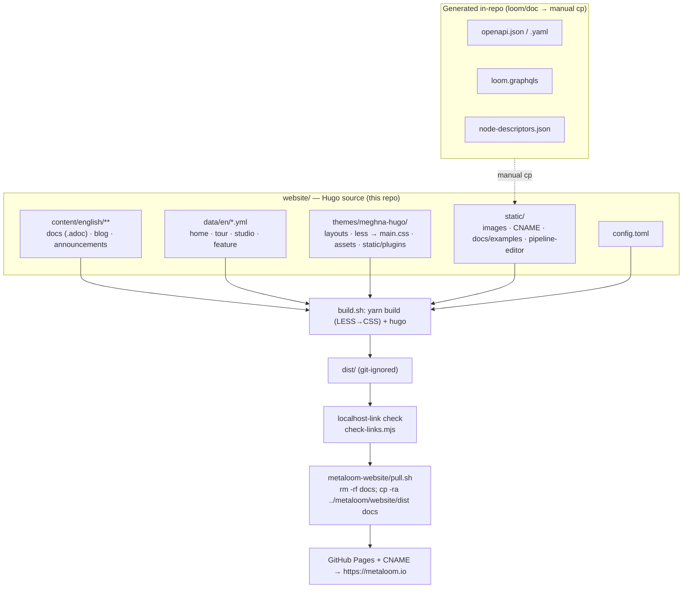

# MetaLoom Customer-Facing Website (Hugo)

The MetaLoom marketing site and **customer-facing product documentation** at
`https://metaloom.io` — a [Hugo](https://gohugo.io/) static site under `website/`. Written for an AI
coding agent that has to add or restructure site content, or fix the build/publish flow.

> **Scope boundary.** This file covers the **site: content inventory, build, checks, publish**.
> It does **not** re-describe the product. Where a `.adoc` page describes Loom/Cortex behaviour, the
> product specs and the code are authoritative — see [Related specs](#related-specs).
> **When the code and a docs page disagree, the code wins — fix the page in the same change**
> ([../guidelines/CODING.md](../guidelines/CODING.md) § Docs).

## Related specs

| Topic | Spec |
|---|---|
| Definition of done for a code change (incl. **the customer-docs rules**) | [../guidelines/CODING.md](../guidelines/CODING.md) |
| Definition of done for a spec change | [../SPEC_RULES.md](../SPEC_RULES.md) |
| Spec-tree entry point / routing | [../CONTEXT.md](../CONTEXT.md) |
| The `/pipeline-editor/` page (backend-free editor + simulator) | [WEBSITE_PIPELINE_EDITOR.md](WEBSITE_PIPELINE_EDITOR.md) |
| Typed ports, content types, cardinality (vocabulary the docs must match) | [../features/pipeline/NODE_DATA_TYPES.md](../features/pipeline/NODE_DATA_TYPES.md) |
| Node catalogue / adding a node | [../features/pipeline-nodes/NODES.md](../features/pipeline-nodes/NODES.md), [../guidelines/NEW_NODE.md](../guidelines/NEW_NODE.md) |
| REST API (source of the staged OpenAPI document) | [../loom/RESTAPI.md](../loom/RESTAPI.md) |
| The product pipeline editor in `loom-ui` | [../loom/ui/PIPELINE_EDITOR.md](../loom/ui/PIPELINE_EDITOR.md) |
| MetaLoom Studio commercial claims | [metaloom-saas/spec/METALOOM_STUDIO_PLAN.md](../../../metaloom-saas/spec/METALOOM_STUDIO_PLAN.md) |

## TL;DR

* Source: `website/` — Hugo, theme `meghna-hugo` (vendored + heavily customised), `publishDir = "dist"`,
  `baseURL = https://metaloom.io`. Single language `en`, `contentDir = content/english`.
* Docs and blog are **AsciiDoc** (`.adoc`) — `asciidoctor` must be on `PATH` and allow-listed in
  `[security.exec]`. The marketing pages are **data-driven** from `data/en/*.yml`.
* Build with `./build.sh` → `dist/`, then two gates: a **localhost-link check** and
  `check-links.mjs` (broken internal links + missing `#anchors`). Both fail the build.
* **Hugo extended ≥ 0.158 is required.** The system `hugo` on this machine is **0.131 and cannot
  build the site** — fetch a newer extended binary into the scratchpad (see
  [Prerequisites](#prerequisites)).
* Publish is manual: the **sibling `metaloom-website` repo** runs `pull.sh` to copy `website/dist`
  → its `docs/`, served by GitHub Pages at `metaloom.io`.
* Seven top-level areas besides `/docs/`: `/tour/`, `/features/`, `/studio/`,
  `/pipeline-editor/`, `/announcements/`, `/blog/`, `/author/`.
  ⚠️ `/tour/` **used to be `/studios/`** — renamed so it could not be confused with `/studio/`; a
  Hugo alias keeps the old URL alive.
* Three **generated artefacts are staged into `static/` by hand** and go stale silently: the OpenAPI
  document, the GraphQL SDL and the node-descriptor snapshot. See
  [Staged generated artefacts](#staged-generated-artefacts).

## Architecture



**Two different things are called `metaloom-website`** — do not confuse them:

| | Path | Role |
|---|---|---|
| Hugo source | `metaloom/website/` (Maven artifactId `metaloom-website`, `packaging=pom`) | Editable source. `build.sh` produces `dist/`. The pom carries **no build logic** — it only registers the module in the reactor. |
| Publish repo | `../metaloom-website/` (sibling checkout, **not** part of this repo) | Holds the *built* site under `docs/` + `CNAME`. Never hand-edit `docs/` — `pull.sh` wipes it. |

## Building

All commands assume `cd website` first.

### Prerequisites

* **Hugo extended, ≥ 0.158.** `config.toml` uses post-0.158 multilingual keys
  (`[Languages.en] locale`/`label`) and templates use `hugo.Data` / `site.Language.Locale`.
  **The system binary is 0.131 and will error out** — download an extended ≥ 0.158 release into the
  scratchpad and call it explicitly.
* **Node + npm/yarn** — the theme has its own `package.json`; `build.sh` prefers `yarn`, falls back
  to `npm`. `yarn install` rewrites `themes/meghna-hugo/yarn.lock`; **restore it** rather than
  committing the churn.
* **`asciidoctor` on `PATH`** — without it `.adoc` pages render empty.

### Commands

| Command | What it does |
|---|---|
| `./build.sh` | theme CSS (`yarn install && yarn build` → `assets/css/main.css`) → `hugo` → `dist/` → the two checks. `set -o errexit -o nounset`, so a missing tool fails the whole script. |
| `./watch.sh` | `./build.sh` then `hugo server -b http://localhost:1313/`. |
| `hugo` | Site build only (theme CSS assumed current). |
| `node check-links.mjs [dist]` | The broken-link check standalone — fast iteration while editing links. |

### The two build-output gates

**1. Localhost links.** `build.sh` greps `dist/**/*.{html,xml}` for
`(href|src|srcset|action|data-src|data-openapi-url|data-graphql-url|data-schema-url)="…(localhost|127.0.0.1|0.0.0.0|[::1])…"`
and exits 1 listing every offender. A published URL pointing at the reader's own machine fails CORS
and triggers the browser's Local Network Access prompt.

Mentioning a local address **in prose is fine** — but Asciidoctor auto-links a bare URL *even inside
backticks*. Suppress it with a leading backslash: `` `\http://localhost:8092/ui/` ``. In a `++++`
block write `<code>…</code>`, not `<a href>`.

**2. `check-links.mjs`** (plain Node, no deps) walks every page in `dist/`, collects
`href|src|srcset|action|poster|data-src|data-*-url`, and resolves each **internal** target against
the build output (pretty URLs: `/docs/`, `/docs`, `/docs.html` all resolve). `#fragment` targets are
checked against the target document's `id=`/`name=` attributes, so a renamed heading is caught.
`metaloom.io`/`www.metaloom.io` count as internal; every other host is skipped — **it never fetches
the network**. Two failure shapes it catches regularly:

1. A relative `link:` missing its `../` — `link:rest-api[…]` on `/docs/loom/graphql-api/` resolves to
   `/docs/loom/graphql-api/rest-api`.
2. A child page Hugo never built, because the parent used `index.adoc` (leaf bundle) instead of
   `_index.adoc` (branch bundle). See [Conventions and Gotchas](#conventions-and-gotchas).

## Folder structure

```
website/
├── config.toml            # baseURL, theme, menu, plugins, params, security
├── build.sh · watch.sh    # build (+2 gates) · build + preview server
├── check-links.mjs        # internal-link + anchor checker
├── pom.xml                # Maven module registration only
├── content/english/       # contentDir — see the page inventory below
├── content-off/           # parked, NOT built: java-ffm-graph-storage-poc/
├── data/en/*.yml          # LIVE: home · tour · studio · feature. The other 11 are dead Meghna copy
├── i18n/en.yaml           # UI strings (menu labels, footer headings, "Read more")
├── static/                # verbatim → dist/: images/ · CNAME · .nojekyll
│   ├── docs/examples/     #   openapi.{json,yaml} · schema.graphql   (staged, generated)
│   ├── pipeline-editor/   #   node-descriptors.json                  (staged, generated)
│   └── images/og-*.jpg    #   1200×630 social cards
├── themes/meghna-hugo/    # the only theme
│   ├── layouts/           #   index · alias · 404 · _default · docs · announcements · author
│   │                      #   · features · tour · studio · pipeline-editor · partials
│   ├── less/              #   main.less + includes/{custom,adoc,docs,toc,variables}.less → assets/css/main.css
│   ├── assets/css/        #   main.css (compiled) · home.css · tour.css · studio.css · pipeline-editor.css
│   ├── assets/js/         #   script.js · reveal.js · pipeline-editor.js
│   ├── assets/images/scenery/  # 4 photos, Hugo-processed to webp; shared by /tour/ and /studio/
│   └── static/plugins/    #   14 vendored plugins incl. swagger · graphiql · nodeviz · toc
└── dist/                  # BUILD OUTPUT (git-ignored)
```

There is **no project-root `layouts/` or `archetypes/`** — every template lives in the theme.

## Page inventory

Every content page is a **page bundle**: a directory with `index.adoc`/`index.md` (leaf) or
`_index.adoc`/`_index.md` (section/branch). Co-located images live in the same folder.

### Top-level areas

| URL | Content | Copy lives in | Layout |
|---|---|---|---|
| `/` | `_index.md` (front matter only) | `data/en/home.yml` | `layouts/index.html` + `partials/home/*` |
| `/tour/` | `_index.md` (front matter only, `aliases: [/studios/]`) | `data/en/tour.yml` | `layouts/tour/list.html` + `partials/tour/art-*.html` (8) |
| `/features/` | `_index.md` | `data/en/feature.yml` | `layouts/features/list.html` |
| `/studio/` | `_index.md` (front matter only) | `data/en/studio.yml` | `layouts/studio/list.html` + `partials/studio/art-*.html` (7) |
| `/pipeline-editor/` | `_index.md` (front matter only) | — (all in JS) | `layouts/pipeline-editor/list.html` — see [WEBSITE_PIPELINE_EDITOR.md](WEBSITE_PIPELINE_EDITOR.md) |
| `/announcements/` | `_index.adoc` + `metaloom-1-0-0/index.adoc` | in the pages | `layouts/announcements/{list,single}.html` |
| `/blog/` | `_index.md` + 6 post bundles | in the posts | `layouts/_default/{list,article,single}.html` |
| `/author/jotschi/` | `author/jotschi.md` | in the page | `layouts/author/single.html` |
| `/docs/**` | `.adoc` (below) | in the pages | `layouts/docs/{list,single}.html` |

Blog posts: `day0-let-there-be-loom`, `day1-project-design`, `day2-project-setup`,
`day3-vertx-dagger-poc`, `day4-vertx-jooq-poc`, `video-fingerprinting`.

### `content/english/docs/` — the customer documentation

`_index.adoc` is the landing page (card grid, "Start Here", concepts, "Choose Your Path" table).
`variables.adoc-include` carries the shared attributes (`:icons: font`, `:toc:`,
`:source-highlighter:`); the `.adoc-include` extension keeps Hugo from rendering it as a page.

| Section | Pages |
|---|---|
| **top level** | `getting-started/` (weight 1) · `operation/` · `pipeline/` · `ui/` (15 screenshots) · `cli/` · `deployment/` (`_index` + `helm/`) |
| **`playbooks/`** (weight 3) | `_index` + `docker/` · `kubernetes/` · `transcription/` · `scene-analysis/` · `translation/` · `python-node/` |
| **`nodes/`** | `_index` + **28 node pages**: `captioning · consistency · dedup · depthmap · dominant-color · facedescription · facedetect · filesystem-source · filters · fingerprint · hash · imagegen · llm · ocr · quality · s3-sink · s3-source · scene-detection · scene-layout · script · sentiment · thumbnail · tika · tts · videogen · vlm · watermark · whisper` |
| **`loom/`** | `_index` + `rest-api/` (Swagger UI) · `graphql-api/` (GraphiQL) · `java-client/` · `authentication/` · `configuration/` · `metrics/` · `features/` · `chat/` · `binary-storage/` · `artifacts/` · `maven-artifacts/` · `containers/` · `helm-chart/` · `examples/` |
| **`cortex/`** | `_index` + `configuration/` · `monitoring/` · `metrics/` · `artifacts/` · `maven-artifacts/` · `containers/` · `examples/` |
| **`legal/`** (weight 9) | `_index` + `model-licenses/` · `ai-disclosure/` · `impressum/` (German) |
| **legacy stubs** | `rest/` · `test/` · `configuration/` — unlinked placeholders, candidates for deletion |

Grouped node pages cover several kinds each: `hash/` covers `md5`/`sha256`/`sha512`/`chunk-hash`,
`filters/` covers the eight `filter-*` kinds, `dedup/` covers `hash-dedup`/`fingerprint-dedup`/
`fingerprint-dedup-apply`. Pages that structure moved: the coding sandbox is a section of
`loom/chat/` (not its own page); the per-node reference moved from `cortex/nodes/` to top-level
`nodes/`; `docs/cortex/features/` was folded into `nodes/_index.adoc` + `operation/`;
`docs/interaction/` was renamed `docs/operation/`.

> **Two things must never come back into the docs:** an "online vs offline mode" for Cortex
> (`isOfflineMode()` only means "no Loom client configured") and **webhooks** (not a product
> feature). Neither belongs in `data/en/feature.yml` either.

### The customer-docs rules ([../guidelines/CODING.md](../guidelines/CODING.md) § Docs)

New **customer-facing** features must be documented under `website/content/english/docs/`:

* **Don't mention spec files.**
* **No internal coding references** — class names, packages, module paths.
* **Keep the tone customer-facing.**
* **No ASCII-art diagrams** — inline SVG, or an `ml-nodeviz` block on a node page.

## Staged generated artefacts

Three files under `static/` are **generated, never hand-written**, and copied in by hand. Nothing
automates the copy and no check catches staleness — regenerate **in the same change** as the source
edit.

| Staged file | Generated by | Consumed by |
|---|---|---|
| `static/docs/examples/openapi.{json,yaml}` | `io.metaloom.loom.doc.impl.OpenAPIGenerator` (driven by `ExampleGenerator`), over `io.metaloom.loom.rest.openapi.LoomOpenAPI` | `docs/loom/rest-api/` — download cards + the embedded **Swagger UI** |
| `static/docs/examples/schema.graphql` | plain copy of `loom/services/graphql/src/main/resources/loom.graphqls` | `docs/loom/graphql-api/` — the embedded **GraphiQL** explorer |
| `static/pipeline-editor/node-descriptors.json` | `io.metaloom.loom.doc.impl.NodeDescriptorGenerator` (same driver) | `/pipeline-editor/` — see [WEBSITE_PIPELINE_EDITOR.md](WEBSITE_PIPELINE_EDITOR.md) |

```bash
mvn -q -pl loom/doc -am -DskipTests -Dmaven.javadoc.skip=true install
cd loom/doc && mvn -q exec:java -Dexec.mainClass=io.metaloom.loom.doc.ExampleGenerator
# working dir MUST be loom/doc/ — the generators write to the relative src/main/generated/
cp src/main/generated/openapi.json           ../../website/static/docs/examples/
cp src/main/generated/openapi.yaml           ../../website/static/docs/examples/
cp src/main/generated/node-descriptors.json  ../../website/static/pipeline-editor/
cp ../services/graphql/src/main/resources/loom.graphqls \
   ../../website/static/docs/examples/schema.graphql
```

* `-Dmaven.javadoc.skip=true` is currently required — `loom/pipeline` has a pre-existing javadoc
  error that fails `javadoc:jar`. Unrelated to the website.
* Guards: `LoomOpenAPITest` (`loom/services/rest`) pins the OpenAPI polish step;
  `NodeDescriptorGeneratorTest` (`loom/doc`) pins snapshot kind coverage and the port-model fields.
* A running server serves the live equivalents at `/api/v1/openapi[.yaml|.json]`, `/graphiql` and
  `GET /api/v1/pipeline/node-descriptors`.

### Swagger UI / GraphiQL wiring

Both plugins (`themes/meghna-hugo/static/plugins/{swagger,graphiql}/`) are loaded on **every** page
via `[[params.plugins.js]]`, so each **must bail out when its mount div is absent** — otherwise it
renders into `null` and throws site-wide. Mount points are raw-HTML blocks (`#swagger-ui`,
`#graphiql`) in the two pages; per-page `data-openapi-url` / `data-graphql-url` / `data-schema-url`
attributes override the defaults, which must stay **site-relative**. Swagger options:
`docExpansion:'none'`, `filter:true`, `deepLinking:true`, alphabetical sorting,
`persistAuthorization`, and `validatorUrl: null` — the site must never ship a reader's spec to
`validator.swagger.io`. Swagger UI ships light-theme CSS, so `#swagger-ui` gets its own light
surface in `custom.less` rather than being restyled operation by operation.

## Node diagrams (`nodeviz`)

Every page under `docs/nodes/<kind>/` opens with a generated diagram — typed inputs left, node
centre, typed outputs right, animated flow, one tab per alternative configuration. **28 pages carry
a spec.** The page contains only JSON in a passthrough block:

```asciidoc
++++
<div class="ml-nodeviz" data-nodeviz='{"kind":"facedetect","applies":"Image, Video",
  "badge":"InspireFace","persist":"asset_detection + ledger",
  "inputs":[{"t":"image","l":"image","d":"a still to search for faces"}],
  "outputs":[{"t":"face","l":"detections","c":"many","d":"one element per detected face"},
             {"t":"flag","l":"face_count","ct":"scalar/integer","d":"how many survived clustering"}]}'></div>
++++
```

Renderer: `themes/meghna-hugo/static/plugins/nodeviz/nodeviz.js` (no-op without `.ml-nodeviz`).
**Change the drawing once and all 28 pages follow.** Styling is `.nv-*` in `custom.less`.

* Root fields: `kind`, `applies`, `badge`, `persist`, and either an `inputs`/`outputs` pair or
  `configs: [{name, note, inputs, outputs}, …]` (more than one renders a tab row).
* **Port fields — six:** `t` (type key into `TYPES` → icon, colour, default content type),
  `l` (label), `d` (description), `opt` (dashed = optional), **`c`** (cardinality — the *only*
  recognised value is the literal `"many"`; **absence means one**, there is no `"one"` token),
  **`ct`** (content-type id override, resolved as `p.ct || ty.ct`).
* `TYPES` has **29 entries** whose `ct` values are the **real `family/subtype` ids** from
  `ContentTypeRegistry` (`media/image`, `detection/face`, `struct/embedding`, `hash/*`,
  `control/filter`, …). `action` is the one entry with no `ct` — a side effect carries no value.
  Unknown types fall back to a neutral dot: add to `TYPES` + `icon()` rather than inventing labels.
* **Cardinality is encoded three ways on purpose** — a dashed stacked mark + ` · many` suffix in the
  diagram, a `one`/`many` badge in the hover card, and the card's pip animation tempo (one pip at
  2.6 s vs three staggered at 1.5 s). `prefers-reduced-motion` freezes both into static states
  rather than hiding them.
* Ports are focusable (`tabindex="0"`, `role="button"`, an `aria-label` naming side/label/content
  type/cardinality); the card opens on hover **and** focus and **toggles on click** so it works on
  touch.
* The type key renders once on `docs/nodes/_index.adoc` via `<div class="ml-nodeviz-legend"></div>`
  — a hand-ordered subset of `LEGEND` (18 keys) plus the cardinality note. Cardinality is a second
  axis, not a type, so it is taught once beside the icon key.
* ⚠️ The spec lives in a **single-quoted HTML attribute** — **never use an apostrophe in the JSON**.
  Nothing enforces this: an apostrophe truncates the attribute, `JSON.parse` throws, and the
  `try/catch` leaves a blank diagram. All 28 pages currently comply (exactly two `'` per line).

> **Keep the vocabulary in step.** `TYPES[*].ct` must be ids that exist in
> `ContentTypeRegistry.all()`. Adding a content type to the product means adding it there **and**
> here — [../features/pipeline/NODE_DATA_TYPES.md](../features/pipeline/NODE_DATA_TYPES.md) § 2.

## Content conventions

**Front matter** is YAML between `---`. Only `title` is required; `weight` orders siblings,
`page_css: css/<name>.css` gives one page its own stylesheet, `aliases: [/old/]` keeps an old URL
alive, `image`/`image_webp` name a blog teaser by **bare file name** inside the bundle.

**AsciiDoc body**: `== Heading`, `[source,bash]----…----`, `|===` tables, `link:target[Label]`,
admonitions. Internal links are **relative targets that resolve to Hugo pretty URLs**
(`link:../loom/authentication/[…]`) — match the surrounding trailing-slash style. Card grids and
note boxes are **raw-HTML passthrough** `++++ … ++++` with Bootstrap markup + theme classes
(`docs-card`, `note`, `row`, `col-*`); `docs/_index.adoc` is the canonical pattern
(`enableInlineShortcodes = false`, so shortcodes are not an option). Prefer the front-matter
`title` and `==` sections over a level-0 `= Title` in the body — the layout already emits the `<h1>`.

**Figures are inline SVG in a `++++` block**, never ASCII art, using the shared `.ml-*` vocabulary
in `custom.less` (`ml-box-container`, `ml-box-part`, `ml-edge`, `ml-chip`, `ml-step`, `ml-flow`,
`ml-box-gpu`, `ml-box-dyn`, `ml-deny`), wrapped in `<div class="ml-figure">` with
`class="ml-arch-svg"`. Give each a `<title>` + `<desc>` referenced from `aria-labelledby`.

> ⚠️ **Prefix `<marker>` ids per page** (`ml-dk-*`, `ml-k8s-*`, `ml-tr-*`, `ml-sc-*`, `ml-tl-*`,
> `ml-py-*`) — marker ids are document-global, so two figures reusing `ml-arrow` collide and one
> loses its arrowheads.
>
> ⚠️ **An animated figure must not change height.** The dispatch animation on `docs/operation/`
> swaps its caption per phase; a growing caption box oscillated the page height, toggled the
> scrollbar and jittered the layout. The caption has a fixed height and `custom.less` sets
> `html { scrollbar-gutter: stable; }`.

## Design system

There is **one palette for the whole site** — CSS custom properties at the top of
`less/includes/custom.less`, therefore in the global `main.css` on every page:

| Group | Tokens |
|---|---|
| Surfaces | `--ml-bg` `#0b0e13` · `--ml-bg-alt` · `--ml-surface` · `--ml-surface-hi` · `--ml-card` |
| Lines / Text | `--ml-line` · `--ml-line-hi` — `--ml-fg` · `--ml-fg-dim` · `--ml-muted` |
| Accents | `--ml-accent` `#57cbcc` · `--ml-accent-bright` · `--ml-accent-line` · `--ml-accent-wash` · `--ml-warm` · `--ml-warm-soft` |
| Type | `--ml-sans` (Anaheim) · `--ml-display` (Quattrocento Sans) · `--ml-mono` (JetBrains Mono) |
| Shape | `--ml-radius` · `--ml-radius-sm` · `--ml-lift` |

* `assets/css/home.css` (`/` and `/features/`) defines **no colours** — its `.hm-page` block aliases
  the tokens. Change a colour once and `/`, `/features/`, `/docs/`, `/blog/`, `/announcements/`
  all follow.
* `/tour/` (`.st-*`, teal) and `/studio/` (`.sd-*`, amber `#e2a86e`) keep page-scoped stylesheets on
  purpose — **that is the one place the accent may differ**. Inside `studio.css` teal survives as
  `--sd-teal` and marks exactly one thing: *what is open source*. Do not fold them into `main.css`,
  and note both are **hand-written CSS** — `yarn build` only compiles `less/main.less`.
* The card object (gradient surface, hairline, teal border, `--ml-lift` hover translate) is
  deliberately identical on `.hm-feature`, `.docs-card`, `.note`, `.ann-entry`, `.blog-card`.
* Docs, `/announcements/`, `/blog/` and `/author/` share one reading system: Quattrocento Sans
  headings, Anaheim prose, monospace values, code as a chip, admonitions as coloured-left-edge
  callouts, code blocks as a recessed surface, a shared `.page-head` (eyebrow → title → rule) and a
  `.docs-foot` button pair. Heading offsets use **`scroll-margin-top: 96px`, not padding**.
* **Scroll reveal** is one script, `assets/js/reveal.js`, with a page-agnostic contract:
  `data-reveal-scope` on a container, `class="reveal"` per element, `data-reveal-delay="<n>"`
  (× 90 ms), `data-count-up`. Wire it with `{{ partial "reveal-bootstrap.html" . }}` inside the
  scope and `{{ partial "reveal-script.html" . }}` after it.

> **`html, body { background-color: var(--ml-bg) }` is load-bearing.** The theme's `style.css` still
> sets `#353b43`; `custom.less` is imported after it and wins. A page that comes out grey means a
> `background-color` is beating the token block.
>
> **Never hide content behind JavaScript.** The hidden start state is scoped to `.reveal-js`, which
> `reveal-bootstrap.html` sets *synchronously during parse*, and the same snippet removes it after
> 2.5 s if `reveal.js` never runs. A blocked script degrades to "no animation", never "no content".
> Every rule is `.reveal-js` hides / `.is-visible` reveals.
>
> **All motion is decoration.** Every page-scoped stylesheet ends with a `prefers-reduced-motion`
> block that disables its animations. Nothing may encode information in movement alone.
>
> **No CJK text anywhere** — the site ships no CJK webfont, so a Japanese line renders as tofu.

Site chrome: `partials/navigation.html` (sticky, translucent, `.is-scrolled` past 12 px,
`.is-active` + `aria-current` on the current section, hamburger → X) and `partials/footer.html`
(four columns, labels from `i18n/en.yaml`, contact pills from `[[params.social]]`, the Impressum
link, the *1.0.0 — not released yet* badge). **Footer headings carry `data-toc-skip`** and
`plugins/toc/toc.js` scopes bootstrap-toc to `.docs-main-content`, or they land in the docs TOC.

`partials/card.html` builds OG/Twitter metadata for every page: title `<page> | MetaLoom` (bare
`MetaLoom` on `/`), a description chain (page → `.Summary` → site param, truncated to 200 chars),
`summary_large_image` with `/images/og-default.jpg` as the fallback, canonical, `og:site_name`,
`og:type`, `og:locale`, `og:image:alt`, article timestamps. Blog images resolve through
`partials/func/page-image.html` (prefers `image_webp`, falls back to `image` then
`/images/banner_square.webp`).

## Legal pages (`docs/legal/`)

* `model-licenses/` is an **inventory of what each node loads**, not a generic license page.
  MetaLoom ships **no weights** — every model is a configuration value — so the page maps
  node → default model → license → commercial-use verdict, and closes with how to read the deployed
  values back. Two components are **non-commercial** (`#restricted`): the **InspireFace model packs**
  used by `facedetect` (Apache-2.0 code, InsightFace academic-only packs, which taints
  `facedescription` downstream) and **Ideogram 4.0**, the backing model of the `imagegen` node
  ([../features/pipeline-nodes/NODE_IMAGEGEN_PLAN.md](../features/pipeline-nodes/NODE_IMAGEGEN_PLAN.md)).
  Conditional (`#conditional`): the Gemma defaults and the gated Llama-3.2 Kartoffel TTS checkpoint.
  `#clean-stack` gives the permissive-only configuration; `#runtimes` covers redistributed native
  libraries incl. the FFmpeg `--enable-gpl` caveat.
* `ai-disclosure/` states the timeline: **2023–2025 no AI code generation, 2026 onwards
  AI-assisted**, at project level — AI assistance is not tracked per commit, and the page says so.
* `impressum/` is the **Austrian site disclosure** and the only German page: § 5 ECG, § 25 MedienG,
  copyright, liability, the EU ODR platform, and a `#datenschutz` section covering what a static
  site actually processes (GitHub Pages logs, the Google Fonts CDN, external links, email).

> ⚠️ **The Impressum still has `[…]` placeholders** (address, a second direct channel besides
> email). It is not legally complete until those are real, and the "private project, no Firmenbuch,
> no UID" rows must be revisited the moment MetaLoom is offered commercially. It is a good-faith
> template, not lawyer-reviewed.
>
> ⚠️ **Keep the inventory honest.** When a node's default model changes, update the page in the same
> change. Claims must reflect what the code loads (the whisper node runs **whisper.cpp locally** —
> it does not call a remote ASR endpoint, even though `asr4j` supports one). Do not soften or drop
> the two `[WARNING]` blocks. The page carries a *not legal advice* disclaimer; keep it that way.

## Capturing Loom UI screenshots (`docs/ui/`)

`docs/ui/` holds 15 dark-mode screenshots of the running app, checked in as page-bundle images and
refreshed by `loom-ui/scripts/capture-ui-screenshots.mjs` (Playwright/Chromium already installed
under `loom-ui/`; it logs in, forces `localStorage["loom-ui-theme"]="dark"` and navigates by
**clicking sidebar items** — the SPA has no router `basename` under `/ui/`, so deep-link reloads
fail).

```bash
# 1 — always build a FRESH demo image; the local one lags the source
mvn -T 8 clean package -DskipTests -pl loom/containers/demo -am
( cd loom-ui && npm run build )
( cd loom/containers && ./build-containers.sh jvm demo )   # 'jvm demo', not bare 'demo' (native needs GraalVM)
# 2 — start Postgres first: the demo container is NOT self-contained
./start-postgres.sh && ./start-demo.sh                     # \http://localhost:8092/ui/  admin / finger
# 3 — capture (env: UI_BASE_URL, LOOM_USER, LOOM_PASS, OUT_DIR)
cd loom-ui && node scripts/capture-ui-screenshots.mjs
# 4 — tear down
docker rm -f loom postgres-demo cortex-demo
```

Filenames must stay stable so refreshes overwrite in place: `chat`, `chat-sessions`, `skills`,
`memory`, `assets`, `asset-detail`, `library`, `tags`, `tasks`, `face-detection`, `pipeline-editor`,
`pipeline-versions`, `cortex`, `monitoring`, `users`, `acl-roles`, `api-keys`.

* `DemoDatabaseInitializer` seeds every screen with real content, and **paints real image bytes**, so
  the asset browser shows pictures. Video/audio/PDF stay as placeholders — expected, not a failure.
* **The ACL screens sit in a collapsed sub-group**; `openAclGroup()` must click
  `[data-testid="sidebar-group-acl"]` first or the nav click times out. `clickNav` matches
  `^\d*<label>\d*$` so a badge counter (Tasks) still resolves.
* **The library view auto-selects an empty library** — the script clicks the first entry not labelled
  "0 assets" before shooting.
* **Thumbnails only render when Loom serves the UI.** The grid points `` at
  `/api/v1/assets/:uuid/binary/data`, which authenticates via the `__Host-loom_token` cookie; behind
  a `vite` dev proxy every preview 401s. Screenshots showing thumbnails **must** come from the
  container. Recreating the container against an existing DB yields 404s on binaries — re-run
  `./start-postgres.sh` for a clean re-seed.
* `cortex.png` needs a live worker built from the **same revision** as the demo image (an older image
  fails the registration handshake) on the shared `dev` network; it needs a local OpenCV 5.1 build.
* Docs images get click-to-zoom (`.ml-lightbox*` in `custom.less` + vanilla JS in
  `assets/js/script.js`) — a theme feature on every docs page, not just this one.

## Configuration

The site has no runtime. "Configuration" is `config.toml` plus the build environment. Hugo `getenv`
is restricted to `^HUGO_` and `^CI$`, so **templates can read no other env var**.

| `config.toml` key | Value | Purpose |
|---|---|---|
| `baseURL` | `https://metaloom.io` | Canonical site URL |
| `title` / `theme` / `publishDir` | `MetaLoom` / `meghna-hugo` / `dist` | |
| `paginate` / `summaryLength` | `6` / `15` | Blog list page size, auto-summary words |
| `enableRobotsTXT` / `disableLanguages` | `true` / `[]` | |
| `Languages.en.contentDir` | `content/english` | Only language; `locale = en-us`, `label = En` |
| `[[Languages.en.menu.main]]` | Tour 2 · Features 3 · Studio 4 · **Pipeline Editor 5** · Announcements 6 · Blog 7 · Docs 8 | All point at real pages — never a `pre = "#"` anchor |
| `[security.exec] allow` | includes `asciidoctor` | **Must** include it or `.adoc` renders empty |
| `[security] enableInlineShortcodes` | `false` | Why layout uses `++++` passthrough |
| `[security.funcs] getenv` | `['^HUGO_', '^CI$']` | |
| `params.logo` | `images/logo_word_big.svg` | |
| `params.discordLink` | `https://discord.gg/3Dy2SxKUtw` | Header icon. **Must live under `[params]`** — as a root key templates cannot read it |
| `params.canonical_base` | `https://metaloom.io` | Base for absolute social metadata. Duplicates `baseURL` **on purpose** — see Gotchas |
| `[[params.social]]` | Discord · GitHub · email | Footer contact pills (`icon`, `label`, `link`) |
| `[[params.plugins.css]]` / `[[.js]]` | 9 / 15 entries | Bootstrap, FontAwesome5, Themify, slick, magnific-popup, lazy-load, bootstrap-toc, **swagger**, **graphiql**, **nodeviz** |

There is **no `[markup]` / `[markup.asciidocExt]` block** — Asciidoctor runs with Hugo defaults, and
shared attributes come from `docs/variables.adoc-include` instead.

| Build/publish environment | Where | Notes |
|---|---|---|
| `HUGO_*`, `CI` | build env | The only env vars templates may read |
| Hugo extended ≥ 0.158 | `PATH` | System 0.131 is too old — fetch a newer binary |
| Node + yarn/npm | theme build | Compiles `less/main.less` → `assets/css/main.css` |
| `asciidoctor` | `PATH` | Renders all `.adoc` content |

## Publishing flow

1. `cd website && ./build.sh` → `website/dist/`.
2. In the sibling `metaloom-website` repo: `./pull.sh` → `rm -rf docs; cp -ra ../metaloom/website/dist docs`.
3. Commit & push — GitHub Pages serves `docs/` at `metaloom.io` (`docs/CNAME`; the `CNAME` and
   `.nojekyll` markers ship from `website/static/`).

`dist/` and `docs/` are git-ignored here, so a build never dirties the working tree.

## Where do I find …?

| I want to … | Look at |
|---|---|
| Add/edit a customer doc page | `website/content/english/docs/<section>/index.adoc` |
| Add a docs **section** | New folder with `_index.adoc` (**not** `index.adoc`) + child `index.adoc` pages; link it from `docs/_index.adoc` |
| Add a task-oriented guide | `docs/playbooks/<name>/index.adoc` — link from `playbooks/_index.adoc` **and** `docs/_index.adoc` |
| Add/redraw a node diagram | The `data-nodeviz` block on the page; renderer `themes/meghna-hugo/static/plugins/nodeviz/nodeviz.js` |
| Change home / tour / studio / feature copy | `website/data/en/{home,tour,studio,feature}.yml` — **never the layout** |
| Add an illustration to `/tour/` or `/studio/` | `layouts/partials/{tour,studio}/art-<name>.html` (selected by the `art:` key in the YAML) + `assets/css/{tour,studio}.css` |
| Give one page its own stylesheet | Front matter `page_css: css/<name>.css` + the asset under `themes/meghna-hugo/assets/css/` |
| Redirect an old URL | `aliases:` in the target's front matter; the stub comes from `layouts/alias.html` |
| Add scroll reveal to a page | `data-reveal-scope` + `.reveal` + the two `reveal-*` partials |
| Add a release announcement | `content/english/announcements/<slug>/index.adoc` with `status` / `status_label` / `version` / `image` |
| Refresh the OpenAPI / GraphQL / node-descriptor files | [Staged generated artefacts](#staged-generated-artefacts) |
| Refresh the Loom UI screenshots | [Capturing Loom UI screenshots](#capturing-loom-ui-screenshots-docsui) |
| Record which model a node uses + its license | `docs/legal/model-licenses/index.adoc` |
| Fill in the Impressum | `docs/legal/impressum/index.adoc` — the `[…]` markers and the comment block at the top |
| Change top navigation | `[[Languages.en.menu.main]]` in `config.toml`; look in `partials/navigation.html` + `.navigation` in `custom.less` |
| Change UI labels / footer headings | `website/i18n/en.yaml` |
| Change the footer | `layouts/partials/footer.html`; contact pills in `[[params.social]]` |
| Change site colours | the `--ml-*` block at the top of `less/includes/custom.less` (rebuild via `build.sh`) |
| Change docs layout / TOC | `layouts/docs/{single,list}.html`; TOC scoping in `static/plugins/toc/toc.js` |
| Find out why a link 404s | `cd website && node check-links.mjs` |
| Fix "build fails with localhost links" | Escape the URL: `` `\http://localhost:8092` `` |
| Fix "asciidoc renders empty" | Install `asciidoctor`; confirm it is in `[security.exec] allow` |
| Change the published domain | `website/static/CNAME` + `baseURL` + `params.canonical_base` |
| Understand the `/pipeline-editor/` page | [WEBSITE_PIPELINE_EDITOR.md](WEBSITE_PIPELINE_EDITOR.md) |

## Conventions and Gotchas

* **`index.adoc` makes a folder a *leaf* bundle — its subfolders stop being pages.** This silently
  swallowed `docs/deployment/helm/`: the source existed, three links pointed at it, Hugo published
  nothing. A section that has (or may gain) children **must** use `_index.adoc`, which also switches
  it from `docs/single.html` to `docs/list.html`.
* **Docs layouts are selected by section**, purely because pages live under the top-level `docs/`
  section. Moving a page out of `docs/` changes its template.
* **Pretty-URL relative links.** `link:` targets rely on trailing-slash pretty URLs. A missing `../`
  resolves *below* the current page and 404s.
* **A static path in front matter needs a leading slash.** `image: images/team/js.jpg` resolves
  against the page bundle and then the page URL → `/author/jotschi/images/team/js.jpg`.
* **Site-relative over absolute in templates.** Anything a browser fetches must come from
  `.RelPermalink` / `relURL`. Never concatenate an image name onto `.Permalink` — a pretty permalink
  already ends in `/`, which produced a **double slash** *and* a localhost-host absolute URL.
* **Absolute URLs come from `site.Params.canonical_base`, not `site.BaseURL`.** Hugo intermittently
  resolves `site.BaseURL` to `http://localhost:1313/` for 5–15 of the ~90 pages when the theme CSS is
  recompiled in the same run (reproducible on 0.158 *and* 0.164; survives `rm -rf dist` and
  `GOMAXPROCS=1`). Do not "simplify" `card.html` back to `.Permalink` / `absURL`.
* **`layouts/alias.html` overrides Hugo's built-in** for the same reason: the built-in writes an
  absolute `site.BaseURL` target, which trips the localhost check. The override uses `.RelPermalink`
  and adds a visible fallback link.
* **A running `hugo server` writes into the same `dist/`** and injects `<script src="/livereload.js">`
  — `build.sh` then fails on it, correctly. Stop the preview server before a release build, or build
  into a scratch dir: `hugo -d /tmp/distcheck && node check-links.mjs /tmp/distcheck`.
* **`build.sh` runs `yarn install`**, which rewrites `themes/meghna-hugo/yarn.lock`. Restore it;
  don't commit that churn with a content change.
* **11 of the 15 `data/en/*.yml` files are dead.** Only `home`, `tour`, `studio` and `feature` are
  rendered; `about`, `service`, `skill`, `funfacts`, `pricing`, `testimonial`, `portfolio`, `team`,
  `contact`, `banner`, `cta` are unwired legacy Meghna copy. Do not "fix" copy that cannot appear.
* **`content-off/` is parked content** — outside `contentDir`, not built. Use it to disable a page
  without deleting it.
* **Legacy stub pages exist under `docs/`** (`rest/`, `test/`, top-level `configuration/`) — not
  linked from `docs/_index.adoc`. The maintained equivalents are `docs/loom/rest-api/`,
  `docs/loom/configuration/` and `docs/cortex/configuration/`.
* **`(planned)` in a `feature.yml` title renders as a badge** next to the stripped name — keep
  writing them that way. Feature items take an optional `link:` to the covering docs page.
* **MetaLoom ships no model weights.** Every license statement on the site is about a model *you*
  supply, which is why every row is phrased "default, configurable".
* **The `/studio/` page is a proposal, not a shipped product.** Its claims map back to decisions in
  [metaloom-saas/spec/METALOOM_STUDIO_PLAN.md](../../../metaloom-saas/spec/METALOOM_STUDIO_PLAN.md)
  § "What The Website Currently Claims" — change both together. Two promises on it are load-bearing
  (*nothing open source moves into Studio*, *Studio does not meter processing*); do not soften them
  there or contradict them in the docs. No prices, and no form — the CTA is a `mailto:`.
* **Never ship a control that looks inert but collects.** The home page's placeholder "Notify me"
  field was removed rather than left implying a mailing list exists.
* **An unreleased version must read as unreleased.** The 1.0.0 announcement leads with an
  `[IMPORTANT]` block, `status: upcoming`, a *Not released yet* badge and a matching social card.
  When the release is cut, all four change together.
* **The `/studio/` editions comparison is a real `<table>`** with `<th scope>`, an `.sr-only`
  caption and an `.sr-only` "included"/"not included" beside every ✓/– — state must never be carried
  by colour or a glyph alone. It scrolls inside `.sd-table-scroll`, never the page body.
* **`.sd-split > * { min-width: 0 }` is load-bearing** — a `1fr` grid track is
  `minmax(min-content, 1fr)`, so a `white-space: nowrap` run inside one refuses to shrink and gets
  silently clipped by `.sd-page`'s `overflow-x: hidden` at 420 px.

## Test Setup

There is no automated test suite for the website; verification is **build + the two gates + visual
review**.

1. Install prerequisites (Hugo extended **≥ 0.158**, Node, `asciidoctor`).
2. `cd website && ./build.sh` (or `./watch.sh` for `http://localhost:1313/`). A clean run ends with
   `All done` — no Hugo errors, no localhost hits, `Link check OK — N pages`.
3. Spot-check: `/docs/` card grid, one leaf page with the sidebar TOC, `/docs/loom/rest-api/`
   (Swagger UI loads), `/docs/loom/graphql-api/` (GraphiQL builds the schema offline),
   `/docs/nodes/facedetect/` (nodeviz diagram + hover card), `/pipeline-editor/` (demo loads).
4. `node check-links.mjs` on its own for a quick link pass while editing.
5. Visual checks without a browser — serve `dist/` and drive the Playwright/Chromium under
   `loom-ui/`:
   ```bash
   python3 -m http.server 8099 --directory dist &
   # navigate, SCROLL the page (everything starts hidden until revealed), then shoot 1440px and 420px
   ```
6. **Horizontal overflow at 420 px** on `/tour/` and `/studio/`:
   `document.documentElement.scrollWidth` must equal the viewport width minus the scrollbar gutter,
   and no `main` descendant may be clipped by `.st-page`/`.sd-page`'s `overflow-x: hidden`. That
   clipping is silent — the page still scrolls, the content is just cut off.
7. After touching `custom.less` / `adoc.less` / a reading layout, screenshot **both sides of the
   seam** — `/features/` vs `/docs/`, `/blog/`, `/announcements/` — plus the awkward docs pages: an
   admonition + code block (`/docs/playbooks/docker/`), a reference table (`/docs/nodes/`), a
   generated diagram (`/docs/operation/`) and the Swagger explorer (which keeps its own light
   surface on purpose).
8. If a page moved, confirm `dist/<old-path>/index.html` exists and carries a **relative** refresh
   target (`dist/studios/index.html` → `/tour/`).
9. Dry-run publish: `./pull.sh` in the sibling repo, inspect `docs/`, do **not** push unless
   releasing.

## Progress Assessment

- [x] Hugo scaffolding: config, vendored theme, `build.sh`/`watch.sh`, Maven module
- [x] Data-driven marketing pages: `/` (short front door), `/features/`, `/tour/`, `/studio/`
- [x] `/studios/` → `/tour/` rename with `aliases:` + a `layouts/alias.html` override
- [x] `/pipeline-editor/` page — spec'd in [WEBSITE_PIPELINE_EDITOR.md](WEBSITE_PIPELINE_EDITOR.md)
- [x] `/announcements/` + the MetaLoom 1.0.0 page, marked **not released yet** in badge, lead and card
- [x] `/blog/` (6 posts) + `/author/` with the shared reading system
- [x] Docs landing, Getting Started, Operation, Pipeline, Loom UI (15 screenshots), CLI, Deployment
- [x] Loom docs: REST API (Swagger UI), GraphQL API (GraphiQL), Java client, auth, configuration,
      metrics, features, chat (incl. coding sandbox), binary storage, artifacts, containers, helm
- [x] Cortex docs: configuration, monitoring, metrics, artifacts, containers, examples
      (Java node, Java daemon, Python worker)
- [x] **28 node pages** under `docs/nodes/`, each with a generated `nodeviz` diagram + the type legend
- [x] Playbooks: docker, kubernetes, transcription, scene-analysis, translation, python-node
      (incl. a paste-ready coding-agent prompt hardened against four real generation failures)
- [x] Legal section: Apache-2.0 hub, model licenses, AI disclosure, Austrian Impressum
- [x] Both build gates shipping: the localhost-attribute check and `check-links.mjs` (targets + anchors)
- [x] Absolute metadata built from `params.canonical_base`, closing the `localhost:1313` flake for pages
- [x] Site header, footer, social cards, page-image resolution, scroll reveal extracted to `reveal.js`
- [x] GitHub Pages publish flow via the sibling repo (`pull.sh`, `CNAME`)

### Known gaps and defects

- [ ] **`docs/cortex/metrics/` documents three meters that have no production call site**:
      `cortex_results_sent_total` and `cortex_results_batches_sent_total` (both emitted only by
      `recordResultsBatchSent`, which nothing calls) and `cortex_source_ack_timeouts_total`
      (`recordSourceAckTimeout`, likewise uncalled). The PromQL example under the table —
      `rate(cortex_results_sent_total)` vs `rate(cortex_node_operations_total)` — therefore always
      reads zero on the numerator. **Either wire the meters or delete the rows and the example.**
      The `provider` label list in the same page's AI table (`ollama | smolvlm | whisper |
      tesseract`) is also incomplete — `tts` and `sentiment` are emitted too.
- [ ] **`docs/legal/model-licenses/` still calls `imagegen` a *planned* node.** It shipped —
      `cortex/nodes/image-generation/` with a registered `ImageGenDescriptorProvider`, and
      `docs/nodes/imagegen/` is a published page. Drop "(planned)" from the row and the prose while
      keeping the Ideogram 4.0 non-commercial `[WARNING]`. Plan:
      [../features/pipeline-nodes/NODE_IMAGEGEN_PLAN.md](../features/pipeline-nodes/NODE_IMAGEGEN_PLAN.md).
- [ ] **`docs/loom/_index.adoc` calls the gRPC API "(planned)"** — `loom/services/grpc` ships and
      `docs/loom/maven-artifacts/` already documents the `loom-grpc-client` coordinates.
- [ ] **No docs page for the MCP server.** It ships (`loom/services/mcp`, spec
      [../loom/MCP.md](../loom/MCP.md), port 4041) but appears only as rows in the configuration
      tables — an LLM-client-facing feature with no page telling a customer how to connect.
- [ ] **No docs page for the gRPC API** beyond the artifact coordinates — see
      [../loom/GRPC.md](../loom/GRPC.md).
- [ ] **No `docs/nodes/loom/` page** for the Loom sink node (`cortex/nodes/loom/`), and no page for
      the `loom-fetch` source. The sink is the node every "write results back" pipeline ends on.
- [ ] **No docs page links to `/pipeline-editor/`.** `docs/pipeline/` and `docs/nodes/_index.adoc`
      are the natural places to send a reader who wants to *try* the model.
- [ ] `docs/nodes/llm/` claims upstream outputs "can be referenced by prompts"; `LLMNode` only binds
      the asset filename into the prompt. Fix the page (or the node) — the translation playbook
      documents the code behaviour.
- [ ] Revisit the playbooks' "node availability" caveat once `PipelineNodeFactoryModule` registers
      the remaining kinds; the stock worker still advertises a subset.
- [ ] Staging the three generated artefacts is a manual `cp` — nothing fails when they go stale.
      A `build.sh` freshness check or a Maven copy step would close it.
- [ ] The broken-link check never fetches **external** links; a dead `https://` link is invisible.
- [ ] The RSS `<link>`/`<guid>` still come from `site.BaseURL` (Hugo's internal template), so the
      `localhost:1313` flake can still reach the feed. A custom RSS template would fix it.
- [ ] Only load the ~1 MB Swagger UI bundle on the REST API page instead of globally.
- [ ] **Fill in the Impressum placeholders** (address, a direct channel besides email).
- [ ] Self-host the two web fonts instead of Google's CDN — that transfer is the only reason the
      Impressum needs a Google Fonts paragraph.
- [ ] Delete or park the 11 unrendered `data/en/*.yml` files and their partials.
- [ ] Remove/consolidate the legacy stubs `docs/rest/`, `docs/test/`, `docs/configuration/`.
- [ ] `/studio/` carries no pricing — the "announced with 1.0.0" lines must be replaced once
      decision D-5 in the Studio plan is made.
- [ ] Flip the 1.0.0 announcement to `status: released` when the release is cut (badge label,
      `[IMPORTANT]` block and social card all change together).
- [ ] Thin pages remain (e.g. `loom/helm-chart/`, which now correctly says `loom/helm` holds only a
      README and points at the Kubernetes playbook).
- [ ] Automate build + publish (currently manual `build.sh` + `pull.sh` + push).
- [ ] Keep customer docs in sync with the specs under `spec/` and with node model defaults (ongoing).

---

_Git HEAD revision: `499f71f7`_
_Last updated: 2026-08-01 (cut ~70% of restating prose, rebuilt the page inventory against the tree, and recorded the cortex-metrics, imagegen-"planned", gRPC-"planned" and missing-MCP/gRPC/loom-node doc defects)_
