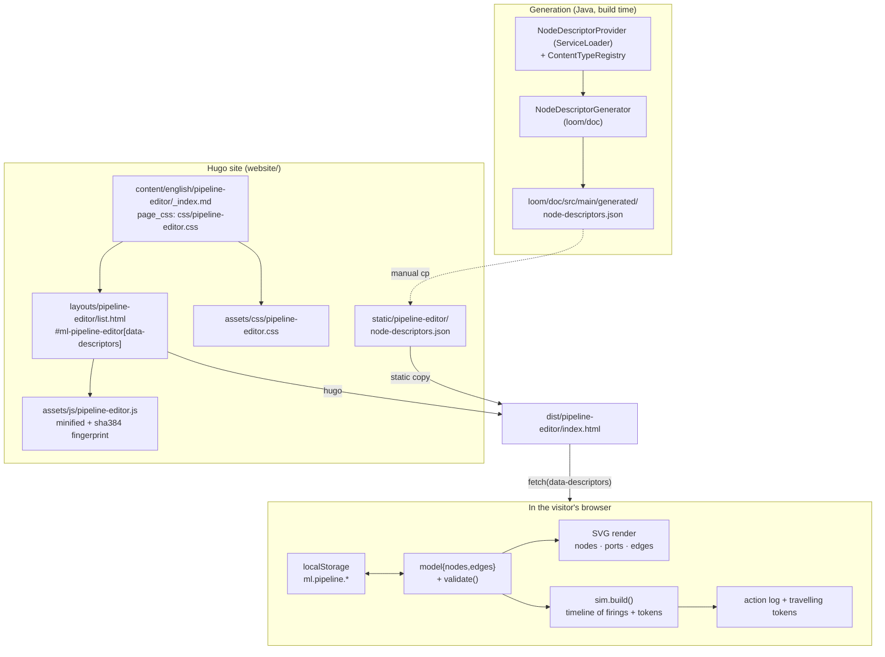

# The Website Pipeline Editor (`/pipeline-editor/`)

This document specifies the **self-contained, backend-free pipeline editor + simulator** published on
the customer-facing Hugo site at `https://metaloom.io/pipeline-editor/`. It is written for an AI
coding agent that has to change the editor, its styling, its node catalogue snapshot or the page
wiring around it.

The page is a *teaching device*, not a product surface: a visitor drags nodes from a palette onto an
SVG canvas, wires typed ports (invalid connections are rejected while dragging), loads a demo
pipeline, and presses **Play** to watch synthetic assets travel from the source node through the
graph to the sink, with one action-log row per node execution. It exists so that the pipeline model —
typed ports, `ONE`/`MANY` cardinality, `MANY` fan-out, the implicit gather on a `MANY` input, and
filter `PASS`/`REJECT` branch routing — can be *played with* without a Loom server, a database or a
login.

## Scope boundary — three specs, three subsystems

| Subsystem | Spec | Owns |
|---|---|---|
| **This page** (`website/`, vanilla JS, no backend) | **this file** | The `/pipeline-editor/` page, `pipeline-editor.js`, `pipeline-editor.css`, the staged descriptor snapshot and the simulator's semantics |
| The **product** editor (`loom-ui/`, React Flow, talks to Loom) | [../loom/ui/PIPELINE_EDITOR.md](../loom/ui/PIPELINE_EDITOR.md) | Canvas, CRUD, versions, run history, `POST /pipelines/:uuid/run` |
| The **type system and engine** | [../features/pipeline/NODE_DATA_TYPES.md](../features/pipeline/NODE_DATA_TYPES.md), [../features/pipeline/PIPELINE.md](../features/pipeline/PIPELINE.md) | `PortSpec`, `ContentTypeRegistry`, `PortGraphAnalyzer`, `ExecutionMode`, the real gather |
| The **site** it is published on (build, checks, publish flow) | [WEBSITE.md](WEBSITE.md) | Hugo build, `build.sh` checks, `check-links.mjs`, GitHub Pages publish |

[WEBSITE.md](WEBSITE.md) § *The Pipeline Editor page* is the short entry in the site catalogue and
links here; **do not duplicate the detail below into it**.

> **The code wins.** Where this file and the JS disagree, the JS is right — fix this file in the same
> change (per [../SPEC_RULES.md](../SPEC_RULES.md) and [../guidelines/CODING.md](../guidelines/CODING.md)).

## TL;DR

* One page, four artefacts: `content/english/pipeline-editor/_index.md`,
  `themes/meghna-hugo/layouts/pipeline-editor/list.html`,
  `themes/meghna-hugo/assets/js/pipeline-editor.js` (~1290 lines, one vanilla IIFE, zero
  dependencies), `themes/meghna-hugo/assets/css/pipeline-editor.css` (~318 lines, `.pe-*` only).
* The node catalogue is a **generated static snapshot**:
  `website/static/pipeline-editor/node-descriptors.json` — the same
  `{nodeDescriptors, contentTypes}` shape as `GET /api/v1/pipeline/node-descriptors`. Currently
  **41 node kinds** and **39 content types**. Regenerate with `loom/doc`'s `ExampleGenerator`
  (see [Regenerating the snapshot](#regenerating-the-snapshot)) — never hand-edit it.
* The demos are **verified against the staged snapshot** — every kind and port id they name
  resolves, with Play enabled and no design errors. Nothing automated checks this; re-verify after
  any descriptor rename. See [Demo pipelines](#demo-pipelines) for the two blockers this replaced.
* The simulator has **breakpoints**: a gutter dot halts the timeline at a node *after* it has run,
  with Step and Continue, result strips per output port, and a click-to-enlarge detail overlay —
  the same interaction model as the product's debug mode.
* The snapshot URL reaches the JS through a **`data-descriptors`** attribute whose value is a
  `relURL`. That attribute name is deliberately *not* one of the names `build.sh` and
  `check-links.mjs` grep, so the localhost check never trips on it — and, as a consequence, a broken
  snapshot path is **not** caught by the build either.
* Nothing in the page talks to a server. There are **no environment variables**; the tunables are the
  constants in the JS and the `data-descriptors` attribute (see
  [Configuration knobs](#configuration-knobs)).
* The **content-type assignability rule and the eight family colours are a verbatim mirror** of
  `loom-ui/src/features/pipeline/contentTypes.ts`. Only the *rule* is mirrored; the *vocabulary*
  (ids, labels, descriptions) always comes from the snapshot.
* Everything the simulator shows is **synthetic and seeded** — deterministic per graph, but not the
  engine's behaviour. The divergences are enumerated in
  [Where the simulator diverges from the engine](#where-the-simulator-diverges-from-the-engine); keep
  that list honest.

## Architecture



Two independent staleness risks, both manual: the snapshot must be regenerated when descriptors
change, and the **mirrored type rule** must be re-checked when
`loom-ui/src/features/pipeline/contentTypes.ts` changes.

## Key Classes Reference

The editor is one JS file, so the useful unit is the *function*. Everything below lives in
`website/themes/meghna-hugo/assets/js/pipeline-editor.js` unless stated otherwise.

| Symbol | Where | Purpose |
|---|---|---|
| `NodeDescriptorGenerator` | `io.metaloom.loom.doc.impl` (`loom/doc`) | Writes the `{nodeDescriptors, contentTypes}` snapshot from the `NodeDescriptorProvider` SPI + `ContentTypeRegistry` |
| `ExampleGenerator#main` | `io.metaloom.loom.doc` (`loom/doc`) | Runs all doc generators, including the one above |
| `NodeDescriptorGeneratorTest` | `io.metaloom.loom.doc` (`loom/doc`, test) | Guards kind coverage and the port-model field names the editor reads |
| `family` · `isWildcard` · `isAssignable` · `isProvisional` | JS, § *content-type engine (mirror)* | The mirrored lattice rule — three arms, never crossing families |
| `FAMILY_COLORS` · `ctColor` | JS, same section | Eight family colours (mirror of the TS map); port/edge colour |
| `CATEGORY_COLORS` · `CATEGORY_ORDER` | JS | Palette grouping/colour: `SOURCE · FILTER · ANALYSIS · TRANSFORM · OUTPUT` |
| `E()` · `H()` · `bez()` | JS, § *small helpers* | SVG element, HTML element, cubic-Bézier path — the `nodeviz.js` idioms |
| `hashStr` · `mulberry32` · `rand` · `randInt` | JS | Seeded PRNG: every synthetic value and filter verdict is a pure function of a seed string |
| `nodeGeom` · `portY` · `portPos` · `portSpec` | JS, § *geometry* | Node box size from port counts; port coordinates and specs |
| `addNode` · `removeNode` · `addEdge` · `edgesInto` · `edgesFrom` | JS, § *model mutation* | The whole model API |
| `toGraphJson` · `fromGraphJson` | JS, § *JSON round-trip* | Export/import; import returns a list of warnings instead of throwing |
| `validate()` | JS, § *validation* | Order-independent full-graph check → `[{severity, code, message, node?, edge?}]` |
| `detectCycle(extraEdge?)` · `topoOrder()` | JS | Kahn; `detectCycle` takes a hypothetical edge so a drag can be pre-rejected |
| `canConnect(srcId, srcPort, tgtId, tgtPort)` | JS | Single-edge legality while dragging → `{ok, reason?, provisional?}` |
| `commit()` | JS | Re-bind descriptors, re-validate, repaint the error panel, gate **Play**. Call after *every* structural change |
| `buildShell` · `buildPalette` · `renderAll` · `renderNodes` · `renderEdges` · `portGroup` | JS, § *rendering* | DOM/SVG construction |
| `sim` (`build` · `fire` · `emitTokens` · `play` · `pause` · `step` · `reset` · `loop` · `drawTokens`) | JS, § *simulation* | The discrete dataflow simulator and its animation loop |
| `synthValue(ct, group, portId, seq)` · `summarize` | JS, § *synthetic values* | Family-aware fake payloads and their log rendering |
| `doSave` · `loadSaved` · `doDownload` · `openJsonModal` | JS, § *persistence* | `localStorage` slots, JSON download, paste/file import modal |
| `DEMOS` · `loadDemo` | JS, § *demo pipelines* | The three shipped demos; `loadDemo(0)` runs on boot |
| `init` · `fail` | JS, § *bootstrap* | Fetch the snapshot, index it, build the shell; on any failure render one `.pe-fatal` line |

## Page wiring

### Content page

`website/content/english/pipeline-editor/_index.md` — front matter only, no body:

```yaml
---
title: "Pipeline Editor"
description: "Design MetaLoom processing pipelines in your browser and press Play to watch assets flow through the typed-port graph — no server required."
page_css: css/pipeline-editor.css
---
```

`page_css` is read by `themes/meghna-hugo/layouts/partials/head.html`, which resolves it as a Hugo
asset — so the editor CSS is loaded **only** on this page and can define `.pe-*` freely without
risking the rest of the site.

### Layout

`website/themes/meghna-hugo/layouts/pipeline-editor/list.html` — a full-screen custom layout, *not* a
docs page. It is a `{{ define "main" }}` block that renders the shared `navigation.html` partial, the
mount div, and the fingerprinted script:

```go-html-template
<main class="pe-page">
  <div id="ml-pipeline-editor"
       data-descriptors="{{ "pipeline-editor/node-descriptors.json" | relURL }}"></div>
</main>
{{ $pe := resources.Get "js/pipeline-editor.js" | minify | fingerprint "sha384" }}
<script src="{{ $pe.RelPermalink }}" integrity="{{ $pe.Data.Integrity }}" defer></script>
```

Hugo picks this layout because the content directory is a branch bundle (`_index.md`) whose section is
`pipeline-editor` → `layouts/pipeline-editor/list.html`.

### Navigation entry

`website/config.toml` carries a `[[Languages.en.menu.main]]` entry — `name = "Pipeline Editor"`,
`url = "pipeline-editor"`, `weight = 5` (between **Studio** and **Announcements**). The header partial
marks it `.is-active` by comparing `.RelPermalink`, as for every other menu entry.

### The mount contract

The script is a single IIFE that begins with:

```js
var root = document.getElementById("ml-pipeline-editor");
if (!root) { return; }
```

The bundle is loaded only by this layout, but the self-guard is kept deliberately — it matches the
`nodeviz.js`/`swagger.js` idiom and means the file stays safe if it is ever promoted to a global
`[[params.plugins.js]]` entry.

## The node-descriptor snapshot

`website/static/pipeline-editor/node-descriptors.json` (~114 KB) is served verbatim at
`/pipeline-editor/node-descriptors.json`. Shape:

```json
{
  "nodeDescriptors": [ { "kind": "facedetect", "name": "…", "category": "ANALYSIS",
                         "inputPorts": [ … ], "outputPorts": [ … ],
                         "inputGroups": [ … ], "outputGroups": [],
                         "parameters": [ … ], "events": [ … ], "icon": "…",
                         "dynamicPorts": false, "defaultMode": "…",
                         "defaultBlocking": false, "defaultConcurrency": 1 } ],
  "contentTypes":    [ { "id": "media/image", "family": "media", "label": "Image",
                         "description": "…", "wildcard": false } ]
}
```

Current content — **verified against the staged file at this revision**; regenerate the numbers when
they change:

| Aspect | Value |
|---|---|
| Node kinds | **41** — `SOURCE` 3, `FILTER` 8, `ANALYSIS` 20, `TRANSFORM` 6, `OUTPUT` 4 |
| Sources | `filesystem-source`, `s3-source`, `loom-fetch` |
| Filters | the eight `filter-*` kinds: `asset-attribute`, `blacklist`, `date`, `duplicate`, `mimetype`, `quality`, `size`, `threshold` |
| Transforms | `imagegen`, `script`, `thumbnail`, `tts`, `videogen`, `watermark` |
| Sinks (`OUTPUT`) | `s3-sink`, `hash-dedup`, `fingerprint-dedup`, `fingerprint-dedup-apply` |
| **Absent** | ⚠️ **no `loom` kind**, and there should not be one — writing a node's output back to Loom is a per-node `syncToLoom` flag, not a downstream node. A pipeline that persists therefore has no visible sink, which is correct but surprising; the demos end on their last real node. |
| Content types | **39** across **8 families**, each with a `<family>/*` wildcard: `media` 5, `text` 4, `detection` 4, `hash` 6, `scalar` 5, `struct` 8, `artifact` 5, `control` 2 |
| Port groups declared | three `XOR` `media_alt` input groups (`whisper`, `facedetect`, `captioning`); **every** `outputGroups` array is empty — no `EXCLUSIVE` output group exists yet |
| `dynamicPorts: true` | `llm`, `script`, `vlm` |

**Descriptor fields the editor reads:** `kind`, `name`, `description`, `category`, `inputPorts`,
`outputPorts`, `inputGroups`, `outputGroups`.
**Fields it ignores today:** `parameters`, `events`, `icon`, `dynamicPorts`, `defaultMode`,
`defaultBlocking`, `defaultConcurrency`.
**Port fields it reads:** `id`, `label`, `contentType`, `cardinality`, `required`, `group`,
`description`. A port also carries a redundant boolean `many`; the editor keys off
`cardinality === "MANY"` only — do not start reading `many`, the two must never disagree.

<a id="regenerating-the-snapshot"></a>
### Regenerating the snapshot

Regenerate **in the same change** as any node-descriptor or content-type edit:

```bash
mvn -q -pl loom/doc -am -DskipTests -Dmaven.javadoc.skip=true install
cd loom/doc && mvn -q exec:java -Dexec.mainClass=io.metaloom.loom.doc.ExampleGenerator
cp loom/doc/src/main/generated/node-descriptors.json \
   website/static/pipeline-editor/node-descriptors.json
```

* The working directory **must** be `loom/doc/` — `NodeDescriptorGenerator` writes to the relative
  `src/main/generated/`.
* `ExampleGenerator` also rewrites the OpenAPI, Loom-config and REST-model documents; only the
  node-descriptor file is staged for this page (the OpenAPI staging is described in
  [WEBSITE.md](WEBSITE.md)).
* `-Dmaven.javadoc.skip=true` is currently required: `loom/pipeline` has a pre-existing javadoc error
  that fails `javadoc:jar`. Unrelated to this page.
* Registry population is identical to `RESTModule.nodeDescriptorRegistry()` (every
  `NodeDescriptorProvider` found via `ServiceLoader`) and encoding goes through Vert.x `Json`, so
  field names match the live endpoint byte-for-byte. **A new node kind therefore needs its
  `NodeDescriptorProvider` registration in
  `loom-shared/node-model/src/main/resources/META-INF/services/io.metaloom.loom.nodes.spec.NodeDescriptorProvider`
  before it can appear here** — 26 providers are registered today, and a Cortex node without one
  is simply invisible to this page, to the palette and to the live endpoint.

`NodeDescriptorGeneratorTest` (in `loom/doc`) fails the build when the snapshot misses a kind the SPI
provides, and pins the port-model field names (`inputPorts`/`outputPorts`/`contentType`/`cardinality`,
and a source's output port being named `media`). The editor itself degrades gracefully on an unknown
kind or content type, so a temporarily stale snapshot never breaks the page — but it silently shrinks
the palette, which no check catches.

> ⚠️ **The guard only covers kinds the SPI *provides*.** A Cortex node with no
> `NodeDescriptorProvider` is not "missing" as far as the test is concerned — it never existed. Nor
> does it cover *ports*: a kind whose ports are resolved from configuration ships with an empty
> `outputPorts`, which is how `filter` sat in the palette unwireable, with a green build on both
> sides. Neither gap is visible to anything except opening the page.

## The type engine mirror

`isAssignable(actual, declared)` is a verbatim port of the TypeScript rule
([NODE_DATA_TYPES.md § 2.1](../features/pipeline/NODE_DATA_TYPES.md), § 10 for the mirror contract):

1. exact id match → assignable;
2. different families → never assignable;
3. same family and either side is a `<family>/*` wildcard → assignable.

`isProvisional(actual, declared)` is the narrower "a wildcard *actual* flowing into a concrete
*declared*" case — the editor renders such an edge dashed-teal (`.is-provisional`) and its candidate
port with `.is-candidate-prov`, because the concrete type is only known at run time.

`FAMILY_COLORS` (eight entries) is the one thing the page is allowed to own, because colour is a UI
decision. **Type ids, labels and descriptions must always come from the snapshot** —
`ctLabel(ct)` looks them up in `contentTypesById` and falls back to the raw id. Never hardcode a
content-type id or label in the JS.

> ⚠️ Nothing verifies the mirror. There is no shared fixture between `contentTypes.ts`,
> `ContentTypeLatticeTest` and this file — the three can drift and only a reviewer notices. If you
> change the lattice rule, change all three.

## UI anatomy

```
┌─ .pe-toolbar ─────────────────────────────────────────────────────────────────┐
│ Pipeline Editor │ [Demo pipelines…][Saved…][Save][Download][Open][Clear]      │
│                 │ Emit [single|multiple][n] │ [▶Play][⏸Pause][⤳Step][⟲Reset][speed] │
├─ .pe-palette ──┬─ .pe-canvas-wrap ────────────────────────────────────────────┤
│ Nodes          │ <svg class="pe-canvas">                                      │
│  SOURCE        │   <g .pe-viewport>  ← pan/zoom transform                     │
│  FILTER        │     .pe-layer-edges   ← hit path + visible path + branch chip │
│  ANALYSIS      │     .pe-layer-conn    ← the drag preview                     │
│  TRANSFORM     │     .pe-layer-nodes   ← node boxes + ports                   │
│  OUTPUT        │     .pe-layer-tokens  ← travelling simulation tokens          │
│                │ .pe-toast (transient reason)   .pe-hint (empty-canvas hint)   │
├─ .pe-bottom ───┴──────────────────────────────────────────────────────────────┤
│ Design errors (n)              │ Action log: time │ node │ description │ in │ out │
└───────────────────────────────────────────────────────────────────────────────┘
```

* **Palette** — one group per category in `CATEGORY_ORDER`, headed in the category colour; a group is
  omitted when the snapshot has no kind for it. **Click** (not drag) adds the node near the canvas
  centre, offset by `nodeCount % 3 * 24` px so repeated clicks don't stack.
* **Node box** — `NODE_W = 212`, header `HEAD_H = 30`, one `ROW_H = 24` row per port row
  (`rows = max(inputs, outputs, 1)`), `BODY_PAD = 10`. A left stripe carries the category colour; a
  hover-only `×` (`.pe-node-del`) deletes. `.is-selected`, `.is-error` (a validation error names this
  node), `.is-unknown` (kind absent from the snapshot; the title gets a ` (?)` suffix) and
  `.is-firing` (450 ms flash) are the state classes.
* **Port** — a square-ish handle coloured by content-type family, plus an 18×18 invisible
  `.pe-port-hit` target. A `MANY` port is drawn as a *stacked* pair of squares (`rx: 1`) with a
  ` ⋯` label suffix; a wildcard port is hollow (`fill: #1a1f26`, coloured stroke). Every port carries
  an SVG `<title>` reading `input|output · id · contentType · ONE|MANY[ · optional]` plus the port
  description — that tooltip is the page's only port documentation, so keep descriptor descriptions
  meaningful.
* **Edge** — a cubic Bézier in the *source* port's colour. Only the fat invisible `.pe-edge-hit` path
  takes pointer events. A non-`ANY` edge gets a `PASS`/`REJECT` chip at its midpoint.
* **Bottom panels** — the error list (click a row to select the offending node/edge) and the action
  log (auto-scrolled, one row per firing).
* **Responsive** — under 820 px the shell stops being viewport-height: palette on top (wrapping,
  `max-height: 150px`), canvas `60vh`, panels stacked.

### Interaction model

| Gesture | Effect |
|---|---|
| Drag from an **output** port | Start a connection. Every input port is classed `.is-candidate` / `.is-candidate-prov` / `.is-incompatible` **live**, from `canConnect` |
| Release on an input port | Connect, or show the refusal reason in a `.pe-toast` at the cursor |
| Drag a node | Move it; on release the position snaps to a `GRID = 15` lattice |
| Drag the background | Pan |
| Wheel | Zoom about the cursor, clamped to `0.4 … 2` |
| Click a node / edge | Select (mutually exclusive: `selection.nodeId` xor `selection.edgeId`) |
| `Delete` / `Backspace` | Delete the selection — ignored while focus is in an `INPUT`/`TEXTAREA`/`SELECT` |
| `Escape` | Cancel a connection drag, hide the toast, close the modal |
| **Double-click an edge** | Cycle `ANY → PASS → REJECT`. Refused with a toast unless the edge leaves a `FILTER` node — this is the only way to set branch routing |
| Click the node `×` | Delete the node and every edge touching it |

Pointer handling is `pointerdown` on the SVG plus `pointermove`/`pointerup` on `window`, so a drag
that leaves the canvas still terminates.

## Validation

`validate()` is a **full-graph, order-independent** recompute; `commit()` runs it after every
structural change, repaints `.pe-panel-errors`, and disables **Play** while any `severity: "error"`
remains. `sim.play()` re-checks and toasts *"Fix design errors before running"* as a backstop.

| `code` | Severity | Condition |
|---|---|---|
| `unknownKind` | error | Node kind is not in the snapshot |
| `noSource` | error | No node with `category === "SOURCE"` |
| `multipleSource` | error | More than one `SOURCE` node |
| `sourcePort` | **warn** | A source's outputs contain no port named `media` (the convention the simulator and `NodeDescriptorGeneratorTest` both rely on) |
| `dangling` | error | Edge references a node that is gone |
| `unknownPort` | error | Edge names a port the descriptor does not declare |
| `typeMismatch` | error | `!isAssignable(sourcePort.contentType, targetPort.contentType)` |
| `branch` | error | A `PASS`/`REJECT` edge does not leave a `FILTER` node |
| `cardinality` | error | A `ONE` input has more than one incoming edge |
| `requiredInput` | error | An ungrouped `required` input is unwired (sources exempt) |
| `xor` | error | A required `XOR` group has 0 wired members, or any `XOR` group has >1 |
| `exclusive` | error | An output group has more than one wired member |
| `cycle` | error | Kahn leaves residual nodes; the message names the cycle members |

Connect-time refusals (`canConnect`, toast text) are a separate, cheaper set: self-connection,
unknown port, duplicate edge, `ONE` input already wired, not assignable, and *"Connection would
create a cycle"* (via `detectCycle` with the hypothetical edge). An input that is *blocked* because an
`XOR` sibling is already wired is rendered `.is-blocked` by `groupBlocked()` — but `canConnect` does
**not** refuse it; the resulting graph is caught afterwards by the `xor` rule. Both behaviours are
intentional (the visitor sees *why* it was wrong rather than the drag silently doing nothing), and
both are noted in [Progress Assessment](#progress-assessment).

> Two known simplifications against
> [NODE_DATA_TYPES.md § 3.2](../features/pipeline/NODE_DATA_TYPES.md): input groups are only enforced
> for `mode === "XOR"` (any other mode is ignored), and *every* output group is treated as exclusive
> regardless of its `mode`. Neither is observable today — the snapshot declares only `XOR` input
> groups and no output groups at all.

## The simulator

`sim.build()` computes a whole discrete timeline up front — a list of **firings** (log rows, sorted by
time) and a list of **tokens** (per-edge animations) — and the animation loop then merely *replays*
it. There is no incremental scheduler, so `Step` and `Play` can share one clock and a `Reset`
rebuilds from scratch.

### The build

1. `topoOrder()` (Kahn) fixes the visit order.
2. The outer loop runs once per **asset group** `g` — `1` group in `single` mode, `model.sourceCount`
   (1…9) in `multiple` mode. A group is the simulator's stand-in for one asset/item; group `g` starts
   at `g * GROUP_STAGGER`.
3. A `SOURCE` node emits one synthetic value per output port and logs *"Emit asset n"*.
4. Every other node gathers, per input port, the elements produced by upstream nodes **in the same
   group**, skipping edges whose `PASS`/`REJECT` branch disagrees with the source filter's verdict. A
   node with no input at all for that group simply does not run — that is how a rejected branch stays
   dark.
5. **Fan-out is inferred**: if a `ONE`-cardinality input received more than one element, that port
   becomes the *driver* and the node fires once per element (`elemIdx`), each firing labelled
   `Node [k]`. The other inputs are passed whole when they are `MANY`, or truncated to their first
   element when they are `ONE`. A per-element firing *appends* its output element (with `seq = k`) to
   the node's aggregate output — which is exactly what makes the **implicit gather** work: a
   downstream `MANY` input receives all of them in one firing.
6. `emitTokens` creates one travelling token per output element per outgoing edge, staggered `0.12`
   ticks apart so a `MANY` output reads as a stream.

### Output-value rules (`sim.fire`)

* `MANY` output → 2…3 elements, except `facedetect` (1…4, so *"Detected n faces"* varies) and a
  `text/*` output on a node that received `detections` (one caption/description per detection).
* A `FILTER`'s `control/*` output → the group's verdict, `PASS` or `REJECT`.
* A `media/*` output → the **incoming** media value, unchanged, so an asset keeps its identity along
  the whole graph and the log stays readable.
* Anything else → `synthValue()`, which is family-aware: `hash/*` produces a truncated hex digest of
  the right length, `detection/*` a `{box, score}`, `text/transcript` a timestamped line,
  `struct/embedding` a `[…] (dim 512)`, `struct/color` a hex colour, and so on.
* `filterVerdict(nodeId, g) = rand("verdict:" + nodeId + ":" + g) > 0.28` — **~72 % pass**, seeded, so
  the same graph always tells the same story. Filter node *options* have no effect.

### Timing and playback

| Constant / control | Value | Meaning |
|---|---|---|
| `TRAVEL` | `1` tick | Time an element spends on an edge |
| `NODE_DELAY` | `0.18` tick | Processing delay before a node's firing |
| `GROUP_STAGGER` | `0.7` tick | Offset between asset groups |
| `MS_PER_TICK` | `850` ms | Wall-clock per tick at speed 1 |
| Speed slider | `0.3 … 3` | Divides `MS_PER_TICK` |
| `Emit` mode / count | `single` \| `multiple`, `1…9` | How many asset groups the source emits |

`Play` runs one `requestAnimationFrame` loop; `Pause` cancels it; `Step` jumps the clock to the next
event boundary (next firing, or next token arrival); `Reset` clears the clock, the log, the tokens and
the firing classes. `finish()` returns the state to `idle`, clears the token layer and re-enables
**Play**.

**Reduced motion** — under `prefers-reduced-motion: reduce`, `play()` jumps the clock straight to
`maxT`, flushes every log row and finishes: the visitor gets the complete result table with no
animation. This is a real path, not a decoration; keep it working.

`fmtTime` renders a firing's tick as `mm:ss.mmm` using `MS_PER_TICK`, which is why the log's
timestamps look like a real run.

### Debugging: halts, results, detail

The simulator mirrors the product's debugging affordances, in the same visual language, so the page
teaches an interaction a visitor will meet again in Loom itself.

- **Breakpoint gutter** (`.pe-bp`, `data-bp="<nodeId>"`) in each node's left margin, where a
  debugger's would be. Drawn for every node, faint until armed — an affordance that only appears
  once used cannot be discovered. Its pointer branch sits *before* the node-drag branch in
  `onPointerDown`, or arming one would select and drag the node.
- **`sim.hold(firing)`** is applied inside `flushFirings`, the single place a firing becomes
  visible, and *after* the firing is logged and its results painted. That ordering is the product's
  semantics: the node ran, what it produced is on screen, and only what comes next is withheld. The
  clock is wound back to the held firing so resuming does not skip work.
- A held node gets a **steady amber ring**, deliberately not a pulse: the firing flash means
  "working" and a held node is the opposite of working, so motion would say the wrong thing.
- **Continue** (`.pe-btn.is-held`) and the held chip appear only while something is held. `Step`
  releases the held firing and stops at the next event boundary — which, if the next node is also
  armed, is the next hold. Disarming the node that is holding releases it, so clearing a breakpoint
  can never strand the simulation.
- **Result strips** (`.pe-result-row`) render each firing's outputs under its node, one row per
  output port, and are remembered in `lastResults` so a drag or a selection change does not wipe
  them — `renderNodes()` rebuilds the whole layer.
- Clicking a row opens **`openResultDetail`**, an overlay whose tabs are chosen by *what the payload
  carries* rather than by its declared family, exactly as the product does: Table only for a real
  sequence, Preview for a media/artifact port, then Value, then **Raw, always present and always
  last**. `Escape` and a backdrop click close it.

Breakpoints survive `Reset`: they are how a visitor sets the run up *before* pressing Play.

<a id="where-the-simulator-diverges-from-the-engine"></a>
### Where the simulator diverges from the engine

The page teaches the *shape* of the model, not the engine. Keep this list accurate — it is the
honesty contract of the whole page.

| Real engine ([NODE_DATA_TYPES.md](../features/pipeline/NODE_DATA_TYPES.md), [PIPELINE.md](../features/pipeline/PIPELINE.md)) | This simulator |
|---|---|
| `PortGraphAnalyzer` computes effective multiplicity and `ExecutionMode` (`SINGLE`/`PER_ELEMENT`) statically, propagating in topological order | Fan-out is *observed* at run time: "a `ONE` input got >1 element" |
| `fanOutDriver` lineage rules: nested fan-out rejected, one origin lineage per zip | Neither restriction is validated |
| `Origin`-tagged `DataElement`s inside a `PortPayload` envelope | A plain `{value, seq, ct}` plus the group index as the item identity |
| `NodeExecState.isSettled()` is the gather barrier (`elementCount` from the driver) | The gather is implicit in how `build()` accumulates aggregate outputs |
| Filter verdicts come from node options over real data | Seeded pseudo-random, ~72 % pass |
| Nodes run in Cortex workers, results persist to Loom (`asset_node_result` ledger) | Nothing runs, nothing persists |
| `NodePortResolver` derives ports for `llm`/`script`/`vlm`/`filter` from their configuration | Only `filter`'s three **fixed** ports are mirrored (`withResolvedPorts`), because without them the node cannot be wired at all. Bucket ports and the `llm`/`script`/`vlm` resolvers are still not modelled |
| Node parameters drive behaviour | `parameters` are not even rendered |
| Retries, failures, skips, `NODE_*` events | Not modelled; every firing succeeds |
| A breakpoint holds a node's outputs from its **dependents** while other items keep flowing to their own halts | The whole timeline stops at the held firing. One clock, one halt — there is no per-item scheduler to hold selectively |
| Held state is per element, and `stepOne()` releases the oldest across the run | `Step` releases the one firing that is held |
| Previews are real bytes, encoded by the worker that produced the file | The Preview tab says so and shows the path. **No image is ever rendered** — the page has no worker and no files |
| Disabling segment fusion around a breakpoint costs a round trip per node | No segments exist here, so nothing changes |

## Persistence and JSON round-trip

`toGraphJson()` emits the same field names the product uses (`type`, `position`, `sourcePort`,
`targetPort`, `branch`), plus a page-only `meta` block for the source controls:

```json
{
  "meta":  { "sourceMode": "multiple", "sourceCount": 3 },
  "nodes": [ { "id": "src", "type": "filesystem-source", "label": "…", "description": "…",
               "position": { "x": 30, "y": 200 }, "options": { } } ],
  "edges": [ { "id": "e1", "source": "src", "sourcePort": "media",
               "target": "mime", "targetPort": "media", "branch": "ANY" } ]
}
```

`fromGraphJson(obj)` is deliberately **lenient**, because visitors paste hand-written JSON: it accepts
`type` or `kind`, `position` or bare `x`/`y` (auto-laying out on a 4-column grid when both are
missing), `options` or `config`, and *collects warnings* (unknown kind, edge referencing a missing
node) instead of aborting. Only a missing `nodes` array throws. It also advances `model.seq` past any
numeric id suffix so generated ids cannot collide with imported ones.

| Storage | Key | Content |
|---|---|---|
| `localStorage` | `ml.pipeline.index` | JSON array of saved pipeline names |
| `localStorage` | `ml.pipeline.saved.<name>` | One `toGraphJson()` document |

All `localStorage` access goes through `lsGet`/`lsSet`, which swallow exceptions — private-browsing
and storage-disabled visitors get a *"Could not save (storage unavailable)"* toast rather than a
broken page. `Download` builds a Blob URL and revokes it after a second; `Open` is a modal with a
textarea **and** a file picker, reporting parse errors inline (`.pe-modal-err`).

## Demo pipelines

`DEMOS` holds three graphs; `loadDemo(0)` runs at boot so the canvas is never empty.

| # | Name | Teaches | Terminal node |
|---|---|---|---|
| 0 | **Basic — hash & sync** | `filesystem-source → sha512`: one asset, two nodes, the `media/*` → `sha512.media` port binding | `sha512` |
| 1 | **Complex — faces (fan-out & gather)** | `filter.other` feeding two routes; `facedetect`'s `MANY detections` fanning out into `facedescription`'s gather; 3 asset groups | `facedescription`, `sha512` |
| 2 | **Use-case — transcribe & sentiment** | `whisper → sentiment` on the audio route, `md5` on the identity route; 3 asset groups | `sentiment`, `md5` |

> Every kind and port id a demo names must exist in the snapshot, or the demo loads with an
> `unknownKind` error and the page's first impression is a red error list. **Re-verify after any
> descriptor rename — nothing automated does.**

**✅ Fixed 2026-08-04.** All three demos previously booted into a red error list with **Play**
disabled, for two independent reasons. Both are worth recording, because both were invisible to
anything automated and both were the page's *first impression*.

1. **There is no `loom` node kind, and there never should be.** Writing a node's output back to
   Loom is a per-node flag (`syncToLoom`), not a downstream node — so the earlier suggestion to
   register a `LoomDescriptorProvider` would have invented a concept the engine does not have, and
   repointing at `s3-sink` would have taught a different pipeline than the one intended. The sink
   nodes and their edges are simply gone; a hash node is legitimately terminal.
2. **`filter` had no output ports at all.** Its ports are resolved from its configuration, so the
   served descriptor declares none, and the editor read `descriptor.outputPorts` directly. The demos
   wired `filter.media`, which has never existed — but nothing else could have been wired either,
   including a `filter` dragged in from the palette. `withResolvedPorts()` now mirrors
   `FilterPortResolver`'s three fixed ports (`other`, `passed`, `bucket`) for the unconfigured case,
   and the demos route media through `other`.

Verified in a headless browser against the built site: three demos, zero design errors, **Play**
enabled, and a full Play → halt → Step → Continue cycle on each with no page errors.

## Configuration knobs

There are **no environment variables** — the page is static and has no backend. The equivalent
configuration surface:

| Knob | Where | Default | Effect |
|---|---|---|---|
| `data-descriptors` | `layouts/pipeline-editor/list.html` | `relURL "pipeline-editor/node-descriptors.json"` | Where the catalogue is fetched from. Must stay site-relative |
| `page_css` | `content/english/pipeline-editor/_index.md` | `css/pipeline-editor.css` | Per-page stylesheet |
| Menu entry | `config.toml` `[[Languages.en.menu.main]]` | `weight = 5` | Nav position |
| `NODE_W` · `HEAD_H` · `ROW_H` · `BODY_PAD` · `GRID` | JS § geometry | `212 · 30 · 24 · 10 · 15` | Node box metrics, snap lattice |
| Zoom clamp | `onWheel` | `0.4 … 2` | Pan/zoom limits |
| `TRAVEL` · `NODE_DELAY` · `GROUP_STAGGER` · `MS_PER_TICK` | JS § simulation | `1 · 0.18 · 0.7 · 850` | Simulation tempo |
| Filter pass rate | `sim.filterVerdict` | `> 0.28` (~72 %) | How often a filter passes |
| `FAMILY_COLORS` · `CATEGORY_COLORS` | JS | 8 + 5 entries | Port/edge and palette colours |
| CSS custom properties | `.pe-page` in `pipeline-editor.css` | `--pe-bg #11151a`, `--pe-accent #57cbcc`, … | Theme surface, matching the site's dark palette |

## Test Setup

There is **no automated browser test for this page** (see
[Progress Assessment](#progress-assessment)). What exists, and the manual pass that stands in for it:

### 1. Java side — the snapshot guard

```bash
mvn -pl loom/doc test -Dtest=NodeDescriptorGeneratorTest
```

Fails when the snapshot would miss an SPI-provided kind or drops a port-model field the editor reads.
Run it after touching any `NodeDescriptorProvider`, `PortSpec` or `ContentTypeRegistry` entry.

### 2. Build the site and serve it

```bash
cd website
./build.sh          # theme CSS + hugo + localhost check + check-links.mjs
./watch.sh          # or: build + hugo server for live preview at /pipeline-editor/
```

Prerequisites are the site's: Hugo **extended ≥ 0.158**, Node, `asciidoctor`
(see [WEBSITE.md](WEBSITE.md) § Building). **The system `hugo` is 0.131 and cannot build the site** —
fetch an extended ≥ 0.158 binary into the scratchpad and invoke it explicitly.

Because `data-descriptors` is not among the attributes `build.sh` and `check-links.mjs` scan, **the
build cannot tell you the snapshot path is wrong**. Verify it by hand once per structural change:

```bash
test -f website/dist/pipeline-editor/node-descriptors.json && echo staged
grep -o 'data-descriptors="[^"]*"' website/dist/pipeline-editor/index.html
```

### 3. Manual acceptance pass (`/pipeline-editor/`)

1. **Boot** — demo 0 loads, palette shows all five category groups, *"✓ No design errors"*, **Play**
   enabled. The browser console must be silent. Repeat for demos 1 and 2.
2. **Type checking** — drag from `filesystem-source.media` and confirm `sha512.media` highlights as a
   candidate while, say, `sentiment.text` is marked incompatible; release on the incompatible port
   and read the toast.
2a. **Halting** — click a node's left-margin gutter dot, press **Play**, and confirm the run stops
   *after* that node has run: the node is amber-ringed, its outputs are listed under the card, and
   nothing downstream has produced anything. Click a result row for the enlarged view (`Escape`
   closes). **Step** releases one firing, **Continue** releases and runs on, and clicking the dot
   again while held both disarms and releases.
3. **Cardinality** — wire a second edge into a `ONE` input: refused at drag time. Wire
   `facedetect.detections` (MANY) into `facedescription.detections` and confirm it is accepted.
4. **XOR group** — wire `facedetect.image`, then confirm `facedetect.video` renders `.is-blocked`; wire
   it anyway and confirm the `xor` error appears and **Play** is disabled.
5. **Cycle** — attempt to close a loop; refused with *"Connection would create a cycle"*.
6. **Branch routing** — double-click an edge leaving `filter`: chip cycles
   `ANY → PASS → REJECT`. Double-click a non-filter edge: refusal toast.
7. **Simulate** — load demo 1, `Play`: tokens travel, nodes flash, the log fills, `facedetect` logs
   *"Detected n faces"* and `facedescription` logs *"Gathered n faces → descriptions"*; a `REJECT`
   group leaves its branch dark. `Pause` / `Step` / `Reset` behave. Speed slider changes tempo.
8. **Reduced motion** — with `prefers-reduced-motion: reduce` forced (DevTools → Rendering), `Play`
   fills the whole log instantly and no token is drawn.
9. **Round-trip** — `Download`, `Clear`, `Open` → paste the file → identical graph. `Save` under a
   name, reload the page, load it from the *Saved…* select.
10. **Degradation** — point `data-descriptors` at a missing path and confirm a single
    `.pe-fatal` line ("Pipeline editor could not load: …"), no thrown exception. Import a graph with a
    bogus `type` and confirm a `(?)` node, an `unknownKind` error and a warning toast.
11. **Responsive** — at ≤ 820 px the palette moves on top and the panels stack; no horizontal page
    scroll.
12. **Keyboard** — `Tab` reaches the toolbar controls; `Delete` removes the selection but not while
    typing in the *Save as* prompt or the JSON textarea; `Escape` cancels a drag and closes the modal.

### 4. When you change the mirrored type rule

Run the TypeScript side too, since the two must agree:

```bash
cd loom-ui && npx vitest run src/features/pipeline/contentTypes.test.ts
```

## Conventions and Gotchas

* **`commit()` after every structural change.** Adding/removing a node or edge, importing, loading a
  demo, cycling a branch — all must call `commit()` (re-bind descriptors → validate → repaint errors →
  gate Play) and then a render. Skipping it leaves a stale error panel and a wrongly enabled **Play**.
* **`data-descriptors` is a deliberate attribute name.** It is not in the `href|src|srcset|action|
  data-src|data-openapi-url|data-graphql-url|data-schema-url` set that `build.sh` and
  `check-links.mjs` scan. Renaming it to anything ending in `-url` would subject a `relURL` value to
  the localhost check for no benefit; renaming it to `data-src` would break the build. Leave it.
* **Cardinality is `cardinality === "MANY"`; there is no `"ONE"` token to test for.** Absence means
  one. (Same convention as `nodeviz`'s `c: "many"` — see [WEBSITE.md](WEBSITE.md) § Node diagrams.)
* **Only `.pe-edge-hit` receives pointer events.** The visible edge, the branch chip and the tokens
  are `pointer-events: none`. If a new decoration swallows clicks, edges become unselectable.
* **Tokens are positioned via `getPointAtLength` on the rendered edge path**, looked up by
  `data-edge`. Any re-render of the edge layer during playback is fine (the lookup is by id), but a
  *removed* edge silently stops its tokens — do not "optimise" the token loop into caching path
  elements.
* **Never hardcode a content-type id or label.** Ids come from the snapshot; only `FAMILY_COLORS` is
  owned here.
* **A source's output port must be called `media`.** The simulator picks it by name (falling back to
  the first output), `validate()` warns when it is missing, and `NodeDescriptorGeneratorTest` pins it.
* **The page is *not* a docs page.** It has its own layout and no docs chrome, TOC or AsciiDoc. Do not
  move it under `content/english/docs/` — and do not add a second copy of the editor to a docs page;
  link to `/pipeline-editor/` instead.
* **Keep the `nodeviz.js` idioms.** `E()`/`H()` builders, `bez()`, one `requestAnimationFrame` loop,
  `prefers-reduced-motion` respected, a self-guard on the mount element, zero dependencies. A reader
  who knows one file should recognise the other.
* **`syncSourceControls()` finds the mode select by inspecting `options[0].value === "single"`**, not
  by a stored reference. Adding another select to the toolbar whose first option value is `single`
  would hijack it — cache the element instead if you touch this.
* **The `many` boolean on a port is redundant.** Read `cardinality` only.
* **`icon`, `parameters` and `events` are present in the snapshot but unrendered.** Do not delete them
  from the generator to "save bytes" — the snapshot's contract is *the endpoint's shape*.
* **Regenerating the snapshot is two commands plus a copy, and nothing does it for you.** The same
  staleness trap as the OpenAPI and GraphQL documents
  ([WEBSITE.md](WEBSITE.md) § Staged generated artefacts).
* **A Cortex node without a `NodeDescriptorProvider` does not exist here.** The palette, the
  validator, `GET /api/v1/pipeline/node-descriptors` and `NodeDescriptorGeneratorTest` all key off
  the SPI, not off `cortex/nodes/`. Before naming a kind in a demo or in docs prose, confirm it is
  in the service file.
* Simulator output is **seeded**, not random: `hashStr` + `mulberry32` over a seed string. Do not
  introduce `Math.random()` — it would make screenshots and bug reports irreproducible.

## Where do I find …?

| Concept | Path |
|---|---|
| Page front matter | `website/content/english/pipeline-editor/_index.md` |
| Page layout / mount div | `website/themes/meghna-hugo/layouts/pipeline-editor/list.html` |
| The editor + simulator | `website/themes/meghna-hugo/assets/js/pipeline-editor.js` |
| Styling (`.pe-*`, CSS vars, responsive) | `website/themes/meghna-hugo/assets/css/pipeline-editor.css` |
| `page_css` handling | `website/themes/meghna-hugo/layouts/partials/head.html` |
| Nav entry | `website/config.toml` → `[[Languages.en.menu.main]]` (`url = "pipeline-editor"`) |
| Staged node catalogue | `website/static/pipeline-editor/node-descriptors.json` |
| Snapshot generator | `loom/doc/src/main/java/io/metaloom/loom/doc/impl/NodeDescriptorGenerator.java` |
| Generator driver | `loom/doc/src/main/java/io/metaloom/loom/doc/ExampleGenerator.java` |
| Snapshot guard test | `loom/doc/src/test/java/io/metaloom/loom/doc/NodeDescriptorGeneratorTest.java` |
| The live endpoint it mirrors | `GET /api/v1/pipeline/node-descriptors` — [../loom/RESTAPI.md](../loom/RESTAPI.md) |
| The mirrored type rule (source of truth) | `loom-ui/src/features/pipeline/contentTypes.ts` (+ `contentTypes.test.ts`) |
| Descriptor SPI registration | `loom-shared/node-model/src/main/resources/META-INF/services/io.metaloom.loom.nodes.spec.NodeDescriptorProvider` |
| Site build + the two dist checks | `website/build.sh`, `website/check-links.mjs` |
| The product editor (React Flow) | `loom-ui/src/features/pipeline/PipelineEditor.tsx` — [../loom/ui/PIPELINE_EDITOR.md](../loom/ui/PIPELINE_EDITOR.md) |
| Node diagram renderer on docs pages (`nodeviz`) | `website/themes/meghna-hugo/static/plugins/nodeviz/nodeviz.js` — [WEBSITE.md](WEBSITE.md) |

<a id="progress-assessment"></a>
## Progress Assessment

The page is **built and shipping**. Everything unchecked below is a known gap, not a regression —
and the demo blockers recorded below are now closed.

### Demos — fixed 2026-08-04

- [x] The `type: "loom"` sinks are gone. There is no `loom` node kind and there should not be one:
      writing back to Loom is a per-node `syncToLoom` flag, so a hash node is legitimately terminal
- [x] `filter` had **no output ports at all** — they are resolved from configuration, so the served
      descriptor declares none. `withResolvedPorts()` mirrors `FilterPortResolver`'s three fixed
      ports, which also makes a `filter` dragged from the palette wireable for the first time
- [ ] Still nothing automated would catch a recurrence: `NodeDescriptorGeneratorTest` only checks
      SPI-provided kinds, and no test loads the demos. A cheap guard is a `loom/doc` (or Node)
      assertion that every `type` and port id named in `DEMOS` resolves against the staged snapshot

### Page and wiring

- [x] Content page, custom full-screen layout, nav entry, per-page `page_css`
- [x] Mount div with a site-relative `data-descriptors`; script minified + `sha384` fingerprint + `defer`
- [x] Self-guard on the mount element; single `.pe-fatal` line on any load failure
- [ ] The staged snapshot path is not covered by `check-links.mjs` (attribute is not `data-*-url`) — a
      broken path ships silently. Either teach the checker `data-descriptors`, or add a `build.sh`
      assertion that `dist/pipeline-editor/node-descriptors.json` exists

### Node catalogue

- [x] `NodeDescriptorGenerator` writes the endpoint-shaped snapshot; `ExampleGenerator` drives it
- [x] `NodeDescriptorGeneratorTest` pins kind coverage and the port-model field names
- [x] 34 kinds / 39 content types (8 families) staged; graceful degradation on an unknown kind or type
- [x] ~~The Loom write-back sink has no descriptor provider~~ — not a gap: persisting to Loom is a
      per-node `syncToLoom` flag, so there is no sink kind to register. The only `OUTPUT` kinds are
      `s3-sink` and the three dedup nodes, and that is correct
- [ ] Staging is a manual `cp` — the snapshot can go stale against `loom/doc`'s generated copy with
      nothing failing. A `build.sh` freshness check (or a Maven step that copies it) would close this
- [x] `filter`'s three fixed output ports are mirrored (`withResolvedPorts`) — without them the kind
      could not be wired to anything
- [ ] The other `dynamicPorts` kinds (`llm`, `script`, `vlm`) still show only their static ports, as
      do a filter's per-bucket ports; the `NodePortResolver` mirrors already exist in
      `loom-ui/src/features/pipeline/portResolvers.ts` and could be ported
- [ ] `parameters` are ignored — there is no node inspector, so `options` only survive a JSON
      round-trip and never influence the simulation

### Editing

- [x] Palette by category, click-to-add, node drag with grid snap, pan, zoom, selection, delete
- [x] Typed connection dragging with live candidate/incompatible/provisional highlighting
- [x] Branch routing on filter edges via double-click; `PASS`/`REJECT` chips
- [x] Full-graph validation (13 codes) with a clickable error panel gating **Play**
- [x] JSON download / paste / file import with lenient parsing and warnings; `localStorage` slots
- [ ] Input port groups are enforced for `XOR` only; output groups are treated as exclusive regardless
      of `mode`. Harmless today (no other mode is declared) — revisit if `EXCLUSIVE` is ever used
- [ ] No undo/redo, no multi-select, no rubber-band selection, no node rename
- [ ] `canConnect` allows wiring an `.is-blocked` XOR sibling and lets `validate()` complain
      afterwards. Deliberate, but worth revisiting if visitors read it as a bug
- [ ] No keyboard-only way to create an edge (ports are not focusable here, unlike `nodeviz`'s ports)

### Simulation

- [x] Pre-computed timeline; `Play` / `Pause` / `Step` / `Reset` / speed; per-firing node flash
- [x] Multi-asset groups (1…9), topological order, inferred fan-out, implicit gather, branch pruning
- [x] Seeded synthetic values per content-type family; media pass-through keeps asset identity
- [x] Action log with time / node / description / input / output; `prefers-reduced-motion` short-circuit
- [ ] No failure, skip, retry or `NODE_*` event modelling — every firing succeeds
- [ ] `PortGraphAnalyzer`'s v1 restrictions (no nested fan-out; one origin lineage per zip) are not
      validated, so a graph the real engine rejects can still be simulated here
- [ ] Filter verdicts are pseudo-random rather than derived from node options

### Testing and docs

- [x] Manual acceptance pass documented above; Java-side snapshot guard in CI
- [ ] **No automated test for the page.** The cheapest fix is a Playwright spec (the browsers are
      already installed under `loom-ui/`) against `hugo server`: boot demo 0, assert no design errors,
      attempt an incompatible connection and assert the toast, `Play` under reduced motion and assert
      the log row count
- [ ] No unit tests for the pure logic (`isAssignable`, `validate`, `topoOrder`, `fromGraphJson`) — the
      IIFE exports nothing, so extracting a testable core is a prerequisite
- [ ] No customer-facing docs page links to `/pipeline-editor/` yet; `docs/pipeline/` and
      `docs/nodes/_index.adoc` are the natural places to send a reader who wants to *try* the model
- [ ] The mirror against `contentTypes.ts` is reviewer-enforced only (no shared fixture) — the same
      gap [NODE_DATA_TYPES.md § 10](../features/pipeline/NODE_DATA_TYPES.md) records for the UI mirror

---

_Git HEAD revision: `827cd2cb`_
_Last updated: 2026-08-04 (Fixed both demo blockers — the non-existent `loom` sink and `filter`'s missing output ports — and added the debugging affordances: breakpoint gutter, hold, Step/Continue, result strips and the detail overlay)_
