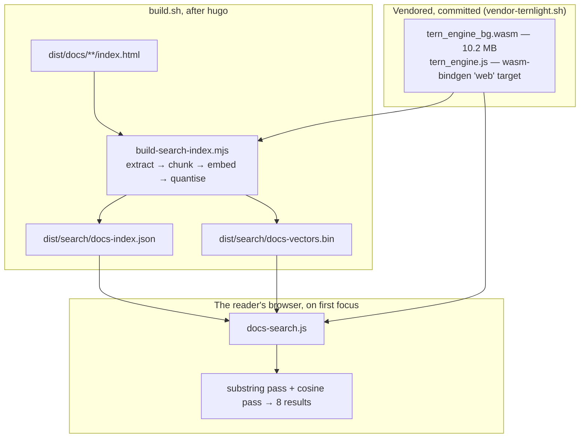

# Documentation Search (`/docs/**`)

This document specifies the **client-side semantic search** over the customer documentation on the
Hugo site at `https://metaloom.io/docs/`. It is written for an AI coding agent that has to change
the index, the ranking, the model or the page wiring.

There is no server. The site is static files on GitHub Pages, so search either runs in the reader's
browser or does not exist. A build step embeds every documentation page with a 7 MB embedding model
that the browser downloads on first use and runs on the CPU; nothing about a search leaves the
reader's machine.

## Scope boundary

| Subsystem | Spec | Owns |
|---|---|---|
| **This feature** | **this file** | The index format, the chunker, the two ranking passes, the box, the model vendoring |
| The **site** it is published on | [WEBSITE.md](WEBSITE.md) | Hugo build, `build.sh` gates, `check-links.mjs`, the docs layouts, the publish flow |
| The **content** being searched | [WEBSITE.md](WEBSITE.md) § *Page inventory* | What pages exist and what they say |

[WEBSITE.md](WEBSITE.md) carries the short catalogue entry and links here; **do not duplicate the
detail below into it**.

> **The code wins.** Where this file and the code disagree, the code is right — fix this file in the
> same change (per [../guidelines/SPEC_RULES.md](../guidelines/SPEC_RULES.md) and
> [../guidelines/CODING.md](../guidelines/CODING.md)).

## TL;DR

* Model: **`@ternlight/base`**, a 1.58-bit BitNet-style distillation of `all-MiniLM-L6-v2`.
  10.2 MB of wasm (**7.2 MB gzipped**), 384-dim L2-normalised output, **128-token input window**,
  MIT. Vendored into `website/themes/meghna-hugo/static/plugins/ternlight/` by
  `website/vendor-ternlight.sh` and **committed**.
* `website/build-search-index.mjs` runs from `build.sh` after `hugo`, reads the **built HTML** under
  `dist/docs/`, and writes `dist/search/docs-index.json` (~364 KB, ~118 KB gzipped) plus
  `dist/search/docs-vectors.bin` (~514 KB int8). Currently **86 pages → 1371 chunks**. ~6 s.
* `themes/meghna-hugo/assets/js/docs-search.js` runs **two passes over one index**: a substring pass
  that answers instantly from the metadata, and a cosine pass against the embeddings once the model
  has arrived. Neither is a fallback for the other — they are good at opposite things.
* The box lives in the **site header**, right of the *Docs* menu entry, so it is on every page —
  but the index covers `/docs/**` only, which the placeholder says out loud. **Nothing is fetched
  until the reader focuses it**: a non-docs reader pays for the ~5 KB script and nothing else.
* Four `data-*-url` attributes carry the asset URLs and are checked by **both** build gates.

## Architecture



## One model file, two hosts

`@ternlight/base` ships three wasm-pack targets. **All three `.wasm` files are byte-identical**, and
`pkg-web/tern_engine.js` is self-contained — it has **no import statements at all** (the
wasm-bindgen import object is built inline) and exposes both `initSync(bytes)` and a default
`init({module_or_path})`. That is what makes a single vendored pair serve both sides:

| Host | Loads it as | Why |
|---|---|---|
| `build-search-index.mjs` (Node) | `initSync({ module: readFileSync(wasm) })` | Sync compile of a 10 MB module is fine outside a browser |
| `docs-search.js` (browser) | `import(...)` then `default({ module_or_path: url })` | Streaming compile while it downloads |

> **Never switch to `pkg-bundler/`.** Its glue does `import * as wasm from './tern_engine_bg.wasm'`,
> which requires a bundler. The theme's only Node tooling is `lessc` + `postcss`; there is no JS
> bundler on this site and adding one for a single file is not worth it. `vendor-ternlight.sh`
> asserts both facts — identical checksums, no imports — and refuses to vendor if either breaks.

**The wasm is committed** (10.2 MB). It is a *build input*: `build-search-index.mjs` cannot run
without it, and fetching it at build time would put the first network call into `build.sh`. Git
stores one blob for an unchanged file, so re-publishing does not re-add it.

Bumping the model is `./vendor-ternlight.sh [version]` followed by `./build.sh`. **The index must be
rebuilt in the same change** — embeddings from two model builds are not "less accurate", they are
points in different spaces. `VERSION` records the package version, the wasm sha256 and the engine's
own `config_summary()` string, and `build-search-index.mjs` refuses to run if the recorded checksum
does not match the file.

## The index

### Why the built HTML, not the AsciiDoc

1. **Heading anchors only exist after Asciidoctor has run.** Pages mix explicit `[#node-graph]`
   attributes with generated `_snake_case` ids. Reading the output means a reworded heading
   regenerates its id *and* its index entry together, so a deep link can never go stale.
2. **The chrome is a layout concern.** One selector — `.post-single-content` — excludes the nav, the
   footer, the topic rail and the `.docs-foot` button pair. Against the source, all of that would
   have to be re-implemented.

Skipped: `/docs/rest/`, `/docs/test/`, `/docs/configuration/` (the same legacy stubs
`partials/docs-topics.html` leaves out of the rail) and `/docs/examples/` (staged OpenAPI/GraphQL
artefacts, not prose). `<pre>` blocks are dropped from the embedded text — a 120-token budget spent
on a YAML sample buys nothing, and identifiers are the substring pass's job. Inline `<code>` stays.

### Chunking against a 128-token window

**This is the dominant design constraint.** Ternlight reads 128 WordPiece tokens and silently drops
the rest, so a chunk that overruns loses its tail without any error.

* Sections come from `div.sect1`/`div.sect2`, whose `h2`/`h3` carries both the boundary and the
  anchor. Text before the first heading is the page-top chunk, with no anchor.
* Every embedded string is prefixed with **`"<page title> — <section heading>: "`**, *inside* the
  budget rather than on top of it. A chunk deep inside a page is a paragraph about nothing until it
  says where it came from.
* Sentences are packed greedily to the budget with **one sentence of overlap**, so a statement split
  across a boundary still has one side that reads whole.
* **Fit is measured with the model's own tokenizer, not a word count.** This corpus is full of
  identifiers that WordPiece shatters into five or six tokens each; a "~95 words" rule of thumb
  overruns on exactly the pages that matter most.
* Per-sentence token costs are **additive across a whitespace join** (WordPiece pre-tokenises on
  whitespace), which is what turns the packer from O(n²) re-tokenisation into arithmetic. A gate
  re-measures the final string and fails the build if that ever stops holding.

`tokenize()` always returns a 128-slot array **padded with zeroes** — the real length is the count of
non-zero ids, and it saturates at 128. Nothing may be measured that could reach the cap, which is why
`sentencesOf()` hard-splits at 20 words.

### On-disk format

| File | Shape |
|---|---|
| `dist/search/docs-index.json` | `{ model: {package, sha256, engine}, dims: 384, scale, count, pages: [{u, t, e, c}], chunks: [[pageIdx, anchor, heading, snippet], …] }` |
| `dist/search/docs-vectors.bin` | `count × 384` **int8**, contiguous, row-major |

* `chunks` rows are **positional arrays, not objects** — 1371 copies of four JSON keys is ~40 KB of
  nothing.
* `pages[].c` is every distinct identifier the page shows in `<code>`, collected from the **whole**
  page including the `<pre>` blocks the prose extractor throws away. This is the raw material for
  the substring pass.
* **`scale` is the corpus maximum, not 127.** The vectors are unit-normalised over 384 dimensions,
  so components sit around 0.05 and peak near 0.27 — quantising against 127 would throw away most of
  the int8 range. One global factor (currently ~476), so the client dot-products straight out of the
  blob and divides once. Round-trip cosine to the float original is >0.999.
* `model.sha256` versions the wasm URL client-side (`?v=<first 12>`). The filename is stable, so
  without it a reader who searched before a model bump would keep a cached engine from a **different
  embedding space**. This makes that cache entry unreachable rather than wrong.

## Ranking: two passes, one index

Both run on every keystroke once their inputs are up. They are good at opposite things and neither
is a degraded version of the other.

**Substring pass** — page titles, URLs, section headings, snippets and the `<code>` identifiers.
Answers from the ~118 KB JSON alone, so it is live long before the model.

| Score | Match |
|---|---|
| 10 | query **is** the page title |
| 9 | query **is** one of the page's identifiers, **and is identifier-shaped** |
| 8 | page title starts with the query |
| 7 | page title contains the query |
| 6 | a section heading contains the query |
| 5 | the URL contains it, or an exact `<code>` match that is *not* identifier-shaped |
| 4 / 3 | an identifier starts with / contains the query |
| 2 | a snippet contains the query |

> **The identifier-shape test is load-bearing.** `identifierLike = /[-_./]/ || /\d/`. Before it
> existed, an exact `<code>` match scored 9 unconditionally, and the queries `kubernetes`, `docker`
> and `whisper` all returned pages that merely *paste a command* above the page **titled** after the
> word. `fingerprint-dedup-apply` in a code block means the page is about it; `kubernetes` in a code
> block means somebody pasted `kubectl`.

**Cosine pass** — `embed(query)` dotted against the int8 blob, 1371 × 384 multiply-accumulates, well
under a frame. The cutoff is **relative** — `max(0.22, topScore × 0.55)` — because what counts as a
good score depends on how well the corpus answers the question at all; a fixed cutoff either buries
real answers to hard questions or pads easy ones with noise.

**Merge.** Strong substring hits (score ≥ 6) first, then cosine, then weak substring hits;
deduplicated by `(page, anchor)`, at most **2 chunks per page**, at most **8 results**. The per-page
cap matters — chunk overlap means one page can otherwise fill the panel with four views of itself.

## The box

`partials/docs-search.html` (variant `nav`), rendered once from `partials/navigation.html` at the end
of the menu — **right of *Docs***. `docs-search.js` binds every `[data-docs-search]` root, so extra
placements would work, but there is exactly one today. The script itself is loaded site-wide from
`partials/footer.html`.

**It is site chrome, not a docs control.** A reader on the home page or a blog post can reach the
reference without navigating into it first, and search from `/blog/` links straight into `/docs/`.
The index is still `/docs/**` only; the placeholder — *"Search the docs…"* — is what keeps that
honest.

* **The results panel hangs off `<body>`**, positioned against the input's rect, right edges flush.
  The header is `sticky-top` with its own stacking context and a `backdrop-filter`; a panel inside
  it would inherit both and be clipped by the navbar's box. Because the header is sticky, the anchor
  does not move as the page scrolls.
* **The header had no room to spare.** Between 992 px and 1199 px the menu is expanded but the
  container is not yet wide enough for seven links, a logo *and* a field: the box ran off the right
  edge and the whole document scrolled sideways — the defect [WEBSITE.md](WEBSITE.md) § *Test Setup*
  checks for. A `@media (min-width: 992px) and (max-width: 1199px)` block halves the link gutter and
  narrows the box to 160 px. **Re-measure `scrollWidth` at 992/1024/1200 after any nav change.**
* **The box is a fixed width, deliberately.** The menu beside it is pushed right by `ml-auto`, so a
  field that grew on focus would drag every nav link sideways with it.
* Below 992 px it sits inside the collapsed hamburger panel, full width, **after** the links — the
  same position relative to *Docs* that it has on the desktop bar. No `order` is used: the collapsed
  panel is `display: block`, so it follows DOM order regardless.
* **Nothing loads until focus.** The model is 7 MB and most visitors never search.
* **The box is hidden until JavaScript proves it works.** `docs-search-bootstrap.html` adds
  `docs-search-js` to `<html>` synchronously during parse and removes it again after 2.5 s if
  `window.__docsSearchReady` was never set — the mirror image of `reveal-bootstrap.html`. There is no
  server to submit to, so a box the script cannot drive is a control that collects and does nothing.
* A11y: `role="combobox"` + `aria-expanded` + `aria-controls` + `aria-activedescendant`, panel as
  `role="listbox"`, rows as `role="option"`, `aria-live` status line, arrows/Enter/Escape, and `/` to
  focus **a box that is actually on screen** — it skips any whose `offsetParent` is null, which is
  what the collapsed hamburger panel makes it below 992 px.
* Highlighting is **per word, not per query** — a semantic hit is precisely the case where the whole
  phrase does not appear. Built from DOM nodes, never from markup.
* Deep links land correctly because headings already carry `scroll-margin-top: 96px`.

## Build wiring and gates

`build.sh` runs the index builder **after `hugo` and before the link check**, so the checker can
verify the URLs the box will fetch.

Four new attributes — `data-search-index-url`, `data-search-vectors-url`, `data-search-model-url`,
`data-search-wasm-url` — ride on the `<script>` tag in `docs-search-script.html` (once per page,
unlike the box). **Both gates enumerate the attributes they check and both were taught these four**:
`LINK_PATTERN` in `build.sh` and `attrPattern` in `check-links.mjs`. A renamed index or a moved model
then fails the build instead of 404-ing for a reader.

`build-search-index.mjs` exits 1 when:

| Gate | Catches |
|---|---|
| vendored wasm missing, or sha256 ≠ `VERSION` | a half-done model bump |
| fewer than 50 pages indexed | an incomplete build, or the extractor losing the docs layout |
| a page has the docs header but **no `.post-single-content`** | the wrapper class was renamed — pages would otherwise fall out of search silently |
| a page produced **zero chunks** | a page with no indexable prose |
| any chunk **overran** the 128-token window | the additivity assumption in the packer broke |

## Where do I find …?

| I want to … | Look at |
|---|---|
| Change what text is indexed | `toText()` / `sectionsOf()` in `website/build-search-index.mjs` |
| Change chunk size or overlap | `chunkSection()` / `sentencesOf()`, same file |
| Change the index format | the `index` object at the bottom of `main()`, and the reader in `docs-search.js` |
| Change ranking | `substringPass()` / `semanticPass()` / `results()` in `themes/meghna-hugo/assets/js/docs-search.js` |
| Move or restyle the box | `partials/docs-search.html`, the *Documentation search* block in `less/includes/custom.less` |
| Change where the box appears | `partials/navigation.html` (the box) and `partials/footer.html` (the script) |
| Change the placeholder or label | `website/i18n/en.yaml` (`searchDocsLabel`, `searchDocsPlaceholder`) |
| Bump or re-vendor the model | `./vendor-ternlight.sh [version]`, then `./build.sh` |
| Find out why a page is missing from search | run `node build-search-index.mjs dist` — the gates name the page |

## Conventions and Gotchas

* **`tokenize()` saturates.** It returns a fixed 128-slot padded array, so any measurement of a
  string that could reach the cap is wrong. Keep hard-splits well under it.
* **Never re-embed at query time what was embedded at build time.** The prefix
  (`"<title> — <heading>: "`) is part of the indexed string; a query is embedded bare. That
  asymmetry is intentional and matches how the model was trained to be used.
* **`initSync` and `init` both warn on positional arguments.** Pass the object form
  (`{ module: … }` / `{ module_or_path: … }`) or every reader gets a console warning.
* **The `/` hint badge is hidden on the `narrow` variant** — it only renders below the lg
  breakpoint, where there is most likely no keyboard to press it on.
* **Do not add the search script to `[[params.plugins.js]]`.** Those are plain `<script src>` tags;
  this one needs Hugo Pipes for its fingerprint and integrity hash and carries the four
  `data-*-url` attributes. `partials/footer.html` is where it belongs.
* **The theme's `package.json` declares no module type**, so the vendored glue ships upstream's
  one-line `{"type":"module"}` beside it. Without that file Node reparses the glue on every build
  and prints `MODULE_TYPELESS_PACKAGE_JSON`.
* **Embedding is the slow part, not tokenising.** A ~120-token forward pass is ~27 ms, so the step
  is fanned out over `min(8, cores − 2)` worker threads — 38 s down to 6 s. `hugo` itself takes
  0.7 s, so an unparallelised index step would dominate the whole build.
* **`main()` is dispatched at the end of the file**, not beside the worker branch at the top: it
  reads consts declared throughout, and calling it mid-module hits their temporal dead zone.

## Test Setup

There is no automated suite for the website; verification is **build + gates + driving a browser**,
as in [WEBSITE.md](WEBSITE.md) § *Test Setup*.

```bash
cd website
./build.sh                                  # ends "All done"; index line precedes the link check
python3 -m http.server 8099 --directory dist &
```

Then drive it with the Playwright/Chromium already installed under `loom-ui/`:

1. **Nothing before focus.** Load `/docs/nodes/dedup/`; no request matches `search/docs-` or
   `ternlight`. Load `/`, `/blog/`, `/tour/`; zero boxes, zero requests.
2. **Substring before the model.** Type `fingerprint-dedup-apply` — results appear immediately and
   the status line says the semantic model is still loading.
3. **Semantic once ready.** `get rid of duplicate photos` → `/docs/nodes/dedup/`, where no word of
   the query appears on the page.
4. **Ranking battery.** `kubernetes`, `docker`, `whisper` must each return the page *titled* after
   the word first — those three are the regression the identifier-shape test exists for.
5. **Keyboard.** ArrowDown sets `aria-activedescendant`; Enter lands on the section anchor with
   `scroll-margin-top: 96px` honoured. `/` focuses without typing a slash.
6. **Layout.** The box is present on `/`, `/blog/`, `/tour/` and `/docs/` alike, and searching from
   `/blog/` links into `/docs/`. **`document.documentElement.scrollWidth` must not exceed the
   viewport at 992, 1024, 1200, 1280, 1440 and 1600** — the header is the tight one, not the page.
   At 420 px the box is reachable only after opening the hamburger.
7. **Degradation, all four:** block the wasm (substring results survive, status says why); block the
   index (honest failure message); block the script (the box removes itself after 2.5 s, rail
   intact); disable JavaScript (no box, rail and content unaffected).
8. **Gates.** Rename `dist/search/docs-index.json` → `check-links.mjs` fails on
   `data-search-index-url`. Rename `post-single-content` in one built page → the builder names it.

## Progress Assessment

- [x] Model vendored from `pkg-web` with `vendor-ternlight.sh`; identical-checksum and import-free
      assertions; `VERSION` stamp
- [x] `build-search-index.mjs`: extraction, token-exact chunking, worker-parallel embedding, int8
      quantisation against the corpus maximum, five build gates
- [x] `docs-search.js`: lazy loading, substring pass, cosine pass, merge with per-page cap,
      per-word highlighting, full keyboard and ARIA handling
- [x] Three placements covering the rail, the sub-lg breakpoint and the rail-free `/docs/`
- [x] Progressive-enhancement bootstrap mirroring `reveal-bootstrap.html`; all four degradation
      paths verified
- [x] Both build gates taught the four `data-*-url` attributes
- [ ] **Abstract two-word queries are weak.** `what is a port` returns
      `/docs/loom/configuration/#_server` rather than `/docs/pipeline/#ports` — the corpus uses
      "port" in two unrelated senses and a 15.4M-parameter model has no way to tell them apart.
      A curated query→anchor override list would fix the handful of terms this affects.
- [ ] **The index ships uncompressed.** GitHub Pages negotiates gzip, so the wire cost is ~118 KB
      metadata + ~444 KB vectors; the vectors barely compress. Binary (1-bit) quantisation with an
      int8 rerank of the top ~100 would cut that to ~55 KB at some cost in recall.
- [ ] Search covers `/docs/**` only. `/blog/`, `/announcements/` and the marketing pages are not
      indexed; widening it is a one-line change to the URL filter plus a decision about whether
      marketing copy should dilute reference results.
- [ ] No analytics of any kind, so there is no data on what readers actually search for. Any future
      ranking change is judged by the query battery in *Test Setup* and nothing else.
- [ ] The model is English-only (BERT WordPiece, 30522-token vocab). The site is English-only too,
      so this only becomes a gap if a second language is ever added.

---
_Git HEAD revision: `4c02c3a5`_
_Last updated: 2026-08-09 (initial specification; box placed in the site header, right of Docs)_
