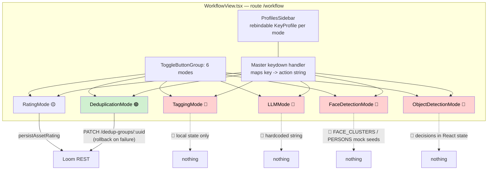
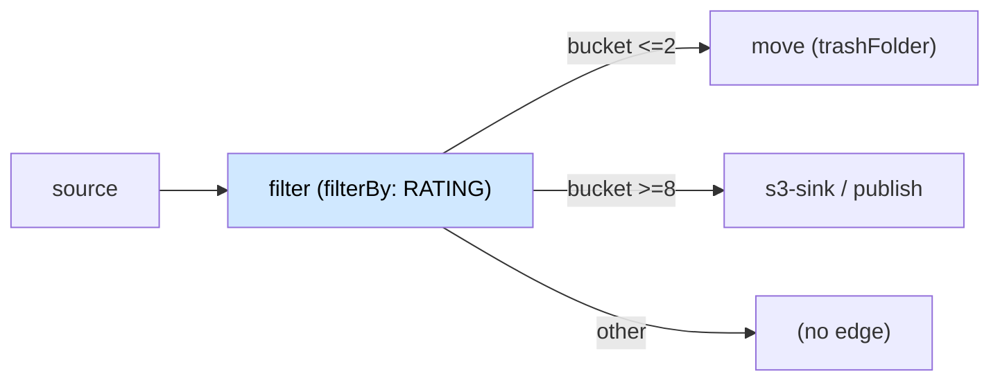

# Workflows — Index and Family Definition

> **Audience: AI coding agents and humans.** This file is the **router** for `spec/workflows/`. It
> defines what a *workflow* is in MetaLoom, records the anatomy every workflow shares, catalogues the
> twelve workflow specs, and lists the defects and gaps that are common to all of them rather than
> repeated in each file.

Status legend: 🟢 built · 🟡 partly built · 🔵 plan/concept, not built · 🔴 defect or blocker · ⚪ stub.

**Entry point for the whole spec tree**: [../METALOOM_CONTEXT.md](../METALOOM_CONTEXT.md). Rules that
bind a change: [../guidelines/CODING.md](../guidelines/CODING.md),
[../guidelines/NEW_NODE.md](../guidelines/NEW_NODE.md),
[../guidelines/SPEC_RULES.md](../guidelines/SPEC_RULES.md).

---

## 0. What a workflow is (and is not)

A **workflow** is a loop in which a machine produces a *proposal* and a human *decides*, at bulk
speed, and the decision changes what the system does next.

```
pipeline node          Loom                 human                    consequence
────────────           ────                 ─────                    ───────────
produces a       →     persists it     →    confirms / rejects  →    a second node acts,
proposal               with a review        in a keyboard-           or the decision becomes
                       status               driven review UI         queryable state
```

Three properties distinguish a workflow from a plain feature:

1. **A queue.** There is a set of pending items, and reviewing one is cheap and repetitive. The unit
   of work is a keystroke, not a form submission.
2. **A durable decision.** The decision outlives the session and is readable by something other than
   the screen that produced it — a node, a filter, a search query, an export gate.
3. **An asymmetry between proposing and applying.** Discovery is cheap and reversible; applying is
   expensive or destructive. The human sits at the seam. `fingerprint-dedup` (proposes) and
   `fingerprint-dedup-apply` (acts only on `CONFIRMED`) are the canonical shape —
   [WORKFLOW_DEDUP.md](WORKFLOW_DEDUP.md) §2.

### 0.1 What is deliberately not a workflow

| Not a workflow | Why | Where it lives |
|---|---|---|
| **Chat / the Loom Agent** | A conversation is not a queue and produces no per-item decision. It is a different interaction model that happens to touch the same data. It has its own spec family already | [../loom/ui/CHAT.md](../loom/ui/CHAT.md), [../features/chat/](../features/chat/) |
| **The pipeline editor** | Authoring a graph is a design activity, not a review queue | [../loom/ui/LOOM_UI_PIPELINE_EDITOR.md](../loom/ui/LOOM_UI_PIPELINE_EDITOR.md) |
| **Search** | A query is not a decision. Search *feeds* workflows (it is how a queue gets scoped) but reviewing results is not itself a workflow | [../features/search/SEARCH.md](../features/search/SEARCH.md) |
| **Admin / RBAC** | Low-volume configuration, not bulk review | [../features/permissions/PERMISSIONS.md](../features/permissions/PERMISSIONS.md) |

Chat was raised as a candidate and is explicitly rejected here so the question is not reopened: it is
a **topic of its own**, not a workflow. Where chat *drives* a workflow — "reject every cluster with
fewer than three faces" — that is the agent calling the same REST surface a human would, and it
belongs in the agent's tool inventory, not in a workflow spec.

---

## 1. The workflow catalogue

Twelve workflows. The first six were named as needed work; the last six are proposals sized from
simple to very complex, each grounded in capabilities that already exist in the tree.

| # | Workflow | Spec | Status | One line |
|---|---|---|---|---|
| 1 | **Manual sorting** | [WORKFLOW_MANUAL_SORT.md](WORKFLOW_MANUAL_SORT.md) | 🟡 | Tab through assets, assign a rating and tags. Rating persists; 🔴 tagging does not |
| 2 | **Deduplication** | [WORKFLOW_DEDUP.md](WORKFLOW_DEDUP.md) | 🟢 | Confirm or reject near-duplicate groups; apply moves the losers. **The reference implementation of the whole family — copy this one** |
| 3 | **Auto trash** | [WORKFLOW_TRASH.md](WORKFLOW_TRASH.md) | 🔵 | A decision marks an asset for disposal; a `move` node relocates the bytes. Needs a new node |
| 4 | **Face clusters** | [WORKFLOW_FACE.md](WORKFLOW_FACE.md) | 🟡 | Detect → embed → cluster → confirm a person. Detect and embed run; 🔴 clustering does not exist |
| 5 | **Object detection review** | [WORKFLOW_OBJECT_DETECT.md](WORKFLOW_OBJECT_DETECT.md) | 🔴 | Confirm or reject YOLO boxes. 🔴 `detection` has no status column, so no decision can be stored |
| 6 | **Upload** | [WORKFLOW_UPLOAD.md](WORKFLOW_UPLOAD.md) | 🟢 | What happens to a file after it lands: `asset.created` → mime match → auto pipeline run |
| 7 | **AI output review** (simple) | [WORKFLOW_AI_REVIEW.md](WORKFLOW_AI_REVIEW.md) | 🔵 | Approve, edit or reject machine-written text: captions, transcripts, translations, descriptions |
| 8 | **Collection curation** (simple) | [WORKFLOW_COLLECTION_CURATION.md](WORKFLOW_COLLECTION_CURATION.md) | 🔵 | Build a collection from a search result at keyboard speed; in/out/skip |
| 9 | **Metadata repair** (medium) | [WORKFLOW_METADATA_REPAIR.md](WORKFLOW_METADATA_REPAIR.md) | 🔵 | Find assets with missing or contradictory dates, GPS and rights; fix them in bulk |
| 10 | **Safety triage** (medium) | [WORKFLOW_SAFETY_TRIAGE.md](WORKFLOW_SAFETY_TRIAGE.md) | 🔵 | The `guard` node flags content; a human upholds or overturns; upheld content is quarantined |
| 11 | **Ingest migration** (complex) | [WORKFLOW_INGEST_MIGRATION.md](WORKFLOW_INGEST_MIGRATION.md) | 🔵 | Onboard a large existing corpus: scan, hash, dedup, verify, reconcile, tier |
| 12 | **Rights and release** (very complex) | [WORKFLOW_RIGHTS_RELEASE.md](WORKFLOW_RIGHTS_RELEASE.md) | 🔵 | The gate before an asset leaves the system: consent, safety, licence, AI provenance, redaction |

Actionable work items for all twelve: [../tasks/WORKFLOW_TASKS.md](../tasks/WORKFLOW_TASKS.md).

---

## 2. The one screen they all share

Every human-facing workflow above is a **mode of one React component**:
`loom-ui/src/features/workflow/WorkflowView.tsx` (1038 lines), route `/workflow`, registered in
`layout/AppShell.tsx:65`, sidebar entry `layout/Sidebar.tsx:83`.



🔴 **Read that diagram as the headline finding of this spec family: of six shipped modes, two write
anything to the server.** The screen, the keyboard layer, the rebindable profiles and the fullscreen
mode are all real and reusable. What is missing is, in almost every remaining case, the write path
and the column it would write to — not the UI.

🟢 **Dedup is the one to copy.** It is the only mode where the decision is *server state*: the queue
comes from `GET /dedup-groups?status=PENDING`, the chip renders `group.status` from the PATCH
response rather than a local map, and a failed write visibly rolls back. Any mode being wired next
should follow that shape rather than adding a second `Record<id, decision>`.

### 2.1 The keyboard layer (🟢 built, and worth keeping)

| Concept | Where | Notes |
|---|---|---|
| `WorkflowMode` | `WorkflowView.tsx:63` | `"rating" \| "tagging" \| "deduplication" \| "facedetection" \| "objectdetection" \| "llm"` |
| `KeyProfile` / `KeyAction` | `:65-77` | `{ key, label, action, param? }` — a profile is a named binding set scoped to one mode |
| `DEFAULT_PROFILES` | `:109-199` | Six profiles, one per mode |
| Master handler | `:873-910` | Resolves `e.key` → binding → a `switch` over ~19 action strings |
| Rebinding | `ProfilesSidebar`, `:636-650` | Click a binding, press a key. `Backspace` unbinds |
| Fullscreen | `:826-833` | `f` toggles; collapses both sidebars |

🔴 **Profiles are not persisted.** `useState(DEFAULT_PROFILES)` — a rebind is lost on reload. There is
no `key_profile` table, no REST route and no `localStorage` write. Every workflow inherits this.

### 2.2 Where the modes get their queue

| Mode | Queue source | Reality |
|---|---|---|
| rating, tagging, llm | `listAssets(token, { limit: PAGE_SIZE })`, first 20 | 🔴 Not a queue — the first page of all assets, unfiltered, unsorted, unpaged past 20 |
| deduplication | `listDedupGroups(token, { status: "PENDING", limit: PAGE_SIZE })` | 🟢 A real queue: only items awaiting a decision, and a decided one never comes back. One page, no "load more" yet |
| facedetection | `listAssetDetections` where `type === "facedetection"` | 🔴 `FacedetectNode` writes `type = "face"` — see §4 |
| objectdetection | `listAssetDetections` where `type === "objectdetection"` | 🟢 Type matches. 🔴 the label does not — see §4 |

---

## 3. The anatomy a new workflow must implement

When adding a workflow, these are the seven pieces. A workflow missing any one of them is not
finished, and the reason each existing workflow is incomplete is always traceable to a specific row.

| # | Piece | Reference implementation | Where it lives |
|---|---|---|---|
| 1 | **A proposal producer** | `FingerprintDedupNode` | `cortex/nodes/<kind>/` — [../guidelines/NEW_NODE.md](../guidelines/NEW_NODE.md) |
| 2 | **A review record with a status** | `dedup_group.status` (`PENDING`/`CONFIRMED`/`REJECTED`) | `loom/db/flyway/.../V2.61__add_dedup_group.sql` |
| 3 | **Machine-writable audit columns** | `V2.47` — nullable `creator_uuid`, `node_kind`, `node_id`, `producer_version` | 🔴 A Cortex worker is not a `user`. A `NOT NULL creator_uuid` makes the table unwritable by a node |
| 4 | **An idempotency key** | `(asset, node_kind, frame_number, detection_index)` (`V2.43`) | Without it a re-run appends a second full set |
| 5 | **A decision endpoint + permission** | `PATCH /api/v1/dedup-groups/:uuid`, `UPDATE_DEDUP` | `loom/services/rest/.../endpoint/impl/` |
| 6 | **A mode in `WorkflowView`** | `RatingMode` + `ratingPersistence.ts` | `loom-ui/src/features/workflow/` |
| 7 | **A consumer of the decision** | `FingerprintDedupApplyNode` — reads only `CONFIRMED` | A decision nothing reads is a UI preference, not a workflow |

Piece 7 is the one most often skipped, and it is what the "how is this useful?" question in the manual
sorting brief is really asking. See §5.

---

## 4. Cross-cutting defects

These are real, verified at `21e8a8cd`, and shared by more than one workflow. Each is a task in
[../tasks/WORKFLOW_TASKS.md](../tasks/WORKFLOW_TASKS.md).

| # | Defect | Evidence | Hits |
|---|---|---|---|
| X1 | 🔴 **Detection type-string mismatch.** `FacedetectNode.persist` writes `setType("face")`; the UI filters `d.type === "facedetection"` | `FacedetectNode.java:510` vs `WorkflowView.tsx:780`. The DB column comment says `facedetection` | Face, and any future face consumer |
| X2 | 🔴 **`DetectionResponse` in the UI has no `label` field.** The Java DTO and the `detection.label` column (V2.43) both have one; the TypeScript interface does not, so `ObjectDetectionMode` falls back to `(d.meta)?.label` — always undefined — and shows the literal `objectdetection` for every box | `loom-ui/src/api/detections.ts:4-20` vs `DetectionResponse.java:19` and `ObjectDetectNode.java:571` | Object detect, scene layout |
| X3 | 🔴 **`detection` has no review status.** No column, no enum, no endpoint. Confirming a box has nowhere to go | `V2.27` + `V2.43` DDL | Object detect, face (per-detection), safety triage |
| X4 | 🔴 **`cluster.creator_uuid` is `NOT NULL`.** `V2.47` relaxed this for `detection`, `embedding` and the comp tables and skipped `cluster`, so a worker cannot insert one | `V2.12__add_embedding.sql`; `V2.47` has no `cluster` statement | Face, and any future clustering workflow |
| X5 | 🔴 **Key profiles are not persisted.** Rebinding is lost on reload | `WorkflowView.tsx:742` | All six modes |
| X6 | 🔴 **No queue.** Every mode reviews "the first 20 assets" rather than "the items that need a decision". No `?needsReview=` filter exists on any list endpoint | `WorkflowView.tsx` | 🟢 **Except dedup**, whose review record has a `status` column and whose list route filters on it. That is the shape the other five need |
| X7 | 🔴 **No progress or resumption.** Nothing records that asset N was reviewed, so a session cannot be resumed and two reviewers cannot split a queue | — | All six. 🟡 Dedup is closest: a decided group leaves the PENDING queue, so a reload resumes where you were — but two reviewers still race on the same page |
| X8 | ⚠️ **Ratings are stored as reactions with a marker type.** `persistAssetRating` writes `type: "SATISFIED"` because the endpoint requires a non-null type; `reaction` has `UNIQUE (creator_uuid, type, asset_uuid)`, so a real 🤣 reaction and a star rating are the same row | `ratingPersistence.ts:17`, `V2.17__add_social.sql` | Manual sort, curation |
| X9 | ⚠️ **`tag_asset` provenance is written but never surfaced.** `V2.71` added `node_kind`/`confidence`/`creator_uuid` precisely so machine tags are distinguishable from curated ones; no UI reads them | `V2.71__tag_asset_placements.sql` | Manual sort, AI review |
| X10 | 🟡 **Almost no workflow has customer docs.** [../guidelines/CODING.md](../guidelines/CODING.md) requires one for a customer-facing feature | `docs/ui/index.adoc` §Reviewing Duplicates is the first and so far only one | All except dedup |

---

## 5. Closing the loop: what a decision is good for

The manual-sorting brief asks the right question — *what can act on a rating or a tag?* As of
2026-08-08 a pipeline can, which is what task W1 delivered. The rest of the row is still open.

| Consumer | Can it read a human decision today? |
|---|---|
| `filter` node | 🟢 **Yes.** `FilterBy.RATING` and `FilterBy.TAG` landed 2026-08-08 (task W1). No `REVIEW_STATE` strategy — `detection` still has no review status column (W5) |
| `tag` node | 🟡 It *writes* tags from rules over wired ports; it does not read a human decision as an input |
| `script` node | 🟢 GraalJS can call out, so anything is reachable — at the cost of putting policy in a script |
| Lexical search | 🟡 `search_document` is fed by triggers; tags are searchable, ratings are not |
| Pipeline trigger | 🔴 `PipelineMatcher` matches on **mime type only** — a rating cannot start a run |

**This was the single highest-leverage change in the family, and it is done.** `FilterBy` was
designed as exactly this seam. A manual decision is now routable: rated ≤2 goes down one branch,
tagged `hero` down another, and [WORKFLOW_TRASH.md](WORKFLOW_TRASH.md) no longer needs invention for
its input. Task W1 in [../tasks/WORKFLOW_TASKS.md](../tasks/WORKFLOW_TASKS.md).

Two details worth carrying into any workflow that reads a decision back. `FilterBy.RATING` averages
across reviewers, so an asset can change branch between runs without anybody changing their mind. And
"we could not read the ratings" is kept distinct from "nobody rated it" — collapsing them would send
the whole un-reviewed backlog down the trash branch during a Loom outage.



---

## 6. Configuration

No workflow reads an environment variable of its own. The variables that gate workflow *capability*
belong to the subsystems they sit on:

| Variable | Default | Which workflow it gates |
|---|---|---|
| `LOOM_SIMILARITY_ENABLED` | off | Dedup — without it `NoopSimilarityIndex` is bound and discovery finds nothing ([SEARCH_LUCENE.md](../loom/SEARCH_LUCENE.md)) |
| `LOOM_SEARCH_ENABLED` / `_PROVIDER` | off / — | Curation and metadata repair — the queue is a search result; off ⇒ 503 |
| `LOOM_AI_ENABLED` / `_PROVIDER_TYPE` / `_URL` / `_MODEL_ID` | — | AI review — the producer side of the queue |
| `CORTEX_NODE_WHITELIST` / `_BLACKLIST` | — | Any workflow whose producer node is disabled on the only online worker. A run whose kinds have no worker is rejected with **503** naming them |

Full lists: [../loom/CONFIGURATION.md](../loom/CONFIGURATION.md),
[../cortex/CONFIGURATION.md](../cortex/CONFIGURATION.md).

---

## 7. Test Setup

Two of the six modes are tested.

| Test | Covers | Command |
|---|---|---|
| `loom-ui/src/features/workflow/ratingPersistence.test.ts` (node-env vitest) | `persistAssetRating` create-vs-update, `hydrateAssetRatings` per-asset failure tolerance | `cd loom-ui && ./node_modules/.bin/vitest run src/features/workflow/ratingPersistence.test.ts` |
| `loom-ui/e2e/workflow-rating-mocked.spec.ts` (mocked Playwright) | The rating mode renders and the star value updates | `cd loom-ui && ./node_modules/.bin/playwright test e2e/workflow-rating-mocked.spec.ts` |
| `loom-ui/src/features/workflow/dedupGroups.test.ts` (17) | KEEP precedence, completeness, size formatting, and that reassigning a keep repeats the current status instead of deciding the group | `./node_modules/.bin/vitest run src/features/workflow/` |
| `loom-ui/e2e/workflow-dedup-mocked.spec.ts` (6) | The queue renders from the API; `Y`/`N` PATCH the right group; **a failed PATCH reverts the chip**; make-keep sends `keepAssetUuid`; an empty queue says so | `./node_modules/.bin/playwright test e2e/workflow-dedup-mocked.spec.ts` |
| — **missing** — | Tagging, faces, objects, llm. No keyboard-handler test; no profile-rebinding test | — |

> The dedup rollback test is the one worth copying: it mocks the PATCH to 500 and asserts the chip is
> **gone** afterwards. Any mode that writes optimistically needs that assertion, or the failure it
> guards against is invisible.

Conventions that apply to every workflow test:

- loom-ui component tests are **mocked Playwright e2e specs**, not RTL/jsdom. Pure logic (like
  `ratingPersistence`) uses node-env vitest.
- ⚠️ `npx` stalls in this sandbox — call `./node_modules/.bin/{vitest,playwright}` directly.
- ⚠️ A Playwright `role`+`name` match is a **substring** match; pass `exact: true` when a new label
  could shadow an existing one.
- Backend: `./setup-pool.sh` before any DAO or endpoint test, and again after **any** Flyway change —
  install `loom/db/flyway` first or the pool silently skips the new migration.
- Grant test permissions via **group + role**, never a direct `user_permission` grant (one direct
  grant per user; `SkillEndpointTest` is the pattern).

---

## 8. Key Classes Reference

| Class / file | Package or path | Purpose |
|---|---|---|
| `WorkflowView` | `loom-ui/src/features/workflow/WorkflowView.tsx` | The one screen; six modes, keyboard layer, profile sidebar |
| `ratingPersistence` | `loom-ui/src/features/workflow/ratingPersistence.ts` | The only mode with a write path |
| `DedupGroupEndpointService` | `io.metaloom.loom.rest.service.impl` | The reference decision endpoint (`PATCH` status, server-side upsert) |
| `FingerprintDedupNode` / `FingerprintDedupApplyNode` | `io.metaloom.cortex.node.dedup` | The reference propose/apply split |
| `AssetPipelineTrigger` | `io.metaloom.loom.rest.service.impl` | `asset.created` → auto pipeline run ([WORKFLOW_UPLOAD.md](WORKFLOW_UPLOAD.md)) |
| `PipelineMatcher` | same | Mime-pattern trigger matching out of `PipelineVersion.meta.trigger` |
| `FilterNode` / `FilterBy` / `FilterStrategy` | `io.metaloom.cortex.node.filter` | The seam that would let a decision route a graph (§5) |
| `TagNode` / `TagBy` / `TagRule` | `io.metaloom.cortex.node.tag` | Declarative machine tagging; the write path human tagging should share |
| `FacedetectNode` | `io.metaloom.cortex.node.facedetect` | Writes `detection` + `embedding`; source of defect X1 |
| `ObjectDetectNode` | `io.metaloom.cortex.node.objectdetect` | Writes `detection` with a real `label` column; source of defect X2 |
| `GuardNode` | `io.metaloom.cortex.node.guard` | Safety verdicts ([WORKFLOW_SAFETY_TRIAGE.md](WORKFLOW_SAFETY_TRIAGE.md)) |
| `AbstractMediaNode` | `io.metaloom.cortex.common.node` | `recordNodeResult` / `resultRef` — the ledger every producer writes |

---

## 9. Conventions and Gotchas

| Area | Gotcha |
|---|---|
| **Propose and apply are two nodes** | 🔴 Never let a discovery node move, delete or overwrite anything, and never let an apply node act on `PENDING` or `REJECTED`. The dedup pair is the shape to copy |
| **A worker is not a user** | 🔴 Any table a node writes needs **nullable** `creator_uuid`/`editor_uuid` plus `node_kind`/`node_id`/`producer_version` (`V2.47` is the precedent). `cluster` still fails this — defect X4 |
| **Snapshots are hints, not authority** | ⚠️ Values captured at discovery time (`dedup_group_member.size`, a confidence, a thumbnail) exist for the reviewer. The applying node must re-verify against live state |
| **Upsert keys, not appends** | ⚠️ Every proposal table needs an idempotency key or a re-run doubles the queue. Note the known limit: the `detection` key omits `node_id`, so two instances of one kind in a graph overwrite each other, and a re-run that finds fewer items leaves the higher-indexed rows behind |
| **`ctx.failure(...).next()` returned SUCCESS** | 🟢 Fixed 2026-08-18: `next()` honours a recorded failure cause, and `FailurePathGuardTest` (`cortex/api`) fails the build on the chained shape. Still write `ctx.failure(msg).abort()` in a workflow producer — a failed proposal reported as a good one is exactly what this cost |
| **Emoji reactions carry ratings** | ⚠️ Defect X8 — do not add a second rating mechanism without deciding what happens to the reaction rows already written |
| **Tag placements are per-region** | ⚠️ Since `V2.71`, `tag_asset` has its own `uuid` and a `UNIQUE NULLS NOT DISTINCT (tag, asset, time_from, time_to, areaStartX, areaStartY)`. Removing "the tag" and removing "this placement" are different operations |
| **`POST` creates and updates** | ⚠️ Everywhere in the REST API. `PATCH`/`PUT` exist only on User, Group and Asset |
| **Migration numbering** | 🔴 `V2.77` is the highest at `21e8a8cd`. Check before claiming a version — two workflow specs proposing "the next migration" will collide |
| **Node module rebuilds** | ⚠️ Install `cortex/processor` before a CLI build, install the node module **before** regenerating `node-descriptors.json`, and clean-rebuild `loom/core` after an endpoint constructor change or setup-pool fails with `NoSuchMethodError` |

---

## 10. Where do I find …?

| Need | Look here |
|---|---|
| The workflow screen | `loom-ui/src/features/workflow/WorkflowView.tsx` |
| The one working write path | `loom-ui/src/features/workflow/ratingPersistence.ts` |
| Workflow i18n strings | `loom-ui/src/i18n/locales/{en,de}.json` → key `workflow.*` |
| Route + sidebar registration | `loom-ui/src/layout/AppShell.tsx:65`, `loom-ui/src/layout/Sidebar.tsx:83` |
| The reference review record | `loom/db/flyway/.../V2.61__add_dedup_group.sql` |
| The reference decision endpoint | `loom/services/rest/.../endpoint/impl/DedupGroupEndpoint.java` |
| Machine-written audit columns | `loom/db/flyway/.../V2.47__machine_written_audit_columns.sql` |
| Tag placement + provenance | `loom/db/flyway/.../V2.71__tag_asset_placements.sql` |
| The node system and per-node reference | [../features/nodes/NODES.md](../features/nodes/NODES.md) |
| Typed ports, cardinality, fan-out | [../features/nodes/NODE_DATA_TYPES.md](../features/nodes/NODE_DATA_TYPES.md) |
| What travels between nodes | [../features/pipeline/PIPELINE_FLOW.md](../features/pipeline/PIPELINE_FLOW.md) |
| Adding a node at all | [../guidelines/NEW_NODE.md](../guidelines/NEW_NODE.md) |
| Definition of done for a code change | [../guidelines/CODING.md](../guidelines/CODING.md) |
| Open workflow work items | [../tasks/WORKFLOW_TASKS.md](../tasks/WORKFLOW_TASKS.md) |
| UI gap tasks by entity | [../loom/ui/TASK_UI_AI_ML.md](../loom/ui/TASK_UI_AI_ML.md), [../loom/ui/TASK_UI_ORGANIZATION.md](../loom/ui/TASK_UI_ORGANIZATION.md) |

---

## 11. Progress Assessment

### The shared platform

- [x] `/workflow` route, sidebar entry, six-mode toggle, fullscreen
- [x] Keyboard layer: `KeyProfile`, `DEFAULT_PROFILES`, master handler, click-to-rebind
- [x] i18n for all six modes (`en` + `de`)
- [x] One real write path (`ratingPersistence`) with a unit test and a mocked e2e spec
- [ ] 🔴 Persist key profiles (defect X5)
- [ ] 🔴 A real queue: a `?needsReview=` / status filter per workflow instead of "first 20 assets" (X6)
- [ ] 🔴 Progress and resumption; two reviewers splitting one queue (X7)
- [ ] 🔴 Customer docs under `website/content/english/docs` (X10)
- [ ] Mocked Playwright e2e for the four still-unwired modes (dedup and rating have one)

### The loop-closing change

- [ ] 🔴 `FilterBy.TAG` and `FilterBy.RATING` strategies (§5) — unblocks trash, publish routing and
      every "act on a human decision" requirement in this family

### Per workflow

- [x] 6 — Upload: built end to end ([WORKFLOW_UPLOAD.md](WORKFLOW_UPLOAD.md))
- [x] 2 — Dedup: built end to end, and the reference for the family ([WORKFLOW_DEDUP.md](WORKFLOW_DEDUP.md))
- [ ] 1 — Manual sort: tagging write path, rating storage decision ([WORKFLOW_MANUAL_SORT.md](WORKFLOW_MANUAL_SORT.md))
- [ ] 3 — Trash: the `move` node does not exist ([WORKFLOW_TRASH.md](WORKFLOW_TRASH.md))
- [ ] 4 — Face: clustering does not exist ([WORKFLOW_FACE.md](WORKFLOW_FACE.md))
- [ ] 5 — Object detect: `detection` has no status column ([WORKFLOW_OBJECT_DETECT.md](WORKFLOW_OBJECT_DETECT.md))
- [ ] 7-12 — Proposals; each spec carries its own build order

### This file

- [x] All twelve workflows catalogued and routed
- [x] Chat explicitly excluded, with the reason recorded (§0.1)
- [x] Ten cross-cutting defects verified against source at `21e8a8cd`, not inherited from older specs
- [x] The propose/apply anatomy extracted once (§3) instead of repeated per file

---

_Git HEAD revision: `d4e9134f`_
_Last updated: 2026-08-18 (§Conventions — the `ctx.failure(...).next()` defect is fixed tree-wide, with a `FailurePathGuardTest` build guard). Earlier: 2026-08-08 (dedup wired end to end — §2 diagram, §2.2 queue sources, X6/X7/X10 and §7
updated; dedup is now the reference implementation the other five modes should copy)_
